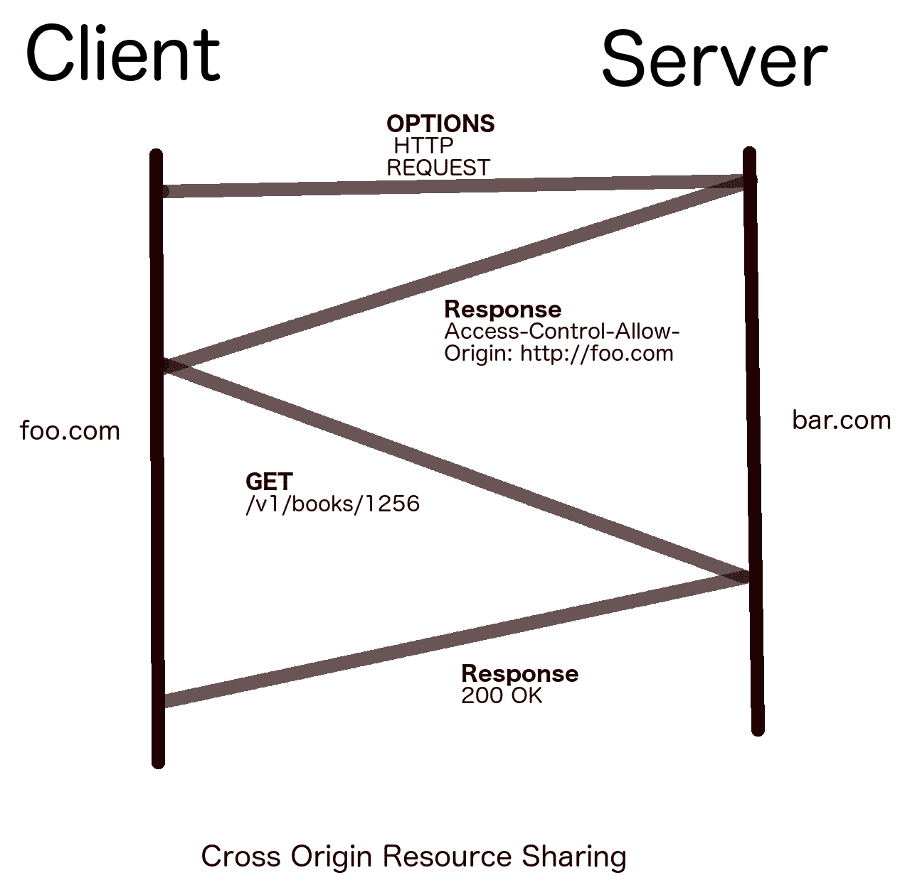
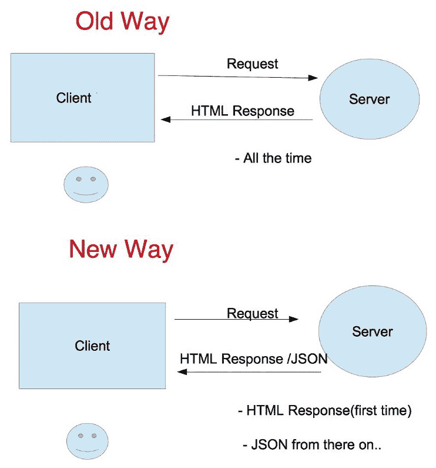
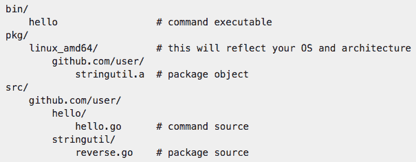
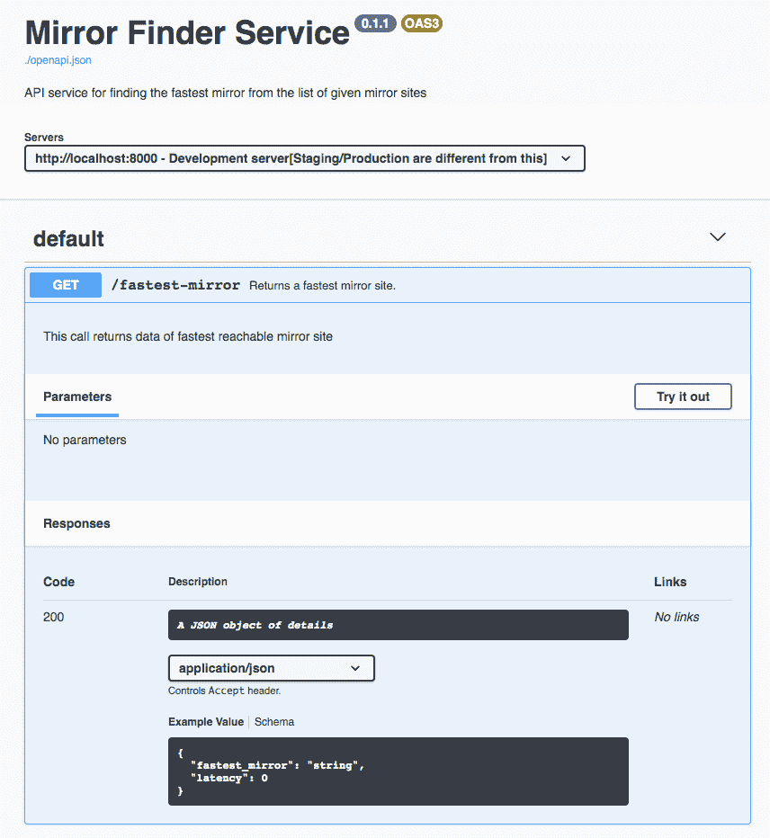

# 开始使用 REST API 开发

网络服务是在各种计算机系统之间定义的一种通信机制。没有网络服务，定制的对等通信会变得繁琐且与平台相关。网络需要理解和解释以协议形式存在的上百种不同事物。如果计算机系统能够与网络可以轻松理解的协议对齐，这将大有裨益。

网络服务是一种软件系统，旨在支持通过网络进行可互操作的机器到机器交互，这是由万维网联盟（**World Wide Web Consortium，W3C**）在[`www.w3.org/TR/ws-arch/`](https://www.w3.org/TR/ws-arch/)定义的。

简单来说，一个网络服务是两个端点之间的一条道路，消息在这里可以顺畅地传输。消息传输通常是单向的。两个独立的可编程实体也可以通过它们自己的 API 相互通信。两个人通过语言交流，两个应用程序通过**应用程序编程接口（Application Programming Interface，API**）交流。

读者可能会想，在当前的数字世界中，API 的重要性是什么？物联网（**Internet of Things，IoT**）的兴起使得 API 的使用比以前更加频繁。对 API 的认识每天都在增长，每天都有数百个 API 在全球范围内被开发和记录。值得注意的主要企业都看到了**API 即服务（API as a Service，AaS**）的未来。一个最近的亮点例子是**亚马逊网络服务（Amazon Web Services，AWS**）。AWS 在云世界中取得了巨大的成功。开发者使用 AWS 提供的**表示状态转移（Representational State Transfer，REST**）API 编写自己的应用程序，并通过**命令行界面（Command-Line Interface，CLI**）访问它。

一些隐藏的使用案例来自像[`Booking.com`](http://Booking.com)和[`www.expedia.com/`](https://www.expedia.com/)这样的旅行网站，它们通过调用第三方网关和数据供应商的 API 来获取实时价格。如今，网络服务的使用通常按数据请求量收费。

在本章中，我们将关注以下主题：

+   可用的不同网络服务

+   详细介绍 REST 架构

+   基于 REST 的**单页应用程序（Single-page applications，SPAs**）的兴起

+   设置 Go 项目并运行开发服务器

+   构建我们的第一个服务，从全球托管的 Debian 服务器列表中找到最快的镜像站点

+   开放 API 规范和 Swagger 文档

# 技术要求

以下是在本章中运行代码示例之前应预先安装的软件组件：

+   操作系统：Linux（Ubuntu 18.04）/ Windows 10/Mac OS X >=10.13

+   软件：Docker >= 18（适用于 Windows 和 Mac OS X 的 Docker Desktop）

+   Go 编译器的最新版本 == 1.13.5

本书使用 Docker 运行几个沙盒环境。Docker 是一个虚拟化平台，它在一个沙盒中模仿操作系统。使用它，我们可以干净地运行应用程序或服务，而不会影响宿主系统。

你可以在本书的 GitHub 仓库中找到本章使用的代码，网址为 [`github.com/PacktPublishing/Hands-On-Restful-Web-services-with-Go/tree/master/chapter1`](https://github.com/PacktPublishing/Hands-On-Restful-Web-services-with-Go/tree/master/chapter1)。

# Web 服务的类型

随着时间的推移，已经演变出许多类型的 Web 服务。其中一些较为突出的如下：

+   **简单对象访问协议**（**SOAP**）

+   **通用描述、发现和集成**（**UDDI**）

+   **Web 服务描述语言**（**WSDL**）

+   **表征状态转移**（**REST**）

在这些中，SOAP 在 2000 年代初变得流行，当时 XML 正在经历高潮。XML 数据格式被各种分布式系统用于相互通信。

一个 `SOAP` 请求通常由这三个基本组件组成：

+   封装

+   标头

+   主体

仅为了执行 HTTP 请求和响应周期，我们不得不在 SOAP 中附加大量额外的数据。一个针对虚构的图书服务器 `www.example.org` 的示例 SOAP 请求看起来如下：

```go
POST /Books HTTP/1.1
Host: www.example.org
Content-Type: application/soap+xml; charset=utf-8
Content-Length: 299
SOAPAction: "https://www.w3.org/2003/05/soap-envelope"

<?xml version="1.0"?>
<soap:Envelope  >
  <soap:Header>
  </soap:Header>
  <soap:Body>
    <m:GetBook>
      <m:BookName>Alice in the wonderland</m:BookName>
    </m:GetBook>
  </soap:Body>
</soap:Envelope>
```

这是一个获取图书数据的 SOAP 请求的标准示例。如果我们仔细观察，它是以 XML 格式编写的，带有特殊的标签来指定封装和主体。由于 XML 通过定义大量的命名空间来工作，因此响应会变得庞大。

SOAP 的主要缺点是它对于实现 Web 服务来说过于复杂，并且是一个重量级的框架。一个 SOAP HTTP 请求可能会变得非常大，并可能导致带宽浪费。专家们寻找了一个简单的替代方案，于是出现了 REST。在下一节中，我们将简要讨论 REST。

# REST API

**表征状态转移**（**REST**）这个名称是由加州大学的 Roy Fielding 提出的。与 SOAP 相比，它是一个非常简化和轻量级的 Web 服务。性能、可扩展性、简单性、可移植性和灵活性是 REST 设计背后的主要原则。

REST API 允许不同的系统以非常简单的方式通信和发送/接收数据。每个 REST API 调用都与 HTTP 动词和 URL 之间有一个关系。应用程序数据库中的资源可以与 REST 架构中的 API 端点相对应。

当你在手机上使用移动应用时，你的手机可能在与许多云服务进行通信，以检索、更新或删除你的数据。REST 服务对我们日常生活有着巨大的影响。

REST 是一种无状态、可缓存且简单的架构，它不是一个协议，而是一种模式。这种模式允许不同的端点通过 HTTP 互相通信。

# REST 服务的特性

这些是使 REST 相比其前辈简单且独特的最主要属性：

+   **基于客户端-服务器架构**：这种架构对于现代网络通过 HTTP 进行通信至关重要。单个客户端-服务器最初可能看起来很天真，但许多混合架构正在演变。我们很快会讨论更多这些内容。

+   **无状态**：这是 REST 服务最重要的特性。一个 REST HTTP 请求包含了服务器理解并返回响应所需的所有数据。一旦请求被处理，服务器不会记住请求是否在一段时间后到达。因此，操作将是无状态的。

+   **可缓存**：为了良好地扩展应用程序，我们需要缓存某些响应。REST 服务可以被缓存以提高吞吐量。

+   **资源的表示**：REST API 提供了统一的接口来进行通信。它使用**统一资源标识符**（**URI**）将资源（数据）进行映射。它还有请求特定数据的优势

+   **实现自由度**：REST 只是定义你的 Web 服务的一种机制。它是一种可以以多种方式实现的架构风格。正因为这种灵活性，你可以以你希望的方式创建 REST 服务。只要它遵循 REST 的原则，你就有权选择你的服务器平台或技术。

考虑周到的缓存对于 REST 服务的扩展至关重要。

我们已经看到了 Web 服务的类型，并了解了什么是 REST API。我们还探讨了使 REST 服务独特的特性。在下一节中，我们将探讨 REST 动词和状态码，并介绍一些路径参数的示例。

# REST 动词和状态码

REST 动词指定对特定资源或一组资源要执行的操作。当客户端发起请求时，它应该在 HTTP 请求中发送以下信息：

+   REST 动词

+   头部信息

+   主体（可选）

如我们之前所述，REST 使用 URI 来解码要处理的数据资源。有相当多的 REST 动词可用，但其中六个被特别频繁地使用。它们及其预期的操作如下表所示：

| **REST 动词** | **操作** |
| --- | --- |
| `GET` | 从服务器获取记录或一组资源 |
| `OPTIONS` | 获取所有可用的 REST 操作 |
| `POST` | 创建资源或一组新资源 |
| `PUT` | 更新或替换指定的记录 |
| `PATCH` | 修改指定的记录 |
| `DELETE` | 删除指定的资源 |

这些操作的状态可以通过 HTTP 状态码得知。每当客户端发起一个 REST 操作时，由于 REST 是无状态的，客户端应该知道一种方式来找出操作是否成功。因此，HTTP 响应有一个状态码。REST 为特定操作定义了几种标准状态码类型。这意味着 REST API 应该严格遵循以下规则，以在客户端-服务器通信中实现稳定的结果。根据错误类型，有三个重要的范围可用。请参阅以下表格以了解错误范围：

| **状态码类型** | **数字范围** | **操作** |
| --- | --- | --- |
| `成功` | 200 - 226 | 2xx 系列用于成功响应。 |
| `Error` | 400 - 499 (客户端), 500 - 599 (服务器) | 4xx 系列用于指示客户端错误。5xx 用于指示服务器无法处理请求。 |
| `Redirect` | 300 - 308 | 3xx 系列用于 URL 重定向。 |

每个状态码的作用非常精确地定义，并且每年代码的总数都在增加。我们将在下一节中提到重要的那些。

所有对 REST 服务的请求都具有以下格式。它由主机和 API 端点组成。API 端点是服务器预先定义的 URL 路径。它还可以包含可选的查询参数。

一个简单的 REST API URI 看起来如下：`http://HostName/APIEndpoint/?key=value(可选)`

让我们更详细地看看所有的动词。REST API 设计始于定义操作和 API 端点。在实现 API 之前，设计文档应该列出给定资源的所有端点。

在下一节中，我们仔细观察了 REST API 端点，以 PayPal 的 REST API 作为用例。

# GET

`GET`方法从服务器获取指定的资源。为了指定资源，`GET`使用几种类型的 URI 查询：

+   查询参数

+   基于路径的参数

如果你不知道，你大部分的网页浏览都是通过向服务器执行`GET`请求来完成的。例如，如果你输入[www.google.com](http://www.google.com)，你实际上是在向服务器发送一个`GET`请求以获取搜索页面。在这里，你的浏览器是客户端，而 Google 的 Web 服务器是 Web 服务的后端实现者。成功的`GET`操作返回`200`状态码。

# 路径参数的示例

每个人都知道**PayPal**。PayPal 与公司建立账单协议。如果你通过 PayPal 注册支付系统，他们将为你提供用于所有账单需求的 REST API。获取账单协议信息的示例`GET`请求如下：`/v1/payments/billing-agreements/agreement_id`。

在这里，资源查询是与路径参数一起的。当服务器看到这一行时，它将其解释为*我收到了一个需要* `agreement_id` *的 HTTP 请求，来自账单协议*。然后它通过数据库搜索，进入`billing-agreements`表，并找到具有给定`agreement_id`的协议。如果该资源存在，它将发送包含详细信息的副本作为响应（`200 OK`），否则它将发送一条表示“资源未找到”的响应（`404`）。

使用`GET`，你也可以查询资源列表，而不是像上一个示例中那样查询单个资源。可以通过`/v1/payments/billing-agreements/transactions`获取与协议相关的账单交易的 PayPal API。这一行获取了在该账单协议上发生的所有交易。在这两种情况下，数据都以 JSON 响应的形式检索。响应格式应该事先设计好，以便客户端可以在协议中消费它。

查询参数的示例如下：

+   查询参数的目的是向服务器添加详细的信息以标识资源。例如，想象一个示例虚构的 API。假设这个 API 是为了获取、创建和更新书籍的详细信息而创建的。基于查询参数的`GET`请求将具有以下格式：

```go
/v1/books/?category=fiction&publish_date=2017
```

+   前面的 URI 包含一些查询参数。该 URI 请求`books`资源中的一个书籍，满足以下条件：

+   应该是一本小说

+   这本书应该在 2017 年出版

客户向服务器提出的问题是*获取 2017 年发布的所有小说*。

`Path`参数与`Query`参数——何时使用它们？一个常见的经验法则是使用`Query`参数根据`Query`参数获取多个资源。如果客户端需要一个具有精确 URI 信息的单一资源，它可以使用`Path`参数来指定资源。例如，用户仪表板可以使用`Path`参数请求，并且可以使用`Query`参数来模拟过滤数据获取。

在`GET`请求中，使用`Path`参数用于单一资源，使用`Query`参数用于多个资源。

# POST、PUT 和 PATCH

`POST`方法用于在服务器上创建资源。在之前的`books` API 中，这个操作会创建一个具有给定详细信息的新的书籍。一个成功的`POST`操作返回 2xx 状态码。`POST`请求可以更新多个资源：`/v1/books`。

`POST`请求可以有一个如下的 JSON 体：

```go
{"name" : "Lord of the rings", "year": 1954, "author" : "J. R. R. Tolkien"}
```

这实际上在数据库中创建了一个新的书籍记录。为这个记录分配了一个 ID，以便当我们`GET`资源时，URL 被创建。所以，`POST`应该只在开始时进行一次。实际上，《指环王》是在*1955 年*出版的。所以我们输入的出版日期是错误的。为了更新资源，让我们使用`PUT`请求。

`PUT`方法类似于`POST`。它用于替换已经存在的资源。主要区别在于`PUT`是一个幂等操作。一个`POST`调用会创建两个具有相同数据的新实例。但是`PUT`更新一个已经存在的单一资源：

```go
/v1/books/1256
```

`PUT`使用包含 JSON 语法的体来实现，如下所示：

```go
{"name" : "Lord of the rings", "year": 1955, "author" : "J. R. R. Tolkien"}
```

`1256` 是这本书的 ID。它更新了之前的书籍信息，`year:1955`。你是否注意到了`PUT`方法的缺点？它实际上是用新的记录替换了整个旧的记录。我们只需要更改一个列。但是`PUT`替换了整个记录。这是不好的。因此，引入了`PATCH`请求。

`PATCH`方法类似于`PUT`，但它不会替换整个记录。正如其名所示，`PATCH`会修补正在修改的列。让我们用一个新的列`ISBN`更新书籍`1256`：

```go
/v1/books/1256
```

让我们把以下 JSON 放入体中：

```go
{"isbn" : "0618640150"}
```

它告诉服务器，“*搜索 ID 为* `1256`* 的书籍。然后添加/修改这个列的给定值*。”

`PUT`和`PATCH`在成功时都返回 2xx 状态码，在未找到时返回 404。

# DELETE 和 OPTIONS

`DELETE` API 方法用于从数据库中删除资源。它与 `PUT` 类似，但没有主体。它只需要要删除的资源 ID。一旦资源被删除，后续的 `GET` 请求将返回 404 未找到状态。

对此方法的响应 *不可缓存*（如果应该实现缓存的话），因为 `DELETE` 方法是幂等的。

`OPTIONS` API 方法在 API 开发中被低估了。给定资源，此方法试图找到服务器上定义的所有可能的方法（`GET`、`POST` 等）。这就像在餐厅看菜单卡，然后点一个可用的菜（而如果你随机点菜，服务员会告诉你它不可用）。在服务器上实现 `OPTIONS` 方法是最佳实践。从客户端确保首先调用 `OPTIONS`，如果该方法可用，则继续进行。

# 跨源资源共享（CORS）

这种 `OPTIONS` 方法的最重要应用是 **跨源资源共享**（**CORS**）。最初，浏览器安全机制阻止客户端进行跨源请求。这意味着加载了 `www.foo.com` URL 的站点只能对该主机进行 API 调用。如果客户端代码需要从 `www.bar.com` 请求文件或数据，那么第二个服务器 `bar.com` 应该有一个机制来识别 `foo.com` 以获取其资源。

下图展示了 CORS 流程：



让我们检查前面 CORS 图表中遵循的步骤：

1.  `foo.com` 在 `bar.com` 上请求 `OPTIONS` 方法

1.  `bar.com` 在对客户端的响应中发送一个类似于 `Access-Control-Allow-Origin: http://foo.com` 的头信息

1.  接下来，`foo.com` 可以无任何限制地访问 `bar.com` 上的资源，调用任何 `REST` 方法

如果 `bar.com` 在一个初始请求之后感觉可以向任何主机提供资源，它可以设置访问控制为 `*`。

在下一节中，我们将看到为什么 REST API 在下一代 Web 服务中扮演如此重要的角色。SPA 使得可以利用 API 用于所有目的，包括 UI、客户端等。

# REST API 与单页应用（SPAs）的兴起

让我们尝试理解为什么单页应用（SPAs）已经成为今天网络的行业标准。与传统方式（即请求渲染的网页）构建 UI 不同，SPA 设计允许开发者以完全不同的方式编写代码。有许多 **模型-视图-控制器**（**MVC**）框架，包括 Angular、React、Vue.js 等，用于快速开发 Web UI，但它们的本质都很简单。所有 MVC 框架都帮助我们实现一个设计模式。这个设计模式是 *不请求网页，只使用 REST API*。

过去十年（2010-2020 年）现代前端 Web 开发取得了很大的进步。为了利用 MVC 架构的特性，我们必须将前端视为一个独立的实体，它仅通过 REST API（最好是使用 JSON 数据）与后端通信。

# 单页应用（SPA）中数据流的传统和新方法

在传统的请求处理流程中，顺序如下：

1.  客户端从服务器请求网页

1.  服务器进行身份验证并返回渲染的响应

1.  每个渲染的响应都是 HTML，并嵌入数据

然而，使用 SPAs 的流程却相当不同：

1.  一次性使用浏览器请求 HTML 模板

1.  然后，查询 JSON REST API 以填充模型（数据对象）

1.  根据模型中的数据（JSON 格式）调整 UI

1.  从浏览器通过 API 调用将更改推回服务器

这样，通信仅以 REST API 的形式发生。客户端负责逻辑上表示数据。这导致系统从**面向响应的架构**（**ROA**）转向**面向服务的架构**（**SOA**）。请看以下图表：



单页应用（SPAs）减少了带宽使用并提高了网站性能。SPAs 对以 API 为中心的服务器开发是一个巨大的推动，因为现在服务器可以满足浏览器和 API 客户端的双重需求。

# 为什么使用 Go 进行 REST API 开发？

在现代 Web 中，REST 服务很简单。SOA（我们将在后面更详细地讨论）为 REST 服务创造了一个活动空间，将 Web 开发提升到下一个层次。**Go**是谷歌公司为解决他们更大的问题而开发的一种编程语言。自从它首次出现以来已经超过十年了。它在开发社区的参与下不断成熟，并在其中创建了大规模的系统。

Go 是 Web 的宠儿。它以简单的方式解决了更大的问题。

我们可以选择 Python 或 JavaScript (*Node.js*) 来开发我们的 REST API，但 Go 的主要优势在于其速度和编译时错误检测。根据各种基准测试，Go 在计算性能方面已被证明比动态编程语言更快。以下是公司应该用 Go 编写下一个 API 的三个原因：

+   为更广泛的受众扩展您的 API

+   使您的开发者能够构建健壮的系统

+   从简单开始，逐步扩大规模

随着我们在这本书中的进展，我们将学习如何在 Go 中构建高效的 REST 服务。

# 设置项目和运行开发服务器

这是一系列构建书籍。它假设你已经了解了 Go 的基础知识。如果不是，不用担心。你可以从 Go 的官方网站 [`golang.org/`](https://golang.org/) 快速入门并学习基础知识。用 Go 编写一个简单的独立程序很简单。但对于大型项目，我们必须设置一个干净的项目布局。因此，作为一个 Go 开发者，你应该了解 Go 项目的布局和保持代码整洁的最佳实践。

在继续之前，请确保你已经完成了以下事项：

+   在你的机器上安装 Go 编译器

+   设置 `GOROOT` 和 `GOPATH` 环境变量

有许多在线参考资料，你可以从中了解前面的细节。根据你的机器类型（Windows、Linux 或 Mac OS X），设置一个可工作的 Go 编译器。我们将在下一节中看到更多关于 `GOPATH` 的细节。

# 揭秘 GOPATH

`GOPATH` 仅仅是你在机器上指定的当前工作区。它是一个环境变量，告诉 Go 编译器你的源代码、二进制文件和包存放的位置。

来自 Python 背景的程序员可能熟悉 `Virtualenv` 工具，它可以同时创建多个项目（具有不同的 Python 解释器版本）。但在特定时间，你可以激活你想要工作的项目的环境并开发你的项目。同样，你可以在你的机器上拥有任意数量的 Go 项目。在开发时，将 `GOPATH` 设置为你的一个项目。Go 编译器现在激活了该项目。

在 `home` 目录下创建项目并设置 `GOPATH` 环境变量是一种常见的做法，如下所示：

```go
mkdir /home/user/workspace
export GOPATH=/home/user/workspace
```

现在，我们这样安装外部包：

```go
go get -u -v github.com/gorilla/mux
```

Go 会从 GitHub 复制一个名为 `mux` 的项目到当前激活的项目 `workspace`。

对于 `go get`，使用 `-u` 标志来安装外部包的更新依赖，使用 `-v` 来查看安装的详细日志。

如官方 Go 网站所述，一个典型的 Go 项目 `hello` 应该位于 `GOPATH` 的 `src` 目录下：



在深入研究之前，让我们了解这个结构：

+   `bin`: 存储我们的项目二进制文件；可以直接运行的可分发二进制文件

+   `pkg`: 包含包对象；提供包方法的编译程序

+   `src`: 这是你的项目源代码、测试和用户包的存放地

在 Go 中，所有导入到主程序中的包都具有相同的结构，`github.com/user/project`。但是，谁创建所有这些目录呢？应该是开发者来做。这意味着开发者只需创建他们项目的 `src/github.com/user/hello` 目录。

当开发者运行`install`命令时，如果之前不存在，则会创建`bin`和`package`目录。`.bin`包含我们项目源代码的二进制文件，而`.pkg`包含我们在 Go 程序中使用的所有内部和外部包：

```go
 go install github.com/user/project 
```

让我们构建一个小型服务来提高我们的 Go 语言技能。例如，Debian 和 Ubuntu 操作系统在多个 FTP 服务器上托管其发布镜像。这些被称为镜像。镜像有助于从离客户端最近的位置提供操作系统镜像。让我们构建一个从镜像列表中找到最快镜像的服务。

# 构建我们的第一个服务 - 从列表中找到最快的镜像站点

使用我们至今已建立的概念，让我们编写我们的第一个 REST 服务。许多镜像站点用于托管操作系统镜像，包括 Ubuntu 和 Debian。这里的镜像站点只是托管 OS 镜像的网站，以便地理位置上靠近下载机器。

让我们看看我们如何创建我们的第一个服务：

**问题**:

构建一个 REST 服务，该服务返回从大量镜像中下载给定操作系统的最快镜像的信息。让我们以 Debian 操作系统镜像列表为例。您可以在[`www.debian.org/mirror/list`](https://www.debian.org/mirror/list)找到该列表。

我们在实现我们的服务时使用该列表作为输入。

**设计**:

我们的 REST API 应该返回最快镜像的 URL。

API 设计文档的块可能看起来像这样：

| **HTTP 动词** | **路径** | **操作** | **资源** |
| --- | --- | --- | --- |
| `GET` | `/fastest-mirror` | 获取 | `URL: 字符串` |

**实现**:

现在我们将逐步实现前面的 API：

该项目的代码可在[`github.com/PacktPublishing/Hands-On-Restful-Web-services-with-Go`](https://github.com/PacktPublishing/Hands-On-Restful-Web-services-with-Go)的`chapter1`子目录中找到。

1.  如我们之前讨论的，你应该首先设置`GOPATH`变量。假设`GOPATH`变量为`/home/user/workspace`。在以下路径中创建一个名为`mirrorFinder`的目录。`git-user`应替换为该项目所在的 GitHub 用户名：

```go
mkdir -p $GOPATH/src/github.com/git-user/chapter1/mirrorFinder
```

1.  我们的项目已经准备好了。我们还没有配置任何数据存储。创建一个名为`main.go`的空文件：

```go
touch $GOPATH/src/github.com/git-user/chapter1/mirrorFinder/main.go
```

1.  我们 API 服务器的主体逻辑将放入这个文件。目前，我们可以创建一个数据文件，作为我们主程序的数据服务。为打包镜像列表数据创建一个额外的目录：

```go
mkdir $GOPATH/src/github.com/git-user/chapter1/mirrors
```

1.  现在，在`mirrors`目录下创建一个名为`data.go`的空文件。到目前为止，`src`目录结构如下所示：

```go
github.com \
-- git-user \
    -- chapter1 
       -- mirrorFinder \
           -- main.go
       -- mirrors \
           -- data.go
```

1.  让我们开始向文件中添加代码。为我们的 API 创建一个名为`data.go`的输入数据文件：

```go
package mirrors

// MirrorList is list of Debian mirror sites
var MirrorList = [...]string{
  "http://ftp.am.debian.org/debian/", "http://ftp.au.debian.org/debian/",
  "http://ftp.at.debian.org/debian/", "http://ftp.by.debian.org/debian/",
  "http://ftp.be.debian.org/debian/", "http://ftp.br.debian.org/debian/",
  "http://ftp.bg.debian.org/debian/", "http://ftp.ca.debian.org/debian/",
  "http://ftp.cl.debian.org/debian/", "http://ftp2.cn.debian.org/debian/",
  "http://ftp.cn.debian.org/debian/", "http://ftp.hr.debian.org/debian/",
  "http://ftp.cz.debian.org/debian/", "http://ftp.dk.debian.org/debian/",
  "http://ftp.sv.debian.org/debian/", "http://ftp.ee.debian.org/debian/",
  "http://ftp.fr.debian.org/debian/", "http://ftp2.de.debian.org/debian/",
  "http://ftp.de.debian.org/debian/", "http://ftp.gr.debian.org/debian/",
  "http://ftp.hk.debian.org/debian/", "http://ftp.hu.debian.org/debian/",
  "http://ftp.is.debian.org/debian/", "http://ftp.it.debian.org/debian/",
  "http://ftp.jp.debian.org/debian/", "http://ftp.kr.debian.org/debian/",
  "http://ftp.lt.debian.org/debian/", "http://ftp.mx.debian.org/debian/",
  "http://ftp.md.debian.org/debian/", "http://ftp.nl.debian.org/debian/",
  "http://ftp.nc.debian.org/debian/", "http://ftp.nz.debian.org/debian/",
  "http://ftp.no.debian.org/debian/", "http://ftp.pl.debian.org/debian/",
  "http://ftp.pt.debian.org/debian/", "http://ftp.ro.debian.org/debian/",
  "http://ftp.ru.debian.org/debian/", "http://ftp.sg.debian.org/debian/",
  "http://ftp.sk.debian.org/debian/", "http://ftp.si.debian.org/debian/",
  "http://ftp.es.debian.org/debian/", "http://ftp.fi.debian.org/debian/",
  "http://ftp.se.debian.org/debian/", "http://ftp.ch.debian.org/debian/",
  "http://ftp.tw.debian.org/debian/", "http://ftp.tr.debian.org/debian/",
  "http://ftp.uk.debian.org/debian/", "http://ftp.us.debian.org/debian/",
}
```

我们创建一个名为`MirrorList`的字符串映射。这个映射包含到达镜像站点的 URL 信息。我们将把这些信息导入到我们的主程序中，以服务来自客户端的请求。

1.  打开`main.go`并添加以下代码：

```go
import (
  "encoding/json"
  "fmt"
  "log"
  "net/http"
  "time"

  "github.com/git-user/chapter1/mirrors"
)

type response struct {
  FastestURL string `json:"fastest_url"`
  Latency time.Duration `json:"latency"`
}

func main() {
  http.HandleFunc("/fastest-mirror", func(w http.ResponseWriter,
  r *http.Request) {
    response := findFastest(mirrors.MirrorList)
    respJSON, _ := json.Marshal(response)
    w.Header().Set("Content-Type", "application/json")
    w.Write(respJSON)
  })
  port := ":8000"
  server := &http.Server{
    Addr: port,
    ReadTimeout: 10 * time.Second,
    WriteTimeout: 10 * time.Second,
    MaxHeaderBytes: 1 << 20,
  }
  fmt.Printf("Starting server on port %sn", port)
  log.Fatal(server.ListenAndServe())
}
```

我们创建了一个主函数，用于运行 HTTP 服务器。Go 提供了`net/http`包来实现这个目的。我们的 API 响应是一个包含两个字段的 struct：

+   `fastest_url`：最快的镜像站点

+   `latency`：从 Debian OS 仓库下载 README 所需的时间

1.  我们将编写一个名为`findFastest`的函数，向所有镜像发送请求并计算最快的。为此，我们不是依次对每个 URL 进行顺序的 API 调用，而是使用 goroutines 并行请求 URL，一旦 goroutine 返回，我们就停止并返回该数据。：

```go
func findFastest(urls []string) response {
  urlChan := make(chan string)
  latencyChan := make(chan time.Duration)

  for _, url := range urls {
    mirrorURL := url
    go func() {
      start := time.Now()
      _, err := http.Get(mirrorURL + "/README")
      latency := time.Now().Sub(start) / time.Millisecond
      if err == nil {
        urlChan <- mirrorURL
        latencyChan <- latency
      }
    }()
  }
  return response{<-urlChan, <-latencyChan}
}
```

`findFastest`函数接受一个 URL 列表并返回响应 struct。该函数为每个镜像站点 URL 创建一个 goroutine。它还创建了两个通道，`urlChan`和`latencyChan`，这些通道被传递给 goroutines。在 goroutines 中，我们计算延迟（请求所需的时间）。

这里的智能逻辑是，每当 goroutine 收到响应时，它会将数据写入两个分别带有 URL 和延迟信息的通道。在接收到数据后，这两个通道会创建响应 struct 并从`findFastest`函数返回。当该函数返回时，所有从该函数产生的 goroutine 都会停止它们正在做的事情。因此，我们将在`urlChan`中获得最短的 URL，在`latencyChan`中获得最小的延迟。

1.  现在，如果你将此函数添加到主文件（`main.go`），我们的代码就完成了这个任务：

总是使用 Go 的`fmt`工具来格式化你的 Go 代码。`fmt`的一些示例用法如下：`go fmt github.com/narenaryan/romanserver`

1.  现在，使用 Go 命令`install`安装此项目：

```go
go install github.com/git-user/chapter1/mirrorFinder
```

此步骤执行两个操作：

+   编译`mirrors`包并将其副本放置在`$GOPATH/pkg`目录中

+   将二进制文件放置在`$GOPATH/bin`

1.  我们可以像这样运行前面的 API 服务器：

```go
$GOPATH/bin/mirrorFinder
```

服务器正在`http://localhost:8000`上运行。现在我们可以使用浏览器或 curl 命令等客户端向 API 发送`GET`请求。让我们使用正确的 API `GET`请求发送一个`curl`命令。

请求如下：

```go
curl -i -X GET "http://localhost:8000/fastest-mirror" # Valid request
```

响应如下：

```go
HTTP/1.1 200 OK
Content-Type: application/json
Date: Wed, 27 Mar 2019 23:13:42 GMT
Content-Length: 64

{"fastest_url":"http://ftp.sk.debian.org/debian/","latency":230}
```

我们的最快镜像查找 API 运行得很好。返回了正确的状态码。输出可能会随着每次 API 调用而变化，但它会获取任何给定时刻的最低延迟链接。此示例还展示了 goroutines 和 channels 的优势。

在下一节中，我们将查看一个名为 Open API 的 API 规范。API 规范是用于记录 REST API 的。为了可视化规范，我们将使用 Swagger UI 工具。

# 开放 API 和 Swagger

由于 API 非常常见，因此 Open API 规范是[OpenAPI Initiative](https://www.openapis.org/)内部的一个社区驱动的开放规范，OpenAPI Initiative 是一个 Linux Foundation 协作项目。

**OpenAPI 规范**（**OAS**），以前称为 `Swagger` 规范，是 REST API 的 API 描述格式。Open API 文件允许您描述您的整个 API，包括以下内容：

+   可用端点

+   端点操作（GET、PUT、DELETE 等）

+   每个操作的参数输入和输出

+   认证方法

+   联系信息、许可、使用条款和其他信息。

Open API 有许多版本，并且正在快速发展。当前稳定版本是 `3.0`。

`OAS` 支持两种格式，**JSON** 和 **YAML**。Swagger 和 Open API 是不同的。Swagger 有许多产品，包括以下内容：

+   Swagger UI（用于验证 Open API 文件和交互式文档）

+   Swagger Codegen（用于生成服务器存根）

每当我们开发 REST API 时，创建一个 Open API/Swagger 文件以捕获 API 所需的所有详细信息和描述是一个更好的做法。然后可以使用 Swagger UI 创建交互式文档。

# 安装 Swagger UI

Swagger UI 可以在各种操作系统上安装/下载，但最好的方法可能是使用 Docker。Docker Hub 上有一个 Swagger UI Docker 镜像。然后我们可以将我们的 Open API/Swagger 文件传递到我们运行的 Docker 容器中。在此之前，我们需要创建一个 JSON 文件。Swagger JSON 文件有几个部分：

+   `info`

+   `servers`

+   `paths`

让我们为第一个构建的服务创建一个具有前面各节的 Swagger 文件。让我们称它为 `openapi.json`：

```go
{
  "openapi": "3.0.0",
  "info": {
    "title": "Mirror Finder Service",
    "description": "API service for finding the fastest mirror from the
     list of given mirror sites",
    "version": "0.1.1"
  },
  "servers": [
    {
      "url": "http://localhost:8000",
      "description": "Development server[Staging/Production are different
       from this]"
    }
  ],
  "paths": {
    "/fastest-mirror": {
      "get": {
        "summary": "Returns a fastest mirror site.",
        "description": "This call returns data of fastest reachable mirror
         site",
        "responses": {
          "200": {
            "description": "A JSON object of details",
            "content": {
              "application/json": {
                "schema": {
                  "type": "object",
                  "properties": {
                    "fastest_mirror": {
                      "type": "string"
                    },
                    "latency": {
                      "type": "integer"
                    }
                  }
                }
              }
            }
          }
        }
      }
    }
  }
}
```

请注意我们如何定义了 `info`、`servers` 和 `paths` 部分。

`openapi` 标签指定我们正在使用的 API 文档的版本。

`info` 部分包含与服务相关的描述。`servers` 部分包含应用程序/服务器运行的服务器 URL。我们使用了 `localhost:8000`，因为我们是在本地运行。`paths` 部分包含服务提供的所有 API 端点的信息。它还包含有关请求体、响应类型和体结构的信息。甚至可能的错误代码也可以封装到 `paths` 中。

现在让我们安装 Swagger UI 并使用我们的 Swagger 文件：

1.  要通过 Docker 安装 Swagger UI，请在您的 shell 中运行以下命令：

```go
docker pull swaggerapi/swagger-ui
```

如果您使用的是 Windows 10/Mac OS X，请确保 Docker Desktop 正在运行。在 Linux 上，一旦安装，Docker 就始终可用。

1.  这将从 Docker Hub 将镜像拉取到您的本地机器。现在我们可以运行一个容器，该容器可以接受一个 `openapi.json` 文件并启动 Swagger UI。假设您在 `chapter1` 目录中拥有此文件，让我们使用以下命令：

```go
docker run --rm -p 80:8080 -e SWAGGER_JSON=/app/openapi.json -v $GOPATH/github.com/git-user/chapter1:/app swaggerapi/swagger-ui
```

此命令告诉 Docker 执行以下操作：

+   使用 `swaggerapi/swagger-ui` 镜像运行容器

+   将 `chapter1`（`openapi.json` 所在的位置）挂载到容器中的 `/app` 目录

+   将主机端口 `80` 暴露给容器端口 `8080`

+   将 `SWAGGER_JSON` 环境变量设置为 `/app/openapi.json`

当容器启动时，在浏览器中打开`http://locahost`。您将看到您 API 的精美文档：



通过这种方式，我们无需任何成本，就可以使用 Swagger UI 和 Open API 3.0 创建我们 REST API 的即时文档。

要在 Swagger UI 中测试 API，REST API 服务器需要对 Docker 容器可访问（例如，通过网络桥接）。

从现在开始，在所有章节中，我们将尝试创建 Swagger 文件来记录我们的 API 设计。首先创建 API 规范，然后进入实现，这是一个明智的决定。我希望这一章能帮助您复习 REST API 基础。在接下来的章节中，我们将深入探讨许多不同的主题。

# 摘要

在本章中，我们介绍了 REST API。我们了解到 REST 不是一个协议，而是一种架构模式。HTTP 是我们可以在其上实现 REST 服务的实际协议。我们深入探讨了 REST API 的基础，以清楚地了解它们实际上是什么。然后我们探讨了 Web 服务的类型。在 REST 之前，我们有一种叫做 SOAP 的东西，它使用 XML 作为其数据格式。REST 以 JSON 作为其主要格式。REST 有动词和状态码。我们看到了这些状态码指的是什么。

我们设计和实现了一个简单的服务，该服务从全球所有 Debian 镜像站点中找到下载 OS 镜像的最快镜像站点。在这个过程中，我们还看到了如何将 Go 项目打包成二进制文件。我们了解了`GOPATH`环境变量，它是 Go 中的工作空间定义。我们现在知道所有包和项目都位于该路径上。

接下来，我们通过介绍 Swagger UI 和 Swagger 文件，跳入了 OpenAPI 规范的世界。简要讨论了这些文件的结构以及如何使用 Docker 运行 Swagger UI。我们还看到了为什么开发者应该通过编写 Swagger 文件形式的规范来开始 API 开发。

在下一章中，我们将深入探讨 URL 路由。从内置路由器开始，我们将探索 Gorilla Mux，这是一个强大的 URL 路由库。
