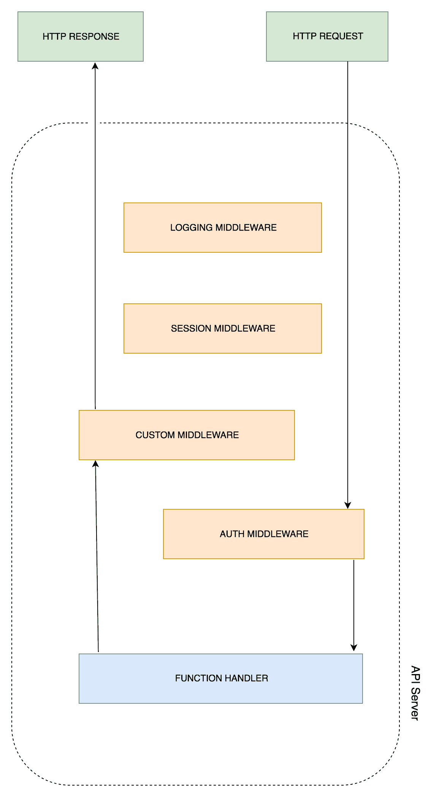
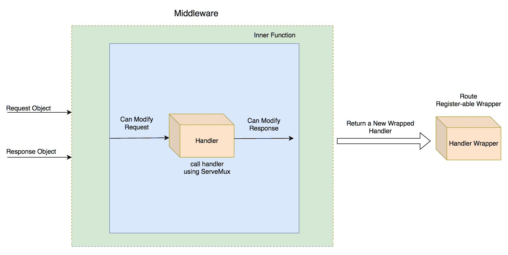
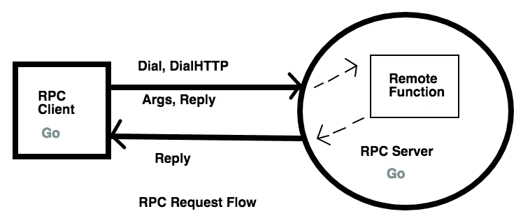

# 与中间件和 RPC 一起工作

在本章中，我们将探讨两个新的概念。首先，我们将学习中间件，以及如何从头开始构建它。然后，我们将转向社区编写的一个更好的中间件解决方案，称为**Gorilla 处理器**。然后，我们将看到中间件有帮助的使用案例。之后，我们将学习使用 Go 的内部 RPC 和 JSON-RPC 开发**远程过程调用（RPC**）服务。然后，我们将转向一个名为 Gorilla HTTP RPC 的高级 RPC 框架。

本章涉及的主题如下：

+   什么是中间件？

+   多个中间件和链式调用

+   使用`alice`轻松实现中间件链式调用

+   使用 Gorilla 处理器中间件进行日志记录

+   RPC 是什么？

+   使用 Gorilla RPC 进行 JSON-RPC

# 技术要求

以下软件应预先安装以运行代码示例：

+   操作系统：Linux（Ubuntu 18.04）/Windows 10/Mac OS X >= 10.13

+   软件：Docker >= 18（适用于 Windows 和 Mac OS X 的 Docker Desktop）

+   Go 最新版本编译器 >= 1.13.5

您可以从[`github.com/PacktPublishing/Hands-On-Restful-Web-services-with-Go/tree/master/chapter3`](https://github.com/PacktPublishing/Hands-On-Restful-Web-services-with-Go/tree/master/chapter3)下载本章的代码。克隆代码并使用`chapter3`目录中的代码示例。

# 什么是中间件？

**中间件**是一个实体，它可以钩入服务器的请求/响应生命周期。中间件可以定义在许多组件中。每个组件都有特定的功能来执行。每当我们在 URL 模式（如第二章，*处理我们的 REST 服务路由*）中定义处理器时，处理器就会为每个传入的请求执行一些业务逻辑。但是，正如其名称所指定的，中间件位于请求和处理器之间，或者位于处理器和响应之间。因此，几乎每个中间件都可以执行以下功能：

+   在到达处理器（函数）之前处理请求

+   将修改后的请求传递给处理器函数（执行一些业务逻辑）

+   处理来自处理器的响应

+   将修改后的响应传递给客户端

我们可以将前面的点以以下图表的形式进行视觉说明：



如果我们仔细观察图表，请求的旅程是从客户端开始的。请求首先到达一个名为**AUTH MIDDLEWARE**的中间件，然后被转发到**FUNCTION HANDLER**。一旦处理器生成响应，它就会被转发到另一个名为**CUSTOM MIDDLEWARE**的中间件，该中间件可以修改响应。

在没有中间件的程序中，请求直接到达 API 服务器并由函数处理器处理。响应立即从服务器发送，客户端接收它。但在配置了中间件到函数处理器的程序中，它可以通过一系列阶段，如记录、认证、会话验证等，然后继续到业务逻辑。这是为了过滤请求与业务逻辑的交互。最常见的情况如下：

+   使用记录器记录每个 REST API 的请求

+   验证用户的会话并保持通信活跃

+   如果未识别，则验证用户

+   在服务客户端时附加属性到响应

通过中间件的帮助，我们可以在适当的位置执行任何家务工作，例如认证。让我们创建一个基本的中间件并在 Go 中篡改 HTTP 请求。

当许多函数处理器有相同业务逻辑要执行时，中间件函数很有用。

# 创建一个基本的中间件

构建中间件函数既简单又直接。让我们基于从第二章《处理我们的 REST 服务路由》中获得的知识构建一个程序。如果你不熟悉闭包函数，闭包函数返回另一个函数。这个原则帮助我们编写中间件。一个中间件应该返回另一个函数，这个函数可以是中间件或函数处理器。这类似于 JavaScript 链式方法，其中一个函数返回一个新的函数作为返回值。让我们在 Go 中通过以下方式创建一个闭包函数：

1.  创建一个程序文件，如下所示：

```go
touch -p $GOPATH/src/github.com/git-user/chapter3/closureExample/main.go
```

我们使用此文件添加我们的代码。

1.  闭包函数返回另一个函数。让我们创建一个闭包函数，该函数使用以下代码生成正整数：

```go
// This function returns another function
func generator() func() int { // Outer function
   var i = 0
    return func() int { // Inner function
        i++
        return i
    }
}
```

函数是一个生成器，它返回一系列整数。生成器模式根据给定的条件每次生成一个新项目。内部函数返回一个无参数的匿名函数，返回类型为整数。在外部函数内部定义的`i`变量对匿名函数可用，使其能够在即将到来的函数调用之间记住状态。

1.  现在，我们可以在我们的`main`程序中使用之前的生成器，如下所示：

```go
package main

import (
  "fmt"
)

...
func main() {
  numGenerator := generator()
  for i := 0; i < 5; i++ {
    fmt.Print(numGenerator(), "\t")
  }
}
```

1.  我们可以将之前的代码作为一个独立的程序运行，如下所示：

```go
go run $GOPATH/src/github.com/git-user/chapter3/closureExample/main.go
```

以下数字将使用*制表符*空格生成并打印：

```go
1 2 3 4 5
```

在 Go 中，外部函数的函数签名应该与匿名函数的签名完全匹配。在上一个例子中，`func() int`是外部和内部函数的签名。唯一的例外是外部函数可以有一个接口作为返回类型，而内部函数可以实现该接口。我们将在接下来的几行中看到这一点。

现在，让我们来看看闭包如何帮助构建中间件：任何可以返回满足`http.Handler`接口的另一个函数的生成器函数都可以作为中间件。以下是一个示例，以验证这个陈述：

1.  为我们的程序创建一个文件，如下所示：

```go
touch -p $GOPATH/src/github.com/git-user/chapter3/customMiddleware/main.go
```

1.  中间件接受一个正常的 HTTP 处理器函数作为其参数，并返回另一个处理器函数。该函数看起来像这样：

```go
func middleware(originalHandler http.Handler) http.Handler {
    return http.HandlerFunc(func(w http.ResponseWriter, 
    r *http.Request) {
        fmt.Println("Executing middleware before request phase!")
        // Pass control back to the handler
        originalHandler.ServeHTTP(w, r)
        fmt.Println("Executing middleware after response phase!")
    })
}
```

如果你注意前面的中间件函数，它接受`originalHandler`，一个 HTTP 处理器，作为其参数，并返回另一个 HTTP 处理器。内部函数使用原始处理器来执行逻辑。在处理器之前和之后是中间件对请求和响应对象进行操作的地方。这使得所有发送到主处理器的请求都通过中间件逻辑。

1.  现在，让我们定义使用我们创建的中间件函数的主要逻辑，如下所示：

```go
package main
import (
    "fmt"
    "net/http"
)

func handle(w http.ResponseWriter, r *http.Request) {
    // Business logic goes here
    fmt.Println("Executing mainHandler...")
    w.Write([]byte("OK"))
}
func main() {
    // HandlerFunc returns a HTTP Handler
    originalHandler := http.HandlerFunc(handle)
    http.Handle("/", middleware(originalHandler))
    http.ListenAndServe(":8000", nil)
}
```

1.  运行代码，如下所示：

```go
go run $GOPATH/src/github.com/git-user/chapter3/customMiddleware/main.go
```

1.  如果你使用`curl`请求或在浏览器中访问`http://localhost:8000`，控制台将收到以下消息：

```go
Executing middleware before request phase!
Executing mainHandler...
Executing middleware after response phase!
```

在前面的图中，该程序由右侧的矩形块表示，标签为 CUSTOM MIDDLEWARE。如果你观察之前提供的中间件视觉说明，请求阶段的方向是向右，响应方向是向左。

Go 网络框架，如 Martini 和 Gin，默认提供中间件。我们将在第四章中了解更多关于它们的信息，*使用流行的 Go 框架简化 RESTful 服务*。了解中间件的底层细节对开发者来说是有益的。

以下图表可以帮助你理解中间件中逻辑流程是如何发生的。此图表解释了处理器是如何转换为包装处理器的：



我们已经看到了简单中间件的创建，但在实际场景中，需要多个中间件来记录请求、进行身份验证等。在下一节中，我们将看到如何链式连接多个中间件。

# 多个中间件和链式连接

在上一节中，我们构建了一个单个中间件，在请求击中处理器之前或之后执行操作。也可以链式连接一组中间件。为了做到这一点，我们应该遵循上一节中相同的闭包逻辑。让我们创建一个`cityAPI`程序来保存城市详情。为了简单起见，该 API 将有一个`POST`方法，并且正文将包含两个字段：城市名称和城市面积。

让我们考虑一个场景，即客户端只能向 API 发送 JSON `Content-Type`请求。API 的主要功能是向客户端发送响应，并附加 UTC 时间戳 cookie。我们可以在中间件中添加这个内容检查。

两个中间件的功能如下：

+   在第一个中间件中，检查内容类型是否为 JSON。如果不是，则不允许请求继续进行。

+   在第二个中间件中，将一个名为 Server-Time (UTC) 的时间戳添加到响应 cookie 中。

在添加中间件之前，让我们创建一个`POST` API，该 API 收集城市的名称和区域，并返回状态码为`201`的消息，以表明它已被成功创建。这可以通过以下方式完成：

1.  创建一个用于程序的文件，如下所示：

```go
touch -p $GOPATH/src/github.com/git-user/chapter3/cityAPI/main.go
```

1.  现在，编写处理客户端`POST`请求的函数。它解码请求体并读取名称和区域，并将它们填充到名为`city`的结构体中，如下所示：

```go
type city struct {
  Name string
  Area uint64
}

func postHandler(w http.ResponseWriter, r *http.Request) {
  if r.Method == "POST" {
    var tempCity city
    decoder := json.NewDecoder(r.Body)
    err := decoder.Decode(&tempCity)
    if err != nil {
      panic(err)
    }
    defer r.Body.Close()
    fmt.Printf("Got %s city with area of %d sq miles!\n",
     tempCity.Name, tempCity.Area)
    w.WriteHeader(http.StatusOK)
    w.Write([]byte("201 - Created"))
  } else {
    w.WriteHeader(http.StatusMethodNotAllowed)
    w.Write([]byte("405 - Method Not Allowed"))
  }
}
```

`postHandler`在这个片段中处理客户端请求。如果客户端尝试执行`GET`请求，则返回状态码`405 - Method Not Allowed`。`json.NewDecoder`用于从请求中读取请求体。`Decode`将请求体参数映射到`city`类型的结构体。

1.  现在是主要逻辑，如下所示：

```go
package main

import (
  "encoding/json"
  "fmt"
  "net/http"
)

func main() {
  http.HandleFunc("/city", postHandler)
  http.ListenAndServe(":8000", nil)
}
```

1.  我们可以使用以下代码启动 API 服务器：

```go
go run $GOPATH/src/github.com/git-user/chapter3/cityAPI/main.go
```

1.  然后，发送几个`curl`请求，如下所示：

```go
curl -H "Content-Type: application/json" -X POST http://localhost:8000/city -d '{"name":"New York", "area":304}'

curl -H "Content-Type: application/json" -X POST http://localhost:8000/city -d '{"name":"Boston", "area":89}'
```

1.  服务器记录了以下输出：

```go
Got New York city with area of 304 sq miles!
Got Boston city with area of 89 sq miles!
```

`curl`的响应如下：

```go
201 - Created
201 - Created
```

1.  现在是内容检查环节。为了链式调用中间件函数，我们必须在多个中间件之间传递处理器。在先前的例子中只有一个处理器参与。但现在，对于即将到来的任务，我们的想法是将主处理器传递给多个中间件处理器。我们可以将`cityAPI`程序修改为一个新的文件，如下所示：

```go
touch -p $GOPATH/src/github.com/git-user/chapter3/multipleMiddleware/main.go
```

1.  让我们先创建内容检查中间件。让我们称它为`filterContentType`。此中间件检查请求的`MIME`头，如果它不是 JSON，则返回状态码为`415- Unsupported Media Type`的响应，如下面的代码块所示：

```go
func filterContentType(handler http.Handler) http.Handler {
 return http.HandlerFunc(func(w http.ResponseWriter,
  r *http.Request) {
 log.Println("Currently in the check content type middleware")
 // Filtering requests by MIME type
 if r.Header.Get("Content-type") != "application/json" {
 w.WriteHeader(http.StatusUnsupportedMediaType)
 w.Write([]byte("415 - Unsupported Media Type. Please send JSON"))
 return
 }
 handler.ServeHTTP(w, r)
 })
}
```

1.  现在，让我们定义第二个中间件，称为`setServerTimeCookie`。在向客户端发送响应后收到适当的内容类型，此中间件会添加一个名为`Server-Time(UTC)`的 cookie，其值为服务器的 UTC 时间戳，如下面的代码块所示：

```go
func setServerTimeCookie(handler http.Handler) http.Handler {
  return http.HandlerFunc(func(w http.ResponseWriter,
  r *http.Request) {
    handler.ServeHTTP(w, r)
    // Setting cookie to every API response
    cookie := http.Cookie{Name: "Server-Time(UTC)", 
     Value: strconv.FormatInt(time.Now().Unix(), 10)}
    http.SetCookie(w, &cookie)
    log.Println("Currently in the set server time middleware")
  })
}
```

1.  主函数在将路由映射到处理器方面略有变化。它使用嵌套函数调用进行中间件链式调用，如下所示：

```go
func main() {
  originalHandler := http.HandlerFunc(handle)
  http.Handle("/city", 
   filterContentType(setServerTimeCookie(originalHandler)))
  http.ListenAndServe(":8000", nil)
}
```

我们通过使用`filterContentType(setServerTimeCookie(originalHandler))`来链式调用中间件。请仔细观察链式调用的顺序。

1.  现在，按照以下方式运行更新后的服务器：

```go
go run $GOPATH/src/github.com/git-user/chapter3/multipleMiddleware/main.go
```

然后，发送一个`curl`请求，如下所示：

```go
curl -i -H "Content-Type: application/json" -X POST http://localhost:8000/city -d '{"name":"Boston", "area":89}'
```

响应输出如下：

```go
HTTP/1.1 200 OK
Date: Sat, 27 May 2017 14:35:46 GMT
Content-Length: 13
Content-Type: text/plain; charset=utf-8

201 - Created
```

1.  但如果我们从`curl`请求中移除`Content-Type: application/json`，中间件将阻止我们执行主处理器，如下面的代码块所示：

```go
curl -i -X POST http://localhost:8000/city -d '{"name":"New York", "area":304}'

Result:HTTP/1.1 415 Unsupported Media Type
Date: Sat, 27 May 2017 15:36:58 GMT
Content-Length: 46
Content-Type: text/plain; charset=utf-8

415 - Unsupported Media Type. Please send JSON
```

这是在 Go API 服务器中链式调用中间件的最简单方式。

如果一个 API 服务器希望请求通过许多中间件，那么我们如何使链式调用简单且易于阅读？有一个非常好的库叫做`alice`来解决这个问题。它允许你以语义顺序将中间件附加到主处理器。我们将在下一节简要介绍它。

# 使用 Alice 实现无痛苦的中件间链式调用

当中间件列表很长时，`alice` 库简化了中间件链的连接。它为我们提供了一个干净的 API 来将处理器传递给中间件。这是一个轻量级的解决方案，与其他中间件链的 Go 包不同。

使用以下命令安装 `alice`：

```go
go get github.com/justinas/alice
```

现在，我们可以在我们的程序中导入 `alice` 包并立即使用它。我们可以修改之前程序的相应部分以实现相同的功能，并改进链式调用。让我们将程序目录命名为 `multipleMiddlewareWithAlice`，并在该位置创建一个主程序：

```go
touch -p $GOPATH/src/github.com/git-user/chapter3/multipleMiddlewareWithAlice/main.go
```

在 `import` 部分，添加 `github.com/justinas/alice`，如下面的代码片段所示：

```go
import (
    "encoding/json"
    "github.com/justinas/alice"
    "log"
    "net/http"
    "strconv"
    "time"
)
```

现在，在 `main` 函数中，我们可以修改处理器部分，如下所示：

```go
func main() {
    originalHandler := http.HandlerFunc(handle)
    chain := alice.New(filterContentType,
     setServerTimeCookie).Then(originalHandler)
    http.Handle("/city", chain)
    http.ListenAndServe(":8000", nil)
}
```

这个程序的输出与上一个程序类似。在了解前面的概念之后，让我们使用 Gorilla 工具包中的 **handlers** 库构建一个日志中间件。

# 使用 Gorilla handlers 中间件进行日志记录

Gorilla handlers 包提供了各种预先编写的中间件以供常见任务使用。列表中最重要的是：

+   `LoggingHandler`：用于 Apache **通用日志格式**（**CLF**）的日志记录

+   `CompressionHandler`：用于压缩响应

+   `RecoveryHandler`：用于从意外的恐慌中恢复

在这里，我们使用 `LoggingHandler` 中间件执行 API 全局日志记录。首先，使用以下方式使用 `go get` 安装此库：

```go
go get "github.com/gorilla/handlers"
```

这个日志服务器使我们能够创建一个带有时间和选项的服务器样式的日志。例如，当你看到 `apache.log` 时，你会在标准格式中找到日志，如下面的代码块所示：

```go
192.168.2.20 - - [28/Jul/2006:10:27:10 -0300] "GET /cgi-bin/try/ HTTP/1.0" 200 3395
127.0.0.1 - - [28/Jul/2006:10:22:04 -0300] "GET / HTTP/1.0" 200 2216
```

格式如下：`IP-日期-方法:端点-响应状态`。编写模仿 Apache 风格日志的自定义中间件需要一些努力，但 Gorilla Handlers 已经为我们实现了。让我们通过创建一个新的程序来更新之前的程序，如下所示：

```go
touch -p $GOPATH/src/github.com/git-user/chapter3/loggingMiddleware/main.go
```

现在，让我们按照以下步骤编写程序：

1.  首先，我们创建一个 `Gorilla` 路由器并将其附加到 `LoggingHandler`。

1.  `LoggingHandler` 注册一个标准输出（在我们的例子中，是 `os.Stdout`）并返回一个新的路由器。我们使用这个新的路由器将 HTTP 服务器注册，如下面的代码块所示：

```go
package main
import (
    "github.com/gorilla/handlers"
    "github.com/gorilla/mux"
    "log"
    "os"
    "net/http"
)
func handle(w http.ResponseWriter, r *http.Request) {
    log.Println("Processing request!")
    w.Write([]byte("OK"))
    log.Println("Finished processing request")
}
func main() {
    r := mux.NewRouter()
    r.HandleFunc("/", handle)
    loggedRouter := handlers.LoggingHandler(os.Stdout, r)
    http.ListenAndServe(":8000", loggedRouter)
}
```

1.  通过运行以下代码启动服务器：

```go
go run $GOPATH/src/github.com/git-user/chapter3/loggingMiddleware/main.go
```

1.  现在，在浏览器中打开 `http://127.0.0.1:8000`，或者发送一个 `curl` 请求，你将看到以下输出：

```go
2017/05/28 10:51:44 Processing request!
2017/05/28 10:51:44 Finished processing request
127.0.0.1 - - [28/May/2017:10:51:44 +0530] "GET / HTTP/1.1" 200 2
127.0.0.1 - - [28/May/2017:10:51:44 +0530] "GET /favicon.ico HTTP/1.1" 404 19
```

如果你观察，最后两个日志是由中间件生成的。Gorilla `LoggingMiddleware` 在响应时写入它们。

在之前的例子中，我们总是在本地主机上检查 API。在这个例子中，我们明确指定用 `127.0.0.1` 替换本地主机，因为前者在日志中会显示为空 IP。

在程序方面，我们正在导入 `gorilla/mux` 路由器和 `gorilla/handlers`。然后，我们将一个名为 `handle` 的处理程序附加到路由器上。接下来，我们将路由器包装在 `handlers.LoggingHandler` 中间件中。它返回一个额外的处理程序，我们可以安全地将其传递给 `http.ListenAndServe`。

您也可以尝试 handlers 中的其他中间件。本节的目标是向您介绍 `gorilla/handlers`。Go 有许多其他外部包可用。有一个值得注意的库是直接在 `net/http` 上编写中间件的库，它是 `Negroni` ([github.com/urfave/negroni](http://github.com/urfave/negroni))。它还提供了 `alice`，Gorilla `LoggingHandler` 的功能。所以，请查看它。

我们可以使用名为 `go.uuid` 的库（[github.com/satori/go.uuid](http://github.com/satori/go.uuid)）和 cookies，轻松构建基于 cookie 的身份验证中间件。

系统通过 Web 服务相互交谈。客户端 API 可以由多个服务器实例提供支持。RPC 是一种以可理解的方式将工作委托给远程服务器的机制。RPC 是 Go 中的一个重要概念，因为它可以在支持客户端的 REST 服务中发挥作用。Gorilla 工具包提供了支持 RPC 的包。我们将在下一节中详细了解它。

# RPC 是什么？

RPC 是一种进程间通信，它在不同分布式系统之间交换信息。一台称为 Alice 的计算机可以在另一台称为 Bob 的计算机上以协议格式调用函数（过程），并获取计算结果。我们可以在不实现本地功能的情况下，从另一个地方或地理区域请求网络上的事物。

整个过程可以分解为以下步骤：

1.  客户端准备要发送的函数名和参数

1.  客户端通过拨号连接将它们发送到 RPC 服务器

1.  服务器接收函数名和参数

1.  服务器执行远程进程

1.  消息将被发送回客户端

1.  客户端从请求中收集数据并适当使用

服务器需要暴露其服务，以便客户端连接并请求远程过程。请查看以下图表：



Go 提供了一个库来实现 **RPC 服务器** 和 **RPC 客户端**。在上面的图表中，**RPC 客户端**使用主机和端口等详细信息拨号连接。它随请求发送两件事。一是参数，二是回复指针。由于它是一个指针，服务器可以修改它并发送回来。然后，客户端可以使用填充到指针中的数据。Go 有两个库，`net/rpc` 和 `net/rpc/jsonrpc`，用于处理 RPC。让我们编写一个与客户端交谈并发送服务器时间的 RPC 服务器。

# 创建 RPC 服务器

让我们创建一个简单的 RPC 服务器，将 UTC 服务器时间发送回 RPC 客户端。RPC 服务器和 RPC 客户端应该就以下两点达成一致：

+   传递的参数

+   返回的值

这两个参数的类型应该完全匹配服务器和客户端。让我们看看创建 RPC 服务器的步骤，如下所示：

1.  让我们创建一个 RPC 服务器程序，如下所示：

```go
touch -p $GOPATH/src/github.com/git-user/chapter3/rpcServer/main.go
```

1.  我们应该创建一个 `Args struct` 和一个回复指针来保存 RPC 调用的数据。

1.  然后，创建一个远程客户端要执行的功能，命名为 `GiveServerTime`，如下面的代码块所示：

```go
type Args struct{}

type TimeServer int64

func (t *TimeServer) GiveServerTime(args *Args, reply *int64) error {
  // Fill reply pointer to send the data back
  *reply = time.Now().Unix()
  return nil
}
```

1.  现在，我们可以使用名为 `rpc.Register` 的方法激活 `TimeServer`。主逻辑如下：

```go
package main

import (
  "log"
  "net"
  "net/http"
  "net/rpc"
  "time"
)

func main() {
  timeserver := new(TimeServer)
  rpc.Register(timeserver)
  rpc.HandleHTTP()
  // Listen for requests on port 1234
  l, e := net.Listen("tcp", ":1234")
  if e != nil {
    log.Fatal("listen error:", e)
  }
  http.Serve(l, nil)
}
```

从前面的示例中，我们可以注意以下几点：

+   `GiveServerTime` 将 `Args` 对象作为第一个参数和一个回复指针对象

+   它设置了回复指针对象，但没有返回任何内容，除了错误信息

+   这里 `Args` 结构体没有字段，因为这个服务器不期望从客户端接收任何参数

在使用此 RPC 服务器之前，让我们也编写 RPC 客户端。

# 创建 RPC 客户端

客户端也使用相同的 `net/rpc` 包，但使用不同的方法拨号到服务器并执行远程函数。获取数据的唯一方法是将回复指针对象与请求一起传递。让我们看看创建 RPC 客户端的步骤，如下所示：

1.  让我们定义这个客户端程序，如下所示：

```go
touch -p $GOPATH/src/github.com/git-user/chapter3/rpcClient/main.go
```

1.  客户端使用 `rpc.DialHTTP` 方法拨号到 RPC 服务器。它返回一个 `client` 对象。一旦拨号成功，就可以使用 `client.Call` 方法执行远程函数，如下面的代码块所示：

```go
package main
import (
    "log"
    "net/rpc"
)
type Args struct {
}
func main() {
    var reply int64
    args := Args{}
    client, err := rpc.DialHTTP("tcp", "localhost"+":1234")
    if err != nil {
        log.Fatal("dialing:", err)
    }
    err = client.Call("TimeServer.GiveServerTime",
     args, &reply)
    if err != nil {
        log.Fatal("arith error:", err)
    }
    log.Printf("%d", reply)}
```

1.  现在，我们可以运行服务器和客户端以观察它们的工作情况。这会运行服务器，如下所示：

```go
go run $GOPATH/src/github.com/git-user/chapter3/rpcServer/main.go
```

1.  现在，打开另一个 shell 标签并运行此命令，如下所示：

```go
go run $GOPATH/src/github.com/git-user/chapter3/rpcClient/main.go
```

现在，服务器控制台将输出以下 Unix 时间字符串：

```go
2017/05/28 19:26:31 1495979791
```

你看到了这个魔法吗？客户端作为一个独立的程序在服务器上运行。在这里，这两个程序可以位于不同的机器上，计算仍然可以共享。这是分布式系统的核心概念。任务被分割并分配给各个 RPC 服务器。最后，客户端收集结果并使用它们做出进一步的决策。

RPC 应该被加密，因为它正在执行远程函数。在从客户端收集请求时，授权是必须的。

自定义 RPC 代码仅在客户端和服务器都使用 Go 语言编写时才有用。因此，为了使 RPC 服务器被多个服务消费，我们需要定义通过 HTTP 的 JSON-RPC。然后，任何其他编程语言都可以发送 JSON 字符串并获取 JSON 作为结果返回。

# 使用 Gorilla RPC 的 JSON-RPC

我们看到 Gorilla 工具包通过提供许多有用的库来帮助我们。它有如 Mux 用于路由、Handlers 用于中间件，现在还有 `gorilla/rpc` 库。使用这个库，我们可以创建使用 JSON 而不是自定义回复指针进行通信的 RPC 服务器和客户端。让我们将前面的示例转换为更有用的一个。

考虑这个场景。我们在服务器上有一个包含书籍详细信息（名称、ID、作者）的 JSON 文件。客户端通过发送 HTTP 请求来请求书籍信息。当 RPC 服务器接收到请求时，它会从文件系统中读取文件并解析它。如果给定的 ID 与任何书籍匹配，则服务器以 JSON 格式将信息发送回客户端。让我们看看这里的步骤：

1.  我们可以使用 `go get` 命令安装 Gorilla RPC：

```go
go get github.com/gorilla/rpc
```

这个包源自标准的 `net/rpc` 包，但在每次调用时使用单个 HTTP 请求而不是持久连接。与其他 `net/rpc` 相比的不同之处将在接下来的几行中解释。可以在同一服务器上注册多个编解码器。编解码器是根据请求的 `Content-Type` 头部来选择的。服务方法也接收 `http.Request` 作为参数。

1.  现在，让我们编写一个 RPC JSON 服务器。在这里，我们正在实现 JSON 1.0 规范。对于 2.0，你应该使用 Gorilla JSON2。让我们定义一个示例 JSON 文件，其中包含有关书籍的信息，如下所示：

```go
touch -p $GOPATH/src/github.com/git-user/chapter3/jsonRPCServer/books.json
```

1.  让我们在 JSON 文件中添加一些书籍，如下所示：

```go
[
  {
    "id": "1234",
    "name": "In the sunburned country",
    "author": "Bill Bryson"
  },
  {
    "id":"2345",
    "name": "The picture of Dorian Gray",
    "author": "Oscar Wilde"
  }
]
```

1.  现在，我们有一个书籍数据库文件（在这个例子中是 JSON）。让我们编写一个与前面示例类似的 RPC 服务器，通过运行以下代码：

```go
touch -p $GOPATH/src/github.com/git-user/chapter3/jsonRPCServer/main.go 
```

1.  流程是定义一个结构体来保存书籍的类型。然后，创建一个 `JSONServer` 结构体用于与 RPC 服务器注册。它应该有一个作为 RPC 动作的方法。使用内置的 `filepath` 实用函数从给定的文件中读取 JSON 文件。`JSONServer` 的 `reply` 参数填充了匹配的书籍信息，如下面的代码块所示：

```go
// Args holds arguments passed to JSON-RPC service
type Args struct {
  ID string
}

// Book struct holds Book JSON structure
type Book struct {
  ID string `json:"id,omitempty"`
  Name string `json:"name,omitempty"`
  Author string `json:"author,omitempty"`
}

type JSONServer struct{}

// GiveBookDetail is RPC implementation
func (t *JSONServer) GiveBookDetail(r *http.Request, args *Args, reply *Book) error {
  var books []Book
  // Read JSON file and load data
  absPath, _ := filepath.Abs("chapter3/books.json")
  raw, readerr := ioutil.ReadFile(absPath)
  if readerr != nil {
    log.Println("error:", readerr)
    os.Exit(1)
  }
  // Unmarshal JSON raw data into books array
  marshalerr := jsonparse.Unmarshal(raw, &books)
  if marshalerr != nil {
    log.Println("error:", marshalerr)
    os.Exit(1)
  }
  // Iterate over each book to find the given book
  for _, book := range books {
    if book.ID == args.ID {
      // If book found, fill reply with it
      *reply = book
      break
    }
  }
  return nil
}
```

它看起来与上一个示例相似，但一个明显的区别是，这里的服务器期望从客户端接收一个 ID。这个 ID 是从 JSON 中获取书籍的关键。在 `GiveBookDetail` 中，我们使用 `ioutil.ReadFile` 读取文件内容并将其反序列化到 `books` 结构体中。然后我们遍历书籍列表以匹配键，并将匹配的书籍填充到 `reply` 指针中。

1.  现在，让我们完成 `main` 块，将之前定义的 `JSONServer` 作为 RPC 服务进行注册，如下所示：

```go
package main

import (
  jsonparse "encoding/json"
  "io/ioutil"
  "log"
  "net/http"
  "os"

  "path/filepath"

  "github.com/gorilla/mux"
  "github.com/gorilla/rpc"
  "github.com/gorilla/rpc/json"
)

func main() {
  // Create a new RPC server
  s := rpc.NewServer()
  // Register the type of data requested as JSON
  s.RegisterCodec(json.NewCodec(), "application/json")
  // Register the service by creating a new JSON server
  s.RegisterService(new(JSONServer), "")
  r := mux.NewRouter()
  r.Handle("/rpc", s)
  http.ListenAndServe(":1234", r)

}
```

这里的一个细微差别是我们必须使用 `RegisterCodec` 方法注册编解码器类型。在这种情况下是 JSON 编解码器。然后，我们可以使用 `RegisterService` 方法注册服务并启动一个正常的 HTTP 服务器。如果你注意到了，我们使用了 `jsonparse` 作为 `encoding/json` 包的别名，因为它可能会与另一个包 `github.com/gorilla/rpc/json` 冲突。

1.  我们可以像这样启动这个 `jsonRPCServer`：

```go
go run $GOPATH/src/github.com/git-user/chapter3/jsonRPCServer/main.go
```

1.  现在，我们是否必须开发一个客户端？不一定，因为客户端可以是一个 `curl` 程序，因为 RPC 服务器正在通过 HTTP 提供服务，我们需要发送带有书籍 ID 的 JSON 来获取详细信息。所以，打开另一个 shell 并执行这个 `curl` 请求：

```go
curl -X POST \
 http://localhost:1234/rpc \
 -H 'cache-control: no-cache' \
 -H 'content-type: application/json' \
 -d '{
 "method": "JSONServer.GiveBookDetail",
 "params": [{
 "ID": "1234"
 }],
 "id": "1"
}'
```

1.  输出将是一个直接从 JSON-RPC 服务器提供的漂亮的 JSON，如下所示：

```go
{"result":{"id":"1234","name":"In the sunburned country","author":"Bill Bryson"},"error":null,"id":"1"}
```

当多个客户端技术需要连接到您的 RPC 服务时，请将 JSON-RPC 作为首选选择。

RPC 是在编程语言中定义类型化服务的一种非常常见的方式。Gorilla 工具包是在使用 Go 语言时一个非常实用的包。当需要提供 REST JSON API 时，你可以继续使用 JSON-RPC。

# 摘要

在本章中，我们首先探讨了什么是中间件以及中间件如何处理请求和响应。然后，我们通过一些实际例子探讨了中间件代码。之后，我们看到了如何将多个中间件一个接一个地串联起来。例如，`alice` 包可以用于直观的链式调用。Gorilla 工具包中的一个包，`gorilla/handlers`，提供了用于日志记录、压缩和**跨源资源共享**（**CORS**）的各种中间件。

接下来，我们学习了 RPC 是什么，以及如何构建 RPC 服务器和客户端。然后，我们解释了什么是 JSON-RPC，并展示了如何使用 Gorilla 工具包创建 JSON-RPC。在过程中，我们介绍了许多用于中间件和 RPC 的第三方包。

在下一章中，我们将探讨一些著名的网络框架，这些框架进一步简化了 REST API 的创建。
