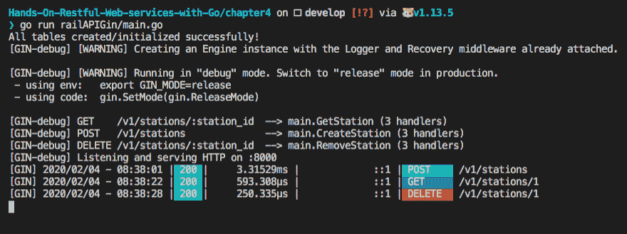

# 第四章：使用流行的 Go 框架简化 RESTful 服务

在本章中，我们将使用不同的框架来简化构建 REST 服务的流程。首先，我们将快速浏览`go-restful`，这是一个 REST API 创建框架，然后转向一个名为 Gin 的框架。在本章中，我们将构建一个地铁铁路 API。我们将讨论的框架是功能齐全的 Web 框架，也可以在短时间内创建 REST API。在本章中，我们还将大量讨论资源和 REST 动词。然后，我们将尝试将一个小型数据库 SQLite3 与我们的 API 集成。最后，我们将探索`revel.go`，看看如何用它来原型化我们的 REST API。

在本章中，我们将涵盖以下主题：

+   `go-restful` – 用于创建 REST API 的框架

+   SQLite3 基础知识及 CRUD 操作

+   使用`go-restful`构建地铁铁路 API

+   使用 Gin 框架构建 RESTful API

+   使用`revel.go`构建 RESTful API

# 技术要求

以下是在运行代码示例之前应该预先安装的软件：

+   操作系统：Linux (Ubuntu 18.04)/Windows 10/Mac OS X >=10.13

+   软件：Docker >= 18 (Docker Desktop for Windows and Mac OS X)

+   Go 最新版本编译器 >= 1.13.5

您可以从[`github.com/PacktPublishing/Hands-On-Restful-Web-services-with-Go/tree/master/chapter4`](https://github.com/PacktPublishing/Hands-On-Restful-Web-services-with-Go/tree/master/chapter4)下载本章的代码。克隆代码，并使用`chapter4`目录中的代码示例。

# 介绍 go-restful – 一个 REST API 框架

`go-restful`是一个用于在 Go 中构建 REST 风格 Web 服务的包。正如我们在第一章“开始 REST API 开发”中讨论的，REST 要求开发者遵循一系列设计协议。在那里我们也讨论了 REST 动词是如何定义的以及它们对资源做了什么。

使用`go-restful`，我们可以将 API 处理器的逻辑分离并附加 REST 动词。好处是，通过查看代码可以清楚地显示哪些资源被操作。在进入示例之前，我们必须为使用`go-restful`的 REST API 安装一个名为 SQLite3 的数据库。安装步骤如下：

1.  首先，安装`go-restful`包的依赖项。在 Ubuntu 上运行以下命令：

```go
> apt-get install sqlite3 libsqlite3-dev
```

在 Mac OS X 上，您可以使用`brew`命令安装`sqlite3`：

```go
> brew install sqlite3
```

1.  现在，使用以下`get`命令安装`go-restful`包：

```go
> go get github.com/emicklei/go-restful
```

在 Windows 操作系统上，您可以从[`www.sqlite.org`](https://www.sqlite.org)下载 SQLite3 的可执行文件。

我们现在准备出发。首先，让我们编写一个简单的程序，展示`go-restful`在几行代码中能做什么。它提供了一个`WebService`，我们可以用它来将路由附加到处理器。用例是创建一个简单的 ping 服务器，将服务器时间回显给客户端。步骤如下：

1.  让我们创建一个`basicExample.go`程序：

```go
touch -p $GOPATH/src/github.com/git-user/chapter4/basicExample/main.go
```

1.  现在，创建一个函数，将服务器时间写入响应。它接受 `Request` 和 `Response` 对象：

```go
func pingTime(req *restful.Request, resp *restful.Response) {
 // Write to the response
 io.WriteString(resp, fmt.Sprintf("%s", time.Now()))
}
```

`pingTime` 处理器很简单，只是将服务器时间写入响应。

1.  我们必须创建一个 `restful.WebService` 实例，以便将给定的路由附加到一个动词和一个处理器上。以下是如何在 `main` 块中实现它的示例：

```go
package main
import (
    "fmt"
    "github.com/emicklei/go-restful"
    "io"
    "net/http"
    "time"
)
func main() {
    // Create a web service
    webservice := new(restful.WebService)
    // Create a route and attach it to handler in the service
    webservice.Route(webservice.GET("/ping").To(pingTime))
    // Add the service to application
    restful.Add(webservice)
    http.ListenAndServe(":8000", nil)
}
```

1.  现在，运行程序：

```go
go run $GOPATH/src/github.com/git-user/chapter4/basicExample/main.go
```

1.  服务器将在本地主机的 `8000` 端口上运行。因此，我们可以通过发送 `curl` 请求或使用浏览器来查看 `GET` 请求的输出：

```go
curl -X GET "http://localhost:8000/ping"
2020-01-01 07:37:26.238146296 +0530 CET
```

在前面的程序中，我们导入了 `go-restful` 库，并使用 `restful.WebService` 结构体实例创建了一个新的服务。

1.  接下来，我们将使用以下语句创建一个 REST 动词：

```go
webservice.GET("/ping")
```

1.  然后，我们将一个函数处理器附加到执行此动词；`pingTime` 就是一个这样的函数。这些链式函数被传递给 `Route` 函数以创建路由器。接下来是以下重要语句：

```go
restful.Add(webservice)
```

这将把新创建的 `webservice` 注册到 `go-restful` 中。如果你观察的话，我们没有向 `http.ListenServe` 函数传递任何 `ServeMux` 对象；`go-restful` 会处理它。

这里的主要概念是使用基于资源的 REST API 创建 `go-restful`。从基本示例开始，让我们构建一些实用的东西。

假设你的城市正在实施一个新的地铁铁路项目，你必须为其他开发者开发一个围绕它创建应用的 REST API。我们将在本章中创建这样一个 API，并使用各种框架来展示实现。在此之前，对于 **创建**、**读取**、**更新**、**删除**（**CRUD**）操作，我们应该知道如何使用 Go 代码查询或插入数据库中的数据。我们选择最简单的一个，称为 SQLite3，并在下一节中讨论它。

# SQLite3 基本和 CRUD 操作

**SQLite3** 是一种轻量级的基于文件的 SQL 数据库。它对于快速构建 API 的持久性非常有用。它利用 SQL 语言和关系数据库。在本节中，我们将了解如何从 Go 语言中与 SQLite3 交互。

所有 SQLite3 操作都将使用 `go-sqlite3` 库来完成。我们可以使用以下命令安装该包：

```go
go get github.com/mattn/go-sqlite3
```

这个库的特殊之处在于它使用了 Go 的内部 `sql` 包。我们通常导入 `database/sql` 并使用 SQL 在数据库（此处为 SQLite3）上执行数据库查询：

```go
import "database/sql"
```

现在，我们可以使用以下步骤来创建一个数据库驱动程序，然后使用 `Query` 方法在它上面执行 SQL 命令：

1.  让我们在该路径下创建一个文件：

```go
touch -p $GOPATH/src/github.com/git-user/chapter4/sqliteExample/main.go
```

1.  让我们定义一个主块，如果不存在则创建一个表，并调用另一个函数进行 CRUD 操作：

```go
package main

import (
  "database/sql"
  "log"

  _ "github.com/mattn/go-sqlite3"
)

// Book is a placeholder for book
type Book struct {
  id int
  name string
  author string
}

func main() {
  db, err := sql.Open("sqlite3", "./books.db")
  if err != nil {
    log.Println(err)
  }
  // Create table
  statement, err := db.Prepare("CREATE TABLE IF NOT EXISTS books
   (id INTEGER PRIMARY KEY, isbn INTEGER, author VARCHAR(64),
    name VARCHAR(64) NULL)")
  if err != nil {
    log.Println("Error in creating table")
  } else {
    log.Println("Successfully created table books!")
  }
  statement.Exec()
  dbOperations(db)
}
```

我们正在创建一个名为 `books.db` 的数据库，并使用 `db.Prepare` 方法创建一个 `books` 表的 SQL 语句。然后我们使用语句的 `Exec` 方法执行它。

1.  如果你注意到，我们调用了`dbOperations`函数来执行 CRUD 操作。在那个函数中，我们创建了一个书籍，读取它，然后更新，最后删除它。让我们看看实现：

```go
func dbOperations(db *sql.DB) {
  // Create
  statement, _ := db.Prepare("INSERT INTO books (name, author,
   isbn) VALUES (?, ?, ?)")
  statement.Exec("A Tale of Two Cities", "Charles Dickens",
   140430547)
  log.Println("Inserted the book into database!")

  // Read
  rows, _ := db.Query("SELECT id, name, author FROM books")
  var tempBook Book
  for rows.Next() {
    rows.Scan(&tempBook.id, &tempBook.name, &tempBook.author)
    log.Printf("ID:%d, Book:%s, Author:%s\n", tempBook.id,
     tempBook.name, tempBook.author)
  }
  // Update
  statement, _ = db.Prepare("update books set name=? where id=?")
  statement.Exec("The Tale of Two Cities", 1)
  log.Println("Successfully updated the book in database!")

  //Delete
  statement, _ = db.Prepare("delete from books where id=?")
  statement.Exec(1)
  log.Println("Successfully deleted the book in database!")
}
```

除了`Prepare`函数外，现在我们还有一个`Query`方法。这主要用于从数据库中读取数据。`Exec`是在 SQLite 上执行准备/查询语句的常见函数。

准备语句用于在数据库上执行导致数据库变化的操作，而查询用于只读操作。

1.  让我们运行`sqliteFunamentals`程序：

```go
go run $GOPATH/src/github.com/git-user/chapter4/sqliteExample/main.go
```

输出看起来如下，打印所有日志语句：

```go
2017/06/10 08:04:31 Successfully created table books!
2017/06/10 08:04:31 Inserted the book into database!
2017/06/10 08:04:31 ID:1, Book:A Tale of Two Cities, Author:Charles Dickens
2017/06/10 08:04:31 Successfully updated the book in database!
2017/06/10 08:04:31 Successfully deleted the book in database!
```

在运行查询时，有一个与安全相关的重要事项。从前面的代码中取一个语句：

```go
statement, _ = db.Prepare("INSERT INTO books (name, author, isbn) VALUES (?, ?, ?)")
statement.Exec("A Tale of Two Cities", "Charles Dickens", 140430547)
```

如果你传递了错误的数据，例如可能导致 SQL 注入的字符串，驱动程序会立即拒绝 SQL 操作。这是为了避免任何原始字符串被数据库引擎执行。这可能是危险的，因为 SQL 可以做任何事情，甚至删除数据库。始终先准备语句，然后传递必要的详细信息。

在下一节中，我们尝试使用`go-restful`和 SQLite3 构建一个示例 API。

# 使用 go-restful 构建地铁铁路 API

让我们利用我们获得的`go-restful`和 SQLite3 的知识，为我们在上一节中讨论的地铁铁路项目创建一个 API。路线图如下：

1.  设计 REST API 文档

1.  为数据库创建模型

1.  实现 API 逻辑

让我们详细了解每个部分。

# 设计规范

在创建任何 API 之前，我们应该知道 API 的规范，以文档的形式呈现。我们在第二章，*处理我们的 REST 服务路由*中展示了示例，其中我们展示了 URL 缩短器 API 设计文档。让我们尝试为这个地铁铁路项目创建一个。看看下面的表格：

| **HTTP 动词** | **路径** | **操作** | **资源** |
| --- | --- | --- | --- |
| `POST` | `/v1/train (details as JSON body)` | `Create` | `Train` |
| `POST` | `/v1/station (details as JSON body)` | `Create` | `Station` |
| `GET` | `/v1/train/id` | `Read` | `Train` |
| `GET` | `/v1/station/id` | `Read` | `Station` |
| `POST` | `/v1/schedule (source and destination)` | `Create` | `Route` |

我们还可以包括`UPDATE`和`DELETE`方法。通过实现前面的设计，用户将很容易自己实现它们。

# 创建数据库模型

让我们为前面提到的`train`、`station`和`route`资源编写一些 SQL 字符串以创建表。我们将为这个 API 创建一个项目布局。在`$GOPATH/src/github.com/git-user/chapter4`中创建两个名为`railAPI`和`dbutils`的目录。

在这里，`railAPI`是我们项目的源代码，而`dbutils`是我们自己用于处理数据库初始化实用函数的包。按照以下步骤操作：

1.  让我们从 `dbutils/models.go` 文件开始。在 `models.go` 文件中为 `train`、`station` 和 `schedule` 每个添加三个模型：

```go
package dbutils

const train = `
      CREATE TABLE IF NOT EXISTS train (
           ID INTEGER PRIMARY KEY AUTOINCREMENT,
           DRIVER_NAME VARCHAR(64) NULL,
           OPERATING_STATUS BOOLEAN
        )
`

const station = `
        CREATE TABLE IF NOT EXISTS station (
          ID INTEGER PRIMARY KEY AUTOINCREMENT,
          NAME VARCHAR(64) NULL,
          OPENING_TIME TIME NULL,
          CLOSING_TIME TIME NULL
        )
`
const schedule = `
        CREATE TABLE IF NOT EXISTS schedule (
          ID INTEGER PRIMARY KEY AUTOINCREMENT,
          TRAIN_ID INT,
          STATION_ID INT,
          ARRIVAL_TIME TIME,
          FOREIGN KEY (TRAIN_ID) REFERENCES train(ID),
          FOREIGN KEY (STATION_ID) REFERENCES station(ID)
        )
`
```

这些是普通的由反引号 `` ` `` 定界的多行字符串。`schedule` 保存了火车在特定时间到达特定站点的信息。在这里，`train` 和 `station` 是 `schedule` 表的外键。对于 `train`，与之相关的细节是列。包名为 `dbutils`。当我们使用包名时，该包中的所有 Go 程序都可以在不进行显式导入的情况下共享变量和函数。

1.  现在，让我们在 `init-tables.go` 文件中添加初始化（创建表）数据库的代码：

```go
package dbutils
import "log"
import "database/sql"

func Initialize(dbDriver *sql.DB) {
    statement, driverError := dbDriver.Prepare(train)
    if driverError != nil {
        log.Println(driverError)
    }
    // Create train table
    _, statementError := statement.Exec()
    if statementError != nil {
        log.Println("Table already exists!")
    }
    statement, _ = dbDriver.Prepare(station)
    statement.Exec()
    statement, _ = dbDriver.Prepare(schedule)
    statement.Exec()
    log.Println("All tables created/initialized successfully!")
}
```

我们导入 `database/sql` 以传递函数中的参数类型。函数中的所有其他语句都与我们在前一小节中给出的 SQLite3 示例类似。它是在 SQLite3 数据库中创建三个表。我们的主程序应该将数据库驱动程序传递给此函数。如果你注意到这里，我们没有导入 `train`、`station` 和 `schedule`。然而，由于此文件位于 `dbutils` 包中，`models.go` 中的变量在这里是可访问的。

1.  现在，我们的初始包已经完成。使用以下命令为该包构建对象代码：

```go
go build $GOPATH/src/github.com/git-user/chapter4/dbutils
```

1.  直到我们创建并运行主程序之前，这都没有什么用处。所以，让我们编写一个简单的主程序，从 `dbutils` 包中导入 `Initialize` 函数。让我们称这个文件为 `main.go`：

```go
touch -p $GOPATH/src/github.com/git-user/chapter4/railAPI/main.go
```

1.  现在，在主函数中，让我们导入 `dbutils` 包并初始化表：

```go
package main

import (
    "database/sql"
    "log"

    _ "github.com/mattn/go-sqlite3"
    "github.com/git-user/chapter4/dbutils"
)

func main() {
    // Connect to Database
    db, err := sql.Open("sqlite3", "./railapi.db")
    if err != nil {
        log.Println("Driver creation failed!")
    }
    // Create tables
    dbutils.Initialize(db)
}
```

1.  使用以下命令从 `railAPI` 目录运行程序：

```go
go run $GOPATH/src/github.com/git-user/chapter4/railAPI/main.go
```

1.  输出应该类似于以下内容：

```go
2020/01/10 14:05:36 All tables created/initialized successfully!
```

在先前的 `railAPI` 示例中，我们将创建表的任务委托给了 `dbutils` 包中的 `Initialize` 函数。我们可以在主程序中直接这样做，但将逻辑分解到多个包中是一种良好的实践。

在前一个目录树截图中的 `railapi.db` 文件会在我们运行主程序时创建。如果不存在，SQLite3 将负责创建数据库文件。SQLite3 数据库是简单的文件。你可以使用 `$ sqlite3 file_name` 命令进入 SQLite shell。

让我们扩展 `railAPI` 的主程序。我们的目标是创建在 *设计规范* 部分提到的 API。我们将一步一步地了解如何使用本例中的 `go-restful` 和 SQLite3 构建 REST 服务：

1.  首先，向程序中添加必要的导入：

```go
package main
import (
    "database/sql"
    "encoding/json"
    "log"
    "net/http"
    "time"
    "github.com/emicklei/go-restful"
    _ "github.com/mattn/go-sqlite3"
    "github.com/git-user/chapter4/dbutils"
)
```

我们需要两个外部包，`go-restful` 和 `go-sqlite3`，来构建 API 逻辑。第一个用于处理程序，第二个包用于添加存储。`dbutils` 在 `railAPI` 示例中保持不变。`time` 和 `net/http` 包用于通用任务。

1.  尽管 SQLite 数据库表中的列有具体的名称，但在 Go 编程中，我们需要几个结构体类型来处理数据库的输入和输出数据。请看以下代码片段，它定义了必要的结构体来存储数据：

```go
// DB Driver visible to whole program
var DB *sql.DB

// TrainResource is the model for holding rail information
type TrainResource struct {
    ID int
    DriverName string
    OperatingStatus bool
}
// StationResource holds information about locations
type StationResource struct {
    ID int
    Name string
    OpeningTime time.Time
    ClosingTime time.Time
}
// ScheduleResource links both trains and stations
type ScheduleResource struct {
    ID int
    TrainID int
    StationID int
    ArrivalTime time.Time
}
```

`DB`变量被分配来存储全局数据库驱动程序。所有前面的结构体都是 SQL 数据库模型的确切表示。Go 的`time.Time`结构类型实际上可以存储数据库中的`Time`字段。

1.  现在是实际的`go-restful`实现。我们需要在`go-restful`中为我们的 API 创建一个容器。然后，我们应该将网络服务注册到该容器中。我们现在需要做的是选择一个资源，并在其上定义一个`Register`方法。在我们的例子中，假设`TrainResource`结构体是一个资源。方法参数将是一个`go-restful`容器，我们可以将其附加到一个命名空间，如下面的代码片段所示：

```go
// Register adds paths and routes to a new service instance
func (t *TrainResource) Register(container *restful.Container) {
    ws := new(restful.WebService)
    ws.Path("/v1/trains").Consumes(restful.MIME_JSON).Produces
    (restful.MIME_JSON)
    ws.Route(ws.GET("/{train-id}").To(t.getTrain))
    ws.Route(ws.POST("").To(t.createTrain))
    ws.Route(ws.DELETE("/{train-id}").To(t.removeTrain))
    container.Add(ws)
}
```

我们首先创建了一个服务，然后为资源添加了路径和路由。最后，我们将服务附加到容器中。路径是 URL 端点，路由是附加到函数处理器的路径参数或查询参数。

我们将三个 REST 方法，即`GET`、`POST`和`DELETE`分别附加到三个函数处理器`getTrain`、`createTrain`和`removeTrain`。我们尚未实现这些处理器，但很快就会。

如果你看看这个特殊的语句：

```go
ws.Path("/v1/trains").Consumes(restful.MIME_JSON).Produces(restful.MIME_JSON)
```

它告诉我们我们的 API 将只接受请求中的 Content-Type 为 application/JSON。对于所有其他类型，它将自动返回一个`415--Media Not Supported`错误。

返回的响应将自动转换为漂亮的 JSON。我们还可以有 XML、JSON 等多种格式。`go-restful`提供了这个功能。

1.  现在，让我们定义函数处理器。`getTrain`处理器接收一个 HTTP 请求，访问`path`参数，然后创建一个`DB`查询语句从数据库中检索行。`WriteEntity`用于将结构体作为 JSON 写入响应：

```go
// GET http://localhost:8000/v1/trains/1
func (t TrainResource) getTrain(request *restful.Request,
 response *restful.Response) {
    id := request.PathParameter("train-id")
    err := DB.QueryRow("select ID, DRIVER_NAME, OPERATING_STATUS
     FROM train where id=?", id).Scan(&t.ID, &t.DriverName,
     &t.OperatingStatus)
    if err != nil {
        log.Println(err)
        response.AddHeader("Content-Type", "text/plain")
        response.WriteErrorString(http.StatusNotFound, "Train could
         not be found.")
    } else {
        response.WriteEntity(t)
    }
}
```

1.  现在是`POST`处理程序，`createTrain`。它与`GET`类似，但不是从路径参数中获取信息，而是解码传入请求的正文。然后它准备一个数据库查询语句来插入正文数据。它以`201-created`状态响应返回插入记录的`ID`：

```go

// POST http://localhost:8000/v1/trains
func (t TrainResource) createTrain(request *restful.Request, response *restful.Response) {
    log.Println(request.Request.Body)
    decoder := json.NewDecoder(request.Request.Body)
    var b TrainResource
    err := decoder.Decode(&b)
    log.Println(b.DriverName, b.OperatingStatus)
    // Error handling is obvious here. So omitting...
    statement, _ := DB.Prepare("insert into train (DRIVER_NAME,
     OPERATING_STATUS) values (?, ?)")
    result, err := statement.Exec(b.DriverName, b.OperatingStatus)
    if err == nil {
        newID, _ := result.LastInsertId()
        b.ID = int(newID)
        response.WriteHeaderAndEntity(http.StatusCreated, b)
    } else {
        response.AddHeader("Content-Type", "text/plain")
        response.WriteErrorString(http.StatusInternalServerError,
        err.Error())
    }
}
```

1.  如果你理解了前面的两个处理器，`DELETE`函数就非常明显了。我们使用`DB.Prepare`创建了一个`DELETE` SQL 命令，并返回一个`201`状态创建，告诉我们删除操作成功。否则，我们将实际错误作为服务器错误发送回来：

```go
// DELETE http://localhost:8000/v1/trains/1
func (t TrainResource) removeTrain(request *restful.Request, response *restful.Response) {
    id := request.PathParameter("train-id")
    statement, _ := DB.Prepare("delete from train where id=?")
    _, err := statement.Exec(id)
    if err == nil {
        response.WriteHeader(http.StatusOK)
    } else {
        response.AddHeader("Content-Type", "text/plain")
        response.WriteErrorString(http.StatusInternalServerError,
        err.Error())
    }
}
```

1.  现在，让我们编写主函数处理器，它是我们程序的入口点。它创建一个`go-restful`容器并注册`TrainResource`：

```go
func main() {
    var err error
    DB, err = sql.Open("sqlite3", "./railapi.db")
    if err != nil {
        log.Println("Driver creation failed!")
    }
    dbutils.Initialize(DB)
    wsContainer := restful.NewContainer()
    wsContainer.Router(restful.CurlyRouter{})
    t := TrainResource{}
    t.Register(wsContainer)
    log.Printf("start listening on localhost:8000")
    server := &http.Server{Addr: ":8000", Handler: wsContainer}
    log.Fatal(server.ListenAndServe())
}
```

前几行是执行数据库相关的维护工作。然后，我们使用`restful.NewContainer`创建一个新的容器。`go-restful`包提供了一个名为`CurlyRouter`的路由器（它允许我们在设置路由时使用{train_id}语法），为我们的容器提供路由，还有其他类型。我们选择了这个路由器来处理传入的 HTTP 请求。然后，我们创建了一个`TrainResource`结构体的实例，并将其传递给`Register`方法。这个容器可以作为包装的 HTTP 处理器，因此我们可以轻松地将其传递给`http.Server`。

1.  使用`request.QueryParameter`在`go-restful`处理器中从 HTTP 请求中获取查询参数。

1.  让我们运行程序：

```go
go run $GOPATH/src/github.com/git-user/chapter4/railAPI/main.go
```

1.  现在，发送一个`curl` `POST`请求来创建一个火车：

```go
 curl -X POST \
 http://localhost:8000/v1/trains \
 -H 'cache-control: no-cache' \
 -H 'content-type: application/json' \
 -d '{"driverName": "Veronica", "operatingStatus": true}'
```

这将创建一个新的火车，包括驾驶员和操作状态详情。响应是新创建的资源，其中包含了分配的火车`ID`：

```go
{
 "ID": 1,
 "DriverName": "Veronica",
 "OperatingStatus": true
 }
```

1.  现在，让我们发送一个`curl`请求来检查`GET`：

```go
curl -X GET "http://localhost:8000/v1/trains/1"
```

你将看到以下 JSON 输出：

```go
{
 "ID": 1,
 "DriverName": "Veronica",
 "OperatingStatus": true
 }
```

我们可以为发布数据和返回的 JSON 使用相同的名称，但为了显示两个操作之间的区别，使用了不同的变量名称。

1.  现在，使用`DELETE` API 调用删除前面代码片段中创建的资源：

```go
curl -X DELETE "http://localhost:8000/v1/trains/1"
```

它不会返回任何响应体；如果操作成功，则返回状态`200 OK`。

1.  现在，如果我们尝试对`ID 1`的火车进行`GET`操作，那么它将返回以下响应：

```go
Train could not be found.
```

为了支持更多 API 操作，例如`PUT`和`PATCH`，我们需要在`Register`方法中添加两个额外的路由到 web 服务，并定义相应的处理器。在这里，我们为`TrainResource`创建了一个 web 服务。以类似的方式，可以为对`Station`和`Schedule`表进行 CRUD 操作创建 web 服务。这项任务留给读者作为练习。

`go-restful`是一个轻量级的库，以优雅的方式创建 RESTful 服务非常强大。主要主题是将资源（模型）转换为可消费的 API。使用其他重型框架可能会加快开发速度，但 API 可能会因为代码的包装而变得较慢。`go-restful`是一个精简的底层包，用于 API 创建。

`go-restful`还提供了对使用 swagger 记录 REST API 的内置支持。它是一个运行并生成我们构建的 REST API 文档模板的工具。通过将其与基于`go-restful`的 web 服务集成，我们可以即时生成文档。更多信息，请访问[`github.com/emicklei/go-restful-swagger12`](https://github.com/emicklei/go-restful-swagger12)。

# 使用 Gin 框架构建 RESTful API

Gin-Gonic 是一个基于`httprouter`的框架。我们在第二章，*为我们的 REST 服务处理路由*中学习了`httprouter`。它是一个类似于`gorilla/mux`的 HTTP 多路复用器，但速度更快。Gin 允许以干净的方式创建 REST 服务的高级 API。

Gin 可以与 Go 中另一个名为 Martini 的 Web 框架进行比较。所有 Web 框架都允许我们做更多的事情，例如模板和 Web 服务器设计，以及除了服务创建之外的事情。

可以使用以下命令安装 Gin 包：

```go
go get gopkg.in/gin-gonic/gin.v1
```

让我们在 Gin 中编写一个简单的 hello world 程序，以熟悉 Gin 构造：

1.  首先，创建一个包含我们程序的文件：

```go
touch -p $GOPATH/src/github.com/git-user/chapter4/ginExample/main.go
```

1.  Gin 提供了一个 `Default` 方法来创建 HTTP 路由/动词/处理程序组合。它还在处理程序函数内部提供了一个上下文对象，以便轻松操作 HTTP 请求和响应。请看这里使用 Gin 创建的请求 `serverTime UTC` 的 API：

```go
package main

import (
    "time"
    "github.com/gin-gonic/gin"
)
func main() {
    r := gin.Default()
    r.GET("/pingTime", func(c *gin.Context) {
        // JSON serializer is available on gin context
        c.JSON(200, gin.H{
            "serverTime": time.Now().UTC(),
        })
    })
    r.Run(":8000") // Listen and serve on 0.0.0.0:8080
}
```

这个简单的服务器试图实现一个服务，该服务向客户端提供 UTC 服务器时间。如果你仔细观察，Gin 允许你仅用几行代码就做很多事情；所有样板细节，如路由，都被移除了。

来到程序，我们使用 `gin.Default` 函数创建一个路由器。然后，我们像在 `go-restful` 中那样使用 REST 动词附加路由到函数处理程序。然后，我们通过传递要运行的端口来调用 `Run` 函数。默认端口将是 `8080`。

`c` 是一个上下文变量，它包含有关单个请求的信息。我们可以使用 `context.JSON` 函数在发送回客户端之前将数据序列化为 JSON。

1.  现在，如果我们运行 `ginBasic` 程序：

```go
go run $GOPATH/src/github.com/git-user/chapter4/ginExample/main.go 
```

1.  发送一个 `curl` 请求以查看响应：

```go
curl -X GET "http://localhost:8000/pingTime"

{"serverTime":"2020-02-27T19:08:05.470955Z"}
```

同时，Gin 服务器控制台捕获了关于服务器 HTTP 请求的美丽日志：


这是一个 Apache 风格的日志，显示了 `<端点，请求的延迟和 REST 方法>`。

为了在生产模式下运行 Gin，设置 `GIN_MODE=release` 环境变量。然后控制台输出将被静音，日志文件可用于监控日志。

现在，让我们用 Gin 编写我们的地铁铁路 API，以展示如何使用不同的框架实现完全相同的 API。我们使用相同的工程布局，将新项目命名为 `railAPIGin`，并直接使用 `dbutils`。让我们看看步骤：

1.  首先，让我们为我们的程序准备导入：

```go
package main
import (
    "database/sql"
    "log"
    "net/http"
    "github.com/gin-gonic/gin"
    _ "github.com/mattn/go-sqlite3"
    "github.com/git-user/chapter4/dbutils"
)
```

我们导入了 `sqlite3` 和 `dbutils` 以进行数据库相关操作。我们导入了 `gin` 以创建我们的 API 服务器。`net/http` 在提供与响应一起发送的直观状态码方面很有用。

1.  让我们定义一个结构体来表示程序内存中的一个站点和数据库驱动程序：

```go
// DB Driver visible to whole program
var DB *sql.DB
// StationResource holds information about locations
type StationResource struct {
    ID int `json:"id"`
    Name string `json:"name"`
    OpeningTime string `json:"opening_time"`
    ClosingTime string `json:"closing_time"`
}
```

`StationResource` 是两种数据的占位符。首先，对于来自 HTTP 请求的 POST 主体，其次对于从数据库查询的数据。这就是为什么它与 `go-restful` 的 `railAPI` 示例略有不同。

现在，让我们编写处理程序，实现站点资源的 `GET`、`POST` 和 `DELETE` 方法。我们定义了类似于之前地铁铁路 API `go-restful` 示例的 CRUD 处理程序。

1.  第一个处理程序是一个`GET`处理程序。在`GetStation`中，我们使用`c.Param`来剥离`station_id`路径参数。我们使用该值作为 ID，从 SQLite3 站点表中查询数据库记录：

```go
// GetStation returns the station detail
func GetStation(c *gin.Context) {
    var station StationResource
    id := c.Param("station_id")
    err := DB.QueryRow("select ID, NAME, CAST(OPENING_TIME as
     CHAR), CAST(CLOSING_TIME as CHAR) from station where id=?",
     id).Scan(&station.ID, &station.Name, &station.OpeningTime,
     &station.ClosingTime)
    if err != nil {
        log.Println(err)
        c.JSON(500, gin.H{
            "error": err.Error(),
        })
    } else {
        c.JSON(200, gin.H{
            "result": station,
        })
    }
}
```

如果你仔细观察，SQL 查询略有不同。我们正在使用`CAST`方法将`SQL TIME`字段作为字符串检索，以便 Go 能够正确消费。如果你取消转换，将会引发 panic 错误，因为我们试图在运行时将`TIME`字段加载到 Go 字符串中。为了给你一个概念，`TIME`字段看起来像`8:00:00`、`17:31:12`等等。如果没有错误，我们使用`gin.H`方法返回结果。

1.  在`POST`处理程序`CreateStation`中，我们执行数据库插入。我们需要使用 Gin 中的`c.BindJSON`函数从请求体中提取数据。此函数将数据加载到作为参数传递的结构体中。我们的想法是将站点结构体加载到具有体详细信息的结构体中。这就是为什么`StationResource`有 JSON 推断字符串来告诉预期的键值。请看函数体：

```go
// CreateStation handles the POST
func CreateStation(c *gin.Context) {
    var station StationResource
    // Parse the body into our resource
    if err := c.BindJSON(&station); err == nil {
        // Format Time to Go time format
        statement, _ := DB.Prepare("insert into station (NAME,
         OPENING_TIME, CLOSING_TIME) values (?, ?, ?)")
        result, _ := statement.Exec(station.Name,
         station.OpeningTime, station.ClosingTime)
        if err == nil {
            newID, _ := result.LastInsertId()
            station.ID = int(newID)
            c.JSON(http.StatusOK, gin.H{
                "result": station,
            })
        } else {
            c.String(http.StatusInternalServerError, err.Error())
        }
    } else {
        c.String(http.StatusInternalServerError, err.Error())
    }
}
```

在从`POST`请求体收集数据后，我们正在准备数据库插入语句并执行它。结果是插入记录的 ID。我们使用该 ID 将站点详情发送回客户端。

1.  在 HTTP `DELETE`函数处理程序`RemoveStation`中，我们应该使用`DELETE` SQL 查询。如果操作成功，我们返回一个`200 OK`状态。否则，我们发送带有`500-Internal Server Error`的适当响应：

```go
// RemoveStation handles the removing of resource
func RemoveStation(c *gin.Context) {
    id := c.Param("station-id")
    statement, _ := DB.Prepare("delete from station where id=?")
    _, err := statement.Exec(id)
    if err != nil {
        log.Println(err)
        c.JSON(500, gin.H{
            "error": err.Error(),
        })
    } else {
        c.String(http.StatusOK, "")
    }
}
```

现在是主程序，它首先运行数据库逻辑以确保创建表。然后，它尝试创建 Gin 路由器并将其路由添加到其中：

```go
func main() {
    var err error
    DB, err = sql.Open("sqlite3", "./railapi.db")
    if err != nil {
        log.Println("Driver creation failed!")
    }
    dbutils.Initialize(DB)
    r := gin.Default()
    // Add routes to REST verbs
    r.GET("/v1/stations/:station_id", GetStation)
    r.POST("/v1/stations", CreateStation)
    r.DELETE("/v1/stations/:station_id", RemoveStation)
    r.Run(":8000") // Default listen and serve on 0.0.0.0:8080
}
```

我们正在使用 Gin 路由器注册`GET`、`POST`和`DELETE`路由。然后，我们将路由和处理程序传递给它们。最后，我们使用 Gin 的`Run`函数以`8000`作为端口启动服务器。按照以下方式运行前面的程序：

```go
go run $GOPATH/src/github.com/git-user/chapter4/railAPIGin/main.go 
```

现在，我们可以通过执行`POST`请求来创建一个新的站点：

```go
curl -X POST \
 http://localhost:8000/v1/stations \
 -H 'cache-control: no-cache' \
 -H 'content-type: application/json' \
 -d '{"name":"Brooklyn", "opening_time":"8:12:00", "closing_time":"18:23:00"}'
```

它返回：

```go
{"result":{"id":1,"name":"Brooklyn","opening_time":"8:12:00","closing_time":"18:23:00"}}
```

现在尝试使用`GET`获取站点详情：

```go
CURL -X GET "http://localhost:8000/v1/stations/1"

Output
======
{"result":{"id":1,"name":"Brooklyn","opening_time":"8:12:00","closing_time":"18:23:00"}}
```

我们也可以使用以下命令删除站点记录：

```go
curl -X DELETE "http://localhost:8000/v1/stations/1"
```

它返回一个`200 OK`状态，确认资源已被成功删除。正如我们之前讨论的，Gin 在控制台提供了直观的调试功能，显示附加的处理程序，并以颜色突出显示延迟和 REST 动词：



例如，200 是绿色，404 是黄色，DELETE 是红色，等等。Gin 还提供了许多其他功能，如路由分类、重定向和中间件函数。

如果你需要快速原型化 RESTful Web 服务，请使用 Gin 框架。你还可以用它来做许多其他事情，如静态文件服务等等。请记住，它是一个完整的 Web 框架。在 Gin 中获取查询参数时，请使用 Gin 上下文对象上的以下方法：`c.Query`（参数）。

# 使用 revel.go 构建 RESTful API

`revel.go` 也是一个完整的网络框架，类似于 Python 的 Django。它比 Gin 更老，被称为高度生产力的网络框架。它是一个异步的、模块化的、无状态的框架。与 `go-restful` 和 Gin 框架不同，我们在其中自己创建了项目，Revel 生成骨架以直接工作：

1.  使用以下命令安装 `revel.go`：

```go
go get github.com/revel/revel  
```

1.  为了运行骨架工具，我们应该安装一个额外的补充包：

```go
go get github.com/revel/cmd/revel
```

确保将 `$GOPATH/bin` 添加到您的 PATH 变量中。一些外部包将二进制文件安装到 `$GOPATH/bin` 目录中。如果它在路径中，我们可以全局访问可执行文件。在这里，Revel 安装了一个名为 `revel` 的二进制文件。

1.  在 Ubuntu 或 Mac OS X 上，您可以使用以下命令确保将 Go 二进制文件指向系统路径：

```go
export PATH=$PATH:$GOPATH/bin
```

将此导出语句添加到 `~/.bashrc` 以永久保存设置。在 Windows 上，您必须直接通过其位置调用可执行文件。现在我们准备好使用 Revel 进行操作了。

1.  让我们在 `github.com/git-user/chapter4` 中创建一个名为 `railAPIRevel` 的新项目：

```go
revel new railAPIRevel
```

1.  这创建了一个无需编写任何代码的项目骨架。这就是网络框架如何抽象事物以快速原型化的方式。一个 Revel 项目布局树看起来像这样：

```go
 conf/             Configuration directory
 app.conf      Main app configuration file
 routes        Routes definition file

 app/              App sources
 init.go       Interceptor registration
 controllers/  App controllers go here
 views/        Templates directory

 messages/         Message files

 public/           Public static assets
 css/          CSS files
 js/           Javascript files
 images/       Image files

 tests/            Test suites
```

在所有这些样板目录中，有三个东西对于创建 API 很重要。那些是：

+   `app/controllers`

+   `conf/app.conf`

+   `conf/routes`

控制器是执行 API 逻辑的逻辑容器。`app.conf` 文件允许我们设置主机、端口、开发模式/生产模式等。`routes` 定义了端点、REST 动词和函数处理器的三元组（在这里，是控制器的函数）。这是组合路由、动词和函数处理器所必需的。

让我们使用我们与 `go-restful` 和 Gin 一起开发的相同 Rail API 示例。然而，在这里，由于冗余，我们省略了数据库逻辑。我们将很快看到如何使用 Revel 构建 `GET`、`POST` 和 `DELETE` 操作：

1.  现在，修改路由文件如下：

```go
# Routes Config
 #
 # This file defines all application routes (Higher priority routes
   first)
 #

 module:testrunner
 # module:jobs

 GET /v1/trains/:train-id                                                                                                App.GetTrain
 POST /v1/trains                                                                                                        App.CreateTrain
 DELETE /v1/trains/:train-id                                                                                            App.RemoveTrain
```

语法可能看起来有点新。这是一个配置文件，我们只需以这种格式定义一个路由：

```go
VERB       END_POINT         HANDLER
```

`VERB` 是 REST 动词，`END_POINT` 是 API 端点，`HANDLER` 是处理请求的函数名称。

我们尚未定义处理器。在端点中，路径参数使用 `:param` 符号访问。这意味着对于服务器的 `GET` 请求，`train-id` 将作为路径参数传递。

1.  现在，导航到 `controllers` 文件夹并修改 `app.go` 文件中的现有控制器。

1.  我们首先创建一个表示我们的应用程序上下文的 `struct`，让我们称它为 `App`。我们还应该为 `TrainResource` 定义另一个 `struct`，它包含铁路信息：

```go
type App struct {
    *revel.Controller
}
// TrainResource is the model for holding rail information
type TrainResource struct {
    ID int `json:"id"`
    DriverName string `json:"driver_name"`
    OperatingStatus bool `json:"operating_status"`
}
```

1.  现在，让我们在 Revel 中定义 CRUD 处理器。首先是 `GetTrain`。为什么控制器名称要以大写字母开头？因为 Revel 期望控制器从包中导出。Go 包只导出以大写字母开头的名称。控制器访问路径参数以获取火车 ID，并使用它来查询数据库。在这里，我们为了简洁起见模拟了数据库结果：

```go
// GetTrain handles GET on train resource
func (c App) GetTrain() revel.Result {
    var train TrainResource
    // Getting the values from path parameters.
    id := c.Params.Route.Get("train-id")
    // use this ID to query from database and fill train table....
    train.ID, _ = strconv.Atoi(id)
    train.DriverName = "Logan" // Comes from DB
    train.OperatingStatus = true // Comes from DB
    c.Response.Status = http.StatusOK
    return c.RenderJSON(train)
}
```

1.  在 `CreateTrain` 中，我们添加了 `POST` 请求逻辑。我们应该创建一个 `TrainResource` 结构体的对象，并将其传递给名为 `c.Params.BindJSON` 的函数。JSON 标签（`'json:"id"``）为我们提供了定义输出字段的灵活性。在 Go 语言中处理 JSON 时，这是一个好的实践。然后，我们返回一个带有 `201 created` 状态的 HTTP 响应。我们可以使用上下文上的 `RenderJSON` 方法即时将结构体序列化为 JSON：

```go
// CreateTrain handles POST on train resource
func (c App) CreateTrain() revel.Result {
    var train TrainResource
    c.Params.BindJSON(&train)
    // Use train.DriverName and train.OperatingStatus
    // to insert into train table....
    train.ID = 2
    c.Response.Status = http.StatusCreated
    return c.RenderJSON(train)
}
```

1.  `RemoveTrain` 处理器逻辑与 `GET` 相似。一个细微的区别是，在体中没有发送任何内容。正如我们之前提到的，数据库 CRUD 逻辑已从前面的示例中省略。这是读者尝试通过观察我们在 `go-restful` 和 Gin 部分所做的工作来添加 SQLite3 逻辑的练习：

```go
// RemoveTrain implements DELETE on train resource
func (c App) RemoveTrain() revel.Result {
    id := c.Params.Route.Get("train-id")
    // Use ID to delete record from train table....
    log.Println("Successfully deleted the resource:", id)
    c.Response.Status = http.StatusOK
    return c.RenderText("")
}
```

1.  最后，Revel 服务器运行的默认端口是 `9000`。更改端口号的配置在 `conf/app.conf` 文件中。让我们遵循在 `8000` 上运行我们的应用程序的传统。因此，将 `app.conf` 中的 HTTP 端口部分修改如下。这告诉 Revel 服务器在不同的端口上运行：

```go
......
# The IP address on which to listen.
http.addr =

# The port on which to listen.
http.port = 8000 # Change from 9000 to 8000 or any port

# Whether to use SSL or not.
http.ssl = false
......
```

1.  现在，我们可以使用以下命令运行我们的 Revel API 服务器：

```go
revel run github.com/git-user/chapter4/railAPIRevel
```

1.  我们的应用程序服务器在 `http://localhost:8000` 上启动。现在，让我们进行一些 API 请求：

```go
curl -X GET "http://localhost:8000/v1/trains/1"

Output
=======
{
 "id": 1,
 "driver_name": "Logan",
 "operating_status": true
}
```

`POST` 请求：

```go
curl -X POST \
 http://localhost:8000/v1/trains \
 -H 'cache-control: no-cache' \
 -H 'content-type: application/json' \
 -d '{"driver_name":"Magneto", "operating_status": true}'

Output
======
{
 "id": 2,
 "driver_name": "Magneto",
 "operating_status": true
}
```

`DELETE` 与 `GET` 相同，但不会返回任何体。在这里，代码展示了如何处理请求和响应。记住，Revel 不仅仅是一个简单的 API 框架。它是一个完整的网络框架，类似于 Django（Python）或 Ruby on Rails。我们在 `revel.go` 中获得了模板、测试和许多其他功能。它主要用于网络开发，但也可以用它快速开发 REST API。

确保你为 `GOPATH/user` 创建一个新的 Revel 项目，否则你的 Revel 命令行工具在运行项目时可能找不到项目。

本章中我们看到的所有网络框架都支持中间件。`go-restful` 将其中间件命名为 Filters，Gin 命名为 Custom Middleware，而 Revel 则将其命名为 Interceptors。中间件在函数处理器前后分别读取或写入请求和响应。

在 第三章 *与中间件和 RPC 一起工作* 中，我们已经简要讨论了中间件。

# 摘要

在本章中，我们在 Go 语言的一些网络框架的帮助下构建了一个地铁铁路 API。最受欢迎的框架是 `go-restful`、Gin Gonic 和 `revel.go`。我们在本章中引入了数据库层。我们选择了 SQLite3，并尝试使用 `go-sqlite3` 库编写一个示例应用程序。

然后，我们探索了 `go-restful` 并详细探讨了如何创建路由和处理程序。`go-restful` 有在资源之上构建 API 的概念。我们解释了为什么 `go-restful` 是轻量级的，并且可以用来创建低延迟的 API。

接下来，我们介绍了 Gin 框架，并尝试重新实现 `railAPI`。最后，我们尝试在火车资源上创建另一个 API，但这次使用的是 `revel.go` 网络框架。Revel 是一个类似于 Django 和 Ruby on Rails 的框架。它为大多数服务器需求提供脚手架，如路由、处理程序和中间件。

本章的主要主题是建议您使用可用的框架进行 REST API 开发。当您除了 REST API 之外还有端到端 Web 应用程序（模板和 UI）时，使用 `revel.go`，当 API 的性能至关重要时，使用 Gin 快速创建 REST 服务，当 API 的性能至关重要时，使用 `go-restful`。

我们还使用了一种名为 SQLite3 的关系型数据库。在下一章中，我们将介绍一个流行的非关系型数据库 MongoDB，用于构建 API。
