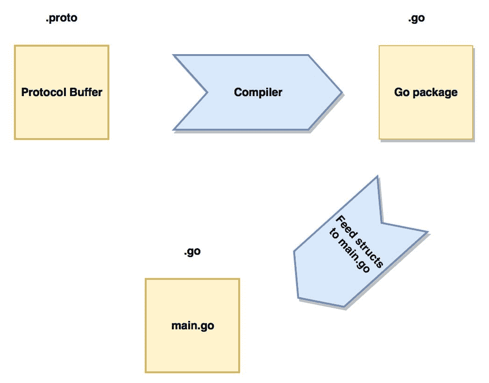
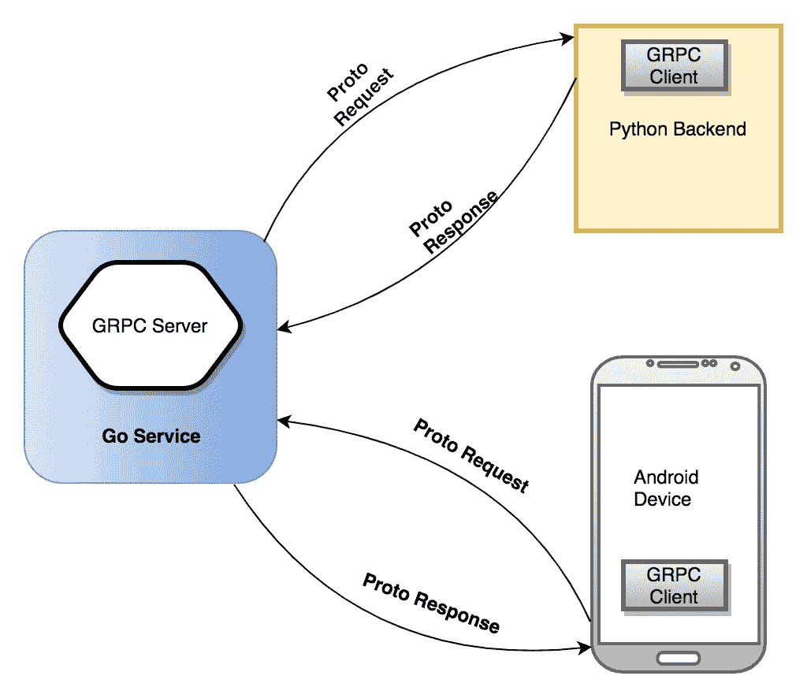

# 使用协议缓冲区和 gRPC 进行工作

在本章中，我们将进入协议缓冲区的世界。REST API 需要来自其他内部服务的支持。这些内部服务可以实现**远程过程调用**（RPC）并使用协议缓冲区作为数据交换格式。首先，我们将发现使用协议缓冲区而不是 JSON 对服务的好处，以及在哪里使用两者。我们将使用谷歌的`proto`库来编译协议缓冲区。我们还将尝试使用协议缓冲区编写一些可以与 Go 或其他应用程序（如 Python 和 Node.js）通信的 Web 服务。然后，我们将解释 gRPC，这是一种高级简化的 RPC 形式。我们将学习如何使用 gRPC 和协议缓冲区帮助我们构建低带宽服务，这些服务可以被不同的客户端消费。最后，我们将讨论 HTTP/2 及其相对于基于纯 HTTP/1.1 服务的优势。

简而言之，我们将涵盖以下主题：

+   协议缓冲区简介

+   协议缓冲区语言

+   使用 protoc 编译协议缓冲区

+   gRPC 简介

+   使用 gRPC 的双向流

# 技术要求

为了运行本章中的代码示例，您需要预先安装以下软件：

+   操作系统：Linux（Ubuntu 18.04）/Windows 10/Mac OS X >=10.13

+   Go 的最新版本编译器 >= 1.13.5

您可以从[`github.com/PacktPublishing/Hands-On-Restful-Web-services-with-Go/tree/master/chapter6`](https://github.com/PacktPublishing/Hands-On-Restful-Web-services-with-Go/tree/master/chapter6)下载本章的代码。克隆代码并使用`chapter6`目录中的代码示例。

# 协议缓冲区简介

HTTP/1.1 是网络社区采用的行业标准。近年来，由于它的优势，HTTP/2 变得越来越受欢迎。使用 HTTP/2 的一些好处如下：

+   发送者和接收者之间的流量控制

+   更好的 HTTP 头部压缩

+   双向流的单一 TCP 连接

+   在单一 TCP 连接上发送文件的推送支持

+   所有主流浏览器的支持

来自谷歌关于协议缓冲区的技术定义如下：

协议缓冲区是一种灵活、高效、自动化的机制，用于序列化结构化数据——想象一下 XML，但更小、更快、更简单。您只需定义一次您希望数据如何结构化，然后您就可以使用特别生成的源代码轻松地将结构化数据写入和读取到各种数据流中，并使用各种语言。您甚至可以在不破坏针对“旧”格式编译的已部署程序的情况下更新您的数据结构。

让我们详细看看。协议缓冲是一种强类型规范语言。紧凑的数据接口对于设计微服务至关重要。协议缓冲允许我们定义多个系统之间的数据合约。一旦定义了协议缓冲文件，我们就可以将其编译为目标编程语言。编译的输出将是目标编程语言中的类和函数。发送者将数据序列化为二进制格式，通过网络传输。接收者反序列化数据并消费它。基本上，协议缓冲类似于 JSON 和 XML 等数据格式，但后者的格式是基于文本的，而协议缓冲是二进制的。

在 Go 中，协议缓冲可以通过不同的传输方式传输，例如 HTTP/2 和 **高级消息队列协议** **（AMQP**）。它们是一种类似于 JSON 的传输格式，但具有严格的类型，并且只能在客户端和服务器之间理解。首先，我们将了解为什么 **协议缓冲** **（protobufs**） 存在以及如何使用它们。

协议缓冲在序列化结构化数据（如以下内容）方面比 JSON/XML 有许多优势：

+   它们有一个强大的接口

+   它们比基于文本的数据格式小得多

+   它们在序列化/反序列化方面通常比 JSON/XML 快

+   由于类型和顺序，它们更少含糊不清

+   它们生成易于编程使用的数据访问类

我们将在本章后面讨论几个示例时证明这些观点。

# 协议缓冲语言

协议缓冲是一个具有极简语言语法的文件。我们编译协议缓冲，为目标编程语言生成一个新的文件。例如，在 Go 中，编译后的文件将是一个 `.go` 文件，其中包含映射 `protobuf` 文件的 struct。在 Java 中，将创建一个 `class` 文件。将协议缓冲视为具有类型的数据结构。协议缓冲语言提供了各种类型，我们可以使用它们来创建接口。首先，我们将讨论所有与等效 JSON 片段相对应的类型。之后，我们将实现一个完整的协议缓冲示例。从现在开始，我们将交替使用术语 `protobuf/s` 和协议缓冲。

在这里，我们将使用 `proto3` 作为我们的 protobuf 版本。版本之间有一些细微的差异，所以请注意在使用较旧版本时的差异。

首先，让我们学习如何在 protobuf 中建模消息。消息是一种传输给接收者的资源。在这里，我们试图定义一个简单的网络接口消息：

```go
syntax 'proto3';

message NetworkInterface {
  int index = 1;
  int mtu = 2;
  string name = 3;
  string hardwareaddr = 4;
}
```

这种语法可能对你来说很新。在前面的代码中，我们正在定义一个名为 `NetworkInterface` 的消息类型。它有四个字段：`index`、**最大传输单元** **（MTU**）、`name` 和硬件地址（*MAC*）。如果我们用 JSON 写同样的内容，它看起来会是这样：

```go
{
   "networkInterface": {
       "index" : 0,
       "mtu" : 68,
       "name": "eth0",
       "hardwareAddr": "00:A0:C9:14:C8:29"
   }
}
```

字段名称被更改为符合 JSON 风格指南，但本质和结构保持不变。但是，前一个 protobuf 文件中字段所赋予的顺序数字（1、2、3、4）是什么？它们是用于在两个系统之间序列化和反序列化协议缓冲区数据的顺序标签。这就像是在暗示协议缓冲区编码/解码系统按特定顺序写入/读取数据。当前一个 protobuf 文件以 Go 为目标编译时，协议缓冲区消息将被转换为 Go 结构体，字段将被填充为空默认值。

在 protobuf 语言中，有许多基本类型。其中一些重要的类型如下：

+   标量值

+   枚举和重复字段

+   嵌套字段

我们将在接下来的部分中简要讨论每个类型。

# 标量值

我们分配给`networkInterface`消息中的字段的类型是标量类型。这些类型与 Go 类型相似，并且与它们匹配。对于其他编程语言，它们将被转换为它们各自的数据类型。Protobuf 支持许多不同的类型，如`int`、`int32`、`int64`、`string`和`bool`，它们类似于 Go 类型，但有一些变化。

它们如下所示：

| **Go 类型** | **Protobuf 类型** |
| --- | --- |
| `float32` | `float` |
| `float64` | `double` |
| `uint32` | `fixed32` |
| `uint64` | `fixed64` |
| `[]byte` | `bytes` |

这些类型可以在定义`protobuf`文件中的字段时使用。在编译时，这些字段和类型在 protobuf 中将转换为相应的 Go 变量和类型。Go 将为未分配的变量填充其空值。让我们看看 protobuf 消息类型在 Go 中的几个默认空值：

| **Protobuf 类型** | **默认值** |
| --- | --- |
| `string` | `""` |
| `bytes` | `empty bytes[]` |
| `bool` | `false` |
| `int`、`int32`、`int64`、`float`、`double` | `0` |
| `enum` | `0` |

由于 protobufs 在端系统之间使用数据结构预先就消息和字段达成协议，因此它们不会像 JSON 那样为键占用额外的空间。

# 枚举和重复字段

**枚举**（**enum**）为给定的一组元素提供数字的顺序。值的默认顺序是从*0*到*n*。因此，在协议缓冲区消息中，我们可以有一个枚举类型。让我们看看`enum`的一个例子：

```go
syntax 'proto3';

message Schedule{
  enum Days{
     SUNDAY = 0;
     MONDAY = 1;
     TUESDAY = 2;
     WEDNESDAY = 3;
     THURSDAY = 4;
     FRIDAY = 5;
     SATURDAY = 6;
  }
}
```

如果我们必须为多个枚举成员分配相同的值怎么办？

Protobuf3 有一个名为**`allow_alias`**的选项，我们可以使用它为两个不同的成员分配相同的值，如下所示：

```go
enum EnumAllowingAlias {
  option allow_alias = true;
  UNKNOWN = 0;
  STARTED = 1;
  RUNNING = 1;
}
```

在这里，`STARTED`和`RUNNING`都有一个`1`标签。这意味着它们在数据中可以具有相同的值。如果我们尝试删除重复的值，我们也应该删除`allow_alias`选项。否则，proto 编译器将抛出错误（我们很快就会看到 proto 编译器是什么）。

`repeated`字段是协议缓冲区消息中的字段，代表一个项目列表。在 JSON 中，我们有一个给定键的元素列表。同样，重复字段允许我们定义特定类型的元素数组/列表：

```go
message Site{
   string url = 1;
   int latency = 2;
   repeated string proxies = 3;
}
```

在前面的代码中，第三个字段是重复字段，这意味着它是一个代理的数组/列表。值可能如下所示：`["100.104.112.10", "100.104.112.12"]`。

# 嵌套字段

我们还可以将一个消息用作另一个消息的类型。它类似于 map 数据结构。它类似于嵌套的 JSON。

例如，看看下面的 JSON 代码：

```go
{
  "site": {
      "url": "https://example.org",
      "latency": "5ms",
      "proxies": [
        {"url": "https://example-proxy-1.org", "latency": "6ms"},
        {"url": "https://example-proxy-2.org", "latency": "4ms"}
      ]
  }
}
```

前面的 JSON 包含有关具有代理列表的站点的信息。每个代理本身就是一个映射，并包含诸如`url`和`latency`之类的详细信息。

我们如何在 protobufs 中建模相同的东西呢？我们可以使用嵌套消息来实现，如下面的代码所示：

```go
message Site {
 string url = 1;
 int latency = 2;
 repeated Proxy proxies = 3;
}

message Proxy {
 string url = 1;
 int latency = 2;
}
```

在这里，我们将`Proxy`类型嵌套到`Site`中。我们很快就会查看所有这些字段类型。您可以在[`developers.google.com/protocol-buffers/docs/proto`](https://developers.google.com/protocol-buffers/docs/proto)找到更多关于类型的详细信息。

在下一节中，我们将了解 protobuf 编译器及其使用方法。

# 使用 protoc 编译协议缓冲

到目前为止，我们已经讨论了如何通过定义消息及其字段类型来编写协议缓冲文件。但我们是怎样实际上将其集成到我们的 Go 程序中的呢？记住，protobufs 是各种系统之间通信的格式，类似于 JSON。但实际传输的数据是二进制的。`protoc`编译器会自动从`.proto`文件生成 Go 结构体。之后，这些结构体可以被导入以创建二进制数据。

以下是我们使用 protobufs 在 Go 程序中遵循的实际步骤：

1.  安装`protoc`命令行工具和`proto`库。

1.  使用`.proto`扩展名编写 protobuf 文件。

1.  编译文件，使其针对编程语言（在我们的例子中是 Go）。

1.  从生成的目标文件导入结构体并添加必要的数据。

1.  将数据序列化为二进制格式并发送给接收器。

1.  在远程机器上，接收器反序列化数据并解码数据。

这些步骤可以在以下图中看到：



第一步是在我们的机器上安装`protobuf`编译器。为此，从[`github.com/google/protobuf/releases`](https://github.com/google/protobuf/releases)下载`protobuf`包。在 Mac OS X 上，我们可以使用以下命令安装`protobuf`：

```go
brew install protobuf
```

在 Ubuntu 或 Linux 上，我们可以将`protoc`复制到`/usr/bin`文件夹：

```go
# Make sure you grab the latest version
curl -OL https://github.com/protocolbuffers/protobuf/releases/download/
v3.11.3/protoc-3.11.3-linux-x86_64.zip
# Unzip
unzip protoc-3.11.3-linux-x86_64.zip -d protoc3
# Move only protoc* to /usr/bin/
sudo mv protoc3/bin/protoc /usr/bin/protoc
```

在 Windows 上，我们只需将可执行文件（`.exe`）从[`github.com/protocolbuffers/protobuf/releases/download/v3.11.3/protoc-3.11.3-win64.zip`](https://github.com/protocolbuffers/protobuf/releases/download/v3.11.3/protoc-3.11.3-win64.zip)复制到`PATH`环境变量中。让我们编写一个简单的协议缓冲文件来展示如何编译和使用目标文件中的结构体。在你的`GOPATH`中创建一个名为`protobufs`的文件夹：

```go
mkdir -r $GOPATH/src/github.com/git-user/chapter6/protobufs
```

在`protobufs`内部，创建一个名为`protofiles`的新目录。此目录包含来自协议缓冲的编译文件。

在`protofiles`目录中，创建一个名为`person.proto`的文件，该文件模拟一个人的信息。它定义了姓名、ID、电子邮件和电话号码。向其中添加一些消息，如下面的代码片段所示：

```go
syntax = "proto3";
package protofiles;

message Person {
  string name = 1;
  int32 id = 2; // Unique ID number for this person.
  string email = 3;

  enum PhoneType {
    MOBILE = 0;
    HOME = 1;
    WORK = 2;
  }

  message PhoneNumber {
    string number = 1;
    PhoneType type = 2;
  }

  repeated PhoneNumber phones = 4;
}

// Our address book file is just one of these.
message AddressBook {
  repeated Person people = 1;
}
```

在这里，我们创建了两个主要的消息，称为`AddressBook`和`Person`。`AddressBook`消息包含一个人员列表。一个`Person`具有`name`、`id`、`email`和`PhoneNumber`。在第二行，我们将包声明为`protofiles`，如下所示：

```go
package protofiles;
```

这告诉编译器添加与给定包名称相关的生成文件。Go 不能直接消费这个`.proto`文件。我们需要将其编译为有效的 Go 文件。编译后，`protofiles`包将用于创建 Go 包。要编译我们的`person.proto`协议缓冲文件，转到`protofiles`目录并运行以下命令：

```go
protoc --go_out=. *.proto
```

此命令将给定的协议缓冲文件转换为具有相同名称的 Go 文件。运行此命令后，你会在同一目录中看到一个新文件已创建：

```go
[16:20:27] git-user:protofiles git:(master*) $ ls -l
total 24
-rw-r--r-- 1 naren staff 5657 Jul 15 16:20 person.pb.go
-rw-r--r--@ 1 naren staff 433 Jul 15 15:58 person.proto
```

新文件的名称是`person.pb.go`。如果我们打开并检查此文件，我们会看到它包含自动生成的代码块：

```go
....
type Person_PhoneType int32

const (
  Person_MOBILE Person_PhoneType = 0
  Person_HOME Person_PhoneType = 1
  Person_WORK Person_PhoneType = 2
)

var Person_PhoneType_name = map[int32]string{
  0: "MOBILE",
  1: "HOME",
  2: "WORK",
}
var Person_PhoneType_value = map[string]int32{
  "MOBILE": 0,
  "HOME": 1,
  "WORK": 2,
}
.....
```

这只是该文件的一部分。输出文件将为给定的结构体（如`Person`和`AddressBook`）创建许多 getter 和 setter 方法。

前面的`person.pb.go`包是由`proto`编译器自动生成的样板代码。我们需要在主程序中消费该包以创建协议缓冲字符串。现在，我们应该创建`main.go`文件，该文件使用`person.pb.go`文件中的`Person`结构体，如下所示：

```go
touch -p $GOPATH/src/github.com/git-user/chapter6/protobufs/basicExample/main.go
```

现在，为了使 Go 能够将结构体序列化为二进制格式，我们需要安装 Go 的`proto`驱动程序。使用`go get`命令安装它：

```go
go get github.com/golang/protobuf/proto
```

我们将要创建的程序的目标是从自动生成的包中读取`Person`结构体，并使用`proto.Marshal`方法将其序列化为缓冲字符串。现在，我们将`main.go`填写如下：

```go
package main

import (
  "fmt"

  "github.com/golang/protobuf/proto"
  pb "github.com/git-user/chapter6/protobufs/protofiles"
)

func main() {
  p := &pb.Person{
    Id: 1234,
    Name: "Roger F",
    Email: "rf@example.com",
    Phones: []*pb.Person_PhoneNumber{
      {Number: "555-4321", Type: pb.Person_HOME},
    },
  }

  p1 := &pb.Person{}
  body, _ := proto.Marshal(p)
  _ = proto.Unmarshal(body, p1)
  fmt.Println("Original struct loaded from proto file:", p, "\n")
  fmt.Println("Marshalled proto data: ", body, "\n")
  fmt.Println("Unmarshalled struct: ", p1)
}
```

在这里，我们正在从`protofiles`包导入**协议缓冲**（`pb`）。我们使用详细信息初始化了`Person`结构体。然后，我们使用`proto.Marshal`函数序列化结构体。如果我们运行这个程序，输出将如下所示：

```go
go run $GOPATH/src/github.com/git-user/chapter6/protobufs/basicExample/main.go
 Original struct loaded from proto file: name:"Roger F" id:1234 email:"rf@example.com" phones:<number:"555-4321" type:HOME >

Marshaled proto data: [10 7 82 111 103 101 114 32 70 16 210 9 26 14 114 102 64 101 120 97 109 112 108 101 46 99 111 109 34 12 10 8 53 53 53 45 52 51 50 49 16 1]

Unmarshaled struct: name:"Roger F" id:1234 email:"rf@example.com" phones:<number:"555-4321" type:HOME >
```

marshaled data 的第二种输出并不明显，因为`proto`库将数据序列化为二进制字节。在 Go 中使用协议缓冲区的另一个优点是，通过编译 proto 文件生成的 struct 可以用来动态生成 JSON。让我们将前面的示例修改成一个新的程序。命名为`jsonExample`：

```go
touch -p $GOPATH/src/github.com/narenaryan/chapter6/protobufs/jsonExample/main.go
```

在这个程序中，我们将使用 JSON 的 marshaler 而不是 protobuf 的 marshaler。Go 接口的美丽之处在于它允许协议缓冲区 struct 作为不同类型 marshaler 的输入。以下是将`Person` struct 转换为 JSON 的修改后的代码：

```go
package main

import (
  "fmt"

  "encoding/json"
  pb "github.com/git-user/chapter6/protobufs/protofiles"
)

func main() {
  p := &pb.Person{
    Id: 1234,
    Name: "Roger F",
    Email: "rf@example.com",
    Phones: []*pb.Person_PhoneNumber{
      {Number: "555-4321", Type: pb.Person_HOME},
    },
  }
  body, _ := json.Marshal(p)
  fmt.Println(string(body))
}
```

如果我们运行这个程序，它将打印出一个可以发送给任何理解 JSON 的客户端的 JSON 字符串：

```go
go run $GOPATH/src/github.com/git-user/chapter6/protobufs/jsonExample/main.go

{"name":"Roger F","id":1234,"email":"rf@example.com","phones":[{"number":"555-4321","type":1}]}
```

任何其他 web 服务/接收器都可以轻松地立即消费这个 JSON 字符串。那么，使用协议缓冲区而不是 JSON 的好处是什么？首先，协议缓冲区旨在让两个后端系统通过一个强大的接口和较小的有效载荷大小相互通信。由于二进制的大小小于文本，因此协议序列化的数据始终比 JSON 文本小得多。

`protobuf`编译器生成的输出仅仅是普通的 Go struct。这允许你轻松地将 protobuf 转换为 JSON。

协议缓冲区仅仅是一种数据格式。它们需要一个传输模式在系统之间移动。我们看到了 RPC 是如何工作的，并在第三章，*与中间件和 RPC 一起工作*中创建了一个 RPC 客户端和服务器。现在，我们将扩展这些知识，使用带有协议缓冲区的**Google 远程过程调用**（**gRPC**）来高效地传输数据。在这种情况下，服务器和客户端可以使用协议缓冲区格式相互通信。

# gRPC 简介

**gRPC**是一种在两个系统之间发送和接收消息的传输机制。传统上，这些系统是服务器和客户端。正如我们在前面的章节中描述的，RPC 可以在 Go 中实现以传输 JSON。我们称之为**JSON RPC**服务。同样，gRPC 专门设计用来以协议缓冲区的形式传输数据。

gRPC 使服务创建变得简单而优雅。它提供了一套不错的 API，我们可以使用这些 API 来定义服务并启动它们。在本节中，我们将重点介绍如何创建 gRPC 服务以及如何使用它。gRPC 的主要优势是它可以被多种编程语言理解。协议缓冲区提供了一种公共的数据结构。因此，这种组合使得各种技术栈和系统之间的通信无缝。这是分布式计算的基本概念。

Square、Netflix 和其他许多巨头利用 gRPC 来扩展他们巨大的流量密集型服务。Google 在他们的网络服务中大量使用 gRPC。我们可以利用它来在两个内部服务之间获得更好的吞吐量。

在编写服务之前，我们需要安装 `grpc` Go 库和一个 `protoc-gen` 插件。使用以下命令安装它们：

```go
go get google.golang.org/grpc
go get -u github.com/golang/protobuf/protoc-gen-go
```

与传统的 HTTP/REST/JSON 架构相比，gRPC 有以下优点：

+   gRPC 使用 HTTP/2，这是一个二进制协议。

+   HTTP/2 中可以实现头部压缩，这意味着开销更小。

+   我们可以在一个连接上多路复用多个请求。

+   我们可以使用 protobufs 来进行数据的严格类型化。

+   使用流式请求或响应，而不是使用请求/响应事务，是可能的。

看一下下面的图表：



前面的图表清楚地表明，任何后端系统或移动应用都可以直接通过协议缓冲区与 gRPC 服务器通信。让我们用 Go 语言和 gRPC 以及协议缓冲区编写一个货币交易服务。gRPC 中的一个服务是一个 RPC 合同。它接收一个消息并返回另一个消息。

实现货币交易服务的步骤如下：

1.  创建包含服务和消息定义的协议缓冲区。

1.  编译协议缓冲区文件。

1.  使用生成的 Go 包创建一个 gRPC 服务器。

1.  创建一个与服务器通信的 gRPC 客户端。

为了理解这些步骤，让我们为即将到来的示例创建项目目录，如下所示：

```go
mkdir -r $GOPATH/src/github.com/git-user/chapter6/grpcExample
mkdir -r $GOPATH/src/github.com/git-user/chapter6/grpcExample/protofiles
```

创建一个名为 `transaction.proto` 的文件来定义 gRPC 服务：

```go
touch -p $GOPATH/src/github.com/git-user/chapter6/grpcExample/protofiles/transaction.proto
```

现在，在 `transaction.proto` 文件中，定义服务和交易消息，如下所示：

```go
syntax = "proto3";
package protofiles;

message TransactionRequest {
   string from = 1;
   string to = 2;
   float amount = 3;
}

message TransactionResponse {
  bool confirmation = 1;
}

service MoneyTransaction {
    rpc MakeTransaction(TransactionRequest) returns (TransactionResponse) {}
}
```

这是一个简单的服务器端货币交易协议缓冲区。我们在讨论协议缓冲区时介绍了 `message` 关键字。新的关键字 `service` 定义了一个 gRPC 服务。这个新关键字仅与 gRPC 相关，`protoc-gen-go` 辅助插件通过 `protoc` 编译器将其转换为可理解格式。现在，让我们使用 `grpcExample` 目录中的 `protoc` 编译此文件：

```go
protoc -I protofiles/ protofiles/transaction.proto --go_out=plugins=grpc:protofiles
```

这个命令比我们之前使用的编译命令稍大。这是因为我们使用了 `protoc-gen-go` 插件。这个命令只是说使用数据文件作为 proto 文件的输入目录，并使用相同的目录输出目标 Go 文件。现在，如果我们列出 `protofiles` 目录，我们会看到一个自动生成的文件，名为 `transaction.pb.go`：

```go
ls protofiles
-rw-r--r-- 1 git-user staff 6215 Jan 16 17:28 transaction.pb.go
-rw-r--r-- 1 git-user staff 294 Jan 16 17:28 transaction.proto
```

现在，我们必须构建一个服务器和客户端，它们消费之前构建的 protobufs。在 `grpcExample` 中创建两个额外的目录，用于服务器和客户端逻辑，如下所示：

```go
mkdir grpcServer grpcClient
```

让我们首先创建一个 `gRPC` 服务器。在 `grpcServer` 目录中添加一个名为 `server.go` 的文件，该文件实现了交易服务。我们的目标是创建一个服务器，它可以从客户端收集交易请求并返回确认。

我们在这里需要更多包的帮助，即 `context` 和 `reflection`。`context` 用于创建一个在 RPC 请求整个生命周期中存在的 `context` 变量。这两个库都由 gRPC 用于其内部函数：

```go
import (
   ...
   pb "github.com/git-user/chapter6/grpcExample/protofiles"
  "golang.org/x/net/context"
  "google.golang.org/grpc"
  "google.golang.org/grpc/reflection"
)
```

如果我们在 `protofiles` 中打开自动生成的 `transaction.pb.go` 包，我们可以清楚地看到有两件重要的事情：

+   `MakeTransaction` 函数作为 `MoneyTransactionServer` 接口的一部分

+   `RegisterMoneyTransactionServer` 函数

`MakeTransaction` 用于实现服务。让我们看看实现细节。它定义了一个结构和一种方法。该方法使用通过 `*pb.TransactionRequest` 参数提供的数据进行货币交易：

```go
// server is used to create MoneyTransactionServer.
type server struct{}

// MakeTransaction implements MoneyTransactionServer.MakeTransaction
func (s *server) MakeTransaction(ctx context.Context, in *pb.TransactionRequest) (*pb.TransactionResponse, error) {
  // Use in.Amount, in.From, in.To and perform transaction logic
  return &pb.TransactionResponse{Confirmation: true}, nil
}
```

`MakeTransaction` 包含 RPC 请求细节。它基本上是一个结构体，映射到我们在协议缓冲文件中定义的 `TransactionRequest` 消息。`MakeTransaction` 返回的是 `TransactionResponse`。此函数签名与我们在协议缓冲文件中最初定义的相匹配：

```go
rpc MakeTransaction(TransactionRequest) returns (TransactionResponse) {}
```

接下来是主块。在这里，我们必须创建 gRPC 服务器的实例，并将其与服务器结构注册。我们在端口 `50051` 上运行这个 gRPC 服务器：

```go
const (
    port = ":50051"
)

func main() {
  lis, err := net.Listen("tcp", port)
  ...
  s := grpc.NewServer()
  pb.RegisterMoneyTransactionServer(s, &server{})
  reflection.Register(s)
  if err := s.Serve(lis); err != nil {
    log.Fatalf("Failed to serve: %v", err)
  }
}
```

现在，我们需要编写一个客户端。在 `grpcClient` 目录中添加一个名为 `client.go` 的文件。客户端应该连接到服务器并获取连接。使用该连接，我们可以调用远程函数并获取结果。gRPC 客户端也使用相同的 protobuf 模板类，以确保与服务器同步。以下是为客户端编写的代码：

```go
package main

import (
  "log"

  pb "github.com/git-user/chapter6/grpcExample/protofiles"
  "golang.org/x/net/context"
  "google.golang.org/grpc"
)

const (
  address = "localhost:50051"
)

func main() {
  // Set up a connection to the server.
  conn, err := grpc.Dial(address, grpc.WithInsecure())
  ...
  // Create a client
  c := pb.NewMoneyTransactionClient(conn)

  from := "1234"
  to := "5678"
  amount := float32(1250.75)

  // Make a server request.
  r, err := c.MakeTransaction(context.Background(),
  &pb.TransactionRequest{From: from,
    To: to, Amount: amount})
  ...
}
```

此客户端也使用 `grpc` 包。它使用一个名为 `context.Background()` 的空上下文传递给 `MakeTransaction` 函数。函数的第二个参数是 `TransactionRequest` 结构体：

```go
&pb.TransactionRequest{From: from, To: to, Amount: amount}
```

现在，让我们同时运行服务器和客户端并查看输出。打开一个新的控制台，并使用以下命令运行 gRPC 服务器：

```go
go run $GOPATH/src/github.com/git-user/chapter6/grpcExample/grpcServer/
server.go
```

TCP 服务器开始监听端口 `50051`。现在，打开另一个终端/外壳，并启动与该服务器通信的客户端程序：

```go
go run $GOPATH/src/github.com/git-user/chapter6/grpcExample/grpcClient/
client.go
```

它打印了成功交易的输出：

```go
2020/01/10 19:13:16 Transaction confirmed: true
```

同时，服务器将此消息记录到控制台：

```go
2020/01/10 19:13:16 Amount: 1250.750000, From A/c:1234, To A/c:5678
```

在这里，客户端向 gRPC 服务器发送了一个单一请求，并传递了 `From A/c` 账号、`To A/c` 账号和 `Amount` 的详细信息。服务器选择这些详细信息，处理它们，并发送响应表示一切正常。

gRPC 客户端可以请求 gRPC 服务器执行计算密集型/安全操作。客户端也可以是移动设备。

完整的程序可以在本章的项目仓库中找到。在下一节中，我们将探讨 gRPC 中的双向流。

# gRPC 的双向流

gRPC 相对于传统 HTTP/1.1 的主要优势是它可以使用单个 TCP 连接在服务器和客户端之间发送和接收多个消息。我们之前看到了货币交易的例子。另一个现实世界的用例是出租车中安装的 GPS。在这里，出租车是客户端，它在其路线中将地理坐标发送到服务器。最后，服务器可以根据两点之间花费的时间和总距离计算总费用。

另一个用例是服务器向客户端推送数据。这被称为服务器推送模型，其中服务器可以将结果流发送回客户端。这与轮询不同，轮询中客户端每次都会创建一个新的请求/响应周期。服务器推送对于构建实时应用非常有用。让我们实现一个示例来说明这一点：

1.  创建一个名为`serverPush`的项目，如下所示：

```go
mkdir -r $GOPATH/src/github.com/git-user/chapter6/serverPush
mkdir -r $GOPATH/src/github.com/git-user/chapter6/serverPush/
protofiles
```

1.  现在，将交易添加到`protofiles`中，这是一个类似于我们在之前的 gRPC 货币交易示例中使用的协议缓冲区，但`MakeTransaction`的返回类型是一个流：

```go
syntax = "proto3";
package protofiles;

message TransactionRequest {
   string from = 1;
   string to = 2;
   float amount = 3;
}

message TransactionResponse {
  string status = 1;
  int32 step = 2;
  string description = 3;
}

service MoneyTransaction {
    rpc MakeTransaction(TransactionRequest) returns (stream
     TransactionResponse) {}
}
```

在协议缓冲区文件中定义了两个消息和一个服务。最有趣的部分在于服务；我们返回一个流而不是一个普通响应：

```go
rpc MakeTransaction(TransactionRequest) returns (stream TransactionResponse) {}
```

这个项目的用例是，客户端向服务器发送货币转账请求，服务器执行一些任务，然后将这些步骤详情作为响应流发送回服务器。

1.  现在，让我们编译`.proto`文件：

```go
protoc -I protofiles/ protofiles/transaction.proto 
 --go_out=plugins=grpc:protofiles
```

这在`protofiles`目录中创建了一个新文件`transaction.pb.go`。我们在服务器和客户端程序中使用此文件中的定义，我们将很快创建这些程序。

1.  现在，让我们编写 gRPC 服务器代码。这段代码与之前的示例略有不同，因为引入了流：

```go
mkdir $GOPATH/src/github.com/git-user/chapter6/serverPush/
grpcServer
touch $GOPATH/src/github.com/git-user/chapter6/serverPush/
grpcServer/server.go
```

我们跳过导入部分，看看程序的主要逻辑。主函数与之前的 gRPC 示例类似，但最有趣的是处理程序。假设处理程序从客户端接收请求并执行三个步骤。在每个步骤的末尾，服务器向客户端发送通知。这是一个长期连接，与之前我们看到的一次性 RPC 调用不同。以下是为流`MakeTransaction`编写的代码：

```go
const (
  port = ":50051"
  noOfSteps = 3
)

// MakeTransaction implements MoneyTransactionServer.MakeTransaction
func (s *server) MakeTransaction(in *pb.TransactionRequest, stream pb.MoneyTransaction_MakeTransactionServer) error {
  log.Printf("Got request for money transfer....")
  log.Printf("Amount: $%f, From A/c:%s, To A/c:%s", in.Amount,
   in.From, in.To)
  // Send streams here
  for i := 0; i < noOfSteps; i++ {
    time.Sleep(time.Second * 2)
    // Once task is done, send the successful message
    // back to the client
    if err := stream.Send(&pb.TransactionResponse{Status: "good",
      Step: int32(i),
      Description: fmt.Sprintf("Performing step %d",
       int32(i))}); err != nil {
      log.Fatalf("%v.Send(%v) = %v", stream, "status", err)
    }
  }
  log.Printf("Successfully transferred amount $%v from %v to %v",
   in.Amount, in.From, in.To)
  return nil
}
```

`MakeTransaction`函数接受一个请求和一个流作为其参数。在函数中，我们正在遍历步骤的数量（这里有三步）并执行计算。服务器正在使用`time.Sleep`函数模拟模拟 I/O 或计算。发送消息的关键服务器方法是`Send`：

```go
stream.Send()
```

这个函数从服务器向客户端发送流响应。

1.  现在，让我们编写客户端程序。这与我们在货币交易示例中看到的基 gRPC 客户端代码略有不同。为客户端程序创建一个新的目录：

```go
mkdir $GOPATH/src/github.com/git-user/chapter6/serverPush/
grpcClient
touch $GOPATH/src/github.com/git-user/chapter6/serverPush/
grpcClient/cilent.go
```

1.  现在，客户端应该无限期地监听消息流。为此，我们使用了`for loop`和`break`。让我们将我们之前的客户端处理程序修改为一个新的名为`ReceiveStream`的处理程序：

```go
// ReceiveStream listens to the stream contents and use them
func ReceiveStream(client pb.MoneyTransactionClient,
 request *pb.TransactionRequest) {
  log.Println("Started listening to the server stream!")
  stream, err := client.MakeTransaction(context.Background(),
   request)
  if err != nil {
    log.Fatalf("%v.MakeTransaction(_) = _, %v", client, err)
  }
  // Listen to the stream of messages
  for {
    response, err := stream.Recv()
    if err == io.EOF {
      // If there are no more messages, get out of loop
      break
    }
    if err != nil {
      log.Fatalf("%v.MakeTransaction(_) = _, %v", client, err)
    }
    log.Printf("Status: %v, Operation: %v", response.Status,
     response.Description)
  }
}
```

在这里，`ReceiveStream`是我们为了发送请求和接收消息流而编写的自定义函数。它接受两个参数：`MoneyTransactionClient`和`TransactionRequest`。它使用第一个参数创建一个流并开始监听它。每当服务器耗尽所有消息时，客户端将停止监听并终止。如果客户端尝试接收消息，将返回一个`io.EOF`错误。我们正在记录从 gRPC 服务器收集到的响应。第二个参数`TransactionRequest`用于首次将请求发送到服务器。运行此操作将使此过程对我们来说更加清晰。

为了简洁起见，省略了服务器和客户端的导入和主要逻辑。请参阅此项目的存储库以获取完整的程序：`chapter6/serverPush`。

1.  在第一个终端上运行 gRPC 服务器：

```go
go run $GOPATH/src/github.com/git-user/chapter6/serverPush/
grpcServer/server.go
```

它将持续监听传入的请求。

1.  现在，在第二个终端上运行客户端以查看其效果：

```go
go run $GOPATH/src/github.com/git-user/chapter6/serverPush/
grpcClient/client.go
```

这将在控制台输出以下内容：

```go
2019/06/10 20:43:53 Started listening to the server stream!
2019/06/10 20:43:55 Status: good, Operation: Performing step 0
2019/06/10 20:43:57 Status: good, Operation: Performing step 1
2019/06/10 20:43:59 Status: good, Operation: Performing step 2
```

同时，服务器也在第一个终端上记录了自己的消息：

```go
2017/07/16 15:08:15 Got request for money Transfer....
2017/07/16 15:08:15 Amount: $1250.750000, From A/c:1234, To A/c:5678
2017/07/16 15:08:21 Successfully transferred amount $1250.75 from 1234 to 5678
```

此过程与服务器同步进行。客户端会保持活跃状态，直到最后一个流式消息被发送回。服务器可以同时处理任意数量的客户端。每个客户端请求都被视为一个独立实体。这是一个服务器发送流式响应的示例。还有其他可以使用协议缓冲和 gRPC 实现的使用案例：

+   客户端发送流式请求以从服务器获取一个最终的响应

+   客户端和服务器都可以同时发送和接收流式请求和响应

官方的 gRPC 团队在 GitHub 上提供了一个很好的示例，演示了如何在 GitHub 上路由出租车。[`github.com/grpc/grpc-go/tree/master/examples/route_guide`](https://github.com/grpc/grpc-go/tree/master/examples/route_guide)。

# 摘要

在本章中，我们通过了解协议缓冲的基本知识开始了我们的旅程。然后，我们遇到了协议缓冲语言，它有许多类型，如标量、枚举和重复类型。我们探讨了 JSON 和协议缓冲之间的几个类比。我们了解到，由于协议缓冲是基于二进制的，因此它们比纯 JSON 数据格式更节省内存。

接下来，我们安装了`protoc`编译器来编译我们用协议缓冲语言编写的文件。然后，我们学习了如何编译`.proto`文件以生成包含样板代码的`.go`文件。这个 Go 文件包含了主程序所需的所有结构和接口。接下来，我们为地址簿和人员编写了协议缓冲。

然后，我们转向了 gRPC，这是 Google 的一种使用协议缓冲区的 RPC 技术。我们看到了 HTTP/2 和 gRPC 的好处。然后，我们定义了一个 gRPC 服务和一些以协议缓冲区形式的数据。接下来，我们实现了从`.proto`文件生成的 gRPC 服务器和 gRPC。

gRPC 技术为流数据提供了一种双向和全双工的传输机制。这意味着它可以使用单个 TCP 连接来传输所有消息。我们实现了一个这样的场景，其中客户端向服务器发送消息，服务器以消息流的形式回复。

在下一章中，我们将学习如何将 PostgreSQL 用作 API 的后端存储。在那里，我们将学习如何与关系型数据库和 Go 一起工作。我们还将学习如何以 Docker 容器的形式运行数据库。
