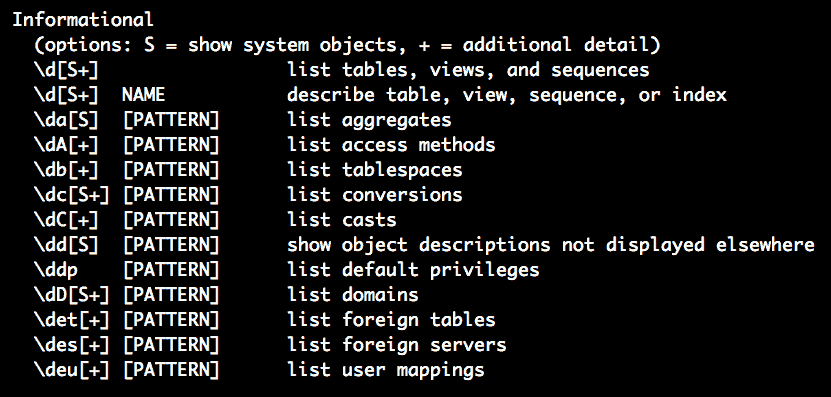

# 与 PostgreSQL、JSON 和 Go 一起工作

在本章中，我们将从宏观的角度审视 SQL。在前面的章节中，我们讨论了 SQLite3，它是一个用于快速原型设计的轻量级数据库。但是，当涉及到开发企业级应用程序时，MySQL 或 PostgreSQL 是首选的选择。两者都是经过充分验证的、功能强大的开源数据库。在本章中，我们将选择 PostgreSQL 作为我们的主要主题。

首先，我们将讨论 PostgreSQL 的内部结构，然后转向使用 Go 数据库。本章的目标是让读者能够舒适地使用 PostgreSQL 和 Go。我们还将构建一个需要数据库层的 URL 缩短服务。

在本章中，我们将涵盖以下主题：

+   讨论 PostgreSQL 的安装选项

+   介绍`pq`，一个纯 PostgreSQL 数据库驱动程序，用于 Go

+   使用 PostgreSQL 和`pq`实现 URL 缩短服务

+   探索 PostgreSQL 中的 JSONStore 功能

# 技术要求

为了运行代码示例，以下软件应预先安装：

+   操作系统：Linux（Ubuntu 18.04）/Windows 10/MacOS X >= 10.13

+   软件：Docker >= 18（Windows 和 MacOS X 的 Docker Desktop）

+   Go 编译器：稳定版本 >= 1.13.5

+   PostgreSQL：稳定版本 >= 10.8

您可以从[`github.com/PacktPublishing/Hands-On-Restful-Web-services-with-Go/tree/master/chapter7`](https://github.com/PacktPublishing/Hands-On-Restful-Web-services-with-Go/tree/master/chapter7)下载本章的代码。克隆代码，并使用`chapter7`目录中的代码示例。

# 讨论 PostgreSQL 的安装选项

PostgreSQL 是一个开源数据库，可以在多个平台上安装。安装 PostgreSQL 有两种标准选项：

+   在机器上手动安装服务器

+   在 Docker 容器中安装

在操作系统上手动安装可以是通用安装。您可以在以下官方 PostgreSQL 链接中找到安装说明：[`www.postgresql.org/download/`](https://www.postgresql.org/download/)。

对于 MacOS X 和 Windows，您将获得直接的安装程序。对于各种 Linux 版本，PostgreSQL 网站有很好的文档，提供了详细的说明。使用通用安装的唯一缺点是，每当您更改版本时，您都必须安装/卸载 PostgreSQL 数据库。在基于容器的系统中，执行环境与主机系统隔离。Docker 就是这样一种流行的容器系统。在接下来的小节中，我们将探讨如何在 Docker 容器中安装 PostgreSQL。

# 通过 Docker 安装

我们也可以通过 Docker 安装 PostgreSQL。由于简化了复杂性和易于安装的过程，这种方法现在是最常见的。假设 Docker 已在您的机器上设置，请按照以下步骤操作：

1.  最新稳定版本是`10.8`。拉取带有版本作为标签的 Docker 镜像，如下所示：

```go
docker pull postgres:10.8
```

1.  使用以下命令查看所有可用镜像的列表：

```go
docker images
```

1.  通过将数据库文件映射到本地文件，在容器内以端口`5432`启动 PostgreSQL 服务器，如下所示：

```go
docker run --name postgres-local -p 5432:5432 -v ~/.postgres-data:/var/lib/postgresql/data  -e POSTGRES_PASSWORD=YOUR_PASSWORD -d postgres:10.8
```

这将在`localhost:5432`上启动 PostgreSQL 服务器。它还将 PostgreSQL 数据库的数据目录挂载到名为`postgres-data`的本地目录。

在运行前面的命令时，将`YOUR_PASSWORD`替换为实际密码。`-d`选项用于在命令中运行容器作为守护进程。现在，PostgreSQL 服务器正在我们的机器上运行。它使用我们之前拉取的`postgres:10.8` Docker 镜像。

我们也可以使用`docker run`命令而不拉取镜像。`docker pull`命令是明确显示我们正在使用`postgres`镜像。

一旦我们安装了 PostgreSQL，我们必须创建默认用户以访问数据库。我们将在下一节中探讨这个问题。

# 在 PostgreSQL 中添加用户和数据库

现在，我们可以创建一个新的用户和数据库。为此，我们将使用 Ubuntu/MacOS X 作为一个通用示例。我们在名为`psql`的 shell 中这样做。我们可以使用`\?`命令在`psql`中查看所有可用的命令。为了进入`psql` shell，首先，切换到`postgres`用户。在 Ubuntu 上，对于通用安装，你可以使用以下命令进入`psql` shell：

```go
sudo su postgres
```

现在，它使我们成为名为`postgres`的用户。然后，使用以下命令启动`psql` shell：

```go
psql
```

在 PostgreSQL 在 Docker 容器中运行的情况下，使用以下命令直接启动`psql` shell：

```go
docker exec -i -t postgres-local-1 psql -U postgres
```

一旦你进入`psql` shell，在 shell 中输入`\?`帮助命令，你将看到所有可用的命令输出，如下面的截图所示：



要列出所有可用的用户及其权限，你将在帮助 shell 的`信息`部分找到以下命令：

```go
\du - List roles
```

角色是授予用户的访问权限。使用`\du`命令，你可以看到默认用户是`postgres`，附有以下角色：

```go
postgres  | Superuser, Create role, Create DB, Replication, Bypass RLS
```

我们需要一个新用户来与 PostgreSQL 一起工作。要添加新用户，只需在`psql` shell 中输入此`SQL`命令：

```go
CREATE ROLE git-user with LOGIN PASSWORD 'YOUR_PASSWORD'; # Caution: Choose strong password here 
```

这创建了一个名为`gituser`的新用户和密码`YOUR_PASSWORD`。现在，使用以下命令给用户权限以创建数据库和进一步的角色：

```go
ALTER USER gituser CREATEDB, CREATEROLE;
```

要删除用户，使用相同上下文中的`DROP`命令，如下所示：

```go
DROP ROLE git-user;
```

不要尝试更改默认`postgres`用户的密码。它被设计为一个超级用户账户，不应作为普通用户保留。相反，创建一个新的角色并为其分配所需的权限。使用强密码。

如果你没有使用**命令行界面**（**CLI**），你可以安装**图形用户界面**（**GUI**）客户端，如**pgAdmin 4**，以访问数据库。

你可以在这里找到更多关于如何将**pgAdmin 4**作为 Docker 应用程序安装的详细信息：[`hub.docker.com/r/dpage/pgadmin4/`](https://hub.docker.com/r/dpage/pgadmin4/)。

现在我们知道了如何创建一个角色，让我们看看一些更常见的**创建**、**读取**、**更新**和**删除**（**CRUD**）SQL 命令，这些命令在大多数关系型数据库中都很常见。看看下面的表格：

| **操作** | **SQL 命令** |
| --- | --- |
| 创建数据库 |

```go
CREATE DATABASE mydb;
```

|

| 创建表 |
| --- |

```go
CREATE TABLE products (
    product_no integer,
    name text,
    price numeric
);
```

|

| 向表中插入 |
| --- |

```go
INSERT INTO products VALUES (1, 'Rice', 5.99);
```

|

| 更新表 |
| --- |

```go
UPDATE products SET price = 10 WHERE price = 5.99;
```

|

| 从表中删除 |
| --- |

```go
DELETE FROM products WHERE price = 5.99;
```

|

这些基本命令可以由许多高级 SQL 运算符支持，例如`LIMIT`、`ORDER BY`和`GROUP BY`。SQL 还有许多其他概念，例如在表之间连接关系。

你可以在这里找到更多关于 PostgreSQL 支持的 SQL 查询的详细信息：[`www.postgresql.org/docs/10/sql.html`](https://www.postgresql.org/docs/10/sql.html)。

在下一节中，我们将看到 Go 程序如何与 PostgreSQL 服务器通信。我们将尝试利用一个名为`pq`的数据库驱动程序。使用该驱动程序包，我们将看到一个将 Web URL 插入 PostgreSQL 的例子。

# 介绍 pq，一个纯 PostgreSQL 数据库驱动程序，适用于 Go

在第四章，《使用流行的 Go 框架简化 RESTful 服务》，我们使用了一个名为`go-sqlite3`的驱动包来与 SQLite3 交互。同样地，`pq`是一个适用于 Go 的数据库驱动包。我们可以通过使用`go get`命令在系统范围内安装该库，如下所示：

```go
go get github.com/lib/pq
```

我们还可以使用`dep`工具安装此包。我们将在本例中使用它。让我们看看安装步骤：

1.  在`GOPATH`中创建一个名为`basicExample`的新项目目录，如下所示：

```go
touch -p $GOPATH/src/github.com/git-user/chapter7/basicExample
```

1.  现在，切换到`basicExample`目录，并使用`dep`安装该目录中的`pq`包，如下所示：

```go
dep init
dep ensure --add github.com/lib/pq
```

这将创建一些配置文件，并在同一目录下添加一个包到供应商中。现在，我们可以创建我们的程序并使用那个`pq`包。

1.  为了创建一个新的表，我们应该在 PostgreSQL 服务器中创建一个新的数据库。要创建一个新的数据库，请进入`psql`外壳或使用**pgAdmin 4**，如下所示（你只需这样做一次）：

```go
CREATE DATABASE mydb;
```

让我们看看一个简短的例子，解释了`pq`驱动程序的使用。在后面的章节中，我们将实现一个 URL 缩短服务。这是该服务的预步骤。我们将按照以下步骤创建一个名为`web_url`的表：

1.  在项目中创建一个名为`helper`的目录，如下所示：

```go
mkdir $GOPATH/src/github.com/git-user/chapter7/basicExample/helper
```

这有助于启动数据库操作，如创建表。

1.  现在，添加一个名为`models.go`的文件。这个文件将包含表创建逻辑。我们使用`sql.Open`来连接到 PostgreSQL。该函数接受数据库类型和数据库字符串作为参数。我们可以使用`db.Prepare`命令准备一个 SQL 语句。

1.  在程序中导入必要的包，如下所示：

```go
package helper

import (
  "database/sql"
  "fmt"
  "log"

  _ "github.com/lib/pq" // sql behavior modified
)
```

1.  现在，创建一些常量来保存数据库连接信息。数据库连接需要一个主机名、端口号、用户名、密码和数据库名，如下面的代码块所示：

```go
const (
  host = "127.0.0.1"
  port = 5432
  user = "git-user"
  password = "YOUR_PASSWORD"
  dbname = "mydb"
)
```

密码应该是你在创建用户时提供的密码。

1.  接下来，创建一个名为 `InitDB` 的函数。它使用连接字符串来打开一个新的数据库连接到 PostgreSQL。在成功连接后，它应该准备一个 SQL 语句来创建一个名为 `web_url` 的表。该函数的代码如下：

```go
func InitDB() (*sql.DB, error) {
    var connectionString = fmt.Sprintf("host=%s port=%d user=%s "+
        "password=%s dbname=%s sslmode=disable",
        host, port, user, password, dbname)

    var err error
    db, err := sql.Open("postgres", connectionString)

    if err != nil {
        return nil, err
    }

    stmt, err := db.Prepare("CREATE TABLE IF NOT EXISTS web_url(ID SERIAL PRIMARY KEY, URL TEXT NOT NULL);")

    if err != nil {
        return nil, err
    }

    _, err = stmt.Exec()

    if err != nil {
        return nil, err
    }

    return db, nil
}
```

`sql.Open` 方法打开连接字符串。然后准备并执行一个 `CREATE TABLE` 查询来创建一个 `web_url` 表（如果该表尚不存在）。如果数据库上的任何操作失败，`InitDB` 将返回一个错误。

1.  让我们创建一个 `main.go` 程序来使用 `helper` 包，如下所示：

```go
mkdir $GOPATH/src/github.com/git-user/chapter7/basicExample/main.go
```

1.  在 `main` 块中，我们可以导入一个 `InitDB` 辅助函数并像这样使用它：

```go
package main

import (
    "log"

    "github.com/git-user/chapter7/basicExample/helper"
)

func main() {
    _, err := helper.InitDB()
    if err != nil {
        log.Println(err)
    }

    log.Println("Database tables are successfully initialized.")
}
```

此程序导入了 `helper` 包并使用其中的 `InitDB` 函数。如果表成功创建，我们将记录一个成功的初始化消息；否则，我们将记录一个错误。

1.  如果你运行程序，你将看到以下信息被打印出来：

```go
go run main.go

2020/02/13 22:15:34 Database tables are successfully initialized.
```

这在 `mydb` 数据库中创建了一个 `web_url` 表。

1.  我们可以通过进入 `psql` 壳并输入以下内容来交叉检查：

```go
\c mydb \dt
```

这将用户连接到 `mydb` 数据库并列出所有可用的表，如下面的代码片段所示：

```go
You are now connected to database "mydb" as user "postgres".
 List of relations
 Schema | Name | Type | Owner
--------+---------+-------+-------
 public | web_url | table | user
(1 row)
```

在 PostgreSQL 中，创建表时需要将 `AUTO_INCREMENT` 类型替换为 `SERIAL`。

正如我们之前承诺的，在下一节中，我们将尝试实现一个 URL 缩短服务。我们首先将概述构建此类服务所需的基本知识。然后，我们将继续进行实现。URL 缩短服务将帮助你清楚地了解 PostgreSQL 如何用于解决问题。

# 使用 PostgreSQL 和 pq 实现 URL 缩短服务

让我们编写 URL 缩短服务的代码来解释前面章节中讨论的所有概念。在编写我们服务的 API 之前，我们需要一些基础知识。首先，我们需要设计一个实现 `Base62` 算法并带有编码/解码函数的包。URL 缩短技术需要 `Base62` 算法将长 URL 转换为短 URL，反之亦然。设计完包后，我们将编写一个示例来展示这种编码是如何工作的。

# 定义 Base62 算法

`Base62` 算法是一个数字编码器，它将给定的数字转换为字符串。它是如何做到这一点的？输入数字是从 62 个字符映射过来的。这个算法的美丽之处在于它为每个给定的数字创建唯一的、较短的字符串。即使输入很大，它也可以生成易于记忆的短字符串。我们使用这种技术将数据库 ID 传递到我们将要创建的 `ToBase62` 函数中，并得到一个短字符串。让我们编写一个实现 `Base62` 算法的示例。逻辑完全是数学性的，可以以不同的方式实现。按照以下步骤进行：

1.  创建一个名为 `base62Example` 的项目，如下所示：

```go
mkdir $GOPATH/src/github.com/git-user/chapter7/base62Example
```

1.  创建一个名为 `base62` 的包并添加一个名为 `encodeutils.go` 的文件，如下所示：

```go
mkdir $GOPATH/src/github.com/git-user/chapter7/base62Example/base62 touch $GOPATH/src/github.com/git-user/chapter7/base62Example/base62
/encodeutils.go
```

1.  定义两个函数，分别命名为 `ToBase62` 和 `ToBase10`。第一个函数接收一个整数并生成一个 `base62` 字符串，而第二个函数则相反，它接收一个 `base62` 字符串并返回原始数字。编码/解码的程序如下：

```go
package base62

import (
     "math"
     "strings"
)

const base = "0123456789abcdefghijklmnopqrstuvwxyzABCDEFGHIJKLMNOPQRSTUVWXYZ"
const b = 62

// Function encodes the given database ID to a base62 string
func ToBase62(num int) string{
    r := num % b
    res := string(base[r])
    div := num / b
    q := int(math.Floor(float64(div)))

    for q != 0 {
        r = q % b
        temp := q / b
        q = int(math.Floor(float64(temp)))
        res = string(base[int(r)]) + res
    }

    return string(res)
}

// Function decodes a given base62 string to database ID
func ToBase10(str string) int{
    res := 0
    for _, r := range str {
        res = (b * res) + strings.Index(base, string(r))
    }
    return res
}
```

1.  创建另一个程序，使用这些实用函数，如下所示：

```go
vi $GOPATH/src/github.com/git-user/chapter7/base62Example/base62/usebase62.go
```

此程序使用从 `encodeutils.go` 导入的函数并计算一个编码字符串。然后，它将其解码回原始数字并打印出数字和字符串，如下所示：

```go
package main

import (
  "log"

  "github.com/git-user/chapter7/base62Example/base62"
)

func main() {
  x := 100
  base62String := base62.ToBase62(x)
  log.Println(base62String)
  normalNumber := base62.ToBase10(base62String)
  log.Println(normalNumber)
}
```

在这里，我们使用 `base62` 包中的 `encode/decode` 函数并尝试打印转换。

1.  我们可以使用以下命令运行程序：

```go
go run usebase62.go
```

它会打印以下内容：

```go
2020/02/14 21:24:43 1C
2020/02/14 21:24:43 100
```

数字 `100` 的 `Base62` 编码是 `1C`。这是因为数字 `100` 在我们的 `base62` 逻辑中缩小为 `1C`。

在学习 `Base62` 编码的基础知识之后，让我们实现一个 URL 缩短服务，我们将利用 `Base62` 算法生成一个短 URL。实现策略如下所示：

1.  设计一个 API 路由以从客户端收集一个长 URL。

1.  将该长 URL 插入数据库并获取该记录的 ID。

1.  使用该 ID 生成一个 `Base62` 字符串，并将其与 API 服务器主机名一起作为响应中的缩短 URL 传递。

1.  当客户端使用该缩短 URL 时，它会击中我们的 API 服务器。

1.  API 服务器然后将 `Base62` 字符串解码回数据库 ID 并获取原始 URL。

1.  最后，客户端可以使用此 URL 跳转到原始网站。

记住，我们正在构建一个支持 URL 缩短的服务。这些服务利用我们的 API 来 `encode/decode` 逻辑请求缩短 URL。

我们将编写一个 Go API 服务，实现上述策略。我们将重用以下文件：

+   从 `base62Example` 项目中获取 `encodeutils.go` 以进行编码/解码

+   从 `basicExample` 项目中获取 `base62` 和 `models.go` 以支持数据库逻辑

我们将使用 `gorilla/mux` 包进行 URL 多路复用，并使用 `pq` 在 PostgreSQL 数据库中存储和检索结果。让我们创建项目结构，如下所示：

1.  目录结构如下所示：

```go
urlshortener
├── main.go
├── helper
│   └── models.go
└── utils
 └── encodeutils.go

2 directories, 3 files
```

1.  将`encodeutils.go`和`models.go`从前面的示例复制到前面代码块中显示的目录。

1.  在主程序中，我们需要两个数据结构：一个用于存储数据库连接，另一个用于存储 URL 缩短服务响应。让我们将响应称为`Record`类型。创建两个结构体，如下所示：

```go
type DBClient struct {
  db *sql.DB
}

type Record struct {
  ID int `json:"id"`
  URL string `json:"url"`
}
```

1.  现在，创建`main`函数，其中我们定义两个 URL 处理函数。这些应用程序路由需要缩短 URL 和检索原始 URL。主块应该创建一个新的数据库连接和两个`mux`路由。我们将`GenerateShortURL`和`GetOriginalURL`函数处理程序附加到这两个 mux 路由。

1.  最后，我们运行 HTTP 服务器，提供 API 服务。以下代码是`main`块：

```go
func main() {
  db, err := models.InitDB()
  if err != nil {
    panic(err)
  }
  dbclient := &DBClient{db: db}
  if err != nil {
    panic(err)
  }
  defer db.Close()
  // Create a new router
  r := mux.NewRouter()
  // Attach an elegant path with handler
  r.HandleFunc("/v1/short/{encoded_string:[a-zA-Z0-9]*}",
   dbclient.GetOriginalURL).Methods("GET")
  r.HandleFunc("/v1/short",
   dbclient.GenerateShortURL).Methods("POST")
  srv := &http.Server{
    Handler: r,
    Addr: "127.0.0.1:8000",
    // Good practice: enforce timeouts for servers you create!
    WriteTimeout: 15 * time.Second,
    ReadTimeout: 15 * time.Second,
  }
  log.Fatal(srv.ListenAndServe())
}
```

看看`POST`操作。`GenerateShortURL`函数处理程序接收一个 HTTP 请求并执行以下操作：

1.  将来自 HTTP 请求体的 URL 插入数据库并检索新记录的 ID。

1.  使用`base62`将 ID 转换为字符串，并在 HTTP 响应中发送，如下所示：

```go
// GenerateShortURL adds URL to DB and gives back shortened string
func (driver *DBClient) GenerateShortURL(w http.ResponseWriter,
r *http.Request) {
    var id int
    var record Record
    postBody, _ := ioutil.ReadAll(r.Body)
    err := json.Unmarshal(postBody, &record)
    err = driver.db.QueryRow("INSERT INTO web_url(url)
     VALUES($1) RETURNING id", record.URL).Scan(&id)
    responseMap := map[string]string{"encoded_string":
     base62.ToBase62(id)}

    if err != nil {
        w.WriteHeader(http.StatusInternalServerError)
        w.Write([]byte(err.Error()))
    } else {
        w.WriteHeader(http.StatusOK)
        w.Header().Set("Content-Type", "application/json")
        response, _ := json.Marshal(responseMap)
        w.Write(response)
    }
}
```

客户端认为原始 URL 已被缩短，但实际上，ID 是通过`base62`算法映射到一个更短的字符串。

现在是`GET`操作。`GetOriginalURL`函数处理程序接收缩短的 URL 并将其转换回原始 URL。逻辑是将`base62`字符串（缩短的字符串）转换为数字，并使用该数字从 PostgreSQL 数据库中检索记录。我们解析输入请求并收集`encoded_string`参数。我们使用它从数据库中检索原始 URL。以下代码是`GetOriginalURL`函数处理程序：

```go
// GetOriginalURL fetches the original URL for the given encoded(short) string
func (driver *DBClient) GetOriginalURL(w http.ResponseWriter,
r *http.Request) {
    var url string
    vars := mux.Vars(r)
    // Get ID from base62 string
    id := base62.ToBase10(vars["encoded_string"])
    err := driver.db.QueryRow("SELECT url FROM web_url
     WHERE id = $1", id).Scan(&url)
    // Handle response details
    if err != nil {
        w.WriteHeader(http.StatusInternalServerError)
        w.Write([]byte(err.Error()))
    } else {
        w.WriteHeader(http.StatusOK)
        w.Header().Set("Content-Type", "application/json")
        responseMap := map[string]interface{}{"url": url}
        response, _ := json.Marshal(responseMap)
        w.Write(response)
    }
}
```

`DBClient`结构体是必需的，以便在各个函数之间传递数据库驱动程序。运行程序，如下所示：

```go
go run $GOPATH/src/github.com/git-user/chapter7/urlshortener/main.go
```

另一个选项是安装一个二进制文件。如果你的`$GOPATH/bin`已经包含在系统`PATH`变量中，我们可以首先安装二进制文件并像这样运行它：

```go
go install $GOPATH/src/github.com/git-user/chapter7/urlshortener/main.go
```

使用二进制文件名，如下所示：

```go
./urlshortener
```

安装二进制文件是一个最佳实践，因为它在系统范围内可用。但对于较小的程序，我们可以从程序的目录中运行`main.go`。

现在，它将在端口`8000`上运行 HTTP 服务器并开始收集 URL 缩短服务的请求。打开控制台并输入以下`curl`命令：

```go
curl -X POST \
 http://localhost:8000/v1/short \
 -H 'cache-control: no-cache' \
 -H 'content-type: application/json' \
 -d '{
 "url": "https://www.packtpub.com/eu/game-development/unreal-engine-4-shaders-and-effects-cookbook"
}'
```

它返回缩短的字符串，如下所示：

```go
{
  "encoded_string": "1"
}
```

编码的字符串只是`"1"`。`Base62`算法从`"1"`开始分配更短的字符串，直到一个由字母数字字符组合。现在，如果我们需要检索原始 URL，我们可以执行一个`GET`请求，如下所示：

```go
curl -X GET http://localhost:8000/v1/short/1
```

它返回以下 JSON 代码：

```go
{
"url":"https://www.packtpub.com/eu/game-development/unreal-engine-4-shaders-and-effects-cookbook"
}
```

因此，该服务可以使用此结果将用户重定向到原始 URL（网站）。在这里，生成的字符串不依赖于 URL 的长度，因为数据库 ID 是编码的唯一标准。

为了简洁起见，省略了`urlshortener`包的导入。请参考`chapter7` GitHub 仓库中的项目代码。

在 PostgreSQL 中，需要在`INSERT` SQL 命令中添加`RETURNING`关键字来获取最后插入的数据库 ID。MySQL 或 SQLite3 的`INSERT INTO web_url( ) VALUES($1) RETURNING id, record.URL`查询并非如此。此数据库查询返回最后插入记录的 ID。如果我们删除那个`RETURNING`关键字，查询将返回空值。

在下一节中，我们将探讨 PostgreSQL 的一个重要特性，称为 JSONStore。与其它关系型数据库不同，PostgreSQL 允许以字段形式存储 JSON。它还提供了一种用于 JSON 的查询语言。

# 探索 PostgreSQL 中的 JSONStore 特性

**PostgreSQL >9.2**有一个名为 JSONStore 的显著特性。PostgreSQL 为 9.2 版本引入了两种新的数据类型用于存储 JSON 数据。PostgreSQL 允许用户将 JSON 数据作为`json`字段或`jsonb`字段插入。这对于需要更灵活结构的现实世界数据建模非常有用。PostgreSQL 通过允许我们存储 JSON 字符串以及关系型数据类型，结合了两者的优点。

`json`和`jsonb`之间的主要区别在于，`json`字段以纯文本形式存储数据，而`jsonb`字段以二进制字段形式存储相同的数据。每个都有其自身的优点。例如，`json`字段通常比`jsonb`字段占用更少的空间，因为它是一个简单的插入操作，但`jsonb`字段对 JSON 进行了索引，以便更好地查询。您应根据 JSON 文档是整体获取还是基于内部键查询来选择合适的字段。

在本节中，我们将尝试理解之前章节中为物流用例定义的一些 JSON 模型，但在这里，我们将使用`jsonb`字段在 PostgreSQL 中存储和检索项目。为了更好地处理 PostgreSQL 的 JSONStore，普通的`pq`库非常繁琐。因此，为了更好地处理，我们可以使用一个名为**Grails Object Relational Mapping**（GORM）的对象关系映射器（ORM）。在下一节中，我们将简要讨论这一点。

# 介绍 GORM，一个强大的 Go 语言 ORM

**GORM**提供了在`database/sql`包中可以执行的所有操作的函数。我们可以使用`dep`工具安装 GORM。在本节中，我们将通过示例展示如何使用`GORM`包插入、检索和查询 PostgreSQL 的`JSON`。

欲获取此 ORM 的完整文档，请访问[`jinzhu.me/gorm/`](http://jinzhu.me/gorm/)。让我们编写一个程序来实现`Shipment`和`Package`类型作为 JSON 模型。我们将使用之前章节中定义的相同模型进行物流。让我们看看步骤：

1.  在`$GOPATH/src/github.com/git-user/chapter7`中创建一个名为`jsonstore`的新目录，并创建文件，如下所示：

```go
mkdir jsonstore
mkdir jsonstore/helper
touch jsonstore/helper/models.go
```

1.  通过`dep`在`jsonstore`目录下安装所有依赖，如下所示：

```go
dep init
dep ensure --add "github.com/gorilla/mux" "github.com/jinzhu/gorm" "github.com/lib/pq"
```

1.  现在，编辑`helper.go`文件以添加`Shipment`和`Package`模型。我们创建的每个模型（表）都应该在`gorm`中以结构体的形式表示。这就是我们创建两个结构体的原因：`Package`和`Shipment`。第一行应该是`gorm.Model`。其他字段是表中的字段。默认情况下，将在数据库中插入的文档中创建一个自增 ID。请参见以下代码：

```go
package helper

import (
  "github.com/jinzhu/gorm"
  _ "github.com/lib/pq"
)

type Shipment struct {
  gorm.Model
  Packages []Package
  Data string `sql:"type:JSONB NOT NULL DEFAULT '{}'::JSONB" json:"-"`
}

type Package struct {
  gorm.Model
  Data string `sql:"type:JSONB NOT NULL DEFAULT '{}'::JSONB"`
}

// GORM creates tables with plural names.
// Use this to suppress it
func (Shipment) TableName() string {
  return "Shipment"
}

func (Package) TableName() string {
  return "Package"
}

```

如果您注意到，在前面的代码块中，`Data`是为`Shipment`和`Package`表创建的`jsonb`字段。

1.  完成结构体的定义后，我们可以编写一个表初始化逻辑，将这些结构体迁移到 PostgreSQL 数据库中的表。为了做到这一点，利用 GORM 包中的`Open`方法获取数据库连接。然后，我们可以使用之前创建的结构体运行`AutoMigrate`方法，将它们保存到数据库中。请参见以下迁移代码：

```go
func InitDB() (*gorm.DB, error) {
  var err error
  db, err := gorm.Open("postgres",
   "postgres://git-user:YOUR_PASSWORD@
   localhost/mydb?sslmode=disable")
  if err != nil {
    return nil, err
  }
  db.AutoMigrate(&Shipment{}, &Package{})
  return db, nil
}
```

这个`InitDB`逻辑与使用`pq`库定义的逻辑相似。这个辅助文件迁移表并将数据库连接返回给调用`InitDB`函数的人。在下一节中，我们将利用这个连接与`Shipment`和`Package`表交互。

# 实现物流 REST API

在深入之前，让我们设计一个 API 规范表，该表显示了各种 URL 端点的 REST API 签名。请参考以下表格：

| **端点** | **方法** | **描述** |
| --- | --- | --- |
| `/v1/shipment/id` | `GET` | 根据 ID 获取一个运输 |
| `/v1/package/id` | `GET` | 根据 ID 获取一个包装 |
| `/v1/package?weight=n` | `GET` | 获取给定重量的包装（以克为单位） |
| `/v1/shipment` | `POST` | 创建一个新的运输 |
| `/v1/package` | `POST` | 创建一个新的包装 |

要实现前面的 API，我们需要一个主程序，该程序将 API 路由注册到处理函数。向我们的`jsonstore`项目添加一个额外的文件，如下所示：

```go
touch jsonstore/main.go
```

在这个程序中，我们将尝试实现`Package`的`POST`和`GET`端点。我们建议将`Shipment`的剩余两个端点作为读者的作业来实现。按照以下步骤操作：

1.  程序结构遵循我们迄今为止看到的程序相同的风格。我们从辅助包中收集数据库连接并使用它来创建`DBClient`。我们使用`gorilla/mux`作为我们的 HTTP 路由器，并使用`gorm`包进行数据库操作。我们应该在我们的程序中有以下路由和处理函数：

```go
type DBClient struct {
    db *gorm.DB
}

func main(){
  ...
  db, err := models.InitDB()
  dbclient := &DBClient{db: db}

  r.HandleFunc("/v1/package/{id:[a-zA-Z0-9]*}",
   dbclient.GetPackage).Methods("GET")
  r.HandleFunc("/v1/package",
   dbclient.PostPackage).Methods("POST")
  r.HandleFunc("/v1/package",
   dbclient.GetPackagesbyWeight).Methods("GET")
  ...
}
```

1.  `POST`处理函数将一个包装对象保存到数据库中。它返回插入记录的 ID。`PostPackage`处理函数的代码如下：

```go
// PostPackage saves the package information
func (driver *DBClient) PostPackage(w http.ResponseWriter,
 r *http.Request) {
  var Package = models.Package{}
  postBody, _ := ioutil.ReadAll(r.Body)
  Package.Data = string(postBody)
  driver.db.Save(&Package)
  responseMap := map[string]interface{}{"id": Package.ID}
  w.Header().Set("Content-Type", "application/json")
  response, _ := json.Marshal(responseMap)
  w.Write(response)
}
```

这个函数正在从响应中读取`POST`正文，并调用 ORM 函数来保存包装数据，如下所示：

```go
driver.db.Save(&Package)
```

在成功将包装保存到数据库后，前面的函数将 ID 作为响应的一部分返回。

1.  现在，让我们编写 `GetPackage` 处理函数的代码。它与前面的处理函数类似，只是它使用了一个不同的数据库函数。在这段代码中，我们不是读取请求体，而是必须读取 `PATH` 变量并使用它来查询数据。请参阅以下代码：

```go
type PackageResponse struct {
    Package helper.Package `json:"Package"`
}

// GetPackage fetches the original URL for the given
// encoded(short) string
func (driver *DBClient) GetPackage(w http.ResponseWriter,
r *http.Request) {
  var Package = models.Package{}
  vars := mux.Vars(r)

  driver.db.First(&Package, vars["id"])
  var PackageData interface{}

  json.Unmarshal([]byte(Package.Data), &PackageData)
  var response = PackageResponse{Package: Package}
  w.WriteHeader(http.StatusOK)
  w.Header().Set("Content-Type", "application/json")
  respJSON, _ := json.Marshal(response)
  w.Write(respJSON)
}
```

在这种情况下，查询如下所示：

```go
driver.db.First(&Package, vars["id"])
```

1.  现在来进行另一个 `GET` 操作。`GetPackagebyWeight` 处理函数查询数据库以获取给定重量的包。在这里，我们对 `data` 字段使用 JSON 查询。我们使用特殊的 `column ->> field` 语法，如下所示的处理代码：

```go
// GetPackagesbyWeight fetches all packages with given weight
func (driver *DBClient) GetPackagesbyWeight(w http.ResponseWriter, r *http.Request) {
  var packages []models.Package
  weight := r.FormValue("weight")
  // Handle response details
  var query = "select * from \"Package\" where data->>'weight'=?"
  driver.db.Raw(query, weight).Scan(&packages)
  w.WriteHeader(http.StatusOK)
  w.Header().Set("Content-Type", "application/json")
  respJSON, _ := json.Marshal(packages)
  w.Write(respJSON)
}
```

在 PostgreSQL 中查询 JSON 的其他变体有很多。您可以在以下链接中找到它们：[`www.postgresql.org/docs/10/functions-json.html`](https://www.postgresql.org/docs/10/functions-json.html)。

在 `GetPackagesbyWeight` 处理函数中，我们通过使用 `db.Raw` 方法对数据库进行原始查询。它返回所有符合重量标准的包列表。对于这个 `GET` API，重量标准列表是由客户端作为查询参数发送的。

在这个 JSONStore 示例中，有四个重要的方面，如下所示：

+   我们将传统的驱动程序 `pq` 替换为了 `GORM` 驱动程序。

+   我们使用了 GORM 函数进行 CRUD 操作。

+   我们将 JSON 插入 PostgreSQL 并检索结果。

+   我们执行了原始 SQL 并对 JSON 字段进行了过滤。

这完成了我们程序的重要逻辑。请参考 `chapter7` 仓库以获取完整的代码。

现在，使用以下命令运行程序：

```go
go run jsonstore/main.go
```

它运行一个 Go 服务器。执行几个 `curl` 命令以查看 API 响应，如下所示：

1.  创建包（`POST`），如下所示：

```go
curl -X POST \
  http://localhost:8000/v1/package \
  -H 'cache-control: no-cache' \
  -H 'content-type: application/json' \
  -d '{
      "dimensions": {
       "width": 21,
        "height": 12
      },
      "weight": 10,
      "is_damaged": false,
      "status": "In transit"
     }'
```

它返回数据库中插入的记录，如下所示：

```go
{
  "id": 1
}
```

1.  现在，我们需要 `GET` 插入包的详细信息，如下所示：

```go
curl -X GET http://localhost:8000/v1/package/1 
```

它返回了 `ID:1` 的包的所有详细信息，如下所示：

```go
{"Package":{"ID":1,"CreatedAt":"2020-02-15T11:14:52.859073Z","UpdatedAt":"2020-02-15T11:14:52.859073Z","DeletedAt":null,"Data":"{\"status\": \"In transit\", \"weight\": 10, \"dimensions\": {\"width\": 21, \"height\": 12}, \"is_damaged\": false}"}}
```

1.  让我们测试我们的第二个 `GET` API，如下所示：

```go
curl -X GET 'http://localhost:8000/v1/package?weight=10'
```

这返回了所有重量为 `10` 克的包，如下所示：

```go
[{"ID":1,"CreatedAt":"2020-02-15T11:14:52.859073Z","UpdatedAt":"2020-02-15T11:14:52.859073Z","DeletedAt":null,"Data":"{\"status\": \"In transit\", \"weight\": 10, \"dimensions\": {\"width\": 21, \"height\": 12}, \"is_damaged\": false}"}]
```

这个项目的目标是展示如何将 JSON 存储在 PostgreSQL 中并从中检索。这标志着我们通过 PostgreSQL 的旅程结束。在 PostgreSQL 中还有更多东西可以探索，但这超出了本书的范围。PostgreSQL 通过允许我们在同一张表中存储关系型数据以及 JSON 数据，将两者的优点结合在一起。它还允许我们查询 JSON 数据。

# 摘要

在本章中，我们通过介绍 PostgreSQL 开始了我们的旅程。我们看到了如何在 Docker 中运行 PostgreSQL，并列出了一些基本的 SQL 查询以进行 CRUD 操作。我们学习了如何在 PostgreSQL 中添加新用户和角色。然后，我们讨论了 `pq`，这是 Go 的 PostgreSQL 驱动程序包的一个示例。

我们使用 Base62 算法设计了一个 URL 缩短服务。我们利用 `pq` 和 `gorilla/mux` 来实现该服务。

从版本 9.2 开始，PostgreSQL 也允许**JSON 存储**（**JSONStore**）。它允许开发者在数据库中插入和检索 JSON 文档。它结合了关系型和非关系型数据库的 JSONStore 功能。

我们还介绍了 GORM，这是 Go 中一个知名的 ORM。使用 ORM，可以轻松管理数据库操作。GORM 提供了一些有用的函数——例如`AutoMigrate`（如果不存在则创建表）——以便在传统的`database/sql`驱动程序上编写直观的 Go 代码。

最后，我们使用 GORM 实现了物流的 REST API。PostgreSQL 是一个成熟的、开源的关系型数据库，可以成为 Go 的良好存储后端。本章的主要目标是让您在 PostgreSQL 和 Go 进行 REST API 开发时感到舒适。

到目前为止，我们已经探讨了构建提供 REST API 的服务器。有时，开发者需要客户端工具来消费 REST API。了解客户端如何消费 REST API 以创建更好的 API 也是很有用的。在下一章中，我们将大致了解如何在 Go 中构建客户端软件。在那里，我们也为 GitHub REST API 开发了 API 客户端。
