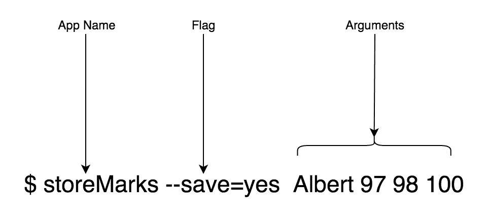
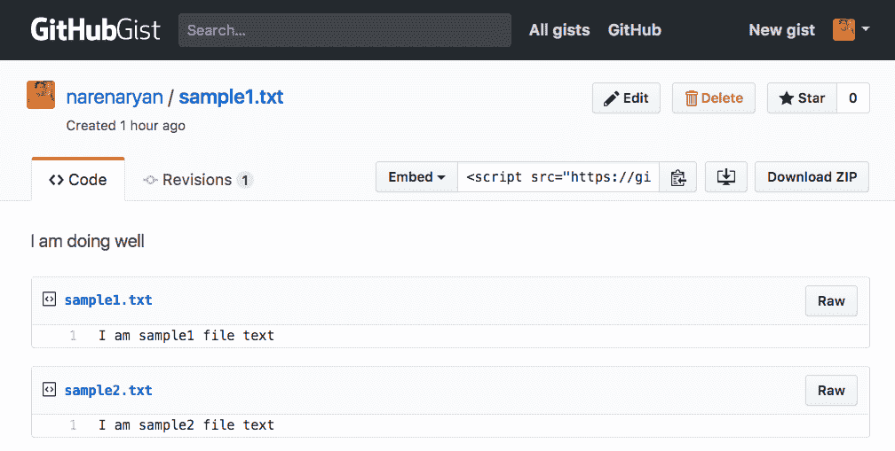
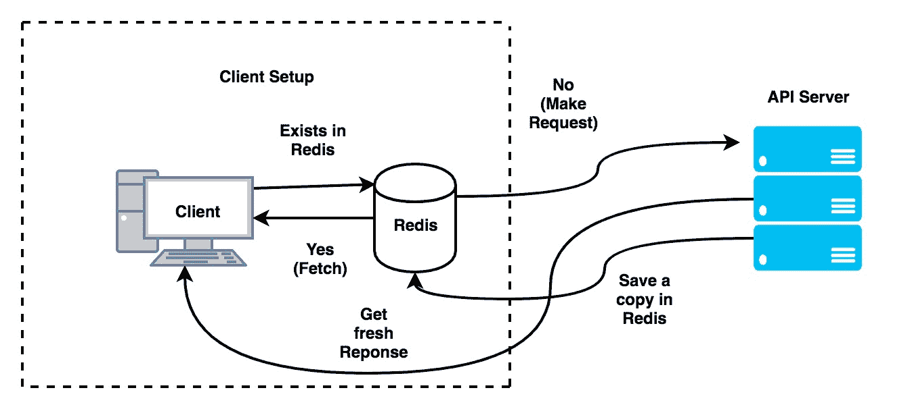

# 在 Go 中构建 REST API 客户端

在本章中，我们将深入讨论 Go 客户端应用程序的工作原理。我们将探索 `grequests`，这是一个类似 Python requests 的库，允许我们从 Go 代码中发起 API 调用。然后，我们将编写一些使用 GitHub API 的客户端软件。在这个过程中，我们将尝试了解两个名为 `cli` 和 `cobra` 的 Go 库。在了解这些库的基本原理之后，我们将编写一个用于命令行的 API 测试工具。然后，我们将介绍 Redis，这是一个内存数据库，我们可以用它来缓存 API 响应以备份数据。

在本章中，我们将涵盖以下主题：

+   构建 REST API 客户端的计划

+   在 Go 中编写命令行工具的基础

+   `grequests` – Go 的 REST API 包

+   熟悉 GitHub REST API

+   Cobra，一个高级 CLI 库

+   为 GitHub REST API 创建 CLI 工具

+   使用 Redis 缓存 API 数据

# 技术要求

以下软件需要预先安装，以便您可以在本章中运行代码示例：

+   操作系统：Linux(Ubuntu 18.04)/ Windows 10/Mac OS X >=10.13

+   Go 稳定版本编译器 >= 1.13.5

+   Dep: Go >= 0.5.3 的依赖管理工具

您可以从[`github.com/PacktPublishing/Hands-On-Restful-Web-services-with-Go/tree/master/chapter8`](https://github.com/PacktPublishing/Hands-On-Restful-Web-services-with-Go/tree/master/chapter8)下载本章的代码。克隆代码并使用`chapter8`目录中的代码示例。

# 构建 REST API 客户端的计划

到目前为止，我们主要关注编写服务器端 REST API。基本上，这些都是服务器程序。在某些情况下，例如 gRPC，我们需要一个客户端。客户端程序从用户那里获取输入并执行一些逻辑。为了开发 Go 客户端，我们应该了解 Go 中的 `flag` 库。在此之前，我们应该了解如何从 Go 程序中发起 API 请求。在前几章中，我们使用了不同的客户端，如 cURL、浏览器、Postman 等。但如何将 Go 程序转换为客户端？

命令行工具与网络用户界面同等重要，用于执行系统任务。在 **企业对企业（B2B**）公司中，软件被打包成一个单一的二进制文件，而不是多个不同的包。作为一名 Go 开发者，您应该知道如何实现为命令行编写应用程序的目标。然后，您可以将这些知识用于轻松优雅地创建与 REST API 相关的 Web 客户端。

让我们探索如何在 Go 中编写 **命令行界面（CLI**）工具的基础。

# 在 Go 中编写命令行工具的基础

Go 提供了一个名为`flag`的内置库，用于编写 CLI 工具。它指的是命令行标志。由于它已经包含在 Go 发行版中，因此无需外部安装任何东西。`flag`包具有多个函数，如`Int`和`String`，用于处理作为命令行标志提供的相应类型输入。假设我们从用户那里收集一个名字并将其打印回控制台。

要做到这一点，我们可以使用`flag.String`方法，如下面的代码片段所示：

```go
import "flag"
var name = flag.String("name", "stranger", "your wonderful name")
```

让我们编写一个简短的程序来更详细地说明`flag`API：

1.  在`GOPATH`中创建一个名为`flagExample.go`的文件，如下所示：

```go
mkdir -p $GOPATH/src/github.com/git-user/chapter8/basic/
touch $GOPATH/src/github.com/git-user/chapter8/basic/flagExample.go
```

1.  现在，我们可以使用`flag`包的`String`方法从命令行作为选项接收一个字符串，如下所示：

```go
package main

import (
    "flag"
    "log"
    )

var name = flag.String("name", "stranger", "your wonderful name")

func main(){
    flag.Parse()
    log.Printf("Hello %s, Welcome to the command line world",
     *name)
}
```

在这个程序中，我们创建了一个名为`name`的标志。它是一个字符串指针。`flag.String`接受三个参数。第一个参数是选项的名称。第二个和第三个参数是该标志的默认值和帮助文本。我们已要求程序在主块中解析所有标志指针。

当我们运行程序时，它会将命令行选项提供的值映射到相应的变量。要在代码中访问标志的值，我们使用`*`，这是一个指针值引用；例如，在先前的代码块中的`*name`。

1.  使用以下命令构建并运行程序：

```go
go build $GOPATH/src/github.com/git-user/chapter8/basic/ flagExample.go
```

这在`basic`目录中创建了一个二进制文件。

1.  我们可以像正常的可执行文件一样运行它，如下所示：

```go
./flagExample
```

它给出了以下输出：

```go
Hello stranger, Welcome to the command line world
```

正如你可能注意到的，我们没有将`name`参数传递给命令。然而，我们确实为该参数分配了默认值。Go 的标志默认值会继续执行。

1.  现在，为了查看可用的选项并了解它们，我们需要请求帮助，如下所示：

```go
./flagExample -h

Output
========
Usage of ./flagExample:
 -name string
 your wonderful name (default "stranger") 
```

这就是为什么我们将帮助文本作为标志命令的第三个参数传递的原因。

在 Windows 中，当我们构建`.go`文件时，将生成`.exe`文件。之后，从命令行，我们可以通过调用程序名称来运行程序。

1.  现在，尝试传递带有值的`name`选项：

```go
./flagExample -name Albert
(or)
./flagExample -name=Albert
```

两种样式都可以正常工作，输出会打印出提供的值：

```go
Hello Albert, Welcome to the command line world
```

1.  如果我们希望传递多个选项，请将`basic`目录中的先前的程序修改为添加年龄，并将其命名为`flagExampleMultipleParam.go`：

```go
package main

import (
    "flag"
    "log"
    )

var name = flag.String("name", "stranger", "your wonderful name")
var age = flag.Int("age", 0, "your graceful age")

func main(){
    flag.Parse()
    log.Printf("Hello %s (%d years), Welcome to the command line
     world", *name, *age)
}
```

1.  这有两个选项，加上不同类型的添加。如果我们构建并运行它，我们将看到以下输出：

```go
./flagExampleMultiParam -name Albert -age 24

Hello Albert (24 years), Welcome to the command line world
```

这正是我们预期的。

1.  我们可以不使用指针，而是通过`init()`函数将变量绑定到解析后的输出。这种绑定是通过`init()`函数完成的，它在 Go 程序中运行，无论是否存在`main`函数：

```go
var name String 

func init() {
  flag.StringVar(&name, "name", "stranger", "your wonderful name")
}
```

这样，值将直接存储在变量中。

1.  完全重写先前的程序以使用`init()`函数创建一个新的程序，可以在以下代码片段中看到：

`basic/initFlag.go`

```go
package main

import (
    "flag"
    "log"
    )

var name string
var age int

func init() {
    flag.StringVar(&name, "name", "stranger", "your wonderful
     name")
    flag.IntVar(&age, "age", 0, "your graceful age")
}

func main(){
    flag.Parse()
    log.Printf("Hello %s (%d years), Welcome to the command
     line world", name, age)
}
```

输出与先前的程序完全相同。在这里，我们能够直接将数据加载到我们的变量中，而不是使用指针。

在 Go 中，执行从主程序开始。然而，一个 Go 程序可以有任意数量的`init`函数。如果一个包中有一个`init`函数，那么它将在`main`函数之前执行。

这个`flag`库非常易于使用。然而，为了编写高级客户端应用程序，我们需要借助 CLI 包的帮助。在下一节中，我们将探讨一个名为`cli`的包，它将做这件事。

# CLI – 用于构建美观客户端的包

`cli`包是 Go 开发者在使用`flag`包之后的下一步。它提供了一个直观的 API，可以轻松地创建命令行应用程序。它允许 Go 程序收集参数和标志。对于设计复杂应用程序来说，它非常方便。

首先，为我们的示例程序创建一个目录。对于我们的基本 CLI 示例，创建以下目录：

```go
mkdir -p $GOPATH/src/github.com/git-user/chapter8/cli/example1
```

要安装此包，我们使用`dep`工具。首先初始化工具，然后将`cli`包作为依赖项添加：

```go
dep init 
dep ensure --add github.com/urfave/cli 
```

现在，我们可以编写一个程序，它的工作方式与先前的标志示例完全相同。创建一个名为`example1/main.go`的文件。

`cli`包提供了三个主要元素：

+   应用程序

+   标志

+   行动

**Apps**用于在应用程序中定义命名空间。**标志**是一个实际的容器，用于存储传递的选项。**Action**是一个在收集的选项上执行的函数。让我们看看以下示例代码以获得更深入的了解。在这里，我们试图使用`cli` API 创建 App、Flags 和 Action。我们必须将包导入到我们的程序中：

```go
package main

import (
  "log"
  "os"

  "github.com/urfave/cli"
)

func main() {
  // Create new app
  app := cli.NewApp()

  // add flags with three arguments
  app.Flags = []cli.Flag {
    cli.StringFlag{
      Name: "name",
      Value: "stranger",
      Usage: "your wonderful name",
    },
    cli.IntFlag{
      Name: "age",
      Value: 0,
      Usage: "your graceful age",
    },
  }
  // This function parses and brings data in cli.Context struct
  app.Action = func(c *cli.Context) error {
    // c.String, c.Int looks for value of given flag
    log.Printf("Hello %s (%d years), Welcome to the command line world",
     c.String("name"), c.Int("age"))
    return nil
  }
  // Pass os.Args to cli app to parse content
  app.Run(os.Args)
}
```

这比我们之前看到的要长，但表达性更强。在这里，我们使用`cli.NewApp`函数创建了一个新的应用程序。这创建了一个新的结构体。我们需要将参数附加到这个结构体上，特别是`Flags`结构体和`Action`函数。`Flags`结构体是一个列表，定义了此应用程序的所有可能的标志。

GoDoc 中`Flag`的结构如下（[`godoc.org/github.com/urfave/cli#Flag`](https://godoc.org/github.com/urfave/cli#Flag)）：

```go
type Flag interface {
    fmt.Stringer
    // Apply Flag settings to the given flag set
    Apply(*flag.FlagSet)
    GetName() string
}
```

内置的结构体，如`StringFlag`和`IntFlag`，实现了这个`Flag`接口。`Name`、`Value`和`Usage`字段很简单。它们与我们使用的`flag`包中的类似。`Action`函数接受`cli.Context`参数。

上下文对象持有有关标志和命令行参数的任何信息。`c.String`、`c.Int`和其他函数用于查找标志变量。例如，在先前的程序中，`c.String("name")`获取一个名为`name`的标志变量。这个程序运行效果与先前的标志示例相同。你可以这样构建和运行程序：

```go
go build example1/main.go

./main -name "Albert" # Run program
```

关于`cli`包的基本用法就这么多。此包还提供了标志和参数的高级组合。我们将在下一节中查看这一点。

# 在 CLI 中收集命令行参数

在 bash 术语中，命令行参数和标志之间有一个区别。以下图表清楚地说明了它们之间的区别：



假设我们有一个名为`storeMarks`的命令行应用程序，用于保存学生的分数。它有一个标志（称为`save`），用于指定是否应该持久化详细信息。提供的参数是学生的姓名和实际分数。我们已经看到了如何在程序中收集标志值。在本节中，我们将学习如何以表达性的方式收集程序参数。按照以下步骤操作：

1.  对于收集参数，我们使用`c.Args`函数，其中`c`是`Action`函数的`cli`上下文。为我们的项目添加一个名为`example2`的新目录：

```go
mkdir -p $GOPATH/src/github.com/git-user/chapter8/cli/example2
```

然后，创建一个名为`example2/main.go`的程序文件。

1.  在主块中定义应用程序 `cli.NewApp`创建一个新的应用程序：

```go
app := cli.NewApp()
```

1.  接下来，我们定义`app.cli.Flag`上的标志，它包含一些预定义的标志，例如整数标志或字符串标志。在这里，我们需要一个字符串标志：

```go
  app.Flags = []cli.Flag{
    cli.StringFlag{
      Name:  "save",
      Value: "no",
      Usage: "Should save to database (yes/no)",
    },
  }
```

1.  现在，我们必须在应用程序上定义操作。操作是定义给定标志上逻辑动态的控制结构。这些选项如下：

+   `--save=no`，跳过将参数保存到数据库

+   `--save=yes`（或）没有标志，将保存参数到数据库：

```go
  app.Version = "1.0"
 // define action
  app.Action = func(c *cli.Context) error {
    var args []string
    if c.NArg() > 0 {
      // Fetch arguments in a array
      args = c.Args()
      personName := args[0]
      marks := args[1:len(args)]
      log.Println("Person: ", personName)
      log.Println("marks", marks)
    }
    // check the flag value
    if c.String("save") == "no" {
      log.Println("Skipping saving to the database")
    } else {
      // Add database logic here
      log.Println("Saving to the database", args)
    }
    return nil
  }
```

所有的前述语句都将进入主函数。

1.  我们必须使用`app.Run`运行应用程序，以便使工具运行并收集参数：

```go
package main

import (
  "github.com/urfave/cli"
  "log"
  "os"
)

func main() {
  // Here goes app, flags, actions
  app.Run(os.Args)
}
```

`c.Args`存储与命令一起提供的所有参数。由于我们知道参数的顺序，我们推断第一个参数是名称，其余的值是分数。我们正在检查一个名为`save`的标志，以确定是否将这些详细信息保存到数据库中（为了简单起见，这里没有数据库逻辑）。`app.Version`设置工具的版本。其他所有内容都与之前的`cli`入门示例相同。

首先，让我们构建程序：

```go
go build $GOPATH/src/github.com/git-user/chapter8/cli/example2
```

现在，从`example2`目录中，通过传递标志及其参数来运行构建的工具：

```go
./main --save=yes Albert 89 85 97

2017/09/02 21:02:02 Person: Albert
2017/09/02 21:02:02 marks [89 85 97]
2017/09/02 21:02:02 Saving to the database [Albert 89 85 97]
```

如果我们不提供标志，默认是`save=no`：

```go
./main Albert 89 85 97

2017/09/02 21:02:59 Person: Albert
2017/09/02 21:02:59 marks [89 85 97]
2017/09/02 21:02:59 Skipping saving to the database
```

到目前为止，一切看起来都很不错。但我们如何使命令行工具在用户需要时显示帮助文本呢？`cli`库为给定的应用程序创建了一个很好的帮助部分。如果您输入以下任何命令，将自动生成一些帮助文本：

+   `./storeMarks -h`

+   `./storeMarks -help`

+   `./storeMarks --help`

+   `./storeMarks help`

出现了一个很好的帮助部分，如下面的代码所示，它显示了版本细节和可用的标志（全局选项）、命令和参数：

```go
NAME:
 storeMarks - A new cli application

USAGE:
 storeMarks [global options] command [command options] [arguments...]

VERSION:
 1.0

COMMANDS:
 help, h Shows a list of commands or help for one command

GLOBAL OPTIONS:
 --save value Should save to database (yes/no) (default: "no")
 --help, -h show help
 --version, -v print the version
```

`cli`包简化了客户端应用程序的开发。它比内部的`flag`包更快、更直观。

命令行工具是在构建程序后生成的二进制文件。它们需要带选项运行。它们就像任何系统程序一样，不再与 Go 编译器相关。确保你为想要运行它们的目标架构构建它们。

我们可以使用`flag`包或`cli`来构建 REST API 客户端。然而，对于高级应用程序，我们可能需要一个功能丰富的强大库。在下一节中，我们将探讨这样一个名为`cobra`的库，它用于创建命令行工具。

# Cobra，一个高级 CLI 库

与`cli`一样，`cobra`是一个用于编写客户端二进制的包，但采用不同的方法。在 cobra 中，我们必须创建单独的命令并在我们的主应用程序中使用它们。我们可以使用 dep 安装`cobra`。让我们创建我们的 cobra 项目仓库：

```go
mkdir -p $GOPATH/src/github.com/git-user/chapter8/cobraCLI 
```

现在，让我们在项目中创建一个名为`cmd`的另一个目录来定义命令。在 cobra 应用程序中，将有一个根命令。这可以有多个子命令。我们可以实现与标志包相同的示例。使用 cobra 从命令行输入姓名和年龄。

让我们定义一个根命令：

```go
var rootCmd = &cobra.Command{
    Use:   "details",
    Short: "This project takes student information",
    Long:  `A long string about description`,
    Args:  cobra.MinimumNArgs(1),
    Run: func(cmd *cobra.Command, args []string) {
        name := cmd.PersistentFlags().Lookup("name").Value
        age := cmd.PersistentFlags().Lookup("age").Value
        log.Printf("Hello %s (%s years), Welcome to the command line
         world", name, age)
    },
}
```

这创建了一个名为“details”的命令。它有几个属性，如`Use`、`Short`、`Long`、`Args`和`Run`。请参阅以下表格以了解它们的精确含义：

| **参数** | **含义** |
| --- | --- |
| `Use` | 命令名称 |
| `Short` | 短描述 |
| `Long` | 长描述 |
| `Args` | 预期参数数量 |
| `Run` | 收集后处理输入 |

在`Run`命令中，我们期望两个参数：`name`和`age`。然而，为了收集它们，我们必须定义它们。在哪里定义它们？Cobra 要求开发者在一个特殊函数`Execute`中定义它们：

```go
// Execute is Cobra logic start point
func Execute() {
    rootCmd.PersistentFlags().StringP("name", "n", "stranger", "Name of
     the student")
    rootCmd.PersistentFlags().IntP("age", "a", 25, "Age of the student")

    if err := rootCmd.Execute(); err != nil {
        fmt.Println(err)
        os.Exit(1)
    }
}
```

我们需要使用之前定义的根命令来附加标志。`PersistentFlags`有各种类型，可以用来收集标志。现在，创建主程序并导入此命令：

```go
touch $GOPATH/src/github.com/git-user/chapter8/cobraCLI/main.go
```

现在，在这个文件中，你可以导入命令并调用`Execute`函数：

```go
package main

import "github.com/git-user/chapter8/cobraExample/cmd"

func main() {
    cmd.Execute()
}
```

就这样。我们有一个客户端应用程序，可以用来收集学生的姓名和年龄。当我们构建它时，它会生成一个二进制文件：

```go
go build $GOPATH/src/github.com/git-user/chapter8/cobraCLI
```

现在，我们可以作为客户端工具运行该二进制文件：

```go
./cobraExample details -n Albert -a 23
```

它将日志打印到控制台：

```go
Hello Albert (23 years), Welcome to the command line world
```

我们也可以以不同的顺序传递标志：

```go
./cobraExample details --age=23 --name=Albert
```

我们也可以在这个命令之上创建许多子命令并做更多的事情。这只是一个基本示例。在下一节中，我们将看到一个高级示例，你将使用 cobra 实现相同的操作。

在本章的后面部分，我们将讨论在 Go 中创建 REST 客户端。在那之前，你应该知道如何从 Go 程序中发送 HTTP 请求。尽管这可以通过 Go 的内置`net/http`包实现，但我们需要一个更直观的包。在下一节中，我们将查看`grequests`，这是一个类似于 Python 的`Requests`的用于发送 HTTP 请求的包。

# grequests，Go 的 REST API 包

在 Python 上工作的开发者都知道`Requests`库。这是一个干净、简洁的库，它不包括在 Python 的标准库中。

Go 的`grequests`包受`Requests`的启发。它提供了一套简单的函数，通过这些函数我们可以从 Go 代码中发出`GET`、`POST`、`PUT`和`DELETE`等 API 请求。使用`grequests`允许我们封装内置的 HTTP 请求和响应。

使用`dep`工具创建项目目录并安装`grequests`：

```go
mkdir -p $GOPATH/src/github.com/git-user/chapter8/requestExample/
touch $GOPATH/src/github.com/git-user/chapter8/requestExample/
basicRequest.go
```

要为 Go 安装`grequests`包，请运行以下`dep`命令：

```go
dep init
dep ensure --add github.com/levigross/grequests
```

现在，让我们编写一个基本程序，说明如何使用`grequests`库向 REST API 发出`GET`请求。它使用了`grequests`库中的`Get`方法：

```go
package main

import (
  "github.com/levigross/grequests"
  "log"
)

func main() {
  resp, err := grequests.Get("http://httpbin.org/get", nil)
  // You can modify the request by passing an optional
  // RequestOptions struct
  if err != nil {
    log.Fatalln("Unable to make request: ", err)
  }
  log.Println(resp.String())
}
```

`grequests`包包含执行所有 REST 操作的方法。前面的程序使用了包中的`Get`函数。它接受两个函数参数。第一个参数是 API 的 URL，而第二个参数是请求参数对象。由于我们没有传递任何请求参数，这里的第二个参数是`nil`。`resp`是从请求返回的，它有一个名为`String()`的函数，该函数返回响应体：

```go
go run requestExample/basicRequest.go
```

输出是`httpbin`返回的 JSON 响应：

```go
{
  "args": {},
  "headers": {
    "Accept-Encoding": "gzip",
    "Connection": "close",
    "Host": "httpbin.org",
    "User-Agent": "GRequests/0.10"
  },
  "origin": "116.75.82.9",
  "url": "http://httpbin.org/get"
}
```

在这里，我们了解了如何使用`grequests`。然而，为了利用其功能，我们应该了解其 API（函数）。

在下一节中，我们将更详细地了解`grequests`库。我们将学习如何配置请求参数和响应属性。

# grequests API 概述

在`grequests`中要探索的最重要的事情不是 HTTP 函数，而是`RequestOptions`结构体。这是一个非常大的结构体，包含有关正在使用的 API 方法类型的各种信息。如果 REST 方法是`GET`，则`RequestOptions`包含`Params`属性。如果方法是`POST`，则结构体将有一个`Data`属性。每次我们向 URL 端点发出请求时，我们都会得到一个响应。让我们看看响应的结构。根据官方文档，响应看起来是这样的：

```go
type Response struct {
    Ok bool
    Error error
    RawResponse *http.Response
    StatusCode int
    Header http.Header
}
```

响应的`Ok`属性包含有关请求是否成功的信息。如果出现问题，`Error`属性中将会找到错误。`RawResponse`是 Go HTTP 响应，它将被`grequests`响应的其他函数使用。`StatusCode`和`Header`分别存储响应的状态码和头部细节。`Response`中有一些有用的函数

+   `Response.JSON()`

+   `Response.XML()`

+   `Response.String()`

+   `Response.Bytes()`

前面的函数可以将响应数据填充到一个通用映射中。让我们看看一个例子，即`requestExample/jsonRequest.go`：

```go
package main

import (
  "github.com/levigross/grequests"
  "log"
)

func main() {
  resp, err := grequests.Get("http://httpbin.org/get", nil)
  // You can modify the request by passing an optional
  // RequestOptions struct
  if err != nil {
    log.Fatalln("Unable to make request: ", err)
  }
  var returnData map[string]interface{}
  resp.JSON(&returnData)
  log.Println(returnData)

}
```

在这里，我们声明了一个接口来保存 JSON 值。然后，我们使用`resp.JSON`函数填充`returnData`（空接口）。这个程序打印的是映射而不是纯 JSON。

您可以通过查看项目文档来了解所有可用的选项：[`godoc.org/github.com/levigross/grequests`](https://godoc.org/github.com/levigross/grequests)。

在下一节中，我们将了解 GitHub API 版本 3 的工作原理，并利用我们对命令行参数的了解来开发一个从 GitHub API 获取有用信息的客户端。

# 熟悉 GitHub REST API

GitHub 提供了一个编写良好、易于消费的 REST API。它通过良好的 API 向客户端开放了有关用户、仓库、仓库统计等信息。当前稳定版本是 v3。API 文档可以在[`developer.github.com/v3/`](https://developer.github.com/v3/)找到。API 的根端点是`https://api.github.com`。

所有 GitHub API 路由都将附加到这个根端点上。让我们学习如何进行一些查询并获取数据。对于未经身份验证的客户端，速率限制是每小时 60 次，而对于传递`client_id`（我们可以从他们的 GitHub 账户控制台获取）的客户端，则是每小时 5,000 次。

如果您有 GitHub 账户（如果没有，强烈建议您创建一个），您可以在“您的资料”|“个人访问令牌”部分找到访问令牌，或者通过访问[`github.com/settings/tokens`](https://github.com/settings/tokens)来找到。使用“生成新令牌”按钮创建一个新的访问令牌。您将被要求为不同的资源提供各种权限。勾选`repo`和`gist`选项。将为您生成一个新的个人令牌字符串。将其保存在安全且私密的地方。生成的令牌现在可以用来访问 GitHub API（以更长的速率限制）。

下一步是将访问令牌导出为环境变量，**`GITHUB_TOKEN`**。您可以使用`export`命令来设置它，如下所示：

```go
export GITHUB_TOKEN=YOUR_GITHUB_ACCESS_TOKEN
```

`YOUR_GITHUB_ACCESS_TOKEN`是从 GitHub 账户生成并保存的。您还可以将前面的导出命令添加到您的**`~/.bashrc`**文件中，以便在下次 shell 启动时保持持久性。

让我们编写一个程序来获取一个用户的全部仓库：

1.  创建一个新的目录和程序，如下所示：

```go
mkdir -p $GOPATH/src/github.com/git-user/chapter8/githubAPI touch $GOPATH/src/github.com/git-user/chapter8/githubAPI/main.go
```

我们应该使用这个逻辑从 Go 程序中发出`GET`请求。此程序从 GitHub API 获取仓库信息。

1.  创建一个结构体来保存仓库的信息。让我们称它为`Repo`。我们还将定义一个环境变量来获取`GITHUB_TOKEN`。现在，我们可以从这个令牌创建请求选项。为了使 GitHub 验证`GET`请求的来源，我们应该将一个名为`Auth`的参数传递给`RequestOptions`结构体。这可以在以下代码块中看到：

```go
var GITHUB_TOKEN = os.Getenv("GITHUB_TOKEN")
var requestOptions = &grequests.RequestOptions{Auth: []string{GITHUB_TOKEN, "x-oauth-basic"}}

type Repo struct {
    ID int `json:"id"`
    Name string `json:"name"`
    FullName string  `json:"full_name"`
    Forks int `json:"forks"`
    Private bool `json:"private"`
}
```

1.  现在，定义一个函数处理程序，它接受一个 URL 作为输入并返回 GitHub API 的`Response`。它会对给定的 URL 位置执行一个简单的 GET 请求。我们使用`grequests`包来对 GitHub 进行 API 调用：

```go
func getStats(url string) *grequests.Response{
    resp, err := grequests.Get(url, requestOptions)
    // You can modify the request by passing an optional RequestOptions struct
    if err != nil {
        log.Fatalln("Unable to make request: ", err)
    }
    return resp
}
```

1.  现在，定义主块，它将 GitHub 链接传递给前面的函数，并将响应存储在 `Repo` 结构体中：

```go
package main

import (
  "github.com/levigross/grequests"
  "log"
  "os"
)

func main() {
  var repos []Repo
  var repoUrl = "https://api.github.com/users/torvalds/repos"
  resp := getStats(repoUrl)
  resp.JSON(&repos)
  log.Println(repos)
}
```

`Response` 包含多个仓库，因此我们必须将响应 JSON 加载到 `Repo` 的数组中。

1.  如果你运行前面的程序，你将收到以下输出：

```go
go run $GOPATH/src/github.com/git-user/chapter8/githubAPI/main.go  2019/07/03 17:59:41 [{79171906 libdc-for-dirk torvalds/libdc-for-dirk 10 false} {2325298 linux torvalds/linux 18274 false} {78665021 subsurface-for-dirk torvalds/subsurface-for-dirk 16 false} {86106493 test-tlb torvalds/test-tlb 25 false}]
```

前面的程序说明了我们如何查询 GitHub API 并将数据加载到我们自定义的 `Repo` 结构体中。返回的 JSON 包含许多字段，但为了简单起见，我们只选择了一些重要的字段。

到目前为止，我们已经看到了如何向 GitHub API 发送 HTTP 请求。在下一节中，我们将创建一个客户端，根据用户命令向 GitHub API 发送 HTTP 请求。

# 创建一个 CLI 工具作为 GitHub REST API 的 API 客户端

在查看这个示例之后，我们将能够轻松地从我们的 Go 客户端访问 GitHub API。我们可以结合本章中我们学到的两种技术来创建一个消耗 GitHub API 的命令行工具。让我们创建一个新的命令行应用程序，执行以下操作：

+   提供通过用户名获取仓库详情的选项

+   使用给定的描述将文件上传到 GitHub Gist（文本片段）

+   使用个人访问令牌进行身份验证

我们将使用 `cli` 包和 `grequests` 来构建这个工具。你还可以在 cobra 中重新实现相同的示例。

Gist 是 GitHub 提供的存储文本内容的小片段。有关更多详情，请访问 [`gist.github.com`](https://gist.github.com)。

在本章的目录中创建一个名为 `gitTool` 的目录，并将 `main` 文件添加到其中，如下所示：

```go
mkdir -p $GOPATH/src/github.com/git-user/chapter8/gitTool
touch $GOPATH/src/github.com/git-user/chapter8/gitTool/main.go
```

首先，让我们定义主块，包含一些 `cli` 命令，这样我们就可以输入用于仓库详细信息和大纲上传操作的命令。在这里，我们使用 `cli` 包中的 `app` 创建 `Commands`。我们在这里定义了两个命令：

```go
func main() {
    app := cli.NewApp()
    // define command for our client
    app.Commands = []cli.Command{
        {
            Name:    "fetch",
            Aliases: []string{"f"},
            Usage:   "Fetch the repo details with user. [Usage]: githubAPI
             fetch user",
            Action: func(c *cli.Context) error {
                if c.NArg() > 0 {
                    // Github API Logic
                    var repos []Repo
                    user := c.Args()[0]
                    var repoUrl = fmt.Sprintf("https://api.github.com/
                     users/%s/repos", user)
                    resp := getStats(repoUrl)
                    resp.JSON(&repos)
                    log.Println(repos)
                } else {
                    log.Println("Please give a username. See -h to
                     see help")
                }
                return nil
            },
        },
        {
            Name:    "create",
            Aliases: []string{"c"},
            Usage:   "Creates a gist from the given text.
             [Usage]: githubAPI name 'description' sample.txt",
            Action: func(c *cli.Context) error {
                if c.NArg() > 1 {
                    // Github API Logic
                    args := c.Args()
                    var postUrl = "https://api.github.com/gists"
                    resp := createGist(postUrl, args)
                    log.Println(resp.String())
                } else {
                    log.Println("Please give sufficient arguments.
                     See -h to see help")
                }
                return nil
            },
        },
    }

    app.Version = "1.0"
    app.Run(os.Args)
}
```

如您所见，`getStats` 和 `createGist` 是用于实际 API 调用的函数。我们将在下面定义这些函数，但在定义之前，我们应该准备一些数据结构来保存有关以下信息的数据：

+   仓库

+   要作为大纲上传的文件

+   GitHub 上的 Gist（文件列表）

现在，我们需要创建三个结构体来保存前面的信息，如下所示：

```go
// Struct for holding response of repositories fetch API
type Repo struct {
    ID       int    `json:"id"`
    Name     string `json:"name"`
    FullName string `json:"full_name"`
    Forks    int    `json:"forks"`
    Private  bool   `json:"private"`
}

// Structs for modelling JSON body in create Gist
type File struct {
    Content string `json:"content"`
}

type Gist struct {
    Description string          `json:"description"`
    Public      bool            `json:"public"`
    Files       map[string]File `json:"files"`
}
```

现在，创建一个请求选项，构建一个头并使用环境变量中的 GitHub 令牌：

```go
var GITHUB_TOKEN = os.Getenv("GITHUB_TOKEN")
var requestOptions = &grequests.RequestOptions{Auth: []string{GITHUB_TOKEN, "x-oauth-basic"}}
```

现在，是时候编写 `getStats` 和 `createGist` 函数了。让我们先编写 `getStats`：

```go
// Fetches the repos for the given Github users
func getStats(url string) *grequests.Response {
    resp, err := grequests.Get(url, requestOptions)
    // you can modify the request by passing an optional
    // RequestOptions struct
    if err != nil {
        log.Fatalln("Unable to make request: ", err)
    }
    return resp
}
```

这个函数发送一个 `GET` 请求并返回响应对象。代码很简单，是一个通用的 GET 请求。

现在，让我们看看 `createGist`。在这里，我们必须做更多的事情。一个大纲包含多个文件。因此，在我们的程序中，我们需要做以下事情：

1.  从命令行参数中获取文件列表。

1.  读取文件内容并将其存储在以文件名为键、内容为值的文件映射中。

1.  将这个映射转换为 JSON。

1.  使用前面的 JSON 作为正文向 Gist API 发送 `POST` 请求。

我们必须向 Gist API 发出`POST`请求。`createGist`函数接受一个 URL 字符串和其他参数。该函数应返回`POST`请求的响应：

```go
// Reads the files provided and creates Gist on github
func createGist(url string, args []string) *grequests.Response {
    // get first two arguments
    description := args[0]
    // remaining arguments are file names with path
    var fileContents = make(map[string]File)
    for i := 1; i < len(args); i++ {
        dat, err := ioutil.ReadFile(args[i])
        if err != nil {
            log.Println("Please check the filenames. Absolute path
             (or) same directory are allowed")
            return nil
        }
        var file File
        file.Content = string(dat)
        fileContents[args[i]] = file
    }
    var gist = Gist{Description: description, Public: true,
     Files: fileContents}
    var postBody, _ = json.Marshal(gist)
    var requestOptions_copy = requestOptions
    // Add data to JSON field
    requestOptions_copy.JSON = string(postBody)
    // make a Post request to Github
    resp, err := grequests.Post(url, requestOptions_copy)
    if err != nil {
        log.Println("Create request failed for Github API")
    }
    return resp
}
```

我们使用`grequests.Post`将文件传递给 GitHub 的 Gist API。在成功创建并包含在响应体中的 gist 详细信息时，它返回`Status: 201 Created`。

现在，让我们构建命令行工具：

```go
go build $GOPATH/src/github.com/git-user/chapter8/gitTool
```

这将在同一目录中创建一个二进制文件。如果我们输入`./gitTool -h`，它将显示以下内容：

```go
NAME:
 gitTool - A new cli application

USAGE:
 gitTool [global options] command [command options] [arguments...]

VERSION:
 1.0

COMMANDS:
 fetch, f Fetch the repo details with user. [Usage]: goTool fetch user
 create, c Creates a gist from the given text. [Usage]: goTool name
     'description' sample.txt
 help, h Shows a list of commands or help for one command

GLOBAL OPTIONS:
 --help, -h show help
 --version, -v print the version
```

如果你查看帮助命令，你会看到两个命令，`fetch`和`create`。`fetch`命令检索给定用户的仓库，而`create`命令使用提供的文件创建一个`gist`。让我们在程序的同一目录中创建两个示例文件来测试`create`命令：

```go
echo 'I am sample1 file text' > githubAPI/sample1.txt
echo 'I am sample2 file text' > githubAPI/sample2.txt
```

使用第一个命令运行工具：

```go
./gitTool f torvalds
```

这返回属于伟大的林纳斯·托瓦兹的所有仓库。日志消息打印出填充的结构体：

```go
[{79171906 libdc-for-dirk torvalds/libdc-for-dirk 10 false} {2325298 linux torvalds/linux 18310 false} {78665021 subsurface-for-dirk torvalds/subsurface-for-dirk 16 false} {86106493 test-tlb torvalds/test-tlb 25 false}]
```

现在，让我们检查第二个命令。这个命令使用给定的描述和一组文件作为参数创建`gist`：

```go
./gitTool c "I am doing well" sample1.txt sample2.txt
```

它返回有关创建的 gist 的 JSON 详细信息。这是一个非常长的 JSON，所以这里省略了输出。现在，如果你打开你的[gist.github.com](https://gist.github.com/)账户，你会看到创建的`gist`：



记住，GitHub 的`gists`API 期望以下格式的 JSON 数据作为正文：

```go
{
  "description": "the description for this gist",
 "public": true,
 "files": {
 "file1.txt": {
 "content": "String file contents"
    }
  }
}
```

对于任何 Go 程序快速读取和理解，请遵循`main`函数，然后进入其他函数。通过这样做，我们可以从整个应用程序中阅读代码。

作为练习，在`cobra`中根据前面的要求构建一个命令行工具。

# 使用 Redis 缓存 API 数据

**Redis**是一个内存数据库，可以存储键/值对。它最适合存储大量读密集型数据的使用场景。例如，BBC 和《卫报》等新闻机构在他们的仪表板上显示最新的新闻文章。他们的流量很高，如果需要从数据库中检索文档，他们必须始终维护一个巨大的数据库集群。

由于给定的新闻文章集合在数小时内不会改变，一个机构可以维护一个文章缓存。当第一个客户访问页面时，文章的副本从数据库中提取出来，放置在 Redis 缓存中，然后发送到浏览器。然后，对于另一个客户，新闻机构服务器从 Redis 读取内容而不是直接击中数据库。由于 Redis 运行在主内存中，延迟最小。因此，客户看到页面加载更快。网络上的基准测试可以告诉我们一个网站如何有效地优化其内容。

如果数据在 Redis 中不再相关怎么办？（例如，机构更新了其头条新闻。）Redis 提供了一种使存储在其中的`keys:values`过期的方法。我们可以运行一个调度器，在过期时间过后更新 Redis。

同样，我们可以缓存给定请求（`GET`）的第三方 API 响应。我们需要这样做，因为像 GitHub 这样的第三方系统有速率限制（建议我们保守）。对于给定的 `GET URL`，我们可以将 `URL` 存储为键，将 `Response` 存储为值。当在下一个时间（在键过期之前）收到相同的请求时，只需从 Redis 中拉取响应，而不是击中 GitHub 服务器。

此方法也适用于我们的 REST API。最频繁且未更改的 REST API 响应可以被缓存，以减少对主数据库的负载。

对于 Go 语言，有一个可以与 Redis 通信的出色库。它可以在 [`github.com/go-redis/redis`](https://github.com/go-redis/redis) 找到。这是一个广为人知的库，许多开发者都推荐使用。以下图表很好地说明了这个概念：



这里有一个需要注意的地方是 API 的过期。由于其实时性，实时 API 不应该被缓存。缓存将性能优化带到了我们的餐桌上，同时也带来了一些关于数据同步的头痛问题。

在缓存时请小心。始终实现一个健壮的缓存失效方法。全球有许多更好的实践。请查阅它们，以了解各种架构。

我们将在下一章更详细地讨论 Redis，其中我们将讨论可以用来开发异步 API 的策略。

# 摘要

我们从理解客户端软件开始本章：软件客户端是如何工作的，以及我们如何创建几个。我们看到了编写命令行应用程序的基础。`cli` 是一个第三方包，它允许我们创建美观的命令行应用程序。安装后，我们学习了如何通过该工具收集命令行参数。我们还探索了 CLI 应用程序中的命令和标志。接下来，我们研究了 `grequest`，这是一个类似于 Python 请求的包，用于从 Go 代码中发送 API 请求。我们学习了如何从客户端程序中制作 `GET`、`POST` 和其他请求。我们还查看了一个名为 `cobra` 的新包，用于创建命令/子命令。

然后，我们探索了 GitHub API 以及如何获取存储库的详细信息。在了解这两个概念之后，我们开发了一个客户端，该客户端列出给定用户的存储库，并创建一个 `gist`（GitHub 上的文本片段集合）。最后，我们介绍了 Redis 架构以及缓存如何帮助我们处理速率限制的 API。

在下一章中，我们将讨论在队列和缓存的帮助下构建异步 API 的策略。
