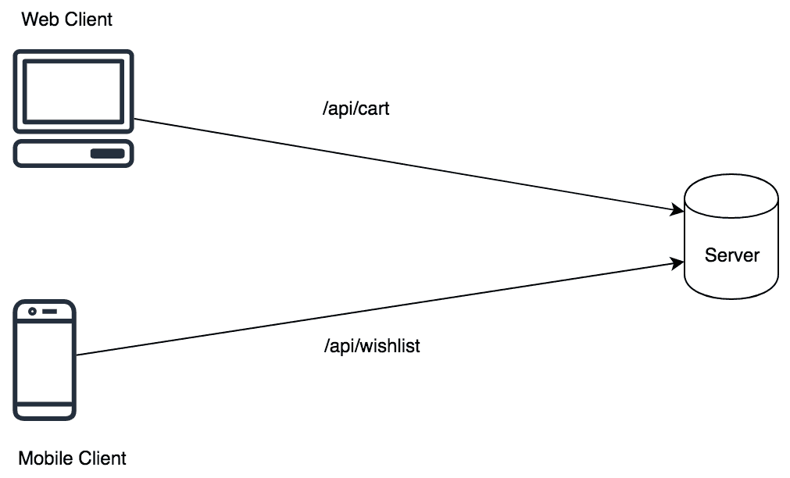
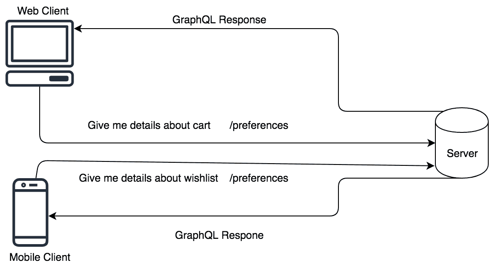

# GraphQL 和 Go

在本章中，我们将介绍一种名为 GraphQL 的新查询语言。传统的 API 定义未能解决欠取和过取 API 的问题。欠取 API 是指为特定请求提供最小细节集的 API。其缺点是开发者必须始终创建新的 API 或更新现有的 API。为了克服这一点，他们可以提供客户端可以安全忽略的额外数据。这导致另一个副作用；那就是它增加了响应的有效负载大小。这种情况被称为**过取**。过取 API 为客户端提供不必要的或不受欢迎的数据。当设计针对客户端的 API 时，如果网络带宽有限制，响应大小至关重要。

GraphQL 是一种解决这个问题的查询语言。在本章中，我们将学习客户端如何使用 GraphQL 高效地从 API 中查询数据。与每个框架一样，GraphQL 也有一些限制，但它的优点超过了这些限制。

在本章中，我们将涵盖以下主题：

+   什么是 GraphQL？

+   REST API 中的过取和欠取问题

+   GraphQL 基础

+   在 Go 中创建 GraphQL 客户端

+   在 Go 中创建 GraphQL 服务器

# 技术要求

为了运行本章中的代码示例，以下软件需要预先安装：

+   操作系统：Linux (Ubuntu 18.04)/Windows 10/Mac OS X >=10.13

+   Go 稳定版本编译器 >= 1.13.5

+   Dep: Go >= 0.5.3 的依赖管理工具

+   Docker 版本 >= 18.09.2

您可以从[`github.com/PacktPublishing/Hands-On-Restful-Web-services-with-Go/tree/master/chapter10`](https://github.com/PacktPublishing/Hands-On-Restful-Web-services-with-Go/tree/master/chapter10)下载本章的代码。克隆代码并使用`chapter10`目录中的代码示例。

# 什么是 GraphQL？

**GraphQL** 是一种提供一组规则的查询语言。使用这些规则和结构，我们可以设计一个高效的 API。根据官方文档，GraphQL 的定义如下：

"GraphQL 提供了 API 中数据的完整和可理解的描述，赋予客户端请求所需数据的权力，而不需要更多，这使得 API 随时间演变更加容易，并使强大的开发者工具成为可能。"

[-https://graphql.org/](https://graphql.org/)

GraphQL 提供了一些开箱即用的功能：

+   模式（一种类型系统）

+   无版本 API

+   从模式到代码

GraphQL 模式是定义 API 边界的语法。边界包含有关通过 API 暴露的服务器资源的信息。由于它允许在客户端失败之前动态更新模式，因此它帮助我们创建无版本 API。GraphQL 为处理模式中定义的资源提供了客户端和服务器库。

GraphQL 是一种语言，而不是运行时。因此，有人必须将 GraphQL 模式翻译成编程语言可以理解的代码。一些 GraphQL 客户端和服务器库可以从模式定义中自动生成一些代码。

关于其功能，让我们看看传统 API 和 GraphQL API 之间的区别。

例如，在电子商务中，购物车页面或愿望清单页面几乎获取相同的资源（大多数字段），如产品链接、图片和成本。然而，有一些事情是不同的。例如，购物车页面需要一个送货地址，而愿望清单则不需要。

API 的流程如下：



假设前面请求的响应如下所示：

购物车页面（网页）：

```go
{
  'product': 'shoe',
  'cost': '20$',
  'link': 'http://example-product/1',
  'image': 'http://example-image.com'
  'shipping_address': 'some_square, Germany'
}
```

愿望清单（移动端）：

```go
{
  'product': 'shoe',
  'cost': '20$',
  'link': 'http://example-product/1',
  'image': 'http://example-image.com'
  'related_products': ['sports_band']
}
```

API 开发者通常定义两个端点，一个用于购物车，另一个用于愿望清单。如果两个响应的内容几乎包含相同的数据，它们可以合并为一个以提高可维护性。对于 API 调用中的一个，可能会出现过度获取的问题。

GraphQL 提供给客户端他们确切需要的东西。通过网络传输的数据始终符合客户端的请求。以下图表更详细地展示了这一点：



同一个 API 端点可以用于多个客户端，这些客户端接受相同的资源，但数据字段没有差异。这正是 GraphQL 的美丽之处。我们将在接下来的章节中查看更多实际示例。

在下一节中，我们将向您展示一个如何在一个 API 中发生过度获取和不足获取的稳固示例。

# REST API 中的过度获取和不足获取问题

**过度获取**发生在 API 上，当服务器发送客户端不需要的数据时。API 是预先定义的，客户端只需要遵循 API 文档。这种做法的缺点是带宽被浪费。让我们看看一个例子。

你试图使用 GitHub 用户的 REST API 来创建用户头像显示。这里的主要目的是查看他们的关注者、他们的公开代码片段、他们标记的仓库和公司名称。然而，当你使用用户`octocat`调用 GitHub API ([`developer.github.com/v3/users/#get-a-single-user`](https://developer.github.com/v3/users/#get-a-single-user))时，它返回了一个看起来像这样的 JSON：

```go
{
  "login": "octocat",
  "id": 1,
  "node_id": "MDQ6VXNlcjE=",
  "avatar_url": "https://github.com/images/error/octocat_happy.gif",
  "gravatar_id": "",
  "url": "https://api.github.com/users/octocat",
  "html_url": "https://github.com/octocat",
  "followers_url": "https://api.github.com/users/octocat/followers",
  "following_url":
    "https://api.github.com/users/octocat/following{/other_user}",
  "gists_url": "https://api.github.com/users/octocat/gists{/gist_id}",
  "starred_url":
    "https://api.github.com/users/octocat/starred{/owner}{/repo}",
  "subscriptions_url":
    "https://api.github.com/users/octocat/subscriptions",
  "organizations_url": "https://api.github.com/users/octocat/orgs",
  "repos_url": "https://api.github.com/users/octocat/repos",
  "events_url": "https://api.github.com/users/octocat/events{/privacy}",
  "received_events_url":
    "https://api.github.com/users/octocat/received_events",
  "type": "User",
  "site_admin": false,
  "name": "monalisa octocat",
  "company": "GitHub",
  "blog": "https://github.com/blog",
  "location": "San Francisco",
  "email": "octocat@github.com",
  "hireable": false,
  "bio": "There once was...",
  "public_repos": 2,
  "public_gists": 1,
  "followers": 20,
  "following": 0,
  "created_at": "2008-01-14T04:33:35Z",
  "updated_at": "2008-01-14T04:33:35Z",
  "private_gists": 81,
  "total_private_repos": 100,
  "owned_private_repos": 100,
  "disk_usage": 10000,
  "collaborators": 8,
  "two_factor_authentication": true,
  "plan": {
    "name": "Medium",
    "space": 400,
    "private_repos": 20,
    "collaborators": 0
  }
}
```

这是一个大 JSON 文件，其中包含空格和换行符，而你只需要上述数据字段。因此，在 37 个字段中，我们只将消费四个字段，忽略其余的。

忽略并不是问题，但所有数据都通过网络传输到客户端。这是带宽的不必要浪费。这被称为**过度获取**。

**不足获取**是指 API 服务器发送的响应不足以让客户端做出决策。这导致以下条件：

+   客户端必须对不同的端点进行后续的 API 调用以获取数据。

+   客户端必须手动在获取的数据上计算，然后合并它们。

这是一种非常低效的方法，因为与服务器相比，客户端的资源非常有限。例如，如果移动设备因为数据获取不足而必须执行昂贵的操作，API 必须改变其策略以提供足够的数据。这可能导致数据获取过多。找到正确的平衡总是很棘手。

让我们以前面从 GitHub API 获取用户信息的例子为例。要获取星标仓库，我们必须调用`User`，然后使用`starred_url` API 端点进行进一步查询：

```go
"starred_url": "https://api.github.com/users/octocat/starred{/owner}{/repo}",
```

这是一个经典的欠获取问题，限制了 GitHub API 直到版本 3（V3）。他们通过引入 GraphQL API V4（[`developer.github.com/v4`](https://developer.github.com/v4)）来解决这个问题。

GraphQL 通过采取全新的方法来解决此问题。它将每个实体视为一个资源，并试图围绕它构建一个 API。这使 GraphQL 能够动态组合数据。

在下一节中，我们将探讨 GraphQL 的基础知识，如语法和定义。这包括类型、查询和用于操作数据的功能。

# GraphQL 基础知识

GraphQL 模式由许多构建块组成。这些构建块如下：

+   类型

+   查询

+   函数

+   别名

+   变量

+   变更

所有这些块对于构建一个功能性的 GraphQL API 都是必不可少的。我们可以将这些组件分为两大类：

+   模式和类型

+   查询和变更

每个类别中都有许多功能，但我们只会讨论那些可以帮助你理解 GraphQL 的最重要功能。让我们以从 API 获取用户记录为例。

注意：从现在起，我们展示的所有代码片段都位于第十章“GraphQL 和 Go”的 intro 目录中。

一个典型的 GraphQL 模式看起来像这样：

```go
type Query {
  user: Person
}

type Person {
  name: String,
  address: [Address]
}

type Address {
  city: String,
  street: String,
  postalCode: Float
}
```

这是一个包含三种类型的 GraphQL 模式：一个称为`Query`的特殊类型和两个其他自定义类型`Person`和`Address`。

此模式是 API 的规范。它定义了可用于查询的资源类型。它还定义了一个特殊类型，称为`Query`，客户端使用它来查询数据。在先前的 GraphQL 模式中，只能查询`Person`类型的`user`。

客户端对`/api/users`端点的查询看起来是这样的：

```go
{
  user {
    name
    address {
      city
      street
      postalCode
    }
  }
}
```

服务器随后发送足够的信息以供之前请求的字段使用：

```go
{
  "data": {
    "user": {
      "name": "alice",
      "address": [{
        "city": "Munich",
        "street": "Marianplatz",
        "postalCode": "80331"
      }]
    }
  }
}
```

如果客户端不需要`address`字段而只需要`name`字段，它只能向同一端点请求`name`，即`/api/users`：

```go
{
  user {
    name
  }
}
```

服务器的响应可能如下所示：

```go
{
  "data": {
    "user": {
      "name": "alice"
    }
  }
}
```

这个响应只保留了`name`字段并省略了`address`字段。这可以节省大量的带宽。

GraphQL 响应的形状直接匹配查询，因此客户端可以预测他们能得到什么。

我们将在下一节中学习类型和查询。

# 类型与查询

GraphQL 有一个类型系统，服务器应该了解以便准备模式。有四种高级类型：

+   对象级别

+   字段级别

+   非空

+   枚举

让我们详细看看每种类型。

# 对象级别类型

对象级别类型用于定义对象级别结构，如查询和资源。它们对于定义 API 上允许的资源和方法非常有用。以下是我们前面例子中看到的内容，其中我们定义了一个查询：

```go
type Query {
  user: Person
}
```

这些是特殊类型，不应与编程语言中的类型混淆。

# 字段级别类型

正如其名所示，字段级别类型是在资源/查询字段上定义的。它们与编程语言中的类型相似。它告诉我们 API 将返回什么数据类型。它可以进一步分为两种类型：

+   标量类型（String，Int，Float，Boolean，ID）

+   自定义类型（地址）

在前面的例子中，`Person` 对象级别类型有以下字段：

+   `name`

+   `address`

`Person`资源的 Go 结构体看起来像这样：

```go
type Person {
 name: String,
 address: [Address]
}
```

`name`字段有一个名为`String`的类型，而`address`字段有一个名为`[Address]`的类型，它是一组地址。

# 非空类型

这是一个特殊类型，它使用特殊语法的普通字段类型并使字段成为强制性的。当一个类型具有非空类型字段时，它应向客户端返回非空数据。类型以结尾的!（感叹号）定义。

以`Person`类型为例：

```go
type Person {
  name: String,
  address: [Address]
}
```

如果我们将`name`字段设置为非空，它将看起来像这样：

```go
type Person {
  name: String!,
  address: [Address]
}
```

这意味着如果客户端请求某些数据，则响应必须为`name`字段返回一个非空值。它不能为空。我们还可以有一个非空列表，如下所示：

```go
address: [Address]!
```

上述语法可以在响应中返回零个或多个`Address`类型的元素。

如果我们需要返回至少一个地址，则可以将非空规则应用于列表元素：

```go
address: [Address!]!
```

上述规则创建了一个包含`Address`类型列表的地址字段。该列表应至少返回一个地址给客户端。

接下来，我们将介绍另一个重要的类型，称为`枚举`。

# 枚举

**枚举**（**Enums**）是特殊类型，在定义一系列标量类型时提供了灵活性。它们对于向客户端传递一系列信息非常有用。它给 API 带来了以下好处：

+   它允许 API 使用一组类型验证字段。

+   在不放弃类型系统的情况下，它表明可访问的字段值将位于一个有限集合中。

让我们看看一个示例模式：

```go
type Query {
  vehicle: Vehicle
}

enum Vehicle {
  Car
  Bus
}

type Car {
  name: String,
  wheels: Int
}

type Bus {
  name: String,
  wheels: Int
}
```

在这个 GraphQL 模式中，我们定义了一个以`vehicle`为字段的查询类型。`Vehicle`是一个枚举。车辆有`Car`和`Bus`作为其成员。这意味着对这个模式的查询可以期望得到一个`Car`或`Bus`。这给了我们比预定义类型系统更多的灵活性。

在本节中，我们介绍了定义模式的基础以及我们可以定义的类型。在下一节中，我们将学习如何在客户端编写高级查询以获取数据。 

# 查询和突变

到目前为止，我们已经看到了客户端 GraphQL 查询的工作方式。它描述了应该提供的数据相关的字段。但如果我们需要关于某些标准的数据呢？我们可以用一些值进行查询吗？是的！GraphQL 是基于查询构建的，它提供了我们在查询时可以使用的各种选项。

让我们回到我们最初展示的初始示例，即具有 `name` 和 `address` 的用户 API。客户端查询如下所示：

```go
{
  user {
    name
    address {
      street
    }
  }
}
```

前面的查询从 GraphQL 服务器获取所有用户。我们也可以通过名称查询一条记录。查询语法在字段上使用括号和冒号（:）。让我们检索名为 `"alice"` 的用户。前面的客户端查询应该使用括号进行修改，如下所示：

```go
{
  user {
    name(name: "alice")
    address {
      city
      street
    }
  }
}
```

此查询仅获取名为 `"alice"` 的记录/记录。这种结构类似于编程语言中的函数调用。`name: "alice"` 被称为查询的 `参数`。

GraphQL 客户端可以使用查询参数进行查询。参数的值可以是标量值、自定义类型，甚至是枚举。我们也可以在多个级别上进行查询。例如，让我们搜索一个名为 `name "alice"` 且来自 `city: "Munich"` 的用户：

```go
{
  user(name: "alice"){
    name
    address(city: "Munich") {
     city 
     street
   }
}
```

在多个级别上进行查询避免了多个 API 端点获取的概念。相同的 API 端点可以灵活地更改返回的数据。

# 突变和输入

REST API 有 `GET`、`POST`、`PUT` 和 `DELETE` 等方法。方法本身描述了 API 调用的操作。GraphQL 有类似的东西吗？是的——突变。**突变** 是一个更新服务器上资源状态的 GraphQL 客户端查询。

让我们看看一个计数器 API 的示例。计数器 API 允许客户端增加并返回计数器的值。在 REST 中，这是一个 `POST` 方法调用。在 GraphQL 中，我们必须在客户端查询中定义突变来从服务器创建并获取结果。

假设 GraphQL 模式如下所示：

```go
type Query {
  counter: Count
}

type Count {
  id: Int
  value: Int
}
```

客户端查询可以获取 `id` 的计数值：

```go
{
  counter(id: "250") {
    value
  }
}
```

此查询获取 `id:"250"` 的计数器值。如果服务器（存储）中的计数为 `1`，则返回以下 JSON：

```go
{
  "data": {
    "counter": {
      "value": 1  
    }
  }
}
```

但如何将此 API 转换为创建后获取的 API？这可以通过使用 GraphQL 突变和输入来完成。

一个名为 `input` 的特殊类型在 GraphQL 服务器上定义了一个查询参数类型。到目前为止，我们只看到了标量类型作为参数。我们也可以创建自定义类型并将它们传递到客户端查询中。输入用作突变的参数。

`input` 的语法如下所示：

```go
input CounterInput {
  value: Int
}
```

定义 `input` 后，我们可以定义一个更新状态的突变：

```go
type Mutation {
  updateCounter(id: Int!, input: CounterInput)
}
```

此突变定义了一个输入 `CounterInput` 的查询函数并更新其 `value`。让我们更新我们的模式，使其包括这些更改：

```go
input CounterInput {
  value: Int
}

type Query {
  getCounter(id: Int!): Count
}

type Count {
  id: Int
  value: Int
}

type Mutation {
  updateCounter(id: Int!, input: CounterInput)
}
```

现在，客户端应该调用一个查询来更新`id: "250"`的新值：

```go
mutation {
  updateCounter(id: "250", CounterInput: {value: 2}) {
    id
    value
  }
}
```

这个客户端查询将计数器（`id: "250"`）的值更新为`2`，并返回更新记录的 ID 和值。这就是 GraphQL 如何执行创建然后获取操作。

GraphQL 查询等同于 REST 的`GET`。

GraphQL 突变等同于 REST 的`PUT`、`POST`和`DELETE`。

你关于类型、模式、查询和突变的了解应该足够你理解 GraphQL 是如何工作的。

在下一节中，我们将创建一个 Go 客户端查询并访问 GitHub 的 GraphQL API。这将证实我们迄今为止所获得的理论知识。

# 在 Go 中创建 GraphQL 客户端

当 Go 程序是 GraphQL 服务器的客户端时，客户端应该了解如何正确地组合 GraphQL 查询并将它们发送到服务器。Go 本身不能这样做，但可以通过一个名为`machinebox/graphql`的外部包来实现。这是一个轻量级的客户端，允许开发者向服务器发送查询和突变。

我们可以使用`dep`工具来安装包：

```go
dep ensure -add github.com/machinebox/graphql
```

让我们编写一个从 GitHub 的 GraphQL API 获取数据的工具。为此，创建一个名为`graphqlClient`的项目目录：

```go
mkdir -p $GOPATH/src/github.com/git-user/chapter10/graphqlClient touch $GOPATH/src/github.com/git-user/chapter10/graphqlClient/main.go
```

这里的目标是获取 GitHub 项目中所有可用许可证的详细信息。GitHub 提供了一个 API 来获取所有可用的许可证，但让我们假设我们只对`Apache2.0`许可证感兴趣。因此，我们使用 GitHub GraphQL API 来获取许可证资源。为了向 GitHub 进行 API 调用，你应该在头部添加一个 bearer 令牌，以及请求。

我们在第八章，*在 Go 中构建 REST API 客户端*中与 GitHub API 一起工作，以创建一个 CLI 客户端。在那里，我们使用了`GITHUB_TOKEN`，它作为 API 请求的个人访问令牌或 bearer 令牌。访问令牌是一个字符串，用于验证用户。我们假设你手头有访问令牌（第八章，*在 Go 中构建 REST API 客户端*，以了解如何以及在哪里获取它）。

首先，导入必要的包。我们需要`graphql`包和一些其他标准包，例如`os`来读取访问令牌和`log`来打印响应：

```go
package main

import (
    "context"
    "log"
    "os"

    "github.com/machinebox/graphql"
)
```

我们像这样导入了`graphql`包。如果它不可用，请运行以下命令：

```go
dep init
dep ensure -add github.com/machinebox/graphql
```

GitHub 许可证的响应如下（来自文档：[`developer.github.com/v4/object/license/`](https://developer.github.com/v4/object/license/)):

```go
{
  "data": {
    "license": {
      "name": "string",
      "description": "string"
    }
  }
}
```

模式中有很多字段，但让我们假设我们只对名称和描述感兴趣。因此，在我们的主程序中创建一个结构体来保存这个数据结构：

```go
// Response of API
type Response struct {
    License struct {
        Name        string `json:"name"`
        Description string `json:"description"`
    } `json:"license"`
}
```

`graphql`包提供了一个名为`NewClient`的函数来创建 GraphQL 客户端。它只接受一个 GraphQL 服务器端点作为参数。

一旦声明了客户端，我们就可以使用 `graphql.NewRequest` 函数创建一个新的 GraphQL 客户端请求。它接受一个客户端查询字符串作为参数：

```go
func main() {
    // create a client (safe to share across requests)
    client := graphql.NewClient("https://api.github.com/graphql")

    // make a request to GitHub API
    req := graphql.NewRequest(`
        query {
            license(key: "apache-2.0") {
                name
                description
            }
        }
    `)
    // Next code goes here....
}
```

一旦我们有了客户端和请求对象，我们就可以进行查询。然而，GitHub API 是受保护的，需要访问令牌进行授权。为此，我们应该添加一个名为 `Authorization` 的头信息，并包含 `'bearer'` 令牌。头信息可以计算如下：

```go
Authorization: 'bearer' + personal_access_token
```

我们应该将 GitHub 访问令牌与 `'bearer '` 字符串连接（注意 "r" 后面的空格），以形成一个 bearer 令牌。我们应该将整个字符串作为头信息传递给 GitHub GraphQL 服务器。相应的代码如下：

```go
    var GithubToken = os.Getenv("GITHUB_TOKEN")
    req.Header.Add("Authorization", "bearer "+GithubToken)
```

在这里，我们从环境变量中读取一个个人访问令牌，并将其放入 `Authorization` 头信息中。之后，我们应该创建一个上下文，并使用 `client.Run` 函数向服务器发送请求。为此，我们可以声明一个 `Response` 结构体实例，并将其传递给 `Run` 函数。当查询成功时，JSON 响应被加载到结构体实例中，这样我们就可以访问结果：

```go
    // define a Context for the request
    ctx := context.Background()

    // run it and capture the response
    var respData Response
    if err := client.Run(ctx, req, &respData); err != nil {
        log.Fatal(err)
    }
    log.Println(respData.License.Description)
```

在这里，`respData` 是一个结果结构体，它包含了从 GraphQL 服务器返回的响应。一旦我们收到响应，我们就可以将 `Apache2.0` 许可证的描述记录到控制台。

让我们运行程序并查看输出：

```go
go run github.com/git-user/chapter10/graphqlClient/main.go
```

这会将许可证描述打印到控制台：

```go
2019/12/15 23:16:25 A permissive license whose main conditions require preservation of copyright and license notices. Contributors provide an express grant of patent rights. Licensed works, modifications, and larger works may be distributed under different terms and without source code.
```

这就是 Go 客户端如何与 GraphQL 服务器交互。客户端查询可以更改，但程序始终相同。

在下一节中，我们将学习如何实现一个类似于推动 API V4 的 GitHub GraphQL 服务器的服务器。我们将以一个简单的多人游戏为例，并尝试定义一个模式 API。

# 在 Go 中创建 GraphQL 服务器

到目前为止，我们已经看到了如何创建 REST API。但在 Go 或其他编程语言中，我们如何创建 GraphQL API 呢？我们不能直接这样做。我们需要一些包的帮助来构建可以处理客户端请求的 GraphQL 服务器。客户端可以是基于 Web 或移动的。构建 GraphQL 服务器需要两个关键要素：

+   模式

+   解析器

模式是我们在本章早期阶段讨论的内容。另一方面，解析器是生成 HTTP 响应的实体。模式仅验证并路由请求到相应的资源；解析器执行实际的逻辑计算结果，如数据库查询或任何其他后端操作。

在本节中，我们将创建一个简单的服务器，该服务器响应多人游戏中玩家数据的查询。让我们开始吧：

1.  假设模式如下：

```go
query {
  players {
    highScore
    id
    isOnline
    levelsUnlocked
  }
}
```

假设服务器应该返回这些信息。让我们开始实现这个服务。我们将模拟数据到我们的多人游戏 API 中。相同的数据可以从数据库中查询，或者从文件中获取。首先，安装必要的包。我们需要两个包：

+   `graphql-go`：用于创建模式和添加解析器

+   `graphql-go-handler`：用于运行可以将请求路由到解析器的服务器

1.  让我们创建项目仓库：

```go
mkdir -p $GOPATH/src/github.com/git-user/chapter10/graphqlServer touch $GOPATH/src/github.com/git-user/chapter10/graphqlServer/
main.go
```

1.  我们可以使用 `dep` 工具安装这两个包：

```go
dep init
dep ensure -add "github.com/graphql-go/graphql"
dep ensure -add "github.com/graphql-go/handler"
```

1.  现在，让我们编写我们的 `main.go` 文件。它应该包含所有必要的导入。主要导入来自我们安装的包以及 `net/http`：

```go
import (
    "net/http"

    "github.com/graphql-go/graphql"
    "github.com/graphql-go/handler"
)
```

1.  现在，让我们定义我们的模拟数据，我们将通过解析器提供这些数据。定义一个结构体，它返回先前客户端查询的响应：

```go
// Player holds player response
type Player struct {
    ID             int      `json:"int"`
    Name           string   `json:"name"`
    HighScore      int      `json:"highScore"`
    IsOnline       bool     `json:"isOnline"`
    Location       string   `json:"location"`
    LevelsUnlocked []string `json:"levelsUnlocked"`
}

var players = []Player{
    Player{ID: 123, Name: "Pablo", HighScore: 1100, IsOnline: true,
     Location: "Italy"},
    Player{ID: 230, Name: "Dora", HighScore: 2100, IsOnline: false,
     Location: "Germany"},
}
```

之前定义的结构是一个简单的 Go 结构体和一个列表。我们稍后会使用这些信息。

1.  现在，使用 `graphql.NewObject` 函数定义一个玩家对象。这需要一个 `graphql.ObjectConfig` 实例，它定义了对象的字段及其类型。

1.  `graphql` 包提供了标量类型和复合类型，如列表。以下是对玩家对象的定义：

```go
var playerObject = graphql.NewObject(
    graphql.ObjectConfig{
        Name: "Player",
        Fields: graphql.Fields{
            "id": &graphql.Field{
                Type: graphql.Int,
            },
            "name": &graphql.Field{
                Type: graphql.String,
            },
            "highScore": &graphql.Field{
                Type: graphql.String,
            },
            "isOnline": &graphql.Field{
                Type: graphql.Boolean,
            },
            "location": &graphql.Field{
                Type: graphql.String,
            },
            "levelsUnlocked": &graphql.Field{
                Type: graphql.NewList(graphql.String),
            },
        },
    },
)
```

这些对象字段将被映射到我们之前定义的 `Player` 结构体字段。

1.  接下来是我们的主函数。在这里，我们必须定义三件事：

+   根查询

+   模式配置

+   模式

根查询定义了查询时的根对象。一个模式定义了 GraphQL 响应的结构。可以从模式配置创建一个新的模式。我们的主函数做了所有这些事情。

1.  然后，我们创建一个 `fields` 部分，并将其附加到根查询。这些字段有一个 `resolver`，当客户端进行查询时会被调用。比如说，当有人查询根对象时，我们返回所有玩家：

```go
func main() {
    // Schema
    fields := graphql.Fields{
        "players": &graphql.Field{
            Type:        graphql.NewList(playerObject),
            Description: "All players",
            Resolve: func(p graphql.ResolveParams) (interface{},
             error) {
                return players, nil
            },
        },
    }
    rootQuery := graphql.ObjectConfig{Name: "RootQuery",
     Fields: fields}
    schemaConfig := graphql.SchemaConfig{Query:
     graphql.NewObject(rootQuery)}
    schema, _ := graphql.NewSchema(schemaConfig)
    ...
}
```

1.  现在，我们有一个模式。但是，为了通过 HTTP 提供它，我们应该将此模式传递给 `graphql-go` 包的 `handler.New` 函数。我们还可以创建一个名为 `GraphiQL` 的交互式 GraphQL 浏览器。让我们看看如何在代码中实现这一点：

```go
    h := handler.New(&handler.Config{
        Schema:   &schema,
        Pretty:   true,
        GraphiQL: true,
    })

    http.Handle("/graphql", h)
    http.ListenAndServe(":8000", nil)
```

`handler.New` 接受一个模式以及用于美化 GraphQL 响应的选项。GraphiQL 选项用于启用暴露的 API 的文档和交互式浏览器编辑器。

1.  现在，运行程序，如下所示：

```go
go run $GOPATH/src/github.com/git-user/chapter10/graphqlServer/
main.go
```

这将在 `localhost:8000` 上启动一个 GraphQL 服务器。

1.  打开浏览器并访问 `http://localhost:8000`。你应该能看到交互式的 GraphQL 编辑器。现在，将以下客户端查询粘贴到左侧面板：

```go
query {
  players {
    highScore
    id
    isOnline
    levelsUnlocked
  }
}
```

你将在右侧面板看到我们的 GraphQL 服务器提供的响应：

```go
{
  "data": {
    "players": [
      {
        "highScore": "1100",
        "id": 123,
        "isOnline": true,
        "levelsUnlocked": []
      },
      {
        "highScore": "2100",
        "id": 230,
        "isOnline": false,
        "levelsUnlocked": []
      }
    ]
  }
}
```

响应包含模拟数据，但在现实世界的 API 中，这些数据应该是动态生成的。有关在服务器内创建高级查询和变异的更多详细信息，请参阅 `graphql-go` 文档 ([`github.com/graphql-go/graphql`](https://github.com/graphql-go/graphql))。

你可以使用 [GraphiQL](https://github.com/graphql/graphiql)（一个交互式的 GraphQL 编辑器）作为你的 GraphQL 模式的 API 文档服务。它与 Swagger API 规范类似。查看 GitHub 交互式 API 编辑器以获取灵感：[`developer.github.com/v4/explorer/`](https://developer.github.com/v4/explorer/)。

# 摘要

在本章中，我们了解了 API 的语义。API 可能会对客户端过度或不足地检索结果，这可能导致数据中产生额外的噪声。带宽浪费也可能成为一个大问题。为了克服这个问题，GraphQL 提供了一种灵活的方法来从 API 请求数据。这允许开发者编写实用的 API，这些 API 正好满足客户端的需求。

然后，我们通过理解查询、变更、模式和类型来深入探讨了 GraphQL。我们介绍了许多示例，并看到了 GraphQL 服务器响应的样子。

最后，我们使用名为`machinebox/graphql`的包为 GitHub API 实现了一个 Go 客户端。之后，我们创建了一个响应客户端查询的服务器。

在下一章中，我们将讨论使用微服务来扩展 API。
