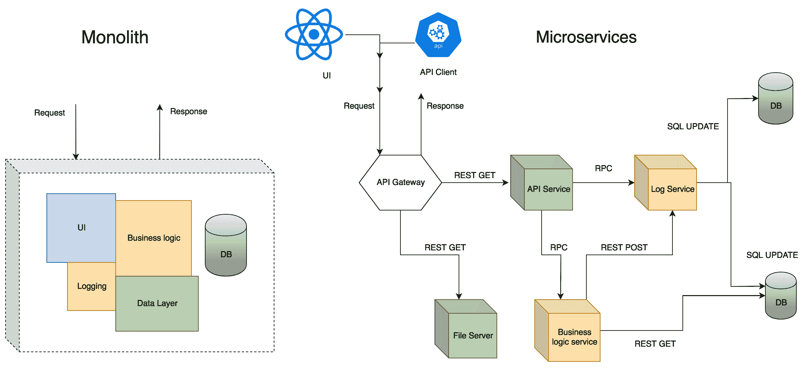
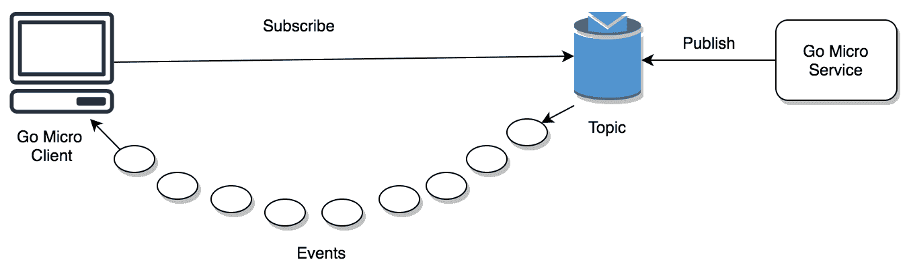

# 使用微服务扩展我们的 REST API

从概念上讲，构建 REST API 很容易。但将其扩展以接受大量流量是一个挑战。到目前为止，我们已经探讨了创建 REST API 结构和示例 REST API 的细节。在本章中，我们将探讨 Go Micro，这是一个用于构建微服务的优秀、惯用的 Go 包。

这是微服务的时代，大型应用程序通常被分解为松耦合的组件。微服务架构允许公司快速并行迭代。我们将首先定义术语*微服务*，然后通过创建**远程过程调用**（**RPC**）/REST 风格的微服务来介绍 Go Micro。

在本章中，我们将涵盖以下主题：

+   什么是微服务？

+   单体与微服务

+   介绍 Go Micro，一个用于构建微服务的包

+   为微服务添加日志记录

# 技术要求

以下软件应预先安装以运行代码示例：

+   操作系统：Linux（Ubuntu 18.04）/Windows 10/Mac OS X >= 10.13

+   Go 稳定版本编译器 >= 1.13.5

+   Dep: 用于 Go 的依赖管理工具 >= 0.5.3

+   Docker 版本 >= 18.09.2

您可以从[`github.com/PacktPublishing/Hands-On-Restful-Web-services-with-Go/tree/master/chapter11`](https://github.com/PacktPublishing/Hands-On-Restful-Web-services-with-Go/tree/master/chapter11)下载本章的代码。克隆代码，并使用`chapter11`目录中的代码示例。

# 什么是微服务？

什么是微服务？这是企业界向计算界提出的问题。产品的可持续性取决于其可修改性。如果无法得到适当的维护，大型产品应在某个时间点退役。微服务架构用细粒度的服务取代了传统的单体，这些服务通过某种协议相互通信。

微服务带来了以下好处：

+   小型团队可以通过专注于一组小的功能来并行迭代。

+   对于新开发者来说，适应性很容易。

+   它们允许系统各个组件的**持续集成**（**CI**）和**持续交付**（**CD**）。

+   它们提供易于替换的软件，具有松耦合的架构。

+   架构不依赖于特定的技术

在单体应用程序（*传统应用程序*）中，单个应用程序通过共享计算能力来服务传入的请求。这很好，因为我们把所有东西都放在一个地方，并且易于管理。但是，单体有一些问题，例如以下内容：

+   紧耦合的架构。

+   单点故障。

+   添加新特性和组件的速度。

+   工作碎片化仅限于团队。

+   **持续集成**（**CI**）和**持续交付**（**CD**）是困难的，因为即使是微小的更改也需要重新部署整个应用程序。

在单体应用程序中，整个软件被视为一个单一实体。如果数据库失败，应用程序也会失败。如果代码中的错误导致软件应用程序崩溃，与客户的整个连接都会中断。这一需求为微服务铺平了道路。

让我们来看一个场景。由鲍勃经营的公司使用传统的单体模型，开发者昼夜不停地添加新功能。在软件发布时，人们需要测试代码的每个小组件。当所有更改完成后，项目从开发转移到测试。

在隔壁街道的另一家公司，由爱丽丝经营，使用微服务架构。爱丽丝公司的软件开发者专注于单个服务，然后测试它们各自的组件。开发者通过对方的 REST/RPC API 进行交流以添加新功能。与鲍勃的团队相比，他们可以轻松地将技术栈从一种技术切换到另一种技术。

这个例子表明，爱丽丝的公司比鲍勃的公司更加灵活。

在讨论微服务时，编排和服务发现是非常重要需要考虑的方面。可以使用像 Kubernetes 这样的工具来编排 Docker 容器。通常，每个微服务拥有一个 Docker 容器是一个好的实践。

**服务发现**是在运行时自动检测微服务实例的 IP 地址。这消除了硬编码 IP 地址的潜在威胁，这可能导致服务之间连接失败。在下一节中，我们将使用图表来了解单体架构和微服务之间关键的区别。

# 单体与微服务对比

通常情况下，软件应用的开发都是从单体架构开始，然后在长期发展中将其拆分为微服务。这实际上有助于关注应用交付，而不是盲目遵循微服务模式。一旦产品稳定，开发者就应该找到一种方法来拆分产品特性。请看以下图表，了解单体架构和微服务之间的区别：



此图表展示了单体架构和微服务架构的结构。单体架构将所有内容封装在单个系统中。它被称为**紧密耦合**的架构。相比之下，微服务是易于替换和可修改的独立实体。每个微服务可以通过各种传输机制（如 HTTP、REST 或 RPC）相互通信。服务之间交换的数据格式可以是 JSON 或协议缓冲区。微服务还可以处理各种请求入口点，如**UI**和**API 客户端**。

微服务可以用任何技术（Java、Go、Python 等）实现，并且由于它们的松散耦合性质，可以用任何技术进行替换。

在下一节中，我们将探讨如何使用名为 Go Micro 的轻量级框架在 Go 中创建微服务。在那里，我们将了解如何开发可以相互通信的微型服务。

# 介绍 Go Micro，一个用于构建微服务的包

Netflix 的 Eureka 和来自 Java 社区的 Spring Boot 以构建微服务而闻名。Go Micro 包提供了相同的功能集。它是一个用于在 Go 中构建微服务的工具包。它是轻量级的，这意味着从小处着手，逐步发展。

它具有 Go 风格的服务添加方式，这使得开发者感觉良好。在接下来的章节中，我们将看到如何按照 Go Micro 定义的步骤创建一个微服务。Go Micro 提供了实现 RPC 和 **事件驱动架构**（**EDAs**）的要求。它还有一个可插拔接口，我们可以在这里插入任何外部功能。

Go Micro 支持的主要功能如下：

+   请求/响应

+   服务发现

+   负载均衡

+   消息编码

+   异步消息

+   可插拔接口

**请求/响应** 是一个简单的 HTTP/RPC 调用。**服务发现** 用于在运行时查找微服务实例。**负载均衡** 用于将请求路由到多个相同类型的应用程序。**消息编码** 对于服务相互理解至关重要。**异步消息** 涉及事件的产生和消费。Go Micro 的 **可插拔接口** 提供了诸如用于翻译的编解码器以及用于存储系统的代理等功能。

使用 `dep` 工具以这种方式在任何项目中安装 Go Micro：

```go
> dep init > dep ensure -add  "github.com/micro/go-micro"
```

在下一节中，我们将制定我们的第一个微服务的计划。我们将了解如何在 Go 中加密和解密消息。然后，我们将使用 Go Micro 构建一个加密/解密服务。

# 理解加密

我们都知道消息加密。**加密** 是一个使用基本消息和密钥通过一个只能使用原始密钥解码的数学算法产生编码消息的过程。该消息可以通过网络传输。接收者使用密钥解密消息并获取原始消息。我们将创建一个提供加密和解密功能的微服务。

查看我们第一个微服务开发的计划：

1.  开发加密/解密实用函数。

1.  然后，将其与 Go Micro 集成以生成服务。

Go 内置了用于加密消息的包。我们需要从这些包中导入加密算法并使用它们。为此，我们创建了一个使用 **高级加密标准**（**AES**）的项目，如下步骤所示：

1.  在你的 `GOPATH/src/github.com` 目录下创建一个名为 `encryptString` 的目录，具体步骤如下：

```go
> mkdir -p $GOPATH/src/github.com/git-user/chapter11/encryptString cd $GOPATH/src/github.com/git-user/chapter11/encryptString
```

1.  然后，在新的目录中添加一个名为 `utils` 的文件。在项目目录中添加 `main.go`，在新的 `utils` 目录中添加 `utils.go`。目录结构如下所示：

```go
└── encryptString
    ├── main.go
    └── utils
        └── utils.go
```

1.  现在，让我们在我们的`utils.go`文件中添加加密逻辑。我们创建两个函数，一个用于加密，另一个用于消息的解密。首先，导入必要的包`crypto`和`encoding`，如下面的代码块所示：

```go
package utils
import (
    "crypto/aes"
    "crypto/cipher"
    "encoding/base64"
)
```

1.  AES 算法需要一个初始化向量。该向量是一个任意字节数组，可以与密钥一起用于数据加密。定义如下：

```go
/* Initialization vector for the AES algorithm
More details visit this link https://en.wikipedia.org/wiki/Advanced_Encryption_Standard */
var initVector = []byte{35, 46, 57, 24, 85, 35, 24, 74, 87, 35, 88, 98, 66, 32, 14, 05}
```

向量中的值也可以随机生成。这里，我们使用一个预定义的向量。

1.  现在，让我们实现加密逻辑。它使用`aes.NewCipher`和`aes.NewCFBEncryptor`函数声明一个新的密文。然后，我们在密文上执行名为`XORKeyStream`的函数以获取加密字符串。然后，我们需要进行`base64`编码以生成受保护的字符串，如下所示：

```go
// EncryptString encrypts the string with given key
func EncryptString(key, text string) string {
    block, err := aes.NewCipher([]byte(key))
    if err != nil {
        panic(err)
    }
    plaintext := []byte(text)
    cfb := cipher.NewCFBEncrypter(block, initVector)
    ciphertext := make([]byte, len(plaintext))
    cfb.XORKeyStream(ciphertext, plaintext)
    return base64.StdEncoding.EncodeToString(ciphertext)
}
```

1.  接下来，以同样的方式，让我们定义一个`DecryptString`函数，它接受一个密钥和`ciphertext`，并生成原始消息。在`DecryptString`函数中，首先，解码`base64`编码的文本，并使用密钥创建一个密文块。将此密文块与初始化向量一起传递给`NewCFBEncrypter`。

1.  然后，使用`XORKeyStream`从`ciphertext`加载内容到`plaintext`。基本上，这是一个在`XORKeyStream`中交换加密和解密消息的过程。代码如下：

```go
// DecryptString decrypts the encrypted string to original
func DecryptString(key, text string) string {
    block, err := aes.NewCipher([]byte(key))
    if err != nil {
        panic(err)
    }
    ciphertext, _ := base64.StdEncoding.DecodeString(text)
    cfb := cipher.NewCFBEncrypter(block, initVector)
    plaintext := make([]byte, len(ciphertext))
    cfb.XORKeyStream(plaintext, ciphertext)
    return string(plaintext)
}
```

这完成了加密和解密工具文件的定义。

1.  现在，让我们编辑`main.go`文件，利用前面的`utils`包及其函数。`main`函数应该使用`EncryptString`函数加密一条消息，然后使用`DecryptString`函数解密一条消息，如下所示：

```go
package main
import (
    "log"
    "github.com/git-user/chapter11/encryptString/utils"
)
// AES keys should be of length 16, 24, 32
func main() {
    key := "111023043350789514532147"
    message := "I am A Message"
    log.Println("Original message: ", message)
    encryptedString := utils.EncryptString(key, message)
    log.Println("Encrypted message: ", encryptedString)
    decryptedString := utils.DecryptString(key, encryptedString)
    log.Println("Decrypted message: ", decryptedString)
}
```

原始消息不应改变。

1.  这里，我们从`utils`包中导入`encrypting/decrypting`函数，并使用它们来展示一个示例。如果我们运行这个程序，我们会看到以下输出：

```go
> go run main.go

Original message: I am A Message
Encrypted message: 8/+JCfTb+ibIjzQtmCo=
Decrypted message: I am A Message
```

这个程序说明了我们如何使用 AES 算法加密一条消息，并使用相同的密钥将其恢复。此算法也称为**Rijndael**（发音为*rain-dahl*）算法。

在下一节中，我们使用这些加密知识使用 Go Micro 创建一个微服务。

# 使用 Go Micro 构建微服务

我们将使用 Go Micro 和`utils`中的加密逻辑来编写一个微服务。一个 Go 微服务应该逐步构建。要创建一个服务，我们需要提前设计几个实体。它们如下：

+   用于定义服务 RPC 方法的协议缓冲文件

+   具有方法实际实现的处理器文件

+   一个公开 RPC 方法的服务器

+   一个可以发出 RPC 请求并获取结果的客户端

我们需要两个系统级工具`protoc`和`protoc-gen-micro`来编译协议缓冲到 Go 包。让我们看看创建加密微服务的步骤，如下：

1.  让我们使用`go get`命令安装这些编译器，如下所示：

```go
> go get -u github.com/golang/protobuf/protoc-gen-go
> go get github.com/micro/protoc-gen-micro
```

1.  让我们创建我们的项目目录，如下所示：

```go
> mkdir -p $GOPATH/src/github.com/git-user/chapter11/encryptService mkdir $GOPATH/src/github.com/git-user/chapter11/encryptService/
proto
```

1.  现在，在 `proto` 目录中定义一个 `encryption.proto` 协议缓冲文件，如下所示：

```go
syntax = "proto3";

service Encrypter {
  rpc Encrypt(Request) returns (Response) {}
  rpc Decrypt(Request) returns (Response) {}
}

message Request {
    string message = 1;
    string key = 2;
}

message Response {
    string result = 2;
}
```

它应该有一个名为 `Encrypter` 的服务以及两个名为 `Request` 和 `Response` 的消息。这两个消息用于请求加密和解密。

上述文件的语法是 `"proto3"`。`Request` 消息有两个字段，分别称为 `message` 和 `key`。客户端使用这些字段发送 `plaintext`/`ciphertext` 消息。

`Response` 消息有一个名为 `result` 的字段。它是加密/解密过程的结果。`Encrypter` 服务有两个名为 `Encrypt` 和 `Decrypt` 的 RPC 方法。两者都接受一个 `Request` 并返回一个 `Response`。

1.  现在，我们可以通过编译 `.proto` 文件来生成 Go 文件，如下所示：

```go
> protoc -I=. --micro_out=. --go_out=. proto/encryption.proto
```

这是命令的分解：

| **选项** | **含义** |
| --- | --- |
| `-I` | 项目根目录的输入 |
| `--go_out` | 自动生成方法的 Go 文件输出 |
| `--micro_out` | 与 `--go_out` 类似，但生成一个包含 Go 微方法的额外文件 |
| `proto/encryption.proto` | 编译的协议缓冲文件路径 |

它在项目的 `proto` 目录中生成两个新的文件。它们的名称如下：

+   `encryption.pb.go`

+   `encryption.pb.micro.go`

这些由代码生成的文件不应手动修改。

1.  让我们复制在 `encryptString` 示例中定义的 `utils.go` 文件。它可以原样重用，除了包名的小幅更改，如下所示：

```go
> cp $GOPATH/src/github.com/git-user/chapter11/encryptString/utils/
utils.go $GOPATH/src/github.com/git-user/chapter11/encryptService/
```

1.  复制后，将文件中的包名从 `utils` 更改为 `main`（因为现在，此文件位于新项目的根目录），如下所示：

```go
package main

import (
    "crypto/aes"
    "crypto/cipher"
    "encoding/base64"
)
...
```

通过这种方式，我们可以在整个 Go 项目中使用 `EncryptString` 和 `DecryptString` 函数。

1.  现在，添加一个名为 `handlers.go` 的文件，其中我们定义了服务的业务逻辑。它导出 `Encrypter` 结构体和一些处理 RPC 请求的方法。此代码如下所示：

```go
> touch $GOPATH/src/github.com/git-user/chapter11/encryptService/
handlers.go
```

1.  `Encrypter` 结构体应该有两个方法，`Encrypt` 和 `Decrypt`。每个方法都接受一个上下文对象、一个 RPC 请求对象和一个 RPC 响应对象。每个方法执行的操作是调用相应的实用函数，并设置响应对象的结果，如下所示：

```go
package main

import (
    "context"

    proto "github.com/git-user/chapter11/encryptService/proto"
)

// Encrypter holds the information about methods
type Encrypter struct{}

// Encrypt converts a message into cipher and returns response
func (g *Encrypter) Encrypt(ctx context.Context,
 req *proto.Request, rsp *proto.Response) error {
    rsp.Result = EncryptString(req.Key, req.Message)
    return nil
}

// Decrypt converts a cipher into message and returns response
func (g *Encrypter) Decrypt(ctx context.Context,
 req *proto.Request, rsp *proto.Response) error {
    rsp.Result = DecryptString(req.Key, req.Message)
    return nil
}
```

1.  `Encrypt` 和 `Decrypt` 方法映射到协议缓冲文件中的这些 RPC 方法，如下所示：

```go
  rpc Encrypt(Request) returns (Response) {}
  rpc Decrypt(Request) returns (Response) {}
```

1.  现在，我们必须将这些处理程序插入到我们的 `main` 程序中，如下所示：

```go
> touch $GOPATH/src/github.com/git-user/chapter11/encryptService/
main.go
```

1.  `main` 程序导入 `proto` 和 `go-micro` 包，并尝试创建一个新的微服务实例。然后，它将服务注册到从 `handlers.go` 文件中导出的 `Encrypter` 处理程序。最后，它运行服务。所有这些都在以下代码块中展示：

```go
package main

import (
    fmt "fmt"

    proto "github.com/git-user/chapter11/encryptService/proto"
    micro "github.com/micro/go-micro"
)

func main() {
    // Create a new service. Optionally include some options here.
    service := micro.NewService(
        micro.Name("encrypter"),
    )

    // Init will parse the command line flags.
    service.Init()

    // Register handler
    proto.RegisterEncrypterHandler(service.Server(),
     new(Encrypter))

    // Run the server
    if err := service.Run(); err != nil {
        fmt.Println(err)
    }
}
```

在前面的程序中，`micro.NewService` 被用来创建一个新的微服务。它返回一个 `service` 对象。我们也可以通过运行 `service.Init()` 来收集命令行参数。在我们的例子中，我们没有传递任何参数。我们可以使用 `RegisterEncrypterHandler` 方法将服务注册到处理器。该方法是由协议缓冲区编译器动态生成的。最后，`service.Run` 启动服务器。让我们运行这个服务。

1.  尝试从项目根目录 `encryptService` 构建项目，如下所示：

```go
> go build && ./encryptService

2019/12/22 16:16:18 log.go:18: Transport [http] Listening on [::]:58043
2019/12/22 16:16:18 log.go:18: Broker [http] Connected to [::]:58044
2019/12/22 16:16:18 log.go:18: Registry [mdns] Registering node: encrypter-4d68d94a-727d-445b-80a3-24a1db3639dd
```

如你所见，从服务器输出中，Go Micro 使用传输和消息代理启动了微服务。现在，客户端可以对这些端口发起请求。如果没有客户端来消费 API，这个服务就没有太大用处。所以，在下一节中，我们将尝试构建一个 Go Micro 客户端，并看看如何连接到前面的服务器。

如果你想运行程序而不构建它，你必须包含在 `main` 文件中导入的所有包。

例如，`go run main.go handlers.go utils.go` 等同于 `go build && ./encryptService`。

# 使用 Go Micro 构建 RPC 客户端

在 第六章 *使用协议缓冲区和 gRPC* 中，我们讨论了协议缓冲区，我们提到服务器和客户端应该就相同的协议缓冲区达成一致。同样，Go Micro 期望服务和客户端使用相同的 `.proto` 文件——在我们的例子中是 `encryption.proto`。客户端可以是请求某些信息的另一个服务。

我们可以使用 Go Micro 构建客户端。它包括连接到微服务和进行 RPC 调用的所有必要构造。我们的计划是创建一个客户端，并要求服务加密和解密消息。这些请求将是 RPC 调用。让我们看看创建和使用 Go Micro 客户端的步骤，如下所示：

1.  为客户端创建一个新的项目，如下所示：

```go
> mkdir -p $GOPATH/src/github.com/git-user/chapter11/encryptClient/ > mkdir $GOPATH/src/github.com/git-user/chapter11/encryptClient/
proto
```

1.  现在，在 `proto` 目录中添加一个 `encryption.proto` 文件，其外观与 `service` 完全相同，如下所示：

```go
syntax = "proto3";

service Encrypter {
  rpc Encrypt(Request) returns (Response) {}
  rpc Decrypt(Request) returns (Response) {}
}

message Request {
  string message = 1;
  string key = 2;
}

message Response {
    string result = 2;
}
```

1.  如果仔细观察，服务名称、消息及其定义与 `service` 中的相匹配。现在，从 `encryptClient` 项目根目录编译协议缓冲区，如下所示：

```go
> protoc -I=. --micro_out=. --go_out=. proto/encryption.proto
```

1.  之后，客户端在 `proto` 目录中生成了两个文件。这些文件不应该被修改。现在，我们已经准备好了我们的设置。为进行 RPC 调用到服务添加一个 `main.go` 文件，如下所示：

```go
> touch $GOPATH/src/github.com/git-user/chapter11/encryptClient/
main.go
```

1.  `main` 程序导入了 `proto` 和 `go-micro` 包，我们在其中编译了协议缓冲区，如下所示：

```go
package main

import (
    "context"
    "fmt"

    proto "github.com/git-user/chapter11/encryptClient/proto"
    micro "github.com/micro/go-micro"
)
```

1.  客户端也应该使用名为 `micro.NewService` 的函数创建，如下所示：

```go
func main() {
    // Create a new service
    service := micro.NewService(micro.Name("encrypter.client"))
    // Initialise the client and parse command line flags
    service.Init()

    // Create new encrypter service instance
    encrypter := proto.NewEncrypterService("encrypter",
     service.Client())
    ...
}
```

它可以被初始化来收集环境变量。客户端和服务之间的关键区别在于，对于客户端，我们使用 `proto.NewEncrypterService` 函数创建 `service` 的实例。我们使用该实例进行 API 调用。记住，该函数是由 `protoc` 命令自动生成的。

1.  `encrypter`是代码中的服务实例。接下来，我们可以通过直接在服务实例上调用 RPC 方法来执行 RPC 调用。让我们传递一个名为`"I am a Message"`的文本和密钥`"111023043350789514532147"`来加密方法，如下所示：

```go
    // Call the encrypter
    rsp, err := encrypter.Encrypt(context.TODO(), &proto.Request{
        Message: "I am a Message",
        Key:     "111023043350789514532147",
    })

    if err != nil {
        fmt.Println(err)
    }

    // Print response
    fmt.Println(rsp.Result)
```

函数，如协议缓冲区中指定的，返回一个包含`Result`字段的响应。我们将该值打印到控制台。

1.  接下来，让我们将这个结果作为密文传递给`Decrypt`函数。它应该返回原始消息。我们使用与加密相同的密钥，如下所示：

```go
    // Call the decrypter
    rsp, err = encrypter.Decrypt(context.TODO(), &proto.Request{
        Message: rsp.Result,
        Key:     "111023043350789514532147",
    })

    if err != nil {
        fmt.Println(err)
    }

    // Print response
    fmt.Println(rsp.Result)
```

1.  这两个块放入`main`函数中。一旦我们添加了它们，让我们构建并运行客户端，如下所示：

```go
> go build && ./encryptClient

8/+JCfT7+ibIjzQtmCo=
I am a Message
```

我们传递了明文和密钥，原始消息作为最终结果返回。这证实了`encrypt`和`decrypt`RPC 调用正常工作。Go Micro 的好处是，用几行代码就可以创建微服务和客户端。

在下一节中，我们将看到 Go Micro 如何支持 EDAs，其中服务和客户端可以通过事件进行通信。

# 构建事件驱动型微服务

在第九章的*异步 API 设计*中，我们学习了异步编程。异步 API 可以通过事件实现。服务和客户端可以使用事件相互通信。他们不必等待一方完成工作。

事件生成器是一个生成事件的实体。事件消费者从其他方消费事件。发布/订阅是一种可以通过事件实现的设计模式。Go Micro 通过使用消息代理接口支持发布/订阅。

查看以下图表以了解事件流：



Go Micro 客户端可以**订阅**一个主题。Go 微服务可以将消息发布到该**主题**。在这种情况下，事件从右向左流动。

它自带内置的 HTTP 消息代理，可以轻松替换为广泛使用的消息代理，如 RabbitMQ 或 Kafka。在我们的讨论中，我们坚持使用默认的 HTTP 代理。

我们将使用示例来说明发布/订阅。假设一个微服务应该每 5 秒推送一次天气警报。而不是客户端调用服务 API，服务可以将这些更改发布到一个客户端可以订阅的主题。客户端消费这些警报并进行处理。

在我们正在工作的所有项目中，我们应该使用`dep`工具安装 Go Micro 并运行以下代码：

`> dep init`

`> dep ensure -add "github.com/micro/go-micro"`

我们将创建一个`asyncServer`和一个`asyncClient`。`asyncServer`生成天气事件，客户端消费它们。让我们看看这个示例的步骤：

1.  创建一个项目目录，如下所示：

```go
> mkdir -p $GOPATH/src/github.com/git-user/chapter11/asyncService > mkdir $GOPATH/src/github.com/git-user/chapter11/asyncServer/proto > mkdir -p $GOPATH/src/github.com/git-user/chapter11/asyncClient > mkdir $GOPATH/src/github.com/git-user/chapter11/asyncClient/proto
```

1.  在 `asyncService` 和 `asyncClient` 的 `proto` 目录中创建一个 `weather.proto` 文件。它包含用于通信的结构和 RPC 方法。此文件定义了一个 `Event`，它是一个天气警报，代码如下所示：

```go
syntax = "proto3";

// Example message
message Event {
    // city name
    string city = 1;
    // unix timestamp
    int64 timestamp = 2;
    // temperaure in Celsius
    int64 temperature = 3;
}
```

它有三个字段，如下所示：

+   `城市名称`

+   `Unix 时间戳`

+   `摄氏度温度`

服务应该将此事件发布到名为 `alerts` 的主题。

1.  现在，在服务和客户端中编译 `.proto` 文件，并获取自动生成的 Go 文件，如下所示：

```go
> protoc -I=. --micro_out=. --go_out=. proto/weather.proto
```

为了简洁，我们在这个例子中省略了导入，请访问章节仓库以获取完整的代码。

1.  来到服务端，`main.go` 文件应该声明一个微服务和发布者。发布者是通过 `micro.NewPublisher` 方法创建的。它接受主题名称 `alerts` 和 `service.Client()` 作为参数，如下所示：

```go
func main() {
    // Create a new service. Optionally include some options here.
    service := micro.NewService(
        micro.Name("weather"),
    )
    p := micro.NewPublisher("alerts", service.Client())
    ...
}
```

1.  接下来，我们创建一个虚拟的计时器，每 `15` 秒发布一次天气警报。我们通过使用内置的 Go 方法 `time.Tick` 来实现这一点。我们启动一个无限循环的 `go-routine`，监听一个滴答声，并使用 `publisher.Publish` 方法将事件发布到主题。`Publish` 方法接受一个上下文对象和一个包含数据的事件作为参数，如下面的代码块所示：

```go
    go func() {
        for now := range time.Tick(15 * time.Second) {
            log.Println("Publishing weather alert to Topic: alerts")
            p.Publish(context.TODO(), &proto.Event{
                City:        "Munich",
                Timestamp:   now.UTC().Unix(),
                Temperature: 2,
            })
        }
    }()
```

1.  然后，最后，我们必须通过调用 `service.Run` 方法来运行服务，如下所示：

```go
    // Run the server
    if err := service.Run(); err != nil {
        log.Println(err)
    }
```

1.  `service` 和 `go-routine` 并行运行。当你运行此服务时，你会看到以下输出：

```go
> go build && ./asyncService

2019/12/22 21:31:03 log.go:18: Transport [http] Listening on [::]:60243
2019/12/22 21:31:03 log.go:18: Broker [http] Connected to [::]:60244
2019/12/22 21:31:03 log.go:18: Registry [mdns] Registering node: weather-83982bda-5e9e-445b-9ce2-5439d1560d1f
2019-12-22 21:31:18.379616 I | Publishing event to Topic: alerts
2019-12-22 21:31:33.376924 I | Publishing event to Topic: alerts
```

1.  现在，服务正在推送事件，但没有客户端来消费它们。让我们更新 `main.go` 文件中的 `asyncClient` 以包含消费逻辑。在客户端中，我们应该声明一个处理函数来处理事件。处理函数在收到事件时执行。在我们的例子中，它打印出事件，如下所示：

```go
// ProcessEvent processes a weather alert
func ProcessEvent(ctx context.Context, event *proto.Event) error {
    log.Println("Got alert:", event)
    return nil
}
```

1.  在定义处理函数以处理事件后，我们可以将客户端与主题关联起来。`micro.RegisterSubscriber` 函数将 `ProcessEvent` 处理函数附加到 `alerts` 主题，如下所示：

```go
func main() {
    // Create a new service
    service := micro.NewService(micro.Name("weather_client"))
    // Initialise the client and parse command line flags
    service.Init()
    micro.RegisterSubscriber("alerts", service.Server(),
     ProcessEvent)

    if err := service.Run(); err != nil {
        log.Fatal(err)
    }
}
```

1.  如果我们运行此程序，它将消费我们之前定义的服务发布的警报，如下所示：

```go
> go build && ./asyncClient

2019/12/22 21:48:07 log.go:18: Transport [http] Listening on [::]:60445
2019/12/22 21:48:07 log.go:18: Broker [http] Connected to [::]:60446
2019/12/22 21:48:07 log.go:18: Registry [mdns] Registering node: weather_client-73496273-31ca-4bed-84dc-60df07a1570d
2019/12/22 21:48:07 log.go:18: Subscribing weather_client-73496273-31ca-4bed-84dc-60df07a1570d to topic: alerts
2019-12-22 21:48:18.436189 I | Got event: city:"Munich" timestamp:1577047698 temperature:2 
2019-12-22 21:48:33.431529 I | Got event: city:"Munich" timestamp:1577047713 temperature:2 
```

这就是在微服务中实现异步行为的方式。客户端和服务的边界可能会变得模糊，因为任何人都可以发布或订阅。在一个分布式系统中，服务是其他服务的客户端。因此，Go Micro 提供了一种轻量级且灵活的方法来创建微服务。

在下一节中，我们将讨论微服务的日志记录和仪表化。

# 向微服务添加日志记录

日志记录是微服务的一个关键方面。我们可以编写中间件来捕获进入和离开服务的所有请求和响应。即使是客户端，我们也可以在向服务进行 RPC 调用时捕获日志。

Go Micro 是一个轻量级的框架，默认不强制执行日志记录。我们可以轻松地将自定义日志记录器包装在服务处理函数中。例如，在 `encryptService` 示例中，我们有一个名为 `handlers.go` 的文件。

为了以自定义格式激活每个请求的日志记录，我们必须定义一个包装器，并将其链接到服务。例如，如果我们必须记录每个传入的加密请求，请按照以下步骤操作：

1.  创建一个新的`wrapper`函数。它接受`Context`、`Request`和`Response`作为参数。在这里，我们只打印请求到达的时间，如下所示：

```go
func logWrapper(fn server.HandlerFunc) server.HandlerFunc {
 return func(ctx context.Context, req *proto.Request,
  rsp *proto.Response) error {
 fmt.Printf("encryption request at time: %v", time.Now())
 return fn(ctx, req, rsp)
 }
}
```

1.  在`service`中，我们可以附加包装器，如下所示：

```go
service := micro.NewService(
micro.Name("encrypter"),
// wrap the client
micro.WrapClient(logWrap),
)
```

现在，服务以包装函数中定义的格式记录每个请求，如下所示：

```go
encryption request at time: 2019/12/22 23:07:3
```

关于日志记录的更多信息，请参阅[`micro.mu/docs/go-micro.html#wrappers`](https://micro.mu/docs/go-micro.html#wrappers)的文档。

服务的仪器化超出了本书的范围，但有一个名为**OpenTracing**（[`opentracing.io/`](https://opentracing.io/)）的开放标准。它定义了如何度量 API 端点、请求数量等的标准。请随意探索它。

本章中我们创建的 API 是基于 RPC 的。要将它们转换为 REST，只需使用一个名为**Micro Web**的插件。更多信息，请参阅此链接以轻松转换为 REST（[`micro.mu/docs/go-web.html`](https://micro.mu/docs/go-web.html)）。

# 摘要

在本章中，我们从微服务的定义开始。单体应用和微服务之间的主要区别在于紧密耦合架构分解为松散耦合架构的方式。

微服务使用基于 REST 的 JSON 或基于 RPC 的协议缓冲区相互通信。使用微服务，我们可以将业务逻辑分解成多个部分。每个服务都做得相当不错。Go 有一个轻量级的框架称为**Go Micro**。使用它，我们可以创建服务和客户端。

我们首先使用`Micro go`创建了一个加密服务。然后我们开发了一个用于消费服务的客户端。Go Micro 还通过提供发布/订阅模式允许异步编程。任何客户端/服务都可以订阅或向一个主题推送事件。它默认使用 HTTP 代理，但可以轻松配置为 RabbitMQ 或 Kafka。Go Micro 还提供诸如服务发现和多种传输机制（如协议缓冲区、JSON 等）等功能。小型组织可以从单体应用开始，但在大型组织中有庞大团队的情况下，微服务更适合。

在下一章中，我们将看到如何使用 nginx 部署我们的 Go 服务。服务需要部署才能对外公开。我们还使用`docker-compose`和容器进行干净部署。
