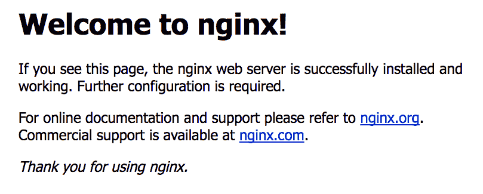
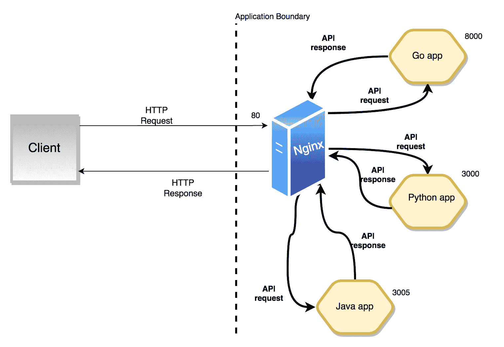
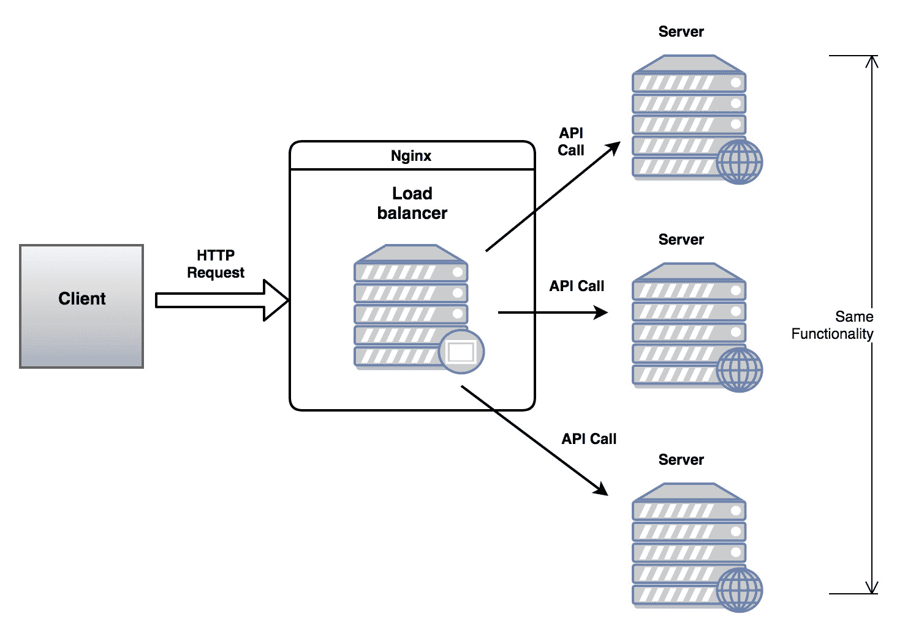
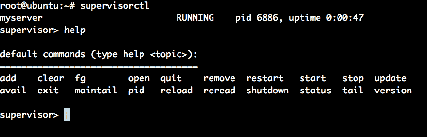
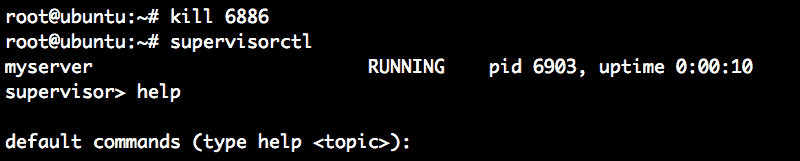

# 为部署容器化 REST 服务

在本章中，我们将探讨如何使用 Docker、Docker Compose、Nginx 和 Supervisord 等工具将我们的 Go 应用程序容器化。容器化是为了在应用程序部署过程中避免平台依赖。为了正确部署应用程序，我们必须准备一个生态系统。这个生态系统包括一个 Web 服务器、一个应用服务器和一个进程监控器。本章将讨论如何将我们的 API 服务器从独立应用程序转变为生产级服务。

近年来，大多数云服务提供商倾向于托管 Web 应用程序。一些大型玩家，如 AWS、Azure、Google Cloud Platform，以及初创公司如 DigitalOcean 和 Heroku，都是这样的例子。在接下来的章节中，我们将专注于为部署 REST 服务准备平台。在下一章中，我们将探讨如何在著名的云服务提供商 AWS 上部署此生态系统。

Nginx 是一个可以作为 Web 应用程序反向代理的 Web 服务器。当多个服务器实例运行时，它还可以充当负载均衡器。Supervisord 确保在崩溃或系统重启的情况下，应用程序服务器处于运行状态。应用程序服务器/REST 服务是相同的，所以请在本章中同等考虑它们。

本章将涵盖以下主题：

+   安装 Nginx 服务器

+   什么是反向代理服务器？

+   使用 Nginx 部署 Go 服务

+   使用 Supervisord 监控我们的 Go API 服务器

+   基于 `Makefile` 和 Docker Compose 的部署

# 技术要求

以下是在运行代码示例之前应预先安装的软件：

+   操作系统：Linux (Ubuntu 18.04)/Windows 10/Mac OS X >=10.13

+   Go 稳定版本编译器 >= 1.13.5

+   Dep：Go >= 0.5.3 的依赖管理工具

+   Docker 版本 >= 18.09.2

+   Docker Compose >= 1.23.2

您可以从[`github.com/PacktPublishing/Hands-On-Restful-Web-services-with-Go/tree/master/chapter12`](https://github.com/PacktPublishing/Hands-On-Restful-Web-services-with-Go/tree/master/chapter12)下载本章的代码。克隆代码并使用`chapter12`目录中的代码示例。

# 安装 Nginx 服务器

Nginx 是一个高性能的 Web 服务器和负载均衡器。它非常适合部署高流量网站和 API 服务器。尽管这个决定是主观的，但它是一个社区驱动、行业强大的 Web 服务器。它与 Apache2 Web 服务器类似。

Nginx 也可以作为反向代理服务器，允许我们将 HTTP 请求重定向到同一网络上的多个运行的应用服务器。Nginx 的主要竞争对手是 Apache 的 `httpd`。Nginx 是一个优秀的静态文件服务器，可以被 Web 客户端使用。由于我们处理的是 API，我们将探讨如何处理 HTTP 请求。

我们可以通过两种方式访问 Nginx：

+   在裸机上安装

+   使用预先安装的 Docker 容器

让我们更详细地了解这两者。

# 在裸机上的安装

在 Ubuntu 18.04 上，使用以下命令安装 Nginx：

```go
> sudo apt-get update
> sudo apt-get install nginx
```

在 Mac OS X 上，你可以使用 `brew` 来安装它：

```go
> brew install nginx
```

**brew** [(https://brew.sh/)](https://brew.sh/) 是一个针对 Mac OS X 用户非常有用的软件打包系统。我的建议是您用它来安装软件。一旦成功安装，您可以通过在浏览器中打开机器 IP 来检查它。在您的网页浏览器上打开 `http://localhost/`。您应该看到以下内容：



如果您看到前面的消息，这意味着 Nginx 已成功安装。它监听端口 `80` 并提供默认页面。在 Mac OS X 上，默认的 Nginx 监听端口将是 `80`：

```go
> sudo vi /usr/local/etc/nginx/nginx.conf
```

在 Ubuntu (Linux) 上，文件将位于此路径：

```go
> sudo vi /etc/nginx/nginx.conf
```

打开文件并搜索服务器块。如果它在端口 `80` 上监听，那么一切正常。然而，如果它在其他端口上，例如 `8080`，那么将其改为 `80`：

```go
server {
        listen 80; # Nginx listen port
        server_name localhost;
        #charset koi8-r;
        #access_log logs/host.access.log main;
        location / {
            root html;
            index index.html index.htm;
        }

        ... 
}
```

现在，一切准备就绪。服务器运行在 `80` HTTP 端口上，这意味着客户端可以使用 URL (`http://localhost/`) 访问它。这个基本服务器从一个名为 `html` 的目录中提供静态文件。`root` 参数可以被修改为放置我们 Web 资产的任何目录。您可以使用以下命令检查 Nginx 的状态：

```go
> service nginx status
```

Windows 操作系统上的 Nginx 非常基础，并不真正适用于生产级部署。开源开发者通常更喜欢 Debian 或 Ubuntu 服务器来部署带有 Nginx 的 API 服务器。

我们还可以获取一个已经安装了 Nginx 的 Docker 镜像。在下一节中，我们将演示如何将其作为 Docker 容器安装。

# 通过 Docker 容器安装

获取预装了 Nginx 的容器有两个好处：

+   容器化很容易。

+   我们可以多次销毁和重新创建容器。

要获取最新的 Nginx 镜像并启动一个容器，请运行以下命令：

```go
> docker run --name nginxServer -d -p 80:80 nginx
```

这将从 Docker Hub 拉取 `nginx` 镜像（确保您已连接到互联网）。如果镜像已经拉取，它将重用该镜像。然后，它将以 `nginxServer` 为名启动一个容器，并在端口 `80` 上提供服务。现在，从您的浏览器访问 `http://localhost`，您将看到 Nginx 的主页。

然而，前面的命令在容器启动后配置 Nginx 时并不适用。我们必须从 localhost 挂载一个目录到容器，或者将文件复制到容器中，以更改 Nginx 配置文件。让我们修改命令：

```go
> docker run --name nginxServer -d -p 80:80 --mount source=/host/path/nginx.conf,destination=/etc/nginx/nginx.conf:readonly nginx
```

额外的命令是 `--mount`，它将文件/目录从源（*主机*）挂载到目标（*容器*）。如果您在那个目录中修改了主机系统上的文件，那么它也会反映在容器上。`readonly` 选项阻止用户/系统进程修改容器内的 Nginx 配置。

在前面的命令中，我们正在挂载 Nginx 配置文件，`nginx.conf`。在本章的后半部分，我们将使用基于 Docker 容器的部署，其中我们使用`docker-compose`来部署我们的应用程序。

# 反向代理服务器是什么？

**反向代理服务器**是一个包含有关原始服务器信息的服务器。它作为客户端请求的前端实体。每当客户端发起一个 HTTP 请求时，它可以直接访问应用程序服务器。然而，如果应用程序是用编程语言编写的，那么你需要一个可以将应用程序响应转换为客户端可理解响应的翻译器。**通用网关接口**（**CGI**）就做同样的事情。

我们可以运行一个简单的 Go HTTP 服务器，它可以处理入站请求（不需要 CGI）。我们还应该保护我们的应用程序服务器免受**拒绝服务**（**DoS**）攻击。那么，为什么我们使用另一个名为 Nginx 的服务器呢？因为它带来了很多好处。

拥有反向代理服务器（Nginx）的好处如下：

+   它可以作为负载均衡器。

+   它可以提供访问控制和速率限制。

+   它可以位于应用程序集群的前端，并重定向 HTTP 请求。

+   它可以以良好的性能服务文件系统。

+   它在流媒体方面表现良好。

如果同一台机器运行着多个应用程序，那么我们可以将这些应用程序统一在一个大伞下。Nginx 还可以作为 API 网关，可以作为多个 API 端点的起点。我们将在下一章中探讨专门的 API 网关，但了解 Nginx 也可以作为网关使用是很好的。

Nginx 作为入站请求的交通路由器。它是我们应用程序服务器的保护盾。

看看下面的图：



它运行着三个使用不同编程语言编写的应用程序，并且**客户端**只知道一个 API 端点。假设所有这些应用程序都在不同的端口上运行。

正如你所见，图中**客户端**是直接与**Nginx**对话，而不是与其他应用程序运行的端口。在图中，Go 运行在端口`8000`上，其他应用程序运行在不同的端口上。这意味着不同的服务器提供不同的 API 端点。

没有 Nginx，如果客户端想要调用 API，它需要访问三个不同的端点（端口）。相反，如果我们有 Nginx，它可以作为三个应用程序的反向代理服务器，简化客户端请求-响应周期。

Nginx 也是一个上游服务器。上游服务器负责将一个服务器的请求转发到另一个服务器。从图中可以看出，Python 应用程序可以从 Go 应用程序请求 API 端点，而 Nginx 将负责路由它们。

# 重要的 Nginx 路径

为了与代理服务器一起工作，我们需要了解一些重要的 Nginx 路径。在 Nginx 中，我们可以同时托管多个网站（例如`www.example1.com`、`www.example2.com`等）。这意味着许多 API 服务器可以在一个 Nginx 实例下运行。

你应该了解表中的以下路径，以便正确配置 Nginx。高级部署可能需要绕过身份验证（例如，健康检查 API）、速率限制和日志备份。

看一下下面的表格：

| **类型** | **路径** | **描述** |
| --- | --- | --- |
| `配置` | `/etc/nginx/nginx.conf` | 这是基本的 Nginx 配置文件。它可以作为默认文件使用。 |
| `配置` | `/etc/nginx/sites-available/` | 如果我们在 Nginx 中运行多个网站，我们可以为每个网站有一个配置文件。 |
| `配置` | `/etc/nginx/sites-enabled/` | 这些是当前在 Nginx 上激活的网站。 |
| `日志` | `/var/log/nginx/access.log` | 此日志文件记录服务器活动，如时间戳和 API 端点。  |
| `日志` | `/var/log/nginx/error.log` | 此日志文件记录所有代理服务器相关的错误，如磁盘空间、文件系统权限等。 |

这些路径位于 Linux 操作系统上。对于 Mac OS X，使用`/usr/local/nginx`作为基本路径。

在下一节中，我们将探讨主要用于配置 Nginx 应用程序的服务器块。

# 使用服务器块

服务器块是实际配置组件，告诉服务器要提供什么服务以及要在哪个端口上监听。我们可以在`sites-available`文件夹中定义多个服务器块。在 Ubuntu 上，位置如下：

```go
/etc/nginx/sites-available
```

在 Mac OS X 上，位置如下：

```go
/usr/local/etc/nginx/sites-available
```

在我们创建从`sites-available`到`sites-enabled`目录的符号链接之前，配置没有效果。因此，始终为每个新创建的配置创建`sites-available`到`sites-enabled`的符号链接。

# 使用 Nginx 部署 Go 服务

正如我们已经讨论过的，Nginx 可以作为一个 Go 应用的反向代理。假设我们有一个提供 REST API 以访问书籍数据的服务器。客户端可以发送请求并返回 JSON 格式的响应。服务器还把所有日志存储在外部文件中。让我们看看创建此应用程序的步骤：

1.  让我们给我们的项目命名为`bookServer`：

```go
> mkdir -p $GOPATH/src/github.com/git-user/chapter12/bookServer
touch $GOPATH/src/github.com/git-user/chapter12/bookServer/main.go
```

此文件是一个基本的 Go 服务器，用于说明反向代理服务器的工作原理。我们首先在端口`8000`上运行我们的程序。然后，我们添加一个配置，将`8000`（Go 的运行端口）映射到`80`（Nginx HTTP 端口）。

1.  现在，让我们编写代码。我们将为我们的服务器使用几个包。我们可以使用 Go 的内置`net/http`包来实现服务器：

```go
package main

import (
    "encoding/json"
    "fmt"
    "log"
    "net/http"
    "os"
    "time"
)
```

1.  现在我们需要一个结构体来存储书籍信息。让我们创建一个具有`ID`、`ISBN`、`Author`和`PublishedYear`等字段的 struct：

```go
// Book holds data of a book
type Book struct {
    ID            int
    ISBN          string
    Author        string
    PublishedYear string
}
```

1.  现在进入我们的 `main` 函数。它应该打开一个文件用于写入日志。我们可以使用 `os.Openfile` 函数来实现。这个函数需要文件和模式作为参数。让我们将文件命名为 `app.log`：

```go
func main() {
    // File open for reading, writing and appending
    f, err := os.OpenFile("app.log",
     os.O_RDWR|os.O_CREATE|os.O_APPEND, 0666)
    if err != nil {
        fmt.Printf("error opening file: %v", err)
    }
    defer f.Close()
    // This attaches program logs to file
    log.SetOutput(f)
    // further code goes here...
}
```

文件权限，`os.O_RDWR|os.O_CREATE|os.O_APPEND`，允许 Go 程序创建、写入和追加到文件。`log.SetOutput(f)` 将应用日志重定向到文件。

1.  现在，创建一个函数处理程序并将其附加到一个路由上，使用 `net/http` 函数。处理程序将结构体转换为 JSON 并将其作为 HTTP 响应返回。还将该处理程序附加到名为 `/api/books` 的路由：

```go
    // Function handler for handling requests
    http.HandleFunc("/api/books", func(w http.ResponseWriter,
    r *http.Request) {
        log.Printf("%q", r.UserAgent())
        // Fill the book details
        book := Book{
            ID:            123,
            ISBN:          "0-201-03801-3",
            Author:        "Donald Knuth",
            PublishedYear: "1968",
        }
        // Convert struct to JSON using Marshal
        jsonData, _ := json.Marshal(book)
        w.Header().Set("Content-Type", "application/json")
        w.Write(jsonData)
    })
```

之前的代码块在客户端请求 `/api/books` 时实际上返回一本书。

1.  现在，启动一个在端口 `8000` 上为整个应用程序提供服务的 HTTP 服务器：

```go
    s := &http.Server{
        Addr:           ":8000",
        ReadTimeout:    10 * time.Second,
        WriteTimeout:   10 * time.Second,
        MaxHeaderBytes: 1 << 20,
    }

    log.Fatal(s.ListenAndServe())
```

这完成了主程序。

1.  我们可以运行我们的应用程序并查看它是否运行正确：

```go
> go run $GOPATH/src/github.com/git-user/chapter12/bookServer/
main.go
```

1.  现在，打开一个 shell 并执行一个 `curl` 命令：

```go
> curl -X GET "http://localhost:8000/api/books"
```

它返回数据：

```go
{
  "ID":123,
  "ISBN":"0-201-03801-3",
  "Author":"Donald Knuth",
  "PublishedYear":"1968"
}
```

1.  然而，客户端需要请求端口 `8000`。那么，我们如何使用 Nginx 代理这个服务器呢？正如我们之前讨论的，我们需要编辑默认的 `sites-available` 服务器块，称为 `default`：

```go
> vi /etc/nginx/sites-available/default
```

1.  编辑前面的文件，找到服务器块，并添加 `proxy_pass` 到它：

```go
server {
        listen 80 default_server;
        listen [::]:80 default_server ipv6only=on;

 location / {
                proxy_pass http://127.0.0.1:8000;
        }
}
```

这个 `config` 文件的这一部分被称为 `server` 块。它控制代理服务器的设置，其中 `listen` 表示 `nginx` 应该监听的位置。`root` 和 `index` 指向静态文件，如果我们需要提供任何文件。`server_name` 是你的域名。

由于我们没有域名，所以这里只是 localhost。`location` 是这里的关键部分。在 `location` 中，我们可以定义我们的 `proxy_pass`，它可以反向代理到给定的 `URL:PORT`。由于我们的 Go 应用程序运行在端口 `8000` 上，我们在那里提到了它。让我们尝试在不同的域名 `example.com` 上运行我们的应用程序：

```go
http://example.com:8000
```

我们可以将相同的名称作为参数传递给 `proxy_pass`。为了使此配置生效，我们需要重新启动 Nginx 服务器。你可以使用以下命令来完成：

```go
> service nginx restart
```

1.  现在，向 `http://localhost` 发送一个 `curl` 请求，你将看到 Go 应用程序的输出：

```go
> curl -X GET "http://localhost"
{
  "ID":123,
  "ISBN":"0-201-03801-3",
  "Author":"Donald Knuth",
  "PublishedYear":"1968"
}
```

1.  `location` 是一个指令，它定义了一个 **统一资源标识符**（**URI**），它可以代理给定的 `server:port` 组合。这意味着，通过定义各种 URI，我们可以代理同一服务器上运行的多达多个应用程序。它看起来像这样：

```go
server {
    listen ...;
    ...
    location / {
        proxy_pass http://127.0.0.1:8000;
    }

    location /api {
        proxy_pass http://127.0.0.1:8001;
    }
    location /mail {
        proxy_pass http://127.0.0.1:8002;
    }
    ...
}
```

这里，有三个应用程序在不同的端口上运行。这些，在被添加到我们的配置文件后，可以被客户端如下访问：

```go
http://localhost/
http://localhost/api/
http://localhost/mail/
```

在下一节中，我们将探讨如何将 API 请求负载均衡到应用程序的多个实例。

# 使用 Nginx 进行负载均衡

在实际情况下，为了处理大量针对 API 的传入请求，通常会部署多个服务器而不是一个。但是，谁应该将传入的客户端请求转发到服务器实例呢？负载均衡器负责这项工作。负载均衡是一个过程，其中中央服务器根据某些标准将负载分配给各个服务器。参考以下图表：



负载均衡器采用一些策略，如 `Round Robin` 或 `Least Connection`，来路由请求到实例。让我们通过一个简单的表格来看看每个方法的作用：

| **负载均衡方法** | **描述** |
| --- | --- |
| `Round Robin` | 根据服务器权重标准，将传入请求均匀地分配到服务器。 |
| `Least Connection` | 请求被发送到当前正在为最少客户端服务的服务器。 |
| `IP Hash` | 这用于将来自给定客户端 IP 的请求发送到指定的服务器。只有当该服务器不可用时，才会将其发送到另一个服务器。  |
| `Least Time` | 来自客户端的请求被发送到具有最低平均延迟（服务客户端的时间）和最少活动连接数的机器。 |

我们可以在 Nginx 配置中设置用于负载均衡的策略。

让我们探索如何在 Nginx 中实际实现负载均衡，以适用于我们的 Go API 服务器。这个过程的第一步是在 Nginx 配置文件的 `http` 部分创建一个 `upstream cluster`：

```go
http {
    upstream cluster {
        server site1.mysite.com weight=5;
        server site2.mysite.com weight=2;
        server backup.mysite.com backup;
    }
}
```

在这里，服务器是运行相同代码的服务器的 IP 地址或域名。我们在这里定义了一个名为 cluster 的上游。它是一个服务器组，我们可以在 `location` 指令中引用它。权重应根据可用的资源成比例分配。在前面的代码中，`site1` 被分配了更高的权重，因为它可能是一个更大的实例（内存和 CPU）。现在，在 `location` 指令中，我们可以使用 `proxy_pass` 命令指定服务器组：

```go
server {
    location / {
        proxy_pass http://cluster;
    }
}
```

现在，正在运行的代理服务器将把所有针对 `/` 端点的 API 端点请求传递给集群中的机器。默认的请求路由算法将是 `Round Robin`，这意味着服务器的轮次将依次重复。如果我们需要更改它，我们可以在上游定义中提及。看看以下代码片段：

```go
http {
    upstream cluster {
        least_conn;
        server site1.mysite.com weight=5;
        server site2.mysite.com;
        server backup.mysite.com backup;
    }
}

server {
    location / {
        proxy_pass http://cluster;
    }
}
```

上述配置表示要创建一个由三台机器组成的集群，并将负载均衡方法设置为 `least connections`。"least_conn" 是我们用来提及负载均衡方法的字符串。其他值可以是 `ip_hash` 或 `least_time`。您可以通过在 **局域网**（**LAN**）中有一组机器来尝试此操作。否则，我们可以安装 Docker 并使用多个虚拟容器作为不同的机器来测试负载均衡。

我们需要在 `/etc/nginx/nginx.conf` 文件中添加那个 `http` 块，而服务器块在 `/etc/nginx/sites-enabled/default` 中。最好将这两个设置分开。

这里有一个小练习：尝试在不同的端口上运行三个 `bookServer` 实例，并在 Nginx 上启用负载均衡。在下一节中，我们将探讨如何在 Nginx 中对特定客户端的 API 进行速率限制。

# 限制我们的 REST API

我们还可以通过速率限制来限制对 Nginx 代理服务器的访问速率。这提供了一个名为 `limit_conn_zone` 的指令（[`nginx.org/en/docs/http/ngx_http_limit_conn_module.html#limit_conn_zone`](http://nginx.org/en/docs/http/ngx_http_limit_conn_module.html#limit_conn_zone)）。其格式如下：

```go
limit_conn_zone client_type zone=zone_type:size;
```

`client_type` 可以是两种类型之一：

+   IP 地址（限制来自特定 IP 地址的请求）

+   服务器名称（限制来自服务器的请求）

`zone_type` 也会根据 `client_type` 而变化。它取值如下表所示：

| **客户端类型** | **区域类型** |
| --- | --- |
| `$binary_remote_address` | `addr` |
| `$server_name` | `servers` |

Nginx 必须在内存中保存一些东西以记住用于速率限制的 IP 地址和服务器。`size` 参数是我们为 Nginx 分配以执行其内存操作的空间。它取值如 8 m（8 MB）或 16 m（16 MB）。现在，让我们看看在哪里添加这些设置。前面的设置应作为全局设置添加到 `nginx.conf` 文件中的 `http` 指令：

```go
http {
    limit_conn_zone $server_name zone=servers:10m;
}
```

这为 Nginx 使用分配了共享内存。现在，在 `sites-available/default` 的服务器指令中添加以下内容：

```go
server {
   limit_conn servers 1000;
}
```

在前面的配置中使用 `limit_conn`，给定服务器的总连接数不会超过 `1000`。如果我们尝试将速率限制从给定 IP 地址到客户端，则使用以下方法：

```go
server {
  location /api {
      limit_conn addr 1;
  }
}
```

此设置阻止客户端（即 IP 地址）向服务器打开超过一个连接（例如，在在线铁路订票会话中，用户每个 IP 地址只能使用一个会话来订票）。如果我们有一个客户端下载的文件并需要设置带宽限制，请使用 `limit_rate`：

```go
server {
  location /download {
      limit_conn addr 10;
      limit_rate 50k;
  }
}
```

以这种方式，我们可以控制客户端与我们的在 Nginx 下代理的服务之间的交互。

# 保护我们的 Nginx 代理服务器

这是在 Nginx 设置中最重要的一部分。在本节中，我们将探讨如何使用基本身份验证来限制对服务器的访问。这对我们的 REST API 服务器非常重要，因为，假设我们有服务器 *X*、*Y* 和 *Z* 可以相互通信。*X* 可以直接服务客户端，但 *X* 通过调用内部 API 向 *Y* 和 *Z* 获取一些信息。我们应该阻止客户端访问 *Y* 和 *Z*。我们可以使用 `nginx` 访问模块允许或拒绝 IP 地址。它看起来是这样的：

```go
location /api {
    ...
    deny 192.168.1.2;
    allow 192.168.1.1/24;
    allow 127.0.0.1;
    deny all;
}
```

此配置告诉 Nginx 允许来自 `192.168.1.1/24` 范围内的客户端请求，排除 `192.168.1.2`。下一行告诉我们允许来自同一主机的请求，并阻止来自任何其他客户端的所有其他请求。完整的服务器块如下所示：

```go
server {
    listen 80 default_server;
    root /usr/share/nginx/html;

    location /api {

        deny 192.168.1.2;
        allow 192.168.1.1/24;
        allow 127.0.0.1;
        deny all;
    }
}
```

关于此方面的更多信息，您可以参考 [`nginx.org/en/docs/http/ngx_http_access_module.html?_ga=2.117850185.1364707364.1504109372-1654310658.1503918562`](http://nginx.org/en/docs/http/ngx_http_access_module.html?_ga=2.117850185.1364707364.1504109372-1654310658.1503918562) 上的文档。我们还可以为我们的 Nginx 服务器提供的静态文件添加密码保护的访问。这主要不适用于 API，因为在那里，应用程序负责验证用户。整个想法是只允许我们批准的 IP，并拒绝所有其他请求。

Nginx 只能在应用程序服务器健康时提供服务请求。如果应用程序崩溃，我们必须手动重启它。崩溃可能由系统关闭、网络存储问题或各种其他外部因素引起。在下一节中，我们将讨论一个名为 `supervisord` 的进程监控工具，它可以自动重启崩溃的应用程序。

# 使用 Supervisord 监控我们的 Go API 服务器

有时，由于操作系统重启或崩溃，Web 应用程序服务器可能会停止。每当 Web 服务器被终止时，就有人的工作是将其恢复。如果这可以自动化，那就太好了。Supervisord 是一个救命的工具。为了使我们的 API 服务器始终运行，我们需要监控它并快速恢复。Supervisord 是一个通用的工具，可以监控正在运行的过程（系统），并在它们终止时重新启动它们。

# 安装 Supervisord

我们可以使用 Python 的 `pip` 命令轻松安装 Supervisord。

```go
> sudo pip install supervisor
```

在 Ubuntu 18.04 上，您还可以使用 `apt-get` 命令：

```go
> sudo apt-get install -y supervisor
```

这将安装两个工具，`supervisor` 和 `supervisorctl`。`Supervisorctl` 用于控制 supervisor，以添加任务、重启任务等。

让我们使用我们为说明进程监控而创建的 `bookServer.go` 程序。使用以下命令将二进制文件安装到 `$GOPATH/bin` 目录：

```go
> go install $GOPATH/src/github.com/git-user/chapter12/bookServer/main.go
```

总是添加 `$GOPATH/bin` 到系统路径。每次安装项目二进制文件时，它都可以作为普通可执行文件从整体系统环境中使用。您可以将以下行添加到 `~/.profile` 或 `~/.bashrc` 文件：

`export PATH=$PATH:$GOPATH/bin`

现在，为 `supervisor` 创建一个新的配置文件：

```go
/etc/supervisor/conf.d/supervisord.conf
```

Supervisor 读取此文件，并查找要监控的进程以及它们启动/停止时应用的规则。

您可以添加任意数量的配置文件，`supervisord` 将它们视为单独的进程来运行。

默认情况下，我们在 `/etc/supervisor/` 中有一个名为 `supervisord.conf` 的文件。查看它以获取更多信息：

+   `[supervisord]` 部分给出了 `supervisord` 的日志文件位置。

+   `[程序：myserver]` 是一个任务块，它定义了一个命令。

将 `supervisord.conf` 文件的内容修改为以下内容：

```go
[supervisord]
logfile = /tmp/supervisord.log
[program:myserver]
command=/root/workspace/bin/bookServer
autostart=true
autorestart=true
redirect_stderr=tru
```

文件中的命令是启动应用程序服务器的命令。`/root/workspace` 是 `$GOPATH`。

在 Supervisord 中运行命令时，请使用绝对路径。默认情况下，相对路径将不起作用。

现在，我们可以要求我们的 `supervisorctl reread` 重新读取配置并启动任务（进程）。为此，只需说出以下内容：

```go
> supervisorctl reread
> supervisorctl update
```

然后，启动控制器工具，`supervisorctl`：

```go
> supervisorctl
```

你应该看到类似以下内容：



因此，在这里，我们的书籍服务正在被 `Supervisor` 监控。让我们尝试手动终止进程并看看 `Supervisor` 会做什么：

```go
> kill 6886
```

现在，`Supervisor` 会立即启动一个新的进程（使用不同的 pid），通过运行二进制文件：



这在生产环境中非常有用，因为一个服务需要最少的停机时间。那么，我们如何手动启动/停止应用程序服务呢？嗯，你可以使用 `supervisorctl` 的 `start` 和 `stop` 命令来执行这些操作：

```go
> supervisorctl> stop myserver
> supervisorctl> start myserver
```

更多关于 `supervisor` 的信息，请访问 [`supervisord.org/`](http://supervisord.org/)。

在下一节中，我们将尝试通过使用容器来简化我们的部署。我们将分别启动应用程序和 Nginx 作为独立的容器，并借助 `docker-compose` 在它们之间建立通信通道。

# Makefile 和基于 Docker Compose 的部署

到目前为止，我们已经看到了反向代理服务器（Nginx）的手动部署。让我们通过将事物粘合在一起来自动化它。我们将使用一些工具，如下所示：

+   `Make`

+   `docker-compose`

在基于 Linux 的机器（Ubuntu 和 Mac OS X）上，`Make` 作为 GCC（C 语言工具链）的一部分可用。你可以使用 Python 的 `pip` 工具安装 `docker-compose`：

```go
> sudo pip install docker-compose
```

在 Windows 操作系统上，`docker-compose` 已经作为 Docker Desktop 的一部分可用。我们的目标是使用单个 `Make` 命令将所有可部署实体捆绑在一起。`Makefile` 用于编写应用程序的控制命令。你应该定义一个规则，然后 `Make` 工具将执行它（[`www.gnu.org/software/make/manual/make.html#Rule-Example`](https://www.gnu.org/software/make/manual/make.html#Rule-Example)）。

让我们创建一个名为 `deploySetup` 的目录。它包含了我们将要展示的所有代码。它包含两个子目录——一个用于应用程序，另一个用于 Nginx：

```go
> mkdir -p $GOPATH/src/github.com/git-user/chapter12/deploySetup mkdir $GOPATH/src/github.com/git-user/chapter12/deploySetup/nginx-conf
```

现在，让我们将我们的 `bookServer` 项目复制到 `deploySetup` 中，如下所示：

```go
> cp -r $GOPATH/src/github.com/git-user/chapter12/bookServer $GOPATH/src/github.com/git-user/chapter12/deploySetup
```

我们需要这样做来构建可执行文件并将其复制到容器中。为了将 Go 应用程序和 Nginx 一起使用，我们应该将它们都容器化。因此，这是创建此类工作流程的计划：

1.  创建一个 `Dockerfile` 以将 Go 构建复制到容器中。

1.  创建一个名为 `nginx.conf` 的 Nginx 配置文件以复制到 Nginx 容器中。

1.  编写一个 `Makefile` 以构建二进制文件以及部署容器。

因此，首先，我们应该构建并运行应用程序和 Nginx 的 docker 容器。为此，我们可以使用`docker-compose`。`docker-compose`工具在管理多个容器时非常方便。它还可以动态构建和运行容器。

在`bookServer`目录中，我们需要一个 Dockerfile 来存储项目构建的二进制文件。假设我们在`app`中构建我们的项目。我们使用 Alpine Linux（轻量级）作为基础 Docker 镜像，因此我们应该将构建目标设置为该 Linux 平台。我们应该在 Docker 容器中复制二进制文件并执行它。假设我们选择了 app 路径为`/go/bin/app`。在这个位置创建一个`Dockerfile`：

```go
> touch $GOPATH/src/github.com/git-user/chapter12/deploySetup/
bookServer/Dockerfile
```

`Dockerfile`看起来像这样：

```go
FROM alpine
WORKDIR /go/bin/
COPY app .
CMD ["./app"]
```

Dockerfile 基本上是拉取 Alpine Linux 镜像。它为应用程序的二进制文件创建并设置工作目录。然后，它将应用程序的二进制文件复制到指定的路径，即`/go/bin`。复制完成后，它运行该二进制文件。

在复制应用程序二进制文件之前，必须有人构建它。让我们在这个`Makefile`中编写一个构建`bookServer`的`Make`命令：

```go
> touch $GOPATH/src/github.com/git-user/chapter12/deploySetup/Makefile
```

它由命令及其相应的执行组成。首先，让我们添加一个`build`命令：

```go
PROJECT_NAME=bookServer
BINARY_NAME=app
GOCMD=go
GOBUILD=$(GOCMD) build

build:
    $(info Building the book server binary...)
 cd ${PROJECT_NAME} && GOOS=linux GOARCH=arm ${GOBUILD} 
     -o "$(BINARY_NAME)" -v
```

`Makefile`中的顶级变量声明了项目根目录和构建（二进制）名称。它还组合了构建命令。有趣的命令是`build`，它只是简单地使用一些`GOOS`和`GOARCH`标志调用 Go 构建工具。这些`build`标志是针对 Alpine Linux 的二进制文件所必需的。现在从`deploySetup`目录运行此命令：

```go
> make build
Building the book server binary...
cd bookServer && GOOS=linux GOARCH=arm go build -o "app" -v
```

如果你查看`bookServer`目录，会发现有一个新创建的`app`二进制文件。那是我们的应用程序服务器。我们直接在容器中启动这个二进制文件。

现在，让我们创建一个定义两个服务的`docker-compose`文件：

+   `App 服务`

+   `Nginx 服务`

这些服务中的每一个都有关于在哪里构建镜像、要打开哪些端口、要使用哪个网络桥接器等指令。有关`docker-compose`的更多信息，请参阅（`https://docs.docker.com/compose/`）。让我们在`deploySetup`目录中创建一个`docker-compose.yml`文件：

```go
# Docker Compose file Reference (https://docs.docker.com/compose/compose-file/)
version: '3'

services:
 # App Service
 app:
 build:
 context: ./bookServer
 dockerfile: Dockerfile
 expose:
 - 8000
 restart: unless-stopped
 networks:
 - app-network

 # Nginx Service 
 nginx:
 image: nginx:alpine
 restart: unless-stopped
 ports:
 - "80:80"
 - "443:443"
 volumes:
 - ./nginx-conf:/etc/nginx/conf.d
 depends_on: 
 - app
 networks:
 - app-network

networks:
 app-network:
 driver: bridge
```

在这个文件中，我们定义了一个名为`app-network`的网络和两个服务，即`app`和`nginx`。对于`app`服务，我们指向`bookServer`以选择`Dockerfile`来构建镜像。

在 Docker 部署中，我们不需要`supervisord`工具，因为`docker-compose`负责重启崩溃的容器。它从`docker-compose`文件中的`restart: unless-stopped`选项做出决定。

在 Compose 文件中的`nginx`服务从 Docker Hub 拉取默认的`nginx:alpine`镜像。然而，由于我们必须将我们自己的配置文件复制到 Nginx 服务器，我们应该在`nginx-conf`目录中创建一个文件：

```go
> touch $GOPATH/src/github.com/git-user/chapter12/deploySetup/nginx-conf/nginx.conf
```

我们可以使用 `volumes` 选项将 `nginx-conf` 目录中的配置文件挂载到容器中的 `/etc/nginx/conf.d`。这两个服务使用相同的网络，以便它们可以相互发现。Nginx 服务将端口 80 暴露给主机，但 `app` 只在内部打开 `8000` 端口。

我们的 `nginx.conf` 文件应该包含如下代理信息：

```go
upstream service {
  server app:8000;
}

server {
        listen 80 default_server;
        listen [::]:80 default_server;

        location / {
                proxy_pass http://service;
        }
}
```

`nginx.conf` 文件定义了一个上游服务。它连接到 `docker-compose.yml` 中的应用服务。这是由于网络的桥接才成为可能。`docker-compose` 负责为应用容器分配主机名。在最后一个块中，我们定义了一个位置，它将反向代理请求转发到 `upstream service`。

现在，一切准备就绪。`docker-compose.yml` 文件、Supervisord 配置和 Nginx 配置都已就绪。`docker-compose` 有一个选项可以通过构建 `compose` 文件中指定的镜像来启动 Docker 容器。我们可以使用此命令启动容器：

```go
> docker-compose up --build
```

让我们更新 `Makefile` 以添加两个新命令——一个用于 `deploy`，另一个用于 `build` 和 `deploy` 容器：

```go
PROJECT_NAME=bookServer
BINARY_NAME=app
GOCMD=go
GOBUILD=$(GOCMD) build

all:
 make build && make deploy

build:
 $(info Building the book server binary...)
 cd ${PROJECT_NAME} && GOOS=linux GOARCH=arm ${GOBUILD}
     -o "$(BINARY_NAME)" -v

deploy:
 docker-compose rm -f
 docker-compose up --build
```

使用 `deploy` 命令，我们首先清理容器，然后启动新的容器。我们添加了一个名为 `all` 的额外命令。

`make all` 命令是一个通用命令，在没有传递任何命令时执行。例如，考虑以下情况：

```go
> make all
```

这将执行 `make all`。我们的计划是构建二进制文件，并使用 `docker-compose` 启动 Docker 容器。

现在，我们已经拥有了所需的一切。从终端运行 `make` 命令以查看服务器正在运行：

```go
> make

make build && make deploy
Building the book server binary...
cd bookServer && CGO_ENABLED=0 GOOS=linux GOARCH=amd64 go build -o "app" -v
docker-compose rm -f
No stopped containers
docker-compose up --build
Building app
Step 1/4 : FROM alpine
 ---> c85b8f829d1f
Step 2/4 : WORKDIR /go/bin/
 ---> Using cache
 ---> cc95562482f0
Step 3/4 : COPY app .
 ---> Using cache
 ---> 865952cdc77a
Step 4/4 : CMD ["./app"]
 ---> Using cache
 ---> 18d0f4ec074f
Successfully built 18d0f4ec074f
Successfully tagged deploysetup_app:latest
Creating deploysetup_app_1 ... done
Creating deploysetup_nginx_1 ... done
Attaching to deploysetup_app_1, deploysetup_nginx_1
```

你也可以使用 `docker ps` 命令来确认容器正在运行：

```go
> docker ps
CONTAINER ID IMAGE COMMAND CREATED STATUS PORTS NAMES
5f78ea862376 nginx:alpine "nginx -g 'daemon of…" About a minute ago Up About a minute 0.0.0.0:80->80/tcp, 0.0.0.0:443->443/tcp deploysetup_nginx_1
44973a15783a deploysetup_app "/usr/bin/supervisor…" About a minute ago Up About a minute 8000/tcp deploysetup_app_1
```

现在，使用 `curl` 发送请求以查看服务器输出：

```go
> curl -X GET "http://localhost/api/books"

{"ID":123,"ISBN":"0-201-03801-3","Author":"Donald Knuth","PublishedYear":"1968"}
```

现在不是通过端口调用 API，客户端现在通过 Nginx 访问 REST API。Nginx 将请求路由到容器中启动的应用服务器。在这种部署设置中，我们可以对代码进行更改，只需运行 `make` 命令来更新应用服务。

这就是使用 `Makefile` 和 `docker-compose` 对 Go 应用进行容器化的方法。当你按下 *Ctrl *+ *C* 时，服务器会优雅地停止。如果你想让它们在后台运行，只需在 `Makefile` 的 `deploy` 命令中添加一个 `-d` 标志：

```go
> docker-compose up --build -d
```

`-d` 代表以守护进程运行容器。现在，容器在后台静默运行，可以使用 `docker inspect CONTAINER_ID` 命令查看 `nginx` 和 `app` 容器的日志。

如果更改了容器的基础镜像（在我们的例子中是 Alpine Linux），可能会导致某些功能无法正常工作。始终考虑针对特定镜像的默认配置路径（对于 Nginx 是 `/etc/nginx/conf.d`）以复制自定义配置。

# 摘要

本章演示了如何为生产部署准备 API 服务。我们需要一个网络代理服务器、应用服务器和一个进程监控器。

Nginx 是一个网络代理服务器，可以将请求传递到同一主机或不同主机上运行的多台服务器。

我们学习了如何安装 Nginx 并开始对其进行配置。Nginx 提供了诸如负载均衡和速率限制等特性，这些特性对于 API 来说非常重要。负载均衡是指将负载分配到相似服务器的过程。我们探讨了所有可用的加载机制类型：轮询（Round Robin）、IP 哈希（IP Hash）、最少连接（Least Connection）等。然后，我们探讨了如何通过允许和拒绝一些 IP 地址集合来为我们的服务器添加访问控制。我们必须在 Nginx 服务器块中添加规则来实现这一点。

最后，我们看到了一个名为 `Supervisord` 的进程监控工具，它可以将崩溃的应用程序恢复到正常状态。我们学习了如何安装 Supervisord 以及如何启动 `supervisorctl`，这是一个用于控制运行服务器的命令行应用程序。然后，我们尝试通过创建 `Makefile` 和 `docker-compose` 文件来自动化部署过程。我们还探讨了如何使用 Docker 和 Docker Compose 将 Go 应用程序与 Nginx 容器化。在现实世界中，容器是部署软件的首选方式。

在下一章中，我们将演示如何借助 AWS EC2 和 Amazon API Gateway 使我们的 REST 服务公开可见。
