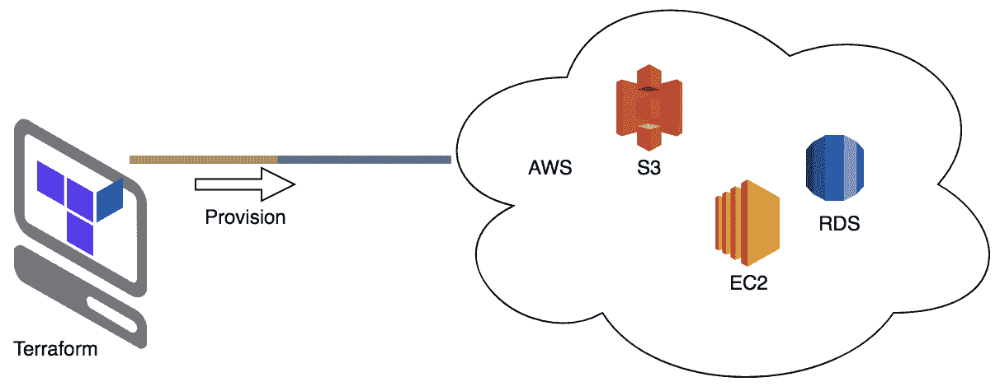
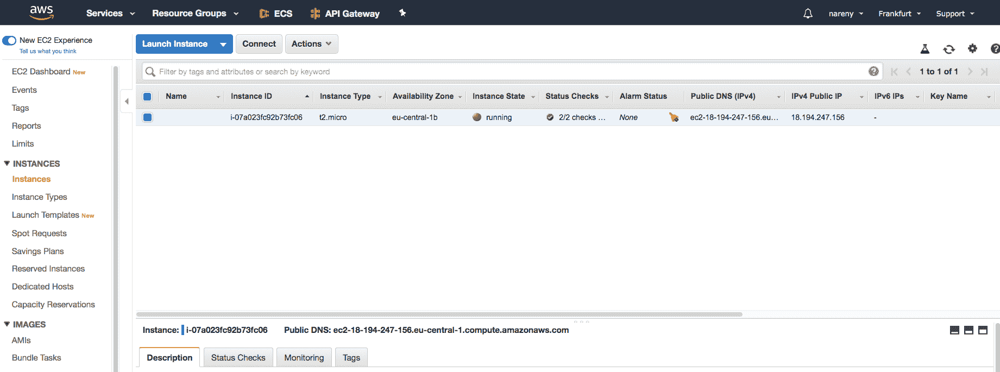
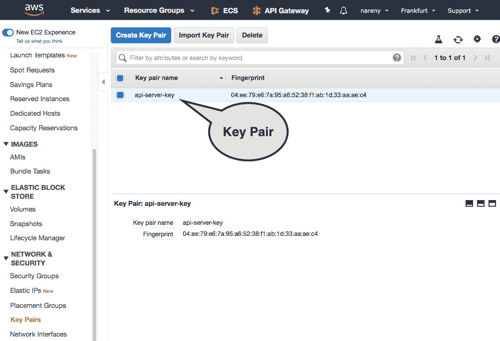
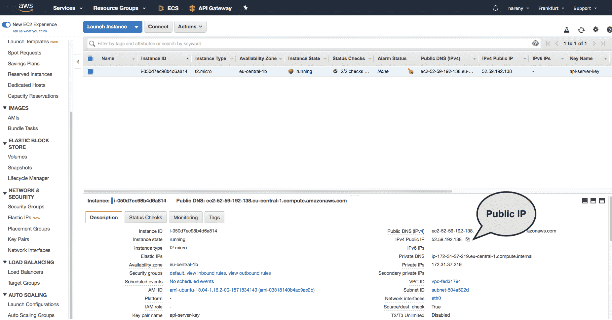
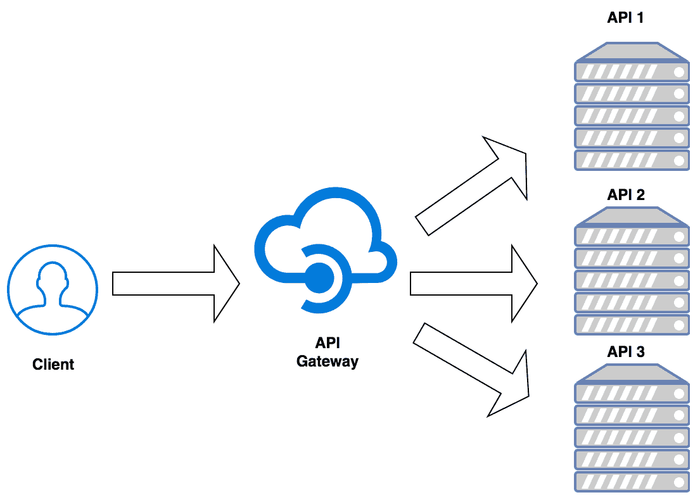
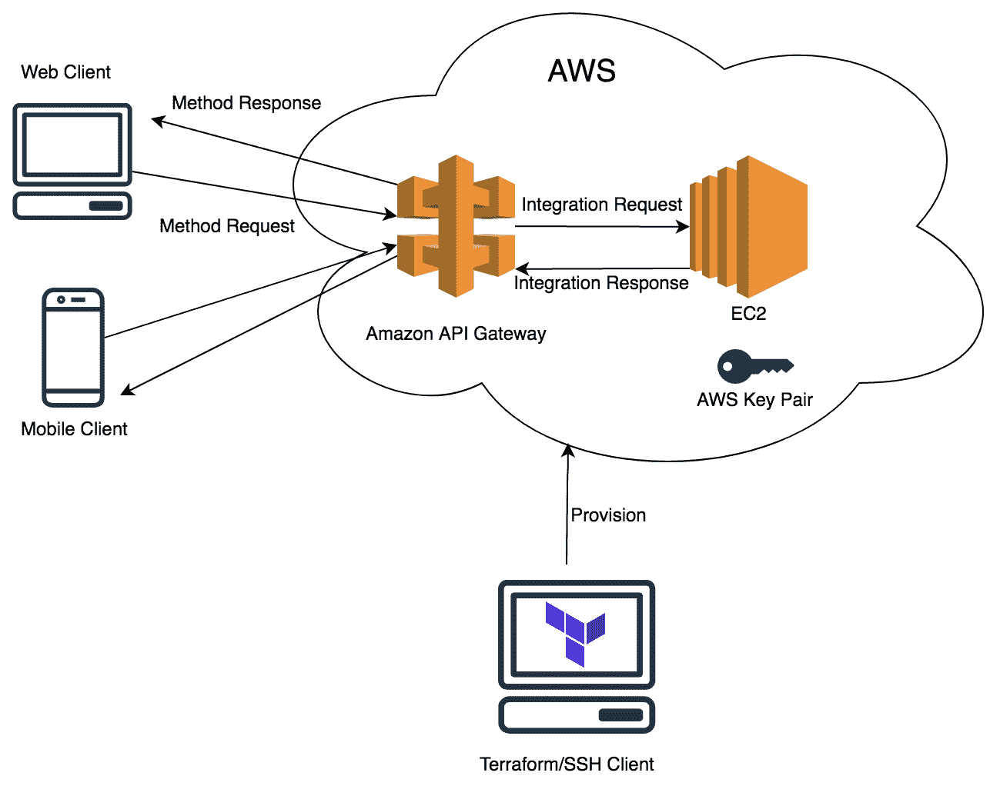
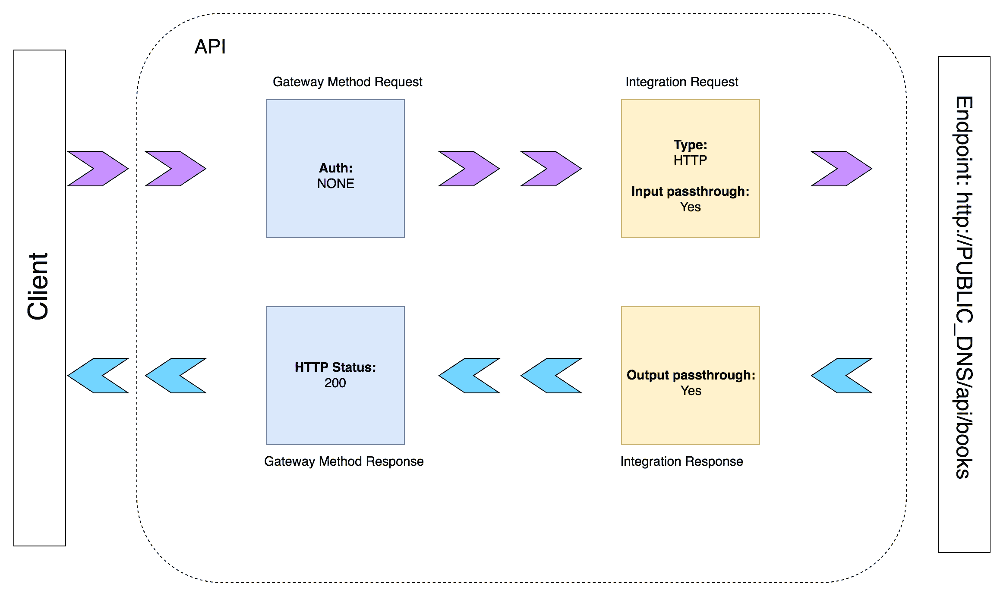

# 在亚马逊网络服务上部署 REST 服务

准备好可部署的生态系统后，我们必须在云服务提供商上托管该生态系统，以便使**应用程序编程接口**（**API**）端点对公共互联网可见。我们需要利用云服务，如**亚马逊网络服务**（**AWS**）的**弹性计算云**（**EC2**）来部署网络服务。

部署完成后，旅程并未结束。我们必须跟踪我们的 API 使用情况和性能，以便更好地了解客户。连接到 API 的客户是谁？他们的请求频率如何？失败的授权数量等因素对于微调 API 非常重要。为了更好的安全性，API 服务器不应直接暴露给公共互联网。

在本章中，我们将探讨 AWS。然而，坚持使用单一云服务提供商可能会在后续迁移时遇到问题。因此，我们将使用一个名为 Terraform 的工具来定义和创建我们的资源。Terraform 是一个**基础设施即代码**（**IaC**）工具，它具有云无关性。我们配置了一个 EC2 实例和一个 API 网关，以便正确部署我们的**表示状态传输**（**REST**）服务。

在本章中，我们将涵盖以下主题：

+   AWS 工作基础

+   使用 Terraform 进行 IaC

+   为什么需要 API 网关？

+   介绍 AWS API 网关

+   其他 API 网关

# 技术要求

以下软件应预先安装以运行代码示例：

+   操作系统：Linux (Ubuntu 18.04)/Windows 10/Mac OS X>= 10.13

+   Go 稳定版本编译器 >= 1.13.5

+   Dep：Go 的依赖管理工具 >= 0.5.3

+   Docker 版本 >= 18.09.2

+   Terraform 版本 >= 0.12.18

您可以从[`github.com/PacktPublishing/Hands-On-Restful-Web-services-with-Go/tree/master/chapter13`](https://github.com/PacktPublishing/Hands-On-Restful-Web-services-with-Go/tree/master/chapter13)下载本章的代码。克隆代码，并使用`chapter13`目录中的代码示例。

# AWS 工作基础

AWS 是一个管理云应用程序基础设施的云服务提供商。其他主要玩家包括微软 Azure 和**谷歌云平台**（**GCP**）。它们都配备了多种多样的解决方案来管理各种工件，如下所示：

+   应用程序

+   数据库

+   消息队列

+   网络

+   Docker 镜像管理

+   事件总线

运行应用程序的托管服务有多种类型。我们将在下一节讨论其中的一些。

# AWS 的应用程序托管服务

一个应用程序应该托管在云服务器上，以向公共互联网提供 API 服务。该服务器可以是独立机器或容器。AWS 提供了一个名为**虚拟机**（**VM**）的独立服务器，即 EC2。AWS EC2 是一种托管服务，它提供了 VM 的轻松创建和拆卸。

**弹性容器服务** （**ECS**），AWS 的另一种托管服务，允许开发者在其容器中运行应用程序。Go 应用程序可以打包到 Docker 镜像中，并在 AWS ECS 上部署。

**AWS Lambda** 是另一种托管服务，可以运行无服务器函数。这是一个运行 Go 函数的服务。这些函数是短暂的，适用于例如 **数据提取-转换-加载** （**ETL**） **的数据** 等用例。Lambda 函数定义接受编译后的 Go 代码，并且可以根据需求运行数千个 Lambda 实例。

根据用例，我们应该选择适合运行我们应用程序的正确服务。由于简化了构建、推送和部署周期，基于 Docker 容器的 ECS 在运行长期运行服务和短暂应用程序方面比 EC2 更受欢迎。

在本章中，我们将尝试利用 AWS EC2 来部署 API 服务器。接下来，我们将使用 Amazon API Gateway 保护我们的服务器。以下图表可以指导您选择合适的 AWS 服务来管理 Go 应用程序：

| **类型** | **使用位置** |
| --- | --- |
| `AWS Lambda` | 存活时间少于 15 分钟（根据写作时间）的函数 |
| `AWS ECS` | 使用 AWS 管理容器的短暂和长期运行服务 |
| `AWS EC2` | 使用自管理 VM 的长期运行服务 |

在下一节中，我们将了解如何设置 AWS 免费层账户。我们将使用该账户在本章的所有代码示例中。

# 设置 AWS 账户

我们需要 AWS 账户来完成本章的工作。如果您还没有，您可以使用 AWS 免费层计划试用 1 年：[`aws.amazon.com/free/`](https://aws.amazon.com/free/)。

在注册免费层后，我们可以通过设置密码来访问我们的 AWS 账户。AWS 账户有一个自定义 URL，账户管理员和其他用户可以登录到账户仪表板：[`console.aws.amazon.com/billing/home?#/account`](https://console.aws.amazon.com/billing/home?#/account)。

所有主要服务都是免费的，但有一些限制。因此，在测试时始终监控 AWS 服务的免费层使用情况。AWS 提供了一种独特的角色模型，称为 **身份和访问管理** （**IAM**）。这允许创建新用户并授予各种服务的权限。

在我们设置 AWS 账户后，我们应该创建 IAM 用户和角色。但为了简单起见，我们将使用之前创建的账户，其中创建者自动是管理员。我们应该允许以编程方式访问我们的 AWS 账户以便部署应用程序。

我们有三种方式可以与 AWS 交互以提供托管服务：

+   AWS 控制台

+   AWS **命令行界面** （**CLI**） 工具

+   第三方 **软件开发工具包** （**SDK**）

在第一种选项中，用户登录 AWS 账户并手动配置 AWS 资源。在第二种情况下，用户可以在他们的机器上安装客户端并使用命令行 API 管理资源。第三种选项非常底层，第三方库封装 AWS API 并提供干净的接口。

对于第二种和第三种选项，必须生成安全凭证。安全凭证由两个密钥组成：

+   访问密钥 ID

+   秘密访问密钥

此安全凭证用于验证任何第三方应用程序与 AWS。可以通过在 AWS 账户中导航到 IAM| 用户| 用户| 名称| 安全凭证并执行创建访问密钥操作来获取。

创建 `access_key_id` 也会生成一个 `secret_access_key`。这些应该存储在安全的地方。如果您丢失了秘密密钥，您必须从 IAM 安全凭证中删除它并创建一个新的。

一旦用户成功获得访问密钥 ID 和秘密访问密钥，他们应该在 `home` 路径的 `.aws` 目录中创建两个文件。

在 Linux 和 Mac OS X 上，创建两个名为 `credentials` 和 `config` 的文件：

+   `~/.aws/credentials`:

```go
[default]
aws_access_key_id=YOUR_ACCESS_KEY_ID
aws_secret_access_key=YOUR_SECRET_KEY
```

+   `~/.aws/config`:

```go
[default]
region=eu-central-1
output=json
```

凭证文件包含有关访问密钥和秘密访问密钥的信息，以便与 AWS 进行身份验证。配置文件配置设置，例如操作的 AWS 区域和 AWS CLI 输出格式，如 JSON、XML 等。

在 Windows 上，文件应在 `C:\> dir "%UserProfile%\.aws"` 中创建。

您必须将 `YOUR_ACCESS_KEY_ID` 和 `YOUR_SECRET_KEY` 变量替换为 AWS 账户中的实际安全凭证。

配置文件中的区域是应用程序托管的地域位置。在前面的配置中，我们选择了法兰克福（eu-central-1）作为首选区域。您应该选择离客户端较近的区域。

我们的目标是在 AWS 的 API Gateway 后运行应用程序。而不是手动从 AWS 控制台进行操作，我们将使用一个名为 Terraform 的工具。Terraform 提供了 IaC，我们可以让 Terraform 脚本记录 AWS 上的资源创建。AWS 提供了一个内部 IaC 解决方案，称为 **CloudFormation**。与 AWS CloudFormation 相比，Terraform 更简单，以及更简洁。在下一节中，我们将探讨 Terraform 及其内部结构。

# 使用 Terraform 进行 IaC

**Terraform** 是一种用于在云平台上（包括 AWS）提供基础设施的软件工具。使用 Terraform，我们可以创建、配置或删除资源。与 AWS 控制台相比，Terraform 允许自动资源提供。与低级 REST API 和 SDK 相比，Terraform 具有干净、高级的 API。Terraform 将已提供基础设施的当前状态存储在状态文件中。

假设要在另一个账户上复制在账户上配置的基础设施作为灾难恢复的一部分。如果没有 IaC，所有资源都必须手动重新配置。然而，如果整个基础设施以 Terraform 脚本的形式建模，那么在任意数量的账户上重新播放基础设施就变得容易了。与在 AWS 控制台上手动配置基础设施相比，这种方法可读性和可维护性更强。

Terraform 在云上几乎提供了所有 AWS 托管服务。它应该在本地机器上运行。在提供时，它生成状态文件。请参阅以下图示以了解提供方向：



所有平台的 Terraform 安装二进制文件都可以在这里获得：[`www.terraform.io/downloads.html`](https://www.terraform.io/downloads.html)。

对于 Linux 和 Mac OS X，将可执行文件复制到相应的二进制路径，以便在系统范围内可用。使用此命令确认您的安装。它将打印出您安装的`Terraform`软件的`version`：

```go
terraform version
Terraform v0.12.18
```

为了对 Terraform 进行简要介绍，让我们按照以下步骤为我们的 REST API 服务器提供 EC2 实例：

1.  创建一个名为`intro`的项目目录来存放提供 EC2 实例的脚本，如下所示：

```go
mkdir -p $GOPATH/src/github.com/git-user/chapter13/intro
```

1.  所有 Terraform 文件都有`.tf`文件扩展名。因此，添加一个名为`api_server.tf`的脚本，如下所示：

```go
touch $GOPATH/src/github.com/git-user/chapter13/intro/api_server.tf
```

1.  Terraform 文件的语法看起来像这样：

```go
<BLOCK TYPE> "<BLOCK LABEL>" "<BLOCK LABEL>" {
  # Block body
  <IDENTIFIER> = <EXPRESSION> # Argument
}
```

如我们所见，Terraform 脚本由四个基本构建块组成：

+   **块类型**：Terraform 预定义的一组块类型——例如，资源和数据。

+   **块标签**：Terraform 脚本中块类型的命名空间。

+   **标识符**：块内的变量。

+   **表达式**：块内变量的值。

您可以在[`www.terraform.io/docs/configuration/index.html`](https://www.terraform.io/docs/configuration/index.html)查看这些四个实体的所有可能值。

1.  现在是实际的脚本，`api_server.tf`。它应该有两个块，`provider`和`resource`，如下所示：

```go
provider "aws" {
  profile    = "default"
  region     = "eu-central-1"

}

resource "aws_instance" "api_server" {
  ami           = "ami-03818140b4ac9ae2b"
  instance_type = "t2.micro"
}
```

`provider`块定义了要使用的云提供商类型，并配置了安全凭据和区域。`resource`块用于定义要提供的资源类型及其属性。在这里，我们正在提供 EC2 实例，因此我们提供了`aws_instance`作为资源类型。`api_server`是创建的实例的名称。EC2 提供了许多实例类型。在这里，我们使用容量较小的实例`t2.micro`。

AWS 使用**Amazon Machine Image**（**AMI**）来创建虚拟机。我们在 Terraform 文件中选择了 Ubuntu 18.04 作为`ami-03818140b4ac9ae2b`操作系统映像。您可以在以下位置找到与您所在区域最接近的 AMI 映像：[`cloud-images.ubuntu.com/locator/ec2/`](https://cloud-images.ubuntu.com/locator/ec2/)。

属性可以根据资源类型而变化。因此，如果我们选择不同的资源，我们必须检查 Terraform 文档以获取适当的属性。在前面的资源块中，我们只定义了两个属性：`ami`和`instance_type`。这两个属性对于 AWS EC2 API 是强制性的。所有其他属性，如网络、安全组和 CPU，默认为合理的值。

1.  现在，从`intro`目录运行脚本，如下所示：

```go
terraform apply
```

1.  脚本输出以下消息，并要求确认`apply`过程：

```go
Do you want to perform these actions?
  Terraform will perform the actions described above.
  Only 'yes' will be accepted to approve.

  Enter a value: yes

aws_instance.api_server: Creating...
aws_instance.api_server: Still creating... [10s elapsed]
aws_instance.api_server: Still creating... [20s elapsed]
aws_instance.api_server: Creation complete after 24s [id=i-07a023fc92b73fc06]
```

它成功创建了 EC2 实例。我们可以导航到 AWS 控制台上的 EC2 部分，查看我们的实例正在运行，如下面的截图所示：



由于我们没有在 Terraform 文件中将它们指定为属性，因此自动分配了如可用区、公共 IP 等详细信息。AWS 创建了一个默认的**虚拟专用网络**（**VPC**）、子网和一个公共**域名系统**（**DNS**）。

如果你仔细观察，`terraform apply`会在目录中生成以下附加文件：

+   `terraform.tfstate`：这包含与 AWS 执行的 JSON 计划。

+   `.terraform`：这是一个目录，包含插件，取决于提供者。在我们的例子中，提供者类型是 AWS。

Terraform 在项目的`.terraform`目录中安装与提供者相关的可执行文件。这是为了减少 Terraform 二进制文件的文件大小，排除编译脚本到其他云提供者的包。

`.terraform/plugins`中的插件版本也有一个版本号。你应该使用最新的插件来从最新的 Terraform 语法中受益。否则，引用另一个资源时可能会引发错误。为了安全起见，请使用以下命令升级插件到最新版本：`terraform 0.12upgrade`。

我们已经成功配置了一个 EC2 实例，但直到我们可以 SSH 进入它之前，它都是无用的。为此，我们应该提供一个密钥对。让我们看看如何操作的步骤，如下所示：

1.  你可以在本地机器上生成一个公钥/私钥对，如下所示：

```go
ssh-keygen -t rsa -b 4096
```

1.  这将在`~/.ssh`目录中生成公钥和私钥文件。公钥用于其他方加密数据，私钥用于所有者解密该数据。你的公钥文件的默认名称是`id_rsa.pub`。

1.  在`api_server.tf`文件中创建一个新的资源类型名为`aws_key_pair`，如下所示：

```go
resource "aws_key_pair" "api_server_key" {
  key_name   = "api-server-key"
  public_key = "ssh-rsa ABCD...XYZ naren@Narens-MacBook-Air.local"
}
```

在前面的块中，Terraform 创建了一个名为`api_server_key`的新 AWS 密钥对资源。它需要一个`key_name`和一个`public_key`。这是你新创建的公钥。AWS 将此密钥添加到 EC2 实例上的`~/.ssh/known_hosts`，以便在配置成功后登录到虚拟机。

1.  接下来，我们应该将这个新创建的资源链接到我们的主要资源`aws_instance`，如下所示：

```go
resource "aws_instance" "api_server" {
  ...
  key_name      = aws_key_pair.api_server_key.key_name
}
```

1.  现在，我们可以看到使用`terraform plan`命令执行的 Terraform 计划，如下所示：

```go
terraform plan
Refreshing Terraform state in-memory prior to plan...
The refreshed state will be used to calculate this plan,
but will not be persisted to local or remote state storage.

aws_instance.api_server: Refreshing state... [id=i-07a023fc92b73fc06]

------------------------------------------------------------------------

An execution plan has been generated and is shown below.
Resource actions are indicated with the following symbols:
 + create

Terraform will perform the following actions:

 # aws_instance.api_server must be replaced
-/+ resource "aws_instance" "api_server" {
 ...
 + key_name = "api-server-key" # forces replacement
 ...
}

 # aws_key_pair.api_server_key will be created
```

如前述日志中明确指出的，Terraform 执行了一个新资源 `aws_key_pair` 的创建，并重新创建了服务器。Terraform 的 `plan` 步骤是在 AWS 上应用更改之前检查更改的好方法。

1.  现在，让我们实际使用 `terraform apply` 命令来应用这些更改，如下所示：

```go
terraform apply
...
aws_key_pair.api_server_key: Creating...
aws_key_pair.api_server_key: Creation complete after 1s [id=api-server-key]
aws_instance.api_server: Destroying... [id=i-07a023fc92b73fc06]
aws_instance.api_server: Still destroying... [id=i-07a023fc92b73fc06, 30s elapsed]
aws_instance.api_server: Destruction complete after 30s
aws_instance.api_server: Creating...
aws_instance.api_server: Still creating... [30s elapsed]
aws_instance.api_server: Creation complete after 33s [id=i-050d7ec98b4d6a814]
```

1.  接下来，在 AWS 账户控制台（浏览器）中，导航到 EC2| 网络 & 安全 |密钥对部分。您将在那里找到新添加的密钥对，如下面的截图所示：



1.  现在，为了 SSH 进入我们的 EC2 实例，我们需要实例的公共 DNS。我们可以从 AWS 控制台或从 `terraform.tfstate` 文件中获取公共 DNS。

1.  在我们这个例子中，公共 DNS 是 `ec2-52-59-192-138.eu-central-1.compute.amazonaws.com`。现在我们可以以 Ubuntu 用户身份 SSH 进入这个系统，如下所示：

```go
ssh ubuntu@ec2-52-59-192-138.eu-central-1.compute.amazonaws.com

Welcome to Ubuntu 18.04.3 LTS (GNU/Linux 4.15.0-1052-aws x86_64)
 ....

52 packages can be updated.
0 updates are security updates.
```

此命令选择 `~/.ssh` 文件夹并定位到私钥。然后它与与 EC2 实例关联的公钥进行握手。

Ubuntu 镜像几乎没有任何配置。Go 编译器、Docker 和 docker-compose 等软件默认情况下并未安装在 Ubuntu EC2 实例上。在部署我们的应用程序之前，我们必须安装它们。确保您已 SSH 进入该机器。

1.  安装最新版本的 Go 编译器和 Docker，如下所示：

```go
sudo snap install go --classic
sudo snap install docker
```

1.  安装 `docker-compose`，如下所示：

```go
sudo pip install docker-compose
```

正如你可能注意到的，我们用于 SSH 的用户名是 `ubuntu`。这取决于用于实例配置的 AMI。例如，如果镜像是一个亚马逊 Linux 镜像，那么 SSH 用户名将是 `ec2-user`。

在下一节中，我们将介绍在 EC2 实例上部署 REST API 的过程。我们将使用我们旅程中之前配置的机器。

# 在 EC2 上部署服务

到目前为止，我们已经配置了一个具有公共 DNS 的 EC2 实例。现在，我们需要一个 API 来在实例上部署。让我们使用 第十二章 中的 `bookServer` 容器化应用程序，“为部署容器化 REST 服务”。在那里，我们开发了一个 Go API 服务器，在端点上提供书籍详情。在本节中，让我们尝试在 AWS EC2 实例上部署该生态系统。让我们看看在 AWS EC2 上部署 `bookServer` 的步骤，如下所示：

1.  将 `chapter12/deploySetup` 中的代码复制到实例的 `/home/ubuntu` 目录。您可以使用 `scp` 命令完成此操作，如下所示：

```go
scp -r $GOPATH/src/github.com/git-user/chapter12/deploySetup ubuntu@ec2-52-59-192-138.eu-central-1.compute.amazonaws.com:/home/ubuntu
```

此命令将 第十二章，“为部署容器化 REST 服务”，中的源代码复制到目标实例。我们的应用程序代码已经准备好了。代码有一个 `Makefile`，用于构建 Go 可执行文件并部署各种容器。

1.  如果您还记得从 第十二章，“为部署容器化 REST 服务”中构建的 `deploySetup` 应用程序，那么您会记得我们可以使用 `make` 命令启动 nginx 应用服务器和 `supervisord`，如下所示：

```go
sudo make
```

1.  此步骤在后台构建并启动 Docker 容器，如下所示：

```go
Creating deploysetup_app_1 ... done
Creating deploysetup_nginx_1 ... done
```

由于用户权限，我们需要使用 `sudo make` 而不是 `make`，因为默认的 `ubuntu` 用户默认没有对 Docker 守护进程的权限。

1.  现在，nginx 容器和应用容器都在运行。我们可以使用以下代码块中的 `docker ps` 命令来确认这一点：

```go
sudo docker ps

CONTAINER ID        IMAGE               COMMAND                  CREATED             STATUS              PORTS                                      NAMES
a016732f8174        nginx:alpine        "nginx -g 'daemon of…"   2 minutes ago       Up 2 minutes        0.0.0.0:80->80/tcp, 0.0.0.0:443->443/tcp   deploysetup_nginx_1
29b75b09082d        deploysetup_app     "/usr/bin/supervisor…"   2 minutes ago       Up 2 minutes        8000/tcp                                   deploysetup_app_1
```

这表明我们的 nginx 和应用容器正在 EC2 实例上运行，nginx 正在端口 `80` 上提供服务。

1.  从 AWS 控制台或 `terraform.tfstate` 文件中获取公网 IP。

总是确认已暴露的 Docker 容器端口。格式 `0.0.0.0:80->80/tcp` 表示容器 TCP 端口 `80` 将数据包转发到主机端口 `80`。在我们的例子中，主机是一个 EC2 实例，容器是 nginx。

在我们的例子中，实例的公网 IP 是 `52.59.192.138`。请参考以下截图，以了解我们如何在 AWS 控制台 EC2 实例部分找到公网 IP：



1.  从您的宿主机（不是从 EC2 实例）向 `http://public-ip/api/books` 端点发起 `curl` 请求。您将从服务器获得以下 JSON 响应：

```go
curl http://52.59.192.138/api/books

{"ID":123,"ISBN":"0-201-03801-3","Author":"Donald Knuth","PublishedYear":"1968"}
```

哈喽！我们的 API 已经发布到网络上，并且可以在全球范围内访问。在这里，nginx 正在充当 HTTP 请求的入口点。我们部署的设置是在 AWS 上发布 API 的最小方式。在现实世界的场景中，你必须做更多的事情，例如以下内容，以保护 API：

1.  通过添加证书在 HTTPS 上处理请求

1.  正确配置 VPC、子网和安全组

将前面的建议添加到我们的 EC2 实例超出了本书的范围。请参考 AWS 关于这些主题的文档以获取更多信息。

在下一节中，我们将使用 Amazon API Gateway 配置我们的 EC2 实例。正如我们在本章开头讨论的那样，AWS 网关是保护 EC2 实例的主要方式之一。

# 为什么需要 API 网关？

假设一家名为 `XYZ` 的公司为其内部用途开发了一个 API。它有两种方式将此 API 暴露给外部使用：

+   它使用已知客户端的认证来暴露它。

+   它将其作为一项服务以 API 的形式暴露。

在第一种情况下，此 API 由公司内部的其他服务消费。由于它们是内部的，我们没有限制访问。但在第二种情况下，由于 API 详细信息已经提供给外部世界，我们需要一个中间代理来检查和验证请求。这个代理就是 API 网关。API 网关是一个位于客户端和服务器之间的代理，在满足特定条件后将请求转发到服务器。

现在，公司 `XYZ` 有一个用 Go 编写的 API 和一个用 Java 编写的 API。有一些适用于任何 API 的共同点：

+   认证

+   记录请求和响应

没有 API 网关，我们需要编写另一个服务器来跟踪诸如请求和 API 认证等事项。当组织不断添加新的 API 时，实现和维护这些基本功能可能会变得很繁琐。为了处理这些基本事务，API 网关是一块很好的中间件。

基本上，API 网关做以下事情：

+   记录日志

+   安全性

+   交通控制

+   中间件

记录日志是我们跟踪请求和响应的方式。与在 Go 网络服务器中发生的应用级日志记录不同，API 网关可以支持跨多个应用程序的组织级日志记录。

认证是应用安全的一部分。它可以是基本认证、基于令牌的认证、OAuth2.0 等。对于限制对 API 的有效客户/客户端的访问至关重要。

当 API 是一项付费服务时，交通控制就派上用场。当组织以 API 的形式销售数据时，需要限制每个客户端的操作次数。例如，一个客户端每月可以发起 10,000 次 API 请求。可以根据客户端选择的计划设置速率。这是一个非常重要的功能。

中间件用于在请求到达应用服务器之前修改请求，或者在将响应发送回客户端之前修改响应。

看一下以下图示：



上述图示显示了接受所有**客户端**请求的**API 网关**。API 网关可以根据 HTTP 头、URL 路径前缀或 IP 地址将请求转发到相应的 API 服务器。一旦 API 服务器完成其工作，**API 网关**收集中间响应并将其返回给**客户端**。在本章中，我们将尝试利用 Amazon API 网关。

# 介绍 Amazon API 网关

Amazon API 网关具有以下功能：

+   反向代理服务

+   速率限制

+   监控

+   认证

**反向代理**是将 REST API 请求传递到另一个端点的过程。Amazon API 网关可以注册一个具有自定义路径和方法的 REST 端点。它将匹配的请求转发到应用服务器。它还可以使用 AWS 用户凭证以及安全令牌进行认证。用户必须在 AWS IAM 上创建，才能访问 API。

通过编写网关规则可以实现监控。日志可以被定向到 AWS CloudWatch，这是另一项由 Amazon 提供的服务。当有可疑的入站请求时，网关还可以触发 CloudWatch 警报。CloudWatch 警报是针对特殊情况的通知。这些通知可以触发其他操作，例如发送电子邮件或记录事件。

现在，让我们为我们的 EC2 实例配置一个 API 网关。架构图看起来像这样：



在前面的图中，Amazon API Gateway 定义了方法和集成。目标是部署了 `books` API 的 EC2 实例。我们应该配置六种类型的组件来在 AWS 上运行 API Gateway。具体如下：

+   网关 REST API

+   网关方法请求

+   网关方法响应

+   网关集成请求

+   网关集成响应

+   网关部署

为什么我们必须创建前面的组件？Amazon API Gateway 架构在其设计中定义了这些组件。参见以下图表，了解 API 在 Amazon API Gateway 上的表示方式：



**客户端**请求通过**网关方法请求**和**集成请求**阶段发送。集成请求阶段然后将请求转发到配置的 API 端点。该端点将是 `/api/books`，使用 `GET` 方法，并且将在 EC2 实例上运行。这完成了请求的生命周期。

接下来，端点从 EC2 实例返回一个响应。此响应被转发到**集成响应**阶段，然后到**网关方法响应**阶段。这完成了响应的生命周期。

每个阶段都可以进一步配置，以将响应转换为不同的格式。为了简单起见，我们保留每个阶段的默认设置。在下一节中，我们将尝试在 Terraform 中构建前面的组件。

在编写 Terraform 脚本之前，在 AWS 控制台中手动创建我们的 API 的 API Gateway。这有助于你理解 Amazon API Gateway 的基本词汇。

# 在 Amazon API Gateway 后部署我们的服务

暂停理论，让我们快速跳入一个例子。我们的目标是设置 API Gateway，作为之前部署的 `books` API 的目标。按照以下步骤操作：

1.  让我们创建一个新的项目并编写一个新的 Terraform 脚本，该脚本在 Amazon API Gateway 上创建和部署一个 API，如下所示：

```go
touch $GOPATH/src/github.com/git-user/chapter13/intro/api_gateway.tf
```

它还链接了我们的 EC2 实例和 API 端点。

1.  让我们在脚本中添加网关 REST API 组件：

```go
// New API on Amazon API Gateway
resource "aws_api_gateway_rest_api" "test" {
  name        = "EC2Example"
  description = "Terraform EC2 REST API Example"
  endpoint_configuration {
    types = ["REGIONAL"]
  }
}
```

它包含一些重要的属性，如下所示：

+   `name`: API 的名称

+   `description`: 关于 API 的文本

+   `endpoint_configuration`: 定义要发布的 API 的模式（`REGIONAL` 或 `EDGE`）

这些详细信息用于在 Amazon API Gateway 中识别一个 API。我们给我们的 API 命名为 `EC2Example`。`aws_api_gateway_rest_api` 资源类型是 Terraform 资源类型。我们的资源名称是 `test`。从现在开始，我们将看到所有其他资源类型都使用类似的名字。

当 AWS 创建 `aws_api_gateway_rest_api` 组件时，它也在 AWS 上创建了一个默认的网关资源。网关资源是我们作为集成部分配置的端点的相对路径。

1.  接下来，我们必须创建一个名为 `test` 的网关方法。它接受 `rest_api_id`、`resource_id` 和 `http_method` 属性。这三个属性对所有组件都是通用的。让我们称这些为 `DEFAULT_ATTRIBUTES`。

1.  此外，我们在该组件上设置了`Authorization=NONE`。如果我们设置授权为`AWS_IAM`，那么客户端必须提供 AWS 访问密钥和令牌，与请求一起提供。目前我们正在禁用网关认证，如下面的代码块所示：

```go
// Method request configuration
resource "aws_api_gateway_method" "test" {
   rest_api_id   = aws_api_gateway_rest_api.test.id
   resource_id   = aws_api_gateway_rest_api.test.root_resource_id
   http_method   = "GET"

   authorization = "NONE"
 }
```

1.  在添加方法请求后，我们应该添加方法响应组件。这也需要`DEFAULT_ATTRIBUTES`加上`status_code`。这意味着每当方法响应从集成响应中接收到`200` `OK`时，它将作为成功消息传递给客户端，如下面的代码块所示：

```go
// Method response configuration
resource "aws_api_gateway_method_response" "test" {
  rest_api_id = aws_api_gateway_rest_api.test.id
  resource_id = aws_api_gateway_rest_api.test.root_resource_id
  http_method = aws_api_gateway_method.test.http_method

  status_code = "200"
}
```

1.  接下来，添加集成组件。根据上一节中的 API 架构图，我们有两个集成组件。`integration response`组件与`method_response`组件类似，如下面的代码块所示：

```go
// Integration response configuration
resource "aws_api_gateway_integration_response" "MyDemoIntegrationResponse" {
  rest_api_id = aws_api_gateway_rest_api.test.id
  resource_id = aws_api_gateway_rest_api.test.root_resource_id
  http_method = aws_api_gateway_method.test.http_method

  status_code = aws_api_gateway_method_response.test.status_code
}
```

API 网关和运行在 EC2 实例上的我们的 API 之间的主要链接是在`integration request`组件中创建的。它包含`DEFAULT_ATTRIBUTES`，以及三个重要属性：

+   `integration_http_method`：决定应在端点上调用哪种 HTTP 方法

+   `type`：表示正在使用哪种类型的端点：`HTTP`、`Lambda`或`AWS_PROXY`

+   `uri`：端点的实际引用

在我们的案例中，因为我们想将网关和 EC2 实例链接起来，我们使用`HTTP`作为我们的`type`，并将我们的 EC2 实例的公网 DNS 作为`uri`。Terraform 块看起来像这样：

```go
// Integration request configuration
resource "aws_api_gateway_integration" "test" {
   rest_api_id = aws_api_gateway_rest_api.test.id
   resource_id = aws_api_gateway_method.test.resource_id
   http_method = aws_api_gateway_method.test.http_method

   integration_http_method = "GET"
   type                    = "HTTP"
   uri                     = "http://${aws_instance.api_server.public_dns}/api/books"

}
```

我们已将`integration_http_method`设置为`GET`，因为我们的`books` API 只有一个使用 GET 方法的端点。对于`uri`属性值，我们引用了`aws_instance.api_server` EC2 实例资源中的`public_dns`。由于 Terraform 脚本`api_server.tf`和`api_gateway.tf`都在同一个`intro`项目目录中，我们可以从另一个脚本中导入资源。

这完成了 API 的所有五个关键组件。我们必须使用测试环境部署 API。Terraform 提供了一个名为`aws_api_gateway_deployment`的资源类型来创建部署。部署对于测试或发布 Amazon API 网关端点到 Web 非常有用。部署需要以下属性：

```go
// Deploy API on Gateway with test environment
resource "aws_api_gateway_deployment" "test" {
   depends_on = [
     aws_api_gateway_integration.test
   ]

   rest_api_id = aws_api_gateway_rest_api.test.id
   stage_name  = "test"
 }
```

部署还依赖于`integration request`，因此我们添加了`depends_on`属性。`stage_name`属性可以接受`test`阶段或生产环境类型。这样，我们就完成了 API 网关的创建。让我们运行脚本，在 Amazon API 网关上创建和部署我们的 API，如下所示：

```go
terraform apply -auto-approve

aws_key_pair.api_server_key: Refreshing state... [id=api-server-key]
aws_instance.api_server: Refreshing state... [id=i-050d7ec98b4d6a814]
aws_api_gateway_rest_api.test: Creating...
aws_api_gateway_method.test: Creating...
aws_api_gateway_method.test: Creation complete after 1s [id=agm-kvp9kg9jv6-hognbzcre0-GET]
aws_api_gateway_method_response.test: Creating...
aws_api_gateway_integration.test: Creating...
aws_api_gateway_method_response.test: Creation complete after 0s [id=agmr-kvp9kg9jv6-hognbzcre0-GET-200]
aws_api_gateway_integration_response.MyDemoIntegrationResponse: Creating...
aws_api_gateway_integration.test: Creation complete after 0s [id=agi-kvp9kg9jv6-hognbzcre0-GET]
aws_api_gateway_deployment.test: Creating...
.....

```

现在，客户端在哪里可以访问 API 网关的新 URL？您可以从`terraform.tfstate`文件中获取`invoke_url`，如下所示：

```go
    {
      "mode": "managed",
      "type": "aws_api_gateway_deployment",
      "name": "test",
      "provider": "provider.aws",
      "instances": [
        {
          "schema_version": 0,
          "attributes": {
            ......
            "invoke_url":"https://kvp9kg9jv6.execute-api.eu-central-
            1.amazonaws.com/test",
            ......
          },
            ......
        }
      ]
    }
```

`invoke_url`是 API 网关端点。在发布 API 时，此端点应附加到自定义域名。如果您向前面的 URL 发出`curl`请求，您应该收到如下所示的 JSON 响应：

```go
curl https://kvp9kg9jv6.execute-api.eu-central-1.amazonaws.com/test

{"ID":123,"ISBN":"0-201-03801-3","Author":"Donald Knuth","PublishedYear":"1968"}
```

这确认了所有组件都在正常工作，并且所有请求/响应都通过 API 网关路由。您可以定义许多这样的端点并配置组件以实现所需的行为。添加身份验证留作练习。

解决这个练习的技巧：尝试修改正确的组件来验证和授权客户端请求。

在下一节中，我们将提到其他重要的 API 网关。

# 其他 API 网关

市场上还有许多其他 API 网关提供商。正如我们之前提到的，所有网关都提供相同的功能集。类似于 AWS API 网关，Apigee 是另一个广为人知的 API 网关技术，它是 Google Cloud 的一部分。云提供商的问题在于它们可能导致供应商锁定（即，它们不能轻易迁移到另一个平台）。市场上有许多开源 API 网关。

选择 API 网关的正确方式取决于业务条件。如果 API 服务器位于 AWS 云上，AWS API 网关是一个不错的选择。对于能够自行管理网关的公司，尝试以下开源替代方案是值得的：

+   Kubernetes

+   Kong

+   Tyk

+   KrakenD

没有最佳选择，但如果工作负载不是很大，nginx 也可以用作 API 网关。有关更多详细信息，请参阅[`www.nginx.com/learn/api-gateway/`](https://www.nginx.com/learn/api-gateway/)。

Kubernetes ([`kubernetes.io/`](https://kubernetes.io/)) 对于喜欢自己管理 API 网关的人来说是一个明智的选择。另外，使用 Kubernetes 的另一个好理由是它正在被广泛采用。

亚马逊还提供了**弹性 Kubernetes 服务**（**EKS**）来在不同的区域运行高可用集群。使用 EKS，API 网关作为已安装的组件包含在内。

# 摘要

在本章中，我们从 AWS 的基本操作开始。亚马逊提供了一个免费层，以便实验他们的云服务。一旦我们注册了免费层，我们应该能够访问 AWS 控制台并能够创建安全凭证。这些安全凭证是应用程序访问 AWS 所必需的。

我们然后看到了如何使用像 Terraform 这样的工具来配置云资源。我们选择了 AWS EC2 作为部署 API 的选择。我们编写了一个 Terraform 脚本来配置 EC2 实例，以及一个密钥对。这个密钥对是登录实例所必需的。

一旦我们能够登录到 EC2 实例，我们就安装了我们 API 服务器所需的全部依赖。我们重用了来自第十二章，*容器化 REST 服务以进行部署*的项目代码，其中我们准备了一个 API 生态系统。我们成功地将`books` API 从 EC2 实例部署出去。

一个简单的 API 服务器在客户端的速率限制、认证和授权方面功能较少。我们需要一个专门的 API 网关来将请求传递到 API 服务器。AWS 提供了一个名为`Amazon API Gateway`的托管网关解决方案。我们看到了 Amazon API 网关的架构，并使用 Terraform 在该网关上配置了一个 API。该架构有六个重要的组件，将在详细讨论。

最后，我们提到了市场上可用的其他网关解决方案。在下一章中，我们将详细讨论 API 认证模式，包括**JSON Web Token**（JWT）认证。
