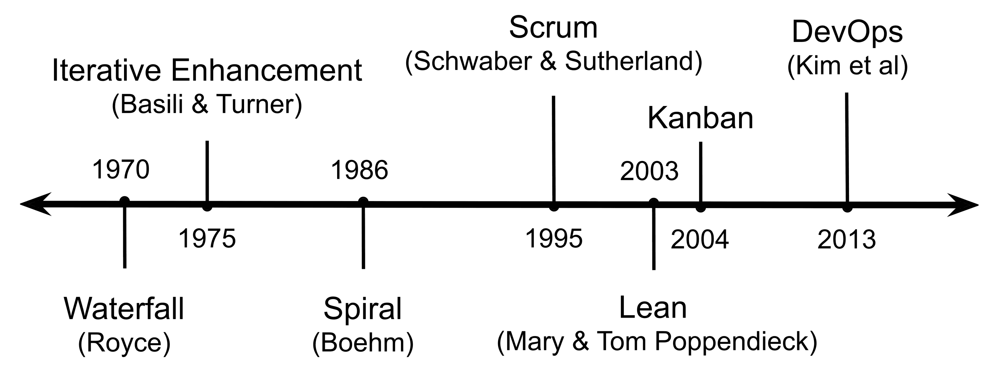
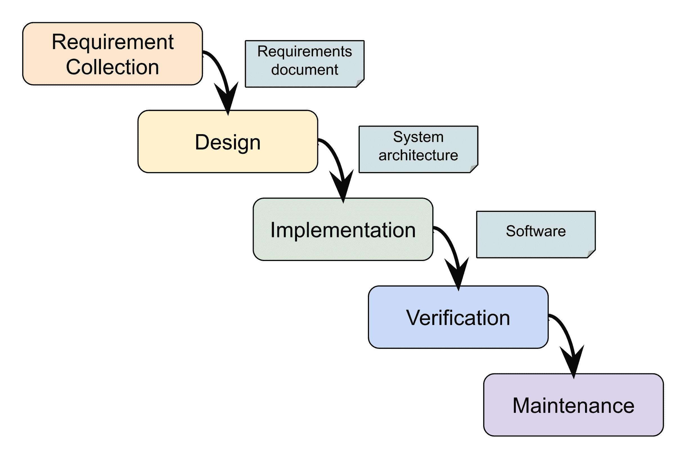
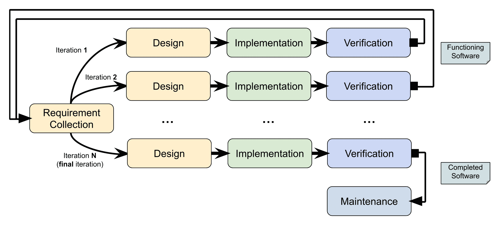
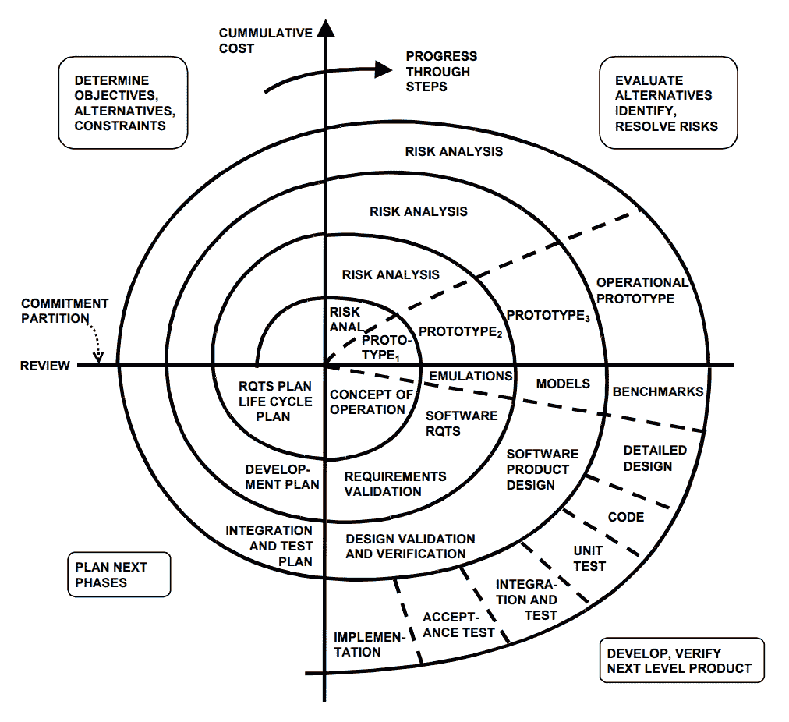
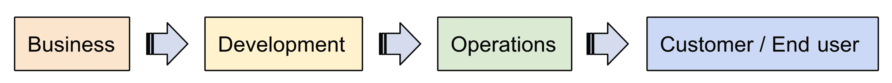
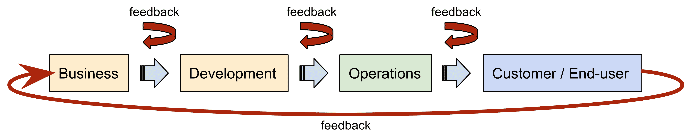

# 软件工程的鸟瞰图

“雇佣人们编写代码来销售与雇佣人们设计和构建耐用、可用、可靠的软件是不同的。”

- 拉里·康斯坦丁 ^([6])

在我职业生涯的各个阶段，我遇到了几个知道如何编码的人；他们的技能水平从初学者到有些人称之为的大师。所有这些人都有不同的背景，在初创公司和大型组织中工作。对于一些人来说，编码被视为从他们的计算机科学研究中自然发展的过程，而其他人则将编码作为职业转变决策的一部分。

不论这些差异如何，他们都有一个共同点：当被要求描述他们当前的角色时，**所有**的人都使用了“软件工程师”这个术语。求职者在简历中使用这个术语作为将自己与全球分布的软件开发者群体区分开来的手段，这是一种相当常见的做法。对在线发布的职位描述进行快速随机抽样显示，许多公司——尤其是知名度高的初创公司——似乎也认同这种思维方式，正如他们寻找专业人士填补软件工程师职位所证明的那样。实际上，正如我们在本章中将要看到的，软件工程师这个术语更像是一个涵盖广泛定制角色的总称，每个角色都结合了不同水平的软件开发专业知识以及与系统设计、测试、构建工具和运营管理等相关领域的专业技能。

那么，软件工程是什么，它与编程有何不同？软件工程师应该具备哪些技能组合，他们可以依赖哪些模型、方法和框架来促进复杂软件组件的交付？这些问题将是本章要回答的一些问题。

本章涵盖了以下主题：

+   软件工程的定义

+   你可能在当代组织中遇到的软件工程角色的类型

+   对流行的软件开发模型进行概述，以及根据项目类型和需求选择哪种模型

# 什么是软件工程？

在我们深入探讨本章内容之前，我们需要对软件工程周围的一些基本术语和概念有一个理解。首先，我们如何定义软件工程，它与软件开发和编程在哪些方面有所不同？为了开始回答这个问题，我们将从检查软件工程的正式定义开始，该定义发表在《IEEE 软件工程术语标准词汇表》*中* ^([7])：

“软件工程被定义为对软件开发、运营和维护应用系统化、规范、可量化的方法。”

从这个定义中得出的主要启示是，编写代码只是软件工程众多方面之一。最终，任何有能力的程序员都可以将一个定义良好的规范转换成一个完全功能化的程序，而无需考虑产生干净和可维护代码的需要。另一方面，一个有纪律的软件工程师会采取更系统的方法，通过应用常见的模式来确保产生的软件是可扩展的、易于测试的，并且在将来有其他工程师或工程团队接管时有良好的文档记录。

除了编写高质量代码的明显要求外，软件工程师还负责考虑将要构建的系统中的其他方面。软件工程师必须能够回答的一些问题包括以下内容：

+   软件需要支持哪些业务用例？

+   系统由哪些组件组成，它们之间如何相互作用？

+   将使用哪些技术来实现各种系统组件？

+   软件将如何测试以确保其行为符合客户的期望？

+   负载如何影响系统的性能，以及系统扩展的计划是什么？

要能够回答这些问题，软件工程师需要一套特殊的技能，正如你可能意识到的，这些技能超出了编程的范畴。这些额外的责任和所需技能是区分软件工程师和软件开发者的主要因素。

# 软件工程角色的类型

正如我们在上一节中讨论的，软件工程是一个本质上复杂、多阶段的过程。为了管理这种复杂性，世界各地的组织多年来投入了大量时间和精力，将这个过程分解成一系列定义良好的阶段，并培训他们的工程人员高效地处理每个阶段。

一些软件工程师努力在整个**软件开发生命周期**（**SDLC**）的各个阶段工作，而其他人则选择专注于并精通 SDLC 的某个特定阶段。这导致了各种软件工程角色的出现，每个角色都有不同的责任和所需技能集合。让我们简要地看看在为小型和大型组织工作时可能会遇到的最常见的软件工程角色。

# 软件工程师（SWE）的角色

**软件工程师**（**SWE**）是你在任何组织中都必然会与之互动的最常见角色，无论其规模大小。软件工程师不仅在设计和新软件构建中扮演关键角色，而且在运营和维护现有和遗留系统中也发挥着重要作用。

根据他们的经验水平和技术专长，SWEs 被分为三个类别：

+   **初级工程师**：初级工程师是那些刚刚开始软件开发职业生涯的人，他们缺乏构建和部署生产级软件的必要经验。公司通常热衷于招聘初级工程师，因为这可以使他们的招聘成本保持低廉。此外，公司经常将有潜力的初级工程师与资深工程师配对，试图将他们培养成中级工程师，并延长他们的服务时间。

+   **中级工程师**：典型的中级工程师至少有三年软件开发经验。中级工程师应具备对软件开发生命周期各个方面的扎实掌握，并且是那些可以对特定项目产生的代码量产生重大影响的人。为此，他们不仅贡献代码，还审查并给出对其他团队成员贡献的代码的反馈。

+   **资深工程师**：这类工程师精通各种不同的技术；他们的知识广度使他们成为组建和管理软件工程团队、以及作为资历较低工程师的导师和教练的理想人选。凭借多年的经验，资深工程师对特定业务领域有深入的理解。这种特质使他们能够作为团队与其他技术或非技术业务利益相关者之间的联络人。

另一种对软件工程师进行分类的方法是考察他们工作的主要焦点：

+   **前端工程师**专门从事客户交互的软件。前端工作的例子包括桌面应用程序的 UI、为**软件即服务**（**SaaS**）提供的单页网页应用程序，以及运行在手机或其他智能设备上的移动应用程序。

+   **后端工程师**专注于构建实现实际业务逻辑的部分，并处理数据建模、验证、存储和检索。

+   **全栈工程师**是指那些对前端和后端技术都有良好理解，并且对做前端或后端工作没有特别偏好的开发者。这类开发者更加灵活，因为他们可以根据项目需求轻松地在团队间转换。

# 软件开发测试工程师（SDET）的角色

软件开发测试工程师（**SDET**）的角色起源于微软的工程团队。简而言之，SDETs 就像他们的 SWE 同行一样参与软件开发，但他们的主要焦点在于软件测试和性能。

SDET 的主要职责是确保开发团队能够生产出无缺陷的高质量软件。实现这一目标的前提是了解软件测试的不同类型的方法，包括但不限于单元测试、集成测试、白盒/黑盒测试、端到端/验收测试和混沌测试。我们将在接下来的章节中更详细地讨论所有这些测试方法。

SDETs 用来实现目标的主要工具是测试自动化。当设置了**持续集成**（**CI**）管道以自动测试不同设备和 CPU 架构上的更改时，开发团队能够更快地迭代。除了设置 CI 管道的基础设施并将其与团队使用的源代码仓库系统集成外，SDETs 通常还负责编写和维护一组单独的测试。这些测试分为以下两类：

+   **验收测试**：一组脚本化的端到端测试，以确保在为新版本发布绿灯之前，整个系统符合所有客户业务需求。

+   **性能回归测试**：另一组质量控制测试，它监控构建过程中的多个性能指标，并在某个指标超过特定阈值时发出警报。这类测试在签订了**服务级别协议**（**SLA**）的情况下证明是非常宝贵的，因为即使所有单元测试都通过，看似无害的代码更改（例如，切换到不同的数据结构实现）也可能触发 SLA 违约。

最后，SDETs 与支持团队合作，将收到的支持工单转换为开发团队能够处理的错误报告。软件开发和调试技能的结合，以及 SDET 对正在开发的系统的熟悉，使他们能够独特地追踪生产代码中错误的位置，并提出示例案例（例如，特定的数据输入或一系列操作），使开发者能够重现触发每个错误的精确条件集。

# 网站可靠性工程师（SRE）的角色

2016 年，当谷歌出版了一本关于**网站可靠性工程**（**Site Reliability Engineering**）主题的书时，**网站可靠性工程师**（**SRE**）的角色受到了关注。这本书概述了谷歌内部用于运行其生产系统的最佳实践和策略，并自那以后，大多数在 SaaS 领域运营的公司都广泛采用了这一角色。

这个术语最初是在 2003 年左右由谷歌站点可靠性团队的创始人本·特雷诺尔（Ben Treynor）提出的。站点可靠性工程师（SRE）是一位拥有强大技术背景的软件工程师，同时专注于部署和运行生产级服务的运营方面。

根据原始的角色定义，SRE 们大约花费 50%的时间开发软件，其余 50%处理与运营相关的方面，例如以下内容：

+   处理支持工单或响应警报

+   值班

+   运行手动任务（例如，升级系统或运行灾难恢复场景）

对于 SRE 来说，提高他们运营的服务稳定性和可靠性是最符合他们利益的。毕竟，没有人愿意在凌晨 2 点被叫醒，因为服务因突发请求量激增而崩溃。最终目标始终是提供高度可用和自我修复的服务；这些服务能够自动从各种故障中恢复，无需人工干预。

SRE 的基本座右铭是通过自动化重复性任务来消除潜在的人为错误来源。这一哲学的一个例子是使用**持续部署**（**CD**）管道来最小化将软件更改部署到生产环境所需的时间。当发现影响生产的重大问题并必须尽快部署修复方案时，这种类型自动化的好处就显现出来了。

最终，软件是由人类设计和构建的，所以无疑会有错误存在。与其依赖严格的验证过程来防止缺陷被部署到生产环境中，SRE 们在这样一个非完美的世界中运作，认为系统会崩溃，有缺陷的软件最终会被部署到生产环境中。为了检测有缺陷的软件部署并减轻其对最终用户的影响，SRE 们设置了监控系统，跟踪每个部署服务的各种健康相关指标，并在部署导致服务错误率增加时触发自动回滚。

# 发布工程师（RE）的角色

在一个复杂、单体系统被分解成多个微服务，持续交付成为新常态的世界里，调试仍在野外部署的旧软件版本成为软件工程师的一个主要痛点。

为了理解这为什么会成为痛点，让我们来看一个小例子：你在一个阳光明媚的周一早上到达办公室，却发现你的一位主要客户已经对你团队负责的基于微服务的软件提交了一个错误报告。更糟糕的是，这位特定的客户正在运行软件的**长期支持**（**LTS**）版本，这意味着运行在客户机器上的某些，如果不是所有微服务，都是基于至少落后当前开发状态几百次提交的代码。那么，你实际上如何才能提供一个错误复现器并检查错误是否已经被上游修复？

这就是**可重复构建**概念发挥作用的地方。通过可重复构建，我们指的是在任何时间点，我们都应该能够编译所有系统组件的特定版本，其中生成的工件与客户部署的工件在**位对位**上相匹配。

**发布工程师**（**RE**）实际上是一位与所有工程团队合作，定义和记录构建和发布代码到生产所需的全部步骤和流程的软件工程师。发布工程师的先决条件是拥有所有编译、版本控制、测试和打包软件所需的工具和流程的深入知识。RE 的典型任务包括以下内容：

+   编写 makefile

+   实施软件工件容器化的工作流程（例如，作为 Docker 或`.rkt`镜像）

+   确保所有团队使用完全相同的构建工具（编译器、链接器等）版本和标志

+   确保构建既**可重复**又**密封**：在**同一软件版本**的构建之间，外部依赖（例如，第三方库）的变化不应影响每个构建产生的工件

# 系统架构师的角色

在本节中我们将讨论的最后一个角色，也是你可能在处理大型项目或与大型组织合作时才会遇到的角色，就是系统架构师。虽然软件工程团队专注于构建系统的各个组件，但架构师是唯一一个能看到全局的人：系统由哪些组件组成，每个组件必须如何实现，以及所有组件如何相互配合和交互。

在较小的公司中，架构师的角色通常由一位资深工程师担任。在较大的公司中，架构师是一个独立的角色，由既有扎实的技术背景又具备强大的分析和沟通能力的人担任。

除了为系统制定一个高级的、基于组件的设计外，架构师还负责在开发过程中做出有关将使用哪些技术的决策，并设定所有开发团队必须遵守的标准。

尽管架构师有技术背景，但他们很少有机会编写代码。事实上，架构师往往花费大量时间与各种内部或外部利益相关者开会，编写设计文档或为软件工程团队提供技术指导。

# 一份所有工程师都应该了解的软件开发模型列表

上一节中的软件工程定义暗示了软件工程是一个复杂、多阶段的过程。为了提供这些阶段的正式描述，学术界提出了 SDLC（软件开发生命周期）的概念。

SDLC 是一个系统化的过程，用于构建符合最终用户或客户期望的高质量软件，同时确保项目的成本保持在合理的范围内。

近年来，出现了大量促进软件开发的替代模型建议。以下图表是一个时间线，展示了一些最流行的 SDLC 模型被引入的年份：

图 1：本章将展示的软件开发模型的时间线

在接下来的章节中，我们将更详细地探讨上述每个模型。

# 瀑布模型

水晶模型可能是实施 SDLC 最广为人知的模型。它在 1970 年由温斯顿·罗伊斯提出，定义了一系列必须按特定顺序**顺序完成**的步骤。每个阶段都会产生一定的输出，例如文档或某些工件，然后这些输出反过来被后续步骤所消费。

以下图表概述了瀑布模型引入的基本步骤：

+   **需求收集**：在这个阶段，客户的需求数据被捕获和分析，并生成一份需求文档。

+   **设计**：根据需求文档的内容，分析师将规划系统的架构。这一步通常分为两个子步骤：逻辑系统设计，将系统建模为一系列高级组件，以及物理系统设计，选择适当的技术和硬件组件。

+   **实施**：实施阶段是将前一步的设计文档转化为实际代码的过程。

+   **验证**：验证阶段紧随实施阶段之后，确保已实施的软件实际上满足在需求收集阶段收集的客户需求集合。

+   **维护**：在瀑布模型中，这是软件开发完成后由客户部署和运行的最后阶段：

图 2：瀑布模型定义的步骤

需要记住的一点是，瀑布模型基于这样的假设：*所有*客户需求都可以在项目实施阶段开始之前尽早收集到，尤其是项目实施阶段开始之前。将所有需求作为用例集提供，使得对交付项目所需时间和相关开发成本的准确估计变得更加容易。由此产生的结果是，软件工程师可以提前获得所有预期的用例和系统交互，这使得测试和验证系统变得更加简单。

瀑布模型存在一些注意事项，使得在构建软件系统时不太适合使用。一个潜在的注意事项是，该模型以抽象、高层次的方式描述每个阶段，并没有提供对构成每个步骤的过程的详细视图，甚至没有处理通常期望在模型的各个步骤中并行执行的跨切面过程（例如，项目管理或质量控制）。

虽然这种模型适用于中小型项目，但至少在我看来，它对于大型组织或政府机构委托的项目来说可能并不那么高效。首先，该模型假设分析师总是能够从客户那里提取出*正确*的需求集。这并不总是如此，因为，很多时候，客户无法准确描述他们的需求，或者倾向于在项目交付前识别出额外的需求。此外，该模型的顺序性质意味着在收集初始需求和实际实施之间可能会有一段很长的时间。在这段时间里——在软件工程术语中，有些人可能会称之为*永恒*——客户的需求可能会发生变化。需求的变化需要额外的开发工作，这直接导致交付成果的成本增加。

# 迭代增强

下图所示的迭代增强模型是在 1975 年由 Basili 和 Victor 提出的，旨在改进瀑布模型的一些注意事项。通过认识到长期项目的需求可能会发生变化，该模型主张执行一系列的演变周期或迭代，每个迭代都从项目的时间预算中分配一定的时间：

图 3：交互增强模型的步骤

与从完整的规格说明开始不同，每个周期都专注于构建最终交付成果的部分，并从上一个周期中细化需求集。这允许开发团队能够充分利用在那个特定时间点可用的任何信息，并确保任何需求变更都能及早发现并采取行动。

在应用迭代模型时，一个重要的规则是每个周期的输出必须是一个**可用的软件片段**。最后一个迭代是最重要的，因为它的输出产生了最终的软件交付成果。正如我们将在接下来的章节中看到的那样，迭代模型在大多数当代软件开发模型的演变中产生了相当大的影响。

# 螺旋

螺旋开发模型由 Barry Boehm 于 1986 年引入，作为一种在开发与重大开发成本相关的大型项目时最小化风险的方法。

在软件工程的背景下，**风险**被定义为任何可能导致项目无法实现其目标的情况或事件序列。各种程度的失败例子包括以下内容：

+   迟交交付期限

+   超过项目预算

+   根据尚未可用的硬件按时交付软件

如以下图所示，螺旋模型结合了瀑布模型和迭代模型的思想和概念，以及风险评估和分析过程。正如 Boehm 所指出的，那些对模型不熟悉的人在第一次看到这个图时通常会犯的一个非常常见的错误是，假设螺旋模型只是每个周期必须遵循的顺序的增量瀑布步骤序列。为了消除这种误解，Boehm 为螺旋模型提供了以下定义：

“螺旋开发模型是一种以风险为驱动的流程模型**生成器**，它采用**循环**的方法逐步扩大项目范围，同时降低风险程度。”

根据这个定义，风险是帮助项目利益相关者回答以下问题的首要因素：

+   我们接下来应该遵循哪些步骤？

+   在我们需要重新评估风险之前，我们应该继续遵循这些步骤多长时间？

图 4：1986 年由 Boehm 发表的原始螺旋模型

在每个周期的开始，所有潜在的风险来源都被识别，并提出了缓解计划以解决任何风险关注点。然后，根据重要性对这些风险进行排序，例如对项目的影响和发生的可能性，并作为利益相关者在规划下一个螺旋周期步骤时的输入。

关于螺旋模型的一个常见误解是，开发方向是单向的，只能螺旋向外扩展，即不允许回溯到先前的螺旋周期。这通常不是情况：利益相关者总是试图根据他们在特定时间点可用的信息做出明智的决定。随着项目开发的进展，情况可能会发生变化：可能会引入新的需求，或者可能会出现之前未知的信息。在新的信息面前，利益相关者可能会选择重新评估先前的决策，在某些情况下，可能会回滚开发到先前的螺旋迭代。

# 敏捷

当我们谈论敏捷开发时，我们通常指的是 90 年代初最初提出的一组更广泛的软件开发模型。敏捷是一种涵盖了一组框架以及相当长的软件开发最佳实践列表的伞形术语。如果我们必须为敏捷提供一个更具体的定义，我们可能会这样定义它：

“敏捷开发倡导通过在多个、尽管相对较短、的周期中迭代来增量式地构建软件。利用自我组织和跨职能团队，它通过促进团队内部协作来演进项目需求和解决方案。”

随着敏捷开发和敏捷框架，尤其是 2001 年发布的*敏捷软件开发宣言*的出版，其普及率急剧上升^([3])。在撰写本书时，敏捷开发实践已成为软件行业的*事实标准*，尤其是在初创公司领域。

在接下来的章节中，我们将深入探讨敏捷家族中最受欢迎的一些模型和框架。虽然对每个模型进行深入研究超出了本书的范围，但如果您想了解更多关于以下模型的信息，本章末尾将提供一些额外的资源。

# 精益

精益软件开发是敏捷软件开发模型家族中最早的成员之一。它在 2003 年由玛丽和汤姆·波普迪克引入^([10])。其根源可以追溯到 20 世纪 70 年代丰田生产系统引入的精益制造技术。当应用于软件开发时，该模型倡导七个关键原则。

# 消除浪费

这是精益开发模型的关键哲学之一。任何不直接增加最终交付成果价值的东西都被视为*障碍*，必须移除。

该模型被描述为浪费的典型情况如下：

+   在开发过程中引入非必需功能，即那些“想要”的功能。

+   过于复杂的决策过程迫使开发团队在等待某个功能被批准时保持闲置——换句话说：*官僚主义*！

+   各个项目利益相关者和开发团队之间不必要的沟通。这会干扰开发团队的专注力，并阻碍他们的开发速度。

# 创建知识

开发团队永远不应该假设客户的需求是静态的。相反，应该始终假设它们是动态的，并且可能会随时间变化。因此，对于开发团队来说，制定适当的策略以确保他们的世界观始终与客户保持一致是至关重要的。

实现这一目标的一种方法是通过借鉴和实施其他模型的一些方面，例如我们在上一节中讨论的迭代模型，或者相应地调整他们的工作流程，以确保交付成果始终以增量方式构建，并且始终使用客户要求的最新版本。

当然，外部获取的知识只是方程的一半；开发团队本身也是知识来源之一。当团队协作交付软件时，他们会发现某些方法和实践比其他方法更有效。特别是，某些方法可以加速团队的开发速度，而另一些则阻碍它。因此，对于团队来说，捕捉这一部分隐性知识，将其内化，并使其在未来对其他团队可用，是非常重要的。实现这一目标的一种方法是为团队创建另一个团队，以便它们可以同步、反思工作流程，并讨论任何潜在问题。

# 暂缓承诺

与敏捷家族中的所有模型一样，精益模型没有试图强迫项目利益相关者在项目开始时做出所有必要的决定。背后的理由相当简单：当人们没有已经承诺采取特定的一组行动时，他们更有可能相信需要改变。

精益模型积极鼓励利益相关者在项目的后期阶段再推迟所有重要且可能不可逆转的决定。

# 构建质量

项目延误的主要原因无疑是缺陷的累积。缺陷对开发团队的进度有直接影响，因为成员们经常需要暂停他们当前的工作，去追踪和修复由前一个开发迭代引入的潜在现场关键错误。

精益模型促使工程团队积极关注以下敏捷实践，如**测试**或**行为驱动**的**开发**（**TDD**/**BDD**），以期生产出精益、经过良好测试且缺陷更少的代码。这一建议的好处也得到了图尔汉和其他研究人员进行的调查研究的证实 ^([13])。

# 快速交付

每个工程团队都可能同意，他们最希望的是尽可能快地将他们目前正在开发的软件交付给客户或最终用户。阻碍团队快速交付软件的最常见因素如下：

+   过度分析业务需求

+   过度设计解决方案以满足那些需求

+   过度负担开发团队

符合精益开发的哲学，团队必须快速迭代，也就是说，他们必须尽可能简单构建解决方案，尽可能早地向目标客户展示，并收集有用的反馈，用于在后续迭代中逐步改进解决方案。

# 尊重并赋权人员

精益开发致力于通过过滤掉增加工程师认知负担的不必要干扰源，来改善开发团队的办公环境，并最终可能导致燃尽。

更重要的是，通过反对微观管理并鼓励团队自我组织，团队成员可以感到更有动力和权力。波彭迪克夫妇认为，参与感和赋权的人员可以更有效率；因此，他们可以为团队带来更多价值，进而为他们的公司带来更多价值。

# 查看并优化整体

在《精益软件开发：敏捷工具包》一书中，玛丽和汤姆·波彭迪克使用基于流的类比来描述软件开发过程。根据这个定义，开发过程的每个阶段都可以被视为业务潜在的价值生成器（一个*价值流*）。波彭迪克夫妇声称，为了最大化通过开发各个阶段流动的价值，组织必须将开发过程视为一系列相互关联的活动，并将它们作为一个*整体*进行优化。

这是组织在尝试应用精益思维概念时最常陷入的陷阱之一。你可能听说过那句古老的谚语“只见树木，不见森林”。许多组织在其他精益模型原则的影响下，如快速交付，将所有精力都集中在优化其开发过程中的某个特定方面。对于外部的旁观者来说，这种做法似乎在短期内是有效的。然而，从长远来看，团队容易受到*次优化*的负面影响。

要理解次优化如何从长远影响团队的表现，让我们考察一个假设的场景：为了加快迭代速度，开发团队采取了一些捷径，也就是说，他们推送了不够出色的代码或未经过充分测试的代码。虽然代码确实可以工作，并且满足了客户的需求，但它也增加了代码库的复杂性，不可避免地产生了副作用，即更多的缺陷开始悄悄地出现在交付给客户的代码中。现在，开发团队面临着更大的压力，需要在保持之前开发速度的同时修复引入的 bug。正如你可能推断的那样，到了这个阶段，开发团队已经陷入了恶性循环，并且肯定是一个不容易摆脱的循环。

在另一端，应用整体系统优化概念的流行且成功的例子是 Spotify 的*squad-based*框架。Spotify 小队是精简的、跨职能的、多学科的、自我组织的团队，将所有需要将一个特性从其构思到最终产品交付的所有开发阶段的人聚集在一起。

# Scrum

Scrum 无疑是敏捷家族中最广为人知的框架，也是许多公司（尤其是那些在开发新产品或积极寻求优化其软件开发流程的公司）的首选解决方案。事实上，Scrum 已经变得如此流行，以至于现在有几个组织提供 Scrum 认证课程。它是由 Ken Schwaber 和 Jeff Sutherland 共同创建的，最初于 1995 年在 ACM 面向对象编程、系统、语言和应用会议中提出。

作为一种流程框架，Scrum 旨在由跨职能团队应用于可以分解为更小块工作的大型项目，其中每个小块通常需要两到四周的时间来完成——在 Scrum 术语中也称为*sprint*。

与我们之前讨论的其他软件开发模型不同，Scrum 并没有明确提倡特定的设计过程或方法。相反，它提倡一种经验主义、反馈循环类型的做法：最初，团队基于当时可用的信息提出一个如何进行下去的想法。然后，这个想法在下一个 sprint 周期中进行测试，并收集反馈。团队随后反思这些反馈，进一步细化方法，并将其应用于下一个 sprint。

随着越来越多的 sprint 周期过去，团队学会了自我组织，以便更有效地应对手头的任务。通过提高团队成员之间的沟通质量，同时减少干扰，团队通常会观察到团队产出（在敏捷术语中也称为*团队速度*）的提升。

需要记住的一个重要事项是，虽然本章从软件工程师的角度审视 Scrum，但 Scrum 流程和原则也可以应用于涉及软件开发的其他类型的项目。例如，Scrum 也可以用于运行营销活动、招聘人员，甚至处理建设项目。

# Scrum 角色

当将 Scrum 框架应用于软件开发团队时，每个成员都可以映射到以下三个角色之一：

+   **产品负责人** (**PO**)

+   开发团队成员

+   **Scrum Master** (**SM**)

官方的 Scrum 指南^([12])，可在网上免费下载，超过 30 种语言，将产品负责人（PO）定义为项目中的关键利益相关者，即最大化开发团队工作成果的产品价值的人。

产品负责人的主要职责是管理项目待办事项。待办事项只是指特定项目需要完成的任务列表的一种正式方式，包括即将到来的开发周期的新功能、增强功能或错误修复。

产品负责人（PO）必须始终确保所有待办事项条目都描述得清晰、一致且无歧义。此外，待办事项的内容永远不应被视为静态，而应始终假设为动态：在开发过程中，可能会引入新的任务，同时可能删除现有任务，以方便对项目需求进行更改。这给产品负责人的角色增加了额外的责任：他们需要能够应对此类变化并相应地重新排序待办事项。

开发团队由一组实施从待办事项中选出的任务的个人组成。根据 Scrum 的基本原则，团队应如下所示：

+   应该是跨职能的，将来自不同学科和不同技能水平的人聚集在一起

+   不应关注其成员的职位名称，而应关注所执行的工作

+   应该与单一目标保持一致：完成每个冲刺开始时团队承诺的任务集

最后但同样重要的是 Scrum 角色，即**Scrum Master**（SM）。SM 通过确保每个人都对团队目标以及各种 Scrum 流程有清晰的理解来支持产品负责人（PO）和开发团队成员。SM 还负责根据需要组织和运行适当的 Scrum 活动（仪式）。

# 重要的 Scrum 事件

Scrum 规定了一系列专门设计来帮助团队变得更加敏捷并提高其性能的事件。让我们简要地看一下软件开发的 Scrum 基本事件的列表。

我们将要考察的第一个 Scrum 事件是*规划会议*。在规划期间，团队检查待办事项中的项目，并承诺在下一个冲刺期间团队将工作的任务集合。

如你所料，团队需要定期同步，以确保所有团队成员对其他团队成员当前正在处理的任务保持一致。这通过每日*站立会议*得以实现，这是一个*时间限制*的会议，通常不超过 30 分钟。每个团队成员轮流发言，简要回答以下问题：

+   我昨天在做什么？

+   我今天将做什么？

+   完成特定任务是否有阻碍因素？

如果未解决，阻碍因素可能会危及团队在冲刺中的目标。因此，尽早检测阻碍因素并让团队成员参与找出绕过或解决它们的方法至关重要。

在冲刺结束时，团队通常会举行一个*回顾*会议，团队成员*公开*讨论在冲刺期间做得好的事情以及做得不好的事情。对于遇到的每个问题，团队试图确定其根本原因并提出一系列补救措施。选定的措施将在下一个冲刺周期中应用，并在下一个回顾中重新评估其效果。

# Kanban

Kanban，其名称从日语中大致翻译为*视觉信号*或*公告板*，是另一种非常流行的敏捷框架，据报道自 2004 年以来在微软使用。Kanban 模型的一个标志性特征当然是*看板板*，这是 David Anderson 在 2010 年书籍中概述的概念，介绍了这个特定模型背后的理念。

�看板板允许团队成员可视化正在进行的任务集合及其当前状态。该板由一系列垂直方向的*工作通道*或列组成。每个通道都有自己的*标签*和与之关联的*项目*或*任务*列表。随着项目或任务的处理，它们会在板的各个列之间*过渡*，直到最终到达一个表示其完成的列。完成的项目通常从板上移除并*存档*以供将来参考。

软件开发的标准化通道配置至少包括以下集合：

+   **待办事项**：团队近期要处理的任务集合

+   **进行中**：正在进行的任务

+   **审查中**：其他团队成员提交审查的工作

+   **完成**：已完成的项目

每个团队根据其特定的开发工作流程定制车道配置是合乎逻辑的。例如，一些团队可能包括一个**测试中**列来跟踪其他团队进行的 QA 检查的项目，一个**已部署**列来跟踪已部署到生产中的项目，甚至一个**阻塞**列来指定需要团队采取某种行动才能继续的任务。

我相信你们中的大多数人可能已经熟悉了 Kanban 板**物理**实现的模样：办公室墙上一个专门的位置，上面贴满了五彩缤纷的便利贴。虽然本地团队喜欢在墙上放置这样的板子，因为它使得查看每个人正在做什么或通过板子识别阻塞点变得非常容易，但这种方法显然无法支持部分或完全远程的团队。对于这些用例，一些公司正在提供在线、数字化的 Kanban 板等价物，可以用来替代。

# DevOps

DevOps 是我们将在本章中考察的最后一个软件开发模型。如今，越来越多的组织努力通过从单体架构过渡到**面向服务的架构**（**SoA**）来扩展其系统。DevOps 模型背后的基本前提是每个工程团队拥有他们所构建的服务。这是通过将开发和运维融合在一起实现的，也就是说，一旦服务部署到生产环境中，就涉及到部署、扩展和监控服务的各个方面。

DevOps 模型与其他敏捷模型并行发展，并受到了精益开发模型提出的原则的强烈影响。虽然没有推荐实施 DevOps 的方法（这也是谷歌最初提出 SRE 的原因之一），但 DevOps 倡导者往往倾向于两种不同的模型：

+   **文化、自动化、测量和共享**（**CAMS**）

+   三种方法模型

# CAMS 模型

CAMS 最初是由达蒙·爱德华兹和约翰·威利斯发明的。让我们更详细地探讨一下这些术语。

与其他敏捷模型一样，企业**文化**是 DevOps 方法论的有机组成部分。为此，爱德华兹和威利斯建议工程团队扩展使用诸如 Scrum 和 Kanban 等实践来管理开发和运维。在文化方面，爱德华兹和威利斯提供的一条极其重要的建议是，每家公司都必须内部发展适合其独特需求的文化和价值观体系，而不是简单地从其他组织中复制它们，因为它们似乎在特定环境中运作得很好。后者可能导致所谓的**货船文化**效应，最终创造出一个有毒的工作环境，这可能导致员工留存问题。

CAMS 模型的第二个原则是**自动化**。正如我们在前面的部分所讨论的，自动化主要是关于在执行乏味、重复的任务时消除潜在的人为错误来源。在 DevOps 的背景下，这通常通过以下方式实现：

+   部署 CI/CD 系统以确保所有更改在推送到生产之前都经过彻底测试

+   将基础设施视为代码并按此方式管理，即将其存储在**版本控制系统**（**VCS**）中，让工程师审查和审计基础设施变更，最后通过 Chef ([`www.chef.io/`](https://www.chef.io/))、puppet ([`puppet.com/`](https://puppet.com/))、Ansible ([`www.ansible.com/`](https://www.ansible.com/))和 Terraform ([`www.terraform.io/`](https://www.terraform.io/))等工具进行部署。

CAMS 模型中的字母**M**代表**测量**。能够不仅捕捉服务操作指标，还能对其采取行动，为工程团队提供了两个显著的优势。首先，团队可以始终了解他们所管理的服务的健康状况。当服务出现异常时，指标监控系统将触发警报，并且通常会有团队成员被通知。在这种情况下，拥有丰富的指标集可以让团队快速评估情况并尝试解决问题。

当然，监控并不是测量的唯一用例：由 DevOps 团队管理的服务在大多数情况下都是长期存在的，因此随着时间的推移必然会发展和扩展；从逻辑上讲，团队将需要改进和优化他们所管理的服务。高级性能指标有助于识别需要扩展的高负载服务，而低级性能指标将指示需要优化的缓慢代码路径。在这两种情况下，测量都可以用作反馈循环，帮助团队决定下一步的工作内容。

CAMS 模型中的最后一个字母代表**共享**。关键思想如下：

+   为了在整个组织中提高可见性

+   鼓励和促进团队间的知识共享

可见性对于所有利益相关者都至关重要。首先，它使组织中的所有成员都能持续了解其他团队目前正在做什么。其次，它为工程师提供了一个清晰的视角，了解每个团队的进展如何有助于组织的长期战略目标。实现这一目标的一种方法是将团队的 Kanban 板对组织中的其他团队开放。

模型发明者鼓励团队对其内部流程保持透明。通过允许信息在团队间自由流动，可以防止*信息孤岛*的形成。例如，高级团队最终会发展出自己的一套简化部署流程。通过将这一知识提供给其他不那么高级的团队，他们可以直接利用经验更丰富的团队的学习成果，而无需重新发明轮子。除此之外，团队通常会使用一套内部仪表板来监控他们管理的服务。将这些仪表板公开给其他团队，特别是那些作为这些服务上游消费者的团队，无疑是有益的。

在这一点上，重要的是要注意，在许多情况下，透明度超出了公司的界限。许多公司通过设置状态页面，将它们操作指标的一部分提供给客户，而其他公司则更进一步，发布详细的故障后分析。

# 三种方式模型

三种方式模型基于 Gene Kim、Kevin Behr、George Spafford^([8])和其他精益思想家如 Michael Orzen^([9])的想法。该模型将 DevOps 的概念提炼为三个主要原则，或*方式*：

+   系统思维和工作流程优化

+   放大反馈循环

+   持续实验和学习的文化

**系统思维**意味着开发团队对软件采取整体方法：除了解决软件开发问题外，团队还负责操作/管理软件部署到的系统，并建立目标系统的行为基准，以及依赖它的其他系统的预期行为基准：

图 5：将开发视为一个端到端系统，其中工作从业务流向客户/最终用户

上述图表将这种方法表示为工程团队执行的单向步骤序列，以向最终用户或客户交付一个工作的功能，而不会对现有服务造成任何干扰。在这一阶段，团队的主要焦点是通过识别和消除任何阻碍工作流程在各个步骤之间流动的瓶颈来优化端到端交付过程。

在第一原则下，团队试图减少流向下游的缺陷数量。然而，缺陷偶尔还是会漏网。这就是第二原则发挥作用的地方。它引入了*反馈循环*，使得信息能够反向流动，如图所示，即从右向左。然而，仅仅反馈循环是不够的；它们还必须作为放大点，确保团队成员能够及时地对传入的信息采取行动。例如，一个传入的警报（*反馈循环*）将触发团队中值班的人被呼叫（*放大*），以便解决影响生产的某个问题：

图 6：利用反馈循环允许信息反向流动

最后一个原则，也是大多数敏捷模型所蕴含的原则，与培养一种公司*文化*有关，这种文化允许人们追求可能或可能不会最终成功的实验和改进想法，只要他们与同事分享他们所学的知识。同样的心态也适用于处理对生产系统产生不利影响的意外事件。例如，通过举行无责后事分析，团队成员可以概述停电的根本原因，而不会对导致停电的同事施加压力，同时，传播解决该问题所获得的一系列步骤和知识。

# 摘要

在本章的讨论过程中，我们简要介绍了在与其他各种规模的公司合作时可能遇到的不同类型角色，以及每个角色所依赖的特殊技能集。

我们首先检查了一系列流行的模型、方法和框架，这些模型和框架用于交付软件，从主张自上而下方法的传统模型（瀑布、迭代增强）到更适合当代组织快速变化环境的敏捷模型。

到达本章的结尾，你应该已经熟悉了每种模型的优缺点以及每种模型应该应用的情况。我真诚地希望这些知识将在你需要决定为下一个项目选择哪种软件开发模型时派上用场。

最后但同样重要的是，我们应该始终牢记，软件工程过程的基础是实际*生产高质量的软件*！在下一章中，我们将戴上工程师的帽子，讨论使用 Go 编写干净、有组织且易于维护的代码的方法。

# 问题

1.  软件工程的定义是什么？

1.  每个软件工程师都应该能够回答哪些问题？

1.  比较 SWE 和 SRE 的角色。这两个角色之间有哪些关键区别？

1.  列举瀑布模型的一些缺陷。解释迭代增强模型如何试图解决这些缺陷。

1.  根据精益开发模型，最常见的浪费来源是什么？

1.  提供一个例子，说明将所有优化努力集中在开发过程的单个步骤上可能会对端到端过程的效率产生负面影响。

1.  在 Scrum 框架中，产品负责人（PO）和敏捷大师（SM）的关键职责是什么？

1.  在 Scrum 中，回顾的作用是什么？团队应该讨论哪些主题，以及每个回顾会议的预期结果是什么？

1.  在遵循 DevOps 模型时，为什么自动化和度量很重要？

1.  你在 ACME 游戏系统公司工作，该公司愿景是颠覆已经*成熟*和*高度竞争*的游戏机市场。为此，公司已与知名图形芯片制造商高级 GPU 设备公司合作，原型设计一种新的 GPU，该设计*应该*使即将推出的游戏机在竞争对手的游戏机上脱颖而出。作为项目的首席工程师，你的任务是设计和构建将驱动新控制台软件。你会选择哪种软件开发模型？解释你做出决定的原因。

# 进一步阅读

1.  安德森，大卫：*看板：在您的技术业务中实现成功的进化变革*：蓝洞出版社，2010 — ISBN 0984521402 ([`www.worldcat.org/title/kanban-successful-evolutionary-change-in-your-technology-business/oclc/693773272`](https://www.worldcat.org/title/kanban-successful-evolutionary-change-in-your-technology-business/oclc/693773272)).

1.  巴西利，R.；特纳，J.：*迭代增强：软件开发的一种实用技术*。在：*IEEE 软件工程 Transactions* 第 1 卷 (1975)，第 390–396 页。

1.  贝克，肯特；比德尔，迈克；本内库姆，阿 rie van；科克本，阿利斯泰尔；坎宁安，沃德；福勒，马丁；格林宁，詹姆斯；海史密斯，吉姆；等：*敏捷软件开发宣言*。

1.  比耶，贝齐；琼斯，克里斯；佩托夫，詹妮弗；墨菲，尼尔·理查德：*站点可靠性工程：谷歌如何运行生产系统*。([`landing.google.com/sre/sre-book/toc/index.html`](https://landing.google.com/sre/sre-book/toc/index.html)) ([`www.worldcat.org/title/site-reliability-engineering/oclc/1112558638`](https://www.worldcat.org/title/site-reliability-engineering/oclc/1112558638)).

1.  博伊姆，B：*软件开发与增强的螺旋模型*。在：*SIGSOFT 软件工程笔记* 第 11 卷。纽约，纽约，美国，ACM (1986)，第 4 期，第 14–24 页。

1.  康斯坦丁，L.：*超越混沌：在管理软件开发中的专家优势*：Addison-Wesley 专业出版社，2001 — ISBN 9780201719604 ([`www.worldcat.org/title/beyond-chaos-the-expert-edge-in-managing-software-development/oclc/46713128`](https://www.worldcat.org/title/beyond-chaos-the-expert-edge-in-managing-software-development/oclc/46713128)).

1.  IEEE：IEEE 软件工程术语标准词汇表：IEEE；IEEE，1990 年。

1.  Kim, G.; Behr, K.; Spafford, G.: *《凤凰项目：关于 IT、DevOps 和帮助您的企业获胜的小说》*：IT 革命出版社，2018 — ISBN 9781942788294 ([`www.worldcat.org/title/phoenix-project-a-novel-about-it-devops-and-helping-your-business-win/oclc/1035062278`](https://www.worldcat.org/title/phoenix-project-a-novel-about-it-devops-and-helping-your-business-win/oclc/1035062278)).

1.  Orzen, M. A.; Paider, T. A.: *《精益 IT 领域指南：您的转型路线图》*：泰勒弗朗西斯出版社，2015 — ISBN 9781498730389 ([`www.worldcat.org/title/lean-it-field-guide/oclc/1019734287`](https://www.worldcat.org/title/lean-it-field-guide/oclc/1019734287)).

1.  Poppendieck, Mary; Poppendieck, Tom: *《精益软件开发：敏捷工具箱》*。波士顿，马萨诸塞州，美国：阿迪生-韦斯利朗曼出版社，2003 — ISBN 0321150783 ([`www.worldcat.org/title/lean-software-development-an-agile-toolkit/oclc/868260760`](https://www.worldcat.org/title/lean-software-development-an-agile-toolkit/oclc/868260760))。

1.  Royce, W.: *《管理大型软件开发：概念和技术》*。在：*IEEE WESTCON 进程，洛杉矶*（1970 年），第 1–9 页。— 在 1987 年 3 月第九届国际软件工程会议的《论文集》中重印，第 328–338 页。

1.  Schwaber, Ken; Sutherland, Jeff: *《敏捷指南》*（2014 年）。

1.  Turhan, Burak; Layman, Lucak; Diep, Madeline; Shull, Forrst; Erdogmus, Hakan: *《测试驱动开发的有效性**？》* 在：Wilson, G.; Orham, A. (出版社)：*《制作软件：真正有效的原因以及我们为什么相信它》*：ISBN 978-0596808327 ([`www.worldcat.org/title/making-software-what-really-works-and-why-we-believe-it/oclc/836148043`](https://www.worldcat.org/title/making-software-what-really-works-and-why-we-believe-it/oclc/836148043))，第 207–219 页。
