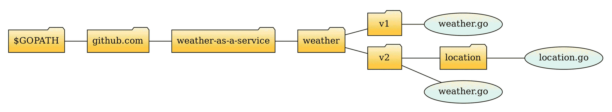
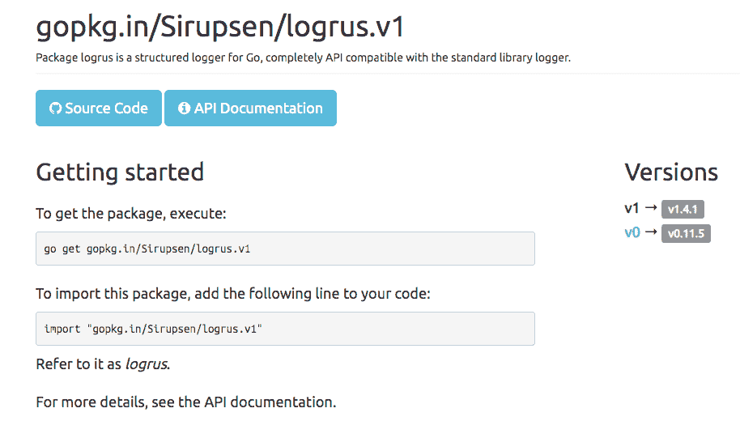
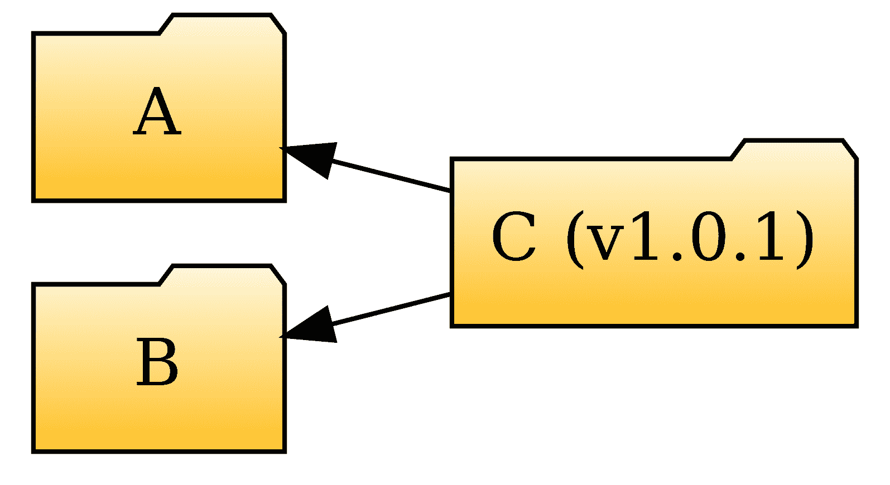
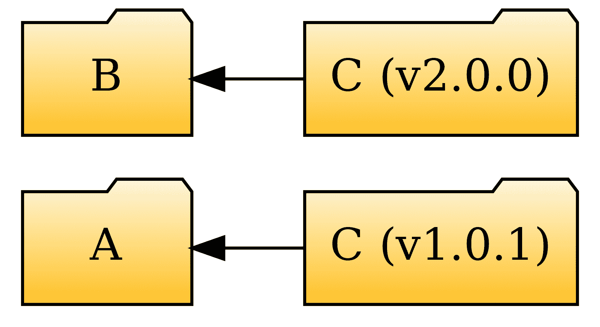
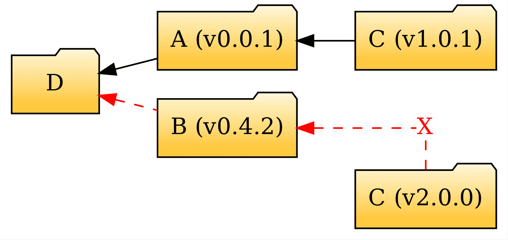
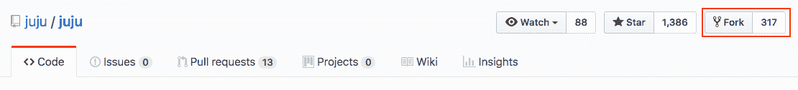

# 第三章：依赖项管理

“如果一开始没有成功，那就叫它 1.0 版本。”

- Pat Rice

作为对前一章中讨论的 SOLID 原则的坚定信仰者，Go 社区中的几位知名人士强烈建议软件工程师将他们的代码组织成自包含和可重用的包。

当我们的代码导入外部包时，其依赖图不仅增加了导入的包，还增加了其传递依赖集——即我们导入的包所需的任何其他包（及其依赖）。随着我们的项目规模不断扩大，有必要有效地管理所有依赖项的版本，以确保上游传递依赖项的变化不会对我们自己的程序造成意外的副作用（崩溃、行为变化等）。

在本章中，我们将关注以下主题：

+   软件版本化的重要性

+   为 Go 包应用语义版本化的方法

+   管理多版本包的源代码的策略以及允许您从代码中导入特定包版本的工具

+   依赖项版本管理的优缺点以及如何用它来促进可重复构建

+   最受欢迎的 Go 包版本管理方法和工具

# 关于软件版本化，为什么会有这么多的争议？

版本化的概念已经深入到我们周围的每一件事中。世界各地的人们习惯于每天使用各种形式的版本化。请注意，我这里不仅仅是在谈论软件。你使用的绝大多数物理产品都与某种版本化方案相关联。版本化的用途从你的电脑 CPU 到你的手机，从你书架上的算法书修订版到你的最爱超级英雄（或光剑挥舞的反叛者）电影。

当我们进入软件领域时，版本化的概念变得更加重要。如今，随着越来越多的软件工程师信奉“快速发布”的箴言，建立一个合理的版本化系统使得以下操作成为可能：

+   验证特定的软件可以作为我们生产系统中使用的老版本软件的安全替代品。这在安全方面尤为重要，因为**所有**软件，除非经过正式验证，都可能包含潜在的漏洞，这些漏洞可能在任何时间被发现——甚至是在部署到生产后数周或数年后。因此，我们能够通过在修复可用时尽快升级到新版本来减轻此类问题至关重要。

+   将我们应用程序的每个依赖项固定到特定的软件包版本。这是设置 CI 管道以实现可重复构建概念的关键前提条件。能够访问可重复构建使得在任何时候都可以重新编译客户在生产中运行的软件的确切副本，并在调查错误报告时将其用作参考。

在以下章节中，我们将深入了解语义版本背后的细节，这是一种非常流行的方法，不仅用于管理软件包的版本，而且还用于通知依赖它们的用户即将到来的和可能破坏性的更改。

# 语义版本化

**语义版本化** ^([11]) 是一个广泛流行的系统，用于以使目标软件用户能够轻松地确定哪些版本可以升级，哪些版本包含破坏性 API 变更，因此在升级时需要开发工作和时间。

语义版本号格式如下：

`MAJOR.MINOR.PATCH`

根据使用情况，可以可选地附加额外的后缀来表示预发布版本（例如，alpha、beta 或 RC（或发布候选））或传达其他与构建相关的信息（例如，用于构建发布的分支的 Git SHA 或构建工件生成的日期和时间戳）。

当与 Go 软件包一起工作时，语义版本使用的三部分方法使得软件包作者能够让软件包的用户知道每个发布包含的**类型**的更改。例如，每当对代码应用**向后兼容的错误修复**时，`PATCH` 字段就会增加。相反，当向软件包添加**新功能**时，`MINOR` 字段会增加，但最重要的是，只有当这种新功能以确保新版本**保持向后兼容**旧软件包版本的方式添加时。当然，随着软件包随时间发展，在某个时候引入一些破坏性更改是不可避免的。例如，可能需要更改现有的函数签名以支持额外的用例。对于这类场景，版本字符串的 `MAJOR` 组件需要增加。

# 比较语义版本

如果我们给定两个语义版本，`a.b.c` 和 `x.y.z`，我们如何判断哪个更新？要比较两个语义版本，我们需要从左到右比较它们的各个组成部分。以下是一段简短的代码示例，展示了我们如何比较两个语义版本：

```go
// SemVer contains the major, minor, patch components of a semantic version
// string.
type SemVer [3]int

// GreaterThan returns true if the receiver version is greater than other.
func (sv SemVer) GreaterThan(other SemVer) bool {
 for i, v := range sv {
 if v != other[i] {
 return v > other[i]
 }
 }

 return false
}
```

比较或排序语义版本对人类来说是一项相当容易的任务，但正如前述代码片段所示，当由机器执行时，这需要额外的努力。

如果你曾经亲自遇到过这个问题，那么你可能曾经编写过检查特定库最低版本的 makefile 规则，或者尝试使用标准命令行工具对遵循此版本控制方案的文件夹列表进行排序。这被认为是与基于单调递增的构建号或`YYYMMDD`格式的构建日期的版本控制方案相比，语义版本控制的一个注意事项。

# 将语义版本控制应用于 Go 包

我们在上一节中讨论的语义版本控制定义留下了一些未回答的问题。首先，新包的**初始**版本号应该是什么？更重要的是，作为包的外部用户，我们如何知道包 API 已经足够稳定，可以在我们的代码中安全使用？

没有比用一个小的例子更有助于回答这些问题的方法了。让我们考虑以下来自一个尚未发布的包的代码片段，该包处理天气预测：

```go
package weather

// Prediction describes a weather prediction.
type Prediction uint8

// The supported weather prediction types.
const (
 Sunny Prediction = iota
 Rain
 Overcast
 Snow
 Unknown
)

// predictAtCoords returns a weather prediction for the specified GPS coordinates.
func predictAtCoords(lat, long float64) (Prediction, error) { // ... }
```

由于我们正在讨论一个全新的包，我们需要决定一个**初始**的版本字符串。鉴于该包没有暴露任何公共接口，我们可以从**0.1.0**作为我们的初始版本号开始。主版本组件中的**0**值作为对潜在用户的警告，表明该包仍在开发中，包的实现可能会频繁地以可能破坏的方式更改。换句话说：**使用该包请自行承担风险**。

经过几次迭代和包代码的广泛重构（每次都提升包的**次要**版本），我们最终达到了版本**0.9.0**。在这个时候，我们决定该包可以在我们的生产系统内部安全使用。为此，我们需要公开一个**公共 API**，以便我们的现有 Go 包可以与新的包进行接口交互。这通过一个简单的重命名操作实现——将`predictAtCoords`改为`PredictAtCoords`（当然，还需要更新所有相关的单元测试），如下面的代码块所示：

```go
// PredictAtCoords returns a weather prediction for the specified GPS coordinates.
func PredictAtCoords(lat, long float64) (Prediction, error) {
 // ...
}
```

在成功推广到生产环境之后，我们应该足够自信地将这个包公开，以便其他人可以导入和使用它。该包以版本**1.0.0**发布，并最终在天气预报社区中取得了巨大成功！

也就是说，直到有一天，当包的用户在 GitHub 上打开一个带有错误的 issue 时：**传递某些经纬度参数的组合会导致** `PredictAtCoords` **崩溃**。我们重新审视代码，创建了一个用于复现错误的程序，并在一番调查后，我们发现错误的根本原因：缺乏适当的检查导致发生了除以零的情况。修复非常简单，并且以任何方式都没有改变包的功能，因此我们提升了包的**补丁**版本，并发布了**1.0.1**。

随着越来越多的人开始依赖我们发布的包，我们开始收到添加新功能的请求，例如：预测由*加码*识别的位置的天气^([10])。为了实现这个新功能，我们向包中引入了一个新的公共函数：

```go
// PredictAtPlusCode the weather at the location specified by a plus code.
func PredictAtPlusCode(code string) (Prediction, error) {
 // ...
}
```

这次更改向包中引入了新功能，但包本身仍然与旧版本向后兼容。因此，我们现在需要将*次要*版本组件提升，并发布包的版本*1.1.1*。同样，我们添加了预测城市或特定地址天气的功能。每次添加后，我们都要确保提升包的*次要*版本。

到目前为止，一切顺利。然而，在仔细检查我们最新包版本的代码后，我们发现当前实现涉及相当多的重复——公共 API 由一组执行更多或更少相同任务的功能组成：预测*位置*的天气。唯一的区别是每个函数期望位置以特定的方式编码（即，作为 GPS 坐标、加码或地址）。

在尝试简化包 API 并应用我们在第二章中讨论的**接口隔离原则**（**ISP**），即《编写干净且可维护的 Go 代码的最佳实践》中，我们决定引入一系列*破坏性*API 更改。首先，我们定义了`Locator`接口，它为将位置转换为一系列 GPS 坐标提供了必要的抽象。其次，我们用一个新的函数`Predict`替换了包中的各种`PredictAtXYZ`函数，该函数接收一个`Locator`实例作为其参数：

```go
package weather 

// Locator is implemented by objects that can represent a location as a
// pair of GPS coordinates.
type Locator interface {
 Coords() (float64, float64, error)
}

// Predict the weather at the specified location.
func Predict(loc Locator) (Prediction, error) {
 coords, err := loc.Coords()
 if err != nil {
 return Unknown, err
 }
 // ...
}
```

如前述代码所示，通过重构`Predict`，我们现在可以将用于表示位置的各类类型提取到它们自己的独立包中，这个包恰当地命名为`location`：

```go
package location

// GPSCoords holds a lat/long coordinate pair.
type GPSCoords [2]float64

// PlusCode encodes a location using a plus code.
type PlusCode string

// Address encapsulates the components of an address.
type Address struct {
 Street   string
 City     string
 PostCode string
 Country  string
}
```

多亏了隐式接口的魔力，我们使用这些新类型与`Predict`函数一起使用时，只需添加满足`weather`包中`Locator`接口的方法：

```go
func (g GPSCoords) Coords() (float64, float64, error) { 
 return g[0], g[1], nil 
}

func (pc PlusCode) Coords() (float64, float64, error) { 
 // Decode plus code to gps coordinates... 
}

func (a Address) Coords() (float64, float64, error) { 
 // Use an external geocoding service to convert the address into a set 
 // of GPS coordinates...
}
```

这次更改无疑提高了天气包的质量，但代价是破坏了向后兼容性。为了向包的用户表明这一点，我们将*主*版本组件提升，并发布包的版本*2.0.0*。

通过为我们的包采用语义版本控制，我们不仅允许包用户选择他们想要使用的 API 版本，还提供了他们根据自己的节奏升级到新包版本的灵活性，而不会对现有的生产系统造成任何风险。

# 管理多个包版本的源代码

上一个部分可能让您感到奇怪的一点是，尽管我一直在谈论发布天气包的版本`x.y.z`，但该节内容本身没有任何关于实际**发布**包的过程的信息。

在这一点上，您可能也会问自己一个问题，*如果我们发布了多个主要版本的包，我们如何管理每个发布版本的源代码？* 因为毕竟，作为包作者，我们可以选择并行维护和支持几个主要版本或主要/次要组合的包版本，每个版本可以潜在地遵循其自己的发布周期。例如，我们可以在继续修复*1.x.x*线的错误或应用安全补丁的同时，为*2.x.x*线扩展 API。那么，最终用户应该如何导入特定的 Go 包版本呢？

为了回答所有这些问题，我们需要深入探讨几种替代方法来对 Go 包进行版本控制。

# 单一存储库与版本化文件夹

使用带有版本化文件夹的单一存储库要求我们在**单一**存储库中维护所有支持版本的源代码。实现这一点的最简单方法是在存储库的根目录下为每个版本创建一个文件夹，并将所有版本特定的文件和子包复制进去。

让我们回顾一下上一节中的`weather`包示例。假设我们使用 Git 作为我们的版本控制系统，并且我们将包托管在 GitHub 上的`weather-as-a-service`账户下的名为`weather`的存储库中。以下流程图说明了使用这种方法文件夹布局将如何看起来：



图 1：在单一存储库中管理包的多个版本

需要指出的是，尽管`weather.go`文件位于`v1`和`v2`文件夹下，但**两者**都声明了一个名为`weather`的包。这个技巧允许包的用户明确选择他们想要导入的包版本，并使用`weather`选择器来引用其内容，如下面的代码块所示：

```go
import (
 "fmt"

 "github.com/weather-as-a-service/weather/v2"
 "github.com/weather-as-a-service/weather/v2/location"
)

func makePrediction() error{
 loc := location.PlusCode("9C3XGV00+")
 pred, err := weather.Predict(loc)
 if err != nil {
 return err 
 }
 fmt.Printf("The weather prediction for London is: %v", pred)
}
```

这种方法对包作者和包的预期最终用户都有一些好处：

+   使用单一存储库来存储所有版本使得维护更加容易，因为包作者可以在隔离的情况下对包的每个版本进行工作。

+   存储库始终包含每个包版本的最新发布版。包的最终用户可以使用单个命令来获取/更新**所有**版本的包（例如，`go get -u github.com/weather-as-a-service/weather`）。

+   作为该包的最终用户，您有选择（尽管可能应该避免）在同一个代码库中导入和使用**不同版本**的同一包的选项。

另一方面，这种方法也有一些需要注意的事项：

+   代码重复！每个版本化的文件夹都包含软件包实现的完整副本，也可能包括一个或多个子包。这可能对软件包作者构成挑战，特别是如果发现了一个需要在不同文件夹中修补相同代码的安全问题。

+   作为该软件包的最终用户，您如何知道某个特定的软件包是否使用了这种特定的版本控制方案，或者可以使用哪些版本？要回答这些问题，您很可能会需要访问 GitHub 上的存储库页面并检查文件夹结构。

# 单个存储库 – 多个分支

一个更好的方法仍然是使用单个存储库，但为每个主要软件包版本、额外功能或正在进行的工作的开发分支维护不同的分支（在 Git 术语中）。如果我们将这种方法应用于我们之前讨论的天气软件包案例，我们的存储库通常将包含以下分支：

+   `v1`：这是存放天气软件包已发布*1.x.y*线的分支。

+   `v2`：另一个分支用于天气软件包的*2.x.y*发布。

+   `develop`：开发分支中的代码通常被认为是正在进行的工作，因此不稳定，不适合使用。最终，一旦代码稳定，它将被合并回一个或多个稳定发布分支。

与版本化文件夹方法类似，多分支方法也确保每个发布分支的尖端或头部包含软件包的*最新*发布版本；然而，有时能够引用软件包的较旧语义版本也是有用的。一个典型的用例是可重复构建，我们总是希望针对软件包的特定版本进行编译，而不是从特定软件包系列中获取的尽管稳定但最新的版本。

为了满足上述要求，我们可以利用版本控制系统（VCS）的*标记*功能，以便我们可以在未来轻松地找到它，而无需扫描提交历史。在这里，我以 Git 为例，因为我更喜欢 Git，但像标记这样的概念也适用于其他 VCS（如 SVN 的标签、Perforce 的标签等）。

这引出了另一个问题：如果每个版本都有自己的分支，我们如何从我们的代码中导入它？如果我们谈论的是托管在 GitHub 上的公共软件包，答案是，我们需要使用重定向服务，例如`gopkg.in`^([7])。

`gopkg.in`服务作为 Go 工具重定向到对应 Go 包特定版本的代理。该服务通过公开一系列*版本化*URL 来实现，当通过`go get`访问时，会自动解析到存储库中托管该包的特定分支或标签。

这种约定不仅会产生更干净、更短的包 URL，更重要的是，它还确保依赖包可以干净地编译使用它们依赖的包的最新次要版本，即使这些包发布了新的主要版本。

此外，当通过网页浏览器访问相同的 URL 时，用户将看到一个整洁的着陆页，该页提供了有关包用途和获取或导入所需命令的附加信息。同一页还包含到包源和文档的链接。

例如，当您使用浏览器访问特定包的`gopkg.in` URL，例如流行的`logrus`日志包时，您将看到一个类似于以下截图的页面。页面的左侧显示我们需要为所选版本的包使用的`import`命令。页面的右侧面板声明了可用的包版本（在本例中：v1 和 v0）以及它们解析到的实际分支或标签：



图 2：`gopkg.in`页面的流行`logrus`包

让我们回到上一节中的天气示例，并更新导入以使用`gopkg.in` URL：

```go
import (
 "fmt"

 "gopkg.in/weather-as-a-service/weather.v2"
 "gopkg.in/weather-as-a-service/weather.v2/location"
)
```

如果我们在前面示例所在的文件夹中运行`go get -u ...`，它将始终拉取天气包的*最新* *v2*版本。您可能想知道`gopkg.in`如何知道哪个是最新版本以及该版本在哪里。为了正确解析版本请求，`gopkg.in`首先解析项目的可用分支和标签列表。根据版本选择器后缀（本例中的`.v2`），`gopkg.in`将始终尝试返回与请求选择器匹配的包的最高匹配版本，其*主*版本组件与请求的选择器相匹配。这意味着该服务不仅能够处理我们之前简要提到的其他版本控制方案（例如，单调递增的构建或版本号、时间戳等），而且它足够智能，可以解析和比较包的语义版本。

例如，假设天气包仓库包含以下标签和分支的混合：

| **名称** | **类型** | **说明** |
| --- | --- | --- |
| v1.0.10 | 标签 |  |
| v1.1.9 | 标签 |  |
| v1 | 分支 | 内容与 v1.1.0 标签匹配 |
| v2.0 | 标签 |  |
| v3~dev | 分支 | 即将发布的 v3 的开发分支 |

这是`gopkg.in`根据版本选择器后缀的值解析前面导入的方式：

| **选择器** | **解析为** |
| --- | --- |
| v1 | v.1.1.9 (标签) |
| v2 | v2.0 (标签) |
| v3 | v3~dev (分支) |

要使项目与`gopkg.in`服务兼容，您需要确保您的分支或标签与`gopkg.in`寻找的预期模式相匹配：`vx`、`vx.y`、`vx.y.z`等。

由于大多数软件工程团队在选择开发流程（例如，Git flow 与 GitHub flow）或分支命名约定时都有很强的观点，因此我的个人建议是坚持使用标签来标记包版本，格式符合 `gopkg.in` 的期望。

# 供应商模式——好的、坏的、丑的

技术上讲，服务如 `gopkg.in` 总是重定向 `go get` 工具到给定版本选择器的**最新**可用主要版本，这对于努力设置保证可重复构建的开发管道的工程团队来说是一个障碍。典型的 CI 管道将在构建最终输出工件之前，通过如 `go get -t -u ...` 这样的命令拉取编译和测试依赖项。因此，即使你的代码在构建之间没有变化，由于拉入的依赖项发生变化，你的服务或应用程序的二进制文件可能也会不同。

然而，如果我说实际上有一种方法可以保留延迟包解析的好处，同时又能灵活地为每个构建“锁定”包版本，你会怎么想？将帮助我们处理这个问题的机制被称为**供应商模式**。

在 Go 编程的上下文中，我们将供应商模式称为创建 Go 应用程序导入图所有节点的**不可变快照**（也称为**供应商依赖项**）的过程。当编译 Go 应用程序时，使用供应商依赖项而不是原始导入的包。

在接下来的几节中，我们将看到创建依赖项快照的几种不同方法：

+   对包含每个导入依赖项的存储库进行分支，并更新代码库中的导入语句以指向分支资源。

+   创建一个清单，其中包含每个导入的包及其传递依赖项当前的提交标识符（例如，Git SHA）。该清单是一个小型、可读的基于 YAML 或 JSON 的文件，通常提交到版本控制系统（VCS）中，并在调用编译器之前用于获取每个依赖项的适当版本。

+   在本地缓存导入的依赖项（通常在一个名为 `vendor` 的文件夹中）并将它们与项目文件一起提交到 VCS。与前面的方法相反，本地缓存使我们能够在不首先获取任何依赖项的情况下立即检出我们的项目并编译它。

在深入探讨这些方法的每一个之前，让我们花几分钟时间讨论依赖项供应商的优缺点。

# 供应商依赖项的好处

首先，vendoring 的关键承诺不过是运行可重复构建的能力。许多客户，尤其是大型企业，往往坚持使用稳定的或 LTS 版本部署软件，除非绝对必要，否则不会升级他们的系统。能够检出客户使用的确切软件版本，并为测试环境生成位对位的相同二进制文件，对于任何试图诊断和重现客户面临的 bug 的现场工程师来说，这是一件无价之宝。

vendoring 的另一个好处是，它作为一个安全网，以防万一上游依赖突然从其托管的地方（例如，GitHub 或 GitLab 仓库）消失，从而破坏依赖于它的软件的构建。如果你认为这是一个极不可能的场景，让我带你回到 2016 年，分享一个来自 Node.js 世界的有趣工程恐怖故事！

你可能听说过现在臭名昭著的*left-pad*包。如果你还没有听说过，它只是一个单功能包，正如你可能会从它的名字中猜到的，它提供了一个函数，可以将字符串填充到特定的长度，并用特定的字符填充。到目前为止，并没有什么真正可怕的事情...但是，这个小型包是超过 500 个包的直接依赖，而这些包又是其他几个包的临时依赖，以此类推。一切都很顺利，直到有一天，left-pad 包的维护者收到了他其他包的一封停止侵权通知，并决定作为一种抗议形式，撤下他所有的包，包括 left-pad。

现在，想象一下人们的 CI 构建开始一个接一个地崩溃所引发的混乱。但是，那些明智地 vendoring 其依赖项的工程团队根本未受此问题影响。

# vendoring 总是好主意吗？

前一个部分不遗余力地赞扬了 vendoring 的优点。但是，vendoring 真的是所有依赖项管理问题的万能药吗？本节试图深入探讨与 vendoring 相关的一些注意事项。

工程团队之间一个常见的问题是，尽管工程师们热衷于 vendoring 他们的依赖项，但他们经常*忘记*定期刷新它们。正如我在前一个部分所论证的，所有代码都可能包含潜在的安全漏洞。因此，一些安全漏洞（可能是导入包的传递依赖）最终可能会出现在生产环境中。

无论与安全相关与否，当向包维护者报告错误时，通常会迅速发布修复程序并相应地增加包版本（即，如果包使用语义版本控制）。由于大型项目倾向于导入大量包，因此无法实际监控每个导入包的仓库以查找安全修复。即使这可能实现，我们也无法现实地对其传递依赖关系进行此操作。因此，即使受影响的上游包已经修复，生产代码也可能长时间未打补丁。

# 供应商依赖关系的策略和工具

最初，Go 不支持供应商包。在当时，这很有意义，因为作为 Go 的主要用户，谷歌会将所有包依赖项托管在单个仓库中（通常称为单仓库）。

然而，随着 Go 社区的不断发展以及越来越多的公司将代码库迁移到 Go，依赖关系管理成为一个问题。随着 Go 1.5 的发布，Go 团队添加了对*vendoring 文件夹*的实验性支持。用户可以通过定义名为`GO15VENDOREXPERIMENT`*.*的环境变量来启用此功能。

当此功能启用时，每次 Go 编译器尝试解析导入时，它将首先检查导入的包是否存在于供应商文件夹中，如果找到则使用它；否则，它将像往常一样继续扫描`$GOPATH`中的每个条目以查找该包。

一旦这项功能可用，多个第三方就带头推出了利用这项功能的工具。以下是一些现在已弃用的处理依赖关系的工具列表，但并不详尽，包括`godep` ^([5])、`govendor` ^([9])、`glide` ^([3])和`gvt` ^([4])。

现在，围绕供应商的工具链已经变得更加流畅。以下章节探讨了撰写本文时推荐的供应商 Go 包的方法：

+   `dep`工具

+   *Go 模块*

+   依赖关系的手动分叉

# `dep`工具

Go 团队——深知拥有多个用于管理依赖关系的竞争性工具可能会导致 Go 生态系统的碎片化并阻碍 Go 社区的成长——决定组建一个委员会并制定一份官方规范文档，详细说明了关于 Go 包依赖关系管理的未来发展方式。`dep`工具^([2])是第一个符合已发布规范的工具。它大约在 2017 年开始，作为一个*官方实验*提供给升级到 Go 1.9 的用户。

dep 工具为各种操作系统提供了预编译的二进制文件；然而，通过运行 `go get -u github.com/golang/dep/cmd/dep` 从源代码构建它可能更容易一些。当你第一次想要在你的项目中使用 dep 工具时，你需要在项目的根目录下运行 `dep init` 来初始化 dep 工具的状态。除非你的导入图浅且规模小，否则这一步会花费一些时间，因为 dep 会执行以下操作：

+   识别所有导入的包、它们的传递依赖以及它们是否也使用 dep。

+   选择依赖图中的每个节点的最高可能版本。

+   将选定的包下载到位于项目根目录中的 `vendor` 文件夹。Dep 还会在本地缓存下载的包在 `$GOPATH/pkg/dep/sources`，以加快其他可能也使用 dep 的项目的依赖项查找。

如果**没有**依赖项使用 dep，则所选版本简单地是每个依赖项在 `$GOPATH` 中出现的**当前**版本。当一些（或所有）导入的依赖项也使用 dep 时，事情会变得更有趣。在这种情况下，dep 将每个 dep 启用包请求的版本视为约束，然后将这些约束输入到与 dep 工具捆绑的约束求解器引擎中。

约束求解器，如 dep 工具所使用的，将输入约束列表转换为布尔**可满足性问题**（**SAT**）并尝试识别一个解决方案（如果存在）。SAT 问题通常表示为复杂的布尔表达式；求解器的任务是找到表达式变量的正确组合，以便表达式评估为 `TRUE`。

例如，给定表达式 `((A and B) or C) and not D`，以下是 SAT 可能建议的总解决方案的一个子集：

| **Solution** | **A** | **B** | **C** | **D** |
| --- | --- | --- | --- | --- |
| 1 | TRUE | TRUE | FALSE | FALSE |
| 2 | FALSE | FALSE | TRUE | FALSE |
| 3 | TRUE | FALSE | TRUE | FALSE |

SAT 求解是第一个被证明为 NP 完全的问题之一。多年来，已经提出了几个算法，可以扩展到更大的 SAT 问题并在合理的时间内提供解决方案。dep 工具使用的特定 SAT 求解器实现基于 **conflict-driven clause learning**（**CDCL**）算法的一个变体，该算法已被调整以适用于 Go 包管理用例。如果你对此感兴趣，可以查看其实现，该实现位于 [github.com/golang/dep/gps](https://github.com/golang/dep/tree/master/gps) 包中。

dep 约束求解器的输出是所有依赖项中*最高可能支持的*版本。dep 工具在项目的根目录中创建两个基于文本的文件，用户*必须*将其提交到他们的版本控制系统中：`Gopkg.toml`和`Gopkg.lock`。为了加快 CI 构建，用户也可以*可选地*将填充的`vendor`文件夹提交到版本控制。或者，假设`Gopkg.toml`和`Gopkg.lock`都可用，可以通过运行`dep ensure -vendor-only`来动态填充供应商文件夹。

# Gopkg.toml 文件

`Gopkg.toml`文件作为控制 dep 工具行为的清单。`dep init`调用将分析项目的导入图并生成一个包含初始约束集的`Gopkg.toml`文件。从那时起，每当需要更新约束（通常是为了提高最低支持的版本）时，用户需要*手动*修改生成的`Gopkg.toml`文件。

那么`Gopkg.toml`文件的内容是什么样的呢？`Gopkg.toml`文件由一系列块或节组成。每个节包含 dep 支持的规则类型之一。最常用的规则类型如下：

+   **约束**，指定兼容依赖项版本的范围

+   **覆盖**，当 dep 工具无法自动找到满足多个`Gopkg.toml`文件指定的聚合约束集的版本时，可以强制使用特定的包版本

对于 dep 工具识别的支持的规则类型完整列表，您可以参考`Gopkg.toml`格式规范文档^([8])。以下示例定义了一个约束，指示 go dep 从包的 GitHub 存储库的`master`分支获取包源代码：

```go
[[constraint]]
  name = "github.com/sirupsen/logrus"
  branch = "master"
```

或者，除了`branch`之外，约束规则可以包括以下两个关键字之一：`revision`或`version`。

`revision`关键字允许将包依赖项固定到特定的提交标识符（例如，Git SHA）。它存在是为了兼容性目的，强烈建议 dep 用户除非没有更好的方式来描述版本，否则避免使用它。

另一方面，`version`关键字在允许我们针对特定的 VCS 标签或语义版本范围方面更加灵活。以下表格列出了 dep 在处理基于版本的约束时理解的运算符。如果版本字符串*不包含*运算符，dep 工具将像使用了连字符(`^`)运算符一样工作。例如，dep 将版本`1.2.5`解释为如果指定了以下约束：`>= 1.2.5 and < 1.3`。

| **运算符** | **描述** | **示例** | **约束解释** |
| --- | --- | --- | --- |
| = | 等于 | "=1.2.4" | 选择版本 1.2.4 |
| != | 不等于 | "!=0.1" | 排除版本 0.1 |
| > | 大于 | ">1.2" | 新于 1.3.0 的版本 |
| < | 小于 | "<2.0" | 低于 2.0.0 的版本 |
| - | 文字范围 | "1.2-1.4" | 版本 >= 1.2 且 <= 1.4 |
| ~ | 小范围 | "~1.2.5" | 版本 >= 1.2.5 且 < 1.3 |
| ^ | 主范围 | "~1.2.5" | 版本 >= 1.2.5 且 < 2 |

在处理 `Gopkg.toml` 文件时，你可能会遇到另一个非常有用的关键字，那就是 `source` 关键字。dep 工具的默认行为是从与约束中指定的包名匹配的仓库中获取包源。

然而，在某些情况下，我们可能希望从不同的位置拉取包。这种情况可能发生在我们分叉了导入的包，推送了一些实验性更改，并想在导入原始包的代码库中尝试这些更改。为了演示这一点，让我们编辑前一个示例中的 `Gopkg.toml` 文件，并让它从 `github.com/achilleasa/logrus` 而不是 `github.com/sirupsen/logrus` 拉取 master 分支：

```go
[[constraint]]
  name = "github.com/sirupsen/logrus"
  branch = "master"

  # Pull the package sources from this alternative repository
  source = "github.com/achilleasa/logrus" 
```

如本节开头所述，`Gopkg.toml` 文件仅是一个用户可以随意更改的清单。为了使更改生效，我们需要运行 `dep ensure` 来执行以下操作：

+   检查代码中是否有任何新的依赖项

+   调用约束求解器计算每个依赖项所需的版本

+   确定哪个 `vendor` 文件夹中的包已过时并更新它们

+   更新 `Gopkg.lock` 文件

# Gopkg.lock 文件

当运行 `dep init` 或 `dep ensure` 时，dep 工具生成的第二个文件称为 `Gopkg.lock`。正如你可能从其扩展名中猜到的，它不是用户打算修改的东西。

`Gopkg.lock` 文件存储了 dep 工具的约束求解器输出的文本表示。更具体地说，它包括编译项目源代码所需的完整依赖项列表，包括直接和临时依赖项。每个依赖项都被固定到特定的提交标识符（例如，Git SHA），根据求解器的判断，该标识符满足 dep 工具提供的所有约束。

通过将 `Gopkg.lock` 文件提交到版本控制系统（VCS），Go 1.9+ 中的 dep 支持确保我们可以生成可重复构建，当然前提是所有引用的依赖项仍然可用。

# Go 模块 – 前进之路

dep 工具的一个限制是它不允许我们在项目中使用一个包的多个主要版本，因为每个导入包的路径必须是唯一的。以下图表说明了 A 和 B 包依赖于相同版本 C 包的简单场景：



图 3：两个导入相同版本 C 包的包

假设现在我们想要测试驱动 C 包的新主要版本*v2.0.0*。这里的目的是*逐步更新*导入 C 的包，以便评估一切是否按预期工作。因此，我们将 B 中的`Gopkg.toml`文件更新为引用 C 的新主要版本。我们的依赖关系树现在如下所示：



图 4：每个包导入 C 包的不同版本

这个更改对包 A 和 B 没有问题，因为它们的导入图是分离的；每个包引用 C 的不同版本。然后，我们决定引入一个新的包，比如 D，到这个场景中，它导入*两者*（如图所示）。现在我们遇到了问题！因为这两个包不能使用*相同的*导入路径，所以当我们尝试构建 D 时，Go 编译器会因错误而退出：



图 5：包 D 同时导入 A 和 B，它们依赖于 C 的不同主要版本。这导致冲突，阻止我们构建 D

要使前面的用例与 dep 工具一起工作，唯一的办法是将所有包（在这个例子中是 A 和 B）的约束（`Gopkg.toml`）文件改为依赖于 C 的*v2.0.0*版本。不用说，这不是一个可以扩展到导入大量包的项目解决方案。考虑到这一点，Go 团队领导了一项倡议，旨在提出一个官方的 vendoring 解决方案，以支持上述场景。

Go 模块是在 Go 1.11 中作为实验性功能引入的，用户可以通过`GO111MODULE`环境变量（例如，`export GO111MODULE=on`）来启用它。在撰写本文时，当前的 Go 版本是 1.12.5，预计 Go 模块将在 Go 1.13 发布时最终确定。与 dep 工具相比，Go 模块的主要区别如下：

+   Go 模块完全集成了各种命令，如`go get`、`go build`和`go test`。

+   虽然 dep 工具选择一个包的最高公共版本，但 Go 模块选择*最小*可行的版本。

+   Go 模块支持多版本依赖。

+   Go 模块取消了 dep 工具使用的`vendor`文件夹。出于向后兼容的目的，Go 模块提供了一个额外的命令来填充`vendor`文件夹：`go mod vendor`。

以下简单的示例使用流行的`go-yaml`包从标准输入读取 YAML 流并将其输出为 Go 映射：

```go
package main

import (
 "fmt"
 "os"

 "github.com/go-yaml/yaml"
)

func main() {
 var data map[string]interface{}
 if err := yaml.NewDecoder(os.Stdin).Decode(&data); err == nil {
 fmt.Printf("%v\n", data)
 }
}
```

要开始使用 Go 模块，我们首先需要在包含前面示例的文件夹中运行`go mod init parser`来声明一个新的 Go 模块。这将生成一个名为`go.mod`的文件。它的初始内容看起来相当无聊：

```go
module parser

go 1.12
```

当我们尝试运行`go build`等命令时，真正的魔法发生了：

```go
$ go build
go: finding github.com/go-yaml/yaml v2.1.0+incompatible
go: downloading github.com/go-yaml/yaml v2.1.0+incompatible
go: extracting github.com/go-yaml/yaml v2.1.0+incompatible
```

正如你所见，Go 意识到我们需要获取一个新的依赖项，因此它试图确定`go-yaml`包的当前版本，并将其解析为`v2.1.0`。然后，它继续下载该包并将其缓存到`$GOPATH/pkg/mod`目录下。

如果你列出项目的文件夹内容，你会注意到一个名为`go.sum`的新文件。此文件存储已下载依赖项的加密哈希值，并在确保包内容在构建之间未被修改（即，包维护者强制推送了一些更改，覆盖了先前的版本）方面提供保护；这是一个在追求可重复构建时的非常有用的功能。

`go.mod`和`go.sum`文件的作用与 dep 工具使用的`Gopkg.toml`和`Gopkg.lock`文件相同，并且它们也需要提交到你的版本控制系统。

每当添加一个新的依赖项时，都会在`go.mod`文件中添加一行。在这种情况下，添加的行是`require github.com/go-yaml/yaml v2.1.0+incompatible`。`go.mod`文件中的每一行`require`定义了特定依赖项的*最低*支持版本。因此，从我们的模块角度来看，`go-yaml/yaml`包的`v2.1.0`是构建模块的*最低*版本要求。即使有新版本可用，Go 也*始终*使用这个特定的版本，除非我们运行以下命令之一：

+   `go get -u`：升级到最新的次要或补丁版本

+   `go get -u=patch`：升级到最新的补丁版本

+   `go get package-name@version`：强制指定包的指定版本

现在我们已经对 Go 模块的工作原理有了基本的了解，让我们回顾一下我们的初始用例：我们如何在代码库中使用同一包的两个不同主要版本？正如我之前提到的，Go 导入路径必须是唯一的；这是不可更改的，不能被覆盖。

`require`行中的`+incompatible`后缀表示，尽管这个包定义了一个有效的语义版本，但它并没有通过定义自己的`go.mod`文件来主动选择使用 Go 模块。然而，如果将来出现一个新版本（比如 v4）并提供了一个`go.mod`文件，Go 模块将允许我们通过称为*语义导入版本控制*的机制导入它。用简单的话来说，语义导入路径只是带有附加*版本后缀*的常规导入路径。后缀的添加为包创建了一个唯一的路径，并有效地允许我们在同一文件中导入和使用多个版本的包：

```go
import (
 "github.com/go-yaml/yaml" // V2.1.0
 v4 "github.com/go-yaml/yaml/v4" // The V4 version of the package.
)
```

这就结束了我们对 Go 模块的简要游览。关于 Go 模块扩展支持的所有操作和模式的深入探讨超出了本书的范围；然而，如果你对学习更多关于使用 Go 模块的信息感兴趣，你可以在 Golang 博客上浏览相关的文章^([6])。

# 分叉包

在我们拥有 dep 工具和 Go modules 的情况下，我们为什么还需要手动分支我们依赖的任何包呢？在我们回答这个问题之前，让我首先详细说明这个过程是如何工作的。

首先，我们需要分支我们感兴趣的依赖项。如果包源代码在 GitHub、GitLab 或 BitBucket 等平台上可用，那么分支包就像访问存储库页面并点击一个按钮一样简单（参见以下截图）；否则，我们就需要依赖我们首选的 VCS 提供的功能，将依赖项的副本持久化到我们控制的位置：



图 6：在 GitHub、GitLab 或 BitBucket 等平台上分支包存储库就像点击一个按钮一样简单

在分支存储库之后，我们需要扫描代码库并替换原始包的导入，使其指向我们的分支版本。当然，一个更好的选择是使用 dep 工具提供的逃生舱口来覆盖包依赖项的源。在后一种情况下，我们就不需要修改代码中的任何导入语句。

这又带我们回到了最初的问题：为什么一开始就要进行分支？当为处理敏感数据的公司工作，例如在金融科技或医疗保健领域运营的公司时，拥有一个内部安全团队是相当常见的，这个团队必须审计每个导入的依赖项，以检查潜在的安全漏洞，然后工程团队才能在他们的代码中使用它。

对一个包进行全面的安全审计是一个相当耗时的过程；从逻辑上讲，每次新版本发布时都从头开始审计每个包既不可行也不经济。因此，安全团队通过分支包、进行全面审计，然后验证和选择任何上游更改来分摊初始审计成本。

# 摘要

在本章中，我们讨论了为什么需要使用版本控制，这不仅包括我们代码导入的包，还包括我们作为软件工程师编写的代码本身。然后我们定义了语义版本控制的概念以及何时需要增加语义版本中的每个组件。

本章的重点是介绍作为确保项目可重复构建的主要机制的 vendoring。在详细阐述了 vendoring 作为一种流程的优缺点之后，我们考察了 Go 生态系统中的 vendoring 现状，并简要介绍了工程师应使用的最先进工具（*dep* 和 *Go modules*）来管理他们的包依赖。

当然，随着我们的代码库的发展以及我们导入的版本要求随时间变化，我们很可能在某个时候，我们依赖的某个包的新版本会破坏我们的代码。显然，我们希望尽可能早地捕捉到这样的回归。实现这一目标的一种方法，也是下一章的中心主题，就是建立一个坚实的测试基础设施。

# 问题

1.  软件版本控制为什么很重要？

1.  语义版本看起来是什么样的，以及它的各个组成部分何时会增加？

1.  在以下情况下，您会增加一个包的语义版本中的哪个组件？

    1.  引入了一个新的 API。

    1.  修改了现有的 API，并添加了一个新的、*必需的*参数。

    1.  提交了一个安全漏洞的修复。

1.  除了语义版本控制之外，我们还可以使用哪些替代版本控制方案？

1.  vendoring 的优缺点是什么？

1.  列举一些 dep 工具和 Go 模块之间的不同之处。

# 进一步阅读

1.  Cook, Stephen A.，《定理证明过程复杂性》，*第三届年度 ACM 理论计算研讨会论文集*，STOC '71。纽约，纽约，美国，ACM，1971 年，第 151-158 页

1.  dep：Go 的依赖管理工具：[`github.com/golang/dep`](https://github.com/golang/dep)

1.  glide：[`github.com/Masterminds/glide`](https://github.com/Masterminds/glide)

1.  gvt：[`github.com/FiloSottile/gvt`](https://github.com/FiloSottile/gvt)

1.  godep：[`github.com/tools/godep`](https://github.com/tools/godep)

1.  Golang 博客：使用 Go 模块：[`blog.golang.org/using-go-modules`](https://blog.golang.org/using-go-modules)

1.  `Gopkg.in`：Go 语言的稳定 API：[`labix.org/gopkg.in`](https://labix.org/gopkg.in)

1.  `Gopkg.toml`格式规范：[`golang.github.io/dep/docs/Gopkg.toml.html`](https://golang.github.io/dep/docs/Gopkg.toml.html)

1.  govendor：[`github.com/kardianos/govendor`](https://github.com/kardianos/govendor)

1.  Plus codes：为没有自己的街道地址的位置提供的简短代码：[`plus.codes/`](https://plus.codes/)

1.  语义版本控制 2.0.0：[`semver.org/`](https://semver.org/)

1.  Silva, João P. Marques；Lynce, Inês；Malik, Sharad，Biere, A.；Heule, M.；Maaren, H. van；Walsh, T.（主编），《冲突驱动的子句学习 SAT 求解器》，*可满足性手册，人工智能应用前沿*，第 185 卷：IOS Press，2009 年，ISBN 978-1-58603-929-5 ([`www.worldcat.org/title/handbook-of-satisfiability/oclc/840409693`](https://www.worldcat.org/title/handbook-of-satisfiability/oclc/840409693))，第 131-153 页
