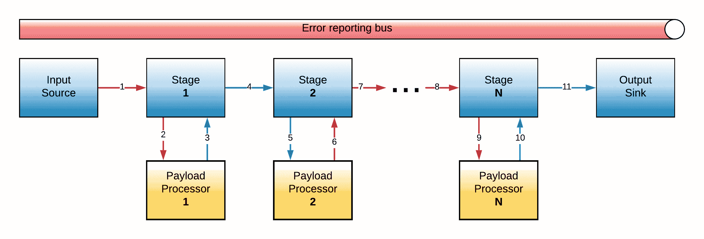
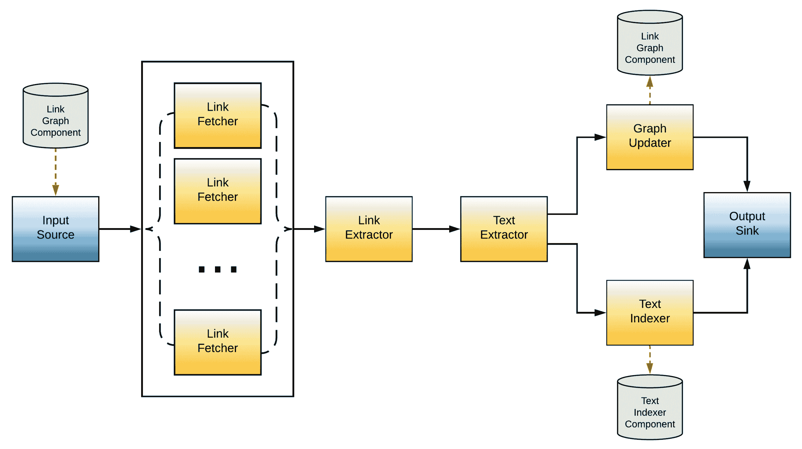

# 数据处理管道

“每个编写良好的大型程序内部都包含一个编写良好的小型程序。”

- 托尼·霍尔

管道是将数据处理分割成多个阶段的一种相当标准和常用的方式。在本章中，我们将探讨数据处理管道的基本原理，并展示使用 Go 原语（如通道、上下文和 goroutines）实现通用、并发安全和可重用管道的蓝图。

在本章中，你将学习以下内容：

+   使用 Go 原语从头开始设计通用处理管道

+   以通用方式对管道有效负载进行建模的方法

+   处理管道执行过程中可能出现的错误策略

+   同步和异步管道设计的优缺点

+   将管道设计概念应用于构建 Links 'R' Us 爬虫组件

# 技术要求

本章讨论的主题的完整代码已发布到本书的 GitHub 仓库中的`Chapter07`文件夹下。

你可以通过访问[`github.com/PacktPublishing/Hands-On-Software-Engineering-with-Golang`](https://github.com/PacktPublishing/Hands-On-Software-Engineering-with-Golang)来访问包含每个章节代码和所有必需资源的 GitHub 仓库。

为了让你尽快开始，每个示例项目都包含一个 makefile，它定义了以下目标集：

| **Makefile 目标** | **描述** |
| --- | --- |
| `deps` | 安装所有必需的依赖项 |
| `test` | 运行所有测试并报告覆盖率 |
| `lint` | 检查代码风格错误 |

与本书的所有其他章节一样，你需要一个相当新的 Go 版本，你可以在[`golang.org/dl`](https://golang.org/dl)*.*下载。

# 在 Go 中构建通用数据处理管道

下图展示了我们将在这章的前半部分构建的管道的高级设计：



图 1：一个通用的多阶段管道

请记住，这绝对不是实现数据处理管道的唯一或最佳方式。管道本质上是与应用程序相关的，因此并没有一个适用于所有情况的构建高效管道的指南。

话虽如此，所提出的设计适用于广泛的用例，包括但不限于 Links 'R' Us 项目的爬虫组件。让我们更详细地审视前面的图，并确定管道包含的基本组件：

+   **输入源**：输入本质上充当数据源，将数据泵入管道。从现在开始，我们将使用术语**有效载荷**来指代这组数据。在底层，输入促进了**适配器**的作用，读取外部系统（如数据库或消息队列）中通常可用的数据，并将其转换为管道可以消费的格式。

+   一个或多个处理**阶段**：管道的每个阶段接收一个有效载荷作为其输入，对其应用处理函数，然后将结果传递给下一个阶段。

+   **输出汇**：在经过管道的每个阶段之后，有效载荷最终达到输出汇。与输入源类似，汇也充当**适配器**，只是这次转换是反向的！有效载荷被转换为可以由外部系统消费的格式。

+   **错误总线**：错误总线提供了一个方便的抽象，允许管道组件在管道执行过程中报告任何发生的错误。

管道的完整源代码和测试可以在书籍的 GitHub 仓库的`Chapter07/pipeline`文件夹下找到。

# 管道包的设计目标

让我们快速列举一下我们将要构建的`pipeline`包的设计目标。我们将作为设计决策指南的关键原则是：简单性、可扩展性和通用性。

首先也是最重要的，我们的设计应该能够适应不同类型的有效载荷。请记住，有效载荷格式在大多数情况下是由管道包的最终用户决定的。因此，管道内部不应假设通过各个管道阶段的任何有效载荷的内部实现细节。

其次，数据处理管道的主要作用是促进有效载荷在源和汇之间的流动。与有效载荷类似，管道的端点也由最终用户提供。因此，管道包需要定义适当的抽象和接口，以便最终用户注册他们自己的源和汇实现。

此外，管道包不应仅允许最终用户为每个阶段指定处理函数。用户还应该能够根据每个阶段选择管道用于将有效载荷传递给处理函数的策略。从逻辑上讲，该包应包含“内置电池”-也就是说，提供内置的实现，用于最常见的有效载荷传递策略；然而，如果内置的策略不足以满足特定用例，用户应能够定义自己的自定义策略。

最后，我们的实现必须提供简单直观的 API 来创建、组装和执行复杂的管道。此外，处理管道执行的 API 不仅应该为用户提供取消长时间运行的管道的手段，还应该提供一种机制来捕获和报告在管道忙于处理有效载荷时可能发生的任何错误。

# 模型管道有效载荷

在我们开始工作于管道包实现之前，我们需要回答的第一个也是最重要的问题是：我们如何使用 Go 以一种通用方式描述管道有效载荷？

对于这个问题的明显答案是将有效载荷定义为空接口值（在 Go 术语中为 `interface{}`）。支持这种方法的论据是，管道内部实际上并不真正关心有效载荷本身；管道需要做的只是在不同管道阶段之间传递有效载荷。

对有效载荷内容的解释（例如，通过将输入转换为已知类型）应该是每个阶段执行的处理函数的唯一责任。鉴于处理函数是由管道的最终用户指定的，这种方法可能非常适合我们的特定需求。

然而，正如 Rob Pike 在他著名的 Go 谚语中所相当巧妙地表达的，`interface{}` 什么也没说。这个陈述中有很多真理。空接口传达了关于底层类型没有任何有用的信息。事实上，如果我们遵循空接口的方法，我们实际上会有效地禁用 Go 编译器对我们代码库中某些部分进行静态类型检查的能力！

一方面，在 Go 社区中，通常认为使用空接口是一种反模式，因此这是我们理想情况下想要避免的做法。另一方面，Go 没有对泛型提供支持，这使得编写能够处理预先未知类型的对象的代码变得更加困难。因此，与其试图找到这个问题的银弹解决方案，不如我们尝试妥协一下：我们是否可以尝试强制实施一套所有有效载荷类型都必须支持的通用操作，并创建一个 `Payload` 接口来描述它们？这样，我们就能在保持管道处理函数能够将传入的有效载荷转换为它们期望的类型的同时，增加一层额外的类型安全性。以下是 `Payload` 接口的一个可能定义：

```go
// Payload is implemented by values that can be sent through a pipeline.
type Payload interface {
 Clone() Payload
 MarkAsProcessed()
}
```

如您所见，我们期望无论有效载荷是如何定义的，它都必须能够执行至少两个简单（而且相当常见）的操作：

+   **执行自身的深度复制**：正如我们将在接下来的某个部分中看到的那样，这个操作将用于避免当多个处理器同时操作同一有效载荷时发生数据竞争。

+   **标记为已处理**：当有效负载达到管道的末端（汇点）或在中途的管道阶段被丢弃时，它们被认为是已处理的。当有效负载退出管道时调用此方法对于我们需要收集每个有效负载的度量（总处理时间、进入管道前的排队时间等）的场景非常有用。

# 多阶段处理

管道背后的关键概念是将一个复杂的处理任务分解成一系列较小的步骤或**阶段**，这些步骤可以独立于彼此执行，并且按照**预定义的顺序**执行。作为一种理念，多阶段处理似乎也与我们在第二章中讨论的单一职责原则非常契合，即*编写干净且可维护的 Go 代码的最佳实践*。

当组装一个多阶段管道时，预期最终用户会提供一组函数，或**处理器**，这些函数将应用于传入的有效负载，当它们通过管道的每个阶段流动时。我将使用符号*F[i]*来指代这些函数，其中*i*对应于阶段号。

在正常情况下，每个阶段的输出将被用作下一个阶段的输入——也就是说*Output[i] = Fi*。然而，我们确实可以想象出一些场景，我们实际上希望丢弃一个有效负载并阻止它到达任何后续的管道阶段。

例如，假设我们正在构建一个管道来读取和汇总 CSV 文件中的数据。不幸的是，该文件包含一些垃圾数据，我们必须将其排除在我们的计算之外。为了处理这种情况，我们可以在管道中添加一个**过滤阶段**来检查每行的内容，并丢弃包含格式错误数据的那些行。

考虑到前面的情况，我们可以将`Processor`接口描述如下：

```go
type Processor interface {
 // Process operates on the input payload and returns back a new payload
 // to be forwarded to the next pipeline stage. Processors may also opt
 // to prevent the payload from reaching the rest of the pipeline by
 // returning a nil payload value instead.
 Process(context.Context, Payload) (Payload, error)
}
```

在先前的定义中存在一个小问题，使得它在实际应用中略显繁琐。由于我们谈论的是一个接口，它需要通过像 Go struct 这样的类型来实现；然而，有人可能会争论，在许多情况下，我们真正需要的只是能够使用一个简单的函数，或者一个**闭包**作为我们的处理器。

由于我们正在设计一个*通用*的管道包，我们的目标应该是使其 API 尽可能方便最终用户。为此，我们还将定义一个辅助类型`ProcessorFunc`，它充当函数**适配器**的角色：

```go
type ProcessorFunc func(context.Context, Payload) (Payload, error)

// Process calls f(ctx, p).
func (f ProcessorFunc) Process(ctx context.Context, p Payload) (Payload, error) {
 return f(ctx, p)
}
```

如果我们有一个具有适当签名的函数，我们可以将其转换为`ProcessorFunc`并自动获得一个实现了`Processor`接口的类型！如果你觉得这个技巧有点熟悉，那么很可能你已经在使用它了，如果你编写过任何导入`http`包并注册 HTTP 处理器的代码。`http`包中的`HandlerFunc`类型正是使用这个想法将用户定义的函数转换为有效的 HTTP `Handler`实例。

# 无阶段的管道——这是否可能？

管道定义是否应该包含一个最小数量的阶段，才能被视为有效？更具体地说，我们是否应该允许定义一个没有阶段的管道？在我看来，阶段应该被视为管道定义的可选部分。记住，为了使管道工作，它至少需要一个输入源和一个输出接收器。

如果我们直接将输入连接到输出并执行管道，我们会得到与执行只有一个阶段的管道相同的结果，该阶段的`Processor`是一个*恒等*函数——即总是输出传递给它的输入值的函数。我们可以很容易地使用上一节中的`ProcessorFunc`辅助函数定义这样的函数：

```go
identityFn := ProcessorFunc( func(_ context.Context, p Payload) (Payload, error) {  return p, nil },)
```

这种类型的管道在现实世界中有没有实际的应用？答案是肯定的！这种管道有助于作为适配器连接两个可能不兼容的系统，并在它们之间传输数据。例如，我们可以使用这种方法从消息队列中读取事件并将它们持久化到 noSQL 数据库以进行进一步处理。

# 处理错误的策略

当管道执行时，构成它的每个组件都可能遇到错误。因此，在实现我们的管道包的内部机制之前，我们需要制定一个检测、收集和处理错误的策略。

在接下来的章节中，我们将探讨一些处理错误的替代策略。

# 累积并返回所有错误

我们可以采用的 simplest 策略之一是引入一种机制，在管道执行过程中收集和累积管道组件发出的所有错误。一旦管道检测到错误，它会自动丢弃触发错误的负载，但将捕获到的错误追加到收集到的错误列表中。管道将使用下一个负载继续执行，直到所有负载都已被处理。

在管道执行完成后，任何收集到的错误都会返回给用户。在这个时候，我们有两种选择：要么返回 Go 错误值的切片，要么使用辅助包，例如`hashicorp/go-multierror`^([6])，它允许我们将 Go 错误值列表聚合到一个实现了`error`接口的容器值中。

对于这种类型的错误处理，一个很好的候选者是那些处理器实现尽力而为语义的管道。例如，如果我们正在构建一个以火速和忘记的方式泵送事件的管道，我们不希望管道因为某个事件无法发布而停止。

# 使用死信队列

在某些情况下，管道包的用户可能对获取所有由于错误而无法被管道处理的负载的列表感兴趣。

以下点根据应用需求适用：

+   关于每个错误以及每个失败负载的详细信息可以记录下来以供进一步分析

+   失败的负载可以持久化到外部系统（例如，通过消息队列），以便它们可以被人工检查和纠正（当可行时）由人工操作员。

+   我们可以启动一个新的管道运行来处理上一次运行中失败的负载

存储失败项以供将来处理的概念在事件驱动架构中非常普遍，通常被称为**死信队列**。

# 如果发生错误则终止管道的执行

之前策略的一个重要注意事项是它们不能应用于*长时间运行*的管道。即使发生错误，我们也不会在管道完成之前发现它。这可能需要数小时、数天，甚至在管道的输入数据永远不会耗尽的情况下永远如此。后者的一个例子是，管道的输入连接到一个消息队列，并在等待新消息到达时阻塞。

为了处理这类场景，当发生错误时，我们可以*立即*终止管道的执行并将错误返回给用户。实际上，这是我们将在管道实现中使用的错误处理策略。

初看起来，你可能会认为这种方法与其他我们之前讨论的策略相比相当有限；然而，如果我们深入挖掘，我们会发现这种方法更适合更多的用例，因为它足够灵活，可以模拟其他两种错误处理策略的行为。

为了更好地理解如何实现这一点，我们首先需要谈谈在管道执行过程中可能发生的错误性质。根据错误是否致命，我们可以将它们分为两类：

+   **非暂时性错误**：这类错误被认为是致命的，应用程序无法真正从中恢复。一个非暂时性错误的例子是在写入文件时耗尽磁盘空间。

+   **瞬时错误**：应用程序可以，并且应该始终尝试从这种错误中恢复，尽管这并不总是可能的。这通常是通过某种重试机制实现的。例如，如果应用程序失去了与远程服务器的连接，它可以尝试使用指数退避策略重新连接。如果达到最大重试次数，那么这将成为一个非瞬时错误。

以下是一个简单示例，说明用户如何应用装饰器设计模式来封装 `Processor` 函数，并实现一个可以区分瞬时和非瞬时错误的重试机制：

```go
func retryingProcessor(proc Processor, isTransient func(error) bool, maxRetries int) Processor {
 return ProcessorFunc(func(ctx context.Context, p Payload) (Payload, error) {
 var out Payload
 var err error
 for i := 0; i < maxRetries; i++ {
 if out, err = proc.Process(ctx, p); err != nil && !isTransient(err) {
 return nil, err
 }
 }
 return nil, err
 })
}
```

`retryingProcessor` 函数封装了一个现有的 `Processor`，以提供在出现错误时自动重试的支持。每次发生错误时，该函数都会咨询 `isTransient` 辅助函数，以决定获取到的错误是否是瞬时的，以及是否可以执行处理负载的另一次尝试。非瞬时错误被认为是不可恢复的，在这种情况下，函数将返回错误以导致管道终止。最后，如果超过最大重试次数，该函数将错误视为非瞬时并退出。

# 同步与异步管道

将影响我们实现管道核心方式的一个关键决策是它将以同步还是异步的方式运行。让我们快速了解一下这两种操作模式，并讨论每种模式的优缺点。

# 同步管道

同步管道实际上一次处理一个负载。我们可以通过创建一个执行以下操作的 `for` 循环来实现这样的管道：

+   从输入源弹出一个下一个负载或退出循环，如果没有更多的负载可用

+   遍历管道阶段的列表，并对每个阶段调用 `Processor` 实例

+   将生成的负载入队到输出源

同步管道非常适合那些必须始终以 **先进先出**（**FIFO**）方式处理负载的工作负载，这对于事件驱动架构来说是一个相当常见的情况，大多数情况下，它们假设事件总是按照特定的顺序进行处理。

例如，假设我们正在尝试构建一个用于消费来自订单处理系统的事件流、通过查询外部系统丰富一些传入事件并最终将丰富的事件转换为适合持久化到关系型数据库的格式的 **ETL**（代表 **提取**、**转换**和**加载**）管道。对于此用例的管道可以使用以下两个阶段来组装：

+   第一阶段检查事件类型，并通过查询外部服务添加适当的信息来丰富它

+   第二阶段将每个丰富的事件转换为更新一个或多个数据库表的 SQL 查询序列

按设计，我们的处理代码期望一个`AccountCreated`事件必须始终先于一个`OrderPlaced`事件发生，该事件包括一个指向下订单的客户的账户的引用（一个 UUID）。如果事件被错误地处理，系统可能会发现自己试图在数据库中的客户记录被创建之前处理`OrderPlaced`事件。虽然当然可以绕过这个限制进行编码，但这会使处理代码变得更加复杂，并且当出现问题难以调试。同步管道将强制执行有序处理语义，并使这个问题成为非问题。

那么使用同步管道时有什么问题呢？与同步管道相关的主要问题是**低吞吐量**。如果我们的管道由**N**个阶段组成，并且每个阶段需要**1 个时间单位**来完成，那么我们的管道将需要**N 个时间单位**来处理和发出每个有效载荷。进一步来说，每次一个阶段正在处理一个有效载荷时，其余的**N-1**个阶段都在**闲置**。

# 异步管道

在异步管道设计中，一旦一个阶段处理了传入的有效载荷并将其发送到下一个阶段，它就可以立即开始处理下一个可用的有效载荷，而无需等待当前处理的有效载荷退出管道，正如在同步管道设计中那样。这种方法确保所有阶段都持续忙碌于处理有效载荷，而不是闲置。

需要注意的是，异步管道通常需要某种形式的并发。一个常见的模式是将每个阶段在一个单独的 goroutine 中运行。当然，这给组合带来了额外的复杂性，因为我们需要做以下事情：

+   管理每个 goroutine 的生命周期

+   利用并发原语，如锁，来避免数据竞争

尽管如此，与同步管道相比，异步管道具有更好的吞吐量特性。这正是我们将在本章构建的管道包将采用异步管道实现的主要原因……但有一点不同！尽管所有管道组件（输入、输出和阶段）都将异步运行，但最终用户将通过一个**同步**的 API 与管道进行交互。

快速浏览目前最流行的 Go **软件开发工具包**（**SDKs**），会发现普遍倾向于暴露同步 API。从 API 消费者的角度来看，同步 API 确实更容易使用，因为最终用户不需要担心管理资源，例如 Go 通道，或者编写复杂的`select`语句来协调通道之间的读写操作。将这种方法与异步 API 进行对比，在异步 API 中，每次用户想要执行管道运行时，都必须处理输入、输出和错误通道！

如前所述，管道内部将异步执行。在 Go 中实现这一点的典型方法是为每个管道组件启动一个 goroutine，并通过 Go 通道将各个 goroutine 连接起来。管道实现将负责完全管理它启动的任何 goroutine 的生命周期，这对管道包的最终用户来说是完全透明的。

当与 goroutine 一起工作时，我们必须始终关注它们的各自生命周期。一条明智的建议是，除非你知道 goroutine 何时退出以及需要满足哪些条件才能退出，否则不要启动 goroutine。

忽视这条建议可能会导致在长时间运行的应用程序中引入 goroutine 泄漏，通常需要花费相当多的时间和精力来追踪。

为管道包公开一个同步 API 还有一个我们尚未提到的好处。对于管道包的最终用户来说，将同步 API 包装在 goroutine 中以使其异步是非常简单的。goroutine 将简单地调用阻塞代码，并通过通道向应用程序代码发出信号，以表明管道执行已完成。

# 实现执行负载处理器的阶段工作器

管道包的一个目标是为最终用户提供一种指定每个阶段的调度策略，以便将传入的负载调度到已注册的处理器函数。为了能够以干净和可扩展的方式支持不同的调度策略，我们将引入另一个抽象，即`StageRunner`接口：

```go
type StageRunner interface {
 Run(context.Context, StageParams)
}
```

具体的`StageRunner`实现提供了一个`Run`方法，该方法实现了管道单个阶段的负载处理循环。典型的处理循环包括以下步骤：

1.  从上一个阶段或输入源接收下一个负载，如果这恰好是管道的第一个阶段。如果上游数据源表示数据已耗尽，或者外部提供的`context.Context`被取消，则`Run`方法应自动返回。

1.  将负载调度到用户定义的阶段处理器函数。正如我们将在以下章节中看到的，这一步骤的实现取决于`StageRunner`实现所使用的调度策略。

1.  如果错误处理器返回一个*错误*，将错误入队到共享错误总线并返回。

1.  将成功处理的负载推送到下一个管道阶段，或者如果这是管道的最后一个阶段，则推送到输出汇。

前面的步骤清楚地表明`Run`是一个阻塞调用。管道实现将为管道的每个阶段启动一个 goroutine，调用每个已注册`StageRunner`实例的`Run`方法，并等待其返回。由于我们正在使用 goroutine，连接它们的适当机制是使用 Go 通道。由于 goroutine 和通道的生命周期都由管道内部管理，我们需要一种方法来配置每个`StageRunner`，使其与将要工作的通道集。此信息通过`Run`方法的第二个参数提供。以下是`StageParams`接口的定义：

```go
type StageParams interface {
 StageIndex() int

 Input() <-chan Payload
 Output() chan<- Payload
 Error() chan<- error
}
```

`Input`方法返回一个工人将监视的只读通道，该通道用于接收传入的有效载荷。通道将被关闭以指示没有更多数据可供处理。`Output`方法返回一个只写通道，其中`StageRunner`应在成功处理输入有效载荷后发布。另一方面，如果在处理传入有效载荷时发生错误，`Error`通道返回一个只写通道，其中可以发布错误。最后，`StageIndex`方法返回管道中阶段的位置，`StageRunner`实现可以可选地使用它来注释错误。

在接下来的几节中，我们将更详细地探讨三种非常常见的有效载荷调度策略的实施，这些策略我们将与管道包捆绑在一起：FIFO、固定/动态工作池和广播。

# FIFO

如其名所示，当阶段以 FIFO 模式运行时，它按顺序处理有效载荷，从而保持它们的顺序。通过创建一个所有阶段都使用 FIFO 调度的管道，我们可以强制执行数据处理的同步语义，同时仍然保留异步管道相关的高吞吐量优势。

`fifo`类型在`pipeline`包内部是私有的，但可以通过调用`FIFO`函数来实例化，该函数概述如下：

```go
type fifo struct {
 proc Processor
}

// FIFO returns a StageRunner that processes incoming payloads in a 
// first-in first-out fashion. Each input is passed to the specified 
// processor and its output is emitted to the next stage.
func FIFO(proc Processor) StageRunner {
 return fifo{proc: proc}
}
```

现在我们来看看`fifo`类型的`Run`方法实现：

```go
func (r fifo) Run(ctx context.Context, params StageParams) {
 for {
 select {
 case <-ctx.Done():
 return // Asked to cleanly shut down
 case payloadIn, ok := <-params.Input():
 if !ok {
 return // No more data available.
 }

 // Process payload, handle errors etc.
 // (see following listing)
 }
 }
}
```

如您所见，`Run`按设计是一个阻塞调用；它运行一个无限循环，其中包含一个`select`语句。在`select`块中，代码执行以下操作：

+   监视提供的上下文是否取消，并在上下文被取消（例如，如果用户取消它或其超时过期）时退出主循环。

+   尝试从输入通道检索下一个有效载荷。如果输入通道关闭，代码将退出主循环。

接收到新的输入有效载荷后，FIFO 运行器执行以下代码块：

```go
payloadOut, err := r.proc.Process(ctx, payloadIn)
if err != nil {
 wrappedErr := xerrors.Errorf("pipeline stage %d: %w", params.StageIndex(), err)
 maybeEmitError(wrappedErr, params.Error())
 return
}
if payloadOut == nil {
 payloadIn.MarkAsProcessed()
 continue
}

select {
case params.Output() <- payloadOut:
case <-ctx.Done():
 return  // Asked to cleanly shut down
}
```

输入有效载荷首先传递给用户定义的`Processor`实例。如果处理器返回错误，代码将使用当前阶段号对其进行注释，并在退出工作进程之前通过调用`maybeEmitError`辅助函数将其入队到提供的错误通道：

```go
// maybeEmitError attempts to queue err to a buffered error channel. If the
// channel is full, the error is dropped.
func maybeEmitError(err error, errCh chan<- error) {
 select {
 case errCh <- err: // error emitted.
 default: // error channel is full with other errors.
 }
}
```

如果有效负载没有错误地处理，那么我们需要检查处理器是否返回了一个我们需要转发的有效负载，或者是一个*nil*有效负载来指示应该丢弃输入负载。在丢弃负载之前，代码在其`MarkAsProcessed`方法开始新的主循环迭代之前调用它。

另一方面，如果处理器返回一个有效的有效负载，我们尝试使用`select`语句将其入队到输出通道，该语句会阻塞，直到有效负载被写入输出通道或上下文被取消。在后一种情况下，工作者终止，有效负载被丢弃。

# 固定和动态工作池

通常，处理器函数可能需要相当长的时间才能返回。这可能是因为实际的负载处理涉及 CPU 密集型计算，或者仅仅是因为函数正在等待 I/O 操作完成（例如，处理器函数执行了对远程服务器的 HTTP 请求，并正在等待响应）。

如果所有阶段都使用 FIFO 调度策略连接，那么执行缓慢的处理器的存在可能会导致流水线停滞。如果*乱序*处理有效负载不是问题，我们可以通过引入工作池来更好地利用可用的系统资源。工作池是一种模式，可以通过允许阶段并行处理多个有效负载来显著提高流水线的吞吐量。

我们将要实现的第一种工作池模式是**固定**工作池。此类池启动预配置数量的工作者，并将传入的有效负载在他们之间分配。池中的每个工作者实现与 FIFO `StageRunner`相同的循环。如下代码所示，我们的实现积极利用这一观察结果，通过为池中的每个工作者创建一个 FIFO 实例来避免重复主循环代码：

```go
type fixedWorkerPool struct {
 fifos []StageRunner
}

func FixedWorkerPool(proc Processor, numWorkers int) StageRunner {
 if numWorkers <= 0 {
 panic("FixedWorkerPool: numWorkers must be > 0")
 }
 fifos := make([]StageRunner, numWorkers)
 for i := 0; i < numWorkers; i++ {
 fifos[i] = FIFO(proc)
 }

 return &fixedWorkerPool{fifos: fifos}
}
```

以下代码中所示的`Run`方法启动单个池工作者，执行它们的`Run`方法，并使用`sync.WaitGroup`来防止它返回，直到所有生成的工作者 goroutines 终止：

```go
func (p *fixedWorkerPool) Run(ctx context.Context, params StageParams) {
 var wg sync.WaitGroup

 // Spin up each worker in the pool and wait for them to exit
 for i := 0; i < len(p.fifos); i++ {
 wg.Add(1)
 go func(fifoIndex int) {
 p.fifos[fifoIndex].Run(ctx, params)
 wg.Done()
 }(i)
 }

 wg.Wait()
}
```

在布线方面，这里的事情相当简单。我们只需要将传入的参数原封不动地传递给每个 FIFO 实例。这种布线的效果如下：

+   所有 FIFOs 都设置为从*相同*的输入通道读取传入的有效负载，该通道连接到前一个流水线阶段（或输入源）。这种方法有效地充当负载均衡器，用于将有效负载分配给空闲的 FIFOs。

+   所有 FIFOs 将处理后的有效负载输出到*相同*的输出通道，该通道连接到下一个流水线阶段（或输出汇）。

固定工作池的设置相当简单，但有一个注意事项：必须提前指定工作进程的数量！在某些情况下，确定工作进程数量的合理值非常容易。例如，如果我们知道处理器将执行 CPU 密集型计算，我们可以通过将工作进程的数量设置为`runtime.NumCPU()`调用的结果来确保我们的管道充分利用所有可用的 CPU 核心。有时，为工作进程数量提供一个合理的估计并不那么容易。一个潜在的解决方案是切换到动态工作池。

静态工作池和动态工作池之间的关键区别在于，后者中工作进程的数量不是固定的，而是随时间变化。这种基本差异使我们能够通过允许动态池自动调整工作进程的数量来适应先前阶段吞吐量的变化，从而更好地利用可用资源。

不言而喻，我们应该始终为动态池可以产生的最大工作进程数量设置一个上限。如果没有这样的限制，管道生成的 goroutine 数量可能会失控，导致程序要么停止运行，更糟糕的是，程序崩溃！为了避免这个问题，以下代码中展示的动态工作池实现使用了一个称为**令牌池**的原始机制：

```go
type dynamicWorkerPool struct {
 proc      Processor
 tokenPool chan struct{}
}

func DynamicWorkerPool(proc Processor, maxWorkers int) StageRunner {
 if maxWorkers <= 0 {
 panic("DynamicWorkerPool: maxWorkers must be > 0")
 }
 tokenPool := make(chan struct{}, maxWorkers)
 for i := 0; i < maxWorkers; i++ {
 tokenPool <- struct{}{}
 }

 return &dynamicWorkerPool{proc: proc, tokenPool: tokenPool}
}
```

令牌池被建模为一个缓冲的`chan struct{}`，它预先填充了与我们希望允许的最大并发工作进程数量相等的令牌。让我们看看这个原始的并发控制机制是如何通过将动态池的`Run`方法实现分解成逻辑块来使用的：

```go
func (p *dynamicWorkerPool) Run(ctx context.Context, params StageParams) {
stop:
 for {
 select {
 case <-ctx.Done():
 break stop // Asked to cleanly shut down
 case payloadIn, ok := <-params.Input():
 if !ok { break stop }
 // Process payload... (see listings below)
 }
 }

 for i := 0; i < cap(p.tokenPool); i++ { // wait for all workers to exit
 <-p.tokenPool
 }
}
```

与 FIFO 实现类似，动态池执行一个包含`select`语句的无限循环；然而，在这个实现中处理有效载荷的代码相当不同。我们不会直接调用有效载荷处理器代码，而是会启动一个 goroutine 来在后台为我们处理这个任务，同时主循环尝试处理下一个到达的有效载荷。

在启动新的工作进程之前，我们必须首先从池中获取一个令牌。这是通过以下代码块实现的，该代码块会阻塞，直到可以从通道中读取令牌或提供的上下文被取消：

```go
var token struct{}
select {
case token = <-p.tokenPool:
case <-ctx.Done():
 break stop
}
```

上述代码块作为限制并发工作进程数量的瓶颈。一旦池中的所有令牌耗尽，尝试从通道中读取将会被阻塞，直到令牌返回到池中。那么令牌是如何返回到池中的呢？为了回答这个问题，我们需要看看我们成功从池中读取令牌之后发生了什么：

```go
go func(payloadIn Payload, token struct{}) {
 defer func() { p.tokenPool <- token }()
 payloadOut, err := p.proc.Process(ctx, payloadIn)
 if err != nil {
 wrappedErr := xerrors.Errorf("pipeline stage %d: %w", params.StageIndex(), err)
 maybeEmitError(wrappedErr, params.Error())
 return
 }
 if payloadOut == nil {
 payloadIn.MarkAsProcessed()
 return // Discard payload
 }
 select {
 case params.Output() <- payloadOut:
 case <-ctx.Done():
 }
}(payloadIn, token)
```

这段代码与 FIFO 实现大致相同，但有两大小的区别：

+   它在 goroutine 内部执行。

+   它包括一个`defer`语句，以确保 goroutine 完成后将令牌返回到池中。这很重要，因为它使得令牌可以重复使用。

我们需要讨论的最后一段代码是`Run`方法末尾的 for 循环。为了保证动态池不会泄漏任何 goroutine，我们需要确保在`Run`返回之前，在方法运行期间创建的所有 goroutine 都已终止。我们不需要使用`sync.WaitGroup`，可以通过简单地排空令牌池来达到相同的效果。正如我们所知，工作者只能在持有令牌的情况下运行；一旦 for 循环从池中提取了所有令牌，我们就可以安全地返回，知道所有工作者已经完成了他们的工作，并且他们的 goroutine 已经终止。

# 1 到 N 的广播

1 到*N*的广播模式允许我们支持每个传入的有效载荷必须由*N*个不同的处理器并行处理的用例，每个处理器都实现了类似 FIFO 的语义。

以下代码是`broadcast`类型的定义以及作为其构造函数的`Broadcast`辅助函数：

```go
type broadcast struct {
 fifos []StageRunner
}

func Broadcast(procs ...Processor) StageRunner {
 if len(procs) == 0 {
 panic("Broadcast: at least one processor must be specified")
 }
 fifos := make([]StageRunner, len(procs))
 for i, p := range procs {
 fifos[i] = FIFO(p)
 }

 return &broadcast{fifos: fifos}
}
```

如您所见，可变参数的`Broadcast`函数接收一个`Processor`实例列表作为参数，并为每个实例创建一个 FIFO 实例。这些 FIFO 实例存储在返回的`broadcast`实例中，并在其`Run`方法实现中使用，以下将对其进行剖析：

```go
var wg sync.WaitGroup
var inCh = make([]chan Payload, len(b.fifos))
for i := 0; i < len(b.fifos); i++ {
 wg.Add(1)
 inCh[i] = make(chan Payload)
 go func(fifoIndex int) {
 fifoParams := &workerParams{
 stage: params.StageIndex(),
 inCh:  inCh[fifoIndex],
 outCh: params.Output(),
 errCh: params.Error(),
 }
 b.fifos[fifoIndex].Run(ctx, fifoParams)
 wg.Done()
 }(i)
}
```

与我们在上一节中检查的固定工作者池实现类似，我们在`Run`内部做的第一件事是为每个 FIFO `StageRunner`实例启动一个 goroutine。`sync.WaitGroup`允许我们在`Run`返回之前等待所有工作者退出。

为了避免数据竞争，广播阶段的实现必须拦截每个传入的有效载荷，*克隆*它，并将副本发送给生成的每个 FIFO 处理器。因此，生成的 FIFO 处理器实例不能直接连接到该阶段的输入通道，而必须配置一个专用的输入通道进行读取。为此，前面的代码块为每个 FIFO 实例生成一个新的`workerParams`值（`pipeline`包实现`StageParams`接口的内部类型），并将其作为参数传递给其`Run`方法。请注意，尽管每个 FIFO 实例配置了单独的输入通道，但它们都共享相同的输出和错误通道。

`Run`方法实现的下一部分是现在熟悉的，主循环，其中我们等待下一个传入的有效载荷出现：

```go
done:
 for {
 // Read incoming payloads and pass them to each FIFO
 select {
 case <-ctx.Done():
 break done
 case payload, ok := <-params.Input():
 if !ok {
 break done
 }

 // Clone payload and dispatch to each FIFO worker...
 // (see following listing)
 }
 }
```

一旦接收到新的有效载荷，实现会为每个 FIFO 实例写入有效载荷的副本，但第一个接收的是原始的传入有效载荷：

```go
for i := len(b.fifos) - 1; i >= 0; i-- {
 var fifoPayload = payload
 if i != 0 {
 fifoPayload = payload.Clone()
 }
 select {
 case <-ctx.Done():
 break done
 case inCh[i] <- fifoPayload:
 // payload sent to i_th FIFO
 }
}
```

在将有效载荷发布到所有 FIFO 实例之后，主循环的新迭代开始。主循环会一直执行，直到输入通道关闭或上下文被取消。在退出主循环之后，在 `Run` 返回之前执行以下哨兵代码块：

```go
// Close input channels and wait for all FIFOs to exit
for _, ch := range inCh {
 close(ch)
}
wg.Wait()
```

在前面的代码片段中，我们通过关闭每个 FIFO 工作者的专用输入通道来通知每个 FIFO 工作者关闭。然后我们调用 `Wait` 方法等待所有 FIFO 工作者终止。

# 实现输入源工作器

为了开始一个新的管道运行，用户应提供生成应用程序特定有效载荷的输入源，这些有效载荷驱动管道。所有用户定义的输入源都必须实现 `Source` 接口，其定义如下：

```go
type Source interface {
 Next(context.Context) bool
 Payload() Payload
 Error() error
}
```

`Source` 接口包含您期望的任何支持迭代的常规数据源的标准方法：

+   `Next` 尝试前进迭代器。如果没有更多数据可用或发生错误，则返回 `false`。

+   `Payload` 返回在成功调用迭代器的 `Next` 方法后创建的新 `Payload` 实例。

+   `Error` 返回输入遇到的最后一个错误。

为了便于对输入源的异步轮询，管道包将在 goroutine 中运行以下 `sourceWorker` 函数。其主要任务是迭代数据源并将每个传入的有效载荷发布到指定的通道：

```go
func sourceWorker(ctx context.Context, source Source, outCh chan<- Payload, errCh chan<- error) {
 for source.Next(ctx) {
 payload := source.Payload()
 select {
 case outCh <- payload:
 case <-ctx.Done():
 return // Asked to shutdown
 }
 }

 // Check for errors
 if err := source.Error(); err != nil {
 wrappedErr := xerrors.Errorf("pipeline source: %w", err)
 maybeEmitError(wrappedErr, errCh)
 }
}
```

`sourceWorker` 函数会一直运行，直到对源 `Next` 方法的调用返回 `false`。在返回之前，工作器实现将检查输入源报告的任何错误并将它们发布到提供的错误通道。

# 实现输出接收器工作器

当然，如果没有输出接收器，我们的管道就不完整！毕竟，一旦有效载荷通过管道，它们不会消失在空气中；它们必须最终到达某个地方。因此，与输入源一起，用户应提供实现 `Sink` 接口的输出接收器：

```go
type Sink interface {
 // Consume processes a Payload instance that has been emitted out of
 // a Pipeline instance.
 Consume(context.Context, Payload) error
}
```

为了将处理过的有效载荷传递到接收器，管道包将启动一个新的 goroutine 并执行 `sinkWorker` 函数，其实现如下：

```go
func sinkWorker(ctx context.Context, sink Sink, inCh <-chan Payload, errCh chan<- error) {
 for {
 select {
 case payload, ok := <-inCh:
 if !ok { return }
 if err := sink.Consume(ctx, payload); err != nil {
 wrappedErr := xerrors.Errorf("pipeline sink: %w", err)
 maybeEmitError(wrappedErr, errCh)
 return
 }
 payload.MarkAsProcessed()
 case <-ctx.Done():
 return // Asked to shutdown
 }
 }
}
```

`sinkWorker` 循环从提供的输入通道读取有效载荷并尝试将它们发布到提供的 `Sink` 实例。如果 `sink` 实现在消费有效载荷时报告错误，则 `sinkWorker` 函数将在返回之前将其发布到提供的错误通道。

# 整合一切 – 管道 API

在详细描述每个单独的管道组件的来龙去脉之后，现在是时候将一切整合起来并实现一个最终用户将依赖的 API，以便组装和执行他们的管道。

可以通过调用`pipeline`包中的可变参数`New`函数来创建一个新的管道实例。正如你在以下代码列表中可以看到的，构建函数期望一个`StageRunner`实例列表作为参数，其中列表的每个元素对应于管道的一个阶段：

```go
type Pipeline struct {
 stages []StageRunner
}

// New returns a new pipeline instance where input payloads will traverse
// each one of the specified stages.
func New(stages ...StageRunner) *Pipeline {
 return &Pipeline{
 stages: stages,
 }
}
```

用户可以选择使用我们在上一节中概述的`StageRunner`实现（FIFO、`FixedWorkerPool`、`DynamicWorkerPool`或`Broadcast`），这些实现由`pipeline`包提供，或者，作为替代，提供满足单方法`StageRunner`接口的应用特定变体。

在构建一个新的管道实例并创建兼容的输入源/输出汇之后，用户可以通过在获得的管道实例上调用`Process`方法来执行管道：

```go
func (p *Pipeline) Process(ctx context.Context, source Source, sink Sink) error {
 // ...
}
```

`Process`的第一个参数是一个可以由用户取消以强制管道终止的上下文实例。对`Process`方法的调用将被阻塞，直到满足以下条件之一：

+   上下文被取消。

+   源数据耗尽，所有有效载荷都已处理或丢弃。

+   在管道组件或用户定义的处理函数中发生错误。在后一种情况下，错误将返回给调用者。

让我们看看`Process`方法的实现细节：

```go
var wg sync.WaitGroup
pCtx, ctxCancelFn := context.WithCancel(ctx)

// Allocate channels for wiring together the source, the pipeline stages
// and the output sink. 
stageCh := make([]chan Payload, len(p.stages)+1)
errCh := make(chan error, len(p.stages)+2)
for i := 0; i < len(stageCh); i++ {
 stageCh[i] = make(chan Payload)
}
```

首先，我们创建一个新的上下文（`pCtx`），它包装用户定义的上下文，但同时也允许我们手动取消它。包装的上下文将被传递给所有管道组件，使我们能够轻松地拆除整个管道，如果我们检测到任何错误。

在设置我们的上下文之后，我们继续分配和初始化我们需要连接即将启动的各种工作者的通道。如果我们有总共*N*个阶段，那么我们需要*N*+1 个通道来连接一切（包括源和汇工作者）。例如，如果在创建管道时没有指定任何阶段，我们仍然需要一个通道将源连接到汇。

错误通道充当一个*共享错误总线*。在前面的代码片段中，你可以看到我们正在创建一个具有*N*+2 个槽位的*缓冲*错误通道。这为每个管道组件（*N*个阶段和源/汇工作者）的潜在错误提供了足够的空间。

在以下代码块中，我们启动一个 goroutine，其主体调用与管道每个阶段关联的`StageRunner`实例的`Run`方法：

```go
// Start a worker for each stage
for i := 0; i < len(p.stages); i++ {
 wg.Add(1)
 go func(stageIndex int) {
 p.stages[stageIndex].Run(pCtx, &workerParams{
 stage: stageIndex,
 inCh:  stageCh[stageIndex],
 outCh: stageCh[stageIndex+1],
 errCh: errCh,
 })
 close(stageCh[stageIndex+1])
 wg.Done()
 }(i)
}
```

如你很可能注意到的，第*n*个工作者的输出通道被用作第*n*+1 个工作者的输入通道。一旦第*n*个工作者的`Run`方法返回，它将关闭其输出通道，向管道的下一阶段发出没有更多数据可用的信号。

在启动阶段工作者之后，我们需要启动两个额外的工作者：一个用于输入源，一个用于输出汇：

```go
wg.Add(2)
go func() {
 sourceWorker(pCtx, source, stageCh[0], errCh)
 close(stageCh[0])
 wg.Done()
}()
go func() {
 sinkWorker(pCtx, sink, stageCh[len(stageCh)-1], errCh)
 wg.Done()
}()
```

到目前为止，我们的管道实现已经启动了相当多的 goroutines。到这一点，你可能想知道：我们如何确保所有这些 goroutines 实际上都会终止？

一旦源工作器耗尽数据，对`sourceWorker`的调用将返回，我们继续关闭`stageCh[0]`通道。这触发了连锁反应，导致每个阶段工作器干净地终止。当第*i*个工作器检测到其输入通道已被关闭时，它假设没有更多数据可用，并在终止之前关闭自己的输出通道（这也恰好是*i+1*工作器的输入）。最后一个输出通道连接到接收工作器。因此，一旦最后一个阶段工作器关闭其输出，接收工作器也将终止。

这将我们带到了`Process`方法实现的最后部分：

```go
go func() {
 wg.Wait()
 close(errCh)
 ctxCancelFn()
}()

// Collect any emitted errors and wrap them in a multi-error.
var err error
for pErr := range errCh {
 err = multierror.Append(err, pErr)
 ctxCancelFn()
}
return err
```

正如你在前面的代码片段中所见，我们启动了一个最终的 worker，它充当**监控器**的角色：它等待所有其他工作器完成，然后关闭共享错误通道并取消包装的上下文。

当所有工作器都在愉快地运行时，`Process`方法正在使用`range`关键字迭代错误通道的内容。如果任何错误被发布到共享错误通道，它将借助`hashicorp/multierror`包^([6])附加到`err`值上，并且包装的上下文将被取消以触发整个管道的关闭。

另一方面，如果没有发生错误，前面的 for 循环将无限期地阻塞，直到监控工作器关闭通道。由于错误通道只有在所有其他管道工作器都已终止后才会关闭，因此相同的 range 循环会阻止`Process`函数的调用返回，直到管道执行完成，无论是否有错误发生。

# 为“链接'R' Us”项目构建爬虫管道

在接下来的章节中，我们将通过使用它来构建“链接'R' Us”项目的爬虫管道来测试我们构建的通用管道包！

遵循单一职责原则，我们将爬取任务分解成一系列较小的子任务，并组装以下图中所示的管道。将任务分解成较小的子任务的好处还包括，每个阶段处理器可以在完全隔离的情况下进行测试，而无需创建管道实例：



图 2：我们将构建的爬虫管道的阶段

爬虫及其测试的完整代码可以在`Chapter07/crawler`包中找到，该包位于本书的 GitHub 仓库中。

# 定义爬虫的有效负载

首先，我们需要定义将在管道每个阶段之间共享的有效负载：

```go
type crawlerPayload struct {
 LinkID      uuid.UUID
 URL         string
 RetrievedAt time.Time

 RawContent bytes.Buffer

 // NoFollowLinks are still added to the graph but no outgoing edges
 // will be created from this link to them.
 NoFollowLinks []string

 Links       []string
 Title       string
 TextContent string
}
```

前三个字段`LinkID`、`URL`和`RetrievedAt`将由输入源填充。其余字段将由各种爬虫阶段填充：

+   `RawContent` 由链接获取器填充

+   `NoFollowLinks` 和 `Links` 由链接提取器填充

+   `Title` 和 `TextContent` 由文本提取器填充

当然，为了能够使用这个有效载荷定义与管道包一起使用，它需要实现 `pipeline.Payload` 接口：

```go
type Payload interface {
 Clone() Payload
 MarkAsProcessed()
}
```

在我们着手在我们的有效载荷类型上实现这两种方法之前，让我们短暂休息一下，花些时间了解我们应用程序特定管道的内存分配模式。鉴于我们的计划是让爬虫作为一个长时间运行的过程执行，并暂定处理大量链接，我们需要考虑内存分配是否会影响爬虫的性能。

在管道执行期间，输入源将为进入管道的每个新链接分配一个新的有效载荷。此外，正如我们在 *图 2* 中所看到的，在有效载荷被发送到图更新器和文本索引阶段时，在分叉点将制作一个额外的副本。有效载荷可以在早期被丢弃（例如，链接获取器可以使用黑名单文件扩展名列表过滤链接）或者最终到达输出汇。

因此，我们将生成大量需要由 Go 运行时在某个时候进行垃圾回收的小对象。在相对较短的时间内进行大量分配会增加 Go **垃圾收集器** (**GC**) 的压力，并触发更频繁的 GC 停顿，这会影响我们管道的延迟特性。

验证我们理论的最佳方式是使用 `runtime/pprof` 包捕获运行中的爬虫管道的内存分配配置文件，并使用 `pprof` 工具进行分析。使用 `pprof` ^([8]) 超出了本书的范围，因此这一步留给好奇的读者作为练习。

现在我们对我们爬虫预期的分配模式有了更好的理解，下一个问题是：我们能做些什么？幸运的是，Go 标准库中的 `sync` 包包括 `Pool` 类型 ^([4])，它正是为此用途而设计的！

`Pool` 类型试图通过在多个客户端之间分摊分配对象的成本来减轻垃圾收集器的压力。这是通过维护一个已分配但未使用的实例缓存来实现的。当客户端从池中请求一个新的对象时，他们可以收到一个缓存的实例，或者如果池为空，则收到一个新分配的实例。一旦客户端完成使用他们获取的对象，他们必须将其返回到池中，以便其他客户端可以重用。请注意，任何在池中未由客户端使用的对象都是垃圾收集器的目标，并且可以在任何时候回收。

这里是我们将用于回收有效载荷实例的池的定义：

```go
var (
 payloadPool = sync.Pool{
 New: func() interface{} { 
 return new(crawlerPayload) 
 },
 }
)
```

新的`New`方法将在底层池实现用尽缓存项后自动被调用，以处理传入的客户端请求。由于`Payload`类型的零值已经是一个有效的有效载荷，我们所需做的只是分配并返回一个新的`Payload`实例。让我们看看我们如何使用刚刚定义的池来实现有效载荷的`Clone`方法：

```go
func (p *crawlerPayload) Clone() pipeline.Payload {
 newP := payloadPool.Get().(*Payload)
 newP.LinkID = p.LinkID
 newP.URL = p.URL
 newP.RetrievedAt = p.RetrievedAt
 newP.NoFollowLinks = append([]string(nil), p.NoFollowLinks...)
 newP.Links = append([]string(nil), p.Links...)
 newP.Title = p.Title
 newP.TextContent = p.TextContent

 _, err := io.Copy(&newP.RawContent, &p.RawContent)
 if err != nil {
 panic(fmt.Sprintf("[BUG] error cloning payload raw content: %v", err))
 }
 return newP
}
```

如您所见，从池中分配了一个新的有效载荷实例，在将其返回给调用者之前，将复制原始有效载荷的所有字段。最后，让我们看一下`MarkAsProcessed`方法实现：

```go
func (p *crawlerPayload) MarkAsProcessed() {
 p.URL = p.URL[:0]
 p.RawContent.Reset()
 p.NoFollowLinks = p.NoFollowLinks[:0]
 p.Links = p.Links[:0]
 p.Title = p.Title[:0]
 p.TextContent = p.TextContent[:0]
 payloadPool.Put(p)
}
```

当调用`MarkAsProcessed`时，我们需要在将其返回到池中之前清除有效载荷内容，以便它可以安全地被下一个检索它的客户端使用。

另一件事需要注意的是，我们还采用了一个小的优化技巧来减少在管道执行期间执行的总分配次数。我们将两个切片和字节数组的长度设置为`zero`，而不修改它们的原始容量。下一次回收的有效载荷通过管道发送时，任何尝试写入字节数组或向其中一个有效载荷切片追加操作都将重用已分配的空间，并且只有在需要额外空间时才会触发新的内存分配。

# 实现爬虫的源和汇

执行爬虫管道的前提是提供一个符合`pipeline.Source`接口的输入源和一个实现`pipeline.Sink`的输出汇。我们已经在前面的章节中讨论了这两个接口，但为了参考，我将它们的定义复制如下：

```go
type Source interface {
 Next(context.Context) bool
 Payload() Payload
 Error() error
}

type Sink interface {
 Consume(context.Context, Payload) error
}
```

在第六章，*构建持久化层*中，我们汇集了链接图组件的接口，并提出了两种替代的具体实现。在这一点上，`graph.Graph`接口的一个特别有趣的方法是`Links`。`Links`方法返回一个`graph.LinkIterator`，它允许我们遍历图的一个部分（分区）内的链接列表，甚至整个图。作为一个快速回顾，以下是包含在`graph.LinkIterator`接口中的方法列表：

```go
type LinkIterator interface {
 Next() bool
 Error() error
 Close() error
 Link() *Link
}
```

如您所见，`LinkIterator`和`Source`接口彼此非常相似。实际上，我们可以应用装饰器设计模式（如下面的代码所示），将`graph.LinkIterator`包装起来，使其成为与我们的管道兼容的输入源！

```go
type linkSource struct {
 linkIt graph.LinkIterator
}

func (ls *linkSource) Error() error              { return ls.linkIt.Error() }
func (ls *linkSource) Next(context.Context) bool { return ls.linkIt.Next() }
func (ls *linkSource) Payload() pipeline.Payload {
 link := ls.linkIt.Link()
 p := payloadPool.Get().(*crawlerPayload)
 p.LinkID = link.ID
 p.URL = link.URL
 p.RetrievedAt = link.RetrievedAt
 return p
}
```

`Error`和`Next`方法仅仅是底层迭代器对象的代理。`Payload`方法从池中获取一个`Payload`实例，并从通过迭代器获得的`graph.Link`实例中填充其字段。

对于输出汇而言，事情要简单得多。在每个有效负载经过链接更新器和文本索引器阶段之后，我们就不再需要它了！因此，我们所需做的就是提供一个汇实现，它作为一个黑洞来工作：

```go
type nopSink struct{}

func (nopSink) Consume(context.Context, pipeline.Payload) error { 
 return nil 
}
```

`Consume` 方法简单地忽略有效负载，并始终返回一个 `nil` 错误。一旦 `Consume` 调用返回，管道工作器会自动在有效负载上调用 `MarkAsProcessed` 方法，正如我们在上一节中看到的，这确保了有效负载被返回到池中，以便将来可以重用。

# 获取图链接的内容

链接获取器是爬虫管道的第一阶段。它处理输入源发出的 `Payload` 值，并通过发送 HTTP GET 请求尝试检索每个链接的内容。检索到的链接网页内容存储在有效负载的 `RawContent` 字段中，并供管道的后续阶段使用。

现在我们来看看 `linkFetcher` 类型及其相关方法的定义：

```go
type linkFetcher struct {
 urlGetter URLGetter
 netDetector PrivateNetworkDetector
}

func newLinkFetcher(urlGetter URLGetter, netDetector PrivateNetworkDetector) *linkFetcher {
 return &linkFetcher{
 urlGetter: urlGetter,
 netDetector: netDetector,
 }
}

func (lf *linkFetcher) Process(ctx context.Context, p pipeline.Payload) (pipeline.Payload, error) {
 //...
}
```

虽然 Go 标准库提供了我们可以直接使用的 `http` 包来获取链接内容，但通常允许代码的预期用户插入他们首选的实现来执行 HTTP 调用是一种良好的实践。由于链接获取器只关注发送 GET 请求，我们将应用接口隔离原则，并定义一个 `URLGetter` 接口：

```go
// URLGetter is implemented by objects that can perform HTTP GET requests.
type URLGetter interface {
 Get(url string) (*http.Response, error)
}
```

这种方法带来了一些重要的好处。首先，它允许我们在不需要启动专用测试服务器的情况下测试链接获取器代码。虽然使用 `httptest.NewServer` 方法创建用于测试的服务器相当常见，但为测试服务器安排返回正确的有效负载和/或状态码需要额外的努力。

此外，在预期 `Get` 调用返回错误和 nil `http.Response` 的场景中，拥有一个测试服务器实际上并没有太大的帮助。这可以非常有用，用于评估我们的代码在 DNS 查询失败或 TLS 验证错误存在时的行为。通过引入基于接口的抽象，我们可以使用像 `gomock` 这样的包来为我们的测试生成兼容的模拟，正如我们在第四章 The Art of Testing 中所展示的。

除了测试之外，这种方法使我们的实现变得更加灵活！爬虫的最终用户现在可以选择传递 `http.DefaultClient`，如果他们更喜欢使用合理的默认值，或者提供他们自己的定制 `http.Client` 实现来处理重试、代理等。

在 第五章，“The Links 'R' Us 项目”中，我们讨论了与通过第三方资源（这些资源超出了我们的控制）自动爬取链接相关的潜在安全问题。那次讨论的关键结论是，我们的爬虫永远不应该尝试获取属于私有网络地址的链接，因为这可能导致敏感数据最终出现在我们的搜索索引中！为此，`newLinkFetcher` 函数也期望一个实现 `PrivateNetworkDetector` 接口的参数：

```go
// PrivateNetworkDetector is implemented by objects that can detect whether a
// host resolves to a private network address.
type PrivateNetworkDetector interface {
 IsPrivate(host string) (bool, error)
}
```

`Chapter07/crawler/privnet` 包含了一个简单的私有网络检测器实现，它首先将主机解析为 IP 地址，然后检查该 IP 地址是否属于 RFC1918 定义的任何私有网络范围^([7])。

现在我们已经涵盖了创建新的 `linkFetcher` 实例周围的所有重要细节，让我们来看看它的内部结构。正如我们希望包含在管道中的任何组件一样，`linkFetcher` 遵循 `pipeline.Processor` 接口。让我们将 `Process` 方法分解成更小的部分，以便我们可以进一步分析它：

```go
payload := p.(*crawlerPayload)

if exclusionRegex.MatchString(payload.URL) {
 return nil, nil // Skip URLs that point to files that cannot contain
                    // html content.
}

if isPrivate, err := lf.isPrivate(payload.URL); err != nil || isPrivate {
 return nil, nil // Never crawl links in private networks
}

res, err := lf.urlGetter.Get(payload.URL)
if err != nil {
 return nil, nil
}
```

第一步是将传入的 `pipeline.Payload` 值转换为输入源注入到管道中的具体 `*crawlerPayload` 实例。接下来，我们检查 URL 是否与一个不区分大小写的正则表达式（其定义将在下一节中展示）匹配，该正则表达式旨在匹配已知包含二进制数据（例如，图像）或文本内容（例如，可加载脚本、JSON 数据等）的文件扩展名，这些内容爬虫应该忽略。如果找到匹配项，链接获取器指示管道通过返回 `nil, nil` 的值丢弃有效载荷。第二个也是最后的预检查确保爬虫始终忽略解析为私有网络地址的 URL。最后，我们调用提供的 `URLGetter` 来检索链接的内容。

现在我们来看看调用 `URLGetter` 返回后会发生什么：

```go
_, err = io.Copy(&payload.RawContent, res.Body)
_ = res.Body.Close()
if err != nil {
 return nil, err
}
if res.StatusCode < 200 || res.StatusCode > 299 {
 return nil, nil
}
if contentType := res.Header.Get("Content-Type"); !strings.Contains(contentType, "html") {
 return nil, nil
}

return payload, nil
```

对于完成无错误的 GET 请求，我们将响应体复制到有效载荷的 `RawContent` 字段中，然后关闭体以避免内存泄漏。在允许有效载荷继续到下一个管道阶段之前，我们执行两个额外的合理性检查：

+   响应状态码应该在 2xx 范围内。如果不是，我们丢弃有效载荷而不是返回错误，因为后者会导致管道终止。不处理链接并不是一个大问题；爬虫将定期运行，所以爬虫将在未来重新访问有问题的链接。

+   `Content-Type` 标头应该表明响应包含一个 HTML 文档；否则，进一步处理响应就没有意义，我们可以简单地丢弃它。

# 从检索到的网页中提取出站链接

链接提取器的任务是扫描每个检索到的 HTML 文档的主体，并从中提取包含在其内的唯一链接集。网页中的每个**统一资源定位符**（**URL**）可以被分类为以下类别之一：

+   **带有网络路径引用的 URL**^([1]）：这种类型的链接很容易识别，因为它*不包含*URL 方案（例如，``）。当网络浏览器（或在我们的情况下是爬虫）需要访问链接时，它将用访问包含该链接的网页所使用的协议来替换该链接。因此，如果父页面是通过 HTTPS 访问的，那么浏览器也将通过 HTTPS 请求横幅图像。

+   **绝对链接**：这些链接是完全限定的，通常用于指向托管在不同域上的资源。

+   **相对链接**：正如其名所示，这些链接是相对于当前页面 URL 解析的。还应注意，网页可以选择通过在`<head>`部分指定`<base href="XXX">`标签来覆盖用于解析相对链接的 URL。

按照设计，链接图组件仅存储完全限定的链接。因此，链接提取器的一个关键职责是将所有相对链接解析为绝对 URL。这是通过`resolveURL`辅助函数实现的，如下所示：

```go
func resolveURL(relTo *url.URL, target string) *url.URL {
 tLen := len(target)
 if tLen == 0 {
 return nil
 } else if tLen >= 1 && target[0] == '/' {
 if tLen >= 2 && target[1] == '/' {
 target = relTo.Scheme + ":" + target
 }
 }
 if targetURL, err := url.Parse(target); err == nil {
 return relTo.ResolveReference(targetURL)
 }

 return nil
}
```

`resolveURL`函数使用解析后的`url.URL`和一个相对于它的目标路径来调用。由于 RFC 3986 中指定的规则数量众多，解析相对路径不是一个简单的过程。幸运的是，`URL`类型提供了一个方便的`ResolveReference`方法，它为我们处理了所有复杂性。在将目标传递给`ResolveReference`方法之前，代码会进行额外的检查以检测网络路径引用。如果目标以`//`前缀开始，实现将重写目标链接，并在前面添加提供的`relTo`值中的方案。

在我们检查链接提取器的实现之前，我们需要定义一些有用的正则表达式，这些正则表达式将在代码中使用：

```go
var (
 exclusionRegex = regexp.MustCompile(`(?i)\.(?:jpg|jpeg|png|gif|ico|css|js)$`)
 baseHrefRegex = regexp.MustCompile(`(?i)<base.*?href\s*?=\s*?"(.*?)\s*?"`)
 findLinkRegex = regexp.MustCompile(`(?i)<a.*?href\s*?=\s*?"\s*?(.*?)\s*?".*?>`)
 nofollowRegex = regexp.MustCompile(`(?i)rel\s*?=\s*?"?nofollow"?`)
)
```

我们将使用前面的不区分大小写的正则表达式来完成以下操作：

+   跳过指向非 HTML 内容的提取链接。请注意，这个特定的正则表达式实例是在这个阶段和链接提取器阶段之间共享的。

+   定位`<base href="XXX">`标签并捕获`href`属性中的值。

+   从 HTML 内容中提取链接。第二个正则表达式旨在定位`<a href="XXX">`元素并捕获`href`属性中的值。

+   识别应插入到图中但不应在计算指向它们的页面的 `PageRank` 分数时考虑的链接。网站管理员可以通过向 `<a>` 标签添加具有 `nofollow` 值的 `rel` 属性来指示此类链接。例如，论坛管理员可以向发布的消息中的链接添加 `nofollow` 标签，以防止用户通过在多个论坛中交叉发布链接来人为地增加其网站的 `PageRank` 分数。

下面的列表显示了 `linkExtractor` 类的定义。与 `linkFetcher` 类类似，`linkExtractor` 也需要一个 `PrivateNetworkDetector` 实例来进行进一步过滤提取的链接：

```go
type linkExtractor struct {
 netDetector PrivateNetworkDetector
}

func newLinkExtractor(netDetector PrivateNetworkDetector) *linkExtractor {
 return &linkExtractor{
 netDetector: netDetector,
 }
}
```

链接提取器的业务逻辑封装在其 `Process` 方法中。由于实现相对较长，我们将再次将其分成更小的块，并分别讨论每个块。考虑以下代码块：

```go
payload := p.(*crawlerPayload)
relTo, err := url.Parse(payload.URL)
if err != nil {
 return nil, err
}

// Search page content for a <base> tag and resolve it to an abs URL.
content := payload.RawContent.String()
if baseMatch := baseHrefRegex.FindStringSubmatch(content); len(baseMatch) == 2 {
 if base := resolveURL(relTo, ensureHasTrailingSlash(baseMatch[1])); base != nil {
 relTo = base
 }
}
```

为了能够解析我们可能遇到的任何相对链接，我们需要一个完全限定的链接作为基础。默认情况下，这将是我们代码解析为 `url.URL` 值的传入链接 URL。正如我们之前提到的，如果页面包含有效的 `<base href="XXX">` 标签，我们必须使用 *那个* 来解析相对链接。

为了检测 `<base>` 标签的存在，我们将 `baseHrefRegex` 正则表达式应用于页面内容。如果我们获得有效的匹配，`baseMatch`^([1]) 将包含标签的 `href` 属性值。然后，捕获的值被传递给 `resolveURL` 辅助函数，如果解析的 URL 有效，则用于覆盖 `relTo` 变量。

下面的代码块概述了链接提取和去重步骤：

```go
seenMap := make(map[string]struct{})
for _, match := range findLinkRegex.FindAllStringSubmatch(content, -1) {
 link := resolveURL(relTo, match[1])
 if link == nil || !le.retainLink(relTo.Hostname(), link) {
 continue
 }

 link.Fragment = "" // Truncate anchors
 linkStr := link.String()
 if _, seen := seenMap[linkStr]; seen || exclusionRegex.MatchString(linkStr) {
 continue // skip already seen links and links that do not contain HTML
 }
 seenMap[linkStr] = struct{}{}
 if nofollowRegex.MatchString(match[0]) {
 payload.NoFollowLinks = append(payload.NoFollowLinks, linkStr)
 } else {
 payload.Links = append(payload.Links, linkStr)
 }
}
```

`FindAllStringSubmatch` 方法返回特定正则表达式的连续匹配列表。`FindAllStringSubmatch` 的第二个参数控制要返回的最大匹配数。因此，通过传递 `-1` 作为参数，我们实际上要求正则表达式引擎返回所有 `<a>` 匹配。然后我们遍历每个匹配的链接，将其解析为绝对 URL。捕获的 `<a>` 标签内容和解析后的链接被传递给 `retainLink` 断言，如果链接必须跳过，则返回 `false`。

处理循环的最后一步涉及对页面内链接的去重。为了实现这一点，我们将使用一个映射，其中链接 URL 用作键。在检查映射以查找重复条目之前，我们确保删除每个链接的片段部分（也称为 HTML **锚点**）；毕竟，从我们的爬虫的角度来看，`http://example.com/index.html#foo` 和 `http://example.com/index.html` 都引用了相同的链接。对于每个通过`is-duplicate`检查的链接，我们将扫描其`<a>`标签是否存在`rel="nofollow"`属性。根据检查结果，链接将被附加到 payload 实例的`NoFollowLinks`或`Links`切片中，并可供管道的后续阶段使用。

我们需要探索的最后一段代码是`retainLink`方法的实现：

```go
func (le *linkExtractor) retainLink(srcHost string, link *url.URL) bool {
 if link == nil {
 return false // Skip links that could not be resolved
 }
 if link.Scheme != "http" && link.Scheme != "https" {
 return false // Skip links with non http(s) schemes
 }
 if link.Hostname() == srcHost {
 return true // No need to check for private network
 }
 if isPrivate, err := le.netDetector.IsPrivate(link.Host); err != nil || isPrivate {
 return false // Skip links that resolve to private networks
 }
 return true
}
```

如您从前面的代码中看到的，我们在决定是否保留或跳过链接之前执行了两种类型的检查：

+   应该跳过方案不是 HTTP 或 HTTPS 的链接。允许其他方案类型可能存在潜在的安全风险！恶意用户可能会提交包含使用`file://` URL 的链接的网页，这可能会诱使爬虫读取（并索引）本地文件系统中的文件。

+   我们已经列举了允许爬虫访问位于私有网络地址的资源的安全影响。因此，任何指向私有网络的链接都会自动跳过。

# 从检索到的网页中提取标题和文本

管道的下一阶段负责提取一个索引友好的、纯文本版本的网页内容和标题。实现这一点的最简单方法是在页面主体中删除任何 HTML 标签，并将连续的空白字符替换为单个空格。

一种相当直接的方法是提出一系列用于匹配和删除 HTML 标签的正则表达式。不幸的是，由于 HTML 语法相当宽容（也就是说，你可以打开一个标签而永远不会关闭它），这使得仅使用正则表达式正确清理 HTML 文档变得臭名昭著地困难。说实话，为了覆盖所有可能的边缘情况，我们需要使用一个理解 HTML 文档结构的解析器。

我们不会重新发明轮子，而是将依靠 bluemonday ^([2]) Go 包来满足我们的 HTML 清理需求。该包提供了一套可配置的过滤策略，可以应用于 HTML 文档。针对我们的特定用例，我们将使用一个严格的策略（通过调用`bluemonday.StrictPolicy`辅助函数获得），该策略有效地从输入文档中移除所有 HTML 标签。

一个小的注意事项是，bluemonday 策略维护自己的内部状态，因此不适合并发使用。因此，为了避免每次处理有效载荷时都分配一个新的策略，我们将使用一个`sync.Pool`实例来回收 bluemonday 策略实例。当创建一个新的`textExtractor`实例时，池将被初始化，如下所示：

```go
type textExtractor struct {
 policyPool sync.Pool
}

func newTextExtractor() *textExtractor {
 return &textExtractor{
 policyPool: sync.Pool{
 New: func() interface{} {
 return bluemonday.StrictPolicy()
 },
 },
 }
}
```

让我们更仔细地看看文本提取器的`Process`方法实现：

```go
func (te *textExtractor) Process(ctx context.Context, p pipeline.Payload) (pipeline.Payload, error) {
 payload := p.(*crawlerPayload)
 policy := te.policyPool.Get().(*bluemonday.Policy)

 if titleMatch := titleRegex.FindStringSubmatch(payload.RawContent.String()); len(titleMatch) == 2 {
 payload.Title = strings.TrimSpace(html.UnescapeString(repeatedSpaceRegex.ReplaceAllString(
 policy.Sanitize(titleMatch[1]), " ",
 )))
 }
 payload.TextContent = strings.TrimSpace(html.UnescapeString(repeatedSpaceRegex.ReplaceAllString(
 policy.SanitizeReader(&payload.RawContent).String(), " ",
 )))

 te.policyPool.Put(policy)
 return payload, nil
}
```

从池中获取一个新的 bluemonday 策略后，我们执行一个正则表达式来检测 HTML 文档是否包含`<title>`标签。如果找到匹配项，其内容将被清理并保存到有效载荷的`Title`属性中。相同的策略也应用于网页内容，但这次，清理后的结果存储在有效载荷的`TextContent`属性中。

# 将发现的出站链接插入到图中

我们将要检查的下一个爬虫管道阶段是图更新器。其主要目的是将新发现的链接插入到链接图中，并创建将它们与检索到的网页连接的边。让我们看看`graphUpdater`类型的定义及其构造函数：

```go
type graphUpdater struct {
 updater Graph
}
func newGraphUpdater(updater Graph) *graphUpdater {
 return &graphUpdater{
 updater: updater,
 }
}
```

构造函数期望一个`Graph`类型的参数，这不过是一个描述图更新器与链接图组件通信所需方法的接口：

```go
type Graph interface {
 UpsertLink(link *graph.Link) error
 UpsertEdge(edge *graph.Edge) error
 RemoveStaleEdges(fromID uuid.UUID, updatedBefore time.Time) error
}
```

聪明的读者可能会注意到，前面的接口定义包括了与`graph`包中同名接口的子集。这是将接口分离原则应用于提炼现有、更开放的接口，使其成为我们代码所需的最小接口的一个典型例子。接下来，我们将查看图更新器的`Process`方法实现：

```go
payload := p.(*crawlerPayload)

src := &graph.Link{
 ID:           payload.LinkID,
 URL:          payload.URL,
 RetrievedAt: time.Now(),
}
if err := u.updater.UpsertLink(src); err != nil {
 return nil, err
}
```

在我们遍历发现的链接列表之前，我们首先尝试通过创建一个新的`graph.Link`对象并调用图的`UpsertLink`方法来更新有效载荷中的原始链接到图中。原始链接已经在图中存在，所以前面的更新调用所做的只是更新`RetrievedAt`字段的戳记。

下一步包括将发现的任何具有 no-follow `rel`属性的链接添加到图中：

```go
for _, dstLink := range payload.NoFollowLinks {
 dst := &graph.Link{URL: dstLink}
 if err := u.updater.UpsertLink(dst); err != nil {
 return nil, err
 }
}
```

在处理完所有 no-follow 链接后，图更新器遍历常规链接的切片，并将每个链接连同从原始链接到每个出站链接的有向边一起添加到链接图中：

```go
removeEdgesOlderThan := time.Now()
for _, dstLink := range payload.Links {
 dst := &graph.Link{URL: dstLink}

 if err := u.updater.UpsertLink(dst); err != nil {
 return nil, err
 }

 if err := u.updater.UpsertEdge(&graph.Edge{Src: src.ID, Dst: dst.ID}); err != nil {
 return nil, err
 }
}
```

在这次遍历中创建或更新的所有边都将被分配一个`UpdatedAt`值，该值大于或等于我们在进入循环之前捕获的`removeEdgesOlderThan`值。然后我们可以使用以下代码块来删除任何之前循环未触及的现有边：

```go
if err := u.updater.RemoveStaleEdges(src.ID, removeEdgesOlderThan); err != nil {
 return nil, err
}
```

为了理解上述过程是如何工作的，让我们通过一个简单的例子来了解一下。假设在时间*t[0]*，爬虫处理了位于`https://example.com`的网页。在那个特定的时间点，该页面包含到`http://foo.com`和`https://bar.com`的出站链接。一旦爬虫完成第一次遍历，链接图将包含以下边条目集合：

| **源** | **目标** | **更新时间** |
| --- | --- | --- |
| `https://example.com` | `http://foo.com` | t[0] |
| `https://example.com` | `https://bar.com` | t[0] |

接下来，爬虫进行新的遍历，这次是在时间*t[1]*（t[1] > t[0]）；然而，位于`https://example.com`的页面内容已经发生变化：到`http://foo.com`的链接现在**已消失**，页面作者引入了一个新的链接到`https://baz.com`。

在我们更新了边列表并在修剪任何过时边之前，链接图中的边条目将如下所示：

| **源** | **目标** | **更新时间** |
| --- | --- | --- |
| `https://example.com` | `http://foo.com` | t[0] |
| `https://example.com` | `https://bar.com` | t[1] |
| `https://example.com` | `https://baz.com` | t[1] |

修剪步骤删除了所有在*t[1]*之前最后更新的来自*https://**example.com*的边。因此，一旦爬虫完成第二次遍历，最终的边条目集合将如下所示：

| **源** | **目标** | **更新时间** |
| --- | --- | --- |
| `https://example.com` | `bar.com` | t[1] |
| `https://example.com` | `baz.com` | t[1] |

# 索引检索到的网页内容

我们管道中的最后一个组件是文本索引器。正如其名所示，文本索引器负责通过重新索引每个爬取的网页内容来保持搜索索引的更新。

与图更新阶段类似，我们应用单一职责原则，并定义了`Indexer`接口，该接口通过构造函数传递给文本索引器组件：

```go
// Indexer is implemented by objects that can index the contents of webpages retrieved by the crawler pipeline.
type Indexer interface {
 Index(doc *index.Document) error
}

type textIndexer struct {
 indexer Indexer
}

func newTextIndexer(indexer Indexer) *textIndexer {
 return &textIndexer{
 indexer: indexer,
 }
}
```

下面的代码列表概述了`textIndexer`类型的`Process`方法实现：

```go
func (i *textIndexer) Process(ctx context.Context, p pipeline.Payload) (pipeline.Payload, error) {
 payload := p.(*crawlerPayload)
 doc := &index.Document{
 LinkID:    payload.LinkID,
 URL:       payload.URL,
 Title:     payload.Title,
 Content:   payload.TextContent,
 IndexedAt: time.Now(),
 }
 if err := i.indexer.Index(doc); err != nil {
 return nil, err
 }

 return p, nil
}
```

上述代码片段中没有什么异常之处：我们创建一个新的`index.Document`实例，并用管道文本提取阶段的标题和内容值填充它。然后，通过在提供的`Indexer`实例上调用`Index`方法，将文档插入到搜索索引中。

# 组装和运行管道

恭喜你走到了这一步！我们终于实现了构建我们爬虫服务管道所需的所有单个组件。剩下的只是添加一点粘合代码，将单个爬虫阶段组装成管道，并提供一个简单的 API 来运行完整的爬虫遍历。所有这些粘合逻辑都被封装在`Crawler`类型中，其定义和构造函数细节如下：

```go
type Crawler struct {
 p *pipeline.Pipeline
}

// NewCrawler returns a new crawler instance.
func NewCrawler(cfg Config) *Crawler {
 return &Crawler{
 p: assembleCrawlerPipeline(cfg),
 }
}
```

`Config`类型包含创建新的爬虫管道所需的所有配置选项：

```go
// Config encapsulates the configuration options for creating a new Crawler.
type Config struct {
 PrivateNetworkDetector PrivateNetworkDetector
 URLGetter URLGetter
 Graph Graph
 Indexer Indexer

 FetchWorkers int
}
```

爬虫构造函数的调用者应提供以下配置选项：

+   实现了`PrivateNetworkDetector`接口的对象，该接口将被链接获取器和链接提取组件用于过滤掉解析为私有网络地址的链接

+   实现了`URLGetter`接口的对象（例如，`http.DefaultClient`），链接获取器将使用它来执行 HTTP GET 请求

+   实现了`Graph`接口的对象（例如，前一章中的任何链接图实现），该接口将被图更新组件用于将发现的链接上载到链接图中

+   实现了`Indexer`接口的对象（例如，前一章中的任何索引器实现），文本索引器组件将使用它来保持搜索索引同步

+   执行管道链接获取阶段的线程池大小

构造函数代码调用`assembleCrawlerPipeline`辅助函数，该函数负责使用适当的配置选项实例化管道的每个阶段，并调用`pipeline.New`来创建一个新的管道实例：

```go
func assembleCrawlerPipeline(cfg Config) *pipeline.Pipeline {
 return pipeline.New(
 pipeline.FixedWorkerPool(
 newLinkFetcher(cfg.URLGetter, cfg.PrivateNetworkDetector),
 cfg.FetchWorkers,
 ),
 pipeline.FIFO(newLinkExtractor(cfg.PrivateNetworkDetector)),
 pipeline.FIFO(newTextExtractor()),
 pipeline.Broadcast(
 newGraphUpdater(cfg.Graph),
 newTextIndexer(cfg.Indexer),
 ),
 )
}
```

如*图 2*所示，爬虫管道的第一阶段使用固定大小的线程池来执行链接获取器处理器。该阶段的输出被管道到两个依次连接的 FIFO 阶段，这些阶段执行链接提取器和文本提取器处理器。最后，这些 FIFO 阶段的输出并行复制并广播到图更新器和文本索引器组件。

最后一块拼图是`Crawl`方法的实现，它构成了从其他包使用爬虫的 API：

```go
func (c *Crawler) Crawl(ctx context.Context, linkIt graph.LinkIterator) (int, error) {
 sink := new(countingSink)
 err := c.p.Process(ctx, &linkSource{linkIt: linkIt}, sink)
 return sink.getCount(), err
}
```

该方法接受一个上下文值，调用者可以在任何时候取消它以强制爬虫管道终止，以及一个迭代器，它提供要由管道爬取的链接集合。它返回到达管道汇点的总链接数。

顺便提一下，`Crawl`在每次调用时都会创建新的源和汇实例，加上观察到的爬虫的各个阶段都没有维护任何内部状态，这使得`Crawl`可以安全地并发调用！

# 摘要

在本章中，我们从头开始构建了我们自己的通用、可扩展的管道包，仅使用基本的 Go 原语。我们分析了并实现了不同的策略（FIFO、固定/动态工作池和广播）来处理管道的各个阶段的数据。在章节的最后部分，我们将到目前为止所学的一切应用于实现 Links 'R' Us 项目的多阶段爬虫管道。

总结来说，管道为将复杂的数据处理任务分解成更小、更容易测试的步骤提供了一种优雅的解决方案，这些步骤可以并行执行，以更好地利用你可用的计算资源。在下一章中，我们将探讨一种不同的数据处理范式，该范式以图的形式组织数据。

# 问题

1.  为什么将`interface{}`值用作函数和方法的参数被认为是一种反模式？

1.  你正在尝试设计和构建一个需要大量计算能力（例如，人脸识别、音频转录或类似）的复杂数据处理管道。然而，当你尝试在本地机器上运行它时，你意识到某些阶段的资源需求超过了当前本地可用的资源。描述你如何修改当前的管道设置，以便你仍然可以在你的机器上运行管道，但安排部分管道在由你控制的远程服务器上执行。

1.  描述你将如何应用装饰器模式来记录附加到管道的处理器函数返回的错误。

1.  同步和异步管道实现之间的关键区别是什么？

1.  解释死信队列是如何工作的，以及为什么你可能在应用程序中使用它。

1.  固定大小工作池和动态池之间有什么区别？

1.  描述你将如何修改'Links 'R' Us'爬虫的有效负载，以便你可以跟踪每个有效负载在管道内花费的时间。

# 进一步阅读

1.  Berners-Lee, T. ; Fielding, R. ; Masinter, L.，RFC 3986，统一资源标识符（URI）：通用语法。

1.  bluemonday：一个快速的 golang HTML 净化器（受 OWASP Java HTML 净化器启发），用于清除用户生成内容中的 XSS：[`github.com/microcosm-cc/bluemonday`](https://github.com/microcosm-cc/bluemonday)

1.  Go pprof 包的文档：[`golang.org/pkg/runtime/pprof`](https://golang.org/pkg/runtime/pprof)

1.  同步包中 Pool 类型的文档：[`golang.org/pkg/sync/#Pool`](https://golang.org/pkg/sync/#Pool)

1.  gomock：Go 编程语言的模拟框架：[`github.com/golang/mock`](https://github.com/golang/mock)

1.  go-multierror：一个 Go（golang）包，用于将错误列表表示为单个错误：[`github.com/hashicorp/go-multierror`](https://github.com/hashicorp/go-multierror)

1.  Moskowitz, Robert ; Karrenberg, Daniel ; Rekhter, Yakov ; Lear, Eliot ; Groot, Geert Jan de: 私有互联网的地址分配。

1.  Go 博客：Go 程序性能分析：[`blog.golang.org/profiling-go-programs`](https://blog.golang.org/profiling-go-programs)
