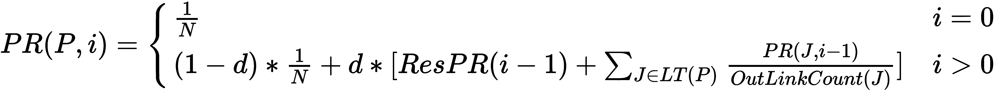

# 第八章：基于图的数据处理

“大数据是今天所有重大趋势的基础，从社交到移动，再到云和游戏。”

- 克里斯·林奇

询问任何非常成功的企业，它们都会毫不犹豫地同意数据是一种宝贵的商品。公司使用数据不仅是为了做出影响日常运营的明智的短期决策，而且也是为了塑造其长期战略的指南。实际上，在某些行业（如广告）中，数据*就是*产品！

现在，随着廉价存储解决方案的出现，与过去几年相比，数据的收集量呈指数级增长。此外，存储需求增长的速度预计将继续遵循指数曲线，甚至在未来很长一段时间内也是如此。

尽管有许多处理结构化数据（如支持 map-reduce 操作的系统）的解决方案，但当要处理的数据以*图*的形式组织时，它们就不够用了。针对大规模图运行专用算法是物流领域或运营社交网络的公司中相当常见的用例。

在本章中，我们将重点关注那些大规模处理图的系统。更具体地说，以下主题将被涵盖：

+   理解**批量同步并行**（**BSP**）模型以在多个节点间分配计算

+   将 BSP 模型原则应用于创建我们自己的 Go 语言图处理系统

+   使用图系统作为解决基于图的问题（如最短路径和图着色）的平台

+   为 Links 'R' Us 项目实现 PageRank 算法的迭代版本

# 技术要求

本章中将要讨论的主题的完整代码已发布在本书的 GitHub 仓库的`Chapter08`文件夹下。

您可以通过访问以下 URL 来访问本书的 GitHub 仓库：[`github.com/PacktPublishing/Hands-On-Software-Engineering-with-Golang`](https://github.com/PacktPublishing/Hands-On-Software-Engineering-with-Golang)。

为了让您尽快开始，每个示例项目都包含一个 Makefile，它定义了以下一组目标：

| **Makefile 目标** | **描述** |
| --- | --- |
| `deps` | 安装所需的任何依赖项 |
| `test` | 运行所有测试并报告覆盖率 |
| `lint` | 检查 lint 错误 |

与本书中的所有其他章节一样，您需要一个相当新的 Go 语言版本，您可以在[`golang.org/dl`](https://golang.org/dl)*.*下载。

# 探索批量同步并行模型

我们如何高效地在大型图上运行图算法？为了回答这个问题，我们需要明确我们所说的*大型*是什么意思。一个包含 100 万个节点的图被认为是大型吗？10 百万、100 百万，甚至 10 亿个节点呢？我们应该问自己的真正问题是图是否实际上可以*适应内存*。如果答案是肯定的，那么我们只需购买（或从云服务提供商那里租用）一台配备强大 CPU 的服务器，将安装的内存量最大化，并在单个节点上执行我们的图处理代码。

另一方面，当回答前面的问题是否定的...恭喜你；你现在可以宣称你在处理大数据！在这种情况下，传统的计算模型显然是不够的；我们需要开始探索专门为离核处理设计的替代应用。

BSP 模型是构建能够通过将计算分配到处理节点集群来处理大量数据集的系统中最受欢迎的模型之一。它在 1990 年由 Leslie Valiant 提出，作为一种新颖而优雅的方法，用于将并行硬件和软件连接起来。

BSP 模型的核心是**BSP 计算机**。如图所示，BSP 计算机是一个由一组，可能异构的，通过计算机网络相互连接的处理机构成的抽象计算机模型：


图 1：构成 BSP 计算机模型的组件

BSP 模型本身并不特别关注网络实现细节。实际上，网络被视为一个黑盒；只要网络提供在处理器之间路由消息的机制，模型就可以支持任何类型的网络。

处理器不仅可以访问它们自己的本地内存，还可以使用网络链路与其他处理器交换数据。为此，BSP 计算机实际上是一个*分布式内存*计算机，可以并行执行计算。然而，这种功能也有一个代价！虽然访问本地内存很快，但访问远程处理器的内存要慢得多，因为它涉及到通过网络链路交换消息。因此，BSP 计算机也可以被描述为一种**非统一内存访问**（**NUMA**）架构。

那么，我们可以在 BSP 计算机上运行哪些类型的程序呢？可以表示为*迭代步骤序列*的算法或数据处理操作通常非常适合 BSP 模型。BSP 模型使用术语*超级步骤*来指代用户定义程序的单次迭代执行。

BSP 模型与其他并发编程模型的一个区别是，BSP 通过使用称为 **单程序多数据**（**SPMD**）的技术来实现并行性。对为 BSP 计算机编写程序感兴趣的软件工程师可以像为单核机器编写程序一样进行操作。程序简单地接收一组数据作为输入，对其应用处理函数，并输出一些结果。换句话说，软件工程师对个别处理器及其连接的网络的存在一无所知。

在开始执行用户的程序之前，BSP 计算机透明地将程序上传到每个处理器，将需要处理的数据分割成一组分区，并将每个分区分配给一个可用的处理器。该模型采用了一种相当巧妙的策略来减少计算延迟：它将每个超步骤分解为两个阶段或子步骤：一个 **计算** 步骤和一个 **通信** 步骤。在计算步骤中，每个处理器使用分配给处理器的数据作为输入，执行用户程序的单一迭代。一旦 *所有* 处理器完成它们的个别计算，它们可以通过网络进行通信，并根据用例比较、交换或汇总它们个别计算的结果。

由于每个处理器可以并行且独立于其他处理器执行计算工作，BSP 模型利用 **阻塞屏障** 来同步处理器。以下图表总结了 BSP 计算机模型执行程序的方式，即作为一系列通过写屏障相互隔离的超步骤：


图 2：BSP 计算机模型通过写屏障将程序作为一系列相互隔离的超步骤执行

在 Go 术语中，阻塞屏障相当于 `sync.WaitGroup`；BSP 计算机等待所有处理器达到屏障后，才分配给它们下一块工作。

在过去几年中，对 BSP 等模型的需求激增。这很大程度上归功于谷歌，它是（不包括由政府资助的三字母机构）全球大数据处理领域当之无愧的领导者。谷歌工程师将 BSP 模型的几个概念融入了 Pregel，这是一个用于离核图处理的内部解决方案。2010 年，谷歌发表了一篇论文^([7])，详细介绍了 Pregel 的设计决策和架构。这篇论文为创建开源替代品铺平了道路，例如斯坦福的 GPS^([4]) 和 Apache Giraph^([1])。后者目前被 Facebook 用于分析由网络用户及其连接形成的社会图。

# 在 Go 中构建图处理系统

没有比从头开始构建我们自己的可扩展 Pregel-like 图处理系统更好的方法来深入理解 BSP 模型原理。

下面是我们将要构建的系统的一些设计要求：

+   图将被表示为一组顶点和有向边。每个顶点将被分配一个唯一的 ID。此外，顶点和边可以可选地存储用户定义的值。

+   在每个超级步骤中，系统都会为图中的每个顶点执行一个用户定义的计算函数。

+   计算函数允许检查和修改它们被调用时的顶点的内部状态。它们还可以遍历输出边列表，与其他顶点交换消息。

+   在超级步骤期间产生的任何输出消息都将被缓冲，并在*下一个*超级步骤中交付给预期的接收者。

+   系统必须能够支持单节点和多节点（分布式）图拓扑。在多节点拓扑中，每个节点负责管理图顶点及其输出边的一个子集。在多节点配置下操作时，系统应提供一种机制，用于在节点之间中继顶点消息（例如，通过网络链接）。

在接下来的章节中，我们将更详细地分析这些要求，并阐述如何在 Go 语言中实现它们。您可以从本书 GitHub 仓库的`Chapter08/bspgraph`文件夹中找到图处理系统的完整文档源代码和测试套件。

# 队列和交付消息

BSP 模型的一个核心思想是图组件通过交换消息相互通信。每个图顶点可能接收多个消息的事实，要求引入某种抽象来存储或排队传入的消息，直到它们准备好被预期的接收者处理。

在接下来的三个部分中，我们将通过定义建模消息和队列所需的接口来启动我们的设计讨论。然后，我们将尝试实现一个简单、线程安全的内存队列。

# 消息接口

从逻辑上讲，交换顶点之间消息的内容在很大程度上取决于我们试图执行的应用或图算法。因此，为了避免传递简单的`interface{}`值，我们需要想出一个合理的接口来以通用方式描述消息。位于`Chapter08/bspgraph/message`包中的`Message`接口正是为此目的而设计的：

```go
type Message interface {
 // Type returns the type of this Message.
 Type() string
}
```

到目前为止，你可能对在这个接口上有一个`Type`方法的有效性表示怀疑。这真的会比简单地使用`interface{}`更好吗？

如果你还记得我们关于 BSP 计算机模型的讨论，处理器通过网络链路相互通信。在消息可以通过网络传输之前，发送者必须将其序列化为字节流。在接收端，字节流被反序列化为消息并交付给预期的接收者。

`Type`方法对于支持发送者和接收者可以在同一通道上交换*不同*类型消息的场景非常有用（例如，TCP 套接字）。在序列化时，发送者查询消息的类型，并将此信息作为附加元数据附加到序列化负载中。接收者然后可以解码元数据并将负载的字节流反序列化回适当的消息类型。

# 队列和消息迭代器

队列作为存储传入消息并使其可供计算函数消费的缓冲区。图处理系统的用户可以使用内置的内存队列（参见下一节）或注入符合`Queue`接口的应用特定队列实现，只要它遵循以下定义：

```go
type Queue interface {
 // Cleanly shutdown the queue.
 Close() error

 // Enqueue inserts a message to the end of the queue.
 Enqueue(msg Message) error

 // PendingMessages returns true if the queue contains any messages.
 PendingMessages() bool

 // Flush drops all pending messages from the queue.
 DiscardMessages() error

 // Messages returns an iterator for accessing the queued messages.
 Messages() Iterator
}
```

`Queue`接口上的方法对于任何类型的队列系统来说都很标准。调用`PendingMessages`可以揭示队列当前是否为空，而调用`DiscardMessages`可以用来清除任何存储的消息。`Enqueue`方法可以用来将新的`Message`追加到队列中，而`Messages`方法返回一个用于访问已入队消息列表的`Iterator`。由于迭代器实现通常与底层队列系统耦合，因此`Iterator`也被定义为接口：

```go
type Iterator interface {
 // Next advances the iterator so that the next message can be retrieved
 // via a call to Message(). If no more messages are available or an
 // error occurs, Next() returns false.
 Next() bool

 // Message returns the message currently pointed to by the iterator.
 Message() Message

 // Error returns the last error that the iterator encountered.
 Error() error
}
```

此接口遵循与之前章节中你应该熟悉的相同迭代器模式。调用`Next`会移动迭代器并返回一个布尔值以指示是否有更多消息可用。在成功调用`Next`之后，可以通过调用`Message`来检索当前消息。

# 实现内存、线程安全的队列

对于大多数应用来说，使用如本文中展示的内存队列实现应该足够。实现对其他类型队列系统的支持（例如，Kafka、nats-streaming，甚至是普通文件）则留作你的练习。

让我们先定义`inMemoryQueue`类型及其构造函数：

```go
type inMemoryQueue struct {
 mu   sync.Mutex
 msgs []Message

 latchedMsg Message
}

func NewInMemoryQueue() Queue {
 return new(inMemoryQueue)
}
```

如你所见，内存队列不过是一系列`Message`实例的切片——一个用于存储当前由迭代器指向的消息的槽位，以及一个`sync.Mutex`用于序列化对消息列表的访问。

接下来，我们将查看`Enqueue`和`PendingMessages`的实现：

```go
func (q *inMemoryQueue) Enqueue(msg Message) error {
 q.mu.Lock()
 q.msgs = append(q.msgs, msg)
 q.mu.Unlock()
 return nil
}

func (q *inMemoryQueue) PendingMessages() bool {
 q.mu.Lock()
 pending := len(q.msgs) != 0
 q.mu.Unlock()
 return pending
}
```

要入队一个新消息，我们获取锁并将消息追加到列表中。以类似的方式，检查待处理消息可以通过获取锁并检查消息列表是否为空来实现。

我们需要实现最后一组函数，以便类型满足`Queue`接口，具体如下：

```go
func (q *inMemoryQueue) DiscardMessages() error {
 q.mu.Lock()
 q.msgs = q.msgs[:0]
 q.mu.Unlock()
 return nil
}

func (*inMemoryQueue) Close() error { return nil }

func (q *inMemoryQueue) Messages() Iterator { return q }
```

如前一个代码块所示，`DiscardMessages`方法的实现使用了一个巧妙的技巧：通过切片操作清空消息列表，同时保留已分配的切片容量，但将其长度重置为零。这使我们能够减少需要执行的内存分配次数，从而减轻 Go 垃圾收集器的压力。

此外，`Messages`方法体本身也非常有趣，因为返回值暗示`inMemoryQueue`类型也必须实现`Iterator`接口！以下代码显示了满足`Iterator`接口的相关方法的实现：

```go
func (q *inMemoryQueue) Next() bool {
 q.mu.Lock()
 qLen := len(q.msgs)
 if qLen == 0 {
 q.mu.Unlock()
 return false
 }
 q.latchedMsg = q.msgs[qLen-1] // Dequeue message from the tail of the queue.
 q.msgs = q.msgs[:qLen-1]
 q.mu.Unlock()
 return true
}

func (q *inMemoryQueue) Message() Message {
 q.mu.Lock()
 msg := q.latchedMsg
 q.mu.Unlock()
 return msg
}
```

尽管大多数队列实现使用 FIFO 语义，正如您可以通过`Message`方法的实现轻松看出，内存队列遵循**后进先出**（**LIFO**）语义。这是故意的；如果我们从列表的头部出队（例如，`q.msgs = q.msgs[1:]`），其容量将减少，我们将来将无法重用已分配的内存来追加新的消息。

由于我们构建的图系统不需要提供关于传入消息顺序的任何保证，因此我们可以直接使用内存队列实现，而不会出现任何问题。现在我们已经有了存储消息的解决方案，我们可以继续定义表示图顶点和边的必要结构。

# 建模图的顶点和边

正如我们在讨论图处理系统需求时提到的，我们需要提出一个描述构成图的顶点和边的模型。此外，我们还需要提供一个 API，我们可以使用它将新的顶点和边插入到图中。

# 定义顶点和边类型

`Vertex`类型封装了`Graph`实例中每个顶点的状态：

```go
type Vertex struct {
 id       string
 value    interface{}
 active   bool
 msgQueue [2]message.Queue
 edges    []*Edge
}
```

关于`Vertex`类型定义的一个有趣的事实是，我们实际上需要维护两个`message.Queue`实例。在执行超级步骤时，由计算函数调用产生的任何消息都必须被缓冲，以便它们可以在下一个超级步骤中交付给预期的接收者。为此，我们的实现将采用双缓冲方案。我们将使用一个队列来保存当前超级步骤的消息，另一个队列来缓冲下一个超级步骤的消息。在每个超级步骤结束时，我们将交换队列，使上一个超级步骤的输出队列成为下一个超级步骤的输入队列，反之亦然。为了避免在每个图的顶点上物理交换队列指针，我们将依靠模运算来根据当前超级步骤编号选择输入和输出队列：

+   索引为 `super_step%2` 的队列持有当前超级步骤应消费的消息

+   索引为 `(super_step+1)%2` 的队列缓冲了下一个超级步骤的消息

接下来，我们不应该允许 `bspgraph` 包的用户直接修改顶点的内部状态。因此，`Vertex` 字段没有在 `bspgraph` 包外部导出。相反，我们将定义以下一组辅助方法，以便我们可以访问和/或安全地操作顶点实例的状态：

```go
func (v *Vertex) ID() string { return v.id }

func (v *Vertex) Value() interface{} { return v.value }

func (v *Vertex) SetValue(val interface{}) { v.value = val } func (v *Vertex) Freeze() { v.active = false } func (v *Vertex) Edges() []*Edge { return v.edges } 
```

每个顶点都由一个基于字符串的 ID 唯一标识，可以通过调用 `ID` 方法来查询。此外，顶点可以选择存储一个用户定义的值，计算函数可以通过 `Value` 和 `SetValue` 方法读取或写入该值。

更重要的是，顶点可以处于以下两种状态之一：*活动*或*非活动*状态。所有顶点最初都被标记为 *活动*。为了节省计算资源，图框架将只对活动顶点调用计算函数。如果计算方法实现决定某个特定顶点已达到终止状态且不再需要进一步计算，它可以选择通过调用其 `Freeze` 方法显式地将顶点标记为非活动。然而，如果一个非活动顶点在超级步骤期间收到一条新消息，图框架将在下一个超级步骤自动将其标记为活动。

最后，`Edges` 方法返回一个与特定顶点出发的出边、有向边对应的 `Edge` 对象的切片。以下代码展示了 `Edge` 类型的定义及其辅助方法：

```go
type Edge struct {
 value interface{}
 dstID string
}

func (e *Edge) DstID() string { return e.dstID }

func (e *Edge) Value() interface{} { return e.value }

func (e *Edge) SetValue(val interface{}) { e.value = val }
```

与 `Vertex` 类型类似，边也可以存储一个可选的用户定义值，可以通过 `Value` 和 `SetValue` 方法读取/写入。每个边都有一个目标顶点，其 ID 可以通过调用 `DstID` 方法获得。正如我们将在 *发送和接收消息* 部分中看到的那样，顶点 ID 是我们为了向特定顶点发送消息而需要了解的唯一信息。

# 将顶点和边插入到图中

`Graph` 类型通过一个键为顶点 ID、值为 `Vertex` 实例的映射来跟踪构成图的所有顶点。除了顶点映射允许我们快速通过 ID 查找顶点——这对于传递传入消息非常重要——它还提供了一个高效的机制（与使用切片相比），如果我们希望允许用户在超级步骤之间修改图拓扑，我们可以通过它来删除顶点。

新顶点可以通过 `AddVertex` 方法插入到图中。它期望两个参数：

+   一个唯一的顶点 ID

+   一个初始值（也可能为 `nil`）：

```go
func (g *Graph) AddVertex(id string, initValue interface{}) {
 v := g.vertices[id]
 if v == nil {
 v = &Vertex{
 id: id,
 msgQueue: [2]message.Queue{
 g.queueFactory(),
 g.queueFactory(),
 },
 active: true,
 }
 g.vertices[id] = v
 }
 v.SetValue(initValue)
}
```

如果已经存在具有相同 ID 的顶点，我们只需覆盖其存储的初始值。否则，必须分配一个新的`Vertex`实例。代码填充其 ID 字段，将顶点状态设置为活动状态，并调用配置的（在图构建时）队列工厂来实例化我们需要的两个队列，以便存储当前和下一个超级步骤的传入消息。最后，将新的顶点实例插入到映射中。

同样，`AddEdge`方法在两个顶点之间创建一个新的有向边：

```go
func (g *Graph) AddEdge(srcID, dstID string, initValue interface{}) error {
 srcVert := g.vertices[srcID]
 if srcVert == nil {
 return xerrors.Errorf("create edge from %q to %q: %w", srcID, dstID, ErrUnknownEdgeSource)
 }

 srcVert.edges = append(srcVert.edges, &Edge{
 dstID: dstID,
 value: initValue,
 })
 return nil
}
```

如我们在*定义顶点和边类型*部分中提到的，边由它们起源的顶点拥有。因此，`AddEdge`实现必须检查`srcID`是否可以解析为现有顶点。如果找不到源顶点，则向调用者返回错误。否则，创建一个新的边并将其附加到源顶点的边列表中。

注意，虽然我们期望边的源顶点在本地是已知的，但对于目标顶点不能做出相同的假设。例如，如果图分布在两个节点上，源顶点可能由第一个节点管理，而目标顶点可能由第二个节点管理。

# 通过数据聚合共享全局图状态

聚合器是实现依赖于顶点之间共享全局状态的几个基于图的算法的关键组件。它们是并发安全的原语，将聚合运算符应用于一组值，并在下一个超级步骤中将结果提供给所有顶点。

只要运算符是交换的和结合的，就可以使用任何类型的运算符来创建聚合器。聚合器通常用于实现计数器、累加器或跟踪某些数量的最小值和/或最大值。

在接下来的章节中，我们将做以下事情：

+   定义一个通用的聚合器接口

+   通过注册和按名称查找`Aggregator`实例的辅助方法增强我们的`Graph`类型

+   构建一个累加`float64`值的示例聚合器

# 定义聚合器接口

`Aggregator`接口描述了 Go 类型必须实现的方法集，以便它们可以用于我们的图处理框架进行数据聚合：

```go
type Aggregator interface {
 // Type returns the type of this aggregator.
 Type() string

 // Set the aggregator to the specified value.
 Set(val interface{})

 // Get the current aggregator value.
 Get() interface{}

 // Aggregate updates the aggregator's value based on the provided 
    // value.
 Aggregate(val interface{})

 // Delta returns the change in the aggregator's value since the last 
    // call to Delta. 
 Delta() interface{}
}
```

我的一个小烦恼是，前面接口定义中的方法使用了`interface{}`值。不幸的是，这是少数几个我们实际上无法避免使用`interface{}`的情况之一，因为可以聚合的值的类型是特定于实现的。

每当我们想要将聚合操作应用于新值时，可以通过调用 `Aggregate` 方法来实现。此外，可以通过调用 `Get` 方法检索当前值。另一方面，如果我们想要将聚合器设置为 *特定* 的值（例如，将计数器重置为零），我们可以调用 `Set` 方法。`Type` 方法提供了聚合器类型的标识符，可用于序列化目的（例如，如果我们想要对图的状态进行快照）。

`Delta` 方法返回自上次调用 `Delta` 或 `Set` 以来聚合器值的 *变化*。此方法旨在在分布式图计算场景中使用（参见第十二章，*构建分布式图处理系统*），将单个局部聚合器的值减少到单个全局聚合值。

要了解 `Delta` 方法的使用方法，让我们设想一个场景，其中我们部署了三个节点：一个主节点和两个工作节点。我们的目标是创建一个分布式计数器，其值在执行新的超级步骤之前与所有节点同步。为此，每个节点（包括主节点）定义了一个 *本地* 聚合器实例，该实例实现了一个简单的计数器。在执行超级步骤时，计算函数只能访问它们正在执行的工作节点的本地计数器。主节点没有分配任何顶点。相反，它负责收集每个工作节点的部分 *delta*，将其聚合到自己的计数器中，并将新的总数 *广播* 回到工作节点。然后，工作节点使用 `Set` 方法更新它们的本地计数器到新的总数。

# 注册和查找聚合器

为了便于基于名称的聚合器查找，`Graph` 实例将聚合器存储在一个映射中，其中聚合器名称用作键。可以通过 `RegisterAggregator` 方法将新的聚合器实例链接到 `Graph` 实例：

```go
func (g *Graph) RegisterAggregator(name string, aggr Aggregator) { 
 g.aggregators[name] = aggr 
}
```

需要访问特定聚合器的计算函数可以调用 `Aggregator` 方法，通过名称查找已注册的聚合器实例：

```go
func (g *Graph) Aggregator(name string) Aggregator { 
 return g.aggregators[name] 
}
```

为了使客户端更容易创建图状态的快照，我们还将提供辅助的 `Aggregators` 方法，该方法仅返回包含已注册聚合器实例完整集合的映射的副本。

# 实现一个无锁的 float64 值累加器

在 `Chapter08/bspgraph/aggregator` 包中，您可以找到两个并发安全的累加器实现，这些实现旨在与 `int64` 和 `float64` 值一起工作，也可以用作分布式计数器。

而不是使用互斥锁来保证并发访问，这两个累加器都是通过比较和交换指令实现的。基于 int64 的版本相当直接，并且可以很容易地利用 `sync/atomic` 包提供的函数来实现。我们将在这里剖析的基于 float64 的版本更具挑战性（并且更有趣！），因为 `sync/atomic` 包没有提供处理浮点值的支持。为了克服这一限制，我们将导入 `unsafe` 包，并使用一些 *创造性的值转换技巧* 来创建我们自己的原子函数集，这些函数可以与 `float64` 值一起工作！

让我们先定义 `Float64Accumulator` 类型：

```go
type Float64Accumulator struct {
 prevSum float64
 curSum  float64
}
```

`Float64Accumulator` 类型跟踪两个 `float64` 值：第一个存储当前总和，而后者跟踪通过调用 `Delta` 方法报告的最后一个值。

现在，让我们定义满足 `Accumulator` 接口所需的一组方法。我们将定义的第一个方法是 `Get`：

```go
func (a *Float64Accumulator) Get() interface{} {
 return loadFloat64(&a.curSum)
}

func loadFloat64(v *float64) float64 {
 return math.Float64frombits(
 atomic.LoadUint64((*uint64)(unsafe.Pointer(v))),
 )
}
```

在这里，`loadFloat64` 辅助函数是所有魔法发生的地方。我们将使用的一个技巧是基于观察，即 `float64` 值在内存中占据的空间（8 字节）与 `uint64` 值相同。借助 `unsafe` 包，我们可以将读取 `float64` 值的指针转换为 `*uint64` 值，并使用 `atomic.LoadUint64` 函数以原始 `uint64` 值的形式原子地读取它。然后，我们可以使用内置 `math` 包中的方便的 `Float64frombits` 函数将原始 `uint64` 值 *解释* 为 `float64`。

接下来，让我们检查 `Aggregate` 方法的实现：

```go
func (a *Float64Accumulator) Aggregate(v interface{}) {
 for v64 := v.(float64); ; {
 oldV := loadFloat64(&a.curSum)
 newV := oldV + v64
 if atomic.CompareAndSwapUint64(
 (*uint64)(unsafe.Pointer(&a.curSum)),
 math.Float64bits(oldV),
 math.Float64bits(newV),
 ) {
 return
 }
 }
}
```

正如你在前面的代码片段中看到的，我们进入一个无限 `for` 循环，在其中获取当前的聚合器值，添加传递给方法的 `float64` 值，并不断尝试执行比较和交换操作，直到成功。像之前一样，我们利用观察到的 `float64` 值在内存中占据与 `uint64` 相同的空间，并使用 `atomic.CompareAndSwapUint64` 来执行交换。这个函数期望 `uint64` 值作为参数，所以这次，我们利用 `math.Float64bits` 函数将我们正在处理的 `float64` 值转换为用于比较和交换操作的原始 `uint64` 值。

我们可以应用完全相同的方法来实现 `Delta` 方法，如下所示：

```go
func (a *Float64Accumulator) Delta() interface{} {
 for {
 curSum := loadFloat64(&a.curSum)
 prevSum := loadFloat64(&a.prevSum)
 if atomic.CompareAndSwapUint64(
 (*uint64)(unsafe.Pointer(&a.prevSum)),
 math.Float64bits(prevSum),
 math.Float64bits(curSum),
 ) {
 return curSum - prevSum
 }
 }
}
```

再次进入一个无限 `for` 循环，在其中捕获当前和前一个值，然后使用比较和交换操作将 `curSum` 复制到 `prevSum`。一旦交换成功，我们就从捕获的两个值中减去，并将结果返回给调用者。

为了完成实现我们的累加器的方法集，我们还需要提供一个 `Set` 方法的实现，正如你在下面的代码列表中看到的，这稍微复杂一些：

```go
func (a *Float64Accumulator) Set(v interface{}) {
 for v64 := v.(float64); ; {
 oldCur := loadFloat64(&a.curSum)
 oldPrev := loadFloat64(&a.prevSum)
 swappedCur := atomic.CompareAndSwapUint64(
 (*uint64)(unsafe.Pointer(&a.curSum)),
 math.Float64bits(oldCur),
 math.Float64bits(v64),
 )
 swappedPrev := atomic.CompareAndSwapUint64(
 (*uint64)(unsafe.Pointer(&a.prevSum)),
 math.Float64bits(oldPrev),
 math.Float64bits(v64),
 )
 if swappedCur && swappedPrev {
 return
 }
 }
}
```

额外的复杂性源于我们需要执行两个连续的比较和交换操作，这两个操作都必须成功，我们才能退出 `for` 循环。

# 发送和接收消息

正如我们之前提到的，顶点通过交换消息相互通信。向特定顶点的所有直接邻居发送相同的消息是多个图算法中经常出现的模式。让我们定义一个方便的方法来处理这种相当常见的用例：

```go
func (g *Graph) BroadcastToNeighbors(v *Vertex, msg message.Message) error {
 for _, e := range v.edges {
 if err := g.SendMessage(e.dstID, msg); err != nil {
 return err
 }
 }

 return nil
}
```

`BroadcastToNeighbors` 简单地迭代特定顶点的边列表，并尝试使用 `SendMessage` 方法将消息发送给每个邻居。借助 `SendMessage`，计算函数可以向图中的任何顶点发送消息，前提是它们知道其 ID（例如，通过使用八卦协议发现）。

让我们看看 `SendMessage` 的实现：

```go
func (g *Graph) SendMessage(dstID string, msg message.Message) error {
 dstVert := g.vertices[dstID]
 if dstVert != nil {
 queueIndex := (g.superstep + 1) % 2
 return dstVert.msgQueue[queueIndex].Enqueue(msg)
 }

 if g.relayer != nil {
 if err := g.relayer.Relay(dstID, msg); !xerrors.Is(err, ErrDestinationIsLocal) {
 return err
 }
 }

 return xerrors.Errorf("message cannot be delivered to %q: %w", dstID, ErrInvalidMessageDestination)
}
```

首先，我们需要在图顶点映射中查找目标顶点。如果查找返回有效的 `Vertex` 实例，那么我们可以将消息入队，以便在下一次超级步骤中将其传递给顶点。

当顶点查找失败时，事情变得更有趣… 查找失败可能有两个原因：

+   我们正在以分布式模式运行，并且顶点由一个 *远程* 图实例管理

+   顶点根本不存在

处理可能托管在远程的顶点，`Graph` 类型允许 `bspgraph` 包的用户注册一个助手，该助手可以在远程图实例之间传递消息。更具体地说，这些助手：

+   了解分布式图的拓扑结构（即集群中每个节点管理的顶点 ID 范围）

+   提供在集群节点之间穿梭消息的机制

用户定义的中继助手必须实现 `Relayer` 接口，并且可以通过 `RegisterRelayer` 方法与图实例注册：

```go
type Relayer interface {
 // Relay a message to a vertex that is not known locally. Calls
 // to Relay must return ErrDestinationIsLocal if the provided dst value
 // is not a valid remote destination.
 Relay(dst string, msg message.Message) error
}

func (g *Graph) RegisterRelayer(relayer Relayer) { 
 g.relayer = relayer 
}
```

为了使用户更容易提供合适的 `Relayer` 实现的函数或闭包，让我们也定义 `RelayerFunc` 适配器，它将具有适当签名的函数转换为 `Relayer`：

```go
type RelayerFunc func(string, message.Message) error

// Relay calls f(dst, msg).
func (f RelayerFunc) Relay(dst string, msg message.Message) error {
 return f(dst, msg)
}
```

如果图无法定位目标顶点 ID，并且用户已注册 `Relayer` 实例，则 `SendMessage` 将调用其 `Relay` 方法并检查响应中的错误。如果我们得到除 `ErrDestinationLocal` 之外的错误，我们将错误原样返回给调用者。

如果中继助手检测到目标顶点 ID 实际上应由本地图实例管理，它将使用类型为 `ErrDestinationIsLocal` 的错误失败，以指示这一点。在这种情况下，我们假设顶点 ID 无效，并将类型为 `ErrInvalidMessageDestination` 的错误返回给调用者。

# 使用计算函数实现基于图的算法

为了使计算函数与 `bspgraph` 包一起使用，它必须遵循以下签名：

```go
type ComputeFunc func(g *Graph, v *Vertex, msgIt message.Iterator) error
```

计算函数的第一个参数是指向 `Graph` 实例本身的指针。这允许计算函数使用图 API 来查询当前超级步骤编号、查找聚合器并向顶点发送消息。第二个参数是指向计算函数正在操作的 `Vertex` 实例的指针，而第三个和最后一个参数是 `message.Iterator`，用于消费在 *上一个* 超级步骤期间发送给顶点的消息。

重要的是要注意，系统在假设计算函数可以安全地并发执行的前提下运行。系统提供的唯一运行时保证是，在每个超级步骤中，计算函数将针对每个顶点 *恰好执行一次*。因此，计算函数实现可以使用任何 `Vertex` 方法，而无需担心数据竞争和同步问题。鉴于顶点实际上 *拥有* 从它们起源的边，相同的数据访问原则也适用于通过在顶点上调用 `Edges` 方法获得的任何 `Edge` 实例。

# 通过并行执行计算函数实现垂直扩展

接下来，我们将关注用于执行计算函数的机制。一个相当简单的方法是使用 `for` 循环结构迭代图中的顶点，并以顺序方式对每个顶点调用计算函数。虽然这种方法无疑会按预期工作，但它会非常低效地使用我们可用的计算资源。按顺序运行计算函数只会使用单个 CPU 核心；考虑到大多数云提供商都可以轻松获得多达 64 核心的机器，这将是相当浪费的。

一个更好的替代方案是将计算函数的执行扇出到工作者池中。这样，计算函数可以并行运行并充分利用所有可用的 CPU 核心。图构造器通过调用 `startWorkers` 方法初始化工作者池，其实现如下：

```go
func (g *Graph) startWorkers(numWorkers int) {
 g.vertexCh = make(chan *Vertex)
 g.errCh = make(chan error, 1)
 g.stepCompletedCh = make(chan struct{})

 g.wg.Add(numWorkers)
 for i := 0; i < numWorkers; i++ {
 go g.stepWorker()
 }
}
```

`startWorkers` 的第一件事是创建一组用于与池中的工作者进行通信的通道。让我们简要地谈谈每个通道的作用：

+   `vertexCh` 是一个由工作者轮询的通道，用于获取下一个要处理的顶点。

+   `errCh` 是一个缓冲通道，工作者在此通道中发布在调用计算函数时可能发生的任何错误。图处理系统实现将所有错误视为 *致命的*。因此，我们只需要有足够的空间来存储单个错误值。当工作者检测到错误时，它将尝试将其入队到 `errCh`；如果通道已满，则已写入另一个致命错误，因此新的错误可以安全地忽略。

+   由于我们使用工作池并行执行计算函数，我们需要引入某种同步机制来检测所有顶点是否已被处理。`stepCompletedCh`通道允许工人在最后一个入队的顶点被处理时发出信号。

`startWorkers`方法的其余部分相当简单：我们为每个工人启动一个 goroutine，并使用`sync.WaitGroup`来跟踪它们的完成状态。

如以下代码所示，`step`方法负责执行单个超级步。如果超级步在没有错误的情况下完成，`step`将返回超级步期间活跃的顶点数量：

```go
func (g *Graph) step() (activeInStep int, err error) {
 g.activeInStep, g.pendingInStep = 0, int64(len(g.vertices))
 if g.pendingInStep == 0 {
 return 0, nil // no work required
 }
 for _, v := range g.vertices {
 g.vertexCh <- v
 }
 <-g.stepCompletedCh

 select {
 case err = <-g.errCh: // dequeued
 default: // no error available
 }
 return int(g.activeInStep), err
}
```

上述代码块应该是自解释的。首先，我们将`activeInStep`计数器重置为零，并将`pendingInStep`计数器加载为图中顶点的数量。然后，迭代持有图`Vertex`实例集合的映射，并将每个顶点值写入`vertexCh`，以便它可以被空闲的工人拾取和处理。

一旦所有顶点都已入队，`step`将通过在`stepCompletedCh`上执行阻塞读取来等待所有顶点被工作池处理。在返回之前，代码检查是否将错误入队到错误通道。如果发生这种情况，错误将被出队并返回给调用者。

现在，让我们看看`stepWorker`方法的实现：

```go
for v := range g.vertexCh {
 buffer := g.superstep % 2
 if v.active || v.msgQueue[buffer].PendingMessages() {
 _ = atomic.AddInt64(&g.activeInStep, 1)
 v.active = true
 if err := g.computeFn(g, v, v.msgQueue[buffer].Messages()); err != nil {
 tryEmitError(g.errCh, xerrors.Errorf("running compute function for vertex %q failed: %w", v.ID(), err))
 } else if err := v.msgQueue[buffer].DiscardMessages(); err != nil {
 tryEmitError(g.errCh, xerrors.Errorf("discarding unprocessed messages for vertex %q failed: %w", v.ID(), err))
 }
 }
 if atomic.AddInt64(&g.pendingInStep, -1) == 0 {
 g.stepCompletedCh <- struct{}{}
 }
}
g.wg.Done()
```

通道的`range`语句确保我们的工人将继续执行，直到`vertexCh`被关闭。在从`vertexCh`中出队下一个顶点之后，工人使用模运算来选择包含当前超级步期间应由计算函数消费的消息的消息队列。

顶点被认为是活跃的，如果它们的`active`标志被设置，或者如果它们的输入消息队列包含任何未投递的消息。对于任何被认为是活跃的顶点，我们将它的`active`标志设置为`true`，并原子性地增加`activeInStep`计数器。正如我们将在以下章节中看到的，几个图算法使用超级步中活跃顶点的数量作为判断算法是否完成的条件。

接下来，我们调用注册的计算函数并检查是否有错误。如果发生错误，我们调用`tryEmitError`辅助函数将错误入队到`errCh`：

```go
func tryEmitError(errCh chan<- error, err error) {
 select {
 case errCh <- err: // queued error
 default: // channel already contains another error
 }
}
```

在`stepWorker`方法中我们需要做的最后一点家务是调用队列的`DiscardMessages`方法，并刷新任何在前一步执行的计算函数中没有消费的消息。这确保队列始终为空，并准备好存储`superstep+2`的传入消息。

无论顶点是否活跃，工作进程都会调用`atomic.AddInt64`函数来**递减**`pendingInStep`计数器，并检查它是否已达到零。当这种情况发生时，当前超级步骤的所有顶点都已处理完毕，工作进程将一个空的`struct{}`值写入`stepCompletedCh`，以解除`step`方法的阻塞并允许其返回。

# 协调超级步骤的执行

在上一节中，我们对`Graph`类型执行单个超级步骤所使用的机制进行了详细分析。然而，图算法通常涉及多个超级步骤。为了让`bspgraph`包的用户能够使用我们正在构建的系统运行通用图算法，他们需要对一系列超级步骤的执行有更细粒度的控制。

在执行一个超级步骤之前，我们需要重置一个或多个聚合器的值。同样，在超级步骤完成后，我们可能对检查或修改聚合器的最终值感兴趣。此外，每个算法都定义了自己的终止条件。例如，一个算法可能在以下情况下终止：

+   在固定数量的步骤之后

+   当图中的所有顶点都变为不活跃状态时

+   当某些聚合器的值超过阈值时

为了满足这样的需求，我们需要引入一个高级 API，该 API 提供了一层协调层来管理一系列超级步骤的执行。这个 API 由`Executor`类型提供，其定义如下：

```go
type Executor struct {
 g  *Graph
 cb ExecutorCallbacks
}
```

`Executor`封装了一个`Graph`实例，并使用一组用户定义的`ExecutorCallbacks`进行参数化：

```go
type ExecutorCallbacks struct {
 PreStep func(ctx context.Context, g *Graph) error
 PostStep func(ctx context.Context, g *Graph, activeInStep int) error
 PostStepKeepRunning func(ctx context.Context, g *Graph, activeInStep int) (bool, error)
}
```

`PreStep`和`PostStep`回调在执行新超级步骤之前和之后被调用（如果已定义）。如果定义了`PostStepKeepRunning`回调，它将在`PostStep`之后自动由`Executor`调用。回调负责检查算法的终止条件是否已满足，并在不需要执行更多超级步骤时返回`false`。

`NewExecutor`函数作为创建新`Executor`实例的构造函数：

```go
func NewExecutor(g *Graph, cb ExecutorCallbacks) *Executor {
 patchEmptyCallbacks(&cb)
 g.superstep = 0
 return &Executor{
 g:              g,
 cb:             cb,
 }
}
```

为了避免在尝试调用未定义的回调时发生空指针解引用错误，构造函数使用以下辅助函数来用模拟的空操作存根修补缺失的回调：

```go
func patchEmptyCallbacks(cb *ExecutorCallbacks) {
 if cb.PreStep == nil {
 cb.PreStep = func(context.Context, *Graph) error { return nil }
 }
 if cb.PostStep == nil {
 cb.PostStep = func(context.Context, *Graph, int) error { return nil }
 }
 if cb.PostStepKeepRunning == nil {
 cb.PostStepKeepRunning = func(context.Context, *Graph, int) (bool, error) { return true, nil }
 }
}
```

`Executor`公开的高级接口包括以下一组方法：

```go
func (ex *Executor) Graph() *Graph { return ex.g }

func (ex *Executor) Superstep() int { return ex.g.Superstep() }

func (ex *Executor) RunSteps(ctx context.Context, numSteps int) error {
 return ex.run(ctx, numSteps)
}

func (ex *Executor) RunToCompletion(ctx context.Context) error {
 return ex.run(ctx, -1)
}
```

`Graph`方法提供了访问与`Executor`关联的`Graph`实例的权限，而`Superstep`报告了已执行的**最后一个**超级步骤。`RunSteps`和`RunToCompletion`方法会重复执行超级步骤，直到满足以下条件之一：

+   上下文过期

+   发生错误

+   `PostStepKeepRunning`回调返回 false

+   执行了最大数量的`numSteps`（仅适用于`RunSteps`）

这两个函数仅仅是`run`方法的代理，其实现如下：

```go
func (ex *Executor) run(ctx context.Context, maxSteps int) error {
 var activeInStep int
 var err          error
 var keepRunning  bool
 var cb           = ex.cb
 for ; maxSteps != 0; ex.g.superstep, maxSteps = ex.g.superstep+1, maxSteps-1 {
 if err = ensureContextNotExpired(ctx); err != nil {
 break
 } else if err = cb.PreStep(ctx, ex.g); err != nil {
 break
 } else if activeInStep, err = ex.g.step(); err != nil {
 break
 } else if err = cb.PostStep(ctx, ex.g, activeInStep); err != nil {
 break
 } else if keepRunning, err = cb.PostStepKeepRunning(ctx, ex.g, activeInStep); !keepRunning || err != nil {
 break
 }
 }
 return err
}
```

`run`方法进入一个`for`循环，直到调用者提供的`maxSteps`值等于零时才会停止运行。在每个迭代的末尾，`maxSteps`递减，而图的超步骤计数器递增。然而，如果调用者在调用`run`时指定了`*负值*`作为`maxSteps`，那么前面的循环在功能上等同于一个无限循环。

`Executor`通过检查提供的上下文是否已取消开始新的迭代，然后继续调用`PreStep`回调。然后，它通过调用包装的`Graph`实例的`step`方法执行一个新的超级步骤。随后，它调用`PostStep`和`PostStepKeepRunning`回调。如果任何回调或`step`方法返回错误，则退出循环并将错误返回给调用者。

# 创建和管理`Graph`实例

我们的图处理系统几乎完成了！为了最终实现，我们需要定义一个构造函数，该构造函数将创建新的`Graph`实例，以及一些辅助方法来管理图的生命周期。

正如我们在前面的章节中看到的，有相当多的旋钮可以配置`Graph`实例。将每个单独的配置选项作为参数传递给图的构造函数被认为是一种反模式——更不用说，每次我们想要添加一个新的配置选项时，我们都需要提高我们包的主版本号；更改构造函数的签名正是破坏性更改的定义！

一个更好的解决方案是定义一个类型化的配置对象，并将其作为参数传递给构造函数：

```go
type GraphConfig struct {
 QueueFactory message.QueueFactory
 ComputeFn ComputeFunc
 ComputeWorkers int
}
```

`QueueFactory`将由`AddVertex`方法使用，为每个被添加到图中的新顶点创建所需的消息队列实例。`ComputeFn`设置用于指定每个超级步骤将执行的计算函数。最后，`ComputeWorkers`选项允许包的最终用户微调工作池的大小，以便他们可以执行提供的计算函数。

在前面的配置选项列表中，只有`ComputeFn`是必需的。让我们创建一个验证辅助程序来检查`GraphConfig`对象，并用合理的默认值填充缺失的字段：

```go
func (g *GraphConfig) validate() error {
 var err error
 if g.QueueFactory == nil {
 g.QueueFactory = message.NewInMemoryQueue
 }
 if g.ComputeWorkers <= 0 {
 g.ComputeWorkers = 1
 }

 if g.ComputeFn == nil {
 err = multierror.Append(err, xerrors.New("compute function not specified"))
 }

 return err
}
```

如果调用者提供了一个 nil 的`QueueFactory`实例，验证代码将使用内存实现作为合理的默认值。此外，如果指定的计算工作员数量无效，验证程序将回退到使用单个工作员。当然，这样做将有效地将每个超级步骤处理图顶点变成一个*顺序*操作。尽管如此，当最终用户希望调试行为不当的计算函数时，这可能会证明是一个有用的功能。

可以通过`NewGraph`构造函数创建一个新的`Graph`实例，如下所示：

```go
func NewGraph(cfg GraphConfig) (*Graph, error) {
 if err := cfg.validate(); err != nil {
 return nil, xerrors.Errorf("graph config validation failed: %w", err)
 }

 g := &Graph{
 computeFn:    cfg.ComputeFn,
 queueFactory: cfg.QueueFactory,
 aggregators:  make(map[string]Aggregator),
 vertices:     make(map[string]*Vertex),
 }
 g.startWorkers(cfg.ComputeWorkers)

 return g, nil
}
```

构造函数需要做的第一件事是对提供的配置选项进行验证检查。有了有效的配置，代码将创建 `Graph` 实例，连接提供的配置选项，并分配所需的映射来存储图的 `Vertex` 和 `Aggregator` 实例。在将新的 `Graph` 实例返回给调用者之前，构造函数需要做的最后一件事是通过调用 `startWorkers` 来初始化工作池。

在创建一个新的 `Graph` 实例后，用户可以继续填充图顶点和边，注册聚合器，并使用 `Executor` 来编排特定图算法的执行。然而，在完成运行后，用户可能希望重用 `Graph` 实例以再次运行相同的算法，但这次使用不同的图布局。让我们为他们提供一个 `Reset` 方法来重置图的内部状态：

```go
func (g *Graph) Reset() error {
 g.superstep = 0
 for _, v := range g.vertices {
 for i := 0; i < 2; i++ {
 if err := v.msgQueue[i].Close(); err != nil {
 return xerrors.Errorf("closing message queue #%d for vertex %v: %w", i, v.ID(), err)
 }
 }
 }
 g.vertices = make(map[string]*Vertex)
 g.aggregators = make(map[string]Aggregator)
 return nil
}
```

如您所知，每个顶点都与两个消息队列实例相关联。`message.Queue` 接口定义了一个 `Close` 方法，我们必须调用它来释放底层队列实现使用的任何资源（例如，文件句柄、套接字等）。最后，为了完全重置图的内部状态，我们可以简单地将图的超级步计数器重置为零，并重新创建存储图顶点和聚合器实例的映射。

由于工作池由许多长时间运行的 go-routines 组成，我们必须提供一个机制来管理它们的生命周期，更重要的是，在我们完成图操作后关闭它们。我们将在 `Graph` 类型上定义的最后一个方法是 `Close`：

```go
func (g *Graph) Close() error {
 close(g.vertexCh)
 g.wg.Wait()

 return g.Reset()
}
```

为了强制工作池干净地关闭并且所有工作进程都退出，`Close` 方法的实现关闭了 `vertexCh`，这是每个工作进程轮询以获取传入的顶点处理作业的通道。然后代码在等待组上阻塞，直到所有工作进程都已退出。在返回之前，我们通过调用 `Reset` 方法进行尾调用，以确保每个顶点的队列实例被正确关闭。

这标志着允许我们使用 BSP 计算模型执行基于图的算法的框架的开发完成。接下来，我们将探讨如何利用这个框架来解决一些涉及图的现实世界问题！

# 解决有趣的图问题

在本节中，我们将检查三个非常流行的基于图的难题，这些难题非常适合我们刚刚构建的图处理系统。

在详细描述每个问题并列出其潜在的实际应用之后，我们将通过展示一个可以用来解决该问题的 *顺序* 算法来继续我们的讨论。随后，我们将提出相同算法的等效并行版本，并将其编码为一个可以与 `bspgraph` 包一起使用的计算函数。

# 在图中搜索最短路径

如果我们环顾四周，我们肯定会遇到许多相当具有挑战性的问题，这些问题本质上归结为在图中找到一个或一组路径以最小化特定的成本函数。路径查找有众多现实世界的应用案例，从构建高效的计算机网络到物流甚至游戏！

适合的成本函数的定义及其解释通常是特定于应用的。

例如，在地图服务的背景下，图边相关的成本可能反映了两点之间的距离或由于交通拥堵而从一个点到另一个点驾驶所需的时间。另一方面，如果我们谈论数据包路由应用，成本可能代表网络运营商为了使用与其他提供商的互连而需要支付的费用。

为了简单起见，本节将仅关注在图中寻找最短路径。不言而喻，我们将讨论的原则和算法可以应用于任何*类型*的成本函数，只要图中边的*较低*成本值表示通过图的一条*更好*的路径。

根据我们如何定义路径的起点和终点，我们可以将最短路径查询分为三个一般类别：

+   **点对点**：在一个*点对点*的搜索查询中，我们感兴趣的是找到连接两个点的最短路径。这类搜索的一个有趣例子是实时策略游戏，用户选择一个单位（路径起点）并随后点击地图上他们希望单位移动到的位置（路径终点）。游戏引擎在两点之间搜索最短的无障碍路径（通常通过实现如 A*算法等算法）并沿着路径导航单位。

+   **点对多点**：一个*点对多点*的搜索查询涉及找到连接单个图顶点到多个顶点的最短路径。例如，地图应用的用户可能希望获得一个列表，列出位于他们当前位置特定半径内的咖啡店，并按距离排序。如果我们反转这个查询，我们可以识别出更多有趣的用例。例如，叫车应用了解用户和司机的位置。多点对点查询允许应用调度最近的司机到用户的位置，并减少接单时间。这些类型的查询可以使用迪杰斯特拉算法（Dijkstra's algorithm）等最广为人知的图算法有效地回答。

+   **多点到多点**：第三个，也是最复杂的路径查找查询类别包括*多点到多点*查询，其中我们实际上是在寻找从每个顶点到图中*所有*其他顶点的最短路径。可以说，我们可以通过在图中每个顶点上运行 Dijkstra 算法来回答这类查询，但这将付出更长的总运行时间，尤其是如果图中包含大量顶点。在性能方面，使用动态规划算法（如 Floyd-Warshall ^([3]））来回答这类查询会是一个更好的替代方案。

让我们尝试使用我们在本章前半部分开发的图处理框架来实现 Dijkstra 算法。虽然 Dijkstra 算法的原始版本旨在找到两点之间的最短路径，但我们将要使用的是设计用来定位*最短路径树*的变体，即从一点到图中所有其他点的最短路径。

# 顺序 Dijkstra 算法

在我们将 Dijkstra 算法适配到我们的图处理系统之前，我们需要清楚地了解原始算法的工作原理。以下代码片段概述了顺序版本 Dijkstra 算法的伪代码实现：

```go
function Dikstra(Graph):
 for each vertex v in Graph:
 min_cost_via[v] = infinity
 prev[v] = nil
 min_cost_via[src] = 0

 Q = set of all vertices in graph
 while Q is not empty:
 u = entry from Q with smallest min_cost_via[]
 remove u from Q

 for each neighbor v from u:
 cost_via_u = min_cost_via[u] + cost(u, v)
 if cost_via_u < min_cost_via[v]:
 min_cost_via[v] = cost_via_u
 prev[v] = u
```

前一个实现维护了两个数组，每个数组的长度等于图中顶点的数量：

+   第一个数组`min_cost_via`跟踪到达图中第*i*个顶点的源顶点的最小成本（距离）。

+   `prev`数组跟踪从源顶点到图中第*i*个顶点的最优路径中的前驱顶点。

在初始化时，我们将`prev`数组中的所有条目设置为`nil`。此外，`min_cost_via`数组中的所有条目都初始化为一个大数，除了源顶点的条目，其条目设置为`0`。如果我们用 Go 语言实现这个算法，并且路径成本是`uint64`值，我们会将初始值设置为`math.MaxUint64`。

Dijkstra 算法通过将所有图顶点放入一个名为`Q`的集合中来进行初始化。然后，算法执行与图中顶点数量相等的迭代次数。在每次迭代中，我们从`Q`中选择具有*最低*`min_cost_via`值的顶点`u`，并将其从集合中移除。

然后，算法检查所选顶点`u`的每个邻居`v`。如果可以通过`u`构建从`v`到源顶点的更低成本路径，则我们更新`v`的`min_cost_via`条目，并将`u`作为到达`v`的最优路径的前驱。

当`Q`集合中的所有顶点都被处理完毕时，算法完成。可以通过从目标顶点开始，并跟随`prev`数组条目直到我们到达源顶点，来重建从源顶点到图中任何其他顶点的最短路径。

更重要的是，我们可以稍微调整前面的算法以获得原始的变体，该变体可以回答点对点查询。我们所需做的只是在我们查询的目标顶点处理完毕后终止算法。那些熟悉或过去实现过 A*算法的人肯定会注意到这两个算法之间有很多相似之处。实际上，Dijkstra 算法是没有使用距离启发式函数的 A*算法的一个特例。

# 利用 Gossip 协议并行运行 Dijkstra 算法

Dijkstra 算法的实现相当直接，并且可以通过引入用于选择每次迭代下一个顶点的专用数据结构（例如，最小堆或斐波那契堆）来显著加快其运行时间。让我们看看我们如何利用我们构建的图处理系统来并行执行 Dijkstra 算法。

为了打破原始算法的顺序性，我们将交换下一个顶点选择步骤，并用一个*Gossip 协议*来替换它。每当顶点通过另一个顶点识别出一条更好的路径时，它将通过向它们发送`PathCostMessage`来将此信息*广播*给所有邻居。然后，邻居将在下一个超级步骤中处理这些消息，更新自己的最小距离估计，并在找到更好的路径时将其广播给自己的邻居。这里的关键概念是在整个图中触发路径更新的波前，每个顶点可以并行处理。

我们需要做的第一件事是为以下内容定义类型：

+   顶点之间交换的消息

+   存储每个顶点的状态

考虑以下代码片段：

```go
type PathCostMessage struct {
 // The ID of the vertex this cost announcement originates from.
 FromID string

 // The cost of the path from this vertex to the source vertex via 
    // FromID.
 Cost int
}

func (pc PathCostMessage) Type() string { return "cost" }

type pathState struct {
 minDist    int
 prevInPath string
}
```

`pathState`结构体编码了与算法的顺序版本中的`min_cost_via`和`prev`数组相同的信息。唯一的区别是每个顶点维护自己的`pathState`实例，该实例作为顶点值存储。

接下来，让我们尝试为图定义一个计算函数。如您从前面的章节中回忆的那样，计算函数接收以下输入参数：指向图的指针、当前处理的顶点以及在上一个超级步骤期间发送到顶点的消息迭代器。在超级步骤 *0* 中，每个顶点使用最大可能距离值初始化其自身的内部状态：

```go
if g.Superstep() == 0 {
 v.SetValue(&pathState{ minDist: int(math.MaxInt64) })
}
```

然后，每个顶点处理其邻居的任何路径公告，并跟踪具有最低成本的路径公告：

```go
minDist := int(math.MaxInt64)
if v.ID() == c.srcID { // min cost from source to source is always 0
 minDist = 0
}
var via string
for msgIt.Next() {
 m := msgIt.Message().(*PathCostMessage)
 if m.Cost < minDist {
 minDist = m.Cost
 via = m.FromID
 }
}
```

在处理完所有消息后，我们比较从所有公告中得出的最佳路径的成本与该顶点迄今为止看到的最佳路径的成本。如果顶点已经知道一条成本更低的更好路径，我们实际上不需要做任何事情。否则，我们将更新局部顶点状态以反映新的最佳路径，并向我们的每个邻居发送一条消息：

```go
st := v.Value().(*pathState)
if minDist < st.minDist {
 st.minDist = minDist
 st.prevInPath = via
 for _, e := range v.Edges() {
 costMsg := &PathCostMessage{
 FromID: v.ID(),
 Cost:   minDist + e.Value().(int),
 }
 if err := g.SendMessage(e.DstID(), costMsg); err != nil {
 return err
 }
 }
}
v.Freeze()
```

每个输出的 `PathCostMessage` 包含通过当前顶点到达每个邻居的成本，并且通过将下一跳的成本（与输出边关联的值）添加到到达当前顶点的新最小成本来计算。

无论到顶点的最佳路径是否更新，我们都会在每一个顶点上调用 `Freeze` 方法，并将其标记为已处理。这意味着除非顶点从其邻居那里收到消息，否则顶点将在未来的超级步骤中不会被重新激活。最终，所有顶点都会找到到源顶点的最优路径，并停止向邻居广播成本更新。当这种情况发生时，所有顶点最终都会进入冻结状态，算法将终止。

我们可以肯定地说，与传统的顺序版本相比，这种方法需要更多的努力。然而，与算法的顺序版本相反，并行版本可以在可以潜在地分布在多个计算节点上的大规模图上高效运行。

本节中提到的最短路径计算器的完整源代码和测试可以在本书的 GitHub 仓库的 `Chapter08/shortestpath` 文件夹中找到。

# 图着色

我们将尝试使用我们的图处理系统解决的下一个基于图的问题是 **图着色**。图着色的思想是为图中的每个顶点分配一个颜色，使得相邻的顶点没有相同的颜色。以下图示了一个示例图，其顶点已经用最优（可能的最小）数量的颜色着色：


图 3：具有最优着色的图

图着色有众多实际应用：

+   它经常被编译器用于执行寄存器分配 ^([2])。

+   移动运营商使用图着色作为解决频率分配问题的方法 ^([9])，其目标是将有限的频率池中的频率分配给一组通信链路，以避免同一区域内的链路之间产生干扰。

+   许多流行的谜题游戏，如数独，可以建模为图，并使用图着色变体来解决，其中允许的颜色集是固定的（k-着色图着色）。

# 用于着色无向图的顺序贪婪算法

计算最优图着色已知是 NP-hard 的。因此，研究人员提出了贪婪算法，这些算法可以产生足够好但不一定是最优的解决方案。这里列出的顺序贪婪算法适用于无向图，并保证在图中所有顶点的最大出度（出边数）为 *d* 的情况下，颜色数量不超过 *d+1*：

```go
function assignColors(Graph):
 C holds the assigned color for each vertex
 for each vertex u in Graph:
 C[u] = 0

 for each vertex u in Graph:
 already_in_use is a map where keys indicate colors that are currently in use
 for each neighbor v of u:
 already_in_use[ C[v] ] = true

 assigned_color = 1
 while already_in_use[ color ] is true:
 assigned_color = assigned_color + 1

 C[u] = assigned_color
```

算法维护一个名为 `C` 的数组，该数组保存图中每个顶点分配的颜色。在初始化期间，我们将 `C` 数组的每个条目设置为值 *0*，以表示尚未为图中的任何顶点分配颜色。

对于图中的每个顶点 `u`，算法迭代其邻居列表，并使用颜色值作为键将已分配给每个邻居的颜色插入到一个映射中。接下来，将 `assigned_color` 变量设置为最低可能的颜色值（在这种情况下，*1*），并咨询 `already_in_use` 映射以检查该颜色是否当前正在使用。如果确实如此，我们增加 `assigned_color` 变量并重复相同的步骤，直到最终找到一个未使用的颜色值。未使用的颜色值被分配给顶点 `u`，然后过程继续，直到所有顶点都被着色。

关于前面算法的一个有趣的事实是，我们可以稍作调整以添加对处理预着色图的支持。在这种类型的图中，顶点的一个子集已经被分配了颜色值，目标是给剩余的顶点分配非冲突的颜色。我们只需要做以下事情：

+   在初始化期间将 `C[u]` 设置为已分配的颜色而不是 *0*

+   当迭代图顶点时，跳过那些已经被着色的顶点

# 利用并行性进行无向图着色

并行图着色算法基于观察，如果我们把图分成多个 *独立的顶点集*，我们可以在并行中着色它们而不会引入任何冲突。

独立集被定义为顶点的集合，其中没有任何两个顶点共享边。

为了开发从上一节中顺序贪婪图着色算法的并行化版本，我们将依赖于 Jones 和 Plassmann 提出的一种简单而有效的算法 ^([6])。在深入实现细节之前，让我们花几分钟时间解释该算法如何生成独立集，以及我们如何保证我们的计算函数在访问图时避免数据竞争。

在初始化时间，每个顶点被分配一个随机令牌。在每次超级步骤中，每个尚未着色的顶点将其自己的令牌值与每个 *未着色* 邻居的值进行比较。在极不可能的情况下，两个相邻顶点被分配了相同的随机令牌，我们可以使用顶点 ID 作为额外的比较谓词来打破平局。具有最高令牌值的顶点有权使用与顺序算法相同的步骤选择下一个颜色，而相邻顶点则保持空闲，等待他们的轮次。

使用令牌来强制着色顺序的概念保证了在每一个超级步骤中，我们只从每个**独立集**中着色一个顶点。同时，由于连接的顶点在它们可以挑选颜色之前需要等待它们的轮次，因此不会发生数据竞争。

就像我们在最短路径实现中所做的那样，我们首先定义一个类型来保存每个顶点的状态，以及一个描述相邻顶点之间交换的消息的类型：

```go
type vertexState struct {
 token int
 color int
 usedColors map[int]bool
}

type VertexStateMessage struct {
 ID    string
 Token int
 Color int
}

func (m *VertexStateMessage) Type() string { return "vertexStateMessage" }
```

`vertexState` 结构体跟踪分配给顶点的令牌和颜色。此外，`usedColors` 映射跟踪已经分配给顶点邻居的颜色。顶点通过交换 `VertexStateMessage` 实例向每个邻居广播其状态。除了令牌和颜色值之外，这些消息还包括一个顶点 ID。正如我们之前提到的，顶点 ID 在比较令牌值时用于打破平局。

现在，让我们将这个算法的 compute 函数分解成小块，并更详细地检查每个块：

```go
v.Freeze()
state := v.Value().(*vertexState)

if g.Superstep() == 0 {
 if state.color == 0 && len(v.Edges()) == 0 {
 state.color = 1
 return nil
 }
 state.token = random.Int()
 state.usedColors = make(map[int]bool)
 return g.BroadcastToNeighbors(v, state.asMessage(v.ID()))
}
```

首先，每个超级步骤迭代开始时，将所有顶点标记为非活动状态。这样，顶点只有在后续的超级步骤中，当一个邻居选择一个颜色并广播其选择时，才会被重新激活。因此，一旦最后一个剩余的顶点被着色，就不会再交换任何消息，所有顶点都将被标记为非活动状态。这个观察结果将作为算法的终止条件。

超级步骤 *0* 作为初始化步骤。在这个步骤中，我们为所有顶点分配随机令牌，并让它们向邻居宣布它们的初始状态。如果任何顶点预先着色，它们分配的颜色也将包含在广播的状态更新消息中。`vertexState` 类型定义了一个方便的辅助方法 `asMessage`，该方法生成一个 `VertexStateMessage`，可以通过图的 `BroadcastToNeighbors` 方法发送给邻居：

```go
func (s *vertexState) asMessage(id string) *VertexStateMessage {
 return &VertexStateMessage{
 ID:    id,
 Token: s.token,
 Color: s.color,
 }
}
```

当然，输入图可能包含没有邻居的顶点。如果这些顶点尚未预先着色，我们只需将第一个可用的颜色分配给它们，在我们的特定实现中是颜色 *1*。

下一段代码处理来自顶点邻居的状态公告。在迭代每个状态消息之前，每个顶点将其本地的 `pickNextColor` 变量设置为 `true`。然后，迭代消息列表，发生以下情况：

+   如果一个邻居已经被分配了颜色，我们将它插入到本地顶点的 `usedColors` 映射中。

+   如果任何邻居具有更高的令牌值，或者具有相同的令牌值但它们的 ID 字符串值大于本地顶点，它们在挑选下一个颜色时具有更高的优先级。因此，`pickNextColor` 变量将被设置为 `false` 以供本地顶点使用。

一旦处理完所有状态公告，我们检查`pickNextColor`变量的值。如果顶点不允许选择下一个颜色，它只需广播其当前状态并等待下一个超级步骤，如下所示：

```go
pickNextColor := true
myID := v.ID()
for msgIt.Next() {
 m := msgIt.Message().(*vertexStateMessage)
 if m.Color != 0 {
 state.usedColors[m.Color] = true
 } else if state.token < m.Token || (state.token == m.Token && myID < m.ID) {
 pickNextColor = false
 }
}

if !pickNextColor {
 return g.BroadcastToNeighbors(v, state.asMessage(v.ID()))
}
```

否则，顶点可以选择分配给它的下一个颜色：

```go
 for nextColor := 1; ; nextColor++ {
 if state.usedColors[nextColor] {
 continue
 }

 state.color = nextColor
 return g.BroadcastToNeighbors(v, state.asMessage(myID))
 }
```

由于图中的一些顶点可能已经被着色，我们的目标是选择这个顶点尚未使用的**最小**颜色。为此，我们用一个最小的允许值初始化一个计数器并进入循环：在每一步，我们检查`usedColors`是否包含`nextColor`值的条目。如果是这样，我们增加计数器并再次尝试。如果不是，我们将`nextColor`分配给顶点并将我们的更新状态广播给邻居。

如果你担心跟踪每个顶点使用的颜色的空间需求，实际上如果我们不需要支持可能预先着色的图，我们可以做得更好。如果这种情况发生，每个顶点只需要跟踪分配给其邻居的最大颜色值。在颜色选择时间，顶点选择`maxColor + 1`作为自己的颜色。

本节中图着色实现的完整源代码和测试可以在本书的 GitHub 仓库的`Chapter08/color`文件夹中找到。

# 计算 PageRank 分数

每当有人听到 Google 这个名字，首先想到的肯定是，当然，那个在 1997 年左右出现并自那以后一直能够超越所有其他搜索引擎竞争的广受欢迎的搜索引擎。

Google 搜索引擎技术的核心无疑是专利的 PageRank 算法，该算法由 Google 联合创始人拉里·佩奇和谢尔盖·布林在 1999 年的论文中发表^([8])。幸运的是，该算法的专利在 2019 年 6 月到期；这是一个非常好的消息，因为它允许我们为 Links 'R' Us 项目自由实现它！

PageRank 算法将所有索引的网页视为一个巨大的、有向图。每个页面在图中表示为一个顶点，而每个页面的出链表示为有向边。图中的所有页面都被分配了一个被称为**PageRank 分数**的值。PageRank 分数表达了每个页面相对于图中其他页面的重要性（排名）。这个算法的关键前提是，如果我们按照基于关键词的搜索结果的**关键词匹配相关性**和它们的 PageRank 分数进行排序，我们就能提高返回给执行搜索的用户的结果质量。

在接下来的几节中，我们将探讨计算 PageRank 分数的公式，并使用我们在本章开头开发的图处理框架实现我们自己的 PageRank 计算器。

# 随机游走模型

为了计算图中每个顶点的分数，PageRank 算法利用了 **随机游走者** 的模型。在这个模型下，用户进行一次初始搜索并从图中某个页面开始。从那时起，用户随机选择以下两种选项之一：

+   他们可以点击当前页面上的任何出链并导航到新页面。用户选择这个选项的概率是预定义的，我们将用术语 **damping factor** 来指代。

+   或者，他们可以决定运行一个新的搜索查询。这个决定的效果是将用户 *teleporting* 到图中随机的一个页面。

PageRank 算法在假设前述步骤无限重复的情况下工作。因此，该模型等同于执行网页图上的随机游走。PageRank 分数值反映了用户落在特定页面的 *probability*。根据这个定义，我们期望以下情况发生：

+   每个 PageRank 分数应该是一个在 *[0, 1]* 范围内的值

+   所有分配的 PageRank 分数之和应正好等于 1

# PageRank 分数计算的迭代方法

为了从图中估计网页 *P* 的 PageRank 分数，我们需要考虑两个因素：

+   指向 *P* 的链接数量

+   指向 *P* 的页面的质量，如它们自己的 PageRank 分数所示

如果我们只考虑链接数量，我们就会允许恶意用户通过创建指向特定目标页面的大量链接来操纵系统并人为地提高其分数。例如，可以通过在在线论坛上交叉发布相同的链接来实现这一点。另一方面，如果我们使用源页面的 PageRank 分数来 *weight* 目标页面的入链贡献，那么只有少量来自信誉良好的来源（例如，主要新闻机构）的入链的页面会比链接数量更多但来源不那么流行的页面获得更好的分数。

为了确定特定页面的分数，我们需要知道链接到它的每个页面的分数。更糟糕的是，页面也可能链接 *back* 到一些或所有链接到它们的页面。这听起来有点像“先有鸡还是先有蛋”的问题！所以，计算是如何工作的？实际上，我们可以使用一个迭代算法来计算 PageRank 分数，该算法使用以下公式来计算页面 *P* 的 PageRank 分数：


在步骤 *0* 中，图中所有顶点都被分配了一个初始的 PageRank 分数为 *1/N*，其中 *N* 是图中顶点的数量。对于 *第 i* 步，我们通过取两个项的加权总和来计算 PageRank 分数：

+   第一个项编码了由于跳转操作而从图中随机页面贡献的 PageRank 分数。根据随机漫游模型，用户可以决定停止点击当前访问页面的出站链接，而是运行一个新的查询，将他们带到页面 *P*。这相当于创建了一个到 *P* 的 *一次性* 连接。因此，它将 *1/N* 单位的 PageRank 转移到 *P*。

+   第二个项编码了图中每个有指向 *P* 的出站链接的页面的分数贡献。在先前的方程中，*LT(P)* 代表链接到页面 *P* 的页面集合。对于该集合中的每个页面 *J*，我们通过将其在第 *i-1* 步积累的 PageRank 分数除以出站链接的数量来计算对 *P* 的 PageRank 贡献。本质上，在每一步，每个页面都会 *均匀分配* 其 PageRank 分数到所有出站链接。

由于这两个项指的是具有特定概率发生的互斥事件，我们需要根据各自的概率权衡每个项，以确保所有 PageRank 分数加起来为 1.0。鉴于用户以等于阻尼因子 *d* 的概率点击出站链接，我们需要将第一个项乘以 *1-d*，将第二个项乘以 *d*。

# 达到收敛 – 我们应该在何时停止迭代？

由于我们使用迭代公式来计算 PageRank 分数，我们执行的步骤越多，结果就越准确。这引发了一个有趣的问题：我们需要执行多少步骤才能达到计算分数所需达到的精度水平？

为了回答这个问题，我们必须提出一个合适的指标，这将允许我们衡量我们距离达到收敛有多近。为此，我们将使用以下公式计算两次连续迭代之间 PageRank 分数的**绝对差之和**（**SAD**）：


这个度量背后的直觉是，虽然前几次迭代会在绝对意义上对 PageRank 分数造成重大变化，但随着我们接近收敛，每次后续变化的大小将不断减小，并在迭代次数达到无穷大时变为零。显然，对于我们的特定用例，我们需要执行有限数量的步骤。因此，我们必须决定一个合适的阈值值（例如，10^(-3)）并持续迭代，直到 SAD 分数低于目标阈值。

# 现实世界中的 Web 图 – 处理死胡同

计算 PageRank 分数的前一个公式假设所有页面都至少链接到一个页面。在现实生活中，这并不总是如此！让我们考虑以下图中所示的图。在这里，所有顶点都相互连接，除了顶点 **D**，它有入站链接但没有出站链接。换句话说，**D** 是一个死胡同！


图 4：一个顶点 D 是死胡同的示例图

输入图中存在死胡同会导致我们的 PageRank 评分计算出现问题吗？到目前为止，我们知道在 PageRank 算法的每次迭代中，页面会将它们目前累积的 PageRank 评分平均分配给所有出站链接。在前面图表中所示的那种死胡同场景中，顶点**D**会持续从图中每个其他顶点接收 PageRank 评分，但由于它没有出站链接，所以**永远**不会分配它自己的累积评分。因此，**D**将最终获得相对较高的 PageRank 评分，而所有其他顶点将最终获得显著较低的评分。

缓解此问题的策略之一是在预处理图中，识别死胡同顶点，并将它们排除在我们的 PageRank 计算之外。然而，消除死胡同远非一项简单任务：移除现有的死胡同可能会使一些曾经链接到它的顶点变成也需要移除的死胡同，依此类推。因此，实现此解决方案并将其扩展到可以与大型图一起工作，在计算能力方面将相当昂贵。

一个更好的替代方案，也是我们将用于我们的 Go 实现的方法，是将死胡同视为与图中**所有**其他顶点有一个隐含的连接。这种方法通过将每个死胡同累积的 PageRank 评分重新分配回图中的所有顶点来减轻评分偏斜的问题。

使用我们的图处理系统实现此策略的简单方法是将每个死胡同节点广播一条消息，将等于*PR/N*的数量传递给图中的每个其他顶点。显然，这个想法对于大型图来说永远不会扩展，因此我们需要想出更好的方法……如果我们不遵循基于推送的方法，而是转向基于拉取的方法会怎样？事实上，这实际上是一个利用图处理系统对聚合器支持的绝佳用例！而不是让每个没有出站链接的顶点通过消息广播将它们的 PageRank 分配给图中的每个其他顶点，它们可以简单地将其每节点贡献（*PR/N*数量）添加到一个累加器中。然后我们可以通过添加一个额外的项来扩展 PageRank 公式，在执行计算时考虑这个*剩余*的 PageRank：



在先前的公式中，`ResPR(i)`返回执行第*i*步时累积的残差 PageRank。鉴于我们将死胡同视为指向图中每个其他节点的出链，并且冲浪者以等于阻尼因子*d*的概率点击出链，我们需要将残差 PageRank 乘以阻尼因子。这产生了先前的方程，它将成为我们 PageRank 评分计算器的基础。

# 定义 PageRank 计算器的 API

现在，让我们讨论如何在我们构建的图处理框架功能之上实现 PageRank 计算器。PageRank 计算器的完整源代码和测试可以在本书的 GitHub 仓库中找到，位于`Chapter08/pagerank`文件夹。

`Calculator`类型不过是一个`bspgraph.Graph`实例和一些配置选项的容器：

```go
type Calculator struct {
 g   *bspgraph.Graph
 cfg Config

 executorFactory bspgraph.ExecutorFactory
}
```

`executorFactory`指向将用于创建新`Executor`实例的执行器工厂。默认情况下，`Calculator`构造函数将使用`bspgraph.NewExecutor`作为工厂实现，但用户可以通过`SetExecutorFactory`辅助方法来覆盖它：

```go
func (c *Calculator) SetExecutorFactory(factory bspgraph.ExecutorFactory) {
 c.executorFactory = factory
}
```

你可能好奇为什么我们允许用户为创建图执行器提供自定义工厂。能够指定自定义工厂的好处是，它允许我们在将`ExecutorCallbacks`对象传递给默认工厂之前拦截、检查和修改它。在第十二章《构建分布式图处理系统》中，我们将利用这一功能来构建 PageRank 计算器的分布式版本。我们将做到这一切，而无需在计算器实现中更改任何一行代码...听起来不可能？继续阅读，所有的一切都将逐步揭晓！

以下是对`Config`类型的定义，它封装了执行 PageRank 算法所需的所有配置选项：

```go
type Config struct {
 // DampingFactor is the probability that a random surfer will click on
 // one of the outgoing links on the page they are currently visiting
 // instead of visiting (teleporting to) a random page in the graph.
 DampingFactor float64

 // The algorithm will keep executing until the aggregated SAD for all
 // vertices becomes less than MinSADForConvergence.
 MinSADForConvergence float64

 // The number of workers to spin up for computing PageRank scores.
 ComputeWorkers int
}
```

在`Config`类型上定义的`validate`方法检查每个配置参数的有效性，并将空参数填充为合理的默认值：

```go
func (c *Config) validate() error {
 var err error
 if c.DampingFactor < 0 || c.DampingFactor > 1.0 {
 err = multierror.Append(err, xerrors.New("DampingFactor must be in the range (0, 1]"))
 } else if c.DampingFactor == 0 {
 c.DampingFactor = 0.85
 }
 if c.MinSADForConvergence < 0 || c.MinSADForConvergence >= 1.0 {
 err = multierror.Append(err, xerrors.New("MinSADForConvergence must be in the range (0, 1)"))
 } else if c.MinSADForConvergence == 0 {
 c.MinSADForConvergence = 0.001
 }
 if c.ComputeWorkers <= 0 {
 c.ComputeWorkers = 1
 }
 if c.ExecutorFactory == nil {
 c.ExecutorFactory = bspgraph.DefaultExecutor
 }
 return err
}
```

要创建新的`Calculator`实例，客户端填充一个调用`NewCalculator`构造函数的`Config`对象：

```go
func NewCalculator(cfg Config) (*Calculator, error) {
 if err := cfg.validate(); err != nil {
 return nil, xerrors.Errorf("PageRank calculator config validation failed: %w", err)
 }

 g, err := bspgraph.NewGraph(bspgraph.GraphConfig{
 ComputeWorkers: cfg.ComputeWorkers,
 ComputeFn:      makeComputeFunc(cfg.DampingFactor),
 })
 if err != nil {
 return nil, err
 }

 return &Calculator{cfg: cfg, g: g, executorFactory: bspgraph.NewExecutor}, nil
}
```

在继续之前，构造函数必须验证提供的配置选项集。在配置对象成功验证后，下一步是创建一个新的`bspgraph.Graph`实例，并将其存储在分配的新`Calculator`实例中。要实例化图，我们需要提供一个计算函数，该函数由提供的`DampingFactor`值参数化。这是通过`makeComputeFunc`辅助函数实现的，它封装了`dampingFactor`参数，并通过返回的闭包使其可访问：

```go
func makeComputeFunc(dampingFactor float64) bspgraph.ComputeFunc {
 return func(g *bspgraph.Graph, v *bspgraph.Vertex, msgIt message.Iterator) error {
 // ....
 }
}
```

由于底层的 `bspgraph.Graph` 实例被封装在 `Calculator` 类型中，我们还需要提供一组便利方法，以便我们可以向图中添加顶点或边，并访问原始的 `bspgraph.Graph` 实例：

```go
func (c *Calculator) AddVertex(id string) {
 c.g.AddVertex(id, 0.0)
}

func (c *Calculator) AddEdge(src, dst string) error {
 // Don't allow self-links
 if src == dst {
 return nil
 }
 return c.g.AddEdge(src, dst, nil)
}

func (c *Calculator) Graph() *bspgraph.Graph {
 return c.g
}
```

当然，一旦 PageRank 算法收敛，用户应该能够查询分配给图中每个顶点的 PageRank 分数。这通过调用 `Scores` 方法来实现。该方法实现将用户定义的访问函数调用到图中的每个顶点，顶点 ID 和分配的 PageRank 分数作为参数：

```go
func (c *Calculator) Scores(visitFn func(id string, score float64) error) error {
 for id, v := range c.g.Vertices() {
 if err := visitFn(id, v.Value().(float64)); err != nil {
 return err
 }
 }

 return nil
}
```

在创建一个新的 `Calculator` 实例并通过调用 `AddVertex` 和 `AddEdge` 指定图布局之后，我们就准备好执行 PageRank 算法了。为此，我们需要通过调用计算器的 `Executor` 方法来获取 `bspgraph.Executor` 实例：

```go
func (c *Calculator) Executor() bspgraph.Executor {
 c.registerAggregators()
 cb := bspgraph.ExecutorCallbacks{
 PreStep: func(_ context.Context, g *bspgraph.Graph) error {
 // Reset sum of abs differences and residual aggregators for next step.
 g.Aggregator("SAD").Set(0.0)
 g.Aggregator(residualOutputAccumName(g.Superstep())).Set(0.0)
 return nil
 },
 PostStepKeepRunning: func(_ context.Context, g *bspgraph.Graph, _ int) (bool, error) {
 // Super-steps 0 and 1 are part of the algorithm initialization; predicate should only be evaluated for super-steps >1
 sad := c.g.Aggregator("SAD").Get().(float64)
 return !(g.Superstep() > 1 && sad < c.cfg.MinSADForConvergence), nil
 },
 }
 return c.executorFactory(c.g, cb)
}
```

`Executor` 方法的第一个任务是调用 `registerAggregators` 辅助函数。此辅助函数的实现概述在以下代码中，它负责注册一组将被 PageRank 计算函数和我们将定义的执行器回调所使用的聚合器：

```go
func (c *Calculator) registerAggregators() {
 c.g.RegisterAggregator("page_count", new(aggregator.IntAccumulator))
 c.g.RegisterAggregator("residual_0", new(aggregator.Float64Accumulator))
 c.g.RegisterAggregator("residual_1", new(aggregator.Float64Accumulator))
 c.g.RegisterAggregator("SAD", new(aggregator.Float64Accumulator))
}
```

让我们更仔细地看看这些聚合器各自的作用：

+   `link_count` 跟踪图中顶点的总数。

+   `residual_0` 和 `residual_1` 累加偶数和奇数超步骤的残差 PageRank 数量。如果你想知道为什么我们需要两个累加器，那是因为，在计算第 *i* 步的 PageRank 分数时，我们需要添加来自 *前一个* 步骤的残差 PageRank，同时还要累加下一个步骤的残差 PageRank。在执行第 *i* 步时，计算函数将从索引 `i%2` 的累加器中读取，并将写入索引 `(i+1)%2` 的累加器。

+   `SAD` 是另一个跟踪两个连续超步骤之间绝对 PageRank 分数差异总和的累加器。算法将在累加器的值大于 `MinSADForConvergence` 配置选项时继续执行。

`Executor` 方法的第二个职责是定义执行 PageRank 算法所需的一组回调，并调用配置的 `ExecutorFactory` 以获取一个新的 `bspgraph.Executor` 实例，然后将其返回给调用者。

`PreStep` 回调确保在执行新步骤之前，每个所需的累加器都被设置为零值。实用的 `residualOutputAccName` 辅助函数返回将存储用于下一个 *超步骤* 输入的残差 PageRank 分数的累加器名称，如下所示：

```go
func residualOutputAccName(superstep int) string {
 if superstep%2 == 0 {
 return "residual_0"
 }
 return "residual_1"
}
```

一旦执行器成功为图中每个顶点运行计算函数，它将调用`PreStepKeepRunning`回调，其目的是决定是否需要执行新的超级步骤。注册的回调查找`SAD`聚合器的值，将其与配置的阈值进行比较，一旦值小于阈值，就终止算法的执行。

# 实现一个计算函数以计算 PageRank 分数

现在我们已经简要了解了`Calculator` API，是时候将我们的重点转移到实现的最重要部分：*计算函数*。

在每个超级步骤结束时，顶点预计将它们的 PageRank 分数均匀分布到它们的邻居。在我们的图处理模型中，这项任务通过广播一条消息来简化。`IncomingScoreMessage`类型描述了交换消息的有效负载：

```go
type IncomingScoreMessage struct {
 Score float64
}

func (pr IncomingScoreMessage) Type() string { return "score" }
```

为了启动计算器，我们需要将图中每个顶点的初始 PageRank 分数设置为*1/N*，其中*N*是图中顶点（页面）的数量。计算*N*的一个简单方法是直接访问图并计算顶点的数量（例如，`len(g.Vertices())`）。然而，请记住，最终目标是以分布式方式运行算法。在分布式模式下，每个工作节点只能访问图顶点的*子集*。因此，简单地计算本地图实例中的顶点数量不会产生正确的结果。

另一方面，聚合器为我们提供了一个优雅的解决方案，该解决方案适用于单节点和多节点场景。超级步骤*0*作为我们的初始化步骤：每次计算函数调用都会增加`page_count`聚合器的值。在超级步骤结束时，计数器将包含图中顶点的总数：

```go
superstep := g.Superstep()
pageCountAgg := g.Aggregator("page_count")

if superstep == 0 {
 pageCountAgg.Aggregate(1)
 return nil
}
```

对于每个其他超级步骤，我们应用 PageRank 公式来估计当前顶点的新的 PageRank 分数：

```go
pageCount := float64(pageCountAgg.Get().(int))
var newScore  float64
switch superstep {
case 1:
 newScore = 1.0 / pageCount
default:
 // Process incoming messages and calculate new score.
 dampingFactor := c.cfg.DampingFactor
 newScore = (1.0 - dampingFactor) / pageCount
 for msgIt.Next() {
 score := msgIt.Message().(IncomingScoreMessage).Score
 newScore += dampingFactor * score
 }
 // Add accumulated residual page rank from any dead-ends encountered during the previous step.
 resAggr := g.Aggregator(residualInputAccName(superstep))
 newScore += dampingFactor * resAggr.Get().(float64)
}
```

在存储当前顶点的新的 PageRank 估计之前，我们计算与上一个值的绝对差异并将其添加到`SAD`聚合器中，该聚合器的角色是跟踪当前超级步骤的绝对分数差异的总和：

```go
absDelta := math.Abs(v.Value().(float64) - newScore)
g.Aggregator("SAD").Aggregate(absDelta)

v.SetValue(newScore)
```

如果顶点没有邻居（即，它是一个死胡同），我们的模型假设它*隐式地*连接到图中每个其他节点。为了确保顶点的 PageRank 分数均匀分布到图中每个其他顶点，我们在以下超级步骤中将用作输入的残差 PageRank 聚合器中添加一个等于`newScore`/`pageCount`的量。否则，我们需要将计算出的 PageRank 分数均匀分布到现有的顶点邻居。为了实现这一点，我们在下一个超级步骤向每个邻居发送一系列`IncomingScore`消息，这些消息贡献一个等于`newScore`/`numOutLinks`的量：

```go
// Check if this is a dead-end
numOutLinks := float64(len(v.Edges()))
if numOutLinks == 0.0 {
 g.Aggregator(residualOutputAccName(superstep)).Aggregate(newScore / pageCount)
 return nil
}

// Otherwise, evenly distribute this node's score to all its neighbors.
return g.BroadcastToNeighbors(v, IncomingScoreMessage{newScore / numOutLinks})
```

基本上就是这样！我们开发的图处理系统使得构建一个完全功能且垂直可扩展的 PageRank 计算器变得相当容易，它可以正确处理死胡同。剩下的只是将其连接到我们在第六章，*构建持久层*中创建的链接图和文本索引器组件，我们就可以开始工作了！

# 摘要

我们本章开始时介绍了用于支持大规模数据集离核处理的 BSP 模型。然后，我们应用了 BSP 模型的关键原则，以便我们可以创建自己的图处理系统，该系统可以在并行执行的同时利用所有可用的 CPU 核心，为图中的每个顶点执行用户定义的计算函数。

在本章的后半部分，我们探讨了各种与图相关的问题，并提出了可以高效执行任何大小图的并行算法。在本章的最后部分，我们描述了 Google 的 PageRank 算法背后的理论，并概述了以迭代方式计算 PageRank 分数的公式。我们利用图处理系统构建了一个完整的 PageRank 计算器，这将成为实现 Links 'R' Us 项目的 PageRank 组件的基础。

随着我们越来越接近完成项目所需的组件，我们需要提前规划并设计一些 API，以便我们的组件之间可以交换信息。这是下一章的主要关注点。

# 进一步阅读

1.  Apache Giraph：一个为高可扩展性而构建的迭代图处理系统。URL：[`giraph.apache.org/`](https://giraph.apache.org/)。

1.  Chaitin, G. J.: *通过图着色进行寄存器分配与溢出。* 发表于：1982 年 SIGPLAN 编译器构造研讨会论文集，SIGPLAN '82\. 纽约，纽约，美国：ACM，1982 — ISBN [0-89791-074-5](https://worldcat.org/isbn/0-89791-074-5)，第 98–105 页。

1.  Floyd, Robert W.: *算法 97：最短路径。* 发表于：Commun. ACM Bd. 5\. 纽约，纽约，美国，ACM (1962), 第 6 期, 第 345 页。

1.  GPS：一个图处理系统。URL：[`infolab.stanford.edu/gps`](http://infolab.stanford.edu/gps)。

1.  Hart, P. E. ; Nilsson, N. J. ; Raphael, B.: *《基于启发式确定最小成本路径的正式基础》.* 发表于：IEEE Transactions on Systems Science and Cybernetics Bd. 4 (1968), 第 2 期, 第 100–107 页。

1.  Jones, Mark T. ; Plassmann, Paul E.: *《并行图着色启发式算法》.* 发表于：SIAM J. Sci. Comput. Bd. 14\. 费城，宾夕法尼亚州，美国，工业与应用数学学会 (1993), 第 3 期, 第 654–669 页。

1.  Malewicz, Grzegorz ; Austern, Matthew H. ; Bik, Aart J. C ; Dehnert, James C. ; Horn, Ilan ; Leiser, Naty ; Czajkowski, Grzegorz: Pregel: *一个用于大规模图处理的系统。* In: 2010 年 ACM SIGMOD 国际数据管理会议论文集，SIGMOD '10\. 纽约，NY，美国 : ACM，2010 — ISBN [978-1-4503-0032-2](https://worldcat.org/isbn/978-1-4503-0032-2), S. 135–146.

1.  Page, Lawrence ; Brin, Sergey ; Motwani, Rajeev ; Winograd, Terry: *《网页排序引文排名：为网络带来秩序》。*(技术报告 No. 1999-66) : 斯坦福信息实验室; 斯坦福信息实验室，1999\. – 前一编号 = SIDL-WP-1999-0120.

1.  Park, Taehoon ; Lee, Chae Y.: *图着色算法在频率分配问题中的应用。* In: 日本运筹学协会杂志 Bd. 39 (1996), Nr. 2, S. 258–265.

1.  Valiant, Leslie G.: *并行计算的桥梁模型。* In: ACM 通讯 Bd. 33\. 纽约，NY，美国，ACM (1990), Nr. 8, S. 103–111.
