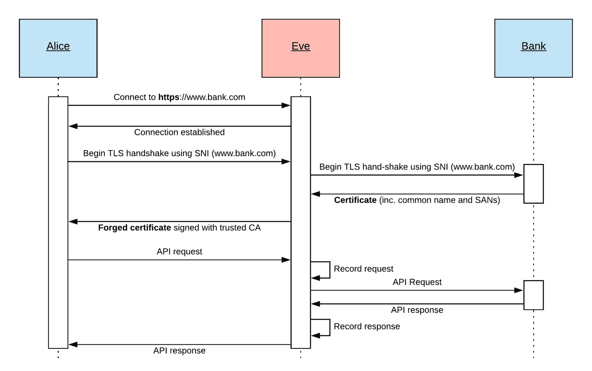
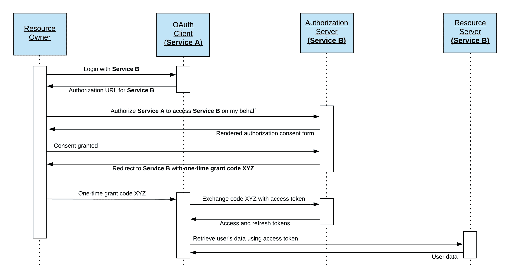
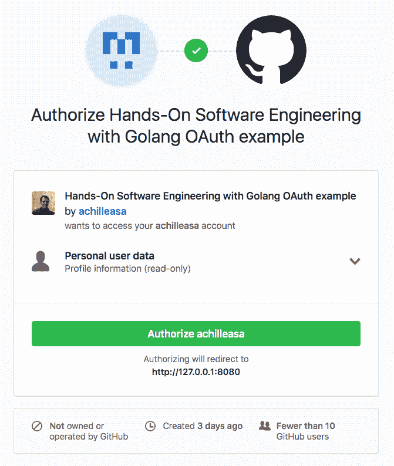

# 与外部世界通信

"一个不可理解的 API 是不可用的。"

- James Gosling

所有软件系统最终都需要与外部世界交换数据。在许多情况下，这是通过 API 实现的。本章提供了 REST 和 RPC 模式构建 API 的比较，并讨论了一些常见的 API 问题，如身份验证、版本控制和安全性。本章的其余部分将深入探讨 gRPC 生态系统，并以 Links 'R' Us 项目的 gRPC 基础 API 实现作为结尾。

本章将涵盖以下主题：

+   RESTful API 的基本原理

+   保护 API 的策略和应避免的陷阱

+   API 版本化的方法

+   gRPC 作为构建高性能服务的替代方案

+   使用协议缓冲定义语言描述消息和 RPC 服务

+   不同的 RPC 模式（单一、客户端、服务器流和双向流）

+   锁定 gRPC API

# 技术要求

本章讨论的主题的完整代码已发布到本书的 GitHub 仓库中的 `Chapter09` 文件夹。

您可以通过将网络浏览器指向以下 URL 来访问本书的 GitHub 仓库，其中包含本书各章节的代码和所有必需的资源：[`github.com/PacktPublishing/Hands-On-Software-Engineering-with-Golang`](https://github.com/PacktPublishing/Hands-On-Software-Engineering-with-Golang)。

为了让您尽快开始，每个示例项目都包含一个 Makefile，它定义了以下目标集：

| **Makefile 目标** | **描述** |
| --- | --- |
| deps | 安装所有必需的依赖项 |
| test | 运行所有测试并报告覆盖率 |
| lint | 检查 lint 错误 |

与本书中的其他所有章节一样，您需要一个相当新的 Go 版本，您可以在 [`golang.org/dl`](https://golang.org/dl) 下载。

# 设计健壮、安全且向后兼容的 REST API

每当工程师听到 API 一词时，**REST**（表示性状态转移的缩写）无疑是首先想到的词语之一。确实，人们日常使用的绝大多数在线服务和应用程序都是使用 REST API 与后端服务器进行通信。

我们通常所说的 RESTful API 的普及并非偶然。REST 作为一种用于构建 Web 应用的架构风格，相较于如 **简单对象访问协议**（**SOAP**）等替代方案，提供了许多诱人的优势：

+   **交互简便性**：只需一个网络浏览器或 `curl` 这样的命令行工具即可与 REST 端点进行交互

+   大多数编程语言都内置了对执行 HTTP 请求的支持

+   拦截 HTTP 请求（例如，通过代理）并提供用于测试的预定义响应非常容易

+   由于 RESTful API 建立在 HTTP 之上，客户端（例如，网页浏览器）可以选择在本地缓存大型 HTTP GET 响应，查询远程服务器以确定缓存的数据是否已过时，需要刷新。

REST API 是围绕访问和修改资源的概念构建的。资源代表任何客户端可以操作的应用数据（例如，产品、用户、订单、文档集合等）。一个典型的 RESTful API 公开了一组端点，允许客户端**创建**、**读取**、**更新**和**删除**特定类型的资源。这些操作中的每一个都映射到一个 HTTP 动词，如下所示：

+   可以通过 POST 请求创建新资源

+   可以通过 GET 请求检索现有资源

+   可以通过 PUT 或 PATCH 请求完全或部分更新资源

+   可以通过 DELETE 请求删除资源

虽然 REST 架构没有规定用于向客户端交付数据的数据格式，但如今，JSON 已成为实现 REST API 的事实标准。这主要归因于它轻量级、易于阅读和压缩。尽管如此，您仍然可以在一些组织中找到（例如银行和支付网关是典型例子）提供 RESTful API 的组织，这些 API 期望并生成 XML 有效负载。

# 使用人类可读的路径为 RESTful 资源命名

其中一个关键思想，并且是客户端在与 RESTful API 打交道时通常会期望的，是每个资源实例都可以通过**统一资源标识符**（**URI**）单独寻址。由于 URI 的格式在向将使用该 API 的客户端传达 API 的资源模型方面起着重要作用，因此软件工程师在设计新 API 或向现有 API 引入新资源类型时，应始终努力制定一致的 URI 命名方案。

以下是一组关于资源命名的有见地的约定，可以帮助您设计出对最终用户来说更容易理解和操作的 API：

+   资源名称必须始终是名词，而不是动词或动词类表达。动词可以用作后缀，以指示对特定资源要执行的操作。例如，`/basket/checkout`触发了当前用户购物车的结账流程。

+   作为对之前提到的指南的例外，与 CRUD 操作相关的动词不应包含在资源 URI 中；它们可以通过执行请求时使用的 HTTP 动词推断出来。换句话说，与其使用如`/users/123/delete`这样的 URI 来删除用户，客户端应通过向`/users/123`发送 HTTP **DELETE** 请求来代替。

+   当通过名称指代特定资源实例时，必须使用单数名词。例如，`/user/account` 返回当前登录用户的账户详情。虽然使用单数名词模式来指代集合中的特定项（例如，`/user/123`）可能很有吸引力，但建议避免这种做法，因为它往往会为 CRUD 操作创建不一致的路径。

+   当指代资源集合或集合中的特定资源实例时，必须使用复数名词。例如，`order/123/items` 会返回 ID 为 `123` 的订单中的项目列表，而 `/users/789` 会返回 ID 为 `789` 的用户的信息。

+   避免将尾部斜杠 (/) 添加到 URI 的末尾。这样做不会向客户端提供任何额外信息，并可能导致混淆；也就是说，该 URI 是完整的还是缺少其路径的一部分？

+   RFC3986 ^([6]) 定义 URIs 为大小写敏感。因此，为了保持一致性，坚持使用小写字母作为 URI 路径是一个好习惯。更重要的是，使用连字符 (-) 分隔长路径段往往可以使路径更容易阅读。可以说，`/archived-resource` 比较容易阅读，而 `/archivedresource` 则不然。

以下表格总结了执行 CRUD 操作的 HTTP 动词和 URI 模式组合，针对产品集合。与 `products` 资源一起工作的 HTTP 动词和资源路径如下：

| **HTTP 动词** | **路径** | **期望 (JSON)** | **返回 (JSON)** | **HTTP 状态** | **描述** |
| --- | --- | --- | --- | --- | --- |
| POST | `/products` | 产品条目 | 包含其 ID 的新产品条目 | 200 (成功) 或 201 (已创建) | 创建新产品 |
| GET | `/products` | 无 | 包含产品条目的数组 | 200 (成功) | 获取产品列表 |
| GET | `/products/:id` | 无 | 指定 ID 的产品 | 200 (成功) 或 404 (未找到) | 通过 ID 获取产品 |
| PUT | `/products/:id` | 产品条目 | 更新的产品条目 | 200 (成功) 或 404 (未找到) | 通过 ID 更新产品 |
| PATCH | `/products/:id` | 部分产品条目 | 更新的产品条目 | 200 (成功) 或 404 (未找到) | 通过 ID 更新产品单个字段 |
| DELETE | `/products/:id` | 无 | 无 | 200 (成功) 或 404 (未找到) | 通过 ID 删除产品 |

如您可能推测的那样，上述模式也可以用于处理形成层次结构的资源。例如，要检索分配给 ID 为 `123` 的用户在 ID 为 `789` 的安全组中的权限集合，可以使用 `/security-groups/789/users/123/permissions` 作为路径。在这个例子中，使用正斜杠分隔安全组和用户资源表明它们之间存在层次关系。

# 控制对 API 端点的访问

在定义了用于引用资源的端点之后，下一步合乎逻辑的步骤是实现强制访问控制的机制。例如，虽然`/orders/123`和`orders/789`都是有效的资源路径，但它们可能属于不同的用户；显然，我们期望每个用户只能访问他们自己的订单。

在不同的场景中，用户可能能够通过向`/security-groups/123/users`执行 GET 请求来列出属于特定安全组的用户，但只有管理员才能添加或从该组中删除用户（例如，通过向同一端点执行 POST 和 DELETE 请求）。实现这种细粒度资源访问的相当常见模式是**基于角色的访问控制**（**RBAC**）。

为了应用这个模式，我们需要定义一个角色列表（例如，普通用户、管理员等），并将每个角色与一组访问权限相关联。系统中的每个用户都被分配到一个或多个角色，系统在考虑是否应该授予特定资源的访问权限时会参考这些角色。

在我们继续实施 RBAC 之前，我们需要建立一个机制来在用户尝试访问非公开 API 端点之前进行用户认证。

许多人倾向于混淆“认证”和“授权”这两个术语，实际上它们不能互换使用。

为了避免任何混淆，让我们花点时间正确地定义这两个术语：

+   **认证**：这证明了特定实体（例如，发起 API 请求的客户端）通过提供某种形式的凭证来证明其身份。这就像在机场安检时出示护照一样。

+   **授权**：这证明了实体有权访问特定资源。例如，地铁票让你无需透露身份就能进入火车站台。

在接下来的两个部分中，我们将探讨两种处理认证的流行方法，即通过 TLS 进行的基本 HTTP 认证和通过**OAuth2**向外部服务提供商进行授权。

# 基本 HTTP 认证

基本 HTTP 认证可能是为任何 API 实现认证层最简单和最直接的方法。每个客户端都提供用户名和密码元组或 API 密钥。后者通常更受欢迎，因为它允许应用程序开发者生成多个与同一用户账户相关联的访问密钥，这些密钥可以独立管理、计量，甚至在需要时可以撤销。

当客户端需要执行认证的 API 请求时，他们必须对他们的访问凭证进行编码，并通过标准 HTTP 授权头将其附加到发出的请求中。客户端按照以下方式构建头字段的内容：

1.  使用冒号分隔符连接用户名和密码。因此，如果用户名是`foo`，密码是`bar`，则连接的结果将是`foo:bar`。另一方面，如果客户端只提供了一个 API 密钥，他们需要将其用作用户名，并与一个空白密码连接。换句话说，如果 API 密钥是`abcdefg`，则连接的结果将是`abcdefg:`。

1.  连接的凭据随后被 base64 编码。对于之前提到的用户名和密码场景，`foo:bar`的编码输出为`Zm9vOmJhcg==`。

1.  将授权方法（基本）后跟一个空格字符添加到编码凭据之前，以生成最终的标头值，即`Authorization: Basic Zm9vOmJhcg==`。

这种方法的明显缺点是客户端的凭据以明文形式通过网络传输。因此，为了避免凭据泄露，API 请求需要通过安全通道传输。原则上，这是通过在客户端和服务器之间建立 TLS 会话来实现的。

# 保护 TLS 连接免受窃听

还需要注意的是，虽然 TLS 会话确实为数据交换提供了一个安全通道，但 TLS 加密并不是万能的；恶意对手仍然可以通过使用代理执行**中间人**（**MITM**）攻击来拦截和解码 TLS 流量：



图 1：使用中间人攻击拦截 TLS 流量

上述图示说明了**爱丽丝**使用她的手机上的银行应用程序查询其银行账户余额的场景。**爱娃**是一个试图拦截运行在**爱丽丝**手机上的应用程序和银行后端服务器之间 API 调用的恶意行为者。

为了实现这一点，**爱娃**需要安装一个中间人代理，该代理将拦截并记录从**爱丽丝**手机发出的连接请求，并将它们代理到目标服务器或返回虚假响应。然而，正如我们之前提到的，银行的服务器使用基于 TLS 的加密，因此银行应用程序不会完成 TLS 握手步骤，除非服务器为银行的域名提供了有效的 TLS 证书。

为了使中间人攻击成功，代理服务器需要能够向**爱丽丝**提供伪造的 TLS 证书，这些证书不仅与银行的域名匹配，而且是由预安装在**爱丽丝**手机上的全球受信任的**证书授权机构**（**CA**）之一签发的。

由于**爱娃**无法访问任何全球 CA 的私钥，伪造证书的前提是**爱娃**需要在**爱丽丝**的手机上安装一个自定义证书授权机构。这可以通过利用社会工程学中的安全漏洞或简单地强迫**爱丽丝**这样做来实现，如果**爱娃**是一个国家行为者的话。

在**爱娃**的 CA 证书就位的情况下，拦截过程如下：

1.  **爱丽丝**试图连接到一个网站，例如，`https://www.bank.com`。

1.  **伊芙**拦截请求并与**爱丽丝**建立 TCP 套接字。

1.  **爱丽丝**启动 TLS 握手。握手头包括一个**服务器名称指示**（**SNI**）条目，该条目指示它试图到达的域名。

1.  **伊芙**打开到真实`https://www.bank.com`服务器的连接，并启动 TLS 握手，确保传递与**爱丽丝**相同的 SNI 条目。

1.  银行服务器响应其 TLS 证书，该证书还包括有关服务器**通用名称**（**CN**）的信息，在这种情况下，通常会是`www.bank.com`或`bank.com`。证书还可能包括一个**主题备用名称**（**SAN**）条目，该条目列出了由同一证书保护的其他域名。

1.  **伊芙**伪造一个新的 TLS 证书，该证书与银行的 TLS 证书中的信息相匹配，并使用安装在**爱丽丝**手机上的自定义 CA 证书的私钥进行签名。伪造的证书返回给**爱丽丝**。

1.  **爱丽丝**成功验证了伪造的 TLS 证书，即它具有正确的 SNI，并且其父证书链可以完全追溯到受信任的根 CA。此时，**爱丽丝**完成 TLS 握手，并向银行 API 发送 API 请求，其中包含她的访问凭证。

1.  **爱丽丝**的请求使用伪造的 TLS 证书进行加密。**伊芙**解密请求并记录下来。作为代理，她打开到真实银行服务器的连接，并将**爱丽丝**的请求发送过去。

1.  **伊芙**记录来自银行服务器的响应并将其发送回**爱丽丝**。

既然我们已经完全了解中间人攻击可能造成的潜在损害程度，我们实际上可以采取哪些步骤来使我们的 API 更具抗攻击性？缓解伪造 TLS 证书问题的一种方法是通过使用称为公钥固定（public key pinning）的技术。

每次我们为我们的应用程序发布新的客户端时，我们都会嵌入与用于保护 API 网关的 TLS 证书相对应的公钥指纹。完成 TLS 握手后，客户端计算由服务器提供的证书的公钥指纹，并将其与嵌入的值进行比较。如果检测到不匹配，客户端将立即终止连接尝试，并通知用户可能正在进行中间人攻击。

现在，让我们看看我们如何在 Go 应用程序中实现公钥固定。以下示例的完整源代码可在本书 GitHub 存储库的 `Chapter09/pincert/dialer` 包中找到。Go 的 `http.Transport` 类型是一个低级原语，由 `http.Client` 用于执行 HTTP 和 HTTPS 请求。在创建新的 `http.Transport` 实例时，我们可以用自定义函数覆盖其 `DialTLS` 字段，该函数将在需要建立新的 TLS 连接时被调用。这似乎是实施公钥指纹验证逻辑的完美位置。

如下代码所示，`WithPinnedCertVerification` 辅助函数返回一个拨号器函数，该函数可以被分配给 `http.Transport` 的 `DialTLS` 字段：

```go
func WithPinnedCertVerification(pkFingerprint []byte, tlsConfig *tls.Config) TLSDialer {
    return func(network, addr string) (net.Conn, error) {
       conn, err := tls.Dial(network, addr, tlsConfig)
        if err != nil {
            return nil, err
        }
        if err := verifyPinnedCert(pkFingerprint, conn.ConnectionState().PeerCertificates); err != nil { _ = conn.Close()
            return nil, err
        }
        return conn, nil
    }
}
```

返回的拨号器通过调用 `tls.Dial` 函数并传入调用者提供的网络、目标地址和 `tls.Config` 参数作为参数来尝试建立 TLS 连接。请注意，`tls.Dial` 调用还将自动为我们处理远程服务器提供的 TLS 证书链的验证。在成功建立 TLS 连接后，拨号器将验证固定证书的任务委托给 `verifyPinnedCert` 辅助函数，如下面的代码片段所示：

```go
func verifyPinnedCert(pkFingerprint []byte, peerCerts []*x509.Certificate) error {
    for _, cert := range peerCerts {
        certDER, err := x509.MarshalPKIXPublicKey(cert.PublicKey)
        if err != nil {
            return xerrors.Errorf("unable to serialize certificate public key: %w", err)
        }
        fingerprint := sha256.Sum256(certDER)

        // Matched cert PK fingerprint to the one provided.
        if bytes.Equal(fingerprint[:], pkFingerprint) {
            return nil
        }
    }
    return xerrors.Errorf("remote server presented a certificate which does not match the provided fingerprint")
}
```

`verifyPinnedCert` 实现会遍历远程服务器提供的 X509 证书列表，并为每个证书的公钥计算 SHA256 哈希。然后，每个计算出的指纹与固定证书的指纹进行比较。如果找到匹配项，则 `verifyPinnedCert` 无错误返回，并且可以安全地使用 TLS 连接进行 API 调用。另一方面，如果没有找到匹配项，将返回错误。在后一种情况下，拨号器将终止连接并将错误传播回调用者。

使用此拨号器提高您的 API 客户端的安全性相当简单。您需要做的就是创建自己的 `http.Client` 实例，如下所示：

```go
client := &http.Client{
    Transport: &http.Transport{
        DialTLS: dialer.WithPinnedCertVerification(
            fingerprint, 
            new(tls.Config),
        ),
    },
}
```

您现在可以使用此客户端实例执行 HTTPS 请求到您的后端服务器，就像您通常所做的那样，但增加了额外的优势，即您的代码现在可以检测到中间人攻击尝试。使用此拨号器执行公钥固定的一个完整端到端示例可以在本书 GitHub 存储库的 `Chapter09/pincert` 包中找到。

# 使用 OAuth2 认证到外部服务提供商

OAuth 是一个开放标准，用于授权，最初作为替代我们在上一节中检查的基本身份验证模式的提议。

OAuth 被设计用来解决以下问题：假设我们有两个服务，A 和 B，它们通常彼此无关。作为服务 A 的终端用户，我们希望授予它访问由服务 B 托管的一些个人数据的权限。然而，我们不想泄露我们的凭证，以便我们可以从服务 A 访问服务 B。

使用 OAuth 的常见用例如下：

+   使用第三方服务作为**单点登录（SSO**）提供商，而不是为每个我们感兴趣使用的服务创建单独的账户。当你尝试登录在线服务时，常见的带有*X*按钮的登录方式就是这种模式的例子。此外，SSO 提供商通常提供一个仪表板，用户可以检查他们已授予访问权限的服务列表，并在任何时间点撤销他们的访问权限。

+   允许一个服务代表特定用户使用另一个服务的 API。例如，用户可以使用 GitHub 账户登录到**持续集成（CI**）服务，并允许 CI 服务使用 GitHub 的 API 查询用户的仓库或设置 webhooks，当创建 pull 请求时触发 CI 运行。

那么，在底层它是如何工作的，我们如何将 OAuth 框架集成到我们的 Go 应用程序中呢？在本节的剩余部分，我们将重点关注三腿 OAuth2 流程，它可以促进应用程序之间在无需共享用户凭证的情况下进行数据交换。

三腿 OAuth2 流程涉及以下四个方面：

+   **资源所有者**：这是想要将托管在服务 B 上的数据访问权限授予服务 A 的用户，而不共享他们的凭证。

+   **OAuth 客户端**：在我们的场景中，服务 A 想要利用服务 B 提供的 API 来获取用户数据或代表用户执行某些操作。

+   **资源服务器**：在我们的场景中，服务 B 托管了服务 A 试图访问的用户数据。

+   **授权服务器**：这是服务 B 的一部分，并作为此特定 OAuth 流程中的关键组件。它生成适当的访问令牌集，允许服务 A 访问服务 B 托管的特定子集的用户数据。

以下图表说明了三腿 OAuth2 流程：



图 2：三腿 OAuth2 流程的步骤

为了使服务 A 能够触发三腿 OAuth2 流程，它需要在服务 B 的授权服务器上进行注册。注册后，服务 A 将被分配一个唯一的客户端 ID 和客户端密钥令牌。客户端 ID 是一个公共令牌，允许授权服务器识别需要访问的应用程序。另一方面，客户端密钥是私有的，并在 OAuth 客户端需要联系授权服务器时用于验证 OAuth 客户端。

让我们来看看三腿 OAuth2 流程中发生了什么：

1.  用户访问服务 A 的网站并点击“使用 B 登录”按钮。

1.  服务 A 的后端服务器配置了服务 B 的授权服务器的 API 端点。它向用户返回一个包含以下信息的授权 URL：

    +   授权服务器用于识别请求访问的服务客户端 ID 令牌

    +   需要授予服务 A 的一组细粒度访问权限（授权）

    +   一个由服务 A 托管并将在用户同意提供访问权限后由授权服务器重定向到该 URL 的 URL

    +   一个 nonce 值，它将用作授权请求的唯一标识符

1.  用户使用他们的网络浏览器访问授权 URL。

1.  授权服务器渲染一个同意页面，提供有关需要访问用户数据的应用程序的详细信息（名称、作者等），以及可以请求的授权类型的描述。

以下截图显示了授权访问用户 GitHub 账户的示例同意页面：



图 3：授予访问用户 GitHub 账户的示例同意页面

1.  一旦用户审查并授权服务 A 请求的权限列表并授权它们，他们的网络浏览器将被重定向到在步骤 2 中生成的授权请求 URL 中包含的 URL。授权服务器向该 URL 附加两个额外的值——授权请求中的 nonce 值和访问代码。

1.  在收到访问代码并将传入的 nonce 值与授权请求中包含的值匹配后，OAuth 客户端联系服务器并尝试用获得的访问代码交换访问令牌。

1.  授权服务器返回两个令牌：一个短期的访问令牌，可用于访问资源服务器上的数据，以及一个长期的刷新令牌，OAuth 客户端可以使用它来刷新过期的访问令牌。

1.  OAuth 客户端联系资源服务器并使用访问令牌获取所需数据。

与我们之前讨论的基本认证机制类似，所有发送到资源服务器的请求都包含一个 HTTP 授权头，客户端用获得的访问令牌填充该头。唯一的区别是，这次客户端指定`bearer`作为授权方法，即传输的头部看起来像`Authorization: Bearer ACCESS_TOKEN`。

幸运的是，我们应用中实现三脚 OAuth 流程所需的大部分管道代码已经由`golang.org/x/oauth2`包提供。我们所需做的只是实现我们在第 5 步中描述的重定向处理逻辑。让我们首先创建一个名为`Flow`的新类型来封装我们的 OAuth 实现逻辑。`type`定义位于`Chapter09/oauthflow/auth`包中，并包含以下一系列字段：

```go
type Flow struct {
    cfg oauth2.Config

    mu sync.Mutex
    srvListener net.Listener
    pendingRequests map[string]chan Result
}
```

`cfg`字段持有`oauth2.Config`值，它描述了 OAuth 提供者的端点：

+   授权请求

+   获取访问令牌

+   当访问令牌过期时刷新访问令牌

`srvListener`字段存储了`net.Listener`实例，这是我们实现将监听 OAuth 重定向的地址，而`pendingRequests`映射跟踪所有当前正在进行的授权尝试。一个`sync.Mutex`保护对这两个变量的访问，并确保我们的实现是线程安全的。

要使用我们的包，用户必须通过调用`NewOAuthFlow`构造函数来创建一个新的`Flow`实例，其实现如下代码片段所示：

```go
func NewOAuthFlow(cfg oauth2.Config, callbackListenAddr, redirectHost string) (*Flow, error) {
 if callbackListenAddr == "" {
 callbackListenAddr = "127.0.0.1:8080"
 }
 l, err := net.Listen("tcp", callbackListenAddr)
 if err != nil {
 return nil, xerrors.Errorf("cannot create listener for handling OAuth redirects: %w", err)
 }
 if redirectHost == "" {
 redirectHost = l.Addr().String()
 }

 cfg.RedirectURL = fmt.Sprintf("http://%s/oauth/redirect", redirectHost)
 f := &Flow{srvListener: l, cfg: cfg, pendingRequests: make(map[string]chan Result)}

 mux := http.NewServeMux()
 mux.HandleFunc(redirectPath, f.handleAuthRedirect)
 go func() { _ = http.Serve(l, mux) }()
 return f, nil
}
```

构造函数期望三个参数：

+   用户希望对其进行身份验证的提供者的`oauth2.Config`实例。

+   一个本地地址，以便它可以监听传入的重定向请求。如果没有指定，实现将绑定到默认地址，`127.0.0.1:8080`。

+   一个作为三脚 OAuth 流程一部分发送到远程服务器的重定向 URL。如果没有指定，实现将使用监听器绑定的地址。

你可能想知道为什么用户需要指定监听地址和重定向 URL。当我们在本地上测试我们的应用程序时，这两个值始终相同。事实上，我们可以将这两个参数都留空，我们的应用程序将使用默认值正常工作！

在这个场景中，一旦我们登录到远程服务，OAuth 服务器将重定向我们的浏览器到一个回环地址，只要它运行在与我们的 OAuth 重定向监听器相同的机器上，浏览器就可以成功连接。

在生产部署中，我们的代码将在由云提供商托管的独立虚拟机上运行。虽然我们的 OAuth 处理代码仍然会监听回环地址，但用户的浏览器只能通过具有公共 IP 地址的负载均衡器连接到它。在这种情况下，使三脚 OAuth 流程正确工作的唯一方法是提供一个重定向 URL，其 DNS 记录解析为外部负载均衡器的 IP 地址。

回到构造函数实现，我们首先需要做的是将一个新的 `net.Listener` 绑定到请求的地址，并填充 `redirectHost` 参数的值（如果尚未指定）。接下来，我们覆盖用户提供的 OAuth 配置对象的 `RedirectURL` 字段，将其替换为通过连接 `redirectHost` 参数值和一个已知的静态路径（在这个例子中是 `/oauth/redirect`）生成的 URL。在返回新分配的 `Flow` 实例之前，代码启动一个 go-routine 并启动一个 HTTP 服务器，用于处理来自远程授权服务器的传入重定向。

获得一个新的 `Flow` 实例后，用户可以通过调用其 `Authenticate` 方法来触发一个三脚 OAuth 流程，其源代码如下所示：

```go
func (f *Flow) Authenticate() (string, <-chan Result, error) {
    nonce, err := genNonce(16)
    if err != nil {
        return "", nil, err
    }

    authURL := f.cfg.AuthCodeURL(nonce, oauth2.AccessTypeOffline)
    resCh := make(chan Result, 1)
    f.mu.Lock()
    f.pendingRequests[nonce] = resCh
    f.mu.Unlock()

    return authURL, resCh, nil
}
```

从前面的代码片段中，为了区分并发认证请求，`Authenticate` 方法生成一个唯一的 nonce 值，并将其与每个挂起的请求关联起来。然后，生成的 nonce 被传递到 OAuth 配置的 `AuthCodeURL` 方法，以生成一个授权 URL（指向远程服务），在那里最终用户可以使用他们的网络浏览器登录并同意我们应用程序请求的授权。

OAuth 流程的剩余步骤是异步进行的。为此，代码分配了一个缓冲的 `Result` 通道，将其追加到 `pendingRequests` 映射中，同时使用生成的 nonce 作为键，并将授权 URL 和结果通道返回给调用者。然后，应用程序必须将最终用户的浏览器重定向到生成的 URL，并阻塞，直到可以从返回的通道中读取到 `Result` 实例。

`Result` 类型封装了授权尝试的结果，并定义如下：

```go
type Result struct {
    authErr error
    authCode string
    cfg *oauth2.Config
}
```

一旦用户完成授权过程，远程 OAuth 服务器将他们的浏览器重定向到我们在 `Flow` 类型构造函数中启动的 HTTP 服务器。接下来，我们将检查 `handleAuthRedirect` HTTP 处理器的实现。

在以下代码片段中，`r` 变量指的是一个 `http.Request` 实例，而 `w` 变量指的是一个 `http.ResponseWriter` 实例。

HTTP 处理器的第一个任务是解析和验证授权服务器通过以下代码块发送给我们的参数：

```go
if err := r.ParseForm(); err != nil {
    w.WriteHeader(http.StatusBadRequest)
    return
}

nonce := r.FormValue("state")
code := r.FormValue("code")
```

`http.Request` 对象的 `ParseForm` 方法非常灵活，因为它能够从 URL（如果这是一个 **GET** 请求）和 HTTP 请求体（如果这是一个 **POST** 请求）中解码参数。如果没有错误返回，我们使用方便的 `FormValue` 方法提取 `state` 参数，它包含我们嵌入初始授权请求 URL 中的 nonce 值，以及 `code` 值，它包含授权服务器返回的访问代码。

接下来，处理器获取锁并使用提供的 nonce 值索引`pendingRequests`映射，试图查找待处理请求的结果通道。如果没有找到匹配项，我们将打印出一个简单的警告信息，该信息将被显示在用户的浏览器中，并退出处理器。否则，我们将从映射中移除待处理的结果通道，并向其发布一个`Result`实例。以下代码块展示了上述步骤是如何实现的：

```go
f.mu.Lock()
resCh, exists := f.pendingRequests[nonce]
if !exists {
    f.mu.Unlock()
    _, _ = fmt.Fprint(w, unknownNonce)
    return
}
delete(f.pendingRequests, nonce)
f.mu.Unlock()

resCh <- Result{ authCode: code, cfg: &f.cfg }
close(resCh)

_, _ = fmt.Fprint(w, successMsg)
```

一旦 HTTP 处理器将`Result`值写入通道，等待该通道的应用程序将解除阻塞，并可以调用结果对象的`Client`方法以获取一个`http.Client`实例，从而可以对远程服务进行认证调用。返回的`http.Client`实例被特别配置为自动将获取的访问令牌注入所有发出的请求，并在其过期时透明地刷新它。此方法的完整实现概述在以下代码片段中：

```go
func (ar *Result) Client(ctx context.Context) (*http.Client, error) {
    if ar.authErr != nil {
        return nil, ar.authErr
    }

    token, err := ar.cfg.Exchange(ctx, ar.authCode)
    if err != nil {
        return nil, xerrors.Errorf("unable to exchange authentication code with OAuth token: %w", err)
    }

    return ar.cfg.Client(ctx, token), nil
}
```

如前述代码片段所示，我们通过将授权服务器发送回的短期认证代码与长期访问令牌进行交换来完成三重认证流程。最后，我们将`OAuth`访问令牌传递给存储的`oauth2.Config`值的同名`Client`方法，以创建一个具有令牌意识的`http.Client`实例，然后将其返回给调用者。

要了解拼图中所有部件是如何组合在一起的，您可以查看本书 GitHub 仓库中的`Chapter09/oauthflow`包。它包含了一个使用本节代码获取对 GitHub API 的访问权限并打印出用户登录名的简单 CLI 应用程序的完整、端到端示例。

# 处理 API 版本

一旦某个特定服务的公共 API 发布并第三方开始使用它，API 开发者需要非常小心，以避免引入任何可能导致第三方应用程序停止工作的更改。

假设我们正在构建一个类似于 PayPal、Stripe 或 Adyen 的支付处理器。此类服务的核心业务价值主张是提供一个稳固且易于使用的 API 来处理支付。为此，我们预计会有数百或数千个应用程序实例（电子商务网站、定期订阅服务等）紧密耦合到我们的支付处理器的公共 API。

引入新的 API 端点将是一个相对简单的工作；毕竟，依赖于该服务 API 的所有应用程序都不会使用新的端点，所以我们实际上无法破坏任何东西。另一方面，更改现有或删除旧的 API 端点不能在没有提前通知我们 API 的所有用户的情况下完成。

由于每个应用程序集成商的进度不同，这个问题变得更加复杂；有些人可能在相对较短的时间内更新他们的应用程序，而其他人可能需要数月时间才能推出更新。同样，应用程序集成商也可能倒闭，导致最终用户没有渠道接收已部署应用程序实例的更新。

那么，如果我们完全控制服务器和客户端会怎样？如果我们正在构建一个移动应用程序并选择使用专有 API 与后端服务器通信，那么引入破坏性更改是否会更简单？答案是仍然不会！为了弄清楚为什么是这样，让我们假设我们是负责运行叫车应用程序的运营商。

我们可以利用的一种策略是将我们的移动应用程序与内置的强制更新机制一起发布。当应用程序启动时，它可以联系我们的 API 服务器并检查在继续之前是否必须安装更新。如果确实如此，应用程序可以不断提醒用户，直到他们同意更新。这肯定有效...除非，当然，我们的用户在周六晚上站在倾盆大雨中，拼命地想要叫一辆出租车。

在这种情况下，显示“请升级应用程序以继续”的消息无疑是糟糕的用户体验的标志，可能会触发许多用户立即切换到竞争对手的应用程序。此外，我们的一些用户可能是较老手机型号的拥有者，无法升级到我们应用程序的新版本，因为它们运行在较旧的硬件上，或者因为手机制造商撤销了用于签名不再支持的操作系统版本的密钥。

事后看来，API 的演变是不可避免的。因此，我们需要为 RESTful API 制定某种版本控制机制，这样我们就可以在引入破坏性更改的同时，仍然能够处理来自旧版 API 客户端的请求。

# 将 API 版本作为路由前缀包含在内

实施 API 版本控制最流行的方法是客户端将请求的 API 版本作为请求 API 端点路径的一部分。例如，`/v1/account`和`/v2/account`是用于检索用户账户详情的版本化端点。然而，当`/account`端点在`v2`前缀下挂载时，可能返回的负载与在`v1`前缀下挂载时的负载完全不同。

版本命名方案的选择完全是任意的，由 API 设计者决定。常见的版本控制方案包括以下几种：

+   数字值；例如，`v4`

+   API 发布日期；例如，`20200101`

+   与新 API 发布同步的季节名称；例如，`spring2020`

重要的是要意识到，这种特定的版本化方法违反了 URI 应引用唯一资源的原则。显然，在前面的例子中，`/v1/account`和`/v2/account`都引用了同一资源。更重要的是，这种方法的一个局限性是我们无法对单个 API 端点进行版本控制。

# 通过 HTTP Accept 头协商 API 版本

如果我们假设 API 服务器始终支持最新的 API 版本，那么作为路由部分版本的这种方法是可行的。在这种情况下，客户端可以简单地选择它可以工作的最高版本，而无需担心 API 托管的服务器。如果这个假设不成立怎么办？

假设我们正在开发一个用户可以下载并部署到他们自己的基础设施上的聊天服务器。除了聊天服务器包之外，我们还开发和维护官方客户端以连接到聊天服务器。聊天服务器公开了一个具有`/messages/:channel`路径的 API 端点，客户端可以调用它以获取特定通道的消息列表。

在 API 的版本 1 中，每个返回的消息包含两个字段：发送消息的用户名称和消息本身。在 API 的版本 2 中，消息有效负载增加了两个额外的字段，即时间戳和用户头像图片的链接。

由于最终部署的服务器版本由终端用户控制，连接到服务器的客户端无法知道它们可以安全使用哪个 API 版本。诚然，我们可以提供一个专门的 API 端点，客户端可以使用它来查询服务器版本，然后根据服务器的响应选择 API 版本。然而，这种方法并不真正优雅，如果我们只想对特定端点进行版本控制而不是整个 API，那么这种方法实际上是无法扩展的。

显然，我们需要引入一种协商协议，允许客户端和服务器选择双方都理解的**最大**共同支持的 API 版本。事实上，HTTP 协议已经内置了这样的功能。

客户端在调用`/messages/:channel`端点时，可以使用 HTTP Accept 头指定它支持的 API 版本。Accept 头的内 容必须遵循 RFC6838 中定义的媒体类型规范格式^([9])。对于基于 JSON 的 API，通常使用`application/vnd.apiVersion+json`模板。

`vnd` 部分表示一个供应商特定的媒体类型。`apiVersion` 部分用于指定支持的版本号，而 `+json` 部分表示客户端期望服务器返回一个格式良好的 JSON 文档。媒体类型语法还允许客户端以逗号分隔的列表形式指定多个媒体类型。对于我们目前正在讨论的场景，一个支持两个 API 版本但更喜欢使用 API 版本 2 的客户端将使用值 `application/vnd.v2+json,application/vnd.v1+json` 来填充头信息。

服务器解析头信息值，定位最高支持的 API 版本，并将请求路由到该版本或在没有支持任何提议的客户端 API 版本时返回错误。当向客户端发送有效载荷时，服务器将 `Content-Type` 头的值设置为指示实际用于处理请求的 API 版本。客户端解析这些信息并使用它来正确地反序列化和处理响应有效载荷。

# 在 Go 中构建 RESTful API

现在，在 Go 中构建 RESTful API 是一个相当流畅的过程。如果你不介意一点点的辛苦（例如，使用正则表达式手动从请求路径中提取参数），你可以利用 Go 标准库中提供的 `http.Mux` 组件的功能来构建自己的 HTTP 路由器。

虽然从头开始构建自己的路由器无疑会是一个极好的学习经历，但你可能应该节省相当多的时间（和精力），并简单地使用一些流行的、经过实战考验的路由器包，例如 gorilla-mux ^([5]) 或 HttpRouter ^([3])。

另一方面，如果你喜欢完整的 Web 框架（将路由器、中间件以及可能是一个 ORM 合并到一个包中），你将会非常惊讶地发现有很多选择！基于 GitHub 上星标数量的一个指示性列表，流行的 Web 框架包肯定包括 buffalo ^([1])、revel ^([4]) 和 gin-gonic ^([10])。

所有这些包都有一个共同点：它们都是建立在 net/http 包之上的。如果你碰巧正在构建可能接收大量（即，每个服务器超过一百万个请求）并发请求的 API，你可能会发现 net/http 包实际上成为了一个瓶颈，限制了你的 API 的吞吐量。

如果你发现自己处于这种困境中，并且不介意针对与 net/http 包提供的 API 稍有不同的一些 API 进行编程，你应该看看 fasthttp ^([8]) 包。

# 在 gRPC 的帮助下构建 RPC 基础的 API

gRPC^([2]) 是一个由 Google 创建的现代开源框架，旨在协助实现基于 **远程过程调用**（**RPC**）范式的 API 的过程。与更适合连接基于 Web 的客户端（如浏览器）到后端服务的 REST 架构相比，gRPC 被提出作为一种跨平台和跨语言的替代方案，用于构建低延迟和高可扩展的分布式系统。

你知道 gRPC 中的字母 g 代表什么吗？许多人自然认为它代表 Google，这是一个合理的假设，因为 gRPC 最初是由 Google 发布的。其他人认为 **gRPC** 是一个递归缩写词，即 **gRPC Remote Procedure Calls**。

有趣的是，这两种解释都是错误的！根据 GitHub 上的 gRPC 文档，随着每个新的 gRPC 版本的发布，字母 g 的含义都会发生变化^([11])。

虽然 gRPC 构建高性能 API 以连接微服务是其核心功能，正如我们将在以下章节中看到的，它也可以作为现有 REST API 的替代品使用。

# 将 gRPC 与 REST 进行比较

虽然 REST 作为构建 API 的架构提供了许多好处，但也附带了一些需要注意的事项。让我们更详细地探讨这些注意事项。

REST API 通常是在 HTTP/1.x 协议之上实现的，该协议缺乏对管理和重用连接的适当支持。因此，客户端每次想要调用 API 端点时，都必须与后端服务器建立一个新的 TCP 连接，并执行完整的 TLS 握手。这一要求不仅给 API 调用带来了额外的延迟，还增加了后端服务器（或者在边缘进行 TLS 终止的情况下，是负载均衡器）的负载，因为 TLS 握手伴随着相当大的计算成本。

为了减轻这一问题，HTTP/1.1 引入了 HTTP 管道化模型。在这种连接管理模式下，客户端向服务器打开一个单一的 TCP 套接字，并通过它发送一系列连续的请求。服务器处理这一系列请求，并发送回一系列与客户端发送的请求顺序相匹配的响应。这种模型的一个局限性是它只能应用于幂等请求（HEAD、GET、PUT 和 DELETE）。此外，它还容易受到首部阻塞的影响，即一个执行时间较长的请求将延迟同一批次中后续请求的处理。

另一方面，gRPC 是建立在 HTTP/2 之上的，它定义了一种新的连接管理模型，即多路复用流。使用这种模型，gRPC 可以支持在单个 TCP 连接上交错和传输的双向流。这种方法完全避免了首部阻塞问题，并允许服务器向客户端发送推送通知。

HTTP/1.x 协议的文本性质以及将 JSON 作为请求和响应的主要序列化格式，使得 RESTful API 在旨在最大化吞吐量的用例中过于冗长。虽然 JSON 负载确实可以被压缩（例如，使用 gzip），但我们无法达到与协议缓冲区相同的效率，协议缓冲区是 gRPC 用于紧凑地编码客户端和服务器之间交换的消息的二进制格式。

最后，RESTful API 不强制要求请求和响应负载具有特定的结构。正确解包 JSON 负载并将负载值强制转换为它们所写语言的正确类型取决于客户端和服务器。这种方法可能会导致错误，甚至更糟，数据损坏。

例如，如果服务器尝试将 64 位整数解包到 32 位整数变量中，如果原始值无法强制转换为 32 位，则值可能会被截断。另一方面，gRPC 使用强类型消息，无论客户端或服务器使用的编程语言如何，它总是将消息解包到正确的类型。

# 使用协议缓冲区定义消息

协议缓冲区是语言和平台中立的机制，以非常高效的方式序列化结构化数据。为了实现语言中立性，协议缓冲区使用高级 **接口定义语言**（**IDL**）描述消息和 RPC 服务。

要开始使用协议缓冲区，我们需要为我们的开发环境安装 protoc 编译器。您可以通过从源代码编译或从[`github.com/protocolbuffers/protobuf/releases`](https://github.com/protocolbuffers/protobuf/releases)为您的平台安装预构建的二进制发布版来完成此操作。

此外，您还需要通过执行以下命令来安装 protoc 编译器的 Go 输出生成器以及用于与协议缓冲区和 gRPC 框架一起工作的 Go 包：

```go
go get -u google.golang.org/grpc
go get -u github.com/golang/protobuf/protoc-gen-go
```

协议缓冲区消息定义通常位于具有 `.proto` 扩展名的文件中。它们由专门的工具处理，这些工具将定义编译成特定语言类型，我们可以使用这些类型来构建我们的应用程序。对于 Go，protoc 编译器通常如下调用：

```go
protoc --go_out=plugins=grpc:. -I. some-file.proto
```

`--go_out` 参数指示 protoc 编译器启用 Go 输出生成器。它期望一个以冒号字符结尾的逗号分隔的选项列表。在上面的例子中，选项列表包括一个用于启用 gRPC 插件的插件选项。冒号字符后面的参数指定了由编译器生成的任何文件的存储位置。在这里，我们将其设置为当前工作目录。

`-I` 参数可以用来指定编译器在解析包含指令时扫描的附加包含路径。在这个例子中，我们将当前工作目录添加到包含路径中。

最后，`protoc` 编译器的最后一个参数是要编译的 `.proto` 文件名。

# 定义消息

那么，协议缓冲消息定义看起来是什么样子呢？这里有一个简短的例子：

```go
syntax = "proto3";
package geocoding;

message Address {
  string query = 1;
  int32 page_number = 2;
  int32 result_per_page = 3;
}
```

在前面的定义中，第一行宣布了文件其余部分将要使用的协议缓冲格式版本，通知编译器。在这个例子中，我们使用的是版本 3，这是最新版本，也是任何新项目应该使用的版本。第二行定义了包名，它将被用作生成的协议缓冲定义的容器。正如你可能猜到的，使用包可以避免定义具有相同名称的消息的项目之间的冲突。

消息定义以 `message` 关键字开始，后面跟着消息名称和一系列（字段类型，字段名称）元组。协议缓冲编译器识别以下内置类型集 ^([7])：

| **.proto 类型** | **等效 Go 类型** | **注意事项** |
| --- | --- | --- |
| `double` | `float64` |  |
| `float` | `float32` |  |
| `int32` | `int32` | 使用可变长度编码 |
| `int64` | `int64` | 使用可变长度编码 |
| `uint32` | `uint32` | 使用可变长度编码 |
| `uint64` | `uint64` | 使用可变长度编码 |
| `sint32` | `int32` | 比使用 `int32` 更高效地存储负整数值 |
| `sint64` | `int64` | 比使用 `int64` 更高效地存储负整数值 |
| `fixed32` | `uint32` | 总是 4 个字节；对于大于 2²⁸ 的值，比 `uint32` 更高效 |
| `fixed64` | `uint64` | 总是 8 个字节；对于大于 2⁵⁶ 的值，比 `uint64` 更高效 |
| `sfixed32` | `int32` | 总是 4 个字节 |
| `sfixed64` | `int64` | 总是 8 个字节 |
| `bool` | `bool` |  |
| `string` | `string` |  |
| `bytes` | `[]byte` |  |

正如我们在前面的章节中提到的，协议缓冲尝试将消息编码成一个紧凑且空间高效的格式。为此，整数通常使用可变长度编码进行序列化。由于这种方法对于负值来说效果不佳，协议缓冲还定义了用于（主要是）负值的辅助类型（例如，`sint32` 和 `sint64`），它们以不同且更高效的方式进行编码。

当然，我们不仅限于使用内置类型。我们还可以将已定义的消息类型用作字段类型！实际上，这些定义甚至可能存在于一个单独的 `.proto` 文件中，我们可以通过以下方式包含它：

```go
import "google/protobuf/timestamp.proto";

message Record {
  bytes data = 1;
  google.protobuf.Timestamp created_at = 2;
}
```

协议缓冲的另一个有趣特性是枚举，它允许我们定义只能从固定、预定义值列表中分配值的字段。以下代码扩展了 `Address` 消息定义，以便它包括一个 `type` 字段，帮助我们识别地址类型：

```go
message Address {
  string query = 1;
  int32 page_number = 2;
  int32 result_per_page = 3;
  AddressType type = 4; // We can only assign an address type value to this field.
}

enum AddressType {
  UNKNOWN = 0;
  HOME = 1;
  BUSINESS = 2;
}
```

`enum`块定义了可以分配给新引入的类型字段的常量列表。需要记住的一个重要事项是，每个枚举列表必须包括一个映射到零值的常量作为其第一个元素。这作为字段的默认值。

# 版本化消息定义

协议缓冲区消息中的每个字段都被分配了一个唯一的 ID。最常见的模式是从 1 开始按增量分配 ID。当一个字段被序列化为线格式时，序列化器会发出一个包含有关字段类型、其大小（对于可变大小的字段）和其 ID 的小头信息。

接收器扫描头信息并检查具有该 ID 的字段是否存在于其本地消息定义中。如果是这样，字段值将从流反序列化到适当的字段。否则，接收器使用头中的信息来跳过它不认识的任何字段。

此功能非常重要，因为它构成了消息定义版本化的基础。由于消息定义会随着时间的推移而演变，可以添加新字段或重新排序现有字段，而不会破坏使用从较旧的 `.proto` 文件编译的消息的现有消费者。

# 表示集合

更重要的是，协议缓冲区还可以模拟两种类型的集合，即列表和映射。要创建一个项目列表，我们只需要将`repeated`关键字作为字段类型的开头即可。另一方面，映射使用特殊符号定义，即`map<K, V>`，其中`K`和`V`代表映射键和值的类型。以下是一个定义集合的示例片段：

```go
message User {
  string id = 1;
  string name = 2;
}

message Users {
  repeated User user_list = 1;
  map<string, User> user_by_id = 2;
}
```

当编译为 Go 代码时，`Users`消息的字段将被映射到`[]User`类型和`map[string]User`类型。

# 模型字段联合

许多类型的应用程序的一个常见需求是能够模拟联合。联合是一种特殊类型的值，它可以有多种表示形式，所有这些表示形式都指向内存中的同一位置。使用共享内存意味着每次我们将值写入特定的联合字段时，尝试读取其他联合字段之一都将导致数据混乱。

联合的概念很好地扩展到了协议缓冲区。如果你正在处理包含多个字段的消息，其中在任何给定时间最多只能设置一个字段，你可以通过将这些字段组合成一个联合来减少所需的内存量。

联合定义以`oneof`关键字开始，后跟字段名和组成联合的字段列表。以下是一个简单示例，演示了一个非常常见的 API 用例：

```go
message CreateAccountResponse {
  string correlation_id = 1;
  oneof payload {
    Account account = 2;
    Error error = 3;
  }
}
```

在这个示例中，所有响应都有一个相关的关联 ID 值。然而，根据 API 调用调用的结果，响应负载将包含一个`Account`或一个`Error`。

在编译上述消息定义之后，protoc 编译器将生成两个特殊类型，即 `CreateAccountResponse_Account` 和 `CreateAccountResponse_Error`，这些类型可以分配给 `CreateAccountResponse` 类型的 `Payload` 字段：

```go
type CreateAccountResponse_Account struct {
    Account *Account `protobuf:"bytes,1,opt,name=account,proto3,oneof"`
}

type CreateAccountResponse_Error struct {
    Error *Error `protobuf:"bytes,2,opt,name=error,proto3,oneof"`
}
```

为了防止其他类型分配给 `Payload` 字段，protoc 编译器使用了一个有趣的技巧：它定义了一个具有未导出虚拟方法的私有接口，并安排它只让前两个类型定义实现它：

```go
type isCreateAccountResponse_Payload interface {
    isCreateAccountResponse_Payload()
}

func (*CreateAccountResponse_Account) isCreateAccountResponse_Payload() {}
func (*CreateAccountResponse_Error) isCreateAccountResponse_Payload() {}
```

Protoc 编译器将前面代码片段中提到的接口指定为 `Payload` 字段的类型，因此将分配任何其他类型的字段视为编译时错误。此外，为了便于检索联合值，编译器还会在 `CreateAccountResponse` 类型上生成 `GetAccount` 和 `GetError` 辅助函数。这些辅助函数会查看 `Payload` 字段的内容，并返回分配的值（`Account` 或 `Error`），如果没有分配该类型的值，则返回 `nil`。

# `Any` 类型

在构建事件驱动系统时，一个常见的模式是定义一个顶层消息，该消息作为不同事件负载的封装。由于新的事件类型可能在任何时候添加（或删除），使用联合体显然是不够的。此外，以下是从事件消费者的角度出发的：

+   消费者可能使用比事件生产者更旧的 `.proto` 版本。他们遇到不知道如何解码的事件负载是完全可能的。

+   一些消费者可能只对处理事件的子集感兴趣。在这种情况下，消费者应该只解码他们关心的消息，并跳过所有其他消息。

为了应对这种情况，我们可以使用 `Any` 类型来定义我们的信封消息：

```go
import "google/protobuf/any.proto";

message Envelope {
  string id = 1;
  google.protobuf.Any payload = 2;
}
```

如其名所示，`Any` 类型可以存储任何协议缓冲区消息。内部，这是通过存储消息的序列化版本以及描述存储在其中的消息类型的字符串标识符来实现的。类型标识符的形式为 URL，它通过将 `type.googleapis.com/` 与消息名称连接起来构建。`ptypes` 包（您可以在 [www.github.com/golang/protobuf/ptypes](http://www.github.com/golang/protobuf/ptypes) 找到它）为处理 `Any` 消息提供了几个有用的辅助函数。

以下代码是填充 `Envelope` 实例的示例：

```go
func wrapInEnvelope(id string, payload proto.Message) (*Envelope, error) {
    any, err := ptypes.MarshalAny(payload)
    if err != nil {
        return nil, err
    }

    return &Envelope{
        Id: id,
        Payload: any,
    }, nil
}
```

`MarshalAny` 辅助函数接受任何实现 `proto.Message` 接口的价值并将其序列化为 `Any` 消息，然后我们将其分配给 `Envelope` 类型的 `Payload` 字段。

在消费者端，我们可以使用以下代码块来处理传入的信封：

```go
func handleEnvelope(env *Envelope) error {
    if env.Payload == nil {
        return nil
    }

    switch env.Payload.GetTypeUrl() {
    case "type.googleapis.com/Record":
        var rec *Record
        if err := ptypes.UnmarshalAny(env.Payload, &rec); err != nil {
            return err
        }
        return handleRecord(rec)
    default:
        return ErrUnknownMessageType
    }
}
```

实质上，处理程序根据消息类型进行切换，并使用`UnmarshalAny`辅助函数来反序列化和处理受支持的消息。另一方面，如果消息类型是未知的或不是消费者感兴趣的，他们可以选择跳过它或返回一个错误，这正是前面代码中发生的情况。

在使用协议缓冲定义语言定义了我们想要在应用程序中使用的消息集之后，下一步逻辑步骤是创建使用它们的 RPC！在以下部分，我们将探讨如何启用`*grpc*`插件，并让 protoc 编译器自动为我们生成所需的 RPC 代码存根。

# 实现 RPC 服务

gRPC 框架利用了`HTTP/2`的流多路复用能力，以便它可以处理同步和异步 RPC。当使用启用了`*grpc*`插件的 protoc 编译器调用时，将生成以下内容：

+   编译后的`.proto`文件中每个 RPC 服务定义的客户端和服务器**接口**。对于名为`Foo`的服务，编译器将生成一个`FooServer`和一个`FooClient`接口。这是一个非常有用的功能，因为它允许我们在测试时将模拟客户端注入到我们的代码中。

+   每个服务都遵循生成的客户端接口的完整客户端实现。

+   一个辅助函数，用于将我们的服务实现注册到 gRPC 服务器实例。再次强调，对于名为`Foo`的服务，编译器将生成一个签名类似于`RegisterFooServer(*grpc.Server, FooServer)`的函数。

以下简短的代码片段演示了我们可以如何创建一个新的 gRPC 服务器，注册我们的`Foo`服务实现，并开始服务传入的 RPC：

```go
func serve(addr string, serverImpl FooServer) error {
    l, err := net.Listen("tcp", addr)
    if err != nil {
        return err
    }
    grpcServer := grpc.NewServer()
    RegisterFooServer(grpcServer, serverImpl)
    return grpcServer.Serve(l)
}
```

在以下四个部分中，我们将检查 gRPC 框架支持的 RPC 模式的不同类型。

# 单一 RPC

单一 RPC 等同于在传统 RESTful API 中使用的请求-响应模型。在以下示例中，我们定义了一个名为`AccountService`的服务，它公开了一个`CreateAccount`方法，该方法接收`CreateAccountRequest`作为输入，并返回一个`CreateAccountResponse`给调用者：

```go
message CreateAccountRequest {
  string user_name = 1;
  string password = 2;
  string email = 3;
}

message CreateAccountResponse {
  string account_id = 1;
}

service AccountService {
  rpc CreateAccount (CreateAccountRequest) returns (CreateAccountResponse);
}
```

定义服务器处理程序与常规 RESTful API 也非常相似。考虑以下代码：

```go
var _ AccountServiceServer = (*server)(nil)

func (*server) CreateAccount(_ context.Context, req *CreateAccountRequest) (*CreateAccountResponse, error) {
    accountID, err := createAccount(req)
    if err != nil {
        return nil, err
    }

    return &CreateAccountResponse{AccountId: accountID}, nil
}
```

为了能够将我们的服务器实现注册到 gRPC，我们需要实现`AccountServiceServer`接口。在列表中给出的服务器端实现（在前面代码片段中给出）接收一个`CreateAccountRequest`消息作为参数。它调用`createAccount`辅助函数，验证请求，创建新的账户记录，并返回其 ID。然后，创建一个新的`CreateAccountResponse`实例并返回给客户端。

在客户端，事情也同样简单。以下代码展示了`accountAPI`类型仅仅提供了一个友好的 API 来抽象对服务器的 RPC 调用：

```go
func (a *accountAPI) CreateAccount(account model.Account) (string, error) {
    req := makeCreateAccountRequest(account)
    res, err := a.accountCli.CreateAccount(context.Background(), req)
    if err != nil {
        return "", err
    }
    return res.AccountId, nil
}
```

该方法接收一个描述要创建的账户的模型实例，将其转换为`CreateAccountInstance`，并通过在构造时注入的`AccountServiceClient`实例将其发送到服务器。收到响应后，客户端提取分配给新账户的 ID，并将其返回给调用者。

# 服务器流式 RPC

在服务器流式 RPC 场景中，客户端在服务器上发起 RPC 调用，并接收一系列响应。客户端在流上阻塞读取，直到有新数据可用或服务器关闭流。在后一种情况下，客户端读取请求将返回一个`io.EOF`错误，以指示没有更多数据可用。

在以下示例中，我们定义了一个服务，该服务流式传输特定加密货币的价格更新：

```go
message CryptoPriceRequest {
  string crypto_type = 1;
}

message CryptoPrice {
  double price = 1;
}

service PriceService {
  rpc StreamCryptoPrice (CryptoPriceRequest) returns (stream CryptoPrice);
}
```

以下代码显示了`StreamCryptoPrice` RPC 的服务器端实现：

```go
var _ PriceServiceServer = (*server)(nil)

func (*server) StreamCryptoPrice(req *CryptoPriceRequest, resSrv PriceService_StreamCryptoPriceServer) error {
    for price := range priceStreamFor(req.CryptoType) {
        if err := resSrv.Send(&CryptoPrice{Price: price}); err != nil {
            return err
        }
    }
    return nil
}
```

在前面的代码片段中显示的`StreamCryptoPrice`签名与我们在上一节中检查的单例 RPC 签名不同。除了传入的请求外，处理程序还接收一个由 protoc 编译器为我们创建的辅助类型，以处理此特定 RPC 调用的流式传输方面。

服务器处理程序调用`priceStreamFor`辅助函数（实现省略）以获取一个通道，其中发布了对请求货币类型的价格更新。一旦收到新的价格，服务器代码就会在提供的流辅助程序上调用`Send`方法，向客户端流式传输新的响应。一旦服务器处理程序返回（例如，当价格流通道关闭时），gRPC 将自动关闭流并向客户端发送一个`io.EOF`错误，其实现如下代码块所示：

```go
func (a *priceAPI) ListPrices(cryptoType string) error {
    stream, err := a.priceCli.StreamCryptoPrice(context.Background(), &CryptoPriceRequest{CryptoType: cryptoType})
    if err != nil {
        return err
    }

    for {
        res, err := stream.Recv()
        if err != nil {
            if err == io.EOF {
                return nil
            }
            return err
        }
        updateListing(cryptoType, res.Price)
    }
}
```

客户端 API 包装器使用注入的`PriceServiceClient`实例启动 RPC 调用，并获取一个可以从中读取价格更新的流。然后客户端进入一个无限`for`循环，在其中它阻塞在流的`Recv`方法上，直到接收到新的价格更新（或错误）。

# 客户端流式 RPC

客户端流式 RPC 与服务器流式 RPC 相反。在这种情况下，客户端向服务器流式传输数据。一旦服务器收到所有数据，它就会回复一个单一响应。

在以下示例中，我们定义了一个服务，该服务从客户端接收一系列度量值，并返回整个批次的聚合统计信息（`count`、`min`、`max`和`avg`值）：

```go
syntax = "proto3";

message Observation {
  double value = 1;
}

message StatsResponse {
  int32 count = 1;
  double min = 2;
  double max = 3;
  double avg = 4;
}

service StatsService {
  rpc CalculateStats (stream Observation) returns (StatsResponse);
}
```

以下代码块构建在为该服务提供的 RPC 客户端功能之上，并公开了一个 API，用于计算从调用者提供的 Go 通道读取的值流统计信息：

```go
func (a *statsAPI) GetStats(valueCh <-chan float32) (*Stats, error) {
    stream, err := a.statsCli.CalculateStats(context.Background())
    if err != nil {
        return nil, err
    }
    for val := range valueCh {
        if err := stream.Send(&Observation{Value: val}); err != nil {
            return nil, err
        }
    }
    res, err := stream.CloseAndRecv()
    if err != nil {
        return nil, err
    }
    return makeStats(res), err
}
```

如前述代码片段所示，`GetStats`实现最初调用底层 RPC 客户端的`CalculateStats`方法，并获取一个（客户端）流辅助工具。借助`range`循环，将提供的`valueCh`中的每个值包装成一个新的`Observation`消息，并将其传输到服务器进行处理。一旦客户端已将所有观察到的值发送到服务器，它将调用`CloseAndRecv`方法，该方法执行两个任务：

+   它通知服务器没有更多数据可用

+   它会阻塞，直到服务器返回一个`StatsResponse`

接下来，我们将查看上述 RPC 的服务器端实现：

```go
var _ StatsServiceServer = (*server)(nil)

func (*server) CalculateStats(statsSrv StatsService_CalculateStatsServer) error {
    var observations []*Observation
    for {
        stat, err := statsSrv.Recv()
        if err == nil {
            if err == io.EOF {
                return statsSrv.SendAndClose(calcStats(observations))
            }

            return err
        }
        observations = append(observations, stat)
    }
}
```

服务器从传递给`CalculateStats`的流中读取传入的`Observation`实例，并将它们追加到一个切片中。一旦服务器检测到（通过`io.EOF`错误的 presence）客户端已传输所有数据，它将收集到的观察结果切片传递给`calcStats`辅助工具，该工具计算批次的统计数据，并以`StatsResponse`消息的形式返回，服务器将此消息转发给客户端。

# 双向流 RPC

我们将要探索的最后一种 RPC 模式是双向流。这种模式结合了客户端和服务器端流，为我们提供了两个独立的通道，客户端和服务器可以在其中*异步*发布和消费消息。

为了了解这种模式的工作原理，让我们检查异步`Echo`服务的定义：

```go
message EchoMessage {
  string message = 1;
}

service EchoService {
  rpc Echo (stream EchoMessage) returns (stream EchoMessage);
}
```

回声服务的服务器端逻辑并不那么有趣。如下面的代码片段所示，服务器运行一个`for`循环，从中读取客户端的下一个消息并将其回显。服务器的`for`循环会一直执行，直到客户端终止 RPC：

```go
func (*server) Echo(echoSrv EchoService_EchoServer) error {
    for {
        msg, err := echoSrv.Recv()
        if err != nil {
            if err == io.EOF {
                return nil
            }
            return err
        }

        if err := echoSrv.Send(msg); err != nil {
            return err
        }
    }
}
```

现在，让我们看一下客户端实现，它似乎要复杂一些，因为我们需要处理两个异步流。在典型的双向 RPC 实现中，我们会启动一个 goroutine 来处理每个流的端点。然而，为了使这个例子尽可能简单，我们将只使用一个 goroutine 来处理来自服务器的回声响应，如下面的代码片段所示：

```go
func (a *echoAPI) Echo(msgCount int) error {
    stream, err := a.echoCLI.Echo(context.Background())
    if err != nil {
        return err
    }

    errCh := make(chan error, 1)
    go processEcho(stream, errCh)
    if err := sendEcho(stream, msgCount); err != nil {
        return err
    }
    for err := range errCh {
        return err
    }
    return nil
}
```

如前述代码片段所示，客户端在 echo 服务客户端上调用`Echo`方法，并获取一个辅助对象（分配给名为`stream`的变量），以帮助我们向服务器发送和接收流数据。然后我们启动一个 goroutine 来执行`processEcho`，这是负责处理传入回声响应的函数。该函数接收我们作为参数获得的`stream`对象和一个缓冲错误通道，用于报告接收到的错误。

以下代码显示了`processEcho`的实现：

```go
func processEcho(stream EchoService_EchoClient, errCh chan<- error) {
    defer close(errCh)
    for {
        msg, err := stream.Recv()
        if err != nil {
            if err != io.EOF {
                errCh <- err
            }
            return
        }
        fmt.Printf("Received echo for: %q\n", msg)
    }
}
```

接收端与服务器端实现几乎相同。我们持续从流中读取回声消息，直到我们得到一个错误。如果`Recv`方法返回的错误不是`io.EOF`，我们在返回之前将其写入错误通道。

注意，在前面的代码片段中，当函数返回时，错误通道总是**关闭**的。`Echo`方法利用这一行为，直到`processEcho`返回并使用`for`循环遍历`errCh`来出队发出的错误。

当`processEcho`函数在后台运行时，代码会调用`sendEcho`，这是一个**同步**函数，它会发送`msgCount`个回声请求，然后返回：

```go
func sendEcho(stream EchoService_EchoClient, msgCount int) error {
    for i := 0; i < msgCount; i++ {
        if err := stream.Send(&EchoMessage{Message: fmt.Sprint(i)}); err != nil {
            return err
        }
    }
    return stream.CloseSend()
}
```

那么，我们如何终止这个 RPC？调用`CloseSend`方法终止到服务器的上游通道，并导致服务器端代码中的`Recv`方法返回一个`io.EOF`错误。这触发了服务器处理器的退出，随后关闭其到客户端的下游通道。

`sendEcho`函数返回到`Echo`，然后等待`processEcho`退出。一旦服务器终止了下游通道，`processEcho`中的`Recv`调用也会返回一个`io.EOF`错误，并导致`processEcho`协程返回。这一步解除了`Echo`调用的阻塞，现在它可以返回到其调用者。

# gRPC API 的安全考虑

protoc 编译器为您生成的每个 RPC 客户端构造函数都期望一个`grpc.Connection`参数。这是故意的，因为单个远程服务器可能公开多个 RPC 服务。鉴于 HTTP/2 支持请求多路复用，实例化一个连接到服务器并共享给各个 RPC 客户端是有意义的。

那么，我们如何获取一个`grpc.Connection`实例？`grpc`包提供了一个名为`Dial`的便利助手，它处理建立到 gRPC 服务器的连接的所有底层细节。`Dial`函数期望我们想要连接的 gRPC 服务器的地址和一个`grpc.DialOption`值的可变列表。

在这一点上，需要注意的是，gRPC 拨号器假定远程服务器将使用 TLS 进行加密，如果情况不是这样，它将无法建立连接。我们肯定可以想出一些不需要使用 TLS 的场景：

+   我们可能会在我们的开发机器上运行一个本地 gRPC 服务器

+   我们可能会在测试中启动一个 gRPC 服务器

+   我们所有的后端服务可能都在一个无法从互联网访问的私有子网中运行

为了应对此类用例，我们可以通过向`Dial`函数提供`grpc.WithInsecure()`拨号选项来强制 gRPC 与非 TLS 服务器建立连接。

如果你选择推荐的方法并在所有地方使用 TLS，你将惊喜地发现，我们在本章开头讨论的用于保护 RESTful API 的方法也可以应用于 gRPC！gRPC 框架允许你在两个不同的级别配置安全性，即连接级别和应用程序级别。

在连接级别，gRPC 允许我们使用`grpc.WithTransportCredentials`拨号选项手动配置 TLS 握手的选项，该选项接受一个`credentials.TransportCredentials`参数。`grpc/credentials`包包含从证书（如果您希望通过配置 TLS 证书实现客户端身份验证）和`tls.Config`实例（用于实现服务器证书固定）生成`TransportCredentials`的辅助工具。

就应用程序级别的安全性而言，gRPC 提供了`grpc.WithPerRPCCredentials`拨号选项。此选项接受一个`credentials.PerRPCCredentials`实例，并允许 gRPC 客户端自动将提供的凭据集注入到每个出站 RPC 中。`grpc/credentials/oauth`包提供了处理不同授权机制的辅助工具。例如，`oauth.NewOauthAccess`函数允许我们使用通过三脚 OAuth2 流程从我们的 RPC 中获得的`oauth2.Token`实例。

在另一端，服务器使用专门的中间件（gRPC 将中间件称为*请求拦截器*）来访问客户端提供的凭据并控制对 RPC 方法的访问。

# 将“Links 'R' Us”组件与底层数据存储解耦

我们在第七章，“数据处理管道”中创建的链接爬虫组件，以及我们在第八章，“基于图的数据处理”中构建的 PageRank 计算器组件，都被设计成可以与第六章，“构建持久层”中提到的数据存储实现之一一起工作。

因此，在配置这些组件时，我们预计需要提供满足`graph.Graph`和`index.Indexer`接口的合适具体数据存储实现。如果我们正在构建一个单体应用，我们通常会在这个`main`包内部执行这部分初始化，如下所示：

1.  导入我们希望在应用程序中使用的具有数据存储驱动程序的包（例如，由**CockroachDB**支持的链接图和由**Elasticsearch**支持的文本索引器）。

1.  创建新的驱动程序实例，并根据静态或外部提供的特定于驱动程序的设置集进行相应配置（例如，CockroachDB 或 Elasticsearch 集群的端点）。

1.  使用我们刚刚创建的数据存储实例初始化链接爬虫和 PageRank 计算器组件。这可以开箱即用，因为第六章，*构建持久化层*中所有数据存储实现都满足上述接口，可以直接分配给作为组件构造函数参数传递的配置对象。

正如我们将在下一章中看到的，通过让我们的代码导入所有支持的链接图和文本索引器提供者实现包，并在运行时根据命令行标志的值动态实例化其中之一，我们可以使我们的应用程序更加灵活。

这种方法的一个问题是它引入了对特定数据存储实现的强耦合。如果我们设计要求涉及创建多个都需要使用相同数据存储提供者的应用程序，那会怎样？

要应用上述步骤，我们需要在所有我们的应用程序中重复相同的初始化逻辑。这将违反**不要重复自己**（**DRY**）原则，并使我们的代码库更难维护。此外，考虑如果我们被要求添加对新数据存储实现的支持，所需的努力量。我们实际上需要修改并重新编译所有我们的应用程序！

鉴于应用程序和数据存储之间强耦合相关的问题列表，作为软件工程师，我们在设计新系统时有哪些选项来减少或理想情况下消除这种耦合？一个优雅的解决方案是创建一个独立的代理服务，通过 REST 或（更理想的是）基于 gRPC 的 API 提供对特定数据存储实现的访问。这种模式允许我们在任何时间点有效地切换到不同的数据存储，而无需重新编译任何使用 API 的应用程序。

在本章的最后部分，我们将应用我们迄今为止所学的内容，构建基于 gRPC 的 API，以便我们可以通过网络访问链接图和文本索引器组件。为了尽可能保持一致性，RPC 名称以及客户端和服务器之间交换的消息的字段列表将*模仿*由`graph.Graph`和`index.Indexer`接口定义的方法签名。

根据前几节的说明，我们将使用协议缓冲定义语言来指定我们 API 的 RPCs。

# 定义用于访问远程链接图实例的 RPCs

我们将要设计的第一个 API 将允许我们的项目应用程序通过网络链接访问满足`graph.Graph`接口的任何具体链接图实现。以下代码片段概述了我们需要的 RPC 端点的协议缓冲定义：

```go
syntax="proto3";
package proto;

import "google/protobuf/timestamp.proto";
import "google/protobuf/empty.proto";

service LinkGraph {
  rpc UpsertLink(Link) returns (Link);
  rpc UpsertEdge(Edge) returns (Edge);
  rpc RemoveStaleEdges(RemoveStaleEdgesQuery) returns (google.protobuf.Empty);
  rpc Links(Range) returns (stream Link);
  rpc Edges(Range) returns (stream Edge);
}
```

`UpsertLink` 调用向图中插入新的链接或更新现有链接的详细信息。该调用接收并返回一个 `Link` 消息，其定义如下所示：

```go
message Link {
  bytes uuid = 1;
  string url = 2;
  google.protobuf.Timestamp retrieved_at = 3;
}
```

`Link` 消息包含以下信息：

+   链接的 UUID。鉴于协议缓冲区不提供用于存储 UUID（16 字节值）的本地类型，我们将它们表示为 *字节切片*。

+   链接的 URL。

+   爬虫上次检索链接的时间戳。

`UpsertEdge` 调用向图中插入新的边或更新现有边的详细信息。该调用接收并返回一个具有以下定义的 `Edge` 消息：

```go
message Edge {
  bytes uuid = 1;
  bytes src_uuid = 2;
  bytes dst_uuid = 3;
  google.protobuf.Timestamp updated_at = 4;
}
```

每个 `Edge` 消息包含以下信息：

+   边的 UUID

+   源点和目标顶点的 UUID

+   一个时间戳，指示爬虫上次更新边的时间

我们列表中的下一个调用是 `RemoveStaleEdges`。如您从第七章 [51dcc0d4-2ba3-4db9-83f7-fcf73a33aa74.xhtml] 的 *数据处理管道* 中回忆的那样，这个调用是由网络爬虫组件在每次检索链接图中网页的最新内容时丢弃缺失（过时）边所必需的。

这个特定的 RPC 有趣之处在于，虽然它接受 `RemoveStaleEdgesQuery` 消息作为输入，但它实际上不需要向调用者返回结果。然而，由于 gRPC 强制要求所有 RPC 都必须向调用者返回某些消息，我们将使用 `google.protobuf.Empty`（一个用于空/空消息的占位符类型）作为 RPC 的返回类型。

让我们快速看一下 `RemoveStaleEdgesQuery` 消息的定义：

```go
message RemoveStaleEdgesQuery {
  bytes from_uuid = 1;
  google.protobuf.Timestamp updated_before = 2;
}
```

我们 RPC 列表中的最后两个方法是 `Links` 和 `Edges`。这两个调用都期望客户端提供 `Range` 消息作为输入。此消息允许客户端指定服务器将通过底层具体链接图实现的同名方法传递的参数集，即选择要返回的实体（链接或边）的 UUID 范围以及用于过滤具有更晚检索/更新值的实体的截止时间戳。

下面的片段概述了 `Range` 消息的定义：

```go
message Range {
 bytes from_uuid = 1;
 bytes to_uuid = 2;

 // Return results before this filter timestamp.
 google.protobuf.Timestamp filter = 3;
}
```

到目前为止，我们检查的所有 RPC 都是单参数的。然而，`Links` 和 `Edges` 调用不同之处在于它们被声明为 *服务器流式* RPC。流的使用允许客户端更有效地处理返回的链接和边列表。

在下一节中，我们将检查访问文本索引器的 RPC 定义。

# 定义用于访问文本索引器实例的 RPC

第二个我们将要设计的 API 将允许我们的项目应用程序通过网络链接访问满足 `index.Indexer` 接口的任何具体链接图实现。下面的片段概述了我们将需要的 RPC 端点协议缓冲区定义：

```go
syntax="proto3";
package proto;

import "google/protobuf/timestamp.proto";
import "google/protobuf/empty.proto";

service TextIndexer {
  rpc Index(Document) returns (Document);
  rpc UpdateScore(UpdateScoreRequest) returns (google.protobuf.Empty);
  rpc Search(Query) returns (stream QueryResult);
}
```

`Index`方法将文档插入到搜索索引中，或者如果文档已存在，则触发重新索引操作。正如您从其方法定义中看到的那样，调用期望并返回一个`Document`消息，如下面的代码片段所示：

```go
message Document {
  bytes link_id = 1;
  string url = 2;
  string title = 3;
  string content = 4;
  google.protobuf.Timestamp indexed_at = 5;
}
```

成功调用`Index`将返回与输入相同的`Document`。然而，远程服务器还会填充/更新文档的`indexed_at`字段。

我们将要检查的下一个调用是`UpdateScore`。此调用将由 PageRank 计算器组件用来设置特定文档的 PageRank 分数。该调用接受一个`UpdateScoreRequest`消息并返回空（因此使用了`google.protobuf.Empty`占位符消息）：

```go
message UpdateScoreRequest {
  bytes link_id = 1;
  double page_rank_score = 2;
}
```

我们将要讨论的最后一个，也是更有趣的 RPC 方法是`Search`。对`Search`的调用接受一个`Query`消息作为输入，并返回一系列`QueryResult`响应的*流*：

```go
message Query {
  Type type = 1;
  string expression = 2;
  uint64 offset = 3;
  enum Type {
    MATCH = 0;
    PHRASE = 1;
  }
}

message QueryResult {
  oneof result {
    uint64 doc_count = 1;
    Document doc = 2;
  }
}
```

如您所见，`Query`和`QueryResult`的消息定义要复杂一些。首先，`Query`消息定义了一个嵌套枚举来指定要执行的查询类型。默认情况下，查询表达式被视为基于关键字的常规搜索（`MATCH`是`type`字段的默认值）。

然而，调用者也可以通过将`PHRASE`指定为`type`字段的值来请求基于短语的搜索。此外，调用者还被允许指定一个偏移量，并指示服务器跳过返回结果集顶部的一定数量的结果。这种机制可以由客户端用来实现分页。

`QueryResult`消息使用了协议缓冲区的**one-of**特性。此消息可以包含一个`uint64`值，该值描述了查询匹配的总文档数或结果集的下一个`Document`。我们的服务器实现将使用以下简单的协议将结果流式传输到客户端：

+   结果流中的*第一个*消息将*始终*描述搜索的总结果数。如果没有文档匹配搜索查询，服务器将通过将`doc_count`字段设置为值`0`来表示这一点。

+   每个后续的消息都将推送与客户端匹配的`Document`。

# 通过 gRPC 访问数据存储的高级客户端

`protoc`编译器，给定前两个部分中的 RPC 定义作为输入，将为数据存储代理服务生成客户端和所需的服务器存根。

从 API 服务器的角度来看，每个 RPC 方法不过是调用底层具体存储实现中同名方法的包装器。更具体地说，为了实现名为**X**的 RPC 方法，我们执行以下步骤：

1.  将 RPC 输入消息的字段（如有必要）转换为包装方法*X*期望的值。

1.  调用 X 时，注意任何错误。

1.  将 X 的输出转换为适当的 RPC 返回消息。

1.  将生成的响应返回给客户端。

如您可能已经猜到的，我们的服务器实现将主要是由一些无聊的样板代码组成，这些代码使用我们刚才描述的模板。为了节省空间，我们将从本书中省略实现细节。然而，您可以通过检查本书 GitHub 仓库中`Chapter09/linksrus/linkgraphapi`和`Chapter09/linksrus/textindexerapi`包中的`server.go`文件来查看两个 API 服务器的完整源代码。

在放置好 RPC 服务器之后，我们的应用程序可以与其建立连接，并使用*protoc*编译器为我们生成的 gRPC 客户端来访问另一端的链接图和文本索引器组件。我们当前实现的一个不幸的副作用是，由于自动生成的 gRPC 客户端没有实现`graph.Graph`和`index.Indexer`接口，我们无法将它们用作配置爬虫和 PageRank 计算器组件的即插即用替代品。

幸运的是，有一种优雅的方法可以绕过这种不便之处！每个 API 的包也需要定义一个*高级*客户端，该客户端*封装*了我们由 protoc 编译器生成的 gRPC 客户端，并根据 API 的不同，实现`graph.Graph`接口或`index.Indexer`接口。

在幕后，高级客户端将透明地处理与远程 gRPC 服务器所有的交互。虽然这种方法确实需要额外的开发工作，但它使得高级客户端看起来就像是我们可以注入到**Links 'R' Us 组件**中的另一个图或索引器实现，而无需任何代码更改。在第十一章“将单体拆分为微服务”中，我们将利用这个技巧将 Links 'R' Us 项目拆分为一组微服务！

与服务器实现类似，高级客户端也包含相当多的重复样板代码，因此为了简洁起见，我们也将省略其列表。两个高级客户端的完整源代码可以在名为`client.go`的文件中找到，该文件位于服务器实现相同的目录中。

# 摘要

在本章的第一部分，我们讨论了 RESTful API 背后的关键原则。我们关注了处理诸如安全性和版本控制等热点问题的有效策略。然后，我们分析了与 gRPC 框架使用的基于 RPC 的范式相比，RESTful API 的优缺点，并突出了使 gRPC 更适合构建高性能服务的关键差异。

现在你已经到达本章的结尾，你应该熟悉协议缓冲定义语言，并知道如何利用 gRPC 框架支持的各项特性来构建基于 RPC 模式的高性能安全 API。

在下一章中，我们将了解如何执行我们软件的密封构建，将其打包为容器镜像，并在 Kubernetes 集群上部署。

# 问题

1.  描述用户实体的 CRUD 端点。

1.  解释基本认证在 TLS 中如何帮助我们保护 API。

1.  TLS 连接是否免疫于窃听？

1.  描述三脚 OAuth2 流程的步骤。

1.  与 JSON 相比，使用协议缓冲作为请求/响应负载有什么好处？

1.  描述 gRPC 支持的不同 RPC 模式。

# 进一步阅读

1.  *Go 语言 Web 开发生态系统，旨在使您的生活更轻松；* 更多信息请参考以下链接：[`github.com/gobuffalo/buffalo`](https://github.com/gobuffalo/buffalo)。

1.  *一个高性能、开源的通用 RPC 框架；* 更多信息请参考以下链接：[`www.grpc.io`](https://www.grpc.io)。

1.  *一个高性能且扩展性良好的 HTTP 请求路由器；* 更多信息请参考以下链接：[`github.com/julienschmidt/httprouter`](https://github.com/julienschmidt/httprouter)。

1.  *一个针对 Go 语言的，高效率的全栈 Web 框架；* 更多信息请参考以下链接：[`github.com/revel/revel`](https://github.com/revel/revel)。

1.  *一个强大的 HTTP 路由器和 URL 匹配器，用于构建 Go 语言 Web 服务器；* 更多信息请参考以下链接：[`github.com/gorilla/mux`](https://github.com/gorilla/mux)。

1.  Berners-Lee, T.; Fielding, R.; Masinter, L.: RFC 3986, **统一资源标识符**（**URI**）：通用语法。

1.  *协议缓冲 v3 的开发者指南；* 更多信息请参考以下链接：[`developers.google.com/protocol-buffers/docs/proto3`](https://developers.google.com/protocol-buffers/docs/proto3)。

1.  *为 Go 语言优化的快速 HTTP 包。在热点路径上零内存分配。比 net/http 快 10 倍以上；* 更多信息请参考以下链接：[`github.com/valyala/fasthttp`](https://github.com/valyala/fasthttp)。

1.  *媒体类型规范和注册程序；* 更多信息请参考以下链接：[`tools.ietf.org/html/rfc6838`](https://tools.ietf.org/html/rfc6838)。

1.  *Go 语言最快的全功能 Web 框架；* 更多信息请参考以下链接：[`github.com/gin-gonic/gin`](https://github.com/gin-gonic/gin)。

1.  *gRPC 中字母 g 的含义；* 更多信息请参考以下链接：[`github.com/grpc/grpc/blob/master/doc/g_stands_for.md`](https://github.com/grpc/grpc/blob/master/doc/g_stands_for.md)。
