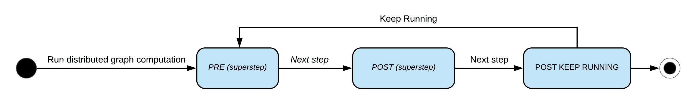
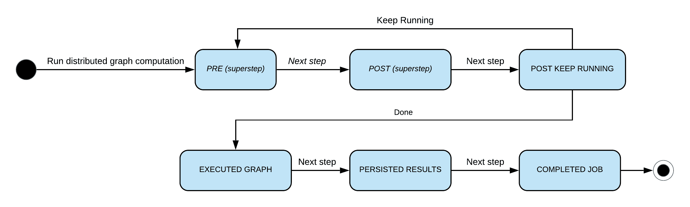
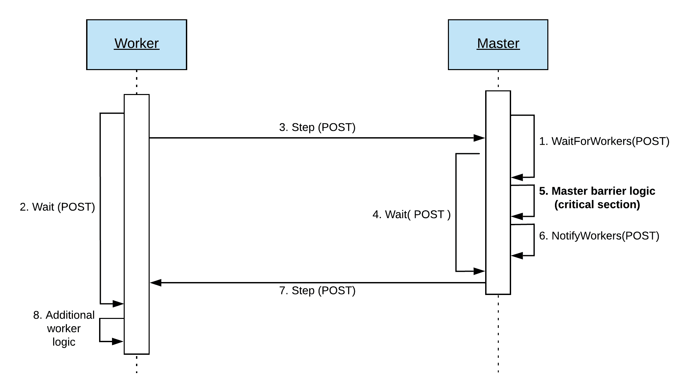
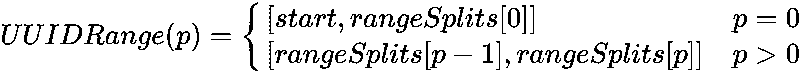
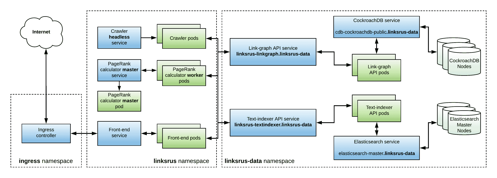

# 构建分布式图处理系统

"一个分布式系统是这样的一个系统，其中你甚至不知道存在的计算机的故障可以使你自己的计算机无法使用。"

- 莱斯利·兰波特

主/工作模式是构建容错、分布式系统的一种流行方法。本章的第一部分深入探讨了这种模式，重点关注分布式系统的一些更具挑战性的方面，如节点发现和错误处理。

在本章的第二部分，我们将应用主/工作模式从头开始构建一个分布式图处理系统，该系统能够处理大小超过大多数现代计算节点内存容量的大规模图。最后，在本章的最后部分，我们将应用到目前为止所学的一切来创建 Links 'R' Us 项目的 PageRank 计算服务的分布式版本。

本章将涵盖以下主题：

+   分布式计算中应用主/工作模型

+   发现主节点和工作节点的策略

+   处理错误的策略

+   使用主/工作模型以分布式方式执行第八章中基于图的算法，*基于图的数据处理*

+   创建 Links 'R' Us PageRank 计算服务的分布式版本并将其部署到 Kubernetes

# 技术要求

本章讨论的所有主题的完整代码已发布到本书的 GitHub 仓库的`Chapter12`文件夹中。

您可以通过将您的网络浏览器指向以下 URL 来访问包含本书每个章节代码和所有必需资源的 GitHub 仓库：[`github.com/PacktPublishing/Hands-On-Software-Engineering-with-Golang`](https://github.com/PacktPublishing/Hands-On-Software-Engineering-with-Golang)。

本章的每个示例项目都包含一个通用的 Makefile，它定义了以下一组目标：

| **Makefile 目标** | **描述** |
| --- | --- |
| `deps` | 安装任何必需的依赖项。 |
| `test` | 运行所有测试并报告覆盖率。 |
| `lint` | 检查 lint 错误。 |

与本书的所有其他章节一样，您需要一个相当新的 Go 版本，您可以在[`golang.org/dl/`](https://golang.org/dl/)下载。

要运行本章中的一些代码，您需要在您的机器上安装一个工作的 Docker ^([2])安装。此外，对于本章的最后部分，您需要访问一个 Kubernetes 集群。如果您没有访问 Kubernetes 集群进行测试，您可以简单地遵循以下部分中概述的说明，在您的笔记本电脑或工作站上设置一个小型集群。

# 介绍主/工作模型

主/工作模型是构建分布式系统的常用模式，这种模式已经存在了很长时间。当使用此模型构建集群时，节点可以分为两个不同的组，即主节点和工人节点。

工作节点的主要责任是执行以下计算密集型任务：

+   视频转码

+   使用数百万参数训练大规模神经网络

+   计算**在线分析处理**（**OLAP**）查询

+   运行**持续集成**（**CI**）管道

+   在大规模数据集上执行 map-reduce 操作

另一方面，主节点通常被分配协调者的角色。为此，它们负责以下任务：

+   发现并跟踪可用的工人节点

+   将工作分解成更小的任务并将它们分配给每个连接的工人

+   协调作业的执行并确保任何错误都得到适当的检测和处理

# 确保主节点的高可用性

在使用主/工作模型构建的系统中，由于崩溃或网络分区而丢失一个或多个工作节点并不是一个大问题。主节点可以检测到这一点，并通过将工作负载重新分配给剩余的工人来解决这个问题。

设计分布式系统时的一条重要建议是确保你的系统不包含**单点故障**（**SPoFs**）。

另一方面，主节点的丢失很可能会使整个系统离线！幸运的是，我们有几种不同的方法可以确保主节点的高可用性，我们将在下一节中介绍。

# 领导者-跟随者配置

**领导者-跟随者**配置通过向集群引入多个主节点来实现高可用性。主节点实现了一个领导者选举算法，经过几轮投票后，它们将集群领导者的角色分配给主节点中的一个。

从那时起，领导者负责协调任何未来作业的执行，每个工作节点都被指示连接到它。

非领导者主节点（跟随者）使用心跳机制来持续监控活动领导者的健康状态。如果领导者未能确认一定数量的连续心跳请求，其他主节点将假定领导者已死亡，并自动进行新一轮选举，以选择集群的新领导者。

同时，工人尝试重新连接到主节点，并最终与新选出的集群领导者建立连接。

# 多主配置

在**多主配置**中，我们仍然启动多个主节点实例。然而，正如其名称所暗示的，集群实际上并没有指定的领导者。在多主集群中，我们不需要为工作节点提供确定哪个节点是领导者的机制；它们可以自由连接到任何主节点。

虽然这种配置的吞吐量特性比等效的领导者-跟随者配置要好得多，但它有一个重要的注意事项，即所有主节点必须始终共享集群状态的相同视图。

因此，主节点需要实现某种分布式一致性算法，如 Paxos ^([3]) 或 Raft ^([5])，以确保对集群状态的更改由所有主节点以相同的顺序处理。

# 发现节点的策略

为了让工作节点能够连接到主节点，它们首先需要知道其存在！根据我们的特定用例，可以使用以下发现策略：

+   **连接到引导节点**: 这种发现策略假设其中一个主节点（通常称为**引导节点**）可以在事先已知的 IP 地址上访问。主节点和工作节点都尝试与引导节点建立初始连接，并使用**八卦协议**获取有关集群中其他节点信息。

+   **使用外部发现服务**: 这种策略依赖于存在一个外部发现服务，我们可以查询它以获取有关集群内运行的所有服务的信息。Consul ^([1]) 是实现这种特定模式的一个非常流行的解决方案。

+   **使用 DNS 记录定位节点**: 如果我们的系统部署在一个允许我们创建和操作本地 DNS 记录的环境中（例如，Kubernetes），我们可以生成指向集群领导者的**A 记录**。工作节点可以通过简单的 DNS 查询查找领导者。

# 从错误中恢复

分布式系统本质上是复杂的。在主/工作节点设置中执行任务时，可能会出现许多问题，例如，进程可能耗尽内存并崩溃或简单地变得无响应，网络数据包可能丢失，或网络设备可能故障，从而导致网络分裂。在构建分布式系统时，我们不仅要预见错误的存在，还应该制定在错误发生时的应对策略。

在本节中，我们将讨论在主/工作节点系统中从错误中恢复的以下方法：

+   **错误重试**: 这种策略更适合那些计算幂等的负载。一旦检测到致命错误，主节点会要求所有工作节点终止当前任务，并从零开始重新启动工作负载。

+   **将工作负载重新分配给健康的工作者**：这种策略对于在作业执行过程中可以动态更改分配的工作负载的系统非常有效。如果有任何工作者离线，主节点可以将分配给它的工作负载重新分配给剩余的工作者。

+   **使用检查点机制**：这种策略最适合涉及非幂等计算的长时间运行的工作负载。在作业执行期间，主节点会定期要求工作者创建一个*检查点*，即他们当前内部状态的快照。如果发生错误，而不是从头开始重新启动作业，主节点要求工作者从特定的检查点恢复他们的状态并继续执行作业。

# 离核分布式图处理

回到第八章，*基于图的数据处理*，我们设计和构建了我们自己的系统，用于基于**批量同步并行**（**BSP**）模型实现图算法。诚然，我们的最终实现受到了谷歌论文中描述的 Pregel ^([4])的想法的很大影响，这是一个最初由谷歌工程师构建的系统，用于处理大规模的图计算。

虽然第八章中的`bspgraph`包，*基于图的数据处理*，能够自动在多个工作者之间分配图计算负载，但它仍然局限于在单个计算节点上运行。随着我们的 Links 'R' Us 爬虫不断为链接索引增加越来越多的链接，我们最终会达到一个点，此时 PageRank 的计算将变得过于耗时。更新整个图的 PageRank 分数可能需要一天，甚至更糟，几天时间！

我们可以通过**扩展规模**来为自己争取一些时间，换句话说，在我们的云提供商那里运行我们能够获取到的最强大的（从 CPU 的角度来看）机器上的 PageRank 计算器服务。这将给我们一些喘息的空间，直到图变得太大而无法装入内存！一旦我们达到这个点，我们唯一的可行选择就是**扩展规模**，或者启动多个计算节点，并将现在庞大的图的一部分分配给每个节点。

在接下来的章节中，我们将（非常直接地！）应用到目前为止所学的所有知识，从头开始构建`bspgraph`包的分布式版本，它将位于`Chapter12/dbspgraph`文件夹中，您可以在本书的 GitHub 仓库中浏览。

正如我们在前面的章节中所做的那样，我们再次将 SOLID 原则应用于我们的设计，以尽可能多地重用代码。为此，新的包将仅仅是一个复杂的包装器，它透明地将分布式计算超级能力注入任何现有的`bspgraph.Graph`实例中！

这实际上意味着我们可以在单个机器上使用第八章，*基于图的数据处理*中的`bspgraph`框架设计和测试我们的算法，一旦对它们的输出满意，就可以切换到`dsbpgraph`进行离核处理。

正如我们所意识到的，构建分布式系统是一项艰巨的任务。为了尽量减少我们创建的系统的复杂性并使代码更容易理解，我们将把实现拆分成许多更小、更独立的组件，并为每个组件的实现分配一个部分。不过，不用担心——在本章结束时，你将对所有这些组件如何组合在一起有一个清晰的理解！

# 描述系统架构、需求和限制

本章的标题暗示了我们将为分布式图处理框架使用的架构类型；不出所料，它将基于**主/工作**模式。

为了更好地理解我们在设计中的主节点和工作节点的作用，我们首先需要快速回顾一下第八章，*基于图的数据处理*中`bspgraph`包的工作原理。如果你还没有阅读第八章，*基于图的数据处理*，我建议在继续之前先阅读。

`bspgraph`包使用**批量同步模型**（**BSP**）执行图算法。为此，所选算法基本上是按顺序步骤（超级步骤）执行的。在每个超级步骤中，框架**并行**调用用户定义的**计算函数**，针对图中的每个顶点。

计算函数可以访问**本地**顶点状态和**全局**图状态（模型计数器、最小/最大跟踪器等聚合实例）。顶点通过交换消息相互通信。在超级步骤期间发布的任何消息都会**排队**，并在**下一个**超级步骤中交付给预期的接收者。最后，在开始执行下一个超级步骤之前，框架等待所有计算函数返回，并将任何在途消息排队以交付。这反映了 BSP 模型的**同步**行为。

那么，要如何以分布式方式实现相同的过程呢？让我们看看：

+   首先，主节点和工作节点都需要运行完全相同的计算函数。这很容易做到，因为我们首先将使用`bspgraph`包开发我们的算法，然后使用`dbspgraph`包在主节点或工作节点上执行它。

+   其次，为了强制执行 BSP 模型的同步方面，我们必须引入某种并发原语以确保所有工人在**同步**执行超级步骤。这个原语，我们将称之为**步骤屏障**，将由**主节点**实现。

如你所猜，主节点实际上不会进行任何计算工作；它将扮演图算法执行的协调者角色。更具体地说，主节点将负责以下工作：

+   为工人提供一个连接并等待工作分配的端点。

+   计算并广播每个工人的分区分配。

+   在屏障原语的帮助下协调每个超级步骤的执行。

+   跟踪当前正在执行的图算法的**全局**状态。这包括不仅当前的超级步骤，还包括全局聚合器值。主节点必须从每个工人收集部分聚合器值，更新其状态，并将新的全局状态广播到所有工人。

+   在工人之间中继消息。主节点了解每个工人的分区分配，并且可以通过查询目的地 ID 来路由消息。

+   监控每个工人的状态，并在发生错误或任何工人崩溃时广播作业中止请求。

另一方面，工人的角色要简单得多。每个工人连接到主节点并等待工作分配。一旦接收到新的工作，工人就会使用分配给它的**通用唯一标识符**（**UUID**）范围内的顶点和边初始化其本地图。然后，通过与主节点（通过屏障）的协调，工人在与其他工人保持同步的情况下执行图算法，直到满足算法的用户定义的终止条件。任何目的地不是本地图顶点的输出消息将通过主节点自动中继。

为了能够正确分区图并在工人之间中继消息，我们唯一的先决条件是顶点 ID 始终是有效的 UUID。如果底层图表示使用不同类型的 ID（例如，一个整数值），最终用户需要在图初始化步骤中将它们手动重新映射到 UUID。

# 建立用于执行图计算的有限状态机模型

为了执行图算法，`bspgraph`包提供了`Executor`类型，这是一个方便的辅助工具，它协调执行单个超级步骤，并允许最终用户定义一组可选的回调函数，如果定义了，执行器将在各种计算阶段调用这些回调函数。这组可选回调函数包括以下内容：

+   `PRE_STEP`回调：这个回调在执行超级步骤之前调用。这个钩子允许最终用户在下一个超级步骤之前执行任何所需的算法特定初始化步骤。例如，某些算法可能在每个超级步骤之前需要重置存储在一个或多个聚合器中的值。

+   `POST_STEP`回调：这个回调在执行超级步骤后调用。这个钩子的典型用例是在超级步骤中执行额外的计算并更新全局聚合器值。例如，为了计算平均值，我们可以设置两个聚合器，一个计数器和一个小计，它们在超级步骤期间通过计算函数调用进行更新。然后，在`POST_STEP`回调中，我们可以简单地获取它们的值，计算平均值，并将其记录在另一个聚合器中。

+   `POST_STEP_KEEP_RUNNING`回调：这个回调在`POST_STEP`之后调用，其作用是决定算法是否已完成其执行或需要额外的超级步骤。以下是一些典型的停止条件示例：

    +   达到特定的超级步骤编号。

    +   没有更多的顶点处于活动状态（例如，来自第八章，*基于图的数据处理*）。

    +   聚合器值达到阈值（例如，PageRank 计算器）。

如果我们将这些回调视为状态机模型中的状态，其状态图将如下所示：



图 1：bspgraph 包的状态图

当我们在单个节点上运行时，前面的模型运行得相当好，但当图以分布式方式执行时，这还不够。为什么是这样呢？记住，在分布式版本中，每个工作器都在图的**子集**上操作。因此，算法执行结束时，每个工作器都将能够访问解决方案的子集。

状态机是计算的一个流行数学模型。该模型定义了一组计算状态、从一个状态转换到另一个状态的规则以及执行特定计算任务的抽象机器。

在任何时刻，机器只能处于允许的**一个**状态。每当机器执行计算步骤时，都会咨询转换规则以选择下一个要过渡到的阶段。

我们不能真正地说算法已经完成，**除非**所有工作者的结果都已被成功持久化！因此，对于分布式情况，我们需要扩展我们的状态图，使其看起来如下所示：



图 2：dbspgraph 包的状态图

让我们快速看一下在刚刚引入到状态机中的三个新状态内部会发生什么：

+   一旦`POST_STEP_KEEP_RUNNING`回调决定图算法执行的终止条件已经满足，我们就进入`EXECUTED_GRAPH`步骤，其中每个工作节点都尝试持久化其本地计算结果。

+   工作者在成功将本地计算结果持久化到后端存储后，会达到`PERSISTED_RESULTS`状态。

+   最后，工作节点达到`JOB_COMPLETED`状态。在这个状态下，它们可以自由地重置内部状态并等待新的作业。

# 在工作节点和主节点之间建立通信协议

实施任何类型的分布式系统的关键前提是引入一个协议，允许各种系统组件相互通信。同样的要求也适用于我们在本章中构建的分布式图处理系统。

由于工作节点和主节点通过网络链路进行通信，我们将应用在第九章，“与外界通信”中学到的概念，并使用 gRPC 作为我们的传输层。

以下章节中的消息和 RPC 定义可以在本书 GitHub 仓库的`Chapter12/dbspgraph/api`文件夹中找到。

# 定义一个作业队列 RPC 服务

我们将采取一种稍微非传统的做法，首先定义我们唯一的 RPC。这样做的原因是，RPC 类型的选择（单一与流式）将极大地影响我们定义各种有效载荷的方式。

例如，如果我们选择使用流式 RPC，我们需要定义一种可以表示主节点和工作节点之间交换的不同类型消息的封装消息。另一方面，如果我们决定采用单一 RPC，我们可能定义多个方法，从而避免需要封装消息。

不再赘述，让我们来看看我们作业队列的 RPC 定义：

```go
service JobQueue {
  rpc JobStream(stream WorkerPayload) returns (stream MasterPayload);
}
```

如您所见，我们实际上将使用一种*双向流式*RPC！这带来了一定的成本；我们需要定义两个封装消息，一个用于工作节点，一个用于主节点。那么，是什么决定因素驱使我们选择了看似更复杂的双向流式解决方案？

答案与 gRPC 调度消息交付的方式有关。如果您仔细检查 gRPC 规范，您会注意到*只有*流式 RPC 保证了消息将按照它们发布的顺序交付。

这个事实对我们特定的用例至关重要，也就是说，如果我们不能强制执行按顺序的消息传递，等待在屏障上的工作节点可能会在退出屏障之前处理一条消息。结果，工作节点不仅会以非确定性的方式行为（调试起来很幸运！），算法还会产生错误的结果。

基于流的方法的另一个好处是，我们可以利用 gRPC 内建的心跳机制，有效地检测工作节点与主节点的连接是否被切断。

# 为工作节点负载建立协议缓冲区定义

正如我们在上一节中看到的，我们需要为工作节点负载定义一个信封消息：

```go
message WorkerPayload {
 oneof payload {
 Step step = 1;
 RelayMessage relay_message = 2;
 }
}
```

通过`oneof`类型，我们可以模拟消息联合。`WorkerPayload`可以包含`Step`消息或`RelayMessage`消息。`Step`消息更有趣，因此我们将首先检查其定义：

```go
message Step {
  Type type = 1;
  map<string, google.protobuf.Any> aggregator_values = 2;
  int64 activeInStep = 3;

  enum Type {
    INVALID = 0;
    PRE = 1;
    POST = 2;
    POST_KEEP_RUNNING = 3;
    EXECUTED_GRAPH = 4;
    PESISTED_RESULTS = 5;
    COMPLETED_JOB = 6;
  }
}
```

`Step`消息将由工作节点发送，以进入主节点的特定执行步骤的屏障。屏障类型由`type`字段指示，该字段可以采用任何嵌套的`Type`值。这些值对应于我们之前看到的州图中的步骤。根据步骤类型，工作节点将在以下情况下将其**本地**状态传输给主节点：

+   当进入`POST`步骤的屏障时，工作节点将检索**部分**本地聚合器（在第八章，*基于图的数据处理*，我们称它们为**delta**）值，将它们序列化到`Any`消息中，并将它们添加到一个映射中，其中键对应于聚合器名称。

+   当进入`POST_KEEP_RUNNING`步骤的屏障时，工作节点将使用在步骤中活跃的**本地**顶点的数量填充`activeInStep`字段。

工作节点可以发送的另一种消息类型是`RelayMessage`。此消息请求主节点将消息中继给负责处理其目标 ID 的工作节点。定义相当简单，如下所示：

```go
message RelayMessage {
  string destination = 1;
  google.protobuf.Any message = 2;
}
```

`destination`字段编码了目标 ID（一个 UUID），而`message`字段包含实际的消息内容，序列化为`Any`值。

# 为主节点负载建立协议缓冲区定义

现在，让我们看一下主节点发送给单个工作节点的负载的协议缓冲区定义：

```go
message MasterPayload {
  oneof payload {
    JobDetails job_details = 1;
    Step step = 2;
    RelayMessage relay_message = 3;
  }
}
```

当工作节点连接到作业队列时，它将阻塞，直到主节点通过发送`JobDetails`消息分配给它一个新的作业：

```go
message JobDetails {
  string job_id = 1;
  google.protobuf.Timestamp created_at = 2;

  // The from, to) UUID range assigned to the worker. Note that from is 
  // inclusive and to is exclusive.
  bytes partition_from_uuid = 3;
  bytes partition_to_uuid = 4;
}
```

`job_id`字段包含将要执行的任务的唯一 ID，而`created_at`字段则编码了任务的创建时间戳。`partition_from_uuid`和`partition_to_uuid`字段定义了由主节点分配给该工作节点的 UUID 范围的边界。工作节点应使用这些信息来加载内存中适当的图部分。

要进入特定步骤的屏障，工作节点将向主节点发送`Step`消息。一旦所有工作节点达到相同的屏障，主节点将通过发送带有相同步骤类型的`Step`消息来广播退出屏障的通知。

然而，当`Step`消息来自主节点时，两个状态相关字段用于将新的**全局**状态推送到每个工作节点：

+   当退出`POST`步骤的屏障时，主节点将发送回由每个 worker 发送的 delta 计算出的新的**全局**聚合器值。预期 worker 将使用从主节点接收到的值覆盖其本地的聚合器值。

+   当退出`POST_KEEP_RUNNING`步骤的屏障时，主节点将发送回上一步中活跃的**全局**顶点数。预期 worker 将使用这个全局值来测试算法的停止条件。

最后，如果主节点收到一个中继请求，它会检查其目的地以选择负责处理该请求的 worker，并简单地通过 gRPC 流转发消息。

# 定义用于处理双向 gRPC 流的抽象

如我们在[第九章，“与外部世界通信”中看到的，双向 gRPC 流是全双工的；接收和发送通道独立于彼此操作。然而，从 gRPC 流中读取是一个阻塞操作。因此，为了处理流的两侧，我们需要启动一些 goroutine。

gRPC 流的另一个重要注意事项是，虽然我们可以从不同的 goroutine 调用`Recv`和`Send`，但不同 goroutine 中并发调用这些方法是不安全的，可能会导致数据丢失！因此，我们需要一个机制来对 gRPC 流上的发送和接收操作进行*序列化*。对于这种类型的任务，Go 的明显原始原语是通道。

为了让我们的工作更加轻松，并使我们的代码其余部分免于处理底层的 gRPC 流，我们将引入一组抽象来封装 gRPC 流，并提供一个干净、基于通道的接口，用于从/向流中读取和写入。

# 远程 worker 流

`remoteWorkerStream`，其定义如下所示，被主节点用于封装传入的 worker 连接：

```go
type remoteWorkerStream struct {
    stream proto.JobQueue_JobStreamServer
    recvMsgCh chan *proto.WorkerPayload
    sendMsgCh chan *proto.MasterPayload
    sendErrCh chan error

    mu sync.Mutex
    onDisconnectFn func()
    disconnected bool
}
```

如前述代码所示，`remoteWorkerStream`定义了三个通道以与流交互：

+   `recvMsgCh`用于接收 worker 发送的数据负载。

+   `sendMsgCh`用于从主节点向 worker 发送数据负载。

+   `sendErrCh`允许主节点带或不带错误代码地断开 worker 连接。

与远程 worker 流交互的代码可以使用以下方法来获取读取和写入的适当通道实例，以及关闭流的操作：

```go
func (s *remoteWorkerStream) RecvFromWorkerChan() <-chan *proto.WorkerPayload {
    return s.recvMsgCh
}

func (s *remoteWorkerStream) SendToWorkerChan() chan<- *proto.MasterPayload {
    return s.sendMsgCh
}

func (s *remoteWorkerStream) Close(err error) {
    if err != nil {
        s.sendErrCh <- err
    }
    close(s.sendErrCh)
}
```

`remoteWorkerStream`结构还包括两个字段（由互斥锁保护），用于跟踪远程 worker 的连接状态。在主节点协调作业执行时，它必须监控每个单独的 worker 的健康状况，并在任何 worker 突然断开连接时终止作业。为此，主节点可以通过以下方法注册断开回调：

```go
func (s *remoteWorkerStream) SetDisconnectCallback(cb func()) {
    s.mu.Lock()
    s.onDisconnectFn = cb
    if s.disconnected {
        s.onDisconnectFn()
    }
    s.mu.Unlock()
}
```

由于 `SetDisconnectCallback` 可能在工作流已经断开连接之后被调用，因此流使用布尔 `disconnected` 字段来跟踪此事件，并在需要时自动调用提供的回调。

要创建一个新的 `remoteWorkerStream` 实例，我们只需调用其构造函数并将 gRPC 流作为参数传递。构造函数实现（如下所示）将初始化与流交互所需的各个缓冲通道：

```go
func newRemoteWorkerStream(stream proto.JobQueue_JobStreamServer) *remoteWorkerStream {
    return &remoteWorkerStream{
        stream: stream,
        recvMsgCh: make(chan *proto.WorkerPayload, 1),
        sendMsgCh: make(chan *proto.MasterPayload, 1),
        sendErrCh: make(chan error, 1),
    }
}
```

`HandleSendRecv` 方法实现了与底层流交互所需逻辑。正如您在下面的代码片段中可以看到的，它首先创建了一个可取消的上下文，该方法返回时上下文总是被取消。然后，它启动一个 goroutine 来异步处理流的接收端。该方法随后进入一个无限 `for` 循环，在该循环中处理流的发送端，直到流优雅地关闭或发生错误：

```go
func (s *remoteWorkerStream) HandleSendRecv() error {
    ctx, cancelFn := context.WithCancel(context.Background())
    defer cancelFn()
    go s.handleRecv(ctx, cancelFn)
    for {
        select {
        case mPayload := <-s.sendMsgCh:
            if err := s.stream.Send(mPayload); err != nil {
                return err
            }
        case err, ok := <-s.sendErrCh:
            if !ok { // signalled to close without an error
                return nil
            }
            return status.Errorf(codes.Aborted, err.Error())
        case <-ctx.Done():
            return status.Errorf(codes.Aborted, errJobAborted.Error())
        }
    }
}
```

在发送实现方面，前面的代码使用 `select` 块等待以下事件之一：

+   通过 `sendMsgCh` 发射一个有效载荷。在这种情况下，我们尝试通过流发送它，并将任何错误返回给调用者。

+   如果通过 `sendErrCh` 发射错误或通道关闭（请参阅上面几行的 `Close` 方法实现），则通过 `grpc/status` 包将特定的 `codes.Aborted` 错误代码标记为错误，并将错误返回给调用者。如果没有发生错误，则方法返回一个 `nil` 错误。否则，我们使用 `grpc/status` 包将特定的 `codes.Aborted` 错误代码标记为错误，并将错误返回给调用者。

+   最后，如果上下文被 `handleRecv` goroutine 取消，我们将以一个类型化的 `errJobAborted` 错误消息退出。

现在，让我们更详细地看看 `handleRecv` 方法的实现：

```go
func (s *remoteWorkerStream) handleRecv(ctx context.Context, cancelFn func()) {
    for {
        wPayload, err := s.stream.Recv()
        if err != nil {
            s.handleDisconnect()
            cancelFn()
            return
        }

        select {
        case s.recvMsgCh <- wPayload:
        case <-ctx.Done():
            return
        }
    }
}
```

调用流的 `Recv` 方法会阻塞，直到有消息可用或远程连接断开。如果我们从工作进程接收到传入的消息，将使用 `select` 块将消息入队到 `recvMsgCh` 或在上下文被取消时退出 goroutine（例如，`HandleSendRecv` 由于错误而退出）。

另一方面，如果我们检测到错误，我们总是假设客户端断开连接，在取消上下文和退出 goroutine 之前调用 `handleDisconnect` 辅助方法：

```go
func (s *remoteWorkerStream) handleDisconnect() {
    s.mu.Lock()
    if s.onDisconnectFn != nil {
        s.onDisconnectFn()
    }
    s.disconnected = true
    s.mu.Unlock()
}
```

前面的实现相当直接。获取 `mu` 锁并检查是否指定了断开连接回调。如果是这样，则调用回调并将 `disconnected` 标志设置为 `true` 以跟踪断开事件。

# 远程主流

接下来，我们将转向工作端，并检查处理与主节点连接的等效流辅助方法。`remoteMasterStream` 类型的定义与 `remoteWorkerStream` 几乎相同，如下所示：

```go
type remoteMasterStream struct {
    stream proto.JobQueue_JobStreamClient
    recvMsgCh chan *proto.MasterPayload
    sendMsgCh chan *proto.WorkerPayload

    ctx context.Context
    cancelFn func()

    mu sync.Mutex
    onDisconnectFn func()
    disconnected bool
}
```

一旦工作节点连接到主节点并接收到一个作业分配，它将调用 `newRemoteMasterStream` 函数来使用 `remoteMasterStream` 实例包装获得的流连接：

```go
func newRemoteMasterStream(stream proto.JobQueue_JobStreamClient) *remoteMasterStream {
    ctx, cancelFn := context.WithCancel(context.Background())

    return &remoteMasterStream{
        ctx: ctx,
        cancelFn: cancelFn,
        stream: stream,
        recvMsgCh: make(chan *proto.MasterPayload, 1),
        sendMsgCh: make(chan *proto.WorkerPayload, 1),
    }
}
```

如您在前面的代码片段中所见，构造函数创建了一个可取消的上下文，并为与流进行接口交互分配了一对通道。

正如我们在 `remoteWorkerStream` 实现中所做的那样，我们将定义一对便利方法来访问这些通道，如下所示：

```go
func (s *remoteMasterStream) RecvFromMasterChan() <-chan *proto.MasterPayload {
    return s.recvMsgCh
}

func (s *remoteMasterStream) SendToMasterChan() chan<- *proto.WorkerPayload {
    return s.sendMsgCh
}
```

`HandleSendRecv` 方法负责接收来自主节点的传入消息，以及从工作节点发送出去的消息。

如您在下面的代码块中所见，实现方式与 `remoteWorkerStream` 实现大致相同，但有两大小的区别。你能找到它们吗？看看：

```go
func (s *remoteMasterStream) HandleSendRecv() error {
    defer func() {
        s.cancelFn()
        _ = s.stream.CloseSend()
    }()
    go s.handleRecv()
    for {
        select {
        case wPayload := <-s.sendMsgCh:
            if err := s.stream.Send(wPayload); err != nil && !xerrors.Is(err, io.EOF) {
                return err
            }
        case <-s.ctx.Done():
            return nil
        }
    }
}
```

第一个区别在于我们处理流 `Send` 方法返回的错误的方式。如果工作节点在尝试将有效载荷发送到主节点的前一个代码块中关闭发送流，`Send` 将返回一个 `io.EOF` 错误，以让我们知道我们无法通过该流发送任何更多消息。由于工作节点是控制发送流的一方，我们将 `io.EOF` 错误视为*预期*并忽略它们。

其次，由于工作节点是 RPC 的发起者，它不允许像我们在主节点流实现中那样，使用特定的错误代码来终止发送流。因此，对于这种实现，没有必要维护（并轮询）一个专用的错误通道。

另一方面，以下接收端代码的实现方式与 `remoteMasterStream` 完全相同：

```go
func (s *remoteMasterStream) handleRecv() {
    for {
        mPayload, err := s.stream.Recv()
        if err != nil {
            s.handleDisconnect()
            s.cancelFn()
            return
        }
        select {
        case s.recvMsgCh <- mPayload:
        case <-s.ctx.Done():
            return
        }
    }
}
```

要实际关闭流并使 `HandleSendRecv` 方法退出，工作节点可以调用 `remoteMasterStream` 的 `Close` 方法：

```go
func (s *remoteMasterStream) Close() {
    s.cancelFn()
}
```

`Close` 方法首先取消接收和发送代码中由 `select` 块监控的上下文。正如我们在几行之前讨论的那样，后者的操作将导致任何挂起的 `Send` 调用因 `io.EOF` 错误而失败，并允许 `HandleSendRecv` 方法返回。此外，上下文的取消使 `handleRecv` 协程也能返回，从而确保我们的实现没有泄漏任何协程。

# 为图执行步骤创建分布式屏障

屏障可以被视为一组进程的会合点。一旦一个进程进入屏障，它将阻止它继续进行任何进展，直到所有其他预期的进程也进入屏障。

在 Go 中，我们可以使用 `sync.WaitGroup` 原语来帮助建模一个屏障，如下所示：

```go
func barrier(numWorkers int) {
    var wg sync.WaitGroup
    wg.Add(numWorkers)

    for i := 0; i < numWorkers; i++ {
        go func() {
            wg.Done()
            fmt.Printf("Entered the barrier; waiting for other goroutines to join")
            wg.Wait()
            fmt.Printf("Exited the barrier")
        }()
    }

    wg.Wait()
}
```

为了确保每个工作器与其他工作器以锁步的方式执行图状态机的各个阶段，我们必须实现一个类似的屏障原语。然而，就我们的特定应用程序而言，我们感兴趣同步的 goroutines 在不同的主机上执行。这显然使事情变得复杂，因为我们现在需要提出一个分布式屏障实现！

正如我们在上一节中提到的，主节点将作为分布式屏障的协调者。为了使代码更容易理解，在接下来的小节中，我们将把我们的分布式屏障实现分为工作器端和主节点端实现，并分别检查它们。

# 为单个工作器实现步骤屏障

`workerStepBarrier`类型封装了使工作器能够进入特定图执行步骤并等待主节点通知工作器可以现在退出屏障所需的逻辑。

`workerStepBarrier`类型定义如下：

```go
type workerStepBarrier struct {
    ctx context.Context
    stream *remoteMasterStream
    waitCh map[proto.Step_Type]chan *proto.Step
}
```

要了解这些字段是如何初始化的，让我们看看新屏障实例的构造函数：

```go
func newWorkerStepBarrier(ctx context.Context, stream *remoteMasterStream) *workerStepBarrier {
    waitCh := make(map[proto.Step_Type]chan *proto.Step)
    for stepType := range proto.Step_Type_name {
        if proto.Step_Type(stepType) == proto.Step_INVALID {
            continue
        }
        waitCh[proto.Step_Type(stepType)] = make(chan *proto.Step)
    }

    return &workerStepBarrier{
        ctx: ctx,
        stream: stream,
        waitCh: waitCh,
    }
}
```

如您所见，构造函数接受一个上下文和一个`remoteMasterStream`实例作为参数。上下文允许屏障代码阻塞，直到主节点收到通知或上下文被取消（例如，因为工作器正在关闭）。

为了允许工作器在接收到主节点的通知之前阻塞，构造函数将为我们要为创建屏障的每种步骤类型分配一个单独的通道。当 protoc 将我们的协议缓冲定义编译成 Go 代码时，它还将提供一个方便的`Step_Type`映射，该映射通常用于获取步骤类型的字符串表示（协议缓冲将`enum`类型建模为`int32`值）。构造函数利用这个映射，通过一个简单的`for`循环块自动生成所需数量的通道。

当工作器想要进入特定步骤的屏障时，它会创建一个新的`Step`消息，其中包含它想要与主节点共享的本地状态，并调用阻塞的`Wait`方法，如下所示：

```go
func (b *workerStepBarrier) Wait(step *proto.Step) (*proto.Step, error) {
    ch, exists := b.waitCh[step.Type]
    if !exists {
        return nil, xerrors.Errorf("unsupported step type %q", proto.Step_Type_name[int32(step.Type)])
    }
    select {
    case b.stream.SendToMasterChan() <- &proto.WorkerPayload{Payload: &proto.WorkerPayload_Step{Step: step}}:
    case <-b.ctx.Done():
        return nil, errJobAborted
    }

    select {
    case step = <-ch:
        return step, nil
    case <-b.ctx.Done():
        return nil, errJobAborted
    }
}
```

`Wait`方法由两个基本部分组成。在验证步骤类型后，实现尝试将新的`WorkerPayload`推入`remoteMasterStream`，以便通过 gRPC 流发送给主节点。

一旦有效加载了负载，工作器就会在适当的通道上等待指定的步骤类型，而主节点向所有工作器广播一个`Step`消息，告知它们可以退出屏障。一旦收到该消息，它就会返回给调用者，然后调用者就可以自由地执行实现此特定图计算步骤所需的工作块。

到目前为止，你可能想知道谁负责将主节点的广播步骤发布到`Wait`方法尝试读取的通道。为了强制执行关注点的清晰分离（并使测试更容易），屏障实现不关心从主节点读取响应的低级细节。相反，它提供了一个`Notify`方法，一旦主节点收到步骤消息，另一个组件（作业协调器）将调用此方法：

```go
func (b *workerStepBarrier) Notify(step *proto.Step) error {
    ch, exists := b.waitCh[step.Type]
    if !exists {
        return xerrors.Errorf("unsupported step type %q", proto.Step_Type_name[int32(step.Type)])
    }

    select {
    case ch <- step:
        return nil
    case <-b.ctx.Done():
        return errJobAborted
    }
}
```

`Notify`方法实现中的代码检查步骤类型字段，并使用它来选择发布`Step`响应的通道。

现在，让我们继续检查主节点侧的等效步骤屏障实现。

# 为主节点实现步骤屏障

现在，让我们看看运行在主节点上的屏障实现逻辑的另一部分。`masterStepBarrier`类型，其定义如下，确实更有趣，因为它包含了实际的屏障同步逻辑：

```go
type masterStepBarrier struct {
    ctx context.Context
    numWorkers int
    waitCh map[proto.Step_Type]chan *proto.Step
    notifyCh map[proto.Step_Type]chan *proto.Step
}
```

一个关键的区别是，`masterStepBarrier`类型定义了两种类型的通道：

+   **等待通道**：这是一个屏障监控来自工作者`Step`消息的通道。

+   **通知通道**：这是一个远程工作流将阻塞等待主节点广播`Step`消息的通道。

通过浏览创建主屏障的构造函数逻辑，我们可以看到我们自动通过迭代 protoc 为在编译协议缓冲定义时使用而生成的`Step_Type`变量来创建所需的通道集。

更重要的是，当创建一个新的屏障时，调用者还应该提供一个参数，即预期将加入屏障的工作者数量：

```go
func newMasterStepBarrier(ctx context.Context, numWorkers int) *masterStepBarrier {
    waitCh := make(map[proto.Step_Type]chan *proto.Step)
    notifyCh := make(map[proto.Step_Type]chan *proto.Step)
    for stepType := range proto.Step_Type_name {
        if proto.Step_Type(stepType) == proto.Step_INVALID {
            continue
        }
        waitCh[proto.Step_Type(stepType)] = make(chan *proto.Step)
        notifyCh[proto.Step_Type(stepType)] = make(chan *proto.Step)
    }

    return &masterStepBarrier{
        ctx: ctx,
        numWorkers: numWorkers,
        waitCh: waitCh,
        notifyCh: notifyCh,
    }
}
```

在上一节中，我们看到了当工作者在`workerStepBarrier`上调用`Wait`方法时，通过`remoteMasterStream`发布了一个`Step`消息。现在，我们将检查接收端发生了什么。一旦接收到发布的`Step`消息，主节点就会在`masterStepBarrier`上调用`Wait`方法。

从原则上讲，这不过是在 gRPC 流上实现的一个古老的单一 RPC！以下是主节点的`Wait`方法内部发生的情况：

```go
func (b *masterStepBarrier) Wait(step *proto.Step) (*proto.Step, error) {
    waitCh, exists := b.waitCh[step.Type]
    if !exists {
        return nil, xerrors.Errorf("unsupported step type %q", proto.Step_Type_name[int32(step.Type)])
    }
    select {
    case waitCh <- step:
    case <-b.ctx.Done():
        return nil, errJobAborted
    }
    select {
    case step = <-b.notifyCh[step.Type]:
        return step, nil
    case <-b.ctx.Done():
        return nil, errJobAborted
    }
}
```

实现首先尝试将传入的`Step`消息发布到负责处理由`Step`消息的`type`字段所宣布的步骤的`wait`通道。这段代码将阻塞，直到主节点准备好进入相同的屏障（或由于主节点关闭而超时）。

在成功写入`wait`通道之后，代码将再次阻塞，等待来自主节点的通知发布到适当的*notify*通道，以便为步骤类型提供。一旦从主节点接收到的`Step`响应从队列中取出，`Wait`将解除阻塞并返回`Step`给调用者。然后，调用者负责将`Step`消息传回工人，其中它将作为工人屏障的`Notify`方法的参数提供。

当主节点准备好进入特定步骤的屏障时，它将提供步骤类型作为参数调用阻塞的`WaitForWorkers`方法。此方法，其实现如下所示，与工人侧的`Wait`方法等效：

```go
func (b *masterStepBarrier) WaitForWorkers(stepType proto.Step_Type) ([]*proto.Step, error) {
    waitCh, exists := b.waitCh[stepType]
    if !exists {
        return nil, xerrors.Errorf("unsupported step type %q", proto.Step_Type_name[int32(stepType)])
    }

    collectedSteps := make([]*proto.Step, b.numWorkers)
    for i := 0; i < b.numWorkers; i++ {
        select {
        case step := <-waitCh:
            collectedSteps[i] = step
        case <-b.ctx.Done():
            return nil, errJobAborted
        }
    }
    return collectedSteps, nil
}
```

前述方法的目的是在预期的工人数量通过`Wait`方法加入特定步骤类型的屏障之前等待，并收集每个工人发布的单个`Step`消息。为此，代码首先初始化一个足够容纳传入消息的切片，并从适当的*wait*通道为步骤执行`numWorkers`次读取。

一旦所有工人加入屏障，`WaitForWorkers`解除阻塞并返回`Step`消息的切片给调用者。在此点，尽管所有工人仍然阻塞，但主节点现在处于所谓的*关键部分*中，它可以以**原子**方式自由实现所需的任何操作。例如，在`POST_STEP`的关键部分内部，主节点将迭代工人的步骤消息并将每个工人的部分聚合器增量应用到其自己的全局聚合器状态中。

然后，一旦主节点准备好退出其关键部分，它将使用要广播给当前在屏障上阻塞的工人的`Step`消息调用`NotifyWorkers`方法：

```go
func (b *masterStepBarrier) NotifyWorkers(step *proto.Step) error {
    notifyCh, exists := b.notifyCh[step.Type]
    if !exists {
        return xerrors.Errorf("unsupported step type %q", proto.Step_Type_name[int32(step.Type)])
    }

    for i := 0; i < b.numWorkers; i++ {
        select {
        case notifyCh <- step:
        case <-b.ctx.Done():
            return errJobAborted
        }
    }
    return nil
}
```

`NotifyWorkers`需要做的只是将主节点的`Step`消息的`numWorkers`个副本推送到屏障步骤的适当通知通道。写入通知通道将解除`Wait`方法的调用者，并允许步骤消息传播回工人。

这一切看起来对你来说是否很困惑？以下图表可视化了主节点与服务器之间所有与屏障相关的交互，并希望帮助你连接这些点：



图 3：主节点与工人之间屏障交互的端到端示意图

下面是对前面图表中发生的事情的简要总结：

1.  主节点对`POST`步骤调用`WaitForWorkers`并阻塞。

1.  工人对其本地屏障实例上的`POST`步骤调用`Wait`并阻塞。

1.  通过`remoteMasterStream`发布`Step`消息。

1.  主侧处理传入的工人消息的代码块接收工人的`Step`消息，并在主屏障上调用`Wait`并阻塞。

1.  随着所需的工作者数量（本例中为一个）已加入屏障，主节点的 `WaitForWorkers` 调用解除阻塞，允许主节点进入一个关键部分，在那里主节点执行其特定步骤的逻辑。

1.  然后，主节点调用 `NotifyWorkers` 并传递一个新的 `Step` 消息用于 `POST` 步骤。

1.  主节点上的 `Wait` 方法现在解除阻塞，并且主节点刚刚广播的 `Step` 消息通过流发送回工作者。

1.  当从主节点收到 `Step` 响应时，工作者的 `Wait` 方法解除阻塞，工作者现在可以自由地执行其自己的特定步骤逻辑。

# 为包装现有图实例创建自定义执行器工厂

在第八章，*基于图的数据处理*中，我们探讨了使用 `bspgraph` 包来实现一些流行的基于图的算法，如迪杰斯特拉最短路径、图着色和 PageRank。为了协调上述算法的端到端执行，我们依赖于包提供的 `Executor` 类型的 API。然而，我们不是直接让我们的算法实现调用 `Executor` 类型的构造函数，而是允许最终用户可选地指定一个自定义执行器工厂来获取 `Executor` 实例。

任何满足以下签名的 Go 函数都可以有效地用作新 `Executor` 构造函数的默认构造函数：

```go
type ExecutorFactory func(*bspgraph.Graph, bspgraph.ExecutorCallbacks) *bspgraph.Executor
```

这种方法的关键好处是执行器工厂可以完全访问*特定算法*的回调，用于计算的各个阶段。在本章中，我们将利用这种机制来拦截并装饰用户定义的回调，以必要的粘合逻辑与我们在上一节中构建的屏障原语进行接口。然后，修补后的回调将被传递给原始 `Executor` 构造函数，并将结果返回给调用者。

这个小技巧，虽然对原始算法实现完全*透明*，但我们确实需要确保所有回调都与其他所有工作者同步执行。

# 工人的执行器工厂

要为工作者创建合适的执行器工厂，我们可以使用以下辅助函数：

```go
func newWorkerExecutorFactory(serializer Serializer, barrier *workerStepBarrier) bspgraph.ExecutorFactory {
    f := &workerExecutorFactory{ serializer: serializer, barrier: barrier }
    return func(g *bspgraph.Graph, cb bspgraph.ExecutorCallbacks) *bspgraph.Executor {
        f.origCallbacks = cb
        patchedCb := bspgraph.ExecutorCallbacks{
            PreStep: f.preStepCallback,
            PostStep: f.postStepCallback,
            PostStepKeepRunning: f.postStepKeepRunningCallback,
        }
        return bspgraph.NewExecutor(g, patchedCb)
    }
}
```

`newWorkerExecutorFactory` 函数期望两个参数，即一个 `Serializer` 实例和一个初始化的 `workerStepBarrier` 对象。序列化器实例负责将聚合值序列化和反序列化到 `any.Any` 协议缓冲消息中，这些消息是工作者在进入或退出各种步骤屏障时与主节点交换的。在下面的代码中，你可以看到 `Serializer` 接口的定义：

```go
type Serializer interface {
    Serialize(interface{}) (*any.Any, error)
    Unserialize(*any.Any) (interface{}, error)
}
```

如您在前面的代码片段中看到的，`newWorkerExecutorFactory`函数分配一个新的`workerExecutorFactory`值，并返回一个满足`ExecutorFactory`签名的闭包。当生成的工厂函数被调用时，其实现捕获原始回调并使用一组修补后的回调调用实际的执行器构造函数。

让我们看看修补后的回调中每个发生的事情，从负责处理`PRE`步骤的那个开始：

```go
func (f *workerExecutorFactory) preStepCallback(ctx context.Context, g *bspgraph.Graph) error {
    if _, err := f.barrier.Wait(&proto.Step{Type: proto.Step_PRE}); err != nil {
        return err
    }

    if f.origCallbacks.PreStep != nil {
        return f.origCallbacks.PreStep(ctx, g)
    }
    return nil
}
```

如您所见，回调立即加入屏障，一旦被指示退出，它将调用原始（如果已定义）的`PRE`步骤回调。下面的代码显示了我们的列表中的下一个回调，在执行图超级步骤后立即调用：

```go
func (f *workerExecutorFactory) postStepCallback(ctx context.Context, g *bspgraph.Graph, activeInStep int) error {
    aggrDeltas, err := serializeAggregatorDeltas(g, f.serializer)
    if err != nil {
        return xerrors.Errorf("unable to serialize aggregator deltas")
    }
    stepUpdateMsg, err := f.barrier.Wait(&proto.Step{
        Type: proto.Step_POST,
        AggregatorValues: aggrDeltas,
    })
    if err != nil {
        return err
    } else if err = setAggregatorValues(g, stepUpdateMsg.AggregatorValues, f.serializer); err != nil {
        return err
    } else if f.origCallbacks.PostStep != nil {
        return f.origCallbacks.PostStep(ctx, g, activeInStep)
    }
    return nil
}
```

我们之前提到，在`POST`步骤中，当工作者进入`POST`步骤屏障时，必须将他们的部分聚合器增量传输给主节点。这正是前一个代码片段中发生的事情。

`serializeAggregatorDeltas`辅助函数遍历图上定义的聚合器列表，并使用提供的`Serializer`实例将它们转换为`map[string]*any.Any`。然后，带有序列化增量的映射附加到`Step`消息上，并通过屏障的`Wait`方法发送给主节点。

主节点汇总每个工作者的增量，并广播一个新的`Step`消息，其中包含更新后的全局聚合器值集。一旦我们收到更新消息，我们就调用`setAggregatorValues`辅助函数，该函数反序列化传入的`map[string]*any.Any`映射条目，并覆盖本地图实例的聚合器值。在返回之前，回调包装器如果实际定义了，将调用原始用户定义的`POST`步骤回调。

我们将要检查的最后一个是用于`POST_KEEP_RUNNING`步骤的回调包装器实现，如下所示：

```go
func (f *workerExecutorFactory) postStepKeepRunningCallback(ctx context.Context, g *bspgraph.Graph, activeInStep int) (bool, error) {
    stepUpdateMsg, err := f.barrier.Wait(&proto.Step{
        Type: proto.Step_POST_KEEP_RUNNING,
        ActiveInStep: int64(activeInStep),
    })
    if err != nil {
        return false, err
    }

    if f.origCallbacks.PostStepKeepRunning != nil {
        return f.origCallbacks.PostStepKeepRunning(ctx, g, int(stepUpdateMsg.ActiveInStep))
    }
    return true, nil
}
```

与其他每个回调包装器实现一样，我们首先进入当前步骤类型的屏障。请注意，出去的`Step`消息包括此步骤中活动的**本地**顶点数。我们从主节点收到的响应包括**全局**的活动顶点数，这是必须传递给用户定义回调的实际值。

# 主节点的执行器工厂

生成主节点执行器工厂的代码相当相似；为了避免再次重复相同的代码块，我们只列出每个单独回调包装器的实现，从`preStepCallback`开始：

```go
func (f *masterExecutorFactory) preStepCallback(ctx context.Context, g *bspgraph.Graph) error {
    if _, err := f.barrier.WaitForWorkers(proto.Step_PRE); err != nil {
        return err
    } else if err := f.barrier.NotifyWorkers(&proto.Step{Type: proto.Step_PRE}); err != nil {
        return err
    }

    if f.origCallbacks.PreStep != nil {
        return f.origCallbacks.PreStep(ctx, g)
    }
    return nil
}
```

与工作者端实现相比，主节点的行为略有不同。首先，主节点会等待所有工作者进入屏障。然后，借助`masterStepBarrier`原语，它广播一个通知消息，解除工作者的阻塞，并允许主节点和工作者执行相同的用户定义回调步骤。

让我们看看`POST`步骤的回调覆盖内部发生了什么：

```go
func (f *masterExecutorFactory) postStepCallback(ctx context.Context, g *bspgraph.Graph, activeInStep int) error {
    workerSteps, err := f.barrier.WaitForWorkers(proto.Step_POST)
    if err != nil {
        return err
    }
    for _, workerStep := range workerSteps {
        if err = mergeWorkerAggregatorDeltas(g, workerStep.AggregatorValues, f.serializer); err != nil {
            return xerrors.Errorf("unable to merge aggregator deltas into global state: %w", err)
        }
    }
    globalAggrValues, err := serializeAggregatorValues(g, f.serializer, false)
    if err != nil {
        return xerrors.Errorf("unable to serialize global aggregator values: %w", err)
    } else if err := f.barrier.NotifyWorkers(&proto.Step{ Type: proto.Step_POST, AggregatorValues: globalAggrValues }); err != nil {
        return err
    } else if f.origCallbacks.PostStep != nil {
        return f.origCallbacks.PostStep(ctx, g, activeInStep)
    }
    return nil
}
```

再次，主节点等待所有工作者进入屏障，但这次，它收集每个个别工作者发送的`Step`消息。然后，主节点进入其关键部分，迭代收集的`Step`消息列表并将其部分增量应用到自己的聚合器中。最后，通过调用`serializeAggregatorValues`辅助函数将新的全局聚合器值序列化，并广播回每个工作者。

如预期的那样，`POST_STEP_KEEP_RUNNING`步骤的回调包装器遵循完全相同的模式：

```go
func (f *masterExecutorFactory) postStepKeepRunningCallback(ctx context.Context, g *bspgraph.Graph, activeInStep int) (bool, error) {
    workerSteps, err := f.barrier.WaitForWorkers(proto.Step_POST_KEEP_RUNNING)
    if err != nil {
        return false, err
    }
    for _, workerStep := range workerSteps {
        activeInStep += int(workerStep.ActiveInStep)
    }
    if err := f.barrier.NotifyWorkers(&proto.Step{ Type: proto.Step_POST_KEEP_RUNNING, ActiveInStep: int64(activeInStep) }); err != nil {
        return false, err
    } else if f.origCallbacks.PostStepKeepRunning != nil {
        return f.origCallbacks.PostStepKeepRunning(ctx, g, activeInStep)
    }
    return true, nil
}
```

在主节点的关键部分中，每个工作者报告的`ActiveInStep`计数被汇总，并将结果广播回每个工作者。退出屏障后，主节点调用用户定义的步骤回调。

# 协调图作业的执行

到目前为止，我们已经创建了从工作者和主节点之间建立的双向流中读取和写入所需的抽象。更重要的是，我们已经实现了一个分布式屏障原语，它作为工作者和主节点节点异步执行的各个图计算步骤的会合点。

最后，我们定义了一组自定义执行器工厂，使我们能够将任何使用`bspgraph`包构建的现有算法包装起来，并透明地允许它使用屏障原语以确保图计算在所有工作者上同步执行。

我们应该记住的一件事是，将图计算算法运行到完成并不是将分布式**计算作业**视为完成的充分条件！我们仍然必须确保计算结果在没有错误的情况下持久化到稳定存储。后一项任务绝非易事；在工作者尝试保存进度时，可能会出现许多问题，因为工作者可能会崩溃，存储可能不可达，或者可能发生各种随机的、与网络相关的故障。

正如古语所说——构建分布式系统是困难的！为此，我们需要引入一个**编排层**——换句话说，一个将我们迄今为止构建的所有组件组合在一起并包含协调分布式计算作业端到端执行所需的所有逻辑的机制。如果发生任何错误（在工作者、主节点或两者中），协调器应检测到它并向所有工作者发出终止作业的信号。

# 简化与 dbspgraph 包的最终用户交互

本章详细探讨了分布式作业运行器实现的各种组件。尽管如此，我们更愿意将所有内部细节隐藏给`dbspgraph`包的预期用户。

实际上，我们需要想出一个简化的 API，让最终用户能够与我们的包交互。结果证明，这相当容易做到。假设最终用户已经在`bspgraph`包的帮助下创建（并测试）了他们的图算法，他们只需要提供一个简单的适配器来与算法实现交互。所需的方法封装在`Runner`接口定义中，概述如下：

```go
type Runner interface {
    StartJob(Details, bspgraph.ExecutorFactory) (*bspgraph.Executor, error)
    CompleteJob(Details) error
    AbortJob(Details)
}
```

每个`Runner`方法的第一个参数是一个包含当前执行作业元数据的结构。`Details`类型反映了`JobDetails`协议缓冲消息的字段，该消息由主节点广播给每个工作节点，并定义如下：

```go
type Details struct {
    JobID string
    CreatedAt time.Time
    PartitionFromID uuid.UUID
    PartitionToID uuid.UUID
}
```

`StartJob`方法提供了一个钩子，允许最终用户初始化一个`bspgraph.Graph`实例，加载适当的数据集（顶点和边），并使用提供的`ExecutorFactory`参数创建一个新的`Executor`实例，`StartJob`将此实例返回给调用者。正如你可能猜到的，我们的代码将根据代码是在工作节点还是主节点上执行，使用适当的自定义执行工厂调用`StartJob`。

一旦主节点和工作节点都完成了图的执行，我们将安排调用`CompleteJob`方法。这是最终用户从图中提取计算的应用特定结果并将其持久化到稳定存储的地方。

另一方面，如果在运行算法或尝试持久化结果时发生错误，我们的作业协调器将调用`AbortJob`方法来通知最终用户，并让他们适当地清理或采取任何必要的操作以回滚已持久化到磁盘的任何更改。

# 工作节点作业协调器

我们将首先检查工作节点端执行的协调器逻辑。让我们快速看一下`workerJobCoordinator`类型的构造函数：

```go
type workerJobCoordinatorConfig struct {
    jobDetails job.Details
    masterStream *remoteMasterStream
    jobRunner job.Runner
    serializer Serializer
}

func newWorkerJobCoordinator(ctx context.Context, cfg workerJobCoordinatorConfig) *workerJobCoordinator {
    jobCtx, cancelJobCtx := context.WithCancel(ctx)
    return &workerJobCoordinator{
        jobCtx: jobCtx, cancelJobCtx: cancelJobCtx,
        barrier: newWorkerStepBarrier(jobCtx, cfg.masterStream),
        cfg: cfg,
    }
}
```

构造函数期望一个外部上下文作为参数，以及一个包含以下内容的配置对象：

+   作业元数据

+   一个`remoteMasterStream`实例，我们将用它来与主节点交互

+   用户提供的作业`Runner`实现

+   一个用户提供的`Serializer`实例，将被执行器工厂（序列化聚合值）和用于序列化需要通过主节点中继的输出图消息使用

在继续之前，构造函数创建一个新的**可取消**的上下文（`jobCtx`），它封装了调用者提供的上下文。然后，`jobCtx`实例被用作创建`workerStepBarrier`实例的参数。这种方法允许协调器完全控制屏障的生命周期。

如果发生错误，协调器可以简单地调用`cancelJobCtx`函数，并自动关闭屏障。当然，如果外部上下文意外过期，同样的拆除语义也适用。

# 运行一个新作业

一旦工作者从主节点接收到新的作业分配，它将调用协调器的构造函数，然后调用其`RunJob`方法，该方法会阻塞，直到作业完成或发生错误：

```go
func (c *workerJobCoordinator) RunJob() error {
    // ...
}
```

让我们将`RunJob`实现分解成更小的块，并逐一分析：

```go
execFactory := newWorkerExecutorFactory(c.cfg.serializer, c.barrier)
executor, err := c.cfg.jobRunner.StartJob(c.cfg.jobDetails, execFactory)
if err != nil {
    c.cancelJobCtx()
    return xerrors.Errorf("unable to start job on worker: %w", err)
}

graph := executor.Graph()
graph.RegisterRelayer(bspgraph.RelayerFunc(c.relayNonLocalMessage))
```

`RunJob`首先做的事情是使用配置的序列化器和构造函数已经设置好的屏障实例创建一个`workerExecutor`工厂。然后，调用用户提供的`job.Runner`的`StartJob`方法来初始化图，并返回一个我们可以使用的`Executor`值。注意，到目前为止，*我们的代码*对用户定义的算法是如何工作的完全一无所知！

下一步包括从返回的`Executor`实例中提取`bspgraph.Graph`实例，并注册一个`bspgraph.Relayer`辅助器，当顶点尝试发送一个本地图实例无法识别的 ID 的消息时，图会自动调用该辅助器。我们将在后续章节中详细讨论消息中继的概念时，更详细地查看`relayNonLocalMessage`方法的实现。这完成了所有必要的初始化步骤。我们现在可以开始执行图计算作业了！

为了不仅监控与主节点的连接健康，还异步处理任何传入的有效载荷，我们将启动一个 goroutine：

```go
var wg sync.WaitGroup
wg.Add(1)
go func() {
 defer wg.Done()
 c.cfg.masterStream.SetDisconnectCallback(c.handleMasterDisconnect)
 c.handleMasterPayloads(graph)
}()
```

当我们的 goroutine 正忙于处理传入的有效载荷时，`RunJob`会调用`runJobToCompletion`辅助方法，该方法会遍历图执行状态机的各个阶段。如果发生错误，我们会调用用户的`AbortJob`方法，然后继续检查错误的原因。

如果作业执行失败是由于上下文取消，我们将错误替换为更有意义、类型化的`errJobAborted`错误。另一方面，如果`handleMasterPayloads`方法报告了一个更有趣的错误，我们将覆盖返回的错误值以报告的错误：

```go
if err = c.runJobToCompletion(executor); err != nil {
 c.cfg.jobRunner.AbortJob(c.cfg.jobDetails)
 if xerrors.Is(err, context.Canceled) {
 err = errJobAborted
 }
 if c.asyncWorkerErr != nil {
 err = c.asyncWorkerErr
 }
}

c.cancelJobCtx()
wg.Wait() // wait for any spawned goroutines to exit before returning.
return err
```

在返回之前，我们取消作业上下文以触发不仅屏障的拆除，还包括生成的有效载荷处理 goroutine，并在等待组上`Wait`，直到 goroutine 退出。

# 通过图的状态机阶段进行转换

`runJobToCompletion`方法的作用是执行图状态机的所有阶段，直到作业完成或发生错误。

如以下代码片段所示，我们请求执行器实例运行图算法，直到满足其终止条件。然后，工作者通过加入`EXECUTED_GRAPH`步骤的屏障向主节点报告其成功。

一旦所有其他工作者都到达了屏障，主节点将解除对我们的阻塞，然后我们继续在用户提供的`job.Runner`实例上调用`CompleteJob`方法。然后，我们通过加入`PERSISTED_RESULTS`步骤的屏障来通知主节点计算结果已经被存储。

在主节点最后一次解除对我们的阻塞后，我们通过加入`COMPLETED_JOB`步骤的屏障来通知主节点我们已经到达了状态机的最终阶段：

```go
func (c *workerJobCoordinator) runJobToCompletion(executor *bspgraph.Executor) error {
 if err := executor.RunToCompletion(c.jobCtx); err != nil {
 return err
 } else if _, err := c.barrier.Wait(&proto.Step{Type: proto.Step_EXECUTED_GRAPH}); err != nil {
 return errJobAborted
 } else if err := c.cfg.jobRunner.CompleteJob(c.cfg.jobDetails); err != nil {
 return err
 } else if _, err = c.barrier.Wait(&proto.Step{Type: proto.Step_PESISTED_RESULTS}); err != nil {
 return errJobAborted
 }

 _, _ = c.barrier.Wait(&proto.Step{Type: proto.Step_COMPLETED_JOB})
 return nil
}
```

当所有工作者都达到`COMPLETED_JOB`步骤时，主节点将使用`grpc.OK`代码**终止连接的作业流**。由于 gRPC 安排消息传输的方式，无法保证代码会在实际断开流之前被工作者接收（在后一种情况下，我们可能会收到`io.EOF`错误）。

然而，请记住，主节点只有在所有工作者都到达最后一个屏障并报告他们已成功持久化本地结果后才会与我们断开连接。这就是为什么我们可以在最后的`barrier.Wait`调用中安全地省略错误检查。

# 处理来自主节点的传入有效载荷

正如我们在上一节中看到的，处理有效载荷的 goroutine 的主体首先在主节点流上注册一个断开回调，然后将有效载荷处理委托给辅助的`handleMasterPayloads`方法。

这样，如果我们突然失去了与主节点的连接，我们只需取消作业上下文并导致作业因错误而中止。以下断开回调实现相当简单：

```go
func (c *workerJobCoordinator) handleMasterDisconnect() {
 select {
 case <-c.jobCtx.Done(): // job already aborted or completed
 default:
 c.cancelJobCtx()
 }
}
```

`handleMasterPayloads`方法实现了一个长时间运行的事件处理循环。一个`select`块监视传入的有效载荷或作业上下文的取消。

如果上下文被取消或`masterStream`关闭了我们当前正在读取的通道，该方法将返回：

```go
func (c *workerJobCoordinator) handleMasterPayloads(graph *bspgraph.Graph) {
 defer c.cancelJobCtx()
 var mPayload *proto.MasterPayload
 for {
 select {
 case mPayload = <-c.cfg.masterStream.RecvFromMasterChan():
 case <-c.jobCtx.Done():
 return
 }
 if mPayload == nil {
 return
 } 

 // omitted: process payload depending on its type
 }
}
```

一旦从主节点接收到有效的有效载荷，我们就检查其内容，并根据有效载荷类型执行相应的操作：

```go
if relayMsg := mPayload.GetRelayMessage(); relayMsg != nil {
 if err := c.deliverGraphMessage(graph, relayMsg); err != nil {
 c.mu.Lock()
 c.asyncWorkerErr = err
 c.mu.Unlock()
 c.cancelJobCtx()
 return
 }
} else if stepMsg := mPayload.GetStep(); stepMsg != nil {
 if err := c.barrier.Notify(stepMsg); err != nil {
 return
 }
}
```

如果主节点向我们转发了消息，处理程序将调用`deliverGraphMessage`方法（见下一节），尝试将消息传递给预期的接收者。如果消息传递尝试失败，错误将被记录在`asyncWorkerErr`变量中，并在返回之前取消作业上下文。

我们可以从主节点接收到的另一种有效载荷是`Step`消息，主节点通过广播此消息来通知工作者他们可以退出他们当前正在等待的屏障。我们所需做的只是使用获取到的`Step`消息作为参数调用屏障的`Notify`方法。

# 将主节点用作出站消息中继

正如我们在`RunJob`方法初始化块中看到的，一旦我们获得了图执行器实例，我们就注册一个`bspgraph.Replayer`实例，该实例作为中继消息的逃生门，这些消息是针对由不同图实例管理的顶点的。

这就是`relayNonLocalMessage`辅助方法是如何实现的：

```go
func (c *workerJobCoordinator) relayNonLocalMessage(dst string, msg message.Message) error {
 serializedMsg, err := c.cfg.serializer.Serialize(msg)
 if err != nil {
 return xerrors.Errorf("unable to serialize message: %w", err)
 }
 wMsg := &proto.WorkerPayload{Payload: &proto.WorkerPayload_RelayMessage{
 RelayMessage: &proto.RelayMessage{
 Destination: dst,
 Message:     serializedMsg,
 },
 }}
 select {
 case c.cfg.masterStream.SendToMasterChan() <- wMsg:
 return nil
 case <-c.jobCtx.Done():
 return errJobAborted
 }
}
```

我们调用用户定义的序列化器将应用程序特定的图消息序列化为`any.Any`协议缓冲消息，并将其附加到新的`WorkerPayload`实例作为`RelayMessage`。然后实现将阻塞，直到消息成功入队到`masterStream`输出负载通道或作业上下文被取消。

另一方面，当主节点将传入的图消息转发给这个工作节点时，协调器的`handleMasterPayloads`方法将调用`deliverGraphMessage`方法，其列表如下所示：

```go
func (c *workerJobCoordinator) deliverGraphMessage(graph *bspgraph.Graph, relayMsg *proto.RelayMessage) error {
 payload, err := c.cfg.serializer.Unserialize(relayMsg.Message)
 if err != nil {
 return xerrors.Errorf("unable to decode relayed message: %w", err)
 }

 graphMsg, ok := payload.(message.Message)
 if !ok {
 return xerrors.Errorf("unable to relay message payloads that do not implement message.Message")
 }

 return graph.SendMessage(relayMsg.Destination, graphMsg)
}
```

这次，序列化器被用来将传入的`any.Any`消息解包回与`message.Message`接口兼容的类型，这是图`SendMessage`方法所期望的。由于预期的接收者是本地顶点，我们只需要假装自己是本地图顶点，并简单地使用适当的目的地 ID 和消息负载调用图的`SendMessage`方法。

# 主作业协调器

在本节中，我们将探讨负责在主节点上协调执行分布式图计算作业的作业协调器组件的实现。

与实现工作节点作业协调器的方式类似，我们首先定义一个配置结构体来保存创建新协调器实例所需的所有必要细节，然后继续定义`masterJobCoordinator`类型：

```go
type masterJobCoordinatorConfig struct {
 jobDetails job.Details
 workers    []*remoteWorkerStream
 jobRunner  job.Runner
 serializer Serializer
 logger     *logrus.Entry
}

type masterJobCoordinator struct {
 jobCtx       context.Context
 cancelJobCtx func()

 barrier   *masterStepBarrier
 partRange *partition.Range
 cfg       masterJobCoordinatorConfig
}
```

如您所见，主协调器的配置选项与工作节点变体几乎相同，唯一的区别是主协调器还额外提供了一部分`remoteWorkerStream`实例。这对应于主节点分配给这个特定作业的工作节点。在`masterJobCoordinator`定义的字段集中，两种作业协调器类型之间的相同对称模式也非常明显。

一旦主节点收集到足够的工人来运行新的作业，它将调用`newMasterJobCoordinator`构造函数，其实现如下所示：

```go
func newMasterJobCoordinator(ctx context.Context, cfg masterJobCoordinatorConfig) (*masterJobCoordinator, error) {
 partRange, err := partition.NewRange(cfg.jobDetails.PartitionFromID, cfg.jobDetails.PartitionToID, len(cfg.workers))
 if err != nil {
 return nil, err
 }

 jobCtx, cancelJobCtx := context.WithCancel(ctx)
 return &masterJobCoordinator{
 jobCtx:       jobCtx,
 cancelJobCtx: cancelJobCtx,
 barrier:      newMasterStepBarrier(jobCtx, len(cfg.workers)),
 partRange:    partRange,
 cfg:          cfg,
 }, nil
}
```

主协调器的一个重要职责是将 UUID 空间均匀分割成块，并将每个块分配给一个工作节点。为此，在分配新的协调器实例之前，构造函数将首先使用调用者通过`job.Details`参数提供的范围创建一个新的分区范围（有关`Range`类型的详细信息，请参阅第十章，*构建、打包和部署软件*）。

由于我们提出的集群配置使用单个主节点和多个工作节点，作业详情参数的范围将始终覆盖整个 UUID 空间。

# 运行新的作业

一旦主节点创建一个新的`masterJobCoordinator`实例，它将调用其`RunJob`方法以启动作业的执行。由于该方法有点长，我们将将其分解为一系列较小的块：

```go
execFactory := newMasterExecutorFactory(c.cfg.serializer, c.barrier)
executor, err := c.cfg.jobRunner.StartJob(c.cfg.jobDetails, execFactory)
if err != nil {
 c.cancelJobCtx()
 return xerrors.Errorf("unable to start job on master: %w", err)
}

for assignedPartition, w := range c.cfg.workers {
 w.SetDisconnectCallback(c.handleWorkerDisconnect)
 if err := c.publishJobDetails(w, assignedPartition); err != nil {
 c.cfg.jobRunner.AbortJob(c.cfg.jobDetails)
 c.cancelJobCtx()
 return err
 }
}
```

上一段代码的前两行应该看起来有些熟悉。我们遵循与工作者协调器实现完全相同的初始化模式，即我们首先创建我们的自定义执行器工厂，并调用用户提供的`StartJob`方法以获取图算法的执行器。然后，我们遍历工作者流列表，并调用`publishJobDetails`辅助函数来构造并发送`JobDetails`负载到每个已连接的工作者。

但是`publishJobDetails`方法实际上是如何确定每个发出的`JobDetails`消息中应包含哪个 UUID 范围的？如果您还记得第十章，*构建、打包和部署软件*，`Range`类型提供了`PartitionExtents`便利方法，它给出一个在`0, numPartitions)`范围内的分区号。它返回对应于请求分区开始和结束的 UUID 值。因此，我们在这里需要做的只是将工作者在工作者列表中的索引视为分配给工作者的分区号！

一旦`JobDetails`负载由主进程广播并由工作者接收，每个工作者将创建自己的本地作业协调器并开始执行作业，就像我们在上一节中看到的那样。

由于主进程正在处理多个工作流，我们需要为每个工作流启动一个 goroutine 来处理来自每个工作者的传入负载。为了确保在`RunJob`返回之前所有 goroutine 都正确退出，我们将使用`sync.WaitGroup`：

```go
var wg sync.WaitGroup
wg.Add(len(c.cfg.workers))
graph := executor.Graph()
for workerIndex, worker := range c.cfg.workers {
 go func(workerIndex int, worker *remoteWorkerStream) {
 defer wg.Done()
 c.handleWorkerPayloads(workerIndex, worker, graph)
 }(workerIndex, worker)
}
```

当我们的 goroutine 忙于处理传入的负载时，主进程执行图状态机的各个阶段：

```go
if err = c.runJobToCompletion(executor); err != nil {
 c.cfg.jobRunner.AbortJob(c.cfg.jobDetails)
 if xerrors.Is(err, context.Canceled) {
 err = errJobAborted
 }
}

c.cancelJobCtx()
wg.Wait() // wait for any spawned goroutines to exit before returning.
return err
}
```

一旦作业执行完成（无论是否有错误），作业上下文将被取消以发送停止信号给任何仍在运行的负载处理 goroutine。然后`RunJob`方法会阻塞，直到所有 goroutine 退出，然后返回。

# 通过图状态机的阶段进行转换

主作业协调器的`runJobToCompletion`实现几乎与工作者使用的相同：

```go
func (c *masterJobCoordinator) runJobToCompletion(executor *bspgraph.Executor) error {
 if err := executor.RunToCompletion(c.jobCtx); err != nil {
 return err
 } else if _, err := c.barrier.WaitForWorkers(proto.Step_EXECUTED_GRAPH); err != nil {
 return err
 } else if err := c.barrier.NotifyWorkers(&proto.Step{Type: proto.Step_EXECUTED_GRAPH}); err != nil {
 return err
 } else if err := c.cfg.jobRunner.CompleteJob(c.cfg.jobDetails); err != nil {
 return err
 } else if _, err := c.barrier.WaitForWorkers(proto.Step_PESISTED_RESULTS); err != nil {
 return err
 } else if err := c.barrier.NotifyWorkers(&proto.Step{Type: proto.Step_PESISTED_RESULTS}); err != nil {
 return err
 } else if _, err := c.barrier.WaitForWorkers(proto.Step_COMPLETED_JOB); err != nil {
 return err
 }
 return nil
}
```

再次，用户定义的算法会一直执行，直到满足终止条件。假设没有发生错误，主进程只需等待所有工作者过渡到图执行状态机的剩余步骤（`EXECUTED_GRAPH`、`PERSISTED_RESULTS`和`COMPLETED_JOB`）。

注意，在前面的实现中，主进程没有在`COMPLETED_JOB`步骤的屏障上调用`NotifyWorkers`。这是故意的；一旦所有工作者达到这个阶段，就没有进一步的操作需要执行。我们可以简单地继续关闭每个工作者的作业流。

# 处理传入的工作者负载

`handleWorkerPayloads` 方法负责处理来自特定工作负载的进入负载。该方法阻塞，等待出现新的进入负载或作业上下文被取消：

```go
func (c *masterJobCoordinator) handleWorkerPayloads(workerIndex int, worker *remoteWorkerStream, graph *bspgraph.Graph) {
    var wPayload *proto.WorkerPayload
    for {
        select {
        case wPayload = <-worker.RecvFromWorkerChan():
        case <-c.jobCtx.Done():
            return
        }

        if relayMsg := wPayload.GetRelayMessage(); relayMsg != nil {
            c.relayMessageToWorker(workerIndex, relayMsg)
        } else if stepMsg := wPayload.GetStep(); stepMsg != nil {
            updatedStep, err := c.barrier.Wait(stepMsg)
            if err != nil {
                c.cancelJobCtx()
                return
            }

            c.sendToWorker(worker, &proto.MasterPayload{
                Payload: &proto.MasterPayload_Step{Step: updatedStep},
            })
        }
    }
}
```

进入的负载包含消息中继请求或 `Step` 消息，工作负载通过发送请求加入特定类型的屏障来发送这些消息。

在后一种情况下，工作负载的 `Step` 消息被传递给主屏障的 `Wait` 方法。正如我们在前面的部分中解释的，`Wait` 方法会阻塞，直到主调用 `NotifyWorkers` 方法并传递其自己的 `Step` 消息。

一旦发生这种情况，新的步骤消息被封装在 `MasterPayload` 中，并通过流传输给工作负载。

# 在工作负载之间中继消息

为了主能够在中继工作负载之间传递消息，它需要能够 **高效地** 回答以下问题：“*给定一个目标 ID，它属于哪个分区？*”

这听起来确实像 `Range` 类型应该能够回答的查询！为了唤起你的记忆，这是 [第十章，*构建、打包和部署软件* 中 `Range` 类型定义的样子：

```go
type Range struct {
 start       uuid.UUID
 rangeSplits []uuid.UUID
}
```

`start` 字段跟踪范围的起始 UUID，而 `rangeSplits[p]` 跟踪第 *p* 个分区的 **结束** UUID 值。因此，分区 *p* 的 UUID 范围可以按以下方式计算：



在我们检查 UUID 到分区号查询的实际实现之前，尝试作为一个简单的思维练习来思考回答这种查询的算法（不要偷看！）。

实现这一目标的一种方法是通过迭代 `rangeSplits` 切片来定位包含指定 ID 的范围。虽然这种原始方法会得到正确答案，但不幸的是，在可能有数百个工作负载相互交换消息的场景中，它将无法扩展。

我们能做得更好吗？答案是肯定的。我们可以利用观察到的 `rangeSplits` 字段中的值是按顺序存储的，并使用 Go `sort` 包中的 `Search` 函数来执行二分查找。

这里是这种类型查询的一个更高效的实现：

```go
func (r *Range) PartitionForID(id uuid.UUID) (int, error) {
 partIndex := sort.Search(len(r.rangeSplits), func(n int) bool {
 return bytes.Compare(id[:], r.rangeSplits[n][:]) < 0
 })

 if bytes.Compare(id[:], r.start[:]) < 0 || partIndex >= len(r.rangeSplits) {
 return -1, xerrors.Errorf("unable to detect partition for ID %q", id)
 }
 return partIndex, nil
}
```

`sort.Search` 函数在切片上执行二分查找，并返回用户定义的谓词函数返回 **true** 的 **最小** 索引。我们的谓词函数检查提供的 ID 值是否严格小于当前正在扫描的分区末端的 UUID。

既然我们已经有了高效回答 UUID 到分区查询的手段，让我们看看 `relayMessageToWorker` 方法的实现，该方法由工作负载处理程序在消息中继请求时调用：

```go
func (c *masterJobCoordinator) relayMessageToWorker(srcWorkerIndex int, relayMsg *proto.RelayMessage) {
 dstUUID, err := uuid.Parse(relayMsg.Destination)
 if err != nil {
 c.cancelJobCtx()
 return
 }

 partIndex, err := c.partRange.PartitionForID(dstUUID)
 if err != nil || partIndex == srcWorkerIndex {
 c.cancelJobCtx()
 return
 }

 c.sendToWorker(c.cfg.workers[partIndex], &proto.MasterPayload{
 Payload: &proto.MasterPayload_RelayMessage{RelayMessage: relayMsg},
 })
}
```

我们需要做的第一件事是解析目标 ID 并确保它确实包含一个有效的 UUID 值。

然后，我们调用 `PartitionForID` 辅助函数来查找目标 ID 所属的分区索引，并将消息转发给分配给该分区的工作者。

如果最初要求我们转发的消息的工作者也是我们需要转发消息的工作者，会怎样？在这种情况下，我们将目标 ID 视为无效，并带有错误终止作业。这个决定的理由是，如果本地图知道那个特定的目标，它将简单地在本地上将消息排队以供发送，而不是尝试通过主节点转发它。

# 定义用于与主节点和工作节点一起工作的包级 API

到目前为止，我们已经实现了运行主节点和服务器节点所需的所有内部组件。我们现在需要定义必要的 API，以便最终用户能够创建和操作新的工作者和主实例。

# 实例化和操作工作者节点

要创建一个新的工作者，包的用户调用 `NewWorker` 构造函数，该函数返回一个新的 `Worker` 实例。`Worker` 类型的定义如下所示：

```go
type Worker struct {
 masterConn *grpc.ClientConn
 masterCli  proto.JobQueueClient
 cfg WorkerConfig
}
```

`Worker` 类型存储以下内容：

+   客户端 gRPC 连接到主节点

+   由 protoc 编译器自动为我们从作业队列的 RPC 定义生成的 `JobQueueClient` 实例

+   与用户基于 **bspgraph** 的算法实现（即，用于图消息和聚合值的作业 `Runner` 和 `Serializer`）交互所需的组件

在获取一个新的 `Worker` 实例后，用户必须通过调用工作者的 `Dial` 方法来连接到主节点：

```go
func (w *Worker) Dial(masterEndpoint string, dialTimeout time.Duration) error {
 var dialCtx context.Context
 if dialTimeout != 0 {
 var cancelFn func()
 dialCtx, cancelFn = context.WithTimeout(context.Background(), dialTimeout)
 defer cancelFn()
 }
 conn, err := grpc.DialContext(dialCtx, masterEndpoint, grpc.WithInsecure(), grpc.WithBlock())
 if err != nil {
 return xerrors.Errorf("unable to dial master: %w", err)
 }

 w.masterConn = conn
 w.masterCli = proto.NewJobQueueClient(conn)
 return nil
}
```

一旦成功建立与主节点的连接，用户可以通过调用工作者的 `RunJob` 方法请求工作者从主节点获取并执行下一个作业。让我们看看这个方法内部发生了什么：

```go
stream, err := w.masterCli.JobStream(ctx)
if err != nil {
 return err
}

w.cfg.Logger.Info("waiting for next job")
jobDetails, err := w.waitForJob(stream)
if err != nil {
 return err
}
```

首先，工作者向作业队列发起 RPC 调用，并获取一个 gRPC 流。然后，工作者调用 `waitForJob` 辅助函数，在流上执行阻塞的 `Recv` 操作，并等待主节点发布作业详情有效负载。在获取有效负载后，其内容得到验证并解包到 `job.Details` 实例中，该实例被返回给 `RunJob` 方法：

```go
masterStream := newRemoteMasterStream(stream)
jobLogger := w.cfg.Logger.WithField("job_id", jobDetails.JobID)
coordinator := newWorkerJobCoordinator(ctx, workerJobCoordinatorConfig{
 jobDetails:   jobDetails,
 masterStream: masterStream,
 jobRunner:    w.cfg.JobRunner,
 serializer:   w.cfg.Serializer,
 logger:       jobLogger,
})
```

接下来，工作者初始化执行作业所需的所有组件。正如您在前面的代码中所看到的，我们为流创建了一个包装器，并将其作为参数传递给作业协调器构造函数。

现在我们已经准备好将作业执行委托给协调器！然而，在我们这样做之前，我们还需要做最后一件事，那就是我们需要启动一个专门的 goroutine 来处理包装流的发送和接收端：

```go
var wg sync.WaitGroup
wg.Add(1)
go func() {
 defer wg.Done()
 if err := masterStream.HandleSendRecv(); err != nil {
 coordinator.cancelJobCtx()
 }
}()
```

最后，我们调用协调器的 `RunJob` 方法，并发出一条日志行，根据作业是否成功或失败：

```go
if err = coordinator.RunJob(); err != nil {
 jobLogger.WithField("err", err).Error("job execution failed")
} else {
 jobLogger.Info("job completed successfully")
}
masterStream.Close()
wg.Wait()
return err
```

就像我们之前处理所有启动 goroutines 的代码块一样，在从`RunJob`方法返回之前，我们终止了 RPC 流（但保留了客户端连接以供下一次 RPC 调用使用），并等待直到处理流的 goroutines 干净地退出。

让我们继续定义创建新主机实例所需的 API。

# 实例化和操作主节点

正如你所猜测的，`Master`类型将封装创建和操作主节点实现细节。让我们快速看一下其构造函数：

```go
func NewMaster(cfg MasterConfig) (*Master, error) {
 if err := cfg.Validate(); err != nil {
 return nil, xerrors.Errorf("master config validation failed: %w", err)
 }
 return &Master{
 cfg:        cfg,
 workerPool: newWorkerPool(),
 }, nil
}
```

构造函数期望一个`MasterConfig`对象作为参数，该对象定义了以下内容：

+   它定义了主节点将监听传入连接的地址。

+   它定义了用于与用户定义的图算法接口的`job.Runner`实例。

+   它定义了用于序列化和反序列化聚合值的`Serializer`。请注意，与工人实现不同，主机只在工人之间中继消息，永远不需要查看实际消息内容。因此，主机需要一个更简单的序列化实现。

除了分配一个新的`Master`对象外，构造函数还创建并附加了一个*工作池*。我们在这章中并没有真正提到工作池的概念，所以现在你可能想知道它的用途。

工作池作为连接的工人等待区，直到最终用户要求主机开始执行新作业。新工人可以在任何时候连接到（或从）主机。按照设计，工人不允许加入正在执行的作业。相反，他们总是被添加到池中，在那里他们等待下一次作业运行。

当最终用户从主机请求新的作业执行时，从池中提取所需的工人数量，并将作业详情广播给他们。

工作池的实现包含相当多的样板代码，为了简洁起见，这里省略了。然而，如果你对深入了解感兴趣，可以通过检查本书 GitHub 仓库中`Chapter12/dbspgraph`包中的`worker_pool.go`文件来探索其源代码。

# 处理传入的 gRPC 连接

构造函数返回一个新的配置好的`Master`实例，但它不会自动启动主机的 gRPC 服务器。相反，这项任务留给了最终用户，用户必须手动调用主机的`Start`方法：

```go
func (m *Master) Start() error {
 var err error
 if m.srvListener, err = net.Listen("tcp", m.cfg.ListenAddress); err != nil {
 return xerrors.Errorf("cannot start server: %w", err)
 }

 gSrv := grpc.NewServer()
 proto.RegisterJobQueueServer(gSrv, &masterRPCHandler{
 workerPool: m.workerPool,
 logger:     m.cfg.Logger,
 })
 m.cfg.Logger.WithField("addr", m.srvListener.Addr().String()).Info("listening for worker connections")
 go func(l net.Listener) { _ = gSrv.Serve(l) }(m.srvListener)

 return nil
}
```

在 Go 中启动 gRPC 服务器时，惯例是首先创建一个新的`net.Listener`实例，然后创建 gRPC 服务器实例，并在我们刚刚创建的监听器上提供服务。当然，在调用服务器上的`Serve`方法之前，我们需要注册一个处理传入 RPC 的处理器，该处理器遵循 protoc 为我们生成的接口。

为了避免将 RPC 方法签名污染`Master`类型的公共 API，我们采用了一个小技巧——我们定义了一个*未导出*的适配器，该适配器实现了所需接口，并将其注册到我们的 gRPC 服务器上。

`JobStream` RPC 处理器的实现只有几行代码：

```go
func (h *masterRPCHandler) JobStream(stream proto.JobQueue_JobStreamServer) error {
 extraFields := make(logrus.Fields)
 if peerDetails, ok := peer.FromContext(stream.Context()); ok {
 extraFields["peer_addr"] = peerDetails.Addr.String()
 }

 h.logger.WithFields(extraFields).Info("worker connected")

 workerStream := newRemoteWorkerStream(stream)
 h.workerPool.AddWorker(workerStream)
 return workerStream.HandleSendRecv()
}
```

为了使调试更容易，RPC 处理器将检查它是否可以访问连接的工作流的任何相关 peer 信息，并将它们包含在日志消息中。接下来，传入的流被包装在`remoteWorkerStream`中并添加到池中，它将等待直到有新的作业准备运行。

处理流式 RPC 的 gRPC 语义规定，一旦 RPC 处理器返回，流将自动关闭。因此，我们希望我们的 RPC 处理器阻塞，直到作业完成或发生错误。实现这一点的简单方法是同步调用包装流的`HandleSendRecv`方法。

# 运行新的作业

在最终用户启动主 gRPC 服务器后，他们可以通过调用主服务器的`RunJob`方法来请求新的作业执行，该方法的签名如下：

```go
func (m *Master) RunJob(ctx context.Context, minWorkers int, workerAcquireTimeout time.Duration) error {
 // implementation omitted
}
```

由于工作流需求通常取决于要执行的算法，最终用户必须提前指定作业所需的最低工作流数量以及获取所需工作流的超时时间。

如果从用户的角度来看工作流数量不重要，他们可以为`minWorkers`参数指定零值。这样做作为对主服务器的提示，要么选择池中当前所有可用的工人，要么阻塞直到满足以下条件之一：

+   至少有一个工作流加入池中。

+   指定的获取超时（如果非零）到期。

让我们将`RunJob`方法分解成几个部分，从从池中获取所需工作流的代码开始：

```go
var acquireCtx = ctx
if workerAcquireTimeout != 0 {
 var cancelFn func()
 acquireCtx, cancelFn = context.WithTimeout(ctx, workerAcquireTimeout)
 defer cancelFn()
}
workers, err := m.workerPool.ReserveWorkers(acquireCtx, minWorkers)
if err != nil {
 return ErrUnableToReserveWorkers
}
```

如果指定了`workerAcquireTimeout`，前面的代码片段将自动将外部提供的上下文包装在一个在指定超时后过期的上下文中，并将其传递给池的`ReserveWorkers`方法。

在手头有所需数量的工作流后，下一步包括为作业分配一个 UUID 以及创建一个新的`job.Details`实例，该实例具有覆盖整个 UUID 空间的分区分配：

```go
jobID := uuid.New().String()
createdAt := time.Now().UTC().Truncate(time.Millisecond)
jobDetails := job.Details{
 JobID:           jobID,
 CreatedAt:       createdAt,
 PartitionFromID: minUUID, // 00000000-00000000-00000000-00000000
 PartitionToID:   maxUUID, // ffffffff-ffffffff-ffffffff-ffffffff
}
```

在开始执行作业之前，我们需要创建一个新的作业协调器实例：

```go
coordinator, err := newMasterJobCoordinator(ctx, masterJobCoordinatorConfig{
 jobDetails: jobDetails,
 workers:    workers,
 jobRunner:  m.cfg.JobRunner,
 serializer: m.cfg.Serializer,
 logger:     logger,
})
if err != nil {
 err = xerrors.Errorf("unable to create job coordinator: %w", err)
 for _, w := range workers {
 w.Close(err)
 }
 return err
}
```

在此初始化步骤之后，我们可以调用`RunJob`方法并运行作业直到完成：

```go
if err = coordinator.RunJob(); err != nil {
 for _, w := range workers {
 w.Close(err)
 }
 return err
}

for _, w := range workers {
 w.Close(nil)
}
return nil
}
```

如果作业执行失败，我们将对每个工作流调用`Close`方法，并将协调器`RunJob`方法返回的错误传递过去。在`remoteWorkerStream`上调用`Close`允许 RPC 处理器的`HandleSendRecv`调用返回一个错误，gRPC 会自动将此错误传播回工作流。

另一方面，如果工作没有出现任何错误，我们将使用一个`nil`错误值调用`Close`。这个操作具有完全相同的效果（即，终止 RPC），但在后一种情况下，不会向工作者返回任何错误。

# 部署 Links 'R' Us PageRank 计算器的分布式版本

PageRank 计算器是 Links 'R' Us 项目中我们尚未能够在 Kubernetes 上水平扩展的唯一组件。在第八章，“基于图的数据处理”中，我们使用`bspgraph`包来实现 PageRank 算法，我承诺在接下来的几章中，我们将对 PageRank 计算器代码进行操作，**无需任何代码修改**，使其能够在分布式模式下运行。

完成本章后，我强烈建议作为一个有趣的学习练习，查看使用`dbspgraph`包构建第八章，“基于图的数据处理”中的图着色或最短路径算法的分布式版本。

在本节中，我们将利用本章迄今为止所做的一切工作来实现这一目标！我想指出的是，尽管本节将专门关注 PageRank 计算器服务，但我们在这里讨论的所有内容也可以应用于我们在第八章，“基于图的数据处理”中实现的任何其他图算法。

# 将主节点和工作节点的能力集成到 PageRank 计算器服务中

从逻辑上讲，我们不想从头开始实现一个新的 PageRank 服务，尤其是考虑到我们已经在上一章中创建了一个独立（尽管不是分布式）的该服务版本。

我们实际上要做的就是复制第十一章，“将单体拆分为微服务”中的独立 PageRank 计算器服务，并使其适应使用本章中`dbspgraph`包公开的 API。由于我们的副本将与原始服务共享大部分代码，我们将省略所有共享的实现细节，仅突出需要更改的部分。一如既往，如果您想更仔细地查看，服务的完整源代码可在本书 GitHub 仓库的`Chapter12/linksrus/pagerank`包中找到。

在我们继续之前，我们需要决定是否为主节点和工作节点创建单独的二进制文件。考虑到主节点和工作节点之间有相当大的代码共享部分，我们可能最好生成一个单一的二进制文件，并引入一个命令行标志（我们将称之为`mode`）来选择主节点或工作节点模式。

根据所选模式，服务将执行以下操作：

+   当处于 *worker* 模式时：它创建一个 `dbspgraph.Worker` 对象，调用其 `Dial` 方法，并最终调用 `RunJob` 方法等待主节点发布新的作业。

+   当处于 *master* 模式时：它创建一个 `dbspgraph.Master` 对象，调用其 `Start` 方法，并定期调用 `RunJob` 方法以触发 PageRank 分数刷新作业。

# 序列化 PageRank 消息和聚合值

创建新的 `dbspgraph.Master` 实例或 `dbspgraph.Worker` 实例的前提是提供适合的、**特定于应用程序**的序列化器，用于聚合值和任何可能在不同图节点之间交换的消息。对于这个特定的应用程序，图顶点通过交换 `IncomingScore` 消息将它们累积的 PageRank 分数分配给它们的邻居：

```go
type IncomingScoreMessage struct {
 Score float64
}
```

此外，正如以下代码片段所示，该片段来自 PageRank 计算器实现，我们的序列化器实现还需要能够正确处理计算器聚合实例使用的 `int` 和 `float64`：

```go
// need to run the PageRank calculation algorithm.
func (c *Calculator) registerAggregators() {
 c.g.RegisterAggregator("page_count", new(aggregator.IntAccumulator))
 c.g.RegisterAggregator("residual_0", new(aggregator.Float64Accumulator))
 c.g.RegisterAggregator("residual_1", new(aggregator.Float64Accumulator))
 c.g.RegisterAggregator("SAD", new(aggregator.Float64Accumulator))
}
```

控制主节点和工作者节点使用的序列化器的最大好处是我们能够为特定的用例选择合适的序列化格式。在正常情况下，协议缓冲区将是最佳选择。

然而，鉴于我们实际上只需要支持 `int` 和 `float64` 类型的序列化，使用协议缓冲区可能有些过度。相反，我们将实现一个更简单的序列化协议。

首先，让我们看看 `Serialize` 方法的实现：

```go
func (serializer) Serialize(v interface{}) (*any.Any, error) {
 scratchBuf := make([]byte, binary.MaxVarintLen64)
 switch val := v.(type) {
 case int:
 nBytes := binary.PutVarint(scratchBuf, int64(val))
 return &any.Any{TypeUrl: "i", Value: scratchBuf[:nBytes]}, nil
 case float64:
 nBytes := binary.PutUvarint(scratchBuf, math.Float64bits(val))
 return &any.Any{TypeUrl: "f", Value: scratchBuf[:nBytes]}, nil
 case pr.IncomingScoreMessage:
 nBytes := binary.PutUvarint(scratchBuf, math.Float64bits(val.Score))
 return &any.Any{TypeUrl: "m", Value: scratchBuf[:nBytes]}, nil
 default:
 return nil, xerrors.Errorf("serialize: unknown type %#+T", val)
 }
}
```

上述实现使用类型切换来检测传递给 `Serialize` 方法的参数的类型。该方法将 `TypeUrl` 字段设置为单个字符值，该值对应于编码值的类型：

+   `"i"`：这指定了一个整数值

+   `"f"`：这指定了一个 `float64` 值

+   `"m"`：这指定了来自 `IncomingScoreMessage` 的 `float64` 值

值被编码为变长整数，这是通过 Go 标准库中 `binary` 包提供的 `PutVarint` 和 `PutUvarint` 函数实现的。

注意，浮点值不能直接编码到 `Varint` 中；我们必须首先通过 `math.Float64bits` 将其转换为等效的 `uint64` 表示。编码的值存储在字节数组缓冲区中，并将其作为有效载荷附加到返回给调用者的 `any.Any` 消息中。

`Unserialize` 方法，其实现如下，简单地反转了编码步骤：

```go
func (serializer) Unserialize(v *any.Any) (interface{}, error) {
 switch v.TypeUrl {
 case "i":
 val, _ := binary.Varint(v.Value)
 return int(val), nil
 case "f":
 val, _ := binary.Uvarint(v.Value)
 return math.Float64frombits(val), nil
 case "m":
 val, _ := binary.Uvarint(v.Value)
 return pr.IncomingScoreMessage{
 Score: math.Float64frombits(val),
 }, nil
 default:
 return nil, xerrors.Errorf("unserialize: unknown type %q", v.TypeUrl)
 }
}
```

为了反序列化 `any.Any` 消息中包含的值，我们检查 `TypeUrl` 字段的值，并根据编码数据的类型，使用 `Varint` 或 `Uvarint` 方法解码其变长整数表示。

对于浮点值，我们使用`math.Float64frombits`辅助函数将解码后的无符号`Varint`表示的浮点数转换回`float64`值。最后，如果`any.Any`值编码了`IncomingScoreMessage`，我们创建并返回一个新的消息实例，该实例包含我们刚刚解码的浮点分数值。

# 定义主节点和工作节点的工作运行器

完成“链接'R'我们”页面排名计算服务的分布式版本的一步是提供一个`job.Runner`实现，这将允许`dbspgraph`包与包括我们想要执行的基于图的算法在内的页面排名计算组件进行接口交互。

作为提醒，这是我们需要的实现接口：

```go
type Runner interface {
 StartJob(Details, bspgraph.ExecutorFactory) (*bspgraph.Executor, error)
 CompleteJob(Details) error
 AbortJob(Details)
}
```

主节点和工作节点的粘合逻辑有不同的要求。例如，主节点除了处理工作者发送的聚合器增量之外，不会执行任何与图相关的计算。

因此，主节点不需要将任何图数据加载到内存中。另一方面，工作者不仅需要加载图数据的一个子集，而且在工作执行完成后，他们还需要持久化计算结果。

因此，我们需要提供两个`job.Runner`实现——一个用于主节点，一个用于工作者。

# 实现主节点的工作运行器

让我们先来检查一下主节点相对简单的`StartJob`方法实现：

```go
func (n *MasterNode) StartJob(_ job.Details, execFactory bspgraph.ExecutorFactory) (*bspgraph.Executor, error) {
 if err := n.calculator.Graph().Reset(); err != nil {
 return nil, err
 }

 n.jobStartedAt = n.cfg.Clock.Now()
 n.calculator.SetExecutorFactory(execFactory)
 return n.calculator.Executor(), nil
}
```

`StartJob`方法记录了工作开始的时间，并执行以下三个任务：

1.  它重置了图的内部状态。这很重要，因为计算器组件实例在后续的工作运行中会被重复使用。

1.  它覆盖了计算器组件的执行器工厂，使用`dbspgraph`包提供的版本。

1.  它调用计算器的`Executor`方法，该方法使用安装的工厂创建并返回一个新的`bspgraph.Executor`实例。

接下来，我们将检查`AbortJob`和`CompleteJob`方法的实现：

```go
func (n *MasterNode) AbortJob(_ job.Details) {}

func (n *MasterNode) CompleteJob(_ job.Details) error {
 n.cfg.Logger.WithFields(logrus.Fields{
 "total_link_count": n.calculator.Graph().Aggregator("page_count").Get(),
 "total_pass_time":  n.cfg.Clock.Now().Sub(n.jobStartedAt).String(),
 }).Info("completed PageRank update pass")
 return nil
}
```

关于`AbortJob`方法，当工作失败时，我们实际上不需要做任何特别的事情。因此，我们只是为它提供了一个空的存根。

`CompleteJob`方法所做的只是记录工作的运行时间和*总*处理的页面链接数。正如你可能注意到的，后者的值是通过直接查询全局`page_count`聚合器的值获得的，该聚合器是在计算器组件设置其内部状态时注册的。

# 工作者工作运行器

工作者`StartJob`的实现稍微复杂一些，因为我们需要加载由主节点分配给我们的 UUID 范围对应的顶点和边。幸运的是，我们已经在第十一章，“将单体拆分为微服务”中编写了所有必需的代码片段，因此我们可以直接使用适当的参数调用加载函数：

```go
func (n *WorkerNode) StartJob(jobDetails job.Details, execFactory bspgraph.ExecutorFactory) (*bspgraph.Executor, error) {
 n.jobStartedAt = time.Now()
 if err := n.calculator.Graph().Reset(); err != nil {
 return nil, err
 } else if err := n.loadLinks(jobDetails.PartitionFromID, jobDetails.PartitionToID, jobDetails.CreatedAt); err != nil {
 return nil, err
 } else if err := n.loadEdges(jobDetails.PartitionFromID, jobDetails.PartitionToID, jobDetails.CreatedAt); err != nil {
 return nil, err
 }
 n.graphPopulateTime = time.Since(n.jobStartedAt)

 n.scoreCalculationStartedAt = time.Now()
 n.calculator.SetExecutorFactory(execFactory)
 return n.calculator.Executor(), nil
}
```

`CompleteJob` 方法包含将我们刚刚计算的全新 PageRank 分数更新到 Links 'R' Us 文档索引所需的逻辑。让我们看看它的实现：

```go
func (n *WorkerNode) CompleteJob(_ job.Details) error {
 scoreCalculationTime := time.Since(n.scoreCalculationStartedAt)
 tick := time.Now()
 if err := n.calculator.Scores(n.persistScore); err != nil {
 return err
 }
 scorePersistTime := time.Since(tick)
 n.cfg.Logger.WithFields(logrus.Fields{
 "local_link_count":       len(n.calculator.Graph().Vertices()),
 "total_link_count":       n.calculator.Graph().Aggregator("page_count").Get(),
 "graph_populate_time":    n.graphPopulateTime.String(),
 "score_calculation_time": scoreCalculationTime.String(),
 "score_persist_time":     scorePersistTime.String(),
 "total_pass_time":        time.Since(n.jobStartedAt).String(),
 }).Info("completed PageRank update pass")
 return nil
}
```

上述用于持久化计算结果的代码块应该对你来说很熟悉，因为它是从第十一章 将单体拆分为微服务直接复制过来的。`Scores` 便利方法遍历图顶点，并使用顶点 ID 和 PageRank 分数作为参数调用 `persistScore` 回调。

`persistScore` 回调（如下所示）是一个简单的包装器，用于将顶点 ID 映射到 UUID 值，并调用 Links 'R' Us 文档索引组件的 `UpdateScore` 方法：

```go
func (n *WorkerNode) persistScore(vertexID string, score float64) error {
 linkID, err := uuid.Parse(vertexID)
 if err != nil {
 return err
 }
 return n.cfg.IndexAPI.UpdateScore(linkID, score)
}
```

与主作业运行器实现类似，工作器的 `AbortJob` 方法也是一个空的存根。为了使我们的实现尽可能精简，我们不会在本地工作器完成作业后，如果其他工作器失败，回滚任何已持久化的分数更改。由于 PageRank 分数是定期重新计算的，我们预计它们最终会是一致的。

# 将最终的 Links 'R' Us 版本部署到 Kubernetes

我们终于达到了 Links 'R' Us 项目的最终目标——我们构建了一个功能齐全、基于微服务的系统，其中 **所有** 组件都可以部署到 Kubernetes 并单独进行扩展或缩减。

我们最后需要做的是更新我们的 Kubernetes 清单，以便我们可以部署 PageRank 计算器的分布式版本，而不是第十一章 将单体拆分为微服务中的单容器版本。

为了这个目的，我们将创建两个独立的 Kubernetes `Deployment` 资源。第一个部署提供一个 **单个** 容器，在主节点上执行 PageRank 服务，而第二个部署将提供 **多个** 容器，以工作模式执行该服务。为了帮助工作器发现主节点，我们将主节点放在 Kubernetes 服务后面，并将工作器指向该服务的 DNS 条目。

应用所提出的更改后，我们的 Kubernetes 集群将如下所示：



图 4：完全分布式 Links 'R' Us 版本的组件

你可以通过查看本书的 GitHub 仓库并检查 `Chapter12/k8s` 文件夹的内容来查看 Links 'R' Us 最终版本的完整 Kubernetes 清单。

如果你还没有设置一个 **Minikube 集群**并将其私有仓库列入白名单，你可以稍作休息，手动按照第十章 构建、打包和部署软件的步骤逐一操作，或者简单地运行 `make bootstrap-minikube`，这将为你处理一切。

另一方面，如果您已经部署了之前章节中的任何 Links 'R' Us 版本（无论是单体还是微服务版本），在继续之前请确保运行`kubectl delete namespace linksrus`。通过删除`linksrus`命名空间，Kubernetes 将移除 Links 'R' Us 的所有 Pod、服务和入口，但保留数据存储（它们位于`linksrus-data`命名空间中）。

要部署 Links 'R' Us 的所有必需组件，您需要构建并推送一些 Docker 镜像。为了节省您的时间，`Chapter12/k8s`文件夹中的 Makefile 提供了两个方便的构建目标，以便您尽可能快地开始运行：

+   `make dockerize-and-push`：这将构建所有必需的 Docker 镜像并将它们推送到 Minikube 的私有仓库。

+   `make deploy`：这将确保所有所需的数据存储已配置，并一次性应用所有部署 Links 'R' Us 最终、基于微服务的版本的清单。

是时候给自己鼓掌了！我们刚刚完成了 Links 'R' Us 项目的最终版本的开发。在花几分钟时间思考我们已经取得的成就之后，将您的浏览器指向前端索引页面，享受乐趣吧！

# 摘要

在这个相当长的章节中，我们深入研究了创建一个分布式图处理系统的所有方面，该系统能够将使用第八章中`bspgraph`包创建的任何基于图的算法自动分布到一组工作节点。

此外，作为本章所学知识的实际应用，我们修改了上一章中的 Links 'R' Us PageRank 计算服务，使其现在可以以分布式模式运行。通过这样做，我们实现了本书的主要目标——构建和部署一个复杂的 Go 项目，其中每个组件都可以独立地进行水平扩展。

下一章和最后一章将重点关注我们刚刚构建的系统的可靠性方面。我们将探讨收集、聚合和可视化指标的方法，这些指标将帮助我们监控 Links 'R' Us 项目的健康和性能。

# 问题

1.  描述领导者-跟随者和多主集群配置之间的区别。

1.  解释如何使用检查点策略来恢复错误。

1.  我们在本章构建的离核图处理系统中，分布式屏障的目的是什么？

1.  假设我们提供了一个我们想要以分布式方式运行的图算法。您认为算法终止时计算作业就完成了吗？

# 进一步阅读

1.  **Consul**：安全服务网络。[`consul.io`](https://consul.io)

1.  **Docker**：企业级容器平台。[`www.docker.com`](https://www.docker.com)

1.  Lamport, Leslie: Paxos Made Simple. 在 *ACM SIGACT 新闻（分布式计算专栏）第 32 卷第 4 期（总第 121 期，2001 年 12 月）*（2001 年），第 51–58 页

1.  Malewicz, Grzegorz; Austern, Matthew H.; Bik, Aart J. C; Dehnert, James C.; Horn, Ilan; Leiser, Naty; Czajkowski, Grzegorz: Pregel: *一个用于大规模图处理系统*。在 *2010 年 ACM SIGMOD 国际数据管理会议论文集*，*SIGMOD '10*。纽约，纽约，美国：ACM，2010 — ISBN [978-1-4503-0032-2](https://worldcat.org/isbn/978-1-4503-0032-2)，第 135–146 页

1.  Ongaro, Diego; Ousterhout, John: *寻找一个可理解的共识算法*。在 *2014 年 USENIX 年度技术会议论文集*，*USENIX ATC'14*。加利福尼亚州伯克利，美国：USENIX 协会，2014 — ISBN [978-1-931971-10-2](https://worldcat.org/isbn/978-1-931971-10-2)，第 305–320 页
