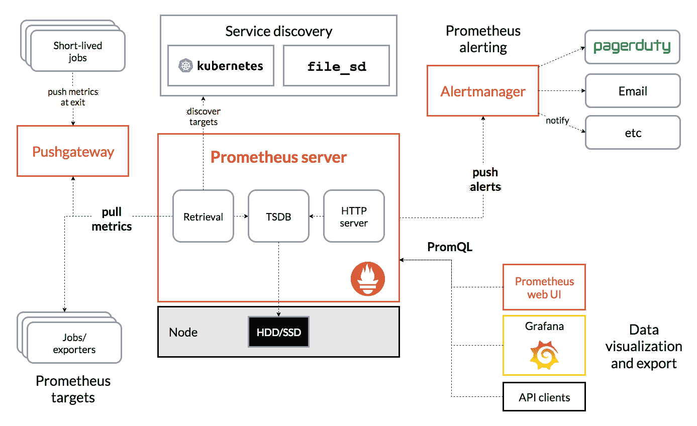
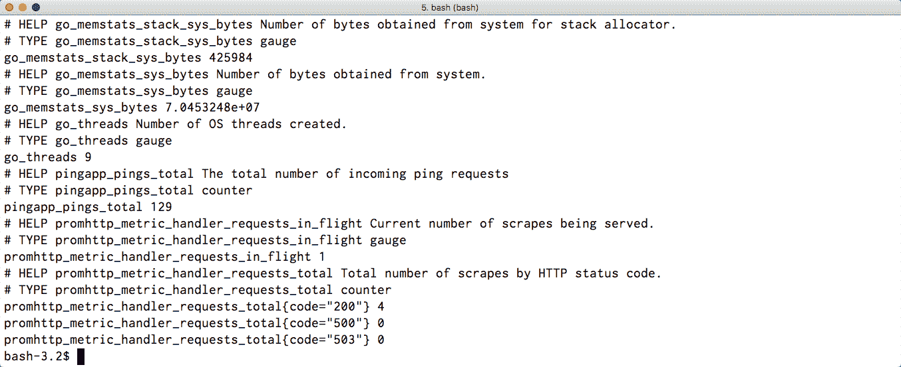
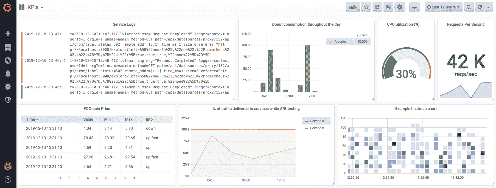

# 指标收集和可视化

"衡量的是改进的。"

- 彼得·德鲁克

在前面的章节中，我们将我们的初始单体应用程序转换为一组微服务，这些服务现在正在我们的 Kubernetes 集群内部运行。这种范式转变向我们的项目需求列表中引入了一个新项目：作为系统操作员，我们必须能够监控每个单独服务的健康状况，并在出现问题时收到通知。

我们将本章从比较流行的指标捕获和聚合系统的优缺点开始。然后我们将关注 Prometheus，这是一个完全用 Go 编写的流行指标收集系统。我们将探讨为我们的代码添加仪表的方法，以促进指标的高效收集和导出。在本章的最后部分，我们将研究使用 Grafana 可视化我们的指标以及使用 Alertmanager 处理、分组、去重并将传入警报路由到一组通知系统集成。

本章将涵盖以下主题：

+   解释 SRE 术语（如 SLIs、SLOs 和 SLAs）之间的区别

+   指标收集基于推送和拉取的系统比较以及每种方法的优缺点分析

+   设置 Prometheus 并学习如何为收集和导出指标仪表化您的 Go 应用程序

+   运行 Grafana 作为我们的指标的可视化前端

+   使用 Prometheus 生态系统工具来定义和处理警报

# 技术要求

本章将要讨论的主题的完整代码已发布在本书的 GitHub 仓库中的 `Chapter13` 文件夹下。

您可以通过将您的网络浏览器指向以下 URL 来访问本书的 GitHub 仓库，该仓库包含本书各章节的所有代码和所需资源：[`github.com/PacktPublishing/Hands-On-Software-Engineering-with-Golang`](https://github.com/PacktPublishing/Hands-On-Software-Engineering-with-Golang)。

为了让您尽快开始，每个示例项目都包含一个 Makefile，它定义了以下目标集：

| **Makefile 目标** | **描述** |
| --- | --- |
| `deps` | 安装所需的任何依赖项 |
| `test` | 运行所有测试并报告覆盖率 |
| `lint` | 检查 lint 错误 |

与本书中的其他章节一样，您需要一个相当新的 Go 版本，您可以从 [`golang.org/dl`](https://golang.org/dl)*.* 下载。

要运行本章中的一些代码，您需要在您的机器上安装一个可工作的 Docker ^([3]) 安装。

# 从站点可靠性工程师的角度进行监控

正如我们在第一章“软件工程鸟瞰”中看到的，监控软件系统的状态和性能是与**站点可靠性工程师**（SRE）角色相关联的关键职责之一。在我们深入探讨监控和警报的主题之前，我们可能需要花几分钟时间澄清以下章节中将要使用的某些 SRE 相关术语。

# 服务级别指标（SLIs）

SLI 是一种指标类型，允许我们从最终用户的角度量化服务的感知质量。让我们看看一些可以应用于基于云服务的常见 SLI 类型：

+   **可用性**定义为两个数量的比率：服务可供最终用户/客户使用的时间和服务的总部署时间（包括任何停机时间）。例如，如果我们运营的服务在过去一年中因维护而离线约*53*分钟，我们可以说该服务在同一期间具有**99.99%**的可用性。

+   **吞吐量**定义为在给定时间段内服务处理请求数量（例如，每秒请求数）。

+   **延迟**是另一个有趣的 SLI，定义为服务器处理传入请求并返回响应给客户端所需的时间。

# 服务级别目标（SLOs）

在第五章“链接之用”项目中，我们首次介绍了链接之用项目，我们简要讨论了服务级别目标（SLOs）的概念，并为我们将要工作的系统提供了一些示例 SLOs。

SLO 被定义为 SLI 的值范围，它允许我们向最终用户或客户提供特定水平的服务。

根据基础服务级别指标（SLI），SLOs 可以是下限（SLI >= 目标），上限（SLI <= 目标），或者两者（下限 <= SLI >= 上限）。

SLO 定义通常包括三个部分：我们正在测量的东西的描述（SLI）、以百分比表示的预期服务级别，以及测量发生的期间。让我们快速看一下一些 SLO 示例：

+   当在单月期间测量时，系统的正常运行时间必须至少为 99%。

+   当在一年期间内测量时，对 X 的 95%服务请求的响应时间不得超过 100 毫秒。

+   当在一天期间测量时，数据库的 CPU 利用率必须在[40%，70%]范围内。

# 服务级别协议（SLAs）

SLA 是服务提供商与一个或多个服务消费者之间的一种隐式或显式合同。SLA 概述了必须满足的一组 SLOs 以及满足和未能满足这些 SLOs 的后果。

注意，根据提供的服务类型，消费者的角色可以由外部第三方或内部公司利益相关者承担。在前一种情况下，SLA 通常会定义一个因未能达到协议中的 SLO 而应受的财务处罚清单。在后一种情况下，SLA 条款可能不那么严格，但无论如何，在编写其他下游服务的 SLA 时必须考虑这一点。

理解了这些与 SRE 相关的术语后，让我们继续讨论指标。

# 探索收集和汇总指标的选择

现代基于微服务的系统固有的复杂性和定制化水平，导致了专门工具的发展，以促进指标的收集和汇总。

在本节中，我们将简要讨论一些用于完成此任务的流行软件。

# 比较推送与拉取系统

根据启动数据收集的实体，可以将监控和指标汇总系统分为两大类：

+   在**基于推送**的系统中，客户端（例如，运行在节点上的应用程序或数据收集服务）负责将指标数据传输到指标汇总系统。此类系统的例子包括 StatsD ^([11])、Graphite ^([5]) 和 InfluxDB ^([6])。

+   在**基于拉取**的系统中，指标收集是指标汇总系统的责任。在通常被称为*抓取*的操作中，指标系统启动与指标生产者的连接，并检索可用的指标集。此类系统的例子包括 Nagios ^([7]) 和 Prometheus ^([10])。在下一节中，我们将更详细地探讨 Prometheus。

基于推送和拉取的系统各有其优缺点。从软件工程师的角度来看，推送系统通常被认为更容易接口。上述所有推送系统实现都支持基于文本的协议来提交指标。您只需打开一个套接字（TCP 或 UDP）连接到指标收集器，并开始提交指标值。实际上，如果我们使用 StatsD 或 Graphite 并想增加一个名为`requests`的计数器，我们可以仅使用标准的 Unix 命令行工具来完成，如下所示：

```go
# Incrementing a statsd counter 
echo "requests:1|c" | nc statsd.local 8125

# Incrementing a graphite counter 
echo "requests 1 `date +%s`" | nc graphite.local 2003
```

缺乏适当的流量控制机制是推送系统相关的一个注意事项。如果指标生产的速率突然激增，超出了收集器处理、汇总和/或索引传入指标的能力，那么收集器最终可能变得不可用，或者以严重的延迟响应查询。

另一方面，在**基于拉取**的系统中，指标的摄取速率由收集器控制。收集器可以通过调整其抓取速率来补偿，从而对指标生产速率的突然激增做出反应。

拉取式系统通常被认为比基于推送的系统更具可扩展性。

关于如何将 Prometheus 这样的系统扩展以支持抓取大量节点的一些轶事证据，我强烈建议查看 Mathew Campbell 关于 DigitalOcean 如何收集大规模指标的某些策略的引人入胜的演讲^([1])。

当然，拉取式系统也有其自身的缺点。首先，在拉取式系统中，收集器需要提供要抓取的端点列表！这意味着需要操作员手动配置这些端点，或者暗示存在某种发现机制来自动化此过程。

其次，这种模型假设收集器可以**始终**与各种端点建立连接。然而，这并不总是可能的！考虑这样一个场景，我们想要抓取部署到私有子网的服务。那个特定的子网几乎被完全锁定，不允许来自收集器部署的子网的入站流量。在这种情况下，我们唯一的选项就是使用基于推送的机制来获取指标（当入站流量被阻止时，出站流量通常是被允许的）。

# 使用 Prometheus 捕获指标

Prometheus 是一个在 SoundCloud 创建的基于拉取的指标收集系统，随后作为开源软件发布。以下插图（摘自官方 Prometheus 文档）描述了构成 Prometheus 生态系统的基本组件：



图 1：Prometheus 架构

简要描述一下前面图中展示的每个组件的作用：

+   **Prometheus 服务器**是 Prometheus 的核心组件。其主要职责是定期抓取配置的目标集，并将收集到的任何指标持久化到时间序列数据库中。作为次要任务，服务器评估操作员定义的警报规则列表，并在满足任何这些规则时发出警报事件。

+   **Alertmanager**组件接收 Prometheus 服务器发出的任何警报，并通过一个或多个通信渠道（例如，电子邮件、Slack 或第三方呼叫服务）发送通知。

+   服务发现层允许 Prometheus 通过查询外部服务（例如，Consul^([2]））或 API（例如，由 Kubernetes 等容器编排层提供的 API）来动态更新要抓取的端点列表。

+   **Pushgateway** 组件模拟了一个基于推送的系统，用于从无法刮取的来源收集指标。这包括 Prometheus 无法直接访问的服务（例如，由于严格的网络策略），以及短暂的批量作业。这些服务可以将它们的指标流推送到一个网关，该网关充当 Prometheus 可以像其他端点一样刮取的中间缓冲区。

+   客户端通过提交以称为 **PromQL** 的定制查询语言编写的查询从 Prometheus 获取数据。此类客户端的一个例子是 **Grafana** ^([4])，这是一个开源的查询和可视化指标的解决方案。

我们将在接下来的章节中更详细地探讨这些组件。

# 支持的指标类型

当涉及到像 Prometheus 这样的复杂指标收集系统时，您通常会期望支持广泛的指标类型。除非您有使用 Prometheus 的先前经验，否则您可能会惊讶地发现它只支持四种类型的指标。然而，在实践中，当这些指标类型与 PromQL 语言的表述性相结合时，这些就是我们需要来模拟任何我们可以想到的 SLI 的所有内容！以下是 Prometheus 支持的指标列表：

+   **计数器**：计数器是一个累积指标，其值随时间单调递增。计数器可以用来跟踪对服务的请求数量、应用程序的下载次数等。

+   **仪表**：仪表跟踪一个可以上升或下降的单个值。仪表的常见用例是记录服务器节点关于使用情况（例如，CPU、内存和负载）的统计数据，以及特定服务的当前连接用户总数等指标。

+   **直方图**：直方图对观测值进行采样，并将它们分配到预配置的桶中。同时，它跟踪所有桶中的项目总数，从而使得计算直方图内容的分位数和/或聚合成为可能。直方图可以用来回答诸如“在过去一小时中，为 90% 的请求提供服务的时间是多少？”等问题。

+   **摘要**：摘要与直方图类似，因为这两种指标类型都支持分桶和计算分位数。然而，摘要直接在客户端执行分位数计算，可以用作减少服务器查询负载的替代方案。

# 自动检测刮擦目标

当涉及到配置要刮取的端点集时，Prometheus 的灵活性表现得尤为出色。在本节中，我们将检查用于静态或动态配置 Prometheus 从中提取指标的一组端点的指示性选项列表。有关支持的发现选项的完整列表，您可以参考 Prometheus 文档 ^([8])。

# 静态和基于文件的刮擦目标配置

静态抓取配置被认为是向 Prometheus 提供抓取目标的标准方式。操作员在 Prometheus 配置文件中包含一个或多个静态配置块，定义要抓取的目标主机列表以及应用于抓取指标的标签集。您可以在以下代码中看到一个这样的示例块：

```go
static_configs:
 - targets:
 - "host1"
 - "host2"
 labels:
 service: "my-service"
```

静态配置方法的一个问题是，在更新 Prometheus 配置文件后，我们需要重新启动 Prometheus，以便它可以获取更改。

一个更好的选择是将静态配置块提取到外部文件中，然后通过`file_sd_config`选项从 Prometheus 配置中引用该文件：

```go
file_sd_configs:
 - files:
 - config.yaml
 refresh_interval: "5m"
```

当启用基于文件的发现时，Prometheus 将监视指定的文件集以查找更改，并在检测到更改后自动重新加载其内容。

# 查询底层云提供商

默认情况下，Prometheus 可以被配置为利用云提供商（如 AWS、GCE、Azure 和 OpenStack）提供的本地 API，以检测已配置的计算节点实例，并将它们作为抓取目标提供。

Prometheus 发现的每个节点都会自动注解一系列*特定提供者*的元标签。然后，这些标签可以通过操作员定义的匹配规则引用，以过滤掉操作员不感兴趣的任何节点。

例如，假设我们只想抓取带有名为`scrape`且值为`true`的标签的 EC2 实例。我们可以使用如下配置块来实现这一点：

```go
ec2_sd_configs:
 # omitted: EC2 access keys (see prometheus documentation)
 relabel_configs:
 - source_labels: ["__meta_ec2_tag_scrape"]
 regex: "true"
 action: "keep"
```

当 Prometheus 发现新的 EC2 实例时，它将自动迭代其标签集，并生成名称遵循模式`__meta_ec2_tag_<tagkey>`的标签，并将它们的值设置为观察到的标签值。前面的片段中的过滤规则将丢弃任何`__meta_ec2_tag_scrape`标签的值不匹配提供的正则表达式的节点。

# 利用 Kubernetes 公开的 API

在本章中，我们将讨论的最后一种抓取目标发现方法，强烈推荐用于在 Kubernetes 之上运行的工作负载，例如“链接‘R’我们”项目。一旦启用，Prometheus 将调用 Kubernetes 公开的 API 端点，以获取操作员感兴趣抓取的资源类型信息。

Prometheus 可以被配置为为以下类型的 Kubernetes 资源创建抓取目标：

| **资源类型** | **描述** |
| --- | --- |
| **节点** | 为 Kubernetes 集群中的每个节点创建一个抓取目标，并允许我们收集可以通过运行工具（如 node-exporter ^([9]）导出的机器级指标。 |
| **服务** | 扫描 Kubernetes 的 `Service` 资源并为每个暴露的端口创建一个抓取目标。Prometheus 将随后尝试通过在服务 IP 地址上对每个暴露的端口执行定期的 HTTP GET 请求来拉取由服务背后的 pod 暴露的任何指标。这种方法依赖于 `Service` 资源通过将每个传入请求委派给不同的 pod 来充当负载均衡器的事实，并且可能比同时从所有 pod 拉取指标有更好的性能。 |
| **Pod** | 发现所有 Kubernetes 的 `Pod` 资源并为它们的每个容器创建一个抓取目标。然后 Prometheus 将并行执行定期的 HTTP GET 请求以从每个单独的容器中拉取指标。 |
| **入口** | 为 `Ingress` 资源上的每个路径创建一个目标。 |

与云感知发现实现类似，Prometheus 将使用特定于资源的元标签集注释已发现的集合目标。基于前面的示例，你能猜出以下配置块做了什么？

```go
kubernetes_sd_configs:
 # omitted: credentials and endpoints for accessing k8s (see prometheus documentation)
 - role: endpoints
 relabel_configs:
 - source_labels: ["__meta_kubernetes_service_annotation_**prometheus_scrape**"]
 action: "keep"
 regex: "true"
```

由于我们指定了 `role` 等于 `endpoints`，Prometheus 将获取与该服务关联的 pod 列表。如果 – 仅当 – 它们的父 **服务** 包含名为 `prometheus_scrape` 且值为 `true` 的注释时，Prometheus 将为每个 pod 创建一个抓取目标。这个技巧使得通过编辑 Kubernetes 清单来启用我们集群中任何服务的自动抓取变得非常简单。

# 量化 Go 代码

为了使 Prometheus 能够从我们的部署服务中抓取指标，我们需要执行以下步骤序列：

1.  定义我们感兴趣跟踪的指标。

1.  量化我们的代码库，以便在适当的位置更新上述指标值。

1.  收集指标数据并使其可通过 HTTP 进行抓取。

基于微服务架构的关键好处之一是软件工程师在构建他们的服务时不再受限于使用单一编程语言。看到用 Go 编写的微服务与其他用 Rust 或 Java 编写的服务进行通信是非常常见的。尽管如此，全面监控服务的需求仍然普遍存在。

为了让软件工程师尽可能容易地与 Prometheus 集成，其作者为不同的编程语言提供了客户端库。所有这些客户端都有一个共同点：它们处理在注册和导出 Prometheus 指标中涉及的所有底层细节。

下文示例依赖于官方 Prometheus Go 客户端包。您可以通过执行以下命令进行安装：

```go
go get -u github.com/prometheus/client_golang/prometheus/...
```

# 在 Prometheus 中注册指标

`promauto`是 Prometheus 客户端的一个子包，它定义了一组方便的辅助函数，用于以尽可能少的代码创建和注册度量。`promauto`包中的每个构造函数都返回一个 Prometheus 度量实例，我们可以在代码中立即使用。

让我们快速看一下注册和填充 Prometheus 支持的一些最常见度量类型是多么容易。我们将实例化的第一个度量类型是一个简单的计数器：

```go
numReqs := promauto.NewCounter(prometheus.CounterOpts{
 Name: "app_reqs_total",
 Help: "The total number of incoming requests",
})

// Increment the counter.
numReqs.Inc()

// Add a value to the counter.
numReqs.Add(42)
```

每个 Prometheus 度量都必须分配一个唯一的名称。如果我们尝试注册具有相同名称的度量两次，我们将得到一个错误。更重要的是，在注册新度量时，我们可以可选地指定一个帮助信息，该信息提供了有关度量目的的附加信息。

如前述代码片段所示，一旦我们获得一个计数器实例，我们可以使用`Inc`方法来增加其值，使用`Add`方法向计数器添加任意正数值。

我们将要实例化的下一类度量是一个仪表。仪表与计数器非常相似，除了它们的值可以上升或下降。除了`Inc`和`Add`方法外，仪表实例还提供了`Dec`和`Sub`方法。以下代码块定义了一个仪表度量，用于跟踪队列中挂起的项的数量：

```go
queueLen := promauto.NewGauge(prometheus.GaugeOpts{
 Name: "app_queue_len_total",
 Help: "Total number of items in the queue.",
})

// Add items to the queue
queueLen.Inc()
queueLen.Add(42)

// Remove items from the queue
queueLen.Sub(42)
queueLen.Dec()
```

为了总结我们对不同类型 Prometheus 度量的实验，我们将创建一个直方图度量。`NewHistogram`构造函数期望调用者指定一个严格递增的`float64`值列表，这些值描述了直方图中每个桶的宽度。

以下示例使用`prometheus`包中的`LinearBuckets`辅助函数生成`20`个具有`100`单位宽度的不同桶。最左侧直方图桶的下限将被设置为值`0`：

```go
reqTimes := promauto.NewHistogram(prometheus.HistogramOpts{
 Name:    "app_response_times",
 Help:    "Distribution of application response times.",
 Buckets: prometheus.LinearBuckets(0, 100, 20),
})

// Record a response time of 100ms
reqTimes.Observe(100)
```

向直方图实例添加值非常简单。我们只需要简单地调用其`Observe`方法，并将我们希望跟踪的值作为参数传递。

# 基于向量的度量

Prometheus 的一个更有趣的特性是它支持在维度（在 Prometheus 术语中称为*labels*）之间分区收集的样本。如果我们选择使用此功能，而不是有一个单个的度量实例，我们可以与一个**向量**的度量值一起工作。

在以下示例中，我们刚刚启动了一个针对新网站布局的 A/B 测试，并且我们感兴趣的是跟踪我们正在积极试验的每个页面布局的用户注册数量：

```go
regCountVec := promauto.NewCounterVec(
 prometheus.CounterOpts{
 Name: "app_registrations_total",
 Help: "Total number of registrations by A/B test layout.",
 },
 []string{"layout"},
)

regCountVec.WithLabelValues("a").Inc()
```

这次，我们将不再使用单个计数器，而是创建一个计数器向量，其中每个采样值都将自动标记为一个名为`layout`的标签。

要增加或添加到此指标的值，我们需要通过在 `regCountVec` 变量上调用变长 `WithLabelValues` 方法来获取正确的计数器。此方法期望为每个定义的维度提供一个字符串值，并返回与提供的标签值相对应的计数器实例。

# 导出用于抓取的指标

在将我们的指标注册到 Prometheus 并对代码进行配置以在需要时更新它们之后，我们唯一需要做的事情就是通过 HTTP 暴露收集到的值，以便 Prometheus 可以抓取它们。

Prometheus 客户端包中的 `promhttp` 子包提供了一个名为 `Handler` 的便利辅助函数，该函数返回一个 `http.Handler` 实例，该实例封装了导出收集到的指标所需的所有逻辑，这些指标符合 Prometheus 期望的格式。

导出的数据不仅包括开发人员注册的指标，还包括与 Go 运行时相关的广泛指标列表。以下是一些此类指标的示例：

+   活跃的 goroutine 数量

+   关于栈和堆分配的信息

+   Go 垃圾收集器的性能统计

以下示例演示了一个最小、自包含的 hello-world 类型的应用程序，该应用程序定义了一个计数器指标并公开了两个 HTTP 路由：`/ping` 和 `/metrics`。第一个路由的处理程序增加计数器，而后者导出收集到的 Prometheus 指标：

```go
func main() {
 // Create a prometheus counter to keep track of ping requests.
 numPings := promauto.NewCounter(prometheus.CounterOpts{
 Name: "pingapp_pings_total",
 Help: "The total number of incoming ping requests",
 })

 http.Handle("/metrics", promhttp.Handler())
 http.Handle("/ping", http.HandlerFunc(func(w http.ResponseWriter, _ *http.Request) {
 numPings.Inc()
 w.Write([]byte("pong!\n"))
 }))

 log.Fatal(http.ListenAndServe(":8080", nil))
}
```

尝试编译并运行前面的示例。您可以在本书 GitHub 仓库的 `Chapter13/prom_http` 文件夹中找到其源代码。当示例运行时，切换到另一个终端并执行几个 `curl localhost:8080/ping` 命令来增加 `pingapp_pings_total` 计数器。

然后，执行一个 `curl localhost:8080/metrics` 命令并检查导出的指标列表。以下截图显示了执行前面命令后的最后几行输出：



图 2：我们的示例 Go 应用程序导出的一组指标

如您所见，输出不仅包括 `pingapp_pings_total` 计数器的当前值，还包括 Prometheus 客户端为我们自动捕获的几个其他重要指标。

# 使用 Grafana 可视化收集到的指标

到目前为止，您应该已经为您的应用程序选择了一个合适的指标收集解决方案，并配置了您的代码库以发出您感兴趣跟踪的指标。为了使收集到的数据有意义并对其进行分析，我们需要对其进行可视化。

对于这个任务，我们将使用 Grafana ^([4]) 作为我们的首选工具。Grafana 提供了一个方便的端到端解决方案，可以用于从各种不同的数据源检索指标并为它们构建仪表板进行可视化。支持的数据源列表包括 Prometheus、InfluxDB、Graphite、Google Stackdriver、AWS CloudWatch、Azure Monitor、SQL 数据库（MySQL、Postgres 和 SQL Server）以及 Elasticsearch。

如果你已经设置了一个前面的数据源并且想要评估 Grafana，最简单的方法是使用以下命令启动一个 Docker 容器：

```go
docker run -d \
  -p 3000:3000 \
  --name=grafana \
  -e "GF_SECURITY_ADMIN_USER=admin" \
  -e "GF_SECURITY_ADMIN_PASSWORD=secret" \
  grafana/grafana
```

然后，你可以将你的浏览器指向 `http://localhost:3000`，使用前面的凭据登录，并遵循 Grafana 网站上提供的几个综合指南之一来配置你的第一个仪表板。

在支持的可视化小部件方面，标准的 Grafana 安装支持以下 widget 类型：

+   **图形**：一个灵活的可视化组件，可以绘制单系列和多系列线图或条形图。此外，图形小部件可以配置为以重叠或堆叠模式显示多个系列。

+   **日志面板**：一个日志条目列表，这些条目是通过兼容的数据源（例如，Elasticsearch）获取的，其内容与另一个小部件显示的信息相关联。

+   **单值统计**：一个通过应用聚合函数（例如，min、max、avg 等）将系列压缩为单个值的组件。此组件可以配置为显示折线图或作为仪表渲染。

+   **热图**：一个专门组件，用于渲染直方图值随时间的变化。如图所示，热图由一系列垂直切片组成，其中每个切片描述特定时间点的直方图值。与典型的直方图图不同，直方图的高度表示特定桶中项目的数量，而热图则使用颜色图来可视化每个垂直切片中项目的频率。

+   **表格**：一个最适合以表格格式渲染系列组件。

以下截图展示了内置的 Grafana 小部件，它们将如何在示例仪表板中显示：



图 3：使用 Grafana 构建的示例仪表板

除了默认的内置小部件外，操作员可以通过利用 Grafana 的插件机制安装额外的 widget 类型。此类小部件的示例包括世界地图、雷达图、饼图和气泡图。

# 使用 Prometheus 作为端到端警报解决方案

通过对应用程序进行监控并部署必要的指标抓取基础设施，我们现在有了评估我们每个服务 SLIs（Service Level Indicators）的手段。一旦我们为每个 SLI 定义了一套合适的 SLOs（Service Level Objectives），我们清单上的下一项就是部署一个警报系统，这样我们就可以在 SLOs 不再满足时自动收到通知。

一个典型的警报规范看起来像这样：

*当指标值**X**超过阈值**Y**，并且持续**Z**个时间单位时，执行操作**a1, a2, a[n]***

当你听到火灾警报响起时，你首先想到的是什么？大多数人可能会回答类似“附近可能发生了火灾”的话。人们天生就会假设警报总是与必须立即解决的问题在时间上相关联。

当涉及到监控生产系统的健康状态时，一旦触发就需要人工操作员立即干预的警报已经几乎成为标准操作程序。然而，这并不是 SRE 在处理此类系统时可能遇到的唯一类型的警报。很多时候，能够主动检测并解决在失控并成为生产系统稳定性风险之前的问题，是平静的夜晚和可怕的凌晨 2 点被叫醒之间的唯一区别。

这里有一个主动警报的例子：SRE 设置了一个警报，一旦数据库节点的磁盘使用率超过可用存储容量的 80%，就会触发。请注意，当警报确实触发时，数据库仍在正常工作，没有任何问题。然而，在这种情况下，SRE 有足够的时间来计划和执行所需的一系列步骤（例如，安排维护窗口来调整分配给数据库的磁盘大小），以尽可能减少对数据库服务的干扰来解决问题。

将前一个案例与一个不同的情况进行对比，在这种情况下，SRE（Site Reliability Engineer）被呼叫是因为数据库确实已经没有空间了，因此，现在有多个依赖于数据库的服务已经离线。对于 SRE 来说，这是一个特别紧张的情况，因为系统已经处于停机状态。

# 使用 Prometheus 作为警报事件的源

为了将 Prometheus 用作警报生成源，操作员必须定义一组 Prometheus 应该监控的警报规则。警报规则定义存储在外部 YAML 文件中，这些文件通过`rule_files`块被主 Prometheus 配置文件导入，如下所示：

```go
# prometheus.yml

global:
 scrape_interval:     15s

rule_files:
 - 'alerts/*.yml'
```

Prometheus 将多个警报规则组织成**组**。组内的规则总是**顺序**评估，而每个组是**并行**评估的。

让我们看看一个简单的警报定义的结构。以下代码片段定义了一个名为`example`的警报组，其中包含一个警报定义：

```go
groups:
- name: example
 rules:
 - alert: InstanceDown
 expr: up == 0
 for: 5m
 labels:
 severity: page
 annotations:
 playbook: "https://sre.linkrus.com/playbooks/instance-down"
```

每个警报块都必须始终分配一个唯一的名称，以及 Prometheus 将每次评估警报规则时重新计算的一个**PromQL**（即**Prometheus 查询语言**）表达式。在前面的例子中，规则表达式在`up`指标的值变为零时得到满足。

可选的`for`子句可以用来延迟警报的触发，直到经过特定的时间段，在此期间警报表达式必须始终满足。在这个例子中，只有当`up`指标至少保持 5 分钟为零时，警报才会触发。

`labels`块允许我们给警报附加一个或多个标签。在这种情况下，我们给警报添加一个`severity: page`注释，以通知负责处理警报的组件，它应该呼叫当前值班的服务可靠性工程师（SRE）。

最后，`annotations`块允许操作员存储额外的信息，例如警报的详细描述或指向处理此类警报的 playbook 的 URL。

playbook 是一个简明的文档，总结了解决特定问题的最佳实践。这些文档提前编写，通常附加到由于警报触发的所有发出的通知。

当服务可靠性工程师（SRE）被呼叫时，能够访问与特定警报关联的 playbook 是无价资产，可以快速诊断问题的根本原因并减少**平均修复时间**（**MTTR**）。

# 处理警报事件

Prometheus 将定期评估配置的警报规则集，并在满足规则的前提条件时发出警报事件。按照设计，Prometheus 服务器只负责发出警报事件；它不包含任何处理警报的逻辑。

实际处理发出的警报事件由 Alertmanager 组件负责。Alertmanager 消费由 Prometheus 发出的警报事件，并负责将每个警报分组、去重并将警报路由到适当的通知集成（在 Alertmanager 术语中称为**接收器**）。

我们将简要介绍 Alertmanager 组件，详细说明操作员如何使用其内置的分组和过滤功能来管理传入的警报事件。接下来，我们将了解定义警报接收器和配置路由规则的基本知识，以确保警报始终被发送到正确的接收者。

# 将警报分组

处理同时触发的大量警报，从服务可靠性工程师（SRE）的角度来看，确实是一项艰巨的任务。为了过滤掉噪音，Alertmanager 允许操作员指定一组规则，根据 Prometheus 为每个警报事件分配的标签内容来分组警报。

要了解警报分组是如何工作的，让我们设想一个场景，其中 100 个微服务都在尝试连接当前不可用的 Kafka 队列。**每个**服务都会触发一个高优先级警报，这反过来又会导致向当前值班的服务可靠性工程师（SRE）发送新的页面通知。结果，SRE 将收到数百条关于确切相同问题的页面通知！

为了避免这种情况，一个更好的解决方案是编辑 Prometheus 警报规则定义，并确保所有针对队列服务的警报事件都带有特定的标签，例如，`component=kafka`。然后，我们可以指示 Alertmanager 根据标签`component`的值对警报进行分组，并将所有与 Kafka 相关的警报合并为一条`单一页面通知`。

# 选择性静音警报

另一个你应该注意的 Alertmanager 功能是**警报抑制**。此功能允许操作员在特定警报正在触发时，对一组警报的提醒进行静音。

当 Alertmanager 加载其配置文件时，它会在顶级`inhibit_rules`键下查找警报抑制规则的列表。每个规则条目都必须遵循以下模式：

```go
source_match:
 [ <labelname>: <labelvalue>, ... ]
source_match_re:
 [ <labelname>: <regex>, ... ]

target_match:
 [ <labelname>: <labelvalue>, ... ]
target_match_re:
 [ <labelname>: <regex>, ... ]

[ equal: '[' <labelname>, ... ']' ]
```

`source_match`和`source_match_re`块作为激活抑制规则的警报的选择器。这两个块之间的区别在于，`source_match`尝试进行精确匹配，而`source_math_re`将传入警报的标签值与正则表达式进行匹配。

`target_match`和`target_match_re`块用于选择在抑制规则激活期间将被抑制的警报集合。

最后，`equal`块防止抑制规则在没有源和目标规则具有指定标签相同值的情况下激活。

为了防止警报抑制自身，匹配规则源和目标侧的警报不允许被抑制。

作为一个概念验证，让我们尝试定义一条规则，以抑制周末期间触发的任何警报。设置此规则的前提是创建一个仅在周末触发的 Prometheus 警报。然后，我们可以在 Alertmanager 的配置文件中添加以下块：

```go
inhibit_rules:
 - source_match:
 alertname: Weekend
 target_match_re:
 alertname: '*'
```

当`周末`警报正在触发时，任何其他警报（不包括自身）将被自动静音！

# 配置警报接收器

接收器不过是一个高级别的术语，指的是可以发送警报通过各种渠道的通知集成集合。开箱即用，Alertmanager 支持以下集成：

+   **电子邮件**：发送包含警报详情的电子邮件

+   **Slack/Hipchat/WeChat**：将警报详情发布到聊天服务

+   **PagerDuty/Opsgenie/VictorOps**：向当前值班的 SRE 发送页面通知

+   **WebHooks**：实现自定义集成的逃生舱

当 Alertmanager 加载其配置文件时，它会在顶级`receivers`键下查找接收者定义列表。每个接收者块必须遵循以下架构：

```go
name: <string>
email_configs:
 [ - <email_config>, ... ]
pagerduty_configs:
 [ - <pagerduty_config>, ... ]
slack_configs:
 [ - <slack_config>, ... ]
opsgenie_configs:
 [ - <opsgenie_config>, ... ]
webhook_configs:
 [ - <webhook_config>, ... ]
# omitted for brevity: configs for additional integrations
```

每个接收者都必须分配一个唯一的名称，正如我们将在下一节中看到的，该名称可以被一个或多个路由规则引用。然后操作员必须为每个在警报达到接收者时应激活的通知机制指定配置。

然而，如果操作员没有提供任何配置块，接收者表现得像一个黑洞：任何到达它的警报都会被简单地丢弃。

# 将警报路由到接收者

现在，让我们更深入地看看 Alertmanager 用于将传入警报路由到特定接收者的基于树的机制。Alertmanager 配置文件的最高级部分必须**始终**定义一个`route`块。该块代表树的根节点，可以包含以下一组字段：

+   `match`：指定一组标签值，这些值必须与传入警报的值匹配，才能将当前路由节点视为匹配。

+   `match_re`：与`match`类似，但标签值是匹配正则表达式。

+   `receiver`：如果警报匹配当前路由，将传入警报交付给接收者的接收者名称。

+   `group_by`：一组用于按标签分组传入警报的标签名称。

+   `routes`：一组子`route`块。如果警报不匹配任何子路由，它将根据当前路由的配置参数进行处理。

要了解基于树的路由在实际中是如何工作的，让我们通过一个简单的例子来逐步分析。为了这个例子，Alertmanager 的配置文件包含以下路由配置：

```go
route:
 receiver: 'default'
 # All alerts that do not match the following child routes
 # will remain at the root node and be dispatched to 'default-receiver'.
 routes:
 - receiver: 'page-SRE-on-call'
 match_re:
 service: cockroachdb|cassandra
 - receiver: 'notify-ops-channel-on-slack'
 group_by: [environment]
 match:
 team: backend

receivers:
 # omitted: receiver definitions
```

让我们通过检查它们的标签注释来看看 Alertmanager 是如何确定各种传入警报的适当接收者的：

+   如果传入的警报包含一个值为`cockroachdb`或`cassandra`的`service`标签，Alertmanager 将把警报发送到`page-SRE-on-call`接收者。

+   另一方面，如果警报包含一个值为`backend`的`team`标签，Alertmanager 将把它发送到`notify-ops-channel-on-slack`接收者。

+   任何其他不匹配两个子路由的传入警报将默认发送到`default`接收者。

这就完成了我们对 Alertmanager 工具的浏览。诚然，为您的应用程序配置警报规则可能一开始看起来是一项艰巨的任务。希望您通过阅读本章获得的知识将使您能够开始尝试使用 Prometheus 并设置一些基本的 Alertmanager 测试规则。经过一点实践，一旦您掌握了规则语法，您会发现为监控生产应用程序编写更复杂的规则将变得轻而易举！

# 摘要

在本章的开头，我们讨论了使用 Prometheus 这样的指标收集系统从我们的部署应用以及基础设施（例如，Kubernetes 主/工作节点）中抓取和聚合指标数据的优缺点。

然后，我们学习了如何利用官方的 Prometheus 客户端包为 Go 编写代码进行仪表化，并通过 HTTP 导出收集到的指标，以便 Prometheus 可以抓取它们。接下来，我们赞扬了使用 Grafana 通过从异构源拉取指标来构建仪表板的优点。在本章的最后部分，我们学习了如何在 Prometheus 中定义警报规则，并深入理解了使用 Alertmanager 工具对 Prometheus 发出的警报事件进行分组、去重和路由。

通过利用本章获得的知识，你将能够对你的 Go 代码库进行仪表化，并确保可以收集、聚合和可视化应用程序状态和性能的重要指标。此外，如果你的当前角色还包括 SRE 职责，你可以随后将这些指标输入到警报系统中，并在你的服务 SLA 和 SLO 未满足时接收实时通知。

接下来，我们将介绍一些有趣的想法，以扩展本书中构建的内容，从而进一步加深对材料的理解。

# 问题

1.  SLI 和 SLO 之间的区别是什么？

1.  解释 SLA 是如何工作的。

1.  基于推送和拉取的指标收集系统之间的区别是什么？

1.  你会使用基于推送或拉取的系统从严格锁定（即无入站）的子网中抓取数据吗？

1.  Prometheus 计数器和度量指标之间的区别是什么？

1.  为什么页面上通知需要附带一个 playbook 的链接？

# 进一步阅读

+   坎贝尔，马修：*使用 Prometheus 扩展到百万台机器*（PromCon 2016）：[`promcon.io/2016-berlin/talks/scaling-to-a-million-machines-with-prometheus`](https://promcon.io/2016-berlin/talks/scaling-to-a-million-machines-with-prometheus)

+   **Consul**: 安全服务网络：[`consul.io`](https://consul.io)

+   **Docker**: 企业级容器平台：[`www.docker.com`](https://www.docker.com)

+   **Grafana**: 开源的可观察性平台：[`grafana.com/`](https://grafana.com/)

+   **Graphite**: 一款适用于企业的监控工具，在廉价硬件或云基础设施上运行同样出色：[`graphiteapp.org/`](https://graphiteapp.org/)

+   **InfluxDB**: 一种设计用于处理高写入和查询负载的时间序列数据库：[`www.influxdata.com/products/influxdb-overview`](https://www.influxdata.com/products/influxdb-overview)

+   **Nagios**: IT 基础设施监控的行业标准：[`www.nagios.org`](https://www.nagios.org)

+   **Prometheus**: 配置选项：[`prometheus.io/docs/prometheus/latest/configuration/configuration`](https://prometheus.io/docs/prometheus/latest/configuration/configuration)

+   **Prometheus**: 机器指标的导出器：[`github.com/prometheus/node_exporter`](https://github.com/prometheus/node_exporter)

+   **Prometheus**: 监控系统和时序数据库：[`prometheus.io`](https://prometheus.io)

+   **StatsD**: 用于轻松但强大的统计聚合的守护进程：[`github.com/statsd/statsd`](https://github.com/statsd/statsd)
