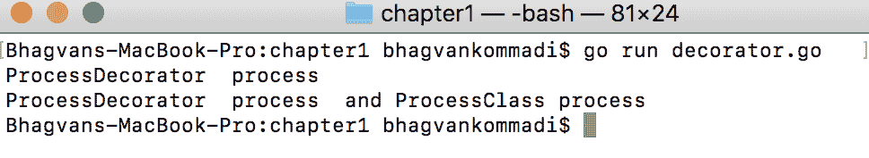

# 数据结构和算法

数据结构是数据的组织方式，旨在减少存储空间的使用，并降低执行不同任务时的难度。数据结构用于处理和操作大量数据，在各个领域都有应用，例如数据库管理和互联网索引服务。

在本章中，我们将重点关注抽象数据类型的定义，将数据结构分类为线性、非线性、同构、异构和动态类型。本章介绍了如容器、列表、集合、映射、图、栈和队列等抽象数据类型。我们还将涵盖数据结构的性能分析、选择合适的数据结构和结构设计模式。

读者可以使用 Go 中的正确数据结构开始编写基本算法。给定一个问题，选择数据结构和不同的算法将是第一步。之后，进行性能分析将是下一步。不同算法的时间和空间分析有助于比较它们，并帮助您选择最优的算法。要开始，对 Go 的基本知识是必要的。

在本章中，我们将涵盖以下主题：

+   数据结构和结构设计模式的分类

+   算法的表示

+   复杂度和性能分析

+   暴力算法

+   分而治之算法

+   回溯算法

# 技术要求

从[`golang.org/doc/install`](https://golang.org/doc/install)为您的操作系统安装 Go 版本 1.10。

本章的代码文件可以在以下 GitHub URL 找到：[`github.com/PacktPublishing/Learn-Data-Structures-and-Algorithms-with-Golang/tree/master/Chapter01`](https://github.com/PacktPublishing/Learn-Data-Structures-and-Algorithms-with-Golang/tree/master/Chapter01)[.](https://github.com/PacktPublishing/Hands-On-Data-Structures-and-Algorithms-with-Go/tree/master/ch1)

通过运行位于[`github.com/PacktPublishing/Learn-Data-Structures-and-Algorithms-with-Golang/tree/master/hello_world`](https://github.com/PacktPublishing/Learn-Data-Structures-and-Algorithms-with-Golang/tree/master/hello_world)的 hello world 程序来检查 Go 的安装：

```go
//main package has examples shown
// in Hands-On Data Structures and algorithms with Go book
package main

// importing fmt package
import (
  "fmt"
)
// main method
func main() {
  fmt.Println("Hello World")
}
```

运行以下命令：

```go
go build
./hello_world
```

以下截图显示了输出：


让我们看看下一节中数据结构和结构设计模式的分类。

# 数据结构和结构设计模式的分类

您可以通过分类来选择数据结构。在本节中，我们将详细讨论数据结构的分类。在分类之后，我们将介绍与数据结构相关的模式设计。

在下一节中，我们将探讨数据结构的分类。

# 数据结构的分类

**数据结构**这个术语指的是在计算机内存中组织数据，以便快速检索以进行处理。它是一种数据组织方案，将数据结构的函数定义与其实现解耦。数据结构的选择基于问题类型和数据上的操作。

如果数据结构需要各种数据类型，我们可以选择异构数据结构。链表、有序列表和无序列表被分组为异构数据结构。线性数据结构包括列表、集合、元组、队列、栈和堆。树、表和容器被归类为非线性数据结构。二维和多维数组被分组为同构数据结构。动态数据结构包括字典、树集和序列。

**数据结构**的分类如下所示：


让我们在下一节中看看列表、元组和堆。

# 列表

列表是元素的序列。每个元素可以通过链接与前一个或后一个元素连接。元素可以具有其他有效载荷属性。这种数据结构是基本容器类型。列表具有可变长度，开发者可以比数组更容易地删除或添加元素。列表中的数据项在内存或磁盘上不需要连续。链表是由 RAND 公司的 Allen Newell、Cliff Shaw 和 Herbert A. Simon 提出的。

要开始，可以使用 Go 中的列表，如下例所示；元素通过列表上的`PushBack`方法添加，该方法是`container/list`包的一部分：

```go
//main package has examples shown
// in Hands-On Data Structures and algorithms with Go book
package main

// importing fmt and container list packages
import (
   "fmt"
   "container/list")

// main method
func main() {
    var intList list.List
    intList.PushBack(11)
    intList.PushBack(23)
    intList.PushBack(34)

    for element := intList.Front(); element != nil; element=element.Next() {
        fmt.Println(element.Value.(int))
    }
}
```

列表可以通过`for`循环迭代，并通过`Value`方法访问元素的值。

运行以下命令：

```go
go run list.go
```

以下截图显示了输出：


让我们在下一节中看看元组。

# 元组

元组是元素有限排序的列表。它是一种将数据分组的数据结构。元组通常是不可变的顺序集合。元素具有不同数据类型的关联字段。修改元组的唯一方法是更改字段。+ 和 * 等运算符可以应用于元组。数据库记录被称为元组。在以下示例中，计算了整数的幂级数，并返回整数的平方和立方作为元组：

```go
//main package has examples shown
// in Hands-On Data Structures and algorithms with Go book
package main

// importing fmt package
import (
  "fmt"

)
//gets the power series of integer a and returns tuple of square of a
// and cube of a
func powerSeries(a int) (int,int) {

  return a*a, a*a*a

}
```

`main`方法使用`3`作为参数调用`powerSeries`方法。方法返回`square`和`cube`值：

```go
// main method
func main() {

  var square int
  var cube int
  square, cube = powerSeries(3)

  fmt.Println("Square ", square, "Cube", cube)

}
```

运行以下命令：

```go
go run tuples.go
```

以下截图显示了输出：


在`powerSeries`函数中，可以为元组命名，如下面的代码所示：

```go
func powerSeries(a int) (square int, cube int) {

  square = a*a

  cube = square*a

  return 

}
```

如果出现错误，它可以与元组一起传递，如下面的代码所示：

```go
func powerSeries(a int) (int, int, error) {

  square = a*a

  cube = square*a

  return square,cube,nil

}
```

# 堆

堆是一种基于 `heap` 属性的数据结构。堆数据结构用于选择、图和 k-路归并算法。在堆上执行查找、合并、插入、键更改和删除等操作。堆是 Go 中的 `container/heap` 包的一部分。根据堆顺序（最大堆）属性，每个节点存储的值大于或等于其子节点。

如果是降序排列，则称为最大堆；否则，是最小堆。堆数据结构由 J.W.J. Williams 在 1964 年提出，用于堆排序算法。它不是一个排序数据结构，但部分有序。以下示例展示了如何使用 `container/heap` 包创建堆数据结构：

```go
//main package has examples shown
//in Hands-On Data Structures and algorithms with Go book
package main

// importing fmt package and container/heap
import (
  "container/heap"
  "fmt"
)
// integerHeap a type
type IntegerHeap []int

// IntegerHeap method - gets the length of integerHeap
func (iheap IntegerHeap) Len() int { return len(iheap) }

// IntegerHeap method - checks if element of i index is less than j index
func (iheap IntegerHeap) Less(i, j int) bool { return iheap[i] < iheap[j] }
// IntegerHeap method -swaps the element of i to j index
func (iheap IntegerHeap) Swap(i, j int) { iheap[i], iheap[j] = iheap[j], iheap[i] }
```

`IntegerHeap` 拥有一个 `Push` 方法，该方法使用以下接口来推送项目：

```go

//IntegerHeap method -pushes the item
func (iheap *IntegerHeap) Push(heapintf interface{}) {

 *iheap = append(*iheap, heapintf.(int))
}
//IntegerHeap method -pops the item from the heap
func (iheap *IntegerHeap) Pop() interface{} {
 var n int
 var x1 int
 var previous IntegerHeap = *iheap
 n = len(previous)
 x1 = previous[n-1]
 *iheap = previous[0 : n-1]
 return x1
}

// main method
func main() {
 var intHeap *IntegerHeap = &IntegerHeap{1,4,5}

 heap.Init(intHeap)
 heap.Push(intHeap, 2)
 fmt.Printf("minimum: %d\n", (*intHeap)[0])
 for intHeap.Len() > 0 {
 fmt.Printf("%d \n", heap.Pop(intHeap))
 }
}
```

运行以下命令：

```go
go run heap.go
```

以下截图显示了输出：


让我们看看下一节的结构设计模式

# 结构设计模式

结构设计模式描述了实体之间的关系。它们用于使用类和对象形成大型结构。这些模式用于以灵活的方式创建具有不同系统块的系统。适配器、桥接、组合、装饰器、外观、享元、私有类数据和代理是 **Gang of Four** (**GoF**) 结构设计模式。私有类数据设计模式是本节中涵盖的另一个设计模式。

我们将在下一节中探讨适配器和桥接设计模式。

# 适配器

适配器模式提供了一个包装器，该包装器具有 API 客户端所需的接口，用于连接不兼容的类型，并在两种类型之间充当翻译器。适配器使用一个类的接口作为具有另一个兼容接口的类。当需求变化时，存在一些场景，由于不兼容的接口，需要更改类功能。

当一个类定义自己的接口到由 `adapter` 类实现的下一级模块接口时，可以通过使用适配器模式来遵循依赖倒置原则。委托是适配器模式使用的另一个原则。处理多种格式并执行源到目标转换的场景是应用适配器模式的场景。

适配器模式包括目标、适配体、适配器和客户端：

+   目标是客户端调用的接口，在适配器和适配体上调用方法。

+   客户端希望适配器实现不兼容的接口。

+   适配器将适配体的不兼容接口转换为客户端想要的接口。

假设你有一个`IProcessor`接口，它有一个`process`方法，`Adapter`类实现了`process`方法，并且有一个`Adaptee`实例作为属性。`Adaptee`类有一个`convert`方法和一个`adapterType`实例变量。当开发者使用 API 客户端时，会调用`process`接口方法来在`Adaptee`上调用`convert`方法。代码如下：

```go
//main package has examples shown
// in Hands-On Data Structures and algorithms with Go book
package main
// importing fmt package
import (
 "fmt"
)
//IProcess interface
type IProcess interface {
 process()
}
//Adapter struct
type Adapter struct {
 adaptee Adaptee
}
```

`Adapter`类有一个`process`方法，它会在`adaptee`上调用`convert`方法：

```go
//Adapter class method process
func (adapter Adapter) process() {
 fmt.Println("Adapter process")
 adapter.adaptee.convert()
}
//Adaptee Struct
type Adaptee struct {
 adapterType int
}
// Adaptee class method convert
func (adaptee Adaptee) convert() {
 fmt.Println("Adaptee convert method")
}
// main method
func main() {
var processor IProcess = Adapter{}
processor.process()
}
```

执行以下命令：

```go
go run adapter.go
```

下面的截图显示了输出：


让我们在下一节中看看桥接模式。

# 桥接模式

桥接模式将实现与抽象解耦。抽象基类可以被子类化以提供不同的实现，并允许轻松修改实现细节。作为桥接的接口有助于使具体类的功能独立于接口实现类。桥接模式允许在运行时更改实现细节。

桥接模式展示了原则，更倾向于组合而非继承。它有助于那些需要多次正交子类化的情况。应用运行时绑定、正交类层次映射和平台独立性实现是桥接模式可以应用的场景。

桥接模式组件包括抽象、细化抽象、实现者和具体实现者。抽象是作为抽象类实现的接口，客户端通过在具体实现者上调用方法来调用它。抽象与实现保持*has-a*关系，而不是*is-a*关系。*has-a*关系通过组合来维护。抽象有一个实现引用。细化抽象比抽象提供更多变体。

假设`IDrawShape`是一个接口，它有一个`drawShape`方法。`DrawShape`实现了`IDrawShape`接口。我们创建了一个带有`drawContour`方法的`IContour`桥接接口。轮廓类实现了`IContour`接口。`ellipse`类将具有*a*、*b*、*r*属性和`drawShape`（`DrawShape`的一个实例）。`ellipse`类实现了`contour`桥接接口以实现`drawContour`方法。`drawContour`方法在`drawShape`实例上调用`drawShape`方法。

下面的代码演示了桥接实现：

```go
//main package has examples shown
// in Hands-On Data Structures and algorithms with Go book
package main
// importing fmt package
import (
 "fmt"
)
//IDrawShape interface
type IDrawShape interface {
 drawShape(x[5] float32,y[5] float32)
}
//DrawShape struct
type DrawShape struct{}
```

# drawShape 方法

`drawShape`方法根据给定的坐标绘制形状，如下面的代码所示：

```go
// DrawShape struct has method draw Shape with float x and y coordinates
func (drawShape DrawShape) drawShape(x[5] float32, y[5] float32) {
 fmt.Println("Drawing Shape")
}
//IContour interace
type IContour interface {
 drawContour(x[5] float32 ,y[5] float32)
 resizeByFactor(factor int)
}
//DrawContour struct
type DrawContour struct {
 x[5] float32
 y[5] float32
 shape DrawShape
 factor int
}
```

# drawContour 方法

`DrawContour`类的`drawContour`方法在`shape`实例上调用`drawShape`方法，如下面的代码所示：

```go
//DrawContour method drawContour given the coordinates
func (contour DrawContour) drawContour(x[5] float32,y[5] float32) {
 fmt.Println("Drawing Contour")
 contour.shape.drawShape(contour.x,contour.y)
}
//DrawContour method resizeByFactor given factor
func (contour DrawContour) resizeByFactor(factor int) {
 contour.factor = factor
}
// main method
func main() {
var x = [5]float32{1,2,3,4,5}
var y = [5]float32{1,2,3,4,5}
var contour IContour = DrawContour{x,y,DrawShape{},2}
contour.drawContour(x,y)
 contour.resizeByFactor(2)
}
```

执行以下命令：

```go
go run bridge.go
```

下面的截图显示了输出：


在下一节中，我们将探讨组合、装饰者、外观和享元设计模式。

# 组合

组合是一组相似对象的单个对象。对象以树形结构存储以持久化整个层次结构。组合模式用于更改对象的分层集合。组合模式基于异构集合。可以不更改接口和客户端代码添加新类型的对象。例如，可以使用组合模式进行 Web 上的 UI 布局、目录树以及跨部门管理员工。该模式提供了一种以类似方式访问单个对象和组的方法。 

组合模式包括`component`接口、`component`类、组合和客户端：

+   `component`接口定义了所有对象默认行为以及访问组合组件的行为。

+   `composite`和`component`类实现了`component`接口。

+   客户端通过组件接口与组件交互以调用组合中的方法。

假设有一个具有`perform`方法且实现`IComposite`接口的`BranchClass`，它有`addLeaf`、`addBranch`和`perform`方法。`Leaflet`类通过`perform`方法实现`IComposite`。`BranchClass`与`leafs`和`branches`具有一对一的关系。通过递归遍历分支，可以遍历组合树，如下代码所示：

```go
//main package has examples shown
// in Hands-On Data Structures and algorithms with Go book
package main
// importing fmt package
import (
 "fmt"
)
// IComposite interface
type IComposite interface {
 perform()
}
// Leaflet struct
type Leaflet struct {
 name string
}
// Leaflet class method perform
func (leaf *Leaflet) perform() {
fmt.Println("Leaflet " + leaf.name)
}
// Branch struct
type Branch struct {
 leafs []Leaflet
 name string
 branches[]Branch
}
```

`Branch`类的`perform`方法调用`branch`和`leafs`上的`perform`方法，如下代码所示：

```go
// Branch class method perform
func (branch *Branch) perform() {
fmt.Println("Branch: " + branch.name)
 for _, leaf := range branch.leafs {
 leaf.perform()
 }
for _, branch := range branch.branches {
 branch.perform()
 }
}
// Branch class method add leaflet
func (branch *Branch) add(leaf Leaflet) {
 branch.leafs = append(branch.leafs, leaf)
}
```

如以下代码所示，`Branch`类的`addBranch`方法添加了一个新的`branch`：

```go
//Branch class method addBranch branch
func (branch *Branch) addBranch(newBranch Branch) {
branch.branches = append(branch.branches,newBranch)
}
//Branch class method getLeaflets
func (branch *Branch) getLeaflets() []Leaflet {
 return branch.leafs
}
// main method
func main() {
var branch = &Branch{name:"branch 1"}
var leaf1 = Leaflet{name:"leaf 1"}
var leaf2 = Leaflet{name:"leaf 2"}
var branch2 = Branch{name:"branch 2"}
branch.add(leaf1)
branch.add(leaf2)
branch.addBranch(branch2)
branch.perform()
}
```

运行以下命令：

```go
go run composite.go
```

以下截图显示了输出：


在下一节中，让我们看看装饰者模式。

# 装饰者

在类责任被移除或添加的场景中，应用装饰者模式。装饰者模式在修改功能时帮助进行子类化，而不是静态继承。一个对象可以有多个装饰器和运行时装饰器。可以使用装饰者实现单一职责原则。装饰者可以应用于窗口组件和图形对象建模。装饰者模式有助于在运行时修改现有实例属性和添加新方法。

装饰者模式参与者包括组件接口、具体组件类和`decorator`类：

+   具体组件实现了组件接口。

+   `decorator`类实现了组件接口，并在相同的方法或额外的方法中提供附加功能。装饰器基类可以是一个参与者，代表所有装饰器的基类。

假设 `IProcess` 是一个具有 `process` 方法的接口。`ProcessClass` 实现了一个具有 `process` 方法的接口。`ProcessDecorator` 实现了过程接口并有一个 `ProcessClass` 的实例。`ProcessDecorator` 可以比 `ProcessClass` 添加更多功能，如下面的代码所示：

```go
//main package has examples shown
 // in Hands-On Data Structures and algorithms with Go book
 package main
// importing fmt package
 import (
 "fmt"
 )
// IProcess Interface
 type IProcess interface {
 process()
 }
//ProcessClass struct
 type ProcessClass struct{}
//ProcessClass method process
 func (process *ProcessClass) process() {
 fmt.Println("ProcessClass process")
 }
//ProcessDecorator struct
 type ProcessDecorator struct {
 processInstance *ProcessClass
 }
```

在以下代码中，`ProcessDecorator` 类的 `process` 方法在 `ProcessClass` 的装饰器实例上调用 `process` 方法：

```go

 //ProcessDecorator class method process
 func (decorator *ProcessDecorator) process() {
 if decorator.processInstance == nil {
 fmt.Println("ProcessDecorator process")
 } else {
 fmt.Printf("ProcessDecorator process and ")
 decorator.processInstance.process()
}
 }
//main method
 func main() {
var process = &ProcessClass{}
var decorator = &ProcessDecorator{}
decorator.process()
decorator.processInstance = process
decorator.process()
}
```

运行以下命令：

```go
go run decorator.go
```

以下截图显示了输出：



让我们看看下一节中的 Facade 模式。

# 门面

门面用于通过辅助工具抽象子系统接口。当接口数量增加且系统变得复杂时，使用门面设计模式。门面是不同子系统的入口点，它简化了系统之间的依赖关系。门面模式提供了一个接口，隐藏了隐藏代码的实现细节。

可以通过门面模式实现松耦合原则。你可以使用门面来改进设计不良的 API。在 SOA 中，可以使用服务门面来合并对合同和实现的更改。

门面模式由 `facade` 类、模块类和一个客户端组成：

+   门面将客户端的请求委派给模块类。`facade` 类隐藏了子系统逻辑和规则的复杂性。

+   模块类实现了模块子系统的行为和功能。

+   客户端调用 `facade` 方法。`facade` 类的功能可以分散到多个包和组件中。

例如，账户、客户和交易是具有账户、客户和交易创建方法的类。`BranchManagerFacade` 可以被客户端用来创建账户、客户和交易：

```go
//main package has examples shown
// in Hands-On Data Structures and algorithms with Go book
package main
// importing fmt package
import (
 "fmt"
 )
 //Account struct
 type Account struct{
id string
accountType string
}
//Account class method create - creates account given AccountType
func (account *Account) create(accountType string) *Account{
 fmt.Println("account creation with type")
 account.accountType = accountType
return account
}
//Account class method getById given id string
func (account *Account) getById(id string) *Account {
 fmt.Println("getting account by Id")
 return account
 }
```

`account` 类有一个 `deleteById` 方法，用于删除具有给定 ID 的账户，如下面的代码所示：

```go
 //Account class method deleteById given id string
 func (account *Account) deleteById(id string)() {
 fmt.Println("delete account by id")
 }
//Customer struct
 type Customer struct{
 name string
 id int
 }
```

在以下代码中，`customer` 类有一个创建带有 `name` 的新客户的方法：

```go
//Customer class method create - create Customer given name
 func (customer *Customer) create(name string) *Customer {
 fmt.Println("creating customer")
 customer.name = name
 return customer
 }
//Transaction struct
 type Transaction struct{
 id string
 amount float32
 srcAccountId string
 destAccountId string
 }
```

如以下代码所示，`transaction` 类有一个用于创建交易的 `create` 方法：

```go
//Transaction class method create Transaction
 func (transaction *Transaction) create(srcAccountId string, destAccountId string,amount float32) *Transaction {
 fmt.Println("creating transaction")
 transaction.srcAccountId = srcAccountId
 transaction.destAccountId = destAccountId
 transaction.amount = amount
 return transaction
 }
 //BranchManagerFacade struct
 type BranchManagerFacade struct {
 account *Account
 customer *Customer
 transaction *Transaction
 }
//method NewBranchManagerFacade
 func NewBranchManagerFacade() *BranchManagerFacade {
 return &BranchManagerFacade{ &Account{}, &Customer{}, &Transaction{}}
 }
```

`BranchManagerFacade` 有一个 `createCustomerAccount` 方法，它调用 `customer` 类实例上的 `create` 方法，如下面的代码所示：

```go
//BranchManagerFacade class method createCustomerAccount
 func (facade *BranchManagerFacade) createCustomerAccount(customerName string, accountType string) (*Customer,*Account) {
 var customer = facade.customer.create(customerName)
 var account = facade.account.create(accountType)
 return customer, account
 }
 //BranchManagerFacade class method createTransaction
 func (facade *BranchManagerFacade) createTransaction(srcAccountId string, destAccountId string, amount float32) *Transaction {
var transaction = facade.transaction.create(srcAccountId,destAccountId,amount)
 return transaction
}
```

`main` 方法调用 `NewBranchManagerFacade` 方法来创建一个门面。在 `facade` 上的方法被调用以创建 `customer` 和 `account`：

```go
//main method
func main() {
    var facade = NewBranchManagerFacade()
    var customer *Customer
    var account *Account
    customer, account = facade.createCustomerAccount("Thomas Smith", 
    "Savings")
    fmt.Println(customer.name)
    fmt.Println(account.accountType)
    var transaction = facade.createTransaction("21456","87345",1000)
    fmt.Println(transaction.amount)
}
```

运行以下命令：

```go
go run facade.go
```

以下截图显示了输出：


让我们看看下一节中的 Flyweight 模式。

# Flyweight

轻量级模式用于管理具有高度变化的对象状态。该模式允许我们在多个对象之间共享对象状态中的公共部分，而不是每个对象都存储它。可变对象数据被称为外部状态，其余对象状态是内部状态。外部数据传递给轻量级方法，并且永远不会存储在其中。轻量级模式有助于减少整体内存使用和对象初始化开销。该模式有助于创建类间关系并降低内存到可管理的水平。

轻量级对象是不可变的。值对象是轻量级模式的一个好例子。轻量级对象可以在单线程模式下创建，确保每个值只有一个实例。在并发线程场景中，会创建多个实例。这是基于轻量级对象的等价标准。

轻量级模式的参与者是 `FlyWeight` 接口、`ConcreteFlyWeight`、`FlyWeightFactory` 和 `Client` 类：

+   `FlyWeight` 接口有一个方法，通过该方法轻量级对象可以获取并作用于外部状态。

+   `ConcreteFlyWeight` 实现了 `FlyWeight` 接口以表示轻量级对象。

+   `FlyweightFactory` 用于创建和管理轻量级对象。客户端调用 `FlyweightFactory` 来获取轻量级对象。`UnsharedFlyWeight` 可以具有不共享的功能。

+   `Client` 类

假设 `DataTransferObject` 是一个具有 `getId` 方法的接口。`DataTransferObjectFactory` 通过 `getDataTransferObject` 方法根据 `DTO` 类型创建数据传输对象。`DTO` 类型包括客户、员工、经理和地址，如下代码所示：

```go
//main package has examples shown
// in Hands-On Data Structures and algorithms with Go book
 package main
// importing fmt package
 import (
 "fmt"
 )
 //DataTransferObjectFactory struct
 type DataTransferObjectFactory struct {
 pool map[string] DataTransferObject
 }
//DataTransferObjectFactory class method getDataTransferObject
 func (factory DataTransferObjectFactory) getDataTransferObject(dtoType string) DataTransferObject {
var dto = factory.pool[dtoType]
if dto == nil {
fmt.Println("new DTO of dtoType: " + dtoType)
 switch dtoType{
 case "customer":
 factory.pool[dtoType] = Customer{id:"1"}
 case "employee":
 factory.pool[dtoType] = Employee{id:"2"}
 case "manager":
 factory.pool[dtoType] = Manager{id:"3"}
 case "address":
 factory.pool[dtoType] = Address{id:"4"}
 }
dto = factory.pool[dtoType]
}

 return dto
 }
```

在以下代码中，`Customer` 类实现了 `DataTransferObject` 接口：

```go
// DataTransferObject interface
 type DataTransferObject interface {
 getId() string
 }
 //Customer struct
 type Customer struct {
 id string //sequence generator
 name string
 ssn string
 }
 // Customer class method getId
 func (customer Customer) getId() string {
 //fmt.Println("getting customer Id")
 return customer.id
}
 //Employee struct
 type Employee struct {
 id string
 name string
 }
 //Employee class method getId
 func (employee Employee) getId() string {
 return employee.id
 }
 //Manager struct
 type Manager struct {
 id string
 name string
 dept string
 }
```

如下代码所示，`Manager` 类实现了 `DataTransferObject` 接口：

```go
//Manager class method getId
 func (manager Manager) getId() string {
 return manager.id
 }
 //Address struct
 type Address struct {
 id string
 streetLine1 string
 streetLine2 string
 state string
 city string
}
//Address class method getId
 func (address Address) getId() string{
 return address.id
 }
 //main method
 func main() {
 var factory = DataTransferObjectFactory{make(map[string]DataTransferObject)}
 var customer DataTransferObject = factory.getDataTransferObject("customer")
 fmt.Println("Customer ",customer.getId())
 var employee DataTransferObject = factory.getDataTransferObject("employee")
 fmt.Println("Employee ",employee.getId())
 var manager DataTransferObject = factory.getDataTransferObject("manager")
 fmt.Println("Manager",manager.getId())
 var address DataTransferObject = factory.getDataTransferObject("address")
 fmt.Println("Address",address.getId())
 }
```

执行以下命令：

```go
go run flyweight.go
```

以下截图显示了输出：


我们将在下一节中查看私有类和代理数据模式。

# 私有类数据

私有类数据模式确保了类内部数据的安全。该模式封装了类数据的初始化。私有类属性中的写权限受到保护，属性在构造过程中被设置。私有类模式通过在保持状态的情况下将信息封装在类中来打印信息的暴露。类数据初始化的封装是此模式适用的一种场景。

`Account` 是一个包含账户详情和客户名称的类。`AccountDetails` 是 `Account` 的私有属性，而 `CustomerName` 是公共属性。`Account` 的 JSON 序列化将 `CustomerName` 作为公共属性。`AccountDetails` 是 Go 中的包属性（模拟为私有类数据）：

```go
//main package has examples shown
 // in Hands-On Data Structures and algorithms with Go book
 package main
// importing fmt and encoding/json packages
import (
 "encoding/json"
 "fmt"
 )
 //AccountDetails struct
 type AccountDetails struct {
 id string
 accountType string
 }
 //Account struct
 type Account struct {
 details *AccountDetails
 CustomerName string
 }
 // Account class method setDetails
 func (account *Account) setDetails(id string, accountType string) {
account.details = &AccountDetails{id, accountType}
}
```

如以下代码所示，`Account`类有`getId`方法，它返回私有的类属性`id`：

```go
//Account class method getId
 func (account *Account) getId() string{
return account.details.id
 }
 //Account class method getAccountType
 func (account *Account) getAccountType() string{
return account.details.accountType
 }
```

`main`方法使用`CustomerName`调用`Account`初始化器。使用`setDetails`方法设置账户的详细信息：

```go
// main method
 func main() {
var account *Account = &Account{CustomerName: "John Smith"}
 account.setDetails("4532","current")
jsonAccount, _ := json.Marshal(account)
 fmt.Println("Private Class hidden",string(jsonAccount))
fmt.Println("Account Id",account.getId())
fmt.Println("Account Type",account.getAccountType())
}
```

运行以下命令：

```go
go run privateclass.go
```

以下截图显示了输出：


让我们看看下一节中的代理模式。

# 代理

代理模式将请求转发到真实对象，并作为其他对象的接口。代理模式控制对对象的访问并提供附加功能。附加功能可以与身份验证、授权和提供对资源敏感对象的访问权限相关。在提供附加逻辑时，不需要修改真实对象。远程、智能、虚拟和保护代理是应用此模式的情况。它还用于通过继承和对象组合提供扩展功能的替代方案。代理对象也被称为代表、处理程序或包装器。

代理模式包括主题接口、`RealSubject`类和`Proxy`类：

+   主题是`RealObject`和`Proxy`类的接口。

+   `RealSubject`对象在`Proxy`类中被创建并维护为引用。`RealSubject`是资源敏感的，需要被保护，且创建成本高昂。`RealObject`是一个实现`IRealObject`接口的类。它有一个`performAction`方法。

+   `VirtualProxy`用于访问`RealObject`并调用`performAction`方法。

以下代码展示了代理模式的实现：

```go

 //main package has examples shown
 // in Hands-On Data Structures and algorithms with Go book
 package main
// importing fmt package
 import (
 "fmt"
 )
 //IRealObject interface
 type IRealObject interface {
 performAction()
 }
 //RealObject struct
 type RealObject struct{}
RealObject class implements IRealObject interface. The class has method performAction.
 //RealObject class method performAction
 func (realObject *RealObject) performAction() {
 fmt.Println("RealObject performAction()")
 }
 //VirtualProxy struct
 type VirtualProxy struct {
 realObject *RealObject
 }
 //VirtualProxy class method performAction
 func (virtualProxy *VirtualProxy) performAction() {
 if virtualProxy.realObject == nil {
 virtualProxy.realObject = &RealObject{}
 }
 fmt.Println("Virtual Proxy performAction()")
 virtualProxy.realObject.performAction()
 }
 // main method
 func main() {
 var object VirtualProxy = VirtualProxy{}
 object.performAction()
 }
```

运行以下命令：

```go
go run virtualproxy.go
```

以下截图显示了输出：


现在我们已经了解了数据结构的分类和所使用的模式，让我们继续看看算法的表示。

# 算法的表示

流程图和伪代码是表示算法的方法。算法显示了解决问题逻辑。流程图有不同的表示符号，如入口、退出、任务、输入/输出、决策点和交互块。结构化程序由一系列这些符号组成，以执行特定任务。伪代码有文档、动作和流程控制关键字来可视化算法。文档关键字是**任务**和**备注**。**设置**、**放置**和**获取**是动作关键字。

让我们看看算法的不同表示，即在下一节中讨论的流程图和伪代码。

# 流程图

流程控制关键字是 **SET**、**LOOP**、(**WHILE**、**UNTIL**)、**REP** 和 **POST**。以下流程图显示了给定股票数量、面值和分红百分比时计算股息的公式或算法。开始和结束是入口和出口符号。输入股票数量、股票面值和分红百分比使用输入符号。计算股息和输出股息分别使用任务符号和输出符号：


在下一节中，我们将探讨伪代码，即算法的表示。

# 伪代码

伪代码是程序或算法的高级设计。顺序和选择是伪代码中使用的两种结构。与流程图相比，伪代码更容易可视化算法，同时伪代码可以轻松修改和更新。设计中的错误可以在伪代码的早期阶段被发现。这可以节省以后修复缺陷的成本。

举例来说，我们想要在一个长度为 *n* 的数组中找到 `max` 值。伪代码将如下所示：

```go
maximum(arr) {
    n <- len(arr)
    max <- arr[0]
    for k <- 0,n do  {
        If  arr[k] > max {
            max <- arr[k]
        }
    }
    return max
}
```

现在我们已经知道了表示算法的不同方法，让我们看看在下一节中我们如何监控其复杂性和性能。

# 复杂度与性能分析

算法的效率是通过各种参数来衡量的，例如 CPU 时间、内存、磁盘和网络。复杂度是当输入参数的数量增加时算法如何扩展。性能是时间、空间、内存和其他参数的度量。算法通过其处理时间和资源消耗进行比较。复杂度衡量参数，并使用大 O 符号表示。

# 算法复杂度分析

算法的复杂度是通过算法的速度来衡量的。通常，算法的性能会根据处理器速度、磁盘速度、内存和其他硬件参数的不同而有所不同。因此，使用渐近复杂度来衡量算法的复杂度。算法是一系列步骤，通过不同的操作来完成任务。算法完成所需的时间基于所采取的步骤数量。

假设一个算法遍历一个大小为 `10` 的数组 `m`，并将元素更新为索引和 `200` 的和。计算时间将是 10**t**，其中 *t* 是将两个整数相加并将它们更新到数组中所需的时间。下一步将是遍历数组后打印它们。*t* 时间参数将随着所使用的计算机硬件的不同而变化。从渐近的角度来看，计算时间随着 `10` 的因子增长，如下面的代码所示：

```go
//main package has examples shown
// in Hands-On Data Structures and algorithms with Go book
package main
// importing fmt package
import (
 "fmt"
)
// main method
func main() {
 var m [10]int
 var k int
for k = 0; k < 10; k++ {
 m[k] = k + 200
fmt.Printf("Element[%d] = %d\n", k, m[k] )
 }
}
```

执行以下命令：

```go
go run complexity.go
```

以下截图显示了输出：


让我们看看下一节中不同的复杂度类型。

# 大 O 符号

*T*(n)时间函数表示基于大 O 符号的算法复杂度。*T*(n) = *O*(n)表示算法具有线性时间复杂度。使用大 O 符号，常数时间、线性时间、对数时间、立方时间和二次时间复杂度是算法的不同复杂度类型。

线性时间，*O*(n)，在如线性搜索、遍历和查找数组元素的最小和最大数量等场景中用作复杂度的度量。ArrayList 和队列是具有这些方法的数据结构。具有对数时间，*O*(log n)的算法是在树数据结构中的二分搜索。冒泡排序、选择排序和插入排序算法具有二次时间复杂度，*O*(n²)。大 Omega Ω和大 Theta Θ是表示特定算法下限和上限的符号。

最坏情况、最好情况、平均情况和摊销运行时间复杂度用于算法分析。摊销运行时间复杂度被称为 2*^n*。从渐近的角度来看，它将趋向于*O*(1)。

大 O 符号也用于确定算法消耗的空间量。这有助于我们找到相对于空间和时间的最优和最坏情况。

让我们看一下下一节中的线性复杂度。

# 线性复杂度

如果算法的处理时间或存储空间与要处理的输入元素数量成正比，则该算法为线性复杂度。在大 O 符号中，线性复杂度表示为*O*(n)。例如，Boyer-Moore 和 Ukkonen 字符串匹配算法具有线性复杂度。

线性复杂度，*O*(n)，如下算法所示：

```go

//main package has examples shown
// in Go Data Structures and algorithms book
package main
// importing fmt package
import (
 "fmt"
)
// main method
func main() {
 var m [10]int
 var k int
for k = 0; k < 10; k++ {
 m[k] = k * 200
fmt.Printf("Element[%d] = %d\n", k, m[k] )
 }
}
```

运行以下命令：

```go
go run linear_complexity.go
```

以下截图显示了输出：


让我们看一下下一节中的二次复杂度。

# 二次复杂度

如果算法的处理时间与输入元素数量的平方成正比，则该算法为二次复杂度。在以下情况下，算法的复杂度为 10*10 = 100。两个循环的最大值为`10`。n 个元素的乘法表的二次复杂度为*O*(n²)。

二次复杂度，*O*(n²)，在以下示例中展示：

```go
//main package has examples shown
// in Go Data Structures and algorithms book
package main
// importing fmt package
import (
    "fmt"
)
// main method
func main() {
    var k,l int
    for k = 1; k <= 10; k++ {
        fmt.Println(" Multiplication Table", k)
        for l=1; l <= 10; l++ {
            var x int = l *k
            fmt.Println(x)
        }
    }
}
```

运行以下命令：

```go
go run quadratic_complexity.go
```

以下截图显示了输出：


让我们看一下下一节中的立方复杂度。

# 立方复杂度

在立方复杂度的情况下，算法的处理时间与输入元素的立方成正比。以下算法的复杂度为 10*10*10 = 1,000。三个循环的最大值为 10。矩阵更新的立方复杂度为*O*(n³)。

以下示例解释了立方复杂度 *O*(n³*)：

```go
//main package has examples shown
// in Hands-On Data Structures and algorithms with Go book
package main
// importing fmt package
import (
 "fmt"
)
// main method
func main() {
var k,l,m int
var arr[10][10][10] int
 for k = 0; k < 10; k++ {
for l=0; l < 10; l++ {
for m=0; m < 10; m++ {
arr[k][l][m] = 1
fmt.Println("Element value ",k,l,m," is", arr[k][l][m])
}
}
}
}
```

运行以下命令：

```go
go run cubic_complexity.go
```

以下截图显示了输出：


让我们看看下一节的对数复杂度。

# 对数复杂度

如果算法的处理时间与输入元素的对数成比例，则该算法具有对数复杂度。对数的底数通常是 2。以下树是一个具有`LeftNode`和`RightNode`的二元树。插入操作具有*O*(*log n*)复杂度，其中*n*是节点数。

对数复杂度如下所示：

```go
//main package has examples shown
// in Hands-On Data Structures and algorithms with Go book
package main
// importing fmt package
import (
    "fmt"
)
// Tree struct
type Tree struct {
    LeftNode *Tree
    Value int
    RightNode *Tree
}
```

如以下代码所示，`Tree`类具有`insert`方法，该方法插入给定的整数元素`m`：

```go
// Tree insert method for inserting at m position
func (tree *Tree) insert( m int) {
 if tree != nil {
if tree.LeftNode == nil {
tree.LeftNode = &Tree{nil,m,nil}
 } else {
 if tree.RightNode == nil {
 tree.RightNode = &Tree{nil,m,nil}
 } else {
if tree.LeftNode != nil {
tree.LeftNode.insert(m)
} else {
tree.RightNode.insert(m)
}
}
}
} else {
tree = &Tree{nil,m,nil}
 }
}
//print method for printing a Tree
func print(tree *Tree) {
 if tree != nil {
fmt.Println(" Value",tree.Value)
 fmt.Printf("Tree Node Left")
 print(tree.LeftNode)
 fmt.Printf("Tree Node Right")
 print(tree.RightNode)
 } else {
 fmt.Printf("Nil\n")
 }
}
```

`main`方法在`tree`上调用`insert`方法以插入`1`、`3`、`5`和`7`元素，如下代码所示：

```go
// main method
func main() {
 var tree *Tree = &Tree{nil,1,nil}
 print(tree)
 tree.insert(3)
 print(tree)
 tree.insert(5)
 print(tree)
 tree.LeftNode.insert(7)
 print(tree)
}
```

运行以下命令：

```go
go run tree.go
```

以下截图显示了输出：


既然我们已经了解了算法的复杂性和分析其性能，那么让我们在下一节看看暴力算法。

# 暴力算法

暴力算法基于陈述和问题定义来解决问题。搜索和排序的暴力算法是顺序搜索和选择排序。穷举搜索是另一种暴力算法，其中解决方案是一组具有确定属性的候选解决方案。搜索发生的空间是一个状态和组合空间，它由排列、组合或子集组成。

暴力算法以其广泛的应用性和解决复杂问题的简单性而闻名。搜索、字符串匹配和矩阵乘法是一些它们被使用的场景。单个计算任务可以使用暴力算法解决。它们不提供有效的算法。这些算法速度慢，性能不佳。以下代码展示了暴力算法的表示：

```go
//main package has examples shown
//in Hands-On Data Structures and algorithms with Go book
package main
// importing fmt package
import (
    "fmt"
)
//findElement method given array and k element
func findElement(arr[10] int, k int) bool {
    var i int
    for i=0; i< 10; i++ {
        if arr[i]==k {
            return true
        }
    }
    return false
}
// main method
func main() {
    var arr = [10]int{1,4,7,8,3,9,2,4,1,8}
    var check bool = findElement(arr,10)
    fmt.Println(check)
    var check2 bool = findElement(arr,9)
    fmt.Println(check2)
}
```

运行以下命令：

```go
go run bruteforce.go
```

以下截图显示了输出：


在介绍完暴力算法之后，我们将在下一节介绍分而治之算法。

# 分而治之算法

分而治之算法将复杂问题分解为更小的问题，并解决这些较小的问题。较小的问题将进一步分解，直到成为已知问题。方法是递归解决子问题并合并子问题的解决方案。

递归、快速排序、二分搜索、快速傅里叶变换和归并排序是分而治之算法的好例子。这些算法有效地使用了内存。在递归的情况下，性能有时是一个问题。在多处理器机器上，这些算法可以在将它们分解为子问题后在不同的处理器上执行。以下代码展示了分而治之算法：

```go
//main package has examples shown
// in Hands-On Data Structures and algorithms with Go book
package main
// importing fmt package
import (
    "fmt"
)
```

如以下代码所示，斐波那契方法接受一个整数参数*k*，并返回*k*的斐波那契数。该方法使用递归来计算斐波那契数。递归算法通过将问题分解为`k-1`整数和`k-2`整数来应用：

```go

// fibonacci method given k integer
func fibonacci(k int) int {
if k<=1{
 return 1
 }
 return fibonacci(k-1)+fibonacci(k-2)
}
// main method
func main() {
var m int = 5
for m=0; m < 8; m++ {
var fib = fibonacci(m)
fmt.Println(fib)
 }
}
```

运行以下命令：

```go
go run divide.go
```

下面的截图显示了输出：


让我们看看下一节中回溯算法是什么。

# 回溯算法

回溯算法通过逐步构建解决方案来解决一个问题。评估多个选项，并通过递归选择算法的下一个解决方案组件。回溯可以是按时间顺序的类型，也可以根据问题遍历路径。根据你解决的问题，回溯可以是按时间顺序的类型，也可以遍历路径。

回溯是一种算法，它基于候选解决方案的可行性和有效性来找到候选解决方案并拒绝它。在查找无序表中的值等场景中，回溯非常有用。它比暴力搜索算法更快，后者在迭代中拒绝大量解决方案。回溯用于解决约束满足问题，如解析、规则引擎、背包问题和组合优化问题。

下面的例子是一个回溯算法。问题是识别一个包含 10 个元素的数组中，元素组合的和等于`18`。`findElementsWithSum`方法递归地尝试找到组合。每当和超过`k`目标时，它就会回溯：

```go
//main package has examples shown
// in Hands-On Data Structures and algorithms with Go book
package main
// importing fmt package
import (
 "fmt"
)
//findElementsWithSum of k from arr of size
func findElementsWithSum(arr[10] int,combinations[19] int,size int, k int, addValue int, l int, m int) int {
var num int = 0
if addValue > k {
 return -1
 }
if addValue == k {
 num = num +1
 var p int =0
 for p=0; p < m; p++ {
  fmt.Printf("%d,",arr[combinations[p]])
  }
 fmt.Println(" ")
 }
var i int
for i=l; i< size; i++ {
//fmt.Println(" m", m)
combinations[m] = l
findElementsWithSum(arr,combinations,size,k,addValue+arr[i],l,m+1)
l = l+1
 }
 return num
}
// main method
func main() {
var arr = [10]int{1,4,7,8,3,9,2,4,1,8}
var addedSum int = 18
var combinations [19]int
findElementsWithSum(arr,combinations,10,addedSum,0,0,0)
//fmt.Println(check)//var check2 bool = findElement(arr,9)
//fmt.Println(check2)
}
```

运行以下命令：

```go
go run backtracking.go
```

下面的截图显示了输出：


# 摘要

本章介绍了抽象数据类型的定义，将数据结构分为线性、非线性、同构、异构和动态类型。本章介绍了容器、列表、集合、映射、图、栈和队列等抽象数据类型。本章还涵盖了数据结构的性能分析和结构设计模式。

我们研究了数据结构的分类和结构设计模式。你可以通过计算复杂度和性能分析来使用诸如暴力搜索、分而治之、回溯等算法。算法的选择以及设计模式和数据结构的使用是关键要点。

在下一章中，我们将讨论 Go 中的数据结构。以下数据结构将被涵盖：

+   数组

+   切片

+   二维切片

+   映射

# 问题和练习

1.  给出一个可以使用组合模式的例子。

1.  对于一个包含 10 个元素的随机整数数组，识别最大值和最小值。计算算法的复杂度。

1.  为了管理对象的状态，哪种结构模式是相关的？

1.  一个窗口被子类化以添加滚动条，使其成为可滚动的窗口。在这种情况下应用了哪种模式？

1.  找出二叉树搜索算法的复杂度。

1.  在一个 3x3 矩阵中识别 2x2 的子矩阵。你所使用的算法的复杂度是多少？

1.  用场景解释暴力搜索算法和回溯算法之间的区别。

1.  规则引擎使用回溯来识别受变化影响的规则。请展示一个示例，说明回溯如何识别受影响的规则。

1.  绘制一个流程图，用于计算成本价、售价和数量的利润亏损算法。

1.  编写一个算法的伪代码，该算法比较字符串并识别字符串中的子字符串。

# 进一步阅读

如果你想了解更多关于四人帮设计模式、算法和数据结构的内容，以下书籍推荐：

+   《设计模式》，作者：艾里克·伽玛、理查德·赫尔姆、拉尔夫·约翰逊和约翰·弗利斯塞斯

+   《算法导论 第 3 版》，作者：托马斯·H·科门、查尔斯·E·莱伊森、罗纳德·L·里维斯和克利福德·斯坦

+   《数据结构与算法：简单入门》，作者：鲁道夫·拉塞尔
