# 第二章：Go 语言数据结构和算法入门

Go 编程语言已被开发者迅速采用，用于构建 Web 应用程序。凭借其令人印象深刻的性能和易于开发的特点，Go 拥有广泛的开放源代码框架支持，用于构建可扩展且高性能的 Web 服务和应用程序。迁移到 Golang 主要是由于其快速、轻量级和内置的并发特性。这也带来了学习与这种日益增长的语言相关的数据结构和算法的需求。

在数据结构中，单一类型的元素集合被称为**数组**。**切片**与数组类似，但它们具有一些不寻常的特性。使用`append`和`copy`方法扩大切片、分配切片的一部分、追加切片以及追加切片的一部分等切片操作将通过代码示例进行展示。数据库操作和 CRUD 网络表单是展示 Go 语言数据结构和算法的场景。

在本章中，我们将讨论以下 Go 语言特定的数据结构：

+   数组

+   切片

+   二维切片

+   Maps

+   数据库操作

+   可变参数函数

+   CRUD 网络表单

# 技术要求

根据您的操作系统，在[`golang.org/doc/install`](https://golang.org/doc/install)安装 Go 版本 1.10。

本章的代码文件可以在以下 GitHub URL 找到：[`github.com/PacktPublishing/Learn-Data-Structures-and-Algorithms-with-Golang/tree/master/Chapter02`](https://github.com/PacktPublishing/Learn-Data-Structures-and-Algorithms-with-Golang/tree/master/Chapter02)。

在本章中，数据库操作需要`github.com/go-sql-driver/mysql`包。此外，还需要从[`dev.mysql.com/downloads/mysql/`](https://dev.mysql.com/downloads/mysql/)安装 MySQL（4.1+）。

运行以下命令：

```go
go get -u github.com/go-sql-driver/mysql
```

# 数组

数组是不同编程语言中最著名的数據結構。不同的數據類型可以作为数组的元素，例如`int`、`float32`、`double`等。以下代码片段展示了数组的初始化（`arrays.go`）：

```go
var arr = [5]int {1,2,4,5,6}
```

数组的尺寸可以通过`len()`函数找到。使用`for`循环可以访问数组中的所有元素，如下所示：

```go
var i int
for i=0; i< len(arr); i++ {
    fmt.Println("printing elements ",arr[i]
}
```

在以下代码片段中，将详细解释`range`关键字。`range`关键字可以用来访问每个元素的索引和值：

```go
var value int
for i, value = range arr{
    fmt.Println(" range ",value)
}
```

如果忽略索引，可以使用`_`空标识符。以下代码展示了如何使用`_`空标识符：

```go
for _, value = range arr{
    fmt.Println("blank range",value)
}
```

运行以下命令：

```go
go run arrays.go
```

以下截图显示了输出：

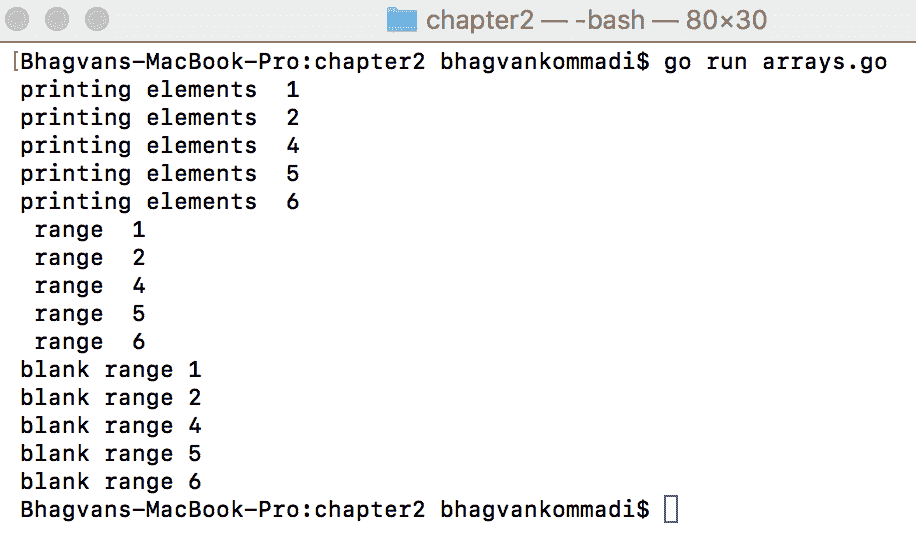

Go 数组不是动态的，但有固定的大小。要添加比大小更多的元素，需要创建一个更大的数组，并将旧数组中的所有元素复制过来。数组通过复制数组作为值通过函数传递。传递大数组到函数可能会成为性能问题。

既然我们已经了解了数组是什么，那么让我们在下一节看看切片。

# 切片

**Go 切片**是**Go 数组**的抽象。Go 数组允许存储多个相同类型的数据元素。Go 数组允许定义可以存储多个相同类型数据元素的变量，但在 Go 中没有提供任何内置方法来增加其大小。这个缺点由切片来弥补。Go 切片可以在容量达到其大小时追加元素。切片是动态的，并且可以将其当前容量加倍以添加更多元素。

让我们看看下一节中的 `len` 函数。

# `len` 函数

`len()` 函数给出 `slice` 的当前长度，而 `slice` 的容量可以通过使用 `cap()` 函数获得。以下代码示例显示了基本的切片创建和追加切片 (`basic_slice.go`):

```go
var slice = []int{1,3,5,6}
slice = append(slice, 8)
fmt.Println(“Capacity”, cap(slice))
fmt.Println(“Length”, len(slice))
```

运行以下命令以执行前面的代码：

```go
go run basic_slice.go
```

以下截图显示了输出：

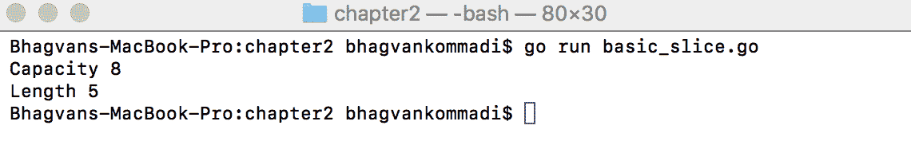

让我们看看下一节中的 `slice` 函数。

# 切片函数

切片是通过引用传递给函数的。大切片可以传递给函数而不影响性能。在代码中，以下是如何将切片作为引用传递给函数的示例 (`slices.go`):

```go
//twiceValue method given slice of int type
func twiceValue(slice []int) {
      var i int
      var value int
for i, value = range  slice {
      slice[i] = 2*value
   }
    }
// main method
func main() {
    var slice = []int{1,3,5,6}
    twiceValue(slice)
    var i int
    for i=0; i< len(slice); i++ {
        fmt.Println(“new slice value”, slice[i])
}
}
```

运行以下命令：

```go
go run slices.go
```

以下截图显示了输出：

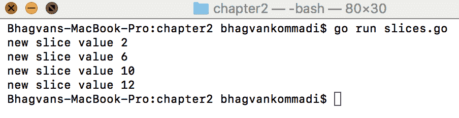

既然我们已经知道了切片是什么，那么让我们继续到下一节学习二维切片。

# 二维切片

二维切片是二维数组的描述符。二维切片是一个数组中连续的部分，它存储在切片本身之外。它持有对底层数组的引用。二维切片将是一个数组的数组，而切片的容量可以通过创建一个新的切片并将初始切片的内容复制到新切片中来增加。这也被称为**切片的切片**。以下是一个二维数组的示例。创建了一个二维数组，并将数组元素初始化为值。

`twodarray.go` 是以下代码中展示的代码示例：

```go
//main package has examples shown
// in Go Data Structures and algorithms book
package main
// importing fmt package
import (
 "fmt"
)
// main method
func main() {
  var TwoDArray [8][8]int
   TwoDArray[3][6] = 18
  TwoDArray[7][4] = 3
   fmt.Println(TwoDArray)
}
```

运行以下命令：

```go
go run twodarray.go
```

以下截图显示了输出：

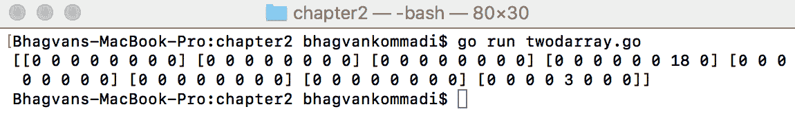

对于动态分配，我们使用切片的切片。在以下代码中，切片的切片被解释为二维切片——`twodslices.go`：

```go
// in Go Data Structures and algorithms book
package main
// importing fmt package
import (
 "fmt"
)
// main method
func main() {
   var rows int
   var cols int
   rows = 7
   cols = 9
   var twodslices = make([][]int, rows)
   var i int
   for i = range twodslices {
      twodslices[i] = make([]int,cols)
   }
    fmt.Println(twodslices)
}
```

运行以下命令：

```go
go run twodslices.go
```

以下截图显示了输出：

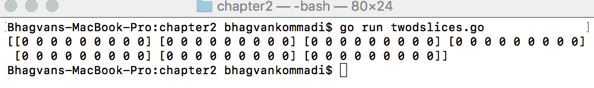

在切片上使用的`append`方法用于向切片追加新元素。如果切片容量已达到底层数组的大小，则追加通过创建一个新的底层数组并添加新元素来增加大小。`slic1`是`arr`从 0 开始到 3（不包括）的子切片，而`slic2`是`arr`从 1（包括）到 5（不包括）的子切片。在以下代码片段中，`append`方法在`slic2`上调用以添加新的`12`元素（`append_slice.go`）：

```go
var arr = [] int{5,6,7,8,9}
var slic1 = arr[: 3]
fmt.Println("slice1",slic1)
var slic2 = arr[1:5]
fmt.Println("slice2",slic2)
var slic3 = append(slic2, 12)
fmt.Println("slice3",slic3)
```

运行以下命令：

```go
go run append_slice.go
```

以下截图显示了输出：

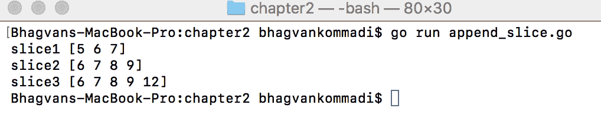

现在我们已经涵盖了二维切片的内容，让我们在下一节中看看映射。

# 映射

映射用于跟踪键类型，如整数、字符串、浮点数、双精度浮点数、指针、接口、结构体和数组。值可以是不同类型。在以下示例中，创建了一个具有整数键和字符串值的映射类型语言（`maps.go`）：

```go
var languages = map[int]string {
     3: “English”,
      4: “French”,
       5: “Spanish”
}
```

可以使用`make`方法创建映射，指定键类型和值类型。以下代码片段显示了具有整数键和字符串值的映射类型的产物：

```go
var products = make(map[int]string)
products[1] = “chair”
products[2] = “table”
```

`for`循环用于遍历映射。语言映射的遍历方式如下：

```go
var i int
var value string
for i, value = range languages {
   fmt.Println("language",i, “:",value)
}
fmt.Println("product with key 2",products[2])
```

使用产品映射检索值和删除切片操作如下所示：

```go
fmt.Println(products[2])
delete(products,”chair”) 
fmt.Println("products",products)
```

运行以下命令：

```go
go run maps.go
```

以下截图显示了输出：

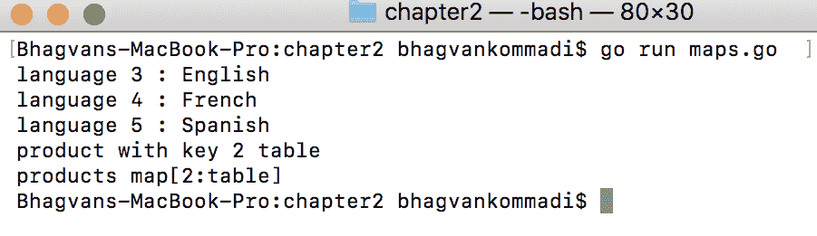

现在我们已经涵盖了映射，让我们继续到数据库操作。

# 数据库操作

在本节中，我们将通过适当的示例查看一些数据库操作。

让我们从下一节的`GetCustomer`方法开始。

# `GetCustomer`方法

`GetCustomer`方法从数据库中检索`Customer`数据。首先，以下示例显示了`create`数据库操作。`Customer`是具有`Customerid`、`CustomerName`和`SSN`属性的表。`GetConnection`方法返回数据库连接，用于查询数据库。查询然后返回数据库表中的行。以下代码详细解释了数据库操作（`database_operations.go`）：

```go
//main package has examples shown
// in Hands-On Data Structures and algorithms with Go book
package main

// importing fmt,database/sql, net/http, text/template package
import (
    "fmt"
    "database/sql"
    _ "github.com/go-sql-driver/mysql"
)

// Customer Class
type Customer struct {
    CustomerId int
    CustomerName string
    SSN string
}
// GetConnection method which returns sql.DB
func GetConnection() (database *sql.DB) {
    databaseDriver := "mysql"
    databaseUser := "newuser"
    databasePass := "newuser"
    databaseName := "crm"
    database, error := sql.Open(databaseDriver, databaseUser+":"+databasePass+"@/"+databaseName)
    if error != nil {
        panic(error.Error())
    }
    return database
}
// GetCustomers method returns Customer Array
func GetCustomers() []Customer {
    var database *sql.DB
    database = GetConnection()

    var error error
    var rows *sql.Rows
    rows, error = database.Query("SELECT * FROM Customer ORDER BY Customerid DESC")
    if error != nil {
        panic(error.Error())
    }
    var customer Customer
    customer = Customer{}

    var customers []Customer
    customers= []Customer{}
    for rows.Next() {
        var customerId int
        var customerName string
        var ssn string
        error = rows.Scan(&customerId, &customerName, &ssn)
        if error != nil {
            panic(error.Error())
        }
        customer.CustomerId = customerId
        customer.CustomerName = customerName
        customer.SSN = ssn
        customers = append(customers, customer)
    }

    defer database.Close()

    return customers
}

//main method
func main() {

     var customers []Customer
    customers = GetCustomers()
    fmt.Println("Customers",customers)

}

```

运行以下命令：

```go
go run database_operations.go
```

以下截图显示了输出：

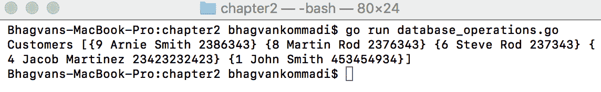

让我们看一下下一节中的`InsertCustomer`方法。

# `InsertCustomer`方法

`INSERT`操作如下。`InsertCustomer`方法接受`Customer`参数并创建一个用于`INSERT`语句的预处理语句。该语句用于将客户行插入到表中，如下面的代码片段所示：

```go
// InsertCustomer method with parameter customer
func InsertCustomer(customer Customer) {
     var database *sql.DB
     database= GetConnection()

      var error error
      var insert *sql.Stmt
      insert,error = database.Prepare("INSERT INTO CUSTOMER(CustomerName,SSN) VALUES(?,?)")
          if error != nil {
              panic(error.Error())
          }
          insert.Exec(customer.CustomerName,customer.SSN)

      defer database.Close()

}
```

让我们在下一节中看看可变参数函数。

# 可变参数函数

一个函数，我们传递无限数量的参数，而不是一次传递一个，称为可变参数函数。最终参数的类型前面有一个省略号 (...), 在声明可变参数函数时；这表明该函数可以带有任何数量的此类参数。

可变参数函数可以用可变数量的参数调用。`fmt.Println` 是一个常见的可变参数函数，如下所示：

```go
//main method
func main() {
     var customers []Customer
    customers = GetCustomers()
    fmt.Println("Before Insert",customers)
    var customer Customer
    customer.CustomerName = "Arnie Smith"
    customer.SSN = "2386343"
    InsertCustomer(customer)
    customers = GetCustomers()
    fmt.Println("After Insert",customers)
    }
```

运行以下命令：

```go
go run database_operations.go
```

以下截图显示了输出：

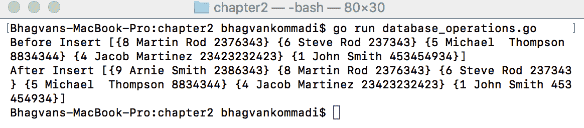

让我们在下一节开始 `update` 操作。

# 更新操作

`update` 操作如下。`UpdateCustomer` 方法接收 `Customer` 参数并创建一个用于 `UPDATE` 语句的预处理语句。该语句用于在表中更新一行客户数据：

```go
// Update Customer method with parameter customer
func UpdateCustomer(customer Customer){
     var database *sql.DB
     database= GetConnection()
     var error error
      var update *sql.Stmt
      update,error = database.Prepare("UPDATE CUSTOMER SET CustomerName=?, SSN=? WHERE CustomerId=?")
          if error != nil {
           panic(error.Error())
          } 
      update.Exec(customer.CustomerName,customer.SSN,customer.CustomerId)
defer database.Close()
}
// main method
func main() {
    var customers []Customer
    customers = GetCustomers()
   fmt.Println("Before Update",customers)
   var customer Customer
    customer.CustomerName = "George Thompson"
    customer.SSN = "23233432"
    customer.CustomerId = 5
    UpdateCustomer(customer)
    customers = GetCustomers()
    fmt.Println("After Update",customers)
}
```

运行以下命令：

```go
go run database_operations.go
```

以下截图显示了输出：

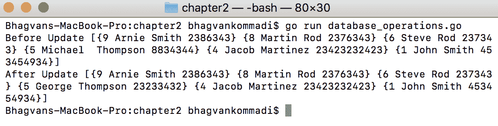

让我们看一下下一节中的 `delete` 操作。

# 删除操作

`delete` 操作如下。`DeleteCustomer` 方法接收 `Customer` 参数并创建一个用于 `DELETE` 语句的预处理语句。该语句用于在表中删除一行客户数据：

```go
// Delete Customer method with parameter customer
func deleteCustomer(customer Customer){
     var database *sql.DB
     database= GetConnection()
     var error error
      var delete *sql.Stmt
      delete,error = database.Prepare("DELETE FROM Customer WHERE Customerid=?")
          if error != nil {
             panic(error.Error())
         }
          delete.Exec(customer.CustomerId)
      defer database.Close()
}
// main method
func main() {
     var customers []Customer
    customers = GetCustomers()
    fmt.Println("Before Delete",customers)
  var customer Customer
  customer.CustomerName = "George Thompson"
  customer.SSN = "23233432"
  customer.CustomerId = 5
    deleteCustomer(customer)
    customers = GetCustomers()
    fmt.Println("After Delete",customers)
}
```

运行以下命令：

```go
go run database_operations.go
```

以下截图显示了输出：

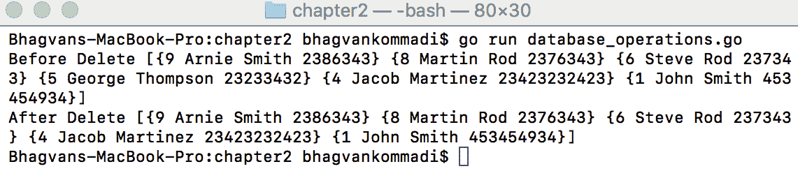

现在我们已经完成了可变参数函数的讨论，让我们继续在下一节查看 CRUD 网页表单。

# CRUD 网页表单

在本节中，我们将通过基本示例解释网页表单，展示如何执行各种操作。

要使用 Go 的 `net/http` 包启动一个基本的 HTML 页面，以下是一个网页表单示例 (`webforms.go`)。在 `main.html` 中有一个欢迎问候语：

```go
//main package has examples shown
// in Hands-On Data Structures and algorithms with Go book
package main
// importing fmt, database/sql, net/http, text/template package
import (
    "net/http"
    "text/template"
    "log")
// Home method renders the main.html
func Home(writer http.ResponseWriter, reader *http.Request) {
    var template_html *template.Template
    template_html = template.Must(template.ParseFiles("main.html"))
    template_html.Execute(writer,nil)
}
// main method
func main() {
    log.Println("Server started on: http://localhost:8000")
    http.HandleFunc("/", Home)
    http.ListenAndServe(":8000", nil)
}
```

`main.html` 的代码如下**：

```go
<html>
    <body>
        <p> Welcome to Web Forms</p>
    </body>
</html>
```

运行以下命令：

```go
go run webforms.go
```

以下截图显示了输出：

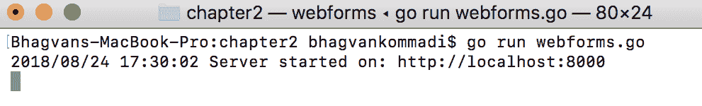

以下截图显示了网页浏览器的输出：

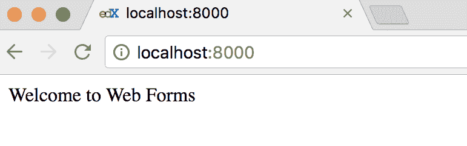

以网页表单为例构建的 CRM 应用程序用于演示 CRUD 操作。我们可以使用上一节中构建的数据库操作。以下代码展示了 `crm` 数据库操作。`crm` 数据库操作包括 CRUD 方法，如 `CREATE`、`READ`、`UPDATE` 和 `DELETE` 客户操作。`GetConnection` 方法检索用于执行数据库操作的数据库连接 (`crm_database_operations.go`)：

```go
//main package has examples shown
// in Hands-On Data Structures and algorithms with Go book
package main
// importing fmt,database/sql, net/http, text/template package
import (
   "database/sql"
    _ "github.com/go-sql-driver/mysql"
)
// Customer Class
type Customer struct {
    CustomerId    int
    CustomerName  string
    SSN string
}
//  GetConnection method  which returns sql.DB
func GetConnection() (database *sql.DB) {
    databaseDriver := "mysql"
    databaseUser := "newuser"
    databasePass := "newuser"
    databaseName := “crm"
    database, error := sql.Open(databaseDriver, databaseUser+”:"+databasePass+"@/"+databaseName)
    if error != nil {
        panic(error.Error())
    }
    return database
}

```

如以下代码所示，`GetCustomerById` 方法接收 `customerId` 参数以在客户数据库中查找。`GetCustomerById` 方法返回客户对象：

```go
//GetCustomerById with parameter customerId returns Customer
func GetCustomerById(customerId int) Customer {
  var database *sql.DB
  database = GetConnection()
  var error error
  var rows *sql.Rows
  rows, error = database.Query("SELECT * FROM Customer WHERE CustomerId=?",customerId)
  if error != nil {
      panic(error.Error())
  }
  var customer Customer
  customer = Customer{}
    for rows.Next() {
        var customerId int
        var customerName string
        var SSN  string
        error = rows.Scan(&customerId, &customerName, &SSN)
        if error != nil {
           panic(error.Error())
        }
        customer.CustomerId = customerId
        customer.CustomerName = customerName
       customer.SSN = SSN
    }
```

现在我们已经涵盖了 CRUD 网页表单，让我们在下一节继续探讨 `defer` 和 `panic`。

# 延迟和 panic 语句

`defer` 语句将函数的执行推迟到周围函数返回。`panic` 函数停止当前流程和控制。在 `panic` 调用之后，延迟的函数会正常执行。在以下代码示例中，即使调用了 `panic` 调用，`defer` 调用也会执行：

```go
    defer database.Close()
    return customer
}
// GetCustomers method returns Customer Array
func GetCustomers() []Customer {
    var database *sql.DB
    database = GetConnection()
    var error error
    var rows *sql.Rows
    rows, error = database.Query("SELECT * FROM Customer ORDER BY Customerid DESC")
    if error != nil {
       panic(error.Error())
    }
   var customer Customer
    customer = Customer{}
    var customers []Customer
    customers= []Customer{}
   for rows.Next() {
       var customerId int
        var customerName string
       var ssn string
        error = rows.Scan(&customerId, &customerName, &ssn)
        if error != nil {
            panic(error.Error())
        }
        customer.CustomerId = customerId
        customer.CustomerName = customerName
        customer.SSN = ssn
        customers = append(customers, customer)
    }
   defer database.Close()
    return customers
}

```

让我们看一下以下章节中的 `InsertCustomer`、`UpdateCustomer` 和 `DeleteCustomer` 方法。

# InsertCustomer 方法

在以下代码中，`InsertCustomer` 方法将 `customer` 作为参数来执行插入到 `CUSTOMER` 表的 SQL 语句：

```go
// InsertCustomer method with parameter customer
func InsertCustomer(customer Customer) {
     var database *sql.DB
     database= GetConnection()
     var error error
      var insert *sql.Stmt
     insert,error = database.Prepare("INSERT INTO CUSTOMER(CustomerName,SSN) VALUES(?,?)")
          if error != nil {
              panic(error.Error())
         }
     insert.Exec(customer.CustomerName,customer.SSN)
      defer database.Close()
}
```

# UpdateCustomer 方法

`UpdateCustomer` 方法通过传递 `CustomerName` 和 `SSN` 从 `customer` 对象来准备 `UPDATE` 语句；如下面的代码所示：

```go
// Update Customer method with parameter customer
func UpdateCustomer(customer Customer) {
     var database *sql.DB
     database= GetConnection()
     var error error
      var update *sql.Stmt
      update,error = database.Prepare("UPDATE CUSTOMER SET CustomerName=?, SSN=? WHERE CustomerId=?")
          if error != nil {
              panic(error.Error())
          }
          update.Exec(customer.CustomerName,customer.SSN,customer.CustomerId)
     defer database.Close()
}

```

# DeleteCustomer 方法

`DeleteCustomer` 方法通过执行 `DELETE` 语句来删除传递的客户：

```go
// Delete Customer method with parameter customer
func DeleteCustomer(customer Customer) {
     var database *sql.DB
     database= GetConnection()
      var error error
      var delete *sql.Stmt
      delete,error = database.Prepare("DELETE FROM Customer WHERE Customerid=?")
          if error != nil {
              panic(error.Error())
          }
          delete.Exec(customer.CustomerId)
     defer database.Close()
}
```

让我们看一下下一节中的 CRM 网络应用程序。

# CRM 网络应用程序

如下所示，CRM 网络应用程序处理了各种网络路径。CRM 应用程序代码如下。`Home` 函数使用 writer 参数和客户数组执行 `Home` 模板（`crm_app.go`）：

```go

//main package has examples shown
// in Hands-On Data Structures and algorithms with Go book
package main

// importing fmt,database/sql, net/http, text/template package
import (
    "fmt"
    "net/http"
    "text/template"
    "log"
)

var template_html = template.Must(template.ParseGlob("templates/*"))

// Home - execute Template
func Home(writer http.ResponseWriter, request *http.Request) {
    var customers []Customer
    customers = GetCustomers()
    log.Println(customers)
    template_html.ExecuteTemplate(writer,"Home",customers)

}

```

让我们看一下以下章节中的 `Create`、`Insert`、`Alter`、`Update` 和 `Delete` 函数，以及 `main` 方法。

# Create 函数

如以下代码所示，`Create` 函数接受 `writer` 和 `request` 参数来渲染 `Create` 模板：

```go
// Create - execute Template
func Create(writer http.ResponseWriter, request *http.Request) {

    template_html.ExecuteTemplate(writer,"Create",nil)
}
```

# Insert 函数

`Insert` 函数调用 `GetCustomers` 方法获取 `customers` 数组，并通过调用 `ExecuteTemplate` 方法，使用 `writer` 和 `customers` 数组作为参数来渲染 `Home` 模板。这如下面的代码所示：

```go
// Insert - execute template
func Insert(writer http.ResponseWriter, request *http.Request) {

    var customer Customer
    customer.CustomerName = request.FormValue("customername")
    customer.SSN = request.FormValue("ssn")
    InsertCustomer(customer)
    var customers []Customer
    customers = GetCustomers()
    template_html.ExecuteTemplate(writer,"Home",customers)

}
```

# Alter 函数

以下代码展示了 `Alter` 函数如何通过使用 `writer` 和 `customers` 数组作为参数调用 `ExecuteTemplate` 方法来渲染 `Home` 模板：

```go
// Alter - execute template
func Alter(writer http.ResponseWriter, request *http.Request) {

    var customer Customer
    var customerId int
    var customerIdStr string
    customerIdStr = request.FormValue("id")
    fmt.Sscanf(customerIdStr, "%d", &customerId)
    customer.CustomerId = customerId
    customer.CustomerName = request.FormValue("customername")
    customer.SSN = request.FormValue("ssn")
    UpdateCustomer(customer)
    var customers []Customer
    customers = GetCustomers()
    template_html.ExecuteTemplate(writer,"Home",customers)

}

```

# Update 函数

`Update` 函数使用 `writer` 和通过 `id` 查找的 `customer` 调用 `ExecuteTemplate` 方法。`ExecuteTemplate` 方法渲染 `UPDATE` 模板：

```go
// Update - execute template
func Update(writer http.ResponseWriter, request *http.Request) {

  var customerId int
  var customerIdStr string
  customerIdStr = request.FormValue("id")
  fmt.Sscanf(customerIdStr, "%d", &customerId)
  var customer Customer
  customer = GetCustomerById(customerId)

    template_html.ExecuteTemplate(writer,"Update",customer)

}
```

# Delete 函数

`Delete` 方法在通过 `GetCustomerById` 方法找到客户后渲染 `Home` 模板。`View` 方法在通过调用 `GetCustomerById` 方法找到客户后渲染 `View` 模板：

```go
// Delete - execute Template
func Delete(writer http.ResponseWriter, request *http.Request) {
  var customerId int
  var customerIdStr string
  customerIdStr = request.FormValue("id")
  fmt.Sscanf(customerIdStr, "%d", &customerId)
  var customer Customer
  customer = GetCustomerById(customerId)
   DeleteCustomer(customer)
   var customers []Customer
   customers = GetCustomers()
  template_html.ExecuteTemplate(writer,"Home",customers)

}
// View - execute Template
func View(writer http.ResponseWriter, request *http.Request) {
    var customerId int
    var customerIdStr string
    customerIdStr = request.FormValue("id")
    fmt.Sscanf(customerIdStr, "%d", &customerId)
    var customer Customer
    customer = GetCustomerById(customerId)
    fmt.Println(customer)
    var customers []Customer
    customers= []Customer{customer}
    customers.append(customer)
    template_html.ExecuteTemplate(writer,"View",customers)

}

```

# `main` 方法

`main` 方法处理 `Home`、`Alter`、`Create`、`Update`、`View`、`Insert` 和 `Delete` 函数，并使用不同的别名进行查找，并适当地渲染模板。`HttpServer` 监听端口 `8000` 并等待模板别名的调用：

```go
// main method
func main() {
    log.Println("Server started on: http://localhost:8000")
    http.HandleFunc("/", Home)
    http.HandleFunc("/alter", Alter)
    http.HandleFunc("/create", Create)
    http.HandleFunc("/update", Update)
    http.HandleFunc("/view", View)
    http.HandleFunc("/insert", Insert)
    http.HandleFunc("/delete", Delete)
    http.ListenAndServe(":8000", nil)
}
```

让我们看一下以下章节中的 `Header`、`Footer`、`Menu`、`Create`、`Update` 和 `View` 模板。

# Header 模板

`Header` 模板在以下代码片段中定义了 HTML 的 `head` 和 `body` 部分，如下所示。网页的标题标签设置为 `CRM`，网页内容为 `Customer Management – CRM`（`Header.tmpl`）：

```go
{{ define "Header" }}
<!DOCTYPE html>
<html>
    <head>
        <title>CRM</title>
        <meta charset="UTF-8" />
    </head>
    <body>
        <h1>Customer Management – CRM</h1>   
{{ end }}
```

# `Footer` 模板

`Footer` 模板定义了 HTML 和 BODY 的关闭标签。以下代码片段展示了 `Footer` 模板（`Footer.tmpl`）：

```go
{{ define "Footer" }}
    </body>
  </html>
{{ end }}
```

# 菜单模板

`Menu` 模板定义了 `Home` 和 `Create Customer` 的链接，以下代码展示了该模板（`Menu.tmpl`）：

```go
{{ define "Menu" }}
<a href="/">Home</a> |<a href="/create">Create Customer</a>
{{ end }}
```

# 创建模板

`Create` 模板由 `Header`、`Menu` 和 `Footer` 模板组成。创建客户字段的表单位于 `create` 模板中。此表单提交到网络路径—`/insert`，以下代码片段展示了该模板（`Create.tmpl`）：

```go
{{ define "Create" }}
  {{ template "Header" }}
  {{ template "Menu"  }}
  <br>
    <h1>Create Customer</h1>
  <br>
  <br>
  <form method="post" action="/insert">
    Customer Name: <input type="text" name="customername" placeholder="customername" autofocus/>
    <br>
    <br>
    SSN: <input type="text" name="ssn" placeholder="ssn"/>
    <br>
    <br>
    <input type="submit" value="Create Customer"/>
   </form>
{{ template "Footer" }}
{{ end }}
```

# 更新模板

`Update` 模板由 `Header`、`Menu` 和 `Footer` 模板组成，如下所示。更新客户字段的表单位于 `Update` 模板中。此表单提交到网络路径 `/alter`（`Update.tmpl`）：

```go
{{ define "Update" }}
  {{ template "Header" }}
    {{ template "Menu" }}
<br>
<h1>Update Customer</h1>
    <br>
    <br>
  <form method="post" action="/alter">
    <input type="hidden" name="id" value="{{ .CustomerId }}" />
    Customer Name: <input type="text" name="customername" placeholder="customername" value="{{ .CustomerName }}" autofocus>
    <br>
    <br>
    SSN: <input type="text" name="ssn" value="{{ .SSN }}" placeholder="ssn"/>
    <br>
    <br>
    <input type="submit" value="Update Customer"/>
   </form>
{{ template "Footer" }}
{{ end }}
```

# `View` 模板

`View` 模板由 `Header`、`Menu` 和 `Footer` 模板组成。查看客户字段的表单位于 `View` 模板中，以下代码展示了该模板（`View.tmpl`）：

```go
{{ define "View" }}
  {{ template "Header" }}
  {{ template "Menu"  }}
    <br>
       <h1>View Customer</h1>
      <br>
      <br>
<table border="1">
<tr>
<td>CustomerId</td>
<td>CustomerName</td>
<td>SSN</td>
<td>Update</td>
<td>Delete</td>
</tr>
{{ if . }}
       {{ range . }}
<tr>
<td>{{ .CustomerId }}</td>
<td>{{ .CustomerName }}</td>
<td>{{ .SSN }}</td>
<td><a href="/delete?id={{.CustomerId}}" onclick="return confirm('Are you sure you want to delete?');">Delete</a> </td>
<td><a href="/update?id={{.CustomerId}}">Update</a> </td>
</tr>
{{ end }}
     {{ end }}
</table>
{{ template "Footer" }}
{{ end }}
```

执行以下命令：

```go
go run crm_app.go crm_database_operations.go
```

以下截图显示了输出：

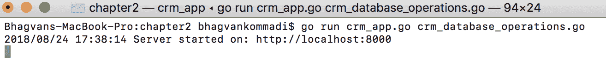

以下截图显示了网络浏览器的输出：

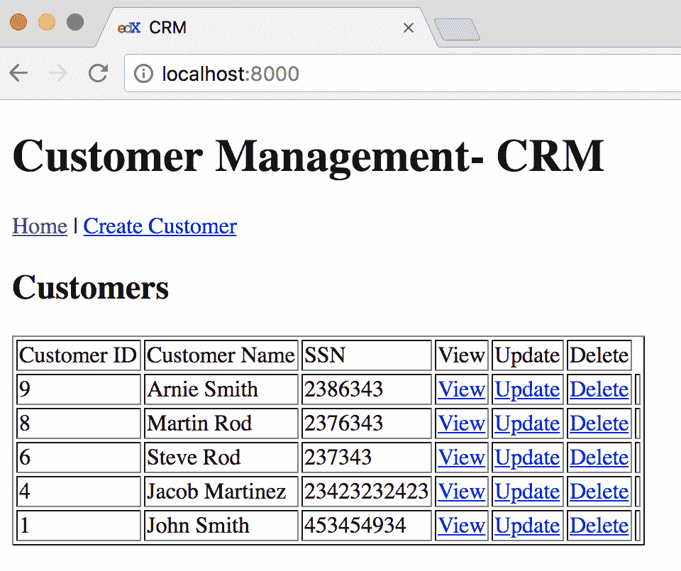

# 摘要

本章介绍了数据库操作和网络表单。现在，你将能够构建可以存储数据库数据的网络应用程序。本章通过代码示例涵盖了数组、切片、二维切片和地图。本章使用代码片段解释了数组方法，如 `len`、使用 `for` 迭代数组和使用 `range`。在 *切片* 部分讨论了二维数组和切片的切片。

使用各种场景解释了地图，例如添加键和值，以及检索和删除值。本章还讨论了不同类型的地图，如字符串和整数。此外，在 `数据库操作` 和 `CRUD 网络表单` 部分演示了可变参数函数、延迟函数调用和恐慌与恢复操作（*数据库操作* 和 *CRUD 网络表单* 部分）。

CRM 应用程序被构建为一个网络应用程序，数据持久化在 MySQL 数据库中。代码片段展示了添加、删除、更新和检索数据的数据库操作。此外，使用模板的网络表单展示了创建、更新、删除和查看客户数据。本章 *技术要求* 部分提供了 MySQL 驱动及其安装细节。本章通过执行细节演示了如何使用 Go 创建网络应用程序。

下一章将涉及与线性数据结构相关的主题，如列表、集合、元组和栈。

# 问题

1.  获取数组大小的方法叫什么？

1.  你如何找到切片的容量？

1.  你如何初始化字符串类型的二维切片？

1.  你如何向切片中添加一个元素？

1.  使用代码，你能演示如何创建一个键为字符串、值为字符串的映射吗？在代码中初始化映射的键和值，在循环中迭代它们，并在代码中打印键和值。

1.  你如何在映射中删除一个值？

1.  获取数据库连接需要哪些参数？

1.  哪个`sql.Rows`类方法使得在表中读取实体的属性成为可能？

1.  当数据库连接关闭时，`defer`做了什么？

1.  哪个方法允许`sql.DB`类创建一个预处理语句？

# 进一步阅读

想要了解更多关于数组、映射和切片的信息，以下链接推荐阅读：

+   *《学习 Go 数据结构和算法 [视频]*》，作者 Gustavo Chaín

+   *精通 Go*，作者 Mihalis Tsoukalos
