# 线性数据结构

诸如 Facebook、Twitter 和 Google 等各种应用程序都使用列表和线性数据结构。正如我们之前所讨论的，数据结构允许我们以顺序和组织的方式组织大量数据，从而在处理此类数据时减少时间和精力。列表、栈、集合和元组是一些常用的线性数据结构。

在本章中，我们将通过给出涉及这些数据结构的各种过程示例来讨论这些数据结构。我们将讨论与这些数据结构相关的各种操作，例如插入、删除、更新、遍历（列表）、反转以及与各种代码示例的合并。

在本章中，我们将介绍以下线性数据结构：

+   列表

+   集合

+   元组

+   栈

# 技术要求

根据您的操作系统，在[`golang.org/doc/install`](https://golang.org/doc/install)安装 Go 版本 1.10。

本章的代码文件可以在以下 GitHub URL 找到：[`github.com/PacktPublishing/Learn-Data-Structures-and-Algorithms-with-Golang/tree/master/Chapter03`](https://github.com/PacktPublishing/Learn-Data-Structures-and-Algorithms-with-Golang/tree/master/Chapter03)。

# 列表

列表是一组有序元素集合，用于存储项目列表。与数组列表不同，这些列表可以动态地扩展和收缩。

列表还可以用作其他数据结构的基础，例如栈和队列。列表可以用来存储用户列表、汽车零部件、成分、待办事项以及各种其他元素。列表是最常用的线性数据结构。这些是在 lisp 编程语言中引入的。在本章中，我们将使用 Go 语言介绍链表和双链表。

在下一节中，我们将讨论与链表和双链表相关的添加、更新、删除和查找操作。

# 链表

`LinkedList`是一系列具有属性和指向序列中下一个节点的引用的节点。它是一种用于存储数据的线性数据结构。该数据结构允许从任何节点添加和删除与另一个节点相邻的组件。它们不是在内存中连续存储的，这使得它们与数组**不同**。

在以下部分，我们将查看链表中的结构和方法。

# 节点类

`Node`类有一个名为`property`的整型变量。该类还有一个名为`nextNode`的变量，它是一个指向序列中下一个节点的指针。链表将包含具有整型属性的节点集合，如下所示：

```go
//Node class
type Node struct {
    property int
    nextNode *Node
}
```

# 链表类

`LinkedList`类具有`headNode`指针作为其属性。通过从`headNode`遍历到`nextNode`，您可以遍历链表，如下面的代码所示：

```go
// LinkedList class
type LinkedList struct {
    headNode *Node
}
```

在以下章节中讨论了`LinkedList`类的不同方法，例如`AddtoHead`、`IterateList`、`LastNode`、`AddtoEnd`、`NodeWithValue`、`AddAfter`和`main`方法。

# 添加到头部的方法

`AddToHead`方法将节点添加到链表的开始。`LinkedList`类的`AddToHead`方法有一个整数属性参数。该属性用于初始化节点。实例化一个新节点，并将其属性设置为传递的`property`参数。`nextNode`指向`linkedList`的当前`headNode`，并将`headNode`设置为创建的新节点的指针，如下面的代码所示：

```go
//AddToHead method of LinkedList class
func (linkedList *LinkedList) AddToHead(property int) {
    var node = Node{}
    node.property = property
    if node.nextNode != nil {
        node.nextNode = linkedList.headNode
    }
    linkedList.headNode = &node
}
```

当具有`1`属性的节点添加到头部时，将`1`属性添加到`linkedList`的头部将`headNode`设置为具有值`1`的`currentNode`，如下面的截图所示：

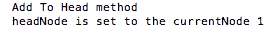

使用`main`方法执行此命令。在这里，我们创建了一个`LinkedList`类的实例，并将整数属性`1`和`3`添加到该实例的头部。在添加元素后，打印出链表的`headNode`属性，如下所示：

```go
// main method
func main() {
    var linkedList LinkedList
    linkedList = LinkedList{}
    linkedList.AddToHead(1)
    linkedList.AddToHead(3)
    fmt.Println(linkedList.headNode.property)
}
```

执行以下命令以运行`linked_list.go`文件：

```go
go run linked_list.go
```

执行前面的命令后，我们得到以下输出：

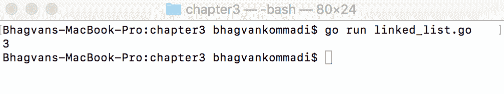

让我们看一下下一节中的`IterateList`方法。

# 迭代列表方法

`LinkedList`类的`IterateList`方法从`headNode`属性开始迭代并打印当前头节点的属性。迭代发生在头节点移动到`headNode`属性的`nextNode`，直到当前节点不再等于`nil`。以下代码显示了`LinkedList`类的`IterateList`方法：

```go
//IterateList method iterates over LinkedList
func (linkedList *LinkedList) IterateList() {
    var node *Node
    for node = linkedList.headNode; node != nil; node = node.nextNode {
        fmt.Println(node.property)
    }
}
```

# 最后一个节点方法

`LinkedList`类的`LastNode`方法返回列表末尾的节点。遍历列表以检查从`headNode`的`nextNode`开始的`nextNode`是否为`nil`，如下所示：

```go
//LastNode method returns the last Node

func (linkedList *LinkedList) LastNode() *Node{
 var node *Node
 var lastNode *Node
 for node = linkedList.headNode; node != nil; node = node.nextNode {
 if node.nextNode ==nil {
 lastNode = node
 }
 }
 return lastNode
}
```

# 添加到末尾方法

`AddToEnd`方法将节点添加到列表的末尾。在以下代码中，找到了当前的`lastNode`，并将其`nextNode`属性设置为添加的节点：

```go
//AddToEnd method adds the node with property to the end

func (linkedList *LinkedList) AddToEnd(property int) {
 var node = &Node{}
 node.property = property
 node.nextNode = nil
 var lastNode *Node
 lastNode = linkedList.LastNode()
 if lastNode != nil {
 lastNode.nextNode = node
 }
}
```

在下面的截图中，当具有属性值`5`的节点添加到末尾时调用了`AddToEnd`方法。通过此方法添加属性创建了一个值为`5`的节点。列表的最后一个节点具有属性值`5`。`lastNode`的`nextNode`属性为`nil`。`lastNode`的`nextNode`被设置为具有值`5`的节点：

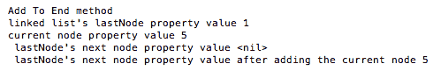

让我们看一下下一节中的`NodeWithValue`方法。

# 节点值方法

在下面的代码片段中，`LinkedList`类的`NodeWithValue`方法返回具有`property`值的节点。遍历列表并检查`property`值是否等于参数`property`：

```go
//NodeWithValue method returns Node given parameter property

func (linkedList *LinkedList) NodeWithValue(property int) *Node{
 var node *Node
 var nodeWith *Node
 for node = linkedList.headNode; node != nil; node = node.nextNode {
 if node.property == property {
 nodeWith = node
 break;
 }
 }
 return nodeWith
}
```

# 添加到后面方法

`AddAfter`方法在特定节点之后添加节点。`LinkedList`的`AddAfter`方法有`nodeProperty`和`property`参数。使用`NodeWithValue`方法检索具有`nodeProperty`值的节点。创建一个具有`property`的节点并将其添加到`NodeWith`节点之后，如下所示：

```go
//AddAfter method adds a node with nodeProperty after node with property

func (linkedList *LinkedList) AddAfter(nodeProperty int,property int) {
 var node = &Node{}
 node.property = property
 node.nextNode = nil
 var nodeWith *Node
 nodeWith = linkedList.NodeWithValue(nodeProperty)
 if nodeWith != nil {
 node.nextNode = nodeWith.nextNode
 nodeWith.nextNode = node
 }
}
```

当调用`AddAfter`方法并在具有属性值`7`的节点之后添加具有值`1`的节点时，你将得到以下输出。具有属性值`1`的节点的`nextNode`属性为 nil。具有属性值`1`的节点的`nextNode`属性被设置为具有值`5`的节点：

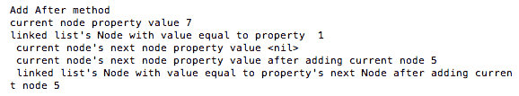

让我们在下一节中看看`main`方法。

# `main`方法

`main`方法添加了具有整数属性`1`、`3`和`5`的节点，如下面的代码所示。在具有整数属性`1`的节点之后添加了一个具有整数属性`7`的节点。在`linkedList`实例上调用`IterateList`方法，如下所示：

```go
// main method
func main() {
    var linkedList LinkedList
    linkedList = LinkedList{}
    linkedList.AddToHead(1)
    linkedList.AddToHead(3)
    linkedList.AddToEnd(5)
    linkedList.AddAfter(1,7)
    linkedList.IterateList()
}
```

`main`方法将`1`和`3`添加到链表的头部。`5`被添加到末尾。`7`被添加到`1`之后。链表将是`3`、`1`、`7`和`5`。

运行以下命令以执行`linked_list.go`文件：

```go
go run linked_list.go
```

执行前面的命令后，我们得到以下输出：

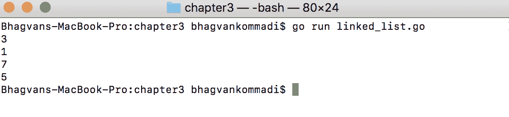

让我们在下一节中看看双向链表。

# 双向链表

在双向链表中，所有节点都有一个指向它们在列表中连接的节点的指针，位于它们的两侧。这意味着每个节点连接到两个节点，我们可以通过前向遍历到下一个节点或通过后向遍历到前一个节点。双向链表允许插入、删除以及显然的遍历操作。节点类定义在以下代码示例中：

```go
// Node class
type Node struct {
    property int
    nextNode *Node
    previousNode *Node
}
```

以下各节解释了双向链表方法，例如`NodeBetweenValues`、`AddToHead`、`AddAfter`、`AddToEnd`和`main`方法。

# `NodeBetweenValues`方法

`LinkedList`类的`NodeBetweenValues`方法返回具有位于`firstProperty`和`secondProperty`值之间的属性的节点。该方法遍历列表以确定`firstProperty`和`secondProperty`整数属性是否在连续的节点上匹配，如下所示：

```go
//NodeBetweenValues method of LinkedList
func (linkedList *LinkedList) NodeBetweenValues(firstProperty int,secondProperty int) *Node{
    var node *Node
    var nodeWith *Node
    for node = linkedList.headNode; node != nil; node = node.nextNode {
        if node.previousNode != nil && node.nextNode != nil {
            if node.previousNode.property == firstProperty && node.nextNode.property ==    
            secondProperty{
               nodeWith = node
               break;
            }
        }
    }
    return nodeWith
}
```

在调用`NodeBetweenValues`方法并使用`1`和`5`作为参数后，以下截图显示了示例输出。`lastNode`的`nextNode`被设置为具有值`5`的节点。具有属性值`7`的节点位于具有属性值`1`和`5`的节点之间：

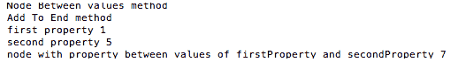

让我们在下一节中看看`AddToHead`方法。

# `AddToHead`方法

双 `LinkedList` 类的 `AddToHead` 方法将当前链表 `headNode` 的 `previousNode` 属性设置为具有属性值的添加的节点。具有属性值的节点将被设置为以下代码中 `LinkedList` 方法的 `headNode`：

```go
//AddToHead method of LinkedList
func (linkedList *LinkedList) AddToHead(property int) {
 var node = &Node{}
 node.property = property
 node.nextNode = nil
 if linkedList.headNode != nil {
 node.nextNode = linkedList.headNode
 linkedList.headNode.previousNode = node
 }
 linkedList.headNode = node
}
```

调用 `AddToHead` 方法并使用属性 3 后的示例输出如下。创建了一个属性值为 3 的节点。列表的 `headNode` 属性的属性值为 1。当前属性值为 3 的节点有一个 `nextNode` 属性为 `nil`。当前节点的 `nextNode` 属性被设置为属性值为 1 的 `headNode`。`headNode` 的 `previousNode` 属性被设置为当前节点：

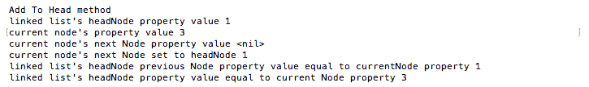

让我们看一下下一节中的 `AddAfter` 方法。

# `AddAfter` 方法

`AddAfter` 方法将节点添加到双链表中特定节点之后。双 `LinkedList` 类的 `AddAfter` 方法搜索值等于 `nodeProperty` 的节点。找到的节点被设置为具有属性值的节点的 `previousNode`。添加的节点的 `nextNode` 将是 `nodeWith` 属性的 `nextNode`。添加的节点的 `previousNode` 将是值等于 `nodeProperty` 的找到的节点。`nodeWith` 节点将被更新为当前节点。以下代码显示了 `AddAfter` 方法：

```go
//AddAfter method of LinkedList
func (linkedList *LinkedList) AddAfter(nodeProperty int,property int) {
 var node = &Node{}
 node.property = property
 node.nextNode = nil
 var nodeWith *Node
 nodeWith = linkedList.NodeWithValue(nodeProperty)
 if nodeWith != nil {

 node.nextNode = nodeWith.nextNode
 node.previousNode = nodeWith
 nodeWith.nextNode = node
 }
}
```

调用 `AddAfter` 方法并使用属性 7 后的示例输出如下。创建了一个属性值为 7 的节点。创建的节点的 `nextNode` 属性为 `nil`。创建的节点的 `nextNode` 属性被设置为属性值为 1 的 `headNode`。`headNode` 的 `previousNode` 属性被设置为当前节点：

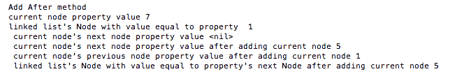

让我们看一下下一节中的 `AddToEnd` 方法。

# `AddToEnd` 方法

`AddToEnd` 方法将节点添加到双链表的末尾。`LinkedList` 类的 `AddToEnd` 方法创建一个属性设置为整型参数 `property` 的节点。该方法将添加的节点的 `previousNode` 属性设置为当前 `lastNode` 属性，如下所示。当前 `lastNode` 属性的 `nextNode` 设置为在末尾添加具有属性值的节点，如下所示：

```go
//AddToEnd method of LinkedList
func (linkedList *LinkedList) AddToEnd(property int) {
 var node = &Node{}
 node.property = property
 node.nextNode = nil
 var lastNode *Node
 lastNode = linkedList.LastNode()
 if lastNode != nil {

 lastNode.nextNode = node
 node.previousNode = lastNode
 }
}
```

调用 `AddToEnd` 方法并使用属性 5 后的示例输出如下。创建了一个属性值为 5 的节点。列表的 `lastNode` 的属性值为 1。`lastNode` 的 `nextNode` 属性为 `nil`。`lastNode` 的 `nextNode` 被设置为属性值为 5 的节点。创建的节点的 `previousNode` 被设置为属性值为 1 的节点：

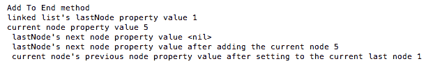

让我们看一下下一节中的 `main` 方法。

# 主方法

在以下代码片段中，`main` 方法调用 `NodeBetweenValues` 属性，使用 `firstProperty` 和 `secondProperty`。打印值 `1` 和 `5` 之间的节点属性：

```go
// main method
func main() {
 var linkedList LinkedList
 linkedList = LinkedList{}
 linkedList.AddToHead(1)
 linkedList.AddToHead(3) linkedList.AddToEnd(5)
 linkedList.AddAfter(1,7)
 fmt.Println(linkedList.headNode.property)
 var node *Node
 node = linkedList.NodeBetweenValues(1,5)
 fmt.Println(node.property)
}
```

`main` 方法创建了一个链表。节点被添加到头部和尾部。在值 `1` 和 `5` 之间的节点被搜索，并打印其属性。

运行以下命令以执行 `doubly_linked_list.go` 文件：

```go
go run doubly_linked_list.go
```

执行前面的命令后，我们得到以下输出：

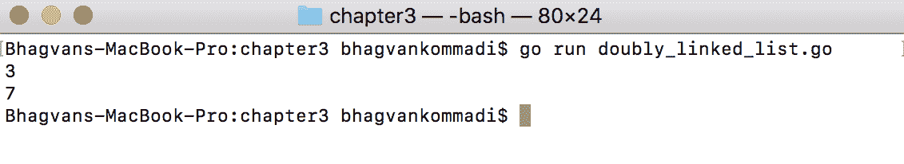

下一节将讨论集合，它们是线性数据结构。

# 集合

集合是一个线性数据结构，它包含一组不重复的值。集合可以存储无特定顺序的唯一值。在现实世界中，集合可以用来收集博客文章和聊天参与者的所有标签。数据可以是布尔型、整数、浮点数、字符和其他类型。静态集合只允许查询操作，这意味着与查询元素相关的操作。动态可变集合允许插入和删除元素。可以在集合上定义代数运算，如并集、交集、差集和子集。以下示例显示了具有 `map` 整数键和 `bool` 值的 `Set` 整数：

```go
//main package has examples shown
// in Hands-On Data Structures and algorithms with Go book
package main
// importing fmt package
import (
 "fmt"
)
//Set class
type Set struct {
 integerMap map[int]bool
}
//create the map of integer and bool
func (set *Set) New(){
 set.integerMap = make(map[int]bool)
}
```

在以下各节中讨论了 `AddElement`、`DeleteElement`、`ContainsElement`、`Intersect`、`Union` 和 `main` 方法。

# AddElement 方法

`AddElement` 方法将元素添加到集合中。在以下代码片段中，如果元素不在 `Set` 中，`Set` 类的 `AddElement` 方法将元素添加到 `integerMap` 中。`integerMap` 元素具有整数键和 `bool` 值，如下所示：

```go
// adds the element to the set
func (set *Set) AddElement(element int){
 if !set.ContainsElement(element) {
  set.integerMap[element] = true
 }
}
```

使用参数 2 调用 `AddElement` 方法后的示例输出如下。检查是否存在值为 2 的元素。如果没有元素，则将映射设置为 true，键为 2：

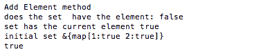

让我们看看下一节中的 `DeleteElement` 方法。

# DeleteElement 方法

`DeleteElement` 方法使用 `delete` 方法从 `integerMap` 中删除元素。此方法从集合的 `integerMap` 中删除元素，如下所示：

```go
//deletes the element from the set
func (set *Set) DeleteElement(element int) {
    delete(set.integerMap,element)
}
```

# ContainsElement 方法

`Set` 类的 `ContainsElement` 方法检查元素是否存在于 `integerMap` 中。使用以下代码示例中的键整数元素查找 `integerMap` 元素：

```go

//checks if element is in the set
func (set *Set) ContainsElement(element int) bool{
 var exists bool
 _, exists = set.integerMap[element]
 return exists
}
```

# `main` 方法 – 包含元素

在以下代码片段中，`main` 方法创建 `Set`，调用 `New` 方法，并添加元素 `1` 和 `2`。检查元素 `1` 是否存在于集合中：

```go
// main method
func main() {
    var set *Set
    set = &Set{}
    set.New()
    set.AddElement(1)
    set.AddElement(2)
    fmt.Println(set)
    fmt.Println(set.ContainsElement(1))
}
```

运行以下命令以执行 `set.go` 文件：

```go
go run set.go
```

执行前面的命令后，我们得到以下输出：

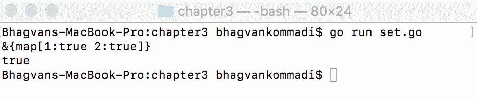

让我们看看下一节中的 `InterSect` 方法。

# InterSect 方法

在以下代码中，`Set`类上的`InterSect`方法返回一个由`set`和`anotherSet`的交集组成的`intersectionSet`。通过`integerMap`遍历`set`类，并与另一个`Set`进行比较，以查看是否存在任何元素：

```go
//Intersect method returns the set which intersects with anotherSet

func (set *Set) Intersect(anotherSet *Set) *Set{
 var intersectSet = & Set{}
 intersectSet.New()
 var value int
 for(value,_ = range set.integerMap){
   if anotherSet.ContainsElement(value) {
    intersectSet.AddElement(value)
   }
 }
 return intersectSet 
}
```

调用带有另一个`Set`参数的`intersect`方法后的示例输出如下。创建一个新的`intersectSet`。遍历当前`set`，检查每个值是否在另一个`set`中。如果值在另一个`set`中，则将其添加到`set`的交集：

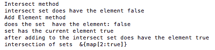

让我们在下一节看看`Union`方法。

# `Union`方法

`Set`类上的`Union`方法返回一个由`set`和`anotherSet`的并集组成的`unionSet`。通过`integerMap`键遍历两个集合，并将来自集合的元素更新到并集，如下所示：

```go
//Union method returns the set which is union of the set with anotherSet

func (set *Set) Union(anotherSet *Set) *Set{
 var unionSet = & Set{}
 unionSet.New()
 var value int
 for(value,_ = range set.integerMap){
   unionSet.AddElement(value)
 }

 for(value,_ = range anotherSet.integerMap){
   unionSet.AddElement(value)
 }

 return unionSet 
}
```

调用带有`anotherSet`参数的`union`方法后的示例输出如下。创建一个新的`unionSet`。遍历当前集合和另一个集合的值。将每个值添加到并集：

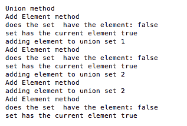

让我们在下一节看看`main`方法。

# `main`方法 - 交集和并集

在以下代码片段中，`main`方法在集合类上调用`intersect`和`union`，并传递`anotherSet`参数。交集和并集集合按以下方式打印：

```go
// main method
func main() {
 var set *Set
 set = &Set{}
 set.New()
 set.AddElement(1)
 set.AddElement(2)
 fmt.Println("initial set", set)
 fmt.Println(set.ContainsElement(1))
 var anotherSet *Set
 anotherSet = &Set{}
 anotherSet.New()
 anotherSet.AddElement(2)
 anotherSet.AddElement(4)
 anotherSet.AddElement(5) fmt.Println(set.Intersect(anotherSet))
 fmt.Println(set.Union(anotherSet))
}
```

`main`方法接受两个集合，并找到这两个集合的交集和并集。

执行以下命令以执行`set.go`文件：

```go
go run set.go
```

执行前面的命令后，我们得到以下输出：

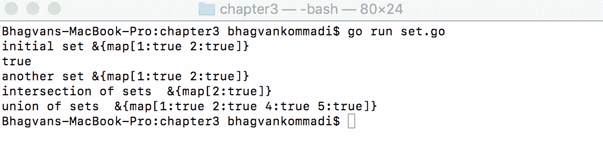

下一节将讨论元组，它们是有序对象的有限序列。

# 元组

元组是有序对象的有限序列。它们可以包含其他数据类型的混合，并用于将相关数据分组到数据结构中。在关系型数据库中，元组是表中的一行。与列表相比，元组具有固定的大小，并且运行速度更快。关系型数据库中有限个元组的集合被称为关系实例。元组可以在单个语句中赋值，这对于交换值很有用。列表通常包含相同数据类型的值，而元组包含不同的数据。例如，我们可以在元组中存储用户的姓名、年龄和最喜欢的颜色。元组在第一章，《数据结构和算法》中有所介绍。以下示例展示了函数调用中的多值表达式（`tuples.go`）：

```go
//main package has examples shown
 // in Hands-On Data Structures and algorithms with Go book
 package main
 // importing fmt package
 import (
 "fmt"
 )
 //h function which returns the product of parameters x and y
 func h(x int, y int) int {
 return x*y
 }
 // g function which returns x and y parameters after modification
 func g(l int, m int) (x int, y int) {
 x=2*l
 y=4*m
 return
 }
 // main method
 func main() {
 fmt.Println(h(g()))
 }
```

`main`函数以`g`函数作为参数调用`h`函数。`g`函数返回`x`和`y`整数组成的元组。

执行以下命令以执行`tuples.go`文件：

```go
go run tuples.go
```

执行前面的命令后，我们得到以下输出：

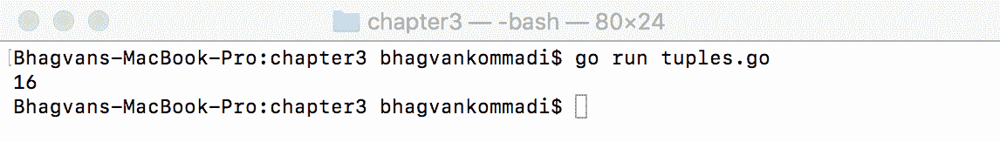

下一节将讨论队列，它们是线性数据结构。

# 队列

队列由按特定顺序或基于优先级处理的元素组成。以下代码显示了基于优先级的订单队列，其结构为堆。可以在队列上执行入队、出队和查看等操作。队列是一种线性数据结构，是一种顺序集合。元素添加到集合的末尾，从集合的开始处移除。队列通常用于存储需要执行的任务，或需要由服务器处理的传入 HTTP 请求。在现实生活中，处理实时系统中的中断、呼叫处理和 CPU 任务调度是使用队列的好例子。

以下代码显示了订单队列以及如何定义`Queue`类型：

```go
// Queue—Array of Orders Type
type Queue []*Order

// Order class
type Order struct {
    priority int
    quantity int
    product string
    customerName string
}
```

本章的以下部分讨论队列的`New`、`Add`和`main`方法。

# 新建方法

`Order`类上的`New`方法将`priority`、`quantity`和`product`参数的属性分配给`name`和`customerName`。该方法初始化订单的属性如下：

```go
// New method initializes with Order with priority, quantity, product, customerName
func (order *Order) New(priority int, quantity int, product string, customerName string ){
 order.priority = priority
 order.quantity = quantity
 order.product = product
 order.customerName = customerName
 }
```

# 添加方法

在以下代码片段中，`Queue`类上的`Add`方法接受`order`参数并根据优先级将其添加到`Queue`中。基于此，通过比较`order`参数与`priority`参数找到`order`参数的位置：

```go
//Add method adds the order to the queue
func (queue *Queue) Add(order *Order){
 if len(*queue) == 0 {
 *queue = append(*queue,order)
 } else{
 var appended bool
 appended = false
 var i int
 var addedOrder *Order
 for i, addedOrder = range *queue {
 if order.priority > addedOrder.priority {
 *queue = append((*queue)[:i], append(Queue{order}, (*queue)[i:]...)...)
 appended = true
 break
 }
 }
 if !appended {
 *queue = append(*queue, order)
 }
 }
}
```

在使用`order`参数调用`add`方法后的示例输出如下。检查订单是否存在于队列中。然后将订单追加到队列中：

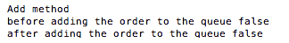

让我们看看下一节中的`Main`方法。

# 主方法 – 队列

`main`方法创建了两个订单，并将订单的优先级设置为`2`和`1`。在以下代码中，队列将首先处理优先级值较高的订单：

```go

// main method
func main() {
 var queue Queue
 queue = make(Queue,0)
 var order1 *Order = &Order{}
 var priority1 int = 2
 var quantity1 int = 20
 var product1 string = "Computer"
 var customerName1 string = "Greg White"
 order1.New(priority1,quantity1,product1, customerName1)
 var order2 *Order = &Order{}
 var priority2 int = 1
 var quantity2 int = 10
 var product2 string = "Monitor"
 var customerName2 string = "John Smith"
 order2.New(priority2,quantity2,product2, customerName2)
 queue.Add(order1)

 queue.Add(order2)
var i int
for i=0; i< len(queue); i++ {
fmt.Println(queue[i])
}
}
```

运行以下命令以执行`queue.go`文件：

```go
go run queue.go
```

执行前面的命令后，我们得到以下输出：

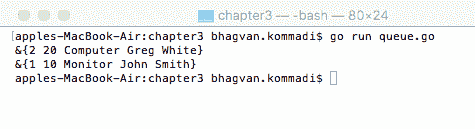

让我们看看下一节中的*同步队列*。

# 同步队列

同步队列由需要按特定顺序处理的元素组成。乘客队列和票务处理队列是同步队列的类型，如下所示：

```go

//main package has examples shown
// in Hands-On Data Structures and algorithms with Go book
package main
// importing fmt package
import (
 "fmt"
 "time"
 "math/rand"
)
// constants
const (
 messagePassStart = iota
 messageTicketStart
 messagePassEnd
 messageTicketEnd
)
//Queue class
type Queue struct {
 waitPass int
 waitTicket int
 playPass bool
 playTicket bool
 queuePass chan int
 queueTicket chan int
 message chan int
}
```

我们将在以下部分讨论同步队列的不同方法。

# 新建方法

`Queue`上的`New`方法使用`nil`值初始化`message`、`queuePass`和`queueTicket`。`make`方法创建一个带有`chan`整数参数的`Queue`，如下所示：

```go
// New method initializes queue
func (queue *Queue) New() {
 queue.message = make(chan int)
 queue.queuePass= make(chan int)
 queue.queueTicket= make(chan int)
 }
```

在以下代码示例中，`Go`例程根据消息类型和相应的队列来选择消息：

```go
go func() {
 var message int
 for {
 select {
 case message = <-queue.message:
 switch message {
 case messagePassStart:
 queue.waitPass++
 case messagePassEnd:
 queue.playPass = false
 case messageTicketStart:
 queue.waitTicket++
 case messageTicketEnd:
 queue.playTicket = false
 }
 if queue.waitPass > 0 && queue.waitTicket > 0 && !queue.playPass && !queue.playTicket {
 queue.playPass = true
 queue.playTicket = true
 queue.waitTicket--
 queue.waitPass--
 queue.queuePass <- 1
 queue.queueTicket <- 1
 }
 }
 }
 }()
}
```

# 开始发票方法

`StartTicketIssue` 方法启动对排队乘客的票务发放。`Queue` 上的 `StartTicketIssue` 方法向消息队列发送 `messageTicketStart` 消息，`queueTicket` 接收该消息。通过向队列发送消息开始票务发放，如下所示：

```go
// StartTicketIssue starts the ticket issue
func (Queue *Queue) StartTicketIssue() {
 Queue.message <- messageTicketStart
 <-Queue.queueTicket
}
```

# The EndTicketIssue method

`EndTicketIssue` 方法完成对排队乘客的票务发放。在以下代码中，`Queue` 上的 `EndTicketIssue` 方法向消息队列发送 `messageTicketEnd` 消息。通过发送以下消息结束票务发放：

```go
// EndTicketIssue ends the ticket issue
func (Queue *Queue) EndTicketIssue() {
 Queue.message <- messageTicketEnd
}
```

# The ticketIssue method

`ticketIssue` 方法开始并结束对乘客的票务发放。`ticketIssue` 方法在调用 `Sleep` 10 秒和 2 秒后调用 `StartTicketIssue` 和 `EndTicketIssue` 方法。票务在票务处理完毕后发放，如下所示代码：

```go
//ticketIssue starts and ends the ticket issue
func ticketIssue(Queue *Queue) {
 for {
 // Sleep up to 10 seconds.
 time.Sleep(time.Duration(rand.Intn(10000)) * time.Millisecond)
 Queue.StartTicketIssue()
 fmt.Println("Ticket Issue starts")
 // Sleep up to 2 seconds.
 time.Sleep(time.Duration(rand.Intn(2000)) * time.Millisecond)
 fmt.Println("Ticket Issue ends")
 Queue.EndTicketIssue()
 }
}
```

# The StartPass method

`StartPass` 方法启动乘客队列向售票柜台移动。`Queue` 上的 `StartPass` 方法向消息队列发送 `messagePassStart` 消息，`queuePass` 接收该消息。乘客按照以下方式被移动到队列中：

```go
//StartPass ends the Pass Queue
func (Queue *Queue) StartPass() {
    Queue.message <- messagePassStart
    <-Queue.queuePass
}
```

# The EndPass method

`EndPass` 方法停止乘客队列向售票柜台移动。在以下代码中，`Queue` 上的 `EndPass` 方法向消息队列发送 `messagePassEnd` 消息。乘客被移动到柜台进行票务处理，然后乘客离开队列：

```go
//EndPass ends the Pass Queue
func (Queue *Queue) EndPass() {
    Queue.message <- messagePassEnd
}
```

# The passenger method

`passenger` 方法启动并结束乘客向队列的移动。`passenger` 方法调用 `StartPass` 方法，并在调用 `sleep` 10 秒和 2 秒后结束 `EndPass` 方法。乘客进入队列并到达售票柜台，如下所示代码：

```go
//passenger method starts and ends the pass Queue
func passenger(Queue *Queue) {
 //fmt.Println("starting the passenger Queue")
 for {
 // fmt.Println("starting the processing")
 // Sleep up to 10 seconds.
 time.Sleep(time.Duration(rand.Intn(10000)) * time.Millisecond)
 Queue.StartPass()
 fmt.Println(" Passenger starts")
 // Sleep up to 2 seconds.
 time.Sleep(time.Duration(rand.Intn(2000)) * time.Millisecond)
 fmt.Println( " Passenger ends")
 Queue.EndPass()
 }
}
```

# The main method

`main` 方法在创建队列后调用 `passenger` 和 `ticketIssue` 方法。乘客进入队列，在处理队列的柜台发放票务，如下所示代码：

```go
// main method
func main() {
 var Queue *Queue = & Queue{}
 //fmt.Println(Queue)
 Queue.New()
 fmt.Println(Queue)
 var i int
 for i = 0; i < 10; i++ {
 // fmt.Println(i, "passenger in the Queue")
 go passenger(Queue)
 }
 //close(Queue.queuePass)
 var j int
 for j = 0; j < 5; j++ {
 // fmt.Println(i, "ticket issued in the Queue")
 go ticketIssue(Queue)
 }
 select {}
}
```

运行以下命令以执行 `sync_queue.go` 文件：

```go
go run sync_queue.go
```

执行上述命令后，我们得到以下输出：

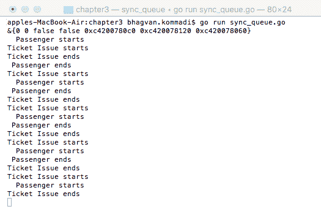

下一个部分将讨论 `Stacks`，它们是线性数据结构。

# Stacks

栈是一种后进先出结构，其中项目从顶部添加。栈用于解析器中解决迷宫算法。`Push`、`pop`、`top` 和 `get size` 是允许在栈数据结构上执行的典型操作。语法解析、回溯和编译时内存管理是一些可以使用栈的真实场景。以下是一个栈实现的示例（`stack.go`）：

```go
//main package has examples shown
// in Hands-On Data Structures and algorithms with Go book
package main
// importing fmt package
import (
 "fmt"
 "strconv"
)
//Element class
type Element struct {
 elementValue int
}
// String method on Element class
func (element *Element) String() string {
 return strconv.Itoa(element.elementValue)
}
```

`Element` 类有一个 `elementValue` 属性。`String` 方法返回元素的 `elementValue`。

在以下章节中介绍了栈方法，如 `New`、`Push`、`Pop` 和 `main`。

# The New method

`Stack`类的`New`方法创建了一个动态元素数组。`Stack`类具有元素的计数和数组指针。以下是与`Stack`类定义和`New`方法相关的代码片段：

```go
// NewStack returns a new stack.
func (stack *Stack) New() {
 stack.elements = make(*Element[] elements,0)
}
// Stack is a basic LIFO stack that resizes as needed.
type Stack struct {
 elements []*Element
 elementCount int
}
```

# 推入方法

`Push`方法将节点添加到`stack`类的顶部。在下面的代码示例中，`Stack`类的`Push`方法将元素添加到元素数组中，并增加`Count`元素，而`append`方法将元素添加到`stack`类的元素中：

```go
// Push adds a node to the stack.
func (stack *Stack) Push(element *Element) {
 stack.elements = append(stack.elements[:stack.elementCount], element)
 stack.elementCount = stack.elementCount + 1
}
```

调用带有参数元素的`push`方法后的示例输出如下。将值 7 的元素推入栈中。推入栈之前的元素计数为 2，推入栈后这个数字变为 3：

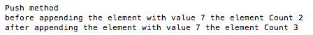

让我们看看下一节的`Pop`方法。

# 弹出方法

`Stack`实现的`Pop`方法从元素数组中移除最后一个元素并返回该元素，如下面的代码所示。`len`方法返回元素数组的长度：

```go
// Pop removes and returns a node from the stack in last to first order.
func (stack *Stack) Pop() *Element {
 if stack.elementCount == 0 {
 return nil
 }
 var length int = len(stack.elements)
 var element *Element = stack.elements[length -1]
 //stack.elementCount = stack.elementCount - 1
 if length > 1 {
 stack.elements = stack.elements[:length-1]
 } else {
 stack.elements = stack.elements[0:]
 }
 stack.elementCount = len(stack.elements)
 return element
}
```

调用`Pop`方法后的示例输出如下。将元素值 5 传递并添加到`Pop`方法中。调用`Pop`方法之前的元素计数为 2。调用`Pop`方法后的元素计数为 1：

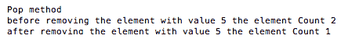

让我们看看下一节的`main`方法。

# 主方法

在以下代码部分，`main`方法创建了一个`stack`，调用`New`方法，并在初始化后推入元素。打印出弹出的元素值和顺序：

```go
// main method
func main() {
 var stack *Stack = & Stack{}
 stack.New()
 var element1 *Element = &Element{3}
 var element2 *Element = &Element{5}
 var element3 *Element = &Element{7}
 var element4 *Element = &Element{9}
 stack.Push(element1)
 stack.Push(element2)
 stack.Push(element3)
 stack.Push(element4)
 fmt.Println(stack.Pop(), stack.Pop(), stack.Pop(), stack.Pop())
}
```

执行以下命令以运行`stack.go`文件：

```go
go run stack.go
```

执行前面的命令后，我们得到以下输出：

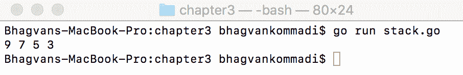

# 摘要

本章涵盖了`LinkedList`、双`LinkedList`、`Tuples`、`Sets`、`Queues`和`Stacks`的定义。本章还介绍了`LinkedList`方法——`AddToHead`、`AddToEnd`、`LastNode`和`iterateList`。此外，优先队列被建模为待处理订单的堆，同步队列被展示为乘客和票务处理队列，元组在函数返回多值表达式的上下文中进行了解释。`Stack`的`new`、`push`、`pop`和`string`方法通过代码示例进行了说明。

在下一章中，我们将涵盖`Trees`、`Tables`、`Containers`和`Hash`函数等领域。

# 问题

1.  你可以在哪里使用双链表？请提供一个示例。

1.  哪个链表方法可以用来打印节点值？

1.  哪个队列是用 Go 语言中的通道展示的？

1.  编写一个返回多个值的方法。可以使用什么数据结构来返回多个值？

1.  能设置有重复元素的吗？

1.  编写一个代码示例，展示两个集合的并集和交集。

1.  在链表中，使用哪种方法来查找两个值之间的节点？

1.  我们有一些不重复且唯一的元素。表示这些集合的正确数据结构是什么？

1.  在 Go 语言中，如何生成介于 3 和 5 之间的随机整数？

1.  如何在 Set 中检查是否存在值为 5 的元素？

# 进一步阅读

要了解更多关于 `LinkedLists`、`Sets`、`Tuples` 和 `Stacks` 的信息，请参考以下资料：

+   《*设计模式*》，作者 Erich Gamma、Richard Helm、Ralph Johnson 和 John Vlissides

+   《*算法导论 第 3 版*》，作者 Thomas H. Cormen、Charles E. Leiserson、Ronald L. Rivest 和 Clifford Stein

+   《*数据结构与算法：简单入门*》，作者 Rudolph Russell
