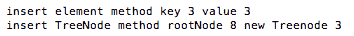
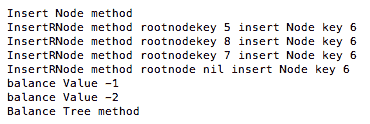
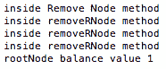
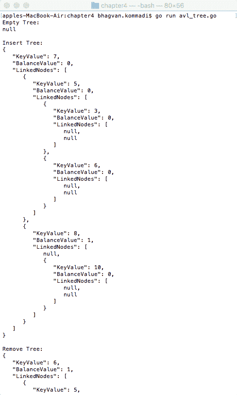
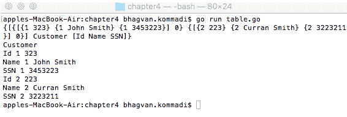
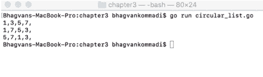
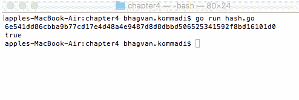

# 第四章：非线性数据结构

非线性数据结构在密码学和其他领域中使用。非线性数据结构是一种元素连接到许多元素的排列。这些结构使用内存快速且高效。添加新元素不需要连续的空闲内存。

在添加新元素之前，数据结构的长度并不重要。非线性数据结构有多个级别，而线性数据结构只有一个级别。非线性数据结构中的元素值没有组织。非线性数据结构中的数据元素不能一步迭代。这些数据结构的实现复杂。

本章解释了二叉搜索树、堆和符号表等树类型。

本章涵盖了以下非线性数据结构：

+   树

+   表格

+   容器

+   哈希函数

# 技术要求

从[`golang.org/doc/install`](https://golang.org/doc/install)为您的操作系统安装 Go 版本 1.10。

本章代码的 GitHub URL 如下：[`github.com/PacktPublishing/Learn-Data-Structures-and-Algorithms-with-Golang/tree/master/Chapter04`](https://github.com/PacktPublishing/Learn-Data-Structures-and-Algorithms-with-Golang/tree/master/Chapter04)。

# 树

树是一种非线性数据结构。树用于搜索和其他用例。二叉树的节点最多有两个子节点。二叉搜索树由节点组成，其中左节点的属性值小于右节点的属性值。根节点位于树的零级。每个子节点可以是叶子节点。

在我们讨论对数复杂度时，介绍了第一章“数据结构和算法”中的树和二叉树。让我们在下一节中更详细地看看它们。

# 二叉搜索树

二叉搜索树是一种允许快速查找、添加和删除元素的数据结构。它以排序顺序存储键以实现更快的查找。这种数据结构是由 P. F. Windley、A. D. Booth、A. J. T. Colin 和 T. N. Hibbard 发明的。平均而言，二叉搜索树的平均空间使用量为*O*(*n*)，而插入、搜索和删除操作的平均时间为*O*(*log* *n*)。二叉搜索树由具有属性或属性的节点组成：

+   一个`key`整数

+   一个`value`整数

+   `TreeNode`的`leftNode`和`rightNode`实例

它们可以用以下代码表示：

```go
// TreeNode class
type TreeNode struct {
 key int
 value int
 leftNode *TreeNode 
 rightNode *TreeNode 
}
```

在下一节中，将讨论`BinarySearchTree`类的实现。对于本节，请参阅`binary_search_tree.go`文件。

# 二叉搜索树类

在以下代码片段中，`BinarySearchTree`类包含一个`rootNode`，它是`TreeNode`类型，以及一个`sync.RWMutex`类型的锁。二叉搜索树通过访问`rootNode`的左右节点从`rootNode`遍历：

```go
// BinarySearchTree class
type BinarySearchTree struct {
 rootNode *TreeNode
 lock sync.RWMutex
}
```

既然我们已经知道了什么是 `BinarySearchTree`，那么让我们在下一节中看看它的不同方法。

# `InsertElement` 方法

`InsertElement` 方法在二叉搜索树中插入具有给定键和值的元素。首先锁定树的 `lock()` 实例，并在插入元素之前延迟调用 `unlock()` 方法。通过传递 `rootNode` 和要创建的具有键和值的节点调用 `InsertTreeNode` 方法，如下所示：

```go
// InsertElement method
func (tree *BinarySearchTree) InsertElement(key int, value int) {
 tree.lock.Lock()
 defer tree.lock.Unlock()
 var treeNode *TreeNode
 treeNode= &TreeNode{key, value, nil, nil}
 if tree.rootNode == nil {
 tree.rootNode = treeNode
 } else {
 insertTreeNode(tree.rootNode, treeNode)
 }
}
```

插入键和值为 `3` 的元素的示例输出如下。`insert` 元素方法调用 `insertTreeNode`，传递具有键 `8` 的 `rootNode` 和具有键 `3` 的新 `treeNode`：



# `insertTreeNode` 方法

`insertTreenode` 方法在二叉搜索树中插入新的 `TreeNode`。在以下代码中，`insertTreeNode` 方法接受 `rootNode` 和 `newTreeNode` 作为参数，两者都是 `TreeNode` 类型。注意，`newTreeNode` 通过比较键值被插入到二叉搜索树的正确位置：

```go
// insertTreeNode function
func insertTreeNode(rootNode *TreeNode, newTreeNode *TreeNode) {
 if newTreeNode.key < rootNode.key {
 if rootNode.leftNode == nil {
 rootNode.leftNode = newTreeNode
 } else {
 insertTreeNode(rootNode.leftNode, newTreeNode)
 }
 } else {
 if rootNode.rightNode == nil{ 
 rootNode.rightNode = newTreeNode
 } else {
 insertTreeNode(rootNode.rightNode, newTreeNode)
 }
 }
}
```

# `inOrderTraverse` 方法

`inOrderTraverse` 方法按顺序访问所有节点。首先在树 `lock` 实例上调用 `RLock()` 方法。在调用 `inOrderTraverseTree` 方法之前，在树 `lock` 实例上延迟调用 `RUnLock()` 方法，如下面的代码片段所示：

```go
// InOrderTraverseTree method
func (tree *BinarySearchTree) InOrderTraverseTree(function func(int)) {
 tree.lock.RLock()
 defer tree.lock.RUnlock()
 inOrderTraverseTree(tree.rootNode, function)
}
```

# `inOrderTraverseTree` 方法

`inOrderTraverseTree` 方法遍历左子树、根节点和右子树。`inOrderTraverseTree` 方法接受 `TreeNode` 类型的 `treeNode` 和 `function` 作为参数。`inOrderTraverseTree` 方法在 `leftNode` 和 `rightNode` 上调用，并传递 `function` 作为参数。`function` 以 `treeNode.value` 作为参数传递，如下面的代码片段所示：

```go
//  inOrderTraverseTree method
func inOrderTraverseTree(treeNode *TreeNode, function func(int)) {
 if treeNode != nil {
 inOrderTraverseTree(treeNode.leftNode, function)
 function(treeNode.value)
 inOrderTraverseTree(treeNode.rightNode, function)
 }
}
```

# `PreOrderTraverseTree` 方法

`PreOrderTraverseTree` 方法以先序遍历的方式访问所有 `tree` 节点。首先锁定 `tree` 的 `lock` 实例，并在调用 `preOrderTraverseTree` 之前延迟调用 `Unlock` 方法。在以下代码片段中，`preOrderTraverseTree` 方法以 `rootNode` 和 `function` 作为参数传递：

```go
// PreOrderTraverseTree method
func (tree *BinarySearchTree) PreOrderTraverseTree(function func(int)) {
 tree.lock.Lock()
 defer tree.lock.Unlock()
 preOrderTraverseTree(tree.rootNode, function)
}
```

# `preOrderTraverseTree` 方法

`preOrderTraverseTree` 方法以 `TreeNode` 类型的 `treeNode` 和 `function` 作为参数传递。通过传递 `leftNode` 和 `rightNode` 作为参数调用 `preOrderTraverseTree` 方法。`function` 以 `treeNode.value` 作为参数调用，如下所示：

```go
//  preOrderTraverseTree method
func preOrderTraverseTree(treeNode *TreeNode, function func(int)) {
 if treeNode != nil {
 function(treeNode.value)
 preOrderTraverseTree(treeNode.leftNode, function)
 preOrderTraverseTree(treeNode.rightNode, function)
 }
}
```

# `PostOrderTraverseTree` 方法

`PostOrderTraverseTree` 方法以后序（左、右、当前节点）遍历节点。在以下代码片段中，`BinarySearchTree` 类的 `PostOrderTraverseTree` 方法以后序遍历的方式访问所有节点。将 `function` 方法作为参数传递给方法。首先锁定 `tree.lock` 实例，并在调用 `postOrderTraverseTree` 方法之前在树 `lock` 实例上延迟调用 `Unlock` 方法：

```go
// PostOrderTraverseTree method
func (tree *BinarySearchTree) PostOrderTraverseTree(function func(int)) {
 tree.lock.Lock()
 defer tree.lock.Unlock()
 postOrderTraverseTree(tree.rootNode, function)
}
```

# 后序遍历树方法

`postOrderTraverseTree` 方法接受 `TreeNode` 类型的 `treeNode` 和 `function` 作为参数。通过传递 `leftNode` 和 `rightNode` 以及 `function` 作为参数来调用 `postOrderTraverseTree` 方法。在以下代码片段中，`function` 使用 `treeNode.value` 作为参数被调用：

```go
//  postOrderTraverseTree method
func postOrderTraverseTree(treeNode *TreeNode, function func(int)) {
 if treeNode != nil {
 postOrderTraverseTree(treeNode.leftNode, function)
 postOrderTraverseTree(treeNode.rightNode, function)
 function(treeNode.value)
 }
}
```

# 最小节点方法

`MinNode` 在二叉搜索树中找到具有最小值的节点。在下面的代码片段中，首先调用树 `lock` 实例的 `RLock` 方法，然后延迟执行树 `lock` 实例上的 `RUnlock` 方法。`MinNode` 方法通过从 `rootNode` 开始遍历并检查 `leftNode` 的值是否为 `nil` 来返回具有最低值的元素：

```go
// MinNode method
func (tree *BinarySearchTree) MinNode() *int {
 tree.lock.RLock()
 defer tree.lock.RUnlock()
 var treeNode *TreeNode
 treeNode = tree.rootNode
 if treeNode == nil {
 //nil instead of 0
 return (*int)(nil)
 }
 for {
 if treeNode.leftNode == nil {
 return &treeNode.value
 }
 treeNode = treeNode.leftNode
 }
}
```

# 最大节点方法

`MaxNode` 在二叉搜索树中找到具有最大属性的节点。首先调用树 `lock` 实例的 `RLock` 方法，然后延迟执行树 `lock` 实例上的 `RUnlock` 方法。`MaxNode` 方法在从 `rootNode` 遍历并找到一个具有 `nil` 值的 `rightNode` 后返回具有最高值的元素。这如下面的代码所示：

```go
// MaxNode method
func (tree *BinarySearchTree) MaxNode() *int {
 tree.lock.RLock()
 defer tree.lock.RUnlock()
 var treeNode *TreeNode
 treeNode = tree.rootNode
 if treeNode == nil {
 //nil instead of 0
 return (*int)(nil)
 }
 for {
 if treeNode.rightNode == nil {
 return &treeNode.value
 }
 treeNode = treeNode.rightNode
 }
}
```

# 搜索节点方法

`SearchNode` 方法在二叉搜索树中搜索指定的节点。首先，调用树锁实例的 `RLock` 方法。然后，将树 `lock` 实例上的 `RUnlock` 方法延迟执行。`BinarySearchTree` 类的 `SearchNode` 方法使用 `rootNode` 和 `key` 整数值作为参数调用 `searchNode` 方法，如下所示：

```go
// SearchNode method
func (tree *BinarySearchTree) SearchNode(key int) bool {
 tree.lock.RLock()
 defer tree.lock.RUnlock()
 return searchNode(tree.rootNode, key)
}
```

# 搜索节点方法

在以下代码中，`searchNode` 方法接受 `TreeNode` 类型的指针 `treeNode` 和 `key` 整数值作为参数。在检查是否存在与 `key` 值相同的 `treeNode` 后，该方法返回 `true` 或 `false`：

```go
//  searchNode method
func searchNode(treeNode *TreeNode, key int) bool {
 if treeNode == nil {
 return false
 }
 if key < treeNode.key {
 return searchNode(treeNode.leftNode, key)
 }
 if key > treeNode.key {
 return searchNode(treeNode.rightNode, key)
 }
 return true
}
```

# 移除节点方法

`BinarySearchTree` 类的 `RemoveNode` 方法移除传入的 `key` 值对应的元素。该方法将 `key` 整数值作为参数。首先在树的 `lock` 实例上调用 `Lock()` 方法。然后延迟执行树 `lock` 实例的 `Unlock()` 方法，并使用 `rootNode` 和 `key` 值作为参数调用 `removeNode`，如下所示：

```go
// RemoveNode method
func (tree *BinarySearchTree) RemoveNode(key int) {
 tree.lock.Lock()
 defer tree.lock.Unlock()
 removeNode(tree.rootNode, key)
}
```

# 移除节点方法

`removeNode` 方法接受 `TreeNode` 类型的 `treeNode` 和 `key` 整数值作为参数。在下面的代码片段中，该方法递归地搜索 `treeNode` 的 `leftNode` 实例和 `rightNode` 的 `key` 值，如果它与参数值匹配：

```go
// removeNode method
func removeNode(treeNode *TreeNode, key int) *TreeNode {
 if treeNode == nil {
 return nil
 }
 if key < treeNode.key {
 treeNode.leftNode = removeNode(treeNode.leftNode, key)
 return treeNode
 }
 if key > treeNode.key {
 treeNode.rightNode = removeNode(treeNode.rightNode, key)
 return treeNode
 }
 // key == node.key
 if treeNode.leftNode == nil && treeNode.rightNode == nil {
 treeNode = nil
 return nil
 }
 if treeNode.leftNode == nil {
 treeNode = treeNode.rightNode
 return treeNode
 }
 if treeNode.rightNode == nil {
 treeNode = treeNode.leftNode
 return treeNode
 }
 var leftmostrightNode *TreeNode
 leftmostrightNode = treeNode.rightNode
 for {
 //find smallest value on the right side
 if leftmostrightNode != nil && leftmostrightNode.leftNode != nil {
 leftmostrightNode = leftmostrightNode.leftNode
 } else {
 break
 }
 }
 treeNode.key, treeNode.value = leftmostrightNode.key, leftmostrightNode.value
 treeNode.rightNode = removeNode(treeNode.rightNode, treeNode.key)
 return treeNode
}
```

# 字符串方法

`String` 方法将 `tree` 转换为字符串格式。首先在树的 `lock` 实例上调用 `Lock()` 方法。然后延迟执行树 `lock` 实例的 `Unlock()` 方法。`String` 方法打印 `tree` 的可视表示：

```go
// String method
func (tree *BinarySearchTree) String() {
 tree.lock.Lock()
 defer tree.lock.Unlock()
 fmt.Println("------------------------------------------------")
 stringify(tree.rootNode, 0)
 fmt.Println("------------------------------------------------")
}
```

# 字符串化方法

在以下代码片段中，`stringify` 方法接受 `TreeNode` 类型的 `treeNode` 实例和 `level`（一个整数）作为参数。该方法根据级别递归打印树：

```go
// stringify method
func stringify(treeNode *TreeNode, level int) {
 if treeNode != nil {
 format := ""
 for i := 0; i < level; i++ {
 format += " "
 }
 format += "--- "
 level++
 stringify(treeNode.leftNode, level)
 fmt.Printf(format+"%d\n", treeNode.key)
 stringify(treeNode.rightNode, level)
 }
}
```

# 主方法

在以下代码中，`main` 方法创建了一个二叉搜索树，并将元素 `8`、`3`、`10`、`1` 和 `6` 插入其中。通过调用 `String` 方法打印 `tree`：

```go
// main method
func main() {
 var tree *BinarySearchTree = &BinarySearchTree{}
 tree.InsertElement(8,8)
 tree.InsertElement(3,3)
 tree.InsertElement(10,10)
 tree.InsertElement(1,1)
 tree.InsertElement(6,6)
 tree.String()
}
```

运行以下命令以执行 `binary_search_tree.go` 文件：

```go
go run binary_search_tree.go
```

输出如下：

![

下一节讨论 AVL 树的实现。

# Adelson, Velski, and Landis (AVL) 树

Adelson, Velski, and Landis 首创了 AVL 树数据结构，因此以他们的名字命名。它由调整高度的二叉搜索树组成。平衡因子是通过找到左右子树高度的差来获得的。平衡是通过旋转技术完成的。如果平衡因子大于一，则旋转将节点移至左子树或右子树的相反方向。搜索、添加和删除操作按 *O*(*log n*) 的顺序处理。

以下章节讨论了 `KeyValue` 接口定义和 `TreeNode` 类。对于本节，请参阅 `avl_tree.go` 文件。

# `KeyValue` 接口

`KeyValue` 接口有 `LessThan` 和 `EqualTo` 方法。`LessThan` 和 `EqualTo` 方法接受 `KeyValue` 作为参数，并在检查小于或等于条件后返回一个布尔值。如下代码所示：

```go
// KeyValue type
type KeyValue interface {
  LessThan(KeyValue) bool
  EqualTo(KeyValue) bool
}
```

# TreeNode 类

`TreeNode` 类具有 `KeyValue`、`BalanceValue` 和 `LinkedNodes` 作为属性。AVL 树是一个由 `TreeNode` 类型节点组成的树，如下所示：

```go
// TreeNode class
type TreeNode struct {
 KeyValue     KeyValue
 BalanceValue int
 LinkedNodes [2]*TreeNode
}
```

现在，让我们看看 `TreeNode` 类的不同方法。

# 相反的方法

`opposite` 方法接受一个节点值，并返回相反节点的值。在以下代码片段中，`opposite` 方法接受 `nodeValue` 整数作为参数，并返回相反节点的值：

```go
//opposite method
func opposite(nodeValue int) int {
 return 1 - nodeValue
}
```

# `singleRotation` 方法

`singleRotation` 方法旋转与指定子树相反的节点。如下代码片段所示，`singleRotation` 函数旋转与左子树或右子树相反的节点。该方法接受 `rootNode` 的指针和一个 `nodeValue` 整数作为参数，并返回一个 `TreeNode` 指针：

```go
// single rotation method
func singleRotation(rootNode *TreeNode, nodeValue int) *TreeNode {
var saveNode *TreeNode
 saveNode = rootNode.LinkedNodes[opposite(nodeValue)]
 rootNode.LinkedNodes[opposite(nodeValue)] = saveNode.LinkedNodes[nodeValue]
 saveNode.LinkedNodes[nodeValue] = rootNode
 return saveNode
}
```

# 双重旋转方法

在这里，`doubleRotation` 方法将节点旋转两次。该方法返回一个 `TreeNode` 指针，接受参数如 `rootNode`，它是一个 `treeNode` 指针，以及 `nodeValue`，它是一个整数。如下代码所示：

```go
// double rotation
func doubleRotation(rootNode *TreeNode, nodeValue int) *TreeNode {
var saveNode *TreeNode
 saveNode = rootNode.LinkedNodes[opposite(nodeValue)].LinkedNodes[nodeValue]
rootNode.LinkedNodes[opposite(nodeValue)].LinkedNodes[nodeValue] = saveNode.LinkedNodes[opposite(nodeValue)]
 saveNode.LinkedNodes[opposite(nodeValue)] = rootNode.LinkedNodes[opposite(nodeValue)]
 rootNode.LinkedNodes[opposite(nodeValue)] = saveNode
saveNode = rootNode.LinkedNodes[opposite(nodeValue)]
 rootNode.LinkedNodes[opposite(nodeValue)] = saveNode.LinkedNodes[nodeValue]
 saveNode.LinkedNodes[nodeValue] = rootNode
 return saveNode
}
```

该方法的实现如 *插入节点方法* 部分所示，如下。

# 调整平衡方法

`adjustBalance` 方法调整树的平衡。在以下代码片段中，`adjustBalance` 方法根据平衡因子、`rootNode` 和 `nodeValue` 执行双旋转。`adjustBalance` 方法接受 `rootNode`（`TreeNode` 类型的实例）、`nodeValue` 和 `balanceValue`（都是整数）作为参数：

```go
// adjust balance method 
func adjustBalance(rootNode *TreeNode, nodeValue int, balanceValue int) {
 var node *TreeNode
 node = rootNode.LinkedNodes[nodeValue]
 var oppNode *TreeNode
 oppNode = node.LinkedNodes[opposite(balanceValue)]
 switch oppNode.BalanceValue {
 case 0:
 rootNode.BalanceValue = 0
 node.BalanceValue = 0
 case balanceValue:
 rootNode.BalanceValue = -balanceValue
 node.BalanceValue = 0
 default:
 rootNode.BalanceValue = 0
 node.BalanceValue = balanceValue
 }
 oppNode.BalanceValue= 0
}
```

# `BalanceTree` 方法

`BalanceTree` 方法通过单次或双旋转来改变平衡因子。该方法接受 `rootNode`（一个 `TreeNode` 指针）和 `nodeValue`（一个整数）作为参数。`BalanceTree` 方法返回一个 `TreeNode` 指针，如下所示：

```go
// BalanceTree method
func BalanceTree(rootNode *TreeNode, nodeValue int) *TreeNode {
 var node *TreeNode
 node = rootNode.LinkedNodes[nodeValue]
 var balance int
 balance = 2*nodeValue - 1
 if node.BalanceValue == balance {
 rootNode.BalanceValue = 0
 node.BalanceValue = 0
 return singleRotation(rootNode, opposite(nodeValue))
 }
 adjustBalance(rootNode, nodeValue, balance)
 return doubleRotation(rootNode, opposite(nodeValue))
}
```

# `insertRNode` 方法

`insertRNode` 方法插入节点并平衡树。此方法使用 `KeyValue` 键插入 `rootNode`，如下代码片段所示。该方法接受 `rootNode`（一个 `TreeNode` 指针）和 `key`（一个整数）作为参数。如果成功插入 `rootNode`，则方法返回一个 `TreeNode` 指针和一个布尔值：

```go
//insertRNode method
func insertRNode(rootNode *TreeNode, key KeyValue) (*TreeNode, bool) {
 if rootNode == nil {
 return &TreeNode{KeyValue: key}, false
 }
 var dir int
 dir = 0
 if rootNode.KeyValue.LessThan(key) {
 dir = 1
 }
 var done bool
 rootNode.LinkedNodes[dir], done = insertRNode(rootNode.LinkedNodes[dir], key)
 if done {
 return rootNode, true
 }
 rootNode.BalanceValue = rootNode.BalanceValue+(2*dir - 1)
 switch rootNode.BalanceValue {
 case 0:
 return rootNode, true
 case 1, -1:
 return rootNode, false
 }
 return BalanceTree(rootNode, dir), true
}
```

# `InsertNode` 方法

`InsertNode` 方法将节点插入到 AVL 树中。此方法接受 `treeNode`（一个双 `TreeNode` 指针）和 `key` 值作为参数：

```go
// InsertNode method
func InsertNode(treeNode **TreeNode, key KeyValue) {
 *treeNode, _ = insertRNode(*treeNode, key)
}
```

以下截图显示了 `InsertNode` 方法的示例输出。`InsertNode` 方法使用 `rootNode` 参数和要插入的节点调用 `insertRNode` 方法。`rootNode` 的键值为 `5`，要插入的节点的键值为 `6`。树需要平衡。

因此，下一个调用将是具有键值 `8` 的 `rootNode` 和要插入的节点。下一步调用 `rootnode`，键值为 `7`，并插入节点。最后的调用将是 `rootNode` 为 `nil` 和要插入的节点。检查平衡值，平衡树方法返回平衡后的树：



# `RemoveNode` 方法

在以下代码中，`RemoveNode` 方法通过调用 `removeRNode` 方法从 AVL 树中删除元素。该方法接受 `treeNode`（一个双 `TreeNode` 指针）和 `KeyValue` 作为参数：

```go
// RemoveNode method
func RemoveNode(treeNode **TreeNode, key KeyValue) {
 *treeNode, _ = removeRNode(*treeNode, key)
}
```

# `removeBalance` 方法

`removeBalance` 方法从树中移除平衡因子。在删除节点后，此方法调整平衡因子并返回一个 `treeNode` 指针和一个布尔值，如果平衡被移除。该方法接受 `rootNode`（`TreeNode` 的一个实例）和 `nodeValue`（一个整数）作为参数。如下代码所示：

```go
// removeBalance method
func removeBalance(rootNode *TreeNode, nodeValue int) (*TreeNode, bool) {
 var node *TreeNode
 node = rootNode.LinkedNodes[opposite(nodeValue)]
 var balance int
 balance = 2*nodeValue - 1
 switch node.BalanceValue {
 case -balance:
 rootNode.BalanceValue = 0
 node.BalanceValue = 0
 return singleRotation(rootNode, nodeValue), false
 case balance:
 adjustBalance(rootNode, opposite(nodeValue), -balance)
 return doubleRotation(rootNode, nodeValue), false
 }
 rootNode.BalanceValue = -balance
 node.BalanceValue = balance
 return singleRotation(rootNode, nodeValue), true
}
```

# `removeRNode` 方法

`removeRNode` 方法从树中删除节点并平衡树。此方法接受 `rootNode`（一个 `TreeNode` 指针）和 `key` 值。如果成功删除 `RNode`，则此方法返回一个 `TreeNode` 指针和一个布尔值，如下代码片段所示：

```go
//removeRNode method
func removeRNode(rootNode *TreeNode, key KeyValue) (*TreeNode, bool) {
 if rootNode == nil {
 return nil, false
 }
 if rootNode.KeyValue.EqualTo(key) {
 switch {
 case rootNode.LinkedNodes[0] == nil:
 return rootNode.LinkedNodes[1], false
 case rootNode.LinkedNodes[1] == nil:
 return rootNode.LinkedNodes[0], false
 }
 var heirNode *TreeNode
 heirNode = rootNode.LinkedNodes[0]
 for heirNode.LinkedNodes[1] != nil {
 heirNode = heirNode.LinkedNodes[1]
 }
 rootNode.KeyValue = heirNode.KeyValue
 key = heirNode.KeyValue
 }
 var dir int
 dir = 0
 if rootNode.KeyValue.LessThan(key) {
 dir = 1
 }
 var done bool
 rootNode.LinkedNodes[dir], done = removeR(rootNode.LinkedNodes[dir], key)
 if done {
 return rootNode, true
 }
 rootNode.BalanceValue = rootNode.BalanceValue + (1 - 2*dir)
 switch rootNode.BalanceValue {
 case 1, -1:
 return rootNode, true
 case 0:
 return rootNode, false
 }
 return removeBalance(rootNode, dir)
}
type integerKey int
func (k integerKey) LessThan(k1 KeyValue) bool { return k < k1.(integerKey) }
func (k integerKey) EqualTo(k1 KeyValue) bool { return k == k1.(integerKey) }
```

以下展示了 `removeRNode` 方法的示例输出。`RemoveNode` 方法调用 `removeRNode` 方法。`removeRNode` 方法接受节点的参数，例如 `rootNode` 和 `KeyValue`：



# `main`方法

在以下代码片段中，`main`方法通过插入具有`5`、`3`、`8`、`7`、`6`和`10`键的节点来创建 AVL 树。具有`3`和`7`键的节点被移除。将树数据结构转换为字节的 JSON。在转换为字符串后打印 JSON 字节：

```go
//main method
func main() {
  var treeNode *TreeNode
  fmt.Println("Tree is empty")
  var avlTree []byte
  avlTree, _ = json.MarshalIndent(treeNode, "", " ")
  fmt.Println(string(avlTree))

  fmt.Println("\n Add Tree")
  InsertNode(&treeNode, integerKey(5))
  InsertNode(&treeNode, integerKey(3))
  InsertNode(&treeNode, integerKey(8))
  InsertNode(&treeNode, integerKey(7))
  InsertNode(&treeNode, integerKey(6))
  InsertNode(&treeNode, integerKey(10))
  avlTree, _ = json.MarshalIndent(treeNode, "", " ")
  fmt.Println(string(avlTree))

  fmt.Println("\n Delete Tree")
  RemoveNode(&treeNode, integerKey(3))
  RemoveNode(&treeNode, integerKey(7))
  avlTree, _ = json.MarshalIndent(treeNode, "", " ")
  fmt.Println(string(avlTree))
}
```

运行以下命令以执行`avl_tree.go`文件：

```go
go run avl_tree.go
```

输出如下：



在下一节中，将讨论 B+树的实现并展示代码片段。

# B+树

B+树包含一个键列表和指向树中下一级节点的指针。在搜索过程中，通过查找相邻节点键来递归搜索元素。B+树用于在文件系统中存储数据。B+树在树中搜索节点时需要的 I/O 操作更少。扇出定义为指向 B+树中节点子节点的节点数。B+树首先由鲁道夫·拜尔和爱德华·M·麦克雷特在技术论文中描述。

B+树中的面向块存储上下文有助于数据的存储和高效检索。通过使用压缩技术可以增强 B+树的空间效率。B+树属于多路搜索树家族。对于 b 阶 B+树，空间使用量是*n*的阶。插入、查找和删除操作是*b*的对数阶。

# B 树

B 树是一种搜索树，其非叶节点只包含键，而数据位于叶节点中。B 树用于减少磁盘访问次数。B 树是一种自我调整的数据结构，能够保持数据的排序。B 树以排序顺序存储键，以便于遍历。它们可以处理多个插入和删除操作。

计算机科学家高德纳（Knuth）最初提出了这种数据结构的概念。B 树由最多有*n*个子节点的节点组成。树中的每个非叶节点至少有*n*/2 个子节点。鲁道夫·拜尔（Rudolf Bayer）和爱德华·M·麦克雷特（Edward M. McCreight）首先在他们的工作中实现了这种数据结构。B 树用于 HFS 和 Reiser4 文件系统，以便快速访问文件中的任何块。平均而言，空间使用量是*n*的阶。插入、搜索和删除操作是*n*的对数阶。

# T 树

T 树是一种平衡的数据结构，它将索引和实际数据都存储在内存中。它们用于内存数据库。T 指的是节点的形状。每个节点由指向父节点和左右子节点的指针组成。树中的每个节点都将有一个有序的数据指针数组和额外的控制数据。

T 树与内存中的树结构具有相似的性能优势。T 树是在自平衡二叉搜索树之上实现的。这种数据结构适合于有序扫描数据。它支持各种程度的隔离。

# 表格

如我们所知，表格在数据管理和其他领域中被使用。一个表格有一个名称和包含列名的表头。让我们看看以下章节中表格的不同类，如`Table`类、`Row`类、`Column`类以及`PrintTable`方法。

对于本节，请参考`table.go`文件。

# Table 类

`Table`类有一个行数组和列名数组。表格的`Name`是`struct`类中的一个字符串属性，如下所示：

```go
// Table Class
type Table struct {
    Rows []Row
    Name string
    ColumnNames []string
}
```

# Row 类

`Row`类有一个列数组和一个整型`Id`，如下面的代码所示。`Id`实例是行的唯一标识符：

```go
// Row Class
type Row struct {
 Columns []Column
 Id int
}
```

# Column 类

`Column`类有一个整型`Id`和一个由唯一标识符识别的`Value`字符串，如下面的代码片段所示：

```go
// Column Class
type Column struct {
 Id int
 Value string
}
```

# 打印表格方法

在以下代码片段中，`printTable`方法打印表格的行和列。遍历行，然后对于每一行打印列：

```go
//printTable
func printTable(table Table){
 var rows []Row = table.Rows
 fmt.Println(table.Name)
 for _,row := range rows {
 var columns []Column = row.Columns
 for i,column := range columns {
 fmt.Println(table.ColumnNames[i],column.Id,column.Value);
 }
 }
}
```

# main 方法

在这个`main`方法中，我们将实例化我们刚刚看到的类，如`Table`、`Row`和`Column`。`main`方法创建一个表格并设置名称和列名。列用值创建。在创建行之后，将列设置在行上。通过调用`printTable`方法打印表格，如下所示：

```go
// main method
func main() {
 var table Table = Table{}
 table.Name = "Customer"
 table.ColumnNames = []string{"Id", "Name","SSN"}
 var rows []Row = make([]Row,2)
 rows[0] = Row{}
 var columns1 []Column = make([]Column,3)
 columns1[0] = Column{1,"323"}
 columns1[1] = Column{1,"John Smith"}
 columns1[2] = Column{1,"3453223"}
 rows[0].Columns = columns1
 rows[1] = Row{}
 var columns2 []Column = make([]Column,3)
 columns2[0] = Column{2,"223"}
 columns2[1] = Column{2,"Curran Smith"}
 columns2[2] = Column{2,"3223211"}
 rows[1].Columns = columns2
 table.Rows = rows
 fmt.Println(table)
 printTable(table)
}
```

运行以下命令以执行`table.go`文件：

```go
go run table.go
```

输出如下：



下一节将讨论符号表数据结构。

# 符号表

在程序翻译过程中，内存中存在符号表。它也可以存在于程序二进制文件中。符号表包含符号的名称、位置和地址。在 Go 语言中，`gosym`包实现了对 Go 符号和行号表的访问。由 GC 编译器生成的 Go 二进制文件具有符号和行号表。行表是一种将程序计数器映射到行号的数据结构。

# 容器

容器包提供了对 Go 中堆、列表和环形功能的访问。容器用于社交网络、知识图谱和其他领域。容器是列表、映射、切片、通道、堆、队列和 treaps。列表在第一章 *数据结构和算法* 中介绍。映射和切片是 Go 中的内置容器。Go 中的通道被称为队列。堆是一种树形数据结构。这种数据结构满足堆属性。队列在第三章 *线性数据结构* 中被建模为堆。treap 是树和堆的结合。它是一个具有键和值的二叉树，并维护一个堆来保持优先级。

环被称为循环链表，将在下一节中介绍。对于本节，请参考`circular_list.go`文件。

# 循环链表

循环链表是一种数据结构，其中最后一个节点后面跟着第一个节点。使用`container/ring`结构来模拟循环链表。以下是一个循环链表的实现示例：

```go
package main
import (
 "container/ring"
 "fmt"
)
func main() {
 var integers []int
 integers = []int{1,3,5,7}
 var circular_list *ring.Ring
 circular_list= ring.New(len(integers))
 var i int
 for i = 0; i < circular_list.Len(); i++ {
 circular_list.Value = integers[i]
 circular_list = circular_list.Next()
 }
```

使用参数`len` *n* 的`ring.New`方法创建长度为*n*的循环列表。通过使用`Next`方法遍历`circular_list`，使用整数数组初始化循环链表。`ring.Ring`类的`Do`方法接受一个元素作为接口，并按以下方式打印元素：

```go
circular_list.Do(func(element interface{}) {
 fmt.Print(element,",")
 })
 fmt.Println()
```

使用`Prev`方法遍历循环列表的逆序，并在以下代码中打印其值：

```go
// reverse of the circular list
 for i = 0; i < circular_list.Len(); i++ {
 fmt.Print(circular_list.Value,",")
 circular_list = circular_list.Prev()
 }
 fmt.Println()
```

在以下代码片段中，使用`Move`方法将循环列表向前移动两个元素，并打印其值：

```go
// move two elements forward in the circular list
 circular_list = circular_list.Move(2)
 circular_list.Do(func(element interface{}) {
 fmt.Print(element,",")
 })
 fmt.Println()
}
```

运行以下命令以执行`circular_list.go`文件：

```go
go run circular_list.go
```

输出如下：



下一节将讨论`hash`函数数据结构。

# 哈希函数

哈希函数在密码学和其他领域中被使用。这些数据结构通过与密码学相关的代码示例进行展示。在 Go 语言中实现`hash`函数有两种方式：使用`crc32`或`sha256`。序列化（将字符串转换为编码形式）保存了内部状态，这将在以后用于其他目的。本节解释了`BinaryMarshaler`（将字符串转换为二进制形式）的示例：

```go
//main package has examples shown
// in Hands-On Data Structures and algorithms with Go book
package main
// importing bytes, crpto/sha256, encoding, fmt and log package
import (
 "bytes"
 "crypto/sha256"
 "encoding"
 "fmt"
 "log"
 "hash"
)
```

`main`方法创建了两个示例字符串的二进制序列化哈希。打印两个字符串的哈希值。使用字节上的 equals 方法比较第一个哈希的总和与第二个哈希。这在上面的代码中展示：

```go
//main method
func main() {
 const (
 example1 = "this is a example "
 example2 = "second example"
 )
 var firstHash hash.Hash
 firstHash = sha256.New()
 firstHash.Write([]byte(example1))
 var marshaler encoding.BinaryMarshaler
 var ok bool
 marshaler, ok = firstHash.(encoding.BinaryMarshaler)
 if !ok {
 log.Fatal("first Hash is not generated by encoding.BinaryMarshaler")
 }
 var data []byte
 var err error
 data, err = marshaler.MarshalBinary()
 if err != nil {
 log.Fatal("failure to create first Hash:", err)
 }
 var secondHash hash.Hash
 secondHash = sha256.New()
var unmarshaler encoding.BinaryUnmarshaler
 unmarshaler, ok = secondHash.(encoding.BinaryUnmarshaler)
 if !ok {
 log.Fatal("second Hash is not generated by encoding.BinaryUnmarshaler")
 }
 if err := unmarshaler.UnmarshalBinary(data); err != nil {
 log.Fatal("failure to create hash:", err)
 }
 firstHash.Write([]byte(example2))
 secondHash.Write([]byte(example2))
 fmt.Printf("%x\n", firstHash.Sum(nil))
 fmt.Println(bytes.Equal(firstHash.Sum(nil), secondHash.Sum(nil)))
}
```

运行以下命令以执行`hash.go`文件：

```go
go run hash.go
```

输出如下：



# 摘要

本章介绍了树、二叉搜索树和 AVL 树。简要解释了 Treap、B 树和 B+树。通过各种代码示例展示了在树中进行插入、删除和更新元素的操作。在最后一节中介绍了表格、容器和哈希函数。在每个部分中解释了插入、删除和搜索等操作的时间和空间复杂度。

在下一章中，将介绍二维和多维数组等齐次数据结构。

# 问题

1.  你能给出一个可以使用二叉搜索树的例子吗？

1.  在二叉搜索树中搜索元素使用的是哪个方法？

1.  在 AVL 树中调整平衡使用了哪些技术？

1.  什么是符号表？

1.  在哈希类中调用哪个类和方法来生成二进制序列化的哈希？

1.  Go 语言中哪个容器用于模拟循环链表？

1.  如何从树结构创建 JSON（缩进）？使用了哪个类和方法？

1.  如何比较哈希的总和？

1.  AVL 树中的平衡因子是什么？

1.  你如何在表格中识别行和列？

# 进一步阅读

如果你想了解更多关于树、二叉搜索树和 AVL 树的内容，以下书籍推荐：

+   《设计模式》，作者：Erich Gamma, Richard Helm, Ralph Johnson, 和 John Vlissides

+   《算法导论（第三版）》，作者：Thomas H. Cormen, Charles E. Leiserson, Ronald L. Rivest, 和 Clifford Stein

+   《数据结构与算法：简易入门》，作者：Rudolph Russell
