# 第五章：同质数据结构

**同质数据结构**包含类似类型的数据，例如整数或双精度值。同质数据结构用于矩阵、张量和向量数学。**张量**是标量和向量的数学结构。一阶张量是一个**向量**。向量由一行或一列组成。零阶张量是一个**标量**。**矩阵**是数字的二维集合。它们都用于科学分析。

张量在材料科学中得到了应用。它们在数学、物理、力学、电动力学和广义相对论中都有使用。机器学习解决方案利用张量数据结构。张量具有位置、形状和静态大小等属性。

本章涵盖了以下同质数据结构：

+   **二维数组**

+   **多维数组**

以下场景展示了二维和多维数组的用法：

+   矩阵表示

+   乘法

+   加法

+   减法

+   矩阵行列式计算

+   逆运算

+   转置

# 技术要求

为您的操作系统安装 Go 版本 1.10，请访问[`golang.org/doc/install`](https://golang.org/doc/install)。

本章代码的 GitHub URL 如下：[`github.com/PacktPublishing/Learn-Data-Structures-and-Algorithms-with-Golang/tree/master/Chapter05`](https://github.com/PacktPublishing/Learn-Data-Structures-and-Algorithms-with-Golang/tree/master/Chapter05)[.](https://github.com/PacktPublishing/Learn-Data-Structures-and-Algorithms-with-Go/tree/master/Chapter05)

# 二维数组

二维数组在第二章，*使用 Go 进行数据结构和算法入门*中简要介绍。为了回顾，对于动态分配，我们使用**切片的切片**，它是一个二维数组。二维数组是一个单维数组的列表。二维数组`arr`中的每个元素都标识为`arr[i][j]`，其中`arr`是数组的名称，*i*和*j*分别代表行和列，它们的值分别从 0 到*m*和从 0 到*n*。遍历二维数组是*O*(*m*n*)复杂度。

以下代码展示了如何初始化一个数组：

```go
var arr = [4][5] int{
    {4,5,7,8,9},
    {1,2,4,5,6},
    {9,10,11,12,14},
    {3,5,6,8,9}
}
```

在二维数组中，通过行索引和列索引来访问元素。在以下示例中，检索数组中第`2`行和第`3`列的值作为一个整数值：

```go
var value int = arr[2][3]
```

数组可以存储相同类型的数据元素的顺序集合。同质数据结构数组由连续的内存地址位置组成。

二维矩阵被建模为二维数组。标量是定义向量空间的域中的一个元素。矩阵可以乘以一个标量。你可以用任何非零实数除以一个矩阵。

矩阵的阶数是行数*m*和列数*n*的乘积。具有*m*行和*n*列的矩阵被称为***m* x *n*矩阵**。存在多种类型的矩阵，例如**行矩阵**、**列矩阵**、**三角矩阵**、**零矩阵**和**零矩阵**；让我们在以下章节中讨论它们。

# 行矩阵

行矩阵是一个由单个行*m*元素组成的 1 x *m*矩阵，如下所示：

```go
var matrix = [1][3] int{
    {1, 2, 3}
}
```

执行以下命令以运行`row_matrix.go`文件：

```go
go run row_matrix.go
```

输出如下：

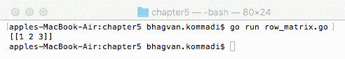

下一节将讨论**列矩阵**数据结构。

# 列矩阵

列矩阵是一个*m* x 1 矩阵，它有一个由*m*元素组成的单列。以下代码片段展示了如何创建列矩阵：

```go
var matrix = [4][1] int{
    {1},
    {2},
    {3},
    {4}
}
```

执行以下命令以运行`column_matrix.go`文件：

```go
go run column_matrix.go
```

输出如下：

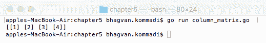

下一节将讨论下三角矩阵数据结构。

# 下三角矩阵

**下三角矩阵**由主对角线上方的元素值为零的元素组成。以下代码片段展示了如何创建一个下三角矩阵：

```go
var matrix = [3][3] int{
    {1,0,0},
    {1,1,0},
    {2,1,1}
}
```

执行以下命令以运行`lower_triangular.go`文件：

```go
go run lower_triangular.go
```

输出如下：

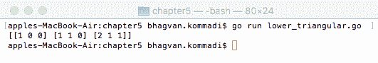

下一节将讨论上三角矩阵数据结构。

# 上三角矩阵

上三角矩阵由主对角线下方的元素值为零的元素组成。以下代码创建了一个上三角矩阵：

```go
var matrix = [3][3] int{
    {1,2,3},
    {0,1,4},
    {0,0,1}
}
```

执行以下命令以运行`upper_triangular.go`文件：

```go
go run upper_triangular.go
```

输出如下：

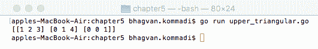

下一节将讨论**零矩阵数据**结构。

# 零矩阵

零矩阵或零矩阵是一个完全由零值组成的矩阵，如下面的代码片段所示：

```go
var matrix = [3][3] int{
    {0,0,0},
    {0,0,0},
    {0,0,0}
}
```

执行以下命令以运行`null_matrix.go`文件：

```go
go run null_matrix.go
```

输出如下：

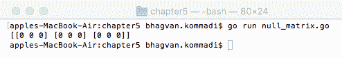

下一节将讨论**单位矩阵**数据结构。

# 单位矩阵

单位矩阵是一个单位矩阵，其主对角线上的元素为 1，其他位置的元素为 0。以下代码片段创建了一个单位矩阵：

```go
///main package has examples shown
// in Go Data Structures and algorithms book
package main

// importing fmt package
import (
    "fmt"
)
// identity method 
func Identity(order int) [][]float64 {
var matrix [][]float64
    matrix = make([][]float64, order)
var i int
    for i = 0; i < order; i++ {
var temp []float64
        temp = make([]float64, order)
        temp[i] = 1
        matrix[i] = temp
    }
    return matrix
}
// main method 
func main() {
    fmt.Println(Identity(4))
}
```

执行以下命令以运行前面的代码片段：

```go
go run identity_matrix.go
```

输出如下：

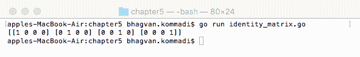

下一节将讨论**对称矩阵**数据结构。

# 对称矩阵

对称矩阵是一个转置后等于自身的矩阵。对称矩阵包括其他类型的矩阵，如**反对称矩阵**、**中心对称矩阵**、**循环矩阵**、**协方差矩阵**、**科克斯特矩阵**、**汉克尔矩阵**、**希尔伯特矩阵**、**反对称矩阵**、**斜对称矩阵**和**托普利茨矩阵**。**负矩阵**是指每个元素都是负数的矩阵。

# 基本二维矩阵运算

在本节中，我们将查看二维矩阵的基本操作。让我们从初始化矩阵开始。

以下代码片段初始化了 `matrix1` 和 `matrix2`：

```go
var matrix1 = [2][2] int{
    {4,5},
    {1,2}
}
var matrix2 = [2][2] int{
    {6,7},
    {3,4}
}
```

在接下来的几节中，我们将介绍 `add`、`subtract`、`multiply`、`transpose` 和 `inversion` 操作。对于本节，请参考 `binary_search_tree.go` 文件。

# `add` 方法

`add` 方法用于将两个 2 x 2 矩阵的元素相加。以下代码通过相加两个矩阵来返回创建的矩阵：

```go
// add method
func add(matrix1 [2][2]int, matrix2 [2][2]int) [2][2]int {
    var m int
    var l int
    var sum [2][2]int
    for l = 0; l < 2; l++ {
        for m=0; m <2; m++ {
            sum[l][m] = matrix1[l][m] +matrix2[l][m]
        }
    }
    return sum
}
```

两个矩阵的和是调用 `add` 方法的结果。传递的参数是要相加的矩阵，如下所示：

```go
var sum [2][2]int 
sum = add(matrix1, matrix2)
```

以下为 `add` 方法的示例输出。将 `matrix1` 和 `matrix2` 相加得到**和矩阵**：

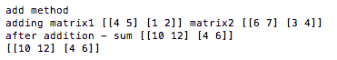

# `subtract` 方法

`subtract` 方法用于从两个 2 x 2 矩阵中减去元素。以下代码片段中 `subtract` 方法减去了 `matrix1` 和 `matrix2` 的元素。此方法返回减法操作后的结果矩阵：

```go
// subtract method
func subtract(matrix1 [2][2]int, matrix2 [2][2]int) [2][2]int {
    var m int
    var l int
    var difference [2][2]int
    for l = 0; l < 2; l++ {
        for m=0; m <2; m++ {
            difference[l][m] = matrix1[l][m] -matrix2[l][m]
        }
    }
    return difference
}
```

两个矩阵的差是调用 `subtract` 方法的结果。传递的参数是要减去的矩阵，如下所示：

```go
var difference [2][2]int
difference = subtract(matrix1, matrix2)
```

以下为 `subtract` 方法的示例输出：

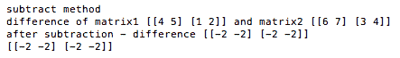

# 乘法方法

`multiply` 方法用于将两个 2 x 2 矩阵的元素相乘。以下代码片段展示了矩阵 `matrix1` 和 `matrix2` 的乘法。乘法操作后生成的矩阵由 `multiply` 方法返回：

```go
// multiply method
func multiply(matrix1 [2][2]int, matrix2 [2][2]int) [2][2]int {
     var m int
    var l int
    var n int
    var product [2][2]int
    for l = 0; l < 2; l++ {
        for m=0; m <2; m++ {
            var productSum int = 0
            for n=0; n< 2; n++ {
                productSum = productSum + matrix1[l][n]*matrix2[n][m]
            }
            product[l][m] = productSum;
        }
    }
    return product
}
```

在以下代码片段中，使用 `multiply` 方法计算两个矩阵的乘积，该方法接收两个矩阵作为参数：

```go
var product [2][2]int
product = multiply(matrix1, matrix2)
```

乘法方法的示例输出如下。`matrix1` 和 `matrix2` 的乘积是**乘积矩阵**：

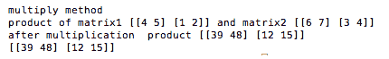

# `transpose` 方法

使用 `transpose` 方法可以计算矩阵的转置。该方法接收矩阵作为参数，并返回转置后的矩阵：

```go
// transpose method
func transpose(matrix1 [2][2]int) [2][2]int {
    var m intvar l int
    var transMatrix [2][2]int
    for l = 0; l < 2; l++ {
        for m=0; m <2; m++ {
            transMatrix[l][m] = matrix1[m][l]
        }
    }
    return transMatrix
}
```

# `determinant` 方法

`determinant` 方法用于计算矩阵的行列式。以下代码片段中的 `determinant` 方法计算矩阵的行列式值。该方法接收矩阵作为参数，并返回一个 `float32` 类型的值，即矩阵的行列式：

```go
// determinant method
func determinant(matrix1 [2][2]int) float32 {
    var m int
    var l int
    var det float32
    det = det + ( (matrix1[0][0]*matrix1[1][1])-(matrix1[0][1]*matrix1[1][0]));
    return det
}
```

# `inverse` 方法

`inverse` 方法返回矩阵的逆，该逆矩阵作为参数传入。以下代码片段展示了这一点：

```go
//inverse method
func inverse(matrix [2][2]int) [][]float64 {
  var det float64
  det = determinant(matrix)
  var invmatrix float64

  invmatrix[0][0] = matrix[1][1]/det
  invmatrix[0][1] = -1*matrix[0][1]/det
  invmatrix[1][0] = -1*matrix[1][0]/det
  invmatrix[1][1] = matrix[0][0]/det
  return invmatrix
}

```

运行以下命令以执行 `twodmatrix.go` 文件：

```go
go run twodmatrix.go
```

输出如下：

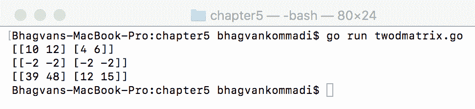

下一节将讨论 zig-zag 矩阵数据结构。

# Zig-zag 矩阵

斜杠矩阵是一个*n* x *n*整数的正方形排列。整数按顺序排列在反斜对角线上。以下代码解释了如何创建斜杠矩阵以及如何遍历它。`PrintZigZag`方法以顺序递增的顺序以斜杠方式创建矩阵。该方法接受整数`n`作为参数，并返回整数数组，即斜杠矩阵：

```go
///main package has examples shown
// in Go Data Structures and algorithms book
package main
// importing fmt package
import (
    "fmt"
)
//prints the matrix in zig-zag fashion
func PrintZigZag(n int) []int {
    var zigzag []int
    zigzag = make([]int, n*n)
    var i int
    i = 0
    var m int
    m = n * 2
    var  p int
    for p = 1; p <= m; p++ {
        var x int
        x = p - n
        if x < 0 {
           x = 0
        }
        var y int
        y = p - 1
        if y > n-1 {
            y = n - 1
       }
       var j int
       j = m - p
        if j > p {
            j = p
        }
        var k int
        for k = 0; k < j; k++ {
           if p&1 == 0 {
               zigzag[(x+k)*n+y-k] = i
           } else {
               zigzag[(y-k)*n+x+k] = i
            }
           i++
        }
   }
   return zigzag
}
```

`main`方法调用`PrintZigZag`方法，该方法接受参数`n`，首先从左到右打印矩阵，然后从右到左打印第二层，依此类推。整数的数量为`5`，字段宽度为`2`：

```go
// main method
func main() {
  var n int    
  n = 5
  var length int
    length = 2
    var i int
    var sketch int
    for i, sketch = range PrintZigZag(n) {
       fmt.Printf("%*d ", length, sketch)
        if i%n == n-1 {
            fmt.Println("")
       }
   }
}
```

运行以下命令以执行`zigzagmatrix.go`文件：

```go
go run zigzagmatrix.go
```

输出如下：

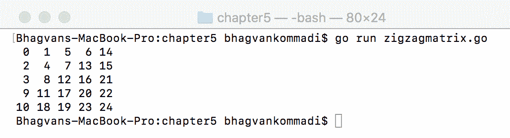

下一节将讨论螺旋矩阵数据结构。

# 螺旋矩阵

螺旋矩阵是一个*n* x *n*整数的排列，其中整数按顺序螺旋式递增排列。螺旋矩阵是一个**古老的玩具算法**。使用四个循环来保持螺旋顺序，每个循环对应矩阵的一个角落。以下代码片段中的`PrintSpiral`方法创建了一个元素按递增顺序螺旋排列的矩阵。该方法接受一个参数`n`，并返回一个整数数组：

```go
///main package has examples shown
// in Go Data Structures and algorithms book
package main
// importing fmt package
import (
    "fmt"
)
//PrintSpiral method
func PrintSpiral(n int) []int {

    var left int
    var top int
    var right int
    var bottom int

    left =0
    top =0
    right = n-1
    bottom = n-1
    var size int
    size = n * n
    var s []int
    s = make([]int, size)

    var i int
    i = 0
    for left < right {

        var c int
        for c = left; c <= right; c++ {
            s[top*n+c] = i
            i++
        }
        top++

        var r int
        for r = top; r <= bottom; r++ {
            s[r*n+right] = i
            i++
        }
        right--
        if top == bottom {
            break
        }

        for c = right; c >= left; c-- {
            s[bottom*n+c] = i
            i++
        }
        bottom--

        for r = bottom; r >= top; r-- {
            s[r*n+left] = i
            i++
        }
        left++
    }

    s[top*n+left] = i

    return s
}
```

在以下代码片段中，`main`方法调用`PrintSpiral`方法，该方法接受整数`n`并按螺旋方式打印矩阵的整数值。`PrintSpiral`方法返回的值以宽度为`2`的字段打印：

```go
func main() {
   var n int
    n = 5
  var length int
    length = 2
    var i int
    var sketch int
    for i, sketch = range PrintSpiral(n) {
        fmt.Printf("%*d ", length, sketch)
        if i%n == n-1 {
            fmt.Println("")
        }
    }
}
```

运行以下命令以执行`spiralmatrix.go`文件：

```go
go run spiralmatrix.go
```

输出如下：


下一节将讨论**布尔矩阵**数据结构。

# 布尔矩阵

布尔矩阵是一个矩阵，它由第*m*行和第*n*列的元素组成，这些元素的值为 1。可以通过将第*m*行和第*n*列的值设置为 1 来将矩阵修改为布尔矩阵。在以下代码中，布尔矩阵转换和打印方法被详细展示。`changeMatrix`方法通过将单元格值从 0 更改为 1 来将输入矩阵转换为布尔矩阵。该方法接受输入矩阵作为参数，并返回更改后的矩阵，如下所示：

```go

///main package has examples shown
// in Go Data Structures and algorithms book
package main

// importing fmt package
import (
    "fmt"
)
//changeMatrix method
func changeMatrix(matrix [3][3]int) [3][3]int {
   var i int
   var j int
   var Rows [3]int
   var Columns [3]int

   var matrixChanged [3][3]int

   for i=0; i<3; i++{
     for j=0; j < 3; j++{
         if matrix[i][j]==1 {
            Rows[i] =1
            Columns[j] =1
         }

      }
    }

   for i=0; i<3; i++ {
    for j=0; j<3; j++{
      if Rows[i]==1 || Columns[j]==1{
      matrixChanged[i][j] = 1
      }

     }
  }

  return matrixChanged

}
```

以下截图显示了更改矩阵方法的示例输出。检查行或列中的值为 1 的元素，并将行元素更新为 1：

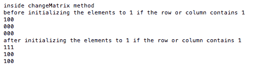

让我们来看看`printMatrix`方法和`main`方法。

# `printMatrix`方法

在以下代码片段中，`printMatrix`方法接受输入矩阵，并按行打印矩阵值，并为每一行遍历列：

```go
//printMatrix method
func printMatrix(matrix [3][3]int) {
   var i int
   var j int
   //var k int
   for i=0; i < 3; i++ {

     for j=0; j < 3; j++ {

          fmt.Printf("%d",matrix[i][j])

     }
     fmt.Printf("\n")
   }

}
```

# `main`方法

在以下代码片段中，`main`方法在初始化矩阵后调用`changeMatrix`方法。在调用`changeMatrix`方法后打印了更改后的矩阵：

```go
//main method
func main() {

 var matrix = [3][3] int {{1,0,0},{0,0,0},{0,0,0}}

 printMatrix(matrix)

 matrix = changeMatrix(matrix)

 printMatrix(matrix)

}
```

运行以下命令以执行`boolean_matrix.go`文件：

```go
go run boolean_matrix.go
```

输出如下：

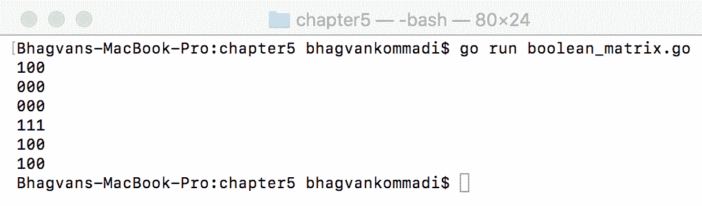

下一个部分将讨论多维数组。

# 多维数组

**数组**是数据元素的同构集合。数组的索引范围从索引 0 到索引*m*-1，其中*m*是数组的固定长度。多维数组是一个数组的数组。以下代码初始化了一个多维数组。以下打印了一个三维数组：

```go
///main package has examples shown
// in Go Data Structures and algorithms book
package main

// importing fmt package
import (
    "fmt"
    "math/rand"
)
//main method
func main() {

var threedarray [2][2][2]int

var i int

var j int

var k int

for i=0; i < 2; i++ {

   for j=0; j < 2; j++ {

     for k=0; k < 2; k++ {

         threedarray[i][j][k] = rand.Intn(3)
     }
   }
}

 fmt.Println(threedarray)
}
```

运行以下命令以执行前面的代码片段：

```go
go run multidarray.go
```

输出如下：

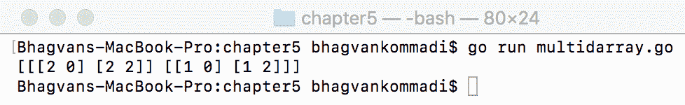

下一个部分将讨论**张量**数据结构。

# 张量

张量是由空间坐标组成的分量构成的多维数组。张量在物理学和生物学的电磁学和扩散张量成像等主题中被广泛使用。威廉·罗文·哈密顿是第一个提出“张量”这个术语的人。张量在抽象代数和代数拓扑中扮演着基本角色。

张量阶数是其参数阶数之和，加上结果张量的阶数。例如，惯性矩阵是一个二阶张量。自旋也是多维数组，但它们的元素值通过坐标变换而改变。

张量的初始化如下所示。数组使用从 0 到 3 的整数值初始化：

```go
var array [3][3][3]int
var i int
var j int
var k int
for i=0; i < 3; i++ {
   for j=0; j < 3; j++ {
     for k=0; k < 3; k++ {

         array[i][j][k] = rand.Intn(3)
     }
   }
}
```

张量的展开是沿着第一维进行的。重新排列张量模式的*n*个向量被称为张量的*n*-展开。以下展示了张量数组的 0 模式展开：

```go
   for j=0; j < 3; j++ {
     for k=0; k < 3; k++ {
         fmt.Printf("%d ",array[0][j][k])
     }
     fmt.Printf("\n")
   }
```

以下展示了张量数组的 1 模式展开。数组的第一个维度索引被设置为 1：

```go
   for j=0; j < 3; j++ {
        for k=0; k < 3; k++ {
            fmt.Printf("%d ",array[1][j][k])
        }
        fmt.Printf("\n")
      }
```

以下展示了张量数组的 2 模式展开。数组的第一个维度行索引被设置为 2：

```go
for j=0; j < 3; j++ {
           for k=0; k < 3; k++ {
               fmt.Printf("%d ",array[2][j][k])
           }
           fmt.Printf("\n")
         }
```

运行以下命令以执行`tensor.go`文件：

```go
go run tensor.go
```

输出如下：

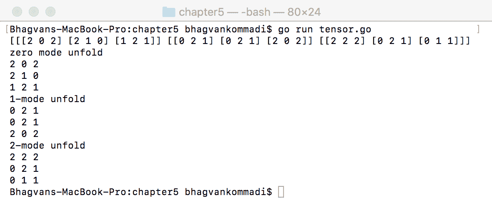

# 摘要

本章介绍了诸如二维数组和多维数组等同构数据结构。使用代码示例解释了矩阵运算，如求和、减法、乘法、逆和行列式。使用二维数组解释了螺旋矩阵、之字形矩阵和布尔矩阵。还介绍了张量以及折叠等操作。

在下一章中，将介绍诸如链表、有序列表和无序列表等异构数据结构。

# 问题

1.  张量数组的 2 模式展开是什么？

1.  编写一个字符串二维数组并初始化它。打印字符串。

1.  给出一个多维数组的示例并遍历它。

1.  对于一个 3 x 3 矩阵，编写计算矩阵行列式的代码。

1.  3 x 3 矩阵的转置是什么？

1.  什么是之字形矩阵？

1.  编写一个螺旋矩阵的示例代码。

1.  张量数组通常展开哪个维度？

1.  你如何定义布尔矩阵？

1.  选择两个 3 x 3 矩阵并找出矩阵的乘积。

# 进一步阅读

如果你想了解更多关于数组、矩阵和张量的知识，以下书籍推荐：

+   《高级数据结构》，作者 Peter Brass

+   《动态数据结构：列表、栈、队列和树》，作者 Bogdan Patrut 和 Tiberiu Socaciu

+   《数据结构与算法：简易入门》，作者 Rudolph Russell
