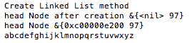
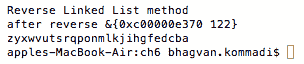
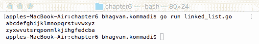
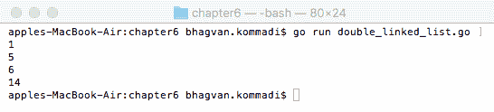
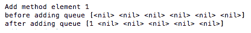
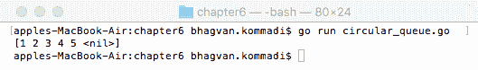
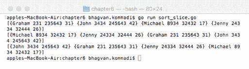
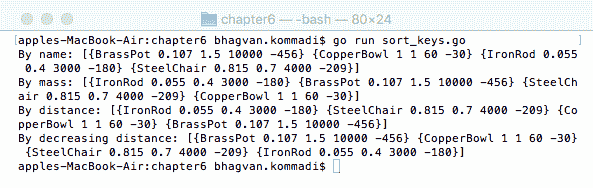
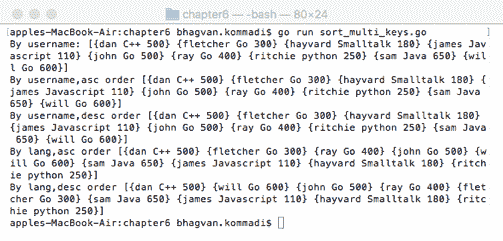
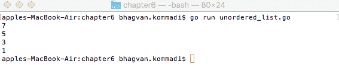

# 第六章：异构数据结构

**异构数据结构**是包含多种类型数据的数据结构，例如整数、双精度浮点数和浮点数。**链表**和**有序列表**是这些数据结构的良好示例。它们用于内存管理。链表是由指针关联的元素链。每个元素的指针链接到下一个项目，从而将链连接在一起。链表不必占用一块内存。它们使用的内存可以动态分配。它由一系列节点组成，这些节点是列表的组成部分。为了展示列表和存储管理，展示了 HTML 中的有序列表和无序列表。我们将在本章中介绍链表、有序列表和无序列表，并使用适当的示例展示它们的实现方法。本章涵盖了以下异构数据结构：

+   链表

+   有序列表

+   无序列表

我们在第三章中通过代码示例介绍了单链表和双链表，*线性数据结构*。循环链表在第四章中介绍，*非线性数据结构*。

# 技术要求

从以下链接安装适用于您的操作系统的 Go 版本 1.10：[`golang.org/doc/install`](https://golang.org/doc/install)。

本章代码的 GitHub URL 如下：[`github.com/PacktPublishing/Learn-Data-Structures-and-Algorithms-with-Golang/tree/master/Chapter06`](https://github.com/PacktPublishing/Learn-Data-Structures-and-Algorithms-with-Golang/tree/master/Chapter06)。

# 链表

链表是由具有信息的元素组成的线性集合。链表根据是否包含或删除组件而收缩或扩展。这个列表可以很小或很大，但无论大小，组成它的元素都是简单的。链表在第三章中介绍，*线性数据结构*。它们比数组消耗更多的内存。对于单链表来说，反向遍历是一个问题，因为单链表指向下一个节点是向前。下一节将解释如何通过代码示例来反转单链表。

单链表、双链表和循环链表将在本章中介绍。

# 单链表

单链表是一种动态数据结构，其中添加和删除操作很容易；这是因为它是动态数据结构，不是固定的。栈和队列数据结构是用链表实现的。当动态添加元素时，会消耗更多内存，因为动态数据结构不是固定的。单链表不支持随机检索，因为您需要遍历节点以定位节点。单链表中的插入可以在列表的开始或结束处，以及指定节点之后。删除可以在列表的开始或结束处以及指定节点之后进行。

本节展示了如何反转单链表。本节中解释的方法是代码包中提供的 `linked_list.go` 文件的一部分。

在此代码片段中定义了 `Node` 类，具有节点指针 `nextNode` 和 `rune` 属性：

```go
//main package has examples shown
// in Go Data Structures and algorithms book
package main

// importing fmt package
import (
    "fmt"
)

// Node struct
type Node struct {
    nextNode *Node
    property rune
}
```

下一个部分将讨论单链表的方法。

# 创建链表方法

`CreateLinkedList` 方法创建从 *a* 到 *z* 的 runes 链表：

```go
// create List method
func CreateLinkedList() *Node {
    var headNode *Node
    headNode = &Node{nil, 'a'}
    var currNode *Node
    currNode = headNode
    var i rune
    for i= 'b'; i <= 'z'; i++ {
        var node *Node
        node = &Node{nil, i}
        currNode.nextNode = node
        currNode = node
    }
    return headNode
}
```

以下为 `CreateLinkedList` 方法的示例输出。`headNode` 以值 `97` 创建。链表以从 *a* 到 *z* 的节点创建：



# 逆序链表方法

`ReverseLinkedList` 函数接受一个节点指针 `nodeList` 并返回一个指向反转链表的节点指针。

以下代码片段展示了如何反转链表：

```go
// Reverse List method
func ReverseLinkedList(nodeList *Node) *Node {
    var currNode *Node
    currNode = nodeList
    var topNode *Node = nil
    for {
        if currNode == nil {
            break
        }
        var tempNode *Node
        tempNode = currNode.nextNode
        currNode.nextNode = topNode
        topNode = currNode
        currNode = tempNode
    }
    return topNode
}
```

以下为逆序链表方法的示例输出。该方法接受从 *a* 到 *z* 的链字符串参数。反转后的列表是从 *z* 到 *a* 的节点：



# 主方法

`main` 方法创建链表，并以字符串格式打印链表和反转后的链表：

```go
// main method
func main() {
    var linkedList = CreateLinkedList()
    StringifyList(linkedList)
    StringifyList(ReverseLinkedList(linkedList))
}
```

执行以下命令以运行 `linked_list.go` 文件：

```go
go run linked_list.go
```

这是输出：



下一个部分将讨论双向链表数据结构。

# 双向链表

双向链表是一种由具有指向前一个和下一个节点的节点组成的数据结构。在 第三章 *线性数据结构* 中展示了双向链表的代码示例。Go 中的列表实现为双向链表。元素 `14` 和 `1` 分别向后和向前推送。元素 `6` 和 `5` 分别插入到前后。双向链表被迭代，并打印出元素。本节中的代码展示了如何使用列表：

```go
//main package has examples shown
// in Go Data Structures and algorithms book
package main

// importing fmt and list package
import (
    "container/list"
    "fmt"
)

// main method
func main() {  
    var linkedList *list.List
    linkedList = list.New()
    var element *list.Element
    element = linkedList.PushBack(14)
    var frontElement *list.Element
    frontElement = linkedList.PushFront(1)
    linkedList.InsertBefore(6, element)
    linkedList.InsertAfter(5, frontElement)

    var currElement *list.Element
    for currElement = linkedList.Front(); currElement != nil; currElement = 
    currElement.Next() {
        fmt.Println(currElement.Value)
    }
}
```

执行以下命令以运行 `double_linked_list.go` 文件：

```go
go run double_linked_list.go
```

这是输出：



下一个部分将讨论循环链表数据结构。

# 循环链表

循环链表是一系列节点集合，其中最后一个节点连接到第一个节点。循环链表在 第四章 中简要介绍，*非线性数据结构*。循环链表用于创建循环队列。

在以下章节中，定义并实现了循环队列结构。本节中解释的方法是代码包中给出的 `circular_queue.go` 文件的一部分。

# `CircularQueue` 类

`CircularQueue` 类具有 `size`、`head` 和 `last` 整数属性，以及一个 `nodes` 数组。该类在以下代码片段中定义：

```go
//main package has examples shown
// in Go Data Structures and algorithms book
package main

// importing fmt package
import (
    "fmt"
)

//Circular Queue
type CircularQueue struct {
    size int
    nodes []interface{}
    head int
    last int
}
```

让我们在以下章节中讨论 `CircularQueue` 类的不同方法。

# `NewQueue` 方法

`NewQueue` 方法创建循环队列的新实例。`NewQueue` 函数接受 `num` 参数，它是队列的 `size`。函数返回节点组成的循环队列，如下面的代码所示：

```go
// NewCircularQueue method
func NewQueue(num int) *CircularQueue {
    var circularQueue CircularQueue
    circularQueue = CircularQueue{size: num + 1, head: 0, last: 0}
    circularQueue.nodes = make([]interface{}, circularQueue.size)
    return &circularQueue
}
```

# `IsUnUsed` 方法

在以下代码片段中，`CircularQueue` 类的 `IsUnUsed` 方法检查 `head` 是否等于 `last` 节点，如果是则返回 `true`；否则返回 `false`：

```go
// IsUnUsed method
func (circularQueue CircularQueue) IsUnUsed() bool {
    return circularQueue.head == circularQueue.last
}
```

# `IsComplete` 方法

`CircularQueue` 类的 `IsComplete` 方法如果头节点位置与 `last` 节点位置 `+1` 相同则返回 `true`；否则返回 `false`：

```go
// IsComplete method
func (circularQueue CircularQueue) IsComplete() bool {
    return circularQueue.head == (circularQueue.last+1)%circularQueue.size
}
```

# `Add` 方法

此方法将给定的元素添加到循环队列中。在以下代码片段中，`Add` 方法接受接口类型的 `element` 参数并将 `element` 添加到循环队列中：

```go
// Add method
func (circularQueue *CircularQueue) Add(element interface{}) {
    if circularQueue.IsComplete() {
        panic("Queue is Completely Utilized")
    }
    circularQueue.nodes[circularQueue.last] = element
    circularQueue.last = (circularQueue.last + 1) % circularQueue.size
}
```

`Add` 方法的示例输出如下。`Add` 方法接受值为 `1` 的 `element` 并更新队列：



# `MoveOneStep` 方法

`MoveOneStep` 方法将 `element` 在循环队列中向前移动一步。`MoveOneStep` 方法接受接口类型的 `element` 参数，并将 `element` 设置为 `head` 节点后，将 `head` 节点移动到位置二：

```go
//MoveOneStep method
func (circularQueue *CircularQueue) MoveOneStep() (element interface{}) {
    if circularQueue.IsUnUsed() {
        return nil
    }
    element = circularQueue.nodes[circularQueue.head]
    circularQueue.head = (circularQueue.head + 1) % circularQueue.size
    return
}
```

# `main` 方法

`main` 方法创建队列并向循环队列添加元素：

```go
// main method
func main() {
   var circularQueue *CircularQueue
   circularQueue = NewQueue(5)
   circularQueue.Add(1)
   circularQueue.Add(2)
   circularQueue.Add(3)
   circularQueue.Add(4)
   circularQueue.Add(5)
   fmt.Println(circularQueue.nodes)

}
```

运行以下命令以执行 `circular_queue.go` 文件：

```go
go run circular_queue.go
```

这是输出：



在以下章节中，将使用代码示例解释有序列表和无序列表。

# 有序列表

Go 中的列表可以按两种方式排序：

+   **有序列表**：通过为切片数据类型创建一组方法并调用 `sort`

+   **无序列表**：另一种方式是调用 `sort.Slice` 并使用自定义的 `less` 函数

有序列表和无序列表之间的唯一区别是，在有序列表中，显示项目顺序是强制性的。

HTML 中的有序列表以 `<ol>` 标签开始。列表中的每个项目都写在 `<li>` 标签中。以下是一个示例：

```go
<ol>
    <li>Stones</li>
    <li>Branches</li>
    <li>Smoke</li>
</ol>
```

以下代码片段展示了使用 Golang 的有序列表示例。`Employee`类具有`Name`、`ID`、`SSN`和`Age`属性：

```go
///main package has examples shown
// in Go Data Structures and algorithms book
package main

// importing fmt and sort package
import (
    "fmt"
    "sort"
)

// class Employee
type Employee struct {
    Name string
    ID string
    SSN int
    Age int
}
```

以下章节中解释的方法是代码包中提供的`linked_list.go`文件的一部分。

# `ToString`方法

`Employee`类的`ToString`方法返回员工的字符串版本。字符串版本由逗号分隔的`Name`、`Age`、`ID`和`SSN`组成。以下代码片段展示了这一点：

```go
// ToString method
func (employee Employee) ToString() string {
    return fmt.Sprintf("%s: %d,%s,%d", employee.Name, employee.Age,employee.ID, 
    employee.SSN)
}
```

# `SortByAge`类型

`SortByAge`方法根据`Age`对相关元素进行排序。`SortByAge`接口在`Employee`数组上操作。以下代码片段展示了这一点：

```go
// SortByAge type
type SortByAge []Employee

// SortByAge interface methods
func (sortIntf SortByAge) Len() int { return len(sortIntf) }
func (sortIntf SortByAge) Swap(i int, j int) { sortIntf[i], sortIntf[j] = sortIntf[j], sortIntf[i] }
func (sortIntf SortByAge) Less(i int, j int) bool { return sortIntf[i].Age < sortIntf[j].Age }
```

`main`方法初始化员工数组并按年龄对数组进行排序：

```go
func main() {
    var employees = []Employee{
        {"Graham","231",235643,31},
        {"John", "3434",245643,42},
        {"Michael","8934",32432, 17},
        {"Jenny", "24334",32444,26},
    }
    fmt.Println(employees)
    sort.Sort(SortByAge(employees))
    fmt.Println(employees)
    sort.Slice(employees, func(i int, j int) bool {
        return employees[i].Age > employees[j].Age
    })
    fmt.Println(employees)
}
```

执行以下命令以运行`sort_slice.go`代码片段：

```go
go run sort_slice.go
```

这是输出结果：



按照以下排序标准对有序列表进行排序。`sort_keys.go`代码片段展示了如何根据各种标准对事物进行排序，例如`name`、`mass`和`distance`。`Mass`和`Miles`单位定义为`float64`：

```go
///main package has examples shown
// in Go Data Structures and algorithms book
package main

// importing fmt and sort package
import (
    "fmt"
    "sort"
)

// Mass and Miles Types
type Mass float64
type Miles float64
```

下一个部分将讨论`Thing`结构定义。

# `Thing`类

以下代码定义了一个具有`name`、`mass`、`distance`、`meltingpoint`和`freezingpoint`属性的`Thing`类：

```go
// Thing class
type Thing struct {
    name string
    mass Mass
    distance Miles
    meltingpoint int
    freezingpoint int
}
```

下一个部分将讨论`ByFactor`函数类型的实现。

# `ByFactor`函数类型

`ByFactor`是一种`less`函数类型。以下代码片段展示了`ByFactor`类型：

```go
// ByFactor function type
type ByFactor func(Thing1 *Thing, Thing2 *Thing) bool
```

# `Sort`方法

`Sort`方法是一个具有`byFactor`参数的函数，如下所示：

```go
// Sort method 
func (byFactor ByFactor) Sort(Things []Thing) {
    var sortedThings *ThingSorter
    sortedThings = &ThingSorter{
        Things: Things,
        byFactor: byFactor, 
    }
    sort.Sort(sortedThings)
}
```

# `Thing`排序器类

`Thing`排序器根据其属性对元素进行排序。`ThingSorter`类有一个事物数组和一个`byFactor`方法：

```go
// ThingSorter class
type ThingSorter struct {
    Things []Thing
    byFactor func(Thing1 *Thing, Thing2 *Thing) bool 
}
```

下一个部分将讨论`len`、`swap`和`less`方法的实现。

# `len`、`swap`和`less`方法

`sort.Interface`具有`len`、`swap`和`less`方法，如下所示：

```go
// Len method
func (ThingSorter *ThingSorter) Len() int {
    return len(ThingSorter.Things)
}

// Swap method
func (ThingSorter *ThingSorter) Swap(i int, j int) {
    ThingSorter.Things[i], ThingSorter.Things[j] = ThingSorter.Things[j],    
    ThingSorter.Things[i]
}

// Less method
func (ThingSorter *ThingSorter) Less(i int, j int) bool {
    return ThingSorter.byFactor(&ThingSorter.Things[i], &ThingSorter.Things[j])
}
```

# `main`方法

`main`方法创建事物并使用值初始化它们。此方法展示了按距离降序排序的按`mass`、`distance`和`name`排序的事物：

```go
// Main method
func main() {
  var Things = []Thing{
    {"IronRod", 0.055, 0.4, 3000, -180},
    {"SteelChair", 0.815, 0.7, 4000, -209},
    {"CopperBowl", 1.0, 1.0, 60, -30},
    {"BrassPot", 0.107, 1.5, 10000, -456},
  }

  var name func(*Thing, *Thing) bool
  name = func(Thing1 *Thing, Thing2 *Thing) bool {
    return Thing1.name < Thing2.name
  }
  var mass func(*Thing, *Thing) bool
  mass = func(Thing1 *Thing, Thing2 *Thing) bool {
    return Thing1.mass < Thing2.mass
  }
  var distance func(*Thing, *Thing) bool
  distance = func(Thing1 *Thing, Thing2 *Thing) bool {
    return Thing1.distance < Thing2.distance
  }
  var decreasingDistance func(*Thing, *Thing) bool
  decreasingDistance = func(p1, p2 *Thing) bool {
    return distance(p2, p1)
  }

  ByFactor(name).Sort(Things)
  fmt.Println("By name:", Things)
  ByFactor(mass).Sort(Things)
  fmt.Println("By mass:", Things)
  ByFactor(distance).Sort(Things)
  fmt.Println("By distance:", Things)
  ByFactor(decreasingDistance).Sort(Things)
  fmt.Println("By decreasing distance:", Things)
}
```

执行以下命令以运行`sort_keys.go`文件：

```go
go run sort_keys.go
```

这是输出结果：



下一个部分将讨论`struct`数据结构。

# `struct`类型

可以使用不同的多字段集对`struct`类型（类）进行排序。在`sort_multi_keys.go`代码中，我们展示了如何对`struct`类型进行排序。一个名为`Commit`的类由`username`、`lang`和`numlines`属性组成。`username`是一个字符串，`lang`是一个字符串，`numlines`是一个整数。以下代码中，`Commit`类根据提交和行数进行排序：

```go
///main package has examples shown
// in Go Data Structures and algorithms book
package main

// importing fmt and sort package
import (
  "fmt"
  "sort"
)

// A Commit is a record of code checking
type Commit struct {
  username string
  lang string
  numlines int
}
```

在下一节中，将讨论`multiSorter`类的实现。

# `multiSorter`类

`multiSorter`类包含提交和`lessFunction`数组属性。`multiSorter`类实现了`Sort`接口以对提交进行排序，如下面的代码所示：

```go
type lessFunc func(p1 *Commit, p2 *Commit) bool
// multiSorter class
type multiSorter struct {
 Commits []Commit
 lessFunction    []lessFunc
}
```

下一个部分将讨论`multiSorter`类的不同方法。

# The Sort method

在以下代码片段中，`multiSorter`的`Sort`方法通过调用`sort.Sort`并传递`multiSorter`参数来对`Commits`数组进行排序：

```go
// Sort method
func (multiSorter *multiSorter) Sort(Commits []Commit) {
    multiSorter.Commits = Commits
    sort.Sort(multiSorter)
}
```

# OrderBy 方法

`OrderedBy`方法接收`less`函数并返回`multiSorter`。`multisorter`实例由`less`函数初始化，如下面的代码片段所示：

```go
// OrderedBy method
func OrderedBy(lessFunction ...lessFunc) *multiSorter {
  return &multiSorter{
    lessFunction: lessFunction,
  }
}
```

# The len method

`multiSorter`类的`len`方法返回`Commits`数组的长度。`Commits`数组是`multiSorter`的一个属性：

```go
// Len method
func (multiSorter *multiSorter) Len() int {
 return len(multiSorter.Commits)
}
```

# The Swap method

`multiSorter`的`Swap`方法接收整数`i`和`j`作为输入。此方法交换索引`i`和`j`处的数组元素：

```go
// Swap method
func (multiSorter *multiSorter) Swap(i int, j int) {
  multiSorter.Commits[i] = multiSorter.Commits[j] 
  multiSorter.Commits[j] = multiSorter.Commits[i]
}
```

# less 方法

`multiSorter`类的`Less`方法接收整数*i*和*j*，并比较索引*i*处的元素与索引*j*处的元素：

```go
func (multiSorter *multiSorter) Less(i int, j int) bool {

  var p *Commit
  var q *Commit
  p = &multiSorter.Commits[i]
  q = &multiSorter.Commits[j]

  var k int
  for k = 0; k < len(multiSorter.lessFunction)-1; k++ {
    less := multiSorter.lessFunction[k]
    switch {
    case less(p, q):
      return true
    case less(q, p):
      return false
    }
  }
  return multiSorter.lessFunctionk
}
```

# The main method

`main`方法创建一个`Commit`数组并用值初始化数组。创建了按`user`、`language`和`lines`排序的函数。`OrderedBy`返回一个`multiSorter`，其`sort`方法被`user`、`language`、`increasingLines`和`decreasingLines`调用：

```go
//main method
func main() {
  var Commits = []Commit{
    {"james", "Javascript", 110},
    {"ritchie", "python", 250},
    {"fletcher", "Go", 300},
    {"ray", "Go", 400},
    {"john", "Go", 500},
    {"will", "Go", 600},
    {"dan", "C++", 500},
    {"sam", "Java", 650},
    {"hayvard", "Smalltalk", 180},
  }
  var user func(*Commit, *Commit) bool
  user = func(c1 *Commit, c2 *Commit) bool {
    return c1.username < c2.username
  }
  var language func(*Commit, *Commit) bool
  language = func(c1 *Commit, c2 *Commit) bool {
    return c1.lang < c2.lang
  }
  var increasingLines func(*Commit, *Commit) bool
  increasingLines = func(c1 *Commit, c2 *Commit) bool {
    return c1.numlines < c2.numlines
  }
  var decreasingLines func(*Commit, *Commit) bool
  decreasingLines = func(c1 *Commit, c2 *Commit) bool {
    return c1.numlines > c2.numlines // Note: > orders downwards.
  }
  OrderedBy(user).Sort(Commits)
  fmt.Println("By username:", Commits)
  OrderedBy(user, increasingLines).Sort(Commits)
  fmt.Println("By username,asc order", Commits)
  OrderedBy(user, decreasingLines).Sort(Commits)
  fmt.Println("By username,desc order", Commits)
  OrderedBy(language, increasingLines).Sort(Commits)
  fmt.Println("By lang,asc order", Commits)
  OrderedBy(language, decreasingLines, user).Sort(Commits)
  fmt.Println("By lang,desc order", Commits)
}
```

运行以下命令以执行`sort_multi_keys.go`文件：

```go
go run sort_multi_keys.go
```

这是输出：



下一个部分将讨论 HTML 无序列表数据结构。

# 无序列表

一个**无序列表**被实现为一个链表。在一个无序列表中，不需要维护连续内存中项的相对位置。值将以随机方式放置。

无序列表在 HTML 5.0 中以`<ul>`标签开始。每个列表项用`<li>`标签编码。以下是一个示例：

```go
<ul>
    <li> First book </li>
    <li> Second book </li>
    <li> Third book </li>
</ul>
```

以下是在 Golang 中的无序列表示例。`Node`类有一个属性和一个`nextNode`指针，如下面的代码所示。链表将有一组具有属性属性的节点。无序列表在名为`unordered_list.go`的脚本中呈现：

```go
//main package has examples shown
// in Hands-On Data Structures and algorithms with Go book
package main

// importing fmt package
import (
    "fmt"
)

//Node class
type Node struct {
    property int
    nextNode *Node
}
```

下一个部分将讨论`UnOrderedList`类的实现。

# UnOrderedList 类

无序列表由未按数字排序的元素组成。一个`UnOrderedList`类有一个`headNode`指针作为属性。从头节点遍历到下一个节点，你可以遍历链表：

```go
// UnOrderedList class
type UnOrderedList struct {
    headNode *Node
}
```

下一个部分将讨论`UnOrderedList`结构体的`AddtoHead`方法和`IterateList`方法。

# AddtoHead 方法

`AddtoHead`方法将节点添加到无序列表的头部。`UnOrderedList`类的`AddToHead`方法有一个整数类型的属性参数。它将使`headNode`指向使用`property`创建的新节点，而`nextNode`指向无序列表的当前`headNode`：

```go
//AddToHead method of UnOrderedList class
func (UnOrderedList *UnOrderedList) AddToHead(property int) {
  var node = &Node{}
  node.property = property
  node.nextNode = nil
  if UnOrderedList.headNode != nil {
    node.nextNode = UnOrderedList.headNode
  }
  UnOrderedList.headNode = node
}
```

# `IterateList`方法

`UnOrderedList`类的`IterateList`方法打印列表中节点的属性。以下代码展示了这一点：

```go
//IterateList method iterates over UnOrderedList
func (UnOrderedList *UnOrderedList) IterateList() {
  var node *Node
  for node = UnOrderedList.headNode; node != nil; node = node.nextNode {
    fmt.Println(node.property)
  }
}
```

# 主方法

`main`方法创建了一个链表实例，并将整数属性`1`、`3`、`5`和`7`添加到链表的头部。在添加元素后，打印链表的`headNode`属性：

```go
// main method
func main() {
  var unOrderedList UnOrderedList
  unOrderedList = UnOrderedList{}
  unOrderedList.AddToHead(1)
  unOrderedList.AddToHead(3)
  unOrderedList.AddToHead(5)
  unOrderedList.AddToHead(7)
  unOrderedList.IterateList()
}
```

运行以下命令以执行代码包中的`unordered_list.go`文件：

```go
go run unordered_list.go
```

这是输出：



# 摘要

本章通过代码示例介绍了异构数据结构，如有序列表和无序列表。在*有序列表*部分，介绍了通过单个键、多个键和`sort.Slice`对切片进行排序。切片通过使结构体元素的数组实现`sort.Sort`接口来进行排序。无序列表被描述为具有无序值的链表。

下一章将介绍动态数据结构，如**字典**、**TreeSets**、**序列**、**同步 TreeSets**和**可变 TreeSets**。

# 问题

1.  `sort.Sort`接口的哪个方法返回要排序的元素的大小？

1.  需要将哪个函数传递给`sort.Slice`方法以对切片进行排序？

1.  `swap`方法对索引`*i*`和`*j*`处的元素做了什么？

1.  使用`sort.Sort`对元素进行排序的默认顺序是什么？

1.  你如何使用`sort.Slice`实现升序和降序排序？

1.  你如何对一个数组进行排序并保持元素的原始顺序？

1.  哪个接口用于反转数据的顺序？

1.  展示一个对切片进行排序的示例。

1.  哪个方法用于向无序列表添加元素？

1.  编写一个浮点数无序列表的代码示例。

# 进一步阅读

如果你想了解更多关于异构数据结构的信息，以下书籍推荐：

+   *《设计模式》*，作者：Erich Gamma, Richard Helm, Ralph Johnson, 和 John Vlissides

+   *《算法导论（第三版）》*，作者：Thomas H. Cormen, Charles E. Leiserson, Ronald L. Rivest, 和 Clifford Stein

+   *《数据结构与算法：简易入门》*，作者：Rudolph Russell
