# 第七章：动态数据结构

**动态数据结构**是内存中一组元素，它具有扩展或收缩的适应性。这种能力使软件工程师能够精确控制使用的内存量。动态数据结构用于在键值存储中处理通用数据。它们可用于分布式缓存和存储管理。在需要动态添加或删除元素的情况下，动态数据结构非常有价值。它们的容量与较小的关系数据库或内存数据库相当。这些数据结构用于市场营销和客户关系管理应用程序。字典、TreeSet 和序列是动态数据结构的例子。

在本章中，我们将解释字典、TreeSet 和序列是什么，并通过代码示例向您展示它们的实现方式。

本章涵盖了以下动态数据结构：

+   字典

+   TreeSet：

    +   同步 TreeSet

    +   可变 TreeSet

+   序列：

    +   Farey

    +   Fibonacci

    +   Look-and-say

    +   Thue–Morse

# 技术要求

从 [`golang.org/doc/install`](https://golang.org/doc/install) 为您的操作系统安装 Go 版本 1.10。

本章代码的 GitHub URL 如下所示：[`github.com/PacktPublishing/Learn-Data-Structures-and-Algorithms-with-Golang/tree/master/Chapter07`](https://github.com/PacktPublishing/Learn-Data-Structures-and-Algorithms-with-Golang/tree/master/Chapter07)。

# 字典

**字典**是一组唯一的键值对集合。字典是一种广泛有用的数据结构，用于存储一组数据项。它有一个键，每个键都与一个单独的项相关联。当给定一个键时，字典将恢复与该键关联的项。这些键可以是任何类型：字符串、整数或对象。当我们需要排序一个列表时，可以通过其键检索元素值。在这个集合中允许添加、删除、修改和查找操作。字典类似于其他数据结构，如哈希、映射和 HashMap。键/值存储用于分布式缓存和内存数据库。数组与字典在数据访问方式上有所不同。集合具有唯一项，而字典可以有重复值。

字典数据结构在以下流中使用：

+   电话簿

+   网络中的路由表

+   操作系统中的页面表

+   编译器中的符号表

+   生物学中的基因组图谱

以下代码展示了如何初始化和修改一个字典。在这个片段中，字典的键是 `DictKey`，并且是一个字符串：

```go
//main package has examples shown
// in Go Data Structures and algorithms book
package main

// importing fmt package
import (
"fmt"
  "sync"
)

// DictKey type
type DictKey string
```

以下章节将讨论字典中的类型和方法。

# DictVal 类型

字典将 `DictKey` 类型的 `DictVal` 值映射到：

```go
// DictVal type
type DictVal string
```

# 字典类

以下代码中的字典是一个具有字典元素的类，其中 `DictKey` 是键，`DictVal` 是值。它有一个 `sync.RWMutex` 属性，`lock`： 

```go
// Dictionary class
type Dictionary struct {
    elements map[DictKey]DictVal
    lock sync.RWMutex
}
```

在以下部分中讨论了 `Put`、`Remove`、`Contain`、`Find`、`Rest`、`NumberofElements`、`GetKeys`、`GetValues` 和 `Main` 方法。

# Put 方法

有一个 `Put` 方法，如下面的示例所示，它分别接受 `DictKey` 和 `DictVal` 类型的 `key` 和 `value` 参数。调用字典 `lock` 实例的 `Lock` 方法，并延迟 `Unlock` 方法。如果字典中有空的 `map` 元素，则使用 `make` 初始化元素。如果 `map` 元素不为空，则设置 `key` 和 `value`：

```go
// Put method
func (dict *Dictionary) Put(key DictKey, value DictVal) {
    dict.lock.Lock()
    defer dict.lock.Unlock()
    if dict.elements == nil {
        dict.elements = make(map[DictKey]DictVal)
    }
    dict.elements[key] = value
}
```

`put` 方法的示例输出如下。`put` 方法接受键 1 和值 1。`map` 使用 `key` 和 `value` 更新：

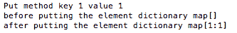

# Remove 方法

字典有一个 `remove` 方法，如下面的代码所示，它有一个 `DictKey` 类型的 `key` 参数。如果从映射中移除了与 `Dictkey` 关联的值，则此方法返回 `bool` 值：

```go
// Remove method
func (dict *Dictionary) Remove(key DictKey) bool {
    dict.lock.Lock()
    defer dict.lock.Unlock()
    var exists bool
    _, exists = dict.elements[key]
    if exists {
        delete(dict.elements, key)
    }
    return exists
}
```

# Contains 方法

在以下代码中，`Contains` 方法有一个输入参数 `key`，类型为 `DictKey`，如果 `key` 存在于字典中，则返回 `bool`：

```go
// Contains method
func (dict *Dictionary) Contains(key DictKey) bool {
    dict.lock.RLock()
    defer dict.lock.RUnlock()
    var exists bool
    _, exists = dict.elements[key]
    return exists
}
```

# Find 方法

`Find` 方法接受 `DictKey` 类型的 `key` 参数，并返回与键关联的 `DictVal` 类型。以下代码片段解释了 `Find` 方法：

```go
// Find method
func (dict *Dictionary) Find(key DictKey) DictVal {
    dict.lock.RLock()
    defer dict.lock.RUnlock()
    return dict.elements[key]
}
```

# Reset 方法

`Dictionary` 类的 `Reset` 方法在以下代码片段中展示。调用字典 `lock` 实例的 `Lock` 方法，并延迟 `Unlock`。`elements` 映射使用 `DictKey` 键和 `DictVal` 值的映射初始化：

```go
// Reset method
func (dict *Dictionary) Reset() {
    dict.lock.Lock()
    defer dict.lock.Unlock()
    dict.elements = make(map[DictKey]DictVal)
}

```

# NumberOfElements 方法

`Dictionary` 类的 `NumberOfElements` 方法返回 `elements` 映射的长度。`lock` 实例的 `RLock` 方法被调用。在返回长度之前，将 `lock` 实例的 `RUnlock` 方法延迟；这在上面的代码片段中显示：

```go
// NumberOfElements method
func (dict *Dictionary) NumberOfElements() int {
    dict.lock.RLock()
    defer dict.lock.RUnlock()
    return len(dict.elements)
}
```

# GetKeys 方法

`Dictionary` 类的 `GetKeys` 方法在以下代码片段中展示。该方法返回 `DictKey` 元素的数组。调用锁实例的 `RLock` 方法，并延迟 `RUnlock` 方法。通过遍历元素的映射返回字典键：

```go
// GetKeys method
func (dict *Dictionary) GetKeys() []DictKey {
    dict.lock.RLock()
    defer dict.lock.RUnlock()
    var dictKeys []DictKey
    dictKeys = []DictKey{}
    var key DictKey
    for key = range dict.elements {
        dictKeys = append(dictKeys, key)
    }
    return dictKeys
}

```

# GetValues 方法

`Dictionary` 类的 `GetValues` 方法返回 `DictVal` 元素的数组。在以下代码片段中，调用 `lock` 实例的 `RLock` 方法，并延迟 `RUnlock` 方法。在遍历元素的映射后，返回字典值的数组：

```go
// GetValues method 
func (dict *Dictionary) GetValues() []DictVal {
    dict.lock.RLock()
    defer dict.lock.RUnlock()
    var dictValues []DictVal
    dictValues = []DictVal{}
    var key DictKey
    for key = range dict.elements {
        dictValues = append(dictValues, dict.elements[key])
    }
    return dictValues
}

```

# 主方法

以下代码展示了主方法，其中初始化并打印了字典：

```go
// main method
func main() {
  var dict *Dictionary = &Dictionary{}
  dict.Put("1","1")
  dict.Put("2","2")
  dict.Put("3","3")
  dict.Put("4","4")
  fmt.Println(dict)
}
```

执行以下命令以运行 `dictionary.go` 文件：

```go
go run dictionary.go
```

输出如下：

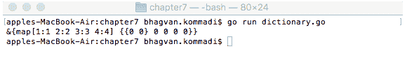

让我们看一下以下部分中的 `TreeSet` 数据结构。

# TreeSet

**TreeSets** 在市场营销和客户关系管理应用中使用。`TreeSet` 是一个具有唯一元素的二叉树集合。元素按自然顺序排序。在下面的代码片段中，展示了 `TreeSet` 的创建、插入、搜索和 `stringify` 操作。如果集合为空，`TreeSet` 只允许一个 `null` 值。元素按顺序存储。`add`、`remove` 和 `contains` 函数在 `TreeSets` 上的成本为 *log*(*n*)：

```go
///main package has examples shown
// in Go Data Structures and algorithms book
package main

// TreeSet class
type TreeSet struct {
  bst *BinarySearchTree
}
```

我们将在以下章节中讨论不同的 `TreeSet` 方法。

# 插入树节点方法

`TreeSet` 类的 `InsertTreeNode` 方法接受 `treeNodes` 变量参数，参数类型为 `TreeNode`。在下面的代码中，具有 `key` 和 `value` 的元素被插入到 `TreeSet` 的二叉搜索树中：

```go
// InsertTreeNode method
func (treeset *TreeSet) InsertTreeNode(treeNodes ...TreeNode) {
  var treeNode TreeNode
  for _, treeNode = range treeNodes {
    treeset.bst.InsertElement(treeNode.key, treeNode.value)
  }
}
```

`InsertTreeNode` 方法的示例输出如下。`InsertTreeNode` 方法接受 `treeNodes` 作为参数。`treeNodes` 被插入到具有值为 `8` 的 `rootNode` 中：

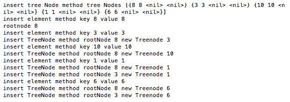

# 删除方法

`TreeSet` 类的 `Delete` 方法在下面的代码片段中展示。在此方法中，具有提供键的 `treeNodes` 被移除：

```go
// Delete method
func (treeset *TreeSet) Delete(treeNodes ...TreeNode) {
  var treeNode TreeNode
  for _, treeNode = range treeNodes {
    treeset.bst.RemoveNode(treeNode.key)
  }
}
```

# 中序遍历树方法

`BinarySearchTree` 类的 `InOrderTraverseTree` 方法接受 `function` 作为参数。`lock` 实例的 `RLock` 方法被调用。`lock` 实例的 `RUnlock` 方法被延迟。`InOrderTraverseTree` 使用树的 `rootNode` 和函数作为参数被调用：

```go
//InOrderTraverseTree method
func (tree *BinarySearchTree) InOrderTraverseTree(function func(int)) {
  tree.lock.RLock()
  defer tree.lock.RUnlock()
  inOrderTraverseTree(tree.rootNode, function)
}
```

# 中序遍历树方法

`inOrderTraverseTree` 方法从树的左侧遍历到节点根，然后到树的右侧。`inOrderTraverseTree` 方法接受 `treeNode` 和 `function` 作为参数。该方法递归地调用 `inOrderTraverseTree` 方法，并分别使用 `function` 和 `leftNode`、`rightNode` 进行单独调用。`function` 方法使用 `treeNode` 的 `value` 被调用：

```go
// inOrderTraverseTree method
func inOrderTraverseTree(treeNode *TreeNode, function func(int)) {
  if treeNode != nil {
    inOrderTraverseTree(treeNode.leftNode, function)
    function(treeNode.value)
    inOrderTraverseTree(treeNode.rightNode, function)
  }
}
```

# 预序遍历树方法

`BinarySearchTree` 类的 `PreOrderTraverseTree` 方法接受函数作为其参数。首先在树的 `lock` 实例上调用 `Lock` 方法，然后延迟调用 `Unlock` 方法。使用树的 `rootNode` 和函数作为参数调用 `PreOrderTraverseTree` 方法：

```go
// PreOrderTraverse method
func (tree *BinarySearchTree) PreOrderTraverseTree(function func(int)) {
  tree.lock.Lock()
  defer tree.lock.Unlock()
  preOrderTraverseTree(tree.rootNode, function)
}
```

# 预序遍历树方法

`preOrderTraverseTree` 方法从根开始遍历树，到树的左侧和右侧。`preOrderTraverseTree` 方法接受 `treeNode` 和 `function` 作为参数。如果 `treeNode` 不是 `nil`，则使用 `treeNode` 的 `value` 调用 `function`，然后使用 `function` 和 `leftNode`、`rightNode` 作为参数调用 `preOrderTraverseTree` 方法：

```go
// preOrderTraverseTree method
func preOrderTraverseTree(treeNode *TreeNode, function func(int)) {
  if treeNode != nil {
    function(treeNode.value)
    preOrderTraverseTree(treeNode.leftNode, function)
    preOrderTraverseTree(treeNode.rightNode, function)
  }
}
```

# 搜索方法

`TreeSet` 类的 `Search` 方法接受一个名为 `treeNodes` 的变量参数，参数类型为 `TreeNode`。如果这些 `treeNodes` 中的任何一个存在，则返回 `true`；否则，返回 `false`。以下代码片段概述了 `Search` 方法：

```go
// Search method
func (treeset *TreeSet) Search(treeNodes ...TreeNode) bool {
  var treeNode TreeNode
  var exists bool
  for _, treeNode = range treeNodes {
    if exists = treeset.bst.SearchNode(treeNode.key); !exists {
      return false
    }
  }
  return true
}

```

# String 方法

在以下代码片段中，`TreeSet` 类的 `String` 方法返回 `bst` 的字符串版本：

```go
// String method
func (treeset *TreeSet) String() {
  treeset.bst.String()
}

```

# 主方法

`TreeSet` 类中的 `main` 方法使用 `TreeNodes` 创建一个 `TreeSet`。以下代码片段创建了一个 `TreeSet` 并调用了 `String` 方法：

```go
// main method
func main() {
  var treeset *TreeSet = &TreeSet{}
  treeset.bst = &BinarySearchTree{}
  var node1 TreeNode = TreeNode{8,8, nil,nil}
  var node2 TreeNode = TreeNode{3,3,nil, nil}
  var node3 TreeNode = TreeNode{10,10,nil,nil}
  var node4 TreeNode = TreeNode{1,1,nil,nil}
  var node5 TreeNode = TreeNode{6,6,nil,nil}
  treeset.InsertTreeNode(node1,node2,node3, node4, node5)
  treeset.String()
}
```

执行以下命令以运行 `treeset.go` 和 `binarysearchtree.go` 文件：

```go
$ go build treeset.go binarysearchtree.go
$ ./treeset
```

输出如下：

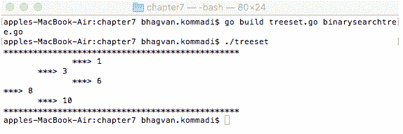

下一节将讨论同步的 `TreeSet` 数据结构。

# 同步 TreeSet

在同步 TreeSet 上执行的操作在多个调用之间同步，这些调用访问 TreeSet 的元素。TreeSet 中的同步是通过使用 `sync.RWMutex` 锁来实现的。在树的 `lock` 实例上调用 `lock` 方法，并在插入、删除或更新 `tree` 节点之前延迟调用解锁方法：

```go
// InsertElement method
func (tree *BinarySearchTree) InsertElement(key int, value int) {
  tree.lock.Lock()
  defer tree.lock.Unlock()
  var treeNode *TreeNode
  treeNode = &TreeNode{key, value, nil, nil}
  if tree.rootNode == nil {
    tree.rootNode = treeNode
  } else {
    insertTreeNode(tree.rootNode, treeNode)
  }
}
```

# 可变 TreeSet

**可变 TreeSet** 可以在树及其节点上使用 `add`、`update` 和 `delete` 操作。`insertTreeNode` 通过传递要更新的 `rootNode` 和 `treeNode` 参数来更新树。以下代码片段展示了如何使用给定的 `rootNode` 和 `TreeNode` 插入一个 `TreeNode`：

```go
// insertTreeNode method
func insertTreeNode(rootNode *TreeNode, newTreeNode *TreeNode) {
  if newTreeNode.key < rootNode.key {
    if rootNode.leftNode == nil {
      rootNode.leftNode = newTreeNode
    } else {
      insertTreeNode(rootNode.leftNode, newTreeNode)
    }
  } else {
    if rootNode.rightNode == nil {
      rootNode.rightNode = newTreeNode
    } else {
      insertTreeNode(rootNode.rightNode, newTreeNode)
    }
  }
}

```

让我们在接下来的几节中讨论不同的可变 TreeSet。

# RemoveNode 方法

`BinarySearchTree` 的 `RemoveNode` 方法如下：

```go
// RemoveNode method
func (tree *BinarySearchTree) RemoveNode(key int) {
  tree.lock.Lock()
  defer tree.lock.Unlock()
  removeNode(tree.rootNode, key)
}
```

# Treeset.bst

可以通过访问 `treeset.bst` 并从 `rootNode` 及其左右节点遍历二叉搜索树来更新 TreeNode，如下所示：

```go
  var treeset *TreeSet = &TreeSet{}
  treeset.bst = &BinarySearchTree{} 
  var node1 TreeNode = TreeNode{8, 8, nil, nil}
  var node2 TreeNode = TreeNode{3, 3, nil, nil}
  var node3 TreeNode = TreeNode{10, 10, nil, nil}
  var node4 TreeNode = TreeNode{1, 1, nil, nil}
  var node5 TreeNode = TreeNode{6, 6, nil, nil}
  treeset.InsertTreeNode(node1, node2, node3, node4, node5)
  treeset.String()
```

在下一节中，我们将查看序列。

# 序列

**序列** 是一组按特定顺序排列的数字。流中元素的数量可以是无限的，这些序列被称为 **流**。**子序列** 是从另一个序列创建的序列。在删除序列中的一些元素后，子序列中元素的相对位置将保持不变。

在接下来的几节中，我们将查看不同的序列，如 Farey 序列、Fibonacci 序列、look-and-say 和 Thue–Morse。

# Farey 序列

**Farey 序列** 由介于零和一之间的简化分数组成。分数的分母小于或等于 *m*，并按升序排列。这个序列被称为 **Farey 系列**。在以下代码中，显示了简化分数：

```go
///main package has examples shown
// in Go Data Structures and algorithms book
package main
// importing fmt package
import (
  "fmt"
)

// fraction class
type fraction struct {
  numerator int
  denominator int
}
```

让我们看看 Farey 序列中的不同方法。

# String 方法

`fraction` 类具有分子和分母的整数属性。`fraction` 类的 `String` 方法，如以下代码片段所示，返回 `fraction` 的字符串版本：

```go
// string method of fraction class
func (frac fraction) String() string {
  return fmt.Sprintf("%d/%d", frac.numerator, frac.denominator)
}
```

# g 方法

`g` 方法接受两个分数并打印出一系列简化的分数。`g` 函数接受 `l` 或 `r` 分数以及 `num` 整数作为参数，以打印简化的分数作为一系列。以下代码片段展示了 `g` 方法：

```go
// g method
func g(l fraction, r fraction, num int) {
  var frac fraction
  frac = fraction{l.numerator + r.numerator, l.denominator + r.denominator}
  if frac.denominator <= num {
    g(l, frac, num)
    fmt.Print(frac, " ")
    g(frac, r, num)
  }
}
```

# 主方法

以下代码片段展示了 `main` 方法。在 `main` 方法中，使用递归打印简化的分数序列：

```go
// main method
func main() {
 var num int
 var l fraction
 var r fraction
 for num = 1; num <= 11; num++ {
 l = fraction{0, 1}
 r = fraction{1, 1}
 fmt.Printf("F(%d): %s ", num, l)
 g(l, r, num)
 fmt.Println(r)
 }
```

运行以下命令以执行 `farey_sequence.go` 文件：

```go
go run farey_sequence.go
```

输出如下：

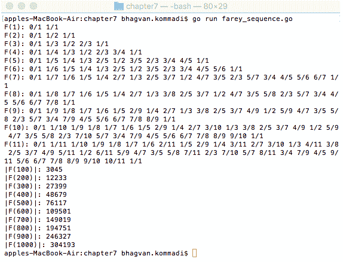

下一节将讨论斐波那契数列数据结构。

# 斐波那契数列

**斐波那契数列**由一系列数字组成，其中每个数字都是前两个数字的和。Pingala 在公元前 200 年首次提出了斐波那契数。斐波那契数列如下：

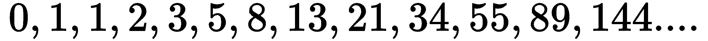

斐波那契数列的递推关系如下：

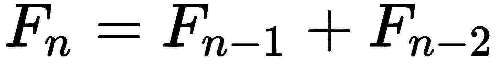

种子值如下：

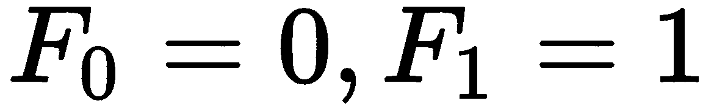

一个斐波那契素数是一个素数的斐波那契数。斐波那契素数序列如下：

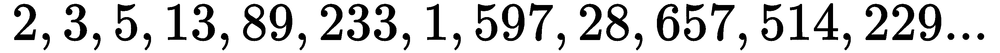

计算机算法，如斐波那契搜索技术、堆和立方体，是斐波那契数的流行应用。伪随机数生成器使用斐波那契数。

以下代码片段展示了斐波那契数列及其递归斐波那契数计算。同时展示了 `Series` 函数。`Series` 函数用于计算数列中的斐波那契数：

```go
///main package has examples shown
// in Go Data Structures and algorithms book
package main

// importing fmt and strconv package
import (
  "fmt"
  "strconv"
)

// Series method
func Series(n int) int {
  var f []int
  f = make([]int, n+1, n+2)
  if n < 2 {
    f = f[0:2]
  }
  f[0] = 0
  f[1] = 1
  var i int
  for i = 2; i <= n; i++ {
    f[i] = f[i-1] + f[i-2]
  }
  return f[n]
}
```

下一节将讨论斐波那契数列的不同方法。

# FibonacciNumber 方法

`FibonacciNumber` 方法接受一个整数 *n*，并通过递归计算斐波那契数。以下代码片段展示了这种递归：

```go
// FibonacciNumber method
func FibonacciNumber(n int) int {
  if n <= 1 {
    return n
  }
  return FibonacciNumber(n-1) + FibonacciNumber(n-2)
}
```

# 主方法

以下代码片段中的 `main` 方法展示了斐波那契数列的计算方法：

```go
// main method
func main() {
 var i int
 for i = 0; i <= 9; i++ {
 fmt.Print(strconv.Itoa(Series(i)) + " ")
 }
 fmt.Println("")
 for i = 0; i <= 9; i++ {
 fmt.Print(strconv.Itoa(FibonacciNumber(i)) + " ")
 }
 fmt.Println("")
}
```

运行以下命令以执行 `fibonacci_sequence.go` 文件：

```go
go run fibonacci_sequence.go
```

输出如下：

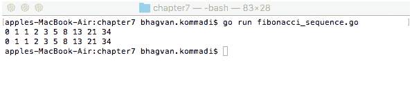

下一节将讨论观察法数据结构。

# 观察法

**观察法**序列是一个整数序列：


该序列是通过计算组中前一个数的数字生成的。John Conway 最初提出了 *观察法序列* 这个术语。

观察法序列在以下代码中展示。`look_say` 方法接受一个字符串作为参数，并返回一个观察法整数序列：

```go
//main package has examples shown
// in Go Data Structures and algorithms book
package main

// importing fmt and strconv package
import (
  "fmt"
  "strconv"
)

// look_say method
func look_say(str string) (rstr string) {
  var cbyte byte
  cbyte = str[0]
  var inc int
  inc = 1
  var i int
  for i = 1; i < len(str); i++ {
    var dbyte byte
    dbyte = str[i]
    if dbyte == cbyte {
      inc++
      continue
    }
    rstr = rstr + strconv.Itoa(inc) + string(cbyte)
    cbyte = dbyte
    inc = 1
  }
  return rstr + strconv.Itoa(inc) + string(cbyte)
}
```

`main` 方法初始化字符串并调用 `look_say` 方法。该方法返回的观察法序列被打印出来：

```go
// main method
func main() {
  var str string
  str = "1"
  fmt.Println(str)
  var i int
  for i = 0; i < 8; i++ {
    str = look_say(str)
    fmt.Println(str)
  }
}
```

运行以下命令以执行 `look_say.go` 文件：

```go
go run look_say.go
```

输出如下：

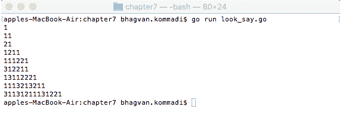

下一节将讨论 Thue–Morse 数据结构。

# Thue–Morse

**Thue–Morse** 序列是一个从零开始的二进制序列，它附加了当前序列的布尔补码。

Thue–Morse 序列如下：


Thue–Morse 序列被 Eugene Prophet 应用，并被 Axel Thue 用于研究词的组合数学。Thue–Morse 序列在分形曲线领域得到应用，例如 Koch 雪花。

以下代码片段创建 Thue–Morse 序列。`ThueMorseSequence`函数接收一个`bytes.Buffer`实例 buffer，并通过在`bytes`上应用`complement`操作来修改 buffer 为 Thue–Morse 序列：

```go
//main package has examples shown
// in Go Data Structures and algorithms book
package main

// importing fmt and bytes package
import (
 "bytes"
 "fmt"
)

// ThueMorseSequence method
func ThueMorseSequence(buffer *bytes.Buffer) {

 var b int
 var currLength int
 var currBytes []byte
 for b, currLength, currBytes = 0, buffer.Len(), buffer.Bytes(); b < currLength; b++ {
 if currBytes[b] == '1' {
 buffer.WriteByte('0')
 } else {
 buffer.WriteByte('1')
 }
 }
}
```

`main`方法初始化序列号为`0`。`ThueMorseSequence`方法接收`bytes.Buffer`的指针，并通过调用`ThueMorseSequence`方法来修改它。结果序列在终端上打印：

```go
// main method
func main() {
 var buffer bytes.Buffer
 // initial sequence member is "0"
 buffer.WriteByte('0')
 fmt.Println(buffer.String())
 var i int
 for i = 2; i <= 7; i++ {
 ThueMorseSequence(&buffer)
 fmt.Println(buffer.String())
 }
}
```

运行以下命令以执行`thue_morse.go`文件：

```go
go run thue_morse.go
```

输出如下：

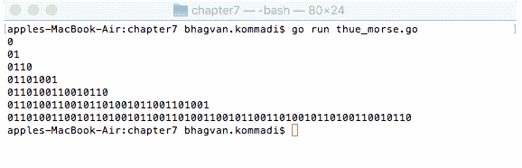

# 摘要

本章介绍了字典数据结构的`contains`、`put`、`remove`、`find`、`reset`、`NumberOfElements`、`getKeys`和`getValues`方法。`InsertTreeNode`、`Delete`、`Search`和`stringify` TreeSet 操作已详细解释，并提供了代码示例。代码中展示了`BinarySearchTree`结构，以及`InsertElement`、`InOrderTraversal`、`PreOrderTraverseTree`、`SearchNode`和`RemoveNode`函数。

下一章涵盖了排序、搜索、递归和散列等算法。

# 问题

1.  如何确保`BinarySearchTree`同步？

1.  哪个方法被调用以推迟函数的调用？

1.  如何使用自定义类型定义字典的键和值？

1.  如何找到映射的长度？

1.  在树中遍历`treeNodes`列表时使用什么关键字？

1.  在费雷序列中，序列中的实数被称为什么？

1.  斐波那契数是什么？

1.  如何将整数转换为字符串？

1.  用于将字节转换为字符串的方法是什么？

1.  向字典中添加元素时调用什么方法？

# 进一步阅读

如果你想了解更多关于动态数据结构的信息，以下书籍推荐：

+   《*设计模式*》，作者 Erich Gamma, Richard Helm, Ralph Johnson, 和 John Vlissides

+   《*算法导论（第三版）*》，作者 Thomas H. Cormen, Charles E. Leiserson, Ronald L. Rivest, 和 Clifford Stein

+   《*数据结构与算法：简易入门*》，作者 Rudolph Russell
