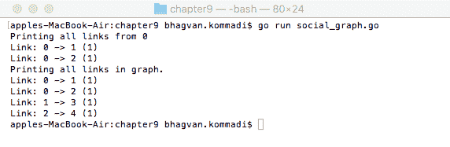
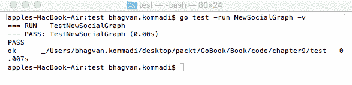
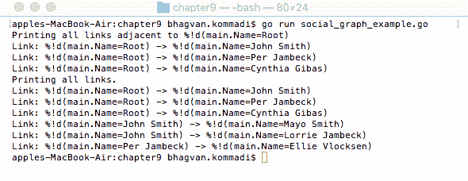
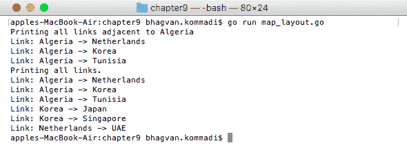
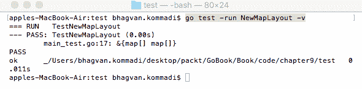
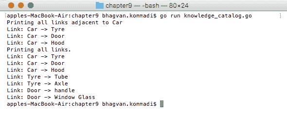
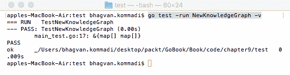
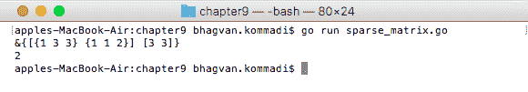

# 网络和稀疏矩阵表示

**稀疏矩阵**是一种大部分值都是零的矩阵。零值与非零值的比率称为**稀疏度**。在创建关于网络可用性的假设时，对矩阵稀疏度的估计可能是有帮助的。在机器学习和自然语言解析中，广泛使用大量的稀疏矩阵。处理它们在计算上代价高昂。推荐引擎使用它们来表示目录内的产品。计算机视觉在处理包含暗像素区域的图片时使用稀疏矩阵和网络数据结构。网络和稀疏矩阵数据结构也用于社交图和地图布局。在本章中，我们将涵盖以下主题：

+   使用图表示的网络

    +   社交网络表示

    +   地图布局

    +   知识图

+   使用列表的列表表示稀疏矩阵

本章实现了连接人们的社交图，并有一个代码示例展示了如何遍历该图。地图布局通过纬度和经度表示的地理位置进行解释。通过使用汽车及其部件来解释知识图。

# 技术要求

从 [`golang.org/doc/install`](https://golang.org/doc/install) [为您的操作系统安装 Go 版本 1.10。](https://golang.org/doc/install)

本章中代码的 GitHub URL 如下所示：[`github.com/PacktPublishing/Learn-Data-Structures-and-Algorithms-with-Golang/tree/master/Chapter09`](https://github.com/PacktPublishing/Learn-Data-Structures-and-Algorithms-with-Golang/tree/master/Chapter09)。

# 使用图表示的网络

图是一种通过链接连接对象集的表示。链接连接顶点，即点。图上的基本操作是链接和顶点的添加和删除。以下是一些不同类型的图：

+   有向图

+   无向图

+   连接图

+   非连接图

+   简单图

+   多图

**邻接表**由具有对象或记录的图的相邻顶点组成。邻接矩阵由源顶点和目标顶点组成。关联矩阵是一个二维布尔矩阵。矩阵有顶点行和表示链接（边）的列。

下面的代码展示了使用图表示的网络。社交图由链接数组组成：

```go
///main package has examples shown
// in Go Data Structures and algorithms book
package main

// importing fmt package
import (
  "fmt"
)
// Social Graph
type SocialGraph struct {
  Size int
  Links [][]Link
}
```

在下一节中定义和实现了 `Link` 结构体。

# 链接类

`Link` 类由 `vertex1` 和 `vertex2` 顶点以及 `LinkWeight` 整数属性组成：

```go
// Link class
type Link struct {
  Vertex1 int
  Vertex2 int
  LinkWeight int
}
```

下一节将讨论不同 `Link` 类方法的实现。

# `NewSocialGraph` 方法

`NewSocialGraph` 函数根据 `num` 创建社交图，其中 `num` 是图的尺寸。`Size` 是图中的链接数量：

```go
// NewSocialGraph method
func NewSocialGraph(num int) *SocialGraph {
  return &SocialGraph{
    Size: num,
    Links: make([][]Link, num),
  }
}
```

# 添加链接方法

`AddLink` 方法在两个顶点之间添加链接。社交图的 `AddLink` 方法接受 `vertex1`、`vertex2` 和 `weight` 作为参数。该方法从 `vertex1` 到 `vertex2` 添加链接，如下面的代码所示：

```go
// AddLink method
func (socialGraph *SocialGraph) AddLink(vertex1 int, vertex2 int, weight int) {
  socialGraph.Links[vertex1] = append(socialGraph.Links[vertex1], Link{Vertex1: vertex1, Vertex2: vertex2, LinkWeight: weight})
}
```

# PrintLinks 方法

`SocialGraph` 类的 `PrintLinks` 方法打印从 `vertex = 0` 出发的链接以及图中的所有链接：

```go
// Print Links Example
func (socialGraph *SocialGraph) PrintLinks() {

  var vertex int
  vertex = 0

  fmt.Printf("Printing all links from %d\n", vertex)
  var link Link
  for _, link = range socialGraph.Links[vertex] {
    fmt.Printf("Link: %d -> %d (%d)\n", link.Vertex1, link.Vertex2, link.LinkWeight)
  }

  fmt.Println("Printing all links in graph.")
  var adjacent []Link
  for _, adjacent = range socialGraph.Links {
    for _, link = range adjacent {
      fmt.Printf("Link: %d -> %d (%d)\n", link.Vertex1, link.Vertex2, link.LinkWeight)
    }
  }
}
```

# main 方法

`main` 方法通过调用 `NewSocialGraph` 方法创建社交图。将 `0` 到 `1`、`0` 到 `2`、`1` 到 `3` 和 `2` 到 `4` 的链接添加到社交图中。使用 `printLinks` 方法打印链接：

```go
// main method
func main() {

  var socialGraph *SocialGraph

  socialGraph = NewSocialGraph(4)

  socialGraph.AddLink(0, 1, 1)
  socialGraph.AddLink(0, 2, 1)
  socialGraph.AddLink(1, 3, 1)
  socialGraph.AddLink(2, 4, 1)

  socialGraph.PrintLinks()

}
```

执行以下命令以运行 `social_graph.go` 文件：

```go
go run social_graph.go
```

输出如下：



在下一节中，我们将查看社交图方法的单元测试。

# 测试

这里，我们为社交图方法编写了一个单元测试。代码如下：

```go
///main package has examples shown
// in Go Data Structures and algorithms book
package main

// importing testing package
import (
  "fmt"
  "testing"
)
// NewSocialGraph test method
func TestNewSocialGraph(test *testing.T) {

  var socialGraph *SocialGraph

  socialGraph = NewSocialGraph(1)

  if socialGraph == nil {

    test.Errorf("error in creating a social Graph")
  }

}
```

执行以下命令以运行前面的代码片段：

```go
go test -run NewSocialGraph -v
```

输出如下：



在下一节中，将使用代码示例实现一个社交网络表示。前述图将增强节点。每个节点将代表一个社交实体。

# 表示社交网络

**社交网络**由包含如人、朋友、讨论、分享、信仰、信任和喜好等社交实体的社交链接组成。此图用于表示社交网络。

可以根据图计算与实体邻近度相关的指标。社交图由图节点和链接组成，分别对应具有键名和多个键名的映射：

```go
///Main package has examples shown
// in Go Data Structures and algorithms book
package main

// importing fmt package
import (
  "fmt"
)

type Name string

type SocialGraph struct {
  GraphNodes map[Name]struct{}
  Links map[Name]map[Name]struct{}
}
```

下一节将解释并实现不同的社交网络方法。

# NewSocialGraph 方法

`NewSocialGraph` 方法返回一个由 nil 值的 `GraphNodes` 和 `Links` 组成的社交图：

```go
// NewSocialGraph method
func NewSocialGraph() *SocialGraph {
  return &SocialGraph{
    GraphNodes: make(map[Name]struct{}),
    Links: make(map[Name]map[Name]struct{}),
  }
}
```

# AddEntity 方法

AddEntity 方法将实体添加到社交图中。`SocialGraph` 类的 `AddEntity` 方法接受 `name` 作为参数，如果它被添加到社交图中则返回 `true`：

```go
// AddEntity method
func (socialGraph *SocialGraph) AddEntity(name Name) bool {

  var exists bool
  if _, exists = socialGraph.GraphNodes[name]; exists {
    return true
  }
  socialGraph.GraphNodes[name] = struct{}{}
  return true
}
```

# AddLink 方法

`SocialGraph` 类的 `AddLink` 方法接受 `name1` 和 `name2` 作为参数。如果命名的实体不存在，此方法将创建实体并在实体之间创建链接：

```go
// Add Link
func (socialGraph *SocialGraph) AddLink(name1 Name, name2 Name) {
  var exists bool
  if _, exists = socialGraph.GraphNodes[name1]; !exists {
    socialGraph.AddEntity(name1)
  }
  if _, exists = socialGraph.GraphNodes[name2]; !exists {
    socialGraph.AddEntity(name2)
  }
  if _, exists = socialGraph.Links[name1]; !exists {
    socialGraph.Links[name1] = make(map[Name]struct{})
  }
  socialGraph.Links[name1][name2] = struct{}{}
}
```

# PrintLinks 方法

`SocialGraph` 类的 `PrintLinks` 方法打印与 `root` 相邻的链接以及所有链接，如下面的代码片段所示：

```go
func (socialGraph *SocialGraph) PrintLinks() {
  var root Name
  root = Name("Root") 

  fmt.Printf("Printing all links adjacent to %d\n", root)

  var node Name
  for node = range socialGraph.Links[root] {
    // Edge exists from u to v.
    fmt.Printf("Link: %d -> %d\n", root, node)
  }

  var m map[Name]struct{}
  fmt.Println("Printing all links.")
  for root, m = range socialGraph.Links {
    var vertex Name
    for vertex = range m {
      // Edge exists from u to v.
      fmt.Printf("Link: %d -> %d\n", root, vertex)
    }
  }
}
```

# main 方法

`main` 方法创建一个社交图。创建实体，如 `john`、`per` 和 `cynthia`，并将它们与根节点链接起来。创建朋友，如 `mayo`、`lorrie` 和 `ellie`，并将它们与 `john` 和 `per` 链接起来：

```go
// main method
func main() {

  var socialGraph *SocialGraph

   socialGraph = NewSocialGraph()

   var root Name = Name("Root")
   var john Name = Name("John Smith")
   var per Name = Name("Per Jambeck")
   var cynthia Name = Name("Cynthia Gibas")

   socialGraph.AddEntity(root)
   socialGraph.AddEntity(john)
   socialGraph.AddEntity(per)
   socialGraph.AddEntity(cynthia)

   socialGraph.AddLink(root, john)
   socialGraph.AddLink(root, per)
   socialGraph.AddLink(root, cynthia)

   var mayo Name = Name("Mayo Smith")
   var lorrie Name = Name("Lorrie Jambeck")
   var ellie Name = Name("Ellie Vlocksen")

   socialGraph.AddLink(john, mayo)
   socialGraph.AddLink(john, lorrie)
   socialGraph.AddLink(per, ellie)

   socialGraph.PrintLinks()
}
```

执行以下命令以运行 `social_graph_example.go` 文件：

```go
go run social_graph_example.go
```

输出如下：



下一节将讨论 **地图布局** 的实现。

# 地图布局

地图布局是相互连接的地点的地理可视化。地图的图中的节点由基于地理的信息组成。节点将包含诸如地点名称、纬度和经度等信息。地图以不同的比例展开。地图创建被称为使用地理信息的制图设计。

下面的代码片段显示了地图布局。`Place` 类包含 `Name`、`Latitude` 和 `Longitude` 属性：

```go
///main package has examples shown
// in Go Data Structures and algorithms book
package main

// importing fmt package
import (
  "fmt"
)

// Place class
type Place struct {

    Name string
    Latitude float64
    Longitude float64

}
```

下一个部分将讨论 `MapLayout` 类。

# `MapLayout` 类

`MapLayout` 类由 `GraphNodes` 和 `Links` 组成：

```go
// MapLayout class
type MapLayout struct {
  GraphNodes map[Place]struct{}
  Links map[Place]map[Place]struct{}
}
```

下一个部分将解释并实现不同的 `MapLayout` 方法。

# The NewMapLayout method

`NewMapLayout` 方法创建一个 `MapLayout`。`MapLayout` 有 `GraphNodes` 和链接映射：

```go
// NewMapLayout method
func NewMapLayout() *MapLayout {
  return &MapLayout{
    GraphNodes: make(map[Place]struct{}),
    Links: make(map[Place]map[Place]struct{}),
  }
}
```

# The AddPlace method

`MapLayout` 类的 `AddPlace` 方法接受地点作为参数，如果地点存在则返回 `true`。如果地点不存在，则创建一个新的具有新地点键的图节点：

```go
// AddPlace method
func (mapLayout *MapLayout) AddPlace(place Place) bool {

  var exists bool
  if _, exists = mapLayout.GraphNodes[place]; exists {
    return true
  }
  mapLayout.GraphNodes[place] = struct{}{}
  return true
}
```

# The AddLink method

`MapLayout` 类的 `AddLink` 方法接受地点作为参数并将它们连接起来：

```go
// Add Link
func (mapLayout *MapLayout) AddLink(place1 Place, place2 Place) {
  var exists bool
  if _, exists = mapLayout.GraphNodes[place1]; !exists {
    mapLayout.AddPlace(place1)
  }
  if _, exists = mapLayout.GraphNodes[place2]; !exists {
    mapLayout.AddPlace(place2)
  }

  if _, exists = mapLayout.Links[place1]; !exists {
    mapLayout.Links[place1] = make(map[Place]struct{})
  }
  mapLayout.Links[place1][place2] = struct{}{}

}
```

# The PrintLinks method

`PrintLinks` 方法打印地点和链接：

```go
// PrintLinks method
func (mapLayout *MapLayout) PrintLinks() {
  var root Place
  root = Place{"Algeria", 3, 28}

  fmt.Printf("Printing all links adjacent to %s\n", root.Name)

  var node Place
  for node = range mapLayout.Links[root] {
    fmt.Printf("Link: %s -> %s\n", root.Name, node.Name)
  }

  var m map[Place]struct{}
  fmt.Println("Printing all links.")
  for root, m = range mapLayout.Links {
    var vertex Place
    for vertex = range m {
      fmt.Printf("Link: %s -> %s\n", root.Name, vertex.Name)
    }
  }
}
```

# The main method

在 `main` 方法中，通过调用 `NewMapLayout` 方法创建地图布局。实例化地点并将其添加到地图布局中。然后，在地点之间添加链接：

```go
// main method
func main() {

  var mapLayout *MapLayout

   mapLayout = NewMapLayout()

   var root Place = Place{"Algeria", 3, 28}
   var netherlands Place = Place{"Netherlands", 5.75, 52.5}

   var korea Place = Place{"Korea", 124.1, -8.36}
   var tunisia Place = Place{"Tunisia", 9, 34}

   mapLayout.AddPlace(root)
   mapLayout.AddPlace(netherlands)
   mapLayout.AddPlace(korea)
   mapLayout.AddPlace(tunisia)

   mapLayout.AddLink(root, netherlands)
   mapLayout.AddLink(root,korea)
   mapLayout.AddLink(root,tunisia)

   var singapore Place = Place{"Singapore",103.8,1.36}
   var uae Place = Place{"UAE",54,24}
   var japan Place = Place{"Japan",139.75, 35.68}

   mapLayout.AddLink(korea, singapore)
   mapLayout.AddLink(korea,japan)
   mapLayout.AddLink(netherlands,uae)

   mapLayout.PrintLinks()
}
```

运行以下命令以执行 `map_layout.go` 文件：

```go
go run map_layout.go
```

输出如下：



在下一个部分，我们将查看 `NewMapLayout` 方法的单元测试。

# 测试

以下代码片段显示了 `MapLayout` 类的 `NewMapLayout` 方法的单元测试：

```go
///main package has examples shown
// in Go Data Structures and algorithms book
package main

// importing testing package
import (
  "testing"
)

// NewMapLayout test method
func TestNewMapLayout(test *testing.T) {

  var mapLayout *MapLayout

  mapLayout = NewMapLayout()

  test.Log(mapLayout)

  if mapLayout == nil {

    test.Errorf("error in creating a mapLayout")
  }

}
```

运行以下命令以执行前面的代码片段：

```go
go test -run NewMapLayout -v
```

输出如下：



下一个部分将讨论实现**知识图谱**。

# 知识图谱

知识图谱是实体、物品和用户作为节点的网络表示。节点通过链接或边相互交互。知识图谱因其无模式性而被广泛使用。这些数据结构用于以图形形式表示知识，节点包含文本信息。知识图谱通过使用项目、实体和用户节点并通过边将它们连接起来创建。

**本体**由信息节点构成的知识图谱。推理器从知识图谱中推导出知识。知识图谱由类、槽位和方面组成，这些是本体术语。在以下代码中，一个由汽车物料清单构成的知识图谱被解释。`Class` 类型包含一个名称，它是一个字符串：

```go
///main package has examples shown
// in Go Data Structures and algorithms book
package main

// importing fmt package
import (
  "fmt"
)

// Class Type
type Class struct {
  Name string
}
```

下一个部分将讨论 `knowledge graph` 类。

# `KnowledgeGraph` 类

`KnowledgeGraph` 类由 `GraphNodes` 和链接组成：

```go
// Knowledge Graph type
type KnowledgeGraph struct {
  GraphNodes map[Class]struct{}
  Links map[Class]map[Class]struct{}
}
```

以下各节解释并实现了不同的知识图谱方法。

# `NewKnowledgeGraph` 方法

`NewKnowledgeGraph` 方法创建一个知识图谱，它由 `GraphNodes` 和 `Links` 映射组成。

```go
// NewKnowledgeGraph method
func NewKnowledgeGraph() *KnowledgeGraph {
  return &KnowledgeGraph{
    GraphNodes: make(map[Class]struct{}),
    Links: make(map[Class]map[Class]struct{}),
  }
}
```

# `AddClass` 方法

`KnowledgeGraph` 类的 `AddClass` 方法接受 `class` 作为参数，如果类存在则返回 `true`。如果类不存在，则创建一个以 `class` 为键的 `GraphNode`：

```go
// AddClass method
func (knowledgeGraph *KnowledgeGraph) AddClass(class Class) bool {

  var exists bool
  if _, exists = knowledgeGraph.GraphNodes[class]; exists {
    return true
  }
  knowledgeGraph.GraphNodes[class] = struct{}{}
  return true
}
```

# `AddLink` 方法

`KnowledgeGraph` 类的 `AddLink` 方法接受 `class1` 和 `class2` 作为参数，并在这些类之间创建链接：

```go
// Add Link
func (knowledgeGraph *KnowledgeGraph) AddLink(class1 Class, class2 Class) {
  var exists bool
  if _, exists = knowledgeGraph.GraphNodes[class1]; !exists {
    knowledgeGraph.AddClass(class1)
  }
  if _, exists = knowledgeGraph.GraphNodes[class2]; !exists {
    knowledgeGraph.AddClass(class2)
  }

  if _, exists = knowledgeGraph.Links[class1]; !exists {
    knowledgeGraph.Links[class1] = make(map[Class]struct{})
  }
  knowledgeGraph.Links[class1][class2] = struct{}{}

}
```

# `PrintLinks` 方法

`KnowledgeGraph` 类的 `PrintLinks` 方法打印链接和节点：

```go
// Print Links method
func (knowledgeGraph *KnowledgeGraph) PrintLinks() {
  var car Class
  car = Class{"Car"}

  fmt.Printf("Printing all links adjacent to %s\n", car.Name)

  var node Class
  for node = range knowledgeGraph.Links[car] {
    fmt.Printf("Link: %s -> %s\n", car.Name, node.Name)
  }

  var m map[Class]struct{}
  fmt.Println("Printing all links.")
  for car, m = range knowledgeGraph.Links {
    var vertex Class
    for vertex = range m {
      fmt.Printf("Link: %s -> %s\n", car.Name, vertex.Name)
    }
  }
}
```

# `main` 方法

`main` 方法创建知识图谱，并实例化类。创建并打印类之间的链接：

```go
// main method
func main() {

  var knowledgeGraph *KnowledgeGraph

  knowledgeGraph = NewKnowledgeGraph()

  var car = Class{"Car"}
  var tyre = Class{"Tyre"}
  var door = Class{"Door"}
  var hood = Class{"Hood"}

  knowledgeGraph.AddClass(car)
  knowledgeGraph.AddClass(tyre)
  knowledgeGraph.AddClass(door)
  knowledgeGraph.AddClass(hood)

  knowledgeGraph.AddLink(car, tyre)
  knowledgeGraph.AddLink(car, door)
  knowledgeGraph.AddLink(car, hood)

  var tube = Class{"Tube"}
  var axle = Class{"Axle"}
  var handle = Class{"Handle"}
  var windowGlass = Class{"Window Glass"}

  knowledgeGraph.AddClass(tube)
  knowledgeGraph.AddClass(axle)
  knowledgeGraph.AddClass(handle)
  knowledgeGraph.AddClass(windowGlass)

  knowledgeGraph.AddLink(tyre, tube)
  knowledgeGraph.AddLink(tyre, axle)
  knowledgeGraph.AddLink(door, handle)
  knowledgeGraph.AddLink(door, windowGlass)

  knowledgeGraph.PrintLinks()
}
```

执行以下命令以运行 `knowledge_catalog.go` 文件：

```go
go run knowledge_catalog.go
```

输出如下：



在下一节中，我们将查看 `NewKnowledgeGraph` 方法的单元测试。

# 测试

以下代码片段对 `NewKnowledgeGraph` 方法进行了单元测试：

```go
///main package has examples shown
// in Go Data Structures and algorithms book
package main

// importing testing package
import (
  "testing"
)

// NewKnowledgeGraph test method
func TestNewKnowledgeGraph(test *testing.T) {

  var knowledgeGraph *KnowledgeGraph

  knowledgeGraph = NewKnowledgeGraph()

  test.Log(knowledgeGraph)

  if knowledgeGraph == nil {

    test.Errorf("error in creating a knowledgeGraph")
  }

}
```

执行以下命令以运行前面的代码片段：

```go
go test -run NewKnowledgeGraph -v
```

输出如下：



下一节讨论稀疏矩阵的表示。

# 使用列表的列表表示稀疏矩阵

稀疏矩阵是一个由 *m* 行和 *n* 列组成的二维列表。如果矩阵由 *m* 行和 *n* 列组成，则其形状为 *m* x *n*。稀疏矩阵用于解决不需要密集矩阵的大规模问题。例如，通过使用**有限元方法**（**FEM**）求解偏微分方程。稀疏矩阵的元组是矩阵的非零元素。

在以下代码中，稀疏矩阵被建模为一个列表的列表。稀疏矩阵由一系列列表的列表组成。每个单元格具有 `Row`、`Column` 和 `Value` 等属性：

```go
///main package has examples shown
// in Go Data Structures and algorithms book
package main

// importing fmt package
import (
  "fmt"
)

//List of List
type LOL struct {
  Row int
  Column int
  Value float64
}
```

下一节将讨论 `SparseMatrix` 类。

# `SparseMatrix` 类

`SparseMatrix` 有一个 `cells` 数组和 `shape`，它是一个整数数组：

```go
//Sparse Matrix
type SparseMatrix struct {
  cells []LOL
  shape [2]int
}
```

在下一节中，将实现 `SparseMatrix` 结构的不同 `Sparse` 方法。

# `Shape` 方法

`SparseMatrix` 类的 `Shape` 方法返回 `shape` 数组元素：

```go
// Shape method
func (sparseMatrix *SparseMatrix) Shape() (int, int) {
  return sparseMatrix.shape[0], sparseMatrix.shape[1]
}
```

# `NumNonZero` 方法

`NumNonZero` 方法找到具有非零元素的单元格。`SparseMatrix` 类的 `NumNonZero` 方法返回 `sparseMatrix` 中 `cells` 数组的大小：

```go
// NumNonZero method
func (sparseMatrix *SparseMatrix) NumNonZero() int {
  return len(sparseMatrix.cells)
}
```

# `LessThan` 方法

`LessThan` 方法比较列表的行和列，并检查行是否小于 `i` 以及列是否小于 `j`：

```go
// Less Than method
func LessThan(lol LOL, i int, j int) bool {

  if lol.Row < i && lol.Column < j {

    return true
  }

  return false
}
```

# `Equal` 方法

`Equal` 方法检查列表的列表行和列是否分别等于 `i` 和 `j`：

```go
// Equal method
func Equal(lol LOL, i int, j int) bool {
  if lol.Row == i && lol.Column == j {
    return true
  }
  return false
}
```

# `GetValue` 方法

`SparseMatrix`类的`GetValue`方法返回行和列分别等于`i`和`j`的单元格的值：

```go
// GetValue method
func (sparseMatrix *SparseMatrix) GetValue(i int, j int) float64 {
  var lol LOL
  for _, lol = range sparseMatrix.cells {
    if LessThan(lol, i, j) {
      continue
    }
    if Equal(lol, i, j) {
      return lol.Value
    }
    return 0.0
  }
  return 0.0
}
```

# `SetValue`方法

`SparseMatrix`类的`SetValue`方法将行和列等于`i`和`j`的单元格的值设置为参数值：

```go
//SetValue method
func (sparseMatrix *SparseMatrix) SetValue(i int, j int, value float64) {

  var lol LOL
  var index int
  for index, lol = range sparseMatrix.cells {
    if LessThan(lol, i, j) {
      continue
    }
    if Equal(lol, i, j) {
      sparseMatrix.cells[index].Value = value
      return
    }

    sparseMatrix.cells = append(sparseMatrix.cells, LOL{})
    var k int
    for k = len(sparseMatrix.cells) - 2; k >= index; k-- {
      sparseMatrix.cells[k+1] = sparseMatrix.cells[k]
    }
    sparseMatrix.cells[index] = LOL{
      Row: i,
      Column: j,
      Value: value,
    }
    return
  }
  sparseMatrix.cells = append(sparseMatrix.cells, LOL{
    Row: i,
    Column: j,
    Value: value,
  })
}
```

# 新的稀疏矩阵方法

`NewSparseMatrix`方法接受`m`和`n`作为参数，并返回初始化后的矩阵：

```go
// New SparseMatrix method
func NewSparseMatrix(m int, n int) *SparseMatrix {
  return &SparseMatrix{
    cells: []LOL{},
    shape: [2]int{m, n},
  }
}
```

# 主要方法

`main`方法通过调用`NewSparseMatrix`方法创建稀疏矩阵。值设置在单元格(`1`, `1`)和(`1`, `3`)中。打印出稀疏矩阵和非零单元格的数量：

```go
// main method
func main() {

  var sparseMatrix *SparseMatrix

  sparseMatrix = NewSparseMatrix(3, 3)

  sparseMatrix.SetValue(1, 1, 2.0)
  sparseMatrix.SetValue(1, 3, 3.0)

  fmt.Println(sparseMatrix)
  fmt.Println(sparseMatrix.NumNonZero())
}
```

运行以下命令以执行`sparse_matrix.go`文件：

```go
go run sparse_matrix.go
```

输出如下：



# 摘要

本章介绍了如何分别使用图和列表的列表来表示网络和稀疏矩阵。详细讨论了社交网络表示、地图布局和知识图，并提供了代码示例。还实现了不同的稀疏矩阵方法，并附有相应的代码。

在下一章中，将通过代码示例和效率分析介绍垃圾回收、缓存管理和空间分配等算法。

# 问题

+   用于表示一组链接对象的什么数据结构？

+   带有布尔值的二维矩阵叫什么？

+   使用图表示网络的一个代码示例。

+   可以从社交图中计算出哪些度量？

+   什么是制图设计？

+   提供一个知识图的示例并定义类、槽位和面。

+   稀疏矩阵有哪些应用？

+   定义一个列表的列表并编写一个代码示例。

+   什么是地图布局？

+   可以使用图执行哪些不同的操作？

# 进一步阅读

如果你想了解更多关于图和列表的书籍，以下几本书推荐：

+   *《设计模式》*，作者：艾里克·伽玛、理查德·赫尔姆、拉尔夫·约翰逊和约翰·弗利斯

+   *《算法导论 第 3 版》*，作者：托马斯·H·科莫恩、查尔斯·E·莱伊森森、罗纳德·L·里维斯和克利福德·斯坦

+   *《数据结构和算法：简单入门》*，作者：鲁道夫·拉塞尔
