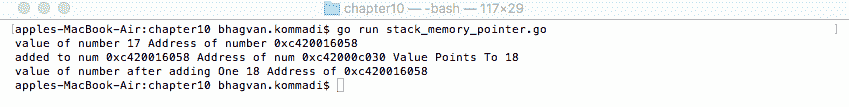

# 内存管理

**内存管理**是一种控制和组织内存的方式。内存分区称为**块**，它们用于运行不同的进程。内存管理算法的基本目标是根据需求动态地为程序分配内存段。当内存中的对象不再需要时，算法会释放内存。垃圾收集、缓存管理和空间分配算法是内存管理技术的良好示例。在软件工程中，垃圾收集用于释放分配给那些不再使用的对象的内存，从而帮助进行内存管理。缓存为数据提供内存存储。您可以将缓存中的数据按地域分组排序。数据可以使用键值集进行存储。

本章涵盖了垃圾收集、缓存管理和空间分配算法。内存管理算法通过代码示例和效率分析进行展示。本章将涵盖以下主题：

+   垃圾收集

+   缓存管理

+   空间分配

+   概念——Go 内存管理

我们将首先查看垃圾收集，然后查看与垃圾收集相关的不同算法。

# 技术要求

从 Golang([`golang.org/`](https://golang.org/))安装 Go 版本 1.10，选择适合您操作系统的正确版本。

本章代码的 GitHub 仓库可以在这里找到：[`github.com/PacktPublishing/Learn-Data-Structures-and-Algorithms-with-Golang/tree/master/Chapter10`](https://github.com/PacktPublishing/Learn-Data-Structures-and-Algorithms-with-Golang/tree/master/Chapter10)。

# 垃圾收集

**垃圾收集**是一种程序化内存管理，其中收集当前由永远不会再次使用的对象占用的内存。约翰·麦卡锡是第一个提出垃圾收集来管理 Lisp 内存管理的人。该技术指定了哪些对象需要被释放，然后释放内存。用于垃圾收集的策略包括**栈分配**和**区域干扰**。套接字、关系数据库句柄、用户窗口对象和文件资源不受垃圾收集器的监管。

垃圾收集算法有助于减少悬挂指针缺陷、双重释放缺陷和内存泄漏。这些算法计算密集，会导致性能下降或不均匀。据苹果公司称，iOS 没有垃圾收集的原因之一是垃圾收集需要五倍的内存来匹配显式内存管理。在高交易系统中，并发、增量实时垃圾收集器有助于管理内存收集和释放。

垃圾收集算法依赖于各种因素：

+   GC 吞吐量

+   堆开销

+   暂停时间

+   暂停频率

+   暂停分布

+   分配性能

+   压缩

+   并发

+   规模化

+   调优

+   预热时间

+   页面释放

+   可移植性

+   兼容性

那就是简单、延迟、单比特、加权引用计数、标记-清除和代际收集算法，这些将在以下几节中讨论。

# `ReferenceCounter`类

以下代码片段显示了创建的对象引用如何在栈中维护。`ReferenceCounter`类具有引用数量属性，包括引用池和已删除引用：

```go
//main package has examples shown
// in Hands-On Data Structures and algorithms with Go book
package main

// importing fmt package
import (
    "fmt"
    "sync"
)

//Reference Counter
type ReferenceCounter struct {
    num *uint32
    pool *sync.Pool
    removed *uint32
}
```

让我们看看`ReferenceCounter`类的方法。

# `newReferenceCounter`方法

`newReferenceCounter`方法初始化一个`ReferenceCounter`实例，并返回对`ReferenceCounter`的指针。这在上面的代码中显示：

```go
//new Reference Counter method
func newReferenceCounter() *ReferenceCounter {
    return &ReferenceCounter{
    num: new(uint32),
    pool: &sync.Pool{},
    removed: new(uint32),
    }
}
```

在下一节中描述了`Stack`类。

# `Stack`类

`Stack`类由`references`数组和`Count`属性组成。这在上面的代码中显示：

```go
// Stack class
type Stack struct {
    references []*ReferenceCounter
    Count int
}
```

让我们看看`Stack`类的实现方法。

# `Stack`类 – 新方法

现在，让我们看看`Stack`类实现的堆接口方法。新方法初始化`references`数组，`Push`和`Pop`堆接口方法使用`reference`参数将`reference`从栈中推入和弹出。这在上面的代码中显示：

```go
// New method of Stack Class
func (stack *Stack) New() {
    stack.references = make([]*ReferenceCounter,0)
}

// Push method
func (stack *Stack) Push(reference *ReferenceCounter) {
    stack.references = append(stack.references[:stack.Count], 
    reference)
    stack.Count = stack.Count + 1
}

// Pop method
func (stack *Stack) Pop() *ReferenceCounter {
    if stack.Count == 0 {
        return nil
    }
var length int = len(stack.references)
var reference *ReferenceCounter = stack.references[length -1]
if length > 1 {
  stack.references = stack.references[:length-1]
  } else {
  stack.references = stack.references[0:]
}
    stack.Count = len(stack.references)
    return reference
}
```

# 主要方法

在以下代码片段中，让我们看看如何使用`Stack`。初始化一个`Stack`实例，通过调用`Push`方法将引用添加到栈中。调用`Pop`方法并打印输出：

```go
// main method
func main() {
    var stack *Stack = &Stack{}
    stack.New()
    var reference1 *ReferenceCounter = newReferenceCounter()
    var reference2 *ReferenceCounter = newReferenceCounter()
    var reference3 *ReferenceCounter = newReferenceCounter()
    var reference4 *ReferenceCounter = newReferenceCounter()
    stack.Push(reference1)
    stack.Push(reference2)
    stack.Push(reference3)
    stack.Push(reference4)
    fmt.Println(stack.Pop(), stack.Pop(), stack.Pop(), stack.Pop())
}
```

执行以下命令以运行`stack_garbage_collection.go`文件：

```go
go run stack_garbage_collection.go
```

输出如下：


在以下几节中，将讨论引用计数、标记-清除和代际收集算法。

# 引用计数

**引用计数**是一种用于跟踪引用、指针和资源句柄数量的技术。内存块、磁盘空间和对象是资源的良好例子。该技术将每个对象视为资源。跟踪的指标是不同对象持有的引用数量。当对象无法再次被引用时，对象将被恢复。

引用数量用于运行时优化。Deutsch-Bobrow 提出了引用计数的策略。这个策略与放入局部变量的引用产生的更新引用数量有关。Henry Baker 提出了一种方法，该方法包括延迟到需要时才包含在局部变量中的引用。

在以下小节中，将讨论引用计数的简单、延迟、单比特和加权技术。

# 简单引用计数

引用计数与跟踪资源（如对象、内存块或磁盘空间）的引用数量有关。这项技术与不再被引用的已分配对象的引用数量有关。

收集技术跟踪每个对象对对象的引用数量。引用由其他对象持有。当对象的引用数量为零时，对象被移除。被移除的对象变得不可访问。引用的移除可以触发无数相关引用的清除。

由于对象图的大小和缓慢的访问速度，该算法耗时。

在以下代码片段中，我们可以看到一个简单的引用计数算法的实现。`ReferenceCounter` 类具有数字（`num`）、`pool` 和 `removed` 引用作为属性：

```go
///main package has examples shown
// in Go Data Structures and algorithms book
package main

// importing sync, atomic and fmt packages
import (
    "sync/atomic"
    "sync"
    "fmt"
)

//Reference Counter
type ReferenceCounter struct {
    num *uint32
    pool *sync.Pool
    removed *uint32
}
```

以下代码片段显示了 `ReferenceCounter` 类的 `newReferenceCounter`、`Add` 和 `Subtract` 方法：

```go
//new Reference Counter method
func newReferenceCounter() ReferenceCounter {
    return ReferenceCounter{
        num: new(uint32),
        pool: &sync.Pool{},
        removed: new(uint32),
    }
}

// Add method
func (referenceCounter ReferenceCounter) Add() {
    atomic.AddUint32(referenceCounter.num, 1)
}

// Subtract method
func (referenceCounter ReferenceCounter) Subtract() {
    if atomic.AddUint32(referenceCounter.num, ^uint32(0)) == 0 {
        atomic.AddUint32(referenceCounter.removed, 1)
    }
}
```

让我们看看 `main` 方法，并查看一个简单的引用计数的示例。调用 `newReferenceCounter` 方法，并通过调用 `Add` 方法添加引用。最后打印 `count` 引用。这在上面的代码片段中显示。

```go
// main method
func main() {
    var referenceCounter ReferenceCounter
    referenceCounter = newReferenceCounter()
    referenceCounter.Add()
    fmt.Println(*referenceCounter.count)
}
```

执行以下命令以运行 `reference_counting.go` 文件：

```go
go run reference_counting.go
```

输出如下：


以下章节描述了不同类型的引用计数技术。

# 延迟引用计数

**延迟引用计数**是一种检查来自不同对象到指定对象的引用并忽略程序变量引用的程序。如果引用计数为零，则不会考虑该对象。此算法有助于减少保持计数更新的开销。延迟引用计数被许多编译器支持。

# 一位引用计数

**一位引用计数**技术使用一个单独的位标志来表示对象是否有一个或多个引用。该标志作为对象指针的一部分存储。在此技术中，无需为额外空间预留任何对象。由于大多数对象的引用计数为 1，因此该技术是可行的。

# 加权引用计数

加权引用计数技术统计对象引用的数量，并为每个引用分配一个权重。该技术跟踪对象引用的总权重。加权引用计数技术由 Bevan、Watson 和 Watson 在 1987 年发明。以下代码片段展示了加权引用计数技术的实现：

```go
//Reference Counter
type ReferenceCounter struct {
    num *uint32
    pool *sync.Pool
    removed *uint32
    weight int
}

//WeightedReference method
func WeightedReference() int {
    var references []ReferenceCounter
    references = GetReferences(root)
    var reference ReferenceCounter
    var sum int
    for _, reference = range references {
        sum = sum + reference.weight
    }
    return sum
}

```

# 标记-清除算法

**标记-清除算法**基于 1978 年由迪杰斯特拉提出的想法。在垃圾回收风格中，堆由一个由白色对象组成的连接图组成。这种技术遍历对象并检查它们是否被应用程序特别使用。在这个技术中，全局变量和栈上的对象被着色为灰色。每个灰色对象都会被加深为黑色并过滤出指向其他对象的指针。在输出中找到的任何白色对象都会变为灰色。这个计算会重新进行，直到没有灰色对象为止。未被包含的白色对象是不可访问的。

在此算法中，一个突变者通过在收集器运行时更改指针来处理并发。它还负责确保没有黑色对象指向白色对象。标记算法有以下步骤：

1.  标记`root`对象

1.  如果位的值为`false`，则将`root`位标记为`true`

1.  对于每个`root`引用，标记引用，就像第一步一样

以下代码片段显示了标记算法。让我们看看`Mark`方法的实现：

```go
func Mark( root *object){
   var markedAlready bool
   markedAlready = IfMarked(root)
   if !markedAlready {
        map[root] = true
   }
   var references *object[]
   references = GetReferences(root)
   var reference *object
   for _, reference = range references {
       Mark(reference)
   }
}
```

扫描算法的伪代码如下所示：

+   对于堆中的每个对象，如果位的值为`true`，则将该位标记为`false`

+   如果位的值为`true`，则从堆中释放对象

扫描算法释放了标记为垃圾回收的对象。

现在，让我们看看扫描算法的实现：

```go
func Sweep(){
   var objects *[]object
   objects = GetObjects()
   var object *object
   for _, object = range objects {
   var markedAlready bool
   markedAlready = IfMarked(object)
   if markedAlready {
        map[object] = true
   }
       Release(object)
   }
}
```

# 世代收集算法

**世代收集算法**将对象堆分为世代。根据对象的年龄，算法将使一代对象过期并被收集。根据垃圾收集周期中对象的年龄，算法将对象提升到较老的世代。

即使收集了一代，也需要扫描整个堆。假设收集了`3`代；在这种情况下，`0`-`2`代也会被扫描。世代收集算法在以下代码片段中展示：

```go
func GenerationCollect(){
   var currentGeneration int
   currentGeneration = 3
   var objects *[]object
   objects = GetObjectsFromOldGeneration(3)
   var object *object
   for _, object = range objects {
       var markedAlready bool
       markedAlready = IfMarked(object)
       if markedAlready {
           map[object] = true
       }
    }
}
```

我们将在下一节中查看缓存管理。

# 缓存管理

**缓存管理**包括管理静态、动态和变量信息：

+   静态信息永远不会改变

+   动态信息变化频繁

+   变量信息比动态信息变化频率低

对象缓存存储在各种数据结构中，如映射和树。映射有一个作为标识符的键和一个作为对象的值。

缓存对象可以与内存、磁盘、池和流相关联。缓存具有与生存时间、组和区域相关的属性。区域由一组映射的键值对组成。区域可以独立于其他区域。缓存配置包括默认值、区域和辅助工具。

典型的缓存管理器具有以下功能：

+   内存管理

+   线程池控制

+   元素分组

+   可配置的运行时参数

+   区域数据分离和配置

+   远程同步

+   远程存储恢复

+   事件处理

+   远程服务器链路和故障转移

+   自定义事件记录

+   自定义事件队列注入

+   关键模式匹配检索

+   网络高效的多键检索

在以下部分将描述 `CacheObject` 类和 `Cache` 类。

# CacheObject 类

`CacheObject` 类具有 `Value` 和 `TimeToLive` 属性。这将在以下代码中展示：

```go
///main package has examples shown
// in Go Data Structures and algorithms book
package main

// importing fmt, sync and time packages
import (
    "fmt"
    "sync"
    "time"
)

// CacheObject class
type CacheObject struct {
    Value string
    TimeToLive int64
}
```

`CacheObject` 类的 `IfExpired` 方法将在下一节展示。

# IfExpired 方法

`IfExpired` 检查 `cache` 对象是否已过期。如果 `TimeToLive` 未过期，`CacheObject` 的 `IfExpired` 方法返回 `true`；否则，返回 `false`。这将在以下代码中展示：

```go
// IfExpired method
func (cacheObject CacheObject) IfExpired() bool {
    if cacheObject.TimeToLive == 0 {
        return false
    }
    return time.Now().UnixNano() > cacheObject.TimeToLive
}
```

# 缓存类

`Cache` 类由具有 `string` 键、`CacheObject` 值和 `sync.RWMutex` 锁的 `objects map` 组成。这将在以下代码中展示：

```go
//Cache class
type Cache struct {
    objects map[string]CacheObject
    mutex *sync.RWMutex
}
```

`Cache` 类的 `NewCache`、`GetObject` 和 `SetValue` 方法将在以下部分展示。

# NewCache 方法

`NewCache` 方法返回一个指向缓存的指针，该缓存使用 `nil` 映射（即没有值的映射）和 `RWMutex` 初始化。这将在以下代码中展示：

```go
//NewCache method
func NewCache() *Cache {
    return &Cache{
        objects: make(map[string]CacheObject),
        mutex: &sync.RWMutex{},
    }
}
```

# GetObject 方法

`GetObject` 方法根据缓存键检索对象。`Cache` 类的 `GetObject` 方法返回 `cacheKey` 的值。在返回 `cacheKey` 的值之前，在缓存的 `mutex` 对象上调用 `RLock` 方法，并延迟调用 `RUnlock` 方法。如果对象已过期，键值将是一个空字符串。这将在以下代码中展示：

```go
//GetObject method
func (cache Cache) GetObject(cacheKey string) string {
    cache.mutex.RLock()
    defer cache.mutex.RUnlock()
    var object CacheObject
    object = cache.objects[cacheKey]
    if object.IfExpired() {
        delete(cache.objects, cacheKey)
    return ""
    }
    return object.Value
}
```

# SetValue 方法

`Cache` 类的 `SetValue` 方法接受 `cacheKey`、`cacheValue` 和 `timeToLive` 参数。在缓存的 `mutex` 对象上调用 `Lock` 方法，并延迟调用 `Unlock` 方法。使用 `cacheValue` 和 `TimeToLive` 作为属性创建一个新的 `CacheObject`。创建的 `cacheObject` 被设置为具有 `cacheKey` 键的映射对象的值。这将在以下代码中展示：

```go
//SetValue method
func (cache Cache) SetValue(cacheKey string, cacheValue string, timeToLive time.Duration) {
    cache.mutex.Lock()
    defer cache.mutex.Unlock()
    cache.objects[cacheKey] = CacheObject{
        Value: cacheValue,
        TimeToLive: time.Now().Add(timeToLive).UnixNano(),
    }
}
```

我们将在下一节中在 `main` 方法中实现我们刚刚查看的方法。

# `main` 方法

`main` 方法通过调用 `NewCache` 方法创建缓存。通过调用 `setValue` 在缓存上设置键和值。通过调用 `Cache` 类的 `GetObject` 方法访问值。这将在以下代码中展示：

```go
// main method
func main() {
    var cache *Cache
    cache = NewCache()
    cache.SetValue("name", "john smith", 200000000)
    var name string
    name = cache.GetObject("name")
    fmt.Println(name)
}
```

运行以下命令以执行 `cache_management.go` 文件：

```go
go run cache_management.go
```

输出如下：


下一节将讨论空间分配算法。

# 空间分配

每个函数都与单个内存空间关联的堆栈帧。函数可以访问帧内的内存，并且一个帧指针指向内存的位置。当函数被调用时发生帧之间的转换。在转换期间，数据通过值从一帧传递到另一帧。

以下代码展示了栈帧创建和内存分配。`addOne` 函数接收 `num` 并将其增加 1。函数打印 `num` 的值和地址：

```go
///main package has examples shown
// in Go Data Structures and algorithms book
package main

// importing fmt package
import (
    "fmt"
)

// increment method
func addOne(num int) {
    num++
    fmt.Println("added to num", num, "Address of num", &num)
}
```

`main` 方法将变量数量初始化为 `17`。在调用 `addOne` 函数前后，打印了数值和地址。这在上面的代码中显示：

```go
// main method
func main() {
    var number int
    number = 17
    fmt.Println("value of number", number, "Address of number", 
    &number)
    addOne(number)
    fmt.Println("value of number after adding One", number, "Address 
    of", &number)
}
```

执行以下命令以运行 `stack_memory_allocation.go` 文件：

```go
go run stack_memory_allocation.go
```

输出如下：


下一节将解释帧指针。

# 指针

指针的地址长度为 4 或 8 字节，具体取决于你是否有一个 32 位或 64 位架构。栈的主要帧由数字 17 和地址 `0xc420016058` 组成。在加一之后，创建了一个新的帧，其中 `num` 等于 `18`，地址为 `0xc420016068`。`main` 方法在调用 `addOne` 函数后打印栈的主要帧。以下代码部分展示了使用指针而不是实际传递给函数的值进行内存空间分配。

以下部分展示了指针的 `AddOne` 和 `main` 方法。

# `addOne` 方法

`addOne` 函数接收 `num` 的指针并增加 1。函数打印 `num` 的值、地址和指针。这在上面的代码中显示：

```go
///main package has examples shown
// in Go Data Structures and algorithms book
package main

// importing fmt package
import (
    "fmt"
)

// increment method
func addOne(num *int) {
    *num++
    fmt.Println("added to num", num, "Address of num", &num, "Value 
    Points To", *num )
}
```

# `main` 方法

`main` 方法将变量 `number` 初始化为 `17`。将数字的指针传递给 `addOne` 函数。在调用 `addOne` 函数前后，打印了数值和地址。

在此示例中，数字的地址与 `addOne` 函数中 `num` 的值相同。指针共享变量的地址，以便函数在栈帧内进行读写操作。指针类型对每个声明的类型都是特定的。指针提供了在函数栈帧之外进行间接内存访问的能力。这在上面的代码中显示：

```go
// main method
func main() {
    var number int
    number = 17
    fmt.Println("value of number", number, "Address of number", 
    &number)
    addOne(&number)
    fmt.Println("value of number after adding One", number, "Address 
    of", &number)
}
```

执行以下命令以运行 `stack_memory_pointer.go` 文件：

```go
go run stack_memory_pointer.go
```

输出如下：



下一节将讨论 Go 中的内存管理。

# 概念 – Go 内存管理

在 Go 中，程序员不需要担心在内存和空间分配中编码变量的值放置。Go 中的垃圾回收由内存管理器负责。`GOGC` 变量用于设置初始垃圾回收目标百分比的值。当新鲜分配的数据与之前垃圾回收后剩余的存活数据的比例达到目标百分比时，垃圾回收被激活。`GOGC` 变量的默认值为 `100`。此设置可以关闭，这将停止垃圾回收。Go 中垃圾回收的当前实现使用 **标记-清除** 算法。

你可以遵循的一些最佳实践来提高内存管理如下：

+   小对象可以组合成更大的对象

+   超出其声明作用域的局部变量可以被提升为堆分配

+   可以执行切片数组预分配来提高内存

+   使用`int8`而不是`int`，因为`int8`是一种更小的数据类型

+   没有任何指针的对象不会被垃圾回收器扫描

+   可以使用 FreeLists 来重用瞬态对象并减少分配的数量

# 性能分析

在 Go 中，可以通过使用`cpuprofile`和`memprofile`标志来启用**性能分析**。Go 测试包支持基准测试和性能分析。可以通过以下命令调用`cpuprofile`标志：

```go
go test -run=none -bench=ClientServerParallel4 -cpuprofile=cprofile net/http
```

可以使用以下命令将基准测试写入`cprofile`输出文件：

```go
go tool pprof --text http.test cprof
```

让我们看看如何对所编写的程序进行性能分析。`flag.Parse`方法读取命令行标志。CPU 性能分析输出被写入文件。在程序停止之前，需要写入任何挂起的文件输出，此时将调用分析器的`StopCPUProfile`方法：

```go
var profile = flag.String("cpuprofile", "", "cpu profile to output file")
func main() {
    flag.Parse()
    if *profile != "" {
        var file *os.File
        var err error
        file, err = os.Create(*profile)
        if err != nil {
            log.Fatal(err)
        }
        pprof.StartCPUProfile(file)
        defer pprof.StopCPUProfile()
    }
```

# 摘要

本章涵盖了垃圾回收、缓存管理和内存空间分配算法。我们探讨了包括简单、延迟、单比特和加权在内的引用计数算法。还展示了标记-清除和代际收集算法的代码示例。

下一章将介绍在阅读完本书之后我们可以采取的下一步行动。

# 问题

1.  选择垃圾回收算法时考虑哪些因素？

1.  在哪种引用计数算法中，程序变量引用被忽略？

1.  在哪种引用计数算法中使用单比特标志进行计数？

1.  在哪种引用计数算法中，每个引用都被分配了一个权重？

1.  谁发明了加权引用计数？

1.  迪杰斯特拉提出了哪种垃圾回收算法？

1.  当标记-清除收集器运行时，哪个类处理并发？

1.  提升对象到较老代的标准是什么？

1.  绘制缓存管理算法的流程图。

1.  如何在方法栈帧外获取间接内存访问？

# 进一步阅读

如果你想了解更多关于垃圾回收的信息，以下书籍推荐：

+   *《设计模式》*，作者：艾里克·伽玛、理查德·赫尔姆、拉尔夫·约翰逊和约翰·弗利斯

+   *《算法导论 第 3 版》*，作者：托马斯·H·科门、查尔斯·E·莱伊森、罗纳德·L·里维斯和克利福德·斯坦

+   *《数据结构和算法：简单入门》*，作者：鲁道夫·拉斯尔
