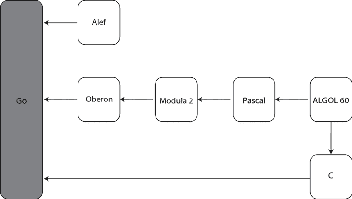
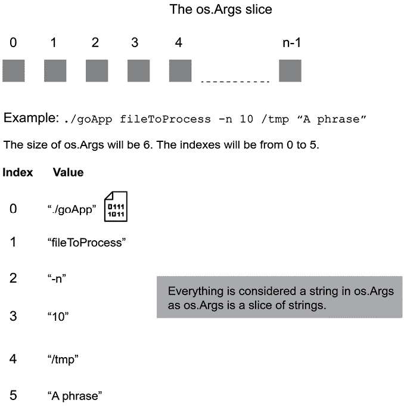

# 1

# Go 快速入门

尽管本章的名称是“快速入门”，但它不仅仅是 Go 的快速介绍，它还将成为本书其余部分的基础。本章解释了 Go 的基本知识、一些设计决策和 Go 的哲学，以便你在学习 Go 的细节之前能够了解全局。在众多内容中，我们介绍了 Go 的优点和缺点，以便你知道何时使用 Go 以及何时考虑其他替代方案。

在接下来的章节中，我们将介绍一些概念和实用工具，以便在构建`which(1)`实用工具的简化版本之前，为 Go 建立一个坚实的基础。`which(1)`是一个 UNIX 实用工具，通过搜索`PATH`环境变量的目录来定位程序文件。此外，我们还将解释如何将信息写入日志文件，因为这可以帮助你在使用 Go 开发软件时存储错误消息和警告。

在本章末尾，我们开发了一个基本的命令行实用工具，用于计算基本的统计属性。正是这个命令行实用工具，随着我们学习更多高级的 Go 特性，我们将在接下来的本书章节中对其进行改进和扩展。

本章内容如下：

+   介绍 Go

+   何时使用 Go

+   Hello World!

+   运行 Go 代码

+   你应该了解的 Go

+   在 Go 中开发`which(1)`实用工具

+   记录信息

+   开发统计应用程序

# 介绍 Go

Go 是一种开源的系统编程语言，最初作为 2009 年公开的内部 Google 项目而开发。Go 的精神之父是 Robert Griesemer、Ken Thomson 和 Rob Pike。

尽管该语言的官方名称是 Go，但它有时（错误地）被称为*Golang*。官方的原因是[`go.org/`](https://go.org/)不可用于注册，因此选择了[golang.org](https://golang.org)——然而，如今，官方的 Go 网站是[`go.dev/`](https://go.dev/)。请记住，当你通过搜索引擎查询与 Go 相关的信息时，单词*Go*通常被解释为动词；因此，你应该搜索*golang*。此外，Go 的官方 Twitter 标签是*#golang*。

让我们现在讨论 Go 的历史以及这对想学习 Go 的人意味着什么。

## Go 的历史

如前所述，Go 最初是一个内部的 Google 项目，于 2009 年公开。Griesemer、Thomson 和 Pike 设计 Go 作为一种语言，供希望构建可靠、健壮和高效软件的专业程序员使用，这种软件易于管理。他们设计 Go 时考虑到了简洁性，即使这意味着 Go 可能不会成为适合所有人或所有事物的编程语言。

下一个图显示了直接或间接影响 Go 的编程语言。例如，Go 的语法看起来像 C，而包的概念则受到了 Modula-2 的启发。



图 1.1：影响 Go 的编程语言

可交付成果是一个包含工具和标准库的编程语言。除了其语法和工具之外，Go 还提供了丰富的标准库和一个试图让您避免简单错误的类型系统，例如隐式类型转换、未使用的变量和未使用的包。Go 编译器会捕捉到这些简单错误，并在您处理它们之前拒绝编译。此外，Go 编译器还可以找到难以捕捉的错误，例如竞态条件。

如果您是第一次安装 Go，可以从访问 [`go.dev/dl/`](https://go.dev/dl/) 开始。然而，您的 UNIX 变体很可能已经有一个为 Go 编程语言准备好的安装包，因此您可能希望使用您喜欢的包管理器来获取 Go。

由于 Go 是一种可移植的编程语言，几乎所有展示的代码都可以在未经任何修改的情况下在任何现代的 Microsoft Windows、Linux 或 macOS 机器上正常工作。可能需要一些小或大的调整的 Go 代码是处理操作系统的代码。其中大部分代码在 *第七章*，*告诉 UNIX 系统做什么* 中进行了介绍。

## Go 的优势

Go 为开发者带来了一些重要的优势，首先是因为它是由真正的程序员设计和维护的。Go 也很容易学习，尤其是如果您已经熟悉 C、Python 或 Java 等编程语言。除此之外，由于其简化和优雅的语法，Go 代码看起来很舒服，这在您以编程为生并需要每天查看代码时尤其如此。Go 代码也易于阅读，这意味着您可以轻松地对现有的 Go 代码进行修改，并且它提供了对 Unicode 的原生支持。最后，Go 只保留了 25 个关键字，这使得记住该语言变得容易得多。您能用 C++ 做到这一点吗？

Go 还提供了并发能力，使用一个简单的并发模型，该模型通过 *goroutines* 和 *channels* 实现。Go 会为您管理操作系统线程，并拥有一个强大的运行时，允许您生成轻量级的工作单元（goroutines），它们通过通道相互通信。

虽然 Go 拥有丰富的标准库，但还有一些非常实用的 Go 包，例如 `cobra` 和 `viper`，这些包使得 Go 能够开发出复杂的命令行工具，如 `docker` 和 `hugo`。这一点得到了强有力的支持，因为可执行二进制文件是静态链接的，这意味着一旦生成，它们就不依赖于任何共享库，并包含了所有必需的信息。在实践中，这意味着你可以将现有的可执行文件转移到具有相同架构的不同机器上，并确信它将无任何问题地运行。

由于其简单性，Go 代码是可预测的，并且没有奇怪的副作用，尽管 Go 支持指针，但它不支持像 C 语言那样的指针算术，除非你使用 `unsafe` 包，这可能是许多错误和安全漏洞的根源。虽然 Go 不是一个面向对象编程语言，但 Go 接口非常灵活，允许你模仿一些面向对象语言的能力，如多态性、封装和组合。然而，Go 并不支持类和继承。*第五章*，*反射和接口*提供了更多关于这个主题的信息。

此外，最新的 Go 版本提供了对 *泛型* 的支持，这简化了处理多个数据类型时的代码。你可以在 *第四章*，*Go 泛型* 中了解更多关于 Go 泛型的信息。最后，Go 是一种垃圾回收语言，这意味着不需要手动内存管理。

# 何时使用 Go

虽然 Go 是一种通用编程语言，但它主要用于编写系统工具、命令行工具、网络服务和在网络上工作的软件。你可以用 Go 来教授编程，由于其简洁性、清晰的思想和原则，它是一个很好的编程语言入门选择。

Go 可以帮助你开发以下类型的应用程序：

+   专业网络服务

+   如 Kubernetes 和 Istio 这样的网络工具和服务器

+   后端系统

+   坚固的 UNIX 和 Windows 系统工具

+   与 API 一起工作的服务器和通过交换多种格式的数据（包括 JSON、XML 和 CSV）进行交互的客户端

+   WebSocket 服务器和客户端

+   gRPC（远程过程调用）服务器和客户端

+   具有多个命令、子命令和命令行参数的复杂命令行工具，如 `docker` 和 `hugo`

+   以 JSON 格式交换数据的应用程序

+   从关系型数据库、NoSQL 数据库或其他流行的数据存储系统中处理数据的应用程序

+   为你自己的编程语言编写的编译器和解释器

+   如 CockroachDB 这样的数据库系统以及 etcd 这样的键值存储

虽然 Go 是一种非常实用和高效的编程语言，但它并不完美：

+   这是一种个人偏好，而不是实际的技术缺陷：Go 没有直接和全面的支持面向对象编程，这是一种流行的编程范式。

+   虽然 goroutines 轻量级，但它们不如操作系统线程强大。根据你试图实现的应用程序，可能存在一些罕见的情况，其中 goroutines 可能不适合这项工作。Apache 网络服务器使用 `fork(2)` 创建 UNIX 进程来为其客户端提供服务——Go 不支持 `fork(2)` 的功能。然而，在大多数情况下，考虑使用 goroutines 和 channels 设计你的应用程序将解决你的问题。

+   尽管垃圾回收在大多数情况下足够快，并且对于几乎所有类型的应用程序来说，有时你需要手动处理内存分配，例如在开发操作系统或处理大量内存时想要避免碎片化——Go 无法做到这一点。在实践中，这意味着 Go 不会允许你手动进行任何内存管理。

+   Go 不提供函数式编程语言的全部功能。

+   Go 不擅长开发具有高可用性保证的系统。在这种情况下，请使用 Erlang 或 Elixir。

Go 在许多方面比其他编程语言做得更好，包括以下方面：

+   Go 编译器可以捕获大量愚蠢的错误，这些错误最终可能成为漏洞。这包括导入的 Go 包和代码中未使用的变量。

+   Go 使用的括号比 C、C++ 或 Java 少，并且没有分号，这使得 Go 源代码更易于阅读且错误更少。

+   Go 搭载了一个丰富且可靠的标准库，并且一直在不断改进。

+   Go 通过 goroutines 和 channels 提供了开箱即用的并发支持。

+   Goroutines 轻量级。你可以在任何现代机器上轻松运行数千个 goroutines，而不会出现任何性能问题。

+   与 C 语言不同，Go 将函数视为一等公民。

+   Go 代码具有向后兼容性，这意味着较新版本的 Go 编译器可以接受使用语言先前版本创建的程序，而无需任何修改。这种兼容性保证仅限于 Go 的大版本。例如，不能保证 Go 1.x 程序可以用 Go 2.x 编译。

下一个子节将描述我的个人 Go 之旅。

## 我的个人 Go 之旅

在本节中，我将告诉你我如何最终学习并使用 Go 的个人故事。我是一个 UNIX 人士，这意味着我喜欢 UNIX，并尽可能使用它。我也热爱 C 语言，曾经喜欢 C++；我为我硕士项目用 C++ 编写了一个命令行 FTP 客户端。如今，C++ 已经成为一个庞大且难以学习的编程语言。尽管 C 仍然是一个不错的编程语言，但它需要大量的代码来完成简单的任务，并且由于手动内存管理和不同数据类型之间极其灵活的转换（没有任何警告或错误消息），因此存在难以找到和纠正的错误。

因此，我过去常常使用 Perl 编写简单的命令行实用程序。然而，Perl 并不适合编写严肃的命令行工具和服务，因为它是一种脚本编程语言，并不适用于 Web 开发。

当我第一次听说 Go 语言是由 Google 开发的，并且 Rob Pike 和 Ken Thompson 都参与了其开发时，我立刻对 Go 语言产生了兴趣。

从那时起，我使用 Go 创建了与 RabbitMQ、MySQL 和 PostgreSQL 通信的 Web 服务、服务器和客户端，创建了简单的命令行实用程序，实现了时间序列数据挖掘的算法，创建了生成合成数据的实用程序等。

很快，我们将开始学习 Go 语言，以*Hello World!*作为第一个示例，但在那之前，我们将介绍`go doc`命令，该命令允许您查找有关 Go 标准库、其包及其函数的信息，以及`godoc`实用程序。

如果您尚未安装 Go，现在是安装的时候了。要安装，请访问[`go.dev/dl/`](https://go.dev/dl/)或使用您喜欢的包管理器。

## go doc 和 godoc 实用程序

Go 语言发行版附带了许多工具，可以使程序员的编程生活更加轻松。其中两个工具是`go doc`子命令和`godoc`实用程序，它们允许您在不使用互联网连接的情况下查看现有 Go 函数和包的文档。然而，如果您更喜欢在线查看 Go 文档，可以访问[`pkg.go.dev/`](https://pkg.go.dev/)。

`go doc`命令可以作为正常的命令行应用程序执行，并在终端上显示其输出，它与 UNIX 的`man(1)`命令类似，但仅针对 Go 函数和包。因此，为了查找有关`fmt`包的`Printf()`函数的信息，您应该执行以下命令：

```go
$ go doc fmt.Printf 
```

类似地，您可以通过运行以下命令来查找有关整个`fmt`包的信息：

```go
$ go doc fmt 
```

由于`godoc`默认未安装，您可能需要通过运行`go install golang.org/x/tools/cmd/godoc@latest`来安装它。`godoc`二进制文件将被安装到`~/go/bin`，除非`~/go/bin`已包含在您的`PATH`环境变量中，否则您可以通过`~/go/bin/godoc`来执行它。

`godoc`命令行应用程序启动一个本地 Web 服务器。因此，您需要一个 Web 浏览器来查看 Go 文档。

运行`godoc`需要使用`-http`参数执行`godoc`：

```go
$ ~/go/bin/godoc -http=:8001 
```

在前面的命令中，该数值为`8001`，是 HTTP 服务器将监听的端口号。由于我们省略了 IP 地址，`godoc`将监听所有网络接口。

如果您有适当的权限，可以选择任何可用的端口号。但是，请注意端口号 `0`–`1023` 是受限的，只能由 root 用户使用，因此最好避免选择这些中的一个，如果它还没有被其他进程使用，可以选择其他端口号。端口号 `8001` 通常空闲，并且经常用于本地 HTTP 服务器。

您可以在展示的命令中省略等号，并用空格字符代替。因此，以下命令与上一个命令完全等价：

```go
$ ~/go/bin/godoc -http :8001 
```

之后，您应该将您的网络浏览器指向 `http://localhost:8001/` 以获取可用的 Go 包列表并浏览它们的文档。如果没有提供 `-http` 参数，`godoc` 将监听端口号 `6060`。

如果您是第一次使用 Go，您会发现 Go 文档对于学习您想要使用的函数的参数和返回值非常有用——随着您在 Go 之旅中的进步，您将使用 Go 文档来学习您想要使用的函数和变量的详细信息。

下一节介绍了本书的第一个 Go 程序，并解释了 Go 的基本概念。

# Hello World！

以下是将 *Hello World!* 程序转换为 Go 版本。请将其键入并保存为 `hw.go`：

```go
package main
import (
    "fmt"
)
func main() {
    fmt.Println("Hello World!")
} 
```

如果您急于执行 `hw.go`，请在保存它的同一目录中键入 `go run hw.go`。该文件也可以在本书 GitHub 仓库的 `ch01` 目录中找到。

每个 Go 源代码都以包声明开始。在这种情况下，包名是 `main`，这在 Go 中有特殊含义——自主 Go 程序应使用 `main` 包。`import` 关键字允许您包含现有包的功能。在我们的例子中，我们只需要属于标准 Go 库的 `fmt` 包的一些功能，这些功能通过类似于 C 的 `printf()` 和 `scanf()` 的函数实现格式化输入和输出。如果您正在创建可执行应用程序，下一个重要的事情是一个 `main()` 函数。Go 将其视为应用程序的入口点，并以 `main` 包的 `main()` 函数中的代码开始执行应用程序。

`hw.go` 是一个独立运行的 Go 程序。两个特性使 `hw.go` 成为一个可以生成可执行二进制文件的源文件：包名应该是 `main`，以及存在 `main()` 函数——我们将在下一小节中更详细地讨论 Go 函数，但我们将更深入地了解函数和方法，这些是附加到特定数据类型上的函数，在 *第六章*，*Go 包和函数* 中。

## 函数介绍

每个 Go 函数定义都以`func`关键字开始，后面跟着其名称、签名和实现。除了具有特殊用途的`main()`函数外，你可以将其他函数命名为任何你想要的名称——有一个全局的 Go 规则也适用于函数和变量名称，并且对所有包（除了 main 包）都有效：*以小写字母开头的所有内容都被认为是私有的，并且只能在当前包中访问*。我们将在*第六章，Go 包和函数*中了解更多关于这个规则的内容。这个规则的唯一例外是包名，它可以以小写或大写字母开头。话虽如此，我并不了解以大写字母开头的 Go 包！

你现在可能会问函数是如何组织和交付的。好吧，答案是包——下一个小节将对此进行一些解释。

## 介绍包

Go 程序是有组织的包——即使是最小的 Go 程序也应该作为一个包来交付。`package`关键字帮助你定义新包的名称，你可以取任何你想要的名称，只有一个例外：如果你正在创建一个可执行的应用程序，而不仅仅是其他应用程序或包将共享的包，你应该将你的包命名为`main`。你将在*第六章，Go 包和函数*中了解更多关于开发 Go 包的内容。

包可以被其他包使用。实际上，重用现有包是一个好的实践，可以节省你编写大量代码或从头实现现有功能的时间。

`import`关键字用于将其他 Go 包导入到你的 Go 程序中，以使用它们的一些或全部功能。一个 Go 包可以是丰富的标准 Go 库的一部分，也可以来自外部来源。标准 Go 库的包通过名称导入，例如，使用`import "os"`来使用`os`包，而像`github.com/spf13/cobra`这样的外部包则使用它们的完整 URL 导入：`import "github.com/spf13/cobra"`。

# 运行 Go 代码

你现在需要知道如何执行`hw.go`或任何其他 Go 应用程序。正如将在接下来的两个小节中解释的那样，有两种方式可以执行 Go 代码：作为编译语言，使用`go build`，或者模仿脚本语言，使用`go run`。那么，让我们更深入地了解这两种运行 Go 代码的方式。

## 编译 Go 代码

要编译 Go 代码并创建一个二进制可执行文件，我们需要使用`go build`命令。`go build`为我们创建一个可分发的可执行文件。这意味着当使用`go build`时，需要额外一步来运行可执行文件。

生成的可执行文件会自动以源代码文件名（不带 `.go` 扩展名）命名。因此，由于 `hw.go` 源文件名，可执行文件将被命名为 `hw`。如果你不希望这样，`go build` 支持使用 `-o` 选项来更改生成的可执行文件的文件名和路径。例如，如果你想将可执行文件命名为 `helloWorld`，你应该执行 `go build -o helloWorld hw.go`。如果没有提供源文件，`go build` 会查找当前目录中的 `main` 包。

之后，你需要在自己的计算机上执行生成的可执行二进制文件。在我们的例子中，这意味着执行 `hw` 或 `helloWorld`。以下输出显示了这一点：

```go
$ go build hw.go
$ ./hw
Hello World! 
```

现在我们已经知道了如何编译 Go 代码，让我们继续像使用脚本语言一样使用 Go。

## 将 Go 当作脚本语言使用

`go run` 命令构建名为 Go 的包，在这个例子中是单个文件中实现的 `main` 包，创建一个临时可执行文件，执行该文件，并在完成后删除它——对我们来说，这看起来像是使用脚本语言，而 Go 编译器仍然创建二进制可执行文件。在我们的情况下，我们可以做以下操作：

```go
$ go run hw.go
Hello World! 
```

使用 `go run` 在测试代码时是一个更好的选择。然而，如果你想创建和分发可执行二进制文件，那么 `go build` 是正确的选择。

## 重要的格式化和编码规则

你应该知道，Go 有一套严格的格式化和编码规则，可以帮助开发者避免新手错误和漏洞——一旦你学会了这些规则以及 Go 的特性以及它们对代码的影响，你就可以自由地专注于代码的实际功能。此外，Go 编译器通过其表达性的错误信息和警告来帮助你遵循这些规则。最后，Go 提供了标准工具（`gofmt`），可以为你格式化代码，所以你永远不必担心它。

以下是在阅读本章时帮助你的一些重要的 Go 规则列表：

+   Go 代码以包的形式提供，你可以自由使用现有包中的功能。有一个 Go 规则说，如果你导入了一个包，你应该以某种方式使用它（调用一个函数或使用数据类型），否则编译器会报错。这个规则有一些例外，主要与初始化数据库和 TCP/IP 服务器连接的包有关，但这对现在来说并不重要。包将在 *第六章*，*Go 包和函数* 中介绍。

+   你要么使用变量，要么根本不声明它。这个规则帮助你避免诸如拼写现有变量或函数名错误这样的错误。

+   在 Go 中格式化花括号只有一种方式。

+   Go 中的代码块使用花括号嵌套，即使它们只包含一个语句或者没有任何语句。

+   Go 函数可以返回多个值。

+   您不能在不同的数据类型之间自动转换，即使它们属于同一类型。例如，您不能隐式地将整数转换为浮点数。

Go 有更多规则，但前面的规则是最重要的，它们将贯穿本书的大部分内容。您将在本章以及其他章节中看到所有这些规则的实际应用。现在，让我们考虑在 Go 中格式化花括号的唯一方法，因为这个规则适用于所有地方。

看看以下名为 `curly.go` 的 Go 程序：

```go
package main
import (
    "fmt"
)
func main() 
{
    fmt.Println("Go has strict rules for curly braces!")
} 
```

虽然看起来没问题，但如果您尝试执行它，您会感到失望，因为代码将无法编译，因此您将得到以下语法错误信息：

```go
$ go run curly.go
# command-line-arguments
./curly.go:7:6: missing function body
./curly.go:8:1: syntax error: unexpected semicolon or newline before { 
```

对于这个错误信息的官方解释是，Go 语言在许多情况下要求使用分号作为语句终止符，当编译器认为有必要时，会隐式地插入所需的分号。因此，将开括号 (`{`) 放在其自己的行上会使 Go 编译器在上一行（`func main()`）的末尾插入一个分号，这是错误信息的主要原因。正确编写上一段代码的方法如下：

```go
package main
import (
    "fmt"
)
func main() {
    fmt.Println("Go has strict rules for curly braces!")
} 
```

在了解这个全局规则之后，让我们继续介绍 Go 语言的一些重要特性。

# 您应该了解的 Go 语言知识

这个大节讨论了 Go 语言的重要和基本特性，包括变量、控制程序流程、迭代、获取用户输入和 Go 并发。我们首先讨论变量、变量声明和变量使用。

## 定义和使用变量

想象一下，您想执行基本的数学计算。在这种情况下，您需要定义变量来保存输入、中间计算和结果。

Go 提供了多种声明新变量的方式，使变量声明过程更加自然和方便。您可以使用 `var` 关键字来声明一个新变量，后跟变量名，然后是所需的数据类型（我们将在 *第二章*，*基本 Go 数据类型* 中详细介绍数据类型）。如果您愿意，可以在声明后跟 `=` 和变量的初始值。如果提供了初始值，您可以省略数据类型，编译器会为您推断它。

**这带我们来到了一个非常重要的 Go 规则：如果未给变量提供初始值，Go 编译器将自动将该变量初始化为其数据类型的零值。**

此外，还有 `:=` 符号，它可以用来代替变量声明。`:=` 通过推断其后值的类型来定义一个新变量。`:=` 的官方名称是 *短赋值语句*，在 Go 语言中非常常用，尤其是在从函数和带有 `range` 关键字的 `for` 循环中获取返回值时。

简短的赋值语句可以用作具有隐式类型的`var`声明的替代。在 Go 语言中，很少看到`var`的使用；`var`关键字主要用于声明没有初始值的全局或局部变量。前者之所以如此，是因为存在于函数代码之外的所有语句都必须以关键字开头，例如`func`或`var`。

这意味着简短的赋值语句不能在函数环境之外使用，因为那里不允许这样做。最后，当你想明确指定数据类型时，你可能需要使用`var`。例如，当你想让变量的类型为`int8`或`int32`而不是默认的`int`时。

## 常量

存在一些值，例如数学常数π，是不可变的。在这种情况下，我们可以使用`const`来声明这样的值。常量的声明方式与变量相同，但一旦声明后就不能更改。

常量支持的数据类型包括字符、字符串、布尔值以及所有数值数据类型。关于 Go 语言数据类型的更多信息，请参阅*第二章*，*基本 Go 数据类型*。

## 全局变量

全局变量是在函数实现之外定义的变量。*全局变量*可以在包的任何地方访问，而无需显式地将它们传递给函数，并且除非它们被定义为常量，否则可以使用`const`关键字来更改它们。

虽然你可以使用`var`或`:=`来声明局部变量，但只有`const`（当变量的值不会改变时）和`var`适用于全局变量。

## 打印变量

程序倾向于显示信息，这意味着它们需要打印数据或将数据发送到其他软件进行存储或处理。要在屏幕上打印数据，Go 语言使用`fmt`包的功能。如果你想让 Go 语言处理打印，那么你可能想使用`fmt.Println()`函数。然而，有时你可能希望完全控制数据的打印方式。在这种情况下，你可能想使用`fmt.Printf()`。

`fmt.Printf()`类似于 C 语言的`printf()`函数，需要使用控制序列来指定将要打印的变量的数据类型。此外，`fmt.Printf()`函数允许你格式化生成的输出，这对于浮点值尤其方便，因为它允许你指定输出中要显示的数字（`%.2f`显示浮点值小数点后的两位数字）。最后，`\n`字符用于打印换行符，因此创建新行，因为`fmt.Printf()`不会自动插入换行符——这与自动插入换行符的`fmt.Println()`不同，因此其名称末尾有`ln`。

以下程序说明了你可以如何声明新变量，如何使用它们，以及如何打印它们——将以下代码输入一个名为`variables.go`的纯文本文件中：

```go
package main
import (
    "fmt"
"math"
)
var Global int = 1234
var AnotherGlobal = -5678
func main() {
    var j int
    i := Global + AnotherGlobal
    fmt.Println("Initial j value:", j)
    j = Global
    // math.Abs() requires a float64 parameter
// so we type cast it appropriately
    k := math.Abs(float64(AnotherGlobal))
    fmt.Printf("Global=%d, i=%d, j=%d k=%.2f.\n", Global, i, j, k)
} 
```

个人来说，我更喜欢通过以下方式使全局变量突出：要么以大写字母开头，要么使用全部大写字母。正如你将在*第六章*，*Go 包和函数*中学习的，变量名首字符的大小写有特殊含义，在 Go 中会改变其可见性。因此，这仅适用于`main`包。

上述程序包含以下内容：

+   一个名为`Global`的全局`int`变量。

+   第二个名为`AnotherGlobal`的全局变量——Go 自动从其值推断其数据类型，在这种情况下是一个整数。

+   一个名为`j`的局部变量，其类型为`int`，正如你将在下一章学习的，这是一个特殊的数据类型。`j`没有初始值，这意味着 Go 自动将其数据类型的零值分配给它，在这种情况下是`0`。

+   另一个名为`i`的局部变量——Go 从其值推断其数据类型。由于它是两个`int`值的和，它也是一个`int`。

+   由于`math.Abs()`需要一个`float64`参数，你不能将`AnotherGlobal`传递给它，因为`AnotherGlobal`是一个`int`变量。`float64()`类型转换将`AnotherGlobal`的值转换为`float64`。请注意，`AnotherGlobal`仍然具有`int`数据类型。

+   最后，`fmt.Printf()`格式化和打印输出。

运行`variables.go`产生以下输出：

```go
Initial j value: 0
Global=1234, i=-4444, j=1234 k=5678.00. 
```

这个例子演示了另一个重要的 Go 规则，这个规则之前也提到过：**Go 不允许像 C 那样的隐式数据转换**。正如在`variables.go`中展示的，期望（需要）`float64`值的`math.Abs()`函数不能与`int`值一起工作，即使这个特定的转换是直接且无错误的。Go 编译器拒绝编译这样的语句。你应该使用`float64()`显式地将`int`值转换为`float64`，以便事情能够正常工作。

对于不直接（例如，`string`到`int`）的转换，存在专门的函数，允许你捕获转换中的问题，以函数返回的错误变量形式。

## 控制程序流程

到目前为止，我们已经看到了 Go 变量，但我们是如何根据变量的值或其他条件来改变 Go 程序的流程的呢？Go 支持`if/else`和`switch`控制结构。这两种控制结构在大多数现代编程语言中都可以找到，所以如果你已经使用过其他编程语言进行编程，你应该已经熟悉了`if`和`switch`语句。`if`语句不需要括号来嵌入需要检查的条件，因为 Go 通常不使用括号。正如预期的那样，`if`支持`else`和`else if`语句。

为了演示 `if` 的用法，让我们使用 Go 中几乎无处不在的一个非常常见的模式。这个模式表明，如果一个函数返回的错误变量的值为 `nil`，那么函数执行就没有问题。否则，某个地方存在错误条件，需要特别处理。这个模式通常如下实现：

```go
err := anyFunctionCall()
if err != nil {
    // Do something if there is an error
} 
```

`err` 是一个变量，用于存储函数返回的错误值，`!=` 表示 `err` 变量的值不等于 `nil`。你将在 Go 程序中多次看到类似的代码。

以 `//` 开头的行是单行注释。如果你在一行的中间放置 `//`，那么从 `//` 到行尾的所有内容都被视为注释。如果 `//` 在字符串值内部，则不适用此规则。

`switch` 语句有两种不同的形式。在第一种形式中，`switch` 语句有一个要评估的表达式，而在第二种形式中，`switch` 语句没有要评估的表达式。在这种情况下，每个 `case` 语句都会评估表达式，这增加了 `switch` 的灵活性。你从 `switch` 获得的主要好处是，当正确使用时，它可以简化复杂且难以阅读的 `if-else` 块。

以下代码展示了 `if` 和 `switch` 的用法，该代码旨在处理作为命令行参数给出的用户输入——请将其输入并保存为 `control.go`。为了学习目的，我们将 `control.go` 的代码分块呈现，以便更好地解释它：

```go
package main
import (
    "fmt"
"os"
"strconv"
) 
```

这一部分包含预期的前言，其中包含了导入的包。`main()` 函数的实现紧接着开始：

```go
func main() {
    if len(os.Args) != 2 {
        fmt.Println("Please provide a command line argument")
        return
    }
    argument := os.Args[1] 
```

这部分程序确保在继续之前，你有一个要处理的单个命令行参数，它可以通过 `os.Args[1]` 访问。我们将在稍后更详细地介绍这一点，但你也可以参考 *图 1.2* 了解更多关于 `os.Args` 切片的信息：

```go
 // With expression after switch
switch argument {
    case "0":
        fmt.Println("Zero!")
    case "1":
        fmt.Println("One!")
    case "2", "3", "4":
        fmt.Println("2 or 3 or 4")
        fallthrough
default:
        fmt.Println("Value:", argument)
    } 
```

在这里，你看到的是一个包含四个分支的 `switch` 块。前三个需要精确的字符串匹配，最后一个匹配所有其他内容。`case` 语句的顺序很重要，因为只有第一个匹配会被执行。`fallthrough` 关键字告诉 Go，在执行完这个分支后，它将继续执行下一个分支，在这个例子中是默认分支：

```go
 value, err := strconv.Atoi(argument)
    if err != nil {
        fmt.Println("Cannot convert to int:", argument)
        return
    } 
```

由于命令行参数被初始化为字符串值，我们需要使用单独的调用将用户输入转换为整数值，在这个例子中是调用 `strconv.Atoi()`。如果 `err` 变量的值为 `nil`，则转换成功，我们可以继续。否则，将在屏幕上打印错误消息，程序退出。

以下代码展示了 `switch` 的第二种形式，其中条件在每一个分支处被评估：

```go
 // No expression after switch
switch {
    case value == 0:
        fmt.Println("Zero!")
    case value > 0:
        fmt.Println("Positive integer")
    case value < 0:
        fmt.Println("Negative integer")
    default:
        fmt.Println("This should not happen:", value)
    }
} 
```

这为你提供了更多的灵活性，但在阅读代码时需要更多的思考。在这种情况下，默认分支不应该被执行，主要是因为任何有效的整数值都会被其他三个分支捕获。尽管如此，默认分支仍然存在，这是一个好的实践，因为它可以捕获意外的值。

运行 `control.go` 生成以下输出：

```go
$ go run control.go 10
Value: 10
Positive integer
$ go run control.go 0
Zero!
Zero! 
```

`control.go` 中的两个 switch 块各自创建一行输出。

## 使用 for 循环和 range 迭代

这一部分完全是关于 Go 中的迭代。Go 支持使用 `for` 循环以及 `range` 关键字来迭代数组、切片和（如你将在 *第三章*，*复合数据类型*）中看到的映射的所有元素，而不需要知道数据结构的大小。

Go 简单性的一个例子是，Go 只提供了对 `for` 关键字的支持，而不是包括对 `while` 循环的直接支持。然而，根据你如何编写 `for` 循环，它可以作为 `while` 循环或无限循环运行。此外，当与 `range` 关键字结合使用时，`for` 循环可以实现 JavaScript 的 `forEach` 函数的功能。

即使 `for` 循环中只有一个语句或没有语句，你也必须将其括在大括号内。

你也可以使用变量和条件创建 `for` 循环。`for` 循环可以使用 `break` 关键字退出，你可以使用 `continue` 关键字跳过当前迭代。

以下程序说明了 `for` 循环及其与 `range` 关键字结合使用时的用法——将其键入并保存为 `forLoops.go` 以在之后执行：

```go
package main
import "fmt"
func main() {
    // Traditional for loop
for i := 0; i < 10; i++ {
        fmt.Print(i*i, " ")
    }
    fmt.Println()
} 
```

之前的代码演示了一个传统的 `for` 循环，它使用了一个名为 `i` 的局部变量。这将在屏幕上打印 `0`、`1`、`2`、`3`、`4`、`5`、`6`、`7`、`8` 和 `9` 的平方。因为 `10` 的平方不满足 `10 < 10` 的条件，所以它没有被计算和打印。

以下代码是典型的 Go 代码，它产生的输出与之前的 `for` 循环相同：

```go
 i := 0
for ok := true; ok; ok = (i != 10) {
        fmt.Print(i*i, " ")
        i++
    }
    fmt.Println() 
```

你可能会用到它，但它有时很难阅读，尤其是对于刚接触 Go 的人来说。以下代码展示了如何使用 `for` 循环来模拟不支持直接使用的 `while` 循环：

```go
 // For loop used as while loop
    i = 0
for {
        if i == 10 {
            break
        }
        fmt.Print(i*i, " ")
        i++
    }
    fmt.Println() 
```

`if` 条件中的 `break` 关键字提前退出循环并充当循环退出条件。如果没有将在某个时刻满足的退出条件以及 `break` 关键字，`for` 循环将永远不会结束。

最后，给定一个切片，你可以将其视为一个可调整大小的数组，命名为 `aSlice`，你可以通过 `range` 来迭代其所有元素，`range` 返回两个有序值：**切片中当前元素的索引及其值**。如果你想忽略这两个返回值中的任何一个，这里不是这种情况，你可以在想要忽略的值的位置使用 `_`。如果你只需要索引，你可以完全省略 `range` 的第二个值而不使用 `_`：

```go
 // This is a slice but range also works with arrays
    aSlice := []int{-1, 2, 1, -1, 2, -2}
    for i, v := range aSlice {
        fmt.Println("index:", i, "value: ", v)
    } 
```

如果你运行 `forLoops.go`，你会得到以下输出：

```go
$ go run forLoops.go
0 1 4 9 16 25 36 49 64 81
0 1 4 9 16 25 36 49 64 81
0 1 4 9 16 25 36 49 64 81
index: 0 value:  -1
index: 1 value:  2
index: 2 value:  1
index: 3 value:  -1
index: 4 value:  2
index: 5 value:  -2 
```

之前的输出说明前三个 `for` 循环是等效的，因此产生相同的输出。最后六行显示了在 `aSlice` 中找到的每个元素的索引和值。

现在我们已经了解了 `for` 循环，让我们看看如何获取用户输入。

## 获取用户输入

获取用户输入是大多数程序的重要部分。本节介绍了两种获取用户输入的方法，即从标准输入读取和使用程序的命令行参数。

## 从标准输入读取

`fmt.Scanln()` 函数可以在程序运行时帮助您读取用户输入并将其存储到字符串变量中，该变量作为指针传递给 `fmt.Scanln()`。`fmt` 包包含从控制台（`os.Stdin`）、文件或参数列表中读取用户输入的附加函数。

`fmt.Scanln()` 函数很少用于获取用户输入。通常，用户输入是从命令行参数或外部文件中读取的。然而，交互式命令行应用程序需要使用 `fmt.Scanln()`。

以下代码演示了从标准输入读取——将其键入并保存为 `input.go`：

```go
package main
import (
    "fmt"
)
func main() {
    // Get User Input
    fmt.Printf("Please give me your name: ")
    var name string
    fmt.Scanln(&name)
    fmt.Println("Your name is", name)
} 
```

在等待用户输入时，让用户知道他们需要提供的信息类型是很好的，这就是 `fmt.Printf()` 调用的目的。不使用 `fmt.Println()` 的原因是因为 `fmt.Println()` 会自动在输出末尾添加换行符，而这不是我们想要的。

执行 `input.go` 生成以下类型的输出和用户交互：

```go
$ go run input.go
Please give me your name: Mihalis
Your name is Mihalis 
```

## 处理命令行参数

虽然在需要时输入用户输入可能看起来是个好主意，但这通常不是真实软件的工作方式。通常，用户输入是以命令行参数的形式提供给可执行文件的。默认情况下，Go 中的命令行参数存储在 `os.Args` 切片中。

标准的 Go 库还提供了 `flag` 包来解析命令行参数，但有一些更好、更强大的替代方案。

下面的图示显示了 Go 中命令行参数的工作方式，这与 C 编程语言相同。重要的是要知道 `os.Args` 切片是由 Go 正确初始化的，并且在引用时对程序可用。`os.Args` 切片包含 `string` 类型的值：



图 1.2：os.Args 切片的工作方式

存储在 `os.Args` 切片中的第一个命令行参数始终是可执行文件的文件路径。如果您使用 `go run`，您将获得一个临时名称和路径；否则，它将是用户提供的可执行文件路径。其余的命令行参数是可执行文件名称之后的参数——各种命令行参数自动由空格字符分隔，除非它们包含在双引号或单引号内；这取决于操作系统。

下面的代码展示了`os.Args`的使用，目的是在忽略无效输入（如字符和字符串）的情况下找到输入的最小和最大数值。将代码输入并保存为`cla.go`：

```go
package main
import (
    "fmt"
"os"
"strconv"
) 
```

如预期，`cla.go`以它的前言开始。`fmt`包用于打印输出，而`os`包是必需的，因为`os.Args`是其一部分。最后，`strconv`包包含将字符串转换为数值的函数。接下来，我们确保我们至少有一个命令行参数：

```go
func main() {
    arguments := os.Args
    if len(arguments) == 1 {
        fmt.Println("Need one or more arguments!")
        return
    } 
```

记住，`os.Args`中的第一个元素总是可执行文件的路径，所以`os.Args`永远不会完全为空。接下来，程序以与之前示例中相同的方式检查错误。你将在*第二章*，*基本 Go 数据类型*中了解更多关于错误和错误处理的内容。

```go
 var min, max float64
var initialized = 0
for i := 1; i < len(arguments); i++ {
        n, err := strconv.ParseFloat(arguments[i], 64)
        if err != nil {
            continue
        } 
```

在这个情况下，我们使用`strconv.ParseFloat()`返回的`error`变量来确保对`strconv.ParseFloat()`的调用是成功的，并且有一个有效的数值可以处理。否则，我们应该继续到下一个命令行参数。

使用`for`循环遍历所有可用的命令行参数（除了第一个，它使用索引值`0`）。这是处理所有命令行参数的另一种流行技术。

以下代码用于在处理第一个有效命令行参数后正确初始化`min`和`max`变量的值：

```go
 if initialized == 0 {
            min = n
            max = n
            initialized = 1
continue
        } 
```

我们使用`initialized == 0`来测试这是否是第一个有效的命令行参数。如果是这种情况，我们处理第一个命令行参数并将`min`和`max`变量初始化为其值。

下面的代码检查当前值是否是新的最小值或最大值——这是程序逻辑实现的地方：

```go
 if n < min {
            min = n
        }
        if n > max {
            max = n
        }
    }
    fmt.Println("Min:", min)
    fmt.Println("Max:", max)
} 
```

程序的最后部分是关于打印你的发现，即所有有效命令行参数的最小和最大数值。从`cla.go`得到的输出取决于其输入：

```go
$ go run cla.go a b 2 -1
Min: -1
Max: 2 
```

在这种情况下，`a`和`b`是无效的，唯一有效的输入是`-1`和`2`，分别是最小值和最大值：

```go
$ go run cla.go a 0 b -1.2 10.32
Min: -1.2
Max: 10.32 
```

在这种情况下，`a`和`b`是无效输入，因此被忽略：

```go
$ go run cla.go
Need one or more arguments! 
```

在最后一种情况下，由于`cla.go`没有要处理的输入，它将打印一条帮助信息。如果你不带有效输入值执行程序，例如，`go run cla.go a b c`，那么`Min`和`Max`的值都将为零。

下一个子节展示了使用错误变量区分不同数据类型的技术。

## 使用错误变量来区分输入类型

现在，让我向您展示一种使用误差变量来区分各种用户输入的技术。为了使这项技术生效，您应该从更具体的案例逐步过渡到更通用的案例。如果我们谈论数值，您应该首先检查一个字符串是否是有效的整数，然后再检查相同的字符串是否是浮点数值，因为每个有效的整数也是有效的浮点数值。

程序的第一部分，保存为 `process.go`，如下所示：

```go
package main
import (
    "fmt"
"os"
"strconv"
)
func main() {
    arguments := os.Args
    if len(arguments) == 1 {
        fmt.Println("Not enough arguments")
        return
    } 
```

之前的代码包含了序言部分以及将命令行参数存储在 `arguments` 变量中的部分。

接下来的部分是我们开始检查输入有效性的地方：

```go
 var total, nInts, nFloats int
    invalid := make([]string, 0)
    for _, k := range arguments[1:] {
        // Is it an integer?
        _, err := strconv.Atoi(k)
        if err == nil {
            total++
            nInts++
            continue
        } 
```

首先，我们创建三个变量来记录检查的总有效值数、找到的总整数值数和找到的总浮点数值数，分别。`invalid` 变量，它是一个字符串切片，用于存储所有非数值。

再次强调，我们需要遍历除了第一个参数之外的所有命令行参数，因为第一个参数的索引值为 `0`，这是可执行文件的路径。我们忽略可执行文件的路径，使用 `arguments[1:]` 而不是 `arguments`，选择切片的连续部分将在下一章讨论。

`strconv.Atoi()` 的调用确定我们是否正在处理一个有效的 `int` 值。如果是这样，我们将增加 `total` 和 `nInts` 计数器：

```go
 // Is it a float
        _, err = strconv.ParseFloat(k, 64)
        if err == nil {
            total++
            nFloats++
            continue
        } 
```

同样，如果检查的字符串代表一个有效的浮点数值，`strconv.ParseFloat()` 的调用将会成功，程序将更新相关的计数器。最后，如果一个值不是数值，它将通过调用 `append()` 追加到 `invalid` 切片中：

```go
 // Then it is invalid
        invalid = append(invalid, k)
    } 
```

程序的最后部分如下：

```go
 fmt.Println("#read:", total, "#ints:", nInts, "#floats:", nFloats)
    if len(invalid) > total {
        fmt.Println("Too much invalid input:", len(invalid))
        for _, s := range invalid {
            fmt.Println(s)
        }
    }
} 
```

这里展示的额外代码会在您的无效输入多于有效输入时发出警告（`len(invalid) > total`）。这是在应用程序中保持意外输入的常见做法。

运行 `process.go` 会产生以下类型的输出：

```go
$ go run process.go 1 2 3
#read: 3 #ints: 3 #floats: 0 
```

在这种情况下，我们处理了 1、2 和 3，这些都是有效的整数值：

```go
$ go run process.go 1 2.1 a    
#read: 2 #ints: 1 #floats: 1 
```

在这种情况下，我们有一个有效的整数，1，一个浮点数值，2.1，以及一个无效的值，a：

```go
$ go run process.go a 1 b
#read: 1 #ints: 1 #floats: 0
Too much invalid input: 2
a
b 
```

如果无效输入多于有效输入，那么 `process.go` 将打印额外的错误信息。

下一个子节讨论了 Go 的并发模型。

## 理解 Go 并发模型

本节是 Go 并发模型的快速介绍。Go 并发模型是通过 *goroutines* 和 *channels* 实现的。goroutine 是最小的可执行 Go 实体。要创建一个新的 goroutine，您必须使用 `go` 关键字后跟一个预定义的函数或匿名函数——这两种方法在 Go 中是等效的。

`go` 关键字仅与函数或匿名函数一起使用。

Go 中的 channel 是一种机制，它允许 goroutines 通信和交换数据。如果您是业余程序员或第一次听说 goroutines 和 channels，请不要慌张。goroutines 和 channels，以及管道和 goroutines 之间的数据共享，将在 *第八章*，*Go 并发* 中更详细地解释。

虽然创建 goroutines 很容易，但在处理并发编程时还有其他困难，包括 goroutine 同步和 goroutines 之间的数据共享——这是 Go 在运行 goroutines 时使用全局状态来避免副作用的一种机制。由于 `main()` 也是一个 goroutine，您不希望 `main()` 在其他程序 goroutine 完成之前结束，因为一旦 `main()` 退出，整个程序以及任何尚未完成的 goroutine 都将终止。尽管 goroutines 不能直接相互通信，但它们可以共享内存。好事是，有各种技术可以让 `main()` 函数等待 goroutines 通过 channels 交换数据，或者在 Go 中较少使用共享内存。

将以下 Go 程序，该程序使用 `time.Sleep()` 调用来同步 goroutines（这不是同步 goroutines 的正确方法——我们将在 *第八章*，*Go 并发* 中讨论同步 goroutines 的正确方法），输入您喜欢的编辑器中，并将其保存为 `goRoutines.go`：

```go
package main
import (
    "fmt"
"time"
)
func myPrint(start, finish int) {
    for i := start; i <= finish; i++ {
        fmt.Print(i, " ")
    }
    fmt.Println()
    time.Sleep(100 * time.Microsecond)
}
func main() {
    for i := 0; i < 4; i++ {
        go myPrint(i, 5)
    }
    time.Sleep(time.Second)
} 
```

之前天真实现的示例创建了四个 goroutines，并使用 `myPrint()` 函数在屏幕上打印一些值——使用 `go` 关键字创建 goroutines。运行 `goRoutines.go` 生成以下输出：

```go
$ go run goRoutines.go
2 3 4 5
0 4 1 2 3 1 2 3 4 4 5
5
3 4 5
5 
```

然而，如果您多次运行它，您很可能会每次得到不同的输出：

```go
1 2 3 4 5 
4 2 5 3 4 5 
3 0 1 2 3 4 5 
4 5 
```

这是因为 **goroutines 以随机顺序初始化并随机顺序启动**。Go 调度器负责 goroutines 的执行，就像操作系统调度器负责操作系统线程的执行一样。*第八章*，*Go 并发* 详细讨论了 Go 并发，并使用 `sync.WaitGroup` 变量解决了随机性问题——然而，请记住，Go 并发无处不在，这也是在此处包含此部分的主要原因。因此，由于一些编译器生成的错误消息讨论了 goroutines，您不应认为这些 goroutines 是您创建的。

下一个部分将展示一个实际示例，该示例涉及开发 Go 版本的 `which(1)` 工具，该工具在当前用户的 `PATH` 环境值中搜索可执行文件。

# 在 Go 中开发 which(1) 工具

Go 可以通过一系列包与您的操作系统交互。通过尝试实现传统 UNIX 实用程序简单版本来学习一门新编程语言是一个好方法——一般来说，学习一门编程语言的唯一有效方法是大量使用该语言编写代码。在本节中，您将看到`which(1)`实用程序的 Go 版本，这将帮助您了解 Go 如何与底层操作系统交互以及如何读取环境变量。

所展示的代码，将实现`which(1)`的功能，可以分为三个逻辑部分。第一部分是关于读取输入参数，即实用程序将要搜索的可执行文件名称。第二部分是关于读取存储在`PATH`环境变量中的值，将其分割，并遍历`PATH`变量的目录。第三部分是在这些目录中寻找所需的二进制文件，并确定是否可以找到它，它是否是一个常规文件，以及它是否是一个可执行文件。如果找到了所需的可执行文件，程序将借助`return`语句终止。否则，它将在`for`循环结束后，`main()`函数退出后终止。

所展示的源文件名为`which.go`，位于书籍 GitHub 仓库的`ch01`目录下。现在，让我们看看代码，从通常包括包名、`import`语句和其他全局定义的逻辑前言开始：

```go
package main
import (
    "fmt"
"os"
"path/filepath"
) 
```

`fmt`包用于在屏幕上打印，`os`包用于与底层操作系统交互，而`path/filepath`包用于处理读取为长字符串的`PATH`变量内容。

实用程序的第二个逻辑部分如下：

```go
func main() {
    arguments := os.Args
    if len(arguments) == 1 {
        fmt.Println("Please provide an argument!")
        return
    }
    file := arguments[1]
    path := os.Getenv("PATH")
    pathSplit := filepath.SplitList(path)
    for _, directory := range pathSplit { 
```

首先，我们读取程序的命令行参数（`os.Args`），并将第一个命令行参数保存到`file`变量中。然后，我们获取`PATH`环境变量的内容，并使用`filepath.SplitList()`进行分割，它提供了一种分离路径列表的便携方式。最后，我们使用`range`和`for`循环遍历`PATH`变量的所有目录，因为`filepath.SplitList()`返回一个切片。

实用程序的其他部分包含以下代码：

```go
 fullPath := filepath.Join(directory, file)
        // Does it exist?
        fileInfo, err := os.Stat(fullPath)
        if err != nil {
            continue
        }
        mode := fileInfo.Mode()
        // Is it a regular file?
if !mode.IsRegular() {
            continue
        }
        // Is it executable?
if mode&0111 != 0 {
            fmt.Println(fullPath)
            return
        }
    }
} 
```

我们使用`filepath.Join()`构建要检查的完整路径，它用于使用特定于操作系统的分隔符连接路径的不同部分——这使得`filepath.Join()`能够在所有支持的操作系统上工作。在这一部分，我们还获取有关文件的一些更底层的信息——请记住，UNIX 将一切视为文件，这意味着我们想要确保我们正在处理的是一个既是常规文件又是可执行文件的文件。

执行`which.go`会生成以下类型的输出：

```go
$ go run which.go which
/usr/bin/which
$ go run which.go doesNotExist 
```

最后一条命令找不到 `doesNotExist` 可执行文件——根据 UNIX 哲学和 UNIX 管道的工作方式，如果实用工具没有要说的，它们就不会在屏幕上生成输出。

虽然在屏幕上打印错误信息很有用，但有时你需要将所有错误信息集中在一起，以便在方便的时候能够搜索它们。在这种情况下，你需要使用一个或多个日志文件。

下一节将讨论 Go 语言的登录操作。

# 日志信息

所有 UNIX 系统都有自己的日志文件，用于记录运行的服务和程序产生的日志信息。通常，UNIX 系统的大多数系统日志文件都可以在 `/var/log` 目录下找到。然而，许多流行服务的日志文件，如 Apache 和 Nginx，可能位于其他位置，这取决于它们的配置。

在日志文件中记录和存储日志信息是检查软件中的数据和信息的异步方法，无论是在本地、中央日志服务器，还是使用 Elasticsearch、Beats 和 Grafana Loki 等服务器软件。

通常来说，使用日志文件来记录一些信息被认为比在屏幕上输出相同内容是一种更好的实践，原因有两个。首先，因为输出不会丢失，因为它被存储在文件中；其次，因为你可以使用 UNIX 工具，如 `grep(1)`、`awk(1)` 和 `sed(1)` 来搜索和处理日志文件，而这些操作在终端窗口打印消息时是无法完成的。然而，写入日志文件并不总是最佳方法，主要是因为许多服务作为 Docker 镜像运行，当 Docker 镜像停止时，它们自己的日志文件也会丢失。

由于我们通常通过 `systemd` 运行我们的服务，程序应该将日志记录到 `stdout`，这样 `systemd` 就可以将日志数据放入日志中。[`12factor.net/logs`](https://12factor.net/logs) 提供了有关应用程序日志的更多信息。此外，在云原生应用程序中，我们被鼓励简单地记录到 `stderr`，并让容器系统将 `stderr` 流重定向到所需的目的地。

UNIX 日志服务支持两个名为 *日志级别* 和 *日志设施* 的属性。日志级别是一个指定日志条目严重性的值。有各种日志级别，包括 `debug`、`info`、`notice`、`warning`、`err`、`crit`、`alert` 和 `emerg`，按照严重性递减的顺序。标准 Go 库的 `log` 包不支持与日志级别一起工作。日志设施类似于用于记录信息的类别。日志设施部分的值可以是 `auth`、`authpriv`、`cron`、`daemon`、`kern`、`lpr`、`mail`、`mark`、`news`、`syslog`、`user`、`UUCP`、`local0`、`local1`、`local2`、`local3`、`local4`、`local5`、`local6` 或 `local7` 之一，并且定义在 `/etc/syslog.conf`、`/etc/rsyslog.conf` 或根据在 UNIX 机器上用于系统日志的服务器进程的其他适当文件中。这意味着如果日志设施没有正确定义，它将不会被处理；因此，您发送给它的日志消息可能会被忽略，从而丢失。

`log` 包将日志消息发送到标准错误。`log` 包的一部分是 `log/syslog` 包，它允许您将日志消息发送到您的机器上的 syslog 服务器。尽管默认情况下日志写入标准错误，但使用 `log.SetOutput()` 会修改这种行为。用于发送日志数据的函数列表包括 `log.Printf()`、`log.Print()`、`log.Println()`、`log.Fatalf()`、`log.Fatalln()`、`log.Panic()`、`log.Panicln()` 和 `log.Panicf()`。

日志记录是针对应用程序代码，而不是库代码。如果您正在开发库，请不要在其中添加日志记录。

为了将日志写入系统日志，您需要使用适当的参数调用 `syslog.New()` 函数。将日志写入主系统日志文件与使用 `syslog.LOG_SYSLOG` 选项调用 `syslog.New()` 一样简单。之后，您需要告诉您的 Go 程序所有日志信息都发送到新的日志记录器——这是通过调用 `log.SetOutput()` 函数实现的。这个过程在以下代码中得到了说明——将其输入您最喜欢的纯文本编辑器并保存为 `systemLog.go`：

```go
package main
import (
    "log"
"log/syslog"
)
func main() {
    sysLog, err := syslog.New(syslog.LOG_SYSLOG, "systemLog.go")
    if err != nil {
        log.Println(err)
        return
    } else {
        log.SetOutput(sysLog)
        log.Print("Everything is fine!")
    }
} 
```

在调用 `log.SetOutput()` 之后，所有日志信息都发送到 `syslog` 日志变量，该变量将其发送到 `syslog.LOG_SYSLOG`。来自该程序的日志条目的自定义文本作为 `syslog.New()` 调用的第二个参数指定。

通常，我们希望将日志数据存储在用户定义的文件中，因为它们将相关信息分组，这使得它们更容易处理和检查。

运行 `systemLog.go` 不会生成任何输出。然而，如果您在 Linux 机器上执行 `journalctl -xe`，您可以看到如下条目：

```go
Jun 08 20:46:05 thinkpad systemLog.go[4412]: 2023/06/08 20:46:05 Everything is fine!
Jun 08 20:46:51 thinkpad systemLog.go[4822]: 2023/06/08 20:46:51 Everything is fine! 
```

您自己的操作系统的输出可能略有不同，但基本思想是相同的。

坏事情总是会发生，即使是好人好软件也会遇到。所以下一个小节将介绍 Go 处理不良情况的方式。

## log.Fatal() 和 log.Panic()

当发生错误并且你只想在报告了这种糟糕的情况后尽快退出程序时，使用`log.Fatal()`函数。`log.Fatal()`调用在打印错误消息后终止 Go 程序在`log.Fatal()`被调用的位置。在大多数情况下，这个自定义错误消息可以是“参数不足”、“无法访问文件”或类似的内容。此外，它返回一个非零退出代码，在 UNIX 中表示错误。

有时候，一个程序即将永久失败，而你希望尽可能多地了解失败的信息——`log.Panic()`暗示了一些真正意外且未知的情况已经发生，例如无法找到之前访问过的文件或磁盘空间不足。类似于`log.Fatal()`函数，`log.Panic()`打印一条自定义消息并立即终止 Go 程序。

请记住，`log.Panic()`等同于调用`log.Print()`，然后调用`panic()`。这是一个内置函数，它会停止当前函数的执行并开始恐慌。之后，它返回到调用函数。相反，`log.Fatal()`调用`log.Print()`然后`os.Exit(1)`，这是一种立即终止当前程序的方式。`log.Fatal()`和`log.Panic()`都在`logs.go`文件中进行了说明，该文件包含以下 Go 代码：

```go
package main
import (
    "log"
"os"
)
func main() {
    if len(os.Args) != 1 {
        log.Fatal("Fatal: Hello World!")
    }
    log.Panic("Panic: Hello World!")
} 
```

如果你没有提供任何命令行参数就调用`logs.go`，它将调用`log.Panic()`。否则，它将调用`log.Fatal()`。这在一个 Arch Linux 系统的以下输出中得到了说明：

```go
$ go run logs.go
2023/06/08 20:48:42 Panic: Hello World!
panic: Panic: Hello World!
goroutine 1 [running]:
log.Panic({0xc000104f60?, 0x0?, 0x0?})
    /usr/lib/go/src/log/log.go:384 +0x65
main.main()
    /home/mtsouk/code/mGo4th/ch01/logs.go:12 +0x85
exit status 2
$ go run logs.go 1
2023/06/08 20:48:59 Fatal: Hello World!
exit status 1 
```

因此，`log.Panic()`的输出包括额外的低级信息，希望这些信息能帮助你解决在 Go 代码中出现的困难情况。

请记住，这两个函数都会突然终止程序，这可能不是用户想要的。因此，它们不是结束程序的最佳方式。然而，它们在报告真正糟糕的错误条件或意外情况时可能很有用。两个这样的例子是当程序无法保存其数据或配置文件找不到时。

下一个小节是关于将日志写入自定义日志文件。

## 将日志写入自定义日志文件

大多数情况下，尤其是在将应用程序和服务部署到生产环境时，你需要将你的日志数据写入你选择的日志文件。这可能出于许多原因，包括在不干扰系统日志文件的情况下写入调试数据，或者将你的日志数据与系统日志分开，以便将其传输或存储在数据库或软件中，如 Elasticsearch。本小节将教你如何写入通常针对特定应用程序的自定义日志文件。

写入文件以及文件输入输出都在*第七章*，*告诉 UNIX 系统做什么*中进行了介绍——然而，在调试 Go 代码时将信息保存到文件中非常有用，这就是为什么它被包含在第一章中的原因。

使用的日志文件路径（`mGo.log`）存储在一个名为 `LOGFILE` 的变量中——这是通过使用 `os.TempDir()` 函数创建的，该函数返回当前操作系统用于临时文件的默认目录，以防止在出现错误时文件系统变满。

此外，在此阶段，这将让您免于需要以 root 权限执行 `customLog.go` 并将不必要的文件放入宝贵的系统目录中。

输入以下代码并将其保存为 `customLog.go`：

```go
package main
import (
    "fmt"
"log"
"os"
"path"
)
func main() {
    LOGFILE := path.Join(os.TempDir(), "mGo.log")
    fmt.Println(LOGFILE)
    f, err := os.OpenFile(LOGFILE, os.O_APPEND|os.O_CREATE|os.O_WRONLY, 0644)
// The call to os.OpenFile() creates the log file for writing, 
// if it does not already exist, or opens it for writing 
// by appending new data at the end of it (os.O_APPEND)
if err != nil {
        fmt.Println(err)
        return
    }
    defer f.Close() 
```

`defer` 关键字告诉 Go 在当前函数返回之前执行语句。这意味着 `f.Close()` 将在 `main()` 返回之前执行。我们将在 *第六章*，*Go 包和函数* 中更详细地介绍 `defer`。

```go
 iLog := log.New(f, "iLog ", log.LstdFlags)
    iLog.Println("Hello there!")
    iLog.Println("Mastering Go 4th edition!")
} 
```

最后三个语句基于一个打开的文件（`f`）创建一个新的日志文件，并使用 `Println()` 向其写入两条消息。

如果您决定在真实应用中使用 `customLog.go` 的代码，您应该将存储在 `LOGFILE` 中的路径更改为更有意义的内容。

在一个 Arch Linux 机器上运行 `customLog.go` 会打印日志文件的路径：

```go
$ go run customLog.go
/tmp/mGo.log 
```

根据您的操作系统，您的输出可能会有所不同。然而，重要的是在自定义日志文件中写入的内容：

```go
$ cat /tmp/mGo.log
iLog 2023/11/27 22:15:10 Hello there!
iLog 2023/11/27 22:15:10 Mastering Go 4th edition! 
```

下一个小节将展示如何在日志条目中打印行号。

## 在日志条目中打印行号

在本小节中，您将学习如何打印写入日志条目的语句所在的源文件中的文件名以及行号。

所需的功能是通过在 `log.New()` 或 `SetFlags()` 的参数中使用 `log.Lshortfile` 来实现的。`log.Lshortfile` 标志将文件名以及打印日志条目的 Go 语句的行号添加到日志条目本身中。如果您使用 `log.Llongfile` 而不是 `log.Lshortfile`，则获取 Go 源文件的完整路径——通常，这并不是必需的，尤其是当路径非常长时。

输入以下代码并将其保存为 `customLogLineNumber.go`：

```go
package main
import (
    "fmt"
"log"
"os"
"path"
)
func main() {
    LOGFILE := path.Join(os.TempDir(), "mGo.log")
    fmt.Println(LOGFILE)
    f, err := os.OpenFile(LOGFILE, os.O_APPEND|os.O_CREATE|os.O_WRONLY, 0644)
    if err != nil {
        fmt.Println(err)
        return
    }
    defer f.Close()
    LstdFlags := log.Ldate | log.Lshortfile
    iLog := log.New(f, "LNum ", LstdFlags)
    iLog.Println("Mastering Go, 4th edition!")
    iLog.SetFlags(log.Lshortfile | log.LstdFlags)
    iLog.Println("Another log entry!")
} 
```

如果您想知道，您可以在程序执行期间更改日志条目的格式——这意味着当有理由时，您可以在日志条目中打印更多分析信息。这是通过多次调用 `iLog.SetFlags()` 来实现的。

运行 `customLogLineNumber.go` 生成以下输出：

```go
$ go run customLogLineNumber.go
/var/folders/sk/ltk8cnw50lzdtr2hxcj5sv2m0000gn/T/mGo.log 
```

它还会在由 `LOGFILE` 全局变量值指定的文件路径中写入以下条目：

```go
$ cat /var/folders/sk/ltk8cnw50lzdtr2hxcj5sv2m0000gn/T/mGo.log
LNum 2023/06/08 customLogLineNumber.go:25: Mastering Go, 4th edition!
LNum 2023/06/08 20:58:09 customLogLineNumber.go:28: Another log entry! 
```

第一个错误信息来自源代码的第 25 行，而第二个来自第 28 行。

您在自己的机器上可能会得到不同的输出，这是预期的行为。

## 向多个日志文件写入

本小节展示了向多个日志文件写入的技术——这通过 `multipleLogs.go` 来说明，该文件可以在书的 GitHub 仓库的 `ch01` 目录下找到，并包含以下代码：

```go
package main
import (
    "fmt"
"io"
"log"
"os"
)
func main() {
    flag := os.O_APPEND | os.O_CREATE | os.O_WRONLY
    file, err := os.OpenFile("myLog.log", flag, 0644)
    if err != nil {
        fmt.Println(err)
        os.Exit(0)
    }
    defer file.Close()
    w := io.MultiWriter(file, os.Stderr)
    logger := log.New(w, "myApp: ", log.LstdFlags)
    logger.Printf("BOOK %d", os.Getpid())
} 
```

`io.MultiWriter()` 函数使我们能够写入多个目的地，在这种情况下是一个名为 `myLog.log` 的文件和标准错误。

运行 `multipleLogs.go` 的结果可以在 `myLog.log` 文件中看到，该文件将在当前工作目录中创建，并输出到标准错误，通常在屏幕上显示：

```go
$ go run multipleLogs.go
myApp: 2023/06/24 21:02:55 BOOK 71457 
```

`myLog.log` 文件的内容与之前相同：

```go
$ at myLog.log
myApp: 2023/06/24 21:02:55 BOOK 71457 
```

在下一节中，我们将编写统计应用的第一个版本。

# 开发统计应用

在本节中，我们将开发一个存储在 `stats.go` 中的基本统计应用。在整个书中，统计应用将得到改进和增强，增加新功能。

`stats.go` 的第一部分如下：

```go
package main
import (
    "fmt"
"math"
"os"
"strconv"
)
func main() {
    arguments := os.Args
    if len(arguments) == 1 {
        fmt.Println("Need one or more arguments!")
        return
    } 
```

在应用的第一部分，在 `main()` 函数之前导入必要的 Go 包，确保我们至少有一个命令行参数可以工作，使用 `len(arguments) == 1`。

`stats.go` 的第二部分如下：

```go
 var min, max float64
var initialized = 0
    nValues := 0
var sum float64
for i := 1; i < len(arguments); i++ {
        n, err := strconv.ParseFloat(arguments[i], 64)
        if err != nil {
            continue
        }
        nValues = nValues + 1
        sum = sum + n
        if initialized == 0 {
            min = n
            max = n
            initialized = 1
continue
        }
        if n < min {
            min = n
        }
        if n > max {
            max = n
        }
    }
    fmt.Println("Number of values:", nValues)
    fmt.Println("Min:", min)
    fmt.Println("Max:", max) 
```

在前面的代码片段中，我们处理所有有效的输入来计算有效值的数量，并找出其中的最小值和最大值。

`stats.go` 文件的最后部分如下：

```go
 // Mean value
if nValues == 0 {
        return
    }
meanValue := sum / float64(nValues)
    fmt.Printf("Mean value: %.5f\n", meanValue)
    // Standard deviation
var squared float64
for i := 1; i < len(arguments); i++ {
        n, err := strconv.ParseFloat(arguments[i], 64)
        if err != nil {
            continue
        }
        squared = squared + math.Pow((n-meanValue), 2)
    }
    standardDeviation := math.Sqrt(squared / float64(nValues))
    fmt.Printf("Standard deviation: %.5f\n", standardDeviation)
} 
```

在前面的代码片段中，我们找到平均值，因为在不处理所有值之前无法计算。之后，我们处理每个有效值来计算标准差，因为需要平均值来计算标准差。

运行 `stats.go` 会生成以下类型的输出：

```go
$ go run stats.go 1 2 3
Number of values: 3
Min: 1
Max: 3
Mean value: 2.00000
Standard deviation: 0.81650 
```

# 概述

在本章的开头，我们讨论了 Go 的优点、缺点、哲学和历史。然后，介绍了 Go 的基础知识，包括变量、迭代和流程控制，以及如何记录数据。

之后，我们学习了日志记录，实现了 `which(1)`，并创建了一个基本的统计应用。

下一章将介绍基本的 Go 数据类型。

# 练习

通过尝试完成以下练习来测试你所学的知识：

+   使用 `go doc` 读取 `fmt` 包的文档。

+   在 UNIX 中，退出码 `0` 表示成功，而非零退出码通常表示失败。尝试修改 `which.go` 以使用 `os.Exit()` 来实现这一点。

+   当前版本的 `which(1)` 在找到第一个所需的可执行文件后停止。为了找到所有可能的可执行文件，需要对 `which.go` 进行必要的代码更改。

# 其他资源

+   官方 Go 网站：[`go.dev/`](https://go.dev/)

+   Go 编程语言沙盒：[`go.dev/play/`](https://go.dev/play/)

+   `log` 包：[`pkg.go.dev/log`](https://pkg.go.dev/log)

+   Elasticsearch Beats：[`www.elastic.co/beats/`](https://www.elastic.co/beats/)

+   Grafana Loki：[`grafana.com/oss/loki/`](https://grafana.com/oss/loki/)

+   标准差：[`en.wikipedia.org/wiki/Standard_deviation`](https://en.wikipedia.org/wiki/Standard_deviation)

+   微软 Visual Studio: [`visualstudio.microsoft.com/`](https://visualstudio.microsoft.com/)

+   标准 Go 库: [`pkg.go.dev/std`](https://pkg.go.dev/std)

+   `godoc`工具: [`pkg.go.dev/golang.org/x/tools/cmd/godoc`](https://pkg.go.dev/golang.org/x/tools/cmd/godoc)

# 留下评论！

喜欢这本书吗？通过留下亚马逊评论来帮助像你一样的读者。扫描下面的二维码，获取你选择的免费电子书。


