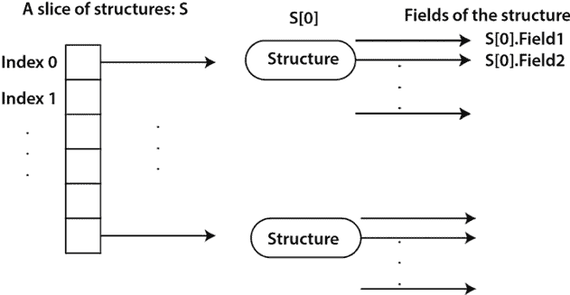

# 复合数据类型

Go 提供了对映射（Maps）和结构体（Structures）的支持，它们是复合数据类型，也是本章的主要内容。我们之所以将它们与数组和切片分开介绍，是因为映射和结构体都比数组和切片更灵活、更强大。每个映射可以使用给定预定义数据类型的键，而结构体可以将多个数据类型组合在一起并创建新的数据类型。

映射和切片用于完全不同的原因。数组和切片用于存储连续数据，并从内存局部性和索引中受益。当您不需要数据的局部性但仍然需要以恒定时间引用它时，映射是有用的。

一般的想法是，如果数组或切片无法完成工作，您可能需要查看映射。如果映射无法以您想要的方式存储数据，那么您应该考虑创建和使用结构体——您还可以使用数组或切片来分组相同类型的结构体。请记住，映射和结构体在用途上是不同的。您可以轻松地有一个结构体的映射，以及结构体的数组或切片。然而，当您需要组合多个逻辑上分组的数据和/或变量时，结构体是有用的。

此外，本章的知识将使我们能够使用结构体读取和保存 CSV 格式的数据。

此外，我们还将改进在 *第一章，Go 快速入门* 中最初开发的统计应用程序。新版本的实用程序将能够从磁盘加载数据，这意味着您不再需要将数据硬编码或生成随机数。

本章涵盖：

+   映射（Maps）

+   结构体

+   正则表达式和模式匹配

+   改进统计应用程序

不再赘述，让我们首先介绍映射（Maps）。

# 映射（Maps）

数组和切片都限制您只能使用正整数作为索引，这些索引从 `0` 开始，且不能有间隔——这意味着即使您只想在索引 99 的切片元素中放置数据，切片仍然会在内存中占用 100 个元素。映射（Maps）是更强大的数据结构，因为它们允许您使用各种数据类型的索引作为键来查找数据，只要这些键是*可比较的*。可比较意味着 Go 应该能够判断两个值是否相等，或者哪个值比另一个值更大（或更小）。

尽管布尔变量是可比较的，但将 `bool` 变量用作映射的键是没有意义的，因为它只允许两个不同的值。此外，尽管浮点值是可比较的，但由这些值的内部表示引起的精度问题可能会产生错误和崩溃，因此您可能想避免将浮点值用作映射的键。

您可能会问，为什么我们需要映射，它们有什么优势？以下列表将帮助澄清这些问题：

+   映射非常灵活。你甚至可以使用映射创建数据库索引，这允许你根据给定的键或更高级情况下键的组合来搜索和访问元素。

+   尽管这并不总是如此，但在 Go 中使用映射是快速的，因为你可以以常数时间访问映射的所有元素。在映射中插入和检索元素是常数时间操作。

+   映射易于理解，这通常会导致清晰的设计。

你可以使用 `make()` 或映射字面量来创建一个新的映射变量。使用 `make()` 创建具有 `string` 键和 `int` 值的新映射与编写 `make(map[string]int)` 并将返回值赋给变量一样简单。另一方面，如果你决定使用映射字面量创建映射，你需要写如下内容：

```go
m := map[string]int {
    "key1": -1
"key2": 123
} 
```

当你希望在创建映射时添加数据时，映射字面量版本更快。之前的映射字面量包含两个键和两个值——总共两个键值对。

你不应该对映射内部元素的顺序做出任何假设。Go 在迭代映射时会随机化键——这是故意为之，并且是语言设计的一部分。

你可以使用 `len()` 函数找到映射的长度，即映射中的键的数量，这个函数也适用于数组和切片；此外，你可以使用 `delete()` 函数从映射中删除键值对，该函数接受两个参数：映射的名称和键的名称，顺序如下。

## 如何判断映射中是否存在键

你可以通过 `v, ok := aMap[k]` 语句的第二个返回值来判断名为 `aMap` 的映射中是否存在键 `k`。如果 `ok` 被设置为 `true`，则 `k` 存在，其值为 `v`。如果它不存在，`v` 将被设置为其数据类型的零值，这取决于映射的定义。

现在有一个非常重要的细节：**如果你尝试获取映射中不存在的键的值，Go 不会对此提出任何异议，并返回值的数据类型的零值**。

现在，让我们讨论一个特殊情况，即映射变量具有 `nil` 值。

## 将数据存储到 `nil` 映射中

你可以将映射变量赋值为 `nil`。在这种情况下，直到你将其赋值给新的映射变量，你将无法使用该变量。简单来说，如果你尝试在 `nil` 映射上存储数据，你的程序将会崩溃。这在下一段代码中得到了说明，这是可以在本书 GitHub 仓库 `ch03` 目录中找到的 `nilMap.go` 源文件的 `main()` 函数的实现：

```go
func main() {
    aMap := map[string]int{}
    aMap["test"] = 1 
```

这之所以可行，是因为 `aMap` 指向一个现有的映射，这是 `map[string]int{}` 的返回值。

```go
 fmt.Println("aMap:", aMap)
    aMap = nil 
```

在这个阶段，`aMap` 指向 `nil`，在 Go 中 `nil` 是“无”的同义词。

```go
 fmt.Println("aMap:", aMap)
    if aMap == nil {
        fmt.Println("nil map!")
        aMap = map[string]int{}
    } 
```

在使用映射之前测试映射是否指向`nil`是一种良好的实践。在这种情况下，`if aMap == nil`允许我们确定是否可以将键值对存储到`aMap`中——我们不能，如果我们尝试这样做，程序将会崩溃。我们通过发出`aMap = map[string]int{}`语句来纠正这一点。

```go
 aMap["test"] = 1
// This will crash!
    aMap = nil
    aMap["test"] = 1
} 
```

在程序的最后一部分，我们展示了如果您尝试在`nil`映射上存储数据，程序会如何崩溃——永远不要在生产环境中使用此类代码！

在实际应用中，如果一个函数接受映射（map）作为参数，那么在处理它之前应该检查该映射是否为`nil`。

运行`nilMap.go`会产生以下输出：

```go
$ go run nilMap.go
aMap: map[test:1]
aMap: map[]
nil map!
panic: assignment to entry in nil map
goroutine 1 [running]:
main.main()
    /Users/mtsouk/Desktop/mGo4th/code/ch03/nilMap.go:21 +0x17c
exit status 2 
```

程序崩溃的原因显示在程序输出中：`panic: assignment to entry in nil map`。

## 遍历映射

当`for`与`range`结合使用时，它实现了在其他编程语言中找到的*foreach 循环*的功能，允许您遍历映射的所有元素，而无需知道其大小或其键。在这种情况下，`range`按顺序返回键值对。

输入以下代码并将其保存为`forMaps.go`：

```go
package main
import "fmt"
func main() {
    aMap := make(map[string]string)
    aMap["123"] = "456"
    aMap["key"] = "A value"
for key, v := range aMap {
        fmt.Println("key:", key, "value:", v)
    } 
```

在这种情况下，我们使用从`range`返回的键和值。

```go
 for _, v := range aMap {
        fmt.Print(" # ", v)
    }
    fmt.Println()
} 
```

在这种情况下，因为我们只对映射返回的值感兴趣，所以我们忽略了键。

正如您已经知道的，您不应该对从`for`/`range`循环中返回的映射（map）键值对的顺序做出任何假设。

运行`forMaps.go`会产生以下输出：

```go
$ go run forMaps.go
key: key value: A value
key: 123 value: 456
 # 456 # A value 
```

在介绍了映射之后，现在是时候学习 Go 中的结构体了。

# 结构体

Go 中的结构体（struct）既强大又流行，用于在同一个名称下组织并分组各种类型的数据。结构体是 Go 中更通用的数据类型——它们甚至可以有相关联的函数，这些函数被称为方法。

结构体以及其他用户定义的数据类型通常定义在`main()`函数或任何其他包函数之外，这样它们就可以具有全局作用域，并可供整个 Go 包使用。因此，除非您想明确指出一个类型仅在当前局部作用域内有用，并且不期望在其他地方使用，否则您应该将新数据类型的定义写在函数外部。

## 类型关键字

`type`关键字允许您定义新的数据类型或为现有类型创建别名。因此，您可以说`type myInt int`并定义一个新的数据类型`myInt`，它是`int`的别名。然而，Go 将`myInt`和`int`视为完全不同的数据类型，您不能直接比较它们，即使它们存储的是相同类型的值。每个结构体定义了一个新的数据类型，因此使用了`type`。

## 定义新的结构体

当你定义一个新的结构体时，在 Go 文档中称为 struct，你将一组值组合成一个单一的数据类型，这使得你可以将这组值作为一个单一实体传递和接收。**结构体有字段，每个字段都有自己的数据类型**，这甚至可以是另一个结构体或结构体的切片。此外，由于结构体是一个新的数据类型，它使用 `type` 关键字定义，后跟结构体的名称，并以 `struct` 关键字结尾，表示我们正在定义一个新的结构体。

以下代码定义了一个名为 `Entry` 的新结构体：

```go
type Entry struct {
    Name    string
    Surname string
    Year    int
} 
```

尽管你可以将结构体定义嵌入到另一个结构体中，但这通常不是一个好主意，应该避免这样做。如果你甚至考虑这样做，你可能需要重新考虑你的设计决策。然而，在结构体内部将现有的结构体作为类型是完全可以接受的。

由于在 *第六章*，*Go 包和函数* 中将要变得明显的原因，结构体的字段通常以大写字母开头——这取决于你想要对字段做什么，以及它们在当前包之外的可视性可能会如何影响。`Entry` 结构体有三个字段，分别命名为 `Name`、`Surname` 和 `Year`。前两个字段是 `string` 数据类型，而最后一个字段包含一个 `int` 值。

这三个字段可以通过 *点表示法* 访问，例如 `V.Name`、`V.Surname` 和 `V.Year`，其中 `V` 是持有 `Entry` 结构体实例的变量的名称。可以定义一个名为 `p1` 的结构体字面量，如下所示：`p1 := Entry{"Joe", "D.", 2012}`。

存在两种方式来处理结构变量。第一种是将它们作为常规变量，第二种是将它们作为指针变量，这些指针变量指向结构体的内存地址。这两种方式同样有效，通常会被嵌入到不同的函数中，因为它们允许你正确地初始化结构变量的一些或所有字段，并在使用结构变量之前执行任何其他你想要的任务。

因此，使用函数创建新结构体的主要方式有两种。第一种返回一个常规结构体变量，而第二种返回一个指向结构体的指针。这两种方式各有两种变体。第一种变体返回由 Go 编译器初始化的结构体实例，而第二种变体返回由开发者初始化的结构体实例。

最后，请记住，你在结构类型定义中放置字段的顺序对于定义的结构类型身份是重要的。简单来说，**在 Go 中，如果两个结构具有相同的字段但顺序不同，则它们不会被考虑为相同**。这主要与服务器和客户端软件之间的数据交换有关，因为不同结构体的变量无法比较，即使它们具有完全相同的字段列表、完全相同的数据类型和完全相同的顺序，因为它们属于不同的数据类型。

## 使用`new`关键字

此外，您可以使用`new()`关键字和如`pS := new(Entry)`之类的语句创建新的结构实例。`new()`关键字具有以下特性：

+   它分配适当的内存空间，这取决于数据类型，然后将其清零。

+   它总是返回指向已分配内存的指针。

+   它适用于所有数据类型，除了通道和映射。

所有这些技术都在下面的代码中得到了说明。请在您喜欢的文本编辑器中输入以下代码，并将其保存为`structures.go`：

```go
package main
import "fmt"
type Entry struct {
    Name    string
    Surname string
    Year    int
}
// Initialized by Go
func zeroS() Entry {
    return Entry{}
} 
```

现在是提醒您一个重要的 Go 规则的好时机：**如果未为变量提供初始值，Go 编译器会自动将该变量初始化为其数据类型的零值**。对于结构体，这意味着没有初始值的结构体变量将初始化为其每个字段的零值。因此，`zeroS()`函数返回一个零初始化的`Entry`结构体。

```go
// Initialized by the user
func initS(N, S string, Y int) Entry {
    if Y < 2000 {
        return Entry{Name: N, Surname: S, Year: 2000}
    }
    return Entry{Name: N, Surname: S, Year: Y}
} 
```

在这种情况下，用户初始化新的结构体变量。此外，`initS()`函数检查`Year`字段的值是否小于`2000`并采取行动；如果小于`2000`，则`Year`字段的值变为`2000`。这个条件是针对你正在开发的应用程序的需求特定的——这表明初始化结构体的位置也是检查输入的好地方。

```go
// Initialized by Go - returns pointer
func zeroPtoS() *Entry {
    t := &Entry{}
    return t
} 
```

`zeroPtoS()`函数返回一个指向零初始化结构的指针。

```go
// Initialized by the user - returns pointer
func initPtoS(N, S string, Y int) *Entry {
    if len(S) == 0 {
        return &Entry{Name: N, Surname: "Unknown", Year: Y}
    }
    return &Entry{Name: N, Surname: S, Year: Y}
} 
```

`initPtoS()`函数也返回一个指向结构的指针，但同时也检查用户输入的长度。这种检查是特定于应用的。

```go
func main() {
    s1 := zeroS()
    p1 := zeroPtoS()
    fmt.Println("s1:", s1, "p1:", *p1)
    s2 := initS("Mihalis", "Tsoukalos", 2024)
    p2 := initPtoS("Mihalis", "Tsoukalos", 2024)
    fmt.Println("s2:", s2, "p2:", *p2)
    fmt.Println("Year:", s1.Year, s2.Year, p1.Year, p2.Year)
    pS := new(Entry)
    fmt.Println("pS:", pS)
} 
```

`new(Entry)`调用返回一个指向`Entry`结构的指针。一般来说，当你需要初始化大量的结构变量时，创建一个用于此目的的函数被认为是良好的实践，因为这可以减少出错的可能性。

运行`structures.go`将生成以下输出：

```go
s1: {  0} p1: {  0}
s2: {Mihalis Tsoukalos 2024} p2: {Mihalis Tsoukalos 2024}
Year: 0 2024 0 2024
pS: &{  0} 
```

由于字符串的零值是空字符串，因此`s1`、`p1`和`pS`在`Name`和`Surname`字段中不显示任何数据。

下一个子节将展示如何将相同数据类型的结构分组，并将它们用作切片的元素。

## 结构体的切片

你可以创建结构切片来将多个结构分组并使用单个变量名处理。然而，访问给定结构的字段需要知道该结构在切片中的确切位置。

请查看以下图表，以更好地理解结构切片的工作原理以及如何访问特定切片元素的字段。



图 3.1：结构切片

因此，每个切片元素都是一个使用切片索引访问的结构。一旦我们选择了我们想要的切片元素，我们就可以选择其任意一个字段。

由于整个过程可能有点令人困惑，下面的代码提供了一些启示并澄清了问题。请输入以下代码并将其保存为 `sliceStruct.go`。你还可以在书的 GitHub 仓库的 `ch03` 目录中找到相同名称的文件。

```go
package main
import (
    "fmt"
"strconv"
)
type record struct {
    Field1 int
    Field2 string
}
func main() {
    s := []record{}
    for i := 0; i < 10; i++ {
        text := "text" + strconv.Itoa(i)
        temp := record{Field1: i, Field2: text}
        s = append(s, temp)
    } 
```

你仍然需要使用 `append()` 函数向切片中添加一个新的结构。

```go
 // Accessing the fields of the first element
    fmt.Println("Index 0:", s[0].Field1, s[0].Field2)
    fmt.Println("Number of structures:", len(s))
    sum := 0
for _, k := range s {
        sum += k.Field1
    }
    fmt.Println("Sum:", sum)
} 
```

运行 `sliceStruct.go` 产生以下输出：

```go
Index 0: 0 text0
Number of structures: 10
Sum: 45 
```

我们在*第五章*中回顾了结构，其中我们讨论了反射，以及在*第七章* *告诉 UNIX 系统做什么* 中，我们学习了如何使用结构处理 JSON 数据。现在，让我们讨论正则表达式和模式匹配。

# 正则表达式和模式匹配

你可能会想知道为什么我们在本章中讨论正则表达式和模式匹配。原因很简单。在不久的将来，你将学习如何从纯文本文件中存储和读取 CSV 数据，你应该能够判断数据是否有效。

模式匹配是一种搜索字符串中某些字符的技术，它基于基于正则表达式和语法的特定搜索模式。

正则表达式是一系列定义搜索模式的字符。每个正则表达式都被编译成一个识别器，通过构建一个称为有限自动机的通用转换图来实现。有限自动机可以是确定性的或非确定性的。非确定性意味着对于相同的输入，从状态中可能有多个转换是可能的。识别器是一个程序，它接受一个字符串 `x` 作为输入，并可以判断 `x` 是否是给定语言的句子。

语法是一组用于形式语言中字符串的生产规则——生产规则描述了如何从语言的字母表中创建字符串，这些字符串根据语言的语法是有效的。语法不描述字符串的意义或在任何上下文中可以用它做什么——它只描述其形式。这里重要的是要意识到，语法是正则表达式的核心，因为没有语法，你无法定义和因此使用正则表达式。

## 关于 regexp.Compile 和 regexp.MustCompile

负责定义正则表达式和执行模式匹配的 Go 包称为 `regexp`。在该包内部存在 `regexp.Compile()` 和 `regexp.MustCompile()`，它们具有相似的功能。

`regexp.MustCompile()` 和 `regexp.Compile()` 函数解析给定的正则表达式，并返回一个指向 `regexp.Regexp` 变量的指针，该变量可用于匹配——`regexp.Regexp` 是编译后的正则表达式的表示。`re.Match()` 方法返回 `true` 如果给定的字节切片与 `re` 正则表达式匹配，即 `regexp.Regexp` 变量，否则返回 `false`。

`regexp.Compile()` 和 `regexp.MustCompile()` 之间的主要和关键区别在于，前者返回一个 `*regexp.Regexp` 指针和一个 `error` 变量，而后者只返回一个 `*regexp.Regexp` 指针。因此，如果正则表达式的解析过程中出现某种错误，`regexp.MustCompile()` 将会引发恐慌，从而导致你的程序崩溃！

然而，`regexp.MustCompile()` 引发恐慌并不一定是坏事，因为如果正则表达式无法解析，你将知道你的表达式在早期过程中是无效的。最终，关于正则表达式解析的整体策略是由开发者决定的。

有时候我们只想找到那些后面或前面跟着另一个给定模式的匹配模式。这类操作分别称为前瞻和后顾。Go 不支持前瞻或后顾，使用时将抛出错误信息。前瞻的一般语法是 `X(?=Y)`，这意味着，只有当 `X` 后面跟着 `Y` 时才匹配 `X`。`regexp.Compile()` 和 `regexp.MustCompile()` 之间的区别在 `diffRegExp.go` 的 `main()` 函数中得到了说明，该函数将分两部分展示。

```go
func main() {
    // This is a raw string literal
var re string = `^.*(?=.{7,})(?=.*\d)$` 
```

前面的正则表达式有什么问题？问题是它使用了前瞻，这在 Go 中不受支持。

第二部分如下：

```go
 exp1, err := regexp.Compile(re)
    if err != nil {
        fmt.Println("Error:", err)
    }
    fmt.Println("RegExp:", exp1)
    exp2 := regexp.MustCompile(re)
    fmt.Println(exp2)
} 
```

在这个第二个代码段中，展示了 `regexp.Compile()` 和 `regexp.MustCompile()` 的使用。

运行 `diffRegExp.go` 产生以下输出：

```go
$ go run diffRegExp.go
Error: error parsing regexp: invalid or unsupported Perl syntax: `(?=`
RegExp: <nil>
panic: regexp: Compile(`^.*(?=.{7,})(?=.*\d)$`): error parsing regexp: invalid or unsupported Perl syntax: `(?=`
goroutine 1 [running]:
regexp.MustCompile({0x100a0c681, 0x15})
    /opt/homebrew/Cellar/go/1.20.6/libexec/src/regexp/regexp.go:319 +0xac
main.main()
    /Users/mtsouk/Desktop/mGo4th/code/ch03/diffRegExp.go:20 +0xf8
exit status 2 
```

因此，在第一种情况下，我们知道正则表达式中存在错误，因为 `regexp.Compile()` 的返回值，而使用带有错误正则表达式的 `regexp.MustCompile()` 时，程序会引发恐慌并自动终止。

下一个子节将展示如何定义正则表达式。

## Go 正则表达式

我们从这个子节开始，展示一些常用的匹配模式，这些模式用于构建正则表达式。

| **表达式** | **描述** |
| --- | --- |
| `.` | 匹配任何字符 |
| `*` | 表示任意次数——不能单独使用 |
| `?` | 零次或一次——不能单独使用 |
| `+` | 表示一次或多次——不能单独使用 |
| `^` | 表示行的开头 |
| `$` | 表示行的末尾 |
| `[]` | `[]` 用于分组字符 |
| `[A-Z]` | 这意味着从大写字母 `A` 到大写字母 `Z` 的所有字符 |
| `\d` | `0-9` 中的任何数字 |
| `\D` | 非数字 |
| `\w` | 任何单词字符：`[0-9A-Za-z_]` |
| `\W` | 任何非单词字符 |
| `\s` | 空白字符 |
| `\S` | 非空白字符 |

之前表格中展示的字符用于构建和定义正则表达式的语法。

创建单独的函数进行模式匹配可能很有用，因为它允许你在不担心程序上下文的情况下重用这些函数。

请记住，尽管正则表达式和模式匹配一开始看起来很方便，但它们是许多错误的原因。**我的建议是使用最简单的正则表达式来解决你的问题**。然而，在长期来看，避免使用正则表达式同时完成你的工作会更好！

### 关于原始字符串和解释字符串字面量

尽管我们在上一章讨论了字符串，但我们第一次在 `diffRegExp.go` 中定义正则表达式时使用了*原始字符串字面量*，因此让我们再谈谈原始字符串字面量，它们包含在反引号中而不是双引号中。原始字符串字面量的优点如下：

+   它们可以在其中包含大量文本，而无需使用控制字符，如 `\n` 来换行。

+   它们在定义正则表达式时很有用，因为你不需要使用反引号（`\`）来转义特殊字符。

+   它们用于结构标签中，这些标签在*第十一章*，*与 REST API 协同工作*中有所解释。

因此，总结来说，**原始字符串字面量用于存储不进行任何转义处理的字符串，而解释字符串字面量在字符串创建时进行处理**。

下一个子节将展示用于匹配姓名和姓氏的正则表达式。

## 匹配姓名和姓氏

所展示的实用工具匹配姓名和姓氏——根据我们的定义，这些是以大写字母开头并继续以小写字母开头的字符串。输入不应包含任何数字或其他字符。

实用工具的源代码可以在 `ch03` 文件夹中的 `nameSurRE.go` 文件中找到。支持所需功能的函数名为 `matchNameSur()`，其实现如下：

```go
func matchNameSur(s string) bool {
    t := []byte(s)
    re := regexp.MustCompile(`^[A-Z][a-z]*$`)
    return re.Match(t)
} 
```

函数的逻辑在 `` `^[A-Z][a-z]*$` `` 正则表达式中，其中 `^` 表示行的开始，`$` 表示行的结束。正则表达式所做的匹配是以大写字母开头（`[A-Z]`）并继续以任意数量的小写字母（`[a-z]*`）开头的任何内容。这意味着 `Z` 是一个匹配项，但 `ZA` 不是一个匹配项，因为第二个字母是大写的。同样，`Jo+` 不是一个匹配项，因为它包含 `+` 字符。

使用各种类型的输入运行 `nameSurRE.go` 产生以下输出：

```go
$ go run nameSurRE.go Z 
true
$ go run nameSurRE.go ZA
false
$ go run nameSurRE.go Mihalis
True 
```

这种技术可以帮助你检查用户输入的有效性。下一小节将介绍匹配整数。

## 匹配整数

该工具可以匹配有符号和无符号整数——这是通过我们定义的正则表达式实现的。如果我们只想匹配无符号整数，那么我们应该将正则表达式中的 `[-+]?` 替换为 `[+]?`。

与使用正则表达式匹配整数值相比，使用 `strconv.Atoi()` 会是一个更好的替代方案。作为一个建议，如果你能避免使用正则表达式，请选择替代方法。然而，当你事先不知道期望输入的数据类型或数量时，正则表达式是无价的。一般来说，正则表达式对于分离输入的各个部分非常有价值。请记住，正则表达式始终匹配字符串，你也可以在字符串中找到数字。

工具的源代码位于 `intRE.go` 文件中，该文件位于 `ch03` 目录下。支持所需功能的 `matchInt()` 函数实现如下：

```go
func matchInt(s string) bool {
    t := []byte(s)
    re := regexp.MustCompile(`^[-+]?\d+$`)
    return re.Match(t)
} 
```

与之前一样，函数的逻辑可以在用于匹配整数的正则表达式中找到，即 `` `^[-+]?\d+$` ``。用简单的话来说，我们这里的意思是我们想匹配以 `–` 或 `+` 开头的东西，这是可选的（`?`），并以任意数量的数字（`\d+`）结束——在字符串的末尾之前至少需要一个数字（`$`）。

使用各种类型的输入运行 `intRE.go` 产生以下输出：

```go
$ go run intRE.go 123
true
$ go run intRE.go /123
false
$ go run intRE.go +123.2
false
$ go run intRE.go +
false
$ go run intRE.go -123.2
false 
```

在本书的后面部分，你将学习如何通过编写测试函数来测试 Go 代码——现在，我们将大部分测试手动进行。

# 提升统计应用程序

是时候更新统计应用程序了。统计工具的新版本有以下改进：

+   它使用函数简化 `main()` 函数并改进整体设计。

+   它可以读取包含数值输入的 CSV 文件。

但首先，我们需要学习如何在 Go 中处理 CSV 文件，这是下一小节的主题。

## 处理 CSV 文件

大多数时候，你不想丢失数据或每次执行应用程序时都必须在没有数据的情况下开始。为此存在许多技术——最简单的一种是将数据本地保存。一个非常易于处理的纯文本文件格式是 CSV，这就是这里所解释的，并在后面的统计应用程序中使用。

好的一点是，Go 提供了一个专门用于处理 CSV 数据的包，名为 `encoding/csv` ([`pkg.go.dev/encoding/csv`](https://pkg.go.dev/encoding/csv))。对于所提供的工具，输入和输出文件都作为命令行参数给出。

当从磁盘读取或写入 CSV 数据时，所有内容都被视为字符串。因此，如果你在读取阶段希望将数值数据视为此类数据，你可能需要自行将其转换为适当的数据类型。

存在两个非常流行的 Go 接口，分别命名为 `io.Reader` 和 `io.Writer`，它们分别与读取和写入文件相关。几乎所有的读取和写入操作在 Go 中都使用这两个接口。所有读取器使用相同接口的做法使得读取器可以共享一些共同特性，但最重要的是，它允许你在 Go 需要任何 `io.Reader` 读取器的地方创建自己的读取器并使用它们。对于满足 `io.Writer` 接口的写入器也是如此。你将在 *第五章*，*反射与接口* 中了解更多关于接口的内容。

需要实现的主要任务如下：

+   从磁盘加载 CSV 数据并将其放入结构体切片中

+   使用 CSV 格式将数据保存到磁盘

`encoding/csv` 包包含可以帮助你读取和写入 CSV 文件的函数。由于我们处理的是小型 CSV 文件，我们使用 `csv.NewReader(f).ReadAll()` 一次性读取整个输入文件。对于较大的数据文件，或者如果我们想在读取时检查输入或对其进行任何更改，使用 `Read()` 而不是 `ReadAll()` 会更好。

Go 假设 CSV 文件使用逗号字符 (`,`) 来分隔每行的不同字段。如果我们希望改变这种行为，我们应该根据我们想要执行的任务更改 CSV 读取器或写入器的 `Comma` 变量的值。我们在输出 CSV 文件中改变了这种行为，它使用制表符来分隔字段。

由于兼容性的原因，如果输入和输出 CSV 文件使用相同的字段分隔符会更好。我们只是在输出文件中使用制表符作为字段分隔符来展示 `Comma` 变量的使用。

由于处理 CSV 文件是一个新主题，本书 GitHub 仓库的 `ch03` 目录中有一个名为 `csvData.go` 的单独实用工具，它展示了读取和写入 CSV 文件的技巧。`csvData.go` 的源代码以块的形式展示。首先，我们展示 `csvData.go` 的前言部分，其中包含 `import` 部分、`Record` 结构体以及 `myData` 全局变量，它是一个 `Record` 切片。

```go
package main
import (
    "encoding/csv"
"log"
"os"
)
type Record struct {
    Name       string
    Surname    string
    Number     string
    LastAccess string
}
var myData = []Record{} 
```

然后，我们介绍 `readCSVFile()` 函数，该函数读取包含 CSV 数据的纯文本文件。

```go
func readCSVFile(filepath string) ([][]string, error) {
    _, err := os.Stat(filepath)
    if err != nil {
        return nil, err
    }
    f, err := os.Open(filepath)
    if err != nil {
        return nil, err
    }
    defer f.Close()
    // CSV file read all at once
// lines data type is [][]string
    lines, err := csv.NewReader(f).ReadAll()
    if err != nil {
        return [][]string{}, err
    }
    return lines, nil
} 
```

注意，我们在函数内部检查了给定的文件路径是否存在，并且与一个常规文件相关联。关于在哪里执行这种检查没有正确或错误的选择——你只需要保持一致。`readCSVFile()` 函数返回一个包含所有读取行的 `[][]string` 切片。此外，请记住，`csv.NewReader()` 会分隔每条输入行的字段，这是需要使用二维切片来存储输入的主要原因。

之后，我们借助 `saveCSVFile()` 函数展示了将内容写入 CSV 文件的技巧。

```go
func saveCSVFile(filepath string) error {
    csvfile, err := os.Create(filepath)
    if err != nil {
        return err
    }
    defer csvfile.Close()
    csvwriter := csv.NewWriter(csvfile)
    // Changing the default field delimiter to tab
    csvwriter.Comma = '\t'
for _, row := range myData {
        temp := []string{row.Name, row.Surname, row.Number, row.LastAccess}
        err = csvwriter.Write(temp)
        if err != nil {
            return err
        }
    }
    csvwriter.Flush()
    return nil
} 
```

注意 `csvwriter.Comma` 的默认值发生了变化，以符合我们的需求。

最后，我们可以看到 `main()` 函数的实现。

```go
func main() {
    if len(os.Args) != 3 {
        log.Println("csvData input output!")
        os.Exit(1)
    }
    input := os.Args[1]
    output := os.Args[2]
    lines, err := readCSVFile(input)
    if err != nil {
        log.Println(err)
        os.Exit(1)
    }
    // CSV data is read in columns - each line is a slice
for _, line := range lines {
        temp := Record{
            Name:       line[0],
            Surname:    line[1],
            Number:     line[2],
            LastAccess: line[3],
        }
        myData = append(myData, temp)
        log.Println(temp)
    }
    err = saveCSVFile(output)
    if err != nil {
        log.Println(err)
        os.Exit(1)
    }
} 
```

`main()` 函数将 `readCSVFile()` 读取的内容放入 `myData` 切片中——请记住，`lines` 是一个二维切片，并且 `lines` 中的每一行已经被分隔成字段。在这种情况下，输入的每一行包含四个字段。因此，我们处理这个 `[][]string` 切片，并将所需信息放入结构体切片（`myData`）中。

作为输入使用的 CSV 数据文件的内容如下：

```go
$ cat ~/csv.data
Dimitris,Tsoukalos,2101112223,1600665563
Mihalis,Tsoukalos,2109416471,1600665563
Jane,Doe,0800123456,1608559903 
```

运行 `csvData.go` 产生以下类型的输出：

```go
$ go run csvData.go ~/csv.data /tmp/output.data
{Dimitris Tsoukalos 2101112223 1600665563}
{Mihalis Tsoukalos 2109416471 1600665563}
{Jane Doe 0800123456 1608559903} 
```

输出 CSV 文件的内容如下：

```go
$ cat /tmp/output.data
Dimitris        Tsoukalos       2101112223      1600665563
Mihalis Tsoukalos       2109416471      1600665563
Jane    Doe     0800123456      1608559903 
```

`output.data` 文件使用制表符来分隔每条记录的不同字段，因此生成了相应的输出。`csvData.go` 工具在执行不同类型 CSV 文件之间的转换时可能很有用。

## 统计应用程序的更新版本

在本小节中，我们将展示统计应用程序的更新代码。`normalized()` 函数没有变化，因此不再展示。

来自 `stats.go` 的第一段代码是实现了一个函数，该函数将 CSV 文件作为文本读取，并将其转换为 `float64` 值的切片。

```go
func readFile(filepath string) ([]float64, error) {
    _, err := os.Stat(filepath)
    if err != nil {
        return nil, err
    }
    f, err := os.Open(filepath)
    if err != nil {
        return nil, err
    }
    defer f.Close()
    lines, err := csv.NewReader(f).ReadAll()
    if err != nil {
        return nil, err
    }
    values := make([]float64, 0)
    for _, line := range lines {
        **tmp, err := strconv.ParseFloat(line[****0****],** **64****)**
if err != nil {
            log.Println("Error reading:", line[0], err)
            continue
        }
        values = append(values, tmp)
    }
    return values, nil
} 
```

一旦读取了指定的 CSV 文件，其数据就被放入 `lines` 变量中。请注意，在我们的案例中，CSV 文件中的每一行只有一个字段。尽管如此，`lines` 有两个维度。

由于我们想要返回一个 `float64` 值的切片，我们必须将 `[][]string` 变量转换为 `[]float64` 变量，这正是最后一个 `for` 循环的目的。`for` 循环最重要的任务是确保所有字符串都是有效的 `float64` 值，以便将它们放入 `values` 切片中——这是 `strconv.ParseFloat(line[0], 64)` 调用的目的。

接下来，我们有计算标准差的函数实现：

```go
func stdDev(x []float64) (float64, float64) {
    sum := 0.0
for _, val := range x {
        sum = sum + val
    }
    meanValue := sum / float64(len(x))
    **fmt.Printf(****"Mean value: %.5f\n"****, meanValue)**
// Standard deviation
var squared float64
for i := 0; i < len(x); i++ {
        squared = squared + math.Pow((x[i]-meanValue), 2)
    }
    standardDeviation := math.Sqrt(squared / float64(len(x)))
    return meanValue, standardDeviation
} 
```

首先，`stdDev()` 函数计算所有给定值的总和，然后计算数据的平均值。最后，计算标准差。当你确定一切按预期工作后，可以移除 `stdDev()` 函数内的 `fmt.Printf()` 调用。

最后，这是 `main()` 函数的实现：

```go
func main() {
    if len(os.Args) == 1 {
        log.Println("Need one argument!")
        return
    }
    file := os.Args[1]
    values, err := readFile(file)
    if err != nil {
        log.Println("Error reading:", file, err)
        os.Exit(0)
    }
    sort.Float64s(values)
    fmt.Println("Number of values:", len(values))
    fmt.Println("Min:", values[0])
    fmt.Println("Max:", values[len(values)-1])
    meanValue, standardDeviation := stdDev(values)
    fmt.Printf("Standard deviation: %.5f\n", standardDeviation)
    normalized := normalize(values, meanValue, standardDeviation)
    fmt.Println("Normalized:", normalized)
} 
```

尽管更新版本的`stats.go`的核心功能与上一章开发的版本相同，但使用函数简化了`main()`的实现。

运行`stats.go`会产生以下输出：

```go
$ go run stats.go csvData.txt
Error reading: a strconv.ParseFloat: parsing "a": invalid syntax
Number of values: 6
Min: -1.2
Max: 3
Mean value: 0.66667
Standard deviation: 1.54883
Normalized: [-1.2053 -1.0761 -0.4305 0.2797 0.9254 1.5065 
```

之前的输出显示`csvData.txt`包含无效行——`csvData.txt`的内容如下：

```go
$ cat csvData.txt
1.1
2.1
-1.2
-1
0
a
3 
```

尽管比上一个版本好得多，但新的统计实用工具版本仍然不完美。以下是可以改进的事项列表：

+   能够处理多个 CSV 数据文件。

+   能够根据预定义的统计属性（如处理多个 CSV 数据文件时的平均值）对输出进行排序。

+   能够使用 JSON 记录和 JSON 切片来存储数据，而不是 CSV 文件。

统计应用程序将从第五章开始不断改进，该章介绍了反射和接口，其中实现了对结构体元素的切片排序。

# 概述

在本章中，我们讨论了 Go 的复合数据类型，即映射（map）和结构体。此外，我们还讨论了处理 CSV 文件以及使用正则表达式和模式匹配。现在我们可以将数据保存在适当的结构体中，使用正则表达式进行验证，并将其存储在 CSV 文件中以实现数据持久性。

总是记住，**如果你尝试获取映射中不存在的键的值，Go 不会对此提出异议，并将返回值的零值。**

下一章是关于 Go 泛型的内容，这是一个相对较新的 Go 特性。

# 练习

+   编写一个 Go 程序，将现有的数组转换为映射（map）。

+   编写一个 Go 程序，将现有的映射（map）转换为两个切片——第一个切片包含映射的键，而第二个切片包含映射的值。两个切片中索引`n`的值应该对应于原始映射中可以找到的键值对。

+   对`nameSurRE.go`进行必要的修改，以便能够处理多个命令行参数。

+   修改`intRE.go`的代码，以处理多个命令行参数并在最后显示`true`和`false`结果的总计。

+   对`csvData.go`进行修改，根据`#`字符来分隔记录的字段。

+   要了解正则表达式可能有多难，请在互联网上搜索一个匹配电子邮件地址的正则表达式。

+   `regexp`包包括`MatchString()`方法。尝试理解它与`Match`方法的主要区别，并创建一个工作示例。

+   编写一个 Go 实用工具，将`os.Args`转换为结构体切片，其中包含存储每个命令行参数索引和值的字段——你应该定义将要使用的结构体。

+   对`csvData.go`进行修改，使用单个字符（作为命令行参数给出）来分隔记录的字段。

+   修改 `stats.go` 中的 `stdDev()` 函数，以便将样本的平均值保存到一个全局变量中，并从其中删除 `fmt.Printf()` 调用。

# 其他资源

+   `encoding/csv` 文档：[`pkg.go.dev/encoding/csv`](https://pkg.go.dev/encoding/csv)

+   `runtime` 包文档：[`pkg.go.dev/runtime`](https://pkg.go.dev/runtime)

+   `regexp` 包文档：[`pkg.go.dev/regexp`](https://pkg.go.dev/regexp)

# 加入我们的 Discord 社区

加入我们社区的 Discord 空间，与作者和其他读者进行讨论：

[`discord.gg/FzuQbc8zd6`](https://discord.gg/FzuQbc8zd6)


