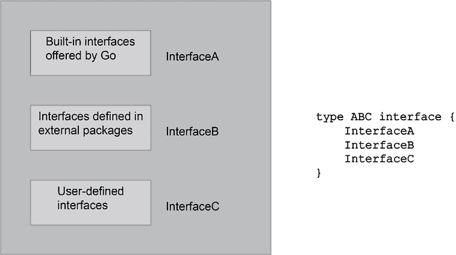

# 第五章：反射与接口

你可能会想知道，如果你想要根据你自己的标准，如姓氏或数据集的平均值等统计属性，对用户定义的数据结构，如电话记录或数值数据，进行排序，会发生什么。当你想要对具有共同行为的不同数据集进行排序，而无需为每种不同的数据类型从头实现排序功能时，会发生什么？此外，想象一下，如果你想要编写一个对不常见数据进行排序的工具。例如，想象一下，你想要根据体积对包含各种 3D 形状的切片进行排序。这能轻松且合理地完成吗？

所有这些问题的答案和担忧都是使用接口。然而，接口不仅仅是关于数据操作和排序。接口是关于表达抽象、识别和定义可以在不同数据类型之间共享的行为。一旦你为数据类型实现了一个接口，该类型变量和值的全新功能世界就变得可用，这可以节省你的时间并提高你的生产力。接口与*类型上的方法*或*类型方法*一起工作，这些方法类似于附加到给定数据类型上的函数，在 Go 中通常是结构体。在 Go 中，接口是隐式满足的。这意味着你不需要显式声明一个类型实现了接口。相反，如果一个类型为该接口声明了所有方法的实现，则认为该类型实现了接口。现在，让我们谈谈*空接口*，它由`interface{}`表示。空接口指定了零个方法，这意味着任何类型都满足空接口。这可能很强大，但也需要谨慎，因为它本质上意味着“我可以持有任何类型的值。”

另一个实用且高级的 Go 语言特性是反射，它允许你在运行时检查数据类型的内部结构。然而，由于反射是一个高级的 Go 语言特性，你可能不需要经常使用它。

本章涵盖：

+   反射

+   类型方法

+   接口

+   Go 语言中的面向对象编程

+   接口与泛型

+   反射与泛型

+   更新统计应用程序

# 反射

我们以反思作为本章的开端，这是 Go 语言的一个高级特性，不是因为这是一个容易的主题，而是因为它将帮助你理解 Go 如何与不同的数据类型一起工作，包括接口，以及为什么需要它。

你可能会想知道如何在运行时找出结构体的字段名称。在这种情况下，你需要使用反射。除了使你能够打印出结构和其值之外，反射还允许你探索和操作未知结构，例如从解码 JSON 数据创建的结构。

当我第一次接触反射时，我向自己提出了以下两个主要问题：

+   为什么反射被包含在 Go 中？

+   何时应该使用反射？

为了回答第一个问题，反射允许你动态地学习任意对象的类型及其结构信息。Go 提供了 `reflect` 包来处理反射。`fmt.Println()` 函数足够聪明，能够理解其参数的数据类型并相应地行动，因为，在幕后，`fmt` 包使用反射来完成这项工作。

关于第二个问题，反射允许你在编写代码时处理和操作那些当时不存在但未来可能存在的数据类型，这就是我们使用带有新用户定义数据类型的现有包的时候——Go 函数可以使用空接口接受未知的数据类型。此外，当你必须处理那些没有实现通用接口且因此具有不常见或未知行为的数据类型时，反射可能很有用——这并不意味着它们有不良或错误的行为，只是不常见或不寻常的行为，例如用户定义的结构体。

接口将在本章后面进行介绍，所以请继续关注更多内容！

Go 中泛型的引入可能会在某些情况下使反射的使用频率降低，因为，有了泛型，你可以更轻松地处理不同的数据类型，而无需事先知道它们的精确数据类型。然而，对于完全探索变量的结构和数据类型，没有什么能比得上反射。我们将在本章末尾比较反射和泛型。

`reflect` 包最有用的部分是两个名为 `reflect.Value` 和 `reflect.Type` 的数据类型。`reflect.Value` 用于存储任何类型的值，而 `reflect.Type` 用于表示 Go 类型。存在两个名为 `reflect.TypeOf()` 和 `reflect.ValueOf()` 的函数，分别返回 `reflect.Type` 和 `reflect.Value` 值。请注意，`reflect.TypeOf()` 返回变量的实际类型——如果我们正在检查一个结构体，它返回结构体的名称。

由于结构体在 Go 中非常重要，`reflect` 包提供了 `reflect.NumField()` 方法来列出结构体中的字段数量，以及 `Field()` 方法来获取结构体特定字段的 `reflect.Value` 值。

`reflect` 包还定义了 `reflect.Kind` 数据类型，它用于表示变量的具体数据类型：`int`、`struct` 等。`reflect` 包的文档列出了 `reflect.Kind` 数据类型的所有可能值。`Kind()` 函数返回变量的类型。

最后，`Int()` 和 `String()` 方法分别返回 `reflect.Value` 的整数和字符串值。

反射代码有时看起来不美观且难以阅读。因此，根据 Go 哲学，除非必要，否则你应该很少使用反射，因为尽管它很巧妙，但它不会创建干净的代码。

## 理解 Go 结构的内部结构

下一个实用工具展示了如何使用反射来发现 Go 结构变量的内部结构和字段。输入它并将其保存为`reflection.go`。

```go
package main
import (
    "fmt"
"reflect"
)
type Secret struct {
    Username string
    Password string
}
type Record struct {
    Field1 string
    Field2 float64
    Field3 Secret
}
func main() {
    A := Record{"String value", -12.123, Secret{"Mihalis", "Tsoukalos"}} 
```

我们首先定义一个包含另一个结构值（`Secret{"Mihalis", "Tsoukalos"}`）的`Record`结构变量。

```go
 r := reflect.ValueOf(A)
    fmt.Println("String value:", r.String()) 
```

这返回了`A`变量的`reflect.Value`。

```go
 iType := r.Type() 
```

使用`Type()`是我们获取变量数据类型的方法——在这个例子中，变量`A`。

```go
 fmt.Printf("i Type: %s\n", iType)
    fmt.Printf("The %d fields of %s are\n", r.NumField(), iType)
    for i := 0; i < r.NumField(); i++ { 
```

之前的`for`循环允许访问结构的所有字段并检查它们的特征。

```go
 fmt.Printf("\t%s ", iType.Field(i).Name)
        fmt.Printf("\twith type: %s ", r.Field(i).Type())
        fmt.Printf("\tand value _%v_\n", r.Field(i).Interface()) 
```

之前的`fmt.Printf()`语句返回字段的名称、数据类型和值。

```go
 // Check whether there are other structures embedded in Record
        k := reflect.TypeOf(r.Field(i).Interface()).Kind()
        // Need to convert it to string in order to compare it
        if k.String() == "struct" { 
```

要使用字符串检查变量的数据类型，我们首先需要将数据类型转换为`string`变量。

```go
 fmt.Println(r.Field(i).Type())
        }
        // Same as before but using the internal value
        if k == reflect.Struct { 
```

你也可以在检查过程中使用数据类型的内部表示。

```go
 fmt.Println(r.Field(i).Type())
        }
    }
} 
```

运行`reflection.go`会产生以下输出：

```go
$ go run reflection.go
String value: <main.Record Value>
i Type: main.Record
The 3 fields of main.Record are
        Field1  with type: string       and value _String value_
        Field2  with type: float64      and value _-12.123_
        Field3  with type: main.Secret  and value _{Mihalis Tsoukalos}_
main.Secret
main.Secret 
```

`main.Record`是 Go 定义的结构的全唯一名称——`main`是包名，`Record`是`struct`名。这样 Go 可以区分不同包的元素。

所展示的代码没有修改结构的任何值。如果你要修改结构字段的值，你会使用`Elem()`方法并将结构作为指针传递给`ValueOf()`——记住，指针允许你修改实际变量。存在修改现有值的方法。在我们的例子中，我们将使用`SetString()`来修改`string`字段，并使用`SetInt()`来修改`int`字段。

这种技术在下一小节中得到了说明。

## 使用反射修改结构值

了解 Go 结构的内部结构很有用，但更实际的是能够修改 Go 结构中的值，这正是本小节的主题。然而，请注意，这种方法是一个例外，绝大多数 Go 程序不需要实现这一点。

输入以下 Go 代码并将其保存为`setValues.go`——它也可以在书的 GitHub 仓库中的`ch05`目录下找到。

```go
package main
import (
    "fmt"
"reflect"
)
type T struct {
    F1 int
    F2 string
    F3 float64
}
func main() {
    A := T{1, "F2", 3.0} 
```

`A`是本程序中被检查的变量。

```go
 fmt.Println("A:", A)
    r := reflect.ValueOf(&A).Elem() 
```

通过使用`Elem()`和变量`A`的指针，如果需要的话可以修改变量`A`。

```go
 fmt.Println("String value:", r.String())
    typeOfA := r.Type()
    for i := 0; i < r.NumField(); i++ {
        f := r.Field(i)
        tOfA := typeOfA.Field(i).Name
        fmt.Printf("%d: %s %s = %v\n", i, tOfA, f.Type(), f.Interface())
        k := reflect.TypeOf(r.Field(i).Interface()).Kind()
        if k == reflect.Int {
            r.Field(i).SetInt(-100)
        } else if k == reflect.String {
            r.Field(i).SetString("Changed!")
        }
    } 
```

我们使用`SetInt()`来修改整数值（`reflect.Int`）和`SetString()`来修改字符串值（`reflect.String`）。整数值被设置为`-100`，字符串值被设置为`Changed!`。

```go
 fmt.Println("A:", A)
} 
```

运行`setValues.go`会产生以下输出：

```go
$ go run setValues.go
A: {1 F2 3}
String value: <main.T Value>
0: F1 int = 1
1: F2 string = F2
2: F3 float64 = 3
A: {-100 Changed! 3} 
```

输出的第一行显示了 `A` 的初始版本，而最后一行显示了经过修改的字段的最终版本 `A`。这种代码的主要用途是在不知道结构内部结构的情况下，动态地更改结构体字段的值。

## 反射的三个缺点

毫无疑问，反射是 Go 的一项强大功能。然而，与所有工具一样，反射应谨慎使用，主要有三个原因：

+   第一个原因是过度使用反射会使你的程序难以阅读和维护。解决这个问题的一个潜在方法是良好的文档，但开发者以没有时间编写适当的文档而闻名。

+   第二个原因是使用反射的 Go 代码会使你的程序变慢。一般来说，**与特定数据类型工作的 Go 代码总是比使用反射动态处理任何 Go 数据类型的 Go 代码要快**。此外，这种动态代码使得工具难以重构或分析你的代码。

+   最后一个原因是反射错误无法在构建时捕获，而是在运行时作为恐慌报告，这意味着反射错误可能会潜在地使你的程序崩溃。这可能会在 Go 程序开发后的几个月甚至几年后发生！解决这个问题的一个方法是在危险函数调用之前进行广泛的测试。然而，这会在你的程序中添加更多的 Go 代码，使它们运行得更慢。

考虑到反射的缺点，重要的是要记住，反射在处理 JSON 和 XML 序列化、动态代码生成以及动态将 Go 结构体映射到数据库表等情况下是必需的。

既然我们已经了解了反射及其能为我们做什么，现在是时候开始讨论类型方法了，这对于理解接口是必要的。

# 类型方法

**类型方法**是一个*附加到特定数据类型的函数*。尽管类型方法（或类型上的方法）是函数，但实际上，它们的定义和使用方式略有不同。

在类型特性方法上，Go 语言获得了一些面向对象的能力，这非常方便，并且在 Go 语言中被广泛使用。此外，接口需要类型方法才能工作。

定义新的类型方法就像创建新的函数一样简单，只要你遵循某些规则，将这些函数与数据类型关联起来。

## 创建类型方法

所以，想象一下你想用 2x2 矩阵进行计算。实现这一点的非常自然的方式是通过定义一个新的数据类型，并定义类型方法来添加、减去和乘以使用该新数据类型的 2x2 矩阵。为了使其更加有趣和通用，我们将创建一个命令行实用程序，它接受两个 2x2 矩阵的元素作为命令行参数，总共八个整数值，并使用定义的类型方法在这两者之间执行所有三种计算。

通过拥有名为`ar2x2`的数据类型，你可以为它创建一个名为`FunctionName`的类型方法，如下所示：

```go
func (a ar2x2) FunctionName(parameters) <return values> {
    ...
} 
```

`(a ar2x2)`这一部分使得`FunctionName()`函数成为一个类型方法，因为它将`FunctionName()`与`ar2x2`数据类型关联起来。其他数据类型无法使用该函数。然而，你可以自由地为其他数据类型或作为常规函数实现`FunctionName()`。如果你有一个名为`varAr`的`ar2x2`变量，你可以像选择结构变量字段一样调用`FunctionName()`，即`varAr.FunctionName(...)`。

如果你不想开发类型方法，除非你正在处理接口，否则你没有义务这样做。此外，每个类型方法都可以重写为常规函数。因此，`FunctionName()`可以重写如下：

```go
func FunctionName(a ar2x2, parameters...) <return values> {
    ...
} 
```

请记住，在底层，Go 编译器确实会将方法转换为带有自值的常规函数调用。然而，请注意，**接口需要使用类型方法才能工作**。

用于选择结构字段或数据类型的类型方法的表达式，将替换上面变量名后的省略号，被称为*选择器*。

在给定预定义大小的矩阵之间执行计算是使用数组而不是切片更合理的一些罕见情况之一，因为你不需要修改矩阵的大小。有些人可能会争论说，使用切片而不是数组指针是更好的做法——你可以使用对你和当前问题更有意义的方法。一般来说，当需要固定大小的连续内存块或性能是关键问题时，应首选数组。因此，对于大多数动态集合，通常使用切片，而在需要固定大小、性能关键的结构时，使用数组。

大多数情况下，类型方法的输出保存在调用类型方法的变量中——为了为`ar2x2`数据类型实现这一点，我们传递调用类型方法的数组的指针，例如`func (a *ar2x2)`。

## 值接收器和指针接收器

如你所知，一个方法可以与一个命名类型关联，方法的接收者可以是值接收器或指针接收器。值接收器是与方法关联的接收器，该方法操作的是值的副本而不是实际的值本身。指针接收器是与方法关联的接收器，该方法直接操作接收器指向的值，而不是值的副本。

在值接收器和指针接收器之间的选择会影响方法的行为，特别是在修改底层值和性能考虑方面。一般来说，当方法不需要修改接收器的状态时，当处理小型、不可变类型时，或者对于逻辑上属于值本身而不是特定实例的方法时，建议使用值接收器。另一方面，当方法需要修改接收器的状态时，当处理大型数据结构以避免任何复制开销，或者对于逻辑上属于类型的特定实例的方法时，你可能更愿意使用指针接收器。

下一个小节将展示类型方法的应用。

## 使用类型方法

本小节以 `ar2x2` 数据类型为例，展示了类型方法的使用。`Add()` 函数和 `Add()` 方法使用完全相同的算法来添加两个矩阵。它们之间的唯一区别是它们的调用方式以及函数返回一个数组，而方法由于使用了指针，将结果保存到调用变量中。

虽然矩阵的加法和减法是一个简单的过程——你只需将第一个矩阵的每个元素与位于相同位置的第二个矩阵的元素相加或相减——但矩阵乘法是一个更复杂的过程。这是加法和减法都使用 `for` 循环的主要原因，这意味着代码也可以处理更大的矩阵，而乘法使用的是静态代码，不能在不进行重大更改的情况下应用于更大的矩阵。

如果你正在为结构定义类型方法，你应该确保类型方法的名称不与结构的任何字段名称冲突，因为 Go 编译器将拒绝这种歧义。

输入以下代码并将其保存为 `methods.go`。

```go
package main
import (
    "fmt"
"os"
"strconv"
)
type ar2x2 [2][2]int
// Traditional Add() function
func Add(a, b ar2x2) ar2x2 {
    c := ar2x2{}
    for i := 0; i < 2; i++ {
        for j := 0; j < 2; j++ {
            c[i][j] = a[i][j] + b[i][j]
        }
    }
    return c
} 
```

在这里，我们有一个传统的函数，它将两个 `ar2x2` 变量相加并返回它们的和。

```go
// Type method Add()
func (a *ar2x2) Add(b ar2x2) {
    for i := 0; i < 2; i++ {
        for j := 0; j < 2; j++ {
            a[i][j] = a[i][j] + b[i][j]
        }
    }
} 
```

在这里，我们有一个名为 `Add()` 的类型方法，它附加到 `ar2x2` 数据类型上。加法的结果不会返回。发生的情况是调用 `Add()` 方法的 `ar2x2` 变量将被修改并保留该结果——这就是为什么在定义类型方法时使用指针的原因。如果你不希望这种行为，你应该修改类型方法的签名和实现以匹配你的需求。

```go
// Type method Subtract()
func (a *ar2x2) Subtract(b ar2x2) {
    for i := 0; i < 2; i++ {
        for j := 0; j < 2; j++ {
            a[i][j] = a[i][j] - b[i][j]
        }
    }
} 
```

之前的方法从 `ar2x2` `b` 中减去 `ar2x2` `a`，并将结果保存在 `a` 变量中。

```go
// Type method Multiply()
func (a *ar2x2) Multiply(b ar2x2) {
    a[0][0] = a[0][0]*b[0][0] + a[0][1]*b[1][0]
    a[1][0] = a[1][0]*b[0][0] + a[1][1]*b[1][0]
    a[0][1] = a[0][0]*b[0][1] + a[0][1]*b[1][1]
    a[1][1] = a[1][0]*b[0][1] + a[1][1]*b[1][1]
} 
```

由于我们正在处理小型数组，所以我们不使用任何 `for` 循环进行乘法。

```go
func main() {
    if len(os.Args) != 9 {
        fmt.Println("Need 8 integers")
        return
    }
    k := [8]int{}
    for index, i := range os.Args[1:] {
        v, err := strconv.Atoi(i)
        if err != nil {
            fmt.Println(err)
            return
        }
        k[index] = v
    }
    a := ar2x2{{k[0], k[1]}, {k[2], k[3]}}
    b := ar2x2{{k[4], k[5]}, {k[6], k[7]}} 
```

`main()` 函数获取输入并创建两个 2x2 矩阵。之后，它使用这两个矩阵执行所需的计算。

```go
 fmt.Println("Traditional a+b:", Add(a, b))
    a.Add(b)
    fmt.Println("a+b:", a)
    a.Subtract(a)
    fmt.Println("a-a:", a)
    a = ar2x2{{k[0], k[1]}, {k[2], k[3]}} 
```

我们使用两种不同的方式计算 `a+b`：使用常规函数和使用类型方法。由于 `a.Add(b)` 和 `a.Subtract(a)` 都会改变 `a` 的值，我们必须在使用它之前初始化 `a`。

```go
 a.Multiply(b)
    fmt.Println("a*b:", a)
    a = ar2x2{{k[0], k[1]}, {k[2], k[3]}}
    b.Multiply(a)
    fmt.Println("b*a:", b)
} 
```

最后，我们计算 `a*b` 和 `b*a` 来展示它们是不同的，因为交换律不适用于矩阵乘法。

运行 `methods.go` 产生以下输出：

```go
$ go run methods.go 1 2 0 0 2 1 1 1
Traditional a+b: [[3 3] [1 1]]
a+b: [[3 3] [1 1]]
a-a: [[0 0] [0 0]]
a*b: [[4 6] [0 0]]
b*a: [[2 4] [1 2]] 
```

这里的输入是两个 2x2 矩阵，`[[1 2] [0 0]]` 和 `[[2 1] [1 1]]`，输出是它们的计算结果。

现在我们已经了解了类型方法，是时候开始探索接口了，因为接口不能在没有类型方法的情况下实现。

# 接口

接口是 Go 定义行为的机制，该行为通过一组方法实现。接口在 Go 中起着核心作用，当程序需要处理执行相同任务的多达多个数据类型时，它们可以简化你的程序代码——回想一下 `fmt.Println()` 几乎适用于所有数据类型。

但请记住，接口不应该过于复杂。如果你决定创建自己的接口，那么你应该从一个你希望多个数据类型使用的共同行为开始。此外，你不应该通过定义接口来设计你的程序。你应该开始设计你的程序，等待共同行为显现出来，然后将这些共同行为转换为接口。最后，如果接口的使用没有使你的代码更简单，考虑移除一些或所有你的接口。

接口定义了零个、一个或多个需要实现类型方法。**正如你已经知道的，一旦你实现了接口所需的所有类型方法，该接口就隐式满足**。用更简单的话说，一旦你为给定数据类型实现了接口的方法，该接口就自动满足该数据类型。

空接口定义为 `interface{}`。由于空接口没有方法，这意味着它已经被所有数据类型实现。在 Go 泛型术语中，空接口被称为 `any`。

以更正式的方式来说，Go 接口类型通过指定一组需要实现以支持该行为的方法来定义（或描述）其他类型的行为。为了满足一个接口，数据类型需要实现该接口要求的所有类型方法。因此，接口是抽象类型，它指定了一组需要实现的方法，以便另一个类型可以被考虑为接口的实例。所以，接口是两件事：一组方法和一个数据类型。请记住，小型且定义良好的接口通常是最受欢迎的，因为它们可以在更多的情况下使用。

作为一条经验法则，只有当你想在两个或多个具体数据类型之间共享共同行为时才创建新的接口。这基本上是鸭子类型。

从接口中获得的最大优势是，如果需要，你可以将实现了特定接口的数据类型的变量传递给任何期望该特定接口参数的函数，这让你免于为每种支持的数据类型编写单独的函数。然而，Go 通过最近添加泛型提供了这一点的替代方案。

接口也可以在 Go 中提供一种多态性，这是一种面向对象的概念。*多态性*提供了一种方式，当不同类型的对象具有共同的行为时，可以以相同统一的方式访问这些对象。

最后，接口还可以用于组合。在实践中，这意味着你可以组合现有的接口，创建新的接口，这些新接口提供了组合接口的行为。下一个图示以图形方式展示了接口组合。



图 5.1：接口组合

简单来说，前一个图示说明了由于定义的原因，要满足接口`ABC`，需要满足`InterfaceA`、`InterfaceB`和`InterfaceC`。此外，任何`ABC`变量都可以用来代替`InterfaceA`变量、`InterfaceB`变量或`InterfaceC`变量，因为它支持这三种行为。最后，只有`ABC`变量可以在期望`ABC`变量的地方使用。如果现有接口的组合不能准确描述所需的行为，你可以在`ABC`接口的定义中包含额外的函数，这并不会受到任何限制。

当组合现有接口时，最好这些接口不包含具有相同名称的方法。

你应该记住的是，接口不需要令人印象深刻，也不需要实现大量的方法。实际上，接口拥有的方法越少，它就越通用、越广泛使用，这增加了它的有用性，因此也增加了它的使用频率。

下一个子节说明了`sort.Interface`的使用。

## `sort.Interface`接口

`sort`包包含一个名为`sort.Interface`的接口，它允许你根据需要和你的数据对切片进行排序，前提是你为存储在你切片中的自定义数据类型实现了`sort.Interface`。`sort`包定义`sort.Interface`如下：

```go
type Interface interface {
    // Len is the number of elements in the collection.
    Len() int
// Less reports whether the element with
// index i should sort before the element with index j.
    Less(i, j int) bool
// Swap swaps the elements with indexes i and j.
    Swap(i, j int)
} 
```

从`sort.Interface`的定义中我们可以理解，为了实现`sort.Interface`，我们需要实现以下三个类型方法：

+   `Len() int`

+   `Less(i, j int) bool`

+   `Swap(i, j int)`

`Len()` 方法返回将要排序的切片的长度，并帮助接口处理所有切片元素，而 `Less()` 方法，它比较并成对排序元素，定义了元素如何进行比较和排序。`Less()` 的返回值是 `bool`，这意味着 `Less()` 只关心索引 `i` 的元素是否大于索引 `j` 的元素，以及这两个元素是如何进行比较的。最后，`Swap()` 方法用于交换切片中的两个元素，这对于排序算法的正常工作是必需的。

以下代码，可以在 `sort.go` 中找到，说明了 `sort.Interface` 的使用。

```go
package main
import (
    "fmt"
"sort"
)
type Size struct {
    F1 int
    F2 string
    F3 int
}
// We want to sort Person records based on the value of Size.F1
// Which is Size.F1 as F3 is an Size structure
type Person struct {
    F1 int
    F2 string
    F3 Size
} 
```

`Person` 结构体包含一个名为 `F3` 的字段，其数据类型为 `Size`，它也是一个结构体。

```go
type Personslice []Person 
```

你需要一个切片，因为所有排序操作都是在切片上进行的。这就是你将要实现 `sort.Interface` 的三个类型方法的切片，它应该是一个新的数据类型，在这种情况下称为 `Personslice`。

```go
// Implementing sort.Interface for Personslice
func (a Personslice) Len() int {
    return len(a)
} 
```

这里是 `Personslice` 数据类型的 `Len()` 的实现。这通常很简单。

```go
// What field to use when comparing
func (a Personslice) Less(i, j int) bool {
    return a[i].F3.F1 < a[j].F3.F1
} 
```

这里是 `Personslice` 数据类型的 `Less()` 的实现。该方法定义了元素排序的方式。在这种情况下，通过使用嵌入的数据结构的一个字段（`F3.F1`）。

```go
func (a Personslice) Swap(i, j int) {
    a[i], a[j] = a[j], a[i]
} 
```

这是 `Swap()` 类型方法的实现，它定义了在排序过程中交换切片元素的方式。这通常很简单。

```go
func main() {
    data := []Person{
        Person{1, "One", Size{1, "Person_1", 10}},
        Person{2, "Two", Size{2, "Person_2", 20}},
        Person{-1, "Two", Size{-1, "Person_3", -20}},
    }

    fmt.Println("Before:", data)
    sort.Sort(Personslice(data))
    fmt.Println("After:", data)
    // Reverse sorting works automatically
    sort.Sort(sort.Reverse(Personslice(data)))
    fmt.Println("Reverse:", data)
} 
```

一旦实现了 `sort.Interface`，你就会看到 `sort.Reverse()`，它是用于反转排序切片的，会自动工作。

运行 `sort.go` 生成以下输出：

```go
$ go run sort.go
Before: [{1 One {1 Person_1 10}} {2 Two {2 Person_2 20}} {-1 Two {-1 Person_3 -20}}]
After: [{-1 Two {-1 Person_3 -20}} {1 One {1 Person_1 10}} {2 Two {2 Person_2 20}}]
Reverse: [{2 Two {2 Person_2 20}} {1 One {1 Person_1 10}} {-1 Two {-1 Person_3 -20}}] 
```

第一行显示了切片最初存储的元素。第二行显示了排序后的版本，而最后一行显示了反转排序后的版本。

现在我们来介绍方便的空接口。

## 空接口

如前所述，空接口被定义为仅 `interface{}`，并且所有数据类型都已经实现了它。因此，任何数据类型的变量都可以放在空接口数据类型参数的位置。

因此，具有 `interface{}` 参数的函数可以在这个位置接受任何数据类型的变量。然而，如果你打算在函数内部不检查其数据类型的情况下使用 `interface{}` 函数参数，你应该使用适用于所有数据类型的语句来处理它们；否则，你的代码可能会崩溃或出现异常行为。或者，你可以使用具有适当约束的泛型来避免任何不期望的效果。

下面的程序定义了两个名为 `S1` 和 `S2` 的结构体，但只有一个名为 `Print()` 的函数用于打印它们中的任何一个。这是允许的，因为 `Print()` 需要一个 `interface{}` 参数，它可以接受 `S1` 和 `S2` 变量。`Print()` 中的 `fmt.Println(s)` 语句可以与 `S1` 和 `S2` 一起工作。

如果你创建一个接受一个或多个 `interface{}` 参数的函数，并且运行只能应用于有限数据类型的语句，事情可能不会顺利。作为一个例子，并不是所有的 `interface{}` 参数都可以乘以 5 或使用 `%d` 控制字符串在 `fmt.Printf()` 中使用。

`empty.go` 的源代码如下：

```go
package main
import "fmt"
type S1 struct {
    F1 int
    F2 string
}
type S2 struct {
    F1 int
    F2 S1
}
func Print(s interface{}) {
    fmt.Println(s)
}
func main() {
    v1 := S1{10, "Hello"}
    v2 := S2{F1: -1, F2: v1}
    Print(v1)
    Print(v2) 
```

虽然 `v1` 和 `v2` 的数据类型不同，但 `Print()` 可以同时处理它们。

```go
 // Printing an integer
    Print(123)
    // Printing a string
    Print("Go is the best!")
} 
```

`Print()` 也可以与整数和字符串一起使用。

运行 `empty.go` 产生以下输出：

```go
{10 Hello}
{-1 {10 Hello}}
123
Go is the best! 
```

一旦你意识到你可以在 `interface{}` 参数的位置传递任何类型的变量，并且你可以将任何数据类型作为 `interface{}` 返回值返回，使用空接口就变得简单了。然而，权力越大，责任越大——你应该非常小心地处理 `interface{}` 参数及其返回值，因为，为了使用它们的实际值，你必须确定它们的底层数据类型。我们将在下一节讨论这个问题。

## 类型断言和类型选择

*类型断言* 是一种处理接口底层具体值的机制。这主要是因为接口是虚拟数据类型，没有它们自己的值——接口只定义行为，不持有自己的数据。但是，在你尝试类型断言之前不知道数据类型会发生什么？你如何区分支持的数据类型和不支持的数据类型？你如何为每个支持的数据类型选择不同的操作？答案是使用类型选择。类型选择使用 `switch` 块来处理数据类型，并允许你区分类型断言值，即数据类型，并以你想要的方式处理每个数据类型。此外，**要在类型选择中使用空接口，你需要使用类型断言**。

你可以为所有类型的接口和数据类型使用类型选择。真正重要的是要记住，`switch` 语句中 `case` 子句的顺序很重要，因为只有第一个匹配将会被执行。

因此，一旦你进入函数，真正的任务就开始了，因为这是你需要定义支持的数据类型以及每个支持的数据类型所采取的操作的地方。

类型断言使用 `x.(T)` 语法，其中 `x` 是接口类型，`T` 是类型，并帮助你提取隐藏在空接口背后的值。为了使类型断言生效，`x` 应该不是 `nil`，并且 `x` 的动态类型应该与 `T` 类型相同。

以下代码可以在 `typeSwitch.go` 中找到。

```go
package main
import "fmt"
type Secret struct {
    SecretValue string
}
type Entry struct {
    F1 int
    F2 string
    F3 Secret
}
func Teststruct(x interface{}) {
    // type switch
switch T := x.(type) {
    case Secret:
        fmt.Println("Secret type")
    case Entry:
        fmt.Println("Entry type")
    default:
        fmt.Printf("Not supported type: %T\n", T)
    }
} 
```

这是一个只直接支持 `Secret` 和 `Entry` 数据类型的类型选择。`default` 情况处理剩余的数据类型。

```go
func Learn(x interface{}) {
    switch T := x.(type) {
    default:
        fmt.Printf("Data type: %T\n", T)
    }
} 
```

`Learn()` 函数打印其输入参数的数据类型。

```go
func main() {
    A := Entry{100, "F2", Secret{"myPassword"}}
    Teststruct(A)
    Teststruct(A.F3)
    Teststruct("A string")
    Learn(12.23)
    Learn('€')
} 
```

代码的最后部分调用了所需的函数来探索变量 `A`。运行 `typeSwitch.go` 产生以下输出：

```go
$ go run typeSwitch.go
Entry type
Secret type
Not supported type: string
Data type: float64
Data type: int32 
```

如你所见，我们已经成功根据传递给`TestStruct()`和`Learn()`的变量的数据类型执行了不同的代码。

严格来说，类型断言允许你执行两个主要任务。第一个任务是检查接口值是否保持特定的类型。当这样使用时，类型断言返回两个值：底层值和一个`bool`值。底层值可能是你想要使用的。然而，是`bool`变量的值告诉你类型断言是否成功，因此，你是否可以使用底层值。例如，检查名为`aVar`的变量是否为`int`类型需要使用`aVar.(int)`的表示法，它返回两个值。如果成功，它返回`aVar`的实际`int`值和`true`。否则，它返回第二个值为`false`，这意味着类型断言没有成功，实际值无法提取。第二个任务是使用接口中存储的具体值或将它赋给新变量。这意味着如果接口中有一个`float64`变量，类型断言允许你获取该值。

`reflect`包提供的功能帮助 Go 识别接口变量的底层数据类型和实际值。

到目前为止，我们已经看到了第一种情况的变体，其中我们从空接口变量中提取了存储的数据类型。现在，我们将学习如何从空接口变量中提取存储的实际值。正如之前解释的那样，尝试使用类型断言从接口中提取具体值可能有两种结果：

+   如果你使用正确的具体数据类型，你可以无任何问题地获取底层值。

+   如果你使用不正确的具体数据类型，你的程序将会崩溃。

所有这些都在`assertions.go`中得到了展示，其中还包含了下一行代码以及大量的代码注释，解释了整个过程。

```go
package main
import (
    "fmt"
)
func returnNumber() interface{} {
    return 12
}
func main() {
    anInt := returnNumber() 
```

`returnNumber()`函数返回一个被**空接口**包裹的`int`类型值。

```go
 Number, ok := anInt.(int)
    if ok {
        fmt.Println("Type assertion successful: ", number)
    } else {
        fmt.Println("Type assertion failed!")
    }
    number++
    fmt.Println(number) 
```

在之前的代码中，我们得到了被空接口变量（`anInt`）包裹的`int`值。

```go
 // The next statement would fail because there
// is no type assertion to get the value:
// anInt++
// The next statement fails but the failure is under 
// control because of the ok bool variable that tells
// whether the type assertion is successful or not
    value, ok := anInt.(int64)
    if ok {
        fmt.Println("Type assertion successful: ", value)
    } else {
        fmt.Println("Type assertion failed!")
    }
    // The next statement is successful but 
// dangerous because it does not make sure that
// the type assertion is successful.
// It just happens to be successful
    i := anInt.(int)
    fmt.Println("i:", i)
    // The following will PANIC because anInt is not bool
    _ = anInt.(bool)
} 
```

最后一条语句会导致程序崩溃，因为`anInt`变量不包含`bool`类型的值。运行`assertions.go`会生成以下输出：

```go
$ go run assertions.go
13
Type assertion failed!
i: 12
panic: interface conversion: interface {} is int, not bool
goroutine 1 [running]:
main.main()
    /Users/mtsouk/mGo4th/code/ch05/assertions.go:39 +0x130
exit status 2 
```

崩溃的原因会显示在屏幕上：`panic: interface conversion: interface {} is int, not bool`。Go 编译器还能做些什么来帮助你？

接下来，我们讨论`map[string]interface{}`映射及其用法。

## `map[string]interface{}`映射

您有一个处理其命令行参数的实用程序；如果一切如预期进行，那么您将得到支持的命令行参数类型，一切都会顺利。但是，当发生意外情况时会发生什么？在这种情况下，`map[string]interface{}`映射就在这里帮助，本节将展示如何使用！这只是`map[string]interface{}`映射方便之处的一个例子。

记住，您从使用`map[string]interface{}`映射或任何存储`interface{}`值的映射中获得的最大优势是，您仍然拥有您数据在其原始状态和数据类型。如果您使用`map[string]string`或类似的东西，那么您拥有的任何数据都将被转换为字符串，这意味着您将失去有关原始数据类型和您在映射中存储的数据结构的任何信息。

现在，网络服务通过交换 JSON 记录来工作。如果您以预期的格式收到一个 JSON 记录，那么您可以按预期处理它，一切都会顺利。然而，有时您可能会收到一个错误的记录或一个不支持的 JSON 格式的记录。在这些情况下，使用`map[string]interface{}`来存储这些未知的 JSON 记录（任意数据）是一个不错的选择，因为`map[string]interface{}`擅长存储未知类型的 JSON 记录。我们将使用名为`mapEmpty.go`的实用程序来展示这一点，该实用程序处理作为命令行参数给出的任意 JSON 记录。我们以两种相似但不相同的方式处理输入的 JSON 记录。`exploreMap()`和`typeSwitch()`函数之间没有真正的区别，除了`typeSwitch()`生成更丰富的输出之外。`mapEmpty.go`的代码如下：

```go
package main
import (
    "encoding/json"
"fmt"
"os"
)
var JSONrecord = `{
    "Flag": true,
    "Array": ["a","b","c"],
    "Entity": {
      "a1": "b1",
      "a2": "b2",
      "Value": -456,
      "Null": null
    },
    "Message": "Hello Go!"
  }` 
```

这个全局变量持有`JSONrecord`的默认值，以防没有用户输入。

```go
func typeSwitch(m map[string]interface{}) {
    for k, v := range m {
        switch c := v.(type) {
        case string:
            fmt.Println("Is a string!", k, c)
        case float64:
            fmt.Println("Is a float64!", k, c)
        case bool:
            fmt.Println("Is a Boolean!", k, c)
        case map[string]interface{}:
            fmt.Println("Is a map!", k, c)
            typeSwitch(v.(map[string]interface{}))
        default:
            fmt.Printf("...Is %v: %T!\n", k, c)
        }
    }
    return
} 
```

`typeSwitch()`函数使用类型选择来区分其输入映射中的值。如果找到一个映射，那么我们将递归地调用`typeSwitch()`来检查新的映射，以便更深入地检查它。`for`循环允许您检查`map[string]interface{}`映射的所有元素。

```go
func exploreMap(m map[string]interface{}) {
    for k, v := range m {
        embMap, ok := v.(map[string]interface{})
        // If it is a map, explore deeper
if ok {
            fmt.Printf("{\"%v\": \n", k)
            exploreMap(embMap)
            fmt.Printf("}\n")
        } else {
            fmt.Printf("%v: %v\n", k, v)
        }
    }
} 
```

`exploreMap()`函数检查其输入映射的内容。如果找到一个映射，那么我们将递归地调用`exploreMap()`来检查新的映射，以便单独检查它。

```go
func main() {
    if len(os.Args) == 1 {
        fmt.Println("*** Using default JSON record.")
    } else {
        JSONrecord = os.Args[1]
    }
    JSONMap := make(map[string]interface{})
    err := json.Unmarshal([]byte(JSONrecord), &JSONMap) 
```

如您将在**第七章**中学习的，**“告诉 UNIX 系统做什么”**，`json.Unmarshal()`处理 JSON 数据并将其转换为 Go 值。尽管这个值通常是 Go 结构体，但在这种情况下，我们使用`map[string]interface{}`变量指定的映射。严格来说，`json.Unmarshal()`的第二个参数是空接口数据类型，这意味着它的数据类型可以是任何类型。

```go
 if err != nil {
        fmt.Println(err)
        return
    }
    exploreMap(JSONMap)
    typeSwitch(JSONMap)
} 
```

当你事先不知道其模式时，`map[string]interface{}` 非常方便用于存储 JSON 记录。换句话说，`map[string]interface{}` 擅长**存储未知模式的任意 JSON 数据**。

运行 `mapEmpty.go` 产生以下输出——请注意，你可能看到不同的输出，因为映射不保证顺序：

```go
$ go run mapEmpty.go 
*** Using default JSON record.
Flag: true
Array: [a b c]
{"Entity":
a2: b2
Value: -456
Null: <nil>
a1: b1
}
Message: Hello Go!
...Is Array: []interface {}!
Is a map! Entity map[Null:<nil> Value:-456 a1:b1 a2:b2]
Is a float64! Value -456
...Is Null: <nil>!
Is a string! a1 b1
Is a string! a2 b2
Is a string! Message Hello Go!
Is a Boolean! Flag true
$ go run mapEmpty.go '{"Array": [3, 4], "Null": null, "String": "Hello Go!"}'
Array: [3 4]
Null: <nil>
String: Hello Go!
...Is Array: []interface {}!
...Is Null: <nil>!
Is a string! String Hello Go!
$ go run mapEmpty.go '{"Array":"Error"' 
unexpected end of JSON input 
```

第一次运行时没有任何命令行参数，这意味着工具使用了 `JSONrecord` 的默认值，因此输出了硬编码的数据。其他两次执行使用用户指定的数据。首先，有效数据，然后是表示无效 JSON 记录的数据。第三次执行的错误信息是由 `json.Unmarshal()` 生成的，因为它无法理解错误 JSON 记录的模式。

## 错误数据类型

正如承诺的那样，我们正在重新审视 `error` 数据类型，因为它是一个如下定义的接口：

```go
type error interface {
    Error() string
} 
```

因此，为了满足 `error` 接口，你只需要实现 `Error()` 字符串类型方法。这并不会改变我们使用错误来确定函数或方法执行是否成功的方式，但它显示了接口在 Go 中的重要性，因为它们始终被透明地使用。然而，关键问题是当你应该自己实现 `error` 接口而不是使用默认接口时。这个问题的答案是当你想要给错误条件提供更多上下文时。

现在，让我们在更实际的情况下讨论 `error` 接口。当没有更多内容可以读取文件时，Go 返回一个 `io.EOF` 错误，严格来说，这并不是一个错误条件，而是读取文件逻辑的一部分。如果文件完全为空，当你第一次尝试读取它时，你仍然会得到 `io.EOF`。然而，这可能在某些情况下引起问题，你可能需要有一种方法来区分一个完全为空的文件和一个已经完全读取且没有更多内容可以读取的文件。处理这个问题的方法之一是借助 `error` 接口。

这里展示的代码示例与文件 I/O 相关。将其放在这里可能会产生一些关于 Go 中读取文件的问题——然而，我觉得这是放置它的合适位置，因为它与错误和错误处理比与 Go 中的文件读取更相关。

`errorInt.go` 代码块中，没有包含包和 `import` 块的内容如下：

```go
type emptyFile struct {
    Ended bool
    Read  int
} 
```

`emptyFile` 是程序中使用的新数据类型。

```go
// Implement error interface
func (e emptyFile) Error() string {
    return fmt.Sprintf("Ended with io.EOF (%t) but read (%d) bytes", e.Ended, e.Read)
} 
```

这是 `emptyFile` 的 `error` 接口实现。

```go
// Check values
func isFileEmpty(e error) bool {
    // Type assertion
    v, ok := e.(emptyFile) 
```

这是一个类型断言，用于从 `error` 变量获取 `emptyFile` 结构。

```go
 if ok {
        if v.Read == 0 && v.Ended == true {
            return true
        }
    }
    return false
} 
```

这是一个检查文件是否为空的方法。`if` 条件翻译为：如果你已经读取了零字节（`v.Read == 0`）并且你已经到达了文件的末尾（`v.Ended == true`），那么文件是空的。

如果你想要处理多个 `error` 变量，你应该在类型断言之后向 `isFileEmpty()` 函数添加一个类型选择。

```go
func readFile(file string) error {
    var err error
    fd, err := os.Open(file)
    if err != nil {
        return err
    }
    defer fd.Close()
    reader := bufio.NewReader(fd)
    n := 0
for {
        line, err := reader.ReadString('\n')
        n += len(line) 
```

我们逐行读取输入文件——你将在 *第七章*，*告诉 UNIX 系统做什么* 中了解更多关于文件 I/O 的内容。

```go
 if err == io.EOF {
            // End of File: nothing more to read
if n == 0 {
                return emptyFile{true, n}
            } 
```

如果我们到达了文件末尾 (`io.EOF`) 并且我们读取了零个字符，那么我们正在处理一个空文件。这种上下文被添加到 `emptyFile` 结构中，并作为错误值返回。

```go
 break
        } else if err != nil {
            return err
        }
    }
    return nil
}
func main() {
    flag.Parse()
    if len(flag.Args()) == 0 {
        fmt.Println("usage: errorInt <file1> [<file2> ...]")
        return
    }
    for _, file := range flag.Args() {
        err := readFile(file)
        if isFileEmpty(err) {
            fmt.Println(file, err) 
```

这是我们检查 `readFile()` 函数的错误信息的地方。我们检查的顺序很重要，因为只有第一个匹配项会被执行。**这意味着我们必须从更具体的案例到更通用的案例**。

```go
 } else if err != nil {
            fmt.Println(file, err)
        } else {
            fmt.Println(file, "is OK.")
        }
    }
} 
```

运行 `errorInt.go` 产生以下输出——你的输出可能会有所不同：

```go
$ go run errorInt.go /etc/hosts /tmp/doesNotExist /tmp/empty /tmp /tmp/Empty.txt
/etc/hosts is OK.
/tmp/doesNotExist open /tmp/doesNotExist: no such file or directory
/tmp/empty open /tmp/empty: permission denied
/tmp read /tmp: is a directory
/tmp/Empty.txt Ended with io.EOF (true) but read (0) bytes 
```

第一个文件 (`/etc/hosts`) 读取时没有问题，而第二个文件 (`/tmp/doesNotExist`) 找不到。第三个文件 (`/tmp/empty`) 存在，但我们没有读取所需的文件权限，而第四个文件 (`/tmp`) 实际上是一个目录。最后一个文件 (`/tmp/Empty.txt`) 存在，但为空，这是我们最初想要捕获的错误情况。

## 编写你自己的接口

在本节中，我们将学习如何编写我们自己的接口。创建自己的接口很容易。出于简单起见，我们将我们的接口包含在 `main` 包中。然而，这种情况很少见，因为我们通常希望共享我们的接口，这意味着接口通常包含在 Go 包的 `main` 之外。

以下代码片段定义了一个新的接口。

```go
type Shape2D interface {
    Perimeter() float64
} 
```

此接口具有以下属性：

+   它被称为 `Shape2D`。

+   它需要实现一个名为 `Perimeter()` 的单个方法，该方法返回一个 `float64` 值。

与内置的 Go 接口相比，该接口除了是用户定义之外，没有其他特殊之处——你可以像使用所有其他现有接口一样使用它。因此，为了使一个数据类型满足 `Shape2D` 接口，它需要实现一个名为 `Perimeter()` 的类型方法，该方法返回一个 `float64` 值。

### 使用 Go 接口

下面的代码展示了使用接口的最简单方式，即直接调用其方法，就像调用函数一样，以获取结果。虽然这是允许的，但这种情况很少见，因为我们通常创建接受接口参数的函数，以便这些函数能够与多种数据类型一起工作。

代码使用了一种方便的技术，可以快速找出给定变量是否为之前在 `assertions.go` 中展示的给定数据类型。在这种情况下，我们通过使用 `interface{}(a).(Shape2D)` 语法来检查变量是否为 `Shape2D` 接口，其中 `a` 是正在检查的变量，而 `Shape2D` 是正在检查的变量数据类型。

下一个程序被称为 `Shape2D.go`——其最有趣的部分如下：

```go
type Shape2D interface {
    Perimeter() float64
} 
```

这是`Shape2D`接口的定义，它要求实现`Perimeter()`类型方法。

```go
type circle struct {
    R float64
}
func (c circle) Perimeter() float64 {
    return 2 * math.Pi * c.R
} 
```

这是`circle`类型通过实现`Perimeter()`类型方法来实现`Shape2D`接口的地方。

```go
func main() {
    a := circle{R: 1.5}
    fmt.Printf("R %.2f -> Perimeter %.3f \n", a.R, a.Perimeter())
    _, ok := interface{}(a).(Shape2D)
    if ok {
        fmt.Println("a is a Shape2D!")
    }
    i := 12
    _, ok = interface{}(i).(Shape2D)
    if ok {
        fmt.Println("i is a Shape2D!")
    }
} 
```

如前所述，`interface{}(a).(Shape2D)`表示法检查`a`变量是否满足`Shape2D`接口，而不使用其底层值（`circle{R: 1.5}`）。

运行`Shape2D.go`会生成以下输出：

```go
R 1.50 -> Perimeter 9.425 
a is a Shape2D! 
```

# Go 语言中的面向对象编程

由于 Go 不支持所有面向对象特性，它不能完全替代面向对象编程语言。然而，它可以模仿一些面向对象的概念。

首先，一个具有其类型方法的 Go 结构体就像一个具有其方法的对象。其次，接口就像定义行为和同一类对象的抽象数据类型，这与多态类似。第三，Go 支持封装，这意味着它通过将数据和方法设置为结构体和当前 Go 包的私有来隐藏数据和方法，从而支持隐藏数据和方法。最后，接口和结构的组合在面向对象术语中类似于组合。

如果你真的想使用面向对象的方法开发应用程序，那么选择 Go 可能不是你的最佳选择。由于我对 Java 并不真正感兴趣，我建议你看看 C++或 Python。这里的通用规则是选择最适合你工作的工具。

你已经在本章前面看到了一些这些点——下一章将讨论如何定义私有字段和函数。接下来的例子，命名为`objO.go`，展示了组合和多态，以及将匿名结构体嵌入现有结构体以获取所有字段。

```go
package main
import (
    "fmt"
)
type IntA interface {
    foo()
}
type IntB interface {
    bar()
}
type IntC interface {
    IntA
    IntB
} 
```

`IntC`接口结合了`IntA`和`IntB`接口。如果你为数据类型实现了`IntA`和`IntB`，那么这个数据类型就隐式地满足`IntC`。

```go
type a struct {
    XX int
    YY int
}
type b struct {
    AA string
    XX int
}
type c struct {
    A a
    B b
} 
```

此结构有两个字段，分别命名为`A`和`B`，它们的类型分别是`a`和`b`。

```go
func processA(s IntA) {
    fmt.Printf("%T\n", s)
} 
```

此函数与满足`IntA`接口的数据类型一起工作。

```go
// Satisfying IntA
func (varC c) foo() {
    fmt.Println("Foo Processing", varC)
} 
```

结构`c`通过实现`foo()`满足`IntA`。

```go
// Satisfying IntB
func (varC c) bar() {
    fmt.Println("Bar Processing", varC)
} 
```

现在，结构`c`满足`IntB`。由于结构`c`同时满足`IntA`和`IntB`，它隐式地满足`IntC`，这是`IntA`和`IntB`接口的组合。

```go
// Structure compose gets the fields of structure a
type compose struct {
    field1 int
    a
} 
```

这个新的结构使用了一个匿名结构体（`a`），这意味着它获取了该匿名结构体的字段。

```go
// Different structures can have methods with the same name
func (A a) A() {
    fmt.Println("Function A() for A")
}
func (B b) A() {
    fmt.Println("Function A() for B")
}
func main() {
    var iC c = c{a{120, 12}, b{"-12", -12}} 
```

在这里，我们定义了一个由`a`结构和`b`结构组成的`c`变量。

```go
 iC.A.A()
    iC.B.A() 
```

在这里，我们访问了`a`结构体的一个方法（`A.A()`）和`b`结构体的`a`方法（`B.A()`）。

```go
 // The following will not work
// iComp := compose{field1: 123, a{456, 789}}
// iComp := compose{field1: 123, XX: 456, YY: 789}
    iComp := compose{123, a{456, 789}}
    fmt.Println(iComp.XX, iComp.YY, iComp.field1) 
```

当在另一个结构体内部使用匿名结构体时，就像我们用`a{456, 789}`做的那样，你可以直接访问匿名结构体的字段，即`a{456, 789}`结构体，作为`iComp.XX`和`iComp.YY`。

```go
 iC.bar()
    processA(iC)
} 
```

虽然`processA()`与`IntA`变量一起工作，但它也可以与`IntC`变量一起工作，因为`IntC`接口满足`IntA`！

与支持抽象类和继承的真正面向对象编程语言的代码相比，`objO.go` 中的所有代码都很简单。然而，它对于生成具有内部结构的类型和元素以及具有相同方法名称的不同数据类型来说已经足够了。

运行 `objO.go` 产生以下输出：

```go
$ go run objO.go
Function A() for A
Function A() for B
456 789 123
Bar Processing {{120 12} {-12 -12}}
main.c 
```

输出的前两行显示，两种不同的结构可以有相同名称的方法。第三行证明了当在一个结构内部使用匿名结构时，可以直接访问匿名结构的字段。第四行是 `iC.bar()` 调用的输出，其中 `iC` 是一个 `c` 变量，它从 `IntB` 接口访问方法。最后一行是 `processA(iC)` 的输出，它需要一个 `IntA` 参数并打印其参数的实际数据类型，在这种情况下是 `main.c`。

显然，尽管 Go 不是面向对象的编程语言，但它可以模仿一些面向对象语言的特征。

下一节讨论了使用接口和泛型支持多种数据类型之间的差异。

# 接口与泛型

本节展示了一个程序，它使用接口和泛型将数值增加一，以便您可以比较实现细节。

`genericsInterfaces.go` 的代码展示了这两种技术，并包含了以下代码。

```go
package main
import (
    "fmt"
)
type Numeric interface {
    int | int8 | int16 | int32 | int64 | float64
} 
```

这是我们定义一个名为 `Numeric` 的约束，以限制允许的数据类型。

```go
func Print(s interface{}) {
    // type switch
switch s.(type) { 
```

`Print()` 函数使用空接口来获取输入，并使用类型选择来处理该输入参数。

简而言之，我们正在使用类型选择来区分受支持的数据类型——在这种情况下，受支持的数据类型只是 `int` 和 `float64`，这与 *类型选择* 的实现有关。然而，添加更多数据类型需要代码更改，当需要支持大量数据类型时，这不是最有效率的解决方案。

```go
 case int:
        fmt.Println(s.(int)+1) 
```

这个分支是我们处理 `in`t 情况的方式。

```go
 case float64:
        fmt.Println(s.(float64)+1) 
```

这个分支是我们处理 `float64` 情况的方式。

```go
 default:
        fmt.Println("Unknown data type!")
    }
} 
```

`default` 分支是我们处理所有不支持的数据类型的方式。

`Print()` 函数的最大问题是由于使用了空接口，它接受所有类型的输入。因此，函数签名无法帮助我们限制允许的数据类型。`Print()` 的第二个问题是我们需要特别处理每个情况——处理更多的情况意味着需要编写更多的代码。

另一方面，编译器和开发者不需要用那种代码猜测很多事情，而泛型则不同，编译器和运行时需要做更多的工作。这种工作引入了执行时间上的延迟。

```go
func PrintGenericsT any {
    fmt.Println(s)
} 
```

`PrintGenerics()` 是一个泛型函数，可以简单优雅地处理所有可用的数据类型。

```go
func PrintNumericT Numeric {
    fmt.Println(s+1)
} 
```

`PrintNumeric()` 函数通过使用 `Numeric` 约束支持所有数值数据类型。无需为支持每种不同的数据类型专门添加代码，正如 `Print()` 函数所做的那样。

```go
func main() {
    Print(12)
    Print(-1.23)
    Print("Hi!") 
```

`main()` 函数的第一部分使用 `Print()` 函数处理各种类型的输入：一个 `int` 值、一个 `float64` 值和一个 `string` 值，分别。

```go
 PrintGenerics(1)
    PrintGenerics("a")
    PrintGenerics(-2.33) 
```

如前所述，`PrintGenerics()` 与所有数据类型一起工作，包括 `string` 值。

```go
 PrintNumeric(1)
    PrintNumeric(-2.33)
} 
```

`main()` 函数的最后部分仅使用 `PrintNumeric()` 和数值一起使用，这是由于使用了 `Numeric` 约束。

运行 `genericsInterfaces.go` 产生以下输出：

```go
13
-0.22999999999999998
Unknown data type! 
```

输出的前三行来自 `Print()` 函数，该函数使用空接口。

```go
1
a
-2.33 
```

输出的前三行来自使用泛型的 `PrintGenerics()` 函数，它支持所有可用的数据类型。因此，它不应该盲目增加其输入的值，因为我们不能确定我们正在处理一个数值。因此，它只是打印给定的输入。

```go
2
-1.33 
```

最后两行是由两个 `PrintNumeric()` 调用生成的，它们使用 `Numeric` 约束操作。

因此，在实践中，当你必须支持多种数据类型时，使用泛型可能比使用接口是一个更好的选择。然而，当我们想要定义和使用特定的行为时，接口比泛型更好，也更具有描述性。这些情况包括使用 `Reader` 接口读取数据或使用 `Writer` 接口写入数据。

下一节讨论了使用反射作为绕过泛型使用的方法。

# 反射与泛型

在本节中，我们开发了一个实用程序，以两种方式打印切片的元素：首先，使用反射；其次，使用泛型。

`genericsReflection.go` 的代码如下：

```go
package main
import (
    "fmt"
"reflect"
)
func PrintReflection(s interface{}) {
    fmt.Println("** Reflection")
    val := reflect.ValueOf(s)
    if val.Kind() != reflect.Slice {
        return
    }
    for i := 0; i < val.Len(); i++ {
        fmt.Print(val.Index(i).Interface(), " ")
    }
    fmt.Println()
} 
```

在内部，`PrintReflection()` 函数仅与切片一起工作。然而，由于我们无法在函数签名中表达这一点，我们需要接受一个空接口参数。简单地说，与其指定所有类型的切片，不如使用空接口更合理。此外，我们必须编写更多的代码来获得所需的输出并防止函数崩溃。

更详细地说，首先，我们需要确保我们正在处理一个切片（`reflect.Slice`），其次，我们必须使用 `for` 循环打印切片元素，这看起来相当丑陋。

```go
func PrintSliceT any {
    fmt.Println("** Generics")
    for _, v := range s {
        fmt.Print(v, " ")
    }
    fmt.Println()
} 
```

再次强调，**泛型函数的实现更简单，因此更容易理解**。此外，函数签名指定只接受切片作为函数参数——我们不需要为此执行任何额外的检查，因为这是 Go 编译器的工作。最后，我们使用简单的 `for` 循环和 `range` 来打印切片元素。

```go
func main() {
    PrintSlice([]int{1, 2, 3})
    PrintSlice([]string{"a", "b", "c"})
    PrintSlice([]float64{1.2, -2.33, 4.55})
    PrintReflection([]int{1, 2, 3})
    PrintReflection([]string{"a", "b", "c"})
    PrintReflection([]float64{1.2, -2.33, 4.55})
} 
```

`main()` 函数使用各种类型的输入调用 `PrintSlice()` 和 `PrintReflection()` 函数来测试它们的操作。

运行 `genericsReflection.go` 生成以下输出：

```go
** Generics
1 2 3
** Generics
a b c
** Generics
1.2 -2.33 4.55 
```

前六行利用泛型打印了`int`值切片、`string`值切片和`float64`值切片的元素。

```go
** Reflection
1 2 3
** Reflection
a b c
** Reflection
1.2 -2.33 4.55 
```

输出的最后六行产生相同的输出，但这次使用反射。输出没有差异——所有差异都在`PrintReflection()`和`PrintSlice()`的实现中，这两个函数用于打印输出。正如预期的那样，**泛型代码比使用反射的 Go 代码更简单、更短**，尤其是在必须支持许多不同数据类型的情况下。虽然 Go 中的泛型提供了一种强大且类型安全的编写可重用代码的方法，但在某些场景下使用反射可能更合适，包括动态类型处理、与不常见类型一起工作、序列化和反序列化，以及实现自定义序列化和反序列化。

接下来，本章的最后部分是关于通过读取多个文件并根据给定的统计属性对输出进行排序来更新统计应用程序。

# 更新统计应用程序

在本节中，我们将根据数据集的平均值对不同的数据集进行排序。结果，应用程序将能够读取多个文件，这些文件将作为命令行参数提供给实用工具——我们将在*第七章*，*告诉 UNIX 系统做什么*中了解更多关于文件 I/O 的内容。

我们将创建一个结构来保存每个数据文件的统计属性，使用切片来存储所有这样的结构，并根据每个数据集的平均值对它们进行排序。最后的功能将使用`sort.Interface`来实现。使用结构来保持重要信息组织有序是一种常见做法。此外，我们将使用`slices.Min()`和`slices.Max()`函数来分别找到切片中的最小值和最大值，这样可以避免对切片进行排序。

虽然这些实用工具一开始看起来很天真，但它们可以是复杂机器学习系统的基础。一般来说，统计学是机器学习的基础。

`DataFile`结构的定义如下：

```go
type DataFile struct {
    Filename string
    Len      int
    Minimum  float64
    Maximum  float64
    Mean     float64
    StdDev   float64
} 
```

我们还需要为`DataFile`结构的一部分定义一个新的数据类型，如下所示：

```go
type DFslice []DataFile 
```

我们将为`DFslice`实现`sort.Interface`。

```go
func (a DFslice) Len() int {
    return len(a)
}
func (a DFslice) Less(i, j int) bool {
    return a[i].Mean < a[j].Mean
}
func (a DFslice) Swap(i, j int) {
    a[i], a[j] = a[j], a[i]
} 
```

前三个方法满足`DFslice`的`sort.Interface`。

`main()`函数的实现分为四部分，第一部分如下：

```go
func main() {
    if len(os.Args) == 1 {
        fmt.Println("Need one or more file paths!")
        return
    }
    // Slice of DataFile structures
    files := DFslice{} 
```

在`main()`函数的这一部分，我们确保至少有一个命令行参数要处理，并为每个文件的`DataFile`结构定义一个切片变量来保存数据。

`main()`函数的第二部分如下：

```go
for i := 1; i < len(os.Args); i++ {
        file := os.Args[i]
        **currentFile := DataFile{}**
        currentFile.Filename = file
        values, err := readFile(file)
        if err != nil {
            fmt.Println("Error reading:", file, err)
            os.Exit(0)
        } 
```

所展示的 `for` 循环处理所有输入文件，除非出现错误。如果出现错误，实用程序将调用 `os.Exit(0)` 退出。另一种方法可能是跳过有误的输入文件并继续处理下一个。此外，`currentFile` 变量将当前文件的数据保存在 `DataFile` 结构中。

`main()` 的第三部分包含以下代码：

```go
 currentFile.Len = len(values)
        currentFile.Minimum = slices.Min(values)
        currentFile.Maximum = slices.Max(values)
        meanValue, standardDeviation := stdDev(values)
        currentFile.Mean = meanValue
        currentFile.StdDev = standardDeviation
        files = append(files, currentFile)
    } 
```

在前面的代码中，我们计算了所有所需的统计属性并将它们保存在 `currentFile` 变量中。最后，在继续处理下一个文件（如果有的话）之前，将当前版本的 `currentFile` 变量存储在 `files` 切片中。

`main()` 的最后一部分包含以下代码：

```go
 sort.Sort(files)
    for _, val := range files {
        f := val.Filename
        fmt.Println(f,":",val.Len,val.Mean,val.Maximum,val.Minimum)
    }
} 
```

工具的最后部分对 `files` 切片进行排序，并打印每个输入文件的信息。您可以从 `files` 切片中打印任何您想要的数据。

使用 `ch05` 目录中找到的简单数据文件运行 `stats.go` 产生以下输出：

```go
$ go run stats.go d1.txt d2.txt d3.txt
Mean value: 3.00000
Mean value: 18.20000
Mean value: 0.75000
d3.txt : 4 0.75 102 -300
d1.txt : 5 3 5 1
d2.txt : 5 18.2 100 -4 
```

由于 `d3.txt` 的平均值是 `0.75`，因此 `d3.txt` 在具有平均值为 `3` 的 `d1.txt` 和具有平均值为 `18.2` 的 `d2.txt` 之前显示。

# 摘要

在本章中，我们学习了接口，它们就像合同一样，还学习了类型方法、类型断言和反射。尽管反射是 Go 的一个非常强大的功能，但它可能会减慢您的 Go 程序，因为它在运行时添加了一层复杂性。此外，如果您不小心使用反射，您的 Go 程序可能会崩溃。然而，除非您想使用 Go 变量执行低级任务，否则通常不需要反射。

请记住，接口指定行为，指定您可以做什么，而不是数据类型是什么。成功使用接口的代码更易于阅读、更易于扩展，并且更容易理解。最后，**请记住，一旦实现了所需类型的方法，接口就隐式实现**。

本章还讨论了编写遵循面向对象编程原则的 Go 代码。如果您只想记住本章中的一件事，那就是 Go 不是一个面向对象编程语言，但它可以模仿一些面向对象编程语言（如 Java、Python 和 C++）提供的一些功能。在最后一节中，我们更新了统计应用程序以支持根据数据集的平均值对多个数据集进行排序。

下一章讨论语义版本控制、Go 包、函数和工作空间。

# 练习

尝试以下练习：

+   使用您创建的结构创建一个结构体切片，并使用结构中的一个字段对切片的元素进行排序。

+   使用空接口和一个允许您区分您创建的两个不同结构的函数。

# 其他资源

+   `reflect` 包的文档：[`pkg.go.dev/reflect`](https://pkg.go.dev/reflect)

+   `sort` 包的文档：[`pkg.go.dev/sort`](https://pkg.go.dev/sort)

+   在 Go 1.13 中处理错误：[`blog.go.dev/go1.13-errors`](https://blog.go.dev/go1.13-errors)

+   `sort` 包的实现：[`go.dev/src/sort/`](https://go.dev/src/sort/)

# 加入我们的 Discord 社区

加入我们社区的 Discord 空间，与作者和其他读者进行讨论：

[`discord.gg/FzuQbc8zd6`](https://discord.gg/FzuQbc8zd6)


