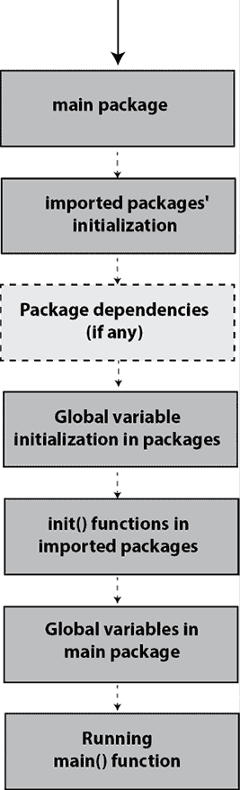
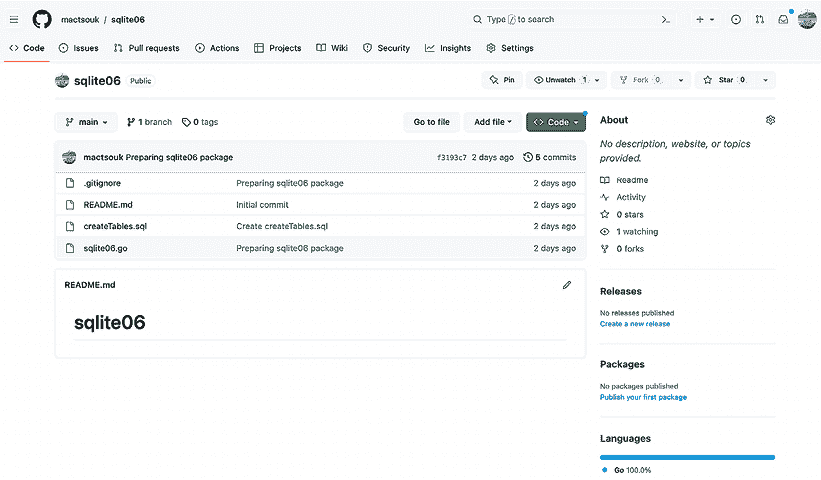
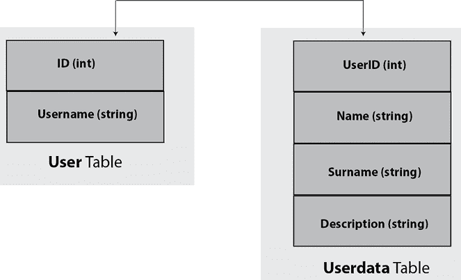

# 6

# Go 包和函数

本章的重点是 Go 包，这是 Go 组织、交付和使用代码的方式。包用于组织代码中的相关功能。作为包的作者，你设计包，包括由导出的常量、变量、类型和函数组成的公共 API。Go 还支持模块，模块包含一个或多个包。模块按照 SemVer 进行版本控制，允许模块作者使用`major.minor.patch`版本控制方案发布更新，甚至进行破坏性更改。本章还将解释`defer`的操作，它通常用于清理和释放资源。

关于包元素的可见性，Go 遵循一个简单的规则，即以大写字母开头的函数、变量、数据类型、结构字段等是公共的，而以小写字母开头的函数、变量、类型等是私有的。这就是为什么`fmt.Println()`被命名为`Println()`而不是仅仅`println()`的原因。同样的规则不仅适用于结构变量的名称，也适用于结构变量的字段——在实践中，这意味着你可以有一个既有私有字段又有公共字段的结构变量。然而，这个规则不影响包名，包名可以以大写或小写字母开头。实际上，包括`main`在内的包名都是小写的。

Go 有一个简单的指导原则：**不要过早使用其任何功能**。这个原则适用于泛型、接口和包。简单来说，不要仅仅因为可以创建包就创建包。从`main`包开始开发你的应用程序，并在`main`包中编写你的函数，直到你发现相同的代码需要被其他 Go 应用程序使用，或者你正在编写太多可以分组到包中的函数。在这种情况下，将相关功能分组到单独的包中是非常有意义的。开发代码在单独包中的其他原因包括封装、测试和暴露功能的安全性。

总结来说，本章涵盖了：

+   Go 包

+   函数

+   Big O 复杂度

+   开发自己的包

+   使用 GitHub 存储 Go 包

+   模块

+   创建更好的包

+   创建文档

+   工作区

+   版本控制工具

# Go 包

Go 中的所有内容都是以包的形式提供的。Go 包是一个以`package`关键字开始的 Go 源文件，后面跟着包的名字。

注意，包可以有结构。例如，`net`包有几个子目录，分别命名为`http`、`mail`、`rpc`、`smtp`、`textproto`和`url`，分别应该导入为`net/http`、`net/mail`、`net/rpc`、`net/smtp`、`net/textproto`和`net/url`。

除了 Go 标准库的软件包之外，还有使用它们的完整地址导入的外部软件包，在首次使用之前应在本地机器上下载。一个这样的例子是 [`github.com/spf13/cobra`](https://github.com/spf13/cobra)，它存储在 GitHub 上。

软件包主要用于将 **相关** 的函数、变量和常量分组，以便您可以轻松地传输它们并在自己的 Go 程序中使用它们。请注意，除了 `main` 软件包之外，Go 软件包不是独立的程序，不能单独编译成可执行文件。因此，如果您尝试像独立程序一样执行 Go 软件包，您将会失望：

```go
$ go run aPackage.go
go run: cannot run non-main package 
```

相反，为了使用，软件包需要直接或间接地从 `main` 软件包中调用，正如我们在前面的章节中所展示的那样。

## 关于 go get 和 go install

在本小节中，您将学习如何使用 [`github.com/spf13/cobra`](https://github.com/spf13/cobra) 作为示例下载外部 Go 软件包。下载 `cobra` 软件包的 `go get` 命令如下：

```go
$ go get github.com/spf13/cobra 
```

然而，正如我们很快将要学习的，在所有最近的 Go 版本中，推荐下载软件包的方式是使用 `go install`。您可以在 [`go.dev/doc/go-get-install-deprecation`](https://go.dev/doc/go-get-install-deprecation) 上了解更多关于这个变化的信息。

注意，您可以在地址中不使用 `https://` 的情况下下载该软件包。结果可以在 `~/go` 目录中找到——完整路径是 `~/go/src/github.com/spf13/cobra`。由于 `cobra` 软件包附带一个帮助您构建和创建命令行工具的二进制文件，因此您可以在 `~/go/bin` 中找到该二进制文件，名为 `cobra`。

以下输出是通过 `tree(1)` 工具创建的，它显示了我机器上 `~/go` 结构的高级视图，包含 3 个级别的细节：

```go
$ tree ~/go -L 3
/Users/mtsouk/go
├── bin
│   ├── benchstat
│   ├── client
│   ├── cobra
│   ├── dlv
│   ├── dlv-dap
│   ├── fillstruct
│   ├── go-outline
│   ├── go-symbols
│   ├── gocode
│   ├── gocode-gomod
│   ├── godef
│   ├── godoc
│   ├── godoctor
│   ├── golint
│   ├── gomodifytags
│   ├── gopkgs
│   ├── goplay
│   ├── gopls
│   ├── gorename
│   ├── goreturns
│   ├── gotests
│   ├── guru
│   ├── impl
│   └── staticcheck
├── pkg
│   ├── darwin_amd64
│   │   └── github.com
│   └── sumdb
│       └── sum.golang.org
└── src
    ├── document
    │   └── document.go
    ├── github.com
    │   ├── agext
    │   ├── apparentlymart
    │   ├── fsnotify
    │   ├── hashicorp
    │   ├── mactsouk
    │   ├── magiconair
    │   ├── mitchellh
    │   ├── pelletier
    │   ├── spf13
    │   ├── subosito
    │   └── zclconf
    ├── golang.org
    │   └── x
    └── gopkg.in
        ├── ini.v1
        └── yaml.v2
26 directories, 25 files 
```

输出末尾附近显示的 `x` 路径被 Go 团队用于存储可能成为未来标准 Go 库一部分的实验性软件包。

基本上，`~/go` 下有三个主要目录，具有以下属性：

+   `bin` 目录：这是放置二进制工具的地方。

+   `pkg` 目录：这是放置可重用软件包的地方。仅在 macOS 机器上可以找到的 `darwin_amd64` 目录包含已安装软件包的编译版本。在 Linux 机器上，您将找到一个 `linux_amd64` 目录而不是 `darwin_amd64`。

+   `src` 目录：这是软件包源代码所在的位置。其底层结构基于您要查找的软件包的 URL。因此，`github.com/spf13/viper` 软件包的 URL 是 `~/go/src/github.com/spf13/viper`。如果软件包作为模块下载，则它将位于 `~/go/pkg/mod` 下。

从 Go 1.16 版本开始，`go install`是推荐在模块模式下构建和安装包的方式，你应该只使用这种方式。`go get`的使用已被弃用，但本章使用`go get`是因为它在网络上很常见，并且值得了解。然而，本书的大部分章节都使用`go mod init`和`go mod tidy`来下载外部依赖项，这是推荐的方式。

如果你想要升级现有的包，你应该使用带有`-u`选项的`go get`命令。另外，如果你想查看幕后发生的事情，可以将`-v`选项添加到`go get`命令中——在这个例子中，我们使用 Viper 包作为示例，但我们简化了输出：

```go
$ go get -v github.com/spf13/viper
github.com/spf13/viper (download)
...
github.com/spf13/afero (download)
get "golang.org/x/text/transform": found meta tag get.metaImport{Prefix:"golang.org/x/text", VCS:"git", RepoRoot:"https://go.googlesource.com/text"} at //golang.org/x/text/transform?go-get=1
get "golang.org/x/text/transform": verifying non-authoritative meta tag
...
github.com/fsnotify/fsnotify
github.com/spf13/viper 
```

你在输出中基本上可以看到的是在下载所需包之前下载的初始包的依赖关系——大多数时候，你并不想了解这些。

我们将继续本章，通过查看最重要的包元素：函数。

# 函数

包的主要元素是函数，这是本节的主题。

类型方法和函数的实现方式相同，有时函数和类型方法的术语可以互换使用。

一条建议：函数应该尽可能地相互独立，并且必须做好一项工作（而且只做一项工作）。所以，如果你发现自己正在编写做多项工作的函数，你可能想要考虑用多个函数来替换它们。

你应该已经知道，所有的函数定义都是以`func`关键字开始的，后面跟着函数的签名和实现，函数可以接受零个、一个或多个参数，并返回零个、一个或多个值。最流行的 Go 函数是`main()`，它在每个可执行的 Go 程序中使用——`main()`函数不接受任何参数也不返回任何内容，但它是每个 Go 程序的起点。此外，当`main()`函数及其执行的 goroutine 结束时，整个程序也会随之结束。

## 匿名函数

匿名函数可以内联定义，无需命名，通常用于实现需要少量代码的事情。在 Go 中，一个函数可以返回一个匿名函数，或者将匿名函数作为其参数之一。此外，匿名函数可以附加到 Go 变量上。请注意，在函数式编程术语中，匿名函数被称为*lambda*。同样，*闭包*是一种特定的匿名函数，它携带或封闭了与匿名函数定义相同的词法作用域中的变量。

被认为是一个好的实践，匿名函数应该有小的实现和局部焦点。如果一个匿名函数没有局部焦点，那么你可能需要考虑将其改为普通函数。当一个匿名函数适合一项工作时，它极其方便，可以使你的生活更轻松；只是不要在没有充分理由的情况下在你的程序中使用太多的匿名函数。我们将在稍后看看匿名函数的实际应用。

## 返回多个值的函数

如您从`strconv.Atoi()`等函数中已经知道，函数可以返回多个不同的值，这使您不必为从函数返回和接收多个值创建一个专门的结构。然而，如果您有一个返回值超过 3 个的函数，您应该重新考虑这个决定，也许重新设计它以使用单个结构或切片来分组并作为单个实体返回所需的值——这使得处理返回值更简单、更容易。函数、匿名函数以及返回多个值的函数都在`functions.go`中展示，如下面的代码所示：

```go
package main
import "fmt"
func doubleSquare(x int) (int, int) {
    return x * 2, x * x
} 
```

这个函数返回两个`int`类型的值，无需使用单独的变量来保存它们——返回值是即时创建的。注意，当一个函数返回多个值时，必须使用括号。

```go
// Sorting from smaller to bigger value
func sortTwo(x, y int) (int, int) {
    if x > y {
        return y, x
    }
    return x, y
} 
```

前面的函数也返回两个`int`类型的值。

```go
func main() {
    n := 10
    d, s := doubleSquare(n) 
```

前一个语句读取了`doubleSquare()`的两个返回值，并将它们保存在`d`和`s`中。

```go
 fmt.Println("Double of", n, "is", d)
    fmt.Println("Square of", n, "is", s)
    // An anonymous function
    anF := func(param int) int {
        return param * param
    } 
```

`anF`变量持有一个需要单个参数作为输入并返回单个值的匿名函数。匿名函数与普通函数的唯一区别是匿名函数的名字是`func()`，并且没有`func`关键字。

```go
 fmt.Println("anF of", n, "is", anF(n))
    fmt.Println(sortTwo(1, -3))
    fmt.Println(sortTwo(-1, 0))
} 
```

最后两个语句打印了`sortTwo()`的返回值。运行`functions.go`将产生以下输出：

```go
Double of 10 is 20
Square of 10 is 100
anF of 10 is 100
-3 1
-1 0 
```

下一个子节将说明具有命名返回值的函数。

## 函数的返回值可以命名

与 C 语言不同，Go 语言允许你为 Go 函数的返回值命名。此外，当这样的函数有一个不带任何参数的`return`语句时，函数会自动返回每个命名返回值的当前值，其顺序与它们在函数签名中声明的顺序相同。

以下函数包含在`namedReturn.go`中：

```go
func minMax(x, y int) (min, max int) {
    if x > y {
        min = y
        max = x
        return min, max 
```

这个`return`语句返回了存储在`min`和`max`变量中的值——`min`和`max`都在函数签名中定义，而不是在函数体中。

```go
 }
    min = x
    max = y
    return
} 
```

这个`return`语句等同于`return min, max`，这是基于函数签名和命名返回值的使用。

运行`namedReturn.go`将产生以下输出：

```go
$ go run namedReturn.go 1 -2
-2 1
-2 1 
```

## 接受其他函数作为参数的函数

函数可以接受其他函数作为参数。在`sort`包中可以找到接受另一个函数作为参数的最佳示例。你可以向`sort.Slice()`函数提供一个函数作为参数，该参数指定了排序的实现方式。`sort.Slice()`的签名是`func Slice(slice interface{}, less func(i, j int) bool)`。这意味着以下内容：

+   `sort.Slice()`函数不返回任何数据。

+   `sort.Slice()`函数需要两个参数，一个类型为`interface{}`的切片和另一个函数——切片变量在`sort.Slice()`内部被修改。

+   `sort.Slice()`的函数参数名为`less`，应该具有`func(i, j int) bool`签名——你不需要为匿名函数命名。`less`这个名字是必需的，因为所有函数参数都应该有一个名字。

+   `less`的`i`和`j`参数是切片参数的索引。

类似地，在`sort`包中还有一个名为`sort.SliceIsSorted()`的函数，定义为`func SliceIsSorted(slice interface{}, less func(i, j int) bool) bool`。`sort.SliceIsSorted()`返回一个`bool`值，并检查切片参数是否根据第二个参数（一个函数）的规则排序。

你在`sort.Slice()`或`sort.SliceIsSorted()`中并不强制使用匿名函数。你可以定义一个具有所需签名的常规函数并使用它。然而，使用匿名函数更为方便。

下面的 Go 程序展示了`sort.Slice()`和`sort.SliceIsSorted()`的使用——源文件的名称是`sorting.go`：

```go
package main
import (
    "fmt"
"sort"
)
type Grades struct {
    Name    string
    Surname string
    Grade   int
}
func main() {
    data := []Grades{{"J.", "Lewis", 10}, {"M.", "Tsoukalos", 7},
        {"D.", "Tsoukalos", 8}, {"J.", "Lewis", 9}}
    isSorted := sort.SliceIsSorted(data, func(i, j int) bool {
        return data[i].Grade < data[j].Grade
    }) 
```

下面的`if else`块检查`sort.SliceIsSorted()`的`bool`值以确定切片是否已排序：

```go
 if isSorted {
        fmt.Println("It is sorted!")
    } else {
        fmt.Println("It is NOT sorted!")
    }
    sort.Slice(data,
        func(i, j int) bool { return data[i].Grade < data[j].Grade })
    fmt.Println("By Grade:", data)
} 
```

对`sort.Slice()`的调用根据作为`sort.Slice()`第二个参数传递的匿名函数对数据进行排序。

运行`sorting.go`会产生以下输出：

```go
It is NOT sorted!
By Grade: [{M. Tsoukalos 7} {D. Tsoukalos 8} {J. Lewis 9} {J. Lewis 10}] 
```

## 函数可以返回其他函数。

除了接受函数作为参数外，函数还可以返回匿名函数，这在返回的函数不总是相同而是依赖于函数的输入或其他外部参数时非常有用。这可以在`returnFunction.go`中看到：

```go
package main
import "fmt"
func funRet(i int) func(int) int {
    if i < 0 {
        return func(k int) int {
            k = -k
            return k + k
        }
    }
    return func(k int) int {
        return k * k
    }
} 
```

`funRet()`函数签名的声明表明该函数返回一个具有`func(int) int`签名的另一个函数。函数的实现是未知的，但它将在运行时定义。函数是通过`return`关键字返回的。开发者应该小心并保存返回的函数。

```go
func main() {
    n := 10
    i := funRet(n)
    j := funRet(-4) 
```

注意，`n`和`-4`仅用于确定从`funRet()`返回的匿名函数。

```go
 fmt.Printf("%T\n", i)
    fmt.Printf("%T %v\n", j, j)
    fmt.Println("j", j, j(-5)) 
```

第一条语句打印函数的签名，而第二条语句打印函数签名及其内存地址。最后一条语句还返回 `j` 的内存地址，因为 `j` 是匿名函数的指针以及 `j(-5)` 的值。

```go
 // Same input parameter but DIFFERENT
// anonymous functions assigned to i and j
    fmt.Println(i(10))
    fmt.Println(j(10))
} 
```

虽然 `i` 和 `j` 都使用相同的输入（`10`）调用，但它们将返回不同的值，因为它们存储了不同的匿名函数。

运行 `returnFunction.go` 生成以下输出：

```go
func(int) int
func(int) int 0x100d446c0
j 0x100d446c0 10
100
-20 
```

输出的第一行显示了保存 `funRet(n)` 返回值的 `i` 变量的数据类型，它是 `func(int) int`，因为它保存了一个函数。输出的第二行显示了 `j` 的数据类型，以及存储匿名函数的内存地址。第三行显示了存储在 `j` 变量中的匿名函数的内存地址，以及 `j(-5)` 的返回值。最后两行分别是 `i(10)` 和 `j(10)` 的返回值。

因此，在本小节中，我们学习了返回函数的函数。这使 Go 语言能够从函数式编程范式中受益，并使 Go 函数成为一等公民。

我们现在将检查可变参数函数，这些函数具有可变数量的参数。

## 可变参数函数

可变参数函数是可以接受可变数量参数的函数——你已经知道 `fmt.Println()` 和 `append()`，它们都是广泛使用的可变参数函数。事实上，`fmt` 包中的大多数函数都是可变参数函数。

可变参数函数背后的通用思想和规则如下：

+   可变参数函数使用打包操作符，它由一个 `...` 后跟一个数据类型组成。因此，为了使可变参数函数接受可变数量的 `int` 值，打包操作符应该是 `...int`。

+   打包操作符在任何给定的函数中只能使用一次。

+   保存打包操作的变量是一个切片，因此，在可变参数函数内部作为切片来访问。

+   与打包操作符相关的变量名总是位于函数参数列表的末尾。

+   当调用可变参数函数时，你应该在打包操作符变量或解包操作符切片的位置放置一个由逗号分隔的值列表。

打包操作符也可以与空接口一起使用。事实上，`fmt` 包中的大多数函数都使用 `...interface{}` 来接受所有数据类型的可变数量的参数。你可以在 [`go.dev/src/fmt/`](https://go.dev/src/fmt/) 找到 `fmt` 的最新实现源代码。

然而，这里有一个需要特别注意的情况——我在学习 Go 语言时犯了这个错误，我在想我得到的错误信息是什么。

如果你尝试将 `os.Args`（一个字符串切片 `[]string`）作为 `...interface{}` 传递给一个可变参数函数，你的代码将无法编译，并生成类似于 `cannot use os.Args (type []string) as type []interface {} in argument to <function_name>` 的错误信息。这是因为这两种数据类型（`[]string` 和 `[]interface{}`）在内存中的表示不同——这适用于所有数据类型。在实践中，这意味着你不能将 `os.Args...` 写入以将 `os.Args` 切片的每个单独值传递给一个可变参数函数。

另一方面，如果你只是使用 `os.Args`，它将工作，但这样会将整个切片作为一个单一实体传递，而不是其单独的值！这意味着 `everything(os.Args, os.Args)` 语句可以工作，但并不做你想要的事情。

解决这个问题的方法是将字符串切片（或任何其他切片）转换为 `interface{}` 切片。实现这一目标的一种方法是通过以下代码：

```go
empty := make([]interface{}, len(os.Args[1:]))
for i, v := range os.Args {
    empty[i] = v
} 
```

现在，你可以使用 `empty...` 作为可变参数函数的参数。这是与可变参数函数和解包操作符相关的唯一微妙之处。

这种方法是一个例外，并且只有在用户必须将整个 `os.Args` 切片作为参数传递给类似 `fmt.Println()` 的函数时才应使用。主要原因是因为这消除了编译器的一些保证。

由于没有标准库函数为你执行这种转换，你必须编写自己的代码。请注意，转换需要时间，因为代码必须访问所有切片元素。切片中的元素越多，转换所需的时间就越长。这个话题也在 [`github.com/golang/go/wiki/InterfaceSlice`](https://github.com/golang/go/wiki/InterfaceSlice) 中进行了讨论。

我们现在可以查看可变参数函数的实际应用。使用你喜欢的文本编辑器输入以下 Go 代码，并将其保存为 `variadic.go`：

```go
package main
import (
    "fmt"
"os"
) 
```

由于可变参数函数是内置于语言语法中的，因此你不需要任何额外的东西来支持可变参数函数。

```go
func addFloats(message string, s ...float64) float64 { 
```

这是一个接受一个字符串和未知数量的 `float64` 值的可变参数函数。它打印字符串变量并计算 `float64` 值的总和。

```go
 fmt.Println(message)
    sum := float64(0)
    for _, a := range s {
        sum = sum + a
    } 
```

这个 `for` 循环将打包操作符作为切片访问，所以这里没有什么特别之处。

```go
 s[0] = -1000
return sum
} 
```

你也可以访问 `s` 切片的单个元素。

```go
func everything(input ...interface{}) {
    fmt.Println(input)
} 
```

这是一个接受未知数量 `interface{}` 值的可变参数函数。

```go
func main() {
    sum := addFloats("Adding numbers...", 1.1, 2.12, 3.14, 4, 5, -1, 10) 
```

你可以将可变参数函数的参数内联。

```go
 fmt.Println("Sum:", sum)
    s := []float64{1.1, 2.12, 3.14} 
```

但你通常使用带有解包操作符的切片变量：

```go
 sum = addFloats("Adding numbers...", s...)
    fmt.Println("Sum:", sum)
    everything(s) 
```

之前的代码之所以能工作，是因为 `s` 的内容没有被解包。

```go
 // Cannot directly pass []string as []interface{}
// You have to convert it first!
    empty := make([]interface{}, len(os.Args[1:])) 
```

你可以将 `[]string` 转换为 `[]interface{}` 以使用解包操作符。

```go
 for i, v := range os.Args[1:] {
        empty[i] = v
    }
    everything(empty...) 
```

现在，我们可以解包 `empty` 的内容。

```go
 arguments := os.Args[1:]
    empty = make([]interface{}, len(arguments))
    for i := range arguments {
        empty[i] = arguments[i]
    } 
```

这是一种将 `[]string` 转换为 `[]interface{}` 的稍微不同方法。

```go
 everything(empty...)
    str := []string{"One", "Two", "Three"}
    everything(str, str, str)
} 
```

前一个语句之所以有效，是因为你传递了整个 `str` 变量三次——而不是它的内容。因此，切片包含三个元素——每个元素等于 `str` 变量的内容。

运行 `variadic.go` 产生以下输出：

```go
$ go run variadic.go
Adding numbers...
Sum: 24.36
Adding numbers...
Sum: 6.36
[[-1000 2.12 3.14]]
[]
[]
[[One Two Three] [One Two Three] [One Two Three]] 
```

输出的最后一行显示，我们已经将 `str` 变量三次传递给 `everything()` 函数作为三个不同的实体。

可变参数函数在你想要在函数中有一个未知数量的参数时非常有用。下一小节将讨论 `defer` 的使用，我们已经多次使用过了。

## `defer` 关键字

到目前为止，我们在 `ch03/csvData.go` 中看到了 `defer`。但 `defer` 究竟做了什么？`defer` 关键字将函数的执行推迟到周围函数返回时。

通常，`defer` 在文件 I/O 操作中使用，以便将关闭已打开文件的函数调用与打开它的调用保持接近，这样你就不必记得在函数退出前关闭你刚刚打开的文件。

记住这一点非常重要，即延迟执行的函数在周围函数返回后按 **后进先出**（**LIFO**）顺序执行。简单来说，这意味着如果你在同一个周围函数中首先 `defer` 函数 `f1()`，然后 `f2()`，最后 `f3()`，那么当周围函数即将返回时，`f3()` 将首先执行，`f2()` 将其次执行，而 `f1()` 将是最后一个被执行的。

在本节中，我们将通过一个简单的程序讨论粗心使用 `defer` 的危险。`defer.go` 的代码如下：

```go
package main
import (
    "fmt"
)
func d1() {
    for i := 3; i > 0; i-- {
        defer fmt.Print(i, " ")
    }
} 
```

在 `d1()` 中，`defer` 在函数体内通过一个 `fmt.Print()` 调用来执行。记住，这些对 `fmt.Print()` 的调用是在函数 `d1()` 返回之前执行的。

```go
func d2() {
    for i := 3; i > 0; i-- {
        defer func() {
            fmt.Print(i, " ")
        }()
    }
    fmt.Println()
} 
```

在 `d2()` 中，`defer` 被附加到一个不接受任何参数的匿名函数上。在实践中，这意味着匿名函数应该自己获取 `i` 的值——这是危险的，因为 `i` 的当前值取决于匿名函数的执行时间。

匿名函数是一个 *闭包*，这就是为什么它可以访问通常超出作用域的变量。

```go
func d3() {
    for i := 3; i > 0; i-- {
        defer func(n int) {
            fmt.Print(n, " ")
        }(i)
    }
} 
```

在这种情况下，当前 `i` 的值作为参数传递给匿名函数，以初始化 `n` 函数参数。这意味着关于 `i` 的值没有歧义。

```go
func main() {
    d1()
    d2()
    fmt.Println()
    d3()
    fmt.Println()
} 
```

`main()` 的任务是调用 `d1()`、`d2()` 和 `d3()`。

运行 `defer.go` 产生以下输出：

```go
$ go run defer.go
1 2 3
0 0 0
1 2 3 
```

你很可能会发现生成的输出很复杂，难以理解，这证明了如果代码不清晰且不明确，`defer` 的操作和结果可能会很棘手。让我解释一下结果，以便你更好地了解如果不仔细注意你的代码，`defer` 可能有多棘手。

让我们从由`d1()`函数生成的输出（`1 2 3`）的第一行开始。`d1()`中的`i`值按顺序是`3`、`2`和`1`。在`s`中延迟的函数是`fmt.Print()`语句；因此，当`d1()`函数即将返回时，你会得到`for`循环中`i`变量的三个值的逆序。这是因为**延迟函数是按照后进先出（LIFO）顺序执行的**。

现在，让我解释由`d2()`函数生成的输出的第二行。我们得到了三个零而不是`1 2 3`，这真的很奇怪；然而，这有一个原因——请注意，这不是`defer`的问题，而是闭包的问题。在`for`循环结束后，`i`的值是`0`，因为正是这个`i`的值使得`for`循环终止。然而，这里的难点在于延迟的匿名函数是在`for`循环结束后评估的，因为它没有参数，这意味着它被评估了三次，对于`i`的值为`0`，因此生成了输出。这种令人困惑的代码可能会导致你的项目中出现讨厌的 bug，所以尽量避开它。Go 版本 1.22 纠正了这类错误。

最后，我们将讨论由`d3()`函数生成的输出的第三行。由于匿名函数的参数，每次匿名函数被延迟时，它都会获取并因此使用`i`的当前值。因此，每次匿名函数的执行都有一个不同的值要处理，没有任何歧义，因此生成了输出。

之后，应该很清楚，使用`defer`的最佳方法就是第三种，这在`d3()`函数中得到了体现，因为你在匿名函数中故意以易于阅读的方式传递所需的变量。现在我们已经了解了`defer`，是时候讨论一些完全不同的事情了：大 O 符号。

# 大 O 复杂度

算法的计算复杂度通常使用流行的大 O 符号表示。大 O 符号用于表达算法增长顺序的最坏情况。它显示了随着处理的数据规模的增长，算法性能如何变化。

`O(1)`表示常数时间复杂度，它不依赖于手头的数据量。`O(n)`表示执行时间与`n`成正比（线性时间）——你无法处理未访问的数据，因此`O(n)`被认为是好的。`O(n²)`（二次时间）表示执行时间与`n²`成正比。`O(n!)`（阶乘时间）表示算法的执行时间与`n`的阶乘成正比。简单来说，如果你必须处理 100 个某种类型的值，那么`O(n)`算法将执行大约 100 次操作，`O(n²)`将执行大约 10,000 次操作，而具有`O(n!)`复杂度的算法将执行`10`¹⁵⁸次操作！

现在我们已经学习了 Big O 表示法，是时候讨论开发自己的包了。

# 开发自己的包

在某个时候，你需要开发自己的包来组织你的代码，并在需要时分发它们。正如本章开头所述，所有以大写字母开头的内容都被认为是公共的，可以从其包外部访问，而所有其他元素都被认为是私有的。Go 规则的唯一例外是包名——使用小写包名是一种最佳实践，尽管允许使用大写包名。

如果包存在于本地机器上，可以手动编译 Go 包，但下载包后也会自动编译，因此无需担心。另外，如果你下载的包中包含任何错误，你将在尝试下载时了解到它们。

然而，如果你想自己编译保存在 `sqlite06.go` 文件（SQLite 和第六章的组合）中的包，可以使用以下命令：

```go
$ go build -o sqlite06.a sqlite06.go 
```

因此，之前的命令编译了 `sqlite06.go` 文件，并将输出保存到 `sqlite06.a` 文件中：

```go
$ file sqlite06.a
sqlite06.a: current ar archive
The sqlite06.a file is an ar archive. 
```

在自己编译 Go 包的主要原因是为了检查代码中的语法或其他类型的错误，而不实际使用它们。此外，你可以将 Go 包作为插件 ([`pkg.go.dev/plugin`](https://pkg.go.dev/plugin)) 或共享库来构建。关于这些的更多讨论超出了本书的范围。

## init() 函数

每个 Go 包可以有一个名为 `init()` 的私有函数，它在程序执行开始时自动执行——`init()` 在包初始化时运行。`init()` 函数具有以下特性：

+   `init()` 不接受任何参数。

+   `init()` 不返回任何值。

+   `init()` 函数是可选的。

+   `init()` 函数由 Go 隐式调用。

+   你可以在 `main` 包中有一个 `init()` 函数。在这种情况下，`init()` 在 `main()` 函数之前执行。实际上，所有 `init()` 函数总是在 `main()` 函数之前执行。

+   源文件可以包含多个 `init()` 函数——这些函数按声明顺序执行。

+   `init()` 函数或包中的函数仅执行 **一次**，即使包被导入多次。

+   Go 包可以包含多个文件。每个源文件可以包含一个或多个 `init()` 函数。

+   `init()` 函数被设计为私有函数的事实意味着它不能从包含它的包外部调用。此外，由于包的使用者无法控制 `init()` 函数，因此在公共包中使用 `init()` 函数或更改 `init()` 中的任何全局状态之前，你应该仔细思考。

有一些例外情况，使用 `init()` 是有意义的：

+   用于初始化在包函数或方法执行之前可能需要花费时间的网络连接。

+   用于在执行包函数或方法之前初始化连接到一个或多个服务器。

+   用于创建所需的文件和目录。

+   用于检查所需资源是否可用。

由于执行顺序有时可能会令人困惑，在下一小节中，我们将更详细地解释执行顺序。

## 执行顺序

本小节说明了 Go 代码是如何执行的。例如，如果 `main` 包导入了包 `A`，而包 `A` 依赖于包 `B`，那么以下情况将会发生：

1.  该过程从 `main` 包开始。

1.  `main` 包导入包 `A`。

1.  包 `A` 导入包 `B`。

1.  如果有，包 `B` 中的全局变量被初始化。

1.  如果存在，包 `B` 的 `init()` 函数或函数将会运行。这是第一个被执行的 `init()` 函数。

1.  如果有，包 `A` 中的全局变量被初始化。

1.  如果有，包 `A` 的 `init()` 函数或函数将会运行。

1.  `main` 包中的全局变量被初始化。

1.  `init()` 函数或 `main` 包中的函数（如果存在），将会运行。

1.  `main` 包的 `main()` 函数开始执行。

注意，如果 `main` 包单独导入包 `B`，则不会发生任何事，因为与包 `B` 相关的所有内容都是由包 `A` 触发的。这是因为包 `A` 首先导入了包 `B`。

以下图表展示了关于 Go 代码执行顺序幕后发生的事情：



图 6.1：Go 代码执行顺序

你可以通过阅读 [`go.dev/ref/spec#Order_of_evaluation`](https://go.dev/ref/spec#Order_of_evaluation) 中的 Go 语言规范文档来了解更多关于执行顺序的信息，以及通过阅读 [`go.dev/ref/spec#Package_initialization`](https://go.dev/ref/spec#Package_initialization) 来了解包初始化过程。

# 使用 GitHub 存储 Go 包

本节将教你如何创建一个 GitHub 仓库，你可以在这里存放你的 Go 包并将其提供给全世界。

首先，你需要自己创建 GitHub 仓库。创建新 GitHub 仓库最简单的方法是访问 GitHub 网站，然后转到 **Repositories** 标签，在那里你可以看到你的现有仓库并创建新的仓库。点击 **New** 按钮，并输入创建新 GitHub 仓库所需的信息。如果你将你的仓库设置为公开，每个人都可以看到它——如果它是一个私有仓库，只有你选择的人才能查看。

在你的 GitHub 仓库中有一个清晰的 `README.md` 文件，解释 Go 包的工作方式，这是一个非常好的实践。

接下来，您需要在您的本地计算机上克隆仓库。我通常使用`git(1)`实用程序来克隆它。如果仓库的名称是`sqlite06`，GitHub 用户名是`mactsouk`，那么`git clone`命令将如下所示：

```go
$ git clone git@github.com:mactsouk/sqlite06.git 
```

然后，输入`cd sqlite06`，您就完成了！在这个时候，您只需编写 Go 包的代码，并记得将更改`git commit`和`git push`到 GitHub 仓库。

将 Go 包托管、检查、开发或使用的最佳位置是`~/go/src`目录。简单来说，`~/go/src`的目的就是存储您创建或使用的包的源代码。

这种仓库的外观可以在*图 6.2*中看到——您将在稍后了解更多关于`sqlite06`仓库的信息：



图 6.2：一个包含 Go 包的 GitHub 仓库

使用 GitLab 而不是 GitHub 来托管您的代码，不需要改变您的工作方式。

如果您想使用该包，只需使用其 URL 通过`go get`获取该包，并将其包含在您的`import`块中——我们将在实际使用程序时看到这一点。**前面的过程是关于开发 Go 包，而不是使用 Go 包**。

下一节将介绍一个 Go 包，允许您与数据库交互。

# 用于与 SQLite 一起工作的包

本节将开发一个 Go 包，用于与存储在 SQLite 数据库上的给定数据库模式交互，最终目标是展示如何开发、存储和使用包。当与您的应用程序中的特定模式和表交互时，您通常创建包含所有数据库相关函数的单独包——这也适用于 NoSQL 数据库。

Go 提供了一个通用的包([`pkg.go.dev/database/sql`](https://pkg.go.dev/database/sql))，用于与数据库交互。然而，每个数据库都需要一个特定的包，作为驱动程序，允许 Go 连接并使用该特定数据库。

创建所需 Go 包的步骤如下：

+   下载用于与 SQLite 一起工作的必要外部 Go 包。

+   创建包文件。

+   开发所需的功能。

+   使用 Go 包来开发实用程序并测试其功能。

+   使用 CI/CD 工具进行自动化（这是可选的）。

您可能想知道为什么我们会创建这样一个用于与数据库工作的包，而不是在需要时在程序中编写实际的命令。原因包括以下几点：

+   Go 包可以被所有与该应用程序一起工作的团队成员共享。

+   Go 包允许人们以文档化的方式使用数据库。

+   您在 Go 包中放入的专业函数非常适合您的需求。

+   人们不需要完全访问数据库——他们只需使用包函数和它们提供的功能。

+   如果你对数据库进行了更改，人们不需要知道这些更改，只要 Go 包的功能保持不变即可。

简而言之，你创建的函数可以与特定的数据库模式、表和数据交互——如果不了解表是如何相互连接的，几乎不可能与未知的数据库模式一起工作。

除了所有这些技术原因之外，创建供多个开发者共享的 Go 包真的很有趣！

让我们继续学习更多关于 SQLite 数据库的知识。

## 使用 SQLite3 和 Go

你需要下载一个额外的包来处理数据库，例如 Postgres、SQLite、MySQL 或 MongoDB。在这种情况下，我们使用 SQLite，因此需要下载一个允许我们与 SQLite 通信的 Go 包。用于处理 SQLite3 的最流行的 Go 包称为 `go-sqlite3`，可以在 [`github.com/mattn/go-sqlite3`](https://github.com/mattn/go-sqlite3) 找到。

SQLite 数据库是单个文件，本地访问，因此不需要任何 TCP/IP 服务或其他服务器进程运行。

你可以通过运行 `go get github.com/mattn/go-sqlite3` 来下载该包。然而，这个命令在模块外部不再有效。安装包的新方法是运行 `go install github.com/mattn/go-sqlite3@latest`。

请记住，这个包使用 cgo，这需要在你的计算机上安装 gcc 编译器。有关更多详细信息，请访问 [`github.com/mattn/go-sqlite3`](https://github.com/mattn/go-sqlite3)。

在成功执行前面的命令后，**包的最新版本**将被下载。在我的情况下，`go-sqlite3` 包的源代码可以在 `~/go/pkg/mod/github.com/mattn` 找到：

```go
$ ls ~/go/pkg/mod/github.com/mattn
go-sqlite3@v1.14.22 
```

因此，下载的 `go-sqlite3` 包的版本是 `1.14.22`。或者，你可以让 `go mod init` 和 `go mod tidy` 命令为你完成工作。

在使用 SQLite3 进行任何实际工作之前，我们将展示一个简单的实用工具，它只是连接到数据库并打印 SQLite3 的版本。在故障排除时，这些实用工具执行简单但关键的任务，因此非常有用。由于 `testSQLite.go` 使用外部包，在开发期间应将其放置在 `~/go/src` 下，并遵循 `go mod init` 和 `go mod tidy` 过程。在我的情况下，`testSQLite.go` 放在 `~/go/src/github.com/mactsouk/mGo4th/ch06/testSQLite` 目录中。

`testSQLite.go` 的代码分为两部分。第一部分如下：

```go
package main
import (
    "database/sql"
"fmt"
"os"
    _ "github.com/mattn/go-sqlite3"
)
func main() {
    // Connect or Create an SQLite database
    db, err := sql.Open("sqlite3", "test.db")
    if err != nil {
        fmt.Println("Error connecting:", err)
        return
    }
    defer db.Close() 
```

由于该包与 SQLite3 进行通信，我们导入 `github.com/mattn/go-sqlite3` 包，并在包路径前使用 `_`。这是因为导入的包正在**将自己注册为 `sql` 包的数据库处理器**，但在代码中并未直接使用。它仅通过 `sql` 包来使用。

使用前面的代码，我们使用 `sql.Open()` 连接到一个名为 `test.db` 的 SQLite3 数据库。如果 `test.db` 文件不存在，它将被创建。

第二部分包含以下 Go 代码：

```go
 var version string
    err = db.QueryRow("SELECT SQLITE_VERSION()").Scan(&version)
    if err != nil {
        fmt.Println("Version:", err)
        return
    }
    fmt.Println("SQLite3 version:", version)
os.Remove("test.db")
} 
```

在第二部分，我们使用 `db.QueryRow()` 查询 SQLite 数据库以获取其版本号信息。`QueryRow()` 对于执行预期最多返回一行数据的查询很有用，就像在我们的例子中一样。查询的返回值通过 `Scan()` 读取，并使用 `Scan()` 的参数指针保存到变量中。`os.Remove()` 语句删除 `test.db` 文件——一般来说，这不是一个好的做法，但在这个特定情况下它是有效的。

在第一次执行 `testSQLite.go` 之前，不要忘记执行 `go mod init` 和 `go mod tidy`。

运行 `testSQLite.go` 产生以下输出：

```go
$ go run testSQLite.go
SQLite3 version: 3.42.0 
```

现在，让我们开发一些更高级的内容。`connectSQLite3.go` 工具可以验证你能否创建一个 SQLite3 数据库和一些表，获取可用表的列表，在表中插入和更新数据，从表中选择数据，删除数据，以及获取记录数。由于该工具使用外部包，它应该放在 `~/go/src` 下，并遵循 `go mod init` 和 `go mod tidy` 的过程。在我的情况下，`connectSQLite3.go` 放在 `~/go/src/github.com/mactsouk/mGo4th/ch06/connectSQLite3`，但你可以在任何你想放置的地方，只要它位于 `~/go/src` 之下。

`connectSQLite3.go` 的代码将被分成六个部分，第一部分如下：

```go
package main
import (
    "database/sql"
"fmt"
"os"
"strconv"
"time"
    _ "github.com/mattn/go-sqlite3"
)
var dbname = "ch06.db"
func insertData(db *sql.DB, dsc string) error {
    cT := time.Now().Format(time.RFC1123)
    stmt, err := db.Prepare("INSERT INTO book VALUES(NULL,?,?);")
    if err != nil {
        fmt.Println("Insert data table:", err)
        return err
    }
    _, err = stmt.Exec(cT, dsc)
    if err != nil {
        fmt.Println("Insert data table:", err)
        return err
    }
    return nil
} 
```

`insertData()` 函数用于将数据插入到数据库中，并由 `main()` 函数调用。我们首先使用 `db.Prepare()` 构建带有所需参数的 `INSERT` SQL 语句，然后执行 `Exec()` 实际插入数据。在准备 SQL 语句时使用一个或多个 `?` 是一种常见的做法，并在调用 `Exec()` 时用实际值替换这些问号。

`connectSQLite3.go` 的第二部分包含以下代码：

```go
func selectData(db *sql.DB, n int) error {
    rows, err := **db.Query(****"SELECT * from book WHERE id > ? "****, n)**
if err != nil {
        fmt.Println("Select:", err)
        return err
    }
    defer rows.Close()
    for **rows.Next()** {
        var id int
var dt string
var description string
        err = rows.Scan(&id, &dt, &description)
        if err != nil {
            fmt.Println("Row:", err)
            return err
        }
        date, err := time.Parse(time.RFC1123, dt)
        if err != nil {
            fmt.Println("Date:", err)
            return err
        }
        fmt.Printf("%d %s %s\n", id, date, description)
    }
    return nil
} 
```

在本节的第二部分，我们展示了如何查询 SQLite3 数据并读取多行。我们使用 `db.Query()` 构建一个 `SELECT` SQL 查询，它返回一个 `*sql.Rows` 变量。然后我们通过多次调用 `Next()` 并使用一个 `for` 循环来读取行，当没有更多数据可读时，循环会自动终止。由于时间在 SQLite 中以文本形式存储，我们需要使用 `time.Parse()` 将其转换为适当的变量。`selectData()` 函数会自行打印数据，而不是将其返回给调用函数。

`db.Query()` 语句不需要 `Exec()` 来执行。因此，我们在同一语句中将 `?` 替换为实际值。

第三部分如下：

```go
func main() {
    // Delete database file
    os.Remove(dbname)
    // Connect and Create the SQLite database
    db, err := sql.Open("sqlite3", dbname)
    if err != nil {
        fmt.Println("Error connecting:", err)
        return
    }
    defer db.Close()
    // Create a table
const create string = `
    CREATE TABLE IF NOT EXISTS book (
      id INTEGER NOT NULL PRIMARY KEY,
      time TEXT NOT NULL,
      description TEXT);`
    _, err = db.Exec(create)
    if err != nil {
        fmt.Println("Create table:", err)
        return
    } 
```

在本部分中，我们连接到 SQLite3 数据库并创建一个名为`book`的表。该表有三个字段，分别命名为`id`、`time`和`description`。使用`db.Exec()`语句来执行`CREATE TABLE` SQL 命令。

`connectSQLite3.go`的第四部分包含以下代码：

```go
 // Insert 10 rows to the book table
for i := 1; i < 11; i = i + 1 {
        dsc := "Description: " + strconv.Itoa(i)
        err = insertData(db, dsc)
        if err != nil {
            fmt.Println("Insert data:", err)
        }
    }
    // Select multiple rows
    err = selectData(db, 5)
    if err != nil {
        fmt.Println("Select:", err)
    } 
```

之前的代码使用`insertData()`函数和`for`循环将十行插入到`book`表中。之后，调用`selectData()`函数从`book`表中选择数据。

`connectSQLite3.go`的第五部分包含以下 Go 代码：

```go
 time.Sleep(time.Second)
    // Update data
    cT := time.Now().Format(time.RFC1123)
    db.Exec("UPDATE book SET time = ? WHERE id > ?", cT, 7)
    // Select multiple rows
    err = selectData(db, 8)
    if err != nil {
        fmt.Println("Select:", err)
        return
    }
    // Delete data
    stmt, err := db.Prepare("DELETE from book where id = ?")
    _, err = stmt.Exec(8)
    if err != nil {
        fmt.Println("Delete:", err)
        return
    } 
```

在本部分中，我们展示了基于`db.Exec()`的`UPDATE` SQL 语句的实现——再次强调，`UPDATE` SQL 语句的值传递给`db.Exec()`。之后，我们调用`selectData()`来查看我们所做的更改。最后，我们使用`db.Prepare()`构建一个`DELETE`语句，该语句通过`Exec()`执行。

`connectSQLite3.go`的最后部分如下：

```go
 // Select multiple rows
    err = selectData(db, 7)
    if err != nil {
        fmt.Println("Select:", err)
        return
    }
    // Count rows in table
    query, err := db.Query("SELECT count(*) as count from book")
    if err != nil {
        fmt.Println("Select:", err)
        return
    }
    defer query.Close()
    count := -100
for query.Next() {
        _ = query.Scan(&count)
    }
    fmt.Println("count(*):", count)
} 
```

在工具的最后部分，我们使用`db.Query()`获取`book`表中的行数并打印结果。

如预期的那样，在执行`connectSQLite3.go`之前，你应该首先执行以下命令：

```go
$ go mod init
go: creating new go.mod: module github.com/mactsouk/mGo4th/ch06/connectSQLite3
go: to add module requirements and sums:
    go mod tidy
$ go mod tidy
go: finding module for package github.com/mattn/go-sqlite3
go: found github.com/mattn/go-sqlite3 in github.com/mattn/go-sqlite3 v1.14.17 
```

输出的最后一行告诉我们，`github.com/mattn/go-sqlite3`包在我们的 Go 安装中已找到，因此它没有被下载——这是由于我们之前执行的`go get github.com/mattn/go-sqlite3`命令的结果。

运行`connectSQLite3.go`会生成以下类型的输出：

```go
$ go run connectSQLite3.go
6 2023-08-16 21:12:00 +0300 EEST Description: 6
7 2023-08-16 21:12:00 +0300 EEST Description: 7
8 2023-08-16 21:12:00 +0300 EEST Description: 8
9 2023-08-16 21:12:00 +0300 EEST Description: 9
10 2023-08-16 21:12:00 +0300 EEST Description: 10
9 2023-08-16 21:12:01 +0300 EEST Description: 9
10 2023-08-16 21:12:01 +0300 EEST Description: 10
9 2023-08-16 21:12:01 +0300 EEST Description: 9
10 2023-08-16 21:12:01 +0300 EEST Description: 10
count(*): 9 
```

`connectSQLite3.go`工具的主要优势是它说明了如何在 SQLite 数据库上执行大量任务——大部分展示的代码将在我们即将创建的 Go 包中重用。

现在我们知道了如何使用 Go 访问和查询 SQLite3 数据库，下一个任务应该是实现我们想要开发的 Go 包。

## 存储 Go 包

如前所述，出于简单起见，我们将使用名为`sqilite06`的公共 Go 仓库作为 Go 模块，它可以在[`github.com/mactsouk/sqlite06`](https://github.com/mactsouk/sqlite06)找到。

要在您的机器上使用该包，您应该首先使用`go get`获取它，无论是手动还是通过`go mod init`和`go mod tidy`的帮助。然而，在开发过程中，您应该从`git clone git@github.com:mactsouk/sqlite06.git`开始，以获取 GitHub 仓库的内容并对其进行修改，直到其功能最终确定且没有错误。这意味着您已经设置了与 GitHub 的 ssh 连接，这是我通常使用的。我在`~/go/src/github.com/mactsouk/sqlite06`中开发`sqilite06`包。

## Go 包的设计

*图 6.3*显示了 Go 包所工作的数据库模式。记住，当与特定的数据库和模式一起工作时，您需要在您的 Go 代码中*包含*模式信息。简单来说，Go 代码应该知道它所工作的模式：



图 6.3：Go 包工作的两个数据库表

这是一个简单的模式，允许我们保存用户数据并更新它。除了`Users`表之外，还有一个名为`Userdata`的表，它包含有关用户的更详细信息。连接两个表的是用户 ID，它应该是唯一的。此外，`Users`表上的`Username`字段也应该唯一，因为两个或更多用户不能共享相同的用户名。一旦在`Users`表中输入了记录，就不能更改它，只能删除它。然而，可以更改的是存储在`Userdata`表中的数据。

这两个表应该已经在 SQLite 中存在，这意味着 Go 代码假设相关的表在正确的位置。

Go 包应该执行以使我们的生活更轻松的任务如下：

+   创建一个新用户。

+   删除现有用户。

+   更新现有用户。

+   列出所有用户。

这些任务中的每一个都应该有一个或多个 Go 函数或方法来支持它，这正是我们将在 Go 包中实现的：

+   一个初始化 SQLite3 连接的函数。用于初始化连接的辅助函数将是私有的。

+   一个检查给定用户名是否存在的函数——这是一个也将是私有的辅助函数。

+   一个将新用户插入数据库的函数。

+   一个从数据库中删除现有用户的函数。

+   一个更新现有用户的函数。

+   一个列出所有用户的函数。

既然我们已经了解了 Go 包的整体结构和功能，我们应该开始实现它。

## Go 包的实现

在本小节中，我们将实现用于与 SQLite 数据库和给定数据库模式一起工作的 Go 包。我们将分别展示每个函数——如果你将这些函数组合起来，那么你就有了整个包的功能。

在包开发过程中，你应该定期将你的更改提交到 GitHub 或 GitLab 仓库，作为备份策略。

包的所有代码都位于一个名为`sqlite06.go`的 Go 源文件中。包的前言如下：

```go
package sqlite06
import (
    "database/sql"
"errors"
"fmt"
"strings"
    _ "github.com/mattn/go-sqlite3"
)
var (
    Filename = ""
) 
```

`Filename`变量保存数据库文件的名称——这是由使用`sqlite06`的应用程序设置的。在这本书的第一次，你将看到与`main`不同的包名，在这种情况下是`sqlite06`。

你在 Go 包中需要的下一个元素是能够保存数据库表数据的结构或多个结构。大多数时候，你需要与数据库表一样多的结构——我们将从这里开始，看看效果如何。因此，我们将定义以下结构：

```go
type User struct {
    ID       int
    Username string
}
type Userdata struct {
    ID          int
    Name        string
    Surname     string
    Description string
} 
```

如果你思考这个问题，你应该会看到在我们的情况下创建两个单独的 Go 结构体是没有意义的。这是因为`User`结构体不包含真实数据，而且没有理由将多个结构体传递给处理`Users`和`Userdata` SQLite 表的函数。因此，我们可以创建一个单独的 Go 结构体来保存所有已定义的数据，如下所示：

```go
type Userdata struct {
    ID          int
    Username    string
    Name        string
    Surname     string
    Description string
} 
```

我决定为了简单起见，将结构体命名为数据库表名——然而，在这种情况下，这并不完全准确，因为`Userdata`结构体比`Userdata`数据库表有更多的字段。

现在，让我们开始介绍包的功能。`openConnection()`函数是私有的，并且仅在包的作用域内访问，定义如下：

```go
func openConnection() (*sql.DB, error) {
    db, err := sql.Open("sqlite3", Filename)
    if err != nil {
        return nil, err
    }
    return db, nil
} 
```

SQLite3 不需要用户名或密码，并且不在 TCP/IP 网络上操作。因此，`sql.Open()`只需要一个参数，即数据库的文件名。

现在，让我们考虑`exists()`函数，它也是一个私有函数，因为它是一个辅助函数：

```go
// The function returns the User ID of the username
// -1 if the user does not exist
func exists(username string) int {
    username = strings.ToLower(username)
    db, err := openConnection()
    if err != nil {
        fmt.Println(err)
        return -1
    }
    defer db.Close()
    userID := -1
    statement := fmt.Sprintf(`SELECT ID FROM Users where Username = '%s'`, username)
    rows, err := db.Query(statement)
    defer rows.Close() 
```

这是我们定义查询以显示提供的用户名是否存在于数据库中的地方。由于我们所有的数据都保存在数据库中，我们需要始终与数据库交互。

这是在函数中返回指示值比返回`error`值更有意义的一些罕见情况之一，因为它使代码比返回`error`值更简单。然而，返回`error`值仍然更健壮，更接近 Go 哲学。

```go
 for rows.Next() {
        var id int
        err = rows.Scan(&id)
        if err != nil {
            fmt.Println("exists() Scan", err)
            return -1
        }
        userID = id
    } 
```

如果`rows.Scan(&id)`调用没有错误执行，那么我们知道已经返回了一个结果，这就是期望的用户 ID。

```go
 return userID
} 
```

`exists()`函数的最后部分释放资源并返回作为参数传递给`exists()`的用户的 ID 值。

下面是`AddUser()`函数的实现：

```go
// AddUser adds a new user to the database
// Returns new User ID
// -1 if there was an error
func AddUser(d Userdata) int {
    d.Username = strings.ToLower(d.Username)
    db, err := openConnection()
    if err != nil {
        fmt.Println(err)
        return -1
    }
    defer db.Close() 
```

所有用户名都使用`strings.ToLower()`转换为小写，以避免重复。这是一个设计决策。

```go
 userID := exists(d.Username)
    if userID != -1 {
        fmt.Println("User already exists:", d.Username)
        return -1
    }
    insertStatement := `INSERT INTO Users values (NULL,?)` 
```

这是我们构建接受参数的`INSERT`语句的方法。所呈现的语句需要一个值，因为只有一个`?`。

```go
 _, err = db.Exec(insertStatement, d.Username)
    if err != nil {
        fmt.Println(err)
        return -1
    } 
```

使用`db.Exec()`，我们将参数的值，即保持为`d.Username`，传递到`insertStatement`变量中。

```go
 userID = exists(d.Username)
    if userID == -1 {
return userID
    } 
```

在将新用户插入`Users`表后，我们使用`exists()`函数确保一切顺利，该函数还返回新用户的 ID。这个用户 ID 用于将相关数据插入`Userdata`表。

```go
 insertStatement = `INSERT INTO Userdata values (?, ?, ?, ?)`
    _, err = db.Exec(insertStatement, userID, d.Name, d.Surname, d.Description)
    if err != nil {
        fmt.Println("db.Exec()", err)
        return -1
    }
    return userID
} 
```

呈现的查询需要四个值，这由四个`?`字符表示。由于我们需要向`insertStatement`传递四个变量，我们将在`db.Exec()`调用中放入四个值。这是添加新用户到数据库的函数的结束。

`DeleteUser()`函数的实现如下。

```go
func DeleteUser(id int) error {
    db, err := openConnection()
    if err != nil {
        return err
    }
    defer db.Close()
statement := fmt.Sprintf(`SELECT Username FROM Users WHERE ID = %d`, id)
    rows, err := db.Query(statement)
    defer rows.Close()
    var username string
for rows.Next() {
        **err = rows.Scan(&username)**
if err != nil {
            return err
        }
    }
if **exists(username) != id** {
        return fmt.Errorf("User with ID %d does not exist", id)
    } 
```

在这里，我们在尝试删除之前，会双重检查给定的用户 ID 是否存在于`Users`表中。

```go
 // Delete from Userdata
    deleteStatement := `DELETE FROM Userdata WHERE UserID = ?`
    _, err = db.Exec(deleteStatement, id)
    if err != nil {
        return err
    }
    // Delete from Users
    deleteStatement = `DELETE from Users where ID = ?`
    _, err = db.Exec(deleteStatement, id)
    if err != nil {
        return err
    }
    return nil
} 
```

如果之前返回的用户名存在并且具有与`DeleteUser()`参数相同的用户 ID，那么我们可以继续删除过程，这包含两个步骤：首先，从`Userdata`表中删除相关的用户数据，其次，从`Users`表中删除数据。

在开发过程中，我在包代码中包含了大量的`fmt.Println()`语句用于调试目的。然而，我在 Go 包的最终版本中去掉了大部分这些语句，并用`error`值替换了它们。这些`error`值被传递给使用包功能程序的程序，该程序负责决定如何处理错误消息和错误条件。你也可以使用日志记录来做到这一点——输出可以发送到标准输出，甚至在不需要时发送到`/dev/null`。

现在，让我们来检查`ListUsers()`函数的实现。

```go
func ListUsers() ([]Userdata, error) {
    Data := []Userdata{}
    db, err := openConnection()
    if err != nil {
        return nil, err
    }
    defer db.Close() 
```

再次强调，在执行任何数据库查询之前，我们需要打开到数据库的连接。

```go
 rows, err := db.Query(`SELECT ID, Username, Name, Surname, Description FROM Users, Userdata WHERE Users.ID = Userdata.UserID`)
    defer rows.Close()
    if err != nil {
        return Data, err
    } 
```

这是查询从两个表中读取所有数据的查询。之后，我们使用`rows`变量来获取查询的结果：

```go
 for rows.Next() {
        var id int
var username string
var name string
var surname string
var desc string
        err = rows.Scan(&id, &username, &name, &surname, &desc)
        temp := Userdata{ID: id, Username: username, Name: name, Surname: surname, Description: desc} 
```

在这一点上，我们将从`SELECT`查询中接收到的数据存储在`Userdata`结构体中。这被添加到将要从`ListUsers()`函数返回的切片中。这个过程会一直持续到没有更多内容可以读取：

```go
 Data = append(Data, temp)
        if err != nil {
            return nil, err
        }
    }
    return Data, nil
} 
```

使用`append()`更新`Data`切片的内容后，我们结束查询，函数返回存储在`Data`变量中的可用用户列表。

最后，让我们来检查`UpdateUser()`函数：

```go
func UpdateUser(d Userdata) error {
    db, err := openConnection()
    if err != nil {
        return err
    }
    defer db.Close()
    userID := exists(d.Username)
    if userID == -1 {
        return errors.New("User does not exist")
    } 
```

首先，我们需要确保给定的用户名存在于数据库中——更新过程基于用户名。

```go
d.ID = userID
    updateStatement := `UPDATE Userdata set Name = ?, Surname = ?, Description = ? where UserID = ?`
    _, err = db.Exec(updateStatement, d.Name, d.Surname, d.Description, d.ID)
if err != nil {
        return err
    }
    return nil
} 
```

存储在`updateStatement`中的更新语句，通过`db.Exec()`使用所需的参数执行，用于更新用户数据。

在你完成编写代码后，你应该执行以下命令：

```go
$ go mod init
go: creating new go.mod: module github.com/mactsouk/sqlite06
go: to add module requirements and sums:
    go mod tidy 
```

前一个命令告诉 Go 这是一个具有外部依赖的包。

```go
$ go mod tidy
go: finding module for package github.com/mattn/go-sqlite3
go: found github.com/mattn/go-sqlite3 in github.com/mattn/go-sqlite3 v1.14.17 
```

`go mod tidy`命令下载所有必需的依赖项（如果有）。

现在我们已经知道了如何在`sqlite06`包中实现每个函数的细节，现在是时候开始使用这个包了！

## 测试 Go 包

为了测试这个包，我们必须开发一个名为`sqliteGo.go`的命令行工具。由于`sqliteGo.go`使用外部包，即使我们已经开发了那个包，我们也不应该忘记将其放在`~/go/src`的某个地方。如果你下载了这本书的 GitHub 仓库，你将在`ch06/usePackage`中找到它。由于`sqliteGo.go`仅用于测试目的，我们除了将用户名放入数据库之外，大多数数据都是硬编码的。所有用户名都是随机生成的。

`sqliteGo.go`的代码分为六个部分。第一部分如下：

```go
package main
import (
    "fmt"
"math/rand"
"strings"
"time"
"github.com/mactsouk/sqlite06"
) 
```

在这个第一部分，我们导入必要的 Go 包，包括我们自己的`sqlite06`。

`sqliteGo.go`的第二部分包含以下代码：

```go
var MIN = 0
var MAX = 26
func random(min, max int) int {
    return rand.Intn(max-min) + min
}
func getString(length int64) string {
    startChar := "A"
    temp := ""
var i int64 = 1
for {
        myRand := random(MIN, MAX)
        newChar := string(startChar[0] + byte(myRand))
        temp = temp + newChar
        if i == length {
            break
        }
        i++
    }
    return temp
} 
```

前面的代码生成指定长度的随机字符串。这些字符串包含大写常规字符。

`sqliteGo.go` 的第三部分包含以下代码：

```go
func main() {
    sqlite06.Filename = "ch06.db"
    data, err := sqlite06.ListUsers()
    if err != nil {
        fmt.Println("ListUsers():", err)
        return
    }
    if len(data) != 0 {
        for _, v := range data {
            fmt.Println(v)
        }
    } 
```

这就是 `main()` 实现的开始。第一条语句是我们定义 SQLite3 数据库名的地方。尽管我们使用外部包，但数据库将会在我们执行 `sqliteGo.go` 的目录中创建。

之后，我们调用 `sqlite06.ListUsers()` 来获取可用用户列表。

`sqliteGo.go` 的第四部分如下：

```go
 SEED := time.Now().Unix()
    rand.Seed(SEED)
    random_username := strings.ToLower(getString(5))
    t := sqlite06.Userdata{
        Username:    random_username,
        Name:        "Mihalis",
        Surname:     "Tsoukalos",
        Description: "This is me!"}
    fmt.Println("Adding username:", random_username)
    id := sqlite06.AddUser(t)
    if id == -1 {
        fmt.Println("There was an error adding user", t.Username)
    } 
```

前面的代码生成一个随机用户名，创建并填充一个 `Userdata` 结构，然后调用 `sqlite06.AddUser()` 来添加新用户。

`sqliteGo.go` 的第五部分包含以下代码：

```go
 err = sqlite06.DeleteUser(id)
    if err != nil {
        fmt.Println(err)
    } else {
        fmt.Println("User with ID", id, "deleted!")
    }
    // Trying to delete the same user again!
    err = sqlite06.DeleteUser(id)
    if err != nil {
        fmt.Println(err)
    } 
```

在前面的代码中，我们尝试通过两次调用 `sqlite06.DeleteUser()` 来删除同一个用户两次。在这种情况下，我们预计第二次尝试会失败。

`sqliteGo.go` 的最后一部分如下：

```go
 random_username = strings.ToLower(getString(5))
    random_name := getString(7)
    random_surname := getString(10)
    dsc := time.Now().Format(time.RFC1123)
    t = sqlite06.Userdata{
        Username:    random_username,
        Name:        random_name,
        Surname:     random_surname,
        Description: dsc}
    id = sqlite06.AddUser(t)
    if id == -1 {
        fmt.Println("There was an error adding user", t.Username)
    }
    dsc = time.Now().Format(time.RFC1123)
    t.Description = dsc
    err = sqlite06.UpdateUser(t)
    if err != nil {
        fmt.Println(err)
    }
} 
```

在最后一部分，我们使用随机数据添加另一个用户，然后通过调用 `sqlite06.UpdateUser()` 更新其描述。

在使用 `sqliteGo.go` 之前，你应该在 SQLite3 数据库中创建两个表。此外，SQLite3 数据库文件的名称应该是 `ch06.db`，除非你在 `sqliteGo.go` 中更改它。准备的最简单方法是使用 `sqlite3` 工具运行以下命令：

```go
$ sqlite3 ch06.db
SQLite version 3.39.5 2022-10-14 20:58:05
Enter ".help" for usage hints.
sqlite> .read createTables.sql 
```

第一个命令创建了 `ch06.db` 数据库，而第二个命令执行了 `createTables.sql` 文件中的代码，该文件包含在 `usePackage` 目录中。`createTables.sql` 文件的内容如下：

```go
DROP TABLE IF EXISTS Users;
DROP TABLE IF EXISTS Userdata;
CREATE TABLE Users (
    ID INTEGER PRIMARY KEY,
    Username TEXT
);
CREATE TABLE Userdata (
    UserID INTEGER NOT NULL,
    Name TEXT,
    Surname TEXT,
    Description TEXT
); 
```

执行 `createTables.sql` 文件后，你可以按照以下方式验证其结果：

```go
$ sqlite3 ch06.db
SQLite version 3.39.5 2022-10-14 20:58:05
Enter ".help" for usage hints.
sqlite> .tables
Userdata  Users
sqlite> .schema
CREATE TABLE Users (
    ID INTEGER PRIMARY KEY,
    Username TEXT
);
CREATE TABLE Userdata (
    UserID INTEGER NOT NULL,
    Name TEXT,
    Surname TEXT,
    Description TEXT
); 
```

`.tables` 命令仅列出可用的表名，而 `.schema` 命令还会显示有关可用表的信息。

现在我们已经搭建了必要的基础设施并使其运行，我们可以执行 `sqliteGo.go`。但在那之前，我们需要启用模块并下载任何包依赖项：

```go
$ go mod init
go: creating new go.mod: module github.com/mactsouk/mGo4th/ch06/usePackage
go: to add module requirements and sums:
    go mod tidy
$ go mod tidy
go: finding module for package github.com/mactsouk/sqlite06
go: downloading github.com/mactsouk/sqlite06 v0.0.0-20230817125241-55d77b17637d
go: found github.com/mactsouk/sqlite06 in github.com/mactsouk/sqlite06 v0.0.0-20230817125241-55d77b17637d
go: finding module for package github.com/mattn/go-sqlite3
go: found github.com/mattn/go-sqlite3 in github.com/mattn/go-sqlite3 v1.14.17 
```

使用 `sqliteGo.go` 工作会生成以下类型的输出：

```go
$ go run sqliteGo.go
Adding username: yzpon
User with ID 1 deleted!
User with ID 1 does not exist
$ go run sqliteGo.go
{1 vjyps AWJTWCI YIXXXQHSQA Thu, 17 Aug 2023 23:26:40 EEST}
Adding username: cqrxf
User with ID 2 deleted!
User with ID 2 does not exist 
```

你执行它的次数越多，你将向相关表添加更多的数据。此外，之前的输出确认 `sqliteGo.go` 正如预期那样工作，因为它可以连接到数据库，添加新用户，更新用户，并删除现有用户。这也意味着 `sqlite06` 包按预期工作。现在我们知道了如何创建 Go 包，让我们简要讨论一下 Go 模块。

# 模块

Go 模块类似于带有版本的 Go 包——然而，Go 模块可以由多个包组成。Go 使用语义版本对模块进行版本控制。这意味着版本以字母`v`开头，后面跟着`major.minor.patch`版本号。因此，你可以有`v1.0.0`、`v1.0.5`和`v2.0.2`这样的版本。`v1`、`v2`和`v3`部分表示 Go 包的主版本，通常不向后兼容。这意味着如果你的 Go 程序与`v1`兼容，它不一定与`v2`或`v3`兼容——它可能兼容，但你不能指望它。版本中的第二个数字是关于特性的。通常，`v1.1.0`比`v1.0.2`或`v1.0.0`有更多的特性，同时与所有旧版本兼容。最后，第三个数字只是关于错误修复，没有添加任何新特性。请注意，语义版本控制也用于 Go 版本。

Go 模块在 Go v1.11 中引入，但在 Go v1.13 中最终确定。

如果你想了解更多关于模块的信息，请访问并阅读[`go.dev/blog/using-go-modules`](https://go.dev/blog/using-go-modules)，它分为五个部分，以及[`go.dev/doc/modules/developing`](https://go.dev/doc/modules/developing)。只需记住，Go 模块与带有版本的常规 Go 包相似但并不相同，并且一个模块可以由多个包组成。

# 创建更好的包

本节提供了一些实用的建议，可以帮助你开发更好的 Go 包。以下是一些遵循以创建高质量 Go 包的好规则：

+   成功包的第一条非正式规则是，其**元素必须以某种方式连接在一起**。因此，你可以创建一个支持汽车的包，但为汽车、自行车和飞机创建一个单独的包并不是一个好主意。简单来说，将包的功能不必要地拆分成多个包比在单个 Go 包中添加过多的功能要好。

+   第二个实用的规则是，在将包公开之前，你应该先用一段时间使用自己的包。这有助于你发现错误并确保你的包按预期运行。之后，在将它们公开之前，给一些同行开发者进行额外的测试。此外，你应该始终为任何打算供他人使用的包编写测试。

+   接下来，确保你的包有一个清晰且有用的 API，以便任何消费者都可以快速地使用它。

+   尽量限制你包的公共 API 只包含必要的部分。此外，给你的函数起描述性但不要太长的名字。

+   接口和泛型可以提高函数的有用性，所以当你认为合适的时候，使用接口或泛型数据类型而不是单一类型作为函数的参数或返回类型。

+   当更新你的一个包时，尽量不要破坏东西并创建与旧版本不兼容的情况，除非这是绝对必要的。

+   在开发新的 Go 包时，尽量使用多个文件来分组相似的任务或概念。

+   不要从头开始创建一个已经存在的包。修改现有包，也许可以创建你自己的版本。

+   没有人想要一个在屏幕上打印日志信息的 Go 包。如果需要，有一个用于开启日志的标志会更专业。你的包中的 Go 代码应该与你的程序中的 Go 代码保持一致。这意味着如果你查看使用你的包的程序，并且你的函数名在代码中以不好的方式突出，那么更改你函数的名称会更好。由于包名几乎在所有地方都会被使用，尽量使用简洁且具有表达力的包名。

+   如果将新的 Go 类型定义放在它们首次使用的地方附近会更方便，因为没有人，包括你自己，愿意在庞大的源文件中搜索新数据类型的定义。

+   尽量为你的包创建测试文件，因为包含测试文件的包被认为比没有测试文件的包更专业；细节决定一切，并给人留下你是一个认真开发者的信心！请注意，为你的包编写测试不是可选的，你应该避免使用不包含测试的包。你将在第十二章，*代码测试和性能分析*中了解更多关于测试的内容。

总要记住，除了包中的实际 Go 代码应该是无错误的之外，一个成功包的下一个最重要的元素是其文档，以及一些澄清其使用并展示包函数特性的代码示例。下一节将讨论在 Go 中创建文档。

# 生成文档

本节讨论了如何使用 `sqlite06` 包的代码作为示例来创建 Go 代码的文档。新包已被重命名，现在称为 `document`——你可以在本书的 GitHub 仓库的 `ch06/document` 中找到它。

Go 在文档方面遵循一个简单的规则：为了文档化一个函数、方法、变量，甚至整个包，你可以像往常一样写注释，这些注释应该直接位于你想要文档化的元素之前，之间没有空行。你可以使用一个或多个单行注释，这些注释以 `//` 开头，或者块注释，这些注释以 `/*` 开头并以 `*/` 结尾——两者之间的所有内容都被视为注释。

强烈建议你创建的每个 Go 包在包声明之前都有一个块注释，该注释向开发者介绍包，并解释包的功能。

我们不会展示`sqlite06`包的整个代码，该包已被重命名为`document`，我们只会展示重要的部分，这意味着这里的函数实现将是空的（实际的文件包含完整版本）。`sqlite06.go`的新版本称为`document.go`，并包含以下代码和注释：

```go
/*
The package works on 2 tables on an SQLite database.
The names of the tables are:
    * Users
    * Userdata
The definitions of the tables are:
    CREATE TABLE Users (
        ID INTEGER PRIMARY KEY,
        Username TEXT
    );
    CREATE TABLE Userdata (
        UserID INTEGER NOT NULL,
        Name TEXT,
        Surname TEXT,
        Description TEXT
    );
    This is rendered as code
This is not rendered as code
*/
package document 
```

这是位于包名称之前的第一块文档。这是记录包功能以及其他重要信息的适当位置。在这种情况下，我们展示了 SQL 的`CREATE TABLE`命令，这些命令完全描述了我们将要工作的数据库表。另一个重要元素是指定该包交互的数据库服务器。你还可以在包的开始处放置的其他信息包括作者、许可证和包的版本。

如果块注释中的一行以制表符开头，那么在图形输出中会以不同的方式渲染，这对于在文档中区分各种信息是有好处的。

在编写文档时，`BUG`关键字是特殊的。Go 知道错误是代码的一部分，因此也应该进行文档化。你可以在`BUG`关键字之后写上任何你想说的话，并且你可以将它们放在任何你想放的地方——最好是靠近它们所描述的错误：

```go
// BUG(1): Function ListUsers() not working as expected
// BUG(2): Function AddUser() is too slow 
```

接下来，我们展示该包的实现细节。

```go
import (
    "database/sql"
"errors"
"fmt"
"strings"
    _ "github.com/mattn/go-sqlite3"
) 
```

这是包的`import`块——这里没有什么特别之处。

以下代码展示了如何对全局变量进行文档化——这也适用于多个变量：

```go
/*
This global variable holds the SQLite3 database filepath
    Filename: In the filepath to the database file
*/
var (
    Filename = ""
) 
```

这种方法的优点是，你不必在每个全局变量前都放置注释，这样可以使得代码更易于阅读。然而，这种方法的一个缺点是，如果你想要对代码进行任何修改，你应该记得更新注释。然而，一次性对多个变量进行文档化可能不会在基于网页的`godoc`页面上正确显示。因此，你可能想要独立地对每个字段进行文档化。

下面的摘录展示了如何对 Go 结构进行文档化——这在源文件中有许多结构时特别有用，你想要快速查看它们：

```go
// The Userdata structure is for holding full user data
// from the Userdata table and the Username from the
// Users table
type Userdata struct {
    ID          int
    Username    string
    Name        string
    Surname     string
    Description string
} 
```

在编写函数文档时，最好在注释的第一行开始就写上函数名。除此之外，你可以在注释中写上你认为重要的任何信息。

```go
// openConnection() is for opening the SQLite3 connection
// in order to be used by the other functions of the package.
func openConnection() (*sql.DB, error) {
} 
```

接下来，我们解释`exists()`函数的返回值，因为它们具有特殊含义。

```go
// The function returns the User ID of the username
// -1 if the user does not exist
func exists(username string) int {
} 
```

你可以在任何你想的地方使用块注释，而不仅仅是包的开始处，如下面的摘录所示：

```go
// AddUser adds a new user to the database
//
// Returns new User ID
// -1 if there was an error
func AddUser(d Userdata) int {
}
/*
DeleteUser deletes an existing user if the user exists.
It requires the User ID of the user to be deleted.
*/
func DeleteUser(id int) error {
} 
```

当你请求`Userdata`结构的文档时，Go 会自动展示使用`Userdata`的函数，就像`ListUsers()`那样发生。

```go
// ListUsers() lists all users in the database.
//
// Returns a slice of Userdata to the calling function.
func ListUsers() ([]Userdata, error) {
    // Data holds the records returned by the SQL query
    Data := []Userdata{}
} 
```

与我们之前看到的一样，这是`UpdateUser()`函数的文档。

```go
/*
UpdateUser() is for updating an existing user
given a Userdata structure.
The user ID of the user to be updated is found
inside the function.
*/
func UpdateUser(d Userdata) error {
} 
```

我们还没有完成，因为我们需要以某种方式查看文档。查看包文档有两种方法。第一种方法涉及使用 `go get`，这也意味着创建一个与 `sqlite06` 相同的 GitHub 仓库。然而，由于这是测试目的，我们将使用第二种简单的方法：由于包已经位于 `~/go/src` 下，我们可以从那里访问它——我在 `~/go/src/github.com/mactsouk/mGo4th/ch06/document` 进行开发。因此，`go doc` 命令将与 `document` 包一起正常工作。

```go
$ go doc document.go
package document // import "command-line-arguments"
The package works on 2 tables on an SQLite database.
The names of the tables are:
  - Users
  - Userdata
The definitions of the tables are:
        CREATE TABLE Users (
            ID INTEGER PRIMARY KEY,
            Username TEXT
        );
        CREATE TABLE Userdata (
            UserID INTEGER NOT NULL,
            Name TEXT,
            Surname TEXT,
            Description TEXT
        );
        This is rendered as code
This is not rendered as code
var Filename = ""
func AddUser(d Userdata) int
func DeleteUser(id int) error
func UpdateUser(d Userdata) error
type Userdata struct{ ... }
    func ListUsers() ([]Userdata, error)
BUG: Function ListUsers() not working as expected
BUG: Function AddUser() is too slow 
```

请记住，**只显示公共元素的文档**。

如果你想查看特定函数的信息，你应该使用 `go doc`，如下所示：

```go
$ go doc document.go ListUsers
package document // import "command-line-arguments"
func ListUsers() ([]Userdata, error)
    ListUsers() lists all users in the database.
    Returns a slice of Userdata to the calling function. 
```

# 工作空间

工作空间是 Go 的一个相对较新的特性。当你以工作空间模式工作时，你可以同时处理多个模块。Go 工作空间包含 **源文件和编译后的二进制文件**。通常，**如果你不想使用工作空间，你不必强制使用**。

幸运的是，Go 很灵活，允许开发者做出自己的决定。然而，了解 Go 的特性很重要，即使你并不总是想使用它们。并非所有的 Go 特性都适合每个人。

当使用 Go 工作空间时，你通过一个名为 `go.work` 的文件来控制所有依赖项，该文件位于工作空间的根目录中。在 `go.work` 中存在 `use` 和 `replace` 指令，它们覆盖了工作空间目录中 `go.mod` 文件中找到的信息——这让你免去了手动编辑 `go.mod` 文件的麻烦。

现在我们来看一个使用工作空间的例子。假设我们想在系统中的稳定版本存在的情况下进一步开发 `sqlite06` 包。实现这一目标的一种方法是通过工作空间，我们将保留一个本地副本的 `sqlite06` 包，我们将对其进行修改和测试。出于简单起见，我们只将与一个函数一起工作。更具体地说，我们将使 `openConnection()` 函数公开，这意味着我们将将其重命名为 `OpenConnection()`。

首先，我们从 `ch06` 目录执行以下命令：

```go
$ mkdir ws
$ cd ws
$ cp -r ~/go/src/github.com/mactsouk/sqlite06 .
$ cd sqlite06
$ rm go.mod go.sum
$ go mod init
$ go mod tidy
$ cd .. 
```

之前的命令是为了创建 `sqlite06` 模块的一个本地副本。你将在 `ws` 中找到的版本相当简单。

```go
$ mkdir util
$ cp ~/go/src/github.com/mactsouk/mGo4th/ch06/usePackage/sqliteGo.go .
$ cd util
$ go mod init
$ go mod tidy
$ cd .. 
```

之前的命令是为了复制我们为测试 `sqlite06` 模块而创建的命令行工具。由于我们只打算使用 `sqlite06` 中的一个函数，因此我们还将修改 `sqliteGo.go` 以仅调用该函数。

`go work init .` 命令创建工作空间。

```go
$ go work use ./util
$ cat go.work
go 1.21.0
use ./util 
```

之前的命令表示我们想要为 `./util` 目录中的模块创建一个工作空间。

```go
$ go work use ./sqlite06
$ cat go.work
go 1.21.0
use (
    ./sqlite06
    ./util
)
$ 
```

之前的命令表示我们想要使用本地副本。`go.work` 中缺少另一个命令，如下所示：

```go
replace github.com/mactsouk/sqlite06 => ./sqlite06 
```

最后一条命令告诉 Go，**我们想要替换** `github.com/mactsouk/sqlite06` 为在`./sqlite06`目录中找到的模块版本，**这是我们实际正在更改的副本**。这是整个过程中最重要的命令。

之后，我们就准备好尝试运行修改过的`./util/sqliteGo.go`版本。

```go
$ go run ./util/sqliteGo.go
Connection string: &{{{} {} 0} {ch06.db 0x14000072020} {{} {} 0} {0 0} [] map[] 0 0 0x1400001c120 false map[] map[] 0 0 0 0 <nil> 0 0 0 0 0x1001512d0} 
```

输出验证了我们已经执行了本地和修改过的`sqlite06`模块版本！这意味着我们可以继续开发和修改`sqlite06`模块，当我们完成时，我们可以用新版本替换原始版本！

如果您想了解`go work`命令的所有选项，请输入`go help work`。

本章的最后部分是关于版本化实用程序和定义唯一的版本字符串。

# 版本化实用程序

最困难的任务之一是自动且唯一地版本化命令行工具，尤其是在使用 CI/CD 系统时。本节介绍了一种使用 GitHub 值在本地机器上对命令行工具进行版本化的技术。您可以将相同的技巧应用于 GitLab——只需搜索可用的 GitLab 变量和值，并选择一个适合您需求的值。

这种技术被`docker`和`kubectl`等实用程序以及其他工具所使用：

```go
$ docker version
Client:
 Version:           24.0.5
 API version:       1.43
 Go version:        go1.20.6
 Git commit:        ced0996600
 Built:             Wed Jul 26 21:44:58 2023
 OS/Arch:           linux/amd64
 Context:           default
Server:
 Engine:
  Version:          24.0.5
  API version:      1.43 (minimum version 1.12)
  Go version:       go1.20.6
  Git commit:       a61e2b4c9c
  Built:            Wed Jul 26 21:44:58 2023
  OS/Arch:          linux/amd64
  Experimental:     false
 containerd:
  Version:          v1.7.2
  GitCommit:        0cae528dd6cb557f7201036e9f43420650207b58.m
 runc:
  Version:          1.1.9
  GitCommit:
 docker-init:
  Version:          0.19.0
  GitCommit:        de40ad0 
```

之前的输出显示`docker`使用 Git 提交值进行版本控制——我们将使用一个比`docker`使用的更长的值。

使用的实用程序，保存为`gitVersion.go`，实现如下：

```go
package main
import (
    "fmt"
"os"
)
var VERSION string 
```

`VERSION`是将在运行时使用 Go 链接器设置的变量。

```go
func main() {
    if len(os.Args) == 2 {
        if os.Args[1] == "version" {
            fmt.Println("Version:", VERSION)
        }
    }
} 
```

之前的代码表明，如果存在命令行参数且其值为`version`，则使用`VERSION`变量打印版本信息。

我们需要做的是告诉 Go 链接器我们将要定义`VERSION`变量的值。这通过`-ldflags`标志来实现，它代表链接器标志——这会将值传递给`cmd/link`包，允许我们在构建时更改导入包中的值。使用的`-X`值需要一个键/值对，其中键是变量名，值是我们想要为该键设置的值。在我们的情况下，键具有`main.Variable`的形式，因为我们更改了主包中变量的值。由于`gitVersion.go`中变量的名称是`VERSION`，因此键是`main.VERSION`。

但首先，我们需要决定将用作版本字符串的 GitHub 值。`git rev-list HEAD` 命令返回当前仓库从最新到最旧的完整提交列表。我们只需要最后一个——最新的，我们可以使用 `git rev-list -1 HEAD` 或 `git rev-list HEAD | head -1` 来获取它。因此，我们需要将这个值分配给一个环境变量，并将这个环境变量传递给 Go 编译器。由于这个值每次提交都会改变，并且你总是希望拥有最新的值，你应该在每次执行 go build 时重新评估它——这将在稍后展示。

为了向 `gitVersion.go` 提供所需环境变量的值，我们应该按照以下方式执行它：

```go
$ export VERSION=$(git rev-list -1 HEAD)
$ go build -ldflags "-X main.VERSION=$VERSION" gitVersion.go 
```

这在 `bash` 和 `zsh` shell 上都有效。如果你使用的是不同的 shell，你应该确保你正在正确地定义环境变量。

如果你想要同时执行这两个命令，你可以这样做：

```go
$ export VERSION=$(git rev-list -1 HEAD) && go build -ldflags "-X main.VERSION=$VERSION" gitVersion.go 
```

运行生成的可执行文件，称为 `gitVersion`，会产生以下输出：

```go
$ ./gitVersion version
Version: 4dc3d6b5fd030bf7075ed26f9ab471e8835a8a77 
```

你的输出将会不同，因为你的 GitHub 仓库将会不同。由于 GitHub 生成随机且唯一的值，你不会两次拥有相同的版本号！

# 摘要

本章介绍了两个主要主题：函数和包。函数是 Go 的一等公民，这使得它们强大且方便。记住，所有以大写字母开头的东西都是公开的。唯一的例外是包名。私有变量、函数、数据类型名称和结构字段可以在包内部严格使用和调用，而公共的则对每个人可用。此外，我们还了解了更多关于 `defer` 关键字的内容。此外，记住 Go 包不像 Java 类——Go 包可以大如所需。关于 Go 模块，请记住，Go 模块是多个带有版本的包。

最后，这一章讨论了创建文档，这是开发、工作空间和版本控制命令行工具的重要部分。

下一章将更详细地讨论系统编程以及文件 I/O。

# 练习

+   你能编写一个对三个 int 值进行排序的函数吗？尝试编写两个版本的函数：一个带有命名返回值，另一个没有命名返回值。你认为哪一个更好？

+   `sqlite06` 包不支持按用户名搜索。你能实现这个功能吗？

+   重新编写 `sqlite06` 包，使其能够与 MySQL 数据库一起工作。

# 其他资源

+   你是如何构建你的 Go 应用的？来自 GopherCon UK 2018 的 Kat Zien 的演讲：[`www.youtube.com/watch?v=1rxDzs0zgcE`](https://www.youtube.com/watch?v=1rxDzs0zgcE)

+   熟悉工作空间：[`go.dev/blog/get-familiar-with-workspaces`](https://go.dev/blog/get-familiar-with-workspaces)

+   教程：开始使用多模块工作空间：[`go.dev/doc/tutorial/workspaces`](https://go.dev/doc/tutorial/workspaces)

+   尝试项目模板：[`go.dev/blog/gonew`](https://go.dev/blog/gonew)

+   SQLite：[`www.sqlite.org/index.html`](https://www.sqlite.org/index.html)

+   Go SQLite 包：[`github.com/mattn/go-sqlite3`](https://github.com/mattn/go-sqlite3)

+   `database/sql` 的文档：[`pkg.go.dev/database/sql`](https://pkg.go.dev/database/sql)

+   `cmd/link` 包的文档：[`pkg.go.dev/cmd/link`](https://pkg.go.dev/cmd/link)

+   [golang.org](https://golang.org) 正在迁移到 [go.dev](https://go.dev)：[`go.dev/blog/tidy-web`](https://go.dev/blog/tidy-web)

# 加入我们的 Discord 社区

加入我们的 Discord 空间，与作者和其他读者进行讨论：

[`discord.gg/FzuQbc8zd6`](https://discord.gg/FzuQbc8zd6)


