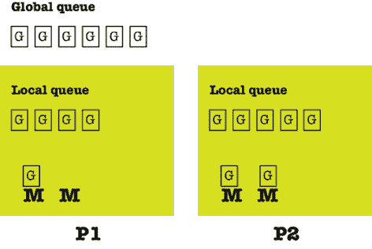

# 第八章：Go 并发

Go 并发模型的关键组件是 goroutine，它是 Go 中的**最小可执行实体**。要创建一个新的 goroutine，我们必须使用`go`关键字后跟一个函数调用或匿名函数——这两种方法等效。对于一个 goroutine 或函数要终止整个 Go 应用程序，它应该调用`os.Exit()`而不是`return`。然而，大多数时候，我们使用`return`退出 goroutine 或函数，因为我们真正想要退出的是特定的 goroutine 或函数，而不是停止整个应用程序。

Go 中的所有内容都以 goroutine 的形式执行，无论是透明地还是有意为之。每个可执行的 Go 程序至少有一个 goroutine，用于运行`main`包的`main()`函数。每个 goroutine 根据 Go 调度器的指令在单个 OS 线程上执行，Go 调度器负责 goroutine 的执行——开发者无法控制分配给 goroutine 的内存量。操作系统调度器不会指定 Go 运行时将要创建多少线程，因为 Go 运行时会生成足够的线程以确保有`GOMAXPROCS`个线程可用于运行 Go 代码。

然而，**goroutines 不能直接相互通信**。Go 中的数据共享是通过通道、本地套接字或共享内存实现的。*通道*作为连接多个 goroutines 的粘合剂。另一方面，通道不能处理数据或执行代码，但它们可以向 goroutines 发送数据并从 goroutines 接收数据，具有特殊用途，如作为信号或指定 goroutine 的执行顺序。

当我最初了解到通道时，我认为这是一个很好的主意，比共享内存好得多，我想要在所有地方都使用通道！然而，如今**我只在别无选择的情况下使用通道**。看看本章末尾的并发统计应用程序的实现，以了解存在不需要使用通道的设计。

虽然在 goroutine 之间使用通道进行通信和同步是非常典型和预期的，但通道可能会引入死锁、开销和复杂性到设计中，以及性能考虑，尤其是在低延迟通信是优先级时。

当你结合多个通道和 goroutines 时，你可以创建数据流，在 Go 术语中，这些被称为管道。因此，你可能有一个 goroutine 从数据库读取数据并发送到通道，另一个 goroutine 从该通道读取数据，处理这些数据，然后将数据发送到另一个通道供另一个 goroutine 读取，在修改数据并将其存储在另一个数据库之前。

本章涵盖：

+   进程、线程和 goroutines

+   Go 调度器

+   Goroutines

+   通道

+   竞态条件是坏事

+   `select`关键字

+   超时 goroutine

+   重新审视 Go 通道

+   处理 UNIX 信号

+   共享内存和共享变量

+   闭包变量和`go`语句

+   `context`包

+   `semaphore`包

+   使统计应用程序并发

# 进程、线程和 goroutine

进程是操作系统对正在运行的程序的表示，而程序是磁盘上的一个二进制文件，其中包含创建操作系统进程所需的所有信息。该二进制文件以特定格式编写，包含 CPU 将要运行的指令以及大量其他所需部分。该程序被加载到内存中，并执行指令，创建一个正在运行的进程。因此，进程携带了额外的资源，如内存、打开的文件描述符和用户数据，以及运行时获取的其他类型资源。

线程是一个比进程更小、更轻的实体。进程由一个或多个具有自己控制流和堆栈的线程组成。区分线程和进程的一个简单方法是将进程视为正在运行的二进制文件，而线程则是进程的一个子集。

Goroutine 是 Go 语言中可以并发执行的最小实体。在这里使用“最小”这个词非常重要，因为 goroutine 不是像 UNIX 进程那样的自主实体——**goroutine 生活在操作系统线程中，而操作系统线程又生活在操作系统进程中**。好事是 goroutine 比线程轻，而线程又比进程轻——在单台机器上运行数千或数百万个 goroutine 不是问题。goroutine 比线程轻的原因包括它们有一个可以增长的更小的堆栈，它们有更快的启动时间，并且可以通过低延迟的通道相互通信。在实践中，这意味着一个进程可以有多个线程和大量 goroutine，而 goroutine 需要进程的环境才能存在。因此，要创建 goroutine，你需要有一个至少包含一个线程的进程。操作系统负责进程和线程的调度，而 Go 创建必要的线程，开发者创建所需的 goroutine 数量。

现在你已经了解了进程、程序、线程和 goroutine 的基础知识，让我们简单谈谈 Go 调度器。

# Go 调度器

操作系统内核调度器负责程序的线程执行。同样，Go 运行时也有自己的调度器，它负责使用称为*m:n 调度*的技术来执行 goroutine，其中 m 个 goroutine 使用 n 个操作系统线程通过多路复用来执行。Go 调度器是 Go 组件，负责 Go 程序中 goroutine 的执行方式和顺序。这使得 Go 调度器成为 Go 编程语言的重要组成部分。Go 调度器也作为一个 goroutine 来执行。

请注意，由于 Go 调度器只处理单个程序中的 goroutine，其操作比操作系统内核调度器的操作要简单、便宜和快速得多。

Go 使用了分叉-连接并发模型。模型中的 *分叉部分*，不应与 `fork(2)` 系统调用混淆，表明可以在程序的任何位置创建子分支。类似地，Go 并发模型中的 *连接部分* 是子分支结束并与父分支连接的地方。请注意，`sync.Wait()` 语句和收集 goroutine 结果的通道都是连接点，而每个新的 goroutine 都会创建一个子分支。

**公平调度策略将所有负载均匀地分配到所有可用处理器上**。起初，这看起来像是一个完美的策略，因为它在保持所有处理器同等忙碌的同时，不需要考虑许多因素。然而，事实证明并非如此，因为大多数分布式任务通常依赖于其他任务。因此，一些处理器未被充分利用，或者说，一些处理器的利用率高于其他处理器。

Goroutine 是一个任务，而 goroutine 调用语句之后的代码则是一个延续。**在 Go 调度器使用的偷取工作策略中，一个（逻辑上的）未充分利用的处理器会从其他处理器那里寻找额外的工作。** 当它找到这样的工作后，它会从其他处理器或处理器那里窃取这些工作，因此得名。此外，Go 的工作窃取算法还会对队列中的延续进行排队和窃取。正如其名所暗示的，停滞的连接点是指执行线程在连接点停滞并开始寻找其他工作去做的地方。

尽管任务窃取和延续窃取都有停滞的连接点，但延续的发生频率比任务更高；因此，Go 调度算法使用延续而不是任务。延续窃取的主要缺点是它需要编程语言编译器的额外工作。幸运的是，Go 提供了这种额外帮助，因此在其工作窃取算法中使用了延续窃取。延续窃取的一个好处是，使用函数调用而不是 goroutine 或具有多个 goroutine 的单个线程时，你将得到相同的结果。这在两种情况下都只执行一个操作，因此这是完全合理的。

Go 调度器通过三种主要实体工作：操作系统线程（M），它们与使用的操作系统相关联，goroutines（G），以及逻辑处理器（P）。Go 程序可以使用的处理器数量由 `GOMAXPROCS` 环境变量的值指定——在任何给定时间，最多有 `GOMAXPROCS` 个处理器。现在，让我们回到 Go 中使用的 `m:n` 调度算法。严格来说，在任何时候，你都有 `m` 个正在执行且因此被调度运行的 goroutines，它们在 `n` 个操作系统线程上运行，最多使用 `GOMAXPROCS` 个逻辑处理器。你很快就会了解更多关于 `GOMAXPROCS` 的信息。

每个 goroutine 可以处于以下三个阶段之一：*执行中*、*可运行*或*等待中*。在执行阶段，goroutine 的指令在一个操作系统线程上执行。在可运行阶段，goroutine 等待被分配到操作系统线程以进行执行。最后，在等待阶段，goroutine 由于某些原因（如等待资源或互斥锁变得可用）而被阻塞，以便进入其他两个阶段之一。

下图显示了每个逻辑处理器都附加了两种不同类型的队列——一个全局运行队列和一个本地运行队列。来自全局队列的 goroutines 被分配到逻辑处理器的队列中，以便在未来某个时刻执行。



图 8.1：Go 调度器的操作

每个逻辑处理器可以有多个线程，偷取发生在可用逻辑处理器的本地队列之间。最后，请记住，Go 调度器在需要时可以创建更多的操作系统线程。操作系统线程在资源方面很昂贵，并且从一个状态转换到另一个状态（*上下文切换*），这意味着过多地处理操作系统线程可能会减慢你的 Go 应用程序。

接下来，我们讨论 `GOMAXPROCS` 的含义和使用。

## `GOMAXPROCS` 环境变量

`GOMAXPROCS` 环境变量允许你设置可以同时执行用户级 Go 代码的操作系统线程数量；这不会限制创建的线程数量，但会限制正在积极运行的线程数量。从 Go 版本 1.5 开始，`GOMAXPROCS` 的默认值应该是你的机器中可用的逻辑核心数。还有一个 `runtime.GOMAXPROCS()` 函数，它允许你以编程方式设置和获取 `GOMAXPROCS` 的值。

如果你决定将 `GOMAXPROCS` 的值设置为小于你机器中的核心数，可能会影响你程序的性能。然而，使用大于可用核心数的 `GOMAXPROCS` 值并不一定会使你的 Go 程序运行得更快，因为线程的上下文切换可能会造成影响。

如本节之前所述，您可以程序化地设置和获取 `GOMAXPROCS` 环境变量的值——这在本节中的 `maxprocs.go` 中得到了说明，它还将展示运行时包的额外功能。`main()` 函数的实现如下：

```go
func main() {
    fmt.Print("You are using ", runtime.Compiler, " ")
    fmt.Println("on a", runtime.GOARCH, "machine")
    fmt.Println("Using Go version", runtime.Version()) 
```

`runtime.Compiler` 变量保存用于构建运行二进制的编译器工具链。最著名的两个值是 `gc` 和 `gccgo`。`runtime.GOARCH` 变量保存当前架构，而 `runtime.Version()` 返回 Go 编译器的当前版本。这些信息对于使用 `runtime.GOMAXPROCS()` 不是必需的，但了解您的系统信息是好的。

```go
 fmt.Printf("GOMAXPROCS: %d\n", runtime.GOMAXPROCS(0))
} 
```

`runtime.GOMAXPROCS(0)` 调用会发生什么？它总是返回可以同时执行的最大 CPU 数量的上一个值。当 `runtime.GOMAXPROCS()` 的参数等于或大于 `1` 时，`runtime.GOMAXPROCS()` 也会更改当前设置。由于我们使用的是 `0`，我们的调用不会改变当前设置。

运行 `maxprocs.go` 产生以下输出：

```go
You are using gc on a arm64 machine
Using Go version go1.21.0
GOMAXPROCS: 10 
```

您可以使用以下技术实时更改 `GOMAXPROCS` 的值：

```go
$ GOMAXPROCS=100; go run maxprocs.go
You are using gc on a amd64 machine
Using Go version go1.21.0
GOMAXPROCS: 100 
```

之前的命令临时将 `GOMAXPROCS` 的值更改为 `100` 并运行 `maxprocs.go`。

除了使用较少的核心测试代码的性能外，您很可能不需要更改 `GOMAXPROCS`。下一节将解释并发与并行之间的相似之处和不同之处。

## 并发与并行

人们普遍认为并发与并行是同一件事——这并不正确！并行性是同时执行多种类型的多个实体，而并发是一种结构化组件的方式，以便在可能的情况下独立执行。

只有在您并发构建软件组件时，才能安全地在您的操作系统和硬件允许的情况下并行执行它们。Erlang 编程语言很久以前就这样做了——在 CPU 具有多个核心和计算机拥有大量 RAM 之前很久。

在一个有效的并发设计中，添加并发实体可以使整个系统运行得更快，因为可以并行执行更多的事情。因此，所需的并行性来自于对问题更好的并发表达和实现。开发者负责在设计阶段考虑并发，并将从系统组件的潜在并行执行中受益。因此，开发者不应该考虑并行性，而应该考虑将问题分解为独立的组件，这些组件在组合时解决初始问题。

**即使您无法在您的机器上并行运行函数，有效的并发设计仍然可以改进程序的设计、数据流和可维护性**。换句话说，并发比并行更好！现在，在我们探讨通道之前，让我们先谈谈 goroutines，通道是 Go 并发模型的主要组件。

# Goroutines

您可以使用`go`关键字后跟一个命名函数或匿名函数调用来定义、创建和执行一个新的 goroutine。`go`关键字使得函数调用立即返回，而函数则在后台作为 goroutine 开始运行，其余程序继续执行。您无法控制或对 goroutines 将要执行的顺序做出任何假设，因为这取决于操作系统的调度器、Go 调度器和操作系统负载。

## 创建 goroutine

在本小节中，您将学习如何创建 goroutines。演示该技术的程序被称为`create.go`。`main()`函数的实现如下：

```go
func main() {
    go func(x int) {
        fmt.Printf("%d ", x)
    }(10) 
```

这就是如何将匿名函数作为 goroutine 运行。最后的`(10)`是如何向匿名函数传递参数的。前面的匿名函数只是打印一个值。一般来说，显式传递参数比让函数关闭它所使用的变量更易于阅读。

```go
 go printme(15) 
```

这就是如何将一个函数作为 goroutine 执行。一般来说，您作为 goroutine 执行的函数不应直接返回任何值。**与 goroutines 交换数据是通过使用共享内存或通道或其他机制来实现的**。

```go
 time.Sleep(time.Second)
    fmt.Println("Exiting...")
} 
```

由于 Go 程序在退出前不会等待其 goroutines 结束，我们需要手动延迟它，这就是`time.Sleep()`调用的目的。我们将很快纠正这一点，以便在退出前等待所有 goroutines 完成。

运行`create.go`会产生以下输出：

```go
$ go run create.go 
10 * 15
Exiting... 
```

输出中的`10`部分来自匿名函数，而`* 15`部分来自`go printme(15)`语句。然而，如果您多次运行`create.go`，可能会得到不同的输出，因为这两个 goroutines 并不总是按相同的顺序执行，这取决于 Go 调度器：

```go
$ go run create.go
* 15
10 Exiting... 
```

下一个小节将展示如何运行可变数量的 goroutines。

## 创建多个 goroutines

在本小节中，您将学习如何创建可变数量的 goroutines。演示该技术的程序被称为`multiple.go`。goroutines 的数量作为程序的一个命令行参数给出。`main()`函数实现中的重要代码如下：

```go
fmt.Printf("Going to create %d goroutines.\n", count)
for i := 0; i < count; i++ { 
```

没有任何禁止您使用`for`循环来创建多个 goroutines，尤其是在您想创建很多 goroutines 时。

```go
 go func(x int) {
        fmt.Printf("%d ", x)
    }(i)
}
time.Sleep(time.Second)
fmt.Println("\nExiting...") 
```

再次强调，`time.Sleep()`防止`main()`函数立即退出。

运行`multiple.go`会生成以下类型的输出：

```go
$ go run multiple.go 15
Going to create 15 goroutines.
3 0 8 4 5 6 7 11 9 12 14 13 1 2 10 
Exiting... 
```

如果你多次运行 `multiple.go`，你将得到不同的输出。因此，仍有改进的空间。下一小节将展示如何移除对 `time.Sleep()` 的调用，并使你的程序等待 goroutines 完成。

## 等待所有 goroutines 完成

仅创建多个 goroutines 是不够的——你还需要在 `main()` 函数结束前等待它们完成。因此，本小节将展示一个非常流行的技术，它可以改进 `multiple.go` 的代码——改进后的版本被称为 `varGoroutines.go`。但首先，我们需要解释它是如何工作的。

同步过程从定义一个 `sync.WaitGroup` 变量并使用 `Add()`、`Done()` 和 `Wait()` 方法开始。如果你查看 `sync` Go 包的源代码，特别是 `waitgroup.go` 文件，你会看到 `sync.WaitGroup` 类型不过是一个包含两个字段的结构的集合：

```go
type WaitGroup struct {
    noCopy noCopy
    state1 [3]uint32
} 
```

每次调用 `sync.Add()` 都会增加 `state1` 字段中的一个计数器，该字段是一个包含三个 `uint32` 元素的数组。请注意，在 `go` 语句之前调用 `sync.Add()` 确实非常重要，以防止任何 *竞争条件*——我们将在 *竞争条件是坏事* 部分学习竞争条件。当每个 goroutine 完成其工作后，应该执行 `sync.Done()` 函数以将相同的计数器减一。

在幕后，`sync.Done()` 执行一个 `Add(-1)` 调用。`Wait()` 方法等待该计数器变为 `0` 才返回。`main()` 函数内 `Wait()` 的返回意味着 `main()` 将返回，程序结束。

你可以用除了 1 以外的正整数调用 `Add()`，以避免多次调用 `Add(1)`。当你事先知道将要创建的 goroutines 的数量时，这很有用。`Done()` 不支持该功能。

`varGoroutines.go` 的重要部分如下：

```go
var waitGroup sync.WaitGroup
fmt.Printf("%#v\n", waitGroup) 
```

这是创建你将要使用的 `sync.WaitGroup` 变量的地方。`fmt.Printf()` 调用打印出 `sync.WaitGroup` 结构的内容——你通常不会这样做，但这对学习 `sync.WaitGroup` 结构很有帮助。

```go
for i := 0; i < count; i++ {
    waitGroup.Add(1) 
```

我们在创建 goroutine 之前调用 `Add(1)` 以避免竞争条件。

```go
 go func(x int) {
        defer waitGroup.Done() 
```

由于 `defer` 关键字，`Done()` 调用将在匿名函数返回之前执行。

```go
 fmt.Printf("%d ", x)
    }(i)
}
fmt.Printf("%#v\n", waitGroup)
waitGroup.Wait() 
```

`Wait()` 函数在返回之前等待 `waitGroup` 变量中的计数器变为 `0`，这正是我们想要达到的目标。

```go
fmt.Println("\nExiting...") 
```

当 `Wait()` 函数返回时，将执行 `fmt.Println()` 语句。不再需要调用 `time.Sleep()` 了！

运行 `varGoroutines.go` 产生以下输出：

```go
$ go run varGoroutines.go 15
Going to create 10 goroutines.
sync.WaitGroup{noCopy:sync.noCopy{}, state:atomic.Uint64{_:atomic.noCopy{}, _:atomic.align64{}, v:0x0}, sema:0x0}
sync.WaitGroup{noCopy:sync.noCopy{}, state:atomic.Uint64{_:atomic.noCopy{}, _:atomic.align64{}, v:0xa00000000}, sema:0x0}
14 8 9 10 11 5 0 4 1 2 3 6 13 12 7 
Exiting... 
```

记住，在程序中使用更多的 goroutines 并不是性能的万能药，因为更多的 goroutines，除了对`sync.Add()`、`sync.Wait()`和`sync.Done()`的各种调用外，还可能因为 Go 调度器和 Go 垃圾收集器需要做的额外管理工作而减慢你的程序。

## 如果 Add()和 Done()调用的次数不同怎么办？

当`sync.Add()`调用次数和`sync.Done()`调用次数相等时，你的程序将一切正常。然而，本小节将告诉你当这两个数字不一致时会发生什么。

如果不给`addDone.go`提供任何命令行参数，`Add()`调用的次数将少于`Done()`调用的次数。如果有至少一个命令行参数，`Done()`调用的次数将少于`Add()`调用的次数。你可以自己查看`addDone.go`的 Go 代码。重要的是它生成的输出。不提供任何命令行参数运行`addDone.go`会产生以下错误信息：

```go
$ go run addDone.go
Going to create 20 goroutines.
sync.WaitGroup{noCopy:sync.noCopy{}, state:atomic.Uint64{_:atomic.noCopy{}, _:atomic.align64{}, v:0x0}, sema:0x0}
sync.WaitGroup{noCopy:sync.noCopy{}, state:atomic.Uint64{_:atomic.noCopy{}, _:atomic.align64{}, v:0x1300000000}, sema:0x0}
19 3 4 5 6 7 8 9 10 11 12 13 14 15 16 2 1 17 18 0
Exiting...
panic: sync: negative WaitGroup counter
goroutine 20 [running]:
sync.(*WaitGroup).Add(0x1?, 0x1?)
    /opt/homebrew/Cellar/go/1.21.0/libexec/src/sync/waitgroup.go:62 +0x108
sync.(*WaitGroup).Done(0x0?)
    /opt/homebrew/Cellar/go/1.21.0/libexec/src/sync/waitgroup.go:87 +0x20
main.main.func1(0x0?)
    ~/go/src/github.com/mactsouk/mGo4th/ch08/addDone.go:26 +0x9c
created by main.main in goroutine 1
    ~/go/src/github.com/mactsouk/mGo4th/ch08/addDone.go:23 +0xec
exit status 2 
```

错误信息的起因可以在输出中找到：`panic: sync: WaitGroup 计数器为负`。

有时，`addDone.go`不会产生任何错误信息，并且可以正常终止——**这主要发生在系统已经非常繁忙的情况下**。这是并发程序的一般问题——它们并不总是崩溃或行为异常，因为执行顺序可能会改变，这可能会改变程序的行为。这使得并发软件的调试变得更加困难。

使用一个命令行参数运行`addDone.go`会产生以下错误信息：

```go
$ go run addDone.go 1
Going to create 20 goroutines.
sync.WaitGroup{noCopy:sync.noCopy{}, state:atomic.Uint64{_:atomic.noCopy{}, _:atomic.align64{}, v:0x0}, sema:0x0}
sync.WaitGroup{noCopy:sync.noCopy{}, state:atomic.Uint64{_:atomic.noCopy{}, _:atomic.align64{}, v:0x1500000000}, sema:0x0}
19 1 2 11 12 13 14 15 16 17 18 6 3 4 5 8 7 9 0 10 fatal error: all goroutines are asleep - deadlock!
goroutine 1 [semacquire]:
sync.runtime_Semacquire(0x0?)
    /opt/homebrew/Cellar/go/1.21.0/libexec/src/runtime/sema.go:62 +0x2c
sync.(*WaitGroup).Wait(0x14000128030)
    /opt/homebrew/Cellar/go/1.21.0/libexec/src/sync/waitgroup.go:116 +0x78
main.main()
    ~/go/src/github.com/mactsouk/mGo4th/code/ch08/addDone.go:38 +0x230
exit status 2 
```

再次强调，崩溃的原因会打印在屏幕上：`致命错误：所有 goroutines 都处于休眠状态 - 死锁！`这意味着程序应该无限期地等待一个 goroutine 完成——也就是说，等待一个永远不会发生的`Done()`调用。

## 使用 goroutines 创建多个文件

作为 goroutines 使用的一个实际例子，本小节介绍了一个命令行工具，该工具创建多个包含随机生成数据的文件——这些文件可用于测试文件系统或生成测试数据。`randomFiles.go`中的关键代码如下：

```go
var waitGroup sync.WaitGroup
for i := start; i <= end; i++ {
    waitGroup.Add(1)

    go func(n int) {
        filepath := filepath.Join(path, fmt.Sprintf("%s%d", filename, n))
        defer waitGroup.Done()
        createFile(filepath)
    }(i)
}
waitGroup.Wait() 
```

我们首先创建一个`sync.WaitGroup`变量，以便正确地等待所有 goroutines 完成。每个文件仅由一个 goroutine 创建。这里重要的是每个文件都有一个唯一的文件名——这是通过包含`for`循环计数器值的`filepath`变量实现的。多个`createFile()`函数作为 goroutines 执行来创建文件。这是一种简单但非常高效地创建多个文件的方法。运行`randomFiles.go`会生成以下输出：

```go
$ go run randomFiles.go 
Usage: randomFiles firstInt lastInt filename directory 
```

因此，这个实用程序需要四个参数，分别是 `for` 循环的第一个和最后一个值，以及将要写入文件的文件名和目录。让我们使用正确的参数数量运行这个实用程序：

```go
$ go run randomFiles.go 3 5 masterGo /tmp
/tmp/masterGo3 created!
/tmp/masterGo5 created!
/tmp/masterGo4 created! 
```

一切看起来都很正常，根据我们的指示已经创建了四个文件！现在我们了解了 goroutines，让我们继续学习通道。

# 通道

通道是一种通信机制，它允许 goroutines 交换数据。首先，每个通道允许交换特定数据类型，这也被称为通道的元素类型；其次，为了使通道正常工作，需要有人接收通过通道发送的数据。您应该使用 `make()` 函数和 `chan` 关键字（`make(chan int)`）来声明一个新的通道，并且可以使用 `close()` 函数关闭通道。您可以通过编写类似 `make(chan int, 1)` 的代码来声明通道的大小。这个语句创建了一个**带缓冲的通道**，它有不同的用途——带缓冲的通道将在本章后面进行解释。

就因为我们可以使用通道，并不意味着我们应该这样做。如果存在一个更简单的解决方案，允许 goroutines 执行并保存生成的信息，我们也应该考虑这一点。每个开发者的目的应该是创建一个简单的设计，而不是使用编程语言的所有功能。

管道是一种虚拟方法，用于连接 goroutines 和通道，使得一个 goroutine 的输出可以通过通道传输成为另一个 goroutine 的输入。使用管道的好处之一是，在您的程序中会有持续的数据流，因为没有 goroutine 或通道需要等待所有操作完成才能开始执行。此外，您使用的变量更少，因此内存空间也更少，因为您不需要将所有内容都保存为变量。最后，管道的使用简化了程序的设计并提高了其可维护性。

## 向通道写入和从通道读取

将值（`val`）写入通道（`ch`）就像写入 `ch <- val` 一样简单。箭头显示了值的方向，只要 `var` 和 `ch` 是相同的数据类型，您就不会对这个语句有任何问题。

您可以通过执行 `<-c` 从名为 `c` 的通道中读取单个值。在这种情况下，方向是从通道到外部世界。您可以使用 `aVar := <-c` 将该值保存到一个新变量中。

通道的读写操作在 `channels.go` 文件中有示例，以下代码展示了这一点：

```go
package main
import (
    "fmt"
"sync"
)
func writeToChannel(c chan int, x int) {
    c <- x
    close(c)
} 
```

这个函数只是将值写入通道，然后立即关闭它。

```go
func printer(ch chan bool) {
    ch <- true
} 
```

这个函数只是将 `true` 值发送到一个 `bool` 通道。

```go
func main() {
    c := make(chan int, 1) 
```

此通道具有大小为 1 的缓冲区。这意味着一旦我们填满该缓冲区，我们就可以关闭通道，goroutine 将继续执行并返回。一个无缓冲的通道有不同的行为：当你尝试向该通道发送值时，它将永远阻塞，因为它正在等待有人取走该值。在这种情况下，我们确实需要一个缓冲通道，以避免任何阻塞。

```go
 var waitGroup sync.WaitGroup
    waitGroup.Add(1)
    go func(c chan int) {
        defer waitGroup.Done()
        writeToChannel(c, 10)
        fmt.Println("Exit.")
    }(c)
    fmt.Println("Read:", <-c) 
```

在这里，我们从通道读取值并打印它，而不将其存储在单独的变量中。

```go
 _, ok := <-c
    if ok {
        fmt.Println("Channel is open!")
    } else {
        fmt.Println("Channel is closed!")
    } 
```

之前的代码展示了确定通道是否关闭的技术。在这种情况下，我们正在忽略读取值——如果通道是打开的，那么读取值将被丢弃。

```go
 waitGroup.Wait()
    var ch chan bool = make(chan bool)
    for i := 0; i < 5; i++ {
        go printer(ch)
    } 
```

在这里，我们创建了一个无缓冲的通道，并创建了五个 goroutine，我们没有进行任何同步，因为我们没有使用任何 `Add()` 调用。

```go
 // Range on channels
// IMPORTANT: As the channel ch is not closed,
// the range loop does not exit on its own.
    n := 0
for i := range ch { 
```

`range` 关键字与通道一起工作！然而，在通道上的 `range` 循环只有在通道关闭或使用 `break` 关键字时才会退出。

```go
 fmt.Println(i)
        if i == true {
            n++
        }
        if n > 2 {
            fmt.Println("n:", n)
            close(ch)
            break
        }
    } 
```

当满足某个条件时，我们关闭 `ch` 通道并使用 `break` 退出 `for` 循环。请注意，在接收端关闭通道从来都不是一个好主意——这里展示是为了示例。你很快就会看到这个决定带来的后果。

```go
 for i := 0; i < 5; i++ {
        fmt.Println(<-ch)
    }
} 
```

当尝试从关闭的通道读取时，我们得到其数据类型的零值，因此这个 `for` 循环运行得很好，不会引起任何问题。

运行 `channels.go` 生成以下输出：

```go
Exit.
Read: 10 
```

使用 `writeToChannel(c, 10)` 将值 `10` 写入通道后，我们读取该值。

```go
Channel is closed!
true
true
true 
```

带有 `range` 的 `for` 循环在三次迭代后退出——每次迭代在屏幕上打印 `true`。

```go
n: 3
false
false
false
false
false 
```

这五个 `false` 值是由程序的最后 `for` 循环打印的。

虽然看起来 `channels.go` 没有问题，但它存在一个逻辑问题，我们将在 *竞争条件很糟糕* 部分进行解释和解决。此外，如果我们多次运行 `channels.go`，它可能会崩溃。然而，大多数时候它不会，这使得调试变得更加困难。

## 从关闭的通道接收

**从关闭的通道读取返回其数据类型的零值**。然而，如果你尝试向关闭的通道写入，你的程序将以糟糕的方式崩溃（panic）。这两种情况在 `readCloseCh.go` 中进行了探索，特别是在 `main()` 函数的实现中：

```go
func main() {
    willClose := make(chan complex64, 10) 
```

如果你将其作为一个无缓冲的通道，程序将会崩溃。

```go
 // Write some data to the channel
    willClose <- -1
    willClose <- 1i 
```

我们向 `willClose` 通道写入两个值。

```go
 // Read data and empty channel
    <-willClose
    <-willClose
    close(willClose) 
```

然后，我们读取并丢弃这两个值，并关闭通道。

```go
 // Read again - this is a closed channel
    read := <-willClose
    fmt.Println(read)
} 
```

我们从通道读取的最后一个值是 `complex64` 数据类型的零值。运行 `readCloseCh.go` 生成以下输出：

```go
(0+0i) 
```

因此，我们得到了 `complex64` 数据类型的零值。现在让我们继续讨论如何处理接受通道作为参数的函数。

## 将通道作为函数参数

当使用通道作为函数参数时，你可以指定其方向——也就是说，它是否仅用于发送或接收数据。在我看来，如果你事先知道通道的目的，你应该使用这个功能，因为它使你的程序更加健壮。你将无法意外地将数据发送到仅应接收数据的通道，或者从仅应发送数据的通道接收数据。

如果你声明一个通道函数参数仅用于读取，而你尝试向其写入，你将得到一个编译错误信息，这很可能会让你在未来避免一些讨厌的 bug。这是这种方法的重大好处！

所有这些都在 `channelFunc.go` 中得到了说明——接受通道参数的函数的实现如下：

```go
func printer(ch chan<- bool) {
    ch <- true
} 
```

上面的函数接受一个仅可用于写入的通道参数。

```go
func writeToChannel(c chan<- int, x int) {
    fmt.Println("1", x)
    c <- x
    fmt.Println("2", x)
} 
```

上面的函数的通道参数仅可用于读取。

```go
func f2(out <-chan int, in chan<- int) {
    x := <-out
    fmt.Println("Read (f2):", x)
    in <- x
    return
} 
```

最后一个函数接受两个通道参数。然而，`out` 仅可用于读取，而 `in` 则用于写入。如果你尝试对一个不允许的操作执行通道参数，Go 编译器将会抱怨。即使函数没有被使用，这种情况也会发生。

下一节的主题是竞争条件——仔细阅读，以避免在处理多个 goroutine 时出现未定义的行为和令人不愉快的情况。

# 竞争条件是坏事

*数据竞争条件* 是一种情况，其中两个或多个正在运行的元素，例如线程和 goroutine，试图控制或修改程序的一个共享资源或共享变量。严格来说，数据竞争发生在两个或多个指令访问相同的内存地址时，其中至少有一个执行了写（更改）操作。如果所有操作都是读取操作，则不存在竞争条件。在实践中，这意味着如果你多次运行程序，可能会得到不同的输出，这是不好的。

在运行或构建 Go 源文件时使用 `-race` 标志将执行 Go 竞争检测器，这使得编译器创建一个典型的可执行文件的修改版本。这个修改版本可以记录所有对共享变量的访问以及所有发生的同步事件，包括对 `sync.Mutex` 和 `sync.WaitGroup` 的调用，这些将在本章后面介绍。在分析相关事件后，竞争检测器会打印出一份报告，可以帮助你识别潜在的问题，以便你可以纠正它们。

## Go 竞争检测器

你可以使用 `go run -race` 运行竞争检测器工具。如果我们使用 `go run -race` 测试 `channels.go`，我们将得到以下输出：

```go
$ go run -race channels.go 
Exit.
Read: 10
Channel is closed!
true
true
true
n: 3
==================
WARNING: DATA RACE
Write at 0x00c000094010 by main goroutine:
  runtime.recvDirect()
      /opt/homebrew/Cellar/go/1.21.0/libexec/src/runtime/chan.go:348 +0x7c
  main.main()
      ~/go/src/github.com/mactsouk/mGo4th/ch08/channels.go:54 +0x444
Previous read at 0x00c000094010 by goroutine 10:
  runtime.chansend1()
      /opt/homebrew/Cellar/go/1.21.0/libexec/src/runtime/chan.go:146 +0x2c
  main.printer()
      ~/go/src/github.com/mactsouk/mGo4th/ch08/channels.go:14 +0x34
  main.main.func3()
      ~/go/src/github.com/mactsouk/mGo4th/ch08/channels.go:40 +0x34
Goroutine 10 (running) created at:
  main.main()
      ~/go/src/github.com/mactsouk/mGo4th/ch08/channels.go:40 +0x2b8
==================
false
false
false
false
false
panic: send on closed channel
goroutine 36 [running]:
main.printer(0x0?)
    ~/go/src/github.com/mactsouk/mGo4th/ch08/channels.go:14 +0x38
created by main.main in goroutine 1
    ~/go/src/github.com/mactsouk/mGo4th/ch08/channels.go:40 +0x2bc
exit status 2 
```

因此，尽管 `channels.go` 最初看起来没有问题，但其中存在一个等待发生的竞态条件。现在，让我们根据之前的输出讨论一下 `channels.go` 中存在的问题。在 `channels.go` 的第 54 行有一个关闭通道的操作，而在第 14 行对同一个通道进行了写入操作，这看起来是竞态条件情况的根本原因。第 54 行是 `close(ch)`，而第 14 行是 `ch <- true`。问题是，我们无法确定将要发生什么以及发生的顺序——这就是竞态条件。如果你在没有竞态检测器的情况下执行 `channels.go`，它可能工作正常，但如果你多次尝试，你可能会得到 `panic: send on closed channel` 错误信息——这主要与 Go 调度器将要运行的 goroutines 的顺序有关。因此，如果通道的关闭操作先发生，那么对该通道的写入操作将会失败——竞态条件！

修复 `channels.go` 需要更改代码，更具体地说，是更改 `printer()` 函数的实现。修正后的 `channels.go` 版本被命名为 `chRace.go`，并包含以下代码：

```go
func printer(ch chan<- bool, times int) {
    for i := 0; i < times; i++ {
        ch <- true
    }
    close(ch)
}
func main() {
    // This is an unbuffered channel
var ch chan bool = make(chan bool)
    // Write 5 values to channel with a single goroutine
go printer(ch, 5)
    // IMPORTANT: As the channel ch is closed,
// the range loop is going to exit on its own.
for val := range ch {
        fmt.Print(val, " ")
    }
    fmt.Println()
    for i := 0; i < 15; i++ {
        fmt.Print(<-ch, " ")
    }
    fmt.Println()
} 
```

首先要注意的是，我们不是使用多个 goroutine 来写入所需的通道，而是使用单个 goroutine。**单个 goroutine 写入通道后关闭该通道不会创建任何竞态条件，因为事情是按顺序发生的**。

运行 `go run -race chRace.go` 产生以下输出，这意味着不再存在竞态条件：

```go
true true true true true 
false false false false false false false false false false false false false false false 
```

下一个部分是关于重要且强大的 `select` 关键字。

# `select` 关键字

`select` 关键字非常重要，因为它允许你**同时监听多个通道**。一个 `select` 块可以有多个情况和一个可选的 `default` 情况，这类似于 `switch` 语句。对于 `select` 块来说，有一个超时选项是很好的。最后，没有任何情况的 `select` (`select{}`) 将永远等待。

实际上，这意味着 `select` 允许 goroutine 等待多个通信操作。因此，`select` 给你使用单个 `select` 块监听多个通道的能力。因此，只要你适当地实现了你的 `select` 块，你就可以在通道上执行非阻塞操作。

一个 `select` 语句**不是按顺序评估的**，因为它的所有通道都是同时检查的。如果一个 `select` 语句中的所有通道都没有准备好，那么 `select` 语句将阻塞（等待），直到其中一个通道准备好。如果一个 `select` 语句中的多个通道都准备好了，那么 Go 运行时**从这些准备好通道的集合中随机选择**。

`select.go` 中的代码展示了 `select` 在一个具有三个情况的 goroutine 中运行的简单用法。但首先，让我们看看包含 `select` 的 goroutine 是如何执行的：

```go
 wg.Add(1)
    go func() {
        gen(0, 2*n, createNumber, end)
        wg.Done()
    }() 
```

之前的代码告诉我们，为了执行`wg.Done()`，`gen()`应该首先返回。那么，让我们看看`gen()`的实现：

```go
func gen(min, max int, createNumber chan int, end chan bool) {
    time.Sleep(time.Second)
    for {
        select {
        case createNumber <- rand.Intn(max-min) + min:
        case <-end:
            fmt.Println("Ended!")
            // return 
```

在这里正确的事情是为`gen()`函数添加`return`语句以结束。让我们假设你忘记添加了`return`语句。这意味着在执行与结束通道参数相关的`select`分支之后，函数不会结束——`createNumber`不会结束函数，因为它没有`return`语句。因此，`select`块一直在等待更多。解决方案可以在下面的代码中找到：

```go
 case <-time.After(4 * time.Second):
            fmt.Println("time.After()!")
            return
        }
    }
} 
```

那么，整个`select`块中的代码实际上在发生什么呢？这个特定的`select`语句有三个情况。如前所述，`select`不需要`default`分支。你可以将`select`语句的第三个分支视为一个巧妙的`default`分支。这是因为`time.After()`等待指定的持续时间（`4 * time.Second`）过去，然后打印一条消息，并使用`return`正确地结束`gen()`。这在这种情况下解除了`select`语句的阻塞，即所有其他通道由于某种原因而阻塞。尽管省略第二个分支的`return`是一个错误，但这表明有一个退出策略始终是一件好事。

运行`select.go`产生以下输出：

```go
$ go run select.go 10
Going to create 10 random numbers.
13 0 2 8 12 4 13 15 14 19 Ended!
time.After()!
Exiting... 
```

我们将在本章的剩余部分看到`select`的实际应用，从下一节开始，该节讨论如何超时 goroutines。你应该记住的是，`select`允许我们从单个点**监听多个通道**。

# 超时 goroutine

有时候 goroutines 完成所需的时间比预期的要长——在这种情况下，我们希望 goroutines 超时，这样我们就可以解除程序的阻塞。本节介绍了两种这样的技术。

## 在`main()`函数中超时 goroutine

本小节介绍了一种超时 goroutine 的简单技术。相关代码可以在`timeOut1.go`的`main()`函数中找到：

```go
func main() {
    c1 := make(chan string)
    go func() {
        time.Sleep(3 * time.Second)
        c1 <- "c1 OK"
    }() 
```

`time.Sleep()`调用用于模拟函数完成其操作所需的时间。在这种情况下，作为 goroutine 执行的匿名函数在向`c1`通道发送消息之前大约需要三秒钟。

```go
 select {
    case res := <-c1:
        fmt.Println(res)
    case <-time.After(time.Second):
        fmt.Println("timeout c1")
    } 
```

`time.After()` 调用的目的是在执行前等待所需的时间——如果执行了另一个分支，等待时间将重置。在这种情况下，我们并不关心 `time.After()` 返回的实际值，而是关心 `time.After()` 分支是否已执行，这意味着等待时间已经过去。在这种情况下，由于传递给 `time.After()` 函数的值小于之前执行 `time.Sleep()` 调用所使用的值，你很可能会收到超时消息。说“很可能”的原因是 Linux 不是一个实时操作系统，有时操作系统调度器会玩一些奇怪的游戏，尤其是在它必须处理高负载并调度大量任务时——这意味着你不应该对操作系统调度器的操作有任何假设。

```go
 c2 := make(chan string)
    go func() {
        time.Sleep(3 * time.Second)
        c2 <- "c2 OK"
    }()
    select {
    case res := <-c2:
        fmt.Println(res)
    case <-time.After(4 * time.Second):
        fmt.Println("timeout c2")
    }
} 
```

之前的代码执行了一个需要大约三秒钟来执行 goroutine，因为 `time.Sleep()` 调用，并在 `select` 中使用 `time.After(4 * time.Second)` 定义了四秒的超时期。如果在 `select` 块的第一个情况中从 `c2` 通道获取值之后 `time.After(4 * time.Second)` 调用返回，则不会有超时；否则，你会收到超时。然而，在这种情况下，`time.After()` 调用的值提供了足够的时间让 `time.Sleep()` 调用返回，所以你很可能会在这里不会收到超时消息。

让我们现在验证我们的想法。运行 `timeOut1.go` 产生以下输出：

```go
$ go run timeOut1.go 
timeout c1
c2 OK 
```

如预期的那样，第一个 goroutine 超时了，而第二个没有。接下来的一小节将介绍另一种超时技术。

## 在 `main()` 外部超时 goroutine

这个小节说明了另一个用于超时 goroutine 的技术。`select` 语句可以在一个单独的函数中找到。此外，超时期作为命令行参数给出。

`timeOut2.go` 的有趣之处在于 `timeout()` 的实现：

```go
func timeout(t time.Duration) {
    temp := make(chan int)
    go func() {
        time.Sleep(5 * time.Second)
        defer close(temp)
    }()
    select {
    case <-temp:
        result <- false
case <-time.After(t):
        result <- true
    }
} 
```

在 `timeout()` 中，`time.After()` 调用中使用的持续时间是一个函数参数，这意味着它可以变化。再次强调，`select` 块支持超时逻辑。任何超过 5 秒的超时期都很可能给 goroutine 足够的时间完成。如果 `timeout()` 将 `false` 写入 `result` 通道，则没有超时；如果写入 `true`，则有超时。运行 `timeOut2.go` 产生以下输出：

```go
$ go run timeOut2.go 100
Timeout period is 100ms
Time out! 
```

超时期是 100 毫秒，这意味着 goroutine 没有足够的时间完成，因此收到超时消息。

```go
$ go run timeOut2.go 5500 
Timeout period is 5.5s
OK 
```

这次，超时时间是 5,500 毫秒，这意味着 goroutine 有足够的时间完成。

下一个部分回顾并介绍了与通道相关的高级概念。

# 再次回顾 Go 通道

到目前为止，我们已经看到了通道的基本用法——本节介绍了 `nil` 通道、信号通道和缓冲通道的定义和用法。

尽管通道看起来像是一个有趣的概念，但它们并不是每个并发问题的答案，因为存在一些时候它们可以被互斥锁和共享内存所替代。所以，**不要强迫使用通道**。

记住通道类型的零值是`nil`，如果你向一个关闭的通道发送消息，程序会崩溃。然而，如果你尝试从关闭的通道读取，你会得到该通道类型的零值。因此，在关闭通道后，你不能再向其写入，但仍然可以从中读取。要能够关闭通道，该通道不能是只读的。

此外，一个`nil`通道总是阻塞的，这意味着从`nil`通道读取和写入都会阻塞。当你想通过将`nil`值分配给通道变量来禁用`select`语句的一个分支时，这个通道属性非常有用。最后，如果你尝试关闭一个`nil`通道，你的程序将会崩溃。这最好在`closeNil.go`程序中说明：

```go
package main
func main() {
    var c chan string 
```

之前的声明定义了一个名为`c`的`nil`通道，其类型为`string`。

```go
 close(c)
} 
```

运行`closeNil.go`会生成以下输出：

```go
panic: close of nil channel
goroutine 1 [running]:
main.main()
    ~/go/src/github.com/mactsouk/mGo4th/ch08/closeNil.go:5 +0x20
exit status 2 
```

之前的输出显示了如果你尝试关闭一个`nil`通道时将收到的消息。现在让我们来讨论带缓冲的通道。

## 带缓冲的通道

与容量为 0 的无缓冲通道不同，无缓冲通道需要发送方在另一端有一个相应的接收方准备就绪，带缓冲的通道允许在需要接收方之前向通道发送一定数量的值。

这些通道允许我们快速将工作放入队列，以便能够处理更多请求并在稍后处理请求。此外，你可以使用带缓冲的通道作为信号量来限制应用程序的吞吐量。

所展示的技术工作原理如下：所有传入的请求都被转发到一个通道，该通道逐个处理它们。当通道完成处理一个请求后，它会向原始调用者发送一条消息，表示它已准备好处理新的请求。因此，**通道缓冲区的容量限制了它可以同时保持的请求数量**。请记住，不是通道在处理请求或发送消息。

此外，请记住，带缓冲的通道会一直接受数据，直到由于容量限制而阻塞。然而，在所展示的例子中，实现是通过`select`语句取消剩余请求，而不是通道本身。实现该技术的源文件名为`bufChannel.go`，并包含以下代码：

```go
package main
import (
    "fmt"
)
func main() {
    numbers := make(chan int, 5) 
```

`numbers`通道可以存储最多五个整数，因为它是一个容量为 5 的缓冲通道。

```go
 counter := 10
for i := 0; i < counter; i++ {
        select {
        // This is where the processing takes place
case numbers <- i * i:
            fmt.Println("About to process", i)
        default:
            fmt.Print("No space for ", i, " ")
        } 
```

我们开始向`numbers`中放入数据——然而，当通道满时，它将不会存储更多数据，并将执行`default`分支。这并不是因为通道的工作方式，而是因为与`select`的具体实现有关。 

```go
 }
    fmt.Println()
    for {
        select {
        case num := <-numbers:
            fmt.Print("*", num, " ")
        default:
            fmt.Println("Nothing left to read!")
            return
        }
    }
} 
```

同样，我们尝试使用 `for` 循环从数字中读取数据。当从通道读取所有数据后，`default` 分支将被执行，并使用其 `return` 语句终止程序——当 `main()` 返回时，整个程序将被终止。

运行 `bufChannel.go` 产生以下输出：

```go
$ go run bufChannel.go 
About to process 0
. . .
About to process 4
No space for 5 No space for 6 No space for 7 No space for 8 No space for 9 
*0 *1 *4 *9 *16 Nothing left to read! 
```

让我们现在讨论 `nil` 通道。

## 空通道

`nil` 通道**总是阻塞**！因此，当你故意想要这种行为时，你应该使用它们！下面的代码演示了 `nil` 通道：

```go
package main
import (
    "fmt"
"math/rand"
"sync"
"time"
)
var wg sync.WaitGroup 
```

我们将 `wg` 声明为全局变量，以便在代码的任何地方都可以访问它，并避免将其作为参数传递给每个需要它的函数。这不是 Go 的惯用用法，尽管它的实现更简单，有些人可能不喜欢这种方法。一个替代方案是在 `main()` 中声明 `wg` 并将指针传递给每个需要它的函数——你可以将其作为练习来实现。

```go
func add(c chan int) {
    sum := 0
    t := time.NewTimer(time.Second)
    for {
        select {
        case input := <-c:
            sum = sum + input
        case <-t.C:
            c = nil
            fmt.Println(sum)
            wg.Done()
        }
    }
} 
```

`send()` 函数持续向通道 `c` 发送随机数字。不要混淆通道 `c`，它是一个（通道）函数参数，与定时器 `t` 的部分 `t.C` 相区别——你可以更改 `c` 变量的名称，但不能更改定时器中 `C` 字段的名称。当定时器 `t` 的计时结束，定时器会向 `t.C` 通道发送一个值。

这触发了 `select` 语句相关分支的执行，将值 `nil` 赋予通道 `c` 并打印 `sum` 变量的值，然后执行 `wg.Done()`，这将解除 `main()` 函数中找到的 `wg.Wait()` 的阻塞。此外，由于 `c` 变为 `nil`，它停止/阻塞 `send()` 向其发送更多数据。

```go
func send(c chan int) {
    for {
        c <- rand.Intn(10)
    }
}
func main() {
    c := make(chan int)
    rand.Seed(time.Now().Unix())
    wg.Add(1)
    go add(c)
    go send(c)
    wg.Wait()
} 
```

运行 `nilChannel.go` 产生以下输出：

```go
$ go run nilChannel.go 
11168960 
```

由于 `add()` 函数中 `select` 语句的第一个分支将要执行的次数是不确定的，所以每次执行 `nilChannel.go` 时，你都会得到不同的结果。

下一个子节讨论工作池。

## 工作池

工作池是一组**处理分配给它们的任务的线程**。Apache 网络服务器和 Go 的 `net/http` 包大致以这种方式工作：主进程接受所有传入的请求，然后将它们转发给工作进程以提供服务。一旦工作进程完成其任务，它就准备好为新客户端提供服务。

由于 Go 没有线程，所提供的实现将使用 goroutine 而不是线程。此外，线程在服务请求后通常不会死亡，因为结束线程和创建新线程的成本太高，而 goroutine 在完成任务后会死亡。Go 中的工作池通过使用带缓冲的通道来实现，因为它们允许你限制同时运行的 goroutine 的数量。

所提供的实用程序实现了一个简单的任务：它使用单个 goroutine 为每个请求提供服务，处理整数并打印它们的平方值。`wPools.go` 的代码如下：

```go
package main
import (
    "fmt"
"os"
"runtime"
"strconv"
"sync"
"time"
)
type Client struct {
    id      int
    integer int
} 
```

`Client` 结构用于跟踪程序将要处理的请求。

```go
type Result struct {
    job    Client
    square int
} 
```

`Result` 结构用于保存每个 `Client` 的数据以及客户端生成的结果。简单来说，`Client` 结构持有每个请求的输入数据，而 `Result` 持有请求的结果——如果你想处理更复杂的数据，你应该修改这些结构。

```go
var size = runtime.GOMAXPROCS(0)
var clients = make(chan Client, size)
var data = make(chan Result, size) 
```

`clients` 和 `data` 缓冲通道分别用于获取新的客户端请求和写入结果。如果你想使程序运行得更快，可以增加 `size` 的值。

```go
func worker(wg *sync.WaitGroup) {
    for c := range clients {
        square := c.integer * c.integer
        output := Result{c, square}
        data <- output
        time.Sleep(time.Second)
    }
    wg.Done()
} 
```

`worker()` 函数通过读取 `clients` 通道来处理请求。一旦处理完成，结果将被写入 `data` 通道。使用 `time.Sleep()` 引入的延迟不是必需的，但它能更好地让你理解生成的输出是如何打印的。

```go
func create(n int) {
    for i := 0; i < n; i++ {
        c := Client{i, i}
        clients <- c
    }
    close(clients)
} 
```

`create()` 函数的目的是正确创建所有请求，然后将它们发送到 `clients` 缓冲通道进行处理。请注意，`clients` 通道由 `worker()` 读取。

```go
func main() {
    if len(os.Args) != 3 {
        fmt.Println("Need #jobs and #workers!")
        return
    }
    nJobs, err := strconv.Atoi(os.Args[1])
    if err != nil {
        fmt.Println(err)
        return
    }
    nWorkers, err := strconv.Atoi(os.Args[2])
    if err != nil {
        fmt.Println(err)
        return
    } 
```

在前面的代码中，你读取了定义作业和工作线程数量的命令行参数。如果作业数量大于工作线程数量，作业将以较小的块提供服务。

```go
 go create(nJobs) 
```

`create()` 调用模拟了你将要处理的客户端请求。

```go
 finished := make(chan interface{}) 
```

`finished` 通道用于阻塞程序，因此不需要特定的数据类型。

```go
 go func() {
        for d := range data {
            fmt.Printf("Client ID: %d\tint: ", d.job.id)
            fmt.Printf("%d\tsquare: %d\n", d.job.integer, d.square)
        }
        finished <- true 
```

`finished <- true` 语句用于在 `for range` 循环结束时立即解除程序阻塞。`for range` 循环在 `data` 通道关闭时结束，这发生在 `wg.Wait()` 之后，意味着所有工作线程都已完成。

```go
 }()
    var wg sync.WaitGroup
    for i := 0; i < nWorkers; i++ {
        wg.Add(1)
        go worker(&wg)
    }
    wg.Wait()
    close(data) 
```

上一个 `for` 循环的目的是生成所需的 `worker()` 协程数量以处理所有请求。

```go
 fmt.Printf("Finished: %v\n", <-finished)
} 
```

`fmt.Printf()` 中的 `<-finished` 语句会阻塞，直到 `finished` 通道关闭。

运行 `wPools.go` 会创建以下类型的输出：

```go
$ go run wPools.go 8 5
Client ID: 0    int: 0    square: 0
Client ID: 1    int: 1    square: 1
Client ID: 2    int: 2    square: 4
Client ID: 3    int: 3    square: 9
Client ID: 4    int: 4    square: 16
Client ID: 5    int: 5    square: 25
Client ID: 6    int: 6    square: 36
Finished: true 
```

之前的输出显示所有请求都已处理。这种技术允许你服务一定数量的请求，从而避免服务器过载。为此，你需要编写更多的代码。

下一小节将介绍信号通道，并展示一种使用它们为少量协程定义执行顺序的技术。

## 信号通道

信号通道是仅用于信号的一种通道。简单来说，当你想通知另一个协程某事时，可以使用信号通道。信号通道不应用于数据传输。你将在下一小节中看到信号通道的实际应用，我们将指定协程的执行顺序。

## 为你的协程指定执行顺序

本小节介绍了一种使用信号通道指定 goroutines 执行顺序的技术。然而，请注意，当处理少量 goroutines 时，这种技术效果最佳。所提供的代码示例有四个 goroutines，我们希望按以下顺序执行它们——首先，函数`A()`的 goroutine，然后是函数`B()`，接着是`C()`，最后是`D()`。

`defineOrder.go`的代码（不包括`package`语句和`import`块）如下：

```go
var wg sync.WaitGroup
func A(a, b chan struct{}) {
    <-a
    fmt.Println("A()!")
    time.Sleep(time.Second)
    close(b)
} 
```

函数`A()`将被阻塞，直到作为参数传递的通道`a`被关闭。在它结束之前，它会关闭作为参数传递的通道`b`。这将解除下一个 goroutine 的阻塞，该 goroutine 将是函数`B()`。

```go
func B(a, b chan struct{}) {
    <-a
    fmt.Println("B()!")
    time.Sleep(3 * time.Second)
    close(b)
} 
```

同样，函数`B()`将被阻塞，直到作为参数传递的通道`a`被关闭。在`B()`结束之前，它会关闭作为参数传递的通道`b`。正如之前一样，这将解除后续函数的阻塞：

```go
func C(a, b chan struct{}) {
    <-a
    fmt.Println("C()!")
    close(b)
} 
```

与函数`A()`和`B()`的情况一样，函数`C()`的执行被通道`a`阻塞。在它结束之前，它会关闭通道`b`。

```go
func D(a chan struct{}) {
    <-a
    fmt.Println("D()!")
    wg.Done()
} 
```

这是将要执行的最后一个函数。因此，尽管它被阻塞了，但在退出之前不会关闭任何通道。此外，作为最后一个函数，它可能被执行多次，这与函数`A()`、`B()`和`C()`不同，因为通道只能关闭一次。

```go
func main() {
    x := make(chan struct{})
    y := make(chan struct{})
    z := make(chan struct{})
    w := make(chan struct{}) 
```

我们需要拥有与我们要作为 goroutines 执行的函数数量一样多的通道。

```go
 wg.Add(1)
    go func() {
        D(w)
    }() 
```

这证明了由 Go 代码指定的执行顺序并不重要，因为`D()`将是最后一个被执行的。

```go
 wg.Add(1)
    go func() {
        D(w)
    }()
    go A(x, y)
    wg.Add(1)
    go func() {
        D(w)
    }()
    go C(z, w)
    go B(y, z) 
```

尽管我们在`B()`之前运行`C()`，但`C()`将在`B()`完成后完成。

```go
 wg.Add(1)
    go func() {
        D(w)
    }()
    // This triggers the process
close(x) 
```

首个通道的关闭触发了 goroutines 的执行，因为这样可以解除`A()`的阻塞。

```go
 wg.Wait()
} 
```

运行`defineOrder.go`会产生以下输出：

```go
$ go run defineOrder.go
A()!
B()!
C()!
D()! D()! D()! D()! 
```

因此，作为 goroutines 执行的四个函数将按所需顺序执行，并且在最后一个函数的情况下，执行所需的次数。

# 处理 UNIX 信号

UNIX 信号提供了一种非常方便的方式与异步交互应用程序和服务器进程。在 Go 中处理 UNIX 信号需要使用仅用于此任务的通道。所提供的程序分别处理`SIGINT`（在 Go 中称为`syscall.SIGINT`）和`SIGINFO`，并在`switch`块中使用`default`情况来处理剩余的信号。该`switch`块的实现允许您根据需要区分不同的信号。

存在一个专门的通道，用于接收所有信号，如 `signal.Notify()` 函数定义。Go 通道可以有容量——这个特定通道的容量是 1，以便能够一次接收并保持 **一个信号**。这完全合理，因为信号可以终止程序，而且没有必要同时尝试处理另一个信号。通常有一个匿名函数作为 goroutine 执行，并执行信号处理而无需做其他事情。该 goroutine 的主要任务是监听通道中的数据。一旦接收到信号，它就会被发送到该通道，由 goroutine 读取，并存储到一个变量中——此时，通道可以接收更多信号。该变量通过 `switch` 语句进行处理。

有些信号无法捕获，操作系统也不能忽略它们。因此，`SIGKILL` 和 `SIGSTOP` 信号不能被阻塞、捕获或忽略；这是因为它们允许特权用户以及 UNIX 内核终止他们想要的任何进程。

通过输入以下代码创建一个文本文件——一个好的文件名可以是 `signals.go`。

```go
package main
import (
    "fmt"
"os"
"os/signal"
"syscall"
"time"
)
func handleSignal(sig os.Signal) {
    fmt.Println("handleSignal() Caught:", sig)
} 
```

`handleSignal()` 是一个用于处理信号的独立函数。然而，你也可以在 `switch` 语句的分支中直接处理信号。

```go
func main() {
    fmt.Printf("Process ID: %d\n", os.Getpid())
    sigs := make(chan os.Signal, 1) 
```

我们创建了一个类型为 `os.Signal` 的通道，因为所有通道都必须有类型。

```go
 signal.Notify(sigs) 
```

前面的语句意味着处理所有可以处理的信号。

```go
 start := time.Now()
    go func() {
        for {
            sig := <-sigs 
```

等待从 `sigs` 通道读取数据（< -）并将其存储在 `sig` 变量中。

```go
 switch sig { 
```

根据读取的值，相应地采取行动。这就是如何区分不同的信号。

```go
 case syscall.SIGINT:
                duration := time.Since(start)
                fmt.Println("Execution time:", duration) 
```

对于处理 `syscall.SIGINT`，我们计算程序执行开始以来经过的时间，并将其打印在屏幕上。

```go
 case syscall.SIGINFO:
                handleSignal(sig) 
```

`syscall.SIGINFO` 情况的代码调用 `handleSignal()` 函数——开发者需要决定实现的细节。

在 Linux 机器上，你应该将 `syscall.SIGINFO` 替换为另一个信号，例如 `syscall.SIGUSR1` 或 `syscall.SIGUSR2`，因为 Linux 上没有 `syscall.SIGINFO` ([`github.com/golang/go/issues/1653`](https://github.com/golang/go/issues/1653))。

```go
 // do not use return here because the goroutine exits
// but the time.Sleep() will continue to work!
                os.Exit(0)
            default:
                fmt.Println("Caught:", sig)
            } 
```

如果没有匹配项，`default` 情况将处理剩余的值，并只打印一条消息。

```go
 }
    }()
    for {
        fmt.Print("+")
        time.Sleep(10 * time.Second)
    }
} 
```

`main()` 函数末尾的无穷循环是为了模拟真实程序的操作。如果没有无穷的 `for` 循环，程序几乎会立即退出。

运行 `signals.go` 并与之交互会产生以下类型的输出：

```go
$ go run signals.go
Process ID: 70153
+^CExecution time: 631.533125ms
+Caught: user defined signal 1
+Caught: urgent I/O condition
+signal: killed 
```

输出的第二行是在键盘上按下 *Ctrl* + *C* 生成的，这在 UNIX 机器上会将 `syscall.SIGINT` 信号发送到程序。输出的第三行是由在另一个终端上执行 `kill -USR1 74252` 造成的。输出的最后一行是由 `kill -9 74252` 命令生成的。由于 `KILL` 信号（也用数字 9 表示）无法处理，它终止了程序，并打印出 `killed` 消息。

## 处理两个信号

如果您想处理有限数量的信号而不是所有信号，您应该将 `signal.Notify(sigs)` 语句替换为以下类似语句：

```go
signal.Notify(sigs, syscall.SIGINT, syscall.SIGINFO) 
```

之后，您需要相应地修改负责信号处理的 goroutine 的代码，以便识别和处理 `syscall.SIGINT` 和 `syscall.SIGINFO`——当前版本（`signals.go`）已经处理了这两个信号。

下一节将讨论共享内存和共享变量，这是一种非常方便的方法，通过使用通道使 goroutines 之间相互通信。

# 共享内存和共享变量

共享内存和共享变量是并发编程中的巨大主题，也是 UNIX 线程之间相互通信的最常见方式。相同的原理也适用于 Go 和 goroutines，这正是本节要讨论的内容。**互斥锁变量，即互斥排他变量的缩写，主要用于线程同步和保护在同时可能发生多个写入或一个写入和一个读取时的共享数据**。互斥锁就像一个容量为 1 的缓冲通道，允许最多一个 goroutine 在任何给定时间访问共享变量。这意味着两个或更多 goroutine 无法同时更新该变量。Go 提供了 `sync.Mutex` 和 `sync.RWMutex` 数据类型。

并发程序的一个 *关键部分* 是不能由所有进程、线程或在这种情况下，goroutines 同时执行的代码。这是需要由互斥锁保护的代码。因此，识别代码中的关键部分可以使整个编程过程变得简单得多，您应该特别注意这项任务。当两个关键部分都使用相同的 `sync.Mutex` 或 `sync.RWMutex` 变量时，关键部分不能嵌入到另一个关键部分中。然而，**几乎在任何情况下都要避免将互斥锁传播到函数中，因为这会使您很难判断是否嵌入了互斥锁**。

## `sync.Mutex` 类型

`sync.Mutex` 类型是 Go 对互斥锁的实现。其定义可以在 `sync` 目录下的 `mutex.go` 文件中找到（您不需要知道 `sync.Mutex` 的定义就可以使用它）：

```go
type Mutex struct {
    state int32
    sema  uint32
} 
```

`sync.Mutex` 的定义并没有什么特别之处。所有有趣的工作都是由 `sync.Lock()` 和 `sync.Unlock()` 函数完成的，它们分别可以锁定和解锁一个 `sync.Mutex` 变量。锁定互斥锁意味着在它被使用 `sync.Unlock()` 函数释放之前，没有人可以锁定它。所有这些都在 `mutex.go` 文件中得到了说明，该文件包含以下代码：

```go
package main
import (
    "fmt"
"os"
"strconv"
"sync"
"time"
)
var m sync.Mutex
var v1 int
func change() {
    m.Lock()
    defer m.Unlock() 
```

这个函数会改变 `v1` 的值。关键部分从这里开始。

```go
 time.Sleep(time.Second)
    v1 = v1 + 1
if v1 == 10 {
        v1 = 0
        fmt.Print("* ")
    } 
```

这是关键部分的结束。现在，另一个 goroutine 可以锁定互斥锁。

```go
}
func read() int {
    m.Lock()
    a := v1
    defer m.Unlock()
    return a
} 
```

这个函数用于读取 `v1` 的值——因此，它应该使用互斥锁来确保过程是并发安全的。最具体地说，我们想确保在我们读取它的时候没有人会改变 `v1` 的值。程序的其余部分包含了 `main()` 函数的实现——你可以自由地查看书籍的 GitHub 仓库中的 `mutex.go` 的完整代码。

运行 `mutex.go` 产生以下输出：

```go
$ go run -race mutex.go 10
0 -> 1-> 2-> 3-> 4-> 5-> 6-> 7-> 8-> 9* -> 0-> 0 
```

之前的输出显示，由于使用了互斥锁，goroutines 无法访问共享数据，因此没有隐藏的竞态条件。

下一个子节展示了如果我们忘记解锁互斥锁可能会发生什么。

## 如果你忘记解锁互斥锁会发生什么？

忘记解锁 `sync.Mutex` 互斥锁会创建一个恐慌情况，即使在最简单的程序中也是如此。同样的情况也适用于下一节中介绍的 `sync.RWMutex` 互斥锁。现在让我们通过一个代码示例来更好地理解这种不愉快的情况——这是 `forgetMutex.go` 的一部分：

```go
var m sync.Mutex
var w sync.WaitGroup
func function() {
    m.Lock()
    fmt.Println("Locked!")
} 
```

在这里，我们锁定了一个互斥锁但没有释放它。这意味着如果我们多次以 goroutine 的形式运行 `function()`，那么第一次运行之后的所有实例都将被阻塞，等待 `Lock()` 共享互斥锁。在我们的例子中，我们运行了两个 goroutine——你可以自由地查看 `forgetMutex.go` 的完整代码以获取更多细节。运行 `forgetMutex.go` 生成以下输出：

```go
Locked!
fatal error: all goroutines are asleep - deadlock!
goroutine 1 [semacquire]:
sync.runtime_Semacquire(0x140000021a0?)
    /opt/homebrew/Cellar/go/1.21.0/libexec/src/runtime/sema.go:62 +0x2c
sync.(*WaitGroup).Wait(0x100fa1710)
    /opt/homebrew/Cellar/go/1.21.0/libexec/src/sync/waitgroup.go:116 +0x74
main.main()
    ~/go/src/github.com/mactsouk/mGo4th/ch08/forgetMutex.go:29 +0x5c
goroutine 34 [sync.Mutex.Lock]:
sync.runtime_SemacquireMutex(0x0?, 0x0?, 0x0?)
    /opt/homebrew/Cellar/go/1.21.0/libexec/src/runtime/sema.go:77 +0x28
sync.(*Mutex).lockSlow(0x100fa1520)
    /opt/homebrew/Cellar/go/1.21.0/libexec/src/sync/mutex.go:171 +0x174
sync.(*Mutex).Lock(...)
    /opt/homebrew/Cellar/go/1.21.0/libexec/src/sync/mutex.go:90
main.function()
    ~/go/src/github.com/mactsouk/mGo4th/ch08/forgetMutex.go:12 +0x84
main.main.func1()
    ~/go/src/github.com/mactsouk/mGo4th/ch08/forgetMutex.go:20 +0x50
created by main.main in goroutine 1
    ~/go/src/github.com/mactsouk/mGo4th/ch08/forgetMutex.go:18 +0x34
exit status 2 
```

如预期的那样，程序因为死锁而崩溃。为了避免这种情况，请务必尽快解锁程序中创建的任何互斥锁。

现在我们来讨论 `sync.RWMutex`，它是 `sync.Mutex` 的改进版本。

## sync.RWMutex 类型

`sync.RWMutex` 数据类型是 `sync.Mutex` 的改进版本，并在 Go 标准库的 `sync` 目录下的 `rwmutex.go` 文件中定义如下：

```go
type RWMutex struct {
    w           Mutex
    writerSem   uint32
    readerSem   uint32
    readerCount int32
    readerWait  int32
} 
```

换句话说，`sync.RWMutex` 是基于 `sync.Mutex` 并添加了必要的改进。因此，你可能会问，`sync.RWMutex` 如何改进 `sync.Mutex`？尽管单个函数可以使用 `sync.RWMutex` 互斥锁执行写操作，但你可以有多个读者拥有 `sync.RWMutex` 互斥锁——这意味着使用 `sync.RWMutex` 的读操作通常更快。然而，有一个重要的细节你应该注意：直到一个 `sync.RWMutex` 互斥锁的所有读者都解锁它，你才能锁定它进行写操作，这是你为了允许多个读者而获得的性能改进所必须付出的微小代价。

可以帮助你与 `sync.RWMutex` 一起工作的函数是 `RLock()` 和 `RUnlock()`，分别用于锁定和解锁互斥锁以进行读取操作。当你想锁定和解锁 `sync.RWMutex` 互斥锁进行写操作时，仍然应该使用 `sync.Mutex` 中使用的 `Lock()` 和 `Unlock()` 函数。最后，很明显，你不应该在 `RLock()` 和 `RUnlock()` 代码块内部对任何共享变量进行更改。

所有这些都在 `rwMutex.go` 中得到了说明——重要的代码如下：

```go
var Password *secret
var wg sync.WaitGroup
type secret struct {
    RWM      sync.RWMutex
    password string
} 
```

这是程序的共享变量——你可以分享任何类型的变量。

```go
func Change(pass string) {
    if Password == nil {
        fmt.Println("Password is nil!")
        return
    }
    fmt.Println("Change() function")
    Password.RWM.Lock() 
```

这是关键区的开始。

```go
 fmt.Println("Change() Locked")
    time.Sleep(4 * time.Second)
    Password.password = pass
    Password.RWM.Unlock() 
```

这是关键区的结束。

```go
 fmt.Println("Change() UnLocked")
} 
```

`Change()` 函数对共享变量 `Password` 进行更改，因此需要使用 `Lock()` 函数，该函数只能被单个写者持有。

```go
func show () {
    defer wg.Done()
    defer Password.RWM.RUnlock()
    Password.RWM.RLock()
    fmt.Println("Show function locked!")
    time.Sleep(2 * time.Second)
    fmt.Println("Pass value:", Password.password)
} 
```

`show()` 函数读取共享变量 `Password`，因此它允许使用 `RLock()` 函数，该函数可以被多个读者持有。在 `main()` 函数中，在调用 `Change()` 函数之前，作为协程执行了三个 `show()` 函数。这里的关键点是不会有任何竞态条件发生。运行 `rwMutex.go` 产生以下输出：

```go
$ go run rwMutex.go
Change() function 
```

`Change()` 函数被执行，但不能获取互斥锁，因为它已经被一个或多个 `show()` 协程占用。

```go
Show function locked!
Show function locked! 
```

之前的输出验证了两个 `show()` 协程已经成功获取了互斥锁进行读取。

```go
Change() function 
```

在这里，我们可以看到一个第二个 `Change()` 函数正在运行并等待获取互斥锁。

```go
Pass value: myPass
Pass value: myPass 
```

这是两个 `show()` 协程的输出。

```go
Change() Locked
Change() UnLocked 
```

我们可以看到一个 `Change()` 协程完成了它的任务。

```go
Show function locked!
Pass value: 54321 
```

之后，另一个 `show()` 协程完成了。

```go
Change() Locked
Change() UnLocked
Current password value: 123456 
```

最后，第二个 `Change()` 协程完成了。最后一行输出是为了确保密码值已经改变——请查看 `rwMutex.go` 的完整代码以获取更多细节。

请记住，你将获得的输出可能会因为调度器的工作方式而有所不同。这是并发编程的本质，这些程序没有任何机制来确保 `show()` 函数应该首先被调度。

下一个子节讨论了使用 `atomic` 包来避免竞态条件。

## `atomic`包

原子操作是相对于其他线程（在这种情况下，是其他 goroutine）在单个步骤中完成的操作。**这意味着原子操作不能在中间被中断**。Go 标准库提供了`atomic`包，在某些简单情况下，可以帮助你避免使用互斥锁。使用`atomic`包，你可以有多个 goroutine 访问原子计数器，而无需同步问题，也不必担心竞态条件。然而，互斥锁比原子操作更灵活。

如以下代码所示，当使用原子变量时，原子变量的所有读取和写入操作都必须使用`atomic`包提供的函数来完成，以避免竞态条件。

`atomic.go`中的代码如下，通过硬编码一些值来减小其大小：

```go
package main
import (
    "fmt"
"sync"
"sync/atomic"
)
type atomCounter struct {
    val int64
} 
```

这是一个用于存储所需`int64`原子变量的结构体。

```go
func (c *atomCounter) Value() int64 {
    return atomic.LoadInt64(&c.val)
} 
```

这是一个辅助函数，它使用`atomic.LoadInt64()`返回一个`int64`原子变量的当前值。

```go
func main() {
    X := 100
    Y := 4
var waitGroup sync.WaitGroup
    counter := atomCounter{}
    for i := 0; i < X; i++ { 
```

我们创建了大量的 goroutine 来改变共享变量——正如之前所述，使用`atomic`包来处理共享变量提供了一个简单的方法来避免在改变共享变量值时发生竞态条件。

```go
 waitGroup.Add(1)
        go func() {
            defer waitGroup.Done()
            for i := 0; i < Y; i++ {
                atomic.AddInt64(&counter.val, 1)
            } 
```

`atomic.AddInt64()`函数以安全的方式更改`counter`结构变量中`val`字段的值。

```go
 }()
    }
    waitGroup.Wait()
    fmt.Println(counter.Value())
} 
```

在检查竞态条件的同时运行`atomic.go`会产生以下类型的输出：

```go
$ go run -race atomic.go
400 
```

因此，原子变量由多个 goroutine 修改而不会出现任何问题。

下一个子节将展示如何使用 goroutine 来共享内存。

## 使用 goroutine 共享内存

本节子节说明了如何使用专用 goroutine 来共享数据。尽管共享内存是线程之间通信的传统方式，但 Go 内置了同步特性，允许单个 goroutine 拥有共享数据。这意味着其他 goroutine 必须向拥有共享数据的单个 goroutine 发送消息，这防止了数据的损坏。这样的 goroutine 被称为监控 goroutine。在 Go 术语中，**这是通过通信来共享而不是通过共享来通信**。

个人而言，我更喜欢使用监控 goroutine 而不是传统的共享内存技术，因为使用监控 goroutine 的实现更安全，更接近 Go 的哲学，并且更容易理解。

程序的逻辑可以在`monitor()`函数的实现中找到。更具体地说，`select`语句协调整个程序的操作。当你有一个读取请求时，`read()`函数尝试从由`monitor()`函数控制的`readValue`通道中读取。

这将返回值变量的当前值。另一方面，当你想要更改存储的值时，你调用`set()`。这会将数据写入`writeValue`通道，该通道也由相同的`select`语句处理。因此，没有使用`monitor()`函数，没有人可以处理共享变量，该函数负责。

`monitor.go`的代码如下：

```go
package main
import (
    "fmt"
"math/rand"
"os"
"strconv"
"sync"
"time"
)
var readValue = make(chan int)
var writeValue = make(chan int)
func set(newValue int) {
    writeValue <- newValue
} 
```

此函数将数据发送到`writeValue`通道。

```go
func read() int {
    return <-readValue
} 
```

当调用`read()`函数时，它会从`readValue`通道读取——这种读取发生在`monitor()`函数内部。

```go
func monitor() {
    var value int
for {
        select {
        case newValue := <-writeValue:
            value = newValue
            fmt.Printf("%d ", value)
        case readValue <- value:
        }
    }
} 
```

`monitor()`函数包含程序的逻辑，包括无限`for`循环和`select`语句。第一个情况从`writeValue`通道接收数据，相应地设置`value`变量，并打印新值。第二个情况将`value`变量的值发送到`readValue`通道。由于所有流量都通过`monitor()`及其`select`块，因此不可能出现竞争条件，因为只有一个`monitor()`实例正在运行。

```go
func main() {
    if len(os.Args) != 2 {
        fmt.Println("Please give an integer!")
        return
    }
    n, err := strconv.Atoi(os.Args[1])
    if err != nil {
        fmt.Println(err)
        return
    }
    fmt.Printf("Going to create %d random numbers.\n", n)
    rand.Seed(time.Now().Unix())
    go monitor() 
```

重要的是，`monitor()`函数必须首先执行，因为这是协调程序流程的 goroutine。

```go
 var wg sync.WaitGroup
    for r := 0; r < n; r++ {
        wg.Add(1)
        go func() {
            defer wg.Done()
            set(rand.Intn(10 * n))
        }()
    } 
```

当`for`循环结束时，这意味着我们已经创建了所需的随机数数量。

```go
 wg.Wait()
    fmt.Printf("\nLast value: %d\n", read())
} 
```

最后，我们在打印最后一个随机数之前等待所有`set()` goroutines 完成。

运行`monitor.go`产生以下输出：

```go
$ go run monitor.go 10
Going to create 10 random numbers.
98 22 5 84 20 26 45 36 0 16 
Last value: 16 
```

因此，通过 10 个 goroutines 创建了 10 个随机数，所有这些 goroutines 都将它们的输出发送到`monitor()`函数，该函数也作为一个 goroutine 执行。除了接收结果外，`monitor()`函数还会将它们打印到屏幕上，因此所有这些输出都是由`monitor()`生成的。

下一节将更详细地讨论`go`语句。

# 闭包变量和 go 语句

在本节中，我们将讨论闭包变量，即闭包内的变量，以及`go`语句。请注意，goroutines 中的闭包变量在 goroutine 实际运行时以及执行`go`语句以创建新 goroutine 时被评估。这意味着闭包变量将在 Go 调度器决定执行相关代码时被其值替换。这可以在`goClosure.go`的`main()`函数中看到：

```go
func main() {
    for i := 0; i <= 20; i++ {
        go func() {
            fmt.Print(i, " ")
        }()
    }
    time.Sleep(time.Second)
    fmt.Println()
} 
```

运行`goClosure.go`产生以下输出：

```go
$ go run goClosure.go 
3 7 21 21 21 21 21 21 21 21 21 21 21 21 21 21 21 21 21 21 21 
```

程序主要打印数字 21，这是`for`循环变量的最后一个值，而不是其他数字。因为`i`是一个闭包变量，它在执行时被评估。由于 goroutines 开始但等待 Go 调度器允许它们执行，`for`循环结束，所以使用的`i`的值是 21。最后，同样的问题也适用于 Go 通道，所以请小心。

使用 Go 竞争检测器运行`goClosure.go`揭示问题：

```go
$ go run -race goClosure.go
5 4 5 5 ==================
WARNING: DATA RACE
Read at 0x00c00011e028 by goroutine 6:
  main.main.func1()
      ~/go/src/github.com/mactsouk/mGo4th/ch08/goClosure.go:11 +0x34
Previous write at 0x00c00011e028 by main goroutine:
  main.main()
      ~/go/src/github.com/mactsouk/mGo4th/ch08/goClosure.go:9 +0x5c
Goroutine 6 (running) created at:
  main.main()
      ~/go/src/github.com/mactsouk/mGo4th/ch08/goClosure.go:10 +0x44
==================
8 8 6 10 12 11 15 15 15 18 20 20 21 15 21 21 21
Found 1 data race(s)
exit status 66 
```

现在，让我们纠正`goClosure.go`并向您展示——新的名称是`goClosureCorrect.go`，其`main()`函数如下：

```go
func main() {
    for i := 0; i <= 20; i++ {
        i := i
        go func() {
            fmt.Print(i, " ")
        }()
    } 
```

这是纠正问题的方法之一。有效的但古怪的 `i := i` 语句为持有正确值的 goroutine 创建了一个新的变量实例。虽然这是一种有效的方法，但这种类型的变量遮蔽不被认为是良好的实践。

在 Go 中，当在嵌套作用域中声明的变量与外部作用域中的变量具有相同的名称时，会发生变量遮蔽。虽然变量遮蔽在某些情况下可能是故意的并且有用，但它也可能导致混淆并引入微妙的错误。在实践中，建议避免不必要的变量遮蔽，并选择有意义的变量名以最大限度地减少无意中遮蔽的可能性。

```go
 time.Sleep(time.Second)
    fmt.Println()
    for i := 0; i <= 20; i++ {
        go func(x int) {
            fmt.Print(x, " ")
        }(i)
    } 
```

这是一种纠正竞争条件（race condition）的完全不同的方法：将 `i` 的当前值作为参数传递给匿名函数，一切就绪。如 *第十五章* 所述，*最近 Go 版本的变化*，这个问题在 Go 1.22 中不存在。

```go
 time.Sleep(time.Second)
    fmt.Println()
} 
```

使用竞争检测器测试 `goClosureCorrect.go` 生成预期的输出：

```go
$ go run -race goClosureCorrect.go
0 1 2 4 3 5 6 9 8 7 10 11 13 12 14 16 15 17 18 20 19
0 1 2 3 4 5 6 7 8 10 9 12 13 11 14 15 16 17 18 19 20 
```

下一个部分将介绍 `context` 包的功能。

# `context` 包

`context` 包的主要目的是定义 `Context` 类型并支持取消。是的，你没听错；有时，出于某种原因，你可能想放弃你正在做的事情。然而，能够包含一些关于你的取消决策的额外信息将非常有帮助。`context` 包允许你做到这一点。

如果你查看 `context` 包的源代码，你会意识到它的实现相当简单——甚至 `Context` 类型的实现也很简单，但 `context` 包非常重要。

`Context` 类型是一个具有四个方法的接口：`Deadline()`、`Done()`、`Err()` 和 `Value()`。好消息是，你不需要实现 `Context` 接口的所有这些函数——你只需要使用 `context.WithCancel()`、`context.WithDeadline()` 和 `context.WithTimeout()` 等方法修改 `Context` 变量。

这三种方法都返回一个派生出的 `Context`（子）和一个 `CancelFunc()` 函数。调用 `CancelFunc()` 函数会移除父对子的引用并停止任何相关的计时器。作为副作用，这意味着 Go 垃圾收集器可以自由地回收不再有相关父 goroutine 的子 goroutine。为了正确地进行垃圾收集，父 goroutine 需要保持对每个子 goroutine 的引用。如果一个子 goroutine 在没有父知道的情况下结束，那么就会发生内存泄漏，直到父 goroutine 也被取消。

下面的示例展示了 `context` 包的使用。该程序包含四个函数，包括 `main()` 函数。函数 `f1()`、`f2()` 和 `f3()` 每个只需要一个参数（即时间延迟），因为它们需要的其他一切都在其函数体内定义。在这个例子中，我们使用 `context.Background()` 来初始化一个空的 `Context`。另一个可以创建空 `Context` 的函数是 `context.TODO()`，它将在本章后面介绍。

```go
package main
import (
    "context"
"fmt"
"os"
"strconv"
"time"
)
func f1(t int) {
    c1 := context.Background()
    c1, cancel := context.WithCancel(c1)
    defer cancel() 
```

`WithCancel()` 方法返回父上下文的副本，并带有新的 `Done` 通道。请注意，`cancel` 变量，它是一个函数，是 `context.CancelFunc()` 的返回值之一。`context.WithCancel()` 函数使用现有的 `Context` 并创建一个带有取消的子上下文。`context.WithCancel()` 函数还返回一个 `Done` 通道，该通道可以被关闭，无论是当调用 `cancel()` 函数时，如前述代码所示，还是当父上下文的 `Done` 通道被关闭时。

```go
 go func() {
        time.Sleep(4 * time.Second)
        cancel()
    }()
    select {
    case <-c1.Done():
        fmt.Println("f1() Done:", c1.Err())
        return
case r := <-time.After(time.Duration(t) * time.Second):
        fmt.Println("f1():", r)
    }
    return
} 
```

`f1()` 函数创建并执行一个 goroutine。`time.Sleep()` 调用模拟了一个真实的 goroutine 完成工作所需的时间。在这种情况下，它是 4 秒，但你可以设置任何你想要的时间段。如果 `c1` 上下文在 4 秒内调用 `Done()` 函数，goroutine 将没有足够的时间完成。

```go
func f2(t int) {
    c2 := context.Background()
    c2, cancel := context.WithTimeout(c2, time.Duration(t)*time.Second)
    defer cancel() 
```

`f2()` 函数中的取消变量来自 `context.WithTimeout()`，它需要两个参数：一个 `Context` 参数和一个 `time.Duration` 参数。当超时时间到期时，`cancel()` 函数会自动被调用。

```go
 go func() {
        time.Sleep(4 * time.Second)
        cancel()
    }()
    select {
    case <-c2.Done():
        fmt.Println("f2() Done:", c2.Err())
        return
case r := <-time.After(time.Duration(t) * time.Second):
        fmt.Println("f2():", r)
    }
    return
}
func f3(t int) {
    c3 := context.Background()
    deadline := time.Now().Add(time.Duration(2*t) * time.Second)
    c3, cancel := context.WithDeadline(c3, deadline)
    defer cancel() 
```

`f3()` 函数的逻辑与 `f1()` 和 `f2()` 相同——`select` 块协调这个过程。

```go
 go func() {
        time.Sleep(4 * time.Second)
        cancel()
    }()
    select {
    case <-c3.Done():
        fmt.Println("f3() Done:", c3.Err())
        return
case r := <-time.After(time.Duration(t) * time.Second):
        fmt.Println("f3():", r)
    }
    return
} 
```

`f3()` 函数中的 `cancel` 变量来自 `context.WithDeadline()`，它需要两个参数：一个 `Context` 变量和表示操作截止日期的未来时间。当截止日期通过时，`cancel()` 函数会自动被调用。

```go
func main() {
    if len(os.Args) != 2 {
        fmt.Println("Need a delay!")
        return
    }
    delay, err := strconv.Atoi(os.Args[1])
    if err != nil {
        fmt.Println(err)
        return
    }
    fmt.Println("Delay:", delay)
    f1(delay)
    f2(delay)
    f3(delay)
} 
```

这三个函数由 `main()` 函数按顺序执行。运行 `useContext.go` 会产生以下类型的输出：

```go
$ go run useContext.go 3
Delay: 3
f1(): 2023-08-28 16:23:22.300595 +0300 EEST m=+3.001225751
f2(): 2023-08-28 16:23:25.302122 +0300 EEST m=+6.002730959
f3(): 2023-08-28 16:23:28.303326 +0300 EEST m=+9.00391262 
```

输出的长行是 `time.After()` 的返回值，显示了 `After()` 在返回的通道上发送当前时间的时间。所有这些都表示程序的正常操作。

如果你定义一个更大的延迟，那么输出将类似于以下内容：

```go
$ go run useContext.go 13
Delay: 13
f1() Done: context canceled
f2() Done: context canceled
f3() Done: context canceled 
```

这里的问题是程序在执行过程中出现延迟时会被取消操作。

## 关于 context.WithCancelCause

`context.WithCancelCause()` 方法是在 Go 1.21 中引入的。它的主要优点是提供了定制能力，这是 `context` 包的其他方法所不具备的。除此之外，它的行为类似于 `WithCancel()`。

与 `context.WithCancelCause()` 类似，存在 `context.WithTimeoutCause()` 和 `context.WithDeadlineCause()`。

`withCancelCause.go` 程序展示了 `context.WithCancelCause()` 的使用方法。

```go
func main() {
    ctx := context.Background()
    ctx, cancel := context.WithCancelCause(ctx)
    cancel(errors.New("Canceled by timeout"))
    err := takingTooLong(ctx)
    if err != nil {
        fmt.Println(err)
        return
    }
} 
```

`main()`的实现包含两个重要元素。首先，我们调用`context.WithCancelCause()`，它返回一个上下文和一个`CancelCauseFunc()`函数，该函数的行为类似于`CancelFunc()`，同时允许我们定义和自定义取消原因，为错误情况提供更清晰的上下文——在这种情况下，取消原因被定义为`errors.New("Canceled by timeout")`。之后，我们使用我们刚刚定义的上下文调用`takingTooLong()`。如果`takingTooLong()`返回一个非`nil`的错误，我们打印该错误。

```go
func takingTooLong(ctx context.Context) error {
    select {
    case <-time.After(3 * time.Second):
        fmt.Println("Done!")
        return nil
case <-ctx.Done():
        fmt.Println("Canceled!")
        return context.Cause(ctx)
    }
} 
```

之前的函数返回`nil`或`context.Cause(ctx)`。

运行`withCancelCause.go`会产生以下输出：

```go
$ go run withCancelCause.go
Canceled!
Canceled by timeout 
```

因此，当`select`块的第二部分执行时，`takingTooLong()`打印`Canceled!`，而`main()`根据`context.WithCancelCause()`的初始化打印取消原因。

我们还没有完全完成`context`，因为下一章将使用它来在连接的客户端超时 HTTP 交互。下一节讨论`semaphore`包，它不是标准库的一部分。

# 信号量包

本章的最后部分介绍了由 Go 团队提供的`semaphore`包。信号量是一种可以限制或控制对共享资源访问的构造。由于我们谈论的是 Go，**信号量可以限制 goroutine 对共享资源的访问**，但最初，信号量用于限制对线程的访问。信号量可以有权重，限制可以访问资源的线程或 goroutine 的数量。

该过程通过`Acquire()`和`Release()`方法得到支持，这些方法定义如下：

```go
func (s *Weighted) Acquire(ctx context.Context, n int64) error
func (s *Weighted) Release(n int64) 
```

`Acquire()`的第二个参数定义了信号量的权重。由于我们将使用外部包，我们需要将代码放在`~/go/src`中，以便使用 Go 模块：`~/go/src/github.com/mactsouk/mGo4th/ch08/semaphore`。

现在，让我们展示`semaphore.go`的代码，它展示了使用信号量的工作池实现：

```go
package main
import (
    "context"
"fmt"
"os"
"strconv"
"time"
"golang.org/x/sync/semaphore"
)
var Workers = 4 
```

`Workers`变量指定了此程序可以执行的最多 goroutine 数量。

```go
var sem = semaphore.NewWeighted(int64(Workers)) 
```

这是我们定义具有与可以并发执行的最多 goroutine 数量相同的权重的信号量的地方。这意味着不能同时超过`Workers`个 goroutine 获取信号量。

```go
func worker(n int) int {
    square := n * n
    time.Sleep(time.Second)
    return square
} 
```

`worker()`函数作为 goroutine 的一部分运行。然而，由于我们使用信号量，没有必要将结果返回到通道。

```go
func main() {
    if len(os.Args) != 2 {
        fmt.Println("Need #jobs!")
        return
    }
    nJobs, err := strconv.Atoi(os.Args[1])
    if err != nil {
        fmt.Println(err)
        return
    } 
```

之前的代码读取我们想要运行的作业数量。

```go
 // Where to store the results
var results = make([]int, nJobs)
    // Needed by Acquire()
    ctx := context.TODO()
    for i := range results {
        err = sem.Acquire(ctx, 1)
        if err != nil {
            fmt.Println("Cannot acquire semaphore:", err)
            break
        } 
```

在这部分，我们尝试根据`nJobs`定义的作业数量多次获取信号量。如果`nJobs`大于`Workers`，那么`Acquire()`调用将会阻塞并等待`Release()`调用以解除阻塞。

```go
 go func(i int) {
            defer sem.Release(1)
            temp := worker(i)
            results[i] = temp
        }(i)
    } 
```

这是我们运行执行工作并将结果写入 `results` 切片的 goroutines 的地方。由于每个 goroutine 都写入不同的切片元素，因此不存在任何竞争条件。

```go
 err = sem.Acquire(ctx, int64(Workers))
    if err != nil {
        fmt.Println(err)
    } 
```

这是一个巧妙的技巧：我们获取所有令牌，这样 `sem.Acquire()` 调用就会阻塞，直到所有工作者/goroutines 完成。这在功能上类似于一个 `Wait()` 调用。

```go
 for k, v := range results {
        fmt.Println(k, "->", v)
    }
} 
```

程序的最后部分是关于打印结果。在编写代码后，我们需要运行以下命令来获取所需的 Go 模块：

```go
$ go mod init
$ go mod tidy
$ mod download golang.org/x/sync 
```

除了第一个命令之外，这些命令都由 `go mod init` 的输出指示，所以你不需要记住任何东西。

最后，运行 `semaphore.go` 产生以下输出：

```go
$ go run semaphore.go 3
0 -> 0
1 -> 1
2 -> 4 
```

输出中的每一行都显示了输入值和输出值，它们由 -> 分隔。使用信号量保持了顺序。

# 使统计应用程序并发

在本章的这一节中，我们将把统计应用程序转换成一个使用 goroutines 的并发应用程序。然而，我们不会使用通道，而将采用一种不同的方法来防止死锁，同时使程序的整体设计更加简单。此外，还有一个名为 `statsNC.go` 的 `stats.go` 版本，它不会创建任何 goroutines，并按顺序处理输入文件。

我们只将展示 `stats.go` 的 `main()` 函数的实现，因为这是实用工具逻辑所在的地方。然而，为了利用 goroutines，还存在一些小的额外更改。`stats.go` 中最耗时的部分是时间序列的归一化。

令人印象深刻的是，我们通过最小的更改将 `stats.go` 转换成了一个并发应用程序，这些更改主要与 goroutine 同步有关——这是一个优秀设计的良好迹象。

`main()` 函数的实现如下：

```go
func main() {
    if len(os.Args) == 1 {
        fmt.Println("Need one or more file paths!")
        return
    }
    var waitGroup sync.WaitGroup
    files = make(DFslice, len(os.Args)) 
```

到目前为止，我们有一个用于同步 goroutines 的 `sync.WaitGroup` 变量。此外，我们还有一个名为 `files` 的切片变量，其元素数量与 `os.Args` 切片的长度相同——`files[0]` 将不会被使用。

`main()` 的剩余代码如下：

```go
 for i := 1; i < len(os.Args); i++ {
        waitGroup.Add(1)
        go func(x int) {
            process(os.Args[x], x)
            defer waitGroup.Done()
        }(i)
    }
    waitGroup.Wait()
} 
```

我们这里有什么？有一个作为 goroutine 运行的匿名函数。这个匿名函数需要一个参数，即**正在处理的命令行参数的索引**。这个索引有一个方便的特性：这个索引是唯一的，这意味着我们可以使用这个唯一的索引在将数据放入 `files` 切片时使用——这个过程发生在 `process()` 中。这解决了任何潜在的竞争条件，因为每个 goroutine 都使用 `files` 中的不同位置。记住，`files[0]` 不会被使用，但我们决定将 `files` 做得比需要的更大，以便将第一个命令行参数的数据放入 `files[1]`，依此类推。

除了这个之外，我们使用 `sync` 等待所有 goroutines 完成后再退出程序。

为了比较`stats.go`与`statsNC.go`，我们将使用更大的数据集，这些数据集都存储在`./ch08/dataset`目录中。三个数据文件的大小可以在以下输出中看到：

```go
$ wc dataset/*
 1518653 1518653 4119086 dataset/1.5M
 2531086 2531086 6918628 dataset/2.5M
 4049739 4049739 11037714 dataset/4.0M
 8099478 8099478 22075428 total 
```

计算程序执行时间的一种快速且简单的方法是使用`time(1)` UNIX 实用程序。使用该实用程序，我们将比较`./ch05/stats.go`与`./ch05/stats.go`的执行时间，看看会发生什么：

```go
$ time go run stats.go ./dataset/* ./dataset/* ./dataset/*
real    0m1.240s
user    0m6.259s
sys     0m0.528s
$ time go run statsNC.go ./dataset/* ./dataset/* ./dataset/*
real    0m3.267s
user    0m7.766s
sys     0m0.535s 
```

在输出中重要的是以`real`开头的行中的值。当处理九个文件时，并发版本比非并发版本快**三倍**。想象一下使用更大的数据集，并且需要处理 1,000 个数据集而不是仅仅九个！

# 摘要

在这个重要的章节中，我们讨论了 Go 并发、goroutines、channels、`select`关键字、共享内存和互斥锁，以及 goroutines 的超时和`context`包的使用。请记住，尽管 goroutines 可以处理数据和执行命令，但它们不能直接相互通信，但它们可以通过其他方式通信，包括 channels、本地套接字和共享内存。

记住，操作系统线程由操作系统调度器控制，而在一个或多个操作系统线程中执行的 goroutines 由 Go 运行时控制。当 goroutine 或操作系统线程被执行然后暂停时，正确的术语分别是*上下文切换开启和关闭*。请记住，Go 调度器不时检查全局队列，以找出是否有 goroutines 等待分配到本地队列。如果全局队列和给定的本地队列都为空，则发生*工作窃取*。

并发的主要优势在于它允许将更大的任务分解成更小的任务，并使每个较小的任务并发执行。此外，并发在将多个 HTTP 请求分配给不同的 goroutines 方面做得很好。最后，并发更好地利用了具有多个核心和虚拟环境的现代 CPU。然而，并发增加了软件设计和代码的复杂性，这影响了可读性和可维护性。因此，你可能需要在代码中最后添加并发，就像我们在统计应用程序中所做的那样。并发的一个其他担忧是消耗所有可用资源，使其他服务不可靠或甚至不可用。最后，并发代码更难进行基准测试——如果你想比较两个并发实现，最好是比较它们的顺序版本，这更多地说明了实际的算法和代码效率。

需要记住的是，合理地使用并发和 goroutines 将允许你编写强大的 Go 应用程序。请随意实验本章的概念和示例，以更好地理解 goroutines、channels 和共享内存。

下一章将全部关于网络服务和在 Go 中使用 HTTP 协议。其中，我们将把统计应用程序转换为网络服务。

# 练习

+   尝试实现一个使用带缓冲的通道的 `wc(1)` 并发版本。

+   尝试实现一个使用共享内存的 `wc(1)` 并发版本。

+   尝试实现一个使用信号量的 `wc(1)` 并发版本。

+   尝试实现一个将输出保存到文件的 `wc(1)` 并发版本。

# 其他资源

+   `sync` 的文档页面：[`pkg.go.dev/sync`](https://pkg.go.dev/sync)

+   了解 `semaphore` 包：[`pkg.go.dev/golang.org/x/sync/semaphore`](https://pkg.go.dev/golang.org/x/sync/semaphore)

+   Go 的协程：[`research.swtch.com/coro`](https://research.swtch.com/coro)

+   通过阅读一系列文章了解 Go 调度器：[`www.ardanlabs.com/blog/2018/08/scheduling-in-go-part1.html`](https://www.ardanlabs.com/blog/2018/08/scheduling-in-go-part1.html)

+   Go 调度器的实现：[`go.dev/src/runtime/proc.go`](https://go.dev/src/runtime/proc.go )

# 加入我们的 Discord 社区

加入我们的 Discord 空间，与作者和其他读者进行讨论：

[`discord.gg/FzuQbc8zd6`](https://discord.gg/FzuQbc8zd6 )


