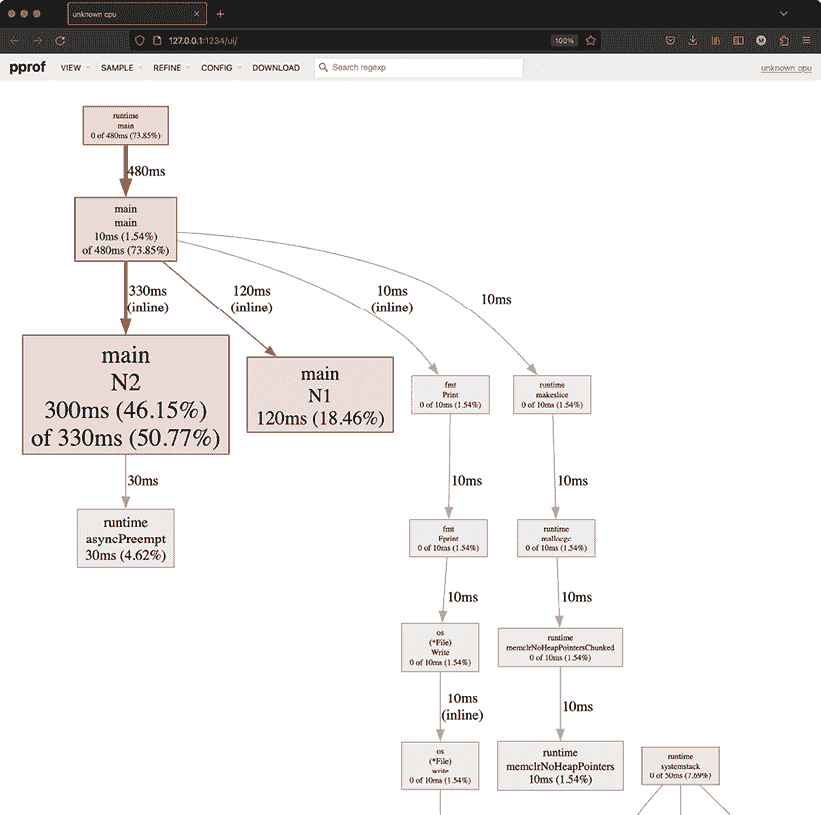
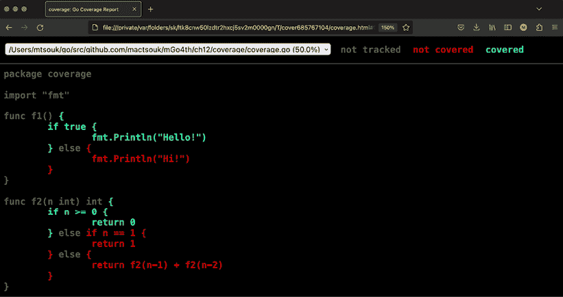
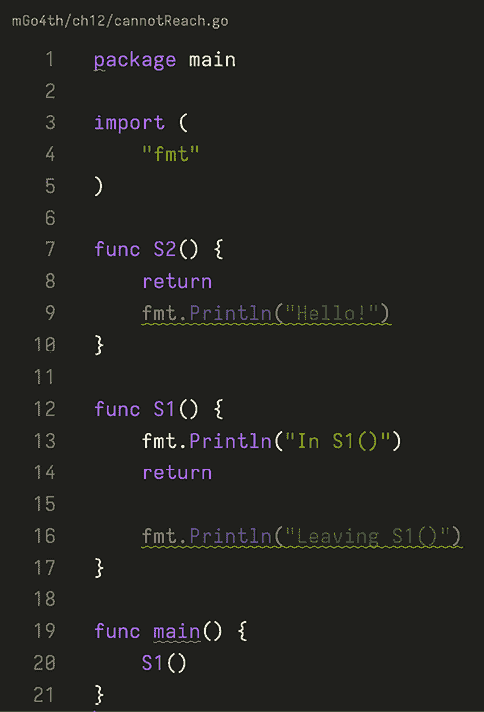

# 12

# 代码测试和分析

编程既是艺术也是科学，因此它需要帮助开发者生成更好的软件并理解为什么他们的代码的一些方面没有按预期工作的工具。本章主要讨论使用 Go 编程语言进行代码测试和代码分析。提供的代码分析工具旨在通过找到并理解瓶颈以及发现错误来提高 Go 程序的性能。

*代码优化* 是一个过程，其中一个或多个开发者试图使程序中的一些部分运行得更快、更高效或使用更少的资源。简单来说，代码优化就是消除程序在需要时和需要的地方的瓶颈。关于代码优化的讨论将在 *第十四章*，*效率和性能* 中继续，我们将讨论代码基准测试。

*代码测试* 是确保你的代码做你想让它做的事情。在本章中，我们体验了 Go 的代码测试方式。编写测试代码的最佳时机是在开发过程中，因为这可以帮助尽早揭示代码中的错误。*代码分析* 与测量程序的一些方面以获得代码工作方式的详细理解相关。代码分析的结果可以帮助你决定哪些代码部分需要更改。

请记住，在编写代码时，我们应该关注其正确性以及其他期望的特性，如可读性、简单性和可维护性，而不是其性能。一旦我们确信代码是正确的，那么我们可能需要关注其性能。一个提高性能的好技巧是在比生产环境中将要使用的机器慢一点的机器上执行代码。

本章涵盖：

+   优化代码

+   为更好的测试重写 `main()` 函数

+   代码分析

+   `go tool trace` 工具

+   跟踪网络服务器

+   测试 Go 代码

+   `govulncheck` 工具

+   交叉编译

+   使用 `go:generate`

+   创建示例函数

# 优化代码

代码优化既是艺术也是科学。这意味着没有确定性的方法可以帮助你优化代码，而且如果你想使代码更快，你应该用你的大脑尝试很多事情，算法和技术。然而，关于代码优化的普遍原则是 **首先确保它正确，然后让它变得快速**。始终记住 Donald Knuth 关于优化的说法：

> “真正的问题是程序员在错误的地方和错误的时间花费了太多的时间担心效率；过早的优化是编程中所有邪恶（至少是大部分）的根源。”

此外，记住已故的 Joe Armstrong（Erlang 的一位开发者）关于优化的说法：

> “先让它工作，然后让它变得美观，然后如果你真的、真的必须，再让它变得快速。90% 的时间，如果你让它变得美观，它已经足够快了。所以，实际上，只需让它变得美观！”

代码测试帮助你确保程序正确运行，代码剖析揭示了瓶颈。

如果你真的很喜欢代码优化，你可能想阅读 Alfred V. Aho、Monica S. Lam、Ravi Sethi 和 Jeffrey D. Ullman 所著的 *Compilers: Principles, Techniques, and Tools*（Pearson Education Limited，2014），这本书专注于编译器构造。此外，如果你有时间阅读，Donald Knuth 的 *The Art of Computer Programming* 系列的所有卷都是编程各个方面的极好资源。

下一节将展示一种重新编写 `main()` 以便更容易进行测试的技术。

# 重新编写 main() 函数以更好地进行测试

有一种巧妙的方法可以重新编写每个 `main()` 函数，以便使测试（和基准测试）变得容易得多。`main()` 函数有一个限制，即你不能从测试代码中调用它——这个技术通过 `main.go` 中的代码提供了一个解决方案。为了节省空间，省略了 `import` 块。

```go
func main() {
    **err := run(os.Args, os.Stdout)**
if err != nil {
        fmt.Printf("%s\n", err)
        return
    }
} 
```

由于没有 `main()` 函数就无法有一个可执行程序，我们必须创建一个最小化的 `main()`。`main()` 做的事情是调用 `run()`，这是我们自己的定制版本的 `main()`，向它发送所需的 `os.Args`，并收集 `run()` 的返回值：

```go
func run(args []string, stdout io.Writer) error {
    if len(args) == 1 {
        return errors.New("No input!")
    }
    // Continue with the implementation of run()
// as you would have with main()
return nil
} 
```

如前所述，`run()` 函数，或者以相同方式由 `main()` 调用的任何其他函数，提供了一个新的顶级、根类型函数，类似于 `main()`，并且具有额外的优势，即可以被测试函数调用。简单来说，`run()` 函数包含了原本位于 `main()` 中的代码——唯一的区别是 `run()` 返回一个 `error` 变量，而 `main()` 在使用 `os.Exit()` 时只能返回退出码到操作系统。你可能会说，这因为额外的函数调用而稍微增加了栈的大小，但好处远比增加的内存使用更重要。尽管技术上，`run()` 的两个参数都可以被移除，因为它们默认情况下是全局可用的，但显式传递这两个参数允许程序员在测试期间传递其他值。

运行 `main.go` 产生以下输出：

```go
$ go run main.go 
No input!
$ go run main.go some input 
```

`main.go` 的操作方式并没有什么特别之处。好事是你可以从任何你想的地方调用 `run()`，包括你为测试编写的代码，并将所需的参数传递给 `run()`！记住这个技巧是好的，因为它可能会在你想要为具有特定命令行参数或其他输入的程序编写测试时救你一命。

下一节将介绍 Go 代码的剖析。

# 剖析代码

分析是一个动态程序分析的过程，它测量与程序执行相关的各种值，以帮助你更好地理解程序的行为。在本节中，我们将学习如何分析 Go 代码以更好地理解它，这可以用来提高其性能。有时，代码分析甚至可以揭示代码中的错误，例如无限循环或永不返回的函数。然而，对于内存泄漏错误和类似的问题，分析会更好。

`runtime/pprof` 是一个标准的 Go 包，用于分析除 HTTP 服务器之外的各种应用程序。当你想要分析一个 Web 应用程序时，应该使用高级的 `net/http/pprof` 包。`net/http/pprof` 所做的是提供用于分析数据的 HTTP 端点，这意味着它也可以用于任何长时间运行的应用程序。你可以通过执行 `go tool pprof -help` 来查看 `pprof` 工具的帮助页面。

下一个子节将说明如何分析一个命令行应用程序，接下来的子节将展示 HTTP 服务器的分析。

## 分析命令行应用程序

应用程序的代码保存为 `profileCla.go` 并收集 CPU 和内存分析数据。有趣的是 `main()` 的实现，因为这是分析数据收集发生的地方：

```go
func main() {
    fmt.Println(os.TempDir())
    cpuFilename := path.Join(os.TempDir(), "cpuProfileCla.out")
    cpuFile, err := os.Create(cpuFilename)
    if err != nil {
        fmt.Println(err)
        return
    }
    pprof.StartCPUProfile(cpuFile)
    defer pprof.StopCPUProfile() 
```

之前的代码是关于收集 CPU 分析数据的。`pprof.StartCPUProfile()` 开始收集数据，通过 `pprof.StopCPUProfile()` 调用来停止。所有数据都保存在 `os.TempDir()` 目录下的一个名为 `cpuProfileCla.out` 的文件中——`os.TempDir()` 返回的值取决于所使用的操作系统，这使得代码具有可移植性。使用 `defer` 的意思是 `pprof.StopCPUProfile()` 将在 `main()` 函数退出之前被调用——如果你想在另一个点停止数据收集，你应该将 `pprof.StopCPUProfile()` 调用放在期望的位置。

```go
 total := 0
for i := 2; i < 100000; i++ {
        n := N1(i)
        if n {
            total = total + 1
        }
    }
    fmt.Println("Total primes:", total)
    total = 0
for i := 2; i < 100000; i++ {
        n := N2(i)
        if n {
            total = total + 1
        }
    }
    fmt.Println("Total primes:", total)
    for i := 1; i < 90; i++ {
        n := fibo1(i)
        fmt.Print(n, " ")
    }
    fmt.Println()
    for i := 1; i < 90; i++ {
        n := fibo2(i)
        fmt.Print(n, " ")
    }
    fmt.Println()
    runtime.GC() 
```

所有的前序代码都进行了大量的 CPU 密集型计算，以便 CPU 分析器有数据可以收集——这通常是你的实际代码所在的位置。

```go
 // Memory profiling!
    memoryFilename := path.Join(os.TempDir(), "memoryProfileCla.out")
    memory, err := os.Create(memoryFilename)
    if err != nil {
        fmt.Println(err)
        return
    }
    defer memory.Close() 
```

在 CPU 密集型代码之后，我们将放置使用大量内存的代码。为此，我们创建了一个名为 `memoryFilename` 的第二个文件，用于收集与内存相关的分析数据。

```go
 for i := 0; i < 10; i++ {
        s := make([]byte, 50000000)
        if s == nil {
            fmt.Println("Operation failed!")
        }
        time.Sleep(50 * time.Millisecond)
    }
    err = pprof.WriteHeapProfile(memory)
    if err != nil {
        fmt.Println(err)
        return
    }
} 
```

`pprof.WriteHeapProfile()` 函数将内存数据写入指定的文件。再一次，我们分配了大量的内存，以便内存分析器有数据可以收集。

使用 `go run` 运行 `profileCla.go` 将在 `os.TempDir()` 返回的文件夹中创建两个文件——通常，我们会将它们移动到另一个文件夹中。你可以随意修改 `profileCla.go` 的代码，并将分析文件放在不同的位置。

在我的情况下，在 macOS Sonoma 机器上运行，临时目录将是 `/var/folders/sk/ltk8cnw50lzdtr2hxcj5sv2m0000gn/T/`。因此，我将把 `cpuProfileCla.out` 和 `memoryProfileCla.out` 文件从那里移动到 `ch12` 目录中——你将找不到它们，因为书籍的 GitHub 仓库的 `.gitignore` 文件忽略了这两个文件。

那么，我们接下来做什么？我们应该使用 `go tool pprof` 来处理这两个文件：

```go
$ go tool pprof cpuProfileCla.out
Type: cpu
Time: Dec 13, 2023 at 6:35pm (EET)
Duration: 14.85s, Total samples = 650ms ( 4.38%)
Entering interactive mode (type "help" for commands, "o" for options)
(pprof) top
Showing nodes accounting for 630ms, 96.92% of 650ms total
Showing top 10 nodes out of 47
      flat  flat%   sum%        cum   cum%
     300ms 46.15% 46.15%    330ms 50.77%  main.N2 (inline)
     120ms 18.46% 64.62%    120ms 18.46%  main.N1 (inline)
      40ms  6.15% 70.77%     40ms  6.15%  runtime.kevent
      40ms  6.15% 76.92%     40ms  6.15%  runtime.pthread_cond_signal
      40ms  6.15% 83.08%     40ms  6.15%  runtime.pthread_cond_wait
      30ms  4.62% 87.69%     30ms  4.62%  runtime.asyncPreempt
      30ms  4.62% 92.31%     30ms  4.62%  runtime.madvise
      10ms  1.54% 93.85%     10ms  1.54%  internal/poll.(*pollDesc).prepare
      10ms  1.54% 95.38%    480ms 73.85%  main.main
      10ms  1.54% 96.92%     10ms  1.54%  runtime.memclrNoHeapPointers 
```

`top` 命令返回前 10 个条目的摘要。

```go
(pprof) top10 -cum
Showing nodes accounting for 440ms, 67.69% of 650ms total
Showing top 10 nodes out of 47
      flat  flat%   sum%        cum   cum%
      10ms  1.54%  1.54%      480ms 73.85%  main.main
         0     0%  1.54%      480ms 73.85%  runtime.main
     300ms 46.15% 47.69%      330ms 50.77%  main.N2 (inline)
     120ms 18.46% 66.15%      120ms 18.46%  main.N1 (inline)
         0     0% 66.15%      120ms 18.46%  runtime.mcall
      10ms  1.54% 67.69%      120ms 18.46%  runtime.schedule
         0     0% 67.69%      110ms 16.92%  runtime.park_m
         0     0% 67.69%       80ms 12.31%  runtime.findRunnable
         0     0% 67.69%       50ms  7.69%  runtime.notewakeup
         0     0% 67.69%       50ms  7.69%  runtime.semawakeup 
```

`top10 –cum` 命令返回每个函数的累积时间。

```go
(pprof) list main.N1
Total: 650ms
ROUTINE ======================== main.N1 in /Users/mtsouk/go/src/github.com/mactsouk/mGo4th/ch12/profileCla.go
     120ms      120ms (flat, cum) 18.46% of Total
         .          .     36:func N1(n int) bool {
         .          .     37:    k := math.Floor(float64(n/2 + 1))
         .          .     38:    for i := 2; i < int(k); i++ {
     120ms      120ms     39:        if (n % i) == 0 {
         .          .     40:            return false
         .          .     41:        }
         .          .     42:    }
         .          .     43:    return true
         .          .     44:} 
```

最后，`list` 命令显示有关给定函数的信息。之前的输出显示 `if (n % i) == 0` 语句是 `N1()` 运行所需所有时间的责任！

在你自己的代码中尝试这些分析命令，以查看它们的完整输出。访问 [`go.dev/blog/pprof`](https://go.dev/blog/pprof) 以了解有关分析更多的信息。

你还可以使用 Go 分析器的 shell 通过 `pdf` 命令创建分析数据的 PDF 输出。我个人大多数时候都是从这个命令开始的，因为它给了我一个丰富且清晰的收集数据的概览。

现在，让我们讨论如何分析 HTTP 服务器，这是下一小节的主题。

## 分析 HTTP 服务器

如前所述，当你要为运行 HTTP 服务器或任何其他需要定期收集分析数据的长时间运行程序收集 Go 应用程序的分析数据时，应该使用 `net/http/pprof` 包。为此，导入 `net/http/pprof` 在 `/debug/pprof/` 路径下安装了各种处理程序。你很快就会看到更多关于这个的内容。

这种技术在 `profileHTTP.go` 中得到了展示，其中包含以下代码：

```go
package main
import (
    "fmt"
"net/http"
"net/http/pprof"
"os"
"time"
) 
```

如前所述，你应该导入 `net/http/pprof` 包。然而，尽管导入了 `net/http/pprof`，但它并没有直接使用。导入是为了注册 HTTP 处理程序的副作用，如 [`pkg.go.dev/net/http/pprof`](https://pkg.go.dev/net/http/pprof) 中所述。

```go
func myHandler(w http.ResponseWriter, r *http.Request) {
    fmt.Fprintf(w, "Serving: %s\n", r.URL.Path)
    fmt.Printf("Served: %s\n", r.Host)
}
func timeHandler(w http.ResponseWriter, r *http.Request) {
    t := time.Now().Format(time.RFC1123)
    Body := "The current time is:"
    fmt.Fprintf(w, "%s %s", Body, t)
    fmt.Fprintf(w, "Serving: %s\n", r.URL.Path)
    fmt.Printf("Served time for: %s\n", r.Host)
} 
```

前两个函数实现了将要在我们简单的 HTTP 服务器中使用的两个处理程序。`myHandler()` 是默认的处理程序函数，而 `timeHandler()` 返回服务器上的当前时间和日期。

```go
func main() {
    PORT := ":8001"
    arguments := os.Args
    if len(arguments) == 1 {
        fmt.Println("Using default port number: ", PORT)
    } else {
        PORT = ":" + arguments[1]
        fmt.Println("Using port number: ", PORT)
    }
    r := http.NewServeMux()
    r.HandleFunc("/time", timeHandler)
    r.HandleFunc("/", myHandler) 
```

到目前为止，并没有什么特别之处，因为我们只是注册了处理程序函数。

所有的先前声明都为 HTTP 分析器安装了处理程序——你可以使用 Web 服务器的主机名和端口号来访问它们。你不必使用所有处理程序。

```go
 err := http.ListenAndServe(PORT, r)
    if err != nil {
        fmt.Println(err)
        return
    }
} 
```

最后，你像往常一样启动 HTTP 服务器。

接下来是什么？首先，你运行 HTTP 服务器（`go run profileHTTP.go`）。然后，你在不同的终端窗口中运行下一个命令来收集与 HTTP 服务器交互时的分析数据：

```go
$ go tool pprof http://localhost:8001/debug/pprof/profile
Fetching profile over HTTP from http://localhost:8001/debug/pprof/profile
Saved profile in /Users/mtsouk/pprof/pprof.samples.cpu.001.pb.gz
Type: cpu
Time: Dec 13, 2023 at 6:44pm (EET)
Duration: 30.02s, Total samples = 30ms (  0.1%)
Entering interactive mode (type "help" for commands, "o" for options)
(pprof) % 
```

之前的输出显示了 HTTP 分析器的初始屏幕——可用的命令与分析命令行应用程序时相同。

您可以选择退出 shell，稍后使用`go tool pprof`分析数据，或者继续输入分析器命令。这是在 Go 中分析 HTTP 服务器的一般思路。

下一个子节讨论了 Go 分析器的 Web 界面。

## Go 分析器的 Web 界面

好消息是，从 Go 版本 1.10 开始，`go tool pprof`自带了一个 Web 界面，您可以通过`go tool pprof -http=[host]:[port] aProfile.out`启动它——不要忘记将您希望设置的值设置为`-http`。

我已经执行了之前的命令`go tool pprof -http=127.0.0.1:1234 cpuProfileCla.out`。

下一个图中可以看到分析器 Web 界面的一部分，它显示了程序执行时间的分配情况——现在开发者需要找出性能是否存在问题。



图 12.1：Go 分析器的 Web 界面

随意浏览 Web 界面，查看提供的各种选项和菜单。不幸的是，关于分析器的更多讨论超出了本章的范围。像往常一样，如果您真的对代码分析感兴趣，尽可能多地实验。

下一个章节是关于代码跟踪的，它提供了关于 Go 内部操作的信息。

## Go 工具跟踪实用程序

代码跟踪是一个允许您了解垃圾收集器操作、goroutine 的生命周期、每个逻辑处理器的活动以及操作系统线程使用数量的过程。`go tool trace`实用程序是一个用于查看存储在跟踪文件中的数据的工具，这些数据可以通过以下三种方式中的任何一种生成：

+   使用`runtime/trace`包

+   使用`net/http/pprof`包

+   使用`go test -trace`命令

本节通过`traceCLA.go`的代码示例说明了第一种技术的使用：

```go
package main
import (
    "fmt"
"os"
"path"
"runtime/trace"
"time"
) 
```

需要使用`runtime/trace`包来收集所有种类的跟踪数据——没有选择特定跟踪数据的必要，因为所有跟踪数据都是相互关联的。

```go
func main() {
    filename := path.Join(os.TempDir(), "traceCLA.out")
    f, err := os.Create(filename)
    if err != nil {
        panic(err)
    }
    defer f.Close() 
```

正如我们在分析时做的那样，我们需要创建一个文件来存储跟踪数据。在这种情况下，文件名为`traceCLA.out`，并存储在您的操作系统的临时目录中。

```go
 err = trace.Start(f)
    if err != nil {
        fmt.Println(err)
        return
    }
    defer trace.Stop() 
```

这部分完全是关于为`go tool trace`获取数据，它与程序的目的无关。我们使用`trace.Start()`启动跟踪过程。完成之后，我们调用`trace.Stop()`函数。`defer`调用意味着我们希望在`main()`函数返回时终止跟踪。

```go
 for i := 0; i < 3; i++ {
        s := make([]byte, 50000000)
        if s == nil {
            fmt.Println("Operation failed!")
        }
    }
    for i := 0; i < 5; i++ {
        s := make([]byte, 100000000)
        if s == nil {
            fmt.Println("Operation failed!")
        }
        time.Sleep(time.Millisecond)
    }
} 
```

所有的前一段代码都是关于分配内存以触发垃圾回收器的操作并生成更多跟踪数据的——你可以在附录 A 中了解更多关于 Go 垃圾回收器的信息，即*Go 垃圾回收器*。程序会像往常一样执行。然而，当它完成后，它会将跟踪数据填充到`traceCLA.out`中。之后，我们应该按照以下方式处理跟踪数据：

```go
$ go tool trace /path/ToTemporary/Directory/traceCLA.out
2023/12/14 18:12:06 Parsing trace...
2023/12/14 18:12:06 Splitting trace...
2023/12/14 18:12:06 Opening browser. Trace viewer is listening on http://127.0.0.1:52829 
```

最后一条命令会自动启动一个 Web 服务器（`http://127.0.0.1:52829`）并在你的默认 Web 浏览器上打开跟踪工具的 Web 界面——你可以在自己的电脑上运行它来玩转跟踪工具的 Web 界面。

“查看跟踪”链接显示了关于你的程序 goroutines 和垃圾回收器操作的信息——如果你的代码使用了多个 goroutines，这是理解它们行为最好的地方。

请记住，尽管`go tool trace`非常方便且强大，但它不能解决所有类型的性能问题。有时`go tool pprof`更为合适，特别是当我们想要揭示代码大部分时间花在哪里时。

与分析类似，收集 HTTP 服务器的跟踪数据是一个稍微不同的过程，这将在下一小节中解释。

## 从客户端追踪 Web 服务器

本节展示了如何使用`net/http/httptrace`来追踪 Web 服务器应用程序。该包允许你追踪客户端 HTTP 请求的各个阶段。与 Web 服务器交互的`traceHTTP.go`代码如下：

```go
package main
import (
    "fmt"
"net/http"
"net/http/httptrace"
"os"
) 
```

如预期的那样，我们需要在启用 HTTP 跟踪之前导入`net/http/httptrace`。

```go
func main() {
    if len(os.Args) != 2 {
        fmt.Printf("Usage: URL\n")
        return
    }
    URL := os.Args[1]
    client := http.Client{}
    req, _ := http.NewRequest("GET", URL, nil) 
```

到目前为止，我们已经像往常一样准备好了发送到 Web 服务器的客户端请求。

```go
 trace := &httptrace.ClientTrace{
        GotFirstResponseByte: func() {
            fmt.Println("First response byte!")
        },
        GotConn: func(connInfo httptrace.GotConnInfo) {
            fmt.Printf("Got Conn: %+v\n", connInfo)
        },
        DNSDone: func(dnsInfo httptrace.DNSDoneInfo) {
            fmt.Printf("DNS Info: %+v\n", dnsInfo)
        },
        ConnectStart: func(network, addr string) {
            fmt.Println("Dial start")
        },
        ConnectDone: func(network, addr string, err error) {
            fmt.Println("Dial done")
        },
        WroteHeaders: func() {
            fmt.Println("Wrote headers")
        },
    } 
```

上一段代码都是关于追踪 HTTP 请求的。`httptrace.ClientTrace`结构体定义了我们感兴趣的事件，包括`GotFirstResponseByte`、`GotConn`、`DNSDone`、`ConnectStart`、`ConnectDone`和`WroteHeaders`。当这些事件发生时，相关的代码会被执行。你可以在`net/http/httptrace`包的文档中找到更多关于支持的事件及其目的的信息。

```go
 req = req.WithContext(httptrace.WithClientTrace(req.Context(), trace))
    fmt.Println("Requesting data from server!")
    _, err := http.DefaultTransport.RoundTrip(req)
    if err != nil {
        fmt.Println(err)
        return
    } 
```

`httptrace.WithClientTrace()`函数基于给定的父上下文返回一个新的上下文值，而`http.DefaultTransport.RoundTrip()`则将请求包装在这个上下文值中，以便跟踪请求。

请记住，Go HTTP 跟踪已经被设计来追踪单个`http.Transport.RoundTrip`的事件。

```go
 _, err = client.Do(req)
    if err != nil {
        fmt.Println(err)
        return
    }
} 
```

最后的部分将客户端请求发送到服务器以开始跟踪。

运行`traceHTTP.go`会生成以下输出：

```go
$ go run traceHTTP.go https://go.dev
Requesting data from server!
DNS Info: {Addrs:[{IP:2001:4860:4802:32::15 Zone:} {IP:2001:4860:4802:34::15 Zone:} {IP:2001:4860:4802:36::15 Zone:} {IP:2001:4860:4802:38::15 Zone:} {IP:216.239.32.21 Zone:} {IP:216.239.34.21 Zone:} {IP:216.239.36.21 Zone:} {IP:216.239.38.21 Zone:}] Err:<nil> Coalesced:false}
Dial start
Dial done
Got Conn: {Conn:0x1400018e000 Reused:false WasIdle:false IdleTime:0s}
Wrote headers
First response byte!
Got Conn: {Conn:0x1400018e000 Reused:true WasIdle:false IdleTime:0s}
Wrote headers
First response byte! 
```

之前的输出可以帮助你更详细地了解连接的进度，在故障排除时很有用。不幸的是，关于跟踪的更多讨论超出了本书的范围。下一小节将展示如何访问 Web 服务器的所有路由以确保它们被正确定义。

## 访问 Web 服务器的所有路由

`gorilla/mux` 包提供了一个 `Walk()` 函数，可以用来访问路由器注册的所有路由——当你想要确保每个路由都已注册且正常工作时，这会非常有用。

`walkAll.go` 的代码，其中包含许多空处理函数，因为它的目的是不测试处理函数，而是访问它们，如下所示（没有任何东西禁止你在完全实现的 Web 服务器上使用相同的技巧）：

```go
package main
import (
    "fmt"
"net/http"
"strings"
"github.com/gorilla/mux"
) 
```

由于我们使用外部包，`walkAll.go` 的运行应该在 `~/go/src` 下的某个位置进行——在我们的例子中，在 `./ch12/walkAll` 下。

```go
func handler(w http.ResponseWriter, r *http.Request) {
    return
} 
```

这个空处理函数出于简单起见被所有端点共享。

```go
func (h notAllowedHandler) ServeHTTP(rw http.ResponseWriter, r *http.Request) {
    handler(rw, r)
} 
```

`notAllowedHandler` 处理器也会调用 `handler()` 函数。

```go
type notAllowedHandler struct{}
func main() {
    r := mux.NewRouter()
    r.NotFoundHandler = http.HandlerFunc(handler)
    notAllowed := notAllowedHandler{}
    r.MethodNotAllowedHandler = notAllowed
    // Register GET
    getMux := r.Methods(http.MethodGet).Subrouter()
    getMux.HandleFunc("/time", handler)
    getMux.HandleFunc("/getall", handler)
    getMux.HandleFunc("/getid", handler)
    getMux.HandleFunc("/logged", handler)
    getMux.HandleFunc("/username/{id:[0-9]+}", handler)
    // Register PUT
// Update User
    putMux := r.Methods(http.MethodPut).Subrouter()
    putMux.HandleFunc("/update", handler)
    // Register POST
// Add User + Login + Logout
    postMux := r.Methods(http.MethodPost).Subrouter()
    postMux.HandleFunc("/add", handler)
    postMux.HandleFunc("/login", handler)
    postMux.HandleFunc("/logout", handler)
    // Register DELETE
// Delete User
    deleteMux := r.Methods(http.MethodDelete).Subrouter()
    deleteMux.HandleFunc("/username/{id:[0-9]+}", handler) 
```

前一部分是关于定义我们想要支持的路线和 HTTP 方法。

```go
 err := r.Walk(func(route *mux.Route, router *mux.Router, ancestors []*mux.Route) error { 
```

前面的陈述说明了我们如何调用 `Walk()` 方法。

```go
 pathTemplate, err := route.GetPathTemplate()
        if err == nil {
            fmt.Println("ROUTE:", pathTemplate)
        }
        pathRegexp, err := route.GetPathRegexp()
        if err == nil {
            fmt.Println("Path regexp:", pathRegexp)
        }
        qT, err := route.GetQueriesTemplates()
        if err == nil {
            fmt.Println("Queries templates:", strings.Join(qT, ","))
        }
        qRegexps, err := route.GetQueriesRegexp()
        if err == nil {
            fmt.Println("Queries regexps:", strings.Join(qRegexps, ","))
        }
        methods, err := route.GetMethods()
        if err == nil {
            fmt.Println("Methods:", strings.Join(methods, ","))
        }
        fmt.Println()
        return nil
    }) 
```

对于每个访问的路由，程序会收集所需的信息。如果你觉得某些 `fmt.Println()` 调用没有帮助，请随意移除它们。

```go
 if err != nil {
        fmt.Println(err)
    }
    http.Handle("/", r)
} 
```

因此，`walkAll.go` 背后的基本思想是，你为服务器中的每个路由分配一个空处理函数，然后调用 `mux.Walk()` 来访问所有路由。启用 Go 模块并运行 `walkAll.go` 生成以下输出：

```go
$ go mod init
$ go mod tidy
$ go run walkAll.go
Queries templates: 
Queries regexps: 
Methods: GET
ROUTE: /time
Path regexp: ^/time$
Queries templates: 
Queries regexps: 
Methods: GET 
```

输出显示了每个路由支持的 HTTP 方法以及路径的格式。因此，`/time` 端点使用 `GET` 方法，其路径是 `/time`，因为 `Path` 正则表达式的值意味着 `/time` 在路径的开始 (`^`) 和结束 (`$`) 之间。

```go
ROUTE: /getall
Path regexp: ^/getall$
Queries templates: 
Queries regexps: 
Methods: GET
ROUTE: /getid
Path regexp: ^/getid$
Queries templates: 
Queries regexps: 
Methods: GET
ROUTE: /logged
Path regexp: ^/logged$
Queries templates: 
Queries regexps: 
Methods: GET
ROUTE: /username/{id:[0-9]+}
Path regexp: ^/username/(?P<v0>[0-9]+)$
Queries templates: 
Queries regexps: 
Methods: GET 
```

在 `/username` 的情况下，输出包括与用于选择 id 变量值的端点相关的正则表达式。

```go
Queries templates: 
Queries regexps: 
Methods: PUT
ROUTE: /update
Path regexp: ^/update$
Queries templates: 
Queries regexps: 
Methods: PUT
Queries templates: 
Queries regexps: 
Methods: POST
ROUTE: /add
Path regexp: ^/add$
Queries templates: 
Queries regexps: 
Methods: POST
ROUTE: /login
Path regexp: ^/login$
Queries templates: 
Queries regexps: 
Methods: POST
ROUTE: /logout
Path regexp: ^/logout$
Queries templates: 
Queries regexps: 
Methods: POST
Queries templates: 
Queries regexps: 
Methods: DELETE
ROUTE: /username/{id:[0-9]+}
Path regexp: ^/username/(?P<v0>[0-9]+)$
Queries templates: 
Queries regexps: 
Methods: DELETE 
```

虽然访问 Web 服务器的路由是一种测试方式，但它并不是官方的 Go 测试方式。在输出中，我们主要关注的是端点的缺失、使用错误的 HTTP 方法或端点参数的缺失。

下一个部分将讨论 Go 代码的测试。

# 测试 Go 代码

本节的主题是通过编写测试函数来测试 Go 代码。软件测试是一个非常大的主题，无法在本书章节的单个部分中涵盖。因此，本节试图尽可能多地提供实用信息。

Go 允许你为你的 Go 代码编写测试以检测错误。然而，软件测试只能显示一个或多个错误的存在，而不能证明没有错误。这意味着你永远不能 100%确信你的代码中没有错误！

严格来说，本节是关于自动化测试，这涉及到编写额外的代码来验证实际代码——即生产代码——是否按预期工作。因此，测试函数的结果要么是 `PASS`，要么是 `FAIL`。

你很快就会看到它是如何工作的。虽然 Go 的测试方法一开始可能看起来很简单，特别是如果你将其与其他编程语言的测试实践进行比较，但它非常高效和有效，因为它不需要开发者太多的时间。

Go 在测试（以及基准测试）方面遵循某些约定。最重要的约定是测试函数的名称必须以 `Test` 开头。在 `Test` 词语之后，我们必须放置一个下划线或大写字母。因此，`TestFunctionName()` 和 `Test_functionName()` 都是有效的测试函数，而 `Testfunctionname()` 则不是。如果你更喜欢 Go 的惯用法，那么请使用 `TestFunctionName()`。所有这样的函数都放在以 `_test.go` 结尾的文件中。所有测试函数都必须有一个 `t *testing.T` 参数，并且不返回任何值。最后，包含测试代码的包应包含 `testing` 包。

一旦测试代码正确，`go test` 子命令会为你完成所有脏活，包括扫描所有 `*_test.go` 文件中的特殊函数，生成适当的临时 `main` 包，调用这些特殊函数，获取结果，并生成最终输出。

现在，让我们通过回顾 *第三章*，*复合数据类型* 中的 `matchInt()` 函数来介绍测试。

## 为 ./ch03/intRE.go 编写测试

在本小节中，我们为在 *第三章*，*复合数据类型* 中实现的 `matchInt()` 函数编写测试。首先，我们创建一个名为 `intRE_test.go` 的新文件，它将包含所有测试。然后，我们将包名从 `main` 改为 `testRE` 并删除 `main()` 函数——这是一个可选步骤。之后，我们必须决定我们要测试什么以及如何测试。测试的主要步骤包括编写预期输入、意外输入、空输入和边缘情况的测试。所有这些都会在代码中看到。此外，我们还将生成随机整数，将它们转换为字符串，并将它们用作 `matchInt()` 的输入。一般来说，测试处理数值的函数的好方法是使用随机数或随机值作为输入，并观察你的代码如何表现和处理这些值。

相关代码，包括 `intRE.go` 的原始版本，可以在 `~/go/src/github.com/mactsouk/mGo4th/ch12/intRE` 内找到，并包含两个测试函数。`intRE_test.go` 的两个测试函数如下：

```go
func TestMatchInt(t *testing.T) {
    if matchInt("") {
        t.Error(`matchInt("") != false`)
    } 
```

`matchInt("")` 调用应该返回 `false`，所以如果它返回 `true`，则意味着该函数没有按预期工作。

```go
 if matchInt("00") == false {
        t.Error(`matchInt("00") != true`)
    } 
```

`matchInt("00")` 调用应该返回 `true`，因为 `00` 是一个有效的整数，所以如果它返回 `false`，则意味着该函数没有按预期工作。

```go
 if matchInt("-00") == false {
        t.Error(`matchInt("-00") != true`)
    }
    if matchInt("+00") == false {
        t.Error(`matchInt("+00") != true`)
    }
} 
```

这个第一个测试函数使用静态输入来测试 `matchInt()` 函数的正确性。如前所述，一个测试函数需要一个 `*testing.T` 参数，并且不返回任何值。

```go
func TestWithRandom(t *testing.T) {
    n := strconv.Itoa(random(-100000, 19999))
    if matchInt(n) == false {
        t.Error("n = ", n)
    }
} 
```

第二个测试函数使用随机但有效的输入来测试`matchInt()`——这个随机输入是由`random()`函数生成的，该函数也实现于`intRE_test.go`中。因此，给定的输入应该总是通过测试。使用`go test`运行这两个测试函数会创建以下输出：

```go
$ go test -v *.go
=== RUN   TestMatchInt
--- PASS: TestMatchInt (0.00s)
=== RUN   TestWithRandom
--- PASS: TestWithRandom (0.00s)
PASS
ok    command-line-arguments    0.580s 
```

因此，所有测试都通过了，这意味着`matchInt()`一切正常——一般来说，函数的操作越简单，测试它就越容易。`-v`参数创建详细输出，可以省略。

下一个子节将展示如何测试 UNIX 信号。

## 测试 UNIX 信号

存在一种测试 UNIX 信号的技术。为什么系统信号需要特殊处理？主要原因在于向正在运行的 UNIX 进程发送 UNIX 信号很困难，这意味着手动测试处理 UNIX 信号的进程也很困难。另一个棘手的原因是，当你收到定义为这样做的信号时，你可能会意外退出正在运行的测试。

相关代码位于`ch12/testSignals`中，其中包含两个名为`signalsTest.go`和`signalsTest_test.go`的文件。

`signalsTest.go`的结构如下：

```go
package mySignals
func HandleSignal(sig os.Signal) {
    fmt.Println("handleSignal() Caught:", sig)
}
func Listener() {
    // Function implementation
} 
```

因此，`signalsTest.go`不包含`main()`函数，因为它不实现`main`包。这种情况发生是因为这样的实现使得测试更加容易。在你确保代码按预期工作后，你可以将其包含在`main`包中，或者将现有文件转换为`main`包。在这种情况下，你只需要更改`package`语句，并将`Listener()`函数重命名为`main()`。

`signalsTest_test.go`的代码分为两部分。第一部分包含以下代码：

```go
package mySignals
import (
    "fmt"
"syscall"
"testing"
"time"
)
func TestAll(t *testing.T) {
    go Listener()
    time.Sleep(time.Second)
    test_SIGUSR1()
    time.Sleep(time.Second)
    test_SIGUSR2()
    time.Sleep(time.Second)
    test_SIGHUP()
    time.Sleep(time.Second)
} 
```

`TestAll()`函数是`signalsTest_test.go`中发现的唯一测试函数，这意味着它是`go test`将要执行的唯一函数。因此，它将负责调用`signalsTest_test.go`中的其他函数以及`signalsTest.go`中的`Listener()`函数，后者负责处理 UNIX 信号。如果你忘记调用`Listener()`函数，所有测试都将失败。此外，`Listener()`需要作为一个 goroutine 来调用，否则，所有测试都将停滞，因为`Listener()`永远不会返回。

请记住，如果由于某种原因`Listener()`协程停止处理信号，而程序继续运行，测试仍然会在实际上未能处理信号的情况下返回`PASS`。这种情况可能发生的一种方式是`Listener()`中的匿名函数提前返回。然而，通常情况下，这种情况不应该发生。

`time.Sleep()`调用为`test_SIGUSR1()`、`test_SIGUSR2()`和`test_SIGHUP()`函数发送 UNIX 信号以及`Listener()`函数按顺序处理信号提供了足够的时间。最后一个`time.Sleep()`调用的目的是在所有测试结束之前给`Listener()`处理最后一个信号的时间。

`signalsTest_test.go`的第二部分包含以下代码：

```go
func test_SIGUSR1() {
    fmt.Println("Sending syscall.SIGUSR1")
    syscall.Kill(syscall.Getpid(), syscall.SIGUSR1)
}
func test_SIGUSR2() {
    fmt.Println("Sending syscall.SIGUSR2")
    syscall.Kill(syscall.Getpid(), syscall.SIGUSR2)
}
func test_SIGHUP() {
    fmt.Println("Sending syscall.SIGHUP")
    syscall.Kill(syscall.Getpid(), syscall.SIGHUP)
} 
```

`test_SIGUSR1()`、`test_SIGUSR2()`和`test_SIGHUP()`中的每一个函数都会向运行的 UNIX 进程发送不同的信号——使用`syscall.Getpid()`调用发现运行中的 UNIX 进程的进程 ID。

运行测试会产生以下输出：

```go
$ go test -v *.go
=== RUN   TestAll
Process ID: 22100
Sending syscall.SIGUSR1
handleSignal() Caught: user defined signal 1
Execution time: 1.001762208s
Sending syscall.SIGUSR2
handleSignal() Caught: user defined signal 2
Sending syscall.SIGHUP
Caught: hangup
--- PASS: TestAll (4.00s)
PASS
ok    command-line-arguments    4.411s 
```

所有测试都成功完成，这意味着所有信号都成功处理，没有`Listener()`函数提前退出。

如果你多次运行前面的测试，你可能会得到一个看起来像以下内容的最后一行：

```go
ok    command-line-arguments    (cached) 
```

输出中的单词`cached`告诉我们，Go 使用了现有的测试结果来加快测试运行速度，而没有执行测试函数，这并不总是我们期望的行为。下一小节将展示如何在测试时清除或禁用缓存。

## 禁用测试缓存

测试和缓存并不总是好的组合，主要是因为你总是得到相同的结果。然而，如果测试输入和测试主题没有变化，这有其好处——这使得它在几种情况下完全有效。存在两种避免使用测试缓存得到结果的方法。第一种需要运行`go clean -testcache`，这将清除整个测试缓存，而第二种需要使用`-count=1`运行你的测试，这会阻止 Go 为给定的测试执行保存任何测试缓存。

下一小节将讨论`TempDir()`方法的使用，这在测试或基准测试期间需要创建一个临时数据存储位置时非常有用。

## 测试的`TempDir()`函数

`testing.TempDir()`方法与测试和基准测试都兼容。它的目的是在测试（或基准测试）期间创建一个临时目录。每次调用`testing.TempDir()`都会返回一个唯一的目录。Go 会**自动删除**该临时目录，当测试及其子测试或基准测试即将结束时，通过`CleanUp()`方法完成——这是 Go 安排的，你不需要自己使用和实现`CleanUp()`。

你不应该混淆`testing.TempDir()`和`os.TempDir()`。我们已经在本章开头看到了`os.TempDir()`方法在`profileCla.go`和`traceCLA.go`中的使用。`os.TempDir()`返回用于临时文件的默认目录，而`testing.TempDir()`返回当前测试使用的临时目录。

临时目录将要创建的确切位置取决于所使用的操作系统。在 macOS 上，它位于 `/var/folders` 下，而在 Linux 上，它位于 `/tmp` 下。我们将在下一个子节中说明 `testing.TempDir()`，同时也会讨论 `Cleanup()`。

## `Cleanup()` 函数

虽然我们在测试场景中展示了 `Cleanup()` 方法，但 `Cleanup()` 适用于测试和基准测试。其名称揭示了其目的，即在测试或基准测试包时清理我们创建的一些东西。然而，我们需要告诉 `Cleanup()` 要做什么——`Cleanup()` 的参数是一个执行清理的函数。

该函数通常作为匿名函数内联实现，但你也可以在其他地方创建它并通过其名称调用它。

`cleanup.go` 文件包含一个名为 `Foo()` 的虚拟函数——因为它不包含任何实际代码，所以没有必要展示它。另一方面，所有重要的代码都可以在 `cleanup_test.go` 中找到。

```go
func myCleanUp() func() {
    return func() {
        fmt.Println("Cleaning up!")
    }
} 
```

`myCleanUp()` 函数将被用作 `CleanUp()` 的参数，并应具有该特定签名。除了签名之外，你可以在 `myCleanUp()` 的实现中放置任何类型的代码。

```go
func TestFoo(t *testing.T) {
    t1 := path.Join(os.TempDir(), "test01")
    t2 := path.Join(os.TempDir(), "test02") 
```

变量 `t1` 和 `t2` 存储了我们将要创建的两个目录的路径。

```go
 err := os.Mkdir(t1, 0755)
    if err != nil {
        t.Error("os.Mkdir() failed:", err)
        return
    } 
```

之前的代码使用 `os.Mkdir()` 创建了一个目录——我们手动指定了其路径。因此，当它不再需要时，删除该目录是我们的责任。

```go
 defer t.Cleanup(func() {
        err = os.Remove(t1)
        if err != nil {
            t.Error("os.Mkdir() failed:", err)
        }
    }) 
```

在 `TestFoo()` 执行完毕后，`t1` 被传递给 `t.CleanUp()` 参数的匿名函数所删除。

```go
 err = os.Mkdir(t2, 0755)
    if err != nil {
        t.Error("os.Mkdir() failed:", err)
        return
    }
} 
```

我们使用 `os.Mkdir()` 创建另一个目录——然而，在这种情况下，我们不会删除该目录。因此，在 `TestFoo()` 执行完毕后，`t2` 不会被删除。

```go
func TestBar(t *testing.T) {
    t1 := t.TempDir() 
```

由于使用了 `testing.TempDir()` 方法，`t1` 的值（目录路径）由操作系统分配。此外，当测试函数即将结束时，该目录路径将被**自动删除**。

```go
 fmt.Println(t1)
    t.Cleanup(myCleanUp())
} 
```

在这里，我们使用 `myCleanUp()` 作为 `Cleanup()` 的参数。当你想要多次执行相同的清理时，这很方便。运行测试会创建以下输出：

```go
$ go test -v *.go
=== RUN   TestFoo
--- PASS: TestFoo (0.00s)
=== RUN   TestBar
/var/folders/sk/ltk8cnw50lzdtr2hxcj5sv2m0000gn/T/TestBar1090994662/001 
```

这是使用 macOS 机器上的 `TempDir()` 创建的临时目录。

```go
Cleaning up!
--- PASS: TestBar (0.00s)
PASS
ok    command-line-arguments        0.493s 
```

检查由 `TempDir()` 创建的目录是否存在表明它们已被成功删除。另一方面，存储在 `TestFoo()` 的 `t2` 变量中的目录尚未被删除。再次运行相同的测试（请记住禁用缓存）将会失败，因为 `test02` 文件已经存在且无法创建：

```go
$ go test -v *.go -count=1
=== RUN   TestFoo
    cleanup_test.go:34: os.Mkdir() failed: mkdir /var/folders/sk/ltk8cnw50lzdtr2hxcj5sv2m0000gn/T/test02: file exists
--- FAIL: TestFoo (0.00s)
=== RUN   TestBar
/var/folders/sk/ltk8cnw50lzdtr2hxcj5sv2m0000gn/T/TestBar1703429008/001
Cleaning up!
--- PASS: TestBar (0.00s)
FAIL
FAIL    command-line-arguments    0.310s
FAIL 
```

错误信息 `/var/folders/sk/ltk8cnw50lzdtr2hxcj5sv2m0000gn/T/test02: 文件存在` 揭示了问题的根源。因此，**请正确清理您的测试**。

下一个子节讨论了 `testing/quick` 包的使用。

## 测试/快速包

有时候你需要在没有人为干预的情况下创建测试数据。Go 标准库提供了 `testing/quick` 包，它可以用于 *黑盒测试*（一种软件测试方法，在没有任何关于其内部工作先验知识的情况下检查应用程序或函数的功能），并且与 Haskell 编程语言中找到的 `QuickCheck` 包有些相关——这两个包都实现了帮助您进行黑盒测试的实用函数。借助 `testing/quick`，Go 生成用于测试的内置类型的随机值，这样您就无需手动生成所有这些值。

`quickT.go` 的代码如下：

```go
package quickt
type Point2D struct {
    X, Y int
}
func Add(x1, x2 Point2D) Point2D {
    temp := Point2D{}
    temp.X = x1.X + x2.X
    temp.Y = x1.Y + x2.Y
    return temp
} 
```

之前的代码实现了一个单一的功能，该功能将两个 `Point2D` 变量相加——这是我们将要测试的功能。

`quickT_test.go` 的代码如下：

```go
package quickt
import (
    "testing"
"testing/quick"
)
var N = 1000000
func TestWithItself(t *testing.T) {
    condition := func(a, b Point2D) bool {
        return Add(a, b) == Add(b, a)
    }
    err := quick.Check(condition, &quick.Config{MaxCount: N})
    if err != nil {
        t.Errorf("Error: %v", err)
    }
} 
```

对 `quick.Check()` 的调用会自动根据其第一个参数的签名生成随机数，该参数是一个之前定义的函数。您无需自己创建这些随机数，这使得代码易于阅读和编写。实际的测试发生在 `condition` 函数中。简单来说，我们首先定义一个属性函数，它代表我们想要在一系列输入中保持为真的条件。这个函数接受输入值，并返回一个布尔值，表示该属性对于这些值是否成立。

```go
func TestThree(t *testing.T) {
    condition := func(a, b, c Point2D) bool {
        return Add(Add(a, b), c) == Add(a, b)
    } 
```

这个实现故意是错误的。为了纠正实现，我们应该将 `Add(Add(a, b), c) == Add(a, b)` 替换为 `Add(Add(a, b), c) == Add(c, Add(a, b))`。我们这样做是为了看到当测试失败时生成的输出。

```go
 err := quick.Check(condition, &quick.Config{MaxCount: N})
    if err != nil {
        t.Errorf("Error: %v", err)
    }
} 
```

运行创建的测试生成以下输出：

```go
$ go test -v *.go
=== RUN   TestWithItself
--- PASS: TestWithItself (0.86s) 
```

如预期的那样，第一个测试是成功的。

```go
=== RUN   TestThree
    quickT_test.go:28: Error: #1: failed on input quickT.Point2D{X:-8079189616506550499, Y:-6176385978113309642}, quickT.Point2D{X:9017849222923794558, Y:-7161977443830767080}, quickT.Point2D{X:-714979330681957566, Y:-4578147860393889265}
--- FAIL: TestThree (0.00s)
FAIL
FAIL    command-line-arguments  0.618s
FAIL 
```

然而，正如预期的那样，第二个测试生成了一个错误。好事是，导致错误的输入显示在屏幕上，这样你就可以看到导致你的函数失败的输入。

下一小节将告诉我们如何超时那些执行时间太长的测试。

## 测试超时

如果 `go test` 工具完成得太慢，或者由于某种原因永远不结束，`-timeout` 参数可以帮助您。

为了说明这一点，我们使用了前一小节中的代码以及 `-timeout` 和 `-count` 命令行标志。前者指定了测试允许的最大时间长度，后者指定了测试将要执行的数量。

运行 `go test -v *.go -timeout 1s` 告诉 `go test` 所有测试最多需要一秒钟完成——在我的机器上，测试确实少于一秒就完成了。

然而，运行以下代码会生成不同的输出：

```go
$ go test -v *.go -timeout 1s -count 2
=== RUN   TestWithItself
--- PASS: TestWithItself (0.87s)
=== RUN   TestThree
    quickT_test.go:28: Error: #1: failed on input quickT.Point2D{X:-312047170140227400, Y:-5441930920566042029}, quickT.Point2D{X:7855449254220087092, Y:7437813460700902767}, quickT.Point2D{X:4838605758154930957, Y:-7621852714243790655}
--- FAIL: TestThree (0.00s)
=== RUN   TestWithItself
panic: test timed out after 1s 
```

实际输出比展示的要长——其余的输出与 goroutines 在完成前被终止有关。这里的关键点是，`go test` 命令由于使用了 `-timeout 1s` 而超时了进程。

到目前为止，我们已经看到了在测试失败时使用 `Errorf()` 的例子。下一个子节将讨论 `testing.T.Fatalf()` 和 `testing.T.Fatal()` 的使用。

## 使用 testing.T.Fatal() 和 testing.T.Fatalf() 进行测试

本节讨论了 `testing.T.Fatalf()` 和 `testing.T.Fatal()` 的使用。使用 `T.Fatal()` 和 `T.Fatalf()` 而不是 `T.Error()` 和 `T.Errorf()` 的核心思想是，当停止测试代码有意义时（因为之前的失败将导致更多失败），应使用 `T.Fatal()` 或 `T.Fatalf()`。另一方面，当条件失败不会因为各种依赖而导致更多失败时，应使用适当的 `T.Error()` 变体。

使用 `t.Fatalf()` 的两个实际案例是：当测试所需的数据库连接失败时，或者当测试所需的网络连接无法建立时。

相关代码可以在 `code.go` 和 `code_test.go` 中找到，这两个文件都位于 `ch12/testFatal` 内。

`code.go` 的内容如下：

```go
package server
var DATA = map[string]string{}
func init() {
    DATA["server"] = "127.0.0.1"
} 
```

`server` 包使用 `init()` 函数初始化 `DATA` 映射，通过为 `"server"` 键定义值。

`code_test.go` 的内容如下：

```go
package server
import (
    "testing"
)
func TestMap(t *testing.T) {
    key := "server"
    server, ok := DATA[key]
    if !ok {
        t.Fatalf("Key %s not found!", key)
    }
    key = "port"
    port, ok := DATA[key]
    if !ok {
        t.Fatalf("Key %s not found!", key)
    }
    t.Log("Connecting to", server, "@port", port)
} 
```

在这种情况下，执行 `t.Log()` 调用是没有意义的，因为 `"port"` 键在 `DATA` 映射中未定义。在这种情况下，我们使用 `t.Fatalf()`，它终止测试过程。

运行测试生成以下输出：

```go
$ go test -v *.go
=== RUN   TestMap
    code_test.go:17: Key port not found!
--- FAIL: TestMap (0.00s)
FAIL
FAIL    command-line-arguments    0.412s
FAIL 
```

因此，正如预期的那样，`t.Log()` 从未执行，测试失败。

下一个子节将讨论基于表的测试。

## 基于表的测试

基于表的测试是具有许多输入场景的测试。基于表的测试的主要优点是，开发者可以通过重用现有代码来覆盖大量的测试用例，从而节省时间和精力。为了将各种测试的参数放在同一个地方，我们通常使用结构体切片并遍历其元素来运行测试。

示例中所有相关代码都可以在 `ch12/table` 目录中找到，该目录包含两个文件。第一个文件名为 `table.go`，而用于测试的源代码文件名为 `table_test.go`。

`table.go` 文件包含以下代码：

```go
package division
func intDiv(a, b int) int {
    return a / b
}
func floatDiv(a, b int) float64 {
    return float64(a) / float64(b)
} 
```

我们将要测试的 Go 包包含两个函数，分别实现整数除法 (`intDiv()`) 和两个整数之间的浮点除法 (`floatDiv()`)。如您从数学课程中回忆起来，两个整数之间的整数除法与常规除法的结果不同。例如，将 2 除以 4 在整数除法中结果为 0，而在常规除法中为 0.5。这意味着整数除法忽略余数，只产生整数结果，因此 `intDiv()` 函数的函数签名。

`table_test.go` 文件将分两部分介绍。第一部分包含以下代码：

```go
package division
import (
    "testing"
)
type myTest struct {
    a        int
    b        int
    resInt   int
    resFloat float64
}
var tests = []myTest{
    {a: 1, b: 2, resInt: 0, resFloat: 0.5},
    {a: 5, b: 10, resInt: 0, resFloat: 0.5},
    {a: 2, b: 2, resInt: 1, resFloat: 1.0},
    {a: 4, b: 2, resInt: 2, resFloat: 2.0},
    {a: 5, b: 2, resInt: 2, resFloat: 2.5},
    {a: 5, b: 4, resInt: 1, resFloat: 1.2},
} 
```

`tests` 结构中的条目数量，可以取任何你想要的名称，表示我们将要执行测试的数量。最后一个条目中有一个故意的错误，即 `5` 除以 `4` 等于 `1.25` 而不是 `1.2`，这意味着相应的测试将会失败。

表格驱动测试的最大优点是添加新的测试与向包含现有测试的结构添加条目一样简单。在另一种情况下，您需要添加一个额外的测试函数。

`table_test.go` 的第二部分如下：

```go
func TestAll(t *testing.T) {
    t.Parallel()
    for _, test := range tests {
        intResult := intDiv(test.a, test.b)
        if intResult != test.resInt {
            t.Errorf("Expected %d, got %d", test.resInt, intResult)
        }
        floatResult := floatDiv(test.a, test.b)
        if floatResult != test.resFloat {
            t.Errorf("Expected %f, got %f", test.resFloat, floatResult)
        }
    }
} 
```

`Test_all()` 测试函数遍历 `tests` 结构的内容并运行测试。`t.Parallel()` 语句允许测试并行运行，这使过程更快。在 shell 中执行 `go doc testing.T.Parallel` 以获取更多关于其使用的信息。然而，在这种情况下，`t.Parallel()` 没有作用，因为没有其他测试被标记为并行。

通常，像这里展示的浮点数比较通常是不可靠的。对于本书的目的来说，这是可以接受的，但你不应该在测试函数中依赖浮点数比较。更多关于这个话题的信息可以在 [`medium.com/p/9872fe6de17f`](https://medium.com/p/9872fe6de17f) 找到。

运行测试产生以下结果：

```go
$ go test -v *.go
=== RUN   TestAll
    table_test.go:33: Expected 1.200000, got 1.250000
--- FAIL: TestAll (0.00s)
FAIL
FAIL    command-line-arguments    0.332s
FAIL 
```

所有测试都成功了，除了最后一个。下一个小节将展示如何查找关于您软件代码覆盖率的详细信息。

## 测试代码覆盖率

在本节中，我们将学习如何查找有关我们程序代码覆盖率的信息，以发现测试函数未执行的代码块或单个代码语句。

在其他方面，查看程序的代码覆盖率可以揭示代码中的逻辑问题和错误，所以不要低估它的有用性。然而，代码覆盖率测试补充了单元测试，而没有取代它。唯一要记住的是，你应该确保测试函数尝试覆盖所有情况，因此尝试运行所有可用的代码。如果测试函数没有尝试覆盖所有情况，那么问题可能出在它们身上，而不是正在被测试的代码。

所有相关文件都可以在 `ch12/coverage` 中找到。`coverage.go` 的代码如下，其中包含一些故意的问题，以展示如何识别不可达的代码：

```go
package coverage
import "fmt"
func f1() {
    if true {
        fmt.Println("Hello!")
    } else {
        fmt.Println("Hi!")
    }
} 
```

这个函数的问题在于 `if` 的第一个分支总是为真，因此 `else` 分支永远不会被执行。

```go
func f2(n int) int {
    if n >= 0 {
        return 0
    } else if n == 1 {
        return 1
    } else {
        return f2(n-1) + f2(n-2)
    }
} 
```

`f2()` 存在两个问题。第一个问题是它不适用于负整数，第二个问题是所有正整数都由第一个 `if` 分支处理。代码覆盖率只能帮助您解决第二个问题。`coverage_test.go` 的代码如下——这些是常规测试函数，试图运行所有可用的代码：

```go
package coverage
import "testing"
func Test_f1(t *testing.T) {
    f1()
} 
```

这个测试函数天真地测试了 `f1()` 的操作。

```go
func Test_f2(t *testing.T) {
    _ = f2(123)
} 
```

第二个测试函数通过运行 `f2(123)` 来检查 `f2()` 的操作。

首先，我们应该按照以下方式运行 `go test`——代码覆盖率任务由 `s` 标志完成：

```go
$ go test -cover *.go
ok    command-line-arguments    0.420s    coverage: 50.0% of statements 
```

之前的输出显示我们有 `50%` 的代码覆盖率，这并不是一个好现象！然而，我们还没有完成，因为我们还可以生成一个测试覆盖率报告。下一个命令生成代码覆盖率报告：

```go
$ go test -coverprofile=coverage.out *.go 
```

`coverage.out` 的内容如下——你的可能因用户名和使用的文件夹而略有不同：

```go
$ cat coverage.out
mode: set
~/go/src/github.com/mGo4th/ch12/coverage/coverage.go:5.11,6.10 1 1
~/go/src/github.com/mactsouk/mGo4th/ch12/coverage/coverage.go:6.10,8.3 1 1
~/go/src/github.com/mactsouk/mGo4th/ch12/coverage/coverage.go:8.8,10.3 1 0
~/go/src/github.com/mactsouk/mGo4th/ch12/coverage/coverage.go:13.20,14.12 1 1
~/go/src/github.com/mactsouk/mGo4th/ch12/coverage/coverage.go:14.12,16.3 1 1
~/go/src/github.com/mactsouk/mGo4th/ch12/coverage/coverage.go:16.8,16.19 1 0
~/go/src/github.com/mactsouk/mGo4th/ch12/coverage/coverage.go:16.19,18.3 1 0
~/go/src/github.com/mactsouk/mGo4th/ch12/coverage/coverage.go:18.8,20.3 1 0 
```

覆盖率文件的格式和每行的字段是 `name.go:line.column,line.column numberOfStatements count`。最后一个字段是一个标志，告诉你指定的 `line.column,line.column` 语句是否被覆盖。所以，当你看到最后一个字段中的 `0` 时，这意味着代码没有被覆盖。

最后，通过运行 `go tool cover -html=coverage.out`，你可以在你喜欢的网页浏览器中看到 HTML 输出。如果你使用了不同于 `coverage.out` 的文件名，请相应地修改命令。下一张图显示了生成的输出——如果你正在阅读本书的打印版，你可能看不到颜色。红色线条表示未执行的代码，而绿色线条表示由测试执行的代码。



图 12.2：代码覆盖率报告

一些代码被标记为未跟踪（灰色），因为这是代码覆盖率工具无法处理的代码。生成的输出清楚地显示了 `f1()` 和 `f2()` 的代码问题。你现在只需纠正它们即可！

下一个子节讨论了无法到达的代码以及如何发现它。

## 寻找无法到达的 Go 代码

有时，一个错误实现的 `if` 语句或一个放置不当的 `return` 语句可以创建一些无法到达的代码块，也就是说，这些代码块根本不会被执行。由于这是一个逻辑错误，这意味着它不会被编译器捕获，我们需要找到一种方法来发现它。

幸运的是，`go vet` 工具，它检查 Go 源代码并报告可疑结构，可以帮助我们完成这项工作——`go vet` 的使用通过 `cannotReach.go` 源代码文件来展示，该文件包含以下两个函数：

```go
func S2() {
    return
    fmt.Println("Hello!")
} 
```

这里存在一个逻辑错误，因为 `S2()` 在打印期望的消息之前就返回了。

```go
func S1() {
    fmt.Println("In S1()")
    return
    fmt.Println("Leaving S1()")
} 
```

同样，`S1()` 返回，没有给 `fmt.Println("Leaving S1()")` 语句执行的机会。

在 `cannotReach.go` 上运行 `go vet` 生成以下输出：

```go
$ go vet cannotReach.go
# command-line-arguments
./cannotReach.go:9:2: unreachable code
./cannotReach.go:16:2: unreachable code 
```

第一条信息指向 `S2()` 的 `fmt.Println()` 语句，第二条信息指向 `S1()` 的第二个 `fmt.Println()` 语句。在这种情况下，`go vet` 做得很好。然而，`go vet` 并非特别复杂，无法捕捉到所有可能的逻辑错误。如果您需要更高级的工具，可以看看 `staticcheck` ([`staticcheck.io/`](https://staticcheck.io/))，它也可以与 Microsoft Visual Studio Code ([`code.visualstudio.com/`](https://code.visualstudio.com/))、Neovim (!) 和 Zed ([`zed.dev/`](https://zed.dev/)) 集成——下一图显示了 Zed 下划线了不可达的代码。Visual Studio Code 以类似的方式工作。



图 12.3：在 Zed 中查看不可达的代码

作为一条经验法则，在您的流程中包含 `go vet` 并无害处。您可以通过运行 `go doc cmd/vet` 来找到有关 `go vet` 功能的更多信息。

下一个子节说明了如何测试具有数据库后端的 HTTP 服务器。

## 测试具有数据库后端的 HTTP 服务器

HTTP 服务器是一种不同的动物，因为它应该已经运行，以便测试能够执行。幸运的是，`net/http/httptest` 包可以帮助您——您不需要自己运行 HTTP 服务器，因为 `net/http/httptest` 包会为您完成这项工作，但您需要确保数据库服务器正在运行。我们将测试我们在 *第十一章* 中开发的 REST API 服务器，*与 REST API 一起工作*。所有相关文件都位于 `ch12/testHTTP` 内。

存储测试 HTTP 服务测试函数的 `server_test.go` 代码如下：

```go
package main
import (
    "bytes"
"net/http"
"net/http/httptest"
"strconv"
"strings"
"testing"
"time"
"github.com/gorilla/mux"
) 
```

包含 `github.com/gorilla/mux` 的唯一原因是在之后使用 `mux.SetURLVars()`。

```go
func TestTimeHandler(t *testing.T) {
    req, err := http.NewRequest("GET", "/time", nil)
    if err != nil {
        t.Fatal(err)
    }
    rr := httptest.NewRecorder()
    handler := http.HandlerFunc(TimeHandler)
    handler.ServeHTTP(rr, req)
    status := rr.Code
    if status != http.StatusOK {
        t.Errorf("handler returned wrong status code: got %v want %v",
            status, http.StatusOK)
    }
} 
```

`http.NewRequest()` 函数用于定义 HTTP 请求方法、端点，并在需要时向端点发送数据。`http.HandlerFunc(TimeHandler)` 调用指定了正在测试的处理函数。

```go
func TestMethodNotAllowed(t *testing.T) {
    req, err := http.NewRequest("DELETE", "/time", nil)
    if err != nil {
        t.Fatal(err)
    }
    rr := httptest.NewRecorder()
    handler := http.HandlerFunc(MethodNotAllowedHandler) 
```

我们在这个测试函数中测试 `MethodNotAllowedHandler`。

```go
 handler.ServeHTTP(rr, req)
    status := rr.Code
    if status != http.StatusNotFound {
        t.Errorf("handler returned wrong status code: got %v want %v",
            status, http.StatusOK)
    }
} 
```

我们知道这次交互将会失败，因为我们正在测试 `MethodNotAllowedHandler`。因此，我们期望得到一个 `http.StatusNotFound` 的响应代码——如果我们得到不同的代码，测试函数将会失败。

```go
func TestLogin(t *testing.T) {
    UserPass := []byte(`{"Username": "admin", "Password": "admin"}`) 
```

在这里，我们将 `User` 结构体所需的字段存储在字节切片中。为了测试能够正常工作，`admin` 用户应该将 `admin` 作为密码，因为这是代码中使用的——修改 `server_test.go` 以确保 `admin` 用户的密码正确，或者任何其他具有管理员权限的用户，以适应您的安装。

通常情况下，尤其是在涉及多个开发者的关键应用程序或项目中，这不是一个好的做法。理想情况下，测试所需的一切都应该包含在测试中。一个可能的解决方案是提供一个单独的数据库或一台仅用于测试目的的单独机器。

```go
 req, err := http.NewRequest("POST", "/login", bytes.NewBuffer(UserPass))
    if err != nil {
        t.Fatal(err)
    }
    req.Header.Set("Content-Type", "application/json") 
```

之前的代码行构建了所需的请求，这是关于登录到服务的请求。

```go
 rr := httptest.NewRecorder()
    handler := http.HandlerFunc(LoginHandler)
    handler.ServeHTTP(rr, req) 
```

`NewRecorder()` 返回一个初始化的 `ResponseRecorder`，它在 `ServeHTTP()` 中使用——`ServeHTTP()` 是执行请求的方法。响应被保存在 `rr` 变量中。

还有一个用于 `/logout` 端点的测试函数，这里没有展示，因为它几乎与 `TestLogin()` 相同。在这种情况下，以随机顺序运行测试可能会在测试中引起问题，因为 `TestLogin()` 应始终在 `TestLogout()` 之前执行。

```go
 status := rr.Code
    if status != http.StatusOK {
        t.Errorf("handler returned wrong status code: got %v want %v",
            status, http.StatusOK)
        return
    }
} 
```

如果状态码是 `http.StatusOK`，这意味着交互按预期工作。

```go
func TestAdd(t *testing.T) {
    now := int(time.Now().Unix())
    username := "test_" + strconv.Itoa(now)
    users := `[{"Username": "admin", "Password": "admin"}, {"Username":"` + username + `", "Password": "myPass"}]` 
```

对于 `Add()` 处理器，我们需要传递一个 JSON 记录数组，这里进行了构建。因为我们不希望每次都创建相同的用户名，所以我们将在 `_test` 字符串中附加当前的时间戳。

```go
 UserPass := []byte(users)
    req, err := http.NewRequest("POST", "/add", bytes.NewBuffer(UserPass))
    if err != nil {
        t.Fatal(err)
    }
    req.Header.Set("Content-Type", "application/json") 
```

这是我们构建 JSON 记录切片 (`UserPass`) 并创建请求的地方。

```go
 rr := httptest.NewRecorder()
    handler := http.HandlerFunc(AddHandler)
    handler.ServeHTTP(rr, req)
    // Check the HTTP status code is what we expect.
if status := rr.Code; status != http.StatusOK {
        t.Errorf("handler returned wrong status code: got %v want %v",
            status, http.StatusOK)
        return
    }
} 
```

如果服务器响应是 `http.StatusOK`，则请求成功且测试通过。

```go
func TestGetUserDataHandler(t *testing.T) {
    UserPass := []byte(`{"Username": "admin", "Password": "admin"}`)
    req, err := http.NewRequest("GET", "/username/1", bytes.NewBuffer(UserPass)) 
```

虽然我们在请求中使用了 `/username/1`，但这不会给 `Vars` 映射添加任何价值。因此，我们需要使用 `SetURLVars()` 函数来更改 `Vars` 映射中的值——这将在下面说明：

```go
 if err != nil {
        t.Fatal(err)
    }
    req.Header.Set("Content-Type", "application/json")
    vars := map[string]string{
        "id": "1",
    }
    req = mux.SetURLVars(req, vars) 
```

`gorilla/mux` 包提供了 `SetURLVars()` 函数用于测试目的——这个函数允许你向 `Vars` 映射中添加元素。在这种情况下，我们需要将 `id` 键的值设置为 `1`。你可以添加任意多的键/值对。

```go
 rr := httptest.NewRecorder()
    handler := http.HandlerFunc(GetUserDataHandler)
    handler.ServeHTTP(rr, req)
    if status := rr.Code; status != http.StatusOK {
        t.Errorf("handler returned wrong status code: got %v want %v",
            status, http.StatusOK)
        return
    }
expected := `{"id":1,"username":"admin","password":"admin",
"lastlogin":1702577035,"admin":1,"active":0}` 
```

`expected` 变量包含我们期望从请求中获取的记录。

使用相同的 `lastlogin` 值没有任何意义。因此，我们可能在这里遇到了一个错误。此外，如果我们无法猜测服务器响应中 `lastlogin` 的值，我们可能需要在 `expected` 和 `serverResponse` 中将其替换为 `0`。另一种选择是将结果序列化为结构体，并仅比较测试相关的部分。

```go
 serverResponse = strings.TrimSpace(serverResponse) 
```

之前的声明从 HTTP 服务器响应中移除了所有空格。

```go
 if serverResponse != expected {
        t.Errorf("handler returned unexpected body: got %v but wanted %v", serverResponse, expected)
    }
} 
```

代码的最后部分包含了标准 Go 检查我们是否收到了预期答案的方法。

一旦你理解了所提供的示例，为 HTTP 服务创建测试就变得简单了。这主要是因为大多数代码在测试函数之间是重复的。

运行测试生成了以下输出：

```go
$ go test -v server_test.go main.go handlers.go restdb.go 
=== RUN   TestTimeHandler
2023/12/14 22:12:30 TimeHandler Serving: /time from
--- PASS: TestTimeHandler (0.00s)
=== RUN   TestMethodNotAllowed
2023/12/14 22:12:30 Serving: /time from  with method DELETE
--- PASS: TestMethodNotAllowed (0.00s)
=== RUN   TestLogin 
```

这是使用 `DELETE` HTTP 方法访问 `/time` 端点时的输出。其结果是 `PASS`，因为我们预计这个请求会失败，因为它使用了错误的 HTTP 方法。

```go
2023/12/14 22:12:30 LoginHandler Serving: /login from
2023/12/14 22:12:30 Input user: {0 admin admin 0 0 0}
2023/12/14 22:12:30 Found user: {1 admin admin 1702577035 1 0}
2023/12/14 22:12:30 Logging in: {1 admin admin 1702577035 1 0}
2023/12/14 22:12:30 Updating user: {1 admin admin 1702577825 1 1}
2023/12/14 22:12:30 Affected: 1
2023/12/14 22:12:30 User updated: {1 admin admin 1702577728 1 1}
--- PASS: TestLogin (0.00s) 
```

这是从 `TestLogin()` 测试 `/login` 端点得到的输出。所有以日期和时间开头的行为 REST API 服务器生成，显示了请求的进度。

```go
=== RUN   TestLogout
2023/12/14 22:12:30 LogoutHandler Serving: /logout from
2023/12/14 22:12:30 Found user: {1 admin admin 1702577035 1 1}
2023/12/14 22:12:30 Logging out: admin
2023/12/14 22:12:30 Updating user: {1 admin admin 1702577035 1 0}
2023/12/14 22:12:30 Affected: 1
2023/12/14 22:12:30 User updated: {1 admin admin 1702577035 1 0}
--- PASS: TestLogout (0.00s) 
```

这是 `TestLogout()` 测试 `/logout` 端点并得到 `PASS` 结果的输出。

```go
=== RUN   TestAdd
2023/12/14 22:12:30 AddHandler Serving: /add from
2023/12/14 22:12:30 [{0 admin admin 0 0 0} {0 test_1702577728 myPass 0 0 0}] 
```

这是 `TestAdd()` 测试函数的输出。新创建的用户名为 `test_1702577728`，并且每次执行测试时都应该不同。

```go
--- PASS: TestAdd (0.00s)
=== RUN   TestGetUserDataHandler
2023/12/14 22:12:30 GetUserDataHandler Serving: /username/1 from
2023/12/14 22:12:30 Found user: {1 admin admin 1702577035 1 0}
--- PASS: TestGetUserDataHandler (0.00s)
PASS
ok    command-line-arguments    0.329s 
```

最后，这是 `TestGetUserDataHandler()` 测试函数的输出，该函数也执行无误。

下一节介绍了 `govulncheck` 工具，该工具用于查找项目依赖项中的漏洞。

# `govulncheck` 工具

`govulncheck` 工具的目的是在项目依赖项中查找漏洞。这意味着它存在是为了使你的 Go 二进制文件和 Go 模块更加安全。

## 安装工具

你可以通过运行以下命令来安装 `govulncheck`：

```go
$ go install golang.org/x/vuln/cmd/govulncheck@latest
$ cd ~/go/bin
$ ls -lh govulncheck
-rwxr-xr-x@ 1 mtsouk  staff    11M Dec  9 19:41 govulncheck 
```

如预期的那样，`govulncheck` 二进制文件将被安装到 `~/go/bin`。

相关的 Go 代码可以在 `ch12/vulcheck` 内找到——源代码文件名为 `vul.go`，包含以下代码：

```go
package main
import (
    "fmt"
"golang.org/x/text/language"
)
func main() {
    greece := language.Make("el")
    en := language.Make("en")
    fmt.Println(greece.Region())
    fmt.Println(en.Region())
} 
```

运行 `vul.go` 需要先执行以下命令：

```go
$ go mod init
$ go mod tidy
go: finding module for package golang.org/x/text/language
go: downloading golang.org/x/text v0.14.0
go: found golang.org/x/text/language in golang.org/x/text v0.14.0 
```

根据 `go mod tidy` 的前一个输出，`go.mod` 的内容如下：

```go
$ cat go.mod
module github.com/mactsouk/mGo4th/ch12/vulcheck
go 1.21.5
require golang.org/x/text v0.14.0 
```

因此，我们正在使用 `golang.org/x/text` 包的 `v0.14.0` 版本。

对 `vul.go` 运行 `govulncheck` 产生以下结果：

```go
$ ~/go/bin/govulncheck ./...
Scanning your code and 47 packages across 1 dependent module for known vulnerabilities...
No vulnerabilities found.
Share feedback at https://go.dev/s/govulncheck-feedback 
```

现在，让我们故意将 `go.mod` 的内容更改以包含具有已知漏洞的包版本。这需要执行以下命令：

```go
$ go get golang.org/x/text@v0.3.5
go: downloading golang.org/x/text v0.3.5
go: downgraded golang.org/x/text v0.14.0 => v0.3.5 
```

上一个命令的目的是下载具有已知漏洞的较旧版本的 `golang.org/x/text` 包。

`go.mod` 的内容现在是以下内容：

```go
module github.com/mactsouk/mGo4th/ch12/vulcheck
go 1.21.5
require golang.org/x/text v0.3.5 
```

因此，我们现在正在使用 `golang.org/x/text` 包的 `v0.3.5` 版本。

这次，对 `vul.go` 运行 `govulncheck` 产生以下输出：

```go
$ ~/go/bin/govulncheck ./...
Scanning your code and 47 packages across 1 dependent module for known vulnerabilities...
=== Informational ===
Found 2 vulnerabilities in packages that you import, but there are no call
stacks leading to the use of these vulnerabilities. You may not need to
take any action. See https://pkg.go.dev/golang.org/x/vuln/cmd/govulncheck
for details.
Vulnerability #1: GO-2022-1059
    Denial of service via crafted Accept-Language header in
    golang.org/x/text/language
  More info: https://pkg.go.dev/vuln/GO-2022-1059
  Module: golang.org/x/text
    Found in: golang.org/x/text@v0.3.5
    Fixed in: golang.org/x/text@v0.3.8
Vulnerability #2: GO-2021-0113
    Out-of-bounds read in golang.org/x/text/language
  More info: https://pkg.go.dev/vuln/GO-2021-0113
  Module: golang.org/x/text
    Found in: golang.org/x/text@v0.3.5
    Fixed in: golang.org/x/text@v0.3.7
No vulnerabilities found.
Share feedback at https://go.dev/s/govulncheck-feedback 
```

这次，**我们在我们使用的模块中发现了漏洞**。解决方法是运行以下命令升级到 `golang.org/x/text` 包的最新版本：

```go
$ go get golang.org/x/text@latest
go: upgraded golang.org/x/text v0.3.5 => v0.14.0 
```

如果你想要以 JSON 格式获取输出，你可以使用 `-json` 标志运行 `govulncheck`，如下面的输出所示：

```go
$ ~/go/bin/govulncheck -json ./...
{
  "config": {
    "protocol_version": "v1.0.0",
    "scanner_name": "govulncheck",
    "scanner_version": "v1.0.1",
    "db": "https://vuln.go.dev",
    "db_last_modified": "2023-12-11T21:16:41Z",
    "go_version": "go1.21.5",
    "scan_level": "symbol"
  }
}
{
  "progress": {
    "message": "Scanning your code and 47 packages across 1 dependent module for known vulnerabilities..."
  }
} 
```

你绝对应该养成在项目中使用 `govulncheck` 的习惯。

下一节讨论了一个实用的 Go 功能，交叉编译，因为测试完你的代码后，你通常想要分发它！

# 交叉编译

交叉编译是在没有访问其他机器的情况下，为不同于我们正在工作的架构生成二进制可执行文件的过程。我们从交叉编译中获得的主要好处是我们不需要第二台或第三台机器来创建和分发不同架构的可执行文件。这意味着我们基本上只需要一台机器进行开发。幸运的是，Go 内置了对交叉编译的支持。

要交叉编译 Go 源文件，我们需要将 `GOOS` 和 `GOARCH` 环境变量分别设置为目标的操作系统和架构，这并不像听起来那么困难。

你可以在 [`go.dev/doc/install/source`](https://go.dev/doc/install/source) 找到 `GOOS` 和 `GOARCH` 环境变量的可用值列表。然而，请注意，并非所有 `GOOS` 和 `GOARCH` 组合都是有效的。你可以使用 `go tool dist list` 命令找到所有有效组合的列表。

`crossCompile.go` 的代码如下：

```go
package main
import (
    "fmt"
"runtime"
)
func main() {
    fmt.Print("You are using ", runtime.GOOS, " ")
    fmt.Println("on a(n)", runtime.GOARCH, "machine")
    fmt.Println("with Go version", runtime.Version())
} 
```

在 macOS 机器上运行（Go 版本 1.21.5）会生成以下输出：

```go
$ go run crossCompile.go
You are using darwin on a(n) arm64 machine
with Go version go1.21.5 
```

在 macOS 机器上运行以下命令，就可以简单地编译 `crossCompile.go` 以适用于运行在 amd64 处理器上的 Linux OS：

```go
$ env GOOS=linux GOARCH=amd64 go build crossCompile.go
$ file crossCompile
crossCompile: ELF 64-bit LSB executable, x86-64, version 1 (SYSV), statically linked, Go BuildID=28hWIc2cet8-kmHxC-W6/Y7DEXRrm3CrFgqVvflBA/KWqCcnUNgUozkElJHidj/Geqp0vSmfLgkLrZ_-7cX, with debug_info, not stripped 
```

将该文件传输到一台 Arch Linux 机器并运行它，会生成以下输出：

```go
$ ./crossCompile 
You are using linux on a(n) amd64 machine
with Go version go1.21.5 
```

这里需要注意的一点是，`crossCompile.go` 的交叉编译二进制文件会打印出编译它的机器的 Go 版本——这完全合理，因为目标机器甚至可能没有安装 Go！

交叉编译是 Go 的一个很棒的功能，当你想要通过 CI/CD 系统生成多个可执行文件的版本并分发它们时，它非常有用。

下一个子节将讨论 `go:generate`。

## 使用 go:generate

虽然 `go:generate` 并不直接与测试或分析相关联，但它是一个方便且高级的 Go 功能，我相信这一章是讨论它的完美地方，因为它还可以帮助你进行测试。`go:generate` 指令与 `go generate` 命令相关联，该命令在 Go 1.4 中添加，旨在帮助自动化，并允许你在现有文件中运行由指令描述的命令。

`go generate` 命令支持 `-v`、`-n` 和 `-x` 标志。`-v` 标志在处理过程中打印包和文件名，而 `-n` 标志打印将要执行的命令。最后，`-x` 标志在执行时打印命令——这对于调试 `go:generate` 命令非常有用。

你可能需要使用 `go:generate` 的主要原因如下：

+   你想在执行 Go 代码之前从互联网或其他来源下载动态数据。

+   你想在运行 Go 代码之前执行一些代码。

+   你想在代码执行之前生成版本号或其他唯一数据。

+   你想确保你有样本数据可以工作。例如，你可以使用 `go:generate` 将数据放入数据库中。

由于使用 `go:generate` 被认为不是一种好的做法，因为它会隐藏信息给开发者并创建额外的依赖，所以我尽量在可能的情况下避免使用它，而且通常可以做到。另一方面，如果你真的需要它，你会知道的！

`go:generate` 的使用在 `goGenerate.go` 中得到了说明，该文件位于 `./ch12/generate`，内容如下：

```go
package main
import "fmt"
//go:generate ./echo.sh 
```

这将执行 `echo.sh` 脚本，该脚本应位于当前目录中。

```go
//go:generate echo GOFILE: $GOFILE
//go:generate echo GOARCH: $GOARCH
//go:generate echo GOOS: $GOOS
//go:generate echo GOLINE: $GOLINE
//go:generate echo GOPACKAGE: $GOPACKAGE 
```

`$GOFILE`、`$GOARCH`、`$GOOS`、`$GOLINE` 和 `$GOPACKAGE` 是特殊变量，它们在执行时会被翻译。

```go
//go:generate echo DOLLAR: $DOLLAR
//go:generate echo Hello!
//go:generate ls -l
//go:generate ./hello.py 
```

这将执行 hello.py Python 脚本，该脚本应位于当前目录中。

```go
func main() {
    fmt.Println("Hello there!")
} 
```

`go generate`命令不会运行 Go 源文件中找到的`fmt.Println()`语句或其他任何语句。最后，请记住，`go generate`不会自动执行，必须显式运行。

在`./ch12/generate`目录内使用`goGenerate.go`生成下一个输出：

```go
$ go mod init
$ go mod tidy
$ go generate
Hello world!
GOFILE: goGenerate.go
GOARCH: arm64
GOOS: darwin
GOLINE: 10
GOPACKAGE: main 
```

这是`$GOFILE`、`$GOARCH`、`$GOOS`、`$GOLINE`和`$GOPACKAGE`变量的输出，它显示了这些变量在运行时的值。

```go
DOLLAR: $ 
```

此外，还有一个名为`$DOLLAR`的特殊变量，用于在输出中打印美元字符，因为在操作系统环境中`$`有特殊含义。

```go
Hello!
total 32
-rwxr-xr-x@ 1 mtsouk  staff   32 Nov 10 22:22 echo.sh
-rw-r--r--  1 mtsouk  staff   59 Dec 14 20:25 go.mod
-rw-r--r--@ 1 mtsouk  staff  383 Nov 10 22:22 goGenerate.go
-rwxr-xr-x@ 1 mtsouk  staff   52 Nov 10 22:22 hello.py 
```

这是`ls -l`命令的输出，它显示了代码执行时的当前目录中的文件。这可以用来测试在执行时是否有一些必要的文件存在。

```go
Hello from Python! 
```

使用`-n`选项运行`go generate`会显示将要执行的命令：

```go
$ go generate -n
./echo.sh
echo GOFILE: goGenerate.go
echo GOARCH: arm64
echo GOOS: darwin
echo GOLINE: 10
echo GOPACKAGE: main
echo DOLLAR: $
echo Hello!
ls -l
./hello.py 
```

因此，`go:generate`可以在程序执行前与操作系统交互。然而，由于它隐藏了某些内容，其使用应该受到限制。

本章的最后部分讨论示例函数。

# 创建示例函数

文档过程的一部分是生成示例代码，展示了一个包中某些或所有函数和数据类型的使用。示例函数有许多好处，包括它们是可执行的测试，由`go test`执行。因此，如果一个示例函数包含`// Output:`行，`go test`工具将检查计算出的输出是否与`// Output:`行之后找到的值匹配。尽管我们应该将示例函数包含在以`_test.go`结尾的 Go 文件中，但我们不需要为示例函数导入测试 Go 包。此外，每个示例函数的名称必须以`Example`开头。最后，示例函数不接收任何输入参数，也不返回任何结果。

我们将使用`exampleFunctions.go`和`exampleFunctions_test.go`的代码来展示示例函数。`exampleFunctions.go`的内容如下：

```go
package exampleFunctions
func LengthRange(s string) int {
    i := 0
for _, _ = range s {
        i = i + 1
    }
    return i
} 
```

之前的代码展示了一个包含一个名为`LengthRange()`的单个函数的常规包。`exampleFunctions_test.go`的内容，包括示例函数，如下所示：

```go
package exampleFunctions
import "fmt"
func ExampleLengthRange() {
    fmt.Println(LengthRange("Mihalis"))
    fmt.Println(LengthRange("Mastering Go, 4th edition!"))
    // Output:
// 7
// 7
} 
```

注释行说明预期的输出是`7`和`7`，这显然是错误的。这将在我们运行`go test`后看到：

```go
$ go test -v exampleFunctions*
=== RUN   ExampleLengthRange
--- FAIL: ExampleLengthRange (0.00s)
got:
7
26
want:
7
7
FAIL
FAIL    command-line-arguments  0.410s
FAIL 
```

如预期的那样，生成的输出中存在一个错误——第二个生成的值是`26`，而不是预期的`7`。如果我们进行必要的修正，输出将如下所示：

```go
$ go test -v exampleFunctions*
=== RUN   ExampleLengthRange
--- PASS: ExampleLengthRange (0.00s)
PASS
ok      command-line-arguments  0.572s 
```

示例函数可以是学习包功能以及测试函数正确性的一个很好的工具，所以我建议你在你的 Go 包中包含测试代码和示例函数。作为额外的好处，如果你的测试函数出现在包的文档中，那么你可以选择生成包文档。

# 摘要

本章讨论了 `go:generate`、代码分析和跟踪以及测试 Go 代码。你可能觉得 Go 的测试方式很无聊，但这正是因为 Go 在总体上既无聊又可预测，而这是一件好事！记住，编写无错误的代码很重要，而编写尽可能快的代码并不总是那么重要。

大多数时候，你需要能够编写足够快的代码。所以，花更多的时间写测试而不是基准测试，除非你的代码运行得真的很慢。你也已经学会了如何找到不可达的代码以及如何交叉编译 Go 代码。

尽管关于 Go 分析器和 `go tool trace` 的讨论远未完成，但你应该明白，在诸如分析、代码跟踪等主题上，没有什么能取代亲自实验和尝试新技术的经验！

下一章将介绍模糊测试，这是本章中介绍测试技术之外的另一种现代测试 Go 代码的方法。我们还将探讨 Go 中的可观察性。

# 练习

+   为计算斐波那契数列的包创建测试函数。不要忘记实现该包。

+   `testHTTP/server_test.go` 中的代码在 `expected` 变量中使用相同的 `lastlogin` 值。这显然是 `restdb.go` 中的一个错误，因为 `lastlogin` 的值应该被更新。在修复错误后，修改 `testHTTP/server_test.go` 以考虑 `lastlogin` 字段的不同值。

+   尝试在各个操作系统下找到 `os.TempDir()` 的值。

+   输入 `go doc os/signal.NotifyContext` 以查看你可以在 `context.Context` 环境中处理信号。尝试创建一个使用 `signal.NotifyContext` 的示例。

# 其他资源

+   `generate` 包：[`pkg.go.dev/cmd/go/internal/generate`](https://pkg.go.dev/cmd/go/internal/generate)

+   生成代码：[`go.dev/blog/generate`](https://go.dev/blog/generate)

+   `testing` 的代码：[`go.dev/src/testing/testing.go`](https://go.dev/src/testing/testing.go)

+   关于 `net/http/httptrace`: [`pkg.go.dev/net/http/httptrace`](https://pkg.go.dev/net/http/httptrace)

+   Go 1.21 中的基于配置的优化：[`go.dev/blog/pgo`](https://go.dev/blog/pgo)

+   Govulncheck v1.0.0 已发布：[`go.dev/blog/govulncheck`](https://go.dev/blog/govulncheck)

+   `govulncheck` 工具：[`pkg.go.dev/golang.org/x/vuln/cmd/govulncheck`](https://pkg.go.dev/golang.org/x/vuln/cmd/govulncheck)

+   `govulncheck` 教程：[`go.dev/doc/tutorial/govulncheck`](https://go.dev/doc/tutorial/govulncheck)

+   使用 Go 和 Google 构建更安全的应用程序：[`www.youtube.com/watch?v=HSt6FhsPT8c`](https://www.youtube.com/watch?v=HSt6FhsPT8c)

+   介绍 HTTP 追踪，作者 Jaana Dogan：[`go.dev/blog/http-tracing`](https://go.dev/blog/http-tracing)

+   GopherCon 2019：Dave Cheney—两个 Go 程序，三种不同的性能分析技术：[`youtu.be/nok0aYiGiYA`](https://youtu.be/nok0aYiGiYA)

# 加入我们的 Discord 社区

加入我们的社区 Discord 空间，与作者和其他读者进行讨论：

[`discord.gg/FzuQbc8zd6`](https://discord.gg/FzuQbc8zd6)


