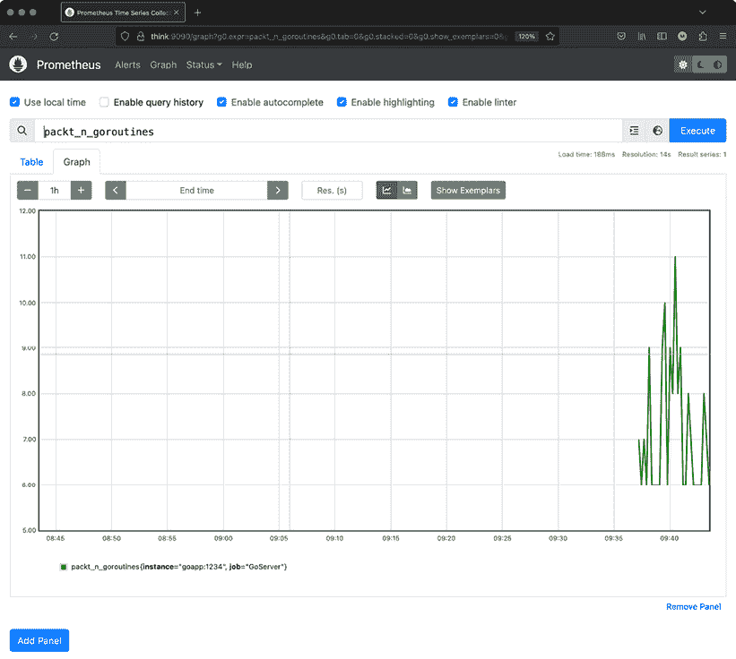
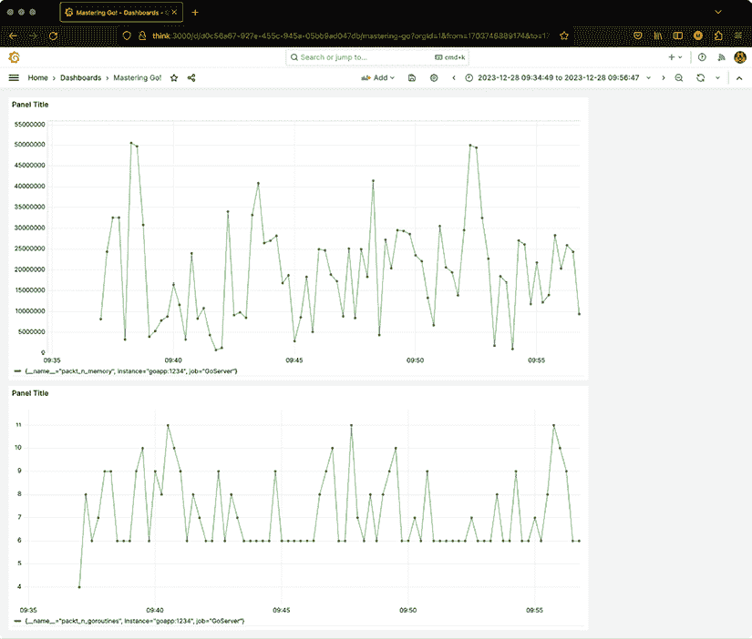

# 13

# 模糊测试与可观察性

本章的主题有两个方面。首先，我们将讨论*模糊测试*，这是 Go 语言的一个新特性，它改进了测试过程；其次，我们将讨论*可观察性*，这可以帮助你理解当一切按预期进行但速度不如预期时，系统正在发生什么。

通过模糊测试，我们将意外事件引入测试。主要好处是你可以使用随机和不可预测的值和数据来测试你的代码，这可能导致发现未知漏洞。这也导致了测试覆盖率的提高，测试自动化和效率的提升，更好的持续测试，软件质量的提高，以及成本效益高的安全测试。

可观察性指的是根据系统的外部输出或可观察信号来理解、测量和分析系统内部状态和行为的能力。在计算机系统和软件应用的情况下，可观察性对于监控、故障排除和维护系统的健康和性能至关重要。因此，可观察性帮助我们了解程序未知的方面。

可观察性的第一规则是**知道你在寻找什么**。这意味着如果你不知道要寻找什么，你可能会收集错误的数据，忽略有用的指标，而专注于无关紧要的指标！

此外，读取指标而不存储和可视化它们是无效的。因此，本章还说明了如何将你的指标暴露给 Prometheus，以及如何使用 Grafana 可视化存储在 Prometheus 中的数据。请记住，Prometheus 并不是存储时间序列数据的唯一软件。Prometheus 的一个替代方案是 Elasticsearch。在这种情况下，你可能需要使用 Kibana 而不是 Grafana。重要的是关键思想保持一致。

在本章中，我们将涵盖以下主题：

+   模糊测试

+   可观察性

+   将指标暴露给 Prometheus

我们从本章的模糊测试开始。

# 模糊测试

作为软件工程师，我们担心的是意外事件，而不是事情按预期进行时。处理意外事件的一种方法就是模糊测试。模糊测试（或模糊测试）是一种测试技术，它为**需要输入的程序**生成无效、意外或随机数据。

模糊测试擅长发现代码中的安全和漏洞问题——手动测试并不总是理想的，因为这些测试可能不会考虑到所有潜在的不受信任的输入，特别是可能破坏系统的无效输入。然而，模糊测试不能取代单元测试。这意味着模糊测试不是万能的，不能取代所有其他测试技术。因此，模糊测试更适合**测试解析输入的代码**，这包括缓冲区溢出和 SQL 注入等案例。

模糊测试的主要优势包括以下内容：

+   你可以确保代码能够处理无效或随机输入。

+   通过模糊测试发现的错误可能很严重，并可能表明存在安全风险。

+   恶意攻击者经常使用模糊测试来定位漏洞，因此做好准备是好的。

与模糊测试一样，我们使用 `testing.T` 进行测试和 `testing.B` 进行基准测试——基准测试 Go 代码在 *第十四章*，*效率和性能* 中有所介绍。此外，模糊测试函数以 `Fuzz` 开头，就像测试函数以 `Test` 开头一样。

当模糊测试运行失败时，导致问题的数据将被保存在 `testdata` 目录下，之后，即使是常规测试也将失败——因为它们将自动使用那些数据——直到我们纠正相关的问题或错误。如果您需要重新运行常规测试，请随意删除该 `testdata` 目录。

下一个子节提供了一个模糊测试的简单示例。

## 简单的模糊测试示例

在本小节中，我们将创建一个简单的示例，使用模糊测试来更好地理解它。相关的代码可以在 `ch13/fuzz` 下找到。

为了这个简单的示例，我们将查看测试 `code.go` 中简单 Go 函数的代码。`code.go` 的内容如下：

```go
package main
import (
    "fmt"
)
func AddInt(x, y int) int {
    for i := 0; i < x; i++ {
        y = y + 1
    }
    return y
}
func main() {
    fmt.Println(AddInt(5, 4))
} 
```

这里有一个问题：`AddInt()` 没有正确实现，因为当 `x` 参数为负值时，`for` 循环将不会工作。

包含测试的 `code_test.go` 文件将分为两部分。第一部分包含以下代码：

```go
package main
import (
    "testing"
)
func TestAddInt(t *testing.T) {
    testCases := []struct {
        x, y, want int
    }{
        {1, 2, 3},
        {1, 0, 1},
        {100, 10, 110},
    }
    for _, tc := range testCases {
        result := AddInt(tc.x, tc.y)
        if result != tc.want {
            t.Errorf("X: %d, Y: %d, want %d", tc.x, tc.y, tc.want)
        }
    }
} 
```

这一部分以通常的方式实现了一个测试函数。然而，在这种情况下，我们只使用正整数（自然数）测试 `AddInt()`，这意味着它将没有任何问题地工作。

`code_test.go` 的第二部分包含以下代码：

```go
func **FuzzAddInt**(f *testing.F) {
    testCases := []struct {
        x, y int
    }{
        {0, 1},
        {0, 100},
    }
    for _, tc := range testCases {
        f.Add(tc.x, tc.y)
    } 
```

这一部分实现了一个名为 `FuzzAddInt()` 的模糊测试函数，可以通过 `testing.F` 数据类型的使用以及其以 `Fuzz` 开头的名称来验证。`testing.F` 数据类型提供了 `Add()` 和 `Fuzz()` 方法，分别用于提供（可选的）起始输入和运行实际的模糊测试。

*语料库* 是指导模糊测试过程的输入集合，由两部分组成。第一部分是 *种子语料库*，第二部分是 *生成语料库*。*种子语料库* 可以通过 `Add()` 函数调用和/或 `testdata/fuzz` 目录中的数据提供。*生成语料库* 完全由机器生成。不需要有种子语料库。

`Add()` 函数将数据添加到 *种子语料库*，并且可以根据需要多次调用——在这种情况下，我们调用了 `Add()` 两次。

```go
 f.Fuzz(func(t *testing.T, x, y int) {
        result := AddInt(x, y)
        if result != x+y {
            t.Errorf("X: %d, Y: %d, Result %d, want %d", x, y, result, x+y)
        }
    })
} 
```

在（可选的）`Add()` 函数之后，我们需要调用 `Fuzz()`，这需要一个 `*testing.T` 变量以及一个模糊参数列表，这些参数应该与 `Add()` 中使用的参数数量和数据类型相同，通常与被测试函数的参数数量相同。

简而言之，我们在模糊测试函数中嵌入常规测试函数——这些常规测试函数的输入是由模糊测试过程根据生成的语料库提供的。

因此，我们告诉 `f.Fuzz()` 我们需要两个额外的 `int` 参数，除了强制性的 `*testing.T` 之外，这两个参数分别命名为 `x` 和 `y`。这两个参数是测试的输入。因此，`f.Add()` 调用也应该有两个参数。

运行常规测试就像执行以下命令一样简单：

```go
$ go test *.go
ok    command-line-arguments    0.427s 
```

因此，测试函数没有发现 `AddInt()` 存在问题。

运行模糊测试需要使用 `-fuzz` 命令行参数，后跟模糊函数的名称。因此，我们需要执行以下命令：

```go
$ go test -fuzz=FuzzAddInt *.go
fuzz: elapsed: 0s, gathering baseline coverage: 0/2 completed
fuzz: elapsed: 0s, gathering baseline coverage: 2/2 completed, now fuzzing with 10 workers
fuzz: elapsed: 0s, execs: 6 (410/sec), new interesting: 2 (total: 4)
--- FAIL: FuzzAddInt (0.02s)
    --- FAIL: FuzzAddInt (0.00s)
        code_test.go:40: X: -63, Y: 32, Result 32, want -31
    **Failing input written to testdata/fuzz/FuzzAddInt/b403d5353f8afe03**
    To re-run:
    go test -run=FuzzAddInt/b403d5353f8afe03
FAIL
exit status 1
FAIL    command-line-arguments    0.222s 
```

因此，模糊测试捕获了 `AddInt()` 的错误。简单来说，模糊测试过程包括负整数在测试中，并捕获了由 `for` 循环的使用产生的逻辑错误——我们没有！

`testdata/fuzz/FuzzAddInt/b403d5353f8afe03` 的内容如下：

```go
$ cat testdata/fuzz/FuzzAddInt/b403d5353f8afe03
go test fuzz v1
int(-63)
int(32) 
```

修复 `AddInt()` 作为练习留给您——作为一个提示，考虑在 `for` 循环中使用的参数为负时使用不同的代码。在我们的例子中，导致错误条件的函数参数是 `x`。

下一个子节将展示一个更实际的模糊测试示例。

## 高级模糊测试示例

在这个子节中，我们展示了一个更高级的模糊测试示例。相关代码位于 `ch13/reverse`。`reverse.go` 中的代码如下：

```go
package main
**// This version has bugs**
import (
    "fmt"
)
func R1(s string) []byte {
    sAr := []byte(sAr)
    rev := make([]byte, len(s))
    l := len(sAr)
    for i := 0; i < l; i++ {
        rev[i] = sAr[l-1-i]
    }
    return rev
} 
```

在这个第一部分中，我们实现了一个名为 `R1()` 的函数，该函数反转一个字符串。内部，该函数将输入的 `string` 值转换为字节切片并返回一个字节切片。

```go
func R2(s string) string {
    b := []byte(s)
    for i, j := 0, len(b)-1; i < len(b)/2; i, j = i+1, j-1 {
        b[i], b[j] = b[j], b[i]
    }
    return string(b)
} 
```

在这个部分中，我们实现了一个名为 `R2()` 的函数，该函数也反转一个字符串。内部，该函数使用字节切片，但返回一个 `string` 值。

```go
func main() {
    str := "1234567890"
    fmt.Println(string(R1(str)))
    fmt.Println(R2(str))
} 
```

`main()` 函数调用 `R1()` 和 `R2()` 两个函数以反转 `"1234567890"` 字符串——这是一种测试实现功能的基本方法。

运行 `reverse.go` 生成以下输出：

```go
$ go run reverse.go
0987654321
0987654321 
```

因此，最初，代码看起来是正确的，并产生了预期的输出。现在，让我们为 `reverse.go` 中的两个函数编写一些测试。

`reverse_test.go` 中的代码分为三个部分。第一部分如下：

```go
package main
import (
    "testing"
"unicode/utf8"
)
func TestR1(t *testing.T) {
    testCases := []struct {
        in, want string
    }{
        {" ", " "},
        {"!12345@", "@54321!"},
        {"Mastering Go", "oG gniretsaM"},
    }
    for _, tc := range testCases {
        rev := R1(tc.in)
        if string(rev) != tc.want {
            t.Errorf("Reverse: %q, want %q", rev, tc.want)
        }
    }
} 
```

前面是 `R1()` 的测试函数。

```go
func TestR2(t *testing.T) {
    testCases := []struct {
        in, want string
    }{
        {" ", " "},
        {"!12345@", "@54321!"},
        {"Mastering Go", "oG gniretsaM"},
    }
    for _, tc := range testCases {
        rev := R2(tc.in)
        if rev != tc.want {
            t.Errorf("Reverse: %q, want %q", rev, tc.want)
        }
    }
} 
```

前面是 `R2()` 的测试函数。

`TestR1()` 和 `TestR2()` 都是常规测试函数，使用用户定义的测试，这些测试存储在 `testCases` 结构中。第一个字段是原始字符串，而第二个字段是反转后的字符串。

第二部分包含模糊测试函数，如下所示：

```go
func FuzzR1(f *testing.F) {
    testCases := []string{"Hello, world", " ", "!12345"}
    for _, tc := range testCases {
        f.Add(tc)
    }
    f.Fuzz(func(t *testing.T, orig string) {
        rev := R1(orig)
        doubleRev := R1(string(rev))
        if orig != string(doubleRev) {
            t.Errorf("Before: %q, after: %q", orig, doubleRev)
        }
        if utf8.ValidString(orig) && !utf8.ValidString(string(rev)) {
            t.Errorf("Reverse: invalid UTF-8 string %q", rev)
        }
    })
} 
```

这是一个用于测试`R1()`的模糊测试函数。我们向种子语料库中添加了三个字符串，这些字符串保存在`testCases`切片中。

`reverse_test.go`文件的最后一部分包含了测试`R2()`函数的代码：

```go
func FuzzR2(f *testing.F) {
    testCases := []string{"Hello, world", " ", "!12345"}
    for _, tc := range testCases {
        f.Add(tc)
    }
    f.Fuzz(func(t *testing.T, orig string) {
        rev := R2(orig)
        doubleRev := R2(rev)
        if orig != doubleRev {
            t.Errorf("Before: %q, after: %q", orig, doubleRev)
        }
        if utf8.ValidString(orig) && !utf8.ValidString(rev) {
            t.Errorf("Reverse: invalid UTF-8 string %q", rev)
        }
    })
} 
```

这是一个用于测试`R2()`的模糊测试函数。和之前一样，我们使用保存在`testCases`切片中的值向种子语料库中添加了三个字符串。

两个模糊测试函数都会将给定的字符串反转两次，并将其与`orig`本身进行比较，以确保它们相同。这是因为，当你将一个字符串反转两次时，你应该得到原始字符串。

不进行模糊测试运行测试会产生以下结果：

```go
$ go test *.go
ok    command-line-arguments    0.103s 
```

因此，看起来一切都在按预期工作。但这是否就是情况呢？

让我们运行带有模糊测试的测试。首先，我们将按照以下方式运行`FuzzR1()`：

```go
$ go test -fuzz=FuzzR1 *.go
fuzz: elapsed: 0s, gathering baseline coverage: 0/7 completed
fuzz: elapsed: 0s, gathering baseline coverage: 7/7 completed, now fuzzing with 10 workers
fuzz: minimizing 30-byte failing input file
fuzz: elapsed: 0s, minimizing
--- FAIL: FuzzR1 (0.03s)
    --- FAIL: FuzzR1 (0.00s)
        reverse_test.go:55: Reverse: invalid UTF-8 string "\x94\xd4"
    Failing input written to testdata/fuzz/FuzzR1/a256ceb5e3bf582f
    To re-run:
    go test -run=FuzzR1/a256ceb5e3bf582f
FAIL
exit status 1
FAIL    command-line-arguments    0.493s 
```

因此，在这种情况下，模糊测试发现了代码中的问题。失败的输入被保存在`testdata/fuzz/FuzzR1/42f418307d5ef745`。

`testdata/fuzz/FuzzR1/a256ceb5e3bf582f`的内容如下：

```go
$ cat testdata/fuzz/FuzzR1/a256ceb5e3bf582f
go test fuzz v1
string("Ԕ") 
```

简而言之，保存在`testdata/fuzz/FuzzR1/a256ceb5e3bf582f`中的字符串没有被成功反转。

接下来，我们将运行带有模糊测试的`FuzzR2()`：

```go
$ go test -fuzz=FuzzR2 *.go
--- FAIL: FuzzR1 (0.00s)
    --- FAIL: FuzzR1/a256ceb5e3bf582f (0.00s)
        reverse_test.go:55: Reverse: invalid UTF-8 string "\x94\xd4"
FAIL
exit status 1
FAIL    command-line-arguments    0.253s 
```

由于`FuzzR1()`失败，存在一个`testdata`目录，因此第二次模糊测试由于在`testdata`目录中找到的数据而失败。在接下来的小节中，我们将修复这个错误。

## 修复错误

我们现在应该做的是**修复错误**。`reverse.go`的改进版本被称为`correct.go`，位于`ch13/reverse/correct`目录下。其代码如下：

```go
package main
import (
    "errors"
"fmt"
"unicode/utf8"
)
func R1(s string) (string, error) {
    if !utf8.ValidString(s) {
        return s, errors.New("Invalid UTF-8")
    }
    a := []byte(s)
    for i, j := 0, len(s)-1; i < j; i++ {
        a[i], a[j] = a[j], a[i]
        j--
    }
    return string(a), nil
}
func R2(s string) (string, error) {
    if !utf8.ValidString(s) {
        return s, errors.New("Invalid UTF-8")
    }
    r := []rune(s)
    for i, j := 0, len(r)-1; i < len(r)/2; i, j = i+1, j-1 {
        r[i], r[j] = r[j], r[i]
    }
    return string(r), nil
} 
```

注意，在`R2()`的实现中，我们现在使用**runes 而不是 bytes**。此外，`R1()`和`R2()`在开始任何处理之前，都使用`utf8.ValidString()`的功能来验证我们正在处理一个有效的 UTF-8 字符串。当输入是一个无效的 UTF-8 字符串时，会返回一个错误信息——我们在`reverse.go`中没有这样做，这就是导致错误的原因。

剩余的代码是关于`main()`函数的实现：

```go
func main() {
    str := "1234567890"
    R1ret, _ := R1(str)
    fmt.Println(R1ret)
    R2ret, _ := R2(str)
    fmt.Println(R2ret)
} 
```

如前所述，这个改进版本的主要区别是这两个函数也返回一个`error`变量，以确保我们正在处理有效的 UTF-8 字符串。然而，这也意味着测试函数以及模糊测试函数应该被修改，以适应函数签名的变化。

运行`correct.go`会产生以下输出：

```go
$ go run correct.go
0987654321
0987654321 
```

因此，看起来基本功能仍然被正确实现。

改进的测试版本被称为`correct_test.go`，也位于`ch13/reverse/correct`目录下——它将分两部分展示。`correct_test.go`的第一部分包含以下代码：

```go
package main
import (
    "testing"
"unicode/utf8"
)
func TestR1(t *testing.T) {
    testCases := []struct {
        in, want string
    }{
        {" ", " "},
        {"!12345@", "@54321!"},
        {"Mastering Go", "oG gniretsaM"},
    }
    for _, tc := range testCases {
        rev, err := R1(tc.in)
        if err != nil {
            return
        }
        if rev != tc.want {
            t.Errorf("Reverse: %q, want %q", rev, tc.want)
        }
    }
}
func TestR2(t *testing.T) {
    testCases := []struct {
        in, want string
    }{
        {" ", " "},
        {"!12345@", "@54321!"},
        {"Mastering Go", "oG gniretsaM"},
    }
    for _, tc := range testCases {
        rev, err := R2(tc.in)
        if err != nil {
            return
        }
        if rev != tc.want {
            t.Errorf("Reverse: %q, want %q", rev, tc.want)
        }
    }
} 
```

`TestR1()` 和 `TestR2()` 的逻辑与之前相同：我们使用存储在结构体切片（`testCases`）中的值来验证 `R1()` 和 `R2()` 的正确性。然而，这次我们考虑了 `R1()` 和 `R2()` 返回的 `error` 值。如果 `R1()` 或 `R2()` 出现错误，两个测试函数会立即返回，这使得测试成功。

`correct_test.go` 的第二部分是模糊测试函数的实现：

```go
func FuzzR1(f *testing.F) {
    testCases := []string{"Hello, world", " ", "!12345"}
    for _, tc := range testCases {
        f.Add(tc)
    }
    f.Fuzz(func(t *testing.T, orig string) {
        rev, err := R1(orig)
        if err != nil {
            return
        }
        doubleRev, err := R1(rev)
        if err != nil {
            return
        }
        if orig != doubleRev {
            t.Errorf("Before: %q, after: %q", orig, doubleRev)
        }
        if utf8.ValidString(orig) && !utf8.ValidString(string(rev)) {
            t.Errorf("Reverse: invalid UTF-8 string %q", rev)
        }
    })
} 
```

`FuzzR1()` 使用 `R1()` 返回的 `error` 值来确保我们正在处理一个有效的字符串。如果字符串无效，则返回。此外，它将给定的字符串（存储在自动生成的 `orig` 参数中）反转两次，并与 `orig` 本身进行比较，以确保它们相同。

```go
func FuzzR2(f *testing.F) {
    testCases := []string{"Hello, world", " ", "!12345"}
    for _, tc := range testCases {
        f.Add(tc)
    }
    f.Fuzz(func(t *testing.T, orig string) {
        rev, err := R2(orig)
        if err != nil {
            return
        }
        doubleRev, err := R2(**string**(rev))
        if err != nil {
            return
        }
        if orig != doubleRev {
            t.Errorf("Before: %q, after: %q", orig, doubleRev)
        }
        if utf8.ValidString(orig) && !utf8.ValidString(rev) {
            t.Errorf("Reverse: invalid UTF-8 string %q", rev)
        }
    })
} 
```

`FuzzR2()` 也使用 `R2()` 返回的 `error` 值来确保我们正在处理一个有效的字符串。如果字符串无效，它也会返回。剩余的实现遵循 `FuzzR1()` 的逻辑。

运行常规测试会产生以下输出：

```go
$ go test *.go
ok    command-line-arguments    0.609s 
```

对 `R1()` 进行模糊测试会生成以下输出：

```go
$ go test -fuzz=FuzzR1 *.go -fuzztime 10s
fuzz: elapsed: 0s, gathering baseline coverage: 0/15 completed
fuzz: elapsed: 0s, gathering baseline coverage: 15/15 completed, now fuzzing with 10 workers
fuzz: elapsed: 3s, execs: 1129701 (376437/sec), new interesting: 31 (total: 46)
fuzz: elapsed: 6s, execs: 2527522 (466068/sec), new interesting: 34 (total: 49)
fuzz: elapsed: 9s, execs: 3808349 (426919/sec), new interesting: 37 (total: 52)
fuzz: elapsed: 11s, execs: 4208389 (199790/sec), new interesting: 37 (total: 52)
PASS
ok    command-line-arguments    11.508s 
```

使用 `-fuzztime 10s` 确保测试在超过给定时间限制或出现错误后停止。

对 `R2()` 进行模糊测试会生成以下输出：

```go
$ go test -fuzz=FuzzR2 *.go -fuzztime 10s
fuzz: elapsed: 0s, gathering baseline coverage: 0/3 completed
fuzz: elapsed: 0s, gathering baseline coverage: 3/3 completed, now fuzzing with 10 workers
fuzz: elapsed: 3s, execs: 1271973 (423844/sec), new interesting: 38 (total: 41)
fuzz: elapsed: 6s, execs: 2638924 (455741/sec), new interesting: 39 (total: 42)
fuzz: elapsed: 9s, execs: 4044955 (468745/sec), new interesting: 39 (total: 42)
fuzz: elapsed: 10s, execs: 4495553 (413586/sec), new interesting: 39 (total: 42)
PASS
ok    command-line-arguments    10.396s 
```

因此，一切如预期进行，并且错误已被纠正！

下一节是关于可观察性的，这是一种系统地收集与系统效率和内部相关的数据的系统方法。

# 可观察性

可观察性是衡量系统内部状态与外部操作之间关系的度量。在实践中，可观察性是关于理解在给定软件或应用程序在系统上执行时，计算机系统的资源是如何被有效利用的。

在 Go 术语中，以及与本书内容相关的情况下，可观察性是关于学习 **Go 如何使用可用资源以及应用程序在执行过程中的表现**，以便理解 Go 应用程序的效率以及 Go 运行时本身的效率。此过程的目的在于提高 Go 应用程序的效率，并可能修改特定 Go 应用程序可用的资源，以改善其整体运行。

如果仍然不清楚，让我用更实际的方式解释一下。假设一个 Go 应用程序运行缓慢。我们需要找出这是为什么。为此，我们需要测量适当的内部 Go 指标以及应用程序特定的指标，并尝试理解它们。

可观察性的关键组件包括：

+   **日志**：记录系统生成的事件、活动和消息。日志提供了发生事件的记录，对于调试和审计很有用。

+   **指标**：提供对系统性能和行为洞察的定量测量。指标示例包括响应时间、错误率和资源利用率。

+   **跟踪**：一系列事件或事务，允许您跟踪请求通过系统中的各个组件的流程。跟踪有助于理解不同组件之间的延迟和依赖关系。

+   **监控**：持续跟踪指标和日志以识别模式、异常和潜在问题。当预定义的阈值超过时，监控系统可以生成警报。这是一个复杂任务，尤其是在需要处理大量指标时。

+   **警报**：通知机制，告知管理员或操作员关于系统中潜在问题或不规则性的信息。警报有助于快速响应问题并最小化停机时间。

+   **分布式跟踪**：跟踪和可视化请求在分布式系统中的各个组件之间传递的过程。这在微服务架构中尤为重要，并且极具挑战性。

本章将处理指标。代码分析和跟踪在 *第十二章*，*代码测试和分析* 中介绍。此外，日志在 *第一章*，*Go 语言快速入门* 和 *第七章*，*告诉 UNIX 系统做什么* 中介绍。处理剩余组件超出了本书的范围。

我们首先解释 `runtime/metrics` 包的使用，该包提供与 Go 运行时相关的指标。

## `runtime/metrics` 包

`runtime/metrics` 包使 Go 运行时导出的指标对开发者可用。每个指标名称由一个路径指定。例如，活着的 goroutines 的数量可以通过 `/sched/goroutines:goroutines` 访问。然而，如果您想收集所有可用的指标，应使用 `metrics.All()`——这可以节省您编写大量代码以收集每个单独指标的时间。

指标使用 `metrics.Sample` 数据类型保存。`metrics.Sample` 数据结构的定义如下：

```go
type Sample struct {
    Name string
    Value Value
} 
```

`Name` 值必须与 `metrics.All()` 返回的指标描述之一的名字相匹配。如果您已经知道指标描述，则无需使用 `metrics.All()`。

`runtime/metrics` 包的使用在 `metrics.go` 中展示。展示的代码获取 `/sched/goroutines:goroutines` 的值并在屏幕上打印：

```go
package main
import (
    "fmt"
"runtime/metrics"
"sync"
"time"
)
func main() {
    const nGo = "/sched/goroutines:goroutines" 
```

`nGo` 变量保存了我们想要收集的指标路径。

```go
 getMetric := make([]metrics.Sample, 1)
    getMetric[0].Name = nGo 
```

之后，我们创建一个类型为 `metrics.Sample` 的切片以保存指标值。切片的初始大小为 `1`，因为我们只为单个指标收集值。我们将 `Name` 值设置为 `/sched/goroutines:goroutines`，正如在 `nGo` 中存储的那样。

```go
 var wg sync.WaitGroup
    for i := 0; i < 3; i++ {
        wg.Add(1)
        go func() {
            defer wg.Done()
            time.Sleep(4 * time.Second)
        }() 
```

在这里，我们手动创建三个 goroutines，以便程序有相关的数据可以收集。

```go
 // Get actual data
        metrics.Read(getMetric)
        if getMetric[0].Value.Kind() == metrics.KindBad {
            fmt.Printf("metric %q no longer supported\n", nGo)
        } 
```

`metrics.Read()` 函数根据 `getMetric` 切片中的数据收集所需的指标。

```go
 mVal := getMetric[0].Value.Uint64()
        fmt.Printf("Number of goroutines: %d\n", mVal)
    } 
```

在读取所需的度量后，我们将它转换为数值（这里是无符号 `int64`）以便在我们的程序中使用。

```go
 wg.Wait()
    metrics.Read(getMetric)
    mVal := getMetric[0].Value.Uint64()
    fmt.Printf("Before exiting: %d\n", mVal)
} 
```

代码的最后几行验证了，在所有 goroutine 完成后，度量值的值将是 `1`，这是用于运行 `main()` 函数的 goroutine。

运行 `metrics.go` 产生以下输出：

```go
$ go run metrics.go
Number of goroutines: 2
Number of goroutines: 3
Number of goroutines: 4
Before exiting: 1 
```

我们已经创建了三个 goroutine，并且已经有一个用于运行 `main()` 函数的 goroutine。因此，最大 goroutine 数量确实是四个。

以下小节介绍了一种测量 Go 函数执行时间的技术，这不是 Go 直接支持的功能。

## 测量函数的执行时间

`runtime/metrics` 包提供了一组度量，您可以在包的帮助页面上找到这些度量。然而，有时我们想要测量特定操作的时间，这是 `runtime/metrics` 包不支持的操作。在我们的例子中，我们将做 exactly that 并将信息存储在日志条目中。

在这个例子中，我们将使用标准库中的 `log/slog` 包。只要它是简单且可读的，您可以使用任何日志包，但最重要的是，只要它是高效的并且不会给系统带来额外的负载。

`functionTime.go` 的代码分为两部分。第一部分如下：

```go
package main
import (
    "log/slog"
"os"
"time"
)
func myFunction() {
    j := 0
for i := 1; i < 100000000; i++ {
        j = j % i
    }
} 
```

这是我们定义想要测量的函数的地方——这可以是您想要的任何函数或操作。

`functionTime.go` 的第二部分包含以下代码：

```go
func main() {
    handler := slog.NewTextHandler(os.Stdout, nil)
    logger := slog.New(handler)
    logger.Debug("This is a DEBUG message")
    for i := 0; i < 5; i++ {
        now := time.Now()
        myFunction()
        elapsed := time.Since(now)
        logger.Info(
            "Observability",
            slog.Int64("time_taken", int64(elapsed)),
        )
    }
} 
```

使用 `time.Now()` 和 `time.Since()` 调用包围 `myFunction()` 的执行，这是我们测量 `myFunction()` 执行时间的方法。

记住，`time.Duration` 数据类型包含纳秒，实际上是一个 `int64` 值，因此使用了 `slog.Int64()` 以及 `int64(elapsed)` 强制类型转换来将 `time.Duration` 值转换为 `int64`。

运行 `functionTime.go` 生成以下类型的输出：

```go
$ go run functionTime.go
time=2023-12-30T11:33:36.471+02:00 level=INFO msg=Observability time_taken=51243083
time=2023-12-30T11:33:36.505+02:00 level=INFO msg=Observability time_taken=34088708
time=2023-12-30T11:33:36.536+02:00 level=INFO msg=Observability time_taken=31203083
time=2023-12-30T11:33:36.568+02:00 level=INFO msg=Observability time_taken=31224625
time=2023-12-30T11:33:36.599+02:00 level=INFO msg=Observability time_taken=31206208 
```

请记住，在繁忙的系统上，由于操作系统调度程序以及 Go 调度程序的操作，`time_taken` 值不会那么相似。

下一小节是 `expvar` 包的便捷介绍。

## `expvar` 包

`expvar` 包允许您将变量和函数暴露给服务器，包括自定义度量。`expvar` 包通过 HTTP 在 `/debug/vars` 以 JSON 格式暴露这些变量。

`expvarUse.go` 的代码也分为两部分。第一部分如下：

```go
package main
import (
    "expvar"
"fmt"
"net/http"
)
func main() {
    intVar := expvar.NewInt("intVar")
    intVar.Set(1234)
    expvar.Publish("customFunction", expvar.Func(func() interface{} {
        return "Hi from Mastering Go!"
    })) 
```

之前的代码做了两件事。首先，它使用 `expvar.NewInt()` 注册一个名为 `intVar` 的整数变量以供公开，其次，它使用 `expvar.Publish()` 注册一个名为 `customFunction` 的函数以供公开。`Publish()` 函数在其签名中接受两个参数，分别是函数将要公开的变量名称和我们想要公开的函数。在这种情况下，我们使用一个内联实现的匿名函数。

`expvarUse.go` 的第二部分如下：

```go
 http.Handle("/debug/expvars", expvar.Handler())
    go func() {
        fmt.Println("HTTP server listening on :8080")
        err := http.ListenAndServe(":8080", nil)
        if err != nil {
            fmt.Println("Error starting HTTP server:", err)
        }
    }()
    intVar.Add(10)
    select {}
} 
```

`http.Handle()` 函数允许我们在非标准位置安装一个额外的处理程序，在这种情况下，是 `/debug/expvars`。因此，我们使用 `/debug/expvars` 路径来访问注册的变量和函数，我们启动监听端口 `8080` 的 HTTP 服务器，我们使用 `intVar.Add()` 修改 `intVar`，并使用 `select {}` 来防止程序终止，因为它会阻塞程序。

在这种情况下，我们通过手动使用 `intVar.Add(10)` 更新 `intVar` 的值来模拟应用程序逻辑，我们应该用我们自己的逻辑来替换它。

运行 `expvarUse.go` 不会产生任何输出，但它会启动 HTTP 服务器。我们可以通过访问网页浏览器中的 `http://localhost:8080/debug/vars` 或 `http://localhost:8080/debug/expvars`，或者使用 `curl(1)` 或 `wget(1)` 等工具发送 HTTP `GET` 请求来访问公开的变量和函数。

在我们的情况下，我们将使用 `curl(1)` 并得到以下类型的输出（为了简洁起见，省略了一些输出）：

```go
$ curl -X GET http://localhost:8080/debug/expvars
{
"cmdline": ["/var/folders/sk/ltk8cnw50lzdtr2hxcj5sv2m0000gn/T/go-build4228023601/b001/exe/expvarUse"],
"customFunction": "Hi from Mastering Go!",
"intVar": 1244, 
```

下一个子部分将介绍如何了解机器的 CPU 及其特性。

## 了解 CPU 特性

有时候我们需要了解 CPU 在运行时的详细信息，并可能将其公开以收集相关指标。在这种情况下，[`github.com/klauspost/cpuid`](https://github.com/klauspost/cpuid) 包真的非常有用。

我们将把所有相关代码放入 `~/go/src/github.com/mactsouk/mGo4th/ch13/cpuid` 目录中，因为我们将要利用一个外部包。

`cpuid.go` 的 Go 代码如下：

```go
package main
import (
    "fmt"
"strings"
    . "github.com/klauspost/cpuid/v2"
)
func main() {
    // Print basic CPU information:
    fmt.Println("Name:", CPU.BrandName)
    fmt.Println("PhysicalCores:", CPU.PhysicalCores)
    fmt.Println("LogicalCores:", CPU.LogicalCores)
    fmt.Println("ThreadsPerCore:", CPU.ThreadsPerCore)
    fmt.Println("Family", CPU.Family, "Model:", CPU.Model, "Vendor ID:", CPU.VendorID)
    fmt.Println("Features:", strings.Join(CPU.FeatureSet(), ","))
    fmt.Println("Cacheline bytes:", CPU.CacheLine)
    fmt.Println("L1 Data Cache:", CPU.Cache.L1D, "bytes")
    fmt.Println("L1 Instruction Cache:", CPU.Cache.L1I, "bytes")
    fmt.Println("L2 Cache:", CPU.Cache.L2, "bytes")
    fmt.Println("L3 Cache:", CPU.Cache.L3, "bytes")
    fmt.Println("Frequency", CPU.Hz, "hz")
} 
```

代码是标准的，你不需要对其进行任何修改。

在我的 macOS 机器上运行 `cpuid.go` 并带有 M1 Max CPU 产生以下输出：

```go
Name: Apple M1 Max
PhysicalCores: 10
LogicalCores: 10
ThreadsPerCore: 1
Family 458787763 Model: 0 Vendor ID: VendorUnknown
Features: AESARM,ASIMD,ASIMDDP,ASIMDHP,ASIMDRDM,ATOMICS,CRC32,DCPOP,FCMA,FP,FPHP,GPA,JSCVT,LRCPC,PMULL,SHA1,SHA2,SHA3,SHA512
Cacheline bytes: 128
L1 Data Cache: 65536 bytes
L1 Instruction Cache: 131072 bytes
L2 Cache: 4194304 bytes
L3 Cache: -1 bytes
Frequency 0 hz 
```

在带有 Intel i7 处理器的 Linux 机器上运行 `cpuid.go` 产生以下输出：

```go
Name: Intel(R) Core(TM) i7-10510U CPU @ 1.80GHz
PhysicalCores: 4
LogicalCores: 8
ThreadsPerCore: 2
Family 6 Model: 142 Vendor ID: Intel
Features: ADX,AESNI,AVX,AVX2,BMI1,BMI2,CLMUL,CMOV,CMPXCHG8,CX16,ERMS,F16C,FLUSH_L1D,FMA3,FXSR,FXSROPT,HTT,IA32_ARCH_CAP,IBPB,LAHF,LZCNT,MD_CLEAR,MMX,MOVBE,MPX,NX,OSXSAVE,POPCNT,RDRAND,RDSEED,RDTSCP,SGX,SPEC_CTRL_SSBD,SSE,SSE2,SSE3,SSE4,SSE42,SSSE3,STIBP,SYSCALL,SYSEE,VMX,X87,XGETBV1,XSAVE,XSAVEC,XSAVEOPT,XSAVES
Cacheline bytes: 64
L1 Data Cache: 32768 bytes
L1 Instruction Cache: 32768 bytes
L2 Cache: 262144 bytes
L3 Cache: 8388608 bytes
Frequency 2300000000 hz 
```

通过比较输出，我们可以看到 `cpuid` 在带有 Intel CPU 的 Linux 机器上运行得更好，因为它显示了 CPU 的频率，而 MacBook Pro 机器则没有这种情况。

下一个部分将介绍如何将指标暴露给 Prometheus 以及如何在 Grafana 中绘制指标。

# 将指标暴露给 Prometheus

假设你有一个将文件写入磁盘的应用程序，并且你想要获取该应用程序的度量以更好地理解多个文件写入如何影响整体性能——你需要收集性能数据以了解应用程序的行为。存储此类度量的一种好方法是使用 Prometheus。

Prometheus 支持的度量数据类型列表如下：

+   **Counter**：这是一个累积值，用于表示递增的计数器——计数器的值可以保持不变，上升，或重置为零，但不能减少。Counter 通常用于表示累积值，例如迄今为止服务的请求数量、错误总数等。

+   **Gauge**：这是一个允许增加或减少的单个数值。Gauge 通常用于表示可以上升或下降的值，例如请求数量和时间长度。

+   **Histogram**：Histogram 用于采样观察结果并创建计数和桶。Histogram 通常用于计数请求持续时间、响应时间等。

+   **Summary**：Summary 类似于直方图，但也可以在滑动窗口中计算时间相关的分位数。

直方图和 Summary 都可用于执行统计计算和属性。通常，一个计数器或 Gauge 就足够用于存储你的系统度量。

下面的子节将说明如何使你收集的任何度量对 Prometheus 可用。

## 暴露度量

收集度量与向 Prometheus 暴露它们以供收集是完全不同的任务。本小节将展示如何使度量对 Prometheus 的收集可用。为了简化起见，所展示的应用将生成随机值。

`samplePro.go`的代码如下：

```go
package main
import (
    "fmt"
"net/http"
"math/rand"
"time"
"github.com/prometheus/client_golang/prometheus"
"github.com/prometheus/client_golang/prometheus/promhttp"
) 
```

我们需要使用两个外部包来与 Prometheus 通信。

```go
var PORT = ":1234"
var counter = prometheus.NewCounter(
    prometheus.CounterOpts{
        Namespace: "mtsouk",
        Name:      "my_counter",
        Help:      "This is my counter",
    }) 
```

请记住，我在这里使用全局变量来表示重要的设置，这是一个个人偏好，也是我轻松找到这些设置的方法。同样适用于使用大写字母来命名`PORT`变量。

这就是我们定义一个新的`counter`变量并指定所需选项。`Namespace`字段非常重要，因为它允许你将度量分组。第一个度量的名称是`my_counter`。

```go
var gauge = prometheus.NewGauge(
    prometheus.GaugeOpts{
        Namespace: "mtsouk",
        Name:      "my_gauge",
        Help:      "This is my gauge",
    }) 
```

这就是我们定义一个新的`gauge`变量并指定所需选项——度量名称为`my_gauge`。

```go
var histogram = prometheus.NewHistogram(
    prometheus.HistogramOpts{
        Namespace: "mtsouk",
        Name:      "my_histogram",
        Help:      "This is my histogram",
    }) 
```

这就是我们定义一个新的`histogram`变量并指定所需选项。

```go
var summary = prometheus.NewSummary(
    prometheus.SummaryOpts{
        Namespace: "mtsouk",
        Name:      "my_summary",
        Help:      "This is my summary",
    }) 
```

这就是我们定义一个新的`summary`变量并指定所需选项的方法。然而，正如你将要看到的，定义一个度量变量是不够的。你还需要注册它。

```go
func main() {
    prometheus.MustRegister(counter)
    prometheus.MustRegister(gauge)
    prometheus.MustRegister(histogram)
    prometheus.MustRegister(summary) 
```

在这四个`prometheus.MustRegister()`语句中，你注册了四个度量变量。现在，当 Prometheus 连接到服务器和命名空间时，它将了解它们。

```go
 go func() {
        for {
            counter.Add(rand.Float64() * 5)
            gauge.Add(rand.Float64()*15 - 5)
            histogram.Observe(rand.Float64() * 10)
            summary.Observe(rand.Float64() * 10)
            time.Sleep(2 * time.Second)
        }
    }() 
```

这个 goroutine 在 web 服务器运行期间通过 endless `for` 循环持续运行。在这个 goroutine 中，由于使用了 `time.Sleep(2 * time.Second)` 语句，指标每 2 秒更新一次。

```go
 http.Handle("/metrics", promhttp.Handler())
    fmt.Println("Listening to port", PORT)
    fmt.Println(http.ListenAndServe(PORT, nil))
} 
```

正如你所知，每个 URL 都由一个处理函数处理，你通常自己实现这个处理函数。然而，在这种情况下，我们使用的是 [github.com/prometheus/client_golang/prometheus/promhttp](https://github.com/prometheus/client_golang/prometheus/promhttp) 包中提供的 `promhttp.Handler()` 处理函数——这使我们免于编写自己的代码。然而，在我们启动 web 服务器之前，我们仍然需要使用 `http.Handle()` 注册 `promhttp.Handler()` 处理函数。注意，指标位于 `/metrics` 路径下——Prometheus 知道如何找到它。

当 `samplePro.go` 运行时，获取属于 `mtsouk` 命名空间的指标列表就像运行下一个 `curl(1)` 命令一样简单：

```go
$ curl localhost:1234/metrics --silent | grep mtsouk
# HELP mtsouk_my_counter This is my counter
# TYPE mtsouk_my_counter counter
mtsouk_my_counter 19.948239343027772 
```

这是从 `counter` 变量输出的内容。如果省略了 `| grep mtsouk` 部分，那么你将得到所有可用指标列表。

```go
# HELP mtsouk_my_gauge This is my gauge
# TYPE mtsouk_my_gauge gauge
mtsouk_my_gauge 29.335329668135287 
```

这是从 `gauge` 变量输出的内容。

```go
# HELP mtsouk_my_histogram This is my histogram
# TYPE mtsouk_my_histogram histogram
mtsouk_my_histogram_bucket{le="0.005"} 0
mtsouk_my_histogram_bucket{le="0.01"} 0
mtsouk_my_histogram_bucket{le="0.025"} 0
. . .
mtsouk_my_histogram_bucket{le="5"} 4
mtsouk_my_histogram_bucket{le="10"} 9
mtsouk_my_histogram_bucket{le="+Inf"} 9
mtsouk_my_histogram_sum 44.52262035556937
mtsouk_my_histogram_count 9 
```

这是从 `histogram` 变量输出的内容。直方图包含桶，因此有大量的输出行。

```go
# HELP mtsouk_my_summary This is my summary
# TYPE mtsouk_my_summary summary
mtsouk_my_summary_sum 19.407554729772105
mtsouk_my_summary_count 9 
```

输出的最后几行是针对 `summary` 数据类型的。

因此，指标已经准备好了，可以由 Prometheus 拉取——在实践中，这意味着每个生产 Go 应用程序都可以导出用于衡量其性能和发现其瓶颈的指标。然而，我们还没有完成，因为我们还需要了解如何为 Go 应用程序构建 Docker 镜像。

## 创建 Go 服务器的 Docker 镜像

本小节展示了如何为 Go 应用程序创建 Docker 镜像。你从中获得的主要好处是，你可以在 Docker 环境中部署它，而无需担心编译它和所需的资源——所有这些都包含在 Docker 镜像中。

尽管如此，你可能会问，“为什么不使用正常的 Go 二进制文件而不是 Docker 镜像？” 答案很简单：Docker 镜像可以放入 `docker-compose.yml` 文件中，并可以使用 Kubernetes 进行部署。Go 二进制文件则不行。此外，当需要时，Docker 镜像可以提供一致的共享库。

创建新的 Docker 镜像时，你通常从一个已经包含 Go 的基础 Docker 镜像开始，并在其中创建所需的二进制文件。关键点是 `samplePro.go` 使用了一个外部包，在构建可执行二进制文件之前，应该在 Docker 镜像中下载这个包。

该过程必须从 `go mod init` 和 `go mod tidy` 开始。名为 `dFilev2` 的相关 Docker 文件的 内容如下：

```go
FROM golang:alpine AS builder
RUN apk update && apk add --no-cache git 
```

由于 `golang:alpine` 使用的是最新的 Go 版本，该版本不包含 `git`，所以我们手动安装 `git`。

```go
RUN mkdir $GOPATH/src/server
ADD ./samplePro.go $GOPATH/src/server 
```

如果你想要使用 Go 模块，你应该将你的代码放在 `$GOPATH/src` 目录下，这是我们在这里所做的事情。

```go
WORKDIR $GOPATH/src/server
RUN go mod init
RUN go mod tidy
RUN go mod download
RUN mkdir /pro
RUN go build -o /pro/server samplePro.go 
```

我们使用各种 `go mod` 命令下载所需的依赖。二进制文件的构建与之前相同。

```go
FROM alpine:latest
RUN mkdir /pro
COPY --from=builder /pro/server /pro/server
EXPOSE 1234
WORKDIR /pro
CMD ["/pro/server"] 
```

在这个第二阶段，我们将二进制文件放入所需的位置 `(/pro)` 并公开所需的端口，在这个例子中，是端口号 `1234`。端口号取决于 `samplePro.go` 中的代码。

前面的过程是一个**两步过程，使得最终的 Docker 镜像尺寸更小**，因此使用了第二个 `FROM` 命令，该命令使用不包含 Go 工具的 Docker 镜像，仅用于运行生成的 Go 二进制文件。

使用 `dFilev2` 构建 Docker 镜像就像运行下一个命令一样简单：

```go
$ docker build -f dFilev2 -t go-app122 . 
```

尽管之前的 Docker 版本使用 `docker build` 命令来构建镜像，但 Docker 的最新版本也支持使用 `buildx` 来执行相同的任务。您可能需要安装 `buildkit` 和 `docker-buildx` 包来启用 `buildx` 命令。

因此，如果您想走 `docker buildx` 的路，您应该执行以下命令：

```go
$ docker buildx build -f dFilev2 -t go-app122 . 
```

`docker build` 和 `docker buildx` 的结果完全相同。

一旦成功创建了 Docker 镜像，您在 `docker-compose.yml` 文件中使用它的方式就没有区别——`docker-compose.yml` 文件中的一个相关条目如下所示：

```go
 goapp:
image: go-app122
container_name: goapp-int
restart: always
ports:
- 1234:1234
networks:
- monitoring 
```

Docker 镜像的名称是 `go-app122`，而容器的内部名称将是 `goapp-int`。因此，如果来自 `monitoring` 网络的不同容器想要访问该容器，它应该使用 `goapp-int` 主机名。最后，唯一开放的端口是端口号 `1234`。

下一个子节将说明如何将选定的指标公开给 Prometheus。

## 指定要公开的指标

本节说明了如何将 `runtime/metrics` 包中的所需指标公开给 Prometheus。在我们的例子中，我们使用 `/sched/goroutines:goroutines` 和 `/memory/classes/total:bytes`。您已经了解前者，它是 goroutines 的总数。后者指标是 Go 运行时映射到当前进程的内存量，作为可读写。

由于展示的代码使用了外部包，它应该放在 `~/go/src` 中，并使用 `go mod init` 启用 Go 模块。在我们的例子中，代码可以在 `ch13/prom/` 中找到。

`prometheus.go` 的 Go 代码如下：

```go
package main
import (
    "log"
"math/rand"
"net/http"
"runtime"
"runtime/metrics"
"time"
"github.com/prometheus/client_golang/prometheus"
"github.com/prometheus/client_golang/prometheus/promhttp"
) 
```

第一个外部包是 Prometheus 的 Go 客户端库，第二个包是用于使用默认处理函数 (`promhttp.Handler()`)。

```go
var PORT = ":1234"
var nGoroutines = prometheus.NewGauge(
    prometheus.GaugeOpts{
        Namespace: "packt",
        Name:      "n_goroutines",
        Help:      "Number of goroutines"})
var nMemory = prometheus.NewGauge(
    prometheus.GaugeOpts{
        Namespace: "packt",
        Name:      "n_memory",
        Help:      "Memory usage"}) 
```

在这里，我们定义了两个 Prometheus 指标。

```go
func main() {
    prometheus.MustRegister(nGoroutines)
    prometheus.MustRegister(nMemory)
    const nGo = "/sched/goroutines:goroutines"
const nMem = "/memory/classes/heap/free:bytes" 
```

这就是你在 Prometheus 中注册指标变量并定义你想要从 `runtime/metrics` 包中读取的指标的地方。

```go
 getMetric := make([]metrics.Sample, 2)
    getMetric[0].Name = nGo
    getMetric[1].Name = nMem
    http.Handle("/metrics", promhttp.Handler()) 
```

这是在 `/metrics` 路径上注册处理函数的地方。我们使用 `promhttp.Handler()`。

```go
 go func() {
        for {
            for i := 1; i < 4; i++ {
                go func() {
                    _ = make([]int, 1000000)
                    time.Sleep(time.Duration(rand.Intn(10)) * time.Second)
                }()
            } 
```

注意，这样的程序肯定至少应该有两个 goroutine：一个用于运行 HTTP 服务器，另一个用于收集指标。通常，HTTP 服务器位于运行`main()`函数的 goroutine 上，而指标收集发生在用户定义的 goroutine 中。

外层`for`循环确保 goroutine 永远运行，而内层`for`循环创建额外的 goroutine，以便`/sched/goroutines:goroutines`指标的值始终在变化。

```go
 runtime.GC()
            metrics.Read(getMetric)
            goVal := getMetric[0].Value.Uint64()
            memVal := getMetric[1].Value.Uint64()
            time.Sleep(time.Duration(rand.Intn(15)) * time.Second)
            **nGoroutines.Set**(float64(goVal))
            **nMemory.Set**(float64(memVal))
        }
    }() 
```

`runtime.GC()`函数告诉 Go 垃圾收集器运行，并用于更改`/memory/classes/heap/free:bytes`指标。两次`Set()`调用更新指标的值。

您可以在*附录 A*，*Go 垃圾收集器*中了解更多关于 Go 垃圾收集器操作的信息。

```go
 log.Println("Listening to port", PORT)
    log.Println(http.ListenAndServe(PORT, nil))
} 
```

最后一条语句使用默认的 Go 路由器运行 Web 服务器。从`ch13/prom`目录运行`prometheus.go`需要执行以下命令：

```go
$ go mod init
$ go mod tidy
$ go mod download
$ go run prometheus.go
2024/01/01 19:18:11 Listening to port :1234 
```

虽然`prometheus.go`除了上一行之外没有生成任何输出，但下一小节将说明如何使用`curl(1)`从其中读取所需的指标。

## 获取指标

您可以使用`curl(1)`从`prometheus.go`获取可用的指标列表，以确保应用程序按预期工作。在尝试使用 Prometheus 获取指标之前，我总是使用`curl(1)`或其他类似工具（如`wget(1)`）来测试此类应用程序的操作。

```go
$ curl localhost:1234/metrics --silent | grep packt
# HELP packt_n_goroutines Number of goroutines
# TYPE packt_n_goroutines gauge
packt_n_goroutines 6
# HELP packt_n_memory Memory usage
# TYPE packt_n_memory gauge
packt_n_memory 4.8799744e+07 
```

之前的命令假设`curl(1)`在运行 HTTP 服务器的同一台机器上执行，并且服务器监听 TCP 端口号`1234`。

接下来，我们必须启用 Prometheus 以拉取指标——从 Docker 镜像运行 Prometheus 要容易得多。要使 Prometheus Docker 镜像能够看到带有指标的 Go 应用程序，最简单的方法是将两者都作为 Docker 镜像执行。我们将使用以下 Dockerfile（与之前使用的`dFilev2`类似）将`prometheus.go`转换为 Docker 镜像：

```go
FROM golang:alpine AS builder 
```

这是用于构建二进制文件的基础 Docker 镜像的名称。`golang:alpine`只要您定期更新，就始终包含最新的 Go 版本。

```go
RUN apk update && apk add --no-cache git
RUN mkdir $GOPATH/src/server
ADD ./prometheus.go $GOPATH/src/server
WORKDIR $GOPATH/src/server
RUN go mod init
RUN go mod tidy
RUN go mod download 
```

之前的命令在尝试构建二进制文件之前会下载所需的依赖项。

```go
RUN mkdir /pro
RUN go build -o /pro/server prometheus.go
**FROM** **alpine:latest**
RUN mkdir /pro
COPY --from=builder /pro/server /pro/server
EXPOSE 1234
WORKDIR /pro
CMD ["/pro/server"] 
```

构建所需的 Docker 镜像，该镜像将被命名为`goapp`，只需运行以下命令即可：

```go
$ docker build -f Dockerfile -t goapp . 
```

如果您更喜欢使用`docker buildx`，则应执行以下命令：

```go
$ docker buildx build -f Dockerfile -t goapp . 
```

与往常一样，`docker images`的输出验证了`goapp` Docker 镜像成功创建——在我的情况下，相关条目如下：

```go
goapp             latest           6f63d9a27185   2 minutes ago   17.8MB 
```

让我们讨论如何配置 Prometheus 以拉取所需的指标。

## 将指标放入 Prometheus

要能够拉取指标，Prometheus 需要一个适当的配置文件，该文件指定了指标的来源。将要使用的配置文件如下：

```go
# prometheus.yml
scrape_configs:
- job_name: GoServer
scrape_interval: 5s
static_configs:
- targets: ['goapp:1234'] 
```

我们告诉 Prometheus 使用端口号`1234`连接到名为`goapp`的主机。Prometheus 根据`scrape_interval`字段的值每五秒拉取一次数据。您应该将`prometheus.yml`放在`prometheus`目录下，该目录应与下一个展示的`docker-compose.yml`文件位于同一根目录下。

Prometheus、Grafana 以及 Go 应用程序都将使用下一个`docker-compose.yml`文件作为 Docker 容器运行：

```go
version: "3"
services:
goapp:
image: goapp
container_name: goapp
restart: always
ports:
- 1234:1234
networks:
- monitoring 
```

这是处理收集指标的应用程序的 Go 部分。Docker 镜像名称以及 Docker 容器的内部主机名是`goapp`。您应该定义将要开放的连接端口号。在这种情况下，内部和外部端口号都是`1234`。内部端口号映射到外部端口号。此外，您应该将所有 Docker 镜像放在同一个网络下，在这个例子中，该网络被称为`monitoring`，并且将在稍后定义。

```go
 prometheus:
image: prom/prometheus:latest
container_name: prometheus
restart: always
user: "0"
volumes:
- ./prometheus/:/etc/prometheus/ 
```

这就是您如何将本地机器上的`prometheus.yml`副本传递给用于 Prometheus 的 Docker 镜像。因此，`./prometheus/prometheus.yml`可以从 Docker 镜像内部作为`/etc/prometheus/prometheus.yml`访问。

```go
 - ./prometheus_data/:/prometheus/
command:
- '--config.file=/etc/prometheus/prometheus.yml' 
```

这就是您告诉 Prometheus 使用哪个配置文件的地方。

```go
 - '--storage.tsdb.path=/prometheus'
- '--web.console.libraries=/etc/prometheus/console_libraries'
- '--web.console.templates=/etc/prometheus/consoles'
- '--storage.tsdb.retention.time=200h'
- '--web.enable-lifecycle'
ports:
- 9090:9090
networks:
- monitoring 
```

这就是场景中 Prometheus 部分的定义结束的地方。使用的 Docker 镜像名为`prom/prometheus:latest`，其内部名称为`prometheus`。Prometheus 监听端口号`9090`。

最后，我们展示 Grafana 部分。Grafana 监听端口号`3000`：

```go
 grafana:
image: grafana/grafana
container_name: grafana
depends_on:
- prometheus
restart: always
user: "0"
ports:
- 3000:3000
environment:
- GF_SECURITY_ADMIN_PASSWORD=helloThere 
```

这是管理员用户（`helloThere`）的当前密码——您需要它来连接到 Grafana。

```go
 - GF_USERS_ALLOW_SIGN_UP=false
- GF_PANELS_DISABLE_SANITIZE_HTML=true
- GF_SECURITY_ALLOW_EMBEDDING=true
networks:
- monitoring
volumes:
- ./grafana_data/:/var/lib/grafana/
volumes:
grafana_data: {}
    prometheus_data: {} 
```

前两行与两个`volumes`字段结合使用，允许 Grafana 和 Prometheus 将数据本地保存，这样每次重启 Docker 镜像时数据都不会丢失。

```go
networks:
monitoring:
driver: bridge 
```

在内部，所有三个容器都以其`container_name`字段的值为名。然而，在外部，您可以从本地机器作为`http://localhost:port`或从另一台机器使用`http://hostname:port`连接到开放的端口——第二种方式不太安全，应该通过防火墙阻止。最后，您需要运行`docker-compose up`，这样您就完成了！Go 应用程序开始公开数据，Prometheus 开始收集它。

下一个图显示了 Prometheus UI（`http://hostname:9090`）显示`packt_n_goroutines`的简单图表：



图 13.1：显示 packt_n_goroutines 的 Prometheus UI

这个输出以图形方式显示指标值，对于调试非常有用，但它远非真正专业，因为 Prometheus 不是一个可视化工具。下一个小节将展示如何将 Prometheus 与 Grafana 连接，并使用 Grafana 创建令人印象深刻的图表。

## 在 Grafana 中可视化 Prometheus 指标

如果不对收集的指标做任何处理，那么收集指标就没有意义了，这里的“处理”指的是可视化。Prometheus 和 Grafana 配合得非常好，因此我们将使用 Grafana 进行可视化部分。在 Grafana 中，您应该执行的最重要任务是将它与您的 Prometheus 实例连接起来。在 Grafana 术语中，您应该创建一个 Grafana 数据源，允许 Grafana 从 Prometheus 获取数据。

使用我们的 Prometheus 安装创建数据源的步骤如下：

1.  首先，前往 `http://localhost:3000` 以连接到 Grafana，因为 Grafana 需要了解存储在 Prometheus 中的数据。

1.  管理员的用户名是 `admin`，而密码定义在 `docker-compose.yml` 文件的 `GF_SECURITY_ADMIN_PASSWORD` 参数值中。

1.  然后，选择 **添加您的第一个数据源**。从数据源列表中选择 **Prometheus**，它通常位于列表顶部。

1.  在 **URL** 字段中输入 `http://prometheus:9090`，然后按下 **保存 & 测试** 按钮。由于 Docker 镜像之间存在内部网络，Grafana 容器通过 `prometheus` 主机名知道 Prometheus 容器——这是 `container_name` 字段的值。正如您已经知道的，您也可以使用 `http://localhost:9090` 从您的本地机器连接到 Prometheus。

我们完成了！数据源的名字是 `Prometheus`。

在这些步骤之后，从初始的 Grafana 屏幕创建一个新的仪表板，并在上面放置一个新的可视化。如果面板的数据源尚未选择，请选择 **Prometheus**。然后，转到 **指标** 下拉菜单并选择所需的指标。点击 **保存**，您就完成了。创建您想要的任何数量的面板。

下一个图显示了 Grafana 将 `prometheus.go` 暴露的两个指标进行可视化。



图 13.2：在 Grafana 中可视化指标

Grafana 拥有比这里展示的更多功能——如果您正在处理系统指标并想检查 Go 应用的性能，Prometheus 和 Grafana 是好且流行的选择。

在本节中，我们学习了如何从 Go 应用程序向 Prometheus 发送指标，以及如何在 Grafana 中可视化这些指标。然而，如果我们不知道要收集哪些指标，指标的含义是什么，或者如何在不牺牲应用程序整体性能的情况下收集指标，那么这一切都没有意义。

# 摘要

本章讲述了 Go 测试的一个新功能，即模糊测试。模糊测试可以通过自行生成测试数据来帮助您在代码中找到错误。虽然模糊测试提供了几个好处，但重要的是要注意它并不是万能的。这意味着它应该与其他测试技术和安全实践结合使用，以确保全面的覆盖和强大的安全措施。

你可能会说，在确保你的软件没有错误之后，你可能需要让它运行得更快。在这种情况下，你需要了解你的资源是如何被使用的——可观测性是关于收集与性能相关的信息，这些信息有助于你识别应用程序的行为。

可观测性在现代复杂系统中至关重要，因为传统的监控方法可能无法满足需求。它使工程师和操作员能够深入了解系统的内部运作，诊断问题，并提高整体系统的可靠性和性能。这一概念与 DevOps 和**站点可靠性工程（SRE**）实践密切相关，强调在现实世界的生产环境中理解和管理系统的重要性。

在下一章中，我们将学习如何避免内存泄漏，如何基准测试 Go 代码，以及 Go 的内存管理。

# 练习

尝试以下练习：

+   在你的机器上运行 `cpuid.go` 并查看你的硬件的功能和特性。

+   创建一个将所需信息写入日志的 `cpuid.go` 版本。

+   修复 `fuzz/code.go` 中的 `AddInt()` 函数。

+   创建一个使用 `for` 循环实现整数乘法的函数。为它编写测试函数和模糊测试函数。

# 其他资源

+   `runtime/metrics` 包: [`pkg.go.dev/runtime/metrics`](https://pkg.go.dev/runtime/metrics)

+   `expvar` 包: [`pkg.go.dev/expvar`](https://pkg.go.dev/expvar)

+   Prometheus: [`prometheus.io/`](https://prometheus.io/)

+   Grafana: [`grafana.com/`](https://grafana.com/)

+   Kibana: [`www.elastic.co/kibana/`](https://www.elastic.co/kibana/)

+   Elasticsearch: [`www.elastic.co/`](https://www.elastic.co/)

# 留下评论！

喜欢这本书吗？通过留下亚马逊评论来帮助像你这样的读者。扫描下面的二维码，获取你选择的免费电子书。


