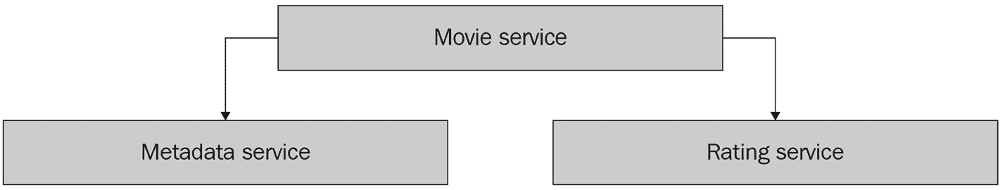
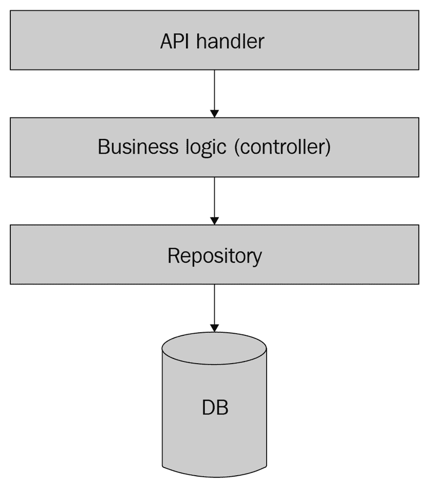

# 搭建 Go 微服务

在本章中，我们最终将开始搭建我们的微服务代码。本章的目标是为编写 Go 微服务和为未来的变更设置正确的结构奠定坚实的基础。虽然 Go 使得编写小型应用程序相对容易，但工程师在过程中可能会遇到多个挑战，包括以下内容：

+   如何设置合适的项目结构，使其更容易演进和维护代码库

+   如何编写符合最大 Go 代码库规范的惯用 Go 代码

+   如何分离微服务的组件并将它们连接起来

在本章中，我们将解决这些挑战中的每一个。首先，你将了解编写惯用和传统 Go 代码的关键方面。你将学习编写和组织代码库的重要建议，以及如何为你的服务设置适当的代码结构。然后，我们将向你介绍一个示例应用，它将包含三个微服务，我们将在整本书中使用这些微服务。在接下来的章节中，我们将向这些服务添加更多功能，展示微服务开发的所有重要领域。

在本章中，我们将涵盖以下主题：

+   Go 基础

+   项目结构

+   搭建示例应用

# 技术要求

要完成本章，你需要安装 Go 1.11 或更高版本。如果你还没有安装 Go，你可以从官方网站 [go.dev/dl](https://go.dev/dl) 下载。

你可以在 GitHub 上找到本章的代码示例：[`github.com/PacktPublishing/microservices-with-go/tree/main/Chapter02`](https://github.com/PacktPublishing/microservices-with-go/tree/main/Chapter02)。

# Go 基础

Go 是编写微服务的优秀语言。它相对容易学习，学习曲线平缓，使得新工程师的入职更加容易。虽然你可能已经对 Go 有了一些经验，但本书的一个目的就是为所有类型的开发者提供足够的信息——从初学者到经验丰富的专业人士。

在本节中，我们将总结语言的重要概念。如果你已经对 Go 有了一些经验，你仍然可以快速浏览这部分内容。它还包括一些有用的建议和最佳实践，即使是经验丰富的工程师也常常会忽略。

## 核心原则

在我们继续探讨 Go 的基础知识之前，我将与你分享一些基本原理，这些原理将帮助你编写和组织代码时做出决策。这些原则包括以下内容：

+   *始终遵循官方指南*。我们工程师对各种风格和编码实践有强烈的意见并不罕见。然而，在任何开发者社区中，一致性比个人意见更重要。确保您熟悉 Go 团队编写的最基本 Go 编程指南：

    +   **Effective Go——Go 开发者的官方指南集**：[`go.dev/doc/effective_go`](https://go.dev/doc/effective_go)

    +   **Go 代码审查评论**：Go 开发的另一个有用信息来源，涵盖多个方面，包括代码风格、命名和错误处理：[`github.com/golang/go/wiki/CodeReviewComments`](https://github.com/golang/go/wiki/CodeReviewComments)

+   *遵循标准库中的风格*。任何 Go 安装都附带的标准 Go 库是代码示例和注释的最佳来源。熟悉一些库中的包，例如`context`和`net`。遵循这些包中使用的编码风格将帮助您编写一致、可读和可维护的代码，无论将来谁使用它。

+   *不要试图将其他语言中的思想应用到 Go 中*。相反，理解 Go 的哲学，并查看最优雅的 Go 包的实现——您可以检查`net`包以获取一些好的示例：[`pkg.go.dev/net`](https://pkg.go.dev/net)。

现在，我们已经明确了核心原则，让我们继续讨论编写传统和惯用 Go 代码的关键建议。

## 写惯用的 Go 代码

本节总结了*Effective Go*文档中描述的关键主题。遵循本节中提供的建议将帮助您使代码与官方指南保持一致。

### 命名

命名是 Go 开发最重要的方面之一。以惯用的方式编写 Go 代码需要理解其核心命名原则：

+   导出的名称以大写字母开头。

+   当从另一个包导入变量、结构体或接口时，其名称包括包名或别名，例如`bytes.Buffer`。

+   由于引用包括包名，因此您不应在您的名称前加上包名。如果包名是`xml`，则使用名称`Reader`，而不是`XMLReader`——在后一种情况下，完整名称将是`xml.XMLReader`。

+   包通常使用小写、单词命名。

+   以`Get`前缀开始获取器的名称不是惯用的。如果您的函数返回用户的年龄，请将函数命名为`Age()`，而不是`GetAge()`。然而，使用`Set`前缀是可以的；您可以安全地调用您的函数`SetAge()`。

+   单方法接口使用方法名加上`er`后缀命名。例如，具有`Write`函数的接口将被称为`Writer`。

+   缩写和首字母缩略词应保持一致的字母大小写。正确的版本将是`URL`、`url`和`ID`，而`Url`、`Id`将是错误的。

+   变量名应该比长变量名更短。一般来说，遵循这个简单的规则——名称使用得越接近声明，它就越短。在遍历数组时，使用 *i* 作为索引变量。

其他命名建议包括以下内容：

+   包名应该简短、简洁、富有启发性，并且应该为其内容提供上下文，例如，`json`。

+   保持包的内容与名称一致。如果你开始注意到一个包包含与包名称无关的额外逻辑，考虑将其导出到单独的一个包或使用更具有描述性的名称。

+   只有当它们被广泛使用时才使用名称缩写（例如，`fmt` 或 `cmd`）。

+   当可能时，避免名称冲突。例如，如果你引入了一组字符串函数，避免将其称为 `strings` 包，因为 Go 标准库中已经存在一个同名包并且已被广泛使用。

+   在给代码命名时，考虑客户端的视角。在给代码命名时，考虑代码将被如何使用，例如，用于提供写入功能的 `Writer` 接口。

除了这些规则之外，请记住在整个代码库中保持命名的一致性。这有助于使阅读和编写新代码变得更加容易——好的命名将作为其他工程师的示例。

### 注释

注释是 Go 开发的下一个重要方面。Go 注释可以以两种不同的方式使用：

+   在代码旁边查看注释

+   查看 `godoc` 工具生成的包文档

Go 代码注释的一般原则包括以下内容：

+   每个包都应该有一个描述其内容的注释。

+   Go 中每个导出的名称都应该有注释。

+   注释应该是完整的句子，并以句号结尾。

+   注释的第一句话应该以导出的名称开头，并提供其摘要，如下例所示：

    ```go
    // ErrNotFound is returned when the record is not found.
    ```

    ```go
    var ErrNotFound = errors.New("not found")
    ```

Go 标准库提供了许多优秀的代码注释示例，所以我总是建议熟悉其中的一些示例。

### 错误

Go 错误的一般建议包括以下内容：

+   只在真正异常的情况下使用 panic。

+   总是处理每个错误；不要通过使用 `_` 赋值来丢弃错误。

+   错误字符串应以小写字母开头，除非它们以需要大写的名称开头，例如首字母缩略词。

+   错误字符串，与注释不同，不应以标点符号结尾，如下例所示：

    ```go
    return errors.New("user not found")
    ```

    ```go
    var errUserNotFound = errors.New("user not found")
    ```

+   当调用返回错误的函数时，始终先处理错误。

+   如果想为条款添加附加信息，请包装错误。Go 中包装错误的传统方法是在格式化错误末尾使用 `%w`：

    ```go
    if err != nil {
    ```

    ```go
        return fmt.Errorf("upload failed: %w", err)
    ```

    ```go
    }
    ```

+   在检查错误时，使用 `==` 操作符可能会导致对包装错误的处理不当。有两个解决方案。对于与哨兵错误（例如 `errors.New("some error")`）的比较，使用 `errors.Is`：

    ```go
    if errors.Is(err, ErrNotFound) {
    ```

    ```go
        // err or some error it wraps is ErrNotFound.
    ```

    ```go
    }
    ```

对于错误类型，使用 `errors.As`：

```go
var e *QueryError
if errors.As(err, &e) {
    // err has *QueryError type.
}
```

此外，保持错误描述性且简洁。应该总是通过阅读错误消息就能轻松理解到底出了什么问题。

## 接口

Go **接口**的关键原则包括以下内容：

+   在没有实际使用示例的情况下，不要在它们被使用之前定义接口。

+   在你的函数中，返回具体的（使用指针或结构体）类型而不是接口。

+   单方法接口应该通过方法名调用，并包含`er`后缀，例如，具有`Write`函数的`Writer`接口。

看一些内置接口，例如`Writer`和`Reader`，以获取在 Go 中定义和使用接口的好例子。

## 测试

我们将在本书的*第八章*中详细讨论测试。让我们在这里提供一些关于以惯用方式编写 Go 测试的关键建议：

+   测试应该在失败的情况下向用户提供有关到底出了什么问题的信息。

+   在可能的情况下，考虑编写表驱动测试。参见这个例子：[`github.com/golang/go/blob/master/src/fmt/errors_test.go`](https://github.com/golang/go/blob/master/src/fmt/errors_test.go)。

+   通常，我们只应该测试公共函数。你的私有函数应该通过它们间接测试。

确保你总是为你的代码编写测试。这不仅有助于尽早发现错误，还有助于了解你的代码如何被使用。我个人发现后者特别有用。

## 上下文

Go 语言与其他流行语言之间的一个关键区别是显式上下文传播。**上下文传播**是一种将额外的调用参数，称为**上下文**，传播到函数调用中的机制，传递额外的元数据。

Go 上下文有一个名为`context.Context`的类型。有多种使用它的方法：

+   **取消逻辑**：你可以传递一个特殊的上下文实例，它可以被*取消*。在这种情况下，所有你打算用这个上下文调用的函数都能够检测到这一点。这种逻辑对于处理应用程序关闭或停止任何处理非常有用。

+   **超时**：你可以通过使用相应的上下文函数来设置你的执行超时。

+   **传播额外元数据**：你可以在上下文中传播额外的键值元数据。这样，任何后续调用的函数都会在上下文对象中接收到这些元数据。这种方法有一些有用的应用，其中之一是分布式跟踪，我们将在接下来的章节中介绍。

我们将在接下来的章节中回到上下文传播。现在，我们可以定义一些使用 Go 上下文的重要方面：

+   上下文是不可变的，但可以通过额外的元数据进行克隆。

+   使用上下文的函数应该将其作为第一个参数接受。

此外，以下是一些上下文最佳实践：

+   总是传递上下文给执行 I/O 调用的函数。

+   限制上下文的使用，以传递任何元数据。你应该仅在真正特殊的情况下使用元数据传播，例如前面提到的分布式跟踪。

+   不要将上下文附加到结构中。

现在，我们已经讨论了编写惯用 Go 代码的关键建议，我们可以继续到下一节，该节将涵盖项目结构建议和 Go 应用的标准。

# 项目结构

项目结构是代码可读性和可维护性的基础，并在其中发挥着重要作用。正如我们在前面的章节中讨论的，在 Go 项目中，结构可能比其他语言更重要，因为每个导出的名称通常包括其包的名称。这要求你为你的包和目录提供良好且描述性的命名，以及正确的代码层次结构。

虽然官方指南定义了一些关于命名和编码风格的强烈建议，但约束 Go 项目结构的规则并不多。每个项目在本质上都是独特的，开发者通常可以自由选择他们组织代码的方式。然而，在本节中，我们将介绍一些常见的 Go 包组织实践和具体细节。

## 私有包

在 Go 中，存储在名为 `internal` 的目录中的所有代码只能由存储在同一目录或其包含的目录中的包导入和使用。将代码放入内部目录可以确保你的代码不会被导出并由外部包使用。这可以在以下不同情况下很有用：

+   如果某些类型或函数需要导出，则隐藏实现细节以供用户查看。

+   确保没有外部包依赖于你不想广泛暴露的类型和函数。

+   移除包之间可能的不必要依赖。

+   如果你的代码意外地被其他开发者/团队使用，避免额外的重构和维护困难。

我发现使用内部包作为防止不受欢迎的依赖很有用。这在大型存储库和应用中起着重要作用，在这些应用中，包之间意外依赖的可能性很高。没有在私有和公共包之间进行分离的大型代码库通常会受到一种称为 *spaghettification* 的影响——当包以不受控制和混乱的方式相互依赖时。

## 公共包

在 Go 中，还有一种具有语义意义的目录名称——名为 `pkg` 的目录。它意味着可以使用此包中的代码。

官方并不推荐使用 `pkg` 目录，但它被广泛使用。具有讽刺意味的是，Go 团队在库代码中使用了这个模式，然后又放弃了它，而 Go 社区的其他部分广泛采用了它，以至于它成为了一种常见做法。

是否在你的应用程序中使用`pkg`目录取决于你。但与内部目录结合使用，可以帮助你组织代码，使私有和公共部分清晰，便于开发者进行代码导航。

## 可执行包

`cmd`包在 Go 社区中常用，用于存储一个或多个具有`main`函数的可执行包的代码。这可能包括启动应用程序的代码或任何可执行工具的代码。对于单应用程序目录，你可以直接在`cmd`包中存储你的 Go 代码：

```go
cmd/
cmd/main.go
```

对于多应用程序目录，你可以在`cmd`包中包含子包：

```go
cmd/
cmd/indexer/main.go
cmd/crawler/main.go
```

## 其他常用目录

以下列表包括 Go 社区中一些其他常用的目录或包名称：

+   `api`: 包含 JSON 模式文件和各种协议（包括 gRPC）的定义。我们将在*第四章*中介绍这些主题。

+   `testdata`: 包含测试中使用的数据的文件。

+   `web`: 网络应用程序组件和资产。

## 常见文件

这里是一份常见文件名的列表，这将使你的包与官方库和许多第三方库保持一致：

+   `main.go`: 包含`main()`函数的文件

+   `doc.go`: 包文档（对于小型包，不需要单独的文件）

+   `*_test.go`: 测试文件

+   `README.md`: 用 Markdown 语言编写的自述文件

+   `LICENSE`: 如果有的话，许可证文件

+   `CONTRIBUTING.md`/`CONTRIBUTORS/AUTHORS`: 贡献者列表和/或作者列表

现在，让我们来探讨组织 Go 应用程序代码库的最佳实践。

## 最佳实践

在本节中，你可以找到组织 Go 应用程序项目结构的最佳实践列表。这将帮助你使你的代码与成千上万的 Go 包保持一致，并使其符合传统和习惯用法。Go 项目组织的最佳实践包括以下内容：

+   使用内部目录分离私有代码。

+   熟悉流行的开源 Go 项目（如[`github.com/kubernetes/kubernetes`](https://github.com/kubernetes/kubernetes)）的组织方式。这可以为你提供如何结构化你的存储库的绝佳示例。

+   以足够细粒度的方式进行拆分。不要过早地拆分包，但也避免在单个包中有太多逻辑。通常，你会发现，给包起一个简短且具体的自我描述性名称越容易，你的代码结构就越好。

+   避免使用过长的包名。

+   如果需求发生变化或结构不再反映包名/原始意图，请随时准备更改结构。

这总结了本章描述 Go 应用程序开发和代码组织的核心原则和最佳实践的章节。现在，我们准备进入本章的实际部分。

# 搭建示例应用程序

我们已经涵盖了编写和组织 Go 应用程序的一般建议，我们终于准备好开始编写代码了！在本节中，我们将介绍一个应用程序，它由多个将在整本书中使用的微服务组成。在每一章中，我们将对其进行添加或改进，将它们从小型示例转换为可用于生产的级别服务。

你将学习如何构建微服务代码并将代码拆分为独立的逻辑部分，每个部分都有自己的角色。我们将应用在本章中获得的项目的结构和 Go 知识，以说明如何为每个服务设置正确的结构并以传统和惯用的方式编写其代码。

## 电影应用程序

让我们想象我们正在为电影爱好者构建一个应用程序。该应用程序将提供以下功能：

+   获取电影元数据（如标题、年份、描述和导演）以及聚合的电影评分

+   评分电影

所列出的功能似乎都密切相关。然而，让我们更仔细地看看它们。

### 电影元数据

假设我们有一组电影的元数据，包括以下字段：

+   ID

+   标题

+   年份

+   描述

+   导演

+   演员名单

关于电影的信息通常不会改变，除非有人想要更新描述，但为了简单起见，我们可以假设我们正在处理一个静态数据集。我们将根据它们的 ID 检索记录，因此我们可以使用任何键值或文档数据库来存储和访问元数据。

### 评分

现在我们来回顾存储和检索电影评分所需的功能。

通常，我们需要执行以下评分操作：

+   存储电影评分

+   获取聚合的电影评分

之后，我们还需要支持评分删除，但就目前而言，我们可以在设计应用程序时记住这个逻辑。

评分数据与电影元数据相当不同——我们都可以添加和删除记录。除此之外，我们还需要返回聚合评分，因此我们或者能够返回一个项目的所有存储评分并在运行时进行聚合，或者有单独的逻辑来执行和存储聚合。你会注意到我们访问评分和电影元数据的方式不同。这暗示着评分数据可以，并且可能应该，与电影元数据分开存储。

在设计应用程序时，提前思考并想象应用程序可能如何发展是有益的。这并不意味着你应该试图预测未来的用例来构建应用程序，因为这可能导致不必要的抽象，如果计划改变，可能后来不再需要。然而，提前思考可能会在找到更有效的方式建模和存储数据时节省你时间，这有助于你适应不断变化的需求。

让我们看看评分服务可能如何演变。在某个时候，我们可能希望将评分功能扩展到其他类型的电影相关记录。用户可能能够执行以下操作：

+   评分某些电影中的演员表现

+   评分电影原声带

+   评分电影的服装设计

在做出支持未来用例的决定时，你应该问自己，在可观察的未来（6 到 12 个月）内，我需要实现该逻辑的可能性有多大？你应该通常避免过多地展望未来，因为需求和目标可能会改变。然而，如果你非常确定你有计划支持特定的功能，你应该确保你的数据模型可以在不进行重大更改的情况下支持这些功能。

假设我们确实想实现之前提到的附加评分。在这种情况下，我们想确保我们可以以支持不同类型对象评分的方式设计我们的应用程序。

让我们定义这样一个评分组件的 API：

+   存储评分记录，包括以下内容：

    +   给出评分的用户 ID

    +   记录类型

    +   记录 ID

    +   评分值

+   通过记录 ID 和类型获取聚合评分。

此 API 支持记录类型，因此我们可以轻松地添加更多类型的评分，而无需更改系统。我们在这里做出的权衡是相当合理的——基于仅一个字段（记录类型）的 API 与仅针对电影设计的评分系统的 API 不同。然而，这给了我们在未来引入新的评分类型时完全的自由！鉴于我们决定我们肯定需要在未来需要那些评分，这种权衡似乎是合理的。

### 我们应该拆分应用程序吗？

让我们总结一下我们刚刚描述的应用程序的两个部分：

+   电影元数据：

    +   通过电影 ID 检索电影元数据。

+   评分：

    +   为记录存储一个评分。

    +   通过记录 ID 检索聚合评分。

在我们通过使其支持各种记录类型来抽象评分组件之后，它就不再是电影评分组件，而变成了一个更通用的记录评分系统。电影元数据组件现在与评分系统松散耦合——评分系统可以存储电影的评分，以及任何其他可能的记录类型。

如我们之前讨论的，这两个组件的数据模型也相当不同。电影元数据组件存储静态数据，这些数据将通过 ID 检索，而评分组件存储动态数据，需要聚合。

这两个组件似乎相对独立。这是一个我们可能从将应用程序拆分为独立服务中受益的完美例子：

+   逻辑是松散耦合的

+   数据模型不同

+   数据通常是独立的

此列表并不完整，您需要考虑在*第一章*中描述的所有方面，以做出关于拆分应用程序的决定。然而，由于本书涵盖了微服务开发，让我们在这里做出决定，并决定将系统拆分为单独的服务。

让我们列出我们将拆分应用程序的服务：

+   **电影元数据服务**：通过电影 ID 存储和检索电影元数据记录。

+   **评分服务**：存储不同类型记录的评分并检索记录的聚合评分。

+   **电影服务**：向调用者提供关于电影或一组电影的完整信息，包括电影元数据和其评分。

为什么我们最终有了三个服务？我们这样做有以下原因：

+   电影元数据服务将仅负责访问电影元数据记录。

+   电影服务将提供面向客户端的 API，聚合两种不同的记录类型——电影元数据和评分。这些记录将存储在两个不同的系统中，因此该组件将它们连接起来并返回给调用者。

+   如果我们在系统中引入任何其他类型的记录，例如点赞、评论和推荐，我们将把它们连接到电影服务，而不是电影元数据服务。电影元数据服务将仅用于访问静态电影元数据，而不是任何其他类型的记录。

+   电影元数据服务可能在未来通过获取更多与元数据相关的功能而演变，例如编辑或添加不同语言的描述。这也暗示了最好将此组件仅用于与元数据相关的功能。

让我们用图表来展示这些服务：




图 2.1 – 电影应用程序服务

现在，我们已经定义了三个微服务，让我们最终进入编码部分。

## 应用程序代码结构

让我们确定我们将如何结构化所有微服务的代码，以便相互关联。我建议将它们存储在单个目录中，这将是我们应用程序的根目录。创建一个新的目录（您可以称其为`movieapp`），并在其中为我们的微服务创建以下目录：

+   `rating`

+   `metadata`

+   `movie`

在整本书中，我将使用相对于您创建的应用程序目录的目录路径，因此当您看到目录或文件名时，请假设它存储在您为此次选择的应用目录中。

从*项目结构*部分，我们知道包含`main`函数的逻辑通常位于`cmd`目录中。我们将在我们的微服务中使用这种方法——例如，评分服务的主文件将被称为`rating/cmd/main.go`。

每个服务可能包含一个或多个与以下逻辑角色相关的包：

+   API 处理器

+   业务/应用程序逻辑

+   数据库逻辑

+   与其他服务的交互

注意，尽管应用程序的主要目的是处理 API 请求，但处理器和业务/应用程序逻辑是分开的。这并不是绝对必要的，但将业务逻辑与 API 处理层分开是一种相对良好的实践。这样，如果你从一种类型的 API 迁移到另一种类型（例如，从 HTTP 到 gRPC），或者同时支持两种类型，你不需要两次实现相同的逻辑或重写它。相反，你只需从你的处理器调用业务逻辑，使处理器尽可能简单，并使其主要目的是将请求传递到相关的接口。

我们可以用一张图来展示这种关系：




Figure 2.2 – 服务层

正如你在图中看到的，API 处理器不直接访问数据库。相反，数据库访问是在业务逻辑层完成的。

在 Go 社区中，关于如何命名服务于这些目的的包没有约定，因此我们可以自由选择我们包的名称。然而，保持这些名称在所有微服务中的一致性是很重要的，所以让我们为这些类型的包达成一个共同的命名约定。

在这本书中，我们将使用以下名称来命名我们的应用程序组件：

+   **controller**：业务逻辑

+   **gateway**：与其他服务交互的逻辑

+   **handler**：API 处理器

+   **repository**：数据库逻辑

现在，既然我们已经达成了命名上的共识，让我们继续进行设置项目的最后一步。在应用程序根目录中执行以下命令：

```go
go mod init movieexample.com
```

这个命令创建了一个名为 `movieexample.com` 的 Go 模块。Go 模块是一组相关包的集合，存储在文件树中。它们帮助管理项目的依赖关系，我们将在所有章节中使用这个特性。

现在，我们可以继续为我们的第一个微服务进行代码脚手架搭建。

## 电影元数据服务

让我们总结一下电影元数据服务的逻辑：

+   **API**：获取电影的元数据

+   **数据库**：电影元数据数据库

+   **与服务交互**：无

+   **数据模型类型**：电影元数据

这种逻辑可以转化为以下包：

+   `cmd`：包含启动服务的 main 函数

+   `controller`：我们的服务逻辑（读取电影元数据）

+   `handler`：服务的 API 处理器

+   `repository`：访问电影元数据数据库的逻辑

让我们将我们服务的逻辑存储在一个名为 `metadata` 的目录中。根据我们在本章中之前描述的约定，包含主文件的可执行代码将存储在 `cmd` 包中。我们不会导出的所有代码将存储在 `internal` 目录中，这包括我们的大部分应用程序。导出的结构将位于 `pkg` 目录中。

根据我们刚才描述的规则，我们将以以下方式组织我们的包：

+   `metadata/cmd`

+   `metadata/internal/controller`

+   `metadata/internal/handler`

+   `metadata/internal/repository`

+   `metadata/pkg`

一旦你创建了这里列出的目录，让我们继续为我们的微服务实现代码。

### 模型

首先，我们将实现电影元数据的结构。在`metadata/pkg`目录内，创建一个`metadata.go`文件，使用以下代码：

```go
package model
// Metadata defines the movie metadata.
type Metadata struct {
    ID          string `json:"id"`
    Title       string `json:"title"`
    Description string `json:"description"`
    Director    string `json:"director"`
}
```

这个结构将被我们的服务调用者使用。它包括 JSON 注解，我们将在本章后面使用。

### 仓库

现在，让我们为处理数据库逻辑创建一个存根逻辑。在`metadata/internal/repository`目录内，添加一个`error.go`文件，使用以下代码：

```go
package repository
import "errors"
// ErrNotFound is returned when a requested record is not // found.
var ErrNotFound = errors.New("not found")
```

此文件定义了当记录未找到时的错误。我们将在我们的实现中使用这个错误。

在下一步中，我们将添加仓库实现。即使你有特定的技术来存储数据，通常提供多个数据库逻辑实现也是有用的。我发现包括一个内存中的数据库逻辑实现非常有用，它可以用于测试和本地开发，减少对任何额外数据库或额外库的需求。我将展示如何做到这一点。

在`metadata/internal/repository`目录内，创建一个名为`memory`的目录，它将包含内存中的实现或我们的电影元数据库。向其中添加一个`memory.go`文件，使用以下代码：

```go
package memory
import (
    "context"
    "sync"
    "movieexample.com/metadata/internal/repository"
    "movieexample.com/metadata/pkg/model"
)
// Repository defines a memory movie metadata repository.
type Repository struct {
    sync.RWMutex
    data map[string]*model.Metadata
}
// New creates a new memory repository.
func New() *Repository {
    return &Repository{data: map[string]*model.Metadata{}}
}
// Get retrieves movie metadata for by movie id.
func (r *Repository) Get(_ context.Context, id string) (*model.Metadata, error) {
    r.RLock()
    defer r.RUnlock()
    m, ok := r.data[id]
    if !ok {
         return nil, repository.ErrNotFound
    }
    return m, nil
}
// Put adds movie metadata for a given movie id.
func (r *Repository) Put(_ context.Context, id string, metadata *model.Metadata) error {
    r.Lock()
    defer r.Unlock()
    r.data[id] = metadata
    return nil
}
```

让我们强调一下我们刚刚添加的代码的一些方面：

+   首先，我们调用`Repository`结构，因为它与它的包名结合提供了一个对用户来说很好的名字——`memory.Repository`。

+   第二，我们使用了之前定义的导出`ErrNotFound`，这样调用者就可以检查他们的代码。通常这是一个好的实践，因为它允许开发者检查他们代码中的特定错误。我们将在*第八章*中展示如何为它编写测试。

+   此外，创建仓库的函数被命名为`New`。当只有一个类型被创建时，这通常是短包的一个好名字。

+   我们的`Get`和`Put`函数接受上下文作为第一个参数。我们在*编写惯用 Go 代码*部分提到了这种方法——所有执行 I/O 操作的功能都必须接受上下文。

+   我们的实现使用`sync.RWMutex`结构来保护并发读写

现在，让我们继续到业务逻辑层。

### 控制器

下一步是为封装我们的业务逻辑添加一个控制器。即使你的逻辑很简单，从一开始就将它与处理器分开也是一个好的实践。这将帮助你避免进一步的更改，更重要的是，保持你应用程序的结构一致。

在 `metadata/internal/controller` 包内，添加一个名为 `metadata` 的目录。在其内部，添加一个 `controller.go` 文件，并包含以下逻辑：

```go
package metadata
import (
    "context"
    "errors"
    "movieexample.com/metadata/internal/repository"
    "movieexample.com/metadata/pkg/model"
)
// ErrNotFound is returned when a requested record is not // found.
var ErrNotFound = errors.New("not found")
type metadataRepository interface {
    Get(ctx context.Context, id string) (*model.Metadata, error)
}
// Controller defines a metadata service controller.
type Controller struct {
    repo metadataRepository
}
// New creates a metadata service controller.
func New(repo metadataRepository) *Controller {
    return &Controller{repo}
}
// Get returns movie metadata by id.
func (c *Controller) Get(ctx context.Context, id string) (*model.Metadata, error) {
    res, err := c.repo.Get(ctx, id)
    if err != nil && errors.Is(err, repository.ErrNotFound) {
        return nil, ErrNotFound
    }
    return res, err
}
```

我们创建的控制器目前只是仓库的一个包装器。然而，控制器通常会有更多的逻辑，因此最好将其保持独立。

### 处理器

现在，我们将创建 API 处理器。在 `metadata/internal/handler` 目录内，创建一个名为 `http` 的目录。在其内部，创建一个名为 `http.go` 的文件，并包含以下逻辑：

```go
package http
import (
    "encoding/json"
    "errors"
    "log"
    "net/http"
    "movieexample.com/metadata/internal/controller/metadata"
    "movieexample.com/metadata/internal/repository"
)
// Handler defines a movie metadata HTTP handler.
type Handler struct {
    ctrl *metadata.Controller
}
// New creates a new movie metadata HTTP handler.
func New(ctrl *metadata.Controller) *Handler {
    return &Handler{ctrl}
}
```

现在，让我们实现检索电影元数据的逻辑：

```go
// GetMetadata handles GET /metadata requests.
func (h *Handler) GetMetadata(w http.ResponseWriter, req *http.Request) {
    id := req.FormValue("id")
    if id == "" {
        w.WriteHeader(http.StatusBadRequest)
        return
    }
    ctx := req.Context()
    m, err := h.ctrl.Get(ctx, id)
    if err != nil && errors.Is(err, repository.ErrNotFound) {
        w.WriteHeader(http.StatusNotFound)
        return
    } else if err != nil {
        log.Printf("Repository get error: %v\n", err)
        w.WriteHeader(http.StatusInternalServerError)
        return
    }
    if err := json.NewEncoder(w).Encode(m); err != nil {
        log.Printf("Response encode error: %v\n", err)
    }
}
```

我们刚刚创建的处理程序使用我们的仓库来检索信息并以 JSON 格式返回。我们在这里选择 JSON 只是为了简单起见。在 *第四章* 中，我们将介绍更多的数据格式，并展示它们如何为您的应用程序带来益处。

您可能会注意到，我们为我们的 HTTP 处理器命名了 `http` 包。这里有一个权衡——虽然我们确实与同名的标准库包发生了冲突，但我们得到了一个相当描述性的 `http.Handler` 导出名称。由于我们的包将用于内部使用，这种权衡是合理的。

### 主文件

现在，既然我们已经创建了一个数据库和一个 API 处理器，让我们创建元数据服务的可执行文件。在 `metadata/cmd` 目录内，创建 `main.go` 文件并添加以下代码：

```go
package main
import (
    "log"
    "net/http"
    "movieexample.com/metadata/internal/controller/metadata"
    httphandler "movieexample.com/metadata/internal/handler/http"
    "movieexample.com/metadata/internal/repository/memory"
)
func main() {
    log.Println("Starting the movie metadata service")
    repo := memory.New()
    ctrl := metadata.New(repo)
    h := httphandler.New(ctrl)
    http.Handle("/metadata", http.HandlerFunc(h.GetMetadata))
    if err := http.ListenAndServe(":8081", nil); err != nil {
        panic(err)
    }
}
```

我们刚刚创建的函数初始化了我们服务的所有结构，并启动了我们之前实现的 `http` API 处理器。服务已准备好处理用户请求，因此让我们继续其他服务。

### 评分服务

让我们总结一下评分服务的逻辑：

+   **API**：获取记录的聚合评分并写入评分。

+   **数据库**：评分数据库。

+   **交互服务**：无。

+   **数据模型类型**：评分。

这逻辑将转化为以下包：

+   `cmd`：包含启动服务的 main 函数

+   `controller`：我们的服务逻辑（读取和写入评分）

+   `handler`：服务的 API 处理器

+   `repository`：访问电影元数据数据库的逻辑

我们将使用与元数据服务相同的目录结构：

+   `rating/cmd`

+   `rating/internal/controller`

+   `rating/internal/handler`

+   `rating/internal/repository`

+   `rating/pkg`

一旦创建了这些目录，让我们继续服务实现的实现。

### 模型

在 `rating/pkg` 内创建一个模型目录，并创建一个 `rating.go` 文件，使用以下代码：

```go
package model
// RecordID defines a record id. Together with RecordType
// identifies unique records across all types.
type RecordID string
// RecordType defines a record type. Together with RecordID
// identifies unique records across all types.
type RecordType string
// Existing record types.
const (
    RecordTypeMovie = RecordType("movie")
)
// UserID defines a user id.
type UserID string
// RatingValue defines a value of a rating record.
type RatingValue int
// Rating defines an individual rating created by a user for  // some record.
type Rating struct {
    RecordID   string      `json:"recordId"`
    RecordType string      `json:"recordType"`
    UserID     UserID      `json:"userId"`
    Value      RatingValue `json:"value"`
}
```

该文件包含我们评分服务的模型，它也将被其他与之交互的服务使用。请注意，我们创建了单独的类型，`RecordID`、`RecordType` 和 `UserID`。这将有助于提高可读性，并增加额外的类型保护，正如您将在实现中看到的。

### 仓库

在 `rating/internal/repository/memory/memory.go` 文件内为我们的评分仓库创建内存实现：

```go
package memory
import (
    "context"
    "movieexample.com/rating/internal/repository"
    "movieexample.com/rating/pkg/model"
)
// Repository defines a rating repository.
type Repository struct {
    data map[model.RecordType]map[model.RecordID][]model.Rating
}
// New creates a new memory repository.
func New() *Repository {
    return &Repository{map[model.RecordType]map[model.RecordID][]model.Rating{}}
}
```

然后，添加`Get`函数的实现，如下所示：

```go
// Get retrieves all ratings for a given record.
func (r *Repository) Get(ctx context.Context, recordID model.RecordID, recordType model.RecordType) ([]model.Rating, error) {
    if _, ok := r.data[recordType]; !ok {
        return nil, repository.ErrNotFound
    }
    if ratings, ok := r.data[recordType][recordID]; !ok || len(ratings) == 0 {
        return nil, repository.ErrNotFound
    }
    return r.data[recordType][recordID], nil
}
```

最后，让我们在它内部实现一个`Put`函数，如下所示：

```go
// Put adds a rating for a given record.
func (r *Repository) Put(ctx context.Context, recordID model.RecordID, recordType model.RecordType, rating *model.Rating) error {
    if _, ok := r.data[recordType]; !ok {
        r.data[recordType] = map[model.RecordID][]model.Rating{}
    }
    r.data[recordType][recordID] =
append(r.data[recordType][recordID], *rating)
    return nil
}
```

上述实现使用嵌套映射来存储所有记录。如果我们没有定义单独的类型，如`RatingID`、`RatingType`和`UserID`，那么在映射中理解键的类型会更困难，因为我们可能会使用如`string`和`int`这样的原始类型，这些类型描述性较差。

### 控制器

让我们在`rating/internal/controller/rating`包中添加一个控制器。创建一个`controller.go`文件：

```go
package rating
import (
    "context"
    "errors"
    "movieexample.com/rating/internal/repository"
    "movieexample.com/rating/pkg/model"
)
// ErrNotFound is returned when no ratings are found for a
// record.
var ErrNotFound = errors.New("ratings not found for a record")
type ratingRepository interface {
    Get(ctx context.Context, recordID model.RecordID, recordType model.RecordType) ([]model.Rating, error)
    Put(ctx context.Context, recordID model.RecordID, recordType model.RecordType, rating *model.Rating) error
}
// Controller defines a rating service controller.
type Controller struct {
    repo ratingRepository
}
// New creates a rating service controller.
func New(repo ratingRepository) *Controller {
    return &Controller{repo}
}
```

让我们添加写入和获取聚合评分的功能：

```go
// GetAggregatedRating returns the aggregated rating for a
// record or ErrNotFound if there are no ratings for it.
func (c *Controller) GetAggregatedRating(ctx context.Context, recordID model.RecordID, recordType model.RecordType) (float64, error) {
    ratings, err := c.repo.Get(ctx, recordID, recordType)
    if err != nil && err == repository.ErrNotFound {
        return 0, ErrNotFound
    } else if err != nil {
        return 0, err
    }
    sum := float64(0)
    for _, r := range ratings {
        sum += float64(r.Value)
    }
    return sum / float64(len(ratings)), nil
}
// PutRating writes a rating for a given record.
func (c *Controller) PutRating(ctx context.Context, recordID model.RecordID, recordType model.RecordType, rating *model.Rating) error {
    return c.repo.Put(ctx, recordID, recordType, rating)
}
```

在这个例子中，很容易看出控制器逻辑与存储库逻辑的不同。存储库提供了一个接口来获取记录的所有评分，而控制器实现了对这些评分的聚合逻辑。

### 处理器

让我们在`rating/internal/handler/http/http.go`文件中实现服务处理器，使用以下代码：

```go
package http
import (
    "encoding/json"
    "errors"
    "log"
    "net/http"
    "strconv"
    "movieexample.com/rating/internal/controller"
    "movieexample.com/rating/pkg/model"
)
// Handler defines a rating service controller.
type Handler struct {
    ctrl *rating.Controller
}
// New creates a new rating service HTTP handler.
func New(ctrl *rating.Controller) *Handler {
    return &Handler{ctrl}
}
```

现在，让我们为我们的服务添加一个处理 HTTP 请求的功能：

```go
// Handle handles PUT and GET /rating requests.
func (h *Handler) Handle(w http.ResponseWriter, req *http.Request) {
    recordID := model.RecordID(req.FormValue("id"))
    if recordID == "" {
        w.WriteHeader(http.StatusBadRequest)
        return
    }
    recordType := model.RecordType(req.FormValue("type"))
    if recordType == "" {
        w.WriteHeader(http.StatusBadRequest)
        return
    }
    switch req.Method {
    case http.MethodGet:
        v, err := h.ctrl.GetAggregatedRating(req.Context(), recordID, recordType)
        if err != nil && errors.Is(err, rating.ErrNotFound) {
            w.WriteHeader(http.StatusNotFound)
            return
        }
        if err := json.NewEncoder(w).Encode(v); err != nil {
            log.Printf("Response encode error: %v\n", err)
        }
    case http.MethodPut:
        userID := model.UserID(req.FormValue("userId"))
        v, err := strconv.ParseFloat(req.FormValue("value"), 64)
        if err != nil {
            w.WriteHeader(http.StatusBadRequest)
            return
        }
        if err := h.ctrl.PutRating(req.Context(), recordID, recordType, &model.Rating{UserID: userID, Value: model.RatingValue(v)}); err != nil {
            log.Printf("Repository put error: %v\n", err)
            w.WriteHeader(http.StatusInternalServerError)
        }
    default:
        w.WriteHeader(http.StatusBadRequest)
    }
}
```

我们实现的处理器处理`GET`和`PUT`请求。注意我们处理一些特殊情况的办法，例如请求中的空`id`值——在这种情况下，我们返回一个特殊的错误代码`http.StatusBadRequest`，表示 API 请求无效。如果记录未找到，我们返回`http.StatusNotFound`，如果在访问我们的数据库时遇到任何意外错误，我们返回`http.StatusInternalServerError`。

使用这样的标准 HTTP 错误代码有助于客户端区分错误类型并实现检测和正确处理这些问题的逻辑。

### 主

让我们编写我们服务的主体文件。在`rating/cmd/main.go`中，编写以下逻辑：

```go
package main
import (
    "log"
    "net/http"
    "movieexample.com/rating/internal/controller/rating"
    httphandler "movieexample.com/rating/internal/handler/http"
    "movieexample.com/rating/internal/repository/memory"
)
func main() {
    log.Println("Starting the rating service")
    repo := memory.New()
    ctrl := rating.New(repo)
    h := httphandler.New(ctrl)
    http.Handle("/rating", http.HandlerFunc(h.Handle))
    if err := http.ListenAndServe(":8082", nil); err != nil {
        panic(err)
    }
}
```

我们创建的`main`函数类似于元数据服务的`main`函数；它初始化服务的所有组件并启动一个 HTTP 处理器。

现在，我们已准备好实现我们的最后一个服务。

## 电影服务

让我们总结一下电影服务的逻辑：

+   **API**：获取电影的详细信息，包括聚合的电影评分和电影元数据。

+   **数据库**：无。

+   **与服务交互**：电影元数据和评分。

+   **数据模型类型**：电影详情。

这个逻辑将转换为以下包：

+   `cmd`：包含启动服务的主体函数

+   `controller`：我们的服务逻辑（读取评分和元数据）

+   `gateway`：调用其他服务的逻辑

+   `handler`：服务的 API 处理器

目录结构如下：

+   `movie/cmd`

+   `movie/internal/controller`

+   `movie/internal/gateway`

+   `movie/internal/handler`

+   `movie/pkg`

一旦创建了这些目录，让我们继续实现服务的逻辑。

### 模型

在`movie/pkg/model`目录中创建一个`model.go`文件，并编写以下逻辑：

```go
package model
import "movieexample.com/metadata/pkg/model"
// MovieDetails includes movie metadata its aggregated
// rating.
type MovieDetails struct {
    Rating   *float64    `json:"rating,omitEmpty"`
    Metadata model.Metadata `json:"metadata`
}
```

注意，该文件导入了包含`Metadata`结构的元数据服务的模型包，我们可以在我们的服务中重用它。

### 网关

在前面的例子中，服务之间没有交互，只是提供了一个 API。电影服务本身不会访问任何数据库，而是将与电影元数据和评分服务进行交互。

让我们创建与两个服务交互的逻辑。

首先，让我们创建一个我们将在网关中使用的错误。在`movie/internal/gateway`包中，创建一个`error.go`文件，使用以下代码块：

```go
package gateway
import "errors"
// ErrNotFound is returned when the data is not found.
var ErrNotFound = errors.New("not found")
```

现在，让我们为电影元数据服务编写一个 HTTP 网关。在`movie/gateway/metadata/http`目录下，创建一个`metadata.go`文件：

```go
package http
import (
    "context"
    "encoding/json"
    "fmt"
    "net/http"
    "movieexample.com/metadata/pkg/model"
    "movieexample.com/movie/internal/gateway"
)
// Gateway defines a movie metadata HTTP gateway.
type Gateway struct {
    addr string
}
// New creates a new HTTP gateway for a movie metadata
// service.
func New(addr string) *Gateway {
    return &Gateway{addr}
}
```

让我们在其中实现一个`Get`函数：

```go
// Get gets movie metadata by a movie id.
func (g *Gateway) Get(ctx context.Context, id string) (*model.Metadata, error) {
    req, err := http.NewRequest(http.MethodGet, g.addr+"/metadata", nil)
    if err != nil {
        return nil, err
    }
    req = req.WithContext(ctx)
    values := req.URL.Query()
    values.Add("id", id)
    req.URL.RawQuery = values.Encode()
    resp, err := http.DefaultClient.Do(req)
    if err != nil {
        return nil, err
    }
    defer resp.Body.Close()
    if resp.StatusCode == http.StatusNotFound {
        return nil, gateway.ErrNotFound
    } else if resp.StatusCode/100 != 2 {
        return nil, fmt.Errorf("non-2xx response: %v", resp)
    }
    var v *model.Metadata
    if err := json.NewDecoder(resp.Body).Decode(&v); err != nil {
        return nil, err
    }
    return v, nil
}
```

现在，让我们为评分服务编写一个 HTTP 网关。在`movie/gateway/rating/http`目录下，创建一个`rating.go`文件：

```go
package http
import (
    "context"
    "encoding/json"
    "fmt"
    "net/http"
    "movieexample.com/movie/internal/gateway"
    "movieexample.com/rating/pkg/model"
)
// Gateway defines an HTTP gateway for a rating service.
type Gateway struct {
    addr string
}
// New creates a new HTTP gateway for a rating service.
func New(addr string) *Gateway {
    return &Gateway{addr}
}
```

让我们添加获取聚合评分的逻辑：

```go
// GetAggregatedRating returns the aggregated rating for a
// record or ErrNotFound if there are no ratings for it.
func (g *Gateway) GetAggregatedRating(ctx context.Context, recordID model.RecordID, recordType model.RecordType) (float64, error) {
    req, err := http.NewRequest(http.MethodGet, g.addr+"/rating", nil)
    if err != nil {
        return 0, err
    }
    req = req.WithContext(ctx)
    values := req.URL.Query()
    values.Add("id", string(recordID))
    values.Add("type", fmt.Sprintf("%v", recordType))
    req.URL.RawQuery = values.Encode()
    resp, err := http.DefaultClient.Do(req)
    if err != nil {
        return 0, err
    }
    defer resp.Body.Close()
    if resp.StatusCode == http.StatusNotFound {
        return 0, gateway.ErrNotFound
    } else if resp.StatusCode/100 != 2 {
        return 0, fmt.Errorf("non-2xx response: %v", resp)
    }
    var v float64
    if err := json.NewDecoder(resp.Body).Decode(&v); err != nil {
        return 0, err
    }
    return v, nil
}
```

最后，让我们添加一个处理评分创建请求的函数：

```go
// PutRating writes a rating.
func (g *Gateway) PutRating(ctx context.Context, recordID model.RecordID, recordType model.RecordType, rating *model.Rating) error {
    req, err := http.NewRequest(http.MethodPut, g.addr+"/rating", nil)
    if err != nil {
        return err
    }
    req = req.WithContext(ctx)
    values := req.URL.Query()
    values.Add("id", string(recordID))
    values.Add("type", fmt.Sprintf("%v", recordType))
    values.Add("userId", string(rating.UserID))
    values.Add("value", fmt.Sprintf("%v", rating.Value))
    req.URL.RawQuery = values.Encode()
    resp, err := http.DefaultClient.Do(req)
    if err != nil {
        return err
    }
    defer resp.Body.Close()
    if resp.StatusCode/100 != 2 {
        return fmt.Errorf("non-2xx response: %v", resp)
    }
    return nil
}
```

到目前为止，我们有了两个网关，可以实施聚合从它们获取数据的控制器。

### 控制器

在`movie/internal/controller/movie`目录下，创建一个`controller.go`文件：

```go
package movie
import (
    "context"
    "errors"
    metadatamodel "movieexample.com/metadata/pkg/model"
    "movieexample.com/movie/internal/gateway"
    "movieexample.com/movie/pkg/model"
    ratingmodel "movieexample.com/rating/pkg/model"
)
// ErrNotFound is returned when the movie metadata is not
// found.
var ErrNotFound = errors.New("movie metadata not found")
```

让我们定义我们将要调用的服务的接口：

```go
type ratingGateway interface {
    GetAggregatedRating(ctx context.Context, recordID ratingmodel.RecordID, recordType ratingmodel.RecordType) (float64, error)
    PutRating(ctx context.Context, recordID ratingmodel.RecordID, recordType ratingmodel.RecordType, rating *ratingmodel.Rating) error
}
type metadataGateway interface {
    Get(ctx context.Context, id string) (*metadatamodel.Metadata, error)
}
```

现在，我们可以定义我们的服务控制器：

```go
// Controller defines a movie service controller.
type Controller struct {
    ratingGateway   ratingGateway
    metadataGateway metadataGateway
}
// New creates a new movie service controller.
func New(ratingGateway ratingGateway, metadataGateway metadataGateway) *Controller {
    return &Controller{ratingGateway, metadataGateway}
}
```

最后，让我们实现获取电影详情的函数，包括其评分和元数据：

```go
// Get returns the movie details including the aggregated
// rating and movie metadata.
// Get returns the movie details including the aggregated rating and movie metadata.
func (c *Controller) Get(ctx context.Context, id string) (*model.MovieDetails, error) {
    metadata, err := c.metadataGateway.Get(ctx, id)
    if err != nil && errors.Is(err, gateway.ErrNotFound) {
        return nil, ErrNotFound
    } else if err != nil {
        return nil, err
    }
    details := &model.MovieDetails{Metadata: *metadata}
    rating, err := c.ratingGateway.GetAggregatedRating(ctx, ratingmodel.RecordID(id), ratingmodel.RecordTypeMovie)
    if err != nil && !errors.Is(err, gateway.ErrNotFound) {
        // Just proceed in this case, it's ok not to have ratings yet.
    } else if err != nil {
        return nil, err
    } else {
        details.Rating = &rating
    }
    return details, nil
}
```

注意，我们在不同的组件中重新定义了`ErrNotFound`。虽然我们可以将其导出到某个共享包中，但有时保持其独立性更好。否则，我们可能会混淆一个错误与另一个错误（例如，评分未找到或元数据未找到）。

### 处理器

在`movie/internal/handler/http`包中，添加`http.go`文件，使用以下逻辑：

```go
package http
import (
    "encoding/json"
    "errors"
    "log"
    "net/http"
    "movieexample.com/movie/internal/controller/movie"
)
// Handler defines a movie handler.
type Handler struct {
    ctrl *movie.Controller
}
// New creates a new movie HTTP handler.
func New(ctrl *movie.Controller) *Handler {
     return &Handler{ctrl}
}
// GetMovieDetails handles GET /movie requests.
func (h *Handler) GetMovieDetails(w http.ResponseWriter, req *http.Request) {
    id := req.FormValue("id")
    details, err := h.ctrl.Get(req.Context(), id)
    if err != nil && errors.Is(err, movie.ErrNotFound) {
        w.WriteHeader(http.StatusNotFound)
        return
    } else if err != nil {
        log.Printf("Repository get error: %v\n", err)
        w.WriteHeader(http.StatusInternalServerError)
        return
    }
    if err := json.NewEncoder(w).Encode(details); err != nil {
        log.Printf("Response encode error: %v\n", err)
    }
}
```

现在，我们终于准备好为电影服务编写主文件了。

### 主文件

在`movie/cmd`包中，创建一个`main.go`文件，使用以下代码块：

```go
package main
import (
    "log"
    "net/http"
    "movieexample.com/movie/internal/controller/movie"
    metadatagateway "movieexample.com/movie/internal/gateway/metadata/http"
    ratinggateway "movieexample.com/movie/internal/gateway/rating/http"
    httphandler "movieexample.com/movie/internal/handler/http"
)
func main() {
    log.Println("Starting the movie service")
    metadataGateway := metadatagateway.New("localhost:8081")
    ratingGateway := ratinggateway.New("localhost:8082")
    ctrl := movie.New(ratingGateway, metadataGateway)
    h := httphandler.New(ctrl)
    http.Handle("/movie", http.HandlerFunc(h.GetMovieDetails))
    if err := http.ListenAndServe(":8083", nil); err != nil {
        panic(err)
    }
}
```

到目前为止，我们已经有了所有三个服务的逻辑。注意，在这个例子中，我们使用了静态服务地址，`localhost:8081`、`localhost:8082`和`localhost:8083`。这允许你在本地运行服务；然而，如果我们把服务部署到云端或其他部署平台，这就不起作用了。在下一章中，我们将讨论这个方面，并继续改进我们的微服务。你可以在每个服务的`cmd`目录中执行以下命令来运行我们刚刚创建的服务：

```go
go run *.go
```

然后，你可以使用以下命令调用元数据服务 API：

```go
curl localhost:8081?id=1
```

你可以使用类似的命令调用评分服务 API：

```go
curl localhost:8082?id=1&type=2
```

最后，你可以使用以下命令调用电影服务：

```go
curl localhost:8083?id=1
```

所有的前一个请求都应该返回 HTTP 404 错误，表示未找到记录——我们还没有任何数据，这是预期的。

到目前为止，我们已经说明了如何启动和手动测试我们的示例微服务，并准备好进入下一章。

# 摘要

在本节中，我们涵盖了众多主题，包括编写 Go 应用程序最重要的建议以及 Go 应用程序项目布局的标准。我们获得的知识在微服务的代码脚手架搭建过程中给予了我们帮助——我们尽可能地以惯用的方式实现我们的微服务代码。

你还学会了如何将每个微服务分割成多个层次，每个层次负责其自身的逻辑。我们说明了如何将业务逻辑从访问数据库的代码中分离出来，以及如何将 API 处理逻辑从两者以及服务之间执行远程调用的逻辑中分离出来。

尽管本章的信息量相当庞大，但我们已经取得了坚实的基础，并准备好进入更高级的主题。在下一章中，我们将看到我们创建的微服务如何相互探索，这样我们就可以最终测试它们。

# 进一步阅读

+   *《Effective Go》*：[`go.dev/doc/effective_go`](https://go.dev/doc/effective_go)

+   *Go 代码审查评论*：[`github.com/golang/go/wiki/CodeReviewComments`](https://github.com/golang/go/wiki/CodeReviewComments)

+   *项目布局*：[`github.com/golang-standards/project-layout`](https://github.com/golang-standards/project-layout)

+   *包名*：[`go.dev/blog/package-names`](https://go.dev/blog/package-names)
