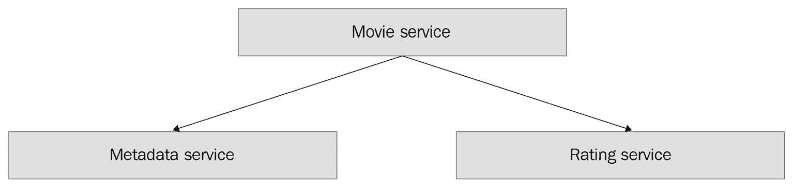
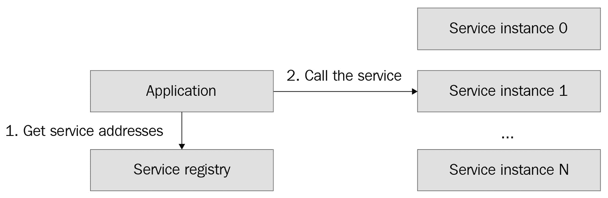
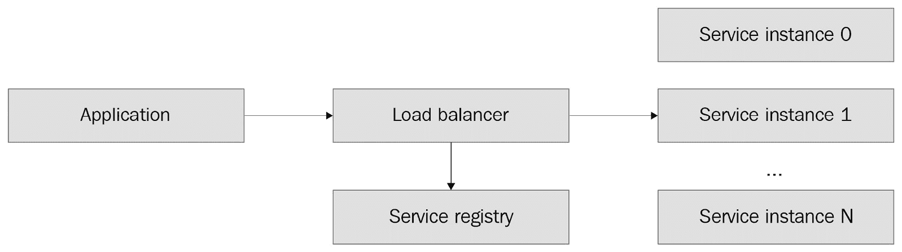
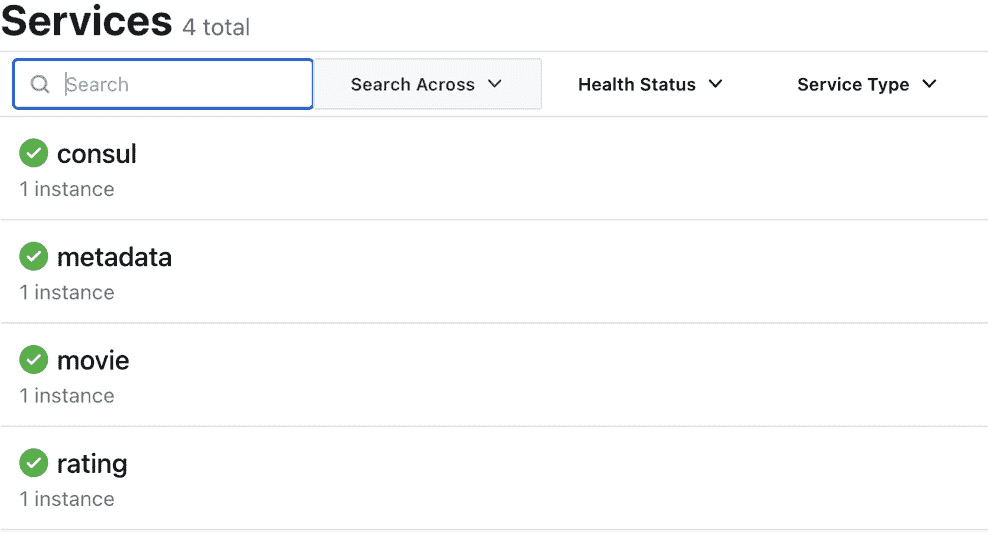

# 3

# 服务发现

在上一章中，我们创建了我们的示例微服务，并让它们使用静态本地地址相互通信，这些地址硬编码在每个服务中。这种方法在需要动态添加或删除服务实例时（称为服务发现）会工作，即让微服务在动态环境中找到彼此。在真实的生产环境中编写和准备可扩展的微服务的第一步是设置服务发现。

在本章中，我们将涵盖以下主题：

+   服务发现概述

+   服务发现解决方案

+   采用服务发现

我们将使用上一章中创建的微服务来说明如何使用服务发现解决方案。现在，让我们继续了解服务发现概念概述。

# 技术要求

为了完成本章，您需要 Go 1.11 或更高版本。此外，您还需要一个 Docker 工具，您可以从 [`www.docker.com`](https://www.docker.com) 下载。

您可以在 GitHub 上找到本章的源文件：[`github.com/PacktPublishing/microservices-with-go/tree/main/Chapter03`](https://github.com/PacktPublishing/microservices-with-go/tree/main/Chapter03)。

# 服务发现概述

在上一章中，我们创建了一个由三个微服务组成的应用程序。服务之间的关系如下图中所示：

![图 3.1 – 我们微服务之间的关系]



图 3.1 – 我们微服务之间的关系

如您所见，电影服务调用元数据和评分服务以获取完整的电影详情。

但我们的服务如何发送请求？它们如何知道彼此的地址？

在我们的示例中，我们为 API 处理器使用了预编程的静态值。我们使用的设置如下：

+   `localhost:8081`

+   `localhost:8082`

+   `localhost:8083`

在我们的方法中，每个服务都需要知道它将与之通信的其他服务的确切地址。这种方法在只有一个微服务的每个实例的情况下会工作。在这种情况下，我们会面临多个挑战：

+   当您有多个实例时，您应该使用什么地址？

+   如何处理某些实例不可用的情况？

如果您有一组静态的实例集，第一个问题相对容易解决——您的服务需要保留每个需要调用的服务的地址列表。然而，这种方法以下列原因不够灵活：

+   每次您需要添加或删除实例时，您都需要更新每个调用服务的配置。

+   如果一个实例因长时间不可用（例如，由于网络故障）而变得不可用，您的服务仍然会继续调用它，直到您更新它们的配置。

如何正确解决这些问题？

我们刚才描述的微服务问题被称为**服务发现**。一般来说，服务发现解决多个问题，如下所述：

+   如何发现特定服务的实例

+   如何在可发现环境中添加和删除服务的实例

+   如何处理实例无响应的问题

让我们看看这些功能是如何工作的。

## 注册表

服务发现的基础是一个注册表（也称为服务注册表），它存储有关可用服务实例的信息。它具有以下功能：

+   注册一个服务的实例。

+   注销一个服务的实例。

+   以网络地址的形式返回服务的所有实例列表。

这是一个服务发现注册表数据的示例：

| **服务名称** | **地址列表** |
| --- | --- |
| 电影服务 | `172.18.10.2:2520` `172.18.12.55:8800` `172.18.89.10:2450` |
| 评分服务 | `172.18.25.11:1100` `172.18.9.55:2830` |
| 电影元数据服务 | `172.18.79.115:3512` `172.17.3.8:9900` |

表 3.1 – 注册表数据

每个服务都可以自行在注册表中注册，或者使用某些库或工具在服务启动时自动注册。一旦服务注册，它将通过健康检查开始被监控，以确保注册表只包含可用实例。

现在我们来看看采用服务发现的两种常见模型。

## 服务发现模型

对于应用程序，有两种与注册表交互的方式：

+   **客户端服务发现**：使用注册表客户端从应用程序直接访问注册表。

+   **服务器端服务发现**：通过负载均衡器间接访问注册表，这是一个特殊的服务器，它将请求转发到可用的实例。

让我们看看每种模型的优缺点。

### 客户端服务发现

在客户端服务发现模型中，每个应用程序或服务通过直接请求目标服务的所有可用实例来直接访问服务注册表。当应用程序收到响应时，它使用目标服务的地址进行请求。逻辑如下所示：




图 3.2 – 客户端服务发现

在此模型中，应用程序负责平衡它所调用的服务的负载——如果应用程序只从列表中选择一个实例并一直调用它，那么它将超载该实例并低估其他实例。

这种模型的缺点是调用应用程序需要编程负载均衡逻辑。此外，这会将服务发现和负载均衡逻辑与应用程序代码耦合在一起，使应用程序更加复杂。

### 服务器端服务发现

服务器端服务发现模型在调用应用程序与注册表之间的交互中添加了一个额外的层。应用程序不是直接调用注册表，而是通过一个称为负载均衡器的特殊服务器将请求发送到目标微服务。负载均衡器负责与注册表交互并在所有可用实例之间分配请求。

下面的图将帮助您理解服务器端服务发现模型：




图 3.3 – 服务器端服务发现

在图中，应用程序通过负载均衡器调用目标服务，通过服务注册表读取活动服务实例列表。在这个模型中，应用程序不需要了解注册表。这是服务器端服务发现模型的主要优势：它有助于将与服务注册表的交互与每个调用应用程序解耦，使应用程序逻辑更简单。该模型的缺点是需要设置和使用负载均衡器。后者是一个相当复杂的操作，我们不会在本书中涉及。

现在，让我们看看注册表如何仅保留每个服务的活动实例列表。

## 服务健康监控

注册表通过拉取或推送模型保持实例信息最新：

+   **拉取模型**：服务注册表定期对每个已知实例进行健康检查。

+   **推送模型**：应用程序通过联系注册表来更新其状态。

拉取模型消除了在服务级别实现状态更新的需求。在推送模型中，应用程序负责更新其状态或向服务注册表报告其健康状态。

现在，我们已经涵盖了服务发现的理论基础，让我们看看您可以使用哪些现有解决方案来启用您的微服务。

# 服务发现解决方案

在本节中，我们将描述现有的服务发现解决方案，这些解决方案可供您使用——**HashiCorp Consul**和**Kubernetes**。然后，您将了解微服务开发者可以使用哪些最流行的工具来执行服务发现。

## HashiCorp Consul

HashiCorp Consul 多年来一直是一种非常流行的服务发现解决方案。这个用 Go 编写的工具允许您通过其客户端或 API 轻松设置服务和应用程序的服务发现。

Consul 有一个相当直观的 API，包括以下关键端点：

+   `PUT /catalog/register`：注册服务实例。

+   `PUT /catalog/deregister`：注销服务实例。

+   `GET /catalog/services`：获取服务的可用实例。

客户端应用程序可以通过 API 或使用 DNS 服务在服务器端服务发现模式下访问 Consul 目录。

你可以通过查看官方网站了解更多的 Consul 信息：[`consul.io`](https://consul.io)。

## Kubernetes

Kubernetes 是一个流行的开源平台，用于运行、扩展和管理应用程序集合，如微服务。

Kubernetes 的一个特性是能够注册和发现其内部运行的服务。Kubernetes 提供了一个 API，用于检索每个正在更新的服务的网络地址列表，用户可以在客户端发现模式下使用它。或者，它允许用户插入一个负载均衡器，以用于服务器端发现。

我们将在本书的*第八章*中稍后介绍 Kubernetes。现在，让我们看看我们如何可以将服务发现添加到上一章中创建的应用程序中。

# 采用服务发现

在本节中，我们将说明如何开始为你的应用程序使用服务发现。我们将使用上一章中创建的微服务作为示例。然后，你将学习如何将负责服务发现的逻辑添加到你的微服务代码中。

当你考虑为你的服务启用服务发现时，你需要回答多个问题，例如以下问题：

+   你更倾向于使用哪种模型——客户端或服务器端发现？

+   你将使用哪个平台来部署和编排你的微服务？

回答第二个问题可能已经给你提供了一个解决方案——包括 Kubernetes 在内的各种部署平台，以及像 AWS 这样的流行云服务，都为你提供了服务发现功能。

如果你不知道你将为你的服务使用哪个部署平台，并且你对微服务开发是新手，你可能考虑使用客户端服务发现。客户端发现模型稍微简单一些，因为你的服务直接与服务注册表协调。稍后，如果你想要的话，你可以切换到服务器端服务发现。

让我们开始准备你的应用程序以添加服务发现逻辑。

## 准备应用程序

让我们列出我们希望从我们的服务发现代码中实现的目标。

+   在服务启动时注册我们打算使用的服务的功能

+   在服务关闭时注销我们打算使用的服务的功能

+   获取我们打算用于调用其他服务的特定服务的地址列表的功能。

+   设置服务健康监控，以便服务注册表能够移除不活跃的服务实例

如果我们的服务发现逻辑不直接绑定到特定的工具上，那就太好了。通常，使用更通用的接口来抽象实际技术是一种良好的实践，这允许我们交换实现。我们可以用一个例子来说明这一点——想象我们正在使用 Hashicorp Consul 库，它以以下形式返回服务地址列表：

```go
func Service(string, string) ([]*consul.ServiceEntry, *consul.QueryMeta, error)
```

如果我们在代码中公开这些 Consul 结构并在代码库中传递这些结构，我们的服务代码将与 Consul 紧密耦合。如果我们决定切换到另一个服务发现工具，我们需要替换不仅服务发现实现逻辑，还要替换所有使用它的代码。

相反，让我们定义一个更通用且与技术无关的接口。为了提供服务实例列表，我们可以简单地以`[]string`格式返回 URL 列表。

我们服务发现逻辑的完整接口如下：

```go
// registry defines a service registry.
type Registry interface {
    // Register creates a service instance record in the registry.
    Register(ctx context.Context, instanceID string, serviceName string, hostPort string) error
    // Deregister removes a service instance record from the registry.
    Deregister(ctx context.Context, instanceID string, serviceName string) error
    // ServiceAddresses returns the list of addresses of active instances of the given service.
    ServiceAddresses(ctx context.Context, serviceID string) ([]string, error)
    // ReportHealthyState is a push mechanism for reporting healthy state to the registry.
    ReportHealthyState(instanceID string, serviceName string) error
}
```

如您可能注意到的，该接口相当通用，但它允许您根据需要创建基于不同技术的多个实现。

您可能还会注意到，该接口包括一个`ReportHealthyState`函数，用于报告服务实例的健康状态。此函数允许我们实现之前提到的基于推送的服务健康监控，因此每个微服务将定期向服务注册表报告其健康状态。如果服务实例在定义的时间间隔内没有报告健康状态，注册表将能够删除每个服务的非活动实例（在我们的实现中，我们将假设该间隔为 5 秒）。

现在，让我们考虑在哪里存储我们的微服务服务发现逻辑。我建议使用一个所有三个服务都可以访问的包——让我们在应用程序的根目录下`pkg`文件夹中创建它。我们可以称它为`pkg/discovery`。在其内部，添加一个`discovery.go`文件，并将以下代码添加到其中：

```go
package discovery
import (
    "context"
    "errors"
    "fmt"
    "math/rand"
    "time"
)
// Registry defines a service registry.
type Registry interface {
    // Register creates a service instance record in the
    // registry.
    Register(ctx context.Context, instanceID string, serviceName string, hostPort string) error
    // Deregister removes a service insttance record from
    // the registry.
    Deregister(ctx context.Context, instanceID string, serviceName string) error
    // ServiceAddresses returns the list of addresses of
    // active instances of the given service.
    ServiceAddresses(ctx context.Context, serviceID string) ([]string, error)
    // ReportHealthyState is a push mechanism for reporting
    // healthy state to the registry.
    ReportHealthyState(instanceID string, serviceName string) error
}
// ErrNotFound is returned when no service addresses are
// found.
var ErrNotFound = errors.New("no service addresses found")
// GenerateInstanceID generates a pseudo-random service
// instance identifier, using a service name
// suffixed by dash and a random number.
func GenerateInstanceID(serviceName string) string {
    return fmt.Sprintf("%s-%d", serviceName, rand.New(rand.NewSource(time.Now().UnixNano())).Int())
}
```

在我们刚刚添加的代码中，我们定义了一个`Registry`接口用于服务注册。此外，我们还定义了`ErrNotFound`错误，当`ServiceAddresses`函数找不到任何活动服务地址时将返回此错误。最后，我们创建了一个`GenerateInstanceID`函数，该函数将帮助我们生成用于`Register`和`Deregister`函数的随机实例标识符。

我们已经准备好开始对其实现的工作。

## 实现发现逻辑

我们之前定义的接口的一个好处是，我们可以创建多个实现并在我们的应用程序中使用它们。例如，我们可以创建一个用于测试的实现，而另一个实现则用于生产。为了说明这种方法，我们将创建两个实现：

+   **内存服务发现**：使用内存注册表来存储地址集合。

+   **基于 Consul 的服务发现**：使用 Hashicorp Consul 服务注册表来存储和检索服务地址。

现在，让我们继续实现逻辑。

### 内存实现

让我们从内存实现开始。在这个实现中，我们将使用简单的映射数据结构在内存中存储服务注册记录。以下是步骤：

1.  创建一个名为`pkg/discovery/memorypackage`的文件和一个名为`memory.go`的文件，然后添加以下内容：

    ```go
    package memory
    ```

    ```go
    import (
    ```

    ```go
        "context"
    ```

    ```go
        "errors"
    ```

    ```go
        "net"
    ```

    ```go
        "sync"
    ```

    ```go
        "time"
    ```

    ```go
        "movieexample.com/pkg/discovery"
    ```

    ```go
    )
    ```

    ```go
    type serviceName string
    ```

    ```go
    type instanceID string
    ```

    ```go
    // Registry defines an in-memory service registry.
    ```

    ```go
    type Registry struct {
    ```

    ```go
        sync.RWMutex
    ```

    ```go
        serviceAddrs map[serviceName]map[instanceID]*serviceInstance
    ```

    ```go
    }
    ```

    ```go
    type serviceInstance struct {
    ```

    ```go
        hostPort   string
    ```

    ```go
        lastActive time.Time
    ```

    ```go
    }
    ```

    ```go
    // NewRegistry creates a new in-memory service
    ```

    ```go
    // registry instance.
    ```

    ```go
    func NewRegistry() *Registry {
    ```

    ```go
        return &Registry{serviceAddrs: map[serviceName]map[instanceID]*serviceInstance{}}
    ```

    ```go
    }
    ```

1.  让我们实现我们的`Register`和`Deregister`函数：

    ```go
    // Register creates a service record in the registry.
    ```

    ```go
    func (r *Registry) Register(ctx context.Context, instanceID string, serviceName string, hostPort string) error {
    ```

    ```go
        r.Lock()
    ```

    ```go
        defer r.Unlock()
    ```

    ```go
        if _, ok := r.serviceAddrs[serviceName]; !ok {
    ```

    ```go
            r.serviceAddrs[serviceName] = map[string]*serviceInstance{}
    ```

    ```go
        }
    ```

    ```go
        r.serviceAddrs[serviceName][instanceID] = &serviceInstance{hostPort: hostPort, lastActive: time.Now()}
    ```

    ```go
        return nil
    ```

    ```go
    }
    ```

    ```go
    // Deregister removes a service record from the
    ```

    ```go
    // registry.
    ```

    ```go
    func (r *Registry) Deregister(ctx context.Context, instanceID string, serviceName string) error {
    ```

    ```go
        r.Lock()
    ```

    ```go
        defer r.Unlock()
    ```

    ```go
        if _, ok := r.serviceAddrs[serviceName]; !ok {
    ```

    ```go
            return nil
    ```

    ```go
        }
    ```

    ```go
        delete(r.serviceAddrs[serviceName], instanceID)
    ```

    ```go
        return nil
    ```

    ```go
    }
    ```

1.  最后，让我们实现`Registry`接口的剩余两个函数：

    ```go
    // ReportHealthyState is a push mechanism for
    ```

    ```go
    // reporting healthy state to the registry.
    ```

    ```go
    func (r *Registry) ReportHealthyState(instanceID string, serviceName string) error {
    ```

    ```go
        r.Lock()
    ```

    ```go
        defer r.Unlock()
    ```

    ```go
        if _, ok := r.serviceAddrs[serviceName]; !ok {
    ```

    ```go
            return errors.New("service is not registered yet")
    ```

    ```go
        }
    ```

    ```go
        if _, ok := r.serviceAddrs[serviceName][instanceID]; !ok {
    ```

    ```go
            return errors.New("service instance is not registered yet")
    ```

    ```go
        }
    ```

    ```go
        r.serviceAddrs[serviceName][instanceID].lastActive = time.Now()
    ```

    ```go
        return nil
    ```

    ```go
    }
    ```

    ```go
    // ServiceAddresses returns the list of addresses of
    ```

    ```go
    // active instances of the given service.
    ```

    ```go
    func (r *Registry) ServiceAddresses(ctx context.Context, serviceName string) ([]string, error) {
    ```

    ```go
        r.RLock()
    ```

    ```go
        defer r.RUnlock()
    ```

    ```go
        if len(r.serviceAddrs[serviceName]) == 0 {
    ```

    ```go
            return nil, discovery.ErrNotFound
    ```

    ```go
        }
    ```

    ```go
        var res []string
    ```

    ```go
        for _, i := range r.serviceAddrs[serviceName] {
    ```

    ```go
            if i.lastActive.Before(time.Now().Add(-5 * time.Second)) {
    ```

    ```go
                continue
    ```

    ```go
            }
    ```

    ```go
            res = append(res, i.hostPort)
    ```

    ```go
        }
    ```

    ```go
        return res, nil
    ```

    ```go
    }
    ```

这种实现可以用于测试或运行在单个服务器上的简单应用程序。该实现基于一种组合的映射数据结构和`sync.RWMutex`，允许并发地对映射进行读写操作。在映射中，我们存储包含实例地址和最后一次成功健康检查时间的`serviceInstance`结构，这可以通过调用`ReportHealthyState`函数来设置。在`ServiceAddresses`函数中，我们只返回在过去 5 秒内成功进行健康检查的实例。

现在，让我们转向基于 Consul 的服务注册实现。

### 基于 Consul 的实现

我们现在将要工作的实现将使用 Hashicorp Consul 作为服务注册中心：

1.  首先，创建一个名为`pkg/discovery/consul`的包，并向其中添加一个名为`consul.go`的文件：

    ```go
     package consul
    ```

    ```go
    import (
    ```

    ```go
        "context"
    ```

    ```go
        "errors"
    ```

    ```go
        "fmt"
    ```

    ```go
        "strconv"
    ```

    ```go
        "strings"
    ```

    ```go
        consul "github.com/hashicorp/consul/api"
    ```

    ```go
        "movieexample.com/pkg/discovery"
    ```

    ```go
    )
    ```

    ```go
    // Registry defines a Consul-based service regisry.
    ```

    ```go
    type Registry struct {
    ```

    ```go
        client *consul.Client
    ```

    ```go
    }
    ```

    ```go
    // NewRegistry creates a new Consul-based service
    ```

    ```go
    // registry instance.
    ```

    ```go
    func NewRegistry(addr string) (*Registry, error) {
    ```

    ```go
        config := consul.DefaultConfig()
    ```

    ```go
        config.Address = addr
    ```

    ```go
        client, err := consul.NewClient(config)
    ```

    ```go
        if err != nil {
    ```

    ```go
            return nil, err
    ```

    ```go
        }
    ```

    ```go
        return &Registry{client: client}, nil
    ```

    ```go
    }
    ```

1.  现在，让我们实现我们接口的注册和重新注册记录的功能：

    ```go
     // Register creates a service record in the registry.
    ```

    ```go
    func (r *Registry) Register(ctx context.Context, instanceID string, serviceName string, hostPort string) error {
    ```

    ```go
        parts := strings.Split(hostPort, ":")
    ```

    ```go
        if len(parts) != 2 {
    ```

    ```go
            return errors.New("hostPort must be in a form of <host>:<port>, example: localhost:8081")
    ```

    ```go
        }
    ```

    ```go
        port, err := strconv.Atoi(parts[1])
    ```

    ```go
        if err != nil {
    ```

    ```go
            return err
    ```

    ```go
        }
    ```

    ```go
        return r.client.Agent().ServiceRegister(&consul.AgentServiceRegistration{
    ```

    ```go
            Address: parts[0],
    ```

    ```go
            ID:      instanceID,
    ```

    ```go
            Name:    serviceName,
    ```

    ```go
            Port:    port,
    ```

    ```go
            Check:   &consul.AgentServiceCheck{CheckID: instanceID, TTL: "5s"},
    ```

    ```go
        })
    ```

    ```go
    }
    ```

    ```go
    // Deregister removes a service record from the
    ```

    ```go
    // registry.
    ```

    ```go
    func (r *Registry) Deregister(ctx context.Context, instanceID string, _ string) error {
    ```

    ```go
        return r.client.Agent().ServiceDeregister(instanceID)
    ```

    ```go
    }
    ```

1.  最后，让我们实现剩余的注册功能：

    ```go
    // ServiceAddresses returns the list of addresses of
    ```

    ```go
    // active instances of the given service.
    ```

    ```go
    func (r *Registry) ServiceAddresses(ctx context.Context, serviceName string) ([]string, error) {
    ```

    ```go
        entries, _, err := r.client.Health().Service(serviceName, "", true, nil)
    ```

    ```go
        if err != nil {
    ```

    ```go
            return nil, err
    ```

    ```go
        } else if len(entries) == 0 {
    ```

    ```go
            return nil, discovery.ErrNotFound
    ```

    ```go
        }
    ```

    ```go
        var res []string
    ```

    ```go
        for _, e := range entries {
    ```

    ```go
            res = append(res, res = append(res, fmt.Sprintf("%s:%d", e.Service.Address, e.Service.Port)))
    ```

    ```go
        }
    ```

    ```go
        return res, nil
    ```

    ```go
    }
    ```

    ```go
    // ReportHealthyState is a push mechanism for
    ```

    ```go
    // reporting healthy state to the registry.
    ```

    ```go
    func (r *Registry) ReportHealthyState(instanceID string, _ string) error {
    ```

    ```go
        return r.client.Agent().PassTTL(instanceID, "")
    ```

    ```go
    }
    ```

我们的客户端依赖于一个外部库，`github.com/hashicorp/consul/api`。我们需要现在通过在`src`目录内运行`go mod tidy`来获取它。之后，Go 应该获取依赖项，我们的逻辑应该能够编译。

现在，我们已经准备好将刚刚创建的逻辑应用到我们的微服务中。

## 使用发现逻辑

现在，我们需要添加初始化和发现服务的逻辑。目前，只有电影服务与其他两个服务进行通信，所以我们将以电影服务为例说明如何添加服务发现。

让我们从我们的网关开始：

1.  在上一章中，我们创建了两个网关用于调用元数据和评分服务。让我们修改它们的结构，使其与下面所示的结构一致：

    ```go
    type Gateway struct {
    ```

    ```go
        registry discovery.Registry
    ```

    ```go
    }
    ```

1.  此外，将`New`函数的格式改为以下：

    ```go
    func New(registry discovery.Registry) *Gateway {
    ```

    ```go
        return &Gateway{registry}
    ```

    ```go
    }
    ```

1.  现在，网关在创建时需要一个注册中心。我们可以将元数据网关的`Get`函数的开始部分改为现在这样：

    ```go
    func (g *Gateway) Get(ctx context.Context, id string) (*model.Metadata, error) {
    ```

    ```go
        addrs, err := g.registry.ServiceAddresses(ctx, "metadata")
    ```

    ```go
        if err != nil {
    ```

    ```go
            return nil, err
    ```

    ```go
        }
    ```

    ```go
        url := "http://" + addrs[rand.Intn(len(addrs))] + "/metadata"
    ```

    ```go
        log.Printf("Calling metadata service. Request: GET " + url)
    ```

    ```go
        req, err := http.NewRequest(http.MethodGet, url, nil)
    ```

你可能会注意到，我们现在不是调用静态预配置的地址，而是首先从注册中心获取元数据的可用地址。这就是服务发现的本质——我们使用注册中心的数据来在服务之间进行远程调用。在我们获取服务地址列表后，我们使用`rand.Intn`函数随机选择一个。通过这样做，我们在活动实例之间平衡负载，在每个请求中随机选择任何可用的实例。

1.  现在，以与修改元数据服务相同的方式更新评分网关。

1.  下一步是更新我们服务的`main`函数，以便每个服务将在服务注册中心中注册和注销自己。让我们首先更新元数据服务。将其`main`函数更新为以下：

    ```go
    const serviceName = "metadata"
    ```

    ```go
    func main() {
    ```

    ```go
        var port int
    ```

    ```go
        flag.IntVar(&port, "port", 8081, "API handler port")
    ```

    ```go
        flag.Parse()
    ```

    ```go
        log.Printf("Starting the metadata service on port %d", port)
    ```

    ```go
        registry, err := consul.NewRegistry("localhost:8500")
    ```

    ```go
        if err != nil {
    ```

    ```go
            panic(err)
    ```

    ```go
        }
    ```

    ```go
        ctx := context.Background()
    ```

    ```go
        instanceID := discovery.GenerateInstanceID(serviceName)
    ```

    ```go
        if err := registry.Register(ctx, instanceID, serviceName, fmt.Sprintf("localhost:%d", port)); err != nil {
    ```

    ```go
            panic(err)
    ```

    ```go
        }
    ```

    ```go
        go func() {
    ```

    ```go
            for {
    ```

    ```go
                if err := registry.ReportHealthyState(instanceID, serviceName); err != nil {
    ```

    ```go
                    log.Println("Failed to report healthy state: " + err.Error())
    ```

    ```go
                }
    ```

    ```go
                time.Sleep(1 * time.Second)
    ```

    ```go
            }
    ```

    ```go
        }()
    ```

    ```go
        defer registry.Deregister(ctx, instanceID, serviceName)
    ```

    ```go
        repo := memory.New()
    ```

    ```go
        svc := metadata.New(repo)
    ```

    ```go
        h := httphandler.New(svc)
    ```

    ```go
        http.Handle("/metadata", http.HandlerFunc(h.GetMetadataByID))
    ```

    ```go
        if err := http.ListenAndServe(fmt.Sprintf(":%d", port), nil); err != nil {
    ```

    ```go
            panic(err)
    ```

    ```go
        }
    ```

    ```go
    }
    ```

在前面的代码中，我们添加了在基于 Consul 的服务注册表中注册和注销服务的逻辑，并每秒向它报告其健康状态。

1.  让我们在评分服务中添加类似的逻辑。更新其`main`函数如下：

    ```go
    func main() {
    ```

    ```go
        var port int
    ```

    ```go
        flag.IntVar(&port, "port", 8082, "API handler port")
    ```

    ```go
        flag.Parse()
    ```

    ```go
        log.Printf("Starting the rating service on port %d", port)
    ```

    ```go
        registry, err := consul.NewRegistry("localhost:8500")
    ```

    ```go
        if err != nil {
    ```

    ```go
            panic(err)
    ```

    ```go
        }
    ```

    ```go
        ctx := context.Background()
    ```

    ```go
        instanceID := discovery.GenerateInstanceID(serviceName)
    ```

    ```go
        if err := registry.Register(ctx, instanceID, serviceName, fmt.Sprintf("localhost:%d", port)); err != nil {
    ```

    ```go
            panic(err)
    ```

    ```go
        }
    ```

    ```go
        go func() {
    ```

    ```go
            for {
    ```

    ```go
                if err := registry.ReportHealthyState(instanceID, serviceName); err != nil {
    ```

    ```go
                    log.Println("Failed to report healthy state: " + err.Error())
    ```

    ```go
                }
    ```

    ```go
                time.Sleep(1 * time.Second)
    ```

    ```go
            }
    ```

    ```go
        }()
    ```

    ```go
        defer registry.Deregister(ctx, instanceID, serviceName)
    ```

    ```go
        repo := memory.New()
    ```

    ```go
        svc := controller.New(repo)
    ```

    ```go
        h := httphandler.New(svc)
    ```

    ```go
        http.Handle("/rating", http.HandlerFunc(h.Handle))
    ```

    ```go
        if err := http.ListenAndServe(fmt.Sprintf(":%d", port), nil); err != nil {
    ```

    ```go
            panic(err)
    ```

    ```go
        }
    ```

    ```go
    }
    ```

我们刚刚所做的更改与我们对元数据服务所做的更改类似。

1.  最后一步是修改电影服务的`main`函数，将其替换为以下内容：

    ```go
     func main() {
    ```

    ```go
        var port int
    ```

    ```go
        flag.IntVar(&port, "port", 8083, "API handler port")
    ```

    ```go
        flag.Parse()
    ```

    ```go
        log.Printf("Starting the movie service on port %d", port)
    ```

    ```go
        registry, err := consul.NewRegistry("localhost:8500")
    ```

    ```go
        if err != nil {
    ```

    ```go
            panic(err)
    ```

    ```go
        }
    ```

    ```go
        ctx := context.Background()
    ```

    ```go
        instanceID := discovery.GenerateInstanceID(serviceName)
    ```

    ```go
        if err := registry.Register(ctx, instanceID, serviceName, fmt.Sprintf("localhost:%d", port)); err != nil {
    ```

    ```go
            panic(err)
    ```

    ```go
        }
    ```

    ```go
        go func() {
    ```

    ```go
            for {
    ```

    ```go
                if err := registry.ReportHealthyState(instanceID, serviceName); err != nil {
    ```

    ```go
                    log.Println("Failed to report healthy state: " + err.Error())
    ```

    ```go
                }
    ```

    ```go
                time.Sleep(1 * time.Second)
    ```

    ```go
            }
    ```

    ```go
        }()
    ```

    ```go
        defer registry.Deregister(ctx, instanceID, serviceName)
    ```

    ```go
        metadataGateway := metadatagateway.New(registry)
    ```

    ```go
        ratingGateway := ratinggateway.New(registry)
    ```

    ```go
        svc := movie.New(ratingGateway, metadataGateway)
    ```

    ```go
        h := httphandler.New(svc)
    ```

    ```go
        http.Handle("/movie", http.HandlerFunc(h.GetMovieDetails))
    ```

    ```go
        if err := http.ListenAndServe(fmt.Sprintf(":%d", port), nil); err != nil {
    ```

    ```go
            panic(err)
    ```

    ```go
        }
    ```

    ```go
    }
    ```

在这一点上，我们已经成功地将基于 Consul 的服务发现添加到我们的应用程序中。让我们通过实际操作来展示它是如何工作的：

1.  为了现在运行我们的应用程序，你需要本地运行 Hashicorp Consul。最简单的方法是使用 Docker 工具运行它。假设你已经从其网站安装了 Docker，[docker.com](http://docker.com)，你可以运行以下命令：

```go
docker run -d -p 8500:8500 -p 8600:8600/udp --name=dev-consul consul agent -server -ui -node=server-1 -bootstrap-expect=1 -client=0.0.0.0
```

上述命令在开发模式下运行 Hashicorp Consul，将其端口`8500`和`8600`暴露给本地使用。

1.  通过在每个`cmd`目录内执行此命令来运行每个微服务：

```go
go run *.go
```

1.  现在，通过其链接进入 Consul 的 Web UI，[`localhost:8500/`](http://localhost:8500/)。当你打开**服务**标签时，你应该能看到我们的服务列表和一个活动的 Consul 实例：



图 3.4 – Consul Web 视图中的活动服务实例

你可以选择通过运行以下命令为每个服务添加一些额外的实例：

```go
go run *.go --port <PORT>
```

如果你运行上述命令，将`<PORT>`占位符替换为尚未使用的唯一端口号（在我们的示例中，我们使用了端口号`8081`、`8082`和`8083`，因此你可以从`8084`开始的端口号运行）。每个命令的结果将在之前展示的 Consul 服务视图中显示额外的健康实例。

你也可以尝试手动关闭任何服务，通过终止`go run`命令，并观察实例状态如何从`通过`变为`关键`。

1.  为了测试 API 请求，确保每个服务至少有一个健康的实例，并向电影服务发送以下请求：

```go
curl -v localhost:8083/movie?id=1
```

1.  检查电影服务的输出日志（你应该能在运行电影服务`go run`命令的终端中看到它们）。如果你一切操作正确，你应该能看到类似的行：

    ```go
    2022/06/08 13:37:42 Calling metadata service. Request: GET http://localhost:8081/metadata
    ```

上面的行是调用由 Consul 支持的服务注册表的结果。在我们的元数据服务网关实现中，我们从注册表中随机选择一个活动实例，并在调用之前记录其地址。如果你有多个元数据服务实例，你可以按照之前列出的多次执行`curl`请求，你会看到电影服务总是在它们中随机选择一个实例。

到目前为止，我们已经展示了如何使用服务发现来管理我们的微服务。现在，我们可以通过添加和删除它们的实例来动态扩展我们的微服务，而无需更改服务代码。我们还提供了两个服务注册表的实现，您可以在代码中使用。现在，我们准备进入下一章，讨论另一个重要主题，数据序列化。

# 摘要

在本章中，我们对服务发现进行了概述，并比较了其不同的模型。您已经了解了服务注册表是什么以及其主要的服务发现模型有哪些。我们通过提供两种实现来展示了如何使用客户端服务发现模型，一种使用内存中的数据集，另一种使用 Hashicorp Consul。我们还把基于 Consul 的实现集成到我们的微服务中，以演示如何在微服务逻辑中使用它。现在，您已经知道如何在您的应用程序中添加和使用服务发现。

在下一章中，我们将讨论另一个重要主题：序列化。您将学习如何编码和解码服务之间传输的数据。这将帮助我们进一步探讨服务之间的通信，我们将在*第五章*中介绍。

# 进一步阅读

+   *服务发现概述*: [`www.nginx.com/blog/service-discovery-in-a-microservices-architecture`](https://www.nginx.com/blog/service-discovery-in-a-microservices-architecture)

+   *服务器端服务发现*: [`microservices.io/patterns/server-side-discovery.html`](https://microservices.io/patterns/server-side-discovery.html)
