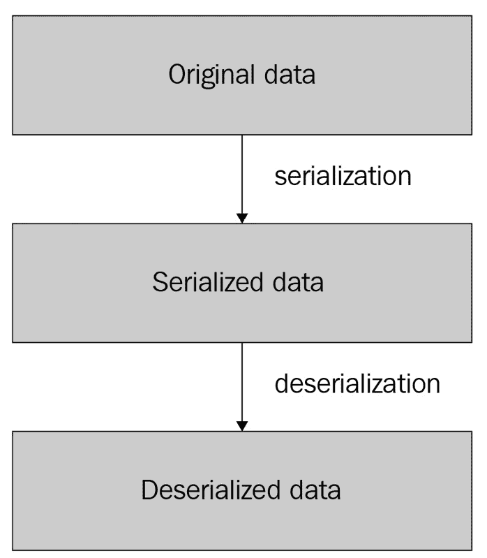

# 4

# 序列化

在前面的章节中，我们学习了如何构建 Go 微服务、创建 HTTP API 端点，以及设置服务发现以使我们的微服务能够相互通信。这些知识已经为我们构建微服务提供了一个坚实的基础；然而，我们将继续我们的旅程，探讨更多高级主题。

在本章中，我们将探讨**序列化**，这是一个允许数据编码和解码以在服务之间存储或发送的过程。

为了说明如何使用序列化，我们将使用**Protocol Buffers**格式定义服务之间传输的数据结构，该格式在业界广泛使用，具有简单的语法，以及非常高效的编码。

最后，我们将说明如何为 Protocol Buffers 结构生成代码，并展示与 XML 和 JSON 等其他格式相比，Protocol Buffers 编码是多么高效。

在本章中，我们将涵盖以下主题：

+   序列化的基础知识

+   使用 Protocol Buffers

+   序列化的最佳实践

现在，让我们继续探讨序列化的基础知识。

# 技术要求

为了完成本章，您需要拥有 Go 1.11 或更高版本以及 Protocol Buffers 编译器。我们将使用官方的 Protocol Buffers 编译器；您可以通过运行以下命令来安装它：

```go
go install google.golang.org/protobuf/cmd/protoc-gen-go@latest
export PATH="$PATH:$(go env GOPATH)/bin"
```

您可以在以下链接在 GitHub 上找到本章的代码示例：

https://github.com/PacktPublishing/microservices-with-go/tree/main/Chapter04

# 序列化的基础知识

**序列化**是将数据转换为一种格式的过程，允许您传输、存储它，并在以后将其重构回原始形式。

该过程在以下图中进行了说明：



图 4.1 – 序列化和反序列化过程

如图中所示，将原始数据转换的过程称为**序列化**，而将其转换回原始形式的过程称为**反序列化**。

序列化有两个主要用途：

+   在服务之间传输数据，充当它们之间的通用**语言**

+   编码和解码任意数据以进行存储，允许您将复杂的数据结构作为字节数组或常规字符串存储

在*第二章*中，当我们构建应用程序时，我们创建了我们的 HTTP API 端点，并将它们设置为向调用者返回 JSON 响应。在这种情况下，JSON 扮演了**序列化格式**的角色，使我们能够将我们的数据结构转换为它，然后再将其解码回来。

让我们以在 `metadata/pkg/model/metadata.go` 文件中定义的 `Metadata` 结构为例：

```go
// Metadata defines the movie metadata.
type Metadata struct {
    ID          string `json:"id"`
    Title       string `json:"title"`
    Description string `json:"description"`
    Director    string `json:"director"`
}
```

我们的结构包括称为**注释**的记录，这些记录帮助 JSON 编码器将我们的记录转换为输出。例如，我们创建了一个我们的结构实例：

```go
Metadata{
    ID:          "123",
    Title:       "The Movie 2",
    Description: "Sequel of the legendary The Movie",
    Director:    "Foo Bars",
}
```

当我们用 JSON 对其进行编码时，结果将是以下内容：

```go
{"id":"123","title":"The Movie 2","description":"Sequel of the legendary The Movie","director":"Foo Bars"}
```

一旦数据被序列化，它就可以以多种不同的方式使用。在我们的例子中*第二章*，我们使用了 JSON 格式来在我们的微服务之间发送和接收数据。序列化的其他一些用例包括以下内容：

+   **存储配置**: 序列化格式常用于存储配置。例如，您可以使用这些格式定义您的服务设置，然后在服务代码中读取它们。

+   **在数据库中存储记录**: 例如，JSON 这样的格式常用于在数据库中存储任意数据。例如，键值数据库需要将整个记录值编码到字节数组中，开发者通常使用 JSON 这样的格式来编码和解码这些记录值。

+   **日志记录**: 应用程序日志通常以 JSON 格式存储，这使得它们对人类和诸如数据可视化软件等各种应用程序都易于阅读。

JSON 是目前最受欢迎的序列化格式之一，对 Web 开发至关重要。它具有以下优点：

+   **语言支持**: 大多数编程语言都包括用于编码和解码 JSON 的工具。

+   **浏览器支持**: JSON 是 Web 应用程序的一个基本组成部分，所有现代浏览器都包括在浏览器本身中与之交互的开发者工具。

+   **可读性**: JSON 记录易于阅读，在 Web 应用程序的开发和调试过程中通常也容易使用。

然而，它也有一定的局限性：

+   **大小**: JSON 不是一种大小高效的格式。在本章中，我们将探讨哪些格式和协议提供了更小的输出记录。

+   **速度**: 与其他流行的序列化协议相比，JSON 的编码和解码速度并不是最快的。

让我们探索其他流行的序列化格式。

# **流行的序列化格式**

行业中使用了许多流行的序列化格式和协议。让我们了解一下一些最流行的格式：

+   **XML**

+   **YAML**

+   **Apache Thrift**

+   **Apache Avro**

+   **协议缓冲区**

本节将提供每个格式的高级概述，以及这些协议之间的一些关键差异。

### XML

XML 是用于 Web 服务开发的最早序列化格式之一。它于 1998 年创建，目前在行业中仍然被广泛使用，尤其是在企业应用中。

XML 将数据表示为称为元素的节点树。一个元素示例是`<example>Some value</example>`。如果我们序列化上面提到的元数据结构，结果将是以下内容：

```go
<Metadata><ID>123</ID><Title>The Movie 2</Title><Description>Sequel of the legendary The Movie</Description><Director>Foo Bars</Director></Metadata>
```

您可能会注意到，我们数据的序列化 XML 表示形式比 JSON 长一些。这是 XML 格式的一个缺点——输出通常是所有流行序列化协议中最大的，这使得阅读和传输数据更困难。另一方面，XML 的优点包括其广泛的采用和受欢迎程度、可读性以及其广泛的库支持。

### YAML

YAML 是一种序列化格式，它最初于 2001 年发布。多年来，它越来越受欢迎，成为行业中最受欢迎的序列化格式之一。该语言的开发者非常注重其可读性和紧凑性，使其成为定义任意可读数据的完美工具。我们可以在我们的元数据结构上说明这一点：在 YAML 格式中，它看起来如下所示：

```go
metadata:
  id: 123
  title: The Movie 2
  description: Sequel of the legendary The Movie
  director: Foo Bars
```

YAML 格式广泛用于存储配置数据。其中一个原因是它能够包含注释，这是其他格式，如 JSON 所缺乏的。YAML 用于服务间通信的使用较少，主要是因为序列化数据的大小较大。让我们来看看一些更高效的序列化格式。

### Apache Thrift

到目前为止，我们已经审查了 JSON、XML 和 YAML，它们主要用于定义和序列化任意类型的数据。当我们不仅想要序列化和反序列化数据，还要在多个服务之间传输数据时，还有其他更广泛的解决方案。这些解决方案结合了两个角色：它们既作为序列化格式，也作为**通信协议**——在网络中发送和接收任意数据的机制。HTTP 是此类协议的一个例子，但开发者并不局限于在他们的应用程序中使用它。

Apache Thrift 是一种结合了序列化和通信协议的工具，可用于定义您的数据类型，并允许您的服务通过传递数据相互通信。它最初是在 Facebook 上创建的，但后来成为 Apache 软件基金会下的社区支持的开源项目。

与 JSON 和 XML 不同，Thrift 要求您首先以自己的格式定义您的结构。在我们的示例中，对于元数据结构，我们需要创建一个以 `.thrift` 扩展名结尾的文件，包括 Thrift 语言中的定义：

```go
struct Metadata {
  1: string id,
  2: string title,
  3: string description,
  4: string director
}
```

一旦您有了 Thrift 文件，您可以使用自动 Thrift 代码生成器来生成大多数编程语言的代码，这些代码将包含定义的结构和逻辑，用于编码和解码它。除了数据结构之外，Thrift 允许您定义**Thrift 服务**——可以远程调用的函数集。以下是一个 Thrift 服务定义的示例：

```go
service MetadataService {
  Metadata get(1: string id)
}
```

此处定义了一个名为 `MetadataService` 的服务，它提供了一个 `get` 函数，返回一个 `Metadata` Thrift 对象。一个兼容 Thrift 的服务器可以充当这样的 Thrift 服务，处理来自客户端应用程序的传入请求——我们将在 *第五章* 中学习如何编写这样的服务器。

让我们探讨 Apache Thrift 的优势和局限性。优势包括以下内容：

+   与 XML 和 JSON 相比，输出数据更小，编码和解码速度更快。Thrift 序列化数据的大小可以比 XML 和 JSON 小 30% 到 50%。

+   不仅能够定义结构，还能定义整个服务并为它们生成代码，从而允许服务器与其客户端之间进行通信。

局限性包括以下内容：

+   近年来相对较低的人气和采用率，因为转向了更流行和高效的格式。

+   它缺乏官方文档。Thrift 是一种相对复杂的技术，大多数文档都是非官方的。

+   与 JSON 和 XML 不同，Thrift 序列化数据不可读，因此更难以用于调试。

+   近年来几乎没有任何支持——Facebook 一直在维护一个名为 Facebook Thrift 的独立分支，但它的受欢迎程度远低于 Apache 版本。

让我们看看其他在业界广泛使用的流行序列化格式。

### Apache Avro

Apache Avro 是一种序列化格式和通信协议的组合，与 Apache Thrift 有一定的相似性。Apache Avro 也要求开发者为他们数据定义一个架构（可以是 JSON 或其自己的语言 Avro IDL 编写），在我们的案例中，Metadata 结构将具有以下架构：

```go
{
   "namespace": "example.avro",
   "type": "record",
   "name": "Metadata",
   "fields": [
      {"name": "id", "type": "string"},
      {"name": "title", "type": "string"},
      {"name": "description", "type": "string"},
      {"name": "director", "type": "string"},
   ] 
}
```

然后，该架构将用于将结构转换为序列化状态，并再次转换回来。

类型和结构随时间变化并不罕见，微服务 API 和结构定义需要进化。使用 Avro，开发者可以创建一个新版本的架构（通常表示为单独的文件，后缀为增量版本号），并在代码库中保留新旧版本。这样，应用程序可以以任一格式编码和解码数据，即使它们有一些不兼容的更改，例如字段名称的更改。这是使用 Apache Avro 而不是许多其他序列化协议的关键优势之一。此外，Apache Avro 允许你为现有架构生成代码，这使得在不同编程语言之间翻译序列化数据及其对应的数据结构变得更加容易。

### Protocol Buffers

Protocol Buffers 是一种在 20 多年前由 Google 创建的序列化格式。2008 年，该格式公开，并立即在开发者中获得了流行。该格式的优势包括以下内容：

+   定义语言的简洁性

+   较小的数据输出大小

+   序列化和反序列化的高性能

+   除了数据结构外，还能够定义服务，并且能够在多种语言中编译客户端和服务器代码

+   由 Google 提供的协议演变和官方支持

Protocol Buffers 的流行度、其简单性以及其数据编码的效率，使其非常适合用于微服务开发。我们将使用 Protocol Buffers 来序列化和反序列化服务之间传输的数据，以及定义我们的服务 API。在下一节中，您将学习如何开始使用 Protocol Buffers，并将我们的微服务逻辑从 JSON 迁移到 Protocol Buffers。

# 使用 Protocol Buffers

在本节中，我们将说明如何将 Protocol Buffers 用于您的应用程序。我们将使用前几章中的微服务示例，并以 Protocol Buffers 格式定义我们的数据模型。然后，我们将使用 Protocol Buffers 的代码生成工具来生成我们的数据结构。最后，我们将说明如何使用我们生成的代码来序列化和反序列化我们的数据。

首先，让我们准备我们的应用程序。在我们的应用程序的`src`目录下创建一个名为`api`的目录。在这个目录内，创建一个`movie.proto`文件，并将其以下内容添加到其中：

```go
syntax = "proto3";
option go_package = "/gen";

message Metadata {
    string id = 1;
    string title = 2;
    string description = 3;
    string director = 4;
}

message MovieDetails {
    float rating = 1;
    Metadata metadata = 2;
}
```

让我们描述一下我们刚刚添加的代码。在第一行，我们将语法设置为`proto3`，这是 Protocol Buffers 协议的最新版本。第二行定义了代码生成的输出路径。文件的其他部分包括两个结构，这些结构是我们微服务所需的，类似于我们在*第二章*中创建的 Go 结构。

现在，让我们为我们的结构生成代码。在我们的应用程序的`src`目录中，运行以下命令：

```go
protoc -I=api --go_out=. movie.proto
```

如果命令执行成功，您应该会找到一个名为`src/gen`的新目录。该目录应包含一个名为`movie.pb.go`的文件，其中包含我们的结构和序列化/反序列化它们的代码。例如，生成的`MovieDetails`结构代码如下：

```go
type Metadata struct {
    state         protoimpl.MessageState
    sizeCache     protoimpl.SizeCache
    unknownFields protoimpl.UnknownFields

    Id          string `protobuf:"bytes,1,opt,name=id,proto3" json:"id,omitempty"`
    Title       string `protobuf:"bytes,2,opt,name=title,proto3" json:"title,omitempty"`
    Description string `protobuf:"bytes,3,opt,name=description,proto3" json:"description,omitempty"`
    Director    string `protobuf:"bytes,4,opt,name=director,proto3" json:"director,omitempty"`
}
```

现在，让我们描述一下我们刚刚实现了什么。我们创建了一个`movie.proto`文件，它定义了我们的**数据模式**——我们数据结构的定义。现在，该模式独立于我们的 Go 代码定义，为我们提供了以下好处：

+   **显式模式定义**：我们的数据模式现在与代码解耦，并显式定义了应用程序数据类型。这使得查看应用程序 API 提供的数据类型变得更容易。

+   **代码生成**：我们的模式可以通过代码生成转换为代码。我们将在*第五章*中使用它来在服务之间发送数据。

+   **跨语言支持**：我们不仅可以为 Go 生成代码，还可以为其他编程语言生成代码。如果我们的模型发生变化，我们就不需要为所有语言重写结构。相反，我们只需运行单个命令即可为所有语言重新生成代码。

让我们快速进行基准测试，比较三种序列化协议（XML、JSON 和 Protocol Buffers）序列化数据的尺寸。为此，让我们编写一个小工具来完成这个任务。

在 `src` 目录中，创建一个名为 `cmd/sizecompare` 的目录，并向其中添加一个 `main.go` 文件，内容如下：

```go
package main
import (
    "encoding/json"
    "encoding/xml"
    "fmt"
    "github.com/golang/protobuf/proto"
    "movieexample.com/gen"
    "movieexample.com/metadata/pkg/model"
)
var metadata = &model.Metadata{
    ID:          "123",
    Title:       "The Movie 2",
    Description: "Sequel of the legendary The Movie",
    Director:    "Foo Bars",
}
var genMetadata = &gen.Metadata{
    Id:          "123",
    Title:       "The Movie 2",
    Description: "Sequel of the legendary The Movie",
    Director:    "Foo Bars",
}
```

让我们实现 `main` 函数：

```go
func main() {
    jsonBytes, err := serializeToJSON(metadata)
    if err != nil {
        panic(err)
    }
    xmlBytes, err := serializeToXML(metadata)
    if err != nil {
        panic(err)
    }
    protoBytes, err := serializeToProto(genMetadata)
    if err != nil {
        panic(err)
    }
    fmt.Printf("JSON size:\t%dB\n", len(jsonBytes))
    fmt.Printf("XML size:\t%dB\n", len(xmlBytes))
    fmt.Printf("Proto size:\t%dB\n", len(protoBytes))
}
```

此外，添加以下函数：

```go
func serializeToJSON(m *model.Metadata) ([]byte, error) {
    return json.Marshal(m)
}
func serializeToXML(m *model.Metadata) ([]byte, error) {
    return xml.Marshal(m)
}
func serializeToProto(m *gen.Metadata) ([]byte, error) {
    return proto.Marshal(m)
}
```

在前面的代码中，我们使用 JSON、XML 和 Protocol Buffers 格式对 `Metadata` 结构进行编码，并打印每个编码结果的输出大小（以字节为单位）。

您可能需要通过运行以下命令来获取我们基准测试所需的 `github.com/golang/protobuf/proto` 包：

```go
go mod tidy
```

现在，您可以在其目录中执行 `go run *.go` 来运行我们的基准测试，并将看到以下输出：

```go
JSON size: 106B
XML size: 148B
Proto size: 63B
```

结果非常有趣。XML 输出几乎比 JSON 大 40%。同时，Protocol Buffers 的输出比 JSON 数据小 40% 以上，并且比 XML 结果小两倍以上。这很好地说明了与另外两种格式相比，Protocol Buffers 格式在输出大小方面的效率。通过从 JSON 切换到 Protocol Buffers，我们减少了需要通过网络发送的数据量，并使我们的通信更快。

现在我们进行一个额外的实验，测试三种格式的序列化速度。为此，我们将进行一个 **基准测试** — 一个自动的性能检查，将测量目标操作的速度。

在同一目录下创建一个名为 `main_test.go` 的文件，并向其中添加以下内容：

```go
package main
import (
    "testing"
)
func BenchmarkSerializeToJSON(b *testing.B) {
    for i := 0; i < b.N; i++ {
        serializeToJSON(metadata)
    }
}
func BenchmarkSerializeToXML(b *testing.B) {
    for i := 0; i < b.N; i++ {
        serializeToXML(metadata)
    }
}
func BenchmarkSerializeToProto(b *testing.B) {
    for i := 0; i < b.N; i++ {
        serializeToProto(genMetadata)
    }
}
```

我们刚刚创建了一个 Go 基准测试，它将告诉我们 JSON、XML 和 Protocol Buffers 编码的速度有多快。我们将在 *第八章* 中详细介绍基准测试的细节，现在让我们执行以下命令来查看输出：

```go
go test -bench=.
```

命令的结果应该如下所示：

```go
goos: darwin
goarch: amd64
pkg: movieexample.com/cmd/sizecompare
cpu: Intel(R) Core(TM) i7-8850H CPU @ 2.60GHz
BenchmarkSerializeToJSON-12          3308172           342.2 ns/op
BenchmarkSerializeToXML-12            480728          2519 ns/op
BenchmarkSerializeToProto-12         6596490           185.7 ns/op
PASS
ok      movieexample.com/cmd/sizecompare    5.239s
```

您可以看到我们刚刚实现的三个函数的名称以及它们旁边的两个数字：

+   第一个是函数执行的次数

+   第二个是平均处理速度，以每操作纳秒来衡量

从输出中，我们可以看到 Protocol Buffers 序列化平均耗时 185.7 纳秒，而 JSON 序列化几乎慢两倍，达到 342.2 纳秒。XML 序列化平均耗时 2519 纳秒，比 Protocol Buffers 慢 13 倍以上，比 JSON 序列化慢 7 倍以上。

这个基准测试确实很有趣——它说明了不同序列化格式的平均编码速度差异有多大。如果你的服务对性能很重要，你应该考虑使用更快的序列化格式以实现更高的编码和解码速度。

目前，我们将把生成的结构保存在我们的仓库中。我们将在下一章，*第五章*，中使用它们来替换我们的 JSON API 处理程序。

现在，让我们学习一些使用序列化的最佳实践。

# 序列化的最佳实践

本节总结了序列化和反序列化数据的最佳实践。这些实践将帮助你做出高效的决定，在应用程序中使用序列化，并在 Protocol Buffers 和其他格式中编写你的模式定义：

+   **保持模式向后兼容**: 避免任何会破坏现有调用者的数据模式的变化。这些变化包括字段名称和类型的修改（重命名或删除）。

+   **确保客户端和服务器之间的数据模式保持同步**: 对于具有显式模式定义的序列化格式，如 Apache Thrift、Protocol Buffers 和 Apache Avro，你应该保持客户端和服务器与最新的模式版本同步。

+   **记录隐含细节**: 让调用者了解与你的数据模式相关的任何隐含细节。例如，如果你的 API 不允许结构中某个字段的空值，请将其包括在模式文件的注释中。

+   `int timestamp` 字段会被视为一种不良实践。正确的方法是使用 `google.protobuf.Timestamp`。

+   **使用一致的命名**: 在你的模式文件中，选择使用与你的代码类似的**一致的命名**。

+   **遵循官方风格指南**: 如果你使用的是 Thrift 或 Protocol Buffers 等模式定义语言，请熟悉官方风格指南。你可以在下面的*进一步阅读*部分找到 Protocol Buffers 的官方风格指南链接。

此列表提供了一些适用于所有序列化协议的高级建议。对于特定协议的建议，请遵循官方文档，并检查流行的开源项目以获取一些实际的代码示例。

# 摘要

在本章中，我们介绍了序列化的基础知识，并说明了我们的数据结构可以使用各种序列化协议进行编码，包括 XML、JSON 和 Protocol Buffers。你了解了最流行的序列化协议之间的差异以及它们的主要优缺点。

我们介绍了 Protocol Buffers 的基础知识，并展示了如何在其模式定义语言中定义自定义数据结构。然后，我们使用示例代码来说明如何为 Go 语言生成模式文件。最后，我们讨论了 XML、JSON 和 Protocol Buffers 之间的压缩效率差异。

在下一章中，我们将继续使用 Protocol Buffers，并展示如何将其用于服务之间的通信。

# 进一步阅读

+   *《Protocol Buffers 文档》*：[`developers.google.com/protocol-buffers`](https://developers.google.com/protocol-buffers)

+   *序列化格式的比较*：[`en.wikipedia.org/wiki/Comparison_of_data-serialization_formats`](https://en.wikipedia.org/wiki/Comparison_of_data-serialization_formats)

+   *《Protocol Buffers 官方风格指南》*：[`developers.google.com/protocol-buffers/docs/style`](https://developers.google.com/protocol-buffers/docs/style)
