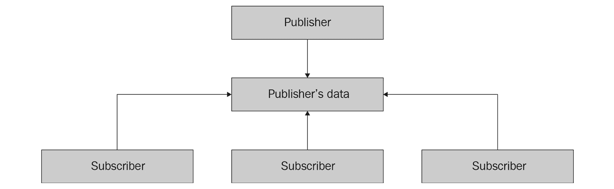
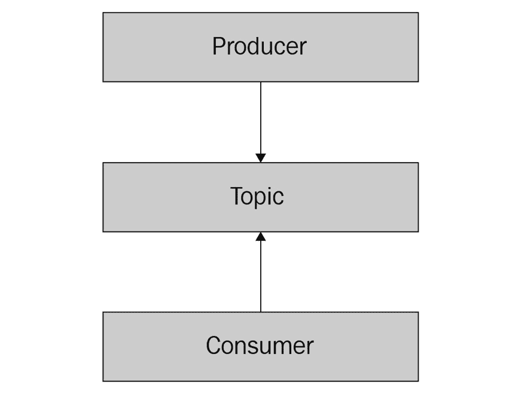
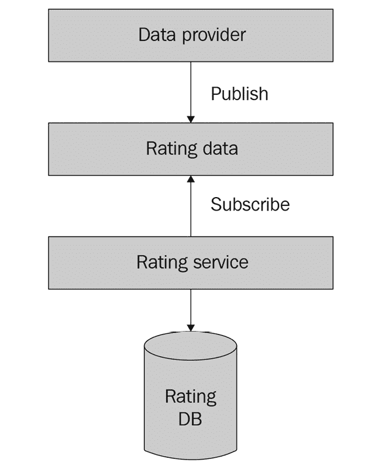
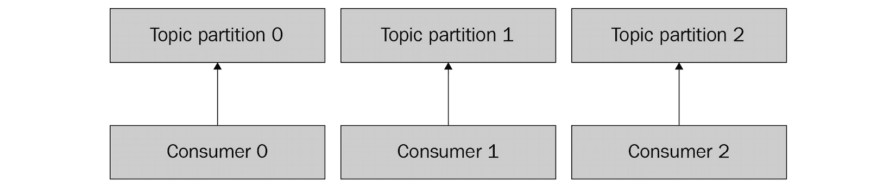

# 异步通信

在上一章中，我们展示了服务如何使用同步请求-响应模型相互通信。还有其他通信模型可以为应用开发者提供各种好处，例如异步通信，我们将在本章中介绍。

在本章中，您将学习异步通信的基础和一些使用它的常见技术，以及它给微服务开发者带来的好处和挑战。我们将介绍一种流行的异步通信软件 Apache Kafka，并说明如何使用它来建立微服务之间的通信。

在本章中，我们将涵盖以下主题：

+   异步通信基础

+   使用 Apache Kafka 进行消息传递

+   异步通信的最佳实践

让我们继续探讨异步通信的基础。

# 技术要求

为了完成本章，您需要 Go 1.11 或更高版本，类似于前几章。

您可以在此处找到本章的 GitHub 代码：[`github.com/PacktPublishing/microservices-with-go/tree/main/Chapter06`](https://github.com/PacktPublishing/microservices-with-go/tree/main/Chapter06)

# 异步通信基础

在本节中，我们将讨论异步通信的一些理论方面。您将了解异步通信模型的好处和常见问题，以及常见的使用方式，以及一些异步通信的实例。

异步通信是发送者和一个或多个接收者之间的通信，其中发送者并不一定期望立即收到对他们的消息的回复。在我们在*第五章*中讨论的同步通信模型中，发送请求的调用者会期望立即（或几乎是立即，考虑到网络延迟）收到对请求的响应。在异步通信中，接收者对请求的回复可能需要任意长的时间，或者根本不回复（例如，在收到无回复通知时）。

我们可以通过两个例子来说明这两种模型之间的区别。同步通信的一个例子是电话通话——两个进行电话交谈的人直接并且立即相互通信，并且他们期望实时听到对方的回复。异步通信的一个例子是给人们发送邮件。回复这样的邮件可能需要时间，发送者并不期望立即收到对他们的消息的回复。

然而，这并不意味着异步通信必然比同步模型慢。在大多数情况下，异步处理与同步处理一样快，有时甚至更快：异步处理通常中断较少，导致更高的处理效率。这就像逐个回复 10 封电子邮件，而不是在 10 个并行电话之间切换——后者是同步处理的例子，有时可能因为上下文切换和频繁的中断而变得非常慢。

## 异步通信的优缺点

异步通信模型有其自身的优点和挑战。开发者需要考虑这两者，以便决定是否使用这种模型。使用异步通信有哪些好处？让我们来了解一下：

+   第一个好处是处理消息的更流畅的方法。想象一下，你有一个服务，其目的是处理数据并向另一个服务报告状态。报告服务不需要等待它所报告的服务返回任何响应，就像在同步模型中那样。在异步模式下，它只需要确认状态消息已成功发送。这就像给亲戚寄大量的明信片——如果你寄了十几张明信片，你不想在寄下一张之前等待每张明信片送达！

+   异步通信模型的第二个好处是能够解耦请求的发送和处理。想象一下，一个呼叫者请求下载一个大视频，而远程服务器需要执行这样的任务。在同步模型中，呼叫者将实时等待整个视频处理完毕。这可能会花费几分钟甚至几个小时，使得这种等待非常低效。相反，这样的任务可以通过异步方式执行，其中呼叫者将任务发送到服务器，收到任务已接收的确认，然后执行任何其他活动，直到最终收到完成通知（或处理失败通知）。

+   异步通信的第三个好处是更好的负载均衡。某些应用程序可能存在不均匀的请求负载，并且容易发生请求的突然激增。如果通信是同步的，服务器需要实时回答每个请求，这很容易导致服务器过载。想象一下，一位餐厅服务员接到一千份晚餐订单——如此高的请求量将完全压垮工作人员，并影响客户。

我们刚才描述的好处相当显著，在许多情况下，异步通信是执行某些类型任务或提供更好系统性能的唯一方式。以下是一些适合异步通信的问题示例：

+   **长时间运行的处理任务**：长时间运行的任务，如视频处理，通常更适合异步执行。请求此类处理的调用者不一定需要等待其完成，最终会收到最终结果的通知。

+   **一次发送，由多个组件处理**：某些类型的消息，如状态报告，可以由多个独立组件处理。想象一个系统，其中多个员工需要接收相同的信息——而不是独立地给每个人发送，消息可以发布到一个可以被所有感兴趣的人消费的组件。

+   **高性能顺序处理**：某些类型的操作在顺序执行和/或批量执行时更为高效。例如，某些操作，如对硬盘的写入，通常在顺序执行时性能更佳（例如，顺序写入一个非常大的文件，没有任何中断）。在这种情况下，与更互动和中断的同步通信相比，异步处理提供了巨大的性能提升，因为请求的接收者可以控制处理速度并依次处理任务。

虽然异步通信的描述性好处可能看起来很有吸引力，但重要的是要注意，它通常会给开发者带来一些难以克服的挑战：

+   **更复杂的错误处理**：想象一下你给朋友发了一条消息，但没有收到回复。这是否是因为朋友没有收到消息？在这段时间内是否发生了什么？回复是否丢失了？在同步通信，例如电话通话中，我们会立即知道朋友是否可用，并且能够回拨。在异步场景中，我们需要考虑更多可能的问题，例如我们之前描述的那些。

+   **依赖额外的组件进行消息传递**：某些异步通信用例，如下一节中描述的发布-订阅或消息代理模型，需要额外的软件来传递消息。此类软件通常执行额外的操作，如消息批处理和存储，以换取它提供的额外功能，从而给系统带来额外的复杂性。

+   **异步数据流对许多开发者来说可能看起来不直观，并且更复杂**：与同步请求-响应模型不同，其中每个请求在逻辑上都会跟随一个响应，异步通信可能是**单向的**（根本不会收到任何响应）或者可能需要调用者执行额外的步骤以接收响应（例如，当响应作为单独的通知发送时）。因此，异步系统中的数据流可能比同步请求-响应交互更复杂。

现在，让我们来探讨一些可以帮助您组织服务和在它们之间建立异步通信的异步通信技术和模式。

## 异步通信的技术和模式

有各种技术可以帮助在各种场景中使多个服务之间的异步交互更高效，例如向多个收件人发送消息。在本节中，我们将描述多个有助于促进此类交互的模式。

### 消息代理

**消息代理**是通信链中的一个中介组件，可以扮演多个角色：

+   **消息投递**：它执行将消息投递给一个或多个接收者的操作。

+   **消息转换**：它将传入的消息转换成可以被接收者稍后消费的另一种格式。

+   **消息聚合**：它将多个消息聚合为一个，以实现更高效的投递或处理。

+   **消息路由**：它根据预定义的规则将传入的消息路由到适当的目的地。

当你给你的朋友或亲戚寄明信片时，邮局扮演了消息代理的角色，在将其投递到目的地时起到中介作用。在这个例子中，使用消息代理的主要好处是发送消息（在我们的例子中是明信片）的便利性，无需考虑如何投递。使用消息代理的另一个好处是投递保证。消息代理可以提供各种级别的投递保证。以下是一些保证的例子：

+   **至少一次**：消息至少被投递一次，但在出现故障的情况下可能会被多次投递。

+   **精确一次**：消息代理保证消息被投递，并且它将恰好被投递一次。

+   **至多一次**：消息可以被投递 0 次或 1 次。

在实践中，精确一次保证通常比至少一次和至多一次更难实现。在至少一次模型中，消息代理在出现任何故障（例如突然断电或重启）的情况下可以重新发送消息。在精确一次模型中，消息代理需要执行额外的检查或存储额外的元数据，以确保在任何可能的情况下消息都不会被重新发送给接收者。

消息代理的另一种分类是基于它们丢失消息的可能性：

+   **损失性**：偶尔（例如，在出现故障的情况下）会丢失消息的消息代理

+   **无损**：提供不丢失任何消息保证的消息代理

至多一次保证是损失性消息代理的一个例子，而至少一次和精确一次代理是无损性代理的例子。损失性消息代理比无损性代理更快，因为它们不需要处理额外的逻辑来保证消息的投递，例如持久化消息。

### 发布-订阅模型

**发布-订阅模型**是多组件（如微服务）之间通信的模型，其中每个组件都可以发布消息并订阅相关的消息。

以 Twitter 为例。任何用户都可以向他们的动态发布消息，其他用户可以订阅它们。同样，微服务可以通过发布其他服务可以消费的数据来进行通信。想象一下，我们有一组处理各种类型用户数据的微服务，例如用户照片、视频和文本消息。如果用户删除了他们的个人资料，我们需要通知所有服务。而不是逐个通知每个服务，我们可以发布一个事件，表明用户个人资料已被删除，所有服务都可以消费它并执行任何相关的操作，例如存档用户数据。

发布者、订阅者以及发布者产生的数据之间的关系在以下图中展示：



图 6.1 – 发布-订阅模型

发布-订阅模型为在消息可以被多个组件处理的环境中发送和传递数据提供了一个灵活的解决方案。每个发布者可以发布他们的消息，而不必关心交付过程以及将消息发送到任意数量（甚至是非常大的数量）的接收者可能遇到的任何困难。每个订阅者可以订阅相关的消息并接收它们，而不需要直接联系发布者并检查是否有任何新的数据可以消费。后一个特性对于消息率较低的场景特别有用，例如偶尔的通知交付。

现在，我们已经介绍了一些高级异步通信模型，接下来让我们转向本章的实际部分，并说明如何在您的微服务中实现异步通信。

## 使用 Apache Kafka 进行消息传递

在本节中，我们将向您介绍 Apache Kafka，这是一个流行的消息代理系统，我们将使用它来在我们的微服务之间建立异步通信。您将学习 Kafka 的基础知识，如何向其发布消息，以及如何从我们在前几章中创建的微服务中消费这些消息。

### Apache Kafka 基础

Apache Kafka 是一个开源的消息代理系统，它提供了发布和订阅包含任意数据的消息的能力。最初在 LinkedIn 开发，Kafka 已经成为可能最受欢迎的开源消息代理软件，并被全球成千上万家公司使用。

在 Kafka 模型中，一个发布消息的组件被称为**生产者**。消息按照顺序发布到称为**主题**的对象中。每个主题中的消息都有一个唯一的数值**偏移量**。Kafka 为现有主题提供了消费消息的 API（消费消息的组件称为**消费者**）。主题也可以分区，以便多个消费者从中消费（例如，用于并行数据处理）。

我们可以在以下图中说明 Kafka 数据模型：



图 6.2 – Apache Kafka 数据模型

虽然数据模型看似简单，但 Kafka 是一个强大的系统，为用户提供了许多好处：

+   **高读写吞吐量**：Kafka 针对高性能的读写操作进行了优化。它通过尽可能多地执行顺序读写来实现这一点，从而使其能够有效地利用硬盘驱动器等硬件，以及顺序发送大量数据到网络上。

+   **可伸缩性**：开发者可以利用 Kafka 提供的主题分区来实现数据的高效并行处理。

+   **灵活的持久性**：Kafka 允许用户配置存储数据的策略，例如消息保留。消息可以存储固定的时间（例如，7 天）或无限期地，直到数据存储空间足够。

注意

虽然 Kafka 为开发者提供了许多好处，但重要的是要注意，它是一个相当复杂的基础设施组件，可能难以管理和维护。在本章中，我们将为了说明目的使用它，特别是考虑到它在开发者社区中的广泛采用和流行。在本章中，我们将通过使用其 Docker 版本来避免设置 Kafka 集群的困难，但对于生产用例，你可能需要熟悉可用的相关 Kafka 维护文档，可在[`kafka.apache.org/documentation/`](https://kafka.apache.org/documentation/)找到。

让我们探索如何利用 Kafka 为我们之前章节中开发的微服务提供的优势。

## 在我们的微服务中采用 Kafka

让我们回到前几章中的评分服务示例。该服务提供了一个同步 API 用于插入评分记录，允许调用者调用端点并立即从服务中获得响应。这样的 API 在许多实际用例中都很有用，包括用户从用户界面或网页表单提交评分的情况。

现在考虑一个场景，其中我们与一个经常发布评分记录（例如，来自流行的电影数据库，如 IMDb 的电影评分）的数据提供者合作，我们可以在我们的评分服务中使用这些记录。在这里，我们需要消费此类记录并将它们摄入到我们的系统中，以便我们可以使用这些数据，以及通过我们的 API 创建的数据。我们在本章前面描述的发布-订阅模型非常适合这个用例 – 发布者将是提供评分数据的数据提供者，而订阅者将是我们的应用程序的一部分（例如，评分服务），它将消费数据。

我们可以使用以下图表来说明所描述的模型：



](img/Figure_6.3_B18865.jpg)

图 6.3 – 从数据提供者处获取评分的发布-订阅模型

数据提供者和评分服务之间的交互模型是异步通信的一个完美示例 – 评分服务不一定要立即处理提供者的数据。何时以及如何消费这些数据取决于我们 – 我们的评分服务可以定期（例如，每小时一次，或每天一次）执行此操作，或者在新评分数据发布时立即处理新评分数据。让我们在本章中选择第二种方法。

我们模型中唯一缺少的部分是允许我们从数据提供者发布评分数据并从我们的评分服务订阅它的组件。我们之前描述的 Apache Kafka 对于这个用例非常合适 – 它提供了一个高性能、可扩展且持久的解决方案，用于生产和消费任意数据，使我们能够将其用作评分数据消息代理。

为了说明我们刚刚描述的模型，让我们实现以下逻辑：

+   一个新的示例应用程序，将为 Apache Kafka 生成评分数据

+   评分服务中用于从 Apache Kafka 消费评分数据并将其保存到我们的评分数据库的逻辑

在我们继续实现这两个组件之前，我们需要决定在它们之间使用哪种数据序列化格式。为了简单起见，让我们假设数据提供者以 JSON 格式提供评分数据。提供的评分数据的一个示例如下：

```go
[{"userId":"105","recordId":"1","recordType":1,"value":5,"providerId":"test-provider","eventType":"put"},{"userId":"105","recordId":"2","recordType":1,"value":4,"providerId":"test-provider","eventType":"put"}]
```

让我们定义一个用于此类评分记录的 Go 结构。在 `src/rating/pkg/model/rating.go` 文件中，添加以下代码：

```go
// RatingEvent defines an event containing rating information.
type RatingEvent struct {
    UserID     UserID      `json:"userId"`
    RecordID   RecordID    `json:"recordId"`
    RecordType RecordType  `json:"recordType"`
    Value      RatingValue `json:"value"`
    EventType  RatingEventType `json:"eventType"`
}
// RatingEventType defines the type of a rating event.
type RatingEventType string
// Rating event types.
const (
    RatingEventTypePut    = "put"
    RatingEventTypeDelete = "delete"
)
```

现在，让我们实现一个示例应用程序，该应用程序从提供的文件中读取评分数据并将其输出到 Kafka。创建一个 `cmd/ratingingester` 目录并添加一个 `main.go` 文件，包含以下代码：

```go
package main

import (
    "encoding/json"
    "fmt"
    "os"
    "time"

    "github.com/confluentinc/confluent-kafka-go/kafka"
    "movieexample.com/rating/pkg/model"
)

func main() {
    fmt.Println("Creating a Kafka producer")

    producer, err := kafka.NewProducer(&kafka.ConfigMap{"bootstrap.servers": "localhost"})
    if err != nil {
        panic(err)
    }
    defer producer.Close()

    const fileName = "ratingsdata.json"
    fmt.Println("Reading rating events from file " + fileName)

    ratingEvents, err := readRatingEvents(fileName)
    if err != nil {
        panic(err)
    }

    const topic = "ratings"
    if err := produceRatingEvents(topic, producer, ratingEvents); err != nil {
        panic(err)
    }

    const timeout = 10 * time.Second
    fmt.Println("Waiting " + timeout.String() + " until all events get produced")

    producer.Flush(int(timeout.Milliseconds()))
}
```

在我们刚刚添加的代码中，我们通过调用`kafka.NewProducer`初始化了一个 Kafka 生产者，从文件中读取评分数据，并在 Kafka 中生产包含评分数据的评分事件。请注意，我们导入了`github.com/confluentinc/confluent-kafka-go` Kafka 库——由 Kafka 的创始人创立的公司 Confluent 制作的 Kafka 客户端。对于 Go，有多个流行的开源 Kafka 库，包括`github.com/Shopify/sarama`，它维护良好，并被广泛用于许多 Go 项目中。你可以根据你的偏好在你的项目中使用任一库。

现在，让我们为刚刚创建的文件添加一个用于读取评分事件的函数：

```go
func readRatingEvents(fileName string) ([]model.RatingEvent, error) {
    f, err := os.Open(fileName)
    if err != nil {
        return nil, err
    }
    defer f.Close()
    var ratings []model.RatingEvent
    if err := json.NewDecoder(f).Decode(&ratings); err != nil {
        return nil, err
    }
    return ratings, nil
}
```

最后，添加一个用于生产评分事件的函数：

```go
func produceRatingEvents(topic string, producer kafka.Producer, events []model.RatingEvent) error {
    for _, ratingEvent := range ratingEvents {
        encodedEvent, err := json.Marshal(ratingEvent)
    if err != nil {
        return err
    }

    if err := p.Produce(&kafka.Message{
TopicPartition: kafka.TopicPartition{Topic: &topic, Partition: kafka.PartitionAny},
Value:          []byte(encodedEvent),
}, nil); err != nil {
        return err
    }
    return nil
}
```

让我们描述一下我们刚刚编写的代码的一些部分：

+   我们通过调用`kafka.NewProducer`函数并使用`localhost`作为本地测试的 Kafka 地址来创建了一个 Kafka 生产者。

+   我们创建的程序预期将从`ratingsdata.json`文件中读取评分数据。

+   当我们使用`Produce`函数向 Kafka 生产事件时，我们使用`kafka.TopicPartition`结构指定一个主题分区。在这个结构中，我们提供了主题名称（在我们的例子中，我们称之为`ratings`）和主题分区（在我们的例子中，我们使用`kafka.PartitionAny`来生产一个分区——我们将在后面的*异步通信最佳实践*部分中介绍这部分）。

+   在我们主函数的末尾，我们调用`Flush`函数以确保所有消息都已发送到 Kafka。

我们刚刚创建的函数正在使用`github.com/confluentinc/confluent-kafka-go/kafka`库，我们需要将其包含在我们的 Go 模块中。让我们通过运行以下代码来完成此操作：

```go
go mod tidy
```

让我们也在该目录中添加一个包含评分事件的文件。在刚刚使用的目录中创建一个`ratingsdata.json`文件，内容如下：

```go
[{"userId":"105","recordId":"1","recordType":1,"value":5,"providerId":"test-provider","eventType":"put"},{"userId":"105","recordId":"2","recordType":1,"value":4,"providerId":"test-provider","eventType":"put"}]
```

现在，我们的应用程序已经准备好了。我们已经实现了从文件中读取评分数据并将其发布到 Apache Kafka 的逻辑，以便评分服务进一步消费。让我们在评分服务中实现消费已发布数据的逻辑。创建一个`rating/internal/ingester/kafka`目录，并添加一个`ingester.go`文件，内容如下：

```go
package kafka

import (
    "context"
    "encoding/json"
    "fmt"
    "rating/pkg/model"

    "github.com/confluentinc/confluent-kafka-go/kafka"
    "movieexample.com/rating/pkg/model"
)

// Ingester defines a Kafka ingester.
type Ingester struct {
    consumer kafka.Consumer
    topic    string
}

// NewIngester creates a new Kafka ingester.
func NewIngester(addr string, groupID string, topic string) (*Ingester, error) {
    consumer, err := kafka.NewConsumer(&kafka.ConfigMap{
        "bootstrap.servers": addr,
        "group.id":          groupID,
        "auto.offset.reset": "earliest",
    })
    if err != nil {
        return nil, err
    }
    return &Ingester{consumer, topic}, nil
}
```

此外，添加以下代码段：

```go
// Ingest starts ingestion from Kafka and returns a channel // containing rating events
// representing the data consumed from the topic.
func (i *Ingester) Ingest(ctx context.Context) (chan model.RatingEvent, error) {
    if err := i.consumer.SubscribeTopics([]string{i.topic}, nil); err != nil {
        return nil, err
    }

    ch := make(chan model.RatingEvent, 1)
    go func() {
        for {
            select {
            case <-ctx.Done():
                close(ch)
                i.consumer.Close()
            default:
        }
        msg, err := i.consumer.ReadMessage(-1)
        if err != nil {
            fmt.Println("Consumer error: " + err.Error())
            continue
        }
        var event model.RatingEvent
        if err := json.Unmarshal(msg.Value, &event); err != nil { 
            fmt.Println("Unmarshal error: " + err.Error())
            continue
        }
        ch <- event
        }
    }()
    return ch, nil
}
```

在我们刚刚创建的代码中，我们实现了一个`NewIngester`函数来创建一个新的 Kafka ingester，该组件将从其中摄取评分事件。`Ingest`函数在后台启动消息摄取并返回一个包含`RatingEvent`结构的 Go 通道。

你可能会注意到，在我们的`ReadMessage`函数调用中，我们提供了`-1`作为参数。我们指定的`-1`是 Kafka 特有的，意味着我们将始终从主题的开始处消费，读取所有现有消息。

让我们在我们的评分服务控制器中使用这个结构。在我们的`rating/internal/controller/controller.go`文件中，添加以下代码：

```go
type ratingIngester interface {
    Ingest(ctx context.Context) (chan model.RatingEvent, error)
} 
// StartIngestion starts the ingestion of rating events.
func (s *RatingService) StartIngestion(ctx context.Context) error {
    ch, err := s.ingester.Ingest(ctx)
    if err != nil {
        return err
    }
    for e := range ch {
        if err := s.PutRating(ctx, e.RecordID, e.RecordType, &model.Rating{UserID: e.UserID, Value: e.Value}); err != nil {
            return err
        }
    }
    return nil
}
```

在我们的代码中，我们调用`Ingest`函数，并返回一个包含来自主题的评分事件的 Go 通道。我们使用`for`运算符遍历它。它将一直返回可用的评分事件，直到通道关闭（例如，当服务关闭时 Kafka 客户端关闭）。

现在，更新此文件中现有的`RatingService`结构和`New`函数，如下所示：

```go
// RatingService encapsulates the rating service business 
// logic.
type RatingService struct {
    repo     ratingRepository
    ingester ratingIngester
}

// New creates a rating service.
func New(repo ratingRepository, ingester ratingIngester) *RatingService {
    return &RatingService{repo, ingester}
}
```

现在，我们的评分服务能够异步消费来自 Kafka 的评分事件，并为每个事件执行`Put`函数，将其写入评分数据库。在此阶段，评分服务为希望实时创建评分的调用者提供同步 API，并为从 Apache Kafka 摄取评分事件提供异步逻辑。

我们已经介绍了异步通信的基础知识，并展示了如何在我们的微服务中使用它。现在，让我们继续本章的最后一部分，看看在使用此模型时应牢记的一些最佳实践。

# 异步通信最佳实践

在本节中，我们将介绍使用异步通信模型的最佳实践。您将了解一些针对在您的应用程序中采用该模型和使用它的建议，以最大限度地发挥其为您带来的好处。

## 版本控制

**版本控制**是将数据格式（或模式）与其版本关联的技术。想象一下，您正在开发一个评分服务，并使用发布者-订阅模型来生产和使用评分事件。如果在某个时刻，您的评分事件格式发生变化，一些已经生产的事件将具有旧的数据格式，而一些将具有新的格式。这种情况可能很难处理，因为消费此类数据的逻辑需要知道如何区分这些格式以及如何处理每个格式。在不了解数据模式或其版本的情况下区分两种格式可能是一项非平凡的任务。想象一下，我们有两个 JSON 事件：

```go
{"recordID": "1", "rating": 5}
{"recordID": "2", "rating": 17, "userId": "alex"}
```

第二个事件有一个不在第一个事件中存在的`userId`字段。这是否是因为生产者没有提供它，或者因为数据格式之前没有这个字段？

明确提供模式版本将帮助数据消费者处理这个问题。考虑以下更新后的示例：

```go
{"recordID": "1", "rating": 5, "version": 1}
{"recordID": "2", "rating": 17, "userId": "alex", "version": 2}
```

在这些示例中，我们知道事件的版本，现在可以单独处理每个事件。例如，我们可能完全忽略某个版本的某些事件（假设存在应用程序错误，我们希望用更新的版本重新处理事件）或使用特定版本的验证（例如，对于版本 1 允许没有`userId`字段的记录，但对于更高版本则不允许）。

版本控制对于可以随时间演变的系统非常重要，因为它使得处理不同的数据格式变得更容易。即使您不期望您的数据格式发生变化，也请考虑使用版本控制来提高您系统未来的可维护性。

## 利用分区

在“采用 Apache Kafka 为我们的微服务”部分的代码示例中，我们实现了将我们的数据生产到 Apache Kafka 消息主题的逻辑。生产消息的函数如下：

```go
if err := p.Produce(&kafka.Message{
TopicPartition: kafka.TopicPartition{Topic: &topic, Partition: kafka.PartitionAny},
Value:          []byte(encodedEvent),
}, nil); err != nil {
    return err
}
```

在这个函数中，我们使用了 `kafka.PartitionAny` 选项。正如我们在“Apache Kafka 基础”部分中提到的，Kafka 主题可以被分区，以便多个消费者可以消费主题的不同分区。想象一下，你有一个包含三个分区的主题 – 你可以独立地消费每一个，如下面的图示所示：



图 6.4 – 分区主题消费示例

你可以控制主题分区的数量，以及你服务产生的每个消息的分区。手动设置分区可能有助于你实现**数据本地性** — 将各种记录的数据存储在一起的能力（在我们的用例中，在同一个主题分区中）。例如，你可以使用用户标识符来分区数据，确保任何用户的数据都存储在单个主题分区中，这有助于你简化跨主题分区的数据搜索。

我们刚才描述的最佳实践列表并不全面。它并没有涵盖在微服务中使用异步通信的所有建议，但它提供了一些你应该考虑的极好想法。熟悉“进一步阅读”部分中列出的文章，以获取更多想法和建议。

# 摘要

在本章中，我们介绍了异步通信的基础，并说明了如何在微服务中使用它。你学习了异步通信的好处以及常见的模式，如发布-订阅和消息代理。除此之外，我们还介绍了 Apache Kafka 消息代理的基础，并说明了如何在我们的微服务中使用它以及如何实现从它生产和使用数据的逻辑。

在下一章中，我们将介绍微服务开发中的另一个重要主题 – 数据存储。你将学习如何持久化和读取不同类型的服务数据，以及如何在你的 Go 微服务中实现与 MySQL 数据库交互的逻辑。

# 进一步阅读

+   *Apache Kafka 文档*: [`kafka.apache.org/documentation/`](https://kafka.apache.org/documentation/)

+   *发布-订阅模式*: [`en.wikipedia.org/wiki/Publish%E2%80%93subscribe_pattern`](https://en.wikipedia.org/wiki/Publish%E2%80%93subscribe_pattern)

+   *异步消息通信*: [`docs.microsoft.com/en-us/dotnet/architecture/microservices/architect-microservice-container-applications/asynchronous-message-based-communication`](https://docs.microsoft.com/en-us/dotnet/architecture/microservices/architect-microservice-container-applications/asynchronous-message-based-communication )
