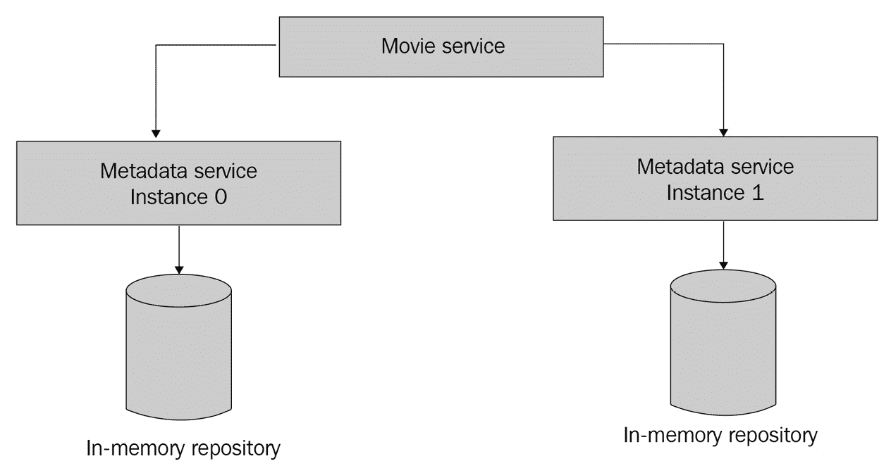
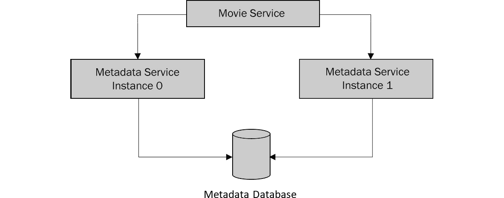

# 存储服务数据

在本章中，我们将回顾一个非常重要的主题：在持久数据库中存储服务数据。在前几章中，我们使用内存存储库存储和检索电影元数据和用户评分。虽然实现内存存储数据很容易，但由于许多原因，使用它们将是不切实际的。其中一个原因是缺乏持久性保证：如果存储数据的我们的服务实例重启（例如，由于应用程序故障或主机重启），我们就会丢失存储在先前运行的实例内存中的所有数据。为了确保我们的数据不会随时间丢失，我们需要一个可以持久化我们的数据并允许我们在微服务中读取和写入它的解决方案。此类解决方案中包括数据库，我们将在本章中对其进行回顾。

我们将涵盖以下主题：

+   数据库简介

+   使用 MySQL 存储我们的服务数据

让我们继续本章的第一部分，它将概述微服务持久存储解决方案。

# 技术要求

为了完成本章，你需要 Go 1.11 或更高版本。此外，你还需要以下工具：

+   **Docker**: https://www.docker.com

+   **grpcurl**: [`github.com/fullstorydev/grpcurl`](https://github.com/fullstorydev/grpcurl)

你可以在这里找到本章的 GitHub 代码：https://github.com/PacktPublishing/microservices-with-go/tree/main/Chapter07。

# 数据库简介

**数据库**是允许我们存储和检索不同类型数据的系统。数据库提供了与数据存储相关的各种保证，例如**持久性** – 一个保证所有记录以及任何相关的数据更改都将随时间持久化的保证。持久性保证有助于确保存储在数据库中的数据在软件和硬件重启等事件中不会丢失，这对于微服务来说相当常见。

数据库有助于解决与数据存储相关的许多其他问题。让我们用一个我们创建在*第二章*中的元数据服务来说明这样一个问题。在我们的元数据服务代码中，我们实现了一个内存存储库来存储和检索电影数据，它提供了两个函数，`Get`和`Put`。如果我们只有一个元数据服务实例，所有调用者都能够成功从服务内存中写入和读取元数据记录，只要服务实例不重启。然而，让我们想象一下，我们添加了另一个元数据服务实例，如下面的图所示：



图 7.1 – 电影服务与两个元数据服务实例之间的交互

假设电影服务想要写入电影元数据，并调用元数据服务来完成此操作。电影服务实例会选择一个元数据服务的实例（让我们假设它选择了实例 0）并向其发送一个写入请求，将记录存储在处理请求的实例的内存中。

现在，让我们假设电影服务想要读取之前存储的电影元数据，并向元数据服务发送一个读取请求。根据处理请求的实例，可能会有两种可能的后果：

+   **实例 0**：成功返回之前保存的电影元数据

+   `ErrNotFound`

我们刚刚展示了在元数据仓库的两个实例之间数据不一致的情况。因为我们没有在我们的内存元数据仓库之间实现任何协调，每个仓库都作为一个独立的数据存储。以这种方式使用我们的元数据服务将非常不切实际：每个新添加的服务实例都会存储一个完全独立的数据集。

为了解决我们的数据不一致问题，我们可以使用数据库来存储电影元数据：数据库将处理来自所有可用元数据服务实例的所有写入和读取操作，帮助将它们的数据集中存储在单一类型的逻辑存储中。以下图示了这种情况：



图 7.2 – 在多个实例间使用共享元数据数据库

在我们的图中，多个元数据服务的实例正在使用一个共享数据库。这有助于我们聚合和存储来自不同元数据服务实例的数据。

我们刚刚展示了数据库如何帮助为我们的服务提供数据持久性。这还可以提供其他好处：

+   **事务支持**：许多数据库支持事务 – 数据变更的类型 – 它们具有以下属性，简称为 **ACID**：

    +   **原子性**：一个变更要么完全发生，要么完全不发生

    +   **一致性**：一个变更将数据库从一个有效状态带到另一个有效状态

    +   **隔离性**：并发变更按顺序执行

    +   **持久性**：所有变更都会被持久化

这些事务属性帮助提供了一种可靠的方式来修改不同类型的数据（例如，同时更新两个财务账户余额）。

+   **数据复制**：数据库可以提供数据复制 – 将数据复制到额外的实例，称为 **副本**。复制可以帮助使数据库对数据丢失更具弹性（例如，当数据库主机不可用时，可以在其副本上访问数据）并减少读取延迟（例如，当用户从位于更近处的副本读取数据时）。

+   **额外的查询功能**：有许多数据库（如 MySQL 和 PostgreSQL），提供对不同的查询语言的支持，例如 SQL ([`en.wikipedia.org/wiki/SQL`](https://en.wikipedia.org/wiki/SQL))).

不同类型的数据库可以帮助您高效地存储和检索各种类型的数据。让我们回顾一些这些流行的数据库类型：

+   **键值数据库**：这些数据库以键值格式存储数据，其中每条记录包含一个键（例如，用户标识符）和一个值（例如，用户元数据）。键和值通常表示为字符串或字节数组。键值数据库提供的操作通常限于基于键的写入（为提供的键存储值）和基于键的读取（为提供的键读取值）。由于它们的函数简单性，键值数据库在性能方面表现优异，因为它们不涉及任何复杂的数据处理或索引。

+   **关系数据库**：这些数据库将数据存储为表的集合，每个表由一组行和列组成。用户可以运行 SQL 查询从单个或多个表中检索数据，能够将它们之间的数据进行连接或根据各种条件执行复杂搜索。历史上，由于它们能够执行任何复杂度的查询以及存储各种类型的结构化数据（具有将行数据映射到表列的明确模式），关系数据库在所有数据库类型中一直是最受欢迎的。

+   **文档数据库**：这些数据库以文档格式存储数据，例如 JSON 或 XML。文档数据库不需要您定义数据模式，因此非常适合存储各种不同结构的文档（例如，包含来自多个网站、不同格式的电影元数据的 YAML 文件集合）。

+   **图数据库**：这些数据库以*顶点*的形式存储信息——具有不同属性的对象（例如，用户详细信息），以及*边*——顶点之间的关系（例如，如果用户 A 正在关注用户 B）。图数据库在提供的读取查询类型方面与关系数据库不同：大多数图数据库支持*遍历*查询（检查图中的每个顶点）、*连通性*查询（获取与目标顶点相连的所有顶点），以及许多其他查询。

+   **Blob 数据库**：这些数据库用于存储*Blob*（二进制大对象）数据，例如音频或视频文件。Blob 记录通常是不可变的（在成功写入后其内容不会改变），因此 Blob 数据库非常适合于*追加写入*（例如写入新文件），以及 Blob 读取（例如检索大文件的内容）。

我们不会深入探讨各种数据库类型，因为这是一个单独书籍的主题，但重要的是要注意，在它们中并没有一个 **万能** 的解决方案，每个数据库都提供一组独特的功能，这些功能可以用于解决特定问题。例如，如果你的服务唯一目的是存储文件，使用 blob 数据库就足够了，而图数据库可以帮助构建社交网络以存储用户关系数据。然而，许多用例可以使用关系模型来建模，该模型是关系数据库的基石：自 1970 年由 E.F. Codd 提出，它已在软件开发行业中用于几乎所有类型的问题。流行的关系型数据库，如 MySQL 和 PostgreSQL，仍然是使用最广泛的软件解决方案，帮助构建各种类型的应用程序，从小型单主机运行的服务到跨越数十万个主机的超大规模集群。由于流行关系型数据库的广泛采用和成熟，许多公司将它们作为存储各种类型数据的标准方式。我们将展示如何使用流行的关系型数据库：MySQL 来存储我们的微服务数据。

# 使用 MySQL 存储我们的服务数据

在本节中，我们将简要介绍 MySQL 并演示如何从我们在前几章中创建的微服务中写入和读取数据。

MySQL 是一个开源的关系型数据库，它于 1995 年创建，根据 DB-Engines 排名（[`db-engines.com/en/ranking`](https://db-engines.com/en/ranking)），自那时起已成为开发行业中最常用的数据库之一。它将数据存储为一系列表，每个表由预定义类型的行和列组成（例如字符串、数值、二进制等），并允许通过 SQL 查询来访问数据。例如，假设你有以下数据，存储在一个名为 **movies** 的表中：

| id | title | director |
| --- | --- | --- |
| 922 | New York Stories | John Jones |
| 1055 | Christmas Day | Ben Miles |
| 1057 | Sunny Weather 3 | Ben Miles |

表 7.1 – 电影表示例

要获取由特定导演拍摄的所有电影的 SQL 查询如下所示：

```go
SELECT * FROM movies WHERE director = "Ben Miles"
```

现在，让我们假设在同一个名为 **ratings** 的数据库中包含以下数据：

| record_id | record_type | user_id | rating |
| --- | --- | --- | --- |
| 1055 | movie | alex001 | 5 |
| 1055 | movie | chris.rocks | 3 |
| 1057 | movie | alex001 | 4 |

表 7.2 – 评分表示例

使用 SQL 语言，我们可以编写一个更复杂的查询来获取与特定导演的电影相关的所有评分：

```go
SELECT * FROM ratings r INNER JOIN movies m ON r.record_id = m.id WHERE r.record_type = "movie" AND m.director = "Ben Miles"
```

在我们的 SQL 查询中，我们执行了两个表的 **连接** 操作 – 这是一个允许我们将两个表中的数据分组并执行额外过滤（在我们的情况下，我们只选择 **record_type** 列的值等于 *movie* 且 **director** 列的值等于 *Ben Miles* 的评分事件）的操作。

为了演示如何使用 MySQL 存储我们的服务数据，让我们定义我们想要存储的数据以及我们想要如何访问它。让我们从元数据服务开始，它执行两个数据存储操作：

+   为给定电影 ID 存储电影元数据

+   获取给定电影 ID 的电影元数据

现在，让我们回顾电影元数据对象的数据模式。我们的电影元数据包含以下字段：

+   **ID**: 字符串

+   **标题**: 字符串

+   **描述**: 字符串

+   **导演**: 字符串

现在，让我们看看评分服务存储了哪些数据，该服务执行以下存储相关操作：

+   存储给定记录（通过记录 ID 及其类型组合标识）的评分

+   获取给定记录的所有评分

让我们回顾评分的数据模式：

+   **用户 ID**: 字符串

+   **记录 ID**: 字符串

+   **记录类型**: 字符串

+   **评分值**: 整数

到目前为止，我们知道我们想在数据库中存储哪些数据，并可以设置我们的数据库。我们将使用一个可以通过执行以下命令运行的 MySQL Docker 版本：

```go
docker run --name movieexample_db -e MYSQL_ROOT_PASSWORD=password -e MYSQL_DATABASE=movieexample -p 3306:3306 -d mysql:latest
```

在我们的命令中，我们将 MySQL root 用户的密码设置为`password`，以便我们可以用于测试。我们还设置了数据库名为`movieexample`，并在端口`3306`上公开，以便我们可以使用它来访问我们的 MySQL 数据库。

让我们验证我们的容器是否成功启动。运行以下命令以查看正在运行的 Docker 容器列表：

```go
docker ps
```

输出应包括一个名为`movieexample_db`的容器，一个`mysql:latest`镜像，以及一个`Up`状态。

下一步是创建我们的数据模式。我们将在`src`目录的单独文件夹中定义它，称为`schema`。创建此目录并在其中创建一个`schema.sql`文件，然后将以下代码添加到新创建的文件中：

```go
CREATE TABLE IF NOT EXISTS movies (id VARCHAR(255), title VARCHAR(255), description TEXT, director VARCHAR(255));
CREATE TABLE IF NOT EXISTS ratings (record_id VARCHAR(255), record_type VARCHAR(255), user_id VARCHAR(255), value INT);
```

在我们的模式文件中，我们定义了两个表，分别称为`movies`和`ratings`。我们刚刚定义的表由`VARCHAR(255)`和`TEXT`列组成。`VARCHAR`是 MySQL 用于存储字符串数据的数据类型，`255`是列值的最大长度。`TEXT`是另一种 MySQL 数据类型，常用于存储长文本记录，因此我们使用它来存储可能包含长文本的电影描述。

现在，让我们连接到我们新配置的数据库并初始化我们的数据模式。在我们的项目`src`目录中运行以下命令：

```go
docker exec -i movieexample_db mysql movieexample -h localhost -P 3306 --protocol=tcp -uroot -ppassword < schema/schema.sql
```

如果一切正常，我们的数据库应该准备好使用。你可以通过运行以下命令来检查表是否已成功创建：

```go
docker exec -i movieexample_db mysql movieexample -h localhost -P 3306 --protocol=tcp -uroot -ppassword -e "SHOW tables"
```

前一个命令的输出应包括我们的两个表：

```go
Tables_in_movieexample
movies
ratings
```

我们已经准备好实现写入和读取它的逻辑。创建一个`metadata/internal/repository/mysql`目录，并向其中添加一个名为`mysql.go`的文件，其内容如下：

```go
package mysql
import (
    "context"
    "database/sql"
    "metadata/pkg/model"
    _ "github.com/go-sql-driver/mysql"
    "movieexample.com/metadata/internal/repository"
    "movieexample.com/metadata/pkg/model"
)
// Repository defines a MySQL-based movie matadata repository.
type Repository struct {
    db *sql.DB
}
// New creates a new MySQL-based repository.
func New() (*Repository, error) {
    db, err := sql.Open("mysql", "root:password@/movieexample")
    if err != nil {
        return nil, err
    }
    return &Repository{db}, nil
}
```

在我们的代码中，我们定义了一个基于 MySQL 的存储库，我们将使用它来存储和检索电影元数据。请注意，我们在导入中添加了以下行：

```go
_ "github.com/go-sql-driver/mysql"
```

我们添加的行在`New`函数中初始化了一个 Go MySQL `root:password@/movieexample`连接 - 这个值被称为**连接字符串**，它包括用户名、密码和要连接的数据库名。连接字符串还可以包括主机名、MySQL 端口和其他值，但因为我们正在使用默认值来访问本地版本的 MySQL，所以我们不需要设置它们。

重要提示

请注意，将数据库凭据存储在代码中是一种不良做法，建议将此类数据（通常称为*机密*)单独存储：例如，作为单独的配置文件。在*第八章*中，我们将回顾如何使用 Go 微服务创建和使用配置文件。

现在，向刚刚创建的文件中添加以下代码：

```go
// Get retrieves movie metadata for by movie id.
func (r *Repository) Get(ctx context.Context, id string) (*model.Metadata, error) {
    var title, description, director string
    row := r.db.QueryRowContext(ctx, "SELECT title, description, director FROM movies WHERE id = ?", id)
    if err := row.Scan(&title, &description, &director); err != nil {
        if err == sql.ErrNoRows {
            return nil, repository.ErrNotFound
        }
        return nil, err
    }
    return &model.Metadata{
        ID:          id,
        Title:       title,
        Description: description,
        Director:    director,
    }, nil
}
// Put adds movie metadata for a given movie id.
func (r *Repository) Put(ctx context.Context, id string, metadata *model.Metadata) error {
    _, err := r.db.ExecContext(ctx, "INSERT INTO movies (id, title, description, director) VALUES (?, ?, ?, ?)",
        id, metadata.Title, metadata.Description, metadata.Director)
    return err
}
```

在我们的代码中，我们实现了`Get`和`Put`函数，以便我们可以从 MySQL 存储和检索电影元数据。在我们的`Get`函数内部，我们使用数据库实例的`QueryRowContext`函数从我们的表中读取一行。如果查询错误，我们检查它是否等于`sql.ErrNoRows`；如果是，我们返回`ErrNotFound`。

现在，让我们实现我们的 MySQL 评分仓库。创建一个`rating/internal/repository/mysql`目录，并向其中添加一个`mysql.go`文件，内容如下：

```go
package mysql
import (
    "context"
    "database/sql"
    "rating/pkg/model"
    _ "github.com/go-sql-driver/mysql"
    "movieexample.com/rating/internal/repository"
    "movieexample.com/rating/pkg/model"
)
// Repository defines a MySQL-based rating repository.
type Repository struct {
    db *sql.DB
}
// New creates a new MySQL-based rating repository.
func New() (*Repository, error) {
    db, err := sql.Open("mysql", "root:password@/movieexample")
    if err != nil {
        return nil, err
    }
    return &Repository{db}, nil
}
```

到目前为止，我们的评分仓库代码与元数据仓库代码相似。在同一个文件中，让我们实现两个函数来读取和写入评分数据：

```go
// Get retrieves all ratings for a given record.
func (r *Repository) Get(ctx context.Context, recordID model.RecordID, recordType model.RecordType) ([]model.Rating, error) {
    rows, err := r.db.QueryContext(ctx, "SELECT user_id, value FROM ratings WHERE record_id = ? AND record_type = ?", recordID, recordType)
    if err != nil {
        return nil, err
    }
    defer rows.Close()
    var res []model.Rating
    for rows.Next() {
        var userID string
        var value int32
        if err := rows.Scan(&userID, &value); err != nil {
            return nil, err
        }
        res = append(res, model.Rating{
            UserID: model.UserID(userID),
            Value:  model.RatingValue(value),
        })
    }
    if len(res) == 0 {
        return nil, repository.ErrNotFound
    }
    return res, nil
}
// Put adds a rating for a given record.
func (r *Repository) Put(ctx context.Context, recordID model.RecordID, recordType model.RecordType, rating *model.Rating) error {
    _, err := r.db.ExecContext(ctx, "INSERT INTO ratings (record_id, record_type, user_id, value) VALUES (?, ?, ?, ?)",
        recordID, recordType, rating.UserID, rating.Value)
    return err
}
```

在我们的`Get`处理程序中，我们使用`Query`函数从我们的表中读取评分行。我们通过调用`rows.Scan`函数扫描每一行，将 MySQL 数据转换为必要的结构。

我们的仓库代码已经准备好了，所以我们可以通过运行以下命令来导入新使用的包`github.com/go-sql-driver/mysql`：

```go
go mod tidy
```

让我们通过手动测试评分仓库来验证我们的逻辑是否正确：

1.  在`rating/cmd/main.go`文件中，将`movieexample.com/rating/internal/repository/memory`导入更改为`movieexample.com/rating/internal/repository/mysql`。

1.  在同一个文件中，找到以下代码块：

```go
repo := memory.New()
```

1.  将其更改为以下内容：

```go
repo := mysql.New()
if err != nil {
    panic(err)
}
```

1.  导航到评分服务的`cmd`目录，并运行以下命令：

```go
go run *.go
```

1.  手动发送一个写入评分的请求：

```go
grpcurl -plaintext -d '{"record_id":"1", "record_type": "movie"}' localhost:8082 RatingService/GetAggregatedRating
```

你应该看到以下信息：

```go
ERROR:
  Code: NotFound
  Message: ratings not found for a record
```

1.  现在，让我们写入一个评分来测试我们的数据库是否正确工作。执行以下命令：

```go
grpcurl -plaintext -d '{"record_id":"1", "record_type": "movie", "user_id": "alex", "rating_value": 5}' localhost:8082 RatingService/PutRating
```

1.  现在，让我们获取同一电影的更新评分。执行与*步骤 4*相同的命令：

```go
grpcurl -plaintext -d '{"record_id":"1", "record_type": "movie"}' localhost:8082 RatingService/GetAggregatedRating
```

1.  你应该得到以下响应：

```go
{
  "ratingValue": 5
}
```

哈喽，我们刚刚确认我们的仓库逻辑是有效的！你现在可以关闭评分服务，重新运行它，并重复*步骤 6*。当你这样做时，你会得到相同的结果，这将确认我们的数据现在是持久的，并且不会受到服务重启的影响。

# 摘要

在本章中，我们简要概述了用于存储微服务数据的数据库存储解决方案。我们说明了如何将我们的服务数据写入 MySQL 的逻辑，MySQL 是一个流行的开源关系型数据库，在软件开发行业中得到广泛应用。

在下一章中，我们将展示如何使用流行的平台 Kubernetes 构建和运行我们的服务实例，该平台允许我们协调各种与服务相关的操作，例如代码更新、自动增加服务实例数量等。

# 进一步阅读

要了解更多关于本章所涉及的主题，请查看以下资源：

+   数据库类型：[`www.prisma.io/dataguide/intro/comparing-database-types`](https://www.prisma.io/dataguide/intro/comparing-database-types)

+   数据库引擎排名：[`db-engines.com/en/ranking`](https://db-engines.com/en/ranking)
