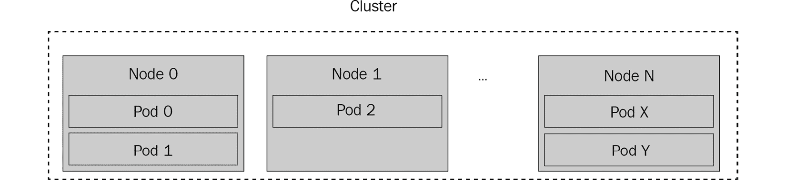

# 8

# 使用 Kubernetes 进行部署

既然你已经到达了本章，你已经知道如何引导微服务，设置访问数据库的逻辑，实现服务 API，使用序列化，并启用微服务之间的异步通信。现在，我们准备介绍一个在实践中非常重要的主题——微服务部署。

`localhost` 用于 **Kafka**。在某个时候，你将需要在远程运行你的服务——例如，在远程服务器或云中，如 **Amazon Web Services**（**AWS**）或 Microsoft Azure。

本章将帮助你学习如何构建和设置你的应用程序，以便部署到这样的远程基础设施。此外，我们将展示如何使用最受欢迎的部署和编排系统之一，Kubernetes。你将了解它提供的优势，以及如何为我们在前几章中创建的微服务设置它。

在本章中，我们将涵盖以下主题：

+   准备应用程序代码以进行部署

+   通过 Kubernetes 部署

+   部署最佳实践

现在，让我们继续本章的第一部分，这将帮助你更好地理解部署过程背后的核心思想，并为你的微服务准备部署。

# 技术要求

为了完成本章，你需要 Go `1.11+` 或更高版本，类似于前几章。此外，你还需要 Docker，你可以在 [`www.docker.com`](https://www.docker.com) 下载它。你需要在 Docker 网站上注册，以便在本章测试服务部署。

除了 Docker 之外，为了完成本章，你还需要 Kubernetes，你可以在 [`kubernetes.io`](https://kubernetes.io) 下载它（你需要其中的 `kubectl` 和 `minikube` 工具）。

你可以在此处找到本章的 GitHub 代码：

[`github.com/PacktPublishing/microservices-with-go/tree/main/Chapter08`](https://github.com/PacktPublishing/microservices-with-go/tree/main/Chapter08)

# 准备应用程序代码以进行部署

在本节中，我们将提供一个服务部署过程的高级概述，并描述准备你的微服务进行部署所需的操作。你将学习如何配置 Go 微服务以在不同的环境中运行，如何为不同的操作系统构建它们，以及一些准备你的微服务进行远程执行的其他技巧。

让我们继续了解部署过程的基本知识。

## 部署基础知识

如本章引言中所述，部署允许你在单个或多个服务器上运行和更新你的应用程序。这样的服务器通常位于远程位置（云或专用网络托管），并且全天候运行，以便你的应用程序能够 24/7 处理请求或处理数据。

每个环境的部署过程通常包括多个步骤。这些步骤包括以下内容：

1.  **构建**：通过编译（对于编译语言，如 Go）并包含其他必需文件来构建服务。

1.  **部署**：将新创建的构建复制到目标环境的服务器上，并用新构建的代码替换任何现有的运行代码。

部署过程通常是顺序的：不是并行替换所有主机上的构建，而是每次只替换一个。例如，如果你有十个服务实例，部署过程将首先更新一个实例，然后验证该实例是否健康，然后移动到第二个实例，一直更新到最后一个服务实例。这样做是为了提高服务可靠性，因为如果新版本包含错误或完全无法在某些服务器上启动，部署就不会一次性影响所有服务器。

为了能够测试微服务，服务器可以被分类到多个类别，称为环境：

+   **本地/开发环境**：在编写代码时用于运行和测试代码的服务器。这个环境永远不会处理来自用户的任何请求，通常只由开发者的计算机组成。它也可以配置为使用数据库和其他组件的简化版本，例如单服务器和内存实现。

+   **生产环境**：用于处理用户请求的服务器。

+   **预发布环境**：生产环境的镜像，但用于测试。预发布环境与本地/生产环境的不同之处在于配置和独立的数据存储，这有助于在测试期间避免与生产数据的任何干扰。

生产部署可以通过**金丝雀模式**进行——这种部署模式只对生产主机的一小部分（例如 1%）进行更改。金丝雀部署在更新服务所有生产实例之前对新代码进行最终测试非常有用。

现在我们来看看开发者如何配置他们的微服务以部署到多个环境。

## 应用配置

在上一节中，我们描述了不同环境之间的差异，例如本地/开发和生产。每个环境通常配置不同——如果你的服务可以访问数据库，每个环境通常会有一个不同的数据库，具有不同的凭证。为了使你的服务能够在这样的环境中运行，你需要有多个服务配置，每个环境一个。

配置你的服务有两种方式：

+   **就地/硬编码**：所有必需的设置都存储在服务代码中（在我们的例子中是 Go 代码）。

+   **分离代码和配置**：配置存储在单独的文件中，以便可以独立修改。

将服务代码和配置分离通常会使代码更易于阅读，这使得配置更改更加容易。每个环境都可以有一个单独的配置文件或一组文件，这样您可以轻松地读取、审查和更新特定环境的配置。此外，各种数据格式，如 YAML，可以帮助保持配置文件的紧凑性。以下是一个 YAML 配置示例：

```go
mysql:
  database: ratings
kafka:
  topic: ratings
```

在这本书中，我们将使用一种将应用程序代码和配置文件分离的方法，并将配置存储在 YAML 格式中。这种方法在许多 Go 应用程序中很常见，并且可以在许多流行的开源 Go 项目中看到。

重要提示

注意，无效的配置更改是大多数生产系统中服务中断的主要原因之一。我建议您探索各种方法来自动验证配置文件，作为代码提交流程的一部分。以下文章提供了一个基于 Git 的 YAML 配置验证示例：[`ruleoftech.com/2017/git-pre-commit-and-pre-receive-hooks-validating-yaml`](https://ruleoftech.com/2017/git-pre-commit-and-pre-receive-hooks-validating-yaml)。

让我们回顾一下我们的微服务代码，看看哪些设置可以从应用程序配置中提取出来：

1.  我们的`metadata 服务`除了其 gRPC 处理器的地址`localhost:8081`外，没有其他设置，您可以在其`main.go`文件中找到这个地址：

    ```go
    lis, err := net.Listen("tcp", fmt.Sprintf("localhost:%v", port))
    ```

1.  我们可以将此设置提取到服务配置中。具有此设置的 YAML 配置文件看起来如下所示：

    ```go
    api:
    ```

    ```go
      port: 8081
    ```

1.  让我们进行更改，以便从文件中读取配置。在`metadata/cmd`目录内，创建一个`config.go`文件，并将以下代码添加到其中：

    ```go
    package main
    ```

    ```go
    type serviceConfig struct {
    ```

    ```go
      APIConfig apiConfig `yaml:"api"`
    ```

    ```go
    }
    ```

    ```go
    type apiConfig struct {
    ```

    ```go
      Port string `yaml:"port"`
    ```

    ```go
    }
    ```

1.  此外，在`metadata`服务目录内创建一个`configs`目录，并向其中添加一个包含以下内容的`base.yaml`文件：

    ```go
    api:
    ```

    ```go
      port: 8081
    ```

1.  我们刚刚创建的文件包含我们服务的 YAML 配置。现在，让我们向我们的`main.go`文件添加代码以读取配置。用以下内容替换`main`函数中打印日志消息的第一行：

    ```go
    log.Println("Starting the movie metadata service")
    ```

    ```go
    f, err := os.Open("base.yaml")
    ```

    ```go
    if err != nil {
    ```

    ```go
        panic(err)
    ```

    ```go
    }
    ```

    ```go
    defer f.Close()
    ```

    ```go
    var cfg serviceConfig
    ```

    ```go
    if err := yaml.NewDecoder(f).Decode(&cfg); err != nil {
    ```

    ```go
        panic(err)
    ```

    ```go
    }
    ```

此外，将包含`net.Listen`调用的行替换为以下内容：

```go
lis, err := net.Listen("tcp", fmt.Sprintf("localhost:%d", cfg.     APIConfig.Port))
```

1.  我们刚刚添加的代码正在使用`gopkg.in/yaml.v3`包来读取 YAML 文件。通过运行以下命令将其导入到我们的模块中：

```go
go mod tidy
```

对我们之前创建的两个其他服务执行相同的更改。在您的 YAML 文件中使用端口号`8082`为`rating`服务，`8083`为`movie`服务。

我们刚刚所做的更改帮助我们引入了与应用程序逻辑分离的应用程序配置。这有助于我们在想要引入额外的可配置选项时——要做出任何配置更改，我们只需更新 YAML 文件，而无需修改我们的服务 Go 代码。

现在我们已经完成了对微服务的配置，以便部署，我们准备进入下一节，该节将介绍微服务的部署过程。

# 通过 Kubernetes 部署

在本节中，我们将展示如何使用一个流行的开源部署和编排平台 Kubernetes 来设置我们的微服务部署。您将学习 Kubernetes 的基础知识，如何设置我们的微服务以使用它，以及如何在 Kubernetes 中测试我们的微服务部署。

## Kubernetes 简介

**Kubernetes** 是一个开源的部署和编排平台，最初由 Google 创建，后来由 Linux 基金会支持的一个大型开发者社区维护。Kubernetes 为运行和部署任何规模的应用程序提供了一种强大、可扩展和灵活的解决方案，从小型单实例应用程序到拥有数万个实例的应用程序。Kubernetes 有助于编排多个操作，如部署、回滚、应用程序的向上和向下扩展（更改应用程序实例数量向上和向下），以及更多。

在 Kubernetes 中，每个应用程序由一个或多个**Pod**组成——最小的可部署单元。每个 Pod 包含一个或多个**容器**——包含应用程序代码的轻量级软件块。以下图中展示了单个容器部署到多个 Pod 的示例：


Kubernetes Pod 可以在单个或多个主机上运行，这些主机被称为**节点**。一组节点被称为**集群**，集群、节点及其 Pod 之间的关系在以下图中展示：




在 Kubernetes 中部署服务时，开发者通常需要执行以下步骤：

1.  **准备容器镜像**：**容器镜像**包含应用程序代码或其编译的二进制文件（两种选项都可以使用，只要容器镜像包含运行代码的指令和任何工具），以及运行它所需的任何附加文件。容器镜像本质上是一个准备就绪的、可用于部署的程序。

1.  **创建部署配置**：Kubernetes 部署配置告诉它如何运行应用程序。它包括设置，如副本数量（要运行的 Pod 数量）、容器名称以及更多。

1.  **运行部署命令**：Kubernetes 将通过运行所需数量的 Pod 并针对目标应用程序（程序）应用提供的配置。

Kubernetes 的一个好处是抽象出所有部署的低级细节，例如选择目标服务器进行部署（如果您有很多，您需要平衡它们的负载否则），复制和提取您的文件，以及运行健康检查。除此之外，还有一些其他有用的好处：

+   **服务发现**：Kubernetes 为应用程序提供内置的服务发现 API。

+   **回滚**：如果在部署中遇到任何问题，Kubernetes 允许您将更改回滚到之前的状态。

+   **自动重启**：如果任何 pod 遇到任何问题，例如应用程序崩溃，Kubernetes 将重启该 pod。

现在，让我们描述如何使用 Kubernetes 设置我们的微服务的部署。

## 为 Kubernetes 部署设置我们的微服务

为我们三个微服务在 Kubernetes 中设置部署的所有必要步骤都列在这里：

1.  第一步是为每个服务创建一个容器镜像。Kubernetes 支持多种类型的容器，而 Docker 目前是最流行的容器类型。我们已经在 *第三章* 中使用了 Docker，现在我们将展示如何使用它为我们的服务创建容器。

在 `metadata` 服务目录内部，创建一个名为 `Dockerfile` 的文件，并将以下代码添加到其中：

```go
FROM alpine:latest

COPY main .
COPY configs/. . EXPOSE 8081
CMD ["/main"]
```

在我们刚刚添加的文件中，我们指定了为 `metadata` 服务的容器准备镜像时，Docker 应该使用 `alpine:latest` 作为基础镜像。将 `main` 添加到容器中，复制服务的 `configs` 目录，并暴露 `8081` 端口，以便我们可以接受其上的入站请求。

1.  作为下一步，在 `rating` 和 `movie` 服务目录中添加一个具有相同内容的文件。确保在文件中使用正确的端口（分别为 `8082` 和 `8083`）。

一旦创建了 Docker 配置文件，请在每个服务目录中运行 `build` 命令：

```go
GOOS=linux go build -o main cmd/*.go
```

上一个命令的结果应该是名为 `main` 的可执行文件，存储在每个服务目录中。请注意，我们使用了 `GOOS=linux` 变量——这告诉 `go` 工具为 Linux 操作系统构建我们的代码。

1.  下一步是构建服务镜像。从 `metadata` 服务目录运行此命令：

```go
docker build -t metadata .
```

类似地，从 `rating` 服务目录运行此命令：

```go
docker build -t rating .
```

最后，从 `movie` 服务目录运行此命令：

```go
docker build -t movie .
```

如果每个命令都成功执行，我们就准备好使用以下命令运行我们的容器：

```go
docker run -p 8081:8081 -it metadata
docker run -p 8082:8082 -it rating
docker run -p 8083:8083 -it movie
```

每次执行的成果应该是每个服务的成功执行。

1.  下一步是在您的账户中创建 Docker Hub 仓库，以便您可以将服务镜像发布到它们。登录到 [`hub.docker.com`](https://hub.docker.com)，转到 `metadata`、`rating` 和 `movie`。

执行以下命令以发布镜像：

```go
docker tag metadata <Your Docker username>/metadata:1.0.0
docker push <Your Docker username>/metadata:1.0.0
docker tag metadata <Your Docker username>/rating:1.0.0
docker push <Your Docker username>/rating:1.0.0
docker tag metadata <Your Docker username>/movie:1.0.0
docker push <Your Docker username>/movie:1.0.0
```

这些命令应将我们刚刚创建的镜像上传到您的 Docker Hub 仓库，以便 Kubernetes 在部署期间下载它们。

到目前为止，我们已经准备好创建一个 Kubernetes 部署配置，这将告诉 Kubernetes 如何部署我们的服务。

1.  在 `metadata` 服务目录内部，创建一个名为 `kubernetes-deployment.yml` 的文件，内容如下：

    ```go
    apiVersion: apps/v1
    ```

    ```go
    kind: Deployment
    ```

    ```go
    metadata:
    ```

    ```go
      name: metadata
    ```

    ```go
    spec:
    ```

    ```go
      replicas: 2
    ```

    ```go
      selector:
    ```

    ```go
        matchLabels:
    ```

    ```go
          app: metadata
    ```

    ```go
      template:
    ```

    ```go
        metadata:
    ```

    ```go
          labels:
    ```

    ```go
            app: metadata
    ```

    ```go
        spec:
    ```

    ```go
          containers:
    ```

    ```go
          - name: metadata
    ```

    ```go
            image: microservices-with-go/metadata:1.0.0 
    ```

    ```go
            imagePullPolicy: IfNotPresent
    ```

    ```go
            ports:
    ```

    ```go
              - containerPort: 8081
    ```

我们刚刚创建的文件提供了 Kubernetes 如何部署我们的服务的说明。以下是一些重要的设置：

+   **副本数**: 运行的 pod 数量

+   **镜像**: 部署要使用的容器镜像名称

+   **端口**: 需要暴露的容器端口

注意，容器端口与应用端口（我们在 `APIConfig` 结构中配置的那个端口）是不同的。这些设置的映射是由 Docker 在 `docker run` 设置中完成的。

1.  现在，在 `rating` 服务目录中创建一个具有相同名称的文件，内容如下：

    ```go
    apiVersion: apps/v1
    ```

    ```go
    kind: Deployment
    ```

    ```go
    metadata:
    ```

    ```go
      name: rating
    ```

    ```go
    spec:
    ```

    ```go
      replicas: 2
    ```

    ```go
      selector:
    ```

    ```go
        matchLabels:
    ```

    ```go
          app: rating
    ```

    ```go
      template:
    ```

    ```go
        metadata:
    ```

    ```go
          labels:
    ```

    ```go
            app: rating
    ```

    ```go
        spec:
    ```

    ```go
          containers:
    ```

    ```go
          - name: rating
    ```

    ```go
            image: <Your Docker username>/rating:1.0.3
    ```

    ```go
            imagePullPolicy: IfNotPresent
    ```

    ```go
            ports:
    ```

    ```go
              - containerPort: 8082
    ```

记得用你在 *步骤 4* 中创建的 Docker 镜像名称替换 `image` 属性。

1.  最后，在 `movie` 服务目录中创建一个名为 `kubernetes-deployment.yml` 的文件，内容如下：

    ```go
    apiVersion: apps/v1
    ```

    ```go
    kind: Deployment
    ```

    ```go
    metadata:
    ```

    ```go
      name: movie
    ```

    ```go
    spec:
    ```

    ```go
      replicas: 2
    ```

    ```go
      selector:
    ```

    ```go
        matchLabels:
    ```

    ```go
          app: movie
    ```

    ```go
      template:
    ```

    ```go
        metadata:
    ```

    ```go
          labels:
    ```

    ```go
            app: movie
    ```

    ```go
        spec:
    ```

    ```go
          containers:
    ```

    ```go
          - name: movie
    ```

    ```go
            image: ashuiskov/movie:1.0.0
    ```

    ```go
            imagePullPolicy: IfNotPresent
    ```

    ```go
            ports:
    ```

    ```go
              - containerPort: 8083
    ```

1.  下一步是使用 `minikube` 工具启动本地 Kubernetes 集群，你应该已经将其作为 Kubernetes 的一部分安装了。运行以下命令以启动集群：

```go
minikube start
```

1.  然后，从 `metadata` 服务目录运行以下命令来应用我们的 `metadata` 部署配置：

```go
kubectl apply -f kubernetes-deployment.yml 
```

1.  如果前一个命令执行成功，你可以通过运行以下命令来查看新的部署：

```go
kubectl get deployments
```

命令的输出应该是这样的：

```go
NAME       READY   UP-TO-DATE   AVAILABLE   AGE
metadata   0/2     2            0           6s
```

还可以通过运行以下命令来检查服务 pod 的状态：

```go
kubectl get pods
```

输出应该显示 `metadata` 服务 pod 的 `Running` 状态，如下所示：

```go
NAME                        READY   STATUS    RESTARTS   AGE
metadata-5f87cbbf65-st69m   1/1     Running   0          116s
metadata-5f87cbbf65-t4xsk   1/1     Running   0          116s
```

如你所注意到的，Kubernetes 为我们的服务创建了两个 pod，这与我们在部署配置中指定的数量相同。每个 pod 都有一个 `metadata` 服务。

你可以通过运行以下命令来检查每个 pod 的日志：

```go
kubectl logs -f <POD_ID>
```

现在，对其他两个服务执行与 `metadata` 服务相同的更改，并验证 pod 是否正在运行。

如果你想要向服务发送一些手动 API 请求，你需要通过运行以下命令来设置端口转发：

```go
kubectl port-forward <POD_ID> 8081:8081
```

此命令适用于 `metadata`、`rating` 和 `movie` 服务；但是，你需要将 `8081` 端口值分别替换为 `8082` 和 `8083`。

如果你一切做得很好，恭喜！我们已经完成了微服务的基本 Kubernetes 部署设置。让我们总结一下本节中我们做了什么：

+   首先，我们为每个服务创建了容器镜像，以便我们可以部署它们。

+   然后，我们将容器镜像发布到 Docker Hub，以便 Kubernetes 在部署过程中可以拉取这些镜像。

+   我们创建了一个 Kubernetes 部署配置，以告诉它如何部署我们的微服务。

+   最后，我们使用 `minikube` 和 `kubectl` 命令的组合测试了我们的 Kubernetes 部署。

到目前为止，你应该对 Kubernetes 部署有一些了解，并知道如何使用它们来部署你的微服务。这些知识将帮助你将服务运行在许多平台上，包括所有流行的云平台，如 AWS、Azure 和 **Google Cloud Platform**（**GCP**）。

# 部署最佳实践

在本节中，我们将描述一些与部署过程相关的最佳实践。以下列出的这些实践将帮助你为你的微服务设置一个可靠的部署过程：

+   自动回滚

+   金丝雀部署

+   持续部署（CD）

## 自动回滚

**自动回滚**是在部署过程中出现失败时自动回滚部署的机制。想象一下，你正在部署你服务的新版本，而这个版本有一些应用程序错误，阻止它成功启动。在这种情况下，部署过程将用失败的实例替换你的服务活动实例（如果服务已经运行），从而使你的服务不可用。自动回滚是一种检测和回滚此类不良部署的方法，帮助你避免在服务因此类问题而不可用时出现中断。

自动回滚在撰写本书时不是 Kubernetes 的默认功能，类似于许多流行的部署平台。然而，这不应该阻止你使用这项技术，尤其是如果你旨在实现服务的高可靠性。使用 Kubernetes 实现自动回滚的高级思路如下：

+   对你的服务进行持续的健康检查（我们将在本书的*第十二章*中介绍此类逻辑）。

+   当你发现你的服务存在健康问题时，检查是否有最近的服务部署。例如，你可以通过运行 `kubectl describe deployment` 命令来做到这一点。

+   如果最近有部署，并且其时间与检测到健康检查问题的时刻非常接近，你可以通过执行以下回滚命令来回滚它：`kubectl rollout undo deployment <DEPLOYMENT_NAME>`。

## 金丝雀部署

正如我们在本章开头提到的，金丝雀是一种特殊的部署类型，其中你只更新一小部分（1% 到 3%）的实例。金丝雀部署的想法是在生产实例的子集上测试你代码的新版本，并在进行常规生产部署之前验证其正确性。

我们不会涵盖在 Kubernetes 中设置金丝雀部署的细节，但可以介绍一些基本理念，这些理念将帮助你在想要为你的微服务启用金丝雀部署时进行操作，如下所述：

+   创建两个独立的 Kubernetes 部署配置，一个用于金丝雀，一个用于生产。

+   指定每个配置中所需的副本数——如果你想在一个服务上运行 50 个 pod，并让金丝雀处理 2% 的流量，则为金丝雀设置 1 个副本，为生产环境设置 49 个副本。

+   你也可以为部署名称添加环境特定的后缀。例如，你可以将一个评分服务的金丝雀部署命名为 `rating-canary`，而将生产环境的部署命名为 `rating-production`。

+   当你进行服务的部署时，首先使用金丝雀配置进行部署。

+   一旦你验证了部署成功，就使用生产配置进行部署。

金丝雀部署强烈推荐用于提高部署的可靠性。在少量流量上测试新更改有助于减少各种应用程序错误和其他类型的问题的影响，这些问题可能是你的服务可能遇到的。

## 用持续部署（CD）替换

**持续部署**（**CD**）是一种频繁重复部署的技术。使用 CD，服务会自动部署——例如，在每次代码更改时。CD 的主要好处是早期部署失败检测——如果任何更改（如新服务代码的 Git 提交）导致部署失败，失败通常会比手动部署更快地被发现。

你可以通过程序化监控变更日志（如 Git 提交历史）或使用 `kubectl apply` 命令来自动化部署。

由于版本更新的高频率，CD 需要一些工具来自动检查服务健康。我们将在本书的第 *第十一章* 和 *第十二章* 中介绍此类工具。

# 摘要

在本章中，我们讨论了一个非常重要的主题——服务部署。你已经了解了服务部署过程的基础，以及为部署我们的微服务所需的必要步骤。然后，我们介绍了 Kubernetes，这是一个由许多公司和云服务提供商提供的流行部署和编排平台。我们展示了如何设置本地 Kubernetes 集群并将我们的微服务部署到其中，运行每个服务的多个实例，以说明在 Kubernetes 平台中运行任意数量的实例是多么容易。

你所获得的知识应该能帮助你设置更复杂的部署流程，以及与通过 Kubernetes 已部署的服务一起工作。

本章总结了我们在服务部署方面的材料。在下一章，我们将描述另一个重要主题：单元和集成。

# 进一步阅读

如果你想要了解更多信息，请参考以下链接：

+   Kubernetes 文档：[`kubernetes.io/docs/home/`](https://kubernetes.io/docs/home/ )

+   服务部署最佳实践：[`codefresh.io/learn/software-deployment/`](https://codefresh.io/learn/software-deployment/ )

+   设置 Kubernetes 服务：[`kubernetes.io/docs/concepts/services-networking/service/`](https://kubernetes.io/docs/concepts/services-networking/service/ )

+   蓝绿部署：[`www.redhat.com/en/topics/devops/what-is-blue-green-deployment`](https://www.redhat.com/en/topics/devops/what-is-blue-green-deployment)
