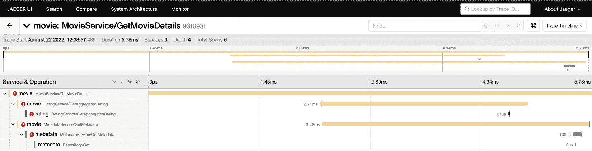

# 收集服务遥测数据

在上一章中，我们探讨了服务可靠性的主题，并描述了各种使您的服务更能抵御不同类型错误的技术。您了解到与可靠性相关的工作包括在事件检测、缓解和预防技术方面进行持续改进。

在本章中，我们将更深入地探讨各种类型的服务性能数据，这对于设置服务健康监控、调试和自动化服务事件检测至关重要。您将学习如何收集服务日志、指标和跟踪信息，以及如何使用分布式跟踪技术可视化并调试微服务之间的通信。

我们将涵盖以下主题：

+   遥测概述

+   收集服务日志

+   收集服务指标

+   收集服务跟踪

现在，让我们继续概述本章将要描述的所有技术。

# 技术要求

要完成本章，您需要 Go 1.11 或更高版本。您还需要以下工具：

+   **grpcurl**：[`github.com/fullstorydev/grpcurl`](https://github.com/fullstorydev/grpcurl)

+   **Jaeger**：[`www.jaegertracing.io/`](https://www.jaegertracing.io/)

您可以在此处找到本章的 GitHub 代码：[`github.com/PacktPublishing/microservices-with-go/tree/main/Chapter11`](https://github.com/PacktPublishing/microservices-with-go/tree/main/Chapter11)。

# 遥测概述

在本章的介绍中，我们提到了存在不同类型的服务性能数据，所有这些对于服务健康监控和故障排除都是必不可少的。这些类型的数据被称为**遥测数据**，包括以下内容：

+   **日志**：由您的服务记录的消息，提供了对它们执行的操作或遇到的错误的洞察

+   **指标**：由您的服务产生的性能数据，例如注册用户数量、API 请求错误率或可用磁盘空间的百分比

+   **跟踪**：显示您的服务执行各种操作的数据，例如 API 请求，它们调用了哪些其他服务，它们执行了哪些内部操作，以及这些操作花费了多长时间

遥测数据是**不可变的**：它捕获了服务已经发生的事件，并提供了各种测量结果，例如服务 API 响应延迟。当不同类型的遥测数据结合在一起时，它们成为了解服务行为的有力信息来源。

在本章中，我们将描述如何收集服务遥测数据以监控服务的健康状态。有两种类型的服务健康和性能监控：

+   **白盒监控**：在可以访问不同类型内部生成数据的情况下监控服务。例如，您可以通过系统监控应用程序查看服务器的 CPU 利用率来监控它。

+   **黑盒监控**：仅使用外部可用的数据和指标进行服务监控。在这种情况下，您不知道或无法访问与它们的结构或内部行为相关的数据。例如，如果一个服务有一个公开可用的健康检查 API，外部系统可以通过调用该 API 来监控其健康状态，而不需要访问内部服务数据。

这两种类型的监控都是通过收集和持续分析服务性能数据来实现的。一般来说，您从应用程序中收集的数据类型越多，您获得有关其健康和行为的信息类型就越多。让我们列出一些您可以使用有关服务性能信息的方法：

+   **趋势分析**：检测您的服务性能数据中的任何趋势：

    +   您的服务健康状况随着时间的推移是变好还是变差？

    +   您的 API 成功率是如何变化的？

    +   与前一天/月/年相比，您获得了多少新用户？

+   **语义图捕获**：捕获有关您的服务如何相互通信以及与任何其他组件（如数据库、外部 API 和消息代理）通信的数据。

+   **异常检测**：自动检测服务行为中的异常，例如 API 请求的突然下降。

+   **事件关联**：检测各种类型事件之间的关系，例如失败的部署和服务崩溃。

虽然可观察性提供了很多机会，但也伴随着以下挑战：

+   **收集大量数据集**：实时性能数据通常需要大量的存储空间，尤其是如果您有很多服务或您的服务产生了大量数据。

+   **需要特定工具**：要收集、处理和可视化不同类型的数据，例如日志、指标和跟踪，您需要一些额外的工具。这些工具通常需要付费。

+   **复杂配置**：可观察性工具和基础设施通常很难配置。要访问来自多个服务的所有数据，您需要设置适当的数据收集、聚合、数据保留策略以及许多其他策略。

我们将描述如何处理您在微服务中可以收集的每种类型的遥测数据。对于每种类型的数据，我们将提供一些使用示例，并描述设置工具以处理它的常见方式。首先，让我们继续查看服务日志收集。

# 收集服务日志

**日志记录**是一种涉及收集以时间顺序排列的消息集合的形式的实时应用程序性能数据的技术，称为**日志**。以下是一个服务日志的示例：

```go
2022/06/06 23:00:00 Service started
2022/06/06 23:00:01 Connecting to the database
2022/06/06 23:00:11 Unable to connect to the database: timeout error
```

日志可以帮助我们了解在特定时间点应用程序中发生了什么。正如您在前面的示例中看到的那样，该服务在晚上 11 点开始启动，并在一秒后开始连接到数据库，最终在 10 秒后记录了一个超时错误。

日志可以提供关于发出它们的组件的大量有价值的信息，例如以下内容：

+   **操作顺序**：日志可以帮助我们通过显示每个操作发生的时间来理解服务执行的操作的逻辑顺序。

+   **失败的操作**：日志最有用的应用之一是能够看到服务记录的错误列表。

+   **恐慌**：如果一个服务由于恐慌而意外关闭，日志可以提供相关信息，帮助排查问题。

+   **调试信息**：开发人员可以记录各种类型的附加信息，例如请求参数或头信息，这有助于调试各种问题。

+   **警告**：日志可以指示各种系统级警告，例如磁盘空间不足，可以用作防止各种类型错误的警报机制。

我们在我们创建的服务中使用了日志*第二章* – 我们的服务已经通过内置日志库记录了一些重要的状态消息。以下是一个示例：

```go
log.Printf("Starting the metadata service on port %d", port)
```

内置日志库提供了记录任意文本消息和恐慌的功能。前述操作的输出如下：

```go
2022/07/01 13:05:21 Starting the metadata service on port 8081
```

默认情况下，日志库将所有日志记录到与当前进程关联的`stdout`流。但可以通过调用`SetOutput`函数来设置输出目的地。这样，你可以将日志写入文件或将它们通过网络发送。

日志库提供了两种类型的函数，如果服务遇到意外或不可恢复的错误，可以使用：

+   `致命`：带有此前缀的函数在记录消息后立即停止进程的执行。

+   `panic`：在记录消息后，它们会调用 Go 的`panic`函数，写入相关错误的输出。以下是一个调用`panic`函数的示例输出：

    ```go
    2022/11/10 23:00:00 network unavailable
    ```

    ```go
    panic: network unavailable
    ```

虽然内置日志库提供了记录任意文本消息的简单方法，但它缺少一些有用的功能，使得收集和处理服务日志更容易。其中缺失的功能包括记录流行序列化格式（如 JSON）中的事件的能力，这将简化消息数据的解析。另一个问题是它缺少`Error`和`Errorf`函数，这些函数可以用于显式记录错误。由于内置日志库只提供`Print`函数，默认情况下无法确定记录的消息表示错误、警告还是两者都不是。

然而，内置日志库中最大的缺失部分是执行结构化日志记录的能力。**结构化日志记录**是一种涉及以序列化结构的形式收集日志消息的技术，例如 JSON 记录。与任意文本字符串相比，此类结构的独特之处在于它们可以包含以字段形式存在的附加元数据 – 键值记录。这使得服务能够以任何支持的类型表示消息元数据，例如数字、字符串或序列化记录。

下面的代码片段包括一个 JSON 编码的日志结构示例：

```go
{"level":"info", "time":"2022-09-04T20:10:10+1:00","message":"Service started", "service":"metadata"}
```

如您可能已注意到的，除了使用 JSON 作为输出格式外，先前的日志格式还有两个附加功能：

+   `level` 指定日志消息的类型。

+   `service`，用于指示发出消息的服务。

之前描述的输出格式使我们能够更容易地解码日志消息。它还帮助我们根据日志级别和额外的消息字段来解释其内容。还可以使用附加元数据进行搜索：例如，我们可以搜索具有特定 `service` 字段值的消息。

现在，让我们专注于上一个示例中的日志级别元数据。首先，让我们回顾一些常见的日志级别：

+   **信息**：不指示任何错误的 informational 消息。此类消息的例子是日志记录表明服务成功连接到数据库。

+   **错误**：指示错误的消息，例如网络超时。

+   **警告**：指示一些潜在问题的消息，例如打开的文件太多。

+   **致命**：指示关键或不可恢复的错误，例如内存不足，使得进一步执行服务变得不可能。

+   `Debug` 消息通常默认禁用，因为它们通常会生成大量数据。

日志级别也帮助我们解释日志消息。考虑以下由内置日志库生成的无结构消息，它不包含任何级别信息：

```go
2022/06/06 23:00:00 Connection terminated
```

您能否判断这是一条表示常规行为（例如，服务在执行一些工作后有意终止了连接）的常规信息性消息，还是警告或错误？如果是错误，它是关键的还是非关键的？如果没有日志级别提供额外的上下文，很难解释这条消息。

显式使用日志级别的另一个优点是能够启用或禁用记录特定类型级别的功能。例如，在正常服务条件下可以禁用 `Debug` 消息的记录，并在故障排除期间启用。`Debug` 消息通常包含比常规消息更多的信息，需要更多的磁盘空间，并使其他类型的日志导航更困难。不同的日志库允许我们启用或禁用特定级别，例如 `Debug` 或甚至 `Info`，只留下表示警告、错误、致命错误和恐慌的日志。

**log15** ([`github.com/inconshreveable/log15`](https://github.com/inconshreveable/log15)):

## 选择日志库

流行 Go 日志库的列表包括以下内容：

在本节中，我们将描述一些现有的 Go 日志库并回顾它们的功能。本节应有助于您选择将在您的微服务中使用的日志库。

+   **结构化日志**：支持记录结构化消息，可能包括键值格式中的额外字段。

+   首先，让我们列出我们希望从日志库中获得的功能：

+   由 Go 开发团队官方支持，包含在 Go SDK 中

以下是一些额外且令人愉悦的功能：

+   **日志级别支持**：强制在消息元数据中包含日志级别。

现在，让我们回顾一些最受欢迎的 Go 日志库。在评估库性能时，我们将使用日志库基准数据：[`github.com/uber-go/zap#performance`](https://github.com/uber-go/zap#performance)。

功能丰富，支持快速的最小化日志记录器，以及带有额外功能的稍慢版本

+   **内置 Go 日志包** ([`pkg.go.dev/log`](https://pkg.go.dev/log)):

    +   简洁优雅的 API

    +   不支持结构化日志，也没有内置对日志级别的支持

+   **zap** ([`github.com/uber-go/zap`](https://github.com/uber-go/zap)):

    +   在所有已审查的日志库中性能最快

    +   类似于 `Printf` 的格式（例如，支持 `Errorf` 函数来记录格式化的错误）。

+   **zerolog** ([`github.com/rs/zerolog`](https://github.com/rs/zerolog)):

    +   **快速性能**：写入日志消息不应对服务性能产生明显影响。

    +   让我们回顾一些流行的 Go 日志库，并专注于选择我们将在微服务中使用的库。

+   `go-kit` 微服务开发工具包

+   比`zerolog`和`zap`略慢，但比其他日志库快

+   **apex/log** ([`github.com/apex/log`](https://github.com/apex/log)):

    +   内置支持各种日志存储，如 Elasticsearch、Graylog 和 AWS Kinesis

    +   功能丰富的日志工具包

    +   比其他已审查的日志库慢得多

上述列表提供了一些关于一些流行 Go 日志库的高级细节，以帮助您为您的服务选择正确的库。所有库（除了内置的 `log` 包）都提供了我们需要的功能，包括结构化日志和日志级别。现在，问题是如何从它们中选出最佳的一个？

我个人的观点是，`zap` 库提供了最灵活且性能最出色的服务日志解决方案。它允许我们使用两个独立的日志记录器，分别称为 `Logger` 和 `SugaredLogger`。`Logger` 可用于高性能应用，而 `SugaredLogger` 可用于需要额外功能时；我们将在下一节中回顾这些功能。

## 使用日志功能

让我们开始练习并展示如何使用我们在上一节中选择的 `zap` 日志库的一些功能。首先，让我们从基础知识开始，说明如何记录一个具有 `Info` 级别和一个名为 `serviceName` 的附加元数据字段的简单消息。本例的完整 Go 代码如下：

```go
package main
import "go.uber.org/zap"
func main() {
    logger, _ := zap.NewProduction()
    logger.Info("Started the service", zap.String("serviceName", "metadata"))
}
```

我们通过调用 `zap.NewProduction` 函数初始化 `logger` 变量，该函数返回一个生产配置的日志记录器。这个日志记录器省略了调试消息，使用 JSON 作为输出格式，并在日志中包含堆栈跟踪。然后，我们通过使用 `zap.String` 函数包含一个 `serviceName` 字段来创建一个结构化日志消息，该函数可以用于记录字符串数据。

上一例子的输出如下：

```go
{"level":"info","ts":1257894000,"caller":"sandbox1575103092/prog.go:11","msg":"Started the service","serviceName":"metadata"}
```

`zap` 库为其他类型的 Go 原始数据提供支持，例如 `int`、`long`、`bool` 以及更多。创建日志字段名的相应函数遵循相同的命名格式，例如 `Int`、`Long` 和 `Bool`。此外，`zap` 包含了一组用于其他内置 Go 类型的函数，例如 `time.Duration`。以下代码展示了 `time.Duration` 字段的示例：

```go
logger.Info("Request timed out", zap.Duration("timeout", 10*time.Second))
```

让我们说明如何记录任意对象，例如结构。在 *第二章* 中，我们定义了 `Metadata` 结构：

```go
// Metadata defines the movie metadata.
type Metadata struct {
    ID          string `json:"id"`
    Title       string `json:"title"`
    Description string `json:"description"`
    Director    string `json:"director"`
}
```

假设我们想要为了调试目的记录整个结构。这样做的一种方法是通过使用 `zap.Stringer` 字段。该字段允许我们使用 `String()` 函数记录任何结构或接口。我们可以为我们的 `Metadata` 结构定义一个 `String` 函数，如下所示：

```go
func (m *Metadata) String() string {
    return fmt.Sprintf("Metadata{id=%s, title=%s, description=%s, director=%s}", m.ID, m.Title, m.Description, m.Director)
}
```

现在，我们可以将 `Metadata` 结构作为日志字段进行记录：

```go
logger.Debug("Retrieved movie metadata", zap.Stringer("metadata", metadata))
```

输出将如下所示：

```go
{"level":"debug","msg":"Retrieved movie metadata","metadata":"Metadata{id=id, title=title, description=description, director=director}"}
```

现在，让我们再展示一个使用 `zap` 库的有用技巧。如果你想在多个消息中包含相同的字段，你可以通过使用 `With` 函数重新初始化日志记录器，如下面的例子所示：

```go
logger = logger.With(zap.String("endpoint", "PutRating"), zap.String("ratingId", ratingID))
logger.Debug("Received a PutRating request")
// endpoint logic
logger.Debug("Processed a PutRating request")
```

现在两次调用 `Debug` 函数的结果将包括 `endpoint` 和 `ratingId` 字段。

你也可以在创建代码中的新服务组件时使用这种技巧。在下面的例子中，我们在 `New` 函数内部创建了一个子日志记录器：

```go
func New(logger *zap.Logger, ctrl *rating.Controller) *Handler{ 
    return &Handler{logger.With("component": "ratingController"), ctrl}
}
```

这样，新创建的 `Handler` 结构实例将使用包含每个消息中 `component` 字段具有 `ratingController` 值的日志记录器进行初始化。

现在我们已经覆盖了一些主要的服务日志用例，让我们讨论如何在微服务环境中存储日志。

## 存储微服务日志

默认情况下，每个服务实例的日志会被写入运行该实例的进程的输出流。这种日志收集机制允许我们通过持续读取运行服务实例的主机上相关流（大多数情况下是`stdout`）中的数据来监控服务操作。然而，如果没有额外的软件，日志数据将不会被持久化，因此在服务重启或突然崩溃后，您将无法读取之前记录的日志。

各种软件解决方案允许我们在多服务环境中存储和查询日志数据。它们帮助解决多个其他问题：

+   **分布式日志收集**：如果您有多个服务在不同的主机上运行，您必须独立收集每个主机上的服务日志并将它们发送进行进一步聚合。

+   **集中式日志存储**：为了能够查询不同服务发出的数据，您需要以集中化的方式存储它 – 在查询执行期间，所有服务的所有日志都应该是可访问的。

+   **数据保留**：日志数据通常占用大量磁盘空间，并且通常存储所有服务的日志变得过于昂贵。为了解决这个问题，您需要为您的服务建立合适的数据保留策略，这将允许您配置每个服务可以存储数据的时间长度。

+   **高效索引**：为了能够快速查询您的日志数据，日志需要被高效地索引和存储。现代索引软件可以帮助您在不到 10 毫秒的时间内查询 TB 级的日志数据。

不同的工具有助于简化此类日志操作，例如 Elasticsearch 和 Graylog。让我们简要回顾 Elasticsearch，以提供一个端到端的日志管理解决方案的示例。

**Elasticsearch**是一个流行的开源搜索引擎，它于 2010 年创建，并迅速成为索引和查询不同类型结构化数据的可扩展系统的热门选择。虽然 Elasticsearch 的主要用例是全文搜索，但它可以有效地用于存储和查询各种类型的结构化数据，例如服务日志。Elasticsearch 也是名为**Elastic Stack**（也称为**ELK**）的工具包的一部分，它包括一些其他系统：

+   **Logstash**：一个数据处理管道，可以收集、聚合和转换各种类型的数据，例如服务日志

+   **Kibana**：一个用于访问 Elasticsearch 中数据的用户界面，提供便捷的可视化和查询功能

Elastic Stack 中的日志收集管道看起来是这样的：


图 11.1 – Elastic Stack 中的日志管道

在这个流程图中，服务日志由 Logstash 收集并发送到 Elasticsearch 进行索引和存储。然后，用户可以使用 Kibana 界面访问日志和其他在 Elasticsearch 中索引的数据。

Elastic Stack 的一个关键优势是，其大多数工具都是免费且开源的。它维护良好，在开发者社区中极为流行，这使得搜索相关文档、获取额外支持或找到一些额外工具变得更加容易。它还提供了一套适用于所有流行语言的库，使我们能够对管道的所有组件执行各种类型的查询和 API 调用。

用于使用 Elasticsearch API 的 Go 库称为 `go-elasticsearch`，可以在 GitHub 上找到：[`github.com/elastic/go-elasticsearch`](https://github.com/elastic/go-elasticsearch)。

我们不会详细讨论 Elastic Stack，因为它超出了本章的范围，但您可以通过阅读其官方文档（https://www.elastic.co/guide/index.html）来了解更多关于 Elastic Stack 的信息。

在介绍了一些流行的日志软件的高级细节之后，让我们继续下一个主题：描述日志的最佳实践。

## 日志最佳实践

到目前为止，我们已经涵盖了日志最重要的方面，并描述了如何选择日志库，以及如何建立用于收集和分析数据的日志基础设施。让我们描述一些日志服务数据的最佳实践：

+   避免使用插值字符串。

+   标准化您的日志消息。

+   定期审查您的日志数据。

+   设置适当的日志保留。

+   在日志中识别消息来源。

现在，让我们详细说明每个实践。

### 避免使用插值字符串

最常见的日志反模式之一是使用 **插值字符串** – 在文本字段中嵌入元数据的消息。以下代码片段可以作为例子：

```go
logger.Infof("User %s successfully registered", userID)
```

这段代码的问题在于它将两种类型的数据合并到一个单独的文本消息中：一个操作名称（用户注册）和一个用户标识符。这样的消息使得搜索和处理日志元数据变得更加困难：每次您需要从日志消息中提取 `userID` 时，您都需要解析包含它的字符串。

让我们通过遵循结构化日志记录方法来更新我们的示例，其中我们将额外的元数据作为消息字段进行记录：

```go
logger.Infof("User successfully registered", zap.String("userId", userID))
```

当您想要查询数据时，更新后的版本会带来很大的差异。现在，您可以查询所有包含 `User successfully registered` 文本消息的日志事件，并轻松访问与之相关的所有用户标识符。避免使用插值消息有助于保持您的日志数据易于查询和解析，简化所有与之相关的操作。

### 标准化您的日志消息

在本节中，我们介绍了日志集中化的好处以及跨多个服务查询数据的优势。但我想强调，在微服务环境中标准化日志消息的格式是多么重要。有时，执行跨越多个服务、API 端点处理程序或其他组件的日志查询是有用的。例如，您可能需要在您的日志数据上执行以下类型的查询：

+   获取所有服务中超时错误的分布情况。

+   获取每个 API 端点的错误每日计数。

+   获取所有数据库存储库中独特的错误消息。

如果您的服务使用不同的字段名记录数据，您将无法轻松地使用通用查询函数收集此类数据。相反，建立通用字段名有助于确保日志消息遵循相同的命名约定，简化您编写的任何查询。

为了确保所有服务和所有组件以相同的方式发出日志，您可以遵循以下提示：

+   创建一个包含日志字段名作为常量的共享包；以下是一个示例：

    ```go
    package logging
    ```

    ```go
    const (
    ```

    ```go
      FieldService  = "service"
    ```

    ```go
      FieldEndpoint = "endpoint"
    ```

    ```go
    ...
    ```

    ```go
    )
    ```

+   为了避免忘记在某个结构、函数或函数集中包含某些重要字段，请尽早通过设置字段来重新初始化记录器；以下是一个示例：

    ```go
    func (h *Handler) PutRating(ctx context.Context, req *PutRatingRequest) (*PutRatingResponse, error) {
    ```

    ```go
        logger := h.logger.With(logging.FieldEndpoint, "putRating")
    ```

    ```go
        // Now we can make sure the endpoint field is set across all handler logic.
    ```

    ```go
    ...
    ```

    ```go
    }
    ```

+   此外，确保您的服务根记录器设置了服务名称，以便所有服务组件将默认自动收集此字段：

    ```go
    func main() {
    ```

    ```go
        logger, _ := zap.NewProduction()
    ```

    ```go
        logger = logger.With(logging.FieldService, "rating")
    ```

    ```go
        // Pass the initialized logger to all service components.
    ```

我们刚刚提供的提示应该有助于您在所有服务组件中标准化常用字段的用法，使查询记录的数据和以不同方式聚合数据变得更加容易。

### 定期审查您的日志数据

一旦开始收集您的服务日志，定期审查它们就很重要。注意以下情况：

+   **确保日志中没有 PII 数据**：**个人身份信息**（PII），例如全名和 SSN，受到许多法规的约束，通常不应存储在日志中。请确保没有任何组件，例如 API 处理程序或存储库组件，发出任何此类数据，即使是出于调试目的。

+   **检查您的服务是否未发出额外的调试数据**：有时，开发者为了调试各种问题，会在日志中记录一些额外的数据，例如请求字段。请确保没有服务在长时间内持续发出过多的调试消息，污染日志并占用过多磁盘空间。

### 设置适当的日志保留策略

日志数据通常需要占用大量的存储空间。如果它不断增长而没有采取任何额外措施，你可能会用完所有磁盘空间，并不得不紧急清理旧记录。为了防止这种情况，各种日志存储解决方案允许你为你的数据配置**保留策略**。例如，你可以配置你的日志存储，将某些服务的日志保留几年，同时将其他一些服务的保留时间限制为几天，具体取决于需求。此外，你还可以设置一些大小限制，以确保你的服务日志不超过预定义的大小阈值。

确保为所有类型的日志设置保留策略，避免需要手动清理不需要的日志记录的情况。

### 识别日志中的消息来源

假设你正在查看系统日志，并注意到以下错误事件：

```go
{"level":"error", "time":"2022-09-04T20:10:10+1:00","message":"Request timed out"}
```

你能理解这个事件中描述的问题吗？日志记录包括`请求超时`错误消息，并且具有`error`级别，但它没有为我们提供任何有意义的上下文。没有额外的上下文，我们无法轻易理解导致日志事件的根本问题。

提供任何日志消息的上下文对于轻松处理日志至关重要。这在微服务环境中尤为重要，因为类似操作可以由多个服务或组件执行。始终应该能够理解每条消息，并有一些关于其来源组件的参考。在本节中，我们已经提到了在日志事件中包含一些额外信息的做法，例如组件名称。此类元数据通常包括以下内容：

+   服务的名称

+   发出事件的组件名称（例如，端点名称）

+   文件名称（可选）

上一条日志消息的更详细版本如下所示：

```go
{"level":"error", "time":"2022-09-04T20:10:10+1:00","message":"Request timed out", "service":"rating", "component": "handler", "endpoint": "putRating", "file": "handler.go"}
```

到目前为止，我们已经讨论了与日志记录相关的主要主题，可以继续到下一节，该节描述另一种类型的遥测数据——指标。

# 收集服务指标

在本节中，我们将描述另一种类型的服务遥测数据：**指标**。为了理解指标是什么以及它们与日志数据的区别，让我们从一个例子开始。假设你有一组为用户提供 API 的服务，你想要知道每个 API 端点每秒被调用多少次。你将如何做？

解决这个问题的可能方法之一是使用日志。我们可以为每个请求创建一个日志事件，然后我们就能按端点计数事件的数量，按秒、分钟或任何其他可能的方式聚合它们。这种解决方案会一直有效，直到每个端点的请求太多，无法再独立记录每个请求。让我们假设有一个每秒处理超过一百万个请求的服务。如果我们使用日志来衡量其性能，我们每秒就需要生成超过一百万个日志事件，这将产生大量数据。

解决这个问题的更优解决方案是使用某种基于值的聚合。而不是单独存储表示每个请求的数据，我们可以总结每秒、每分钟或每小时的请求计数，使数据更适合存储。

我们刚才描述的问题非常适合使用指标——对系统性能进行实时定量测量，如请求速率、延迟或累积计数。像日志一样，指标是基于时间的——每条记录都包含一个时间戳，代表过去某个独特的时间点。然而，与日志事件不同，指标主要用于存储单个值。在我们的例子中，端点请求速率指标的价值将是每秒请求的数量。

指标通常表示为**时间序列**——包含以下数据的对象集合，称为**数据点**：

+   时间戳

+   值（最常见的是数值）

+   可选的**标签**集合，定义为键值对，包含任何附加元数据

为了帮助您更好地理解使用指标的使用案例，让我们定义一些常见的指标类型：

+   **计数器**：这些是表示随时间累积计数器值的时序。一个例子是服务请求计数器——每个数据点将包括一个时间戳和在该特定时刻的请求计数。

+   **仪表**：这些是表示单个标量值随时间变化的时序。仪表的一个例子是包含服务器在不同时刻的空闲磁盘空间量的数据集：每个数据点包含一个单一的数值。

+   **直方图**：这些是表示某些值相对于预定义的值范围分布的时序，称为**桶**。直方图指标的一个例子是包含不同年龄段用户数量的数据集。

让我们专注于每种指标类型，以帮助您了解它们之间的差异以及每种类型的常见用例。

计数器指标通常用于衡量两种类型的数据：

+   随时间累积的值（例如，错误总数）

+   随时间累积值的改变（例如，每小时新注册用户数）

第二个用例在技术上是对第一个用例的不同表示——如果您知道在每一个时间点有多少用户，您可以看到这个值是如何变化的。正因为如此，计数器通常用于测量各种事件（如 API 请求）随时间的变化率。

以下代码片段提供了一个`Counter`接口在`tally`指标库中的示例（我们将在本章后面回顾这个库）：

```go
type Counter interface {
    // Inc increments the counter by a delta.
    Inc(delta int64)
}
```

与计数器不同，仪表用于存储测量的唯一值，例如服务随时间可用的内存。以下是从`tally`库中的一个仪表示例：

```go
type Gauge interface {
    // Update sets the gauges absolute value.
    Update(value float64)
}
```

一些其他的仪表用例包括以下内容：

+   由服务实例运行的 goroutine 数量

+   活跃连接数

+   打开文件数

直方图与计数器和仪表略有不同。它们要求我们定义一组范围，这些范围将用于存储记录数据的子集。以下是一些使用直方图指标的示例：

+   **延迟跟踪**：您可以通过创建代表各种持续时间范围的桶来跟踪执行特定服务操作所需的时间。例如，您的桶可以是 0-100 毫秒、100-200 毫秒、200-300 毫秒，依此类推。

+   **群体跟踪**：您可以跟踪统计数据，例如每个值组的记录数。例如，您可以跟踪每个年龄段有多少用户订阅了您的服务。

现在我们已经介绍了一些指标的高级基础知识，让我们概述一下存储指标的方法。

## 存储指标

与日志类似，在微服务环境中存储指标会带来一些常见的挑战：

+   **收集和聚合**：需要从所有服务实例收集指标，并进一步聚合和存储。

+   **聚合**：收集的数据需要被聚合，因此各种类型的指标，如计数器，将包含来自所有服务实例的数据。例如，测量总请求数的计数器应该汇总所有服务实例的数据。

让我们回顾一些提供此类功能的流行工具。

### Prometheus

Prometheus 是一个流行的开源监控解决方案，它提供了收集和查询服务指标以及设置自动警报以检测各种类型事件的机制。由于其简单的数据模型和非常灵活的数据摄取模型，Prometheus 在开发社区中获得了流行，我们将在本节中介绍这些内容。

注意

您知道 Prometheus 是用 Go 编写的吗？您可以在其 GitHub 页面上查看其源代码：[`github.com/prometheus/prometheus`](https://github.com/prometheus/prometheus)。

Prometheus 支持三种类型的指标——计数器、仪表和直方图。它将每个指标存储为时间序列，类似于我们在“收集服务指标”部分开头描述的模型。每个指标包含值、额外的标签，称为**标签**，以及一个用于识别它的名称。

当数据进入 Prometheus 时间序列存储后，它可以通过其查询语言**PromQL**进行查询。PromQL 允许我们使用各种函数来检索时间序列数据，这些函数使我们能够轻松地过滤或排除某些名称和标签组合。以下是一个 PromQL 查询的示例：

```go
http_requests_total{environment="production",method!="GET"}
```

在这个例子中，查询检索了名为`http_requests_total`的时间序列，包含环境键和产品值的标签，以及任何不等于`GET`的方法标签的值。

GitHub 上有一个官方的 Prometheus Go 客户端，它提供了将指标数据导入 Prometheus 以及执行 PromQL 查询的各种机制。您可以通过以下链接访问它：[`github.com/prometheus/client_golang`](https://github.com/prometheus/client_golang)。

关于为使用 Prometheus 对 Go 应用程序进行度量的文档，可以在以下链接找到：[`prometheus.io/docs/guides/go-application`](https://prometheus.io/docs/guides/go-application)。

### Graphite

Graphite 是另一个流行的监控工具，它提供了与 Prometheus 类似的指标收集、聚合和查询功能。尽管它是行业中最古老的服务监控工具之一，但它仍然是处理服务指标数据的一个极其强大的工具。

一个典型的 Graphite 安装包括三个主要组件：

+   **Carbon**：一个监听时间序列数据的服务

+   **Whisper**：一个时间序列数据库

+   **Graphite-web**：一个用于访问指标数据的 Web 界面和 API

Graphite 提供了一个快速的数据可视化工具**Grafana**的集成，我们将在本书的*第十三章*中介绍。您可以在 Graphite 的网站上了解更多关于 Graphite 的详细信息：[`graphiteapp.org`](https://graphiteapp.org)。

现在，让我们继续下一节，我们将描述发布服务指标的一些流行库。

## 流行的 Go 指标库

有一些流行的 Go 库可以帮助您处理指标，从而导入和查询您的时序指标数据。以下是一些简要概述：

+   **Tally** (https://github.com/uber-go/tally):

    +   一个高效且简约的库，用于发布服务指标

    +   Prometheus、StatsD 和 M3 内置的数据导入支持

+   **rcrowley/go-metrics** (https://github.com/rcrowley/go-metrics):

    +   这是一个流行的 Java 指标库的 Go 版本（https://github.com/dropwizard/metrics）

    +   支持将数据导入 StatsD 和 Graphite

    +   支持将数据导出到各种可观察性系统，例如 Datadog 和 Prometheus

+   `go-kit`工具包

+   支持多个指标存储，例如 StatsD 和 Graphite

我们将把选择服务指标库的决定留给你，因为每个库都提供了一些有用的功能，你可以在开发微服务时利用这些功能。我将在本章的示例中使用 tally 库，因为它提供了一个简单且最小化的 API，可以帮助说明常见的指标用例。在下一节中，我们将回顾一些在 Go 微服务代码中使用指标用例。

## 发射服务指标

在本节中，我们将提供一些发射和收集服务指标的示例，同时涵盖一些常见场景，例如测量 API 请求速率、操作延迟以及发射仪表值。我们将使用 tally 库作为示例，但你也可以使用所有其他流行的指标库来实现此逻辑。

首先，让我们提供一个示例，说明如何初始化 tally 库，以便你可以在服务代码中使用它。在以下示例中，我们使用 StatsD 客户端来初始化它（你可以使用任何其他工具来收集指标）：

```go
statter, err := statsd.NewBufferedClient("127.0.0.1:8125","stats", time.Second, 1440)
if err != nil {
    panic(err)
}
reporter := tallystatsd.NewReporter(statter, tallystatsd.Options{
    SampleRate: 1.0,
})
scope, closer := tally.NewRootScope(tally.ScopeOptions{
    Tags:     map[string]string{"service": "rating"},
    Reporter: reporter,
}, time.Second)
```

在这个示例中，我们创建了一个 tally 报告器，它将提交指标到数据收集器（在我们的用例中是 StatsD），并创建一个**作用域**——一个用于报告指标数据的接口，它会自动提交它们以供收集。

Tally 作用域是分层的：当我们初始化库时，我们创建一个**根作用域**，它包含以键值标签形式存在的初始元数据。所有从它创建的作用域都会包含父级元数据，从而防止在指标发射过程中出现缺少标签的情况。

一旦确定了范围，你就可以开始报告指标。以下示例说明了如何通过测量 API 请求次数来增加计数器指标，这些请求将由 tally 自动报告：

```go
counter := scope.Counter("request_count")
counter.Inc(1)
```

`Inc`操作通过`1`增加计数器的值，并且更新的指标值将由 tally 在后台自动收集。这不会影响执行提供的操作的功能的性能。

如果你想要向指标添加一些额外的标签，你可以使用`Tagged`函数：

```go
counter := scope.Tagged(map[string]string{"operation": "put"}).Counter("request_count")
```

以下示例说明了如何更新仪表值。假设我们有一个计算系统中活跃用户数量的函数，并且我们希望将此值报告到指标存储。我们可以通过以下方式使用仪表指标来实现：

```go
gauge := scope.Gauge("active_user_count")
gauge.Update(userCount)
```

现在，让我们提供一个报告时间段的示例。这种用法的一个常见场景是报告各种操作的延迟。在以下示例中，我们报告执行我们的函数所需的时间：

```go
func latencyTrackingExample(scope tally.Scope) {
    timer := scope.Timer("operation_latency")
    stopwatch := timer.Start()
    defer stopwatch.Stop()
    // Function logic.
}
```

在我们的例子中，我们初始化了`operation_latency`计时器，并调用其`Start`函数以开始测量操作延迟。`Start`函数返回一个`Stopwatch`接口的实例，该实例包括`Stop`函数。这报告了自计时器开始时间以来的时间。

在报告延迟度量时，tally 库使用默认的桶，除非您提供它们的精确值。例如，当将度量报告给 Prometheus 时，tally 正在使用以下桶配置：

```go
func DefaultHistogramBuckets() []float64 {
    return []float64{
        ms,
        2 * ms,
        5 * ms,
        10 * ms,
        20 * ms,
        50 * ms,
        100 * ms,
        200 * ms,
        500 * ms,
        1000 * ms,
        2000 * ms,
        5000 * ms,
        10000 * ms,
    }
}
```

让我们提供一个使用一组预定义数值桶的直方图的例子：

```go
histogram := scope.Histogram("user_age_distribution", tally.MustMakeLinearValueBuckets(0, 1, 130))
histogram.RecordValue(userAgeInYears)
```

在我们的例子中，我们使用从 0 到 130 的一系列预定义的桶来初始化直方图度量，并使用它记录与用户年龄匹配的值。然后，直方图的每个桶将包含值的总和。

现在我们已经提供了一些发出服务度量的基本示例，让我们看看处理度量数据的最佳实践。

## 度量最佳实践

在本节中，我们将描述一些与度量数据收集相关的最佳实践。这个列表不是详尽的，但仍然对在您的服务中设置度量收集逻辑很有用。

### 注意标签基数

当您发出度量并添加额外的标签到时间序列数据时，请记住，大多数时间序列数据库都不是为存储**高基数**数据而设计的，这些数据可能包含许多可能的标签值。例如，以下类型的数据通常不应包含在服务度量中：

+   对象标识符，例如电影或评分 ID

+   随机生成数据，例如 UUID（例如，请求 UUID）

这种情况的原因是索引，因为每个标签键值组合都必须被索引以使时间序列可搜索，当存在大量不同的标签值时，执行此操作变得昂贵。

您仍然可以在度量标签中使用一些低基数数据。以下是一些可能的例子：

+   城市 ID

+   服务名称

+   端点名称

记住这个技巧以避免降低度量管道的吞吐量，并确保您的服务不发出用户标识和其他类型的高基数元数据。

### 标准化度量标签名称

想象一下，你有数百个服务，每个服务遵循不同的度量命名约定。例如，一个服务可能使用`api_errors`作为 API 错误计数器度量的名称，而另一个可能使用`api_request_errors`名称。如果您想比较此类服务的度量，您需要记住每个服务使用的是哪种命名约定。这种度量发现总是需要时间，这会降低您分析数据的能力。

一个更好的解决方案是在所有服务中标准化常见指标和标签的名称。这样，你可以轻松搜索和比较各种性能指标，例如服务客户端和服务器错误率、API 吞吐量和请求延迟。在*第十二章*中，我们将回顾一些你可以用来监控服务健康状况的常见性能指标。

### 设置适当的保留时间

由于高效的聚合，大多数时间序列数据库能够存储大量指标数据集。与需要独立存储每条记录的日志不同，指标可以聚合到更小的数据集中。例如，如果你存储计数器数据，你可以存储值的总和而不是单独存储每个值。即使有这些优化，时间序列数据仍然需要大量的磁盘空间来存储。大型公司可以存储数以 TB 计的指标数据，因此管理其大小并设置数据保留策略变得很重要，类似于日志和其他类型的遥测数据。

指标存储，如 Prometheus，默认保留时间为 15 天，允许你在设置中更改它。例如，要将 Prometheus 中的数据保留时间设置为 60 天，你可以使用以下标志：

```go
--storage.tsdb.retention.time=60d
```

限制存储保留时间有助于控制时间序列数据集的大小，从而更容易管理存储容量并规划数据存储的基础设施支出。

既然我们已经讨论了指标数据，让我们继续到下一节，该节涵盖了一个强大的技术：跟踪。

# 跟踪

到目前为止，我们已经涵盖了两种常见的可观察性数据类型——日志和指标。拥有日志和指标数据通常足以进行服务调试和故障排除。然而，还有一种类型的数据对于深入了解微服务通信和数据流非常有用。

在本节中，我们将讨论**分布式跟踪**——一种涉及记录和分析不同服务和服务组件之间交互的技术。分布式跟踪背后的主要思想是自动记录所有此类交互并提供一种方便的方式来可视化它们。让我们看看以下示例，它说明了称为调用分析的分布式跟踪用例：

![Figure 11.2 – Tracing visualization example]

![img/Figure_11.2_B18865.jpg]

图 11.2 – 跟踪可视化示例

在这里，你可以看到对我们电影服务的单个`GetMovieDetails`请求的执行。这些数据提供了一些关于操作执行的见解：

+   请求开始不久后，电影服务会发起两个并行调用；一个调用元数据服务，另一个调用评分服务。

+   调用元数据服务的完成时间为 100 毫秒。

+   调用评分服务的完成时间为 1,100 毫秒，几乎涵盖了整个请求处理时间。

我们刚刚提取的数据为我们提供了分析电影服务性能的大量有价值信息。首先，它帮助我们了解单个请求是如何被电影服务处理的，以及它执行了哪些子操作。我们还可以看到每个操作的持续时间，并找出哪个操作减慢了整个请求。通过使用这些数据，我们可以排查端点性能问题，找出对请求处理有重大影响的组件。

在我们的例子中，我们展示了仅三个服务之间的交互，但跟踪工具使我们能够分析同时使用数十甚至数百个服务的系统的行为。以下是一些其他用例，这些用例使跟踪成为生产调试的有力工具：

+   **错误分析**：跟踪使我们能够可视化复杂调用路径上的错误，例如跨越许多不同服务的调用链。

+   **调用路径分析**：有时，您可能需要调查您不太熟悉的系统中的问题。跟踪数据有助于您可视化各种操作的调用路径，帮助您理解服务的逻辑，而无需分析它们的代码。

+   **操作性能分解**：跟踪使我们能够看到长时间运行的操作的各个步骤的持续时间。

让我们描述跟踪数据模型，以便您熟悉其常用术语。跟踪的核心元素是一个**span**——表示某些逻辑操作的记录，例如服务端点调用。每个 span 都具有以下属性：

+   操作名称

+   开始时间

+   结束时间

+   一个可选的标签集，提供与相关操作执行相关的某些附加元数据

+   一个可选的关联日志集

可以将 span 分组到层次结构中，以表示不同操作之间的关系。例如，在*图 11.2*中，我们的`GetMovieDetails` span 包含两个子 span，分别代表`GetMetadata`和`GetAggregatedRating`操作。

让我们探索如何在我们的 Go 应用程序中收集和使用跟踪数据。

## 跟踪工具

在微服务环境中，有各种分布式跟踪工具。其中最受欢迎的是 Jaeger，我们将在本节中对其进行回顾。

注意

开发者可以使用多种可观察性库和工具，包括跟踪收集库。为了标准化数据模型并使数据可交换，有一个包含跟踪数据模型规范的 OpenTelemetry 项目。您可以在其网站上了解该项目：[`opentelemetry.io`](https://opentelemetry.io)。

Jaeger 是一款开源的分布式跟踪工具，它提供了收集、聚合和可视化跟踪数据的机制。它提供了一个简单但高度灵活的设置，以及一个优秀的用户界面来访问跟踪数据。这也是它迅速成为行业内最受欢迎的可观察性工具之一的原因。

Jaeger 与 OpenTelemetry 规范兼容，因此它可以与任何实现跟踪规范的客户端一起使用，例如 Go SDK（https://opentelemetry.io/docs/instrumentation/go/）。目前，OpenTelemetry SDK 是从应用程序中发出跟踪数据的首选方式，因此在本节的示例中我们将使用它。

使用 Jaeger 的服务的一般数据流看起来像这样：

![图 11.3 – Jaeger 数据流]

![img/Figure_11.3_B18865.jpg]

图 11.3 – Jaeger 数据流

在前面的图中，使用与 Jaeger 兼容库的服务正在向 Jaeger 后端发出跟踪，后端将它们存储在跨度存储中。数据可以通过 Jaeger UI 进行查询和可视化。

注意

Jaeger 是用 Go 编写的可观察性工具的另一个例子。您可以在其官方 GitHub 页面上查看 Jaeger 的源代码：[`github.com/jaegertracing/jaeger`](https://github.com/jaegertracing/jaeger)。

您可以在其网站上找到有关 Jaeger 项目的更多信息：[`www.jaegertracing.io`](https://www.jaegertracing.io)。

让我们看看一些为 Go 服务添加跟踪数据的功能示例。在我们的示例中，我们将使用 OpenTelemetry SDK 来使我们的代码与不同的跟踪软件兼容。

## 使用 OpenTelemetry SDK 收集跟踪数据

在本节中，我们将向您展示如何在服务代码中发出跟踪数据。

如我们在“跟踪”部分的开始所述，分布式跟踪的核心优势是能够自动捕获显示服务和其他网络组件之间如何相互通信的数据。与衡量单个操作性能的指标不同，跟踪有助于收集关于每个请求或操作在整个报告此数据的节点网络中如何处理的详细信息。为了报告跟踪，服务实例需要**被仪器化**，以便它们执行两个不同的角色：

+   **报告分布式操作的数据**：对于每个**可跟踪操作**——跨越多个组件的操作，例如网络请求或数据库查询——被仪器化的服务应报告跨度。报告应包含操作名称、开始时间和结束时间。

+   **促进上下文传播**：服务应明确在整个执行过程中传播上下文（如果您对此感到困惑，请阅读以下段落——这是分布式跟踪背后的主要技巧！）。

我们在本章中已经定义了一个 span，现在让我们转向服务仪表化的第二个要求。上下文传播是什么，以及我们如何在 Go 微服务代码中执行它？

上下文传播是一种技术，它涉及将一个称为 **上下文** 的对象显式地以参数的形式传递给其他函数。上下文可能包含任意元数据，因此将其传递给另一个函数有助于进一步传播。也就是说，流中的每个函数都可以向上下文中添加新的元数据或访问其中已存在的元数据。

让我们通过一个图表来阐述上下文传播：


图 11.4 – 上下文传播示例

在之前的流程图中，有一个来自 `ctx.reqId` 的 HTTP 请求，用于传递请求标识符。`ctx.reqId` 标头进一步传递到 **服务 C**，以便所有服务都能记录请求的标识符，并针对该标识符执行操作。

我们刚才提供的例子说明了三个服务之间的上下文传播。这是通过在请求中包含特定的 HTTP 标头来实现的，这些标头为请求处理提供了额外的元数据。在执行各种操作时，有多种传播数据的方式。我们将首先查看常规的 Go 函数调用。

我们在 *第二章* 中介绍了 Go 上下文传播，并提到了 `context` 包，它提供了一个名为 `context.Context` 的类型。在单个服务中的两个 Go 函数之间传递上下文就像调用另一个函数并添加一个额外的参数一样简单，如下所示：

```go
func ProcessRequest(ctx context.Context, ...) {
    return ProcessAnotherRequest(ctx, ...)
}
```

在我们的例子中，我们将我们在函数中接收到的上下文传递给另一个函数，在整个执行链中传播它。我们可以通过使用 `WithValue` 函数将额外的元数据附加到上下文中，如下面的代码块所示：

```go
func ProcessRequest(ctx context.Context, ...) {
    newCtx = context.WithValue(ctx, someKey, someValue)
    return ProcessAnotherRequest(newCtx, ...)
}
```

在这个更新的例子中，我们将修改后的上下文传递给另一个函数，该函数将包括一些额外的跟踪元数据。

现在，让我们将这个知识与跟踪的核心概念——span——联系起来。span 代表一个单独的操作，例如网络请求，它可以与其他操作相关联，例如在请求执行期间做出的其他网络调用。在我们的 `getMovieDetails` 示例中，原始请求将表示为 `getMovieDetails` 请求处理。为了建立子 span 和父 span 之间的关系，我们需要将父 span 的标识符传递给其子 span。我们可以通过在每次函数调用中传播它来实现这一点，就像我们之前所展示的那样。为了使这一点更容易理解，让我们总结一下收集 Go 函数跟踪数据的步骤：

1.  为原始的跟踪函数生成一个新的父 span 对象。

1.  当函数调用任何需要包含在跟踪中的其他函数（例如，网络调用或数据库请求）时，我们将父跨度数据作为 Go `context`参数的一部分传递给它们。

1.  当一个函数接收一个包含一些父跨度元数据的上下文时，我们将父跨度 ID 包含在函数关联的跨度数据中。

1.  链中的所有函数都应该遵循相同的步骤，并在每次执行的末尾报告捕获的跨度数据。

现在，让我们演示如何在 Go 应用程序中使用这项技术。在我们的示例中，我们将使用 OpenTelemetry Go SDK，并使用 Jaeger 作为跟踪数据的数据源：

1.  让我们从配置更改开始。在每个服务目录内部，更新`cmd/config.go`文件到以下内容：

    ```go
    package main
    ```

    ```go
    type config struct {
    ```

    ```go
        API    apiConfig    `yaml:"api"`
    ```

    ```go
        Jaeger jaegerConfig `yaml:"jaeger"`
    ```

    ```go
    }
    ```

    ```go
    type apiConfig struct {
    ```

    ```go
        Port int `yaml:"port"`
    ```

    ```go
    }
    ```

    ```go
    type jaegerConfig struct {
    ```

    ```go
        URL string `yaml:"url"`
    ```

    ```go
    }
    ```

我们刚刚添加的配置将帮助我们设置提交跟踪数据的 Jaeger URL。

1.  下一步是更新每个服务的`configs/base.yaml`文件，以便它包含 Jaeger API URL 属性。我们可以通过在末尾添加以下代码来完成：

    ```go
    jaeger:
    ```

    ```go
      url: http://localhost:14268/api/traces
    ```

1.  让我们创建一个可以在每个服务中使用的共享函数，用于初始化跟踪数据提供者。这将提交我们的跟踪到 Jaeger。在我们的根`pkg`目录中，创建一个名为`tracing`的目录，并添加一个`tracing.go`文件，内容如下：

    ```go
    package tracing
    ```

    ```go
    import (
    ```

    ```go
        "go.opentelemetry.io/otel/exporters/jaeger"
    ```

    ```go
        "go.opentelemetry.io/otel/sdk/resource"
    ```

    ```go
        tracesdk "go.opentelemetry.io/otel/sdk/trace"
    ```

    ```go
        semconv "go.opentelemetry.io/otel/semconv/v1.12.0"
    ```

    ```go
    )
    ```

    ```go
    // NewJaegerProvider returns a new jaeger-based tracing provider.
    ```

    ```go
    func NewJaegerProvider(url string, serviceName string) (*tracesdk.TracerProvider, error) {
    ```

    ```go
        exp, err := jaeger.New(jaeger.WithCollectorEndpoint(jaeger.WithEndpoint(url)))
    ```

    ```go
        if err != nil {
    ```

    ```go
            return nil, err
    ```

    ```go
        }
    ```

    ```go
        tp := tracesdk.NewTracerProvider(
    ```

    ```go
            tracesdk.WithBatcher(exp),
    ```

    ```go
            tracesdk.WithResource(resource.NewWithAttributes(
    ```

    ```go
                semconv.SchemaURL,
    ```

    ```go
                semconv.ServiceNameKey.String(serviceName),
    ```

    ```go
            )),
    ```

    ```go
        )
    ```

    ```go
        return tp, nil
    ```

    ```go
    }
    ```

在这里，我们初始化了 Jaeger 客户端，并使用它来创建 OpenTelemetry 跟踪数据提供者。该提供者将自动提交我们在服务执行过程中收集的跟踪数据。

1.  下一步是更新每个服务的`main.go`文件。将`go.opentelemetry.io/otel`导入添加到每个服务的`main.go`文件的`导入`块中，并在第一个`log.Printf`调用之后添加以下代码块：

    ```go
        tp, err := tracing.NewJaegerProvider(cfg.Jaeger.URL, serviceName)
    ```

    ```go
        if err != nil {
    ```

    ```go
            log.Fatal(err)
    ```

    ```go
        }
    ```

    ```go
        defer func() {
    ```

    ```go
            if err := tp.Shutdown(ctx); err != nil {
    ```

    ```go
                log.Fatal(err)
    ```

    ```go
            }
    ```

    ```go
        }()
    ```

    ```go
        otel.SetTracerProvider(tp)
    ```

    ```go
        otel.SetTextMapPropagator(propagation.TraceContext{})
    ```

代码的最后两行将全局 OpenTelemetry 跟踪提供者设置为基于 Jaeger 的版本。这些行还启用了上下文传播，这将允许我们在服务之间传输跟踪数据。

1.  要启用客户端上下文传播，更新`internal/grpcutil/grpcutil.go`文件到以下内容：

    ```go
    package grpcutil
    ```

    ```go
    import (
    ```

    ```go
        "context"
    ```

    ```go
        "math/rand"
    ```

    ```go
        "go.opentelemetry.io/contrib/instrumentation/google.golang.org/grpc/otelgrpc"
    ```

    ```go
        "google.golang.org/grpc"
    ```

    ```go
        "google.golang.org/grpc/credentials/insecure"
    ```

    ```go
        "movieexample.com/pkg/discovery"
    ```

    ```go
    )
    ```

    ```go
    // ServiceConnection attempts to select a random service // instance and returns a gRPC connection to it.
    ```

    ```go
    func ServiceConnection(ctx context.Context, serviceName string, registry discovery.Registry) (*grpc.ClientConn, error) {
    ```

    ```go
        addrs, err := registry.ServiceAddresses(ctx, serviceName)
    ```

    ```go
        if err != nil {
    ```

    ```go
            return nil, err
    ```

    ```go
        }
    ```

    ```go
        return grpc.Dial(
    ```

    ```go
            addrs[rand.Intn(len(addrs))],
    ```

    ```go
            grpc.WithTransportCredentials(insecure.NewCredentials()),
    ```

    ```go
            grpc.WithUnaryInterceptor(otelgrpc.UnaryClientInterceptor()),
    ```

    ```go
        )
    ```

    ```go
    }
    ```

在这里，我们添加了一个基于 OpenTelemetry 的拦截器，它将跟踪数据注入到每个请求中。

1.  在每个服务的`main.go`文件中，更改包含`grpc.NewServer()`调用的行，如下所示，以启用服务器端上下文传播：

    ```go
    srv := grpc.NewServer(grpc.UnaryInterceptor(otelgrpc.UnaryServerInterceptor()))
    ```

我们刚刚做出的更改与上一步类似，只是针对服务器端处理。

1.  最后一步是确保所有新库都包含在我们的项目中，通过运行以下命令来完成：

    ```go
    go mod tidy
    ```

这样，我们的服务已经通过跟踪代码进行了配置，并在每个 API 请求上发出跨度数据。

让我们通过运行我们的服务和向它们发出一些请求来测试我们新添加的代码：

1.  要能够收集跟踪数据，您需要在本地运行 Jaeger。您可以通过运行以下命令来完成：

    ```go
    docker run -d --name jaeger \
    ```

    ```go
      -e COLLECTOR_OTLP_ENABLED=true \
    ```

    ```go
      -p 6831:6831/udp \
    ```

    ```go
      -p 6832:6832/udp \
    ```

    ```go
      -p 5778:5778 \
    ```

    ```go
      -p 16686:16686 \
    ```

    ```go
      -p 4317:4317 \
    ```

    ```go
      -p 4318:4318 \
    ```

    ```go
      -p 14250:14250 \
    ```

    ```go
      -p 14268:14268 \
    ```

    ```go
      -p 14269:14269 \
    ```

    ```go
      -p 9411:9411 \
    ```

    ```go
      jaegertracing/all-in-one:1.37
    ```

1.  现在，我们可以通过在每个 `cmd` 目录中执行 `go run *.go` 命令来本地启动所有服务。

1.  让我们对我们的电影服务进行一些请求。在 *第五章* 中，我们提到了 `grpcurl` 工具。让我们再次使用它来手动进行 gRPC 查询：

    ```go
    grpcurl -plaintext -d '{"movie_id":"1"}' localhost:8083 MovieService/GetMovieDetails
    ```

如果一切正常，我们应该在 Jaeger 中看到我们的跟踪。让我们通过转到 `http://localhost:16686/` 来在 Jaeger UI 中检查它。你应该会看到一个类似的页面，如下所示：


Figure 11.5 – Jaeger UI

1.  在 **服务** 字段中选择 **movie** 服务，然后点击 **查找跟踪**。你应该会看到一些跟踪结果，如下所示：


Figure 11.6 – 电影服务的 Jaeger 跟踪

1.  如果你点击跟踪，你会看到其可视化的视图，如下所示：


Figure 11.7 – GetMovieDetails 端点调用的 Jaeger 跟踪视图

在左侧面板中，你可以看到请求作为一个跨度的树，其中根跨度代表 `MovieService/GetMovieDetails` 操作，它包括对 `MetadataService/GetMetadata` 和 `RatingService/GetAggregatedRating` 端点的调用。恭喜你，你已经使用 OpenTracing SDK 为你的微服务设置了分布式跟踪！我们所有的 gRPC 调用现在都自动跟踪，无需添加任何额外的服务逻辑。这为我们提供了一个方便的机制来收集有关服务通信的有价值数据。

作为额外的一步，让我们说明如何为我们的数据库操作添加跟踪。如前一个屏幕截图中的跟踪视图所示，我们目前在我们的图表上没有任何数据库相关的跨度。这是因为我们的数据库逻辑还没有被度量。让我们演示如何手动进行此操作：

1.  打开 `metadata/internal/repository/memory/memory.go` 文件，并将 `go.opentelemetry.io/otel` 添加到其导入中。

1.  在同一文件中添加以下常量：

    ```go
    const tracerID = "metadata-repository-memory"
    ```

1.  在 `Get` 函数的开始处添加以下代码：

    ```go
    _, span := otel.Tracer(tracerID).Start(ctx, "Repository/Get")
    ```

    ```go
    defer span.End()
    ```

1.  在 `Put` 函数的开始处添加一个类似的代码块：

    ```go
    _, span := otel.Tracer(tracerID).Start(ctx, "Repository/Put")
    ```

    ```go
    defer span.End()
    ```

我们刚刚手动度量了我们的内存元数据存储库，以便在其主要操作 `Get` 和 `Put` 上发出跟踪数据。现在，对这些函数的每次调用都应该在捕获的跟踪中创建一个跨度，使我们能够看到每个操作何时以及执行了多长时间。

让我们测试我们新添加的代码。重新启动元数据服务，并使用之前提供的电影服务进行新的 `grpcurl` 请求。如果你在 Jaeger 中检查新的跟踪，你应该会看到新的一个，并增加一个跨度：



Figure 11.8 – 包含额外存储库跨度的 Jaeger 跟踪视图

注意追踪视图中最后一个跨度，代表`Repository/Get`操作。这是我们更改的结果。现在，我们可以在我们的追踪中看到数据库操作。你可以继续更新评分服务仓库，包括类似的逻辑——遵循前面的说明，你应该能够以我们刚刚为元数据服务所做的方式使其工作。

你应该在何时手动将跨度数据添加到你的函数中？我建议对于涉及网络调用、I/O 操作（如读写文件）、数据库读写以及其他可能花费大量时间的调用，都进行这样的操作。我个人认为，任何执行时间超过 50 毫秒的函数都是进行追踪的好候选。

到目前为止，我们已经提供了 Go 追踪技术的概述，这也标志着我们探索遥测数据的旅程的结束。在接下来的几章中，我们将继续探索其他领域，例如仪表盘、系统级性能分析和一些高级可观察性技术。

# 摘要

在本章中，我们通过描述分析 Go 微服务实时性能的各种技术，并涵盖服务遥测数据的主要类型，如日志、指标和追踪，来介绍可观察性。你学习了执行日志记录、指标收集和分布式追踪的一些最佳实践。我们展示了如何对你的 Go 服务进行配置以收集遥测数据，以及如何设置分布式追踪的工具。我们还提供了追踪本书早期实现的服务中跨越三个服务的请求的示例。

本章中获得的知识应该有助于你调试微服务的各种性能问题，并使各种类型的遥测数据监控成为可能。在*第十二章*中，我们将展示如何使用收集到的遥测数据来设置服务警报，以便尽可能快地检测与服务相关的事件。

# 进一步阅读

要了解更多关于本章所涉及的主题，请查看以下资源：

+   *监控分布式系统*：[`sre.google/sre-book/monitoring-distributed-systems/`](https://sre.google/sre-book/monitoring-distributed-systems/)

+   *有效的故障排除*：[`sre.google/sre-book/effective-troubleshooting/`](https://sre.google/sre-book/effective-troubleshooting/)

+   *掌握分布式追踪*：[`www.packtpub.com/product/mastering-distributed-tracing/9781788628464`](https://www.packtpub.com/product/mastering-distributed-tracing/9781788628464)

+   日志最佳实践：[`devcenter.heroku.com/articles/writing-best-practices-for-application-logs`](https://devcenter.heroku.com/articles/writing-best-practices-for-application-logs)

+   *日志记录的十诫*: [`www.dataset.com/blog/the-10-commandments-of-logging/`](https://www.dataset.com/blog/the-10-commandments-of-logging/)

+   微服务日志记录技巧：[`www.techtarget.com/searchapparchitecture/tip/5-essential-tips-for-logging-microservices`](https://www.techtarget.com/searchapparchitecture/tip/5-essential-tips-for-logging-microservices)

+   OpenTelemetry 文档：[`opentelemetry.io/docs/`](https://opentelemetry.io/docs/)

+   OpenTelemetry 初学者指南：[`logz.io/learn/opentelemetry-guide/`](https://logz.io/learn/opentelemetry-guide/)

+   *系统可观察性的三个支柱*: [`iamondemand.com/blog/the-3-pillars-of-system-observability-logs-metrics-and-tracing/`](https://iamondemand.com/blog/the-3-pillars-of-system-observability-logs-metrics-and-tracing/)

+   *什么是* *可观察性？*: [`www.dynatrace.com/news/blog/what-is-observability-2/`](https://www.dynatrace.com/news/blog/what-is-observability-2/)

+   *什么是* *遥测？*: [`www.sumologic.com/insight/what-is-telemetry/`](https://www.sumologic.com/insight/what-is-telemetry/)
