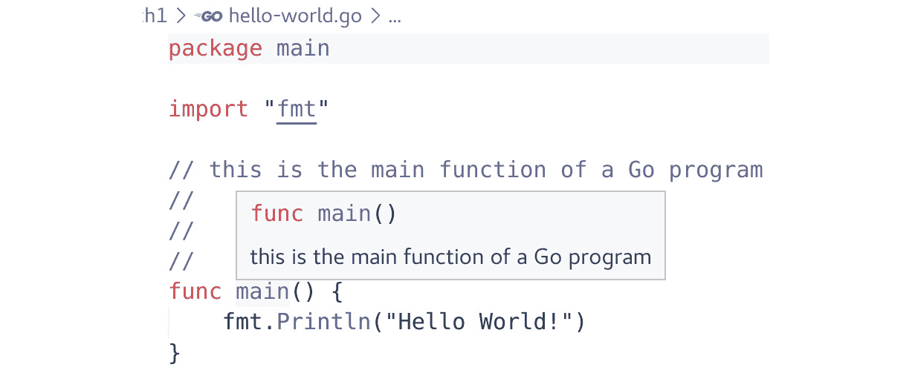
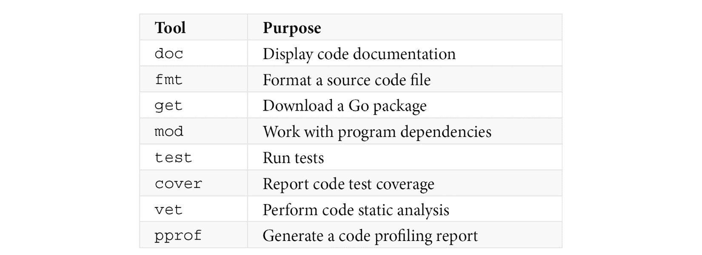
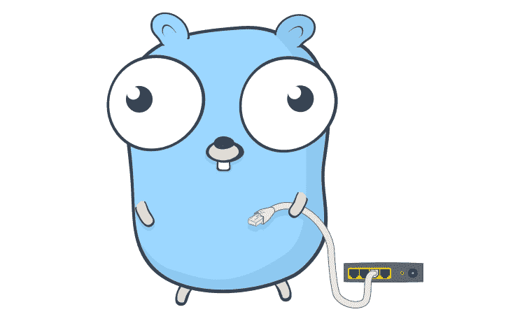
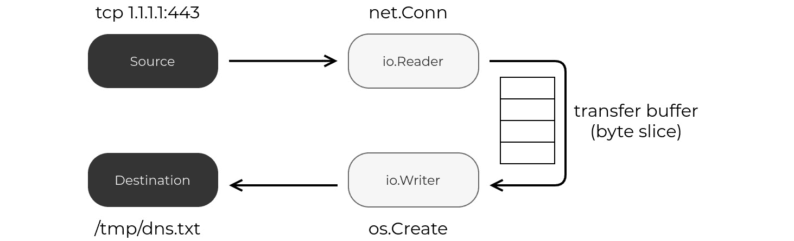

# 1

# 简介

**Go** 已经成为根据 *Stack Overflow Developer Survey 2021*（*进一步阅读*）调查中排名前三的最受欢迎的编程语言之一，并且已成为编写云原生应用程序（如 **Kubernetes**、**Docker**、**Istio**、**Prometheus** 和 **Grafana**）的首选语言。

尽管如此，我们仍然没有看到这一趋势在网络工程社区中体现出来，根据 *NetDevOps* 2020 调查（*进一步阅读*），不到 20% 的网络工程师表示他们目前使用 Go 进行网络自动化项目，尽管在 *Go Developer Survey 2020 Results*（*进一步阅读*）中，41% 的 Go 开发者表示他们使用 Go 进行网络编程。

本书旨在通过为希望使用 Go 语言来演进网络管理和操作的网络安全工程师以及希望进入网络基础设施自动化领域的软件工程师提供实用的 Go 语言和网络自动化入门，来弥补这一差距。我们也希望这本书对目前使用 Python 但希望用不同的编程语言扩展技能集的网络自动化工程师有所帮助。

我们首先从不同角度讨论 Go 的优势以及它们如何应用于网络领域。到本章结束时，您应该对 Go 的主要方面以及如何将 Go 安装到您的计算机上以跟随代码示例有一个很好的理解。

在本章的第一章中，我们将涵盖以下主题：

+   网络和 Go

+   为什么选择 Go？

+   Go 的未来

+   Go 与 Python 的比较

+   在您的计算机上安装 Go

# 技术要求

我们假设您对命令行、Git 和 GitHub 有基本的熟悉度。您可以在本书的 GitHub 仓库中找到本章的代码示例（[`github.com/PacktPublishing/Network-Automation-with-Go`](https://packages.cloud.google.com/apt/doc/apt-key.gpg)），在 `ch01` 文件夹下。

要运行示例，请按照以下步骤操作：

1.  为您的操作系统安装 Go 1.17 或更高版本。您可以根据本章的 *在您的计算机上安装 Go* 指令进行操作，或访问 https://go.dev/doc/install。

1.  使用 `git` 命令克隆本书的 GitHub 仓库 `clone https://github.com/PacktPublishing/Network-Automation-with-Go.git`。

1.  将目录更改为示例文件夹，使用 `cd Network-Automation-with-Go/ch01/concurrency`。

1.  执行 `go run main.go`。

# 网络和 Go

Go 在通用基础设施软件中得到广泛应用——从工作负载编排（Docker 和 Kubernetes），到遥测和监控（Prometheus 和 Grafana），再到自动化工具（Terraform 和 Vagrant）。

网络也不例外——一些使用 Go 的知名网络项目包括**容器网络接口**（**CNI**）插件，如**Cilium**或**Calico**，路由协议守护进程如**GoBGP**和**Bio-RD**，**虚拟专用网络**（**VPN**）软件如**Tailscale**，以及**OpenConfig**的大部分生态系统，包括**gRPC 网络管理接口**（**gNMI**）和**goyang**等项目。

其他用例包括云和网络服务、**命令行界面**（**CLIs**）、Web 开发、**开发运维**（**DevOps**）和站点可靠性。

Go 是 Go 的创始人创建的一种编程语言，旨在从第一天起解决现代挑战，如多核处理、分布式系统和大规模软件开发。

Go 内置的一等并发机制使其成为长期低带宽**输入/输出**（**I/O**）操作的理想选择，这是网络自动化和网络操作应用的典型需求。

是什么让 Go 语言对软件开发者如此有吸引力？为什么在所有编程语言中，你应该投入时间去学习 Go？这是我们将在下一节中讨论的内容。

# 为什么选择 Go？

当选择学习下一门编程语言时，大多数人主要关注技术原因。我们认为这个选择可以更加细致，因此我们尝试从不同的角度来探讨这个问题。我们首先从非技术角度出发，这是常常被忽视但我们认为很重要，并且可以对学习过程和日常使用产生重大影响的东西。在此之后，我们将探讨一些通用的技术论点，这些论点有助于 Go 在现代编程语言的激烈竞争中脱颖而出。我们通过探讨 Go 的各个方面，这些方面可以造福人们，特别是在网络和网络自动化领域，来结束本节。

## 非技术原因

无论你是新手还是对语言有一些经验，你都可以访问社区中愿意帮助你学习更多关于语言的开发者。我们包括一些社区资源的指针，并讨论 Go 的采用和流行。

最后但同样重要的是，我们想要讨论语言的成熟度，它是否仍在开发中，以及 Go 未来的发展方向。

### 社区

一个健康的社区几乎总是成功项目的特征。Go 编程语言也不例外，它拥有一个欢迎且不断增长的 Go 开发者社区——Gophers，根据 Russ Cox 的文章《有多少 Go 开发者？》（*进一步阅读*），全世界大约有 200 万 Gophers。您可以在以下位置看到 Renée French 的*Go Gopher*吉祥物：


图 1.1 – Go Gopher，由 Renée French 绘制

Go 用户社区有几个地方，新来者可以提问并获得经验丰富的 Go 开发者的帮助，如下所示：

+   *golang-nuts*邮件列表(*进一步阅读*)——Google Groups 上的通用语言讨论邮件列表

+   *Go 论坛* (*进一步阅读*)——一个独立的用于技术讨论、发布公告和社区更新的论坛

+   *Go 语言集体* (*进一步阅读*)——Stack Overflow 上的官方**问答**(**Q&A**)频道

+   *Gophers* Slack 频道(*进一步阅读*)——一个用于通用和特定主题讨论的地方，包括专门的社交网络频道

如果你想有更多的现场互动，这里也有一些选项，如下所述：

+   通过**Go 开发者网络**（**GDN**）(*进一步阅读*)，有很多面对面聚会可供选择。

+   Go 社区中的一个主要活动是定期在世界不同地区举办的*GopherCon*。

+   GitHub 上官方的 Go 语言页面跟踪了所有未来的和过去的 Go 语言会议及重大事件(*进一步阅读*)。

### 流行度

自 2000 年代末成立以来，Go 语言因其背后的开发者而受到了开发社区的广泛关注。由谷歌雇佣的一些最优秀的计算机科学家开发，Go 语言易于理解，且几乎与前辈语言一样高效，用于解决 C/C++的问题。它成熟需要了几年的时间，但很快成为了新的热门创业语言，许多新兴软件公司如 Docker 和 HashiCorp 都采用了它。

最近，*Stack Overflow Developer Survey 2021* (*进一步阅读*)将 Go 语言评为开发者最想要的三大编程语言之一。来自其母公司的持续支持以及 Kubernetes 的成功，使它成为编写云原生应用程序的事实上的标准语言，如 Istio、CoreDNS、Prometheus 和 Grafana 等知名项目。随着越来越多的用户采用这些应用程序，很难想象 Go 语言的流行度在未来会减弱。

这里有一些支持 Go 语言日益增长的流行度的额外数据点，值得提及：

+   根据 CNCF *DevStats*工具集的报告，291 个项目中，有 225 个使用 Go 语言，(*进一步阅读*)。

+   根据 GitHut 2.0 的数据，Go 语言在 GitHub 上拥有最多的星标，排名第三(*进一步阅读*(https://github.com/PacktPublishing/Network-Automation-with-Go/blob/main/ch04/trie/main.go )))。

+   Go 语言背后支持了四个最受欢迎的开发工具中的三个（Docker、Kubernetes 和 Terraform）(*进一步阅读*)。

+   Go 在*Stack Overflow Developer Survey 2021*的顶级薪酬技术排名中位列前十(*进一步阅读*)。

### 成熟度

虽然 Go 团队不久前（2012 年 3 月）发布了 Go（版本 1），但自那时起 Go 语言一直在进行一些小的改动。语言设计者坚持一个严格立场，反对添加可能引起功能膨胀的不必要特性。在 *GopherCon 2014* 的开幕式主题演讲中，Rob Pike 明确表示：“*语言已经完成*。”Russ Cox 在他的文章 *Go, Open Source, Community* (*进一步阅读*) 中也提到了这一点，特别指的是 Go 1。

这并不意味着 Go 没有自己的痛点。例如，依赖管理是 Go 团队最近通过引入 **Go 模块** 来解决的一个问题，以更好地组织你一起发布的 Go 包。还有一个 **泛型** 支持的缺乏，这是一个 Go 团队现在在 **Go 1.18** 中引入的特性，可能是自 Go（版本 1）发布以来最重大的变化。现在，用户可以使用泛型类型来表示函数和数据结构，这促进了代码的重用。这解决了社区的一个主要请求，正如 *Go 开发者调查 2020 结果* 所示 (*进一步阅读*)。

尽管如此，这些少数改动非常具有选择性，旨在显著提高开发者的生产力。可以安全地假设，我们不会每年都要学习新的语言概念和习惯用法，并且需要重写代码以保持向前兼容性。*Go 1 和 Go 程序的未来* (*进一步阅读*) 中关于 Go 1 兼容性的保证如下：

目的是编写符合 Go 1 规范的程序将在该规范的生命周期内继续编译和正确运行，保持不变。...在 Go 1.2 下运行的代码应该与 Go 1.2.1、Go 1.3、Go 1.4 等版本兼容。

Go 语言受益于从其他编程语言中学到的经验。Pascal、Oberon、C 和 Newsqueak 是影响 Go 的一些语言。我们在 *第二章*，*Go 基础* 中探讨了它们的影响。

Go 遵循 6 个月的发布周期 (*进一步阅读*)。在每个 Go 版本的发布说明中 (*进一步阅读*)，顶部都有一个部分描述了语言的变化，通常非常简短或为空。在过去的几年里，他们只报告了四种对语言的微小增强，这是一个成熟的良好迹象。

未来 Go 语言将会有多大变化是我们将在下一节讨论的内容。

# Go 的未来

Go 1 版本的成功吸引了大量开发者，其中大多数人在其他语言中积累了经验，这些经验帮助他们塑造了对编程语言应该提供什么功能的思维和期望。Go 团队定义了一个过程来提出、记录和实施对 Go 的更改（*进一步阅读*），为这些新贡献者提供一个表达意见和影响语言设计的方式。他们会将任何违反前述章节中描述的语言兼容性保证的提案标记为 Go 2。

Go 团队在*GopherCon 2017*上宣布了开发 Go 2 版本的过程，并在博客文章*Go 2，我们来了！*（*进一步阅读*）中进行了宣布。目的是确保语言能够继续使程序员能够开发大规模系统，并扩展到大型代码库，这些代码库是大型团队同时工作的。在*Toward Go 2*（*进一步阅读*）中，Russ Cox 说：

我们对 Go 2 的目标是修复 Go 无法扩展的最重要方式。

任何语言更改提案都需要遵循 Go 2 语言更改模板（*进一步阅读*）。他们正在将所有向后兼容的 Go 2 功能增量地引入 Go 1。完成之后，他们可以在 Go 2.0 中引入向后不兼容的更改（参见 Go 2 提案：*进一步阅读*），如果它们提供了显著的好处。

支持泛型数据类型是 Go 2 草案设计文档的一部分（*进一步阅读*），包括改进的错误处理和错误值语义。泛型的第一个实现已经进入 Go 1。列表中的其他项目仍在评估中，这推动了 2.0 版本的发布进一步推迟。

## 技术原因

根据根据*Go 开发者调查 2020 结果*（*进一步阅读*），Go 的构建速度是 Go 最令人满意的特点之一。它紧跟其后的是 Go 的可靠性，位居第二。

我们可以强调的技术方面有很多，但除了构建速度和可靠性之外，我们还涵盖了性能、交叉编译、可读性和 Go 的工具。

### 类型安全

大多数编程语言可以被广泛地分为两类：静态类型，当变量类型在编译时进行检查；或者动态类型，当这种检查在程序执行（运行时）期间发生。Go 属于第一类，要求程序显式声明所有变量类型。一些初学者或者有动态类型语言背景的人可能会觉得这是一个缺点。

类型声明会增加你需要编写的代码量，但作为回报，你不仅获得性能上的好处，还能在运行时避免类型错误，这些错误可能是许多微妙且难以调试的 bug 的来源。例如，考虑下一个代码示例中的程序，见[`github.com/PacktPublishing/Network-Automation-with-Go/blob/main/ch01/type-safety/main.go`](https://dev.maxmind.com/geoip/geolite2-free-geolocation-data)：

```go
func process(s string) string {
    return "Hello " + s
}
func main() {
    result := process(42)
}
```

一个`process`函数接受一个`string`数据类型作为输入，并返回另一个将`Hello`和输入字符串的值连接起来的`string`。如果一个动态类型程序接收到与`string`类型不同的值，例如整数，那么它可能会崩溃。

这些错误非常常见，尤其是在处理可以表示网络配置或状态的复杂数据结构时。Go 的静态类型检查防止编译器生成产生以下错误的可工作二进制文件：

```go
cannot use 42 (type untyped int) as type string in argument to process
```

Go 的静态类型也提高了可读性。当从零开始编写代码时，开发者可能能够将整个数据模型牢记于心，但随着新用户加入项目，代码的可读性变得至关重要，有助于他们理解逻辑以进行所需的代码更改。他们不再需要猜测变量存储的值类型——所有内容都由程序显式定义。这个特性如此有价值，以至于一些动态类型语言放弃了它们简洁性的好处，以引入对类型注解的支持（例如 Python 类型：*进一步阅读*），唯一的目标是帮助**集成开发环境**（**IDE**）和静态代码检查器捕获明显的类型错误。

### Go 构建速度快

Go 是一种编译型语言，可以在几秒钟或最多几分钟内创建*小型*的二进制文件。初始构建时间可能稍长，主要是因为下载依赖项、生成额外代码和进行其他日常活动所需的时间。后续构建运行的时间只是其中的一小部分。例如，下一个截图显示，重新构建一个 120-**兆字节**（**MB**）的 Kubernetes 应用程序编程接口（**API**）服务器二进制文件不超过 10 秒：

```go
$ time make kube-apiserver
+++ [0914 21:46:32] Building go targets for linux/amd64:
    cmd/kube-apiserver
> static build CGO_ENABLED=0: k8s.io/kubernetes/cmd/kube-apiserver
make kube-apiserver  10.26s user 2.25s system 155% cpu 8.041 total
```

这让你能够快速迭代开发过程，并保持专注，无需花费几分钟等待代码重新编译。一些开发者生产力工具，如 Tilt，会采取进一步措施优化开发工作流程，使得从开发者的 IDE 到本地预发布环境的变化只需几秒钟。

### 可靠性

让我们将这个术语定义为编程语言的一系列属性，这些属性有助于开发者编写更不容易因 bug 和其他故障条件而失败的程序，正如卡内基梅隆大学（**CMU**）的 Jiantao Pan 在*软件可靠性*（*进一步阅读*）中所描述的那样。这是 Go 的核心原则之一，正如其网站（*进一步阅读*）所强调的：

大规模快速、可靠和高效地构建软件。

根据 *2020 年 Go 开发者调查结果*（*进一步阅读*），Go 开发者也表示可靠性是他们最满意的 Go 的第二个方面，仅次于构建速度。

更可靠的软件意味着花费在追踪错误上的时间更少，更多的时间投入到额外功能的设计和开发中。我们试图汇集一组我们认为有助于提高程序可靠性的功能。但这并不是一个最终列表，因为对这些功能的解释和归因可能非常主观。以下是包含的功能：

+   **代码复杂性**—Go 语言设计上是一种简约语言。这转化为更简单、错误更少的代码。

+   **语言稳定性**—Go 语言提供了强大的兼容性保证，设计团队试图限制新添加的功能的数量和影响。

+   **内存安全**—Go 语言防止不安全的内存访问，这是在具有指针运算的语言（如 C 和 C++）中常见的错误和漏洞来源。

+   **静态类型**—编译时类型安全性检查捕获了许多在动态类型语言中否则可能被忽视的常见错误。

+   `go vet`。

### 性能

Go 是一种高性能的语言。*计算机语言基准测试游戏*（*进一步阅读*）显示，其性能与手动内存管理的语言（如 C/C++ 和 Rust）相似，并且它提供了比动态类型语言（如 Python 和 Ruby）更好的性能。

它原生支持多核多线程 **中央处理器**（**CPU**）架构，允许其扩展到单个线程以上，并优化 CPU 缓存的利用。

Go 的内置 **垃圾回收器**帮助您保持程序的低内存占用，Go 的显式类型声明优化了内存管理和值的存储。

Go 运行时为您提供分析数据，您可以使用 `pprof` 进行可视化，以帮助您查找程序中的内存泄漏或瓶颈，并微调您的代码以实现更好的性能和优化资源利用。

关于这个主题的更多细节，我们建议查看 Dave Cheney 的 *五个使 Go 运行快的因素* 博客文章（*进一步阅读*）。

### 跨平台编译

Go 可以原生为不同的目标架构和操作系统生成二进制文件。在撰写本文时，`go tool dist list` 命令返回了 45 种独特的组合，操作系统范围从 Android 到 Windows，指令集从 `PowerPC` 到 `ARM`。您可以使用 `GOOS` 和 `GOARCH` 环境变量更改从底层操作系统和架构继承的默认值。

无论您目前使用的是哪个操作系统，您都可以构建一个用 Go 编写的、操作系统本地的版本，如下面的代码片段所示：

```go
ch01/hello-world$ GOOS=windows GOARCH=amd64 go build
ch01/hello-world$ ls hello-world*
hello-world.exe
```

上述输出显示了在 Linux 机器上创建 Windows 可执行文件的示例。

### 可读性

这可以说是与 C 或 C++ 等其他高性能语言相比，Go 的最佳特性之一。Go 编程语言规范（*进一步阅读*）相对较短，大约有 90 页（而其他语言的规范可能超过 1,000 页）。它只包含 25 个关键字，只有一个用于循环（`for`）。功能数量有意降低，以帮助代码清晰，并防止人们开发出过多的语言习惯或最佳实践。

代码格式化在其他语言中是一个活跃的战场，而 Go 通过将自动的、有偏见的格式化作为 `go` 命令的一部分来防止了这个问题。对任何未格式化（但语法正确）的代码运行一次 `go fmt`，就会用正确数量的缩进和换行更新源文件。这样，所有 Go 程序都有相似的外观，通过减少代码中的个人风格偏好数量来提高可读性。

有些人可能会说，仅显式类型声明就能提高代码可读性，但 Go 通过将注释作为代码文档的组成部分进一步推进了这一点。任何函数、类型或变量声明之前的所有注释行都会被 `go doc` 工具网站（*进一步阅读*）或 IDE 解析，以自动生成代码文档，如下面的截图所示：



图 1.2 – 自动代码文档

大多数现代集成开发环境（IDE）都提供了插件，不仅支持文档，还支持使用 `go fmt` 进行自动代码格式化、代码检查和自动补全、调试以及语言服务器——一个允许开发者通过在类型、变量和函数声明及其引用之间来回导航来遍历代码的工具（`gopls`，Go 语言服务器：*进一步阅读*）。这个最后的功能不仅允许你无需手动解决导入语句或搜索文本中的字符串模式就能导航任何复杂性的代码库，而且在你编译程序之前即时突出显示任何类型的不一致性。

### 工具集

当设置新环境时，一个典型的开发者会做的第一件事就是下载并安装他们最喜欢的语言工具和库，以帮助进行测试、格式化、依赖管理等等。Go 默认包含了所有这些实用工具，它们是 `go` 命令的一部分。以下表格总结了某些 Go 内置工具及其用途：



表 1.1 – Go 工具

这些只是与 Go 二进制文件一起提供的最流行的工具中的一小部分。这无疑减少了工具生态系统中的创造性空间，因为它为开发者提供了一个足够好的默认选择，适用于大多数平均用例。这种人为稀缺的另一个好处是，每次在不同 Go 项目之间切换时，无需重新安装和重新学习一套新工具。

## Go 语言用于网络

一些网络自动化流程可以触发数百甚至数千个同时连接到网络设备。能够大规模地协调这些操作是 Go 语言使我们能够做到的事情之一。

你可以在以下屏幕截图中看到 Egon Elbre 的 *网络松鼠* 图标：



图 1.3 – 网络松鼠，由 Egon Elbre 创作

Go 语言自带强大的网络包，提供了创建网络连接的所有构造，用于从流行格式编码和解码数据的包，以及用于处理位和字节的原始数据类型。

### 并发

Go 语言通过 Go 运行时管理的轻量级线程（称为 **goroutines**）提供了第一级的并发支持。这种语言结构使得将异步函数嵌入到其他情况下顺序执行的程序中成为可能。

任何以 `go` 关键字开头的前缀函数调用都在一个单独的 goroutine 中运行——与主应用程序 goroutine 不同——它不会阻塞调用程序的执行。

Channels 是另一种语言特性，允许 goroutines 之间的通信。你可以将其视为一个 **先进先出**（**FIFO**）队列，发送和接收端存在于两个不同的 goroutines 中。

这两个强大的语言结构共同提供了一种以安全且统一的方式编写并发代码的方法，允许你同时连接到各种网络设备，而无需为每个设备运行一个操作系统线程。例如，考虑以下代码示例中的程序（[`github.com/PacktPublishing/Network-Automation-with-Go/blob/main/ch01/concurrency/main.go`](https://github.com/PacktPublishing/Network-Automation-with-Go/blob/main/ch04/geo/main.go)），该程序模拟与远程网络设备的交互：

```go
func main() {
    devices := []string{"leaf01", "leaf02", "spine01"}
    resultCh := make(chan string, len(devices))
    go connect(devices, resultCh)
    fmt.Println("Continuing execution") 
    for msg := range resultCh {
        fmt.Println(msg)
    }
}
```

连接到远程设备可能需要很长时间，通常这会阻塞程序其他部分的执行。通过在 goroutine 中运行 `connect` 函数，如以下代码片段所示，我们的程序可以继续执行，我们可以在未来的任何时刻返回并收集响应：

```go
ch01/concurrency$  go run main.go 
Continuing execution
Connected to device "leaf01"
Connected to device "spine01"
Connected to device "leaf02"
```

当远程设备处理请求并返回响应时，我们的程序开始按照接收到的顺序打印响应。

### 强大的标准库

Go 拥有一个功能丰富的标准库，涵盖了可能适用于网络的不同领域——从密码学到数据编码，从字符串操作到 `net` 和 `encoding` 提供了客户端和服务器端网络交互的接口，包括以下内容：

+   **互联网协议** (**IP**) 前缀解析和比较函数

+   IP、**传输控制协议/用户数据报协议** (**TCP/UDP**) 和 **超文本传输协议** (**HTTP**) 连接的客户端和服务器实现

+   **域名系统** (**DNS**) 查找函数

+   **统一资源定位符** (**URL**) 解析和操作

+   将数据格式序列化为 **可扩展标记语言** (**XML**)、二进制和 **JavaScript 对象表示法** (**JSON**) 以进行存储或传输

除非你有独特的性能要求，例如，大多数 Go 开发者不建议使用外部库来实现可以用标准库本地实现的逻辑。所有标准包在每个版本中都经过彻底测试，并在多个大型项目中广泛使用。所有这些为新用户提供更好的学习体验，因为最常用的数据结构和函数已经存在。

### 数据流

网络服务通常都是 I/O 密集型的——它们从网络读取或写入字节。这种操作模式是 Go 中数据流式传输的工作方式，这使得它对熟悉网络协议解析字节处理的网络工程师具有吸引力。

Go 中的 I/O 操作遵循一种模型，其中 **Reader** 从源读取数据，该数据可以作为一个字节数组流式传输到 **Writer**，而 **Writer** 将数据写入目标。以下图表应该能更清晰地展示这层含义：



图 1.4 – 从网络连接到文件流式传输示例

`Reader` 是一个接口，可以从文件、加密、shell 命令或网络连接等读取。然后，您可以将捕获到的数据流式传输到 `Writer` 接口，该接口也可以是文件或大多数其他 `Reader` 示例。

Go 标准库提供了这些流式接口，例如 `net.Conn`，在这种情况下，允许您从网络连接中读取和写入，在接口之间传输数据，并在需要时转换这些数据。我们将在 *第三章*，*Go 入门* 中更详细地介绍这个主题。

当选择编程语言时，除了考虑公司目前使用的是哪种语言或哪种语言让你感到更舒适等变量外，我们的目标是为你提供所有资源，让你了解是什么让 Go 对大规模系统开发者如此有吸引力。如果你想从熟悉的地方开始，我们将接下来比较和对比 Go 与 Python。Python 是目前用于网络自动化最受欢迎的编程语言。

# Go 与 Python 的比较

比较编程语言的议题可以迅速演变成一场激烈的辩论。我们相信所有语言都有其优点，我们不想鼓吹一种语言比另一种更好。然而，我们确实承认，大多数拥有网络自动化背景的人都会知道并使用 Python，因此，展示两种语言之间的某种形式的比较，并突出它们最显著的特点是有意义的。

## 代码执行

影响开发者体验的最大差异之一是如何分发和执行你的代码。

Python 程序需要在目标机器上运行解释器，并访问所有库依赖项。虽然有一些像 Nuitka 这样的项目可以将 Python 编译成，但你需要商业支持来混淆你的源代码，例如。拥有所有源代码可以让你在开发功能或调试错误时快速进行更改和迭代。

Go 程序不需要解释器，因为你可以将它们作为编译的二进制文件分发。将代码编译成机器代码可能看起来像是一个不必要的障碍，但编译只需要几秒钟，生成的二进制文件包含所有所需的依赖项，因此它是唯一需要在目标系统上存在的文件。

## 类型系统

Go 要求所有变量类型都必须在静态定义，只有在初始变量声明期间才允许类型推断。

虽然泛型正在进入 Go，但它们并不像 Python 类型系统那样提供相同的自由度。缺乏显式类型声明使得 Python 对于初学者以及开发速度比代码健壮性更重要的用例来说是一个更易接近的语言。然而，随着 Python 项目的日益成熟，它们必须通过更多地关注测试来弥补这些初始的收益。

## 性能

与 Python 相比，Go 程序在广泛的用例中表现更好（参见*The Computer Language Benchmarks Game*：*进一步阅读*）。这在一定程度上是我们已经在本节中提到的观点的结果，但也是 Go 团队投入优化语言的成果。

尽管 goroutines 和类型定义为 Go 开发者提供了足够的工具来编写高性能代码，但每个 Go 版本都会带来新的内存管理和编译器优化改进，使代码在后台执行更快。

## 易用性

Python 是一种设计用于教学和原型设计的语言。同时，它足够灵活和强大，可以编写复杂的程序，例如网络服务器（Flask、Django）、**机器学习**（**ML**）框架（PyTorch、TensorFlow）和基础设施软件（RabbitMQ、Ansible）。

随着你参与的 Python 项目的数量增加，维护不同的虚拟环境以进行依赖和环境管理可能会变得麻烦。这是 Go 闪耀的地方，它拥有自托管的依赖管理器和静态链接的二进制文件。

尽管如此，Python 仍然保持着作为最具亲和力的语言的主导地位，拥有庞大的开源社区，并且不太可能在短期内放弃这一地位。

## 内存管理

两种语言都使用动态内存管理，并具有自动垃圾回收功能。大多数时候，你不需要也不建议更改任何默认设置，尽管两种语言都公开了一些阈值变量，如果需要可以对其进行微调。

最大的区别来自于 Go 根据一组更精确的数据类型来分配内存，并且它在编译时在栈中为 goroutines 和函数进行静态内存分配，只有一小部分变量逃逸到堆中。相比之下，Python 将所有内容都视为对象，即使是像 `int` 或 `string` 这样最原始的类型，也相当大，它们在运行时（在堆中）动态分配内存。

访问堆中的内存不仅速度较慢，还需要进行垃圾回收，这给程序执行增加了开销。

## 语法

Python 语法非常轻量级，使用缩进来区分不同的代码块。没有尾随的分号和过多的花括号使得代码易于理解，但如果没有使用集成开发环境（IDE）——它会自动管理缩进——编写代码可能会是一个挑战。

Go 从未考虑空白字符用于缩进，因为语言设计者不相信让语义依赖于不可见字符是一个好主意。当然，这取决于个人偏好；例如，**YAML Ain't Markup Language**（**YAML**）这样的格式也使用空格来结构化数据。

Go 从其内置的格式化工具中受益，该工具自动缩进代码，并通过在特定位置自动插入空白行使代码看起来整洁。此外，Go 开发者使用空白行来逻辑上分隔函数中的一组行，这使得最终程序更稀疏且易于阅读。

## 故障处理

另一个很大的区别在于错误处理。Python 通过依赖异常作为惯例来使用隐式错误处理，这些异常可以在你预期它们发生的代码部分被小心捕获。这符合 Python 的可读性和易用性。Go 使用显式错误检查，并且大多数函数将错误作为最后一个位置返回值。这通常会导致代码看起来像这样：

```go
config, err := buildConfig(deviceName)
if err != nil {
   return err
}

d, err := connect(deviceName)
if err != nil {
   return err
}

if err := configure(d, config); err != nil {
   return err
}
```

尽管这通过迫使开发者始终考虑返回的错误并在发生时立即采取行动，使程序更加健壮，但这确实会产生大量的视觉噪音，人类大脑很快就会学会忽略它。这是 Go 社区反复讨论的话题之一，也是 Go 2 版本重点关注的领域之一。Go 2 错误处理草案设计文档详细介绍了问题和建议（*进一步阅读*）。

## 并发

并发不仅自 Go 诞生以来就是 Go 的一个特性，也是 Go 创造背后的关键驱动力之一。Go 有足够的顶级语言结构来处理大多数常见的并发挑战，例如进程间的通信和对共享资源的访问。

与之相反，你无法同时运行两个或更多的 Python 线程，因为 **全局解释器锁** (**GIL**) 阻止了这一点，Python 语言设计者在早期就将它作为语言的一部分。除非你设计你的程序来使用线程库。GIL 对单线程程序有性能上的好处，而移除它一直是 Python 社区反复讨论的话题。

为了实现并发，Python 让你运行多个进程来利用你拥有的所有 CPU（多进程或并发池）。随着时间的推移，不同的库试图改进性能和 `asyncio`。

尽管如此，更好的并发性和并行性是 Python 开发者调查 2020 年结果中排名前三的最希望添加的功能之一（*进一步阅读*）。大多数 Python 开发者不喜欢当前的实现，因为在 Python 中编写并发代码可能具有挑战性，并且需要使用兼容的库。

## 社区

作为两种语言中更受欢迎的一种，Python 拥有一个更大的社区，拥有大量的开源库和框架。尽管其主要用例是数据分析、Web 开发和机器学习（*2020 年 Python 开发者调查结果*：*进一步阅读*），但今天你可以找到处理从游戏开发到桌面插件等任何内容的库。

最重要的是，Python 是网络自动化的最流行语言，积累了大量用于与网络设备一起工作的库和框架。Go 更注重系统和性能，所以我们看不到太多的网络库和工具。尽管如此，网络工程社区中 Go 的一个主要用户是 OpenConfig 生态系统，它今天包括几乎十多个用 Go 编写的不同项目。

Go 正在被 Web 规模的公司迅速采用，这意味着我们很可能会在未来看到更多与网络相关的项目出现。

我们希望这能给你一个对 Go 语言特性的视角和欣赏。下一步是在你的计算机上安装 Go。

# 在你的计算机上安装 Go

Go 的下载和安装说明（[`golang.org/doc/install#install`](https://github.com/c-robinson/iplib)）要求你从[`go.dev/`](https://github.com/PacktPublishing/Network-Automation-with-Go/blob/main/ch04/ipaddr/main.go)下载一个文件并遵循一些说明。我们在此包括**Go 版本 17.7**的步骤，这是撰写时的最新版本。Go 1 的新版本应该继续工作。

## Windows

要在 Windows 上安装 Go，请按照以下步骤操作：

1.  下载 [`golang.org/dl/go1.17.7.windows-amd64.msi`](https://github.com/cloudprober/cloudprober).

1.  执行`go1.17.7.windows-amd64.msi`文件并按照说明操作。

1.  打开命令提示符（`cmd`）并运行`go version`以验证安装。

## Mac

如果你已经安装了 Homebrew，你可以运行`brew install go`。否则，你可以按照以下步骤操作：

1.  下载 [`golang.org/dl/go1.17.7.darwin-amd64.pkg`](https://github.com/PacktPublishing/Network-Automation-with-Go/tree/main/ch04/udp-ping)

1.  执行`go1.17.7.darwin-amd64.pkg`文件并按照说明操作。

1.  打开终端并运行`go version`以验证安装。

## Linux

Go 通常作为 Linux 发行版中的系统包提供，但通常是较旧版本。按照以下步骤安装较新版本：

1.  下载 [`golang.org/dl/go1.17.7.linux-amd64.tar.gz`](https://github.com/PacktPublishing/Network-Automation-with-Go).

1.  使用`rm -rf /usr/local/go`删除任何现有的 Go 安装。

1.  使用`tar -C /usr/local -xzf go1.17.7.linux-amd64.tar.gz`将下载的存档解压到`/usr/local`。

1.  使用`export PATH=$PATH:/usr/local/go/bin`将`/usr/local/go/bin`添加到`PATH`环境变量中。为了使其持久化，请将此行也添加到`$HOME/.bash_profile`中。最后一部分对`bash`有效，但如果你使用不同的 shell，你可能需要做类似的事情。

1.  运行`go version`以验证安装

就这样！你现在可以在系统中下载和安装 Go 而无需任何麻烦。要安装不同版本，只需将说明中的`17.7`替换为你选择的版本号。

# 摘要

在本章中，我们回顾了为什么 Go 对于网络和网络自动化很重要。我们探讨了 Go 的各个方面，使其成为数百万开发者的首选选择。我们还探讨了如何在你的计算机上安装它。在下一章中，我们将更深入地探讨 Go 编程语言、其源文件及其工具。

# 进一步阅读

你可以参考以下资源进行进一步阅读：

+   *Stack Overflow Developer Survey 2021*: [`insights.stackoverflow.com/survey/2021#most-loved-dreaded-and-wanted-language-want`](https://github.com/PacktPublishing/Network-Automation-with-Go/blob/main/ch04/http/client/main.go)

+   *NetDevOps* 2020 调查：[`dgarros.github.io/netdevops-survey/reports/2020`](https://github.com/Green-Software-Foundation/awesome-green-software)

+   *Go 开发者调查 2020 结果*：[`go.dev/blog/survey2020-results`](https://docs.aws.amazon.com/awsaccountbilling/latest/aboutv2/what-is-ccft.html)

+   *有多少 Go 开发者？*：[`research.swtch.com/gophercount`](https://kubernetes.io/blog/2017/10/software-conformance-certification/)

+   *golang-nuts*：[`groups.google.com/forum/#!forum/golang-nuts`](https://github.com/PacktPublishing/Network-Automation-with-Go/blob/main/ch04/http/server )

+   *Go* *论坛*：[`forum.golangbridge.org/`](https://docs.projectcalico.org/manifests/tigera-operator.yaml)

+   *Go 语言* *集体*：[`stackoverflow.com/collectives/go`](https://docs.projectcalico.org/manifests/custom-resources.yaml)

+   *Gophers Slack* *频道*：[`invite.slack.golangbridge.org/`](https://multipass.run/)

+   **Go 开发者网络** (**GDN**)：[`www.meetup.com/pro/go`](https://multipass.run/)

+   CNCF DevStats 工具集：[`k8s.devstats.cncf.io/d/67/licenses-and-programming-languages?orgId=1`](https://github.com/kubernetes/kubernetes)

+   [`madnight.github.io/githut/#/stars/2021/2`](https://github.com/PacktPublishing/Network-Automation-with-Go/blob/main/ch04/http/client)

+   Go 6 个月发布周期：`github.com/golang/go/wiki/Go-Release-Cycle`

+   Go 发布说明：https://golang.org/doc/devel/release

+   [Go 语言提案](https://github.com/golang/proposal#proposing-changes-to-go)(https://github.com/PacktPublishing/Network-Automation-with-Go/tree/main/ch06/ssh)

+   向 Go 2 迈进：[`go.dev/blog/toward-go2`](https://sdg-tracker.org/)

+   Go 2 语言变更模板：[`github.com/golang/proposal/blob/master/go2-language-changes.md`](https://docs.aws.amazon.com/wellarchitected/latest/sustainability-pillar/sustainability-pillar.html)

+   Go 2 提案：[`github.com/golang/go/issues?utf8=%E2% 9C%93&q=is%3Aissue+is%3Aopen+label%3AGo2+label%3AProposal`](https://docs.microsoft.com/en-us/azure/architecture/framework/)

+   Go 2 草案设计文档：[`go.googlesource.com/proposal/+/master/design/go2draft.md`](http://www.sustainableitplaybook.com)

+   Python 类型：[`docs.python.org/3/library/typing.html`](https://man7.org/linux/man-pages/man7/capabilities.7.html )

+   `go doc`工具网站：[`pkg.go.dev/`](https://github.com/google/gopacket )

+   Go 语言服务器：[`go.googlesource.com/tools/+/refs/heads/master/gopls/README.md#editors`](https://github.com/PacktPublishing/Network-Automation-with-Go/tree/main/ch06/ssh)

+   Go 2 草案设计文档：[`go.googlesource.com/proposal/+/master/design/go2draft-error-handling-overview.md`](https://dgarros.github.io/netdevops-survey/reports/2020)

+   *Go 会议和重大活动*：[`github.com/golang/go/wiki/Conferences#go-conferences-and-major-events`](https://github.com/PacktPublishing/Network-Automation-with-Go/blob/main/topo-base/topo.yml)

+   流行开发工具：[`insights.stackoverflow.com/survey/2021#most-loved-dreaded-and-wanted-tools-tech-love-dread`](https://github.com/PacktPublishing/Network-Automation-with-Go/tree/main/ch06/ssh)

+   最高薪酬技术排名：[`insights.stackoverflow.com/survey/2021#technology-top-paying-technologieshttps://insights.stackoverflow.com/survey/2021#technology-top-paying-technologies`](https://github.com/PacktPublishing/Network-Automation-with-Go/tree/main/ch06/vssh)

+   Go 版本 1：[`go.dev/blog/go1`](https://github.com/PacktPublishing/Network-Automation-with-Go/tree/main/ch06/http)

+   *为什么 Go 没有功能* *X*？*: [`golang.org/doc/faq#Why_doesnt_Go_have_feature_Xhttps://golang.org/doc/faq#Why_doesnt_Go_have_feature_X`](https://demo.netbox.dev/)

+   *Go，开源，社区*: `go.dev/blog/open-source`

+   *Go 1 和 Go 程序的未来*: `golang.org/doc/go1compat`

+   *Go 2，我们来了!*: [`go.dev/blog/go2-here-we-come`](http://www.blender.org)

+   *软件可靠性*: [`users.ece.cmu.edu/~koopman/des_s99/sw_reliability/`](https://github.com/Green-Software-Foundation/awesome-green-software)

+   *计算机语言基准测试游戏*: `benchmarksgame-team.pages.debian.net/benchmarksgame/fastest/go-gpp.html`

+   *让 Go 变得快的五个因素*: `dave.cheney.net/2014/06/07/five-things-that-make-go-fast`

+   *Go 编程语言* *规范*: [`golang.org/ref/spec`](https://docs.aws.amazon.com/wellarchitected/latest/framework/sustainability.html)

+   *Python 开发者调查 2020* *结果*: [`www.jetbrains.com/lp/python-developers-survey-2020/`](https://docs.aws.amazon.com/awsaccountbilling/latest/aboutv2/what-is-ccft.html)
