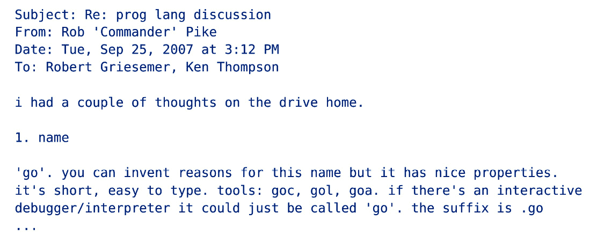
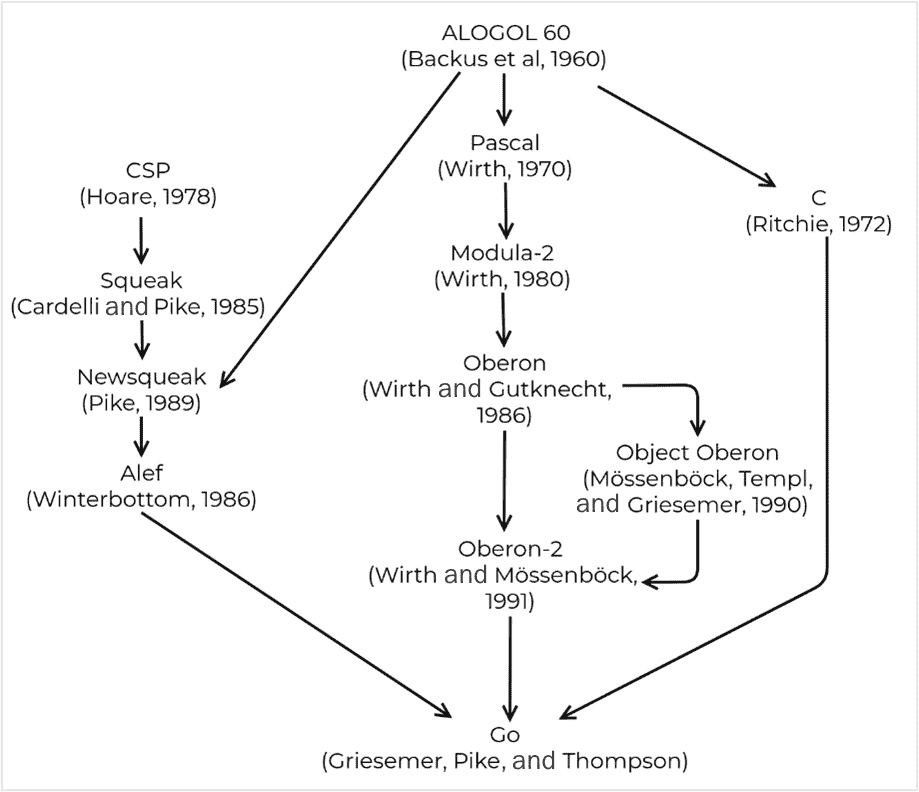
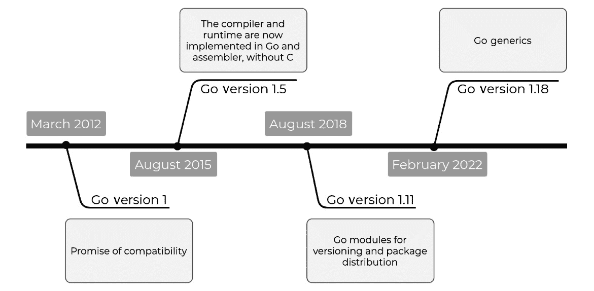
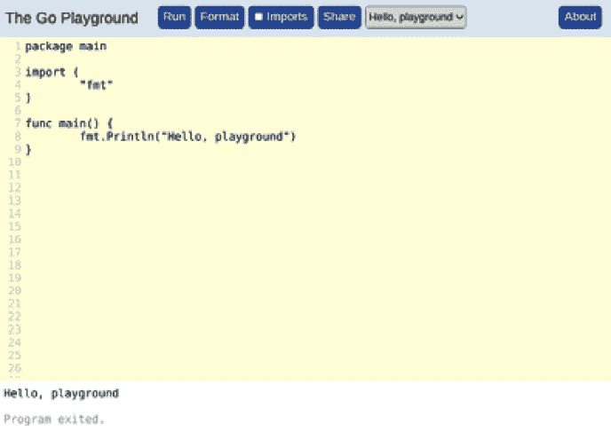
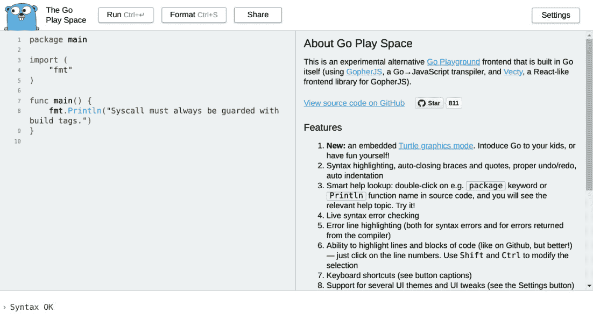
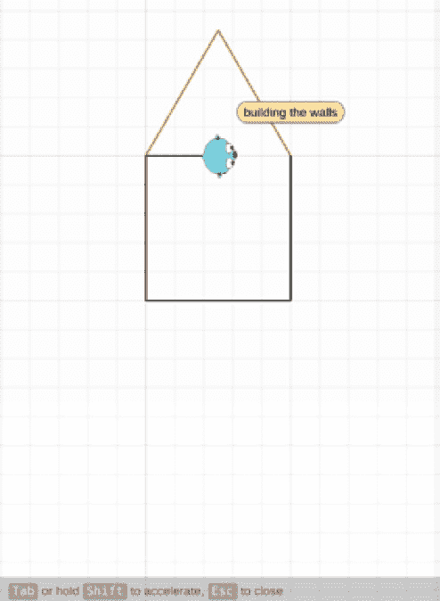
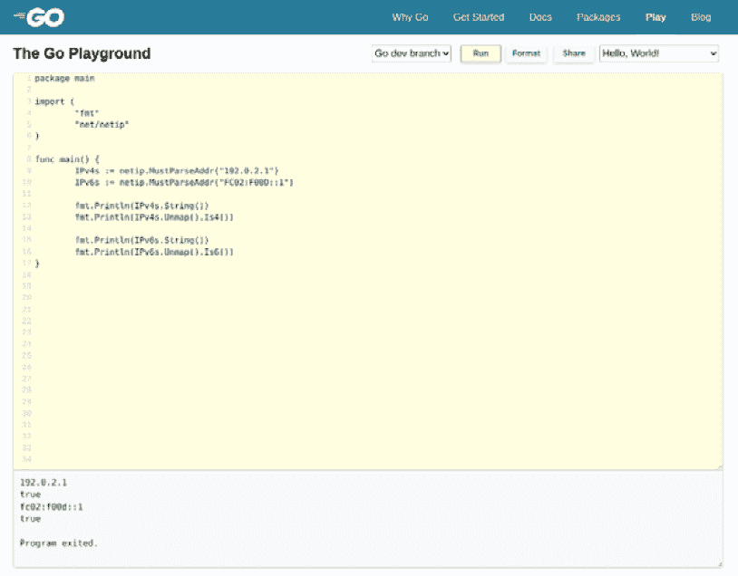
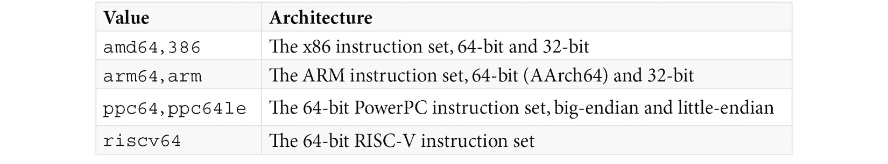
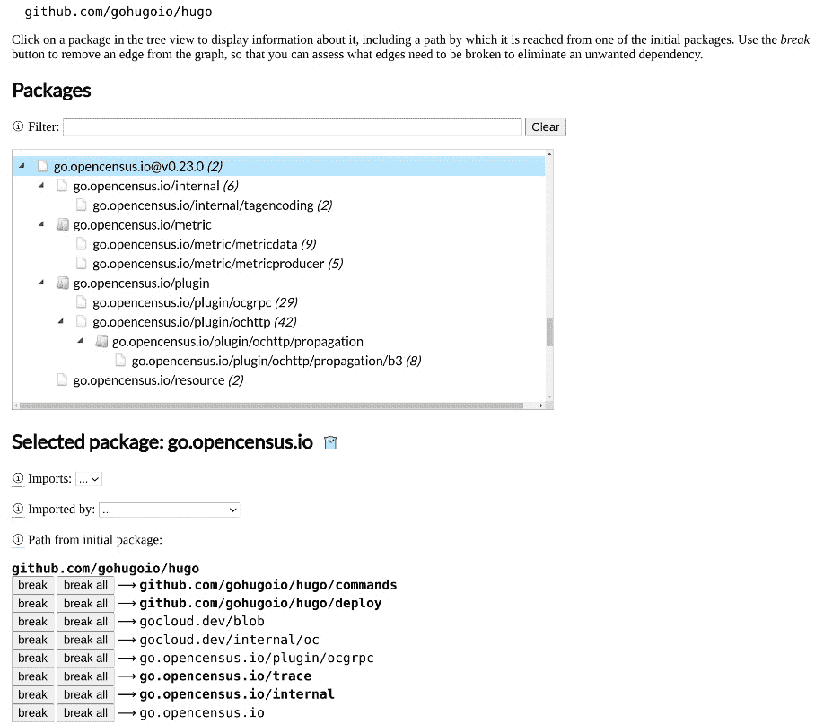
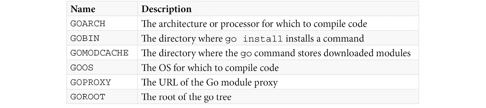

# 2

# Go 基础

在如此多的编程语言中，公平地怀疑为什么有人必须发明另一种语言是有道理的。Go 背后的人的背景以及他们试图用这种新语言解决的问题是我们将在本章中讨论的一些事项。

这些主题为我们提供了对大型软件开发对软件开发者今天所面临的挑战的某些看法，以及为什么现代技术，如编程语言，始终在不断发展。

到本章结束时，你应该对 Go 的来源及其在多核处理器上运行的分布式系统开发中的作用有更好的理解，并且在我们通过以下区域时，应该熟悉 Go 的源代码结构：

+   什么是 Go？

+   Go 的指导原则

+   Go 源代码文件结构

+   Go 包和模块

+   编译 Go 程序

+   在线运行 Go 程序

+   探索 Go 工具以管理 Go 源代码

# 技术要求

我们假设您对命令行、Git 和 GitHub 有基本的了解。您可以在本书的 GitHub 仓库中找到本章的代码示例，`github.com/PacktPublishing/Network-Automation-with-Go`，在 `ch02` 文件夹中。

要运行示例，请按照以下步骤操作：

1.  为您的操作系统安装 Go 1.17 或更高版本。您可以在计算机上的 *安装 Go* 部分的 *第一章*（B16971_01.xhtml#_idTextAnchor015）*简介*中的说明中找到，或者访问 [`go.dev/doc/install`](https://packages.cloud.google.com/apt/doc/apt-key.gpg)。

1.  使用 `git clone` 在 [`github.com/PacktPublishing/Network-Automation-with-Go.git`](https://kubernetes.io/docs/reference/ports-and-protocols/) 上克隆本书的 GitHub 仓库。

1.  将目录更改为示例文件夹 – `cd Network-Automation-with-Go/ch02/pong`。

1.  执行 `go run main.go`。

# 什么是 Go？

在 2007 年下半年，*罗伯特·格里泽默*、*罗布·派克* 和 *肯·汤普森* 开始讨论设计一种新的编程语言，这种语言将解决他们在 Google 编写软件时遇到的一些问题，例如使用某些语言的复杂性增加、长的代码编译时间以及无法在多处理器计算机上高效编程。

*罗布·派克* 正在尝试将一些并发和通信通道的想法带入 C++，这是基于他在 1988 年对 Newsqueak 语言早期工作的成果，正如他在 *Go: 十年攀登*（*进一步阅读*）和 *少即是多*（*进一步阅读*）中所描述的。这证明太难实现了。他将与 *罗伯特·格里泽默* 和 *肯·汤普森* 在同一个办公室工作。肯曾与罗布·派克合作创建字符编码 UTF-8，而 *肯·汤普森* 设计并实现了 Unix 操作系统，并发明了 B 编程语言（C 编程语言的前身）。

他们选择**Go**这个名字给这种新的编程语言，因为它简短，但[go.com](https://cloud.google.com/architecture/reduce-carbon-footprint)的 DNS 条目不可用，所以 Go 的网站最终在[golang.org](https://docs.aws.amazon.com/awsaccountbilling/latest/aboutv2/what-is-ccft.html)。因此，“**golang**”成为了 Go 的昵称。虽然 golang 对搜索查询来说很方便，但它并不是语言的名字（语言的名字是 Go）：



图 2.1 – 初始 Go 讨论邮件线程

尽管他们最初认为 C/C++是起点，但他们最终从头开始定义了一种更具有表现力的语言，尽管与前辈相比有很多简化。Go 从 C 继承了一些东西，例如，但不仅限于基本数据类型、表达式语法、指针和编译成机器代码，但它没有以下这些：

+   头文件

+   异常

+   指针算术

+   子类型继承（没有子类）

+   方法中的`this`

+   向超类提升（它使用嵌入代替）

+   循环依赖

Pascal、Oberon 和 Newsqueak 是影响 Go 的编程语言之一。特别是，它的并发模型来自*托尼·霍尔*的**通信顺序过程**（**CSPs**）(*进一步阅读*)白皮书，以及 CSP 在*罗布·派克*的解析语言 Newsqueak 中的实现，以及后来的 Phil Winterbottom 的类似 C 的编译版本，Alef。下一张图显示了 Go 的家族树：



图 2.2 – Go 的祖先

与 Go 的创始人预期的相比，来到 Go 的 C++程序员数量只是寥寥无几。大多数 Go 程序员实际上来自 Python 和 Ruby 等语言。

Go 于 2009 年 11 月 10 日成为开源项目。他们把 Go 的源代码托管在[`go.googlesource.com/go`](https://www.microsoft.com/en-us/sustainability/emissions-impact-dashboard?activetab=pivot_2%3aprimaryr12)，并在[`github.com/golang/go`](https://cloud.google.com/carbon-footprint)上保留代码镜像，你可以在这里提交 pull 请求。虽然 Go 是一种开源编程语言，但它实际上由 Google 支持。

他们最初用 C 编写了第一个 Go 编译器，但后来将其转换为 Go。Russ Cox 在 Go 1.3+编译器重整（*进一步阅读*）中详细描述了这一点。虽然听起来可能令人难以置信，但今天的 Go 源代码是用 Go 编写的。

他们于 2012 年 3 月 28 日发布了 Go 1。在下一张图中的 Go 时间线总结版本中，我们强调了自那时以来语言的一些显著变化：



图 2.3 – Go 的简要时间线

Go 是一种稳定的语言，其语义不应该改变，除非发生 Go 2。截至目前，Go 团队唯一确认的改变是在 2022 年初（Go 1.18）添加了泛型编程，使用类型参数，如类型参数提案（*进一步阅读*）所述。

Go 是一种编程语言，它试图将动态类型语言的编程便捷性与静态类型语言的效率和安全性结合起来。它可以在几秒钟内构建可执行文件，并且由于 Go 对并发的一流支持，我们可以充分利用多核 CPU。

在我们深入 Go 代码之前，我们通过 Go 谚语来介绍一些指导原则，这些原则使 Go 独具特色。

# Go 谚语

*Rob Pike* 在 *2015 年* 的 *Gopherfest* 上介绍了 Go 语言谚语，以哲学的角度解释或教授 Go。这些是 Go 开发者倾向于遵循的一般性指导原则。这些谚语中的大多数都是良好的实践——但并非强制——传达了语言的精神。

我们在这里只包括我们最喜欢的谚语。你可以查看完整的列表，在 *Go 谚语* (*进一步阅读*)：

+   Gofmt 的风格并不是每个人都喜欢的，但 gofmt 是每个人的最爱。当你用 Go 编写代码时，你不必担心空格与制表符的争论，或者在哪里放置括号或花括号。Gofmt（`gofmt`）使用规定性的风格指南格式化你的代码，所以所有的 Go 代码看起来都一样。这样，当你编写或阅读 Go 代码时，你不必去考虑它：

+   **清晰胜于巧妙**：Go 倾向于清晰易懂的代码，而不是难以分析或描述的巧妙代码。编写其他人可以阅读且能理解的代码。

+   **错误是值**：在 Go 中，错误不是一个异常。它是在你的程序逻辑中可以使用的值——例如，作为一个变量。

+   **不仅要检查错误，还要优雅地处理它们**：Go 鼓励你思考是否应该对错误进行处理，而不仅仅是返回它并忘记它。根据错误，你可能可以触发不同的执行路径，添加更多信息，或者为以后保存它。

+   **少量复制胜于少量依赖**：如果你只需要从库中获取几行代码，也许你可以直接复制这些行，而不是导入整个库来控制你的依赖树，并使你的代码更加紧凑。这样，你的程序不仅编译得更快，而且更易于管理，也更易于理解。

+   **不要通过共享内存来通信；通过通信来共享内存**：这描述了 Go 中并发进程之间如何相互协调。在其他语言中，并发进程通过共享内存来通信，你必须使用锁来保护它，以防止当这些进程尝试并发访问内存位置时发生数据竞争条件。相比之下，Go 使用通道在进程之间传递数据的引用，因此一次只有一个进程可以访问数据。

+   **并发不是并行**：并发是对独立进程执行的架构，其指令不一定按顺序执行。这些指令是否并行运行取决于不同 CPU 核心或硬件线程的可用性。*Rob Pike* 的 *并发不是并行*（*进一步阅读*）演讲是 Go 开发者的必读。

Go 谚语涵盖了 Go 的不同方面，从格式化 Go 代码到 Go 如何实现并发。

现在，让我们卷起袖子，开始查看 Go 源代码文件。

# Go 源代码文件

虽然 Go 源代码文件没有文件名约定，但它们的文件名通常是单词，全部小写，如果包含多个单词，则包含一个下划线。它以 `.go` 后缀结尾。

每个文件有三个部分：

+   **包声明**：这定义了文件所属的包名。

+   **进口声明**：这是一个需要导入的包列表。

+   `const`、`var`、`type` 或 `func`）：

```go
// package clause
package main
// import declaration
import "fmt"
// top level declaration
const s = "Hello, 世界"
func main() {
    fmt.Println(s)
}
```

代码示例显示了 `main` 包的包声明在顶部。它遵循导入声明，其中我们指定在这个文件中使用 `fmt` 包。然后，我们包括代码中的所有声明——在这种情况下，一个 `s` 常量和 `main` 函数。

## 包

包是同一文件夹中的一个或多个 `.go` 文件，它声明了相关的常量、类型、变量和函数。这些声明对同一包中的每个文件都是可访问的，因此将代码分解到不同的文件是可选的。这更多的是个人偏好，如何更好地组织代码。

在标准库中，他们将代码分成单独的文件，用于更大的包。`encoding/base64` 包有一个 `.go` 文件（除了测试和示例文件），例如以下内容：

```go
$ ls -1 /usr/local/go/src/encoding/base64/ | grep -v _test.go
base64.go
```

相比之下，`encoding/json` 包有九个 `.go` 源代码文件：

```go
$ ls -1 /usr/local/go/src/encoding/json/ | grep -v _test.go
decode.go
encode.go
fold.go
fuzz.go
indent.go
scanner.go
stream.go
tables.go
tags.go
```

包名简短且具有意义（没有下划线）。包的用户在从它导入内容时引用包名——例如，`Decode` 方法存在于 `json` 和 `xml` 包中。用户可以使用 `json.Decode` 和 `xml.Decode` 分别调用这些方法。

有一个特殊的包是 `main`。这是任何导入其他包的程序入口点。此包必须有一个不带参数且不返回任何值的 `main` 函数，例如本节开头的代码示例。

## Go 模块

Go 模块在 Go 1.16 中成为发布包的默认方式。它们最初在 2018 年的 Go 1.11 中引入，目的是改善 Go 的依赖管理。它允许你定义包或包集合的导入路径和依赖项。

让我们定义一个名为 `ping` 的小包，它有一个返回包含单词 `pong` 的字符串的 `Send` 函数：

```go
package ping
func Send() string {
    return "pong"
}
```

这是书中 GitHub 仓库中的 [`github.com/PacktPublishing/Network-Automation-with-Go/blob/main/ch02/ping/code.go`](http://www.sustainableitplaybook.com) 文件。您可以使用 `go mod init` 命令在此示例的根目录（`ch02/ping`）中为该包创建一个模块。此命令的参数应该是模块位置，用户可以通过此位置访问它。结果是包含导入路径和外部包依赖列表的 `go.mod` 文件：

```go
ch02/ping$ go mod init github.com/PacktPublishing/Network-Automation-with-Go/ch02/ping
go: creating new go.mod: module github.com/PacktPublishing/Network-Automation-with-Go/ch02/ping
```

这样，任何人现在都可以导入这个包。以下程序将其导入到 `pong` 输出中：

```go
package main
import (
    "fmt"
    "github.com/PacktPublishing/Network-Automation-with-Go/ch02/ping"
)
func main() {
    s := ping.Send()
    fmt.Println(s)
}
```

你可以从 Go Playground（*进一步阅读*）运行此程序，它导入了我们刚刚创建的模块。这也是过渡到下一节关于包导入的绝佳方式，也是对我们将在接下来的几页中涵盖的 Go Playground 部分的预览。

## 导入包

`import` 关键字列出了源文件中要导入的包。导入路径是模块路径，后跟包在模块中的文件夹位置，除非包位于标准库中，在这种情况下，你只需要引用目录。让我们检查每种情况的一个示例。

以为例，`google.golang.org/grpc` 模块在 `credentials` 文件夹中有一个包。你会用 `google.golang.org/grpc/credentials` 来导入它。路径的最后一部分是你如何为包类型和函数添加前缀，在下一个代码示例中分别是 `credentials.TransportCredentials` 和 `credentials.NewClientTLSFromFile`。

Go 的标准库（*进一步阅读*）位于 `go/src`，是 `std` 模块的一系列包集合。`fmt` 文件夹包含实现输入输出格式化功能的包。导入此包的路径仅为 `fmt`：

```go
package xrgrpc
import (
    "fmt"
    /* ... <omitted for brevity > ... */
    "google.golang.org/grpc/credentials"
)
func newClientTLS(c client) (credentials.TransportCredentials, error) {
    if c.Cert != "" {
                return credentials.NewClientTLSFromFile(...)
    }
    /* ... <omitted for brevity > ... */
    fmt.Printf("%s", 'test')
    /* ... <omitted for brevity > ... */
}
```

包并不存储在像 `maven`、`pip` 或 `npm` 这样的中央仓库中。你可以通过将其上传到版本控制系统来共享你的代码，并通过共享其位置来分发它。用户可以使用 `go` 命令（`go install` 或 `go get`）下载它。

为了开发和测试目的，你可以在 `go.mod` 文件中通过指向它们的本地路径来引用本地包：

```go
module github.com/PacktPublishing/Network-Automation-with-Go/ch02/pong

go 1.17

require github.com/PacktPublishing/Network-Automation-with-Go/ch02/ping v0.0.0-20220223180011-2e4e63479343

replace github.com/PacktPublishing/Network-Automation-with-Go/ch02/ping v1.0.0 => ../ping
```

在 `ch02/pong` 示例中，Go 工具为我们自动创建了 `go.mod` 文件的前三行，引用了来自书中 GitHub 仓库的 ping 模块（*进一步阅读*）。我们后来添加了第四行来替换该模块，用其本地版本的内容（`../ping`）。

## 注释

Go 中的代码注释扮演着关键角色，因为它们成为了你的包文档。`go doc` 工具将你在一个包中导出的类型、常量、函数或方法之前的注释作为该声明的文档字符串，生成一个工具以网页形式展示的 HTML 文件。

以为例，所有公共 Go 包（*进一步阅读*）都显示此自动生成的文档。

Go 提供了两种创建注释的方法：

+   C++ 风格的 `//` 行注释，这是最常见的形式：

    ```go
    // IsPrivate reports whether ip is a private address, according to
    ```

    ```go
    // RFC 1918 (IPv4 addresses) and RFC 4193 (IPv6 addresses).
    ```

    ```go
    func (ip IP) IsPrivate() bool {
    ```

    ```go
        if ip4 := ip.To4(); ip4 != nil {
    ```

    ```go
            return ip4[0] == 10 ||
    ```

    ```go
                (ip4[0] == 172 && ip4[1]&0xf0 == 16) ||
    ```

    ```go
                (ip4[0] == 192 && ip4[1] == 168)
    ```

    ```go
        }
    ```

    ```go
        return len(ip) == IPv6len && ip[0]&0xfe == 0xfc
    ```

    ```go
    }
    ```

+   C 风格的 `/* */` 块注释，主要用于包描述或大块格式化/缩进的代码：

    ```go
    /*
    ```

    ```go
    Copyright 2014 The Kubernetes Authors.
    ```

    ```go
    Licensed under the Apache License, Version 2.0 (the "License");
    ```

    ```go
    ...
    ```

    ```go
    See the License for the specific language governing permissions and
    ```

    ```go
    limitations under the License.
    ```

    ```go
    */
    ```

    ```go
    package kubectl
    ```

在 *Practical Go: Real-world advice for writing maintainable Go programs* (*进一步阅读*) 一书中，Dave Cheney 建议，代码注释应该解释这三者之一 - 并且仅解释一个：

+   它做了什么

+   事物是如何做到它的

+   为什么是为什么

一个好的做法是对描述其内容的变量进行注释，而不是其目的。您可以使用变量的名称来描述其目的。这让我们想到了命名风格。

## 名称

在 Go 中声明名称的约定是使用驼峰式命名法（MixedCaps 或 mixedCaps），而不是使用破折号或下划线，例如，当您使用多个单词作为函数或变量的名称时。规则的一个例外是具有一致大写的缩写，例如 `ServeHTTP` 而不是 `ServeHttp`：

```go
package net
// IsMulticast reports whether ip is a multicast address.
func (ip IP) IsMulticast() bool {
     if ip4 := ip.To4(); ip4 != nil {
         return ip4[0]&0xf0 == 0xe0
     }
     return len(ip) == IPv6len && ip[0] == 0xff
}
```

名称的第一个字母决定了包是否导出这个顶级声明。包导出以大写字母开头的名称。这些名称是外部用户在导入包时可以引用的唯一名称 - 例如，您可以在另一个包中引用前面的代码示例中的 `IsMulticast`，作为 `net.IsMulticast`：

```go
package net
func allFF(b []byte) bool {
     for _, c := range b {
          if c != 0xff {
                 return false
          }
     }
     return true
}
```

如果第一个字母是小写的，则没有其他包可以访问此资源。包可以有仅用于内部消费的声明。最后代码示例中的 `allFF` 函数来自 `net` 包。这意味着只有 `net` 包中的函数可以调用 `allFF` 函数。

例如，Java 和 C++ 等语言有 `public` 和 `private` 等显式关键字来控制对类型和方法的访问。Python 遵循使用单个下划线前缀为内部使用变量或方法命名的约定。在 Go 中，您可以从包内的任何源代码文件访问以小写字母开头的任何变量或方法，但不能从另一个包访问。

## 执行您的 Go 代码

Go 编译器将 Go 程序转换为机器代码，生成二进制文件。除了您的程序外，二进制文件还包括 Go 运行时，它提供垃圾回收和并发等服务。能够访问适用于不同平台的二进制文件使得 Go 程序非常便携。

让我们使用 `go build` 命令编译书籍 GitHub 仓库中的 [`github.com/PacktPublishing/Network-Automation-with-Go/blob/main/ch02/pong/code.go`](https://www.cio.gov/assets/files/Application-Rationalization-Playbook.pdf) 文件。您也可以使用 `time` 命令来计时此操作，看看 Go 编译器实际上有多快：

```go
ch02/pong$ time go build
real  0m0.154s
user  0m0.190s
sys   0m0.070s
```

现在，您可以执行二进制文件。默认文件名是包名，`pong`。您可以使用 `go build` 命令的 `-o` 选项更改文件名。关于这一点，将在 *Go* *工具* 部分进行更多介绍：

```go
ch02/pong$ ./pong
pong
```

如果您不想生成二进制或可执行文件，只想运行代码，您可以使用 `go run` 命令：

```go
ch02/pong$ go run main.go 
pong
```

任何一种选择都行，这可能取决于个人偏好或者您是否打算与他人共享编译后的工件或将它部署到服务器上。

Go 文件有三个主要部分，并且被组织成包和模块。

安装 Go 后，您可以在您的电脑上运行所有示例，或者像我们在下一节讨论的那样在线运行它们。

# 在线运行 Go 程序

有时候，您需要快速测试一些代码或者只是想与可能没有在电脑上安装 Go 的人分享一个代码示例。在这些情况下，至少有三个网站您可以免费运行和分享 Go 代码：

+   Go 操场

+   Go 操场

+   Gotip 操场

它们共享后端基础设施，但有一些细微的差别。

## Go 操场

Go 团队运行 Go 操场 ([`play.golang.org/`](https://github.com/Green-Software-Foundation/awesome-green-software)) 在 golang.org 的服务器上。他们在文章 *Go 操场的内部* (*进一步阅读*) 中分享了一些见解和其架构，但最近，*布拉德·菲茨帕特里克* 分享了最新版本的 Go 操场的历史和实现细节 (*进一步阅读*)。

此服务接收您的程序，在沙盒中运行它，并返回其输出。如果您在手机上，例如，并想验证函数或其它内容的语法，这非常方便。



图 2.4 – Go 操场

如果您对如何构建此服务感兴趣或者想在您的环境中本地运行它，请确保查看 Playground 源代码 (*进一步阅读*)。

## Go 操场空间

如果您不能没有语法高亮，请访问 Go 操场 (*进一步阅读*)。这是一个实验性的替代 Go 操场前端。它们将代码执行代理到官方的 Go 操场，以便程序工作相同。它们还存储共享片段在 [golang.org](https://docs.aws.amazon.com/awsaccountbilling/latest/aboutv2/what-is-ccft.html) 服务器上：



图 2.5 – Go 操场

*图 2.5* 展示了 Go 操场除了语法高亮之外的一些额外功能，例如自动关闭括号、访问文档和不同的 UI 主题。



图 2.6 – 在 Go 操场中建造房屋

我们不能忽略它还有一个海龟图形模式来帮助您以娱乐的方式可视化算法，例如展示在 *图 2.6* 中，一只 gopher 建造房屋。

## 展望未来

Gotip 操场也在 golang.org 的服务器上运行。这个 Go 操场的实例运行 Go 的最新开发分支。您可以使用它来测试正在积极开发中的即将推出的功能，例如在类型参数提案（*进一步阅读*）中描述的语法或新的 `net/netip` 包，而无需在您的系统上安装多个 Go 版本。



图 2.7 – Gotip 操场

您可以通过 [`gotipplay.golang.org/`](https://docs.aws.amazon.com/awsaccountbilling/latest/aboutv2/what-is-ccft.html) 或通过在 [`go.dev/play/`](https://www.microsoft.com/en-us/sustainability/emissions-impact-dashboard?activetab=pivot_2:primaryr12) 选择 **Go 开发分支** 下拉菜单来访问 Gotip 操场。

这些都是您可以在不花费任何费用的情况下在线运行 Go 程序的绝佳选择。在下一节中，我们将回到命令行工作，探索用于管理 Go 源代码的 Go 工具。

# Go 工具

Go 作为一种编程语言的一个便利之处是，有一个单独的工具可以处理与源代码的所有交互和操作。当安装 Go 时，请确保 `go` 工具位于可搜索的操作系统路径中，这样您就可以从任何命令行终端调用它。用户体验，无论操作系统或平台架构如何，都是统一的，并且在不同机器之间移动时不需要任何定制。

集成开发环境（IDEs）也使用 `go` 工具来构建和运行代码，报告错误，并自动格式化 Go 源代码。`go` 可执行文件接受一个作为第一个参数的 *动词*，该动词确定将应用哪个 `go` 工具功能到 Go 源文件：

```go
$ go 
Go is a tool for managing Go source code.
Usage:
     go <command> [arguments]
The commands are:
     bug         start a bug report
     build       compile packages and dependencies
     ...       
     mod         module maintenance
     run         compile and run Go program
     test        test packages
     tool        run specified go tool
     version     print Go version
     vet         report likely mistakes in packages
```

在本节中，我们只探索了 Go 工具功能的一个子集。您可以在 Go `cmd` 文档（*进一步阅读*）中找到完整的列表以及每个功能的详细信息。我们涵盖的命令如下：

+   `build`

+   `run`

+   `mod`

+   `get`

+   `install`

+   `fmt`

+   `test`

+   `env`

这些命令帮助您构建和运行 Go 程序，管理它们的依赖项，以及格式化和测试您的代码。

## 构建

我们使用 `go build` 命令来编译 Go 程序并生成可执行二进制文件。如果您尚未使用 Go 模块，该命令期望一个作为参数的 Go 源文件列表以进行编译。它生成一个与第一个源文件同名的二进制文件（不带 `.go` 后缀）。在本书 GitHub 仓库的 `ch02/hello` 文件夹（*进一步阅读*）中，我们有 `main.go` 和 `vars.go` 文件。

您可以使用 `go build` 命令为这些文件中的程序构建可执行文件：

```go
ch02/hello$ go build *.go
ch02/hello$ ./main
Hello World
```

打包编译后的二进制文件是分发 Go 程序的常见方式，因为它允许程序的用户跳过编译阶段，将安装过程简化为仅几个命令（`download`和`unzip`）。但是，你只能在具有相同架构和操作系统的机器上运行此二进制文件。要为其他系统生成二进制文件，你可以交叉编译到广泛的操作系统和 CPU 架构。例如，以下表格显示了一些受支持的 CPU 指令集：



表 2.1 – 一些支持的 CPU 架构

在长长的支持操作系统列表中，下一张表格显示了最受欢迎的选项：


表 2.2 – 一些支持的 OSs

`GOOS`和`GOARCH`环境变量允许你为任何其他支持的系统生成交叉编译的二进制文件。如果你在 Windows 机器上，你可以使用以下命令生成在 64 位 Intel 处理器上运行的 macOS 的二进制文件：

```go
ch02/hello$ GOOS=darwin GOARCH=amd64 go build *.go
```

`go tool dist list`命令显示了 Go 编译器支持的操作系统和架构的唯一组合的完整集合：

```go
$ go tool dist list
...
darwin/amd64
darwin/arm64
...
linux/386
linux/amd64
linux/arm
linux/arm64
...
windows/386
windows/amd64
```

`go build`命令支持不同的标志来改变其默认行为。两个最受欢迎的标志是`-o`和`-ldflags`。

你可以使用`-o`来用你偏好的名称覆盖默认的二进制文件名。在示例中，我们选择了`another_name`：

```go
ch02/hello$ go build -o another_name *.go
ch02/hello$ ./another_name
Hello World
```

要在编译时将环境数据注入到你的程序中，使用`-ldflags`并引用变量及其值。这样，你可以在程序执行期间访问构建信息，例如编译程序的日期或你编译它所用的源代码版本（`git commit`）：

```go
ch02/hello$ go build -ldflags='-X main.Version=1.0 -X main.GitCommit=600a82c442' *.go
ch02/hello$ ./main
Version: "1.0"
Git Commit: "600a82c442"
Hello World
```

最后一个示例是版本标记 Go 二进制文件的一种非常常见的方式。这种方法的优点是不需要修改源代码，并且你可以在持续交付管道中自动化整个流程。

## Run

运行 Go 程序的另一种方式是使用`go run`命令。它接受与`go build`相同的标志，但有两个区别：

+   它不会产生二进制文件。

+   它在编译后立即运行程序。

`go run`命令最常见的使用场景是本地调试和故障排除，其中单个命令结合了编译和执行的过程：

```go
ch02/hello$ go run {main,vars}.go
Hello World
```

在示例中，我们在`main.go`和`vars.go`文件中运行程序，这会产生`Hello World`输出。

## Mod

随着 Go 模块的引入，`go`工具获得了一个额外的命令来与之交互 – `go mod`。为了描述其功能，让我们回顾一个典型的 Go 程序开发工作流程：

1.  你在文件夹中创建一个新的项目，并使用`go mod init`命令初始化 Go 模块，引用模块名称 – `go mod init example.com/my-project`。这会创建一对文件，`go.mod`和`go.sum`，它们跟踪你的项目依赖项。

下一个输出显示了真实项目中这两个文件的大小。`go.mod` 列出了所有依赖项，与包含所有依赖项校验和的 `go.sum` 相比，它的大小相对较小：

```go
$ ls -1hs go.*
4.0K go.mod
 92K go.sum
```

如果您计划与他人共享此项目，模块的名称应该是互联网上可访问的路径。它通常指向您的源代码仓库，例如 `github.com/username/my-project`。一个现实生活中的例子是 `github.com/gohugoio/hugo/`。

1.  随着您开发代码并添加越来越多的依赖项，每当您运行 `go build` 或 `go run` 命令时，`go` 工具会自动更新 `go.mod` 和 `go.sum` 文件。

1.  当您添加一个依赖项时，`go` 工具会在 `go.mod` 文件中锁定其版本，以防止意外破坏代码。如果您决定要更新到较新的次要版本，您可以使用 `go get -u` `package@version` 命令。

1.  如果您移除了一个依赖项，您可以通过运行 `go mod tidy` 来清理 `go.mod` 文件。

1.  这两个 `go.*` 文件包含了一个完整的依赖项列表，包括那些在您的代码中没有直接引用的依赖项，即间接或链式/传递依赖项。如果您想知道为什么某个特定的依赖项出现在您的 `go.mod` 文件中，您可以使用 `go mod why package` 或 `go mod graph` 命令在屏幕上打印依赖树：

    ```go
    hugo$ go mod why go.opencensus.io/internal
    ```

    ```go
    # go.opencensus.io/internal
    ```

    ```go
    github.com/gohugoio/hugo/deploy
    ```

    ```go
    gocloud.dev/blob
    ```

    ```go
    gocloud.dev/internal/oc
    ```

    ```go
    go.opencensus.io/trace
    ```

    ```go
    go.opencensus.io/internal
    ```

`go list` 命令也可以提供帮助。它会列出所有模块依赖项：

```go
hugo$ go list -m all | grep ^go.opencensus.io
go.opencensus.io v0.23.0
```

它还列出了实际的包依赖项：

```go
hugo$ go list all | grep ^go.opencensus.io
go.opencensus.io
go.opencensus.io/internal
go.opencensus.io/internal/tagencoding
go.opencensus.io/metric/metricdata
go.opencensus.io/metric/metricproducer
go.opencensus.io/plugin/ocgrpc
...
go.opencensus.io/trace/propagation
go.opencensus.io/trace/tracestate
```

如果您更喜欢视觉表示，有一些项目，如 Spaghetti（*进一步阅读*），是一个用于 Go 包的依赖项分析工具，它可以以用户友好的界面展示这些信息，如图 *图 2**.8* 所示：



图 2.8 – Hugo 依赖分析

有一个重要的事情需要提及，那就是 Go 模块使用语义版本控制。如果您需要导入一个属于主要版本 2 或更高版本的模块中的包，您需要在它们的导入路径中包含该主要版本后缀（例如，`github.com/username/my-project/v2 v2.0.0`）。

在我们转到下一个命令之前，让我们为书籍 GitHub 仓库中 `ch02/hello` 文件夹中的示例创建一个 `go.mod` 文件（*进一步阅读*）：

```go
ch02/hello$ go mod init hello
go: creating new go.mod: module hello
go: to add module requirements and sums:
go mod tidy
ch02/hello$ go mod tidy
ch02/hello$ go build
ch02/hello$ ./hello
Hello World
```

现在，您可以使用 `go build` 命令构建程序的二进制文件，而无需引用文件夹中所有的 Go 文件（`*.go`）。

## 获取

在 Go 1.11 版本发布之前，您可以使用 `go get` 命令下载和安装 Go 程序。这种遗留行为从 Go 1.17 开始已被完全弃用，因此我们在这里不会涉及它。从现在起，此命令的唯一作用是管理 `go.mod` 文件中的依赖项，以将它们更新到较新的次要版本。

## 安装

编译和安装 Go 二进制文件的最简单方法是不显式下载源代码，使用`go install [packages]`命令。在后台，如果需要，`go`工具仍然会下载代码，运行`go build`，并将二进制文件复制到`GOBIN`目录，但`go`工具会隐藏所有这些对最终用户来说：

```go
$ go install example.com/cmd@v1.2.3
$ go install example.com/cmd@latest
```

`go install`命令接受一个可选的版本后缀 – 例如，`@latest` – 如果版本缺失，则回退到本地的`go.mod`文件。因此，当运行`go install`时，建议始终指定一个版本标签，以避免如果`go`工具找不到本地的`go.mod`文件时出现错误。

## 格式化

Go 通过提供可以调用`go fmt`命令的格式化工具，将大部分代码格式化工作从开发者手中拿走，该命令指向你的 Go 源代码 – 例如，`go fmt source.go`。

*第一章*，*引言*，介绍了如何通过使所有 Go 代码看起来相似来提高代码的可读性。大多数带有 Go 插件的 IDE 在每次保存时都会自动格式化你的代码，这使得开发者少了一个需要担心的问题。

## 测试

在测试方面，Go 也有自己的观点。它代表开发者做出一些关于最佳代码测试组织的决定，以统一用户体验并阻止使用第三方框架：

1.  当你运行`go test`命令时，它会自动执行所有文件名带有`_test.go`后缀的文件。此命令接受一个可选的参数，用于指定要测试的包、路径或源文件。

1.  Go 标准库包括一个特殊的`testing`包，它与`go test`命令一起工作。除了单元测试支持外，此包还提供全面的覆盖率报告和基准测试。

为了将此方法付诸实践，我们在 Go 模块部分描述的`ping`包中包含了一个测试程序。`ping`包有一个`Send`函数，当被调用时返回`pong`字符串。我们进行的测试应该验证这一点。在测试程序中，我们首先定义一个包含我们期望的值（`pong`）的字符串，然后将其与`ping`函数的结果进行比较。与`ping`包在同一文件夹中的`code_test.go`文件（[`github.com/PacktPublishing/Network-Automation-with-Go/blob/main/ch02/ping/code_test.go`](https://sdg-tracker.org/））展示了如何用 Go 代码实现这一点：

```go
package ping_test
import (
    "github.com/PacktPublishing/Network-Automation-with-Go/ch02/ping" 
    "testing"
)
func TestSend(t *testing.T) {
    want := "pong"
    result := ping.Send()
    if result != want {
        t.Fatalf("[%s] is incorrect, we want [%s]", result, want)
    }
}
```

所有测试函数都具有`TestXxx`(`t *testing.T`)签名，并且它们是否可以访问同一包中定义的任何其他函数和变量取决于你如何命名该包：

+   **ping**：这让你可以访问包中的所有内容。

+   `_test` 后缀) 可以与你要测试的包位于同一文件夹中，但它无法访问原始包的变量和方法，因此你必须像其他用户一样导入它。这是在测试包的同时记录如何使用包的有效方法。在示例中，我们使用 `ping.Send` 函数而不是直接使用 `Send`，因为我们正在导入包。

这确保了 `Send` 函数始终以相同的方式执行，即使他们以后必须优化代码。现在，每次你更改代码时，你都可以运行 `go test` 命令来验证代码是否仍然以你期望的方式运行。默认情况下，当你运行 `go test` 时，它会打印出它找到的每个测试函数的结果以及执行它们的时间：

```go
ch02/ping$ go test
PASS
ok github.com/PacktPublishing/Network-Automation-with-Go/ch02/ping 0.001s
```

如果有人对代码进行了修改，改变了程序的行为，以至于它无法通过测试用例，那么我们面前就存在一个潜在的 bug。你可以使用 `go test` 命令主动识别软件问题。假设他们把 `Send` 函数的返回值更改为 `p1ong`：

```go
func Send() string {
    return "p1ong"
}
```

当你在下一次持续集成管道运行测试用例时，`go test` 命令会生成一个错误：

```go
ch02/ping$ go test
--- FAIL: TestSend (0.00s)
  code_test.go:12: [p1ong] is incorrect, we want [pong]
FAIL
exit status 1
FAIL github.com/PacktPublishing/Network-Automation-with-Go/ch02/ping 0.001s
```

现在，你知道你不能将这段代码提升到生产环境。测试的好处是你可以减少用户可能遇到的软件 bug 的数量，因为你可以提前捕捉到它们。

## Env

`go env` 命令显示 `go` 命令用于配置的环境变量。`go` 工具可以以纯文本或使用 `-json` 标志以 JSON 格式打印这些变量：

```go
$ go env -json
{
    ...
    "GOPROXY": "https://proxy.golang.org,direct",
    "GOROOT": "/usr/local/go",
    ...
    "GOVERSION": "go1.17",
    "PKG_CONFIG": "pkg-config"
}
```

你可以使用 `go env -w <NAME>=<VALUE>` 来更改变量的值。下表描述了一些这些配置环境变量：



表 2.3 – 一些配置环境变量

当你更改一个变量时，`go` 工具将其新值存储在由 `GOENV` 变量指定的路径中，默认为 `~/.config/go`：

```go
$ go env -w GOBIN=$(go env GOPATH)/bin
$ cat ~/.config/go/env
GOBIN=/home/username/go/bin
```

上述输出示例展示了如何显式设置 `GOBIN` 目录以及如何验证它。

Go 提供了一个命令行工具，可以帮助你管理你的源代码，从格式化代码到执行依赖项管理。

# 摘要

在本章中，我们回顾了 Go 的起源和其指导原则，以及你应该如何结构化 Go 源代码文件以及如何与依赖项一起工作以运行你的 Go 程序。

在下一章中，我们将深入探讨 Go 语言的语义、变量类型、数学逻辑、控制流、函数，当然还有并发。

# 进一步阅读

+   *少即是多*：[`commandcenter.blogspot.com/2012/06/less-is-exponentially-more.html?m=1`](https://docs.aws.amazon.com/wellarchitected/latest/sustainability-pillar/sustainability-pillar.html)

+   *Go：十年成长*：[`commandcenter.blogspot.com/2017/09/go-ten-years-and-climbing.html`](https://github.com/kubernetes/kubernetes/releases)

+   *通信顺序* *进程*: [`www.cs.cmu.edu/~crary/819-f09/Hoare78.pdf`](https://kubernetes.io/docs/concepts/cluster-administration/addons/)

+   *Go 1.3+ 编译器* *重整*: [`golang.org/s/go13compiler`](https://docs.projectcalico.org/manifests/tigera-operator.yaml)

+   *类型参数* *提案*: `go.googlesource.com/proposal/+/refs/heads/master/design/43651-type-parameters.md`

+   *Go* *谚语*: [`go-proverbs.github.io/`](https://multipass.run/)

+   *并发不是* *并行性*: [`www.youtube.com/watch?v=oV9rvDllKEg`](https://multipass.run/)

+   该书的 GitHub 仓库：`github.com/PacktPublishing/Network-Automation-with-Go`

+   Go Playground: `go.dev/play/p/ndfJcayqaGV`

+   Playground 源代码：[`go.googlesource.com/playground`](https://docs.aws.amazon.com/wellarchitected/latest/framework/sustainability.html)

+   Go Play Space: [`goplay.space/`](https://cloud.google.com/carbon-footprint)

+   Go 的标准库：`github.com/golang/go/tree/master/src`

+   *实用 Go：编写可维护 Go* *程序*的实际建议：[`dave.cheney.net/practical-go/presentations/qcon-china.html#_comments`](https://github.com/PacktPublishing/Network-Automation-with-Go)

+   Go Playground 的最新版本：[`talks.golang.org/2019/playground-v3/playground-v3.slide#1`](https://go.dev/doc/install)

+   *Go* *Playground*内部：[`go.dev/blog/playground`](https://cloud.google.com/blog/topics/sustainability/pick-the-google-cloud-region-with-the-lowest-co2)

+   Cmd 文档：[`pkg.go.dev/cmd/go#pkg-overview`](https://pkg.go.dev/syscall )

+   意面：[`github.com/adonovan/spaghetti`](http://www.blender.org)

+   *对于安装* *可执行文件* *的‘go get’的弃用：[`golang.org/doc/go-get-install-deprecation`](https://cloud.google.com/recommender/docs/unattended-project-recommender)
