# 3

# 开始使用 Go

在本章中，我们将深入了解 Go 的基础知识及其与动态类型语言可比的特性，但具有静态类型、编译语言的效率和安全性。

我们还探讨了不同的 Go 包，用于以不同格式处理数据，以及如何使用 Go 的并发模型来扩展程序。在自动化网络时，能够有效地处理数据并充分利用运行多核处理器的系统的所有资源是关键要素。

在本章中，我们将涵盖以下关键主题：

+   Go 变量类型

+   Go 的算术、比较和逻辑运算符

+   控制流程

+   Go 中的函数

+   Go 中的接口

+   输入和输出操作

+   使用 Go 进行解码和编码

+   并发

# 技术要求

我们假设您对命令行、Git 和 GitHub 有基本的了解。您可以在本书的 GitHub 仓库中找到本章的代码示例，网址为 [`github.com/PacktPublishing/Network-Automation-with-Go`](https://github.com/PacktPublishing/Network-Automation-with-Go)，在 `ch03` 文件夹下。

要运行示例，请执行以下步骤：

1.  为您的操作系统安装 Go 1.17 或更高版本。您可以在 *安装 Go* 部分的 *第一章* 中找到说明，或访问 [`go.dev/doc/install`](https://go.dev/doc/install)。

1.  使用 `git clone [`github.com/PacktPublishing/Network-Automation-with-Go.git`](https://github.com/PacktPublishing/Network-Automation-with-Go.git)` 克隆本书的 GitHub 仓库。

1.  将目录更改为示例文件夹：

    ```go
    cd Network-Automation-with-Go/ch03/json.
    ```

1.  执行 `go run main.go`。

# Go 的类型系统

Go 是一种静态类型语言，这意味着编译器必须知道所有变量的类型才能构建程序。编译器寻找特殊的变量声明签名，并分配足够的内存来存储其值：

```go
func main() {
    var n int
    n = 42
}
```

默认情况下，Go 使用与其类型对应的零值初始化内存。在上面的示例中，我们声明了 `n`，其初始值为 `0`。后来我们将其赋值为 `42`：

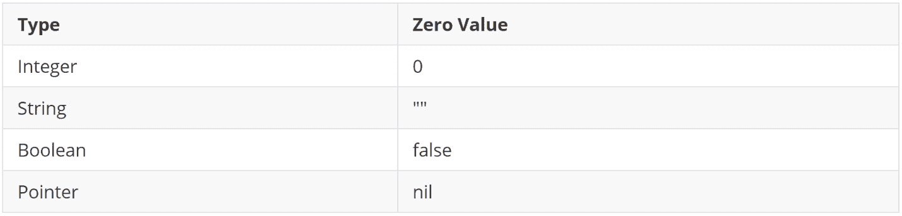

表 3.1 – 零值

如其名所示，变量可以改变其值，但前提是它的类型保持不变。如果您尝试分配不同类型的值或重新声明变量，编译器会显示适当的错误信息。

如果我们在最后一个代码示例中添加一行 `n = "Hello"`，程序将无法编译，并返回以下错误信息：`cannot use "Hello" (type untyped string) as type int in assignment`。

您可以使用类型推断作为变量声明的快捷方式。在这种情况下，您在声明中省略了显式的类型参数。只需记住，Go 在函数内部对类型推断的支持有限。

你可以不显式为每个变量定义类型，而是使用一个特殊的短赋值符号`:=`，让编译器根据其值猜测变量类型，如下一个示例所示，编译器假设变量`n`的类型是`int`：

```go
func main() {
    n := 42
}
```

就像变量一样，编译器也可以推断常量的类型。常量的值在整个程序中不能改变，我们通常使用它们来表示现实世界的值，例如数字*π*（**π**）、对象的静态名称或地点等：

```go
const Book = "Network Automation with Go"
```

现在，让我们更详细地看看 Go 中可用的不同类型及其常见用例。

## 基本类型

根据 Go 的语言规范，有四组基本或原始类型在全局范围内预声明，并且默认对所有 Go 程序可用：

+   数值

+   字符串

+   布尔

+   错误

### 数值

Go 定义了几个数值类型来存储不同大小的整数和实数。类型名称通常包含有关它们的符号和值大小（以位为单位）的信息。唯一的例外是`int`和`uint`类型，它们的值取决于机器，通常对于 32 位 CPU 默认为 32 位，对于 64 位 CPU 架构默认为 64 位：

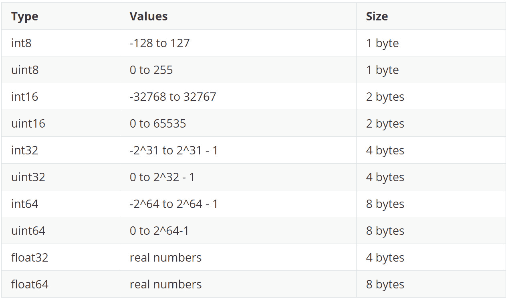

表 3.2 – 数值类型变量

这里有一些如何实例化数值类型变量的示例。这些都是有效选项，你可以根据需要存储或生成的值范围选择最合适的选项。你可以从`ch03/type-definition/main.go`（在*进一步阅读*部分）测试这段代码。注意我们为`a`使用了类型推断，因此它的类型是`int`，在 64 位机器上大小为 8 字节。第二个变量（`b`）是一个无符号 32 位整数（4 字节）。最后一个变量（`c`）是一个浮点数（4 字节）：

```go
func main() {
    a := -1
    var b uint32
    b = 4294967295
    var c float32 = 42.1
}
```

你也可以使用表达式`T(v)`将`v`值转换为`T`类型，如下一个示例所示。在这里，`b`是通过将整数`a`转换为无符号 32 位整数得到的，最后`c`是通过将`b`转换为浮点数得到的：

```go
func main() {
    a := 4294967295
    b := uint32(a)
    c := float32(b)
}
```

一旦为变量定义了类型，任何新的操作都必须在赋值运算符（`=`）的两侧匹配此类型。你无法在前面示例的末尾添加`b = int64(c)`，因为`b`将是`uint32`类型。

在 Go 中，类型转换总是显式的，与其他可能隐式执行此操作并有时称为类型转换的编程语言不同。

### 字符串

Go 支持两种字符串字面量风格：你可以用双引号括起来使其成为一个解释字面量，或者使用反引号用于原始字符串字面量，如下一个示例所示：

```go
func main() {
    d := "interpreted\nliteral"
    e := `raw
literal`
    fmt.Println(d)
    fmt.Println(e)
}
```

注意`d`中的转义序列。Go 将其解释为在字符串中生成一个新行字符。以下是这个程序的输出，你可以在`ch03/string-literals/main.go`（在*进一步阅读*部分）找到它：

```go
ch03/string-literals$ go run main.go
interpreted
literal
raw
literal
```

你可以使用 `==` 和 `!=` 操作符来比较字符串。你可以使用 `+` 和 `+=` 操作符来连接字符串。`ch03/string-concatenate/main.go` 中的示例（在 *进一步阅读* 部分）展示了这些操作符的使用：

```go
func main() {
    s1 := "Net"
    s2 := `work`
    if s1 != s2 {
        fmt.Println(s1 + s2 + " Automation")
    }
}
```

到目前为止，这似乎与其他编程语言没有太大区别。但在 Go 语言中，字符串实际上是一个字节数组的切片，或者更准确地说，是一个 UTF-8 Unicode 点的序列。在内存中，Go 语言将其表示为一个包含指向字符串数据和其长度的指针的两个字的结构。

让我们在 `ch03/string-memory/main.go`（在 *进一步阅读* 部分）中定义一个新的字符串 `n`，使用 `Network Automation` 字面量。我们可以使用 UTF-8 可变宽度字符编码将每个字符存储为一个或多个字节。对于英语，我们每个字符使用一个字节，所以在这种情况下，字符串字面量是 18 字节长：

```go
func main() {
    n := "Network Automation"
    fmt.Println(len(n))
    w := n[3:7]
    fmt.Println(w)
}
```

我们可以将另一个字符串定义为另一个字符串的子集。为此，我们指定原始字符串中的下界和上界。索引计数从零开始，生成的字符串不包括上界索引中的字符。对于 `n[3:7]`，我们将边界设置为字符 “`w`” 和 ““. 程序打印以下内容：

```go
ch03/string-memory$ go run main.go
18
work
```

虽然 `n` 和 `w` 变量引用的字符串长度不同，但它们的大小变量是相同的，就像任何其他字符串变量一样。字符串变量是一个两个字的结构。一个字通常是 32 或 64 位，这取决于 CPU 架构。两个 64 位字是 16 字节（2 x 8 字节），所以对于 64 位平台，字符串是一个 16 字节的数据结构。在这 16 字节中，8 字节是指向实际字符串数据（切片）的指针，剩下的 8 字节用于存储字符串切片的长度。*图 3.1* 展示了它在内存中的样子：

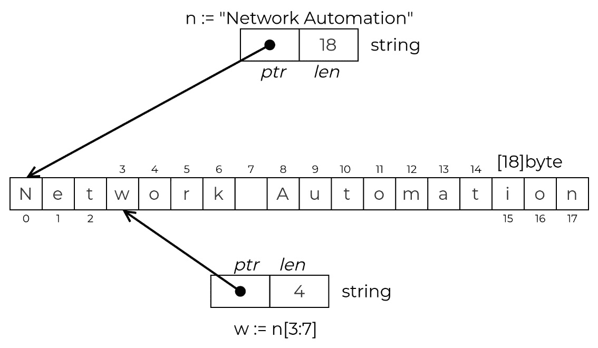

图 3.1 – 字符串在内存中的样子

如果多个字符串引用相同的底层切片，这是可以的，因为这个切片是不可变的，意味着你不能改变其内容。虽然切片存储字符串数据，但你不能通过引用切片的索引来改变字符串中的字符，因为它是不可变的。

相比之下，如果你想改变字符串变量的值，比如说你需要给它分配不同的文本，Go 语言会将字符串数据结构指向一个新的底层切片，该切片包含你提供的新的字符串内容。所有这些都在幕后发生，所以你不需要担心这个问题。

### 布尔值

`bool` 数据类型使用一个字节的内存，并存储 `true` 或 `false` 的值。与其他编程语言一样，你可以在条件语句中使用 `bool` 类型的变量来改变程序的流程控制。`if` 条件语句明确要求 `bool` 类型：

```go
func main() {
    condition := true
    if condition {
        fmt.Printf("Type: %T, Value: %t \n",
                    condition, condition)
    }
}
```

如果你在这个程序 `ch03/boolean/main.go`（在 *进一步阅读* 部分）中运行，你会得到以下输出：

```go
ch03/boolean$ go run main.go
Type: bool, Value: true
```

因为条件是 `true`，我们打印 `condition` 变量的类型和值。

### 错误

Go 对错误处理有独特的方法，并定义了一个特殊的 `error` 类型来表示失败条件。你可以生成错误、更改它们、在屏幕上打印它们，或使用它们来改变程序的流程控制。下面的代码示例显示了生成 `Error` 类型新变量的两种最常见方式：

```go
func main() {
    // Creates a variable of 'error' type
    err1 := errors.New("This is a new error")
    // string formatting when building an error message
    msg := "another error message"
    err2 := fmt.Errorf("This is %s", msg)
}
```

你可以将任何用户定义的类型变成错误，只要它实现了一个特殊的 `Error()` 方法，该方法返回一个 `string`。我们将在本章后面的 *接口* 部分更详细地讨论实现方法。

错误处理的一种常见方式是允许它冒泡到程序中的某个点，在那里你可以决定如何响应它——是失败并停止执行，还是记录并重试。无论如何，错误在 Go 中无处不在，所有可能失败的功能都将错误作为它们的最后一个参数返回，因此以下模式在 Go 程序中非常常见：

```go
func main() {
    result, err := myFunction()
    if err != nil {
        fmt.Printf("Received an error: %s", err)
        return err
    }
}
```

`myFunction` 函数返回两个值。在前面示例的外部函数中，我们将 `myFunction` 的第一个返回值存储在一个名为 `result` 的变量中，第二个返回值存储在 `err` 变量中，以存储 `myFunction` 内部可能出现的任何错误值，现在这些错误值会暴露给调用函数。

根据程序的逻辑，你需要决定如何处理错误。在这里，如果错误不为空（`nil`），我们打印错误信息并结束函数的执行（`return`）。我们也可以只是记录它，并允许程序继续运行。

## 容器类型

从原始类型向上提升一级的是容器类型。这些仍然是任何 Go 程序都可以使用的标准类型，无需任何显式的导入语句。但是，它们代表的不仅仅是单个值。我们在 Go 中使用容器类型来存储相同类型的多个值；以下是一些包括的类型：

+   数组

+   切片

+   映射

在以下章节中，我们将讨论这些三种类型的用例和实现细节。

### 数组

任何程序员在掌握了处理原始类型的能力之后，首先需要的是存储这些类型值集合的能力。例如，网络库存可能存储设备主机名或 IP 地址的列表。解决这个问题的最常见方法是使用一种称为 `array` 的数据结构。Go 的 `array` 类型具有 `[n]T` 的签名，其中 `n` 是数组的长度，`T` 是你存储在数组中的值类型。

下面是一个示例，说明你如何在 Go 中使用字符串数组。我们故意混合不同的语义方式来定义数组，这样你可以选择你喜欢的风格。我们首先在单行上定义 `hostnames` 数组，然后在多行语句中定义 `ips` 数组：

```go
func main() {
    hostnames := [2]string{"router1.example.com",
                        "router2.example.com"}
    ips := [3]string{
        "192.0.2.1/32",
        "198.51.100.1/32",
        "203.0.113.1/32",
    }
    // Prints router2.example.com
    fmt.Println(hostnames[1])
    // Prints 203.0.113.1/32
    fmt.Println(ips[2])
}
```

对于网络工程师来说，当处理字节数组时，这会变得更加有趣。看看下一个示例，Go 如何读取输入的十进制数字（例如 `127`），二进制数据就在你的指尖。这两个数组示例都可以在 `ch03/arrays/main.go`（见 *进一步阅读* 部分）中找到：

```go
func main() {
    // ipv4 is [0000 0000, 0000 0000, 0000 0000, 0000 0000]
    var ipAddr [4]byte
    // ipv4 is [1111 1111, 0000 0000, 0000 0000, 0000 0001]
    var localhost = [4]byte{127, 0, 0, 1}
    // prints 4
    fmt.Println(len(localhost))
    // prints [1111111 0 0 1]
    fmt.Printf("%b\n", localhost)
    // prints false
    fmt.Println(ipAddr == localhost)
}
```

Go 数组有许多优点。它们非常节省内存，因为它们按顺序存储值，并且没有额外的元数据开销。它们也是可比较的，这意味着你可以检查两个数组是否相等，前提是它们的值具有可比较的类型。

但是，由于它们的固定大小，我们很少在 Go 中直接使用数组。唯一的例外是当你事先知道数据集的大小。考虑到这一点，在网络中，我们处理大量的固定大小数据集；它们构成了大多数网络协议头，因此数组对于这些以及诸如 IP 和 MAC 地址、端口号或序列号以及各种 VPN 标签等都是方便的。

### 切片

根据定义，数组具有不可变的结构（固定大小）。虽然你可以改变数组中的值，但它们不能随着存储数据的尺寸变化而增长或缩小。但是，在实现上，这从来不是问题。许多语言将数组实现为在幕后改变大小的动态数据结构。

当然，在增长数组时会有一些性能损失，但通过一些巧妙的算法，可以减少更改次数，并尽可能使最终用户的使用体验无摩擦。在 Go 中，切片扮演着这个角色；它们是 Go 中最广泛使用的类似数组的结构。

在创建切片时提供长度是可选的。在幕后，Go 创建一个后备数组，该数组定义了切片可以增长到的上限。这个上限就是我们所说的切片的**容量**。一般来说，容量等于切片的长度，但并不总是这样。如果切片需要超出其容量，Go 会创建一个新的更大的后备数组，并将原始数组的内容复制过来。下一个示例展示了创建切片的三种方法以及每个切片的容量和长度：

```go
func main() {
    empty := []string{}
    words := []string{"zero", "one", "two", "three",
                    "four", "five", "six"}
    three := make([]string, 3)
    fmt.Printf("empty: length: %d, capacity: %d, %v\n",
                     len(empty), cap(empty), empty)
    fmt.Printf("words: length: %d, capacity: %d, %v\n",
                    len(words), cap(words), words)
    fmt.Printf("three: length: %d, capacity: %d, %v\n",
                    len(three), cap(three), three)
    /* ... <continues next > ... */
}
```

这个程序，你可以在 `ch03/slices/main.go`（见 *进一步阅读* 部分）中找到，打印以下内容：

```go
ch03/slices$ go run main.go
empty: length: 0, capacity: 0, []
words: length: 7, capacity: 7, [zero one two three four five six]
three: length: 3, capacity: 3, [  ]
```

就像字符串一样，你可以对切片进行切片，这会创建对相同后备数组中某个部分的新的引用。例如，如果你根据前面的示例中的切片 `words` 使用 `words[1:3]` 创建一个新的切片，你最终会得到一个包含 `one` 和 `two` 元素的切片，因此这个切片的长度是两个。然而，它的容量是六。为什么是六？后备数组是相同的，但新的切片从索引一开始，后备数组的最后一个索引是七。*图 3**.2* 展示了它在内存中的样子：

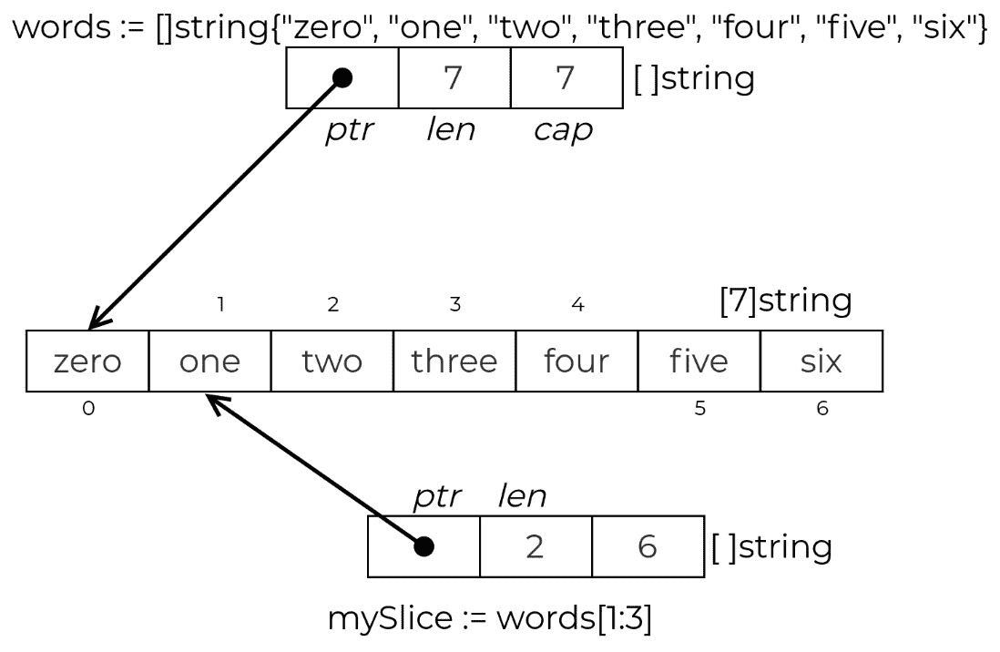

图 3.2 – 切片在内存中的样子

要向切片的末尾添加元素，你可以使用内置的 `append` 函数。让我们从我们刚才引用的切片开始，称它为 `mySlice`：

```go
func main() {
    /* ... <continues from before > ... */
    mySlice := words[1:3]
    fmt.Printf(" mySlice: length: %d, capacity: %d, %v\n",
            len(mySlice), cap(mySlice), mySlice)
    mySlice = append(mySlice, "seven")
    fmt.Printf(" mySlice: length: %d, capacity: %d, %v\n",
            len(mySlice), cap(mySlice), mySlice)
    mySlice = append(mySlice, "eight", "nine", "ten",
                    "eleven")
    fmt.Printf(" mySlice: length: %d, capacity: %d, %v\n",
            len(mySlice), cap(mySlice), mySlice)
}
```

如果我们从 `ch03/slices/main.go` 运行这个程序（参见 *进一步阅读* 部分），我们可以看到当 Go 需要额外的容量时，它是如何分配一个新的后备数组的。当它已经有了三个元素，并且我们要求向一个容量为六的切片中添加另外四个元素时，Go 自动分配了一个容量为 12 的新后备数组来支持额外的元素和未来的增长：

```go
ch03/slices$ go run main.go
...
 mySlice: length: 2, capacity: 6, [one two]
 mySlice: length: 3, capacity: 6, [one two seven]
 mySlice: length: 7, capacity: 12, [one two seven eight nine ten eleven]
```

重要的是，虽然这听起来可能难以理解，但所有这些都在幕后发生。我们想要留给你的关于切片的是，它们是一种三词数据结构，在大多数计算机上现在通常是 24 字节。

### 映射

映射是一种容器类型，它使得将一种类型（例如，字符串或整数）作为键存储为另一个类型（作为值）的映射成为可能。映射的形式为 `map[KeyType]ValueType`，其中 `KeyType` 是任何可比较的类型，`ValueType` 可以是任何类型。一个例子是 `map[int]string`。

初始化映射的一种方法是在下一个示例中使用内置的 `make` 函数，其中我们创建了一个以 `string` 为键和值的映射。你可以向映射中添加新的值，通过引用你想要关联该值的键。在示例中，我们将 `spine` 映射到 `192.168.100.1`：

```go
func main() {
    dc := make(map[string]string)
    dc["spine"] = "192.168.100.1"
    ip := dc["spine"]
    ip, exists := dc["spine"]
    if exists {
        fmt.Println(ip)
    }
}
```

要检索一个值并将其分配给一个变量，你可以像添加值时一样引用键，但这次在等号右侧，就像前面的示例中我们分配 `dc["spine"]` 的值到 `ip` 变量一样。

你还可以进行成员测试，以检查某个键是否在映射中。一个双值赋值用于测试键的存在，例如在 `ip, exists := dc["spine"]` 中，其中 `exists` 是一个布尔值，只有当 `dc["spine"]` 存在时才为 `true`。

初始化映射的另一种方法是使用数据，如下一个示例所示。要删除元素，你可以使用内置的 `delete` 函数：

```go
func main() {
    inv := map[string]string{
        "router1.example.com": "192.0.2.1/32",
        "router2.example.com": "198.51.100.1/32",
    }
    fmt.Printf("inventory: length: %d, %v\n", len(inv),
                inv)
    delete(inv, "router1.example.com")
    fmt.Printf("inventory: length: %d, %v\n", len(inv),
                inv)
}
```

这个程序打印以下内容：

```go
ch03/maps$ go run main.go
inventory: length: 2, map[router1.example.com:192.0.2.1/32 router2.example.com:198.51.100.1/32]
inventory: length: 1, map[router2.example.com:198.51.100.1/32]
```

本节的完整代码可在 `ch03/maps/main.go` 中找到（参见 *进一步* *阅读* 部分）。

## 用户定义的类型

与我们之前讨论的类型不同，用户定义的类型，正如其名所示，是你定义的类型。在这个类别中，我们有以下几种：

+   结构体

+   接口

接口是 Go 中唯一的抽象类型，并为具体类型（如结构体）定义了一个合同。它们描述行为，而不是实现细节，这有助于我们将程序的商务逻辑分解成带有接口的构建块。我们将在本章后面的接口专用部分详细讨论它们。

### 结构体

结构体是一种表示一组字段及其数据类型的复杂数据结构。结构体看起来有点像映射，但这里的键是固定的。它们成为变量名的扩展。

让我们定义一个具有四个`string`字段和一个`bool`字段的`Router`：

```go
type Router struct {
    Hostname  string
    Platform  string
    Username  string
    Password  string
    StrictKey bool
}
```

现在，这个新类型也可以是另一个用户定义类型的一部分，如下面的`Inventory`类型，它包含我们刚才定义的这些路由器的切片：

```go
type Inventory struct {
    Routers []Router
}
```

下面是一些创建结构体实例并为其字段赋值的示例：

```go
func main() {
    var r1 Router
    r1.Hostname = "router1.example.com"
    r2 := new(Router)
    r2.Hostname = "router2.example.com"
    r3 := Router{
        Hostname:  "router3.example.com",
        Platform:  "cisco_iosxr",
        Username:  "user",
        Password:  "secret",
        StrictKey: false,
    }
    /* ... <continues next > ... */
}
```

注意的是，`r2`现在实际上是指向`Router`的指针（这就是`new`的工作方式），但这不是我们现在需要担心的事情。让我们将所有路由器放入一个`Inventory`类型的变量中：

```go
func main() {
    /* ... <continues from before > ... */
    inv := Inventory{
        Routers: []Router{r1, *r2, r3},
    }
    fmt.Printf("Inventory: %+v\n", inv)
}
```

现在，我们已经在变量中方便地放置了所有路由器。我们尚未分配值的所有字段都是零值（`""`，或字符串的空值）：

```go
ch03/structs$ go run main.go
Inventory: {Routers:[{Hostname:router1.example.com Platform: Username: Password: StrictKey:false} {Hostname:router2.example.com Platform: Username: Password: StrictKey:false} {Hostname:router3.example.com Platform:cisco_iosxr Username:user Password:secret StrictKey:false}]}
```

本例中的代码可在`ch03/structs/main.go`中找到（见*进一步* *阅读*部分）。

到目前为止，我们还没有讨论其他变量类型，如指针、通道和函数。我们将在本章的其他部分介绍这些内容。请耐心等待。在下一节中，我们将介绍一些数学和逻辑运算符，这些运算符允许我们在程序中执行不同的操作。

# 算术、比较和逻辑运算符

运算符是执行特定数学、逻辑或关系计算的特定符号。在本节中，我们涵盖了以下三种类型的运算符：

+   算术运算符

+   逻辑运算符

+   比较运算符

虽然我们没有涵盖所有角落案例和类型的排列组合，但我们想关注一些在网络自动化环境中可能有趣的运算符。

## 算术运算符

这些运算符使用数值执行数学计算。结果值取决于操作数的顺序和类型：

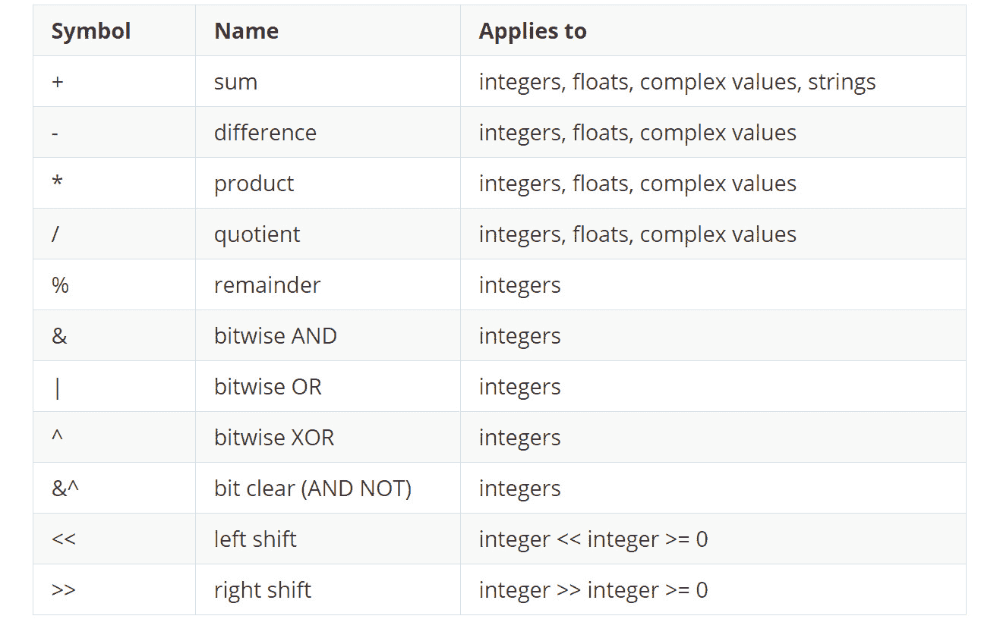

表 3.3 – 算术运算符

它们遵循大多数编程语言中实现的标准化数学逻辑：

```go
func main() {
    // sum s == 42
    s := 40 + 2
    // difference d == 0.14
    d := 3.14 - 3
    // product p == 9.42
    p := 3 * 3.14
    // quotient q == 0
    q := 3.0 / 5
    // remainder r == 2
    r :=  5 % 3
}
```

字符串是唯一可以使用的算术运算符的非数值类型。您可以使用`+`进行字符串连接，将两个或多个文本字符串链接成一个字符串：

```go
func main() {
    // s == "Hello, World"
    s := "Hello" + ", " + "World"
}
```

算术运算的一个最有趣的应用是与二进制数据交互，这是许多网络工程师所熟悉的。

网络协议具有确定的结构，这些结构以一组头部形式表达，包含转发信息和封装有效载荷的事实。

您可以使用算术运算符位移和位运算（`OR`、`AND`和`XOR`）从网络头部创建或提取数据。

为了看到这个功能在实际中的应用，让我们处理一个 20 字节长的**传输控制协议**（**TCP**）头部，它包含以下信息：

+   源端口地址 – 2 字节

+   目标端口地址 – 2 字节

+   序列号 – 4 字节

+   确认号 – 4 字节

+   头部长度和保留位 – 1 字节

+   控制标志 – 1 字节：

    +   `CWR`：**拥塞窗口** **减少**标志

    +   `ECE`：**显式拥塞通知**（**ECN**）-回声标志

    +   `URG`：紧急指针

    +   `ACK`: 确认号有效

    +   `PSH`: 请求推送

    +   `RST`: 重置连接

    +   `SYN`: 同步序列号

    +   `FIN`: 终止连接

+   窗口大小 – 2 字节

+   校验和 – 2 字节

+   紧急指针 – 2 字节

*图 3**.3*展示了包括我们刚刚列出的所有必填字段的 TCP 头结构：

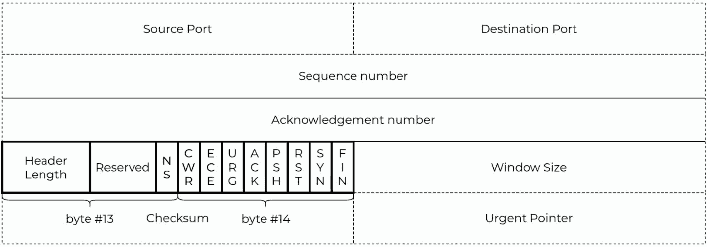

图 3.3 – TCP 头结构

在下一个代码示例中，我们从空的字节切片构建一个 TCP 头。我们在字节 13 的前四个位中写入其长度，然后在 TCP 头的字节 14 中设置`SYN`标志。

TCP 头中的头部长度字段表示 TCP 头包含的 32 位字的数量。你可以将其视为其中的行数，如*图 3**.3*所示。在这里，长度是五个字。

以下代码片段（完整版本在`ch03/tcp-header/main.go`中，见*进一步阅读*部分）展示了如何使用算术运算在 TCP 头上设置此长度：

```go
func main() {
    // Header length (measured in 32-bit words) is 5
    var headerWords uint8 = 5
    // Header length in bytes is 20
    headerLen := headerWords * 32 / 8
    // Build a slice of 20 bytes to store the TCP header
    b := make([]byte, headerLen)
    // Shift header words bits to the left to fit
    // the Header Length field of the TCP header
    s := headerWords << 4
    // OR operation on byte 13 and the store new value
    b[13] = b[13] | s
    // Print the 13 byte of the TCP header -> [01010000]
    fmt.Printf("%08b\n", b[13])
    /* ... <continues next > ... */
}
```

*图 3**.4*展示了如何将与单个字节大小兼容的`headerWords` 8 位无符号整数变量左移位，以适应头字段中适当的位置。

左移操作将原始位移动，丢弃右边的溢出位，并用零替换左边的位。按位`OR`运算符将结果值与现有字节组合。这是一个常见的模式，以确保你之前配置的任何位都不会丢失，因为按位`OR`运算符始终保留操作数中存在的`1`位：

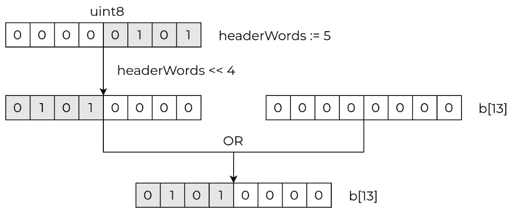

图 3.4 – 构建 TCP 头，第一部分

要设置一个标志，我们可以做类似的事情，其中我们设置一个位并将其左移，使其位于第二个位置以表示`SYN`：

```go
func main() {
    /* ... <continues from before > ... */
    // assume that this is the initial TCP SYN message
    var tcpSyn uint8 = 1
    // SYN flag is the second bit from the right so
    // we shift it by 1 position
    f := tcpSyn << 1
    // OR operation on byte 14 and store the new value
    b[14] = b[14] | f
    // Print the 14 byte of the TCP header -> [00000010]
    fmt.Printf("%08b\n", b[14])
    /* ... <continues next > ... */
}
```

*图 3**.5*展示了前一个代码示例中的位操作：

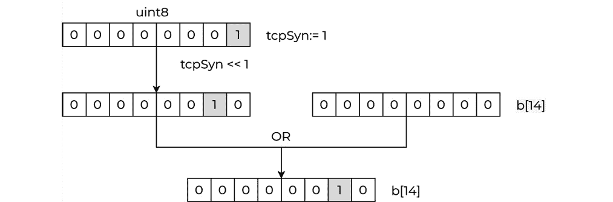

图 3.5 – 构建 TCP 头，第二部分

现在，让我们看看接收端解析这两个字节的反向过程可能是什么样的：

```go
func main() {
    /* ... <continues from before > ... */
    // only interested if a TCP SYN flag has been set
    tcpSynFlag := (b[14] & 0x02) != 0
    // Shift header length right, drop any low-order bits
    parsedHeaderWords := b[13] >> 4
    // prints "TCP Flag is set: true"
    fmt.Printf("TCP Flag is set: %t\n", tcpSynFlag)
    // prints "TCP header words: 5"
    fmt.Printf("TCP header words: %d\n", parsedHeaderWords)
}
```

这次，我们使用相反的位操作集。右移将所有位从左向右移动，丢弃右边的位，并在左边添加零：


图 3.6 – 解析 TCP 头，第一部分

按位`AND`运算符的行为与网络掩码相同。它保留设置为`1`的位，并将其他所有位重置为零，有效地隐藏了非重要位。在我们的例子中，我们使用`0x02`掩码值或二进制的`0000 0010`，隐藏了其他所有位，只留下了从右数第二个位。然后我们可以将这个位向右移动并检查其值：

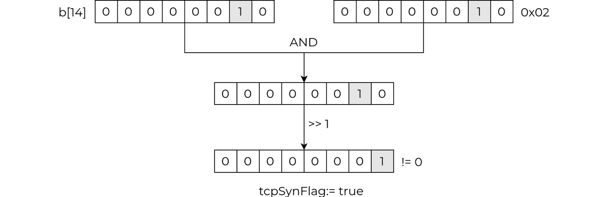

图 3.7 – 解析 TCP 头，第二部分

能够在位和字节级别上进行工作是一种强大的编程能力。

## 逻辑运算符

逻辑运算符是一组基本的布尔运算，遵循布尔代数的规则——合取、析取和否定：

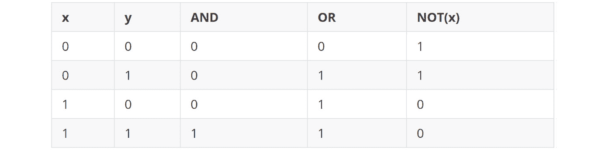

表 3.4 – 逻辑运算符

在 Go 语言中实现这些逻辑运算符并没有什么令人惊讶的，唯一值得记住的是，它们没有语法糖，所以唯一可接受的是`&&`用于`AND`，`||`用于`OR`，以及`!`用于`NOT`。

## 比较运算符

我们使用等于和不等于（`==`和`!=`）运算符来比较一对可比较的值，并返回布尔值（`true`|`false`）。你可以将大于和小于运算符（`<`，`<=`，`>`，和`>=`）应用于有序值：

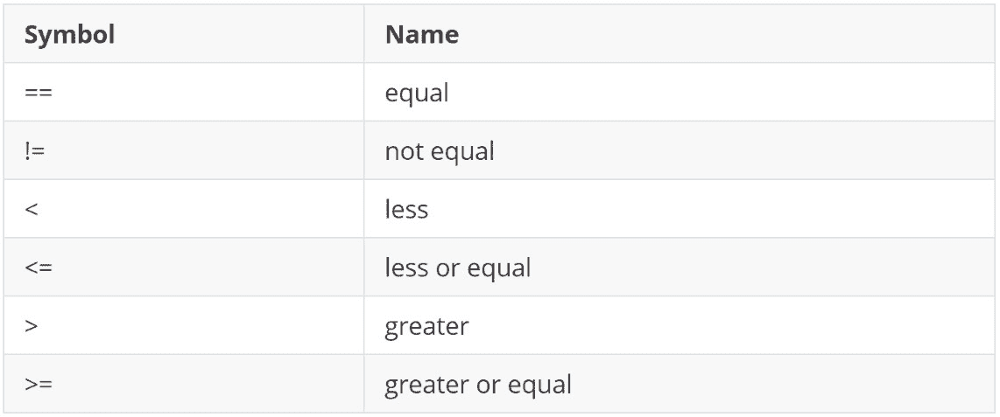

表 3.5 – 比较运算符

这里有一个比较运算符在行动中的简要示例，以及它们最常见类型：

```go
func main() {
    // all strings are comparable
    fmt.Println("hello" == "hello")
    // strings are ordered alphabetically
    fmt.Println("hello" < "world")
    // integers are comparable and ordered
    fmt.Println(1 < 10)
    // floating point numbers are also comparable
    fmt.Println(10.0 >= 1.1)
}
```

在前面的示例中，所有语句都会评估并打印`true`。你可以在 Go 语言规范的*比较运算符*部分找到其他 Go 类型（如指针、通道和数组）的完整可比较和有序属性列表（见*进一步阅读*）。

这就结束了我们对 Go 数据类型和用于执行日常操作的不同运算符的介绍。现在，随着我们深入 Go 的控制流和函数，是时候将我们程序的第一个构建块组合起来。

# 控制流

控制流结构是任何计算机程序的关键构建块，因为它们允许你通过条件和迭代表达复杂的行为。Go 对控制流的支持反映了其简约设计，这也是为什么在整个语言规范中你会看到条件语句的几种变体和一种循环版本。这可能会让人感到惊讶，但这也使得 Go 更容易阅读，因为它强制所有程序采用相同的设计模式。让我们从最简单和最常见的数据流块开始。

## `for`循环

在其最简单形式中，`for`循环允许你在每次迭代中执行一些工作的同时遍历一系列整数。例如，这是打印从`0`到`4`的所有数字的方法：

```go
func main() {
    for i := 0; i < 5; i++ {
        fmt.Println(i)
    }
}
```

第一行包含`init`语句，`i := 0`，条件语句，`i < 5`，以及`post`（每次迭代）语句，`i++`，由分号（`;`）分隔。代码会继续评估条件语句和`for`循环的`post`语句，直到条件不再为`true`，即直到`i >= 5`。

这种循环类型（`for`）有许多变体，其中最常见的一种是遍历容器类型。以下有两个示例：

+   这是一个遍历切片的示例：

    ```go
    func main() {
    ```

    ```go
        slice := []string{"r1", "r2", "r3"}
    ```

    ```go
        for i, v := range slice {
    ```

    ```go
            fmt.Printf("index %d: value: %s\n", i, v)
    ```

    ```go
        }
    ```

    ```go
    }
    ```

+   这是一个遍历 map 的示例：

    ```go
    func main() {
    ```

    ```go
        hashMap := map[int]string{
    ```

    ```go
            1: "r1",
    ```

    ```go
            2: "r2",
    ```

    ```go
            3: "r3",
    ```

    ```go
        }
    ```

    ```go
        for i, v := range hashMap {
    ```

    ```go
            fmt.Printf("key %d: value: %s\n", i, v)
    ```

    ```go
        }
    ```

    ```go
    }
    ```

特殊的`range`关键字遍历切片或映射的所有值，为每次迭代创建当前项的新键/值变量副本（在示例中为`i`和`v`）。你还可以使用`range`遍历数组和字符串。对于通道，这个关键字有特殊的行为，我们将在后面的*并发*部分介绍。

这种循环结构的另一种常见变体是无限循环。当你不知道迭代次数时，可以使用它，但你知道何时停止：

```go
func main() {
    for {
        time.Sleep(time.Second)
        break
    }
}
```

这里的关键区别在于循环定义中没有任何条件，这相当于`true`的缩写；也就是说，条件语句始终评估为`true`，循环无限迭代。停止这种循环的唯一方法是使用`break`关键字。

Go 没有循环的`while`关键字，这在许多其他编程语言中都可以找到。但是，你可以通过像下一个代码示例那样省略`init`和`post`语句，使 Go 的`for`循环表现得像`while`一样：

```go
func main() {
    i := 0
    for i < 5 {
        fmt.Println(i)
        i++
    }
}
```

在这个上下文中，另一个值得提到的特殊关键字是`continue`，它跳过循环当前迭代的剩余部分。以下示例打印从`0`到`4`的所有数字，但只有当它们是偶数时：

```go
funcmain() {
    // prints 0 2 4
    for i := 0; i < 5; i++ {
        if i % 2 != 0 {
            continue
        }
        fmt.Println(i)
    }
}
```

在这个例子中，我们使用`if i % 2 != 0`子句跳过了除以二后余数非零的数字。这是一个条件语句，这是下一节的主题。

## 条件语句

控制结构帮助你定义程序可以遵循的不同执行路径时的行为或方向。

让我们从双向条件语句开始。我们尝试连接到一个网站([`www.tkng.io/`](https://www.tkng.io/))，然后打印如果连接成功我们收到的响应，或者在`HTTP GET`操作失败时返回错误信息。如果错误不为空（`err != nil`），则返回。否则（`else`），我们打印信息（`fmt.Printf`）：

```go
func main() {
    resp, err := http.Get("https://www.tkng.io/")
    if err != nil {
            log.Fatalf("Could not connect: %v", err)
    } else {
            fmt.Printf("Received response: %v",
                        resp.Status)
    }
}
```

提高前面示例的可读性的方法之一是将程序成功执行路径左对齐，这意味着如果`if`条件的某个分支以终止语句结束，就像我们这里的`return`一样，你可以删除整个`else`子句，并将代码重写如下：

```go
func main() {
    resp, err := http.Get("https://www.tkng.io/")
    if err != nil {
            log.Fatalf("Could not connect: %v", err)
    }
    fmt.Printf("Received response: %v", resp.Status)
}
```

与任何典型的`if`-`then`-`else`结构一样，Go 的条件语句可以使用多个`if`-`else`语句编码多路条件。但是，Go 开发者通常更喜欢在这种情况下使用`switch`语句，因为它是一种更简洁、更易读的多阶段`if`-`then`-`else`的形式。

考虑以下示例，它发送一个`HTTP GET`请求并根据返回的状态码打印一条消息。完整的代码在`ch03/switch/main.go`中（见*进一步阅读*）：

```go
func main() {
    resp, err := http.Get("http://httpstat.us/304")
    if err != nil {
        log.Fatalf("Could not connect: %v", err)
    }
    switch {
    case resp.StatusCode >= 600:
        fmt.Println("Unknown")
    case resp.StatusCode >= 500:
        fmt.Println("Server Error")
    case resp.StatusCode >= 400:
        fmt.Println("Client Error")
    case resp.StatusCode >= 300:
        fmt.Println("Redirect")
    case resp.StatusCode >= 200:
        fmt.Println("Success")
    case resp.StatusCode >= 100:
        fmt.Println("Informational")
    default:
        fmt.Println("Incorrect")
    }
}
```

你也可以将这个例子写成一系列的`if`-`then`-`else`语句，但使用`switch`可以使你的代码更简洁，许多 Go 开发者认为在这种情况下这是一种良好的实践。

## `goto`语句

另一种将控制权从程序的一个部分转移到另一个部分的方法是使用`goto`语句。

你可以使用`goto`语句跳出嵌套或无限循环，或者实现逻辑。

在前面的代码示例的基础上，让我们看看如何使用`goto`语句实现从函数中退出的各种出口点。你可以在这个示例的完整代码在`ch03/goto/main.go`中找到（见*进一步阅读*）：

```go
func main() {
    resp, err := http.Get("http://httpstat.us/304")
    if err != nil {
        log.Fatalf("Could not connect: %v", err)
    }
    switch {
    case resp.StatusCode >= 600:
        fmt.Println("Unknown")
        goto exception
    case resp.StatusCode >= 500:
        fmt.Println("Server Error")
        goto failure
    case resp.StatusCode >= 400:
        fmt.Println("Client Error")
        goto failure
    case resp.StatusCode >= 300:
        fmt.Println("Redirect")
        goto exit
    case resp.StatusCode >= 200:
        fmt.Println("Success")
        goto exit
    case resp.StatusCode >= 100:
        fmt.Println("Informational")
        goto exit
    default:
        fmt.Println("Incorrect")
        goto exception
    }
   exception:
    panic("Unexpected response")
   failure:
    log.Fatalf("Failed to connect: %v", err)
   exit:
    fmt.Println("Connection successful")
}
```

由于`goto`语句能够打破程序的流程，在大多数编程语言中，它们都有一种有点邪恶的名声，这通常会使代码更难阅读，许多著名的计算机科学家都警告不要随意使用它们。尽管如此，这些语句确实有其位置，你可以在许多项目中找到它们，甚至在 Go 标准库中也能找到。

循环、条件语句以及类似`goto`的东西可以帮助你定义 Go 程序的控制流程。我们还没有涵盖一些与通道类型一起使用的额外控制流程结构和边缘情况。我们将在本章的*并发*部分中稍后讨论它们，但在到达那里之前，我们首先需要讨论代码组织的另一个重要领域：函数。

# 函数

表面上，Go 函数与任何其他编程语言中的函数完全相同：一段代码，设计用来执行特定任务，并分组到一个可重用的容器中。由于语言的静态特性，所有函数都有一个签名，它定义了可接受输入参数的数量和类型以及输出值。

考虑以下函数（`generateName`），它根据一对输入字符串（`base`和`suffix`）生成一个新名称。你可以在这个示例的完整代码在`ch03/functions1/main.go`中找到（见*进一步阅读*）：

```go
func generateName(base string, suffix string) string {
    parts := []string{base, suffix}
    return strings.Join(parts, "-")
}
func main() {
    s := generateName("device", "01")
    // prints "device-01"
    fmt.Println(s)
}
```

这个函数的签名是`func (string, string) string`，这意味着它接受两个字符串类型的参数，并返回另一个字符串。你可以将返回值赋给一个变量，或者直接将其作为参数传递给另一个函数。

Go 的函数是值，这意味着你可以将它们作为输入参数传递，甚至可以从另一个函数中返回它们。

为了说明这一点，我们定义了一个名为`processDevice`的新函数，它接受两个参数，一个具有`func (string, string) string`签名的函数和一个`string`。在这个函数的主体中，有两个相关的字符串：`base`，它被静态设置为`device`，以及`ip`，它是函数接收的第二个参数：

```go
func processDevice(getName func (string, string) string, ip string) {
    base := "device"
    name := getName(base, ip)
    fmt.Println(name)
}
```

这个函数最有趣的部分是其主体中的第二行，它调用了`getName`函数。这个函数是`processDevice`接收到的参数，它可以是一个任何函数，只要它接受两个字符串作为参数并返回一个字符串。这正是我们为早期示例定义的`generateName`函数的情况，这意味着我们可以将`generateName`作为参数传递给`processDevice`来构建一个唯一的设备名称。让我们看看这将是什么样子。此示例的代码可在`ch03/functions1/main.go`中找到（参见*进一步阅读*）：

```go
func main() {
    // prints "device-192.0.2.1"
    processDevice(generateName, "192.0.2.1")
}
```

这种方法的优点是第一个参数的可插拔性。如果我们决定在某个时刻，另一个函数（例如`generateName2`）更适合，因为它使用不同的格式来连接字符串或其他原因，或者你可能想以不同的方式创建设备名称，但又不想修改`generateName`函数以防你需要快速回滚更改，那么你可以使用一个具有不同名称的临时`clone`函数来进行调整。

## 函数参数

在 Go 中，我们通过值传递函数参数，这意味着 Go 会为每个输入变量创建一个副本，并将该副本传递给被调用的函数。Go 将新的函数作用域变量存储在栈内存中，只要编译器在编译时知道它们的生命周期和内存占用。栈是内存中一个非常高效的区域，用于存储不需要垃圾回收的变量，因为它在函数返回时自动分配或释放内存。需要垃圾回收的内存会移动到内存中的另一个位置，称为堆。

考虑以下一个尝试修改输入字符串的函数的例子。你可以在此处找到下一个示例的代码`ch03/functions2/main.go`（参见*进一步阅读*）：

```go
type Device struct {
    name string
}
func mutate(input Device) {
    input.name += "-suffix"
}
func main() {
    d := Device{name: "myname"}
    mutate(d)
    // prints "myname"
    fmt.Println(d.name)
}
```

由于 Go 在将`Device`作为值传递给`mutate`函数时创建了一个副本，因此在函数体内对该`Device`所做的任何更改都不会在函数外部可见，因此它不会影响原始变量`d`。这就是为什么`d.name`打印的是`myname`而不是`myname-suffix`。

在 Go 中，我们可以使用两种类型的数据：值和这些值的内存地址（指针）。考虑到这一点，在将值传递给函数时，有两种方法可以实现所需的（修改）行为：

+   将函数修改为返回修改后的值并将其分配给一个变量。然而，这实际上并没有修改原始值，而是生成了一个新的值。

将函数修改为接受一个存储`Device`变量的指针。在这种情况下，我们的程序将如下所示：

```go
type Device struct {
    name string
}
func mutate(input *Device) {
    input.name += "-suffix"
}
func main() {
    d := Device{name: "myname"}
    mutate(&d)
    // prints "myname-suffix"
    fmt.Println(d.name)
}
```

在 Go 中，指针是跨程序边界共享数据的一种常见方式，例如函数调用。在这种情况下，我们仍然通过值传递输入参数（`&d`），但这次，我们复制并传递的是指向内存地址的指针，而不是 `d` 变量的实际内容。现在，当你改变这个内存地址所指向的内容时，你正在修改原始 `d` 变量的值：

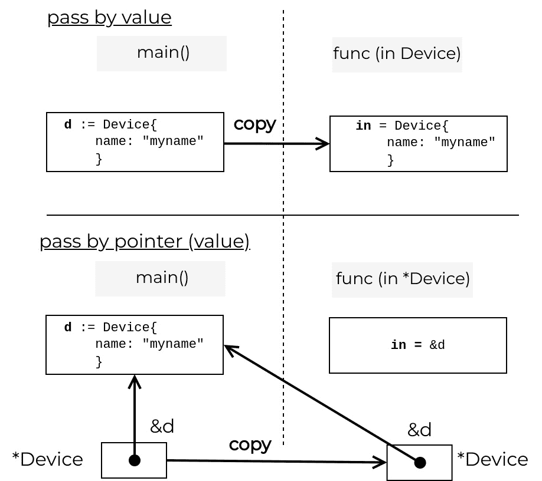

图 3.8 – 值和指针

Go 的指针是一个强大的概念。你需要了解的关键操作如下：

+   使用 `&` 操作符获取变量的地址

+   解引用指针，即使用 `*` 操作符获取引用值的地址

每当你需要改变一个变量的值，或者当变量足够大以至于复制它变得低效时，你需要确保通过指针传递它。这个规则适用于所有原始类型——`整数`、`字符串`、`布尔值`等等。

Go 中有一些类型并不持有实际值，而是指向它的内存地址。虽然这些都是内部实现细节，但这是值得记住的。例如，通道和映射是两种实际上是指向内部数据结构（运行时类型）的指针类型。这意味着即使你通过值传递它们，你最终也会修改通道或映射的内容。顺便说一句，这也适用于函数。

请看以下示例，其中我们将映射（`m`）作为值传递给函数（`fn`）。这个函数向映射中添加一个新的键值对，这个值外部的函数（`main`）也可以访问：

```go
func fn(m map[int]int) {
    m[1] = 11
}
func main() {
    m := make(map[int]int)
    fn(m)
    // prints 11
    fmt.Println(m[1])
}
```

在本章的 *Go 的类型系统* 部分，我们了解到切片是 Go 中的一种类型，它存储有关底层数据的元数据以及指向它的指针。你可能想当然地认为你可以作为值传递这种数据类型并能够修改它。但是，尽管这个数据结构中有一个指针，你也会创建其余元数据值（长度和容量）的副本，从而在调用函数和被调用函数之间的切片之间造成断开。

因此，切片中的修改可能产生不可预测的结果。就地更改可能是可见的，但追加可能不可见。这就是为什么他们总是建议传递指针以避免像以下这样的微妙错误：

```go
func mutateV(input []string) {
    input [0] = "r03"
    input  = append(input , "r04")
}
func main() {
    d1 := []string{"r01", "r02"}
    mutateV(d1)
    // prints "[r03 r02]"
    fmt.Printf("%v\n", d1)
}
```

如果你使用指针，就可以避免这个错误，在这种情况下，所有对底层切片的更改都会在外部上下文中反映出来：

```go
func mutateP(input *[]string) {
    (*input)[0] = "r03"
    *input = append(*input, "r04")
}
func main() {
    d2 := []string{"r01", "r02"}
    mutateP(&d2)
    // prints "[r03 r02 r04]"
    fmt.Printf("%v\n", d2)
}
```

这两个示例的完整代码在 `ch03/mutate-slice/main.go` 中（见 *进一步阅读*）。

## 错误处理

在 Go 中，错误不是你必须在其他代码部分处理的异常。我们按顺序处理它们。错误可能要求你立即停止程序的执行，或者你可能可以继续运行程序并将错误传播到程序的另一部分或用户，以便他们可以就如何处理此错误做出明智的决定。记住，*不要只是检查错误，要优雅地处理* *它们*。

当涉及到编写函数时，一个经验法则是，如果一个函数可能会遇到错误，它必须将错误返回给调用者：

```go
func makeCall(url string) (*http.Response, error) {
    resp, err := http.Get("example.com")
    if err != nil {
        return nil, fmt.Errorf("error in makeCall: %w",
                                err)
    }
    return resp, nil
}
```

错误信息应该是有意义的，并且提供足够的信息给用户，以便他们能够识别错误的起因以及它在代码中发生的位置。决定如何处理此错误的责任在于调用此函数的人，以下是一些可能的操作：

+   记录错误并继续。

+   忽略它。

+   中断执行并引发恐慌。

+   将其传递给外部函数。

## 方法

方法是向用户定义的类型添加行为的一种方式，默认情况下，这些类型只能存储值。如果你想这些类型能够执行操作，你可以添加一个特殊函数，该函数将包含关联数据类型的名称（方法接收器），位于`func`关键字和函数名称之间，例如下一个示例中的`GetFullName`：

```go
type Device struct {
    name string
}
func (d Device) GetFullName() string {
    return d.name
}
func main() {
    d1 := Device{name: "r1"}
    // prints "r1"
    fmt.Println(d1.GetFullName())
}
```

在所有方面，方法就像函数一样——它们接受零个或多个参数，并返回零个或多个值。最大的区别是方法还可以访问它们的接收器，至少可以读取其字段，就像你在前面的示例中看到的那样。

也可以通过在指针上定义来创建一个会修改接收类型的函数：

```go
type Device struct {
    name string
}
func (d *Device) GenerateName() {
    d.name = "device-" + d.name
}
func (d Device) GetFullName() string {
    return d.name
}
func main() {
    d2 := Device{name: "r2"}
    d2.GenerateName()
    // prints "device-r2"
    fmt.Println(d2.GetFullName())
}
```

在这种情况下，我们在指针接收器上定义了`GenerateName`方法，因此可以安全地设置、删除或更改其值——所有这些更改都在外部作用域中可见。

方法代码示例的完整代码可在`ch03/methods/main.go`中找到（参见*进一步阅读*）。

## 可变函数

到目前为止，我们只看到了使用严格预定义数量参数的函数示例。但在 Go 中，这并非唯一的选择；只要满足以下条件，你实际上可以向函数传递任意数量的参数：

+   所有额外的参数都是同一类型。

+   它们总是函数的最后一个参数。

函数签名看起来略有不同。所有额外的参数都会自动组合成一个切片，你可以在它们类型之前用三个点（`...`）来表示：

```go
func printOctets(octets ...string) {
    fmt.Println(strings.Join(octets, "."))
}
func main() {
    // prints "127.1"
    printOctets("127", "1")
    ip := []string{"192", "0", "2", "1"}
    // prints "192.0.2.1"
    printOctets(ip...)
}
```

与将它们声明为切片参数相比，可变参数的一个优点是灵活性；在调用函数之前，你不需要创建一个切片，如果不需要任何尾随参数，你也可以完全省略它们，同时仍然满足函数的签名。

变量参数代码示例的完整代码可在`ch03/variadic/main.go`中找到（参见*进一步阅读*）。

## 闭包

Go 中的函数具有不同的属性。它们是值，因此一个函数可以接受另一个函数作为其参数。

另一个有趣的属性是，当一个函数（外部）返回另一个函数（内部）时，内部函数会记住，并且它可以完全访问外部函数作用域内定义的所有变量。

这就是所谓的 `func() string` 签名每次调用都会修改 `suffixGenerator` 外部函数中定义的 `i` 变量：

```go
func suffixGenerator() func() string {
    i := 0
    return func() string {
        i++
        return fmt.Sprintf("%02d", i)
    }
}
func main() {
    generator1 := suffixGenerator()
    // prints "device-01"
    fmt.Printf("%s-%s\n", "device", generator1())
    // prints "device-02"
    fmt.Printf("%s-%s\n", "device", generator1())
    generator2 := suffixGenerator()
    // prints "device-01"
    fmt.Printf("%s-%s\n", "device", generator2())
}
```

每次我们调用 `suffixGenerator` 时，都会将外部函数返回的匿名函数的新实例分配给一个变量。`generator1` 和 `generator2` 现在是跟踪我们调用每个函数次数的函数。

闭包是一种流行的技术，用于创建周围的环境（环境）。例如，中间件软件中的 API 调用函数使用闭包在每次调用时执行日志记录和遥测数据收集，而无需 API 调用者关心这些细节。

## 延迟

当编写一个打开远程网络连接或本地文件的程序时，重要的是要尽快关闭它们，以防止资源泄露 - 所有操作系统都对打开的文件或连接的数量有限制。

Go 处理这类问题的惯用方法是尽可能早地使用 `defer` 语句来处理。你应该将这个语句放在 `open`/`connect` 函数调用旁边。Go 只有在函数返回时才会评估这个语句。

在以下示例中，两个 `defer` 语句仅在函数的最终语句之后运行：

```go
func main() {
    resp, err := http.Get("http://example.com")
    if err != nil {
        panic(err)
    }
    defer resp.Body.Close()
    defer fmt.Println("Deferred cleanup")
    fmt.Println("Response status:", resp.Status)
}
```

你可以将多个 `defer` 语句堆叠起来以执行分阶段的清理。它们按照后进先出的顺序执行 - `Println("Deferred cleanup")` 在 `resp.Body.Close()` 之前运行。当你运行这个程序时，你会看到以下内容：

```go
ch03/defer$ go run main.go
Response status: 200 OK
Deferred cleanup
```

此代码示例的完整代码可在 `ch03/defer/main.go` 中找到（参见 *进一步阅读*）。

现在我们已经涵盖了 Go 函数的基础知识，是时候进入下一层抽象了，它通过一组独特的方法描述对象行为：接口。

# 接口

接口是 Go 中最强大的构造之一，因此理解它们的作用以及何时可以使用它们非常重要。从纯粹理论的角度来看，接口是一种抽象类型。它们不包含实现细节，但通过方法签名定义了一组行为。

如果一个 Go 类型定义了一个接口中声明的所有方法签名，那么这个 Go 类型就隐式地实现了该接口，而不需要显式声明。这是 Go 处理多个类型所表现出的常见行为的方式，而其他语言通常通过对象继承来表达这一点。

## 网络自动化示例

为了引入这个想法，我们使用了一个虚构的网络自动化示例。假设我们正在开发一个 Go 包来处理不同网络设备的常见任务。我们将 Cisco IOS XE 设备建模为一个 `CiscoIOS` 类型，它有两个字段——一个用于标识设备的主机名（`Hostname`），另一个用于标识底层硬件平台（`Platform`）。对于这个 `CiscoIOS` 类型，我们定义了一个方法来获取设备的运行时间（`getUptime`）作为整数。最后，我们定义了一个函数来比较两个设备，找出哪个设备在没有重启的情况下运行时间更长：

```go
type CiscoIOS struct {
    Hostname string
    Platform string
}
func (r CiscoIOS) getUptime() int {
    /* ... <omitted for brevity > ... */
}
func LastToReboot(r1, r2 CiscoIOS) bool {
    return r1.getUptime() < r2.getUptime()
}
```

一切都运行得很好，直到我们添加了另一个平台。假设我们现在还有一个 `CiscoNXOS` 类型，它有 `Hostname` 和 `Platform` 字段，但它还有一个布尔值 `ACI` 字段来显示这个交换机是否启用了 ACI。与 `CiscoIOS` 类型一样，我们定义了一个返回 `CiscoNXOS` 设备运行时间的方法：

```go
type CiscoNXOS struct {
    Hostname string
    Platform string
    ACI      bool
}
func (s CiscoNXOS) getUptime() int {
    /* ... <omitted for brevity > ... */
}
```

现在的挑战是比较 `CiscoNXOS` 设备类型和 `CiscoIOS` 设备类型的运行时间。`LastToReboot` 函数签名告诉我们它只接受 `CiscoIOS` 类型的变量作为参数，因此我们不能将 `CiscoNXOS` 类型的元素传递给它。

你可以通过创建一个接口来解决这个问题。通过这样做，你抽象出了设备的实现细节，只关注通过 `getUptime` 函数将设备运行时间作为整数呈现的需求。让我们称这个接口为 `NetworkDevice`：

```go
type NetworkDevice interface {
    getUptime() int
}
```

下一步是将 `LastToReboot` 函数更改为接受 `NetworkDevice` 类型而不是 `CiscoIOS`，如下代码片段所示：

```go
func LastToReboot(r1, r2 NetworkDevice) bool {
    return r1.getUptime() < r2.getUptime()
}
```

因为 `CiscoIOS` 和 `CiscoNXOS` 都有一个 `getUptime() int` 方法，它们隐式地满足 `NetworkDevice` 接口，因此你可以将它们中的任何一个作为参数传递给 `LastToReboot` 函数。一个使用这些定义来比较这两种设备类型运行时间的**示例程序**（见*进一步阅读*）如下所示：

```go
func main() {
    ios := CiscoIOS{}
    nexus := CiscoNXOS{}
    if LastToReboot(ios, nexus) {
        fmt.Println("IOS-XE has been running for less time, so it was the last to be rebooted")
        os.Exit(0)
    }
    fmt.Println("NXOS was the last one to reboot")
}
```

接口可以帮助你扩展你的程序。`NetworkDevice` 接口使我们能够添加任何数量的设备类型。它不仅是一个优秀的代码设计资源，而且可以明确地设定在 API 中数据应该做什么，无论数据是什么。在示例中，我们不在乎设备运行的是哪种操作系统，只关心我们有一个方法可以获取其作为整数的运行时间。

## 标准库示例

为了更贴近现实世界的例子，让我们将注意力转向标准库中的 `net` 包，它有一个表示网络连接（`Conn`）的接口。接口字段通常是描述行为的动词，而不是状态（例如，`Conn` 接口的 `SetDeadline`）。相比之下，`RemoteAddr` 方法的更具描述性的名称可能是 `getRemoteAddr`：

```go
// src/net/net.go
// Conn is a generic stream-oriented network connection.
type Conn interface {
    /* ... <omitted for brevity > ... */
    // LocalAddr returns the local network address.
    LocalAddr() Addr
    // RemoteAddr returns the remote network address.
    RemoteAddr() Addr
    SetDeadline(t time.Time) error
    SetReadDeadline(t time.Time) error
    SetWriteDeadline(t time.Time) error
}
```

标准库包括此接口的几个实现。其中之一是在 `crypto/ssh` 库中，通过 `chanConn` 具体类型。具体类型是任何非接口类型，它存储自己的数据，在这种情况下，`chanConn` 存储了 **Secure Shell Protocol** （**SSH**）连接的本地（`laddr`）和远程（`raddr`）地址。

此类型还定义了方法，例如 `LocalAddr() net.Addr` 和 `SetReadDeadline(deadline time.Time) error`。实际上，它具有 `net.Conn` 接口的所有方法，因此它满足接口：

```go
// ssh/tcpip.go
// chanConn fulfills the net.Conn interface without
// the tcpChan having to hold laddr or raddr directly.
type chanConn struct {
    /* ... <omitted for brevity > ... */
    laddr, raddr net.Addr
}
// LocalAddr returns the local network address.
func (t *chanConn) LocalAddr() net.Addr {
    return t.laddr
}
// RemoteAddr returns the remote network address.
func (t *chanConn) RemoteAddr() net.Addr {
    return t.raddr
}
func (t *chanConn) SetDeadline(deadline time.Time) error {
    if err := t.SetReadDeadline(deadline); err != nil {
        return err
    }
    return t.SetWriteDeadline(deadline)
}
func (t *chanConn) SetReadDeadline(deadline time.Time) error {
    return errors.New("ssh: tcpChan: deadline not supported")
}
func (t *chanConn) SetWriteDeadline(deadline time.Time) error {
    return errors.New("ssh: tcpChan: deadline not supported")
}
```

现在，任何接受 `net.Conn` 作为输入的函数也可以接受 `chanConn`。反之亦然，如果一个函数返回 `net.Conn`，它也可以返回 `chanConn`，就像下面这个来自同一源代码文件的例子：

```go
// ssh/tcpip.go
// Dial initiates a conn to the addr from remote host.
// Resulting conn has a zero LocalAddr() and RemoteAddr().
func (c *Client) Dial(n, addr string) (net.Conn, error) {
    var ch Channel
    switch n {
    case "tcp", "tcp4", "tcp6":
    // Parse the address into host and numeric port.
    host, portString, err := net.SplitHostPort(addr)
    if err != nil {
        return nil, err
    }
    /* ... <omitted for brevity > ... */
    return &chanConn{
        Channel: ch,
        laddr:   zeroAddr,
        raddr:   zeroAddr,
    }, nil
    /* ... <omitted for brevity > ... */
}
```

如果这些代码片段看起来令你感到困惑，请不要担心。这些来自 Go 标准库的实际 SSH 包，所以这是最复杂的部分。

## 接口作为合同

接口是一种无值的类型；它们只定义方法签名。你可以定义一个接口类型的变量，但你只能将这个接口的具体实现作为这个变量的值赋值。

在下一个代码示例中，`r` 变量是 `io.Reader` 类型，这是一个接口。在那个时刻，我们对此变量一无所知，但我们知道，无论我们给这个变量赋什么值，都必须满足 `io.Reader` 接口，以便编译器接受它。

在这种情况下，我们使用 `strings.NewReader("text")`，它实现了 `io.Reader` 接口，用于从作为参数传递的 `string` 值中读取：

```go
func main() {
    var r io.Reader
    r = strings.NewReader("a random text")
    io.Copy(os.Stdout, r)
}
```

代码的最后一行将读取的内容复制到标准输出（`Stdout`）或用户的屏幕上。`io.Copy` 函数从 `io.Reader` （`r`）复制到 `io.Writer` （`os.Stdout` 满足此接口），因此我们可以从字符串复制到终端。

虽然这看起来比只用 `fmt.Println` 打印字符串要复杂一些，但接口使我们的代码更加灵活，允许你在不费太多力气的情况下替换示例中的数据源或目的地。这是因为 `io.Reader` 和 `io.Writer` 接口作为 `io.Copy()` 消费者和 `strings.NewReader` 以及 `os.Stdout` 提供者之间的合同，确保它们都符合此接口定义的规则。

接口允许你定义程序不同模块之间的清晰划分，并提供一个用户可以定义实现细节的 API。在下一节中，我们将详细探讨 `io.Reader` 和 `io.Writer` 接口及其在 **输入/输出** （**I/O**）操作中的作用。

# 输入和输出操作

在程序中，移动数据并重新格式化数据是一个常见的操作。例如，您可以打开一个文件，将其内容加载到内存中，将其编码为不同的格式，比如`jpeg`，然后将其写入磁盘上的文件。这就是`io.Reader`和`io.Writer`接口在 Go 的 I/O 模型中扮演关键角色的地方，因为它们允许您通过传输缓冲区将数据从源流式传输到目的地。这意味着您不需要将整个文件加载到内存中，以便对其进行编码并将其写入目的地，这使得整个过程更高效。

## io.Reader 接口

标准库中的`io`包定义了 Go 中最受欢迎的接口之一，即`io.Reader`接口，它可以读取一个字节流（`p`）。它返回读取的字节数（`n`）和遇到的任何错误（`err`）：

```go
type Reader interface {
    Read(p []byte) (n int, err error)
}
```

任何具有此签名的`Read`方法的具体类型都实现了`io.Reader`接口。您不需要做任何事情：


图 3.9 – io.Reader 接口

`strings.Reader`类型（在标准库的`strings`包中）有一个具有`Read(p []byte) (n int, err error)`签名的`Read`方法，因此它满足`io.Reader`接口。`strings`包还提供了一个方便的`NewReader`函数，返回指向新`strings.Reader`实例的指针。以下是从`strings`包源代码的实际代码片段：

```go
// src/strings/reader.go
// A Reader implements the io.Reader, ...
// from a string.
type Reader struct {
    s        string
    i        int64 // current reading index
    prevRune int   // index of previous rune; or < 0
}
// Read implements the io.Reader interface.
func (r *Reader) Read(b []byte) (n int, err error) {
    if r.i >= int64(len(r.s)) {
        return 0, io.EOF
    }
    r.prevRune = -1
    n = copy(b, r.s[r.i:])
    r.i += int64(n)
    return
}
// NewReader returns a new Reader reading from s.
func NewReader(s string) *Reader { return &Reader{s, 0, -1} }
```

前面的代码还显示了一个具有`Read`方法的实际`Reader`实现（具有数据字段）。

## io.Writer 接口

`io`包还指定了`io.Reader`接口，可以将`len(p)`个字节写入底层数据流。它返回写入的字节数（`n`）以及任何导致写入提前停止的错误（`err`）：

```go
type Writer interface {
    Write(p []byte) (n int, err error)
}
```

任何具有此签名的`Write`方法的具体类型都实现了`io.Writer`接口：

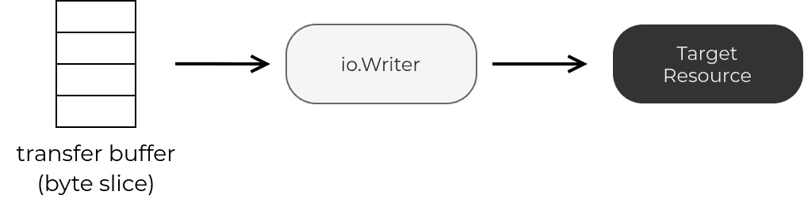

图 3.10 – io.Writer 接口

一个例子是标准库`os`包中的`os.File`。它有一个具有`Write(p []byte) (n int, err error)`签名的`Write`方法，因此它满足`io.Writer`接口：

```go
// src/os/types.go
// File represents an open file descriptor.
type File struct {
    *file // os specific
}
// Read reads up to len(b) bytes from the File.
// It returns the number of bytes read and any error.
// At end of file, Read returns 0, io.EOF.
func (f *File) Read(b []byte) (n int, err error) {
    if err := f.checkValid("read"); err != nil {
        return 0, err
    }
    n, e := f.read(b)
    return n, f.wrapErr("read", e)
}
func Create(name string) (*File, error) {
    return OpenFile(name, O_RDWR|O_CREATE|O_TRUNC, 0666)
}
```

`os`包还提供了一个方便的`Create`函数，可以从文件位置返回一个指向`os.File`的指针。前面的代码片段来自`os`包的源代码。

## io.Copy 函数

`io.Copy`函数允许您从源复制数据到目的地，正如我们在*接口*部分结束时讨论的那样。尽管您向此函数传递具体类型的数据，但`io.Copy`实际上并不关心数据是什么，因为它接受接口类型作为参数，因此它对数据能做什么更感兴趣。它需要一个可读的源和一个可写的目的地：

```go
// src/io/io.go
// Copy copies from src to dst until either EOF is reached
// on src or an error occurs.
func Copy(dst Writer, src Reader) (written int64, err error) {
    return copyBuffer(dst, src, nil)
}
```

如*图 3**.11*所示，`io.Copy`使用 32 KB 传输缓冲区从源流式传输数据到目的地：

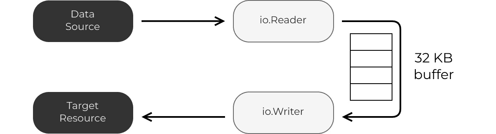

图 3.11 – io.Copy 函数

让我们测试一下。我们可以从使用 `strings.NewReader` 构建的字符串中获取一个 `io.Reader`，而 `os.Create` 给我们一个 `io.Writer`，它将数据写入磁盘上的文件。你可以通过查看 `ch03/io-interface1/main.go`（见 *进一步阅读*）中的代码来跟进：

```go
func main() {
    src := strings.NewReader("The text")
    dst, err := os.Create("./file.txt")
    if err != nil {
        panic(err)
    }
    defer dst.Close()
    io.Copy(dst, src)
}
```

而在这个例子中，我们选择了一个字符串和一个文件组合，你可以使用相同的 `io.Copy` 函数从网络读取并打印到终端，例如。现在，让我们检查我们刚刚生成的文件：

```go
ch03/io-interface1$ go run main.go
ch03/io-interface1$ cat file.txt
The text
```

让我们考察一个与网络相关的例子。`net/http` 包中的 `Get` 函数接受一个 URL（`string`）并返回一个指向 `http.Response` 的指针，该指针有一个满足 `io.Reader` 接口的字段（`Body`），而 `os.Stdout` 终端满足 `io.Writer` 接口。这为我们提供了另一个尝试的组合。让我们看看它的实际效果。代码与我们之前运行的很相似，可以在 `ch03/io-interface2/main.go`（见 *进一步阅读*）中找到：

```go
func main() {
    res, err := http.Get("https://www.tkng.io/")
    if err != nil {
        panic(err)
    }
    src := res.Body
    defer src.Close()
    dst := os.Stdout
    io.Copy(dst, src)
}
```

现在相同的 `io.Copy` 函数允许我们从 URL 中获取内容并将其打印到终端：

```go
ch03/io-interface2$ go run main.go
<!doctype html><html lang=en class="js csstransforms3d"><head><meta charset=utf-8><meta name=viewport content="width=device-width,initial-scale=1"><meta name=generator content="Hugo 0.74.3"><meta name=description content="The Kubernetes Networking Guide">...
```

使用 `io.Copy`，我们将数据从一个点移动到另一个点。现在，我们需要添加另一个拼图块来在流式传输数据时转换数据。

## 组合

在流式传输数据时转换数据的一种方法是将一个结构体类型嵌入到另一个结构体类型中，我们称之为 `io.Reader` 或 `io.Writer` 接口，以执行一个或多个操作，而不仅仅是将数据从源复制到目的地。

跟随这种模式的优点是编写可重用的代码段，在这种情况下，你可以将其用于任何 `io.Reader` 或 `io.Writer` 接口。让我们看看 `ch03/reader/main.go`（见 *进一步阅读*）中的示例：

```go
type myReader struct {
    src io.Reader
}
func (r *myReader) Read(buf []byte) (int, error) {
    tmp := make([]byte, len(buf))
    n, err := r.src.Read(tmp)
    copy(buf[:n], bytes.Title(tmp[:n]))
    return n, err
}
func NewMyReader(r io.Reader) io.Reader {
    return &myReader{src: r}
}
```

我们定义一个新的 `myReader` 类型，它有一个 `io.Reader` 类型的单个 `src` 字段。在 Go 中，当我们嵌入一个类型时，该类型的所有方法都成为外部类型的方法，因此 `myReader` 现在有一个来自 `src` 的 `Read` 方法。

但是，我们想要改变行为并对数据进行一些操作。因此，我们定义了一个新的 `Read` 方法，它优先于类型中任何更深嵌套的其他方法。

在这个 `Read` 方法中，我们从缓冲区读取并使用 `bytes.Title` 将其转换为标题大小写，假设我们正在处理字符串。最后但同样重要的是，`NewMyReader` 是将现有读取器与这个新读取器粘合在一起的东西，连接了两段代码之间的点。让我们看看它的实际效果：

```go
func main() {
    r1 := strings.NewReader("network automation with go")
    r2 := NewMyReader(r1)
    io.Copy(os.Stdout, r2)
}
```

我们从字符串创建一个读取器 `r1`，然后将其用作 `r2` 中 `myReader` 的输入：

```go
ch03/reader$ go run main.go
Network Automation With Go
```

当我们现在从 `r2` 复制到 `os.Stdout` 时，我们不仅从字符串中读取，还在将其写入终端之前将内容转换为标题大小写。

几乎每个 Go 库都包含输入和输出原语。下一节也不例外。在 Go 中，编码和解码充分利用了 `io.Reader` 和 `io.Writer` 接口。

# 解码和编码

网络自动化中最常见的任务之一是结构化数据的摄取和处理。您可以从中检索数据或发送到远程位置，甚至将其存储在本地磁盘上。无论其位置如何，您都必须将其转换为适当的格式。编码，或称为序列化，是将 Go 数据结构中的字节转换为结构化文本表示的过程。解码，或称为反序列化，是从外部数据源填充 Go 值的过程的反向操作。

一些结构化数据编码方案的示例包括 YAML、JSON、XML 和 Protocol Buffers。Go 的标准库包括实现这些流行格式编码和解码的包，并且它们都利用了我们上节中了解到的`io.Reader`和`io.Writer`接口原语。

在本节中，我们将介绍 Go 如何处理以下任务：

+   使用标签注释 Go 结构体以帮助库编码和解码结构化数据

+   使用空接口解析结构化数据

+   使用第三方库执行深度嵌套的集合和查找操作

## 解码

我们从解码开始概述，因为这在网络自动化流程中通常是第一步之一。假设我们正在构建一个需要与各种远程网络设备交互的程序。我们将这些设备的信息存储在一个本地磁盘上保存的清单文件中。

### 解码 JSON

在第一个示例中，我们看到如何处理 JSON 清单（`input.json`）。本部分的全部输出都可在本书仓库的`ch03/json`文件夹中找到（见*进一步阅读*）：

```go
{
  "router": [
    {
      "hostname": "router1.example.com",
      "ip": "192.0.2.1",
      "asn": 64512
    },
    {
      "hostname": "router2.example.com",
      "ip": "198.51.100.1",
      "asn": 65535
    }
  ]
}
```

在`ch03/json/main.go`的第一个代码示例中（见*进一步阅读*），我们定义了几个 Go 结构体，可以在内存中保存前面输出中的 JSON 输入数据。我们称第一个类型为`Router`，它具有`Hostname`、`IP`和`ASN`字段。另一个类型是`Inventory`，它存储了一组路由器。`Router`类型中的字段具有可选的标签，如`json:"key"`，以表示原始 JSON 结构中的替代键名：

```go
type Router struct {
    Hostname string `json:"hostname"`
    IP       string `json:"ip"`
    ASN      uint16 `json:"asn"`
}
type Inventory struct {
    Routers []Router `json:"router"`
}
```

要从文件中读取，我们使用`os.Open`从输入文件创建一个`io.Reader`类型（`file`）：

```go
func main() {
    file, err := os.Open("input.json")
    // process error
    defer file.Close()
    /* ... <continues next > ... */
}
```

现在，`json`库以及任何其他编码库都有一个函数，允许您将`io.Reader`类型作为参数传递以从中提取数据。这意味着它可以从文件、字符串、网络连接或任何其他实现`io.Reader`接口的东西中解码。

```go
func main() {
    /* ... <continues from before > ... */
    d := json.NewDecoder(file)
    /* ... <continues next > ... */
}
```

一旦创建了解码器，您就可以使用`Decode`方法将 JSON 文件的内容读取并解析到`Inventory`类型的变量（`inv`）中。记住，要修改数据结构，您需要将其作为指针传递：

```go
func main() {
    /* ... <continues from before > ... */
    var inv Inventory
    err = d.Decode(&inv)
    // process error
    fmt.Printf("%+v\n", inv)
}
```

如果现在打印`inv`变量，您会看到它填充了来自清单 JSON 文件的数据：

```go
ch03/json$ go run main.go
{Routers:[{Hostname:router1.example.com IP:192.0.2.1 ASN:64512} {Hostname:router2.example.com IP:198.51.100.1 ASN:65535}]}
```

### 解码到空接口

我们刚才看到的字段标签是在编码和解码过程中映射数据的一种非常方便的方式。在编码前预先定义所有 Go 类型的条件提供了类型安全，但与此同时，如果你来自另一种语言，其中解码过程不需要这种类型安全，那么这也可以看作是一个主要的缺点。

但是，在 Go 中，你也可以跳过这一步，但有一些我们在后面会讨论的注意事项。为了展示它是如何工作的，我们使用一个稍早的例子的一个不同版本。这个新版本可以在 `ch03/json-interface` 文件夹中找到（见 *进一步阅读*）。我们不是定义所有的 Go 结构体，而是使用一个特殊的 `map[string]interface{}` 类型的变量，并将其作为参数传递给 `Decode` 方法调用：

```go
func main() {
    /* ... <omitted for brevity > ... */
    var empty map[string]interface{}
    err = d.Decode(&empty)
    // process error
    // prints map[router:[map[asn:64512 hostname:router1.example.com
    // ip:192.0.2.1] map[asn:65535 hostname:router2.example.com
    // ip:198.51.100.1]]]
    fmt.Printf("%v\n", empty)
    /* ... <continues next > ... */
}
```

一个 *空接口*，或 `interface{}`，没有定义任何方法，这意味着它可以持有任何值——`整数`、`字符串`、`浮点`或用户定义的。唯一的缺点是，由于 Go 是一种静态类型语言，这些值在执行显式类型转换之前仍然是空接口，也就是说，直到我们告诉 Go 我们期望看到什么类型。

从我们之前示例中解码的 JSON 内容的 `map[string]interface{}` 类型的空变量的输出中，我们看到我们打印的映射值是一个数组。为了解析这些值并单独打印它们，我们必须告诉 Go 将它们视为未知值的切片，这可以表示为 `[]interface{}`：

```go
func main() {
    /* ... <continues from before > ... */
    for _, r := range empty["router"].([]interface{}) {
        fmt.Printf("%v\n", r)
    }
}
```

这些打印语句的输出是两个 `map[string]interface{}` 映射的字符串表示形式，这意味着我们只解析了键（作为字符串），但值仍然是未定义的：

```go
ch03/json-interface $ go run main.go
...
map[asn:64512 hostname:router1.example.com ip:192.0.2.1]
map[asn:65535 hostname:router2.example.com ip:198.51.100.1]
```

我们可以继续这个过程，直到我们找到这个对象所有值的正确类型，但这个过程显然相当繁琐。这就是为什么我们主要在编码库中看到这种方法，或者作为快速检查潜在未知输入数据结构的故障排除步骤。 

对于 JSON 数据的快速操作，另一个选项是外部 Go 包，你可以使用这些包来执行深度 JSON 查找（**GJSON**）和设置（**SJSON**）操作，而无需为整个对象构建结构体。在两种情况下，解析仍然在幕后进行，但用户只看到他们的数据或错误，如果键不存在。我们在 *第八章* 的 gRPC 示例中使用了 GJSON（见 *进一步阅读*），*网络 API*。

### 解码 XML

虽然 XML 输入文件看起来不同，但数据是相同的，Go 程序变化不大。下一个例子在书的存储库的 `ch03/xml` 文件夹中（见 *进一步阅读*）：

```go
<?xml version="1.0" encoding="UTF-8" ?>
<routers>
  <router>
    <hostname>router1.example.com</hostname>
    <ip>192.0.2.1</ip>
    <asn>64512</asn>
  </router>
  <router>
    <hostname>router2.example.com</hostname>
    <ip>198.51.100.1</ip>
    <asn>65535</asn>
  </router>
</routers>
```

如果我们将最终的程序与我们为 JSON 所做的程序进行比较，我们会注意到四个变化：

+   我们导入 `encoding/xml` 而不是 `encoding/json`。

+   我们使用 XML 标签 `xml:"hostname"` 而不是结构体字段的 JSON 等效项。

+   输入文件是一个 `.xml` 文件。

+   我们使用来自 `xml` 库的 `NewDecoder` 函数。

代码的其他部分保持完全不变。接下来的代码输出突出显示实际改变的行；我们省略了其他行，因为它们与 JSON 示例中的相同：

```go
package main
import (
    "os"
    "encoding/xml"
)
type Router struct {
    Hostname string `xml:"hostname"`
    IP       string `xml:"ip"`
    ASN      uint16 `xml:"asn"`
}
type Inventory struct {
    Routers []Router `xml:"router"`
}
func main() {
    file, err := os.Open("input.xml")
    /* ... <omitted for brevity > ... */
    d := xml.NewDecoder(file)
    /* ... <omitted for brevity > ... */
}
```

就像 JSON 一样，XML 也有自己的外部库，可以帮助你处理复杂输入数据，而无需构建 Go 类型的层次结构。其中之一是 `xmlquery` 包（见 *进一步阅读*），它允许你从 Go 中执行 XML Path Language（XPath）查询。

### YAML

现在，让我们看看如何解析 YAML 库存。你可以在书籍仓库的 `ch03/yaml` 目录中找到这个示例（见 *进一步阅读*）：

```go
router:
  - hostname: "router1.example.com"
    ip: "192.0.2.1"
    asn: 64512
  - hostname: "router2.example.com"
    ip: "198.51.100.1"
    asn: 65535
```

到现在为止，你可能已经猜到了，从 JSON 示例中改变的数量和性质的事物与 XML 相同，也就是说，并不多。下面的代码片段仅突出显示改变的代码行，你可以在 `ch03/yaml/main.go`（见 *进一步阅读*）中找到完整的代码示例：

```go
package main
import (
    "os"
    "gopkg.in/yaml.v2"
)
type Router struct {
    Hostname string `yaml:"hostname"`
    IP       string `yaml:"ip"`
    ASN      uint16 `yaml:"asn"`
}
type Inventory struct {
    Routers []Router `yaml:"router"`
}
func main() {
    /* ... <omitted for brevity > ... */
    d := yaml.NewDecoder(file)
    /* ... <omitted for brevity > ... */
}
```

这个 Go 程序产生的结果与 JSON 和 XML 示例相同，但在我们运行它之前，我们需要先获取外部 YAML 库依赖项（`gopkg.in/yaml.v2`）：

```go
ch03/yaml$ go get gopkg.in/yaml.v2
go get: added gopkg.in/yaml.v2 v2.4.0
ch03/yaml$ go run main.go
{Routers:[{Hostname:router1.example.com IP:192.0.2.1 ASN:64512} {Hostname:router2.example.com IP:198.51.100.1 ASN:65535}]}
```

也有可能在不预先定义数据结构的情况下解析和查询 YAML 文档。一个能够做到这一点的工具是 `yq`（见 *进一步阅读*），它以 `jq`（JSON 数据的 `sed`）的风格在 Go 中实现了一个 shell CLI 工具。你可以在你的 Go 程序中通过其内置的 `yqlib` 包使用 `yq`。

## 编码

能够从源解码数据同样重要的是，在相反的方向处理数据，基于内存中的数据模型生成结构化数据文档。在下一个示例中，我们继续在 *解码* 部分留下的地方，并使用从 JSON 输入文件中获取的内存数据输出相应的 XML 文档。

我们在代码中必须做的第一件事是更新结构体标签，添加一个额外的键值对用于 XML。尽管这并非绝对必要，因为 XML 库可以回退到使用字段名，但通常认为显式注释所有相关的编码字段是一种最佳实践：

```go
type Router struct {
    Hostname string `json:"hostname" xml:"hostname"`
    IP       string `json:"ip" xml:"ip"`
    ASN      uint16 `json:"asn" xml:"asn"`
}
type Inventory struct {
    Routers []Router `json:"router" xml:"router"`
}
```

该示例的完整代码可在书籍仓库的 `ch03/json-xml` 目录中找到（见 *进一步阅读*），因此为了简洁起见，我们只包括我们添加的额外代码，用于将 `inv` 变量编码成 XML 文档：

```go
func main() {
    /* ... <omitted for brevity > ... */
    var dest strings.Builder
    e := xml.NewEncoder(&dest)
    err = e.Encode(&inv)
    // process error
    fmt.Printf("%+v\n", dest.String())
}
```

为了生成字符串输出，我们使用了 `strings.Builder` 类型，它实现了 `Encode` 方法所需的 `io.Writer` 接口。这突出了接口的力量，因为我们本可以将网络连接传递进去，并将 XML 数据发送到远程主机，几乎不需要相同的程序。下一个片段显示了程序的输出：

```go
ch03/json-xml$ go run main.go
<Inventory><router><hostname>router1.example.com</hostname><ip>192.0.2.1</ip><asn>64512</asn></router><router><hostname>router2.example.com</hostname><ip>198.51.100.1</ip><asn>65535</asn></router></Inventory>
```

我们还没有介绍的一种编码格式是 Protocol Buffers，它是 *第八章*（B16971_08.xhtml#_idTextAnchor182）中 gRPC 部分的一部分。

到目前为止，我们已经涵盖了足够的 Go 语言理论，可以编写有效的程序来交互和自动化网络设备。我们剩下的唯一一点，也是语言最显著的特征之一，就是并发性。

# 并发

如果有一个特性可以用来在其它流行编程语言中区分 Go，那将是并发性。Go 内置的并发原语（goroutines 和 channels）是我们所知的编写高效代码的最佳抽象之一，可以同时运行多个任务。

您的程序从主 goroutine 开始，但任何时候，您都可以启动其他并发 goroutine 并在它们之间创建通信通道。与其它编程语言相比，这需要付出更少的努力和更少的代码，从而提高了开发体验和代码的支持性：

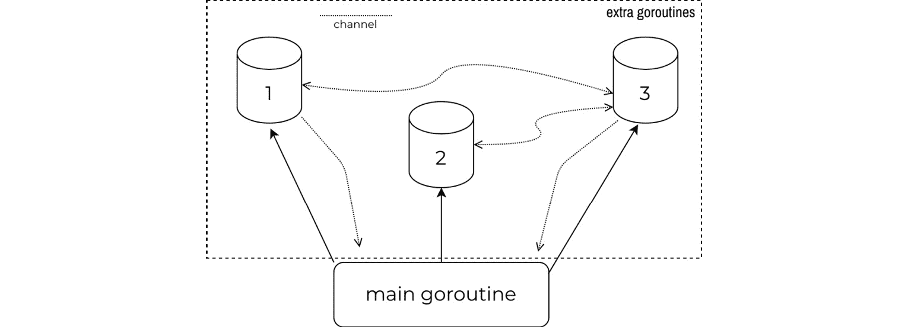

图 3.12 – Go 的并发

在本节中，我们将介绍以下并发原语：

+   Goroutines 和用于它们协调的`sync`包的使用

+   我们如何使用 channels 在 goroutines 之间发送和接收数据

+   在不同 goroutines 之间共享数据时使用互斥锁

## Goroutines

将 Goroutines 视为 Go 运行时管理的用户空间线程是一种思考方式。它们在创建和管理上计算成本低廉，因此可以在普通机器上扩展到数十万，内存是主要的限制因素。

通常，我们会为可能阻塞主函数执行的任务创建 goroutines。您可以想象这为什么在网络自动化环境中特别有帮助，在那里我们必须处理远程网络调用并等待网络设备执行命令。

我们通过构建另一个网络自动化示例来介绍基本的 goroutine 理论。在前一节中，我们学习了如何加载和解析设备清单。在本节中，我们继续之前的讨论，看看如何与这些网络设备交互。

首先，我们使用一个包含单个设备的清单文件（`input.yml`）。这个文件位于书的存储库的`ch03/single`文件夹中（见*进一步阅读*）：

```go
router:
- hostname: sandbox-iosxe-latest-1.cisco.com
  platform: cisco_iosxe
  strictkey: false
  username: developer
  password: C1sco12345
```

为了存储这个清单，我们定义了一个类似于我们在编码/解码部分中使用的类型层次结构。代码示例输出仅显示了一些字段以节省篇幅：

```go
type Router struct {
    Hostname  string `yaml:"hostname"`
    /* ... <omitted for brevity > ... */
}
type Inventory struct {
    Routers []Router `yaml:"router"`
}
```

我们定义了另一个名为`getVersion`的函数，它接受`Router`类型的参数，连接并检索软件和硬件版本信息，并在屏幕上打印出来。这个函数的确切实现并不重要，我们在这个章节中还没有关注它，但您可以在`ch03/single/main.go`（见*进一步阅读*）中看到完整的代码示例：

```go
func getVersion(r Router) {
    /* ... <omitted for brevity > ... */
}
func main() {
    src, err := os.Open("input.yml")
    //process error
    defer src.Close()
    d := yaml.NewDecoder(src)
    var inv Inventory
    err = d.Decode(&inv)
    // process error
    getVersion(inv.Routers[0])
}
```

由于我们只有一个设备在清单中，我们可以直接使用切片索引来访问它。这个程序的执行时间略少于 2 秒：

```go
ch03/single$ go run main.go
Hostname: sandbox-iosxe-latest-1.cisco.com
Hardware: [CSR1000V]
SW Version: 17.3.1a
Uptime: 5 hours, 1 minute
This process took 1.779684183s
```

现在，让我们看看一个类似的例子，它存储在`ch03/sequential`目录中（见*进一步阅读*），我们在库存中添加了两个额外的设备：

```go
router:
- hostname: sandbox-iosxe-latest-1.cisco.com
  platform: cisco_iosxe
  ...
- hostname: sandbox-nxos-1.cisco.com
  platform: cisco_nxos
  ...
- hostname: sandbox-iosxr-1.cisco.com
  platform: cisco_iosxr
  ...
```

正如在*控制流*部分讨论的那样，我们可以使用`for`循环的`range`形式遍历数组和切片。在这里，我们遍历`inv.Routers`中的每个`Router`，将其分配给每次迭代的`v`变量。我们通过将其分配给空白标识符（写作`_`，下划线）来忽略索引的值。最后，我们为`v`路由器调用`getVersion`函数：

```go
func main() {
    /* ... <omitted for brevity > ... */
    for _, r := range inv.Routers {
        getVersion(v)
    }
}
```

它大约需要 7 秒来执行，因为它会依次连接到每个设备：

```go
ch03/sequential$ go run main.go
Hostname: sandbox-iosxe-latest-1.cisco.com
Hardware: [CSR1000V]
SW Version: 17.3.1a
Uptime: 5 hours, 25 minutes
Hostname: sandbox-nxos-1.cisco.com
Hardware: C9300v
SW Version: 9.3(3)
Uptime: 0 day(s), 3 hour(s), 2 minute(s), 18 second(s)
Hostname: sandbox-iosxr-1.cisco.com
Hardware: IOS-XRv 9000
SW Version: 6.5.3
Uptime: 2 weeks 8 hours 23 minutes
This process took 6.984502353s
```

这是我们可以通过使用 goroutines 来优化的代码的一个典型例子。我们最初需要做的只是在我们需要在 goroutine 中运行的语句之前添加一个`go`关键字：

```go
func main() {
    /* ... <omitted for brevity > ... */
    for _, r := range inv.Routers {
        go getVersion(v)
    }
}
```

在代码示例中，我们为每个`getVersion`（`v`）语句的调用生成一个单独的 goroutine。所有事情都在后台发生；在生成的 goroutine 中的任何阻塞语句都不会影响其他 goroutine，所以现在所有三个函数调用，加上主 goroutine，都是并发运行的。

这些生成的 goroutines 的默认行为是立即释放控制权，所以在这个例子中，代码遍历所有三个设备然后返回。它实际上并没有等待生成的 goroutines 完成。

但是，在我们的情况下，我们希望在退出程序之前看到所有三个函数调用的结果。这就是我们可以使用一个特殊的`sync.WaitGroup`类型的地方，它会阻塞主 goroutine，直到所有生成的 goroutines 完成。它是通过保持一个跟踪所有当前活动 goroutines 的计数器来做到这一点的，并且会阻塞直到该计数器降到零。

这就是我们如何在我们的代码示例中引入这个想法的方法：

+   我们创建了一个新的`wg`变量，其类型为`sync.WaitGroup`。

+   当遍历我们的库存时，我们通过`wg.Add(1)`将`WaitGroup`计数器增加一。

+   每个生成的 goroutine 都包含一个运行`getVersion`的匿名函数，但在最后也通过`defer`语句调用`wg.Done`，以将`WaitGroup`计数器减一。

+   主 goroutine 在`wg.Wait`上阻塞，直到`WaitGroup`计数器变为零。这发生在所有`getVersion`函数的生成实例返回之后。

你可以在`ch03/concurrency/main.go`（见*进一步阅读*）中找到这个示例的完整代码：

```go
func main() {
    /* ... <omitted for brevity > ... */
    var wg sync.WaitGroup
    for _, v := range inv.Routers {
        wg.Add(1)
        go func(r Router) {
            defer wg.Done()
            getVersion(r)
        }(v)
    }
    wg.Wait()
}
```

现在，让我们看看这些更改对程序执行时间的影响：

```go
ch03/concurrency$ go run main.go
Hostname: sandbox-iosxe-latest-1.cisco.com
Hardware: [CSR1000V]
SW Version: 17.3.1a
Uptime: 5 hours, 26 minutes
Hostname: sandbox-iosxr-1.cisco.com
Hardware: IOS-XRv 9000
SW Version: 6.5.3
Uptime: 2 weeks 8 hours 25 minutes
Hostname: sandbox-nxos-1.cisco.com
Hardware: C9300v
SW Version: 9.3(3)
Uptime: 0 day(s), 3 hour(s), 4 minute(s), 11 second(s)
This process took 2.746996304s
```

我们已经将时间缩短到大约 3 秒，这是与库存中最慢的设备通信所需的时间。考虑到我们不需要更改任何*工作*函数（在这种情况下是`getVersion`），这是一个相当大的胜利。你可能可以将相同的重构应用到许多其他类似的程序上，只需对它们的现有代码库进行最小改动。

这种方法与原生同步函数配合得很好，你可以运行它，无论是否有 goroutine。但是，如果我们知道某个函数始终在 goroutine 中运行，那么从一开始就让它具有 goroutine 意识是完全可能的。例如，这就是我们如何重构`getVersion`函数以接受额外的`WaitGroup`参数，并将`wg.Done`调用作为函数的一部分：

```go
func getVersion(r Router, wg *sync.WaitGroup) {
    defer wg.Done()
    /* ... <omitted for brevity > ... */
}
```

有这样一个函数将简化主函数的代码，因为我们不再需要将所有内容包裹在一个匿名函数中，只是为了调用`wg.Done`：

```go
func main() {
    /* ... <omitted for brevity > ... */
    for _, v := range inv.Routers {
        wg.Add(1)
        go getVersion(v, &wg)
    }
    wg.Wait()
}
```

本例的完整代码位于`ch03/concurrency2`目录中（见*进一步阅读*）。

## Channels

一旦任何人熟悉了 goroutines，他们通常想要做的下一件事就是在它们之间交换数据。Go channels 允许 goroutines 相互通信。用现实世界的类比来描述 Go channels，它们就像先进先出（first-in-first-out）的管道——它们有固定的吞吐量，并允许你在两个方向上发送数据。

你可以使用 channels 进行 goroutine 同步（一种用于工作协调的信号形式）和通用数据交换。

我们使用`make`关键字创建 channels，它初始化它们并使它们准备好使用。`make`接受的两个参数是 channel 类型，它定义了你可以通过 channel 交换的数据类型，以及一个可选的容量。channel 容量决定了在它开始阻塞发送者之前可以存储多少未接收到的值，此时它充当一个缓冲区。

以下代码片段展示了我们如何在 channel 上发送和接收一个整数。在这里，`send`是我们想要发送到我们创建的`ch`channel 的值。`<-`操作符允许我们向 channel 发送数据。接下来，我们声明一个`receive`变量，其值来自`ch`channel：

```go
func main() {
    ch := make(chan int, 1)
    send := 1
    ch <- send
    receive := <-ch
    // prints 1
    fmt.Println(receive)
}
```

但是，在单个 goroutine 中发送和接收数据不是这里的最终目标。让我们检查另一个使用 channels 在不同 goroutines 之间进行通信的例子。我们拾取本节中使用的例子，并引入另一个*worker*函数，其任务是打印`getVersion`函数产生的结果。

新的`printer`函数使用`for`循环从`in`channel 接收值，并在终端上打印它们：

```go
func printer(in chan data {
    for out := range in {
        fmt.Printf("Hostname: %s\nHW: %s\nSW Version: %s\nUptime: %s\n\n", out.host, out.hw, out.version, out.uptime)
    }
}
```

在我们启动任何 goroutine 之前，我们在主 goroutine 中创建`ch`channel，并将其作为参数传递给`getVersion`和`printer`函数。我们首先启动的额外 goroutine 是`printer`函数的一个实例，它监听来自设备的消息，通过`ch`channel：

```go
funcmain() {
    /* ... <omitted for brevity > ... */
    ch := make(chan data)
    go printer(ch)
    var wg sync.WaitGroup
    for _, v := range inv.Routers {
        wg.Add(1)
        go getVersion(v, ch, &wg)
    }
    wg.Wait()
    close(ch)
}
```

下一步是启动一个 goroutine 来处理清单中的每个网络设备，捕获我们需要的输出，并使用`getVersion`函数将其通过 channel 发送。在收集并打印数据后，我们关闭 channel 并结束程序：

```go
ch03/concurrency3$ gorun main.go
Hostname: sandbox-iosxe-latest-1.cisco.com
HW: [CSR1000V]
SW Version: 17.3.1a
Uptime: 1 day, 12 hours, 42 minutes
Hostname: sandbox-iosxr-1.cisco.com
HW: IOS-XRv 9000
SW Version: 7.3.2
Uptime: 1 day 2 hours 57 minutes
Hostname: sandbox-nxos-1.cisco.com
HW: C9300v
SW Version: 9.3(3)
Uptime: 5 day(s), 6 hour(s), 25 minute(s), 44 second(s)
```

本例的完整代码位于`ch03/concurrency3` (*Further* *reading*) 目录中。

## Channels and Timers

在前几个例子中，我们没有考虑到的场景是网络设备不可达，或者与它的连接中断，或者设备可能永远无法返回我们需要的输出。在这些情况下，我们需要设置超时，这样我们就不必永远等待，并且可以优雅地结束程序。

您可以在连接级别处理此问题，但通道还提供了一些资源，通过这些计时器类型来跟踪时间：

+   **定时器** — 等待一定时间

+   **计时器** — 在某个间隔内重复执行操作

### 定时器

`Timer`可以帮助您为程序定义超时。为了说明这一点，我们可以重写我们一直在工作的示例，在主函数中打印来自`ch`通道的所有消息，而不是调用一个单独的函数（`printer`）。

在无限循环中的`select`语句是这样处理的。与`switch`语句不同，当我们不需要选择选项时，我们使用`select`与通道一起使用。对于每次迭代，我们要么等待来自`ch`通道的消息，要么如果 5 秒已过（`time.After(5 * time.Second)`），我们关闭通道并退出程序：

```go
func main() {
    /* ... <omitted for brevity > ... */
    for {
        select {
        case out := <-ch:
            fmt.Printf(
    "Hostname: %s\nHW: %s\nSW Version: %s\nUptime:%s\n\n",
            out.host, out.hw, out.version, out.uptime)
        case <-time.After(5 * time.Second):
            close(ch)
            fmt.Println("Timeout: 5 seconds")
            return
        }
    }
}
```

这迫使运行时始终为 5 秒，即使不是所有任务都已完成。这不是解决这个问题的最有效方法，但它展示了如何超时而不引入标准库中的`context`包，您也可以在这个场景中使用该包。

本例的完整代码位于书籍仓库的`ch03/concurrency5`目录中（参见*进一步阅读*）。

### 计时器

计时器的一个常见用途是在需要执行周期性任务的情况下。在下一个代码示例中，我们创建了一个每半秒运行`ticker`，我们将其用作触发器，向终端打印消息。我们还创建了一个`done`通道，仅用于在 2 秒和 100 毫秒后停止程序的执行：

```go
func main() {
    ticker := time.NewTicker(500 * time.Millisecond)
    done := make(chan bool)
    go repeat(done, ticker.C)
    time.Sleep(2100 * time.Millisecond)
    ticker.Stop()
    done <- true
}
```

`time`包中的计时器有一个`C`通道，它们使用该通道在每个间隔内发出信号。我们将此通道和`done`通道传递给我们在 goroutine 中执行的`repeat`函数：

```go
func repeat(d chan bool, c <-chan time.Time) {
    for {
        select {
        case <-d:
            return
        case t := <-c:
            fmt.Println("Run at", t.Local())
        }
    }
}
```

此函数运行一个无限循环，等待来自`ticker`或`done`通道的信号以结束执行。输出如下：

```go
ch03/ticker$ gorun main.go
Tick at 2021-11-17 23:19:33.914906389 -0500 EST
Tick at 2021-11-17 23:19:34.414279709 -0500 EST
Tick at 2021-11-17 23:19:34.915058301 -0500 EST
```

本例的完整代码位于`ch03/ticker`目录中（参见*进一步阅读*）。

## 共享数据访问

Channels 是线程安全的，因此始终使用它们作为 goroutines 之间数据通信的默认选项是个好主意。但有时，您可能仍然需要访问和更改多个 goroutine 都可以访问的数据。

并发数据访问的问题在于，当许多 goroutine 尝试更改相同的字段或从其他人可能正在更改的字段中读取时，可能会导致数据损坏。Go 的`sync`包包括三种辅助类型，您可以使用它们来序列化这些类型的操作：

+   `sync.Mutex`类型是一种通用互斥锁，有两个状态——锁定和解锁。

+   `sync.RWMutex`类型是专门用于读写操作的互斥锁，其中只有写操作是互斥的，但同时的读操作是安全的。

+   `sync.Map`互斥锁覆盖了几个映射边缘情况，我们在这本书中没有深入探讨。**sync.Map 文档**中提到了它们（参见*进一步阅读*）。

现在，让我们看看如何使用`sync.RWMutexto`来保护并发映射访问的示例。以本节中使用的示例主题为基准，让我们添加另一个变量来记录我们是否能够成功连接到远程设备。我们称这个变量为`isAlive`，并将其作为参数传递给`getVersion`函数：

```go
func main() {
    /* ... <omitted for brevity > ... */
    isAlive := make(map[string]bool)
    /* ... <omitted for brevity > ... */
    for _, v := range inv.Routers {
        wg.Add(1)
        go getVersion(v, ch, &wg, isAlive)
    }
    /* ... <omitted for brevity > ... */
}
```

我们将`m`互斥锁定义为包级全局变量，以确保所有函数都使用相同的互斥锁进行同步。我们在更改`isAlive`映射之前锁定这个互斥锁，并在`getVersion`函数中更改后立即解锁：

```go
var m sync.RWMutex = sync.RWMutex{}
func getVersion(r Router, out chan data, wg *sync.WaitGroup, isAlive map[string]bool) {
    defer wg.Done()
    /* ... <omitted for brevity > ... */
    rs, err := d.SendCommand("show version")
    if err != nil {
        fmt.Printf("fail to send cmd for %s: %+v\n",
                    r.Hostname, err)
        m.Lock()
        isAlive[r.Hostname] = false
        m.Unlock()
        return
    }
    m.Lock()
    isAlive[r.Hostname] = true
    m.Unlock()
}
```

最后，我们在主函数中的循环中添加了另一个互斥锁，该锁在迭代映射时使用只读锁，以防止在过程中意外修改：

```go
func main() {
    /* ... <omitted for brevity > ... */
    m.RLock()
    for name, v := range isAlive {
        fmt.Printf("Router %s is alive: %t\n", name, v)
    }
    m.RUnlock()
    /* ... <omitted for brevity > ... */
}
```

你可以在`ch03/concurrency4`目录中查看完整的代码（参见*进一步阅读*）。下一个输出显示了该程序产生的结果：

```go
ch03/concurrency4$ go run main.go
Hostname: sandbox-iosxe-latest-1.cisco.com
Hardware: [CSR1000V]
SW Version: 17.3.1a
Uptime: 8 hours, 27 minutes
Hostname: sandbox-iosxr-1.cisco.com
Hardware: IOS-XRv 9000
SW Version: 7.3.2
Uptime: 1 day 11 hours 43 minutes
Hostname: sandbox-nxos-1.cisco.com
Hardware: C9300v
SW Version: 9.3(3)
Uptime: 5 day(s), 15 hour(s), 11 minute(s), 42 second(s)
Router sandbox-iosxe-latest-1.cisco.com is alive: true
Router sandbox-iosxr-1.cisco.com is alive: true
Router sandbox-nxos-1.cisco.com is alive: true
This process took 3.129440011s
```

有时，你可能会忘记使用互斥锁，特别是对于非平凡的用户定义数据类型，或者当你意外地在 goroutines 之间泄漏变量时。在这些情况下，你可以使用`go`工具内置的数据竞争检测器。将`-race`标志添加到任何 go `test`/`run`/`build`命令中，以检查并获取对共享内存的任何未受保护访问请求的报告。

为了了解它是如何工作的，让我们关注我们在`getVersion`函数的不同实例上并发操作的`isAlive`映射。之前，我们用互斥锁包围了它，现在我们在`ch03/race/main.go`中移除了它（参见*进一步阅读*）：

```go
func getVersion(r Router, out chan map[string]interface{}, wg *sync.WaitGroup, isAlive map[string]bool) {
    defer wg.Done()
    /* ... <omitted for brevity > ... */
    // m.Lock()
    isAlive[r.Hostname] = true
    // m.Unlock()
    out <- "test"
}
```

当你使用额外的`-race`标志运行程序时，Go 会突出显示它检测到的数据竞争条件：

```go
ch03/race$ gorun -race main.go
MESSAGE: test
MESSAGE: test
==================
WARNING: DATA RACE
Write at 0x00c00011c6f0 by goroutine 9:
  runtime.mapassign_faststr()
      /usr/local/go/src/runtime/map_faststr.go:202 +0x0
  main.getVersion()
      ~/Network-Automation-with-Go/ch03/race/main.go:35 +0xeb
  main.main·dwrap·5()
      ~/Network-Automation-with-Go/ch03/race/main.go:74 +0x110
...
==================
MESSAGE: test
Router sandbox-iosxe-latest-1.cisco.com is alive: true
Router sandbox-iosxr-1.cisco.com is alive: true
Router sandbox-nxos-1.cisco.com is alive: true
This process took 1.918348ms
Found 1 data race(s)
exit status 66
```

Go 的内置数据竞争检测器减轻了调试数据竞争的任务，数据竞争是并发系统中最难调试的 bug 之一。

## 并发注意事项

并发是一个强大的工具。你甚至可以在代码的每个地方使用 goroutines，并遵循如工作池等设计模式，将工作分配给不同的 goroutines，以获得相对较小的复杂性增加的初始速度提升。

但是，重要的是要考虑*并发不是并行*（见*进一步阅读*），在协调 goroutines 并将它们映射到操作系统线程的过程中，始终存在一些开销。我们也不应该忘记，底层硬件资源是有限的，因此并发性能的提升也是有限的，因为它们不可避免地会在某个点上趋于平稳（见*进一步阅读*部分的*在 Go 中模拟真实世界系统*）。

最后，并发编程很难；编写安全的代码很难，当它出错时，推理和调试也很困难。不要过度使用 goroutines 来设计你的代码，只在真正需要时使用它们，衡量你的收益并检测竞争条件，尽可能避免内存共享，并通过通道进行通信。

# 摘要

本章总结了 Go 作为编程语言的理论介绍。我们从 Go 变量类型及其操作开始，到回顾 Go 程序的关键构建块，以及如何利用 Go 标准库中最著名的包来帮助你构建可扩展的应用程序。

从下一章开始，我们将注意力转向更适用于现实场景的网络特定任务。我们仍然在整本书中介绍一些理论概念，但大部分内容都是关于具体用例，而不是抽象理论。

# 进一步阅读

+   `ch03/type-definition/main.go`: [`github.com/PacktPublishing/Network-Automation-with-Go/blob/main/ch03/type-definition/main.go`](https://github.com/PacktPublishing/Network-Automation-with-Go/blob/main/ch03/type-definition/main.go)

+   `ch03/string-literals/main.go`: [`github.com/PacktPublishing/Network-Automation-with-Go/blob/main/ch03/string-literals/main.go`](https://github.com/PacktPublishing/Network-Automation-with-Go/blob/main/ch03/string-literals/main.go)

+   `ch03/string-concatenate/main.go`: [`github.com/PacktPublishing/Network-Automation-with-Go/blob/main/ch03/string-concatenate/main.go`](https://github.com/PacktPublishing/Network-Automation-with-Go/blob/main/ch03/string-concatenate/main.go)

+   `ch03/string-memory/main.go`: [`github.com/PacktPublishing/Network-Automation-with-Go/blob/main/ch03/string-memory/main.go`](https://github.com/PacktPublishing/Network-Automation-with-Go/blob/main/ch03/string-memory/main.go)

+   `ch03/boolean/main.go`: [`github.com/PacktPublishing/Network-Automation-with-Go/blob/main/ch03/boolean/main.go`](https://github.com/PacktPublishing/Network-Automation-with-Go/blob/main/ch03/boolean/main.go)

+   `ch03/arrays/main.go`: [`github.com/PacktPublishing/Network-Automation-with-Go/blob/main/ch03/arrays/main.go`](https://github.com/PacktPublishing/Network-Automation-with-Go/blob/main/ch03/arrays/main.go)

+   `ch03/slices/main.go`: [`github.com/PacktPublishing/Network-Automation-with-Go/blob/main/ch03/slices/main.go`](https://github.com/PacktPublishing/Network-Automation-with-Go/blob/main/ch03/slices/main.go)

+   `ch03/maps/main.go`: [`github.com/PacktPublishing/Network-Automation-with-Go/blob/main/ch03/maps/main.go`](https://github.com/PacktPublishing/Network-Automation-with-Go/blob/main/ch03/maps/main.go)

+   `ch03/structs/main.go`: [`github.com/PacktPublishing/Network-Automation-with-Go/blob/main/ch03/structs/main.go`](https://github.com/PacktPublishing/Network-Automation-with-Go/blob/main/ch03/structs/main.go)

+   `ch03/tcp-header/main.go`: [`github.com/PacktPublishing/Network-Automation-with-Go/blob/main/ch03/tcp-header/main.go`](https://github.com/PacktPublishing/Network-Automation-with-Go/blob/main/ch03/tcp-header/main.go)

+   *比较运算符*: [`golang.org/ref/spec#Comparison_operators`](https://golang.org/ref/spec#Comparison_operators)

+   `ch03/switch/main.go`: [`github.com/PacktPublishing/Network-Automation-with-Go/blob/main/ch03/switch/main.go`](https://github.com/PacktPublishing/Network-Automation-with-Go/blob/main/ch03/switch/main.go)

+   `ch03/goto/main.go`: [`github.com/PacktPublishing/Network-Automation-with-Go/blob/main/ch03/goto/main.go`](https://github.com/PacktPublishing/Network-Automation-with-Go/blob/main/ch03/goto/main.go)

+   `ch03/functions1/main.go`: [`github.com/PacktPublishing/Network-Automation-with-Go/blob/main/ch03/functions1/main.go`](https://github.com/PacktPublishing/Network-Automation-with-Go/blob/main/ch03/functions1/main.go)

+   `ch03/functions2/main.go`: [`github.com/PacktPublishing/Network-Automation-with-Go/blob/main/ch03/functions2/main.go`](https://github.com/PacktPublishing/Network-Automation-with-Go/blob/main/ch03/functions2/main.go)

+   `ch03/mutate-slice/main.go`: [`github.com/PacktPublishing/Network-Automation-with-Go/blob/main/ch03/mutate-slice/main.go`](https://github.com/PacktPublishing/Network-Automation-with-Go/blob/main/ch03/mutate-slice/main.go)

+   `ch03/methods/main.go`: [`github.com/PacktPublishing/Network-Automation-with-Go/blob/main/ch03/methods/main.go`](https://github.com/PacktPublishing/Network-Automation-with-Go/blob/main/ch03/methods/main.go)

+   `ch03/variadic/main.go`: [`github.com/PacktPublishing/Network-Automation-with-Go/blob/main/ch03/variadic/main.go`](https://github.com/PacktPublishing/Network-Automation-with-Go/blob/main/ch03/variadic/main.go)

+   `ch03/defer/main.go`: [`github.com/PacktPublishing/Network-Automation-with-Go/blob/main/ch03/defer/main.go`](https://github.com/PacktPublishing/Network-Automation-with-Go/blob/main/ch03/defer/main.go)

+   *示例程序*: [`github.com/PacktPublishing/Network-Automation-with-Go/blob/main/ch03/interfaces-sample/main.go`](https://github.com/PacktPublishing/Network-Automation-with-Go/blob/main/ch03/interfaces-sample/main.go)

+   `ch03/io-interface1/main.go`: [`github.com/PacktPublishing/Network-Automation-with-Go/blob/main/ch03/io-interface1/main.go`](https://github.com/PacktPublishing/Network-Automation-with-Go/blob/main/ch03/io-interface1/main.go)

+   `ch03/io-interface2/main.go`: [`github.com/PacktPublishing/Network-Automation-with-Go/blob/main/ch03/io-interface2/main.go`](https://github.com/PacktPublishing/Network-Automation-with-Go/blob/main/ch03/io-interface2/main.go)

+   `ch03/reader/main.go`: [`github.com/PacktPublishing/Network-Automation-with-Go/blob/main/ch03/reader/main.go`](https://github.com/PacktPublishing/Network-Automation-with-Go/blob/main/ch03/reader/main.go)

+   `ch03/json`: [`github.com/PacktPublishing/Network-Automation-with-Go/tree/main/ch03/json`](https://github.com/PacktPublishing/Network-Automation-with-Go/tree/main/ch03/json)

+   书籍的 GitHub 仓库: [`github.com/PacktPublishing/Network-Automation-with-Go`](https://github.com/PacktPublishing/Network-Automation-with-Go)

+   `ch03/json/main.go`: [`github.com/PacktPublishing/Network-Automation-with-Go/blob/main/ch03/json/main.go`](https://github.com/PacktPublishing/Network-Automation-with-Go/blob/main/ch03/json/main.go)

+   `ch03/json-interface`: [`github.com/PacktPublishing/Network-Automation-with-Go/tree/main/ch03/json-interface`](https://github.com/PacktPublishing/Network-Automation-with-Go/tree/main/ch03/json-interface)

+   *GJSON*: [`github.com/tidwall/gjson`](https://github.com/tidwall/gjson)

+   *SJSON*: [`github.com/tidwall/sjson`](https://github.com/tidwall/sjson)

+   `ch03/xml`: [`github.com/PacktPublishing/Network-Automation-with-Go/tree/main/ch03/xml`](https://github.com/PacktPublishing/Network-Automation-with-Go/tree/main/ch03/xml)

+   `xmlquery`: [`github.com/antchfx/xmlquery`](https://github.com/antchfx/xmlquery)

+   `ch03/yaml`: [`github.com/PacktPublishing/Network-Automation-with-Go/tree/main/ch03/yaml`](https://github.com/PacktPublishing/Network-Automation-with-Go/tree/main/ch03/yaml)

+   `ch03/yaml/main.go`: [`github.com/PacktPublishing/Network-Automation-with-Go/blob/main/ch03/yaml/main.go`](https://github.com/PacktPublishing/Network-Automation-with-Go/blob/main/ch03/yaml/main.go)

+   *yq*: [`github.com/mikefarah/yq`](https://github.com/mikefarah/yq)

+   `ch03/json-xml`: [`github.com/PacktPublishing/Network-Automation-with-Go/tree/main/ch03/json-xml`](https://github.com/PacktPublishing/Network-Automation-with-Go/tree/main/ch03/json-xml)

+   `ch03/single`: [`github.com/PacktPublishing/Network-Automation-with-Go/tree/main/ch03/single`](https://github.com/PacktPublishing/Network-Automation-with-Go/tree/main/ch03/single)

+   `ch03/single/main.go`: [`github.com/PacktPublishing/Network-Automation-with-Go/blob/main/ch03/single/main.go`](https://github.com/PacktPublishing/Network-Automation-with-Go/blob/main/ch03/single/main.go)

+   `ch03/sequential`: [`github.com/PacktPublishing/Network-Automation-with-Go/tree/main/ch03/sequentia`](https://github.com/PacktPublishing/Network-Automation-with-Go/tree/main/ch03/sequentia)

+   `ch03/concurrency/main.go`: [`github.com/PacktPublishing/Network-Automation-with-Go/blob/main/ch03/concurrency/main.go`](https://github.com/PacktPublishing/Network-Automation-with-Go/blob/main/ch03/concurrency/main.go)

+   `ch03/concurrency2`: [`github.com/PacktPublishing/Network-Automation-with-Go/tree/main/ch03/concurrency2`](https://github.com/PacktPublishing/Network-Automation-with-Go/tree/main/ch03/concurrency2)

+   `ch03/concurrency3`: [`github.com/PacktPublishing/Network-Automation-with-Go/tree/main/ch03/concurrency3`](https://github.com/PacktPublishing/Network-Automation-with-Go/tree/main/ch03/concurrency3)

+   `ch03/concurrency5`: [`github.com/PacktPublishing/Network-Automation-with-Go/tree/main/ch03/concurrency5`](https://github.com/PacktPublishing/Network-Automation-with-Go/tree/main/ch03/concurrency5)

+   `ch03/ticker`: [`github.com/PacktPublishing/Network-Automation-with-Go/tree/main/ch03/ticker`](https://github.com/PacktPublishing/Network-Automation-with-Go/tree/main/ch03/ticker)

+   *sync.Map* 文档: [`pkg.go.dev/sync#Map`](https://pkg.go.dev/sync#Map)

+   `ch03/concurrency4`: [`github.com/PacktPublishing/Network-Automation-with-Go/tree/main/ch03/concurrency4`](https://github.com/PacktPublishing/Network-Automation-with-Go/tree/main/ch03/concurrency4)

+   `ch03/race/main.go`: [`github.com/PacktPublishing/Network-Automation-with-Go/blob/main/ch03/race/main.go`](https://github.com/PacktPublishing/Network-Automation-with-Go/blob/main/ch03/race/main.go)

+   在 *Go* 中 *模拟真实世界系统*: [`www.youtube.com/watch?v=_YK0viplIl4`](https://www.youtube.com/watch?v=_YK0viplIl4)

+   *并发不是* *并行*: [`blog.golang.org/waza-talk`](https://blog.golang.org/waza-talk)
