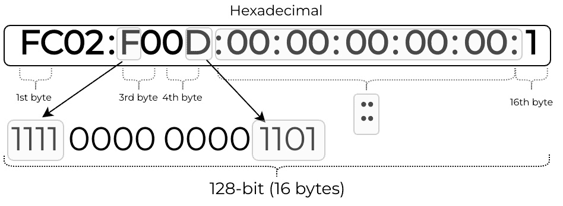

# 使用 Go 进行网络（TCP/IP）

每个网络工程师都曾在某个时候学习过**开放系统互连**（**OSI**）模型的七层。它的一个更简洁的版本，只有四层，就是 TCP/IP 模型，这是控制互联网通信的架构模型。

每一层定义了一个功能，每一层的数据通信协议执行一个。这些层堆叠在一起，所以我们通常称这个协议集合为协议栈。数据包必须通过协议栈的每一层才能到达目标主机。

Go 有几个包可以用于 TCP/IP 模型每一层的协议。这使得我们能够为各种用例构建解决方案——从 IP 地址管理到通过网络运行应用程序事务，甚至实现网络协议：


图 4.1 – TCP/IP 模型

在本章中，我们关注 TCP/IP 模型每一层的应用场景：

+   链接

+   互联网

+   传输

+   应用程序

# 技术要求

我们假设你对命令行、Git 和 GitHub 有基本的了解。你可以在此章的 GitHub 仓库中找到此章的代码示例：[`github.com/PacktPublishing/Network-Automation-with-Go`](https://github.com/PacktPublishing/Network-Automation-with-Go)，在`ch04`文件夹下。

要运行示例，你需要执行以下操作：

1.  为你的操作系统安装 Go 1.17 或更高版本。你可以遵循*第一章*中“介绍”部分的*安装 Go*部分的说明，或者访问[`go.dev/doc/install`](https://go.dev/doc/install)。本章中的两个示例，特别是针对 net/netip 包的示例，需要 Go 1.18 或更高版本。

1.  使用`git` `clone https://github.com/PacktPublishing/Network-Automation-with-Go.git`克隆本书的 GitHub 仓库。

1.  将目录更改为示例文件夹：`cd Network-Automation-with-Go/ch04/trie`。

1.  执行`go` `run main.go`。

# 链路层

我们从 TCP/IP 模型的底层开始，该层发送和接收链路层数据帧。在本节中，我们将涵盖以下主题：

+   网络接口管理

+   以太网的基本操作

## 网络接口

随着我们越来越多地看到基于 Linux 的网络操作系统，了解 Go 如何帮助我们在这个环境中与网络接口交互是有意义的。

Linux 通过一个名为 Netlink 的内核接口暴露其网络内部结构。这个接口允许用户空间的应用程序，如 Go，通过标准套接字 API 与内核通信。最常见的是，TCP/UDP 库使用 Netlink 套接字发送和接收数据，但它们也可以与大多数 Linux 网络结构一起工作，从接口到路由和 nftables。

幸运的是，你不需要了解或理解低级的 Netlink API，因为有许多 Go 包提供了高级抽象，这使得工作变得更加容易。一些值得注意的 Netlink 包包括以下内容：

+   Go 标准库中的`syscall`包（*进一步阅读*）包括一些通常由高级包使用的高级原语。

+   第三方 Go 包`vishvananda/netlink`（*进一步阅读*）是高级 Netlink 包的早期实现之一，被 Docker、Istio 和 Kubernetes CNI 插件等众多开源项目广泛使用。

+   基于`mdlayher/netlink`（*进一步阅读*）包的插件生态系统是一组相对较新的项目，它们在共同的基础上以更符合语言习惯和可维护的方式实现。

这些 Netlink 包具有不同的功能覆盖范围，你选择的包通常取决于你的应用程序需求。为了演示，我们展示了如何切换接口的管理状态，为此，我们从`mdlayher/netlink`生态系统（*进一步阅读*）中选择了一个 rtnetlink 包。

让我们分三个阶段来分解和回顾这个示例。首先，我们导入 Netlink 包`rtnetlink/rtnl`，这是围绕`mdlayher/netlink`包开发的松散相关包之一，使用`Dial`方法与 Netlink 套接字建立连接，然后通过连接使用`Links`方法检索所有本地接口的列表：

```go
func main() {
    conn, err := rtnl.Dial(nil)
    // process error
    defer conn.Close()
    links, err := conn.Links()
    /* ... <continues next > ... */
}
```

这段代码与我们为所有远程连接在 Go 中执行的操作相似，这也是为什么 Go 开发者认为这个包更符合语言习惯。一旦我们有了变量`links`中所有接口的列表，我们就可以遍历它们以找到任何感兴趣的接口。

假设我们想要切换系统中存在的`lo`接口。我们遍历变量`links`中的所有接口，如果在其中找到`lo`接口，我们就打印出该接口的数据，并将接口值存储在我们称之为`loopback`的变量中，这样我们就可以使用`LinkDown`将其关闭，稍后使用`LinkUp`将其重新启用：

```go
func main() {
    /* ... <continues from before > ... */
    var loopback *net.Interface
    for _, l := range links {
        if l.Name == "lo" {
            loopback = l
            log.Printf("Name: %s, Flags:%s\n", 
                        l.Name, l.Flags)
        }
    }
    /* ... <continues next > ... */
}
```

在运行`LinkDown`和`LinkUp`之后，你可以通过在每次更改后从 Netlink 检索接口设置来验证更改是否产生了预期的效果。我们更新`loopback`变量以实现统一的打印语句：

```go
func main() {
    /* ... <continues from before > ... */
    conn.LinkDown(loopback)
    loopback, _ = conn.LinkByIndex(loopback.Index)
    log.Printf("Name: %s, Flags:%s\n", 
                loopback.Name, loopback.Flags)
    conn.LinkUp(loopback)
    loopback, _ = conn.LinkByIndex(loopback.Index)
    log.Printf("Name: %s, Flags:%s\n", 
                loopback.Name, loopback.Flags)
}
```

你可以在`ch04/netlink`（*进一步阅读*）中找到这个示例的完整内容，你必须使用`CAP_NET_ADMIN`能力（*进一步阅读*）或以 root 用户身份运行：

```go
ch04/netlink $ sudo go run main.go
2021/11/24 20:55:29 Name: lo, Flags:up|loopback
2021/11/24 20:55:29 Name: lo, Flags:loopback
2021/11/24 20:55:29 Name: lo, Flags:up|loopback
```

我们刚刚触及了 Netlink API 的表面，因为它的能力远远超出了本书的范围。今天，你可以使用 Netlink 进行 IP 路由管理、访问列表、**服务质量**（**QoS**）策略以及**扩展伯克利包过滤器**（**eBPF**）程序附加等操作。希望这一节提供了足够的信息，让你对 Netlink API 交互所涉及的内容有一个大致的了解，因为现在我们必须转到下一个主题，探索 Go 如何处理今天最广泛使用的链路层协议：以太网。

## 以太网

与以太网一起工作可能涉及各种活动，从低级协议解码、操作和编码到与设备 API 交互以收集以太网硬件信息。Go 有一系列广泛的包可以帮助你处理各种与以太网相关的任务：

+   最广泛使用的包处理包之一是`google/gopacket`（*进一步阅读*），你可以用它进行数据包捕获和协议解码。它不仅限于以太网，我们将在*第十章* *网络监控*中更详细地介绍它。

+   我们刚才提到的 Netlink API 包可以查询基于 Linux 操作系统的链路层硬件信息。

+   另一个广泛使用的以太网编码和解码包`mdlayher/ethernet`（*进一步阅读*）允许你将帧在二进制线格式和静态 Go 类型表示之间进行转换。

在下一个示例中，我们将介绍一个`虚拟 IP`（`VIP`）功能的基本实现。我们这个实现是基于`kube-vip`（*进一步阅读*）包的，这是一个 Kubernetes 控制平面 VIP 控制器。它的工作方式是一个两步过程：

1.  它将一个新的**VIP**分配给本地网络接口之一。

1.  它定期发送无用的**地址解析协议**（**ARP**）数据包，让本地广播域中的每个人都知道这个 VIP。

让我们从第一步开始回顾，看看我们是如何将一个 VIP 分配给接口的。我们将使用与*网络接口*部分相同的包来与 Netlink 交互（`rtnetlink/rtnl`），只是这次我们使用`AddrAdd`方法将 IP 前缀分配给指定的接口。

在程序中，我们通过`flag`包使用 CLI 传递我们想要分配给这个 VIP 地址的接口名称，并将这个值存储在`intfStr`变量中。有了这个信息，我们使用`mdlayher/packet`包通过`Listen`函数在这个接口上发送和接收 ARP 数据包：

```go
func main() {
    intfStr := flag.String("intf", "", "VIP interface")
    flag.Parse()
    conn, err := rtnl.Dial(nil)
    // process error
    defer conn.Close()
    netIntf, err := net.InterfaceByName(*intfStr)
    ethSocket, err := packet.Listen(netIntf,
                                packet.Raw, 0, nil)
    // process error
    defer ethSocket.Close()
    /* ... <continues next > ... */
}
```

要实际将 VIP 地址分配给接口，我们创建了一个`vip`结构体类型，它允许我们保存所有需要传递给`AddrAdd`以实现这一功能的信息，如下一个输出所示：

```go
const VIP1 = "198.51.100.1/32"
type vip struct {
    IP      string
    netlink *rtnl.Conn
    intf    *net.Interface
    l2Sock  *raw.Conn
}
func (c *vip) addVIP() error {
    err := c.netlink.AddrAdd(c.intf,
                        rtnl.MustParseAddr(c.IP))
    // process error
    return nil
}
func main() {
    /* ... <continues from before > ... */
    v := &vip{
        IP:      VIP1,
        intf:    netIntf,
        netlink: rtnl,
        l2Sock:  *packet.Conn,
    }
    err = v.addVIP()
     /* ... <continues next > ... */
}
```

一旦我们分配了新的 VIP，我们就可以开始发送`for`循环，该循环暂停 3 秒钟然后再次运行。在这个循环中，我们包括一个带有初始化（`err := v.sendGARP()`）和条件（`err != nil`）语句的`if`语句。Go 在评估条件表达式之前执行初始化语句：

```go
func main() {
    /* ... <continues from before > ... */
    for {
        select {
        /* ... <omitted for brevity > ... */
        case <-timer.C:
            if err := v.sendGARP(); err != nil {
                log.Printf("fail send GARP %s",
                                err)
                cancel()
            }
        }
    }
}
```

在`sendGARP`方法中，我们可以找到大部分与以太网相关的代码。在这里，我们使用两个包来帮助我们构建 GARP。

我们首先需要构建 GARP 有效载荷，并用本地接口的 MAC 地址和 VIP 的 IP 地址填充它。为此，我们利用`mdlayher/arp`（*进一步阅读*）包：

```go
func (c *vip) sendGARP() error {
    /* ... <omitted for brevity > ... */
    arpPayload, err := arp.NewPacket(
        arp.OperationReply,  // op
        c.intf.HardwareAddr, // srcHW
        ip,                  // srcIP
        c.intf.HardwareAddr, // dstHW
        ip,                  // dstIP
    )
    // process error

    arpBinary, err := arpPayload.MarshalBinary()
    /* ... <continues next > ... */
}
```

然后，我们需要使用`mdlayher/ethernet`（*进一步阅读*）包将 GARP 有效载荷包裹在以太网帧中，并设置正确的以太网头部：

```go
func (c *vip) sendGARP() error {
    /* ... <continues from before > ... */
    ethFrame := &ethernet.Frame{
        Destination: ethernet.Broadcast,
        Source:      c.intf.HardwareAddr,
        EtherType:   ethernet.EtherTypeARP,
        Payload:     arpBinary,
    }

    return c.emitFrame(ethFrame)
}
```

最后一步是发送一个二进制帧，为此，我们使用实现 Linux 数据包套接字接口的`mdlayher/packet`（*进一步阅读*）包，该接口允许我们在设备驱动程序（链路层）级别发送和接收数据包。我们已经使用`Listen`（如前所述）打开了一个原始套接字`ethSocket`，因此现在我们可以将我们的二进制帧写入其中（`vip`结构体的`l2Sock`字段）：

```go
func (c *vip) emitFrame(frame *ethernet.Frame) error {
    b, err := frame.MarshalBinary()
    // process error

    addr := &packet.Addr{
                HardwareAddr:ethernet.Broadcast}
    if _, err := c.l2Sock.WriteTo(b, addr); err != nil {
        return fmt.Errorf("emitFrame failed: %s", err)
    }

    log.Println("GARP sent")
    return nil
}
```

您可以在`ch04/vip`（*进一步阅读*）中找到完整的示例。您需要以提升的权限运行它，才能更改网络接口。生成的输出将类似于以下内容：

```go
ch04/vip $ sudo go run main.go -intf eth0
2021/11/25 18:47:51 GARP sent
2021/11/25 18:47:54 GARP sent
^C2021/11/25 18:47:56 Received syscall: interrupt
2021/11/25 18:47:57 Cleanup complete
```

到目前为止，任何在本地网络段上有重叠 IP 子网的主机都应该能够 ping `198.51.100.1`地址（如果它们接受 GARPs）。要结束程序，您可以按*Ctrl* + *C*，程序将清理 VIP 接口。

网络工程师或开发者直接与以太网交互的情况很少见，但了解使用 Go 进行“谈论以太网”的感觉仍然很有价值。在下一节中，我们将向上移动一层，并介绍网络层包和示例。

# 网络层

在 OSI 模型中，网络层或互联网层负责传输可变长度的网络数据包，并通过一个或多个网络将数据从源传输到目的。

在这个层中，目前占主导地位的协议是**互联网协议**（**IP**），它可以是两个版本中的任何一个：版本 4（IPv4）或版本 6（IPv6）。网络层还包括诊断协议，如**互联网控制消息协议**（**ICMP**），一个安全的网络协议套件，如**互联网协议安全**（**IPsec**），以及包括**开放最短路径优先**（**OSPF**）在内的路由协议。

IP 通过从头部和有效载荷构建的 IP 数据报交换信息，该数据报由链路层作为帧通过特定的网络硬件（如以太网）传输。IP 头部携带数据包的 IP 源地址和目的地址，用于通过互联网路由该数据包。

在本节中，我们回顾以下内容：

+   如何使用 `net` 包解析和执行与 IP 地址相关的常见任务

+   新的 `net/netip` 包及其为 Go 标准库带来的特性

+   与 IP 地址一起工作的真实 Go 项目的示例

## net 包

标准库中的 `net` 包（*进一步阅读*）包括了一系列用于网络连接的工具和资源，对于本节来说最重要的是，它定义了与 IP 地址一起工作的类型和接口。其中一种类型是 `IP`，表示为一个字节的切片。此类型适用于 4 字节（IPv4）或 16 字节（IPv6）的切片：

```go
type IP []byte
```

让我们先探索如何从 IPv4 地址的十进制表示 `192.0.2.1` 创建一个 `IP` 类型变量：


图 4.2 – 一个 IPv4 地址

将 IPv4 地址转换为 IP 类型的一种方法是通过使用 `net` 包中的 `ParseIP` 函数，该函数接受一个字符串作为参数，并返回一个 `IP` 值：

```go
func main() {
    ipv4 := net.ParseIP("192.0.2.1")
    fmt.Println(ipv4)
}
```

IPv6 地址对我们眼睛来说处理起来稍微困难一些，但对于 Go 来说，它们只是像 IPv4 一样的一块块位：



图 4.3 – 一个 IPv6 地址

`ParseIP` 函数还可以解析 IPv6 的字符串表示形式，以返回 `IP` 类型的变量：

```go
func main() {
    ipv6 := net.ParseIP("FC02:F00D::1")
    fmt.Println(ipv6)
}
```

`IP` 类型代表一个 IP 地址，因此您可以使用相同的 IP 方法来处理 IPv4 或 IPv6 地址。假设您想检查一个 IP 地址是否在私有地址范围内。

`net` 包中的 `IsPrivate` 方法根据 RFC 1918（私有互联网地址分配）和 RFC 4193（唯一的本地 IPv6 单播地址）自动为 IPv4 和 IPv6 提供答案：

```go
func main() {
    // prints false
    fmt.Println(ipv4.IsPrivate())
    // prints true
    fmt.Println(ipv6.IsPrivate())
}
```

另一个有趣的数据类型是 `IPNet`，它描述了一个 IP 前缀或 IP 网络，因此它将 `IPMask` 添加到 `IP` 中以表示其掩码：

```go
type IPNet struct {
    IP   IP     // network number
    Mask IPMask // network mask
}
```

`net` 包中的掩码也是一个字节的切片，以下使用 `CIDRMask` 函数的示例可以更好地解释。`ones` 和 `bits` 参数都是整数，如函数签名所示。第一个参数 `ones` 是 `IPMask` 中的 1 的数量，其余位都设置为 0。掩码的总长度以 `bits` 为单位衡量：

```go
type IPMask []byte
func CIDRMask(ones, bits int) IPMask
```

让我们看看 IPv4 的一个示例，使用 32 位掩码：

```go
func main() {
    // This mask corresponds to a /31 subnet for IPv4.
    // prints [11111111 11111111 11111111 11111110]
    fmt.Printf("%b\n",net.CIDRMask(31, 32))
}
```

IPv6 的工作方式类似，但期望掩码长度为 128：

```go
func main() {
    // This mask corresponds to a /64 subnet for IPv6.
    // prints ffffffffffffffff0000000000000000
    fmt.Printf("%s\n",net.CIDRMask(64, 128))
}
```

要从字符串中解析前缀或网络，您可以使用 `net` 包中的 `ParseCIDR` 函数。您将获得三个值——一个 `IP` 类型的网络地址，一个 `IPnet` 类型的 IP 前缀，以及一个错误：

```go
func main() {
    ipv4Addr, ipv4Net, err := net.ParseCIDR("192.0.2.1/24")
    // process error
    // prints 192.0.2.1
    fmt.Println(ipv4Addr)
    // prints 192.0.2.0/24
    fmt.Println(ipv4Net)
}
```

下一个示例展示了使用与 IPv4 相同的函数来使用 `ParseCIDR` 对 IPv6 进行解析：

```go
func main() {
    ipv6Addr, ipv6Net, err :=  net.ParseCIDR(
                                "2001:db8:a0b:12f0::1/32")
    // process error
    // prints 2001:db8:a0b:12f0::1
    fmt.Println(ipv6Addr)
    // prints 2001:db8::/32
    fmt.Println(ipv6Net)
}
```

这些示例的代码可在 `ch04/net/main.go` 中找到（*进一步阅读*）。

这是 Go 中进行基本 IP 地址操作的标准方式。然而，不久前，有人试图通过一个我们接下来要审查的包将一个新的 IP 地址类型添加到标准库中。

## 新的 netip 包

为了改进 Go 中 `net.IP` 数据结构在 IP 地址方面的不足之处，一组 Go 开发者提出了一种新的 IP 地址类型。这是一个迭代过程，他们在博客文章 *netaddr.IP: Go 的新 IP 地址类型* 中进行了记录（*进一步阅读*）。此包现在在 Go 1.18 中作为 `net/netip` 提供。

`net/netip` 包定义了一个新的类型 `Addr`，该类型将 IPv4 和 IPv6 地址存储为一个大端 128 位数字。此类型还有一个特殊的哨兵字段 `z`，它可以具有以下任何值：

+   `nil` 表示无效的 IP 地址（对于零 `Addr`）。

+   `z4` 表示 IPv4 地址。

+   `z6noz` 表示没有区域的 IPv6 地址。

+   否则，它是 IPv6 区域名称字符串。

Go 中的数据结构如下所示：

```go
type Addr struct {
    addr uint128
    z *intern.Value
}
```

与传统的 `net.IP` 相比，这种新的 `Addr` 类型有以下主要优点：

+   它占用的内存更少。

+   它是不可变的，因此可以安全地传递。

+   它支持 `==` 操作，因此您可以用作映射键。

让我们看看如何从字符串中解析 IP 地址以获取 `Addr` 类型，并使用该包中的一些方法。在第一个例子中，我们解析一个 IPv4 地址，并使用 `IsMulticast` 方法检查它是否在 RFC 1112 `224.0.0.0/4` 组播范围内。第二个 IPv6 的例子展示了如何使用相同的函数 `ParseAddr` 从字符串中解析 IP 地址，并使用 `IsLinkLocalUnicast` 方法根据 RFC 4291 检查 IPv6 是否是链路本地地址或网络 `FE80::/10` 的一部分：

```go
func main() {
    IPv4, err := netip.ParseAddr("224.0.0.1")
    // process error
    // prints IPv4 address is Multicast
    if IPv4.IsMulticast() {
        fmt.Println("IPv4 address is Multicast")
    }
    IPv6, err := netip.ParseAddr("FE80:F00D::1")
    // process error
    // prints IPv6 address is Link Local Unicast
    if IPv6.IsLinkLocalUnicast() {
        fmt.Println("IPv6 address is Link Local Unicast")
    }
}
```

现在，如果您有一个使用 `net.IP` 的现有程序，您也可以将该类型作为 `netip` 的输入。对于 IPv4 和 IPv6，它使用 `AddrFromSlice` 函数解析 `net.IP` 类型。`IsX` 方法告诉我们这是一个 IPv4 还是 IPv6 地址：

```go
func main() {
    ipv4 := net.ParseIP("192.0.2.1")
    IPv4s, _ := netip.AddrFromSlice(ipv4)
    fmt.Println(IPv4s.String())
    fmt.Println(IPv4s.Unmap().Is4())
}
```

此示例的代码可在 `ch04/parseip` 找到（*进一步阅读*）：

```go
ch04/parseip$ go run main.go
::ffff:192.0.2.1
true
```

为了表示 IP 前缀（CIDR），`net/netip` 定义了一个名为 `Prefix` 的类型，该类型有一个 `Addr` 和一个整数，用于在 `bits` 字段中指定前缀长度（从 0 到 128）：

```go
type Prefix struct {
    ip Addr
    bits int16
}
```

要从字符串中解析前缀，您可以使用 `ParsePrefix` 函数或 `MustParsePrefix`，后者调用 `ParsePrefix` 并在出错时引发恐慌，这意味着您不需要在代码中检查返回的错误。让我们看看使用 `MustParsePrefix` 生成前缀并检查一些 IP 地址是否在该前缀地址范围内的程序：

```go
func main() {
    addr1 := "192.0.2.18"
    addr2 := "198.51.100.3"
    network4 := "192.0.2.0/24"
    pf := netip.MustParsePrefix(network4)
    fmt.Printf(
        "Prefix address: %v, length: %v\n", 
        pf.Addr(), pf.Bits())
    ip1 := netip.MustParseAddr(addr1)
    if pf.Contains(ip1) {
        fmt.Println(addr1, " is in ", network4)
    }
    ip2 := netip.MustParseAddr(addr2)
    if pf.Contains(ip2) {
        fmt.Println(addr2, " is in ", network4)
    }
}
```

我们从 `network4` 字符串 `192.0.2.0/24` 定义前缀 `pf`。然后，我们检查地址 `192.0.2.18` 和 `198.51.100.3` 是否在此网络中，如果它们是，则打印一条消息。此程序打印以下内容：

```go
ch04/parseprefix$ go run main.go
Prefix address: 192.0.2.0, length: 24
192.0.2.18  is in  192.0.2.0/24
```

此示例的代码可在 `ch04/parseprefix` 找到（*进一步阅读*）。

## 使用 IP 地址进行操作

解析 IP 地址后，您只需再走一步就可以将几个实际应用场景付诸实践。我们在这里仅介绍几个示例：

+   路由查找

+   地理 IP 数据

+   额外的 IP 地址功能

## 路由查找

执行路由查找或找到 IP 地址的最长前缀匹配的一种方法是使用 trie 数据结构（前缀树）。Trie 在内存和速度上都非常高效，这就是为什么我们使用它们进行 IP 前缀查找。在 Go 中，您可以使用可用的包之一来完成此操作。在这种情况下，我们使用`cidranger`（*进一步阅读*）。

我们首先定义一个新的路径压缩前缀 trie，并添加从`IPs`变量解析的 IP 地址列表：

```go
func main() {
    ranger := cidranger.NewPCTrieRanger()
    IPs := []string{
        "100.64.0.0/16",
        "127.0.0.0/8",
        "172.16.0.0/16",
        "192.0.2.0/24",
        "192.0.2.0/24",
        "192.0.2.0/25",
        "192.0.2.127/25",
    }
    for _, prefix := range IPs {
        ipv4Addr, ipv4Net, err := net.ParseCIDR(prefix)
        // process error
        ranger.Insert(
                cidranger.NewBasicRangerEntry(*ipv4Net))
    }
    /* ... <continues next > ... */
}
```

现在，我们可以检查是否有任何 IP 地址在定义的 IP 地址范围列表中。在这里，我们发现`127.0.0.1`至少在一个 IP 前缀列表中：

```go
func main() {
    /* ... <continues from before > ... */
    checkIP := "127.0.0.1"
    ok, err := ranger.Contains(net.ParseIP(checkIP))
    // process error
    // prints Does the range contain 127.0.0.1?: true
    fmt.Printf("Does the range contain %s?: %v\n",
                    checkIP, ok)
    /* ... <continues next > ... */
}
```

您还可以请求包含 IP 地址的网络列表，例如本例中的`192.0.2.18`：

```go
func main() {
    /* ... <continues from before > ... */
    netIP := "192.0.2.18"
    nets, err := ranger.ContainingNetworks(
                            net.ParseIP(netIP))
    // process error
    fmt.Printf(
    "\nNetworks that contain IP address %s ->\n", netIP)
    for _, e := range nets {
        n := e.Network()
        fmt.Println("\t", n.String())
    }
}
```

这将返回`192.0.2.0/24`和`192.0.2.0/25`：

```go
ch04/trie$ go run main.go
Networks that contain IP address 192.0.2.18 ->
     192.0.2.0/24
     192.0.2.0/25
```

此示例的代码可在`ch04/trie/main.go`中找到（*进一步阅读*）。

### 地理 IP 数据

另一个有趣的用例是获取与公共 IP 地址关联的地理位置。为此查询，您需要访问一个数据库，您可以免费从 GeoLite2 免费地理位置数据下载（*进一步阅读*）或直接使用书中 repo 中包含的样本文件，该文件支持有限数量的 IP 地址，但足以运行示例。

我们打开数据库文件，并对切片中的每个 IP 地址进行查询，然后将查询到的任何可用信息打印到终端：

```go
func main() {
    db, err := geoip2.Open("GeoIP2-City-Test.mmdb")
    // process error 
    defer db.Close()
    IPs := []string{
        "81.2.69.143",
        /* ... <omitted for brevity > ... */
    }
    fmt.Println("Find information for each prefix:")
    for _, prefix := range IPs {
        ip := net.ParseIP(prefix)
        record, err := db.City(ip)
        // process error

        fmt.Printf("\nAddress: %v\n", prefix)
        fmt.Printf("City name: %v\n",
                        record.City.Names["en"])
        /* ... <omitted for brevity > ... */
    }
}
```

一个输出示例如下：

```go
ch04/geo$ go run main.go
Find information for each prefix:
...
Address: 81.2.69.143
City name: Norwich
Country name: United Kingdom
ISO country code: GB
Time zone: Europe/London
Coordinates: 52.6259, 1.3032
```

此示例的代码可在`ch04/geo/main.go`中找到（*进一步阅读*）。

### 额外的 IP 地址函数

如果您来自像 Python 这样的其他编程语言，您可能熟悉用于操作 IP 地址和网络的`ipaddress`库。`iplib`包（*进一步阅读*）是尝试将这些功能带到 Go 的努力。

在下一个示例中，我们看到一个用于将 IP 地址增加 1 的函数（`NextIP`）和另一个用于将 IP 地址增加任意数量的函数（`IncrementIPBy`）。然后我们使用`DeltaIP`函数计算原始 IP 地址和这两个增量后的结果之间的差异，以找出中间的 IP 地址数量。

示例的最后一条语句使用`CompareIPs`函数比较两个 IP 地址。如果`a`和`b`是输入，如果`a == b`则返回`0`，如果`a < b`则返回`-1`，如果`a > b`则返回`1`：

```go
func main() {
    IP := net.ParseIP("192.0.2.1")
    nextIP := iplib.NextIP(IP)
    incrIP := iplib.IncrementIPBy(nextIP, 19)
    // prints 20
    fmt.Println(iplib.DeltaIP(IP, incrIP))
    // prints -1
    fmt.Println(iplib.CompareIPs(IP, incrIP))
}
```

由于`iplib`包允许您比较 IP 地址，这意味着您可以使用`sort`包对`net.IP`地址列表进行排序，如下一个示例所示，使用我们刚刚创建的地址：

```go
func main() {
    iplist := []net.IP{incrIP, nextIP, IP}
    // prints [192.0.2.21 192.0.2.2 192.0.2.1]
    fmt.Println(iplist)
    sort.Sort(iplib.ByIP(iplist))
    // prints [192.0.2.1 192.0.2.2 192.0.2.21]
    fmt.Println(iplist) 
}
```

您也可以使用`Enumerate`方法从一个网络中生成一个 IP 地址数组，从任意 IP 地址开始。在下一个示例中，我们选取网络`198.51.100.0/24`，使用`Count`方法计算其中的总可用地址数，然后使用`Enumerate`方法生成一个大小为 3 的数组，从网络的第一个可用 IP 地址（索引 0）开始：

```go
func main() {
    n4 := iplib.NewNet4(net.ParseIP("198.51.100.0"), 24)
    fmt.Println("Total IP addresses: ", n4.Count())
    fmt.Println("First three IPs: ", n4.Enumerate(3, 0))
    fmt.Println("First IP: ", n4.FirstAddress())
    fmt.Println("Last IP: ", n4.LastAddress())
}
```

此程序将产生以下输出：

```go
ch04/ipaddr$ go run main.go
...
Total IP addresses:  254
First three IPs:  [198.51.100.1 198.51.100.2 198.51.100.3]
First IP:  198.51.100.1
Last IP:  198.51.100.254
```

本例的代码可在 `ch04/ipaddr/main.go` 找到（*进一步阅读*）。

IP 是互联网的基本协议，在过去 40 年中，尽管过去几十年技术发展迅速，但它仍然没有发生重大变化，继续支持其发展。与传输层协议一起，IP 允许应用程序从同轴电缆、光纤和 Wi-Fi 等硬件技术中解耦。说到传输层，在下一节中，我们将探讨 Go 如何帮助您导航 TCP/IP 模型的这一层。

# 传输层

传输层协议是 IP 之上的下一个 OSI 层，提供通信通道抽象。目前最常用的两种协议是 TCP，它提供面向连接的通信通道，以及 UDP，一种无连接协议。

在 Go 中，您与这两种协议的交互方式相似，尽管底层的包交换可能完全不同。在较高层次上，当处理 TCP 或 UDP 时，您只需要记住以下几点：

+   每个 TCP 或 UDP 应用程序都与一个相应的连接一起工作，该连接分别由具体的 `TCPConn` 或 `UDPConn` 类型表示。

+   Go 有其他具有重叠功能的连接类型，如 `PacketConn`，它处理无连接协议（UDP 和 IP）；`Conn`，它涵盖 IP、TCP 和 UDP；以及 `UnixConn` 用于 Unix 域套接字的连接。我们本节只关注 `TCPConn` 和 `UDPConn`。

+   客户端使用 `net.DialTCP` 和 `net.DialUDP` 打开到远程地址的套接字。

+   服务器使用 `net.ListenUDP` 和 `net.ListenTCP` 打开一个监听套接字，以接受来自不同客户端的连接。

+   客户端和服务器可以从它们各自的连接中读取和写入字节。

+   完成后，客户端和服务器都需要关闭它们的连接以清理底层的文件描述符。

下图展示了典型 UDP 客户端-服务器通信中不同类型之间的交互：


图 4.4 – Go 中的 UDP 通信

*图 4**.4* 展示了一个 UDP 客户端一次发送一个字节，尽管在现实中，有效负载可以有更多字节。这可能是 DNS 请求或 RTP 数据包。所有网络连接类型都实现了 `io.Reader` 和 `io.Writer` 接口，因此无论底层使用什么协议，读取和写入都是相似的。

UDP 客户端使用 `net.DialUDP` 创建一个 UDP 连接，然后向它写入（`Write`）一个字节，就像您向网络发出请求一样。在服务器端，您从您之前使用 `net.ListenUDP` 创建的连接中读取（`Read`）。

现在，让我们转向一些更具体的内容，看看一个真实的 UDP 应用程序可能是什么样子。

## UDP ping 应用程序

Ping 是检查远程连接和端到端延迟最传统的方法之一。就像传统的 ping 一样，UDP ping 使用回声响应来计算延迟和丢包率，但它们被封装在 UDP 数据包中而不是 ICMP/NDP 中。许多监控应用使用这种方法，因为它允许它们在网络中检测和监控具有 5 元组哈希功能的设备上的各种等价成本路径。其中一个这样的应用是 Cloudprober（*进一步阅读*），它是下一个示例的灵感来源，因为作者是用 Go 编写的。

让我们遍历 UDP ping 应用的代码，重点关注连接建立和数据交换。您可以在书籍仓库的`ch04/udp-ping`（*进一步阅读*）文件夹中找到完整的代码。从高层次来看，我们的 UDP ping 应用由两部分组成：

1.  服务器端监听 UDP 端口，并将从其客户端接收到的任何数据包镜像回传。

1.  发送 UDP 探测到服务器的客户端接收一串返回的镜像数据包，以计算丢包率和端到端延迟：


图 4.5 – UDP ping 应用

让我们从应用的服务器端开始概述这个应用。程序首先构建一个`UDPAddr`变量，它描述了一个 UDP 套接字。然后我们将这个变量传递给`net.ListenUDP`以创建一个 UDP 套接字并开始监听传入的数据包。`ListenUDP`函数的第一个参数是`udp`，它指定了双栈行为（RFC6724 和 RFC6555）。您也可以使用`udp4`或`udp6`将程序分别固定在 IPv4 或 IPv6 上：

```go
func main() {
    listenAddr     = "0.0.0.0"
    listenPort     = 32767
    listenSoc := &net.UDPAddr{
        IP:   net.ParseIP(listenAddr),
        Port: listenPort,
    }
    udpConn, err := net.ListenUDP("udp", listenSoc)
    // process error
    defer udpConn.Close()
    /* ... <continues next > ... */
}
```

一旦我们有一个监听 UDP 套接字，我们就可以开始主处理循环，它使用`ReadFromUDP`将传入的数据包读取到一个字节切片中，并使用`WriteToUDP`将整个数据包写回发送者。

由于`ReadFromUDP`是一个阻塞函数，大多数服务器实现都会添加一个额外的`SetReadDeadline`超时，以确保在需要时程序可以优雅地终止。在这种情况下，它直接导致下一个循环迭代，多亏了`ReadFromUDP`之后的`continue`语句：

```go
func main() {
    /* ... <continues from before > ... */
    for {
        maxReadBuffer  = 425984
        bytes := make([]byte, maxReadBuffer)

        retryTimeout   = time.Second * 5
        if err := udpConn.SetReadDeadline(
                        time.Now().Add(retryTimeout))
        // process error
        len, raddr, err := udpConn.ReadFromUDP(bytes)
        if err != nil {
            log.Printf("failed to ReadFromUDP: %s", err)
            continue
        }
        log.Printf("Received a probe from %s:%d",
                        raddr.IP.String(), raddr.Port)
        n, err := udpConn.WriteToUDP(bytes[:len], raddr)
        // process error
    }
}
```

客户端实现开始的方式类似，通过构建一个`UDPAddr`变量并将其传递给`net.DialUDP`函数。在 TCP 的情况下，`net.DialTCP`函数将触发 TCP 三次握手，但在 UDP 的情况下，底层操作系统会打开一个网络套接字而无需交换任何数据包：

```go
func main() {
    rAddr := &net.UDPAddr{
        IP:   net.ParseIP("127.0.0.1"),
        Port: "32767",
    }
    udpConn, err := net.DialUDP("udp", nil, rAddr)
    // process error
    defer udpConn.Close()
    /* ... <continues next > ... */
}
```

在这个阶段，程序分为两个方向。逻辑上的第一步是数据包发送例程，在这个例子中，它运行在程序的主 goroutine 中。在后台，我们还启动了一个 goroutine 来运行`receive`函数，我们将在接下来的几段中讨论它。

在我们发送的每个探测数据包中，我们嵌入一个单调递增的序列号和当前时间戳的值。我们将探测数据包序列化为一个二进制切片`p`，并使用`binary.Write`函数将它们写入 UDP 连接`udpConn`：

```go
func main() {
    /* ... <continues from before > ... */
    go receive(*udpConn)
    var seq uint8
    for {
        log.Printf("Sending probe %d", seq)
        p := &probe{
            SeqNum: seq,
            SendTS: time.Now().UnixMilli(),
        }
        if err := binary.Write(udpConn,
                        binary.BigEndian, p)
        // process error
        seq++
    }
}
```

现在我们来更仔细地看看`receive`函数，这个函数在上一个代码片段中的发送循环之前启动。在这个函数内部，我们还有一个循环，它执行以下一系列操作：

1.  它接收一个镜像数据包，并使用`binary.Read`函数将其反序列化为`probe`类型的`p`变量。

1.  它检查接收到的数据包的`SeqNum`序列号，以确定它是否顺序错误。

1.  它通过从`SendTS`探测中接收的时间减去当前时间`time.Now`来计算延迟。

在 Go 代码中，它看起来是这样的：

```go
func receive(udpConn net.UDPConn) {
    var nextSeq uint8
    var lost int
    for {
        p := &probe{}
        if err := binary.Read(&udpConn,
                                binary.BigEndian, p)
        // process error
        if p.SeqNum < nextSeq {
            log.Printf("Out of order packet seq: %d/%d",
                                p.SeqNum, nextSeq)
            lost -= 1
        } else if p.SeqNum > nextSeq {
            log.Printf("Out of order packet seq: %d/%d",
                                p.SeqNum, nextSeq)
            lost += int(p.SeqNum - nextSeq)
            nextSeq = p.SeqNum
        }
        latency := time.Now().UnixMilli() - p.SendTS
        log.Printf("E2E latency: %d ms", latency)
        log.Printf("Lost packets: %d", lost)
        nextSeq++
    }
}
```

在这个例子中，我们使用了`binary.Read`和`binary.Write`来在内存数据类型和二进制切片之间进行转换。这是由于探测数据包固定大小的原因。但是，如果探测数据包是可变大小的，我们只能使用相同的函数来预解析头部固定大小的部分，并且必须手动读取和解析可变大小的有效负载。

实际的 UDP ping 应用程序在`ch04/udp-ping`（*进一步阅读*）中有一点点更多的代码，以处理更多的错误条件和优雅的程序终止。让我们看看运行客户端代码对远程 UDP ping 服务器的示例，其中对于每次迭代，我们可以看到丢失的总数据包数和最新的计算延迟：

```go
ch04/udp-ping/client$ sudo go run main.go
2021/12/10 15:10:31 Starting UDP ping client
2021/12/10 15:10:31 Starting UDP ping receive loop
2021/12/10 15:10:32 Sending probe 0
2021/12/10 15:10:32 Received probe 0
2021/12/10 15:10:32 E2E latency: 9 ms
2021/12/10 15:10:32 Lost packets: 0
2021/12/10 15:10:33 Sending probe 1
2021/12/10 15:10:33 Received probe 1
2021/12/10 15:10:33 E2E latency: 8 ms
2021/12/10 15:10:33 Lost packets: 0
2021/12/10 15:10:34 Sending probe 2
2021/12/10 15:10:34 Received probe 2
2021/12/10 15:10:34 E2E latency: 9 ms
2021/12/10 15:10:34 Lost packets: 0
...
```

服务器端不进行任何测量，只为每个接收到的 UDP 探测记录客户端 IP 地址：

```go
ch04/udp-ping/server$ sudo go run main.go
2021/12/10 15:10:28 Starting the UDP ping server
2021/12/10 15:10:32 Received a probe from 198.51.100.173:59761
2021/12/10 15:10:33 Received a probe from 198.51.100.173:59761
2021/12/10 15:10:34 Received a probe from 198.51.100.173:59761
...
```

您刚刚看到了一个使用单个消息交换信息和计算网络指标的基于二进制 UDP 协议的例子。虽然我们认为了解如何在 Go 中处理传输层协议很重要，但直接在 TCP 或 UDP 之上实现自己的应用程序并不常见；唯一值得注意的例外包括像 Kafka、NATS 和 AMQP 这样的高性能消息协议。如今，大多数通信都是通过更高级的协议 HTTP 进行的。有了它，我们得到了广泛的包和 SDK 支持，一个庞大的通信标准生态系统，包括 REST、GRPC 和 GraphQL，以及来自网络中间件（如代理和入侵检测系统）的标准支持。在下一节中，我们将展示如何使用 Go 编写一个示例 HTTP 客户端-服务器应用程序。

# 应用层

在上一节中，我们探讨了如何使用我们迄今为止所学的 Go 低级网络原语在两个节点之间建立 TCP 或 UDP 连接，以在网络中传输字节。现在我们关注 TCP/IP 模型的最顶层，并深入了解 Go 标准库中包含的应用层构造，以实现 HTTP 客户端和服务器。

为了说明这一点，我们通过构建一个客户端-服务器应用程序的步骤来返回请求者的 MAC 地址供应商、IP 地址所有者或详细的域名信息。在客户端，我们需要构建一个封装了查询服务器地址的 HTTP 请求。在服务器端，我们需要监听请求并实现处理这些请求的逻辑，并回复接收到的信息。

## 使用 HTTP 客户端

在客户端，我们首先需要组合我们要发送请求的 URL。在我们的例子中，URL 有三个组成部分：

+   服务器地址（IP 地址和端口）

+   要执行查找的类型（MAC、IP 或域名）

+   一个参数，这是我们想要查询的值

`net/url`包帮助我们在这个案例中，将输入解析为 URL 结构。在书中，我们为示例硬编码了值，但您可以在运行`ch04/http/client/main.go`代码时通过标志输入任何您想要的值（*进一步阅读*）。

我们使用`net/url`包中的`Parse`方法来形成 URL 的第一部分：`http://localhost:8080/lookup`。示例的第二部分添加了查询。我们利用`Add`方法来实现这一点，它接受一个键值对作为参数。在这个例子中，`lookup`是键，而值来自`argument`变量。完整的 URL 看起来像这样：`http://localhost:8080/lookup?domain=tkng.io`。

```go
func main() {
    server := "localhost:8080"
    // One of: mac, ip, domain
    lookup := "domain"
    // Examples: 68b5.99fc.d1df, 1.1.1.1, tkng.io
    argument := "tkng.io"
    path := "/lookup"
    addr, err := url.Parse("http://" + server + path)
    // process error
    params := url.Values{}
    params.Add(lookup, argument)
    addr.RawQuery = params.Encode()
    /* ... <continues next > ... */
}
```

为了向服务器发送实际请求，我们利用了`net/http`包。这个包有一个`Client`类型，它指定了发起 HTTP 请求的机制。在这个例子中，我们不需要指定任何客户端的详细信息，所以我们只展示这个类型以供参考：

```go
type Client struct {
    Transport RoundTripper
    CheckRedirect func(req *Request, via []*Request) error
    Jar CookieJar
    Timeout time.Duration
}
```

如果您没有偏好，您可以选择一个使用`DefaultTransport`的`DefaultClient`。这个客户端有预定义的超时和代理设置，这对于不同 goroutine 的并发使用是安全的，所以我们不需要调整 Go 标准库中以下代码片段显示的任何参数，该代码片段还描述了客户端 HTTP 传输设置，以防您想要微调连接的行为：

```go
var DefaultTransport RoundTripper = &Transport{
    Proxy: ProxyFromEnvironment,
    DialContext: (&net.Dialer{
        Timeout:   30 * time.Second,
        KeepAlive: 30 * time.Second,
    }).DialContext,
    ForceAttemptHTTP2:     true,
    MaxIdleConns:          100,
    IdleConnTimeout:       90 * time.Second,
    TLSHandshakeTimeout:   10 * time.Second,
    ExpectContinueTimeout: 1 * time.Second,
}
```

在这个例子中，`DefaultClient`允许我们使用 HTTP GET、HEAD 和 POST 方法。这里，我们使用`net/http`包中的`Get`方法通过`addr`地址来执行 HTTP GET：

```go
func main() {
    /* ... <continues from before > ... */
    res, err := http.DefaultClient.Get(addr.String())
    if err != nil {
        log.Fatal(err)
    }
    defer res.Body.Close()
    io.Copy(os.Stdout, res.Body)
}
```

最后一步是将我们从服务器收到的响应打印到终端。您可以使用 CLI 的标志在运行客户端应用程序时提交不同的查询以执行这些操作：

+   健康检查：

    ```go
    ch04/http/client$ go run main.go -check
    ```

    ```go
    OK
    ```

+   MAC 地址供应商查找：

    ```go
    ch04/http/client$ go run main.go -lookup mac 68b5.99fc.d1df
    ```

    ```go
    Hewlett Packard
    ```

+   域名查找：

    ```go
    ch04/http/client$ go run main.go -lookup domain tkng.io
    ```

    ```go
    Domain Name: tkng.io
    ```

    ```go
    Registry Domain ID: 5cdbf549b56144f5afe00b62ccd8d6e9-DONUTS
    ```

    ```go
    Registrar WHOIS Server: whois.namecheap.com
    ```

    ```go
    Registrar URL: https://www.namecheap.com/
    ```

    ```go
    Updated Date: 2021-09-24T20:39:04Z
    ```

    ```go
    Creation Date: 2021-07-26T19:08:34Z
    ```

    ```go
    Registry Expiry Date: 2022-07-26T19:08:34Z
    ```

    ```go
    Registrar: NameCheap, Inc.
    ```

    ```go
    Registrar IANA ID: 1068
    ```

+   IP 地址查找：

    ```go
    ch04/http/client$ go run main.go -lookup ip 1.1.1.1
    ```

    ```go
    ...
    ```

    ```go
    inetnum:        1.1.1.0 - 1.1.1.255
    ```

    ```go
    netname:        APNIC-LABS
    ```

    ```go
    descr:          APNIC and Cloudflare DNS Resolver project
    ```

    ```go
    descr:          Routed globally by AS13335/Cloudflare
    ```

    ```go
    descr:          Research prefix for APNIC Labs
    ```

    ```go
    country:        AU
    ```

要获取这些响应，我们首先需要一个正在运行的服务器来处理请求。让我们构建它。

## 使用 HTTP（服务器）

为了处理请求和响应，`net/http`包公开了一个`Server`类型和一个`Handler`接口。`Server`是运行 HTTP 服务器参数的数据结构：

```go
type Server struct {
    Addr string
    Handler Handler
    TLSConfig *tls.Config
    ReadTimeout time.Duration
    ReadHeaderTimeout time.Duration
    /* ... <omitted for brevity > ... */
}
```

让我们定义一个 `srv` 变量，其类型为 `Server`。`Server` 的零值是一个有效的配置，但在这个例子中，我们将 `Addr` 定义为 `0.0.0.0:8080`，以便监听任何接口和特定的端口 `8080`。

`Server` 类型有一个 `ListenAndServe` 方法来监听 `Server` 实例的 TCP 网络地址 `Addr`（例如，示例中的 `srv.Addr` 或 `0.0.0.0:8080`）。然后它调用 `Serve` 方法来接受传入的连接并处理请求。对于每个请求，它创建一个新的服务 goroutine 来读取请求，然后调用 `Server` 实例的 `Handler`（示例中的 `srv.Handler` 或 `nil`），以回复它们：

```go
func main() {
    /* ... <omitted for brevity > ... */
    log.Println("Starting web server at 0.0.0.0:8080")
    srv := http.Server{Addr: "0.0.0.0:8080"}
    // ListenAndServe always returns a non-nil error.
    log.Fatal(srv.ListenAndServe())
}
```

这带我们来到了我们最初提到的 `net/http` 包中的第二种类型，即 `Handler` 接口。`Handler` 的作用是对 HTTP 请求做出响应：

```go
type Handler interface {
    ServeHTTP(ResponseWriter, *Request)
}
```

`Handler` 通过其 `ServeHTTP` 方法响应 HTTP 请求，该方法接受两个参数：

+   一个 `ResponseWriter` 接口，您可以使用它来构建 HTTP 头部和有效载荷以回复请求，然后返回：

    ```go
    type ResponseWriter interface {
    ```

    ```go
        Header() Header
    ```

    ```go
        // Write writes the data to the connection 
    ```

    ```go
        // as part of an HTTP reply.
    ```

    ```go
        Write([]byte) (int, error)
    ```

    ```go
        // WriteHeader sends an HTTP response header
    ```

    ```go
        // with the provided status code.
    ```

    ```go
        WriteHeader(statusCode int)
    ```

    ```go
    }
    ```

+   一个 HTTP `Request`，它包含服务器收到的 HTTP 请求。它也可以是您想从客户端发送的请求：

    ```go
    type Request struct {
    ```

    ```go
        // Method specifies the HTTP method
    ```

    ```go
        // (GET, POST, PUT, etc.).
    ```

    ```go
        Method string
    ```

    ```go
        // URL specifies either the URI being requested
    ```

    ```go
        // (for server requests) or the URL to access 
    ```

    ```go
        // (for client requests).
    ```

    ```go
        URL *url.URL
    ```

    ```go
        Header Header
    ```

    ```go
        Body io.ReadCloser
    ```

    ```go
        /* ... <omitted for brevity > ... */
    ```

    ```go
    }
    ```

现在，如果我们回顾我们的示例，我们没有指定我们的 `Handler`，所以当我们调用 `ListenAndServe` 时，我们的处理函数实际上是空的（`nil`）。在这种情况下，`ListenAndServe` 默认使用 `DefaultServeMux` 来处理传入的请求。`DefaultServeMux` 是 `net/http` 包包含的一个 HTTP 请求多路复用器，它根据已注册的 URL 模式列表将请求路由到最合适的处理函数。

示例中的下一步是注册一个给定模式的处理函数。我们使用 `HandleFunc` 函数来做这件事，该函数接受一个字符串模式和一个 `func(ResponseWriter, *Request)` 签名的处理函数作为参数。现在，当我们收到一个与该模式匹配的 URL 的传入请求时，指定的处理函数将生成响应。

回到示例，在我们展示的主函数的第一个代码片段中，我们故意省略了前两行代码，实际上这两行代码注册了两个要匹配的 URL 模式 `/lookup` 和 `/check`：

```go
func main() {
    http.HandleFunc("/lookup", lookup)
    http.HandleFunc("/check", check)
    /* ... <omitted for brevity > ... */
}
```

正常查询遵循 `/lookup` 路由，但我们还包含了一个 `/check` 选项，以便我们可以运行快速的健康检查并验证服务器是否正在响应用户请求。每个模式都有一个对应的处理函数，该函数以 `func(ResponseWriter, *Request)` 签名作为参数。我们方便地将这些函数命名为 `lookup` 和 `check`。*图 4**.6* 展示了 `DefaultServeMux` 如何逻辑上确定处理用户请求的 `Handler`：


图 4.6 – 处理 HTTP 请求

现在，让我们检查 `lookup` 处理函数。有几个亮点：

+   我们通过第一个参数`w`将响应写入请求，`w`是一个满足`io.Writer`接口的`http.ResponseWriter`。这意味着你可以使用任何接受`io.Writer`接口的机制来写入它。在这里，我们使用`fmt.Sprintf`。

+   我们通过第二个参数`req`访问用户的请求。在这里，我们通过`req.URL.Query`从请求中提取目标 URL 并在示例中打印出来。同时，我们获取查询值以根据其类型进一步处理请求，无论是 MAC 地址、IP 地址还是域名：

    ```go
    func lookup(w http.ResponseWriter, req *http.Request) {
    ```

    ```go
        log.Printf("Incoming %+v", req.URL.Query())
    ```

    ```go
        var response string
    ```

    ```go
        for k, v := range req.URL.Query() {
    ```

    ```go
            switch k {
    ```

    ```go
            case "ip":
    ```

    ```go
                response = getWhois(v)
    ```

    ```go
            case "mac":
    ```

    ```go
                response = getMAC(v)
    ```

    ```go
            case "domain":
    ```

    ```go
                response = getWhois(v)
    ```

    ```go
            default:
    ```

    ```go
                response = fmt.Sprintf(
    ```

    ```go
                            "query %q not recognized", k)
    ```

    ```go
            }
    ```

    ```go
        }
    ```

    ```go
        fmt.Fprintf(w, response)
    ```

    ```go
    }
    ```

在服务器端运行此代码时，我们需要包含文件夹中的所有`.go`文件，而不仅仅是`main.go`，因此你想要运行`go run *.go`以获得下一个片段中的输出：

```go
ch04/http/server$ go run *.go
2021/12/13 02:02:39 macDB initialized
2021/12/13 02:02:39 Starting web server at 0.0.0.0:8080
2021/12/13 02:02:56 Incoming map[mac:[68b5.99fc.d1df]]
2021/12/13 02:03:19 Incoming map[domain:[tkng.io]]
2021/12/13 02:03:19 whoisLookup tkng.io@whois.iana.org
2021/12/13 02:03:19 whoisLookup tkng.io@whois.nic.io
2021/12/13 02:05:09 Incoming map[ip:[1.1.1.1]]
2021/12/13 02:05:09 whoisLookup 1.1.1.1@whois.iana.org
2021/12/13 02:05:09 whoisLookup 1.1.1.1@whois.apnic.net
```

要运行此示例，你需要打开两个标签页。首先，从`ch04/http/server`（*进一步阅读*）运行`go run *.go`，然后从另一个标签页，你可以从`ch04/http/client`（*进一步阅读*）进行客户端查询，使用本节客户端部分的输出中的标志。

# 摘要

在本章中，我们回顾了 TCP/IP 模型的各个层次以及 Go 在每一层的适用性。我们从改变 Linux 系统上网络接口的状态到处理 IP 地址，一直到最后构建一个 Web 应用程序原型。

现在，你已经准备好开始网络自动化之旅，并将迄今为止所学的一切应用到使网络更高效、更可靠和更一致。这是我们开始探讨的内容，第五章，*网络自动化*。

# 进一步阅读

+   `syscall`包：[`pkg.go.dev/syscall`](https://pkg.go.dev/syscall)

+   `vishvananda/netlink`包：[`github.com/vishvananda/netlink`](https://github.com/vishvananda/netlink)

+   `mdlayher/netlink`包：[`github.com/mdlayher/netlink`](https://github.com/mdlayher/netlink)

+   `mdlayher/netlink`生态系统：[`github.com/mdlayher/netlink#ecosystem`](https://github.com/mdlayher/netlink#ecosystem)

+   `ch04/netlink`：[`github.com/PacktPublishing/Network-Automation-with-Go/tree/main/ch04/netlink`](https://github.com/PacktPublishing/Network-Automation-with-Go/tree/main/ch04/netlink)

+   `CAP_NET_ADMIN`权限：[`man7.org/linux/man-pages/man7/capabilities.7.html`](https://man7.org/linux/man-pages/man7/capabilities.7.html)

+   `google/gopacket`包：[`github.com/google/gopacket`](https://github.com/google/gopacket)

+   `mdlayher/ethernet`包：[`github.com/mdlayher/ethernet`](https://github.com/mdlayher/ethernet)

+   `kube-vip`包：[`github.com/kube-vip/kube-vip/tree/main/pkg/vip`](https://github.com/kube-vip/kube-vip/tree/main/pkg/vip)

+   `mdlayher/arp`包：[`github.com/mdlayher/arp`](https://github.com/mdlayher/arp)

+   `mdlayher/packet`包：[`github.com/mdlayher/packet`](https://github.com/mdlayher/packet)

+   `ch04/vip`: [`github.com/PacktPublishing/Network-Automation-with-Go/tree/main/ch04/vip`](https://github.com/PacktPublishing/Network-Automation-with-Go/tree/main/ch04/vip)

+   `net` 包: [`pkg.go.dev/net`](https://pkg.go.dev/net)

+   `ch04/net/main.go`: [`github.com/PacktPublishing/Network-Automation-with-Go/blob/main/ch04/net/main.go`](https://github.com/PacktPublishing/Network-Automation-with-Go/blob/main/ch04/net/main.go)

+   *netaddr.IP: 为 *Go* 提供的新 IP 地址类型*: [`tailscale.com/blog/netaddr-new-ip-type-for-go/`](https://tailscale.com/blog/netaddr-new-ip-type-for-go/)

+   `ch04/parseip`: [`github.com/PacktPublishing/Network-Automation-with-Go/tree/main/ch04/parseip`](https://github.com/PacktPublishing/Network-Automation-with-Go/tree/main/ch04/parseip)

+   `ch04/parseprefix`: [`github.com/PacktPublishing/Network-Automation-with-Go/tree/main/ch04/parseprefix`](https://github.com/PacktPublishing/Network-Automation-with-Go/tree/main/ch04/parseprefix)

+   `cidranger`: [`github.com/yl2chen/cidranger`](https://github.com/yl2chen/cidranger)

+   `ch04/trie/main.go`: [`github.com/PacktPublishing/Network-Automation-with-Go/blob/main/ch04/trie/main.go`](https://github.com/PacktPublishing/Network-Automation-with-Go/blob/main/ch04/trie/main.go)

+   GeoLite2 免费地理位置数据: [`dev.maxmind.com/geoip/geolite2-free-geolocation-data`](https://dev.maxmind.com/geoip/geolite2-free-geolocation-data)

+   `ch04/geo/main.go`: [`github.com/PacktPublishing/Network-Automation-with-Go/blob/main/ch04/geo/main.go`](https://github.com/PacktPublishing/Network-Automation-with-Go/blob/main/ch04/geo/main.go)

+   `iplib` 包: [`github.com/c-robinson/iplib`](https://github.com/c-robinson/iplib)

+   `ch04/ipaddr/main.go`: [`github.com/PacktPublishing/Network-Automation-with-Go/blob/main/ch04/ipaddr/main.go`](https://github.com/PacktPublishing/Network-Automation-with-Go/blob/main/ch04/ipaddr/main.go)

+   cloudprober: [`github.com/cloudprober/cloudprober`](https://github.com/cloudprober/cloudprober)

+   `ch04/udp-ping`: [`github.com/PacktPublishing/Network-Automation-with-Go/tree/main/ch04/udp-ping`](https://github.com/PacktPublishing/Network-Automation-with-Go/tree/main/ch04/udp-ping)

+   本书 GitHub 仓库: [`github.com/PacktPublishing/Network-Automation-with-Go`](https://github.com/PacktPublishing/Network-Automation-with-Go)

+   `ch04/http/client/main.go`: [`github.com/PacktPublishing/Network-Automation-with-Go/blob/main/ch04/http/client/main.go`](https://github.com/PacktPublishing/Network-Automation-with-Go/blob/main/ch04/http/client/main.go)

+   `ch04/http/server`: [`github.com/PacktPublishing/Network-Automation-with-Go/blob/main/ch04/http/server`](https://github.com/PacktPublishing/Network-Automation-with-Go/blob/main/ch04/http/server)

+   `ch04/http/client`: [`github.com/PacktPublishing/Network-Automation-with-Go/blob/main/ch04/http/client`](https://github.com/PacktPublishing/Network-Automation-with-Go/blob/main/ch04/http/client)

# 第二部分：常用工具和框架

这一部分描述了网络自动化现有的挑战和目标。您将了解组织如何应对这一重大任务以及我们将何去何从。

本书本部分包括以下章节：

+   *第五章**，网络自动化*

+   *第六章**，配置管理*

+   *第七章**，自动化框架*
