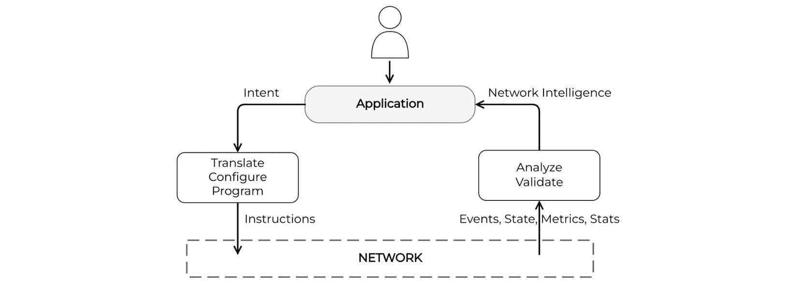
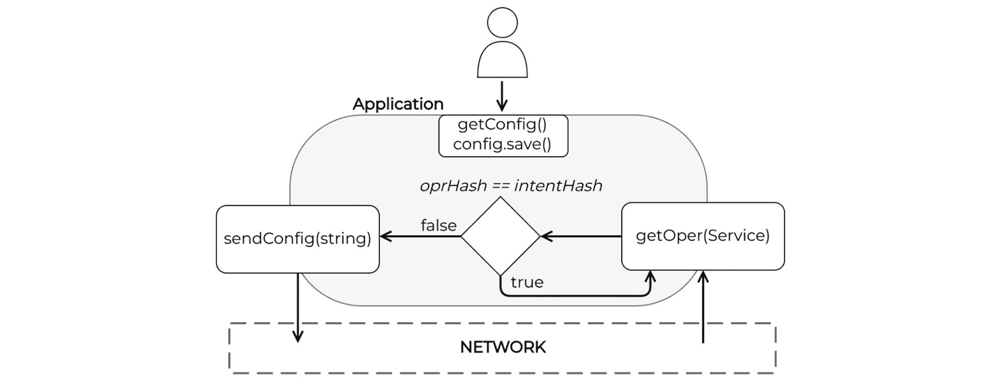

# 第五章：网络自动化

到目前为止，我们已经介绍了一些执行常见网络相关活动所需的 Go 基础知识。现在，是时候关注本书的主要主题——网络自动化了。在我们回顾解决方案、工具和代码库之前，让我们退一步，将网络自动化作为一个学科来审视。在本章中，我们旨在回答以下问题：

+   什么是网络自动化，为什么它通常被认为是一种与网络工程等不同的专门技能？

+   它对网络运营的影响以及对企业的好处是什么？

+   你可以单独解决哪些常见的自动化用例？

+   你如何将这些单独的用例组合成一个更大的网络自动化系统，以及为什么有人会想要那样做？

本章代码较少，文字较多，可能包含并非所有人都可能同意的论点。作为本书的作者，我们试图尽可能客观地表达我们的观点，但我们的观点最终是基于我们在职业生涯中经历的主观经验。尽管如此，我们已尽力避免最具争议的话题，例如自动化减少对人工操作员的需求，并在可能的情况下提供了支持我们论点的证据。

在本章中，我们将涵盖以下主题：

+   什么是网络自动化？

+   自动化网络操作任务

+   系统方法

# 技术要求

你可以在本书的 GitHub 仓库（在*进一步阅读*部分指定）的`ch05`文件夹中找到本章的代码示例。

# 什么是网络自动化？

作为一门相对较新的学科，看到范围和目标各不相同的广泛网络自动化定义并不罕见。网络自动化并不是关于特定用例或技术，而是关于在你的环境中能提供帮助并使你的业务受益的东西。

一些工程师可能会争论，路由协议已经自动化了网络，CLI 是基于意图的 API，将单个网络命令转换为动态网络状态。我们并不试图与这种观点争论，因为这些陈述中确实有一些真理，但它在行业中肯定不是最受欢迎的定义。

相反，让我们将网络自动化定义为一系列过程，用于自动化网络操作员执行的常见手动工作流程，例如提供服务、执行软件升级或遥测处理。这包括网络工程师通常必须通过点击操作的任务，以及运行一系列 CLI 命令。

更复杂的网络自动化解决方案可能涉及通过调整网络配置、应用流量工程策略或甚至强制某些设计约束来对操作事件做出反应。所有这些活动的共同特征是能够通过一系列具体的步骤来描述期望的行为，从而实现预期的结果。这可能排除了某些迭代活动，如网络故障排除或创造性活动，如网络设计，尽管它们在这些领域取得了相当大的进展，例如静态配置分析（Batfish：*进一步阅读*）和数学网络建模（Forward：*进一步阅读*），因此我们最终可以借鉴软件世界的概念，如**测试驱动开发**（**TDD**）来自动化网络设计配置模板的开发和测试（整个网络的**质量保证**（**QA**）和回归测试）。

## 为什么网络自动化存在

可能一个更有趣的问题是要回答为什么网络自动化作为一个学科存在，而像系统管理这样的领域，已经演变成站点可靠性工程，现在不仅包括基础设施的提供，还包括可观察性、自动化，甚至系统软件开发。

在过去几十年中，我们运行和操作网络的方式变化很小。尽管广泛接受 CLI 驱动的操作容易出错且不可扩展，但网络管理仍然主要关注执行 CLI 命令和与无结构数据工作。这通常导致缺乏标准化，使得网络工程师大部分工作日都在进行手动流程，使得网络难以扩展、支持和安全。

网络自动化作为对此的回应而出现，旨在提高效率并减少日常任务的冗余。目标是产生更可靠和可重复的过程，从而提高生产力。这也帮助使网络更加一致，操作更加简单，同时降低故障的可能性，从而最小化停机时间。

尽管如此，并非所有网络工程师都开始了网络自动化的旅程。我们认为这可能是以下原因之一：

+   缺乏标准和供应商无关的网络管理 API，这些 API 返回结构化数据。网络供应商通常提供专有的配置语法或 CLI，这些主要是为人类交互设计的。

+   自动化需要一套全新的技能，由于网络工程师通常没有计算机科学背景，编程仍然是一个很大的技能差距。

+   学习自动化需要时间，并不是每个雇主都愿意将员工的一部分时间投入到没有立即收益的事情上。

+   自动化速度也可能迅速传播失败，这可能在早期不会有助于建立对自动化的信任。创建可靠、安全并提供足够可见性的系统需要时间。

+   由于有大量具有重叠范围的网络自动化工具、库和框架，为特定任务选择正确的一个可能具有挑战性，并引入了过度投资于可能最终是错误选择的风险。

+   从“一直都是这样做的”转变为困难。有时，我们遵循阻力最小的路径，因此不愿意改变。

将网络自动化引入您的环境会带来不同的收益和风险，这取决于您的观点。因此，让我们尝试分析这对操作网络的工程师和运营业务的上级管理层意味着什么，对于他们来说，网络可能是一个成本中心或利润中心。

## 自下而上的视角

一些非常适合自动化的网络操作活动包括配置更改、运行审计或合规性检查、软件和设备生命周期管理等等。一些组织有剧本或要求变更管理表格，记录这些流程的每个操作步骤。许多公司已经在高级工程师准备变更而初级工程师随后执行时使用某种形式的自动化。

这些活动通常有一套非常明确的输入，例如设备清单、要执行的命令列表、一组定义明确的输出，可能还有填写好的电子表格或运行在设备上的新软件版本。这些属性使这些活动成为自动化的理想候选者。

自动化的一个常被引用的好处是其扩展能力——对单个设备进行更改的成本与对数千个设备进行更改的成本相对相同，或者对数百个设备进行数百次更改的成本相同。尽管规模和速度很重要，但它们可能不是流程自动化的最有价值的成果。

对于一些具有相对较小规模网络或较低变更率的网络团队，网络自动化可能带来其他好处，例如以下内容：

+   **一致性**：由于计算机执行这些更改，您可以期望它们每次都能产生相同的结果。此外，您可以在各个元素上强制执行相同的配置、模板或策略。

+   **可靠性**：指令是代码，计算机可以明确地解释。您还可以添加自动检查来验证输入或结果。

+   **可见性**：网络中所有未来和过去的变化都可以由团队的所有成员查看，以接受同行评审并简化故障排除。

+   **普遍性**：相同的工具被不同团队使用，这简化了交互并提高了知识共享。

在向您的同事介绍网络自动化时，重要的是强调这不仅仅是一个单一的产品或解决方案，而是一次旅程——一个没有固定目的地的新的方向向量。

请记住，并非所有手动流程都可以完全自动化，开发新实践和更新现有程序可能需要数年时间。这就是为什么让您的组织管理层参与进来也非常重要。

## 自上而下的视角

网络工程师可以理解上述技术要点，并可以自行判断网络自动化项目是否值得他们投入时间和精力部署。

相比之下，如果您不关注更大的图景（业务），相同的论点可能不足以说服管理层。这可能是网络自动化倡议可能失败的主要原因之一。如果业务收益不明确，管理层可能会决定不值得投入时间。但反过来也是真的——当网络自动化倡议在组织的管理结构中得到支持时，它更有可能成功。

这里有一份业务价值列表，您可以用作与管理层讨论的起点。根据公司情况，网络可以是成本中心或利润中心，因此请调整或重新排序以适应您的具体情况：

+   **成本管理**：通过资源优化产生成本节约。您通过减少人为错误、无需手动编制审计报告或无需加班更改来降低网络的运营成本。

+   **交付速度**：提高配置和验证网络更改的速度，使您能够更快地提供客户服务，甚至按需提供。

+   **风险管理**：在每次操作中始终如一地执行安全策略以降低风险。减少影响服务和因此影响您收入的事故数量。

+   **业务能力**：根据您的组织如何定义价值，网络自动化可以帮助发现机会。提高可见性可能有助于改善容量规划或发现未使用的容量或热点。由于自动化系统的接口、输入和输出定义良好，新的服务或业务能力可能是跨团队互动简化的结果。

尽管人们对网络自动化益处的认识有所提高，但有些人仍然犹豫不决，不愿将其作为内部组织实践接受，因此从他们那里获得支持可能需要额外努力。每种情况都是独特的，因此可能需要略微不同的论点集。最终，网络自动化正在成为网络工程的重要组成部分，其在行业中的相关性持续增加。

现在我们已经定义了什么是网络自动化以及为什么我们需要它，是时候深入挖掘并开始查看具体的应用案例和领域，您可以在传统的网络工程学科中应用它。

# 自动化网络操作任务

本节介绍了一些常见的网络操作任务和用例，在这些用例中，你可以引入自动化而不会对现有工具和流程造成太多摩擦。我们的目标是采取一系列通常由人工操作员执行的手动步骤，并探讨如何将它们转换为代码，以便计算机可以为您执行它们，同时保持原始输入和输出不变。我们将本节分为三个类别：

+   配置管理

+   网络状态分析

+   网络审计和报告

让我们开始吧。

## 配置管理

这是网络工程学科最受欢迎的领域，它超越了网络操作，通常包括设计和架构阶段。大多数人认为这是测试的最低目标，或者开始使用网络自动化的起点。让我们看看一些属于这个类别的常见用例。

### 配置生成

在我们可以对网络设备进行任何更改之前，我们需要为该目标设备制定所需的配置。传统上，我们会在文本编辑器中手动完成此操作，这涉及到大量的复制/粘贴和搜索/替换操作。

你可以使用以下 Go 包来自动化此过程，并根据一组输入生成网络设备配置：

+   `text/template`：标准库中的一个包，使用特殊的 Go 模板语言根据输入程序变量生成无结构的文本文档。我们将在*第六章*的*通过 SSH 与网络设备交互*部分，*配置管理*中使用此包。

+   `flosch/pongo2`：一个类似于 Django 语法的模板语言，适用于更熟悉 Jinja2（`gonja`分支）的用户。

+   `encoding`：此包包括 YAML 和 JSON 的编码器和解码器，用于解析和生成可以与结构化网络 API（例如，YANG 或 OpenAPI）一起使用的文档。我们将在*第六章*的*通过 HTTP 从其他系统获取配置输入*部分，*配置管理*中使用此包。

+   `regexp`：另一个标准库包，实现了高效的正则表达式模式匹配和字符串操作。我们将在本章末尾的示例中使用此包。

一旦你整理好配置细节，你就可以将此配置发送到目标设备，这引出了下一组用例。

### 配置更改、备份和恢复

与设备配置一起工作可能涉及备份和替换整个设备配置，或进行范围更改以提供新服务或更新现有配置片段。进行这些更改通常需要单独登录到每个设备并按顺序执行一系列厂商特定的命令。

以下 Go 包可以帮助处理不同网络供应商之间常见的传输抽象，以简化更改、备份或恢复您的网络配置的步骤：

+   `crypto/ssh`：一个实现基本 SSH 连接的标准库包。我们将在*第六章*的*通过 SSH 与网络设备交互*部分使用此包，*配置管理*。

+   `scrapli/scrapligo`：一个基于`crypto/SSH`构建的第三方包，提供了各种方便的辅助函数，用于处理主要网络供应商的不同 CLI 提示和命令。您还可以将此包用作 NETCONF 客户端。我们将在*第六章*的*自动化常规 SSH 任务*部分使用此包，*配置管理*。

+   `net/http`：一个标准库包，您可以使用它来与基于 HTTP 的 API（如 RESTCONF 或 OpenAPI）通信。我们将在*第六章*的*通过 HTTP 从其他系统获取配置输入*部分使用此包，*配置管理*。

前面的列表绝不是排他的，还有更多第三方包可供选择，包括一些专门设计用于与**RESTCONF**(*进一步阅读*)或**NETCONF**(*进一步阅读*)一起工作的包，但它们在活动水平或对外部贡献的开放程度方面各不相同。

总是环顾四周总会有帮助，尤其是在选择外部包时，以确保它符合您的需求并且拥有一个健康的贡献者社区。

### 配置差异和合规性检查

在您应用了所需的配置之后，您可能需要定期运行合规性检查，以确保某些不变量保持不变，或者检测任何配置漂移。这些用例依赖于字符串搜索、模式匹配和计算差异。您可以使用以下 Go 包来实现这一目的：

+   `strings`：一个来自标准库的包，可以使用`Compare`和`Contains`函数提供基本的字符串比较和模式匹配。我们将在本章末尾的示例中使用此包。

+   `sergi/go-diff`：一个第三方包，可以比较、匹配或修补纯文本（`google/diff-match-patch`包的 Go 端口）。

+   `homeport/dyff`：另一个第三方包和命令行工具，您可以使用它来比较结构化文档，例如 JSON 或 YAML。

虽然保持您的设备配置在控制之下至关重要，但您不能从它们中推导出网络中发生的所有事情。这就是为什么我们需要用我们从网络中收集的操作数据来补充我们的分析。

## 网络状态分析

由应用配置产生的操作状态通常难以预测。你可能需要花费大量时间微调监控并从网络收集信息。但由于这些用例风险较低，它们通常是网络自动化的良好起点，因此它们提供了使用 Go 的非常有吸引力的机会。

### 收集操作状态

根据`?rev=operational`的目标，表示返回的数据应来自操作数据存储。相比之下，对于以人为首的 NOS，这可能需要额外的步骤来解析从它获得的 CLI 输出。你可以在 Go 中以几种不同的方式做这件事：

+   `regexp`：使用正则表达式是将非结构化文本解析到变量中的最经得起考验和最知名的方法。请记住，编写健壮的正则表达式和调试它们可能是一个挑战。我们将在本章末尾的示例中使用这个软件包。

+   `sirikothe/gotextfsm`：这个软件包在`regexp`软件包之上提供了一个高级抽象，旨在解析半格式化文本，即具有视觉结构的文本，如表格，但表示为单个字符串。我们将在*第六章*的*检查路由信息*部分间接使用这个软件包，*配置管理*。

+   `scrapli/scrapligo`：这个软件包集成了`textfsm`软件包，并允许你使用`TextFsmParse(template string)`函数解析从网络设备获得的响应。我们将在*第六章*的*检查路由信息*部分使用这个软件包，*配置管理*。

你可以在维护窗口前后获取网络的操作状态并将其解析到内存数据结构中，例如，比较它们并审查在此期间完成的工作的成功情况。这就是我们将要讨论的下一个问题。

### 状态快照和验证

验证操作状态，确保我们收到的值是我们预期看到的，这是网络工程师在配置网络设备、运行故障排除会话、提供服务、执行软件升级以及执行其他日常活动作为其工作分配的一部分时所做的事情。

随着我们自动收集这些数据并且我们通常可以预先计算预期的状态，下一步是检查状态是否符合预期，并确保这种状态随时间持续。例如，BGP 邻居应该处于*已建立*状态，所有连接的接口都应该*开启*。当我们从网络收集新的数据时，我们将它记录在结构化格式中，以便与预期状态进行比较，并在发现差异时触发另一个操作。

比较任意数据通常需要编写一些自定义代码来遍历这些数据结构并查看重要的值。但有一些软件包可以简化这项任务：

+   `reflect.DeepEqual`：这个包是 Go 标准库的一部分，可以使用运行时反射来比较相同类型的值。

+   `mitchellh/hashstructure`：一个第三方包，可以从任意 Go 值计算出一个唯一的哈希值，你可以用它来快速回答操作状态是否与预期的状态匹配。我们将在本章末尾的示例中使用这个包。

+   `r3labs/diff`：另一个支持多个标准 Go 类型并依赖于运行时反射来生成两个 Go 结构体或值之间所有差异的详细日志的第三方包。

我们不能将所有操作状态都归类为*预期的*。一些值更动态，它们的改变并不总是可操作的。一个例子是 MAC 和 IP 地址表——它们的值会随时间波动，长期波动是正常的。

在日常维护期间，如软件升级时跟踪网络的动态状态可能会有所帮助，这时你可以对网络状态进行快照，并可以快速比较变更前后的值以发现任何不一致之处。从程序的角度来看，这就像通用的状态验证用例。你使用相同的一组工具和库，但将这些快照作为结构化文档保存在磁盘或数据库中，随着时间的推移。

## 网络审计和报告

网络审计的范围可能很大，从试图识别过时的硬件或生命终结的软件到衡量服务质量或控制平面更新的速率。通常，目标是收集和处理大量设备的状态信息，并生成一些人类可读的输出。

我们在上一节讨论了状态收集和验证任务，你可以使用 goroutines 将此过程扩展到针对数百或数千个网络设备，这在*第三章*，“Go 入门”，中有介绍。我们尚未讨论的缺失部分是报告生成。在这里，Go 也提供了几个你可以用来生成人类可读输出的资源：

+   `text/tabwriter`：如果你想要将信息发送到标准输出，这是一个你应该考虑的标准库包。你可以使用这个包来打印制表符数据。标准库之外还有其他功能丰富的选项，其中之一是`jedib0t/go-pretty/v6`包，你可以用它来着色文本或打印表格、列表和进度条。

+   `unidoc/unioffice`：如果你想要生成电子表格，这个包或`qax-os/excelize`是不错的选择。你也可以使用`unidoc/unioffice`来处理 Word、Excel 或 PowerPoint 文档。

+   `html/template`和`text/template`：这是两个最常见的模板库。例如，流行的静态站点生成器 Hugo 使用`html`和`text`模板包。

+   `go:embed`：这是一个 Go 指令，你可以用它来允许模板嵌入到编译后的 Go 二进制文件中，从而简化代码分发。

我们在本节中介绍的使用案例都是相对独立的。一旦你自动化它们，它们可以成为所谓的自动化孤岛，最初完全相互隔离，但一旦它们的数量增加，它们可能会合并成更复杂的多阶段工作流程，甚至完整的闭环系统。这就是我们将在下一节中探讨的内容。

# 系统方法

当你开始以增量方式自动化不同的任务时，你可能想象出一个路径，将这些建自动化任务的一部分串联起来，以编排一个工作流程。

你也可以从不同的角度看待这个问题。你最初将现有的手动流程分解成可以独立自动化的更小的工作块，这样你就不需要等到整个端到端流程自动化才开始利用自动化，同时你也要关注大局。

在这种情况下，你开始将不同的构建块相互连接，这些构建块最终成为交付业务成果的更大系统的一部分，而最初可能涉及多个团队的人类干预最终可能不再需要。这就是我们所说的系统方法。

一个常见的例子是当你混合配置网络服务和从网络收集操作数据的过程，这就是我们接下来要讨论的。

## 闭环自动化

每个网络工程师在配置网络设备上的任何内容后，首先要做的事情就是检查通过 CLI 命令配置的服务、协议或资源的状态。如果一个自动化系统执行此配置，网络工程师仍然需要登录到网络设备或一组网络设备来执行命令，或者可能去网页门户检查显示网络设备统计信息的日志或图表。这个耗时、重复且容易出错的过程对于人类来说非常适合自动化。

现在，你不仅将配置或指令推送到网络，还从网络中摄取实时操作数据，你可以对这些数据进行处理，以确定它是否与网络预期的状态相匹配。

如果我们抽象出网络设备的细节，闭环应用程序将消耗一个接口上的**网络智能**，并将意图推送到网络。我们可以大致定义如下：

+   **意图**：这将是你在网络（拓扑、库存、协议等）上下文中期望的操作状态或可测量的结果的声明性定义，而不需要你指定达到它的确切步骤（这些是实现细节）。

+   **网络智能**：这将是从网络中获取的，经过一定程度的处理后可操作的数据。请记住，事件、指标、统计数据或警报并不一定转化为可操作智能。网络操作员接收到如此多的警报，以至于很难知道什么是真实的，什么是噪音。因此，网络智能是通过关联这些数据、运行分析或任何其他有助于将其与所需意图联系起来的过程产生的。

下图是闭环应用程序的高级示意图：



图 5.1 – 闭环自动化 – 10,000 英尺视角

意图转化为配置语法或程序性指令，这些指令针对网络设备是特定的。我们可以根据从网络获得的反馈调整这些指令，使我们能够关闭循环并自动化网络服务的生命周期。

你可以将闭环系统想象成一个从网络中学习并适应它们的连续循环。这可以替代在任意时间和任意增量下进行的预和后快照检查。但今天我们在网络中看到的是某种更接近仅在它们提供服务的窗口时间内对网络反馈做出反应的系统的系统。这就是我们将在以下示例中复制的。

## 演示应用程序

对于演示应用程序，我们既可以构建一个分布式系统，其中所有不同的组件通过网络消息进行通信和协调，也可以在单个应用程序的一个节点上运行一切。因为目标是说明闭环自动化的概念，而不是展示分布式系统的工作方式，所以我们将保持应用程序简单，并将所有组件作为单体应用程序的功能运行，如下面的图所示：



图 5.2 – 闭环自动化示例应用

应用程序首先从用户那里读取输入数据。本例中，它从文件`input.yml`中读取目标设备信息，如下面的代码片段所示。我们在代码中硬编码服务的参数以配置一个变量（`intent`）。在这种情况下，我们想要配置的服务是`57777`，并启用`TLS`：

```go
# input.yml
router:
- hostname: sandbox-iosxr-1.cisco.com
  platform: cisco_iosxr
  strictkey: false
  username: admin
  password: C1sco12345
```

我们将服务信息封装在一个`Service`定义中，它比网络设备配置所表示的抽象层次更高，这转化为本例中的意图。我们还计算了这个值的哈希值，以便我们可以稍后将其与从网络收到的操作信息进行比较：

```go
func main() {
    /* ... <omitted for brevity > ... */
    intent := Service{
        Name:     "grpc",
        Port:     "57777",
        AF:       "ipv4",
        Insecure: false,
        CLI:      "show grpc status",
    }
    intentHash, err := hashstructure.Hash(intent,
        hashstructure.FormatV2, nil)
    /* ... <omitted for brevity > ... */
}
```

在应用程序配置服务之前，我们有机会执行一系列预防性维护任务，例如运行网络审计来报告服务是否已经存在，因此你可能不需要配置它。另一个好主意是备份网络设备的配置，以防我们需要回滚更改。

在这个例子中，我们必须使用`getConfig`方法对目标设备进行配置备份，然后使用`save`方法将其保存到一个文件夹中：

```go
func main() {
    /* ... <omitted for brevity > ... */
    config, err := iosxr.getConfig()
    // process error
    err = config.save()
    /* ... <omitted for brevity > ... */
}
```

在完成预工作后，应用程序进入一个持续执行的循环，在这个例子中，每 30 秒运行一次。在循环内部，应用程序使用`getOper`方法收集服务的操作状态。此方法向目标设备发送 CLI 命令，以收集我们需要的服务的操作细节：

```go
func (r Router) getOper(s Service) (o DeviceInfo, err error) {
    rs, err := r.Conn.SendCommand(s.CLI)
    // process error
    o = DeviceInfo{
        Device:    r.Hostname,
        Output:    rs.Result,
        Timestamp: time.Now(),
    }
    return o, nil
}
```

一旦我们收到响应，我们使用正则表达式解析信息，同时使用`regexp`包生成一个新的`Service`值，该值捕获服务是否启用了`TLS`，例如，以及`Service`的其他属性。然后，我们为这个`Service`类型实例计算一个新的哈希值，并将其与我们拥有的原始哈希值进行比较，以验证服务的操作状态是否与意图匹配：

```go
    if oprHash == intentHash {
        continue
    }
```

如果这些值匹配，我们可以继续到下一个迭代（`continue`）。否则，我们需要配置路由器，将服务带到所需的状态。然后，循环重新开始。我们通过使用`genConfig`方法和`text/template`包中的模板来获取目标设备上的服务配置，然后使用`sendConfig`函数将其发送到目标设备：

```go
func (r Router) sendConfig(conf string) error {
    c, err := cfg.NewCfgDriver(r.Conn, r.Platform)
    // process error
    err = c.Prepare()
    // process error
    _, err = c.LoadConfig(conf, false)
    // process error
    _, err = c.CommitConfig()
    // process error
    return nil
}
```

如果你想看到这个例子在实际中的运行，你可以从`ch05/closed-loop`文件夹中运行代码。当它运行时，在另一个终端窗口中打开一个 SSH 会话到目标 Cisco DevNet 设备，使用`sshpass -p "C1sco12345" ssh admin@sandbox-iosxr-1.cisco.com`，并执行以下命令来禁用`TLS`：

```go
conf
grpc no-tls 
commit
```

在程序的输出中，你会看到它最终捕捉到这个差异，因此它将继续通过重新配置 TLS 来修复它。这个例子的代码可以在`ch05/closed-loop/main.go`中找到（*进一步阅读*）：

```go
ch05/closed-loop$ go run main.go 
Entering to continuous loop ====>
 Loop at 15:31:22
  Operational state from device:
   service: grpc
   addr-family: ipv4
   port: 57777
   TLS: true
 Loop at 15:31:52
  Operational state from device:
   service: grpc
   addr-family: ipv4
   port: 57777
   TLS: false
Configuring device ====>
 Loop at 15:32:22
  Operational state from device:
   service: grpc
   addr-family: ipv4
   port: 57777
   TLS: true
...
```

在这种情况下，智能仅考虑布尔结果，而不对网络情况进行定性评估。你还可以探索如何获取对从网络中检索的数据的更深入评估，以便创建一个超越简单网络修复是或否的决策树。

同样，与意图一样，我们只覆盖意图和所需配置之间的直接预定关系。实际部署可能涉及更多移动部件和关于你需要哪些部件的决策。

# 摘要

在本章中，我们讨论了网络自动化是什么，它对网络运营的影响，以及它对企业的益处。我们讨论了不同的用例，从配置管理和网络状态分析到运行网络审计和报告，最后探讨如何将不同的部分组合起来，创建一个闭环系统，以帮助您强制执行网络所需意图。

在下一章中，我们将详细探讨配置管理，这是网络自动化中较为常见的用例之一，并导航 Go 为我们提供的自动化选项。

# 进一步阅读

关于本章所涉及主题的更多信息，请参阅以下资源：

+   本书 GitHub 仓库：[`github.com/PacktPublishing/Network-Automation-with-Go`](https://github.com/PacktPublishing/Network-Automation-with-Go )

+   Batfish: [`www.batfish.org/`](https://www.batfish.org/ )

+   前瞻：[`forwardnetworks.com/forward-enterprise/`](https://forwardnetworks.com/forward-enterprise/ )

+   RESTCONF: [`github.com/freeconf/restconf`](https://github.com/freeconf/restconf )

+   NETCONF: [`github.com/Juniper/go-netconf`](https://github.com/Juniper/go-netconf )

+   `ch05/closed-loop/main.go`: [`github.com/PacktPublishing/Network-Automation-with-Go/blob/main/ch05/closed-loop/main.go#L1`](https://github.com/PacktPublishing/Network-Automation-with-Go/blob/main/ch05/closed-loop/main.go#L1)
