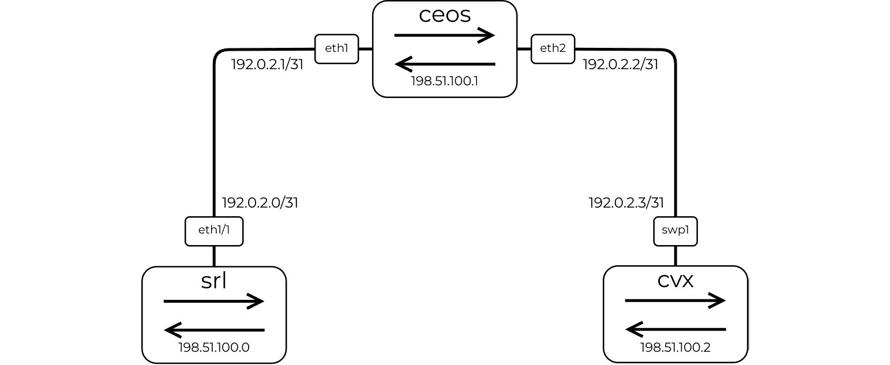
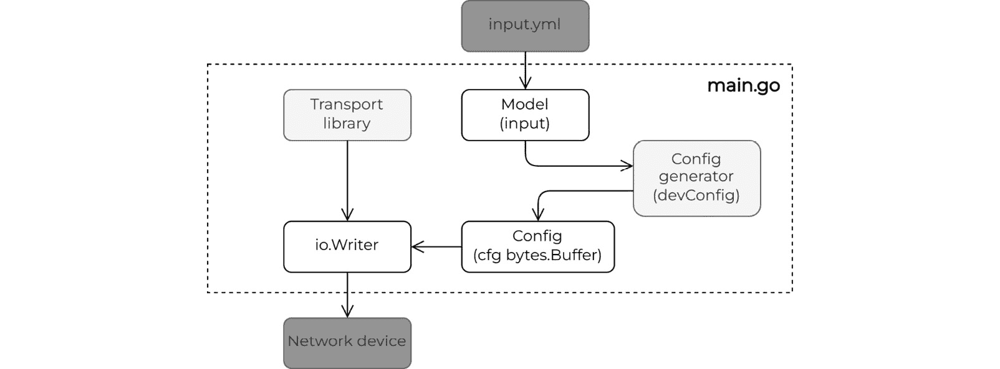
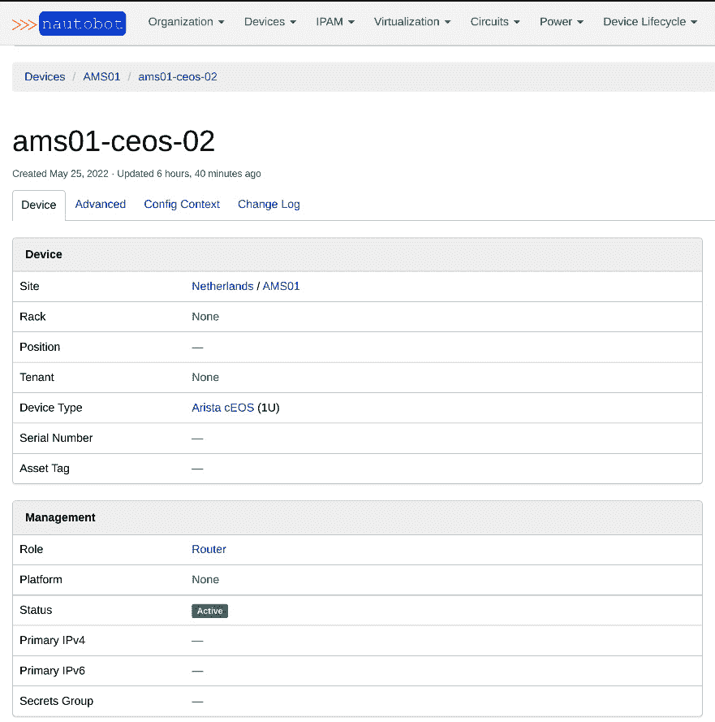

# 配置管理

配置管理是一个帮助我们强制在 IT 系统上实施所需配置状态的过程。在我们的上下文中，这是一种确保网络设备在推出新设置时按预期运行的方法。由于这成为我们反复执行的一项日常任务，因此网络配置管理是 NetDevOps 2020 调查（*进一步阅读*）中最常见的网络自动化用例也就不足为奇了。

在上一章中，我们讨论了常见的配置管理任务，以及一些有用的工具和库，这些工具和库可以帮助您编写程序以 Go 语言自动化这些任务。在本章中，我们将关注几个具体的例子，更深入地了解 Go 如何帮助我们使用标准协议连接和交互来自不同网络供应商的网络设备。本章我们将涵盖以下四个方面：

+   在介绍任何新示例之前，我们将定义一个由三个节点组成的多供应商虚拟网络实验室，以测试本章和本书后续章节中的代码示例。

+   接下来，我们将探讨如何使用 Go 和 SSH 与网络设备交互。

+   然后，我们将按照与 SSH 相同的程序结构重复练习，但使用 HTTP 来对比这些不同的选项。

+   最后，我们将提取并解析生成的操作状态，以验证我们的配置更改是否成功。

注意，我们在这里故意没有讨论基于 YANG 的 API，因为我们将在这本书的最后几章中详细介绍它们。

在本章中，我们将涵盖以下主题：

+   环境设置

+   通过 SSH 与网络设备交互

+   通过 HTTP 与网络设备交互

+   状态验证

# 技术要求

您可以在本书的 GitHub 仓库中找到本章的代码示例：[`github.com/PacktPublishing/Network-Automation-with-Go`](https://github.com/PacktPublishing/Network-Automation-with-Go)，在`ch06`文件夹下。

重要提示

我们建议您在虚拟实验室环境中执行本章的 Go 程序。请参阅*附录*以获取先决条件和构建它的说明。

# 环境设置

学习和实验网络自动化最简单、最安全的方法之一是构建一个实验室环境。多亏了过去十年我们所取得的进步，今天，我们可以访问来自不同网络供应商的虚拟化和容器化网络设备，以及大量可以帮助我们构建虚拟拓扑的工具。

在本书中，我们将使用这些工具之一：**Containerlab**。这个用 Go 编写的工具允许您从容器镜像中构建任意网络拓扑。您可以在几秒钟内创建和运行基于纯 YAML 文件的拓扑，这使得它成为快速测试的一个强有力的选择。请参阅*附录*以获取安装说明和主机操作系统的推荐。

## 创建拓扑

在本书的其余部分，我们将使用一个基础网络拓扑，该拓扑由三个运行不同**网络操作系统**（NOSes）的容器化网络设备组成：

+   `srl`：运行诺基亚的**服务路由器 Linux**（**SR Linux**）

+   `cvx`：运行 NVIDIA 的 Cumulus Linux

+   `ceos`：运行 Arista 的 EOS

以下图表展示了设备之间的连接。它们都使用默认（空白）配置启动：



图 6.1 – 测试拓扑

我们可以使用以下 YAML 文件描述此拓扑，这是**Containerlab**可以解释并将其转换为运行拓扑的表示：

```go
name: netgo
topology:
  nodes:
    srl:
      kind: srl
      image: ghcr.io/nokia/srlinux:21.6.4
    ceos:
      kind: ceos
      image: ceos:4.26.4M
    cvx:
      kind: cvx
      image: networkop/cx:5.0.0
      runtime: docker
  links:
    - endpoints: ["srl:e1-1", "ceos:eth1"]
    - endpoints: ["cvx:swp1", "ceos:eth2"]
```

您可以在本书的 GitHub 仓库中找到这个 YAML 文件，就像其他代码示例一样，具体位于`topo-base`目录中。如果您通过*附录*学习更多关于 Containerlab 的内容，或者您已经运行了它，您可以使用以下命令启动整个实验室：

```go
topo-base$ sudo containerlab deploy -t topo.yml --reconfigure
```

一旦实验室启动，您可以使用以下表中显示的凭证通过设备的主机名访问每个设备：

| 设备 | 用户名 | 密码 |
| --- | --- | --- |
| clab-netgo-srl | admin | admin |
| clab-netgo-ceos | admin | admin |
| clab-netgo-cvx | cumulus | cumulus |

表 6.1 – Containerlab 访问凭证

例如，要通过 SSH 访问 NVIDIA 的设备，您将执行`ssh cumulus@clab-netgo-cvx`：

```go
⇨  ssh cumulus@clab-netgo-cvx
cumulus@clab-netgo-cvx's password: cumulus
Linux cvx 5.14.10-300.fc35.x86_64 #1 SMP Thu Oct 7 20:48:44 UTC 2021 x86_64
Welcome to NVIDIA Cumulus (R) Linux (R)
cumulus@cvx:mgmt:~$ exit
```

如果您想了解更多关于 Containerlab 的信息，或者想在云中运行此实验室设置，请查看本书*附录*中的说明。

# 通过 SSH 与网络设备交互

**安全外壳协议**（**SSH**）是网络工程师用来通过**命令行界面**（**CLI**）安全访问和配置网络设备的主要协议，该界面传输非结构化数据以显示给最终用户。该界面模拟计算机终端，因此我们传统上用它来进行人类交互。

网络工程师在开始自动化日常任务之旅时采取的第一个步骤之一是创建脚本，这些脚本会按顺序运行一系列 CLI 命令以实现结果。否则，他们将通过 SSH 伪终端交互式地运行这些命令。

虽然这为我们提供了速度，但这并不是网络自动化的唯一好处。随着我们在本书的其余部分介绍不同的技术，其他好处，如可靠性、可重复性和一致性等，成为了一个常见主题。现在，我们将从在 Go 中创建一个到网络设备的 SSH 连接开始，逐行发送配置命令，然后利用 Go 中更高层次的包，该包抽象了不同网络供应商的连接细节，使网络工程师的开发体验更加简单。

## 描述网络设备配置

我们想用 Go 做的第一个任务是配置我们在上一节中定义的三个节点拓扑中的每个设备。作为一个学习练习，我们将创建三个不同的 Go 程序来独立配置每个设备，以便您可以对比不同的方法。虽然每个程序都是独特的，但它们都遵循相同的设计结构。一个程序使用 SSH 连接和配置设备，另一个使用 Scrapligo，最后一个使用 HTTP，我们将在下一节中介绍。

为了使代码示例有意义，同时又不至于过于复杂，我们已将设备配置限制应用于以下部分：

+   每个中继链路上都有一个唯一的 IPv4 地址

+   在这些 IP 之间建立了一个**边界网关协议**（**BGP**）对等连接

+   一个唯一的环回地址，也被重新分配到 BGP 中

这些设置的目的是在所有三个环回接口之间建立可达性。

在现实生活中的自动化系统中，开发人员努力寻找一个通用的数据模型，您可以使用它来表示任何供应商的设备配置。这个例子中的两个主要例子是 IETF 和 OpenConfig YANG 模型。我们将在这个案例中做同样的事情，通过定义我们将用于所有三个网络设备的标准输入数据模式，但直接使用 Go 来定义数据结构而不是 YANG 建模语言。此模式包含足够的信息以满足建立端到端可达性的目标：

```go
type Model struct {
    Uplinks  []Link `yaml:"uplinks"`
    Peers    []Peer `yaml:"peers"`
    ASN      int    `yaml:"asn"`
    Loopback Addr   `yaml:"loopback"`
}
type Link struct {
    Name   string `yaml:"name"`
    Prefix string `yaml:"prefix"`
}
type Peer struct {
    IP  string `yaml:"ip"`
    ASN int    `yaml:"asn"`
}
type Addr struct {
    IP string `yaml:"ip"`
}
```

在每个程序中，我们通过`input.yml`文件（该文件位于程序文件夹中）向数据模型提供参数，以生成设备的配置。对于第一个示例，此文件如下所示：

```go
# input.yml
asn: 65000
loopback: 
  ip: "198.51.100.0"
uplinks:
  - name: "ethernet-1/1"
    prefix: "192.0.2.0/31"
peers:
  - ip: "192.0.2.1"
    asn: 65001
```

在我们打开此文件进行读取后，我们使用`Decode`方法将此信息反序列化为一个`Model`类型的实例 – 这代表数据模型。以下输出表示这些步骤：

```go
func main() {
    src, err := os.Open("input.yml")
    // process error
    defer src.Close()
    d := yaml.NewDecoder(src)
    var input Model
    err = d.Decode(&input)
    // process error
}
```

然后，我们将输入变量（`Model`类型）传递给配置生成函数（`devConfig`），该函数将此信息转换为目标设备可以理解的语法。这种转换的结果是特定供应商的配置序列化为字节，您可以将其传输到远程设备。

传输库使用默认凭据与远程设备建立连接，您可以通过命令行标志来覆盖这些凭据。我们创建的会话有一个`io.Writer`元素，我们可以使用它将配置发送到远程设备：



图 6.2 – 程序结构

现在我们已经熟悉了程序的结构，让我们探索不同的实现来了解更多关于可用于与网络设备通信的 Go 包，从 SSH 和 Scrapligo 开始。

## 使用 Go 的 SSH 包访问网络设备

我们要配置的第一个设备是从拓扑中配置的容器化诺基亚`text/template`模板包。

Go 的 SSH 包 `golang.org/x/crypto/ssh` 属于一组仍然是 Go 项目的一部分但开发在主 Go 树之外、兼容性要求更宽松的包。尽管这并非唯一的 SSH Go 客户端，但其他包倾向于重用此包的部分，因此它们成为更高层次的抽象。

如一般程序设计所述，我们使用 `Model` 数据结构来保存设备配置输入，并将它们与 `srlTemplate` 模板合并，以生成有效的设备配置作为字节数据缓冲区：

```go
const srlTemplate = `
enter candidate
{{- range $uplink := .Uplinks }}
set / interface {{ $uplink.Name }} subinterface 0 ipv4 address {{ $uplink.Prefix }}
set / network-instance default interface {{ $uplink.Name }}.0
{{- end }}
...
`
```

`srlTemplate` 常量有一个模板，它首先通过（使用 `range` 关键字）遍历 `Model` 实例的上联。对于每个 `Link`，它取其 `Name` 和 `Prefix` 属性来创建我们可以放置在缓冲区中的几个 CLI 命令。在下面的代码中，我们正在运行 `Execute` 方法，通过 `in` 变量传递输入，并将交互式 CLI 命令的二进制表示放在 `b` 上，我们稍后预计将其发送到远程设备（`cfg`）：

```go
func devConfig(in Model)(b bytes.Buffer, err error){
    t, err := template.New("config").Parse(srlTemplate)
    // process error
    err = t.Execute(&b, in)
    // process error
    return b, nil
}
func main() {
    /* ... <omitted for brevity > ... */
    var input Model
    err = d.Decode(&input)
    // process error
    cfg, err := devConfig(input)
    /* ... <continues next > ... */
}
```

我们已经将认证凭据硬编码为正确的值以适应实验室，但如有必要，您可以覆盖它们。我们使用这些参数与 `srl` 网络设备建立初始连接：

```go
func main() {
    /* ... <continues from before > ... */
    settings := &ssh.ClientConfig{
        User: *username,
        Auth: []ssh.AuthMethod{
            ssh.Password(*password),
        },
        HostKeyCallback: ssh.InsecureIgnoreHostKey(),
    }
    conn, err := ssh.Dial(
        "tcp",
        fmt.Sprintf("%s:%d", *hostname, sshPort),
        settings,
    )
    // process error
    defer conn.Close()
    /* ... <continues next > ... */
}
```

如果认证凭据正确且没有连接问题，`ssh.Dial` 函数返回一个连接处理器（`conn`），代表一个单一的 SSH 连接。此连接作为可能各种通道的单个传输。其中一个通道是用于与远程设备进行交互式通信的伪终端会话，但它也可能包括额外的通道，您可以使用它们进行端口转发。

下面的代码片段启动一个新的终端会话并设置预期的终端参数，例如终端高度、宽度和 `ssh.Session` 类型提供的函数用于检索连接到远程终端的标准输入和标准输出管道：

```go
func main() {
    /* ... <continues from before > ... */
    session, err := conn.NewSession()
    // process error
    defer session.Close()
    modes := ssh.TerminalModes{
        ssh.ECHO:          1,
        ssh.TTY_OP_ISPEED: 115200,
        ssh.TTY_OP_OSPEED: 115200,
    }
    if err := session.RequestPty("xterm", 40, 80, modes); err != nil {
        log.Fatal("request for pseudo terminal failed: ", err)
    }
    stdin, err := session.StdinPipe()
    // process error
    stdout, err := session.StdoutPipe()
    // process error
    session.Shell()
    /* ... <continues next > ... */
}
```

与 Go 包的其他部分一致，标准输入和标准输出管道分别实现了 `io.Writer` 和 `io.Reader` 接口。这意味着您可以使用它们向远程网络设备写入数据并从其读取输出。我们将回到带有 CLI 配置的 `cfg` 缓冲区，并使用 `WriteTo` 方法将此配置发送到目标节点：

```go
func main() {
    /* ... <continues from before > ... */
    log.Print("connected. configuring...")
    cfg.WriteTo(stdin)
}
```

这是此程序的预期输出：

```go
ch06/ssh$ go run main.go 
go: downloading golang.org/x/crypto v0.0.0-20220112180741-5e0467b6c7ce
go: downloading gopkg.in/yaml.v2 v2.4.0
2022/02/07 21:11:44 connected. configuring...
2022/02/07 21:11:44 disconnected. dumping output...
enter candidate
set / interface ethernet-1/1 subinterface 0 ipv4 address 192.0.2.0/31
set / network-instance default interface ethernet-1/1.0
...
set / network-instance default protocols bgp ipv4-unicast admin-state enable
commit now
quit
Using configuration file(s): []
Welcome to the srlinux CLI.
Type 'help' (and press <ENTER>) if you need any help using this.
--{ running }--[  ]--                                                           
A:srl#                                                                          
--{ running }--[  ]--                                                           
A:srl# enter candidate                                                          
--{ candidate shared default }--[  ]--                                          
A:srl# set / interface ethernet-1/1 subinterface 0 ipv4 address 192.0.2.0/31    
--{ * candidate shared default }--[  ]-- 
.......                                
--{ * candidate shared default }--[  ]--                                        
A:srl# commit now                                                               
All changes have been committed. Leaving candidate mode.
--{ + running }--[  ]--                                                         
A:srl# quit
```

您可以在 `ch06/ssh` 文件夹中找到完整的示例（*进一步阅读*）。

## 自动化常规 SSH 任务

常见的网络元素，如路由器和交换机，通过 CLI 向人们显示数据而不是计算机。我们依赖于屏幕抓取让我们的程序消费这种可读数据。一个流行的屏幕抓取 Python 库，其名称来自 *scrape cli*，是 Scrapli。

Scrapli 有一个 Go 版本，我们将在下面的示例中探索，称为 Scrapligo。这个包的目标是在 SSH 之上提供下一层的抽象，同时隐藏一些传输复杂性，并提供几个方便的功能，并支持不同网络供应商的 CLI 风格。

为了展示 `scrapligo` 的实际应用，我们将在拓扑中配置另一个网络设备：Arista 的 cEOS (`ceos`)。就像我们使用 `srl` 一样，我们将使用一系列 CLI 命令来推送所需的网络状态，这样解析和从模板实例化字符串的初始步骤就相同了。变化的是模板，它使用了 Arista EOS 的语法：

```go
const ceosTemplate = `
...
!
router bgp {{ .ASN }}
  router-id {{ .Loopback.IP }}
{{- range $peer := .Peers }}  
  neighbor {{ $peer.IP }} remote-as {{ $peer.ASN }}
{{- end }}
  redistribute connected
!
`
```

差异开始于我们到达 SSH 连接设置时。我们创建一个设备驱动程序 (`GetNetworkDriver`) 来连接到远程设备，使用设备主机名和认证凭证。平台定义来自 `scrapligo` 的 `platform` 包。从那时起，只需对这个驱动程序进行一次方法调用即可打开到远程设备的 SSH 连接：

```go
func main() {
    /* ... <omitted for brevity > ... */
    conn, err := platform.NewPlatform(
        *nos,
        *hostname,
        options.WithAuthNoStrictKey(),
        options.WithAuthUsername(*username),
        options.WithAuthPassword(*password),
    )
    // process error  
    driver, err := conn.GetNetworkDriver()
    // process error  

    err = driver.Open()
    // process error  
    defer driver.Close()
    /* ... <continues next > ... */
}
```

`scrapli` 提供的一个额外功能是 `cscrapligocfg` 包，它定义了一个高级 API 来与远程网络设备的配置一起工作。这个 API 理解不同的 CLI 风格，它可以在发送到设备之前清理配置，并为我们生成配置差异。但最重要的是，这个包允许通过单个函数调用将整个设备配置作为字符串加载，处理诸如权限提升和配置合并或替换等问题。我们将使用 `LoadConfig` 方法来完成这项工作：

```go
func main() {
    /* ... <continues from before > ... */
    conf, err := cfg.NewCfg(driver, *nos)
    // process error

    // sanitize config by removing keywords like "!" and "end"
    err = conf.Prepare()
    // process error

    response, err = conf.LoadConfig(config.String(), false)
    // process error
}
```

这些都是在这种情况下配置设备所需的步骤。运行程序后使用 `go run`，你可以使用 `ssh` 连接到设备以检查配置是否已经存在：

```go
ch06/scrapli$ go run main.go 
2022/02/14 17:06:16 Generated config: 
!
configure
!
ip routing
!
interface Ethernet1
  no switchport
  ip address 192.0.2.1/31
!
...
```

通常，为了从设备获取响应，我们需要仔细读取响应缓冲区，直到我们看到命令行提示符，因为它通常以 `scrapligo` 可以为我们完成这项工作，通过读取接收到的缓冲区并将响应转换为字符串。

另一个流行的 Go SSH 包，提供执行大量命令的高级 API 是 `yahoo/vssh`。这里我们不会涉及它，但你可以在本书仓库的 `ch06/vssh` 目录中找到一个示例（*进一步阅读*），以配置拓扑中的网络设备。

# 通过 HTTP 与网络设备交互

在过去十年中，网络设备供应商开始包括 **应用程序编程接口** (**API**) 来管理他们的设备，作为 CLI 的补充。发现具有强大 RESTful API 的网络设备并不罕见，这些 API 可以提供对该设备的读写访问。

RESTful API 是一种无状态的客户端-服务器通信架构，它运行在 HTTP 之上。请求和响应通常传输结构化数据（JSON、XML 等），但它们也可以携带纯文本。这使得 RESTful API 更适合机器之间的交互。

## 使用 Go 的 HTTP 包访问网络设备

剩下要配置的设备是 NVIDIA 的 Cumulus Linux（`cvx`）。我们将使用其基于 OpenAPI 的 RESTful API 来配置它。我们将配置编码在一个 JSON 消息中，并通过 Go 的`net/http`包发送一个 HTTP 连接。

与 SSH 示例一样，我们通常使用`devConfig`函数加载输入数据并将其转换为目标设备期望的形状，但在这个案例中，它是一个 JSON 有效负载。正因为如此，我们不再需要模板来构建网络设备配置，因为我们现在可以使用 Go 中的数据结构来编码和解码来自 JSON 或其他任何编码格式的数据。

数据结构表示目标设备的配置数据模型。理想情况下，这个数据模型应该与我们之前定义的相匹配，这样我们就不需要定义其他任何内容。但在实际应用中，我们看到所有网络供应商都有自己的数据模型。好消息是，IETF 和 OpenConfig 都提供了供应商无关的模型；我们将在*第八章*“网络 API”中稍后探讨这些内容。现在，我们将使用以下数据结构为此设备的配置：

```go
type router struct {
    Bgp
}
type bgp struct {
    ASN      int
    RouterID string
    AF       map[string]addressFamily
    Enabled  string
    Neighbor map[string]neighbor
}
type neighbor struct {
    RemoteAS int
    Type     string
}
```

在主函数内部，我们解析程序标志并使用它们将 HTTP 连接设置存储在一个数据结构中，该数据结构包含构建 HTTP 请求所需的所有详细信息，包括 HTTP 客户端的非默认传输设置。我们这样做完全是出于方便，因为我们想将这些详细信息传递给不同的函数：

```go
type cvx struct {
    url   string
    token string
    httpC http.Client
}
func main() {
    /* ... <omitted for brevity > ... */
    device := cvx{
        url:   fmt.Sprintf("https://%s:%d", *hostname, defaultNVUEPort),
        token: base64.StdEncoding.EncodeToString([]byte(fmt.Sprintf("%s:%s", *username, *password))),
        httpC: http.Client{
            Transport: &http.Transport{
                TLSClientConfig: &tls.Config{InsecureSkipVerify: true},
            },
        },
    }
    /* ... <continues next > ... */
}
```

现在，我们可以发送配置并将其作为目标设备上的候选配置。我们可以通过引用我们与所需配置关联的修订 ID 来在设备上应用此配置。让我们看看执行此操作的步骤，这些步骤展示了在处理 HTTP 时需要考虑的不同属性。

首先，我们将创建一个新的修订 ID，并将其作为查询参数`(?rev=<revisionID>`)包含在 URL 中，以便连接到设备 API。现在，`addr`是包含`设备主机名`和`修订 ID`的目标设备 URL：

```go
func main() {
    /* ... <continues from before > ... */
    // create a new candidate configuration revision
    revisionID, err := createRevision(device)
    // process error
    addr, err := url.Parse(device.url + "/nvue_v1/")
    // process error
    params := url.Values{}
    params.Add("rev", revisionID)
    addr.RawQuery = params.Encode()
    /* ... <continues next > ... */
}
```

通过链接到修订 ID 的 URL，我们组装了配置更改的 PATCH 请求。这指向`addr`和`cfg`，即`devConfig`函数返回的 JSON 设备配置。我们还添加了一个带有编码的用户名和密码的 HTTP `Authorization`头，并指示有效负载是一个 JSON 消息：

```go
func main() {
    /* ... <continues from before > ... */
    req, err := http.NewRequest("PATCH", addr.String(), &cfg)
    // process error
    req.Header.Add("Content-Type", "application/json")
    req.Header.Add("Authorization", "Basic "+device.token)
    /* ... <continues next > ... */
}
```

一旦我们构建了 HTTP 请求，我们就可以将其传递给设备 HTTP 客户端的 `Do` 方法，该方法将所有内容序列化为二进制格式，设置 TCP 会话，并通过它发送 HTTP 请求。

最后，为了应用候选配置更改，我们必须在 `applyRevision` 函数内部进行另一个 PATCH 请求：

```go
func main() {
    /* ... <continues from before > ... */
    res, err := device.httpC.Do(req)
    // process error
    defer res.Body.Close()
    // Apply candidate revision
    if err := applyRevision(device, revisionID); err != nil {
        log.Fatal(err)
    }
}
```

您可以在本书 GitHub 存储库的 `ch06/http` 目录中找到这个例子的代码（*进一步阅读*）。运行此程序时您应该看到以下内容：

```go
ch06/http$ go run main.go 
2022/02/14 16:42:26 generated config {
 "interface": {
  "lo": {
   "ip": {
    "address": {
     "198.51.100.2/32": {}
...
 "router": {
  "bgp": {
   "autonomous-system": 65002,
   "router-id": "198.51.100.2"
  }
 },
 "vrf": {
  "default": {
   "router": {
    "bgp": {
...
     "enable": "on",
     "neighbor": {
      "192.0.2.2": {
       "remote-as": 65001,
       "type": "numbered"
      },
      "203.0.113.4": {
       "remote-as": 65005,
       "type": "numbered"
      }
...
}
2022/02/14 16:42:27 Created revisionID: changeset/cumulus/2022-02-14_16.42.26_K4FJ
{
  "state": "apply",
  "transition": {
    "issue": {},
    "progress": ""
  }
}
```

就像使用 SSH 一样，我们很少在我们的程序中直接使用 `net/http` 来与 REST API 交互，通常使用更高级别的包。

## 通过 HTTP 从其他系统获取配置输入

到目前为止，生成特定设备配置的数据一直来自程序文件夹中存在的静态文件。这些值是网络设备厂商无关的。

在现实世界的网络自动化系统中，这些值可以来自其他系统。例如，一个 **IP 地址管理**（**IPAM**）工具可以通过对特定设备的 REST API 调用动态分配 IP 地址，您可以使用这些地址来构建其配置。提供这些参数的系统集合成为一些人所说的 *真相来源*。Nautobot 是一个基础设施资源建模应用程序，属于这一类别。

这也突出了这样一个事实，为了自动化网络，我们不仅需要与网络设备交互，还需要与其他系统（如 Nautobot）集成。这就是为什么我们将这个例子专门用于探索如何使用 Go 与 Nautobot 的免费公共实例交互，该实例对任何人都可以在 [`demo.nautobot.com/`](https://demo.nautobot.com/) 上访问。

Nautobot 的 Go 客户端包是从其 OpenAPI 规范自动生成的，这意味着如果您已经与其他 OpenAPI 衍生的包合作过，其结构可能对您来说很熟悉，这是机器生成代码的一个优点。

在以下示例中，我们使用自动生成的 Nautobot Go 包来定义一个指向 [`demo.nautobot.com/`](https://demo.nautobot.com/) 的 Nautobot API 客户端，并使用 API 令牌：

```go
func main() {
    token, err := NewSecurityProviderNautobotToken("...")
    // process error

    c, err := nb.NewClientWithResponses(
        "https://demo.nautobot.com/api/",
        nb.WithRequestEditorFn(token.Intercept),
    )
    /* ... <continues next > ... */
}
```

`c` 客户端使我们能够与远程 Nautobot 实例进行交互。在这个例子中，我们想要将实验室拓扑中的一个节点（`ceos`）添加到 `device.json` 文件中：

```go
{
    "name": "ams01-ceos-02",
    "device_type": {
        "slug": "ceos"
    },
    "device_role": {
        "slug": "router"
    },
    "site": {
        "slug": "ams01"
    }
}
```

在我们能够将设备添加到 Nautobot 之前，我们必须确保在 `device.json` 文件中引用的设备类型、设备角色和站点名称已经在 Nautobot 中存在。`createResources` 函数负责这一点。然后，我们使用 `getDeviceIDs` 函数获取这些资源的 ID（设备类型、设备角色和站点），以便将新设备与其类型、角色和站点关联：

```go
func main() {
    /* ... <continues from before > ... */
    err = createResources(c)
    // process error

    dev, err := os.Open("device.json")
    // process error
    defer dev.Close()

    d := json.NewDecoder(dev)

    var device nb.Device
    err = d.Decode(&device)
    // process error

    found, devWithIDs, err := getDeviceIDs(c, device)
    /* ... <continues next > ... */
}
```

如果设备尚未在 Nautobot 中，我们可以使用自动生成的 `DcimDevicesCreateWithResponse` 函数创建它：

```go
func main() {
    /* ... <continues from before > ... */
    created, err := c.DcimDevicesCreateWithResponse(
        context.TODO(),
        nb.DcimDevicesCreateJSONRequestBody(*devWithIDs))
    check(err)
}
```

在从`ch06/nautobot`文件夹中运行`go run nautobot`程序后，你应该在 Nautobot 图形界面中看到以下内容：[`demo.nautobot.com/`](https://demo.nautobot.com/)



图 6.3 – Nautobot 截图

我们传递给这些 Dcim 函数的数据最终会出现在 HTTP 请求中，就像我们在本章前面手动构建的那些一样。在这里，我们不需要直接处理 URL 查询、HTTP 路径或 JSON 有效负载，因为这个包为我们抽象了所有这些。这允许开发者更多地关注业务价值，而不是实现细节。这使得 API 更容易使用。

到目前为止，本章的重点更多地在于将配置推送到网络设备，而不是在操作之后读取网络的状态。虽然配置管理的重点是产生和部署正确格式的配置，但状态验证可以在验证配置更改是否成功中发挥关键作用。在下一节中，我们将学习如何从远程设备检索和解析操作数据。

# 状态验证

网络设备内部建模和存储其状态的方式通常与其配置数据模型不同。传统的以 CLI 为主的网络设备以表格格式向最终用户显示状态，这使得网络操作员更容易解释和推理。在具有 API 的网络操作系统上，它们可以以结构化格式呈现状态，使数据更适合自动化，但我们仍然需要准备正确的数据模型以进行反序列化。

在本节中，我们将通过一个代码示例来查看三种不同的方法，您可以使用这些方法从网络设备读取状态，该示例从本章前面几节中用`crypto/ssh`、`net/http`和`scrapligo`配置的设备中收集操作数据。对于每个网络设备，我们将使用这些资源之一来获取我们所需格式的数据：

+   **RESTful API 调用**：用于从 HTTP 接口检索和解析数据

+   **正则表达式**：用于解析通过 SSH 接收的纯文本

+   **TextFSM 模板**：用于简化解析表格数据

## 检查路由信息

到目前为止，你应该有一个三个节点的拓扑运行。每个网络设备都有一个回环地址，我们将它重新分配到 BGP 中。例如，Arista cEOS 的回环地址是`198.51.100.1/32`。下一个程序的目标是验证设置。我们从每个设备检索路由表信息，以检查是否所有三个 IPv4 回环地址都存在。这样，我们可以验证我们的配置意图——在所有设备之间建立端到端可达性。

程序有两个构建块：

+   `GetRoutes`：一个连接到网络设备、获取所需信息并将其放入通用格式的方法

+   `checkRoutes`：一个函数，它从`GetRoutes`读取路由，并将其与我们期望看到的环回地址列表（`expectedRoutes`）进行比较

一个需要注意的问题是，网络设备支持的 API 类型可能因传输协议和数据文本表示的格式而异。在我们的例子中，这转化为不同网络供应商的`GetRoutes`实现细节的不同。在这里，为了教育目的，我们将每个供应商的实现做得完全不同，以独立展示 REST API、正则表达式和 TextFSM：


图 6.4 – 检查路由信息

每个网络设备都有自己的数据结构。例如，我们为 SR Linux 创建了 SRL。`SRL`、`CVX`和`CEOS`类型实现了`Router`接口，因为每个都有一个包含特定供应商实现细节的`GetRoutes`方法。

在主程序中，用户只需要用认证详情初始化设备，因此它创建了一个为我们创建的那种类型的变量。然后，它可以通过为每个设备启动一个运行设备类型`GetRoutes`方法的 goroutine 来并发运行路由收集任务。`Router`接口成功地隐藏了特定供应商的实现细节，因为调用始终是相同的`router.GetRoutes`：

```go
type Router interface {
    GetRoutes(wg *sync.WaitGroup)
}

func main() {
     cvx := CVX{
     Hostname: "clab-netgo-cvx",
      Authentication: Authentication{
      Username: "cumulus",
     Password: "cumulus",
     },
    }
    srl := SRL{
     Hostname: "clab-netgo-srl",
     Authentication: Authentication{
      Username: "admin",
      Password: "admin",
     },
    }
    ceos := CEOS{
     Hostname: "clab-netgo-ceos",
     Authentication: Authentication{
      Username: "admin",
      Password: "admin",
     },
    }

    log.Printf("Checking reachability...")

    devices := []Router{cvx, srl, ceos}

    var wg sync.WaitGroup
    for _, router := range devices {
        wg.Add(1)
        go router.GetRoutes(&wg)
    }
    wg.Wait()
}
```

由于所有`GetRoutes`实例都在各自的 goroutine 中后台运行，我们添加了一个`wg`等待组，以确保在收集和验证所有设备之前，我们不结束主 goroutine。在每个`GetRoutes`方法结束之前，我们调用`expectedRoutes`函数来处理从该设备获取的路由。

我们通过检查每个包含唯一一组环回地址的`expectedRoutes`是否存在于每个设备的路由表中来验证解析后的状态（路由）。对于收到的每个 IPv4 前缀，我们检查它是否存在于`expectedRoutes`中，并更改一个布尔标志来表示这一点。如果到最后，`expectedRoutes`中存在布尔值为`false`的前缀，这意味着它们没有出现在设备的路由表中，我们将创建一个日志消息：

```go
func checkRoutes(device string, in []string, wg *sync.WaitGroup) {
    defer wg.Done()
    log.Printf("Checking %s routes", device)
    expectedRoutes := map[string]bool{
        "198.51.100.0/32": false,
        "198.51.100.1/32": false,
        "198.51.100.2/32": false,
    }
    for _, route := range in {
        if _, ok := expectedRoutes[route]; ok {
            log.Print("Route ", route,
                        " found on ", device)
            expectedRoutes[route] = true
        }
    }
    for route, found := range expectedRoutes {
        if !found {
            log.Print("! Route ", route, 
                        " NOT found on ", device)
        }
    }
}
```

在此之后，我们检查每个`GetRoutes`方法实现。与其它示例一样，你可以在本书 GitHub 仓库的`ch06/state`文件夹中找到完整的程序（*进一步阅读*）。

### 使用正则表达式解析命令输出

我们使用正则表达式解析和从非结构化数据中提取信息。Go 标准库包括`regexp`包，它理解 RE2 语法。这是一个以安全性作为其主要目标的正则表达式库。该决策的一个主要后果是缺乏回溯和前瞻操作，这些操作是不安全的，可能导致拒绝服务攻击。

在这种情况下，`GetRoutes`方法使用`scrapligo`连接并发送一个`show`命令，从本例中的 SRL 设备类型中提取路由表信息。解析这些信息的一种方法是一行一行地迭代输出，同时使用正则表达式匹配预期的模式，这接近我们在`ch05/closed-loop`示例中做的事情（*进一步阅读*）：

```go
func (r SRL) GetRoutes(wg *sync.WaitGroup) {
    lookupCmd := "show network-instance default route-table ipv4-unicast summary"

    conn, err := platform.NewPlatform(
        "nokia_srl",
        r.Hostname,
        options.WithAuthNoStrictKey(),
        options.WithAuthUsername(r.Username),
        options.WithAuthPassword(r.Password),
        options.WithTermWidth(176),
    )
    // process error

    driver, err := conn.GetNetworkDriver()
    // process error
    err = driver.Open()
    // process error 
    defer driver.Close()

    resp, err := driver.SendCommand(lookupCmd)
    // process error

    ipv4Prefix := regexp.
            MustCompile(`(\d{1,3}\.){3}\d{1,3}\/\d{1,2}`)

    out := []string{}
    for _, match := range ipv4Prefix.FindAll(
    resp.RawResult, -1) {
        out = append(out, string(match))
    }
    go checkRoutes(r.Hostname, out, wg)
}
```

为了使事情更简单一些，我们假设整个输出中与 IPv4 地址模式匹配的任何内容都是在路由表中安装的前缀。这样，我们就不需要读取和解析表格数据结构，而是告诉我们的程序找到所有匹配 IPv4 路由模式的文本出现，并将它们放在我们传递给`checkRoutes`函数以进行进一步处理的字符串切片（`out`）中。

### 使用模板解析半格式化的命令输出

使用正则表达式解析各种输出格式可能会很繁琐且容易出错。这就是为什么谷歌创建了`TextFSM`，最初作为一个 Python 库，以实现基于模板的半格式化文本解析。他们专门设计它来解析来自网络设备的信息，并且它有一个广泛的社区开发模板，维护在**ntc-templates**（*进一步阅读*）中。

我们将使用这些社区模板之一来解析`GetRoutes`实现中 Arista cEOS 的`ip`路由命令的输出。Scrapligo 嵌入了一个 TextFSM 的 Go 端口，并可以使用`TextFsmParse`函数方便地解析响应：

```go
func (r CEOS) GetRoutes(wg *sync.WaitGroup) {
    template := "https://raw.githubusercontent.com/networktocode/ntc-templates/master/ntc_templates/templates/arista_eos_show_ip_route.textfsm"
    lookupCmd := "sh ip route"
    conn, err := core.NewEOSDriver(
        r.Hostname,
        base.WithAuthStrictKey(false),
        base.WithAuthUsername(r.Username),
        base.WithAuthPassword(r.Password),
    )
    // process error
    err = conn.Open()
    // process error
    defer conn.Close()
    resp, err := conn.SendCommand(lookupCmd)
    // process error
    parsed, err := resp.TextFsmParse(template)
    // process error
    out := []string{}
    for _, match := range parsed {
        out = append(out, fmt.Sprintf(
                "%s/%s", match["NETWORK"], match["MASK"]))
    }
    go checkRoutes(r.Hostname, out, wg)
}
```

存储解析数据的`parsed`变量是一个包含`map[string]interface{}`值的切片，其中键对应于模板中定义的 TextFSM 值。因此，仅通过查看`show ip route`模板，我们就可以提取网络和掩码（前缀长度）信息，并将其追加到我们传递给`checkRoutes`函数以进行进一步处理的字符串切片（`out`）中。

### 使用 REST API 请求获取 JSON 格式化的数据

到目前为止，在本章中，我们看到了两种与 REST API 交互的不同方式——一种使用`net/http`包，另一种使用自动生成的面向高级的包（`nautobot`）。但您还有其他选择，例如`go-resty`，它建立在`net/http`之上，以提供与 REST API 端点交互时改进的用户体验。

在以下`GetRoutes`的实现中，我们利用`go-resty`构建所需的 HTTP 头以进行身份验证，通过查询参数扩展 URL，并将响应反序列化到用户定义的数据结构（`routes`）中：

```go
Code Block 1:
func (r CVX) GetRoutes(wg *sync.WaitGroup) {
	client := resty.NewWithClient(&http.Client{
		Transport: &http.Transport{
			TLSClientConfig: &tls.Config{InsecureSkipVerify: true},
		},
	})
	client.SetBaseURL("https://" + r.Hostname + ":8765" )
	client.SetBasicAuth(r.Username, r.Password)
	var routes map[string]interface{}
	_, err := client.R().
		SetResult(&routes).
		SetQueryParams(map[string]string{
			"rev": "operational",
		}).
		Get("/nvue_v1/vrf/default/router/rib/ipv4/route")
	// process error
	out := []string{}
	for route := range routes {
		out = append(out, route)
	}
	go checkRoutes(r.Hostname, out, wg)
}
```

我们已创建了一个 REST API 客户端，用于从目标设备（类型 CVX）请求路由表信息（`...rib/ipv4/route`）。我们使用路由表前缀作为键将 JSON 有效负载响应解码到`map[string]interface{}`类型的`routes`变量中。接下来，我们遍历`routes`，将所有键追加到一个字符串切片（`out`）中，我们可以将其传递给`checkRoutes`函数。

## 验证端到端可达性

您可以从`ch06/state`文件夹运行此程序来检查拓扑中的所有三个路由器是否可以从彼此访问（*进一步阅读*）。确保所有设备都具有从本章早期使用`crypto/ssh`、`net/http`和`scrapligo`配置它们的示例配置。预期的输出应如下所示：

```go
ch06/state$ go run main.go 
2022/03/10 17:06:30 Checking reachability...
2022/03/10 17:06:30 Collecting CEOS routes
2022/03/10 17:06:30 Collecting CVX routes
2022/03/10 17:06:30 Collecting SRL routes
2022/03/10 17:06:30 Checking clab-netgo-cvx routes
2022/03/10 17:06:30 Route 198.51.100.0/32 found on clab-netgo-cvx
2022/03/10 17:06:30 Route 198.51.100.1/32 found on clab-netgo-cvx
2022/03/10 17:06:30 Route 198.51.100.2/32 found on clab-netgo-cvx
2022/03/10 17:06:31 Checking clab-netgo-ceos routes
2022/03/10 17:06:31 Route 198.51.100.0/32 found on clab-netgo-ceos
2022/03/10 17:06:31 Route 198.51.100.1/32 found on clab-netgo-ceos
2022/03/10 17:06:31 Route 198.51.100.2/32 found on clab-netgo-ceos
2022/03/10 17:06:34 Checking clab-netgo-srl routes
2022/03/10 17:06:34 Route 198.51.100.0/32 found on clab-netgo-srl
2022/03/10 17:06:34 Route 198.51.100.1/32 found on clab-netgo-srl
2022/03/10 17:06:34 Route 198.51.100.2/32 found on clab-netgo-srl
```

如果任何路由在任何设备上不存在，我们会看到如下消息：

```go
2022/03/10 15:59:55 ! Route 198.51.100.0/32 NOT found on clab-netgo-cvx
2022/03/10 15:59:55 ! Route 198.51.100.1/32 NOT found on clab-netgo-cvx
```

# 摘要

配置生成、部署、报告和合规性仍然是网络自动化操作中最受欢迎的操作。这就是引入自动化带来的即时效益最大、最明显的地方，使其成为进入自动化和 DevOps 世界的第一步逻辑步骤。配置管理是网络工程师花费大部分时间进行的那些重复性任务之一，因此它非常适合自动化。但是，将新的配置发送到设备只是更广泛流程的一部分，该流程应考虑故障处理，从配置中的语法错误到如何正确恢复与远程设备的连接中断。在这种情况下，您可以使用可重用代码抽象一些重复性任务，这些代码提供通用功能，以减少自动化用例的时间和努力。这正是自动化框架所提供的，我们将在下一章中讨论。

# 进一步阅读

要了解更多关于本章所涉及的主题，请查看以下资源：

+   NetDevOps 2020 调查：[`dgarros.github.io/netdevops-survey/reports/2020`](https://dgarros.github.io/netdevops-survey/reports/2020)

+   `topo` 目录：[`github.com/PacktPublishing/Network-Automation-with-Go/blob/main/topo-base/topo.yml`](https://github.com/PacktPublishing/Network-Automation-with-Go/blob/main/topo-base/topo.yml)

+   `ch06/ssh` 文件夹：[`github.com/PacktPublishing/Network-Automation-with-Go/tree/main/ch06/ssh`](https://github.com/PacktPublishing/Network-Automation-with-Go/tree/main/ch06/ssh)

+   `ch06/vssh` 目录：[`github.com/PacktPublishing/Network-Automation-with-Go/tree/main/ch06/vssh`](https://github.com/PacktPublishing/Network-Automation-with-Go/tree/main/ch06/vssh)

+   `ch06/http` 目录：[`github.com/PacktPublishing/Network-Automation-with-Go/tree/main/ch06/http`](https://github.com/PacktPublishing/Network-Automation-with-Go/tree/main/ch06/http)

+   demo.nautobot.com：[`demo.nautobot.com/`](https://demo.nautobot.com/)

+   `ch06/state` 目录: https://github.com/PacktPublishing/Network-Automation-with-Go/tree/main/ch06/ssh

+   `ch05/closed-loop` 示例: https://github.com/PacktPublishing/Network-Automation-with-Go/blob/main/ch05/closed-loop/main.go#L138

+   ntc-templates: [`github.com/networktocode/ntc-templates`](https://github.com/networktocode/ntc-templates)
