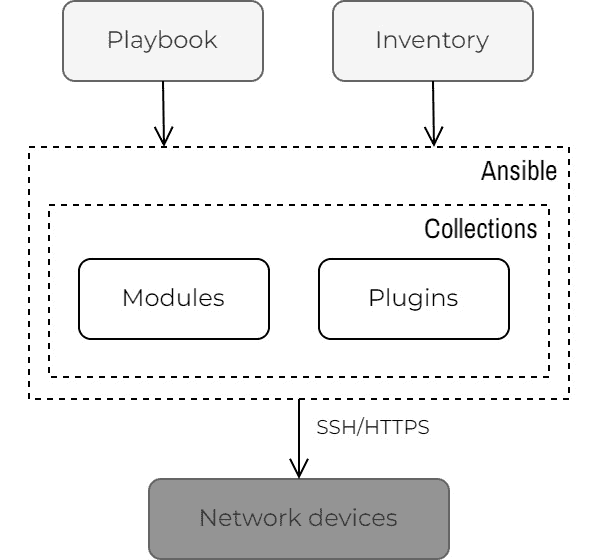
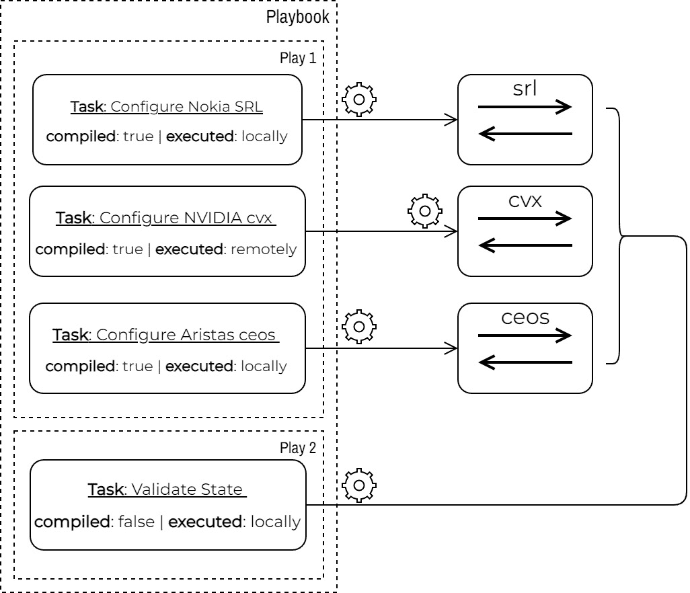
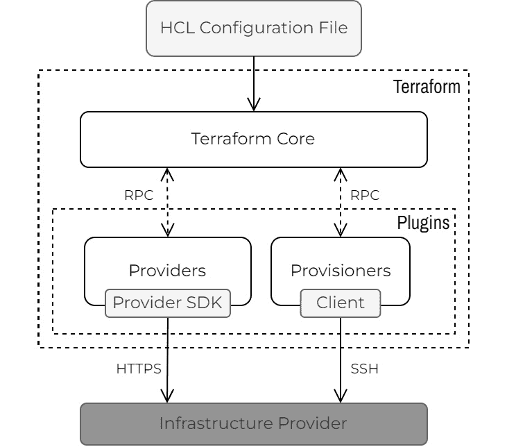

# 自动化框架

大多数工程师通过编写小型临时脚本开始他们的自动化之旅。随着时间的推移，随着这些脚本的大小和数量增加，我们需要考虑我们创建的解决方案的运营模式以及我们建立的基础有多牢固。最终，我们必须协调不同团队之间的自动化实践，以实现规模化的业务成果。

为了减少自动化用例所花费的时间和精力，一些组织试图标准化他们的工具并在解决方案中重用通用组件，这通常会导致他们转向自动化框架。

自动化框架允许不同的团队在同一伞下合作，打破可能导致低效的隔阂，采用共同实践和代码重用性，并在各个领域强制执行政策，以使开发出的解决方案更加安全。

在选择最适合您环境和用例的框架时，请确保评估不同的自动化框架。在本章中，我们将回顾其中一些，并特别关注它们如何与 Go 集成。特别是，我们将查看以下内容：

+   Go 程序如何成为 Ansible 模块

+   自定义 Terraform 提供器的开发

+   其他知名基于 Go 的框架概述

我们通过审视行业中的当前趋势以及新一代自动化框架未来的可能发展来结束本章。

# 技术要求

您可以在本书的 GitHub 仓库（见“进一步阅读”部分）的 `ch07` 文件夹中找到本章的代码示例。

重要提示

我们建议您在虚拟实验室环境中执行本章中的 Go 程序。有关先决条件和构建它的说明，请参阅附录。

# Ansible

Ansible 是一个开源项目、框架和自动化平台。其描述性自动化语言吸引了众多网络工程师的注意，他们认为它是进入网络自动化世界的入门途径，并且可以帮助他们相对快速地变得高效。

Ansible 采用无代理的推送式架构。它通过 SSH 连接到它管理的宿主机，并运行一系列任务。这些任务是我们称之为 Ansible 模块的小型程序，它们是 Ansible 从用户抽象出来的代码单元。用户只需提供输入参数，就可以依赖 Ansible 模块为他们完成所有繁重的工作。尽管抽象级别可能有所不同，但 Ansible 模块允许用户更多地关注其基础设施的期望状态，而不是实现该状态所需的单个命令。

## Ansible 组件概述

Playbooks 是 Ansible 的核心。这些基于文本的声明性 YAML 文件定义了一组自动化任务，您可以将这些任务分组在不同的 Play 中。每个任务运行一个模块，该模块来自 Ansible 代码库或第三方内容集合：



图 7.1 – Ansible 高级图

我们使用 Ansible 清单来描述我们想要使用 Ansible 管理的主机或网络设备。*图 7*.1 提供了这些元素的高级概述。

### 清单

清单是一份您可以定义在文本文件中的静态托管主机列表，或者从外部系统动态提取。您可以使用组单独或集体管理主机。以下代码片段显示了 Ansible 清单文件：

```go
[eos]
clab-netgo-ceos
[eos:vars]
ansible_user=admin
ansible_password=admin
ansible_connection=ansible.netcommon.network_cli
```

您还可以使用清单来定义组和主机级别的变量，这些变量将可用于 Ansible 演练。

### 演练、演练和任务

Ansible 演练是您使用基于 YAML 的 **领域特定语言（DSL**）编写的文件。一个演练可以有一个或多个演练。每个 Ansible 演练针对清单中的一个或多个主机执行一系列任务。以下代码输出显示了一个包含单个演练和两个任务的演练示例：

```go
- name: First Play - Configure Routers
  hosts: routers
  gather_facts: true
  tasks:
    - name: Run Nokia Go module on local system with Go
      go_srl:
        host: "{{ inventory_hostname }}"
        user: "{{ ansible_user }}"
        password: "{{ ansible_password }}"
        input: "{{ hostvars[inventory_hostname] | string | b64encode }}"
      delegate_to: localhost
      when: ('srl' in group_names)
    - name: Run NVIDIA compiled Go module on remote system without Go
      go_cvx:
        host: localhost
        user: "{{ ansible_user }}"
        password: "{{ ansible_password }}"
        input: "{{ hostvars[inventory_hostname] | string | b64encode }}"
      when: ('cvx' in group_names)
```

最后一个示例是从本书 GitHub 存储库中 `ch07/ansible` 文件夹包含的更大演练（见 *进一步阅读*）的一个片段。该演练在两个不同的演练中分散了四个任务。我们使用该演练在本节中回顾不同的概念。

### 模块

每个任务执行一个 Ansible 模块。尽管实现可能不同，但 Ansible 模块的目标是幂等的，所以无论您多少次对同一组主机运行它，您总是得到相同的结果。

Ansible 随带提供了一些主要用 Python 编写的模块，但它不会阻止您使用其他编程语言，这正是我们在本节中要探讨的。

## 与 Ansible 模块一起工作

Ansible 模块的代码可以在远程节点上执行，例如 Linux 服务器，或者在本地上执行，在运行演练的节点上。后者是我们通常在托管节点是 API 服务或网络设备时所做的，因为它们两者都缺乏具有依赖项（如 Linux shell 和 Python）的执行环境。幸运的是，现代网络操作系统满足这些要求，这为我们提供了在本地或远程运行代码的两种选择。

如果您查看前面的演练片段，您可以看到我们如何实现这两个选项。第一个任务调用 `go_srl` 模块，该模块被委派到本地主机。这意味着它从运行 Ansible 的机器上运行，并针对在主机参数中提供的远程主机。第二个任务执行 `go_cvx` 模块，该模块没有被委派，因此它在远程节点上运行，将其 API 调用针对本地主机。

演练的其余部分使用本地和远程执行环境的组合，如下图中齿轮符号所示：



图 7.2 – 演练示例

Ansible 剧本首先运行一个 Ansible 剧本来配置拓扑中的每个节点，并具有以下高级目标：

+   使用我们在运行 Ansible 的机器上本地执行的编译后的 Go 代码配置 SR Linux 节点（`srl`）

+   使用我们在远程节点上执行的编译后的 Go 代码配置 NVIDIA Cumulus 节点（`cvx`）

+   使用在运行 Ansible 的机器上本地执行的编译后的 Go 代码配置 Arista EOS 节点（`ceos`）

在前面的剧本中，选择本地或远程执行环境是随机的，只是为了展示两种不同的方法。由于我们所有的实验室设备都是基于 Linux 的，我们可以改变这种行为，而无需重写我们使用的 Ansible 模块。

第二个剧本有一个单一的任务，使用我们通过`go run`命令执行的未编译代码来验证所有三个设备上的配置状态。我们使用这个最后任务来展示一种使用 Go 原生原语而不是 Ansible 分叉来同时执行多个节点任务的并发替代方法。我们将在本节后面讨论这个问题。

## 开发 Ansible 模块

虽然 Ansible 开发者大多数使用 Python 编写 Ansible 模块，但编写模块为另一种编程语言有不同的原因：

+   你的公司可能已经使用另一种编程语言。

+   可能你知道或更习惯用另一种语言写作。

+   代码已经可用，并且没有商业理由将其重写为另一种编程语言。

+   你想利用 Python 中不可用的功能。

Ansible 的角色不是要替换你拥有的所有东西，尤其是如果它已经为你工作的话。为了说明这一点，我们将从其他章节中取出一组 Go 程序，并将它们转换为可以在剧本中执行的 Ansible 模块，以配置我们的实验室拓扑。

### Ansible 模块接口

你可以通过添加自定义模块来扩展 Ansible。它们的实现代码应该放入`library`文件夹。当 Ansible 遇到一个未在系统中安装的模块的任务时，它会寻找一个与模块名称相同的文件在`library`文件夹中，并尝试将其作为模块运行，经过以下步骤：

1.  它将所有模块参数保存到一个临时文件中，例如，`/tmp/foo`。

1.  它将那个模块作为一个子进程执行，传递文件名作为第一个也是唯一的参数，例如，`./library/my_module /tmp/foo`。

1.  它等待进程完成，并期望从其标准输出接收结构化响应。

虽然 Ansible 始终期望以 JSON 格式收到响应，但 Ansible 传递给模块的输入文件格式取决于模块是脚本还是二进制文件。所有二进制模块都从 JSON 文件获取输入参数，而脚本模块则接收 Bash 文件或只是一系列的键值对作为输入参数。

从 Go 代码的角度来看，为了使这种输入行为统一，我们在运行任何非编译的 Go 程序之前，将输入格式标准化为 JSON。我们使用一个包装 Bash 脚本来实现这一点，该脚本在调用`go run`命令之前将 Bash 输入转换为 JSON，正如您在本书 GitHub 仓库的`ch07/ansible/library/go_state`文件中所见（见*进一步阅读*）。

### 将您的 Go 代码适配以与 Ansible 交互

最终，一个自定义 Ansible 模块可以执行任何操作，只要它知道如何解析输入参数，并且知道如何返回预期的输出。我们需要将其他章节的 Go 程序修改为 Ansible 模块。但所需更改的数量是微不足道的。让我们来检查一下。

首先，为了这个例子，我们需要创建一个结构体来解析我们在输入 JSON 文件中接收到的模块参数。这些参数包括登录凭证和输入数据模型：

```go
// ModuleArgs are the module inputs
type ModuleArgs struct {
  Host     string
  User     string
  Password string
  Input    string
}
func main() {
  if len(os.Args) != 2 {
    // generate error
  }
  argsFile := os.Args[1]
  text, err := os.ReadFile(argsFile)
  // check error
  var moduleArgs ModuleArgs
  err = json.Unmarshal(text, &moduleArgs)
  // check error
  /* ... <continues next > ... */
```

我们为 Ansible 使用的输入数据模型与其他章节中使用的相同。在这个例子中，这些数据位于`ch07/ansible/host_vars`目录。在 Ansible 中，这个数据模型变成了为每个主机定义的所有变量的一部分。我们将它，连同其他主机变量一起，作为 base64 编码的字符串传递。在我们的模块内部，我们解码输入字符串，并将其解码成我们之前使用的相同的`Model`结构体：

```go
import (
  "encoding/base64"
  "gopkg.in/yaml.v2"
)
type Model struct {
  Uplinks  []Link `yaml:"uplinks"`
  Peers    []Peer `yaml:"peers"`
  ASN      int    `yaml:"asn"`
  Loopback Addr   `yaml:"loopback"`
}
func main() {
  /* ... <continues from before > ... */
  src, err :=
      base64.StdEncoding.DecodeString(moduleArgs.Input)
  // check error
  reader := bytes.NewReader(src)
  d := yaml.NewDecoder(reader)
  var input Model
  d.Decode(&input)
  /* ... <continues next > ... */
```

到目前为止，我们已经解析了足够的信息，让我们的 Go 程序能够配置网络设备。这部分 Go 代码不需要任何修改。您需要注意的唯一一点是，您现在需要将任何日志消息作为响应发送给 Ansible。

当所有工作完成后，我们需要为 Ansible 准备和打印响应对象。以下代码片段显示了所有更改都已通过时的*正常路径*：

```go
// Response is the values returned from the module
type Response struct {
  Msg     string `json:"msg"`
  Busy    bool   `json:"busy"`
  Changed bool   `json:"changed"`
  Failed  bool   `json:"failed"`
}
func main() {
  /* ... <continues from before > ... */
  var r Response
  r.Msg = "Device Configured Successfully"
  r.Changed = true
  r.Failed = false
  response, err = json.Marshal(r)
  // check error
  fmt.Println(string(response))
  os.Exit(0)
}
```

使用与我们刚才描述的类似模式，我们为三个实验室设备中的每一个创建了一个自定义模块，以及一个用于验证实验室拓扑状态的模块，就像我们在*第六章*“配置管理”中所做的那样。您可以在本书 GitHub 仓库的`ch07/ansible/`{`srl`|`cvx`|`ceos`|`state`}目录中找到这些模块（见*进一步阅读*）。

在我们继续执行之前，我们想展示一种我们可以利用 Go 的内置功能来加快和优化 Ansible 中并发任务执行的方法。

### 利用 Go 的并发性

Ansible 的默认行为是在继续执行下一个任务之前，先在所有主机上运行每个任务（线性策略）。当然，它并不是一次只在一个主机上运行一个任务；相反，它使用多个独立进程，尝试在您在 Ansible 配置中定义的 fork 数量所允许的主机数量上同时运行。这些进程是否并行运行取决于它们可用的硬件资源。

从资源利用的角度来看，一种更经济的方法是利用 Go 并发。这就是我们在 `go_state` Ansible 模块中所做的，我们针对清单中的单个节点，即隐含的本地主机，并将与远程节点的并发通信留给 Go。

对于以下模块，我们重用了来自 *第六章* *配置管理* 部分的 *状态验证* 部分的代码示例，其中已经将访问细节嵌入到代码中，但你也可以将这些访问细节作为参数传递给模块以实现相同的结果：

```go
  - name: Run Validate module on Systems with Go installed
    go_state:
      host: "{{ inventory_hostname }}"
```

这种方法的权衡是，我们获得了速度并更有效地利用资源，但失去了 Ansible 的清单管理方面。在尝试决定这是否适合你的用例时，请注意这一点。

## 运行剧本

你可以在 `ch07/ansible` 目录中找到涉及四个 Go Ansible 模块的完整示例。要运行它，首先确保从存储库的根目录运行 `make lab-up` 以启动实验室拓扑，然后使用 `ansible-playbook` 命令运行剧本：

```go
ch07/ansible$ ansible-playbook playbook.yml 
# output omitted for brevity.
PLAY RECAP *********************************************************************************************************************************************************
clab-netgo-ceos            : ok=5    changed=0    unreachable=0    failed=0    skipped=4    rescued=0    ignored=0   
clab-netgo-cvx             : ok=2    changed=1    unreachable=0    failed=0    skipped=7    rescued=0    ignored=0   
clab-netgo-srl             : ok=2    changed=1    unreachable=0    failed=0    skipped=7    rescued=0    ignored=0   
localhost                  : ok=1    changed=0    unreachable=0    failed=0    skipped=0    rescued=0    ignored=0
```

现在我们已经介绍了 Go 程序如何与 Ansible 集成，我们将继续介绍另一个流行的自动化框架：Terraform。

# Terraform

Terraform 是一个用于声明性基础设施管理的开源软件解决方案。它允许你使用代码表达和管理你基础设施的期望状态。它最初作为自动化公共云基础设施的框架而受到欢迎，但现在支持各种本地和公共云资源、平台、服务——几乎任何有 API 的东西。

Terraform 的一个关键区别在于它管理状态的方式。一旦它最初创建了一个远程资源，它就会将产生的状态保存到一个文件中，并依赖于这个状态在后续运行中存在。随着你更新和开发你的基础设施代码，状态文件使 Terraform 能够管理远程资源的整个生命周期，计算在状态之间转换的确切 API 调用序列。这种管理状态的能力、声明性配置语言以及无代理、API 首选的架构使得 Terraform 在云基础设施领域深深扎根，并成为 DevOps 和基础设施即代码工具链的关键部分。

如果我们查看 Terraform 注册表（见 *进一步阅读*），我们可以看到网络类别中有超过一百个提供者，从 SDN 设备和防火墙到各种云服务。这个数字正在上升的趋势中，因为越来越多的人采用声明性方法来管理他们的基础设施代码。这就是为什么我们认为对于网络自动化工程师来说，了解 Terraform 并能够使用 Go 扩展其功能非常重要。

## Terraform 组件概述

整个 Terraform 生态系统是一系列 Go 包的集合。它们分发主要的 CLI 工具，通常称为 *Terraform 核心工具*，作为一个静态编译的二进制文件。这个二进制文件实现了命令行界面，并可以解析和评估用 **Hashicorp 配置语言**（**HCL**）编写的指令。在每次调用时，它构建一个资源图并生成一个执行计划，以实现配置文件中描述的期望状态。主要二进制文件只包含少数插件，但可以发现和下载所需的依赖。

Terraform 插件也作为独立的二进制文件分发。Terraform 核心工具作为子进程启动和终止所需的插件，并使用基于 gRPC 的内部协议与它们交互。Terraform 定义了两种类型的插件：

+   **提供者**：与远程基础设施提供者交互并实施所需更改

+   **配置器**：实现一组命令式操作，作为一组终端命令声明，以引导提供者创建的资源

以下图表展示了我们所描述的内容，并显示了不同的 Terraform 组件如何在内部和外部进行通信：



图 7.3 – Terraform 高级图

大多数 Terraform 插件都是提供者，因为它们实现了声明式资源激活并与上游 API 通信。提供者定义了两种类型的对象，您可以使用它们与远程 API 交互：

+   **资源**：表示实际管理的基础设施对象，例如虚拟机、防火墙策略和 DNS 记录

+   **数据源**：提供一种查询不由 Terraform 管理的信息的方式，例如支持的云区域列表、虚拟机镜像或**身份和访问管理**（**IAM**）角色

Terraform 提供者维护者决定要实现哪些资源和数据源，因此覆盖范围可能有所不同，尤其是在官方和社区支持的提供者之间。

## 使用 Terraform

一个典型的 Terraform 工作流程涉及几个需要按顺序发生的阶段。我们首先需要定义一个提供者，以确定我们将要管理的基础设施，然后使用资源和数据源的组合来描述我们的基础设施状态。我们将通过遵循本书 GitHub 仓库中创建的配置文件 `ch07/terraform/main.tf` 来逐步介绍这些阶段（见 *进一步阅读*）。

### 定义提供者

提供者定义了上游 API 的连接细节。它们可以指向公共 AWS API URL 或私有 vCenter 实例的地址。在下一个示例中，我们将展示如何管理运行在 [`demo.nautobot.com/`](https://demo.nautobot.com/) 的 Nautobot 示例实例。

Terraform 期望在当前工作目录中的一个文件中找到所需提供者的列表及其定义。为了简化，我们将这些详细信息包含在 `main.tf` 文件的顶部，并在同一文件中定义凭证。在生产环境中，这些详细信息可能位于单独的文件中，您应该从外部源获取凭证，例如，从环境变量中：

```go
terraform {
  required_providers {
    nautobot = {
      version = "0.2.4"
      source  = "nleiva/nautobot"
    }
  }
}
provider "nautobot" {
  url = "https://demo.nautobot.com/api/"
  token = "aaaaaaaaaaaaaaaaaaaaaaaaaaaaaaaaaaaaaaaa"
}
```

定义了这些信息后，我们可以初始化 Terraform。以下命令指示 Terraform 执行插件发现并将任何依赖项下载到本地的 `./terraform` 目录中：

```go
ch07/terraform$ terraform init -upgrade
Initializing the backend...
Initializing provider plugins...
- Finding nleiva/nautobot versions matching "0.2.4"...
- Installing nleiva/nautobot v0.2.4...
- Installed nleiva/nautobot v0.2.4 (self-signed, key ID A33D26E300F155FF)
```

在此步骤结束时，Terraform 创建一个锁文件，`.terraform.lock.hcl`，以记录它刚刚做出的提供者选择。将此文件包含在版本控制存储库中，以便 Terraform 可以在您在不同机器上运行 `terraform init` 时默认做出相同的选择。

### 创建资源

要创建资源，我们在配置块中定义它，并使用零个或多个参数将值分配给资源字段。以下资源在 Nautobot 中创建了一个新的 `Manufacturer` 对象，具有指定的名称和描述：

```go
resource "nautobot_manufacturer" "new" {
  description = "Created with Terraform"
  name        = "New Vendor"
}
```

现在，我们可以运行 `terraform plan` 来检查当前配置是否与现有状态匹配。如果不匹配，Terraform 将创建一个执行计划，其中包含使远程对象匹配当前配置的提议更改。我们可以跳过 `terraform plan` 命令，直接转到 `terraform apply`，它将生成计划并在一个步骤中执行：

```go
ch07/terraform$ terraform apply --auto-approve
Terraform used the selected providers to generate the following execution plan. Resource actions
are indicated with the following symbols:
  + create
Terraform will perform the following actions:
  # nautobot_manufacturer.new will be created
  + resource "nautobot_manufacturer" "new" {
      + created             = (known after apply)
      + description         = "Created with Terraform"
      + devicetype_count    = (known after apply)
      + display             = (known after apply)
      + id                  = (known after apply)
      + inventoryitem_count = (known after apply)
      + last_updated        = (known after apply)
      + name                = "New Vendor"
      + platform_count      = (known after apply)
      + slug                = (known after apply)
      + url                 = (known after apply)
    }
Plan: 1 to add, 0 to change, 0 to destroy.
```

您可以在 Nautobot 的 Web UI 中查看此计划的运行结果，网址为 [`demo.nautobot.com/dcim/manufacturers/new-vendor/`](https://demo.nautobot.com/dcim/manufacturers/new-vendor/)，或者您可以使用以下命令检查生成的状态：

```go
ch07/terraform$ terraform state show 'nautobot_manufacturer.new'
# nautobot_manufacturer.new:
resource "nautobot_manufacturer" "new" {
    created             = "2022-05-04"
    description         = "Created with Terraform"
    devicetype_count    = 0
    display             = "New Vendor"
    id                  = "09219670-3e28-..."
    inventoryitem_count = 0
    last_updated        = "2022-05-04T18:29:06.241771Z"
    name                = "New Vendor"
    platform_count      = 0
    slug                = "new-vendor"
    url                 = "https://demo.nautobot.com/api/dcim/manufacturers/09219670-3e28-.../"
}
```

在撰写本文时，没有可用的 Terraform 提供者适用于 Nautobot，所以最后一个示例使用了我们为这本书专门创建的自定义提供者。创建新的提供者可以启用许多新的用例，并且它涉及编写 Go 代码，所以这就是我们接下来要讨论的内容。

## 开发 Terraform 提供者

最终，你可能会遇到功能有限或缺失的提供者，或者对于你的基础设施中的一部分平台，可能根本不存在提供者。这时，了解如何构建提供者可以起到关键作用，无论是扩展或修复提供者，还是构建全新的提供者。开始前的唯一先决条件是目标平台有可用的 Go SDK。例如，Nautobot 有一个 Go 客户端包，它可以从其 OpenAPI 模型自动生成，我们在 *第六章* 的 *通过 HTTP 从其他系统获取配置输入* 部分已经使用过，*配置管理*，因此我们已经有了一切所需来开发其 Terraform 提供者。

创建新 Terraform 提供者的推荐方法是先从 terraform-provider-scaffolding 项目开始（见*进一步阅读*）。这个仓库提供了足够的样板代码，让你可以专注于内部逻辑，同时它提供了功能占位符并实现了**远程过程调用**（**RPC**）集成。我们使用这个模板创建了 Nautobot 提供者，所以你可以将我们的最终结果与模板进行比较，看看我们做了哪些修改。

作为使用脚手架项目开发 Terraform 提供者的副产品，你可以在 Terraform 注册表中注册你的 Git 仓库，并享受自动渲染的提供者文档的好处（见*进一步阅读*）。

### 定义提供者

提供者内部代码（`internal/provider/provider.go`（见*进一步阅读*））从为提供者本身以及其管理的资源和数据源定义架构开始。在提供者的架构内部，我们定义了两个输入参数——`url`和`token`。你可以通过添加更多的约束、默认值和验证函数来扩展每个架构结构：

```go
func New(version string) func() *schema.Provider {
  return func() *schema.Provider {
    p := &schema.Provider{
      Schema: map[string]*schema.Schema{
        "url": {
          Type:         schema.TypeString,
          Required:     true,
          DefaultFunc:
          schema.EnvDefaultFunc("NAUTOBOT_URL", nil),
          ValidateFunc: validation.IsURLWithHTTPorHTTPS,
          Description:  "Nautobot API URL",
        },
        "token": {
          Type:        schema.TypeString,
          Required:    true,
          Sensitive:   true,
          DefaultFunc:
            schema.EnvDefaultFunc("NAUTOBOT_TOKEN", nil),
          Description: "Admin API token",
        },
      },
      DataSourcesMap: map[string]*schema.Resource{
        "nautobot_manufacturers":
            dataSourceManufacturers(),
      },
      ResourcesMap: map[string]*schema.Resource{
        "nautobot_manufacturer": resourceManufacturer(),
      },
    }
    p.ConfigureContextFunc = configure(version, p)
    return p
  }
}
```

定义了登录信息后，提供者可以为目标平台初始化一个 API 客户端。这发生在本地函数内部，其中`url`和`token`被传递给 Nautobot 的 Go SDK，它创建了一个完全认证的 HTTP 客户端。我们将这个客户端保存在一个特殊的`apiClient`结构体中，它随后被传递给所有提供者资源，正如我们稍后所展示的：

```go
import nb "github.com/nautobot/go-nautobot"
type apiClient struct {
  Client *nb.ClientWithResponses
  Server string
}
func configure(
  version string,
  p *schema.Provider,
) func(context.Context, *schema.ResourceData) (interface{}, diag.Diagnostics) {
  return func(ctx context.Context, d *schema.ResourceData) (interface{}, diag.Diagnostics) {
    serverURL := d.Get("url").(string)
    _, hasToken := d.GetOk("token")
    /* ... <omitted for brevity > ... */
    token, _ :=
        NewSecurityProviderNautobotToken(
          d.Get("token").(string))
    c, err := nb.NewClientWithResponses(
              serverURL,
              nb.WithRequestEditorFn(token.Intercept),
            )
    // process error
    return &apiClient{
      Client: c,
      Server: serverURL,
    }, diags
  }
}
```

现在我们已经准备了一个远程 API 客户端，我们可以开始编写我们管理资源的代码。

### 定义资源

正如我们为我们的提供者定义架构一样，我们现在需要为每个管理的资源和数据源定义一个架构。出于教育目的，我们只实现了一个资源类型，`Manufacturer`，以及一个相应的数据源，你可以用它来检索 Nautobot 中所有现有制造商的列表。

当我们定义架构时，我们的目标是尽可能接近上游 API。这应该会减少所需的数据转换数量，并使实现工作更加容易。让我们看看 Nautobot 的 Go SDK 代码：

```go
type Manufacturer struct {
  Created       *openapi_types.Date
    `json:"created,omitempty"`
  CustomFields  *Manufacturer_CustomFields
    `json:"custom_fields,omitempty"`
  Description   *string `json:"description,omitempty"`
  /* ... <omitted for brevity > ... */
  Url           *string `json:"url,omitempty"`
}
type Manufacturer_CustomFields struct {
  AdditionalProperties map[string]interface{} `json:"-"`
}
```

我们在`resource_manufacturer.go`中为`Manufacturer`资源定义的架构紧密遵循前面输出中定义的字段和类型：

```go
func resourceManufacturer() *schema.Resource {
  return &schema.Resource{
    Description: "This object manages a manufacturer",
    CreateContext: resourceManufacturerCreate,
    ReadContext:   resourceManufacturerRead,
    UpdateContext: resourceManufacturerUpdate,
    DeleteContext: resourceManufacturerDelete,
    Schema: map[string]*schema.Schema{
      "created": {
        Description: "Manufacturer's creation date.",
        Type:        schema.TypeString,
        Computed:    true,
      },
      "description": {
        Description: "Manufacturer's description.",
        Type:        schema.TypeString,
        Optional:    true,
      },
      "custom_fields": {
        Description: "Manufacturer custom fields.",
        Type:        schema.TypeMap,
        Optional:    true,
      },
      /* ... <omitted for brevity > ... */
      "url": {
        Description: "Manufacturer's URL.",
        Type:        schema.TypeString,
        Optional:    true,
        Computed:    true,
      },
    },
  }
}
```

一旦我们定义了所有具有约束、类型和描述的架构，我们就可以开始实现资源操作。脚手架项目为每个 CRUD 函数提供了占位符，所以我们只需要用代码填充它们。

### 创建操作

我们首先看看`resourceManufacturerCreate`函数，当 Terraform 确定必须创建一个新对象时，该函数会被调用。这个函数有两个非常重要的参数：

+   `meta`：存储我们之前创建的 API 客户端

+   `d`：存储在 HCL 配置文件中定义的所有资源参数

我们从 `d` 中提取用户定义的配置，并使用它从 Nautobot 的 SDK 中构建一个新的 `nb.Manufacturer` 对象。然后我们可以使用 API 客户端将此对象发送到 Nautobot 并保存返回的对象 ID：

```go
func resourceManufacturerCreate(ctx context.Context, d *schema.ResourceData, meta interface{}) diag.Diagnostics {
    c := meta.(*apiClient).Client
    var m nb.Manufacturer
    name, ok := d.GetOk("name")
    n := name.(string)
    if ok {
        m.Name = n
    }
    /* ... <omitted for brevity > ... */
    rsp, err := c.DcimManufacturersCreateWithResponse(
        ctx,
        nb.DcimManufacturersCreateJSONRequestBody(m))
    // process error
    // process returned HTTP response
    d.SetId(id.String())
    return resourceManufacturerRead(ctx, d, meta)
}
```

通常，我们在创建新对象时不会定义所有可选字段。远程提供者在创建新对象时分配唯一的 ID 并初始化默认值。一些平台会返回新创建的对象，但没有任何保证。因此，在 Terraform 提供器实现中，在创建函数的末尾调用 read 函数以同步和更新本地状态是一种常见的模式。

### 读取操作

读取函数更新本地状态以反映上游资源的最新状态。我们在先前的示例中看到，创建函数在其执行结束时调用 read 函数以更新新创建对象的州。

但 read 的最重要用途是检测配置漂移。当你执行 `terraform plan` 或 `terraform apply` 时，read 是 Terraform 首先执行的操作，其目标是检索当前的上游状态并与状态文件进行比较。这使得 Terraform 能够理解用户是否手动更改了远程对象，因此它需要协调其状态，或者是否是最新的且不需要更新。

Read 函数与 CRUD 函数的签名相同，这意味着它以 `*schema.ResourceData*` 的形式获取托管资源的最新版本，并在 `meta` 中存储 API 客户端。在这个函数中，我们首先需要做的事情是获取上游对象：

```go
import "github.com/deepmap/oapi-codegen/pkg/types"
func resourceManufacturerRead(ctx context.Context, d *schema.ResourceData, meta interface{}) diag.Diagnostics {
    c := meta.(*apiClient).Client
    id := d.Get("id").(string)
    rsp, err := c.DcimManufacturersListWithResponse(
        ctx,
        &nb.DcimManufacturersListParams{
            IdIe: &[]types.UUID{types.UUID(id)},
        })
  /* ... <continues next > ... */
}
```

我们使用返回的数据来更新本地 Terraform 状态：

```go
func resourceManufacturerRead(ctx context.Context, d *schema.ResourceData, meta interface{}) diag.Diagnostics {
    /* ... <continues from before > ... */
    d.Set("name", item["name"].(string))
    d.Set("created", item["created"].(string))
    d.Set("description", item["description"].(string))
    d.Set("display", item["display"].(string))
    /* ... <omitted for brevity > ... */
    return diags
}
```

在这个阶段，我们的本地状态应该与上游同步，Terraform 可以决定是否需要任何更改。

### 剩余实现

在本章中，我们只涵盖了 Nautobot 提供器代码的一部分。我们需要实现的剩余部分包括以下内容：

+   资源 **更新** 和 **删除** 函数

+   **数据** **源** 实现

为了简洁起见，我们没有在书中包含此代码，但 `Manufacturer` 资源和数据源的完整实现可以在我们的演示 Nautobot 提供器存储库中找到（见 *进一步阅读*）。

## 网络提供器

编写提供器并保持其更新是一项重大任务。在本节的开头，我们提到 Terraform 在 Terraform 注册表的网络类别中有几个提供器（见 *进一步阅读*）。我们邀请您探索它们，并在实现自己的提供器之前始终检查是否存在现有的提供器。

Terraform 对声明性配置和状态管理的保证对试图采用 DevOps 和 GitOps 实践的网络工程师非常有吸引力。随着兴趣的增长，新的网络相关提供器的数量也在增加，以下是一些值得注意的最近新增的提供器：

+   **JUNOS Terraform Automation Framework**（参见 *进一步阅读*）：允许您从 YANG 文件创建自定义的 JunOS Terraform 提供程序

+   **Terraform Provider for Cisco IOS XE**（参见 *进一步阅读*）：管理 Cisco Catalyst IOS XE 设备的配置，包括交换机、路由器和无线局域网控制器

+   **terraform-provider-junos**（参见 *进一步阅读*）：一个非官方的 Terraform 提供程序，用于支持 NETCONF 协议的 Junos OS 设备

+   **terraform-provider-ciscoasa**（参见 *进一步阅读*）：DevNet 提供程序，用于配置 Cisco ASA 防火墙规则

这完成了对 Terraform 及其网络相关用例的概述。我们希望其采用率继续增加，网络提供商的数量也不断增加。在下一节中，我们将简要概述几个其他自动化框架。

# 其他自动化框架

我们行业还有许多其他自动化框架和解决方案，我们本希望在这一章中涵盖。我们所能做的最好的事情就是触及表面，将大部分探索留给您。同时，我们也不想让您认为除了 Ansible 和 Terraform 之外没有其他东西。本节为您概述了其他可以用于或适应在网络安全环境中使用的自动化框架和解决方案。

## Gornir

Nornir（参见 *进一步阅读*）是一个流行的 Python 网络自动化框架，通过放弃 DSL 而选择 Python API 提供了纯编程体验。它具有可插拔的架构，您可以从库存到设备连接几乎替换或扩展框架的任何元素。它还提供了一种灵活的方式来并行化任务组，而无需直接处理 Python 的并发原语。

Gornir（参见 *进一步阅读*）是 Nornir 的 Go 语言实现。遵循相同的原理，它提供了诸如库存管理、任务并发执行和可插拔连接驱动程序等功能。Gornir 随附的最小驱动程序集，但其核心提供了 Go 接口，以改进和扩展此功能。如果您从 Python 转向 Go 并且熟悉 Nornir，Gornir 可能会通过熟悉的 API 和工作流程提供一个非常平滑的过渡。

## Consul-Terraform-Sync

在上一节中，我们探讨了如何使用 Terraform 在远程目标上声明式地管理资源，并以 Nautobot 为例。与 Terraform 同属 Hashicorp 公司开发的另一项自动化解决方案在此基础上构建。它被称为 Consul-Terraform-Sync（参见 *进一步阅读*），通过结合 Terraform 和 Consul 并使用同步代理将它们链接在一起，实现了自动基础设施管理。

Consul 是一个分布式键/值存储，用于服务发现、负载均衡和访问控制。它通过设置一个使用 Raft 一致性协议的节点集群来工作，以保持对其内部状态的一致视图。服务器节点与其客户端通信并广播相关更新，以确保客户端拥有相关内部状态的相关部分的最新版本。所有这些都在幕后进行，配置最小化，这使得 Consul 成为服务发现和数据存储的一个非常受欢迎的选择。

Consul-Terraform-Sync 解决方案的主要思想是将 Consul 用作 Terraform 配置和状态的底层。同步代理连接到 Consul，等待更新，并在检测到任何更改时自动触发 Terraform 协调。

Consul-Terraform-Sync 允许您自动化任何这些提供程序的 Terraform 部署，并通过自动协调过程确保您的状态始终与您的意图相匹配。

## mgmt

`mgmt`（见*进一步阅读*）是另一个完全用 Go 编写的基础设施自动化和管理框架。它有自己的 DSL，并使用内置的 etcd 集群同步其状态。它使用了一些有趣的想法，例如声明性和函数式 DSL、资源图和由闭环反馈触发的动态状态转换。就像 Gornir 一样，`mgmt` 随附一套插件，用户可以扩展，但没有任何插件是专门针对网络设备的，因为 mgmt 的主要用例是 Linux 服务器管理。

## 展望未来

在本章中，我们介绍了目前使用的流行网络自动化框架。所有这些框架都处于不同的开发阶段——一些已经达到顶峰，而另一些仍在跨越鸿沟（见*进一步阅读*）。但重要的是要记住，自动化框架不是一个已经解决的问题，有成熟的项目和已理解的流程。这个领域正在不断发展，新的自动化方法正在地平线上出现。

这些替代方法与我们之前所见的不同。最近我们看到的一个大趋势是离开命令式自动化范式，在这种范式中，人类操作员手动触发动作和任务。我们在*第五章*“网络自动化”中简要讨论了这一趋势，并希望在这里重新探讨，以展示闭环自动化方法如何改变基础设施管理系统格局。大多数现代自动化框架发展成具有以下一些或所有以下特征的系统：

+   专注于系统的完整生命周期管理，而不是像引导、配置或退役这样的单个阶段。

+   专用声明性状态定义和自动协调，或内部实现的自我修复。

+   通过 GitOps 等实践将状态定义与平台管理分离。

+   通过 API 提供云原生自助服务体验，减少手动和程序化消费这些服务的摩擦。

我们目前正处于这些系统和它们的构建块成为现实的时候，一些值得注意的例子包括 Crossplane、Nokia Edge Network Controller 和 Anthos Config Sync。它们将这些系统作为 Kubernetes 控制器构建，利用 Operator 模型，允许它们以标准方式公开它们的 API，这样其他系统就可以使用相同的工具与之通信。我们仍然不知道这些系统是否会成为主流并取代现有的框架，因为它们增加了复杂性，并引入了陡峭的学习曲线。无论如何，这是一个值得探索的领域，就像其他可能发展的潜在新趋势一样，因为基础设施管理远未得到解决。

# 摘要

选择 Ansible、Terraform 或编程语言来解决特定用例取决于许多变量。但不要陷入将其视为二元选择的陷阱。大多数时候，不同的技术相互补充，提供解决方案，正如我们在本章中展示的那样。在下一章中，我们将探索与网络设备和 Go 交互的新技术和更高级的技术。

# 进一步阅读

+   本书 GitHub 仓库：https://github.com/PacktPublishing/Network-Automation-with-Go

+   Playbook：https://github.com/PacktPublishing/Network-Automation-with-Go/blob/main/ch07/ansible/playbook.yml

+   Terraform 注册表：[`registry.terraform.io/browse/providers?category=networking`](https://registry.terraform.io/browse/providers?category=networking )

+   terraform-provider-scaffolding 项目：[`github.com/hashicorp/terraform-provider-scaffolding`](https://github.com/hashicorp/terraform-provider-scaffolding )

+   提供者文档：[`registry.terraform.io/providers/nleiva/nautobot/latest/docs?pollNotifications=true`](https://registry.terraform.io/providers/nleiva/nautobot/latest/docs?pollNotifications=true )

+   提供者内部代码：[`github.com/nleiva/terraform-provider-nautobot/blob/main/internal/provider/provider.go`](https://github.com/nleiva/terraform-provider-nautobot/blob/main/internal/provider/provider.go )

+   `resource_manufacturer.go`：[`github.com/nleiva/terraform-provider-nautobot/blob/main/internal/provider/resource_manufacturer.go`](https://github.com/nleiva/terraform-provider-nautobot/blob/main/internal/provider/resource_manufacturer.go )

+   Nautobot 提供者仓库：[`github.com/nleiva/terraform-provider-nautobot`](https://github.com/nleiva/terraform-provider-nautobot )

+   JUNOS Terraform 自动化框架：[`github.com/Juniper/junos-terraform`](https://github.com/Juniper/junos-terraform )

+   Cisco IOS XE 的 Terraform 提供程序: [`github.com/CiscoDevNet/terraform-provider-iosxe`](https://github.com/CiscoDevNet/terraform-provider-iosxe )

+   terraform-provider-junos: [`github.com/jeremmfr/terraform-provider-junos`](https://github.com/jeremmfr/terraform-provider-junos )

+   terraform-provider-ciscoasa: https://github.com/CiscoDevNet/terraform-provider-ciscoasa

+   Nornir: [`github.com/nornir-automation/nornir/`](https://github.com/nornir-automation/nornir/)

+   Gornir: [`github.com/nornir-automation/gornir`](https://github.com/nornir-automation/gornir )

+   Consul-Terraform-Sync: [`learn.hashicorp.com/tutorials/consul/consul-terraform-sync-intro?in=consul/network-infrastructure-automation`](https://learn.hashicorp.com/tutorials/consul/consul-terraform-sync-intro?in=consul/network-infrastructure-automation )

+   `mgmt`: [`github.com/purpleidea/mgmt`](https://github.com/purpleidea/mgmt)

+   [`en.wikipedia.org/wiki/Diffusion_of_innovations`](https://en.wikipedia.org/wiki/Diffusion_of_innovations)

# 第三部分：与 API 交互

随着网络构建、部署和运营方式的演变，新的协议和接口已经出现，以促进机器与机器之间的通信，作为网络自动化的推动力。在这些章节中，我们将探讨一些这些新功能以及如何使用 Go 来利用它们。

这一部分的书包括以下章节：

+   *第八章*, *网络 API*

+   *第九章*, *OpenConfig*

+   *第十章*, *网络监控*

+   *第十一章*, *专家见解*

+   *第十二章*, *附录：构建测试环境*
