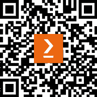

# 前言

在我作为软件工程师职业生涯的开始阶段，我专注于理解技术概念和尽可能快地交付功能。随着我职业生涯的进步和代码编写技艺的成熟，我开始理解代码质量和可维护性的重要性。这对于 Go 开发者来说尤为重要，因为该语言的设计围绕效率、简单性和安全性等价值观。

本书旨在为你提供所有提升你自己的 Go 代码质量的工具，通过行业标准的开发方法**测试驱动开发**（**TDD**）。它提供了对 TDD 原则和实践的全面介绍，帮助你无需任何先验知识即可开始。它还展示了如何将这种方法应用于 Go 语言，该语言作为开发语言继续受到欢迎。

在本书的整个过程中，我们将通过各种代码示例，包括构建演示 REST API，来探索如何利用 TDD 的好处。这种实用方法将教你如何设计可测试的代码，并使用标准测试库以及 Go 开发生态系统中流行的开源第三方库编写高效的 Go 测试。

本书介绍了 TDD 的实践，并通过实际示例教你如何在 Go 应用程序的开发中使用它们。它展示了如何利用 TDD 在各个层次上的好处，确保它们满足功能性和非功能性需求。它还涉及了如何设计和实现可测试代码的重要原则，例如容器化、数据库集成和微服务架构。

我希望这本书能帮助你成为更好的工程师。在其页面上，我包含了我在刚开始 Go 开发时希望拥有的所有知识，希望这能帮助你更容易地编写经过良好测试的代码。

欢迎阅读！

# 本书面向对象

本书面向开发人员和软件测试专业人士，他们希望交付高质量且经过良好测试的 Go 项目。如果你刚开始接触 TDD，你将学习如何在你的开发过程中采用其实践。如果你已经有一些经验，代码示例将帮助你编写更高效的测试套件，并教你新的测试实践。

# 本书涵盖内容

*第一章*，《掌握测试驱动开发》，介绍了 TDD 的原则和好处，为继续学习它提供了动力。

*第二章*，《单元测试基础》，教导我们开始编写测试之旅所必需的基本知识。它涵盖了测试金字塔以及如何使用 Go 的标准测试库编写单元测试，以及如何在我们的项目中运行测试。

*第三章*，*模拟和断言框架*，基于前几章的知识，教我们如何为具有依赖关系的代码编写测试。它涵盖了接口的使用、如何编写更好的断言以及生成和使用模拟来编写具有隔离范围的测试的重要性。

*第四章*，*构建高效的测试套件*，探讨了如何使用流行的 Go 测试技术——表格驱动设计，将测试分组到测试套件（涵盖各种场景）。

*第五章*，*执行集成测试*，通过使用集成测试将我们编写的测试范围扩展到组件之间的交互。它还介绍了**行为驱动开发**（**BDD**），这是 TDD 的扩展。

*第六章*，*对 BookSwap Web 应用程序进行端到端测试*，专注于构建 REST API 应用程序，这是本书的主要演示工具。它涵盖了使用 Docker 的容器化、数据库交互和端到端测试。

*第七章*，*Go 中的重构*，讨论了代码重构的技术，这是开发过程中的一个重要部分。它涵盖了使用接口简化更改依赖关系的过程，以及将单体应用程序拆分为微服务架构的常见过程。

*第八章*，*测试微服务架构*，探讨了微服务架构的测试挑战，这些架构变化迅速。它介绍了合同测试，可以用来验证服务之间的集成。

*第九章*，*测试并发代码的挑战*，介绍了 Go 的 goroutines 和 channels 并发机制，包括验证并发代码的挑战。它还探讨了 Go 竞争检测器的使用和限制。

*第十章*，*测试边缘情况*，通过利用模糊测试和基于属性的测试来扩展边缘情况和场景的测试。它还探讨了代码的鲁棒性，这允许我们编写能够处理各种输入的代码。

*第十一章*，*使用泛型*，通过探索泛型代码的使用和测试，结束了我们对 Go 中 TDD 的探索。它还讨论了如何为泛型代码编写表格驱动测试，以及如何创建自定义测试工具。

# 要充分利用本书

您需要在计算机上安装高于 1.19 版本的 Go。所有代码示例都已使用 macOS 上的 Go 1.19 进行测试。在*第六章*之后，运行`BookSwap`演示应用程序将需要您安装 PostgreSQL 或使用 Docker 运行它。

| **本书涵盖的软件** | **操作系统要求** |
| --- | --- |
| Go 1.19 | Windows, macOS, 或 Linux |
| PostgreSQL 15 | Windows, macOS, 或 Linux |
| Docker Desktop 4.17 | Windows, macOS, 或 Linux |
| Postman 10（可选） | Windows, macOS, 或 Linux |

GitHub 仓库描述了运行`BookSwap`应用程序所需的配置，包括设置一些本地环境变量。

**如果您正在使用本书的数字版，我们建议您亲自输入代码或从本书的 GitHub 仓库（下一节中提供链接）获取代码。这样做将帮助您避免与代码的复制和粘贴相关的任何潜在错误。**

如果您已经熟悉 Go 的基础知识和语法，您将能从阅读本书中获得最大收益。如果您是 Go 的初学者，您可以在[`go.dev/tour/list`](https://go.dev/tour/list)完成 Go 的游览。

# 下载示例代码文件

您可以从 GitHub 下载本书的示例代码文件：[`github.com/PacktPublishing/Test-Driven-Development-in-Go`](https://github.com/PacktPublishing/Test-Driven-Development-in-Go)。如果代码有更新，它将在 GitHub 仓库中更新。

我们还有来自我们丰富的图书和视频目录的其他代码包，可在[`github.com/PacktPublishing/`](https://github.com/PacktPublishing/)找到。查看它们！

# 下载彩色图像

我们还提供了一份包含本书中使用的截图和图表彩色图像的 PDF 文件。您可以从这里下载：[`packt.link/KFZWx`](https://packt.link/KFZWx)。

# 使用的约定

本书使用了多种文本约定。

`文本中的代码`：表示文本中的代码单词、数据库表名、文件夹名、文件名、文件扩展名、路径名、虚拟 URL、用户输入和 Twitter 昵称。以下是一个示例：“Go 工具链提供了一个单一的`go test`命令来运行我们定义的所有测试。”

代码块设置如下：

```go
func(e *Engine) Add(x, y float64) float64{
  return x + y
}
```

当我们希望您注意代码块中的特定部分时，相关的行或项目将以粗体显示：

```go
func TestAdd(t *testing.T) {
  e := calculator.Engine{} 
  x, y := 2.5,3.5 
  want := 6.0  
  got := e.Add(x,y) 
  if got != want { 
t.Errorf("Add(%.2f,%.2f) incorrect, got: %.2f, want: %.2f", x, y, got, want) 
  } 
}
```

任何命令行输入或输出都按照以下方式编写：

```go
$ go test -run TestDivide ./chapter04/table -v
```

**粗体**：表示新术语、重要单词或屏幕上看到的单词。例如，菜单或对话框中的单词以**粗体**显示。以下是一个示例：“从**管理**面板中选择**系统信息**。”

小贴士或重要注意事项

看起来是这样的。

# 联系我们

我们欢迎读者的反馈。

**一般反馈**：如果您对本书的任何方面有疑问，请通过电子邮件发送给我们 customercare@packtpub.com，并在邮件主题中提及书名。

**勘误**：尽管我们已经尽最大努力确保内容的准确性，但错误仍然可能发生。如果您在此书中发现错误，我们将非常感激您向我们报告。请访问[www.packtpub.com/support/errata](http://www.packtpub.com/support/errata)并填写表格。

**盗版**：如果您在互联网上以任何形式发现我们作品的非法副本，我们将非常感激您提供位置地址或网站名称。请通过 mailto:copyright@packt.com 与我们联系，并提供材料的链接。

**如果您有兴趣成为作者**：如果您在某个领域有专业知识，并且您有兴趣撰写或为书籍做出贡献，请访问[authors.packtpub.com](http://authors.packtpub.com)。

# 分享您的想法

一旦您阅读了《Go 语言测试驱动开发》，我们非常乐意听到您的想法！请[点击此处直接进入该书的亚马逊评论页面](https://packt.link/r/1-803-24787-8)并分享您的反馈。

您的评论对我们和科技社区非常重要，并将帮助我们确保我们提供高质量的内容。

# 下载此书的免费 PDF 副本

感谢您购买此书！

您喜欢在路上阅读，但无法携带您的印刷书籍到处走？

您的电子书购买是否与您选择的设备不兼容？

请放心，现在购买每一本 Packt 书籍，您都可以免费获得该书的 DRM 免费 PDF 版本。

在任何地方、任何设备上阅读。直接从您最喜欢的技术书籍中搜索、复制和粘贴代码到您的应用程序中。

优惠远不止于此，您还可以获得独家折扣、时事通讯以及每天收件箱中的优质免费内容。

按照以下简单步骤获取优惠：

1.  扫描下面的二维码或访问以下链接



[`packt.link/free-ebook/9781803247878`](https://packt.link/free-ebook/9781803247878)

1.  提交您的购买证明

1.  就这些！我们将直接将免费 PDF 和其他优惠发送到您的邮箱。

# 第一部分：整体概述

这一部分开始了我们探索`ginkgo`和`testify`世界的旅程，它们是 Go 语言标准`testing`库的补充。最后，我们学习了如何实现并利用流行的表格驱动测试技术，轻松编写覆盖各种场景的测试，使覆盖多个测试场景和扩展测试范围变得容易。在本节中，我们还开始了我们的演示 REST API，即`BookSwap`网络应用程序的实现。

本部分包含以下章节：

+   *第一章*, *掌握测试驱动开发*

+   *第二章*, *单元测试基础*

+   *第三章*, *模拟和断言框架*

+   *第四章*, *构建高效的测试套件*
