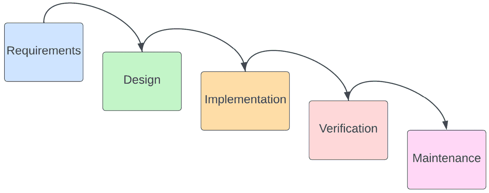
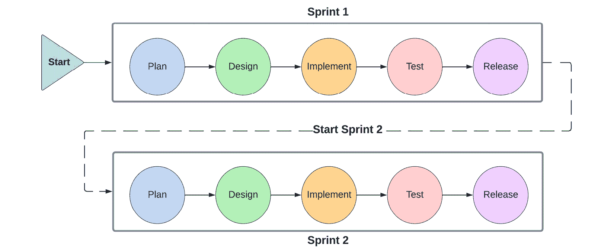
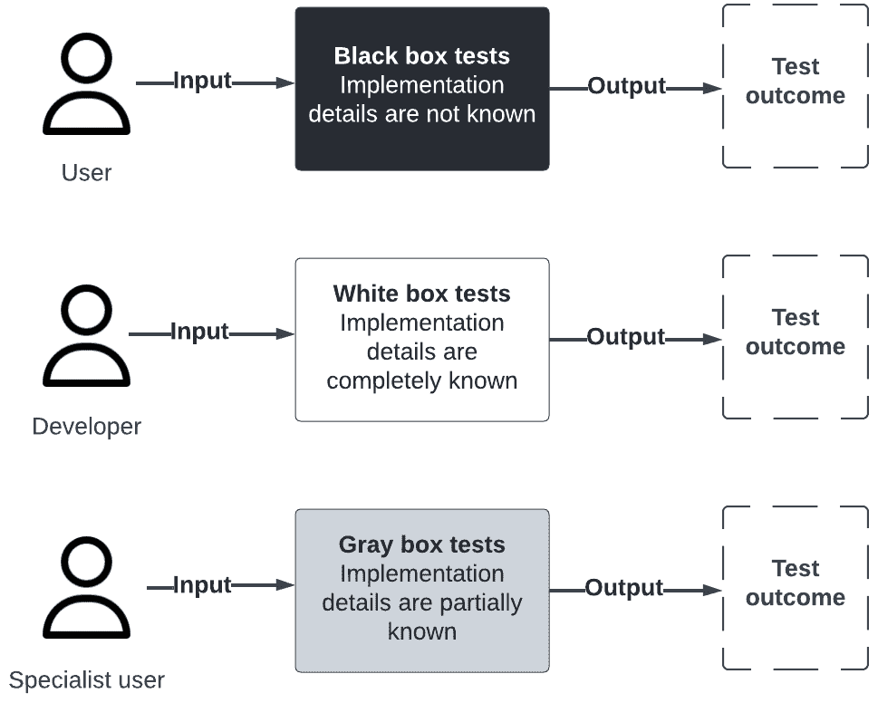
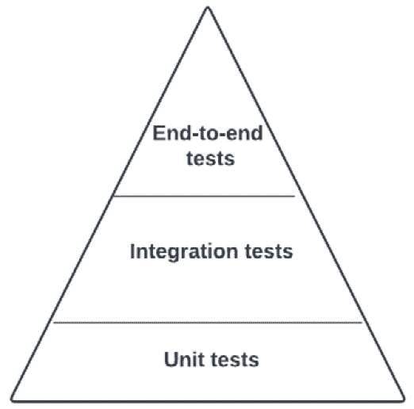
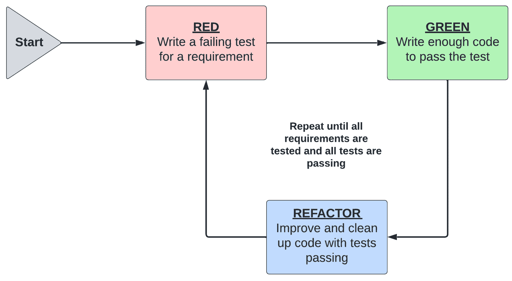
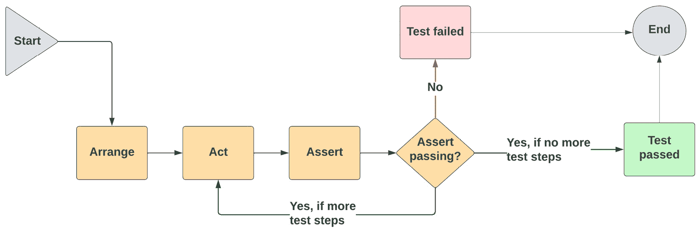
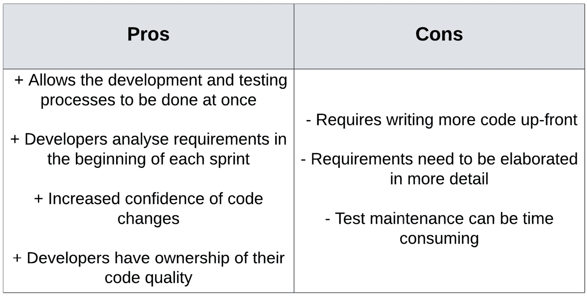
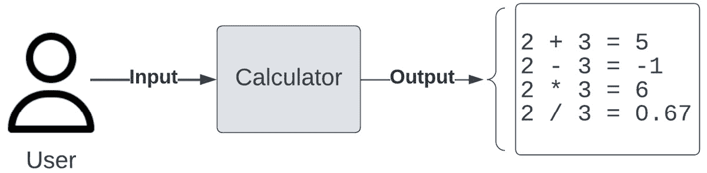
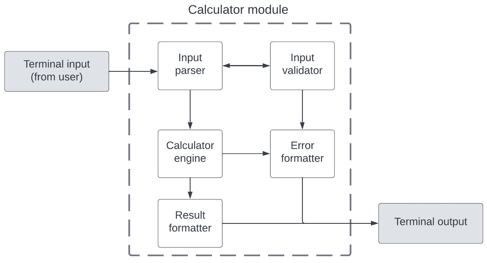
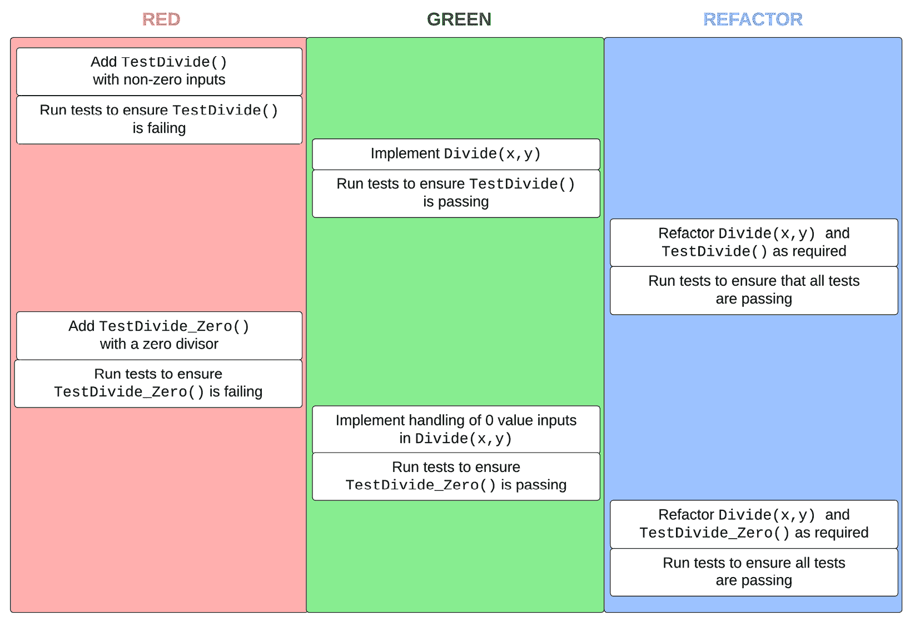

# 第一章：掌握测试驱动开发

程序和软件从未像今天这样复杂。根据我的经验，典型的科技初创企业设置从项目一开始就涉及云部署、分布式数据库以及各种软件集成。随着我们以前所未有的速度使用软件和消耗数据，对高可用性和可扩展性的期望已成为我们与之互动的所有服务的标准。

那么，为什么在我们忙于在快节奏、高增长的环境中交付复杂功能时，我们还应该关心测试呢？简单来说，是为了验证和证明您编写的代码符合项目的期望和要求。这对您作为软件专业人士来说很重要，对您的团队和产品经理也是如此。

在本章中，我们将探讨敏捷技术中的**测试驱动开发**（**TDD**）以及我们如何使用它来验证生产代码。TDD 将编写测试放在实现之前，确保测试脚本覆盖并随着需求的变化而变化。其技术使我们能够交付质量高、经过良好测试且易于维护的代码。软件测试的任务对所有程序员来说都是必要的，TDD 无缝地将测试编写纳入代码交付过程。

本章将开启我们对测试世界的探索。它将为您提供对 TDD 及其主要技术的必要理解。在脑海中牢固定义和设置这些基础将为我们后来在 Go 中实施自动化测试奠定基础。

在本章中，我们将涵盖以下主要内容：

+   TDD 的世界和基础

+   TDD 的益处和用途

+   TDD 的替代方案

+   测试指标

# 探索 TDD 的世界

简而言之，TDD 是一种允许我们通过短反馈循环编写自动化测试的技术。它是一个将测试纳入软件开发过程的迭代过程，使开发者能够使用与编写生产代码相同的技巧来编写他们的测试。

TDD 是作为一种敏捷工作实践被创建的，因为它允许团队以迭代过程交付代码，这个过程包括编写功能代码、通过测试验证新代码，并在需要时迭代重构新代码。

## 瀑布方法的介绍

作为敏捷运动的先导，是**瀑布方法**，这是最受欢迎的项目管理技术。这个过程涉及分阶段交付软件项目，每个阶段的工作在上一阶段完成后才开始，就像水流顺流而下。*图 1.1* 展示了瀑布方法的五个阶段：

图 1.1 – 瀑布方法的五个阶段

从制造和建设项目中获得的直觉可能表明，将软件交付过程分为顺序阶段，在项目开始时收集和制定所有需求是自然的。然而，当用于交付大型软件项目时，这种方式存在三个困难：

+   改变项目的方向或需求是困难的。只有在过程结束时才能获得一个可行的解决方案，需要验证大量的交付成果。测试整个项目比测试小交付成果要困难得多。

+   客户需要在项目开始时详细决定所有需求。水晶模型允许客户参与度最低，因为他们只在需求和验证阶段被咨询。

+   该过程需要详细的文档，其中指定了需求和软件开发方法。关键的是，项目文档包括客户在项目启动前需要批准的时间表和估计。

水晶模型主要关注工作计划

使用瀑布式项目管理方法可以使您在定义良好、线性的阶段中规划项目。这种方法直观，适用于目标明确、边界清晰的项目。然而，在实践中，水晶模型缺乏交付复杂软件项目所需的灵活性和迭代方法。

一种名为**敏捷**的更好的工作方式出现，可以解决水晶模型的挑战。TDD 依赖于敏捷方法的原则。关于敏捷工作实践的文献非常丰富，所以我们不会详细探讨敏捷，但简要了解 TDD 的起源将使我们能够理解其方法和进入其心态。

**敏捷软件开发**是一个涵盖多个代码交付和项目规划实践的总称，例如**Scrum**、**看板**、**极限编程**（**XP**）和 TDD。

如其名称所暗示的，它主要关于应对和适应变化的能力。瀑布式工作方式的主要缺点是其缺乏灵活性，而敏捷正是为了解决这一问题而设计的。

**敏捷宣言**于 2001 年由 17 位软件工程领导者和先驱撰写并签署。它概述了敏捷的 4 个核心价值和 12 个基本原则。宣言可在 agilemanifesto.org 免费获取。

四个核心敏捷价值观突出了运动的精髓：

+   **个人和交互胜过流程和工具**：这意味着参与项目交付的团队比他们的技术工具和流程更重要。

+   **工作软件胜过全面文档**：这意味着向客户提供工作功能是首要任务。虽然文档很重要，但团队应始终专注于持续交付价值。

+   **客户协作而非合同谈判**：这意味着客户应该在项目整个生命周期中参与反馈循环，确保项目和工作的持续交付价值，并满足他们的需求和期望。

+   **响应变化而非遵循计划**：这意味着团队应该对预定义的计划或路线图的变化做出响应。团队应该能够在需要时随时调整方向。

敏捷一切都是关于人

敏捷方法不是一系列规定性的实践清单。它更多的是关于团队在项目生命周期中共同克服不确定性和变化。敏捷团队是跨学科的，包括工程师、软件测试专业人士、产品经理等等。这确保了具有各种技能的团队成员能够协作，共同交付整个软件项目。

与瀑布模型不同，敏捷软件交付方法的各个阶段是重复的，专注于以小批量或迭代的方式交付软件，而不是瀑布模型的大规模交付。在敏捷术语中，这些迭代被称为**冲刺**。

*图 1**.2* 展示了敏捷项目交付的各个阶段：

图 1.2 – 敏捷软件交付的各个阶段

让我们看看敏捷软件交付的循环阶段：

1.  我们从**计划**阶段开始。产品负责人与关键利益相关者讨论将在当前冲刺中交付的项目需求。本阶段的结果是优先级排序的客户需求列表，这些需求将在本冲刺中实施。

1.  一旦确定项目的需求和范围，**设计**阶段就开始了。这个阶段涉及技术架构设计和 UI/UX 设计。这个阶段建立在**计划**阶段的要求之上。

1.  接下来，进入**实施**阶段。设计被用作指导，根据它实施范围功能。由于冲刺时间短，如果在实施过程中发现任何差异，团队可以轻松地回到早期阶段。

1.  一旦可交付成果完成，**测试**阶段就开始了。**测试**阶段几乎与**实施**阶段并行进行，因为测试规范可以在**设计**阶段完成后立即编写。只有当测试通过后，才能认为可交付成果已完成。工作可以在**实施**和**测试**阶段之间来回移动，工程师修复任何已识别的缺陷。

1.  最后，一旦所有测试和实施都成功完成，**发布**阶段就开始了。这个阶段完成任何面向客户的文档或发布说明。本阶段结束时，冲刺被认为是关闭的。可以开始一个新的冲刺，遵循相同的周期。

客户在每个冲刺结束时获得一个新的可交付成果，使他们能够看到产品是否仍然符合他们的要求，并为未来的冲刺提供变更信息。每个冲刺的可交付成果在发布之前都会进行测试，以确保后续的冲刺不会破坏现有功能并交付新功能。测试的范围和努力仅限于在冲刺期间开发的功能。

敏捷宣言的签署者之一是软件工程师肯特·贝克。他被认为重新发现并正式化了 TDD（测试驱动开发）的方法论。

从那时起，敏捷对许多团队来说都取得了高度成功，成为行业标准，因为它使团队能够在功能交付时验证功能。它将测试与软件交付和重构相结合，消除了代码编写和测试过程之间的分离，缩短了工程团队和客户需求之间的反馈循环。这个更短的循环是赋予敏捷灵活性的原则。

我们将在本书的章节中学习如何利用其流程和技术在我们的**Go**项目中。

## 自动化测试的类型

**自动化测试**套件是涉及工具和框架以验证软件系统行为的测试。它们提供了一种可重复的验证系统需求的方法。它们是敏捷团队的标准，因为敏捷团队必须在每个冲刺和发布后测试他们的系统，以确保新功能在没有干扰旧/现有功能的情况下交付。

所有自动化测试都根据被测试系统的需求定义它们的输入和预期输出。我们将根据三个标准将它们分为几种测试类型：

+   它们对系统的知识量

+   它们验证的要求类型

+   它们覆盖的功能范围

我们将要研究的每个测试都将根据这三个特征进行描述。

### 系统知识

如您在*图 1**.3*中可以看到，根据它们对所测试系统的内部知识量，自动化测试可以分为三类：

图 1.3 – 根据系统知识类型的测试

让我们进一步探讨测试的三个类别：

+   **黑盒测试**是从用户的角度运行的。测试编写者将系统的内部视为未知，就像用户一样。测试和预期输出是根据它们验证的要求制定的。如果系统的内部发生变化，黑盒测试通常不会很脆弱。

+   **白盒测试**是从开发者的角度进行的。测试编写者，很可能是开发者，对系统的内部结构完全了解。这些测试可以更加详细，并且有可能发现黑盒测试无法发现的隐藏错误。如果系统的内部结构发生变化，白盒测试通常会变得脆弱。

+   **灰盒测试**是黑盒测试和白盒测试的混合体。测试编写者对系统的内部结构部分了解，就像专家或特权用户一样。这些测试可以验证比黑盒测试更高级的使用案例和要求（例如安全或某些非功能要求），并且通常编写和运行的时间更长。

### 需求类型

通常，我们应该提供验证系统功能和可用性的测试。

例如，我们可以在页面上拥有所有正确的功能，但如果它需要 5+秒才能加载，用户将会放弃它。在这种情况下，系统是功能性的，但它并不满足客户的需求。

我们可以根据它们验证的要求类型进一步将我们的自动化测试分为两类：

+   **功能测试**：这些测试覆盖了在冲刺期间添加到待测系统中的功能，之前冲刺的功能测试确保后续冲刺中没有功能回归。这类测试通常是黑盒测试，因为这些测试应该根据典型用户能够访问的功能来编写和运行。

+   **非功能测试**：这些测试覆盖了系统所有非功能要求但影响用户体验和系统功能的方面。这些测试包括性能、可用性和安全性等方面。这类测试通常是白盒测试，因为它们通常需要根据实现细节来制定。

正确性和可用性测试

验证系统正确性的测试被称为**功能测试**，而验证系统可用性和性能的测试被称为**非功能测试**。常见的非功能测试包括性能测试、负载测试和安全测试。

### 测试金字塔

在敏捷测试中，一个重要的概念是**测试金字塔**。它概述了应该包含在软件系统**自动化测试套件**中的自动化测试类型。它提供了关于执行每种类型测试的顺序和优先级的指导，以确保新功能以适当的测试努力交付，并且不会破坏旧/现有功能。

*图 1*.4 展示了包含其三种测试类型的测试金字塔：单元测试、集成测试和端到端测试：

图 1.4 – 测试金字塔及其组件

每种测试类型都可以根据系统知识、需求类型和测试范围这三个已确立的特性进一步描述。

#### 单元测试

在测试金字塔的底部，我们有**单元测试**。它们位于底部是因为它们的数量最多。它们的测试范围较小，覆盖了在多种条件下单个组件的功能。好的单元测试应该与其他组件隔离测试，这样我们就可以完全控制测试环境和设置。

随着代码中新功能的增加，单元测试的数量也在增加，因此它们需要健壮且执行速度快。通常，每次代码更改都会运行测试套件，因此它们需要快速为工程师提供反馈。

**单元测试**传统上被认为是**白盒测试**，因为它们通常由了解组件所有实现细节的开发者编写。然而，Go 语言的单元测试通常只测试包的导出/公开功能，这使得它们更接近**灰盒测试**。

我们将在*第二章*中进一步探讨单元测试，*单元测试基础*。

#### 集成测试

在测试金字塔的中间，我们有**集成测试**。它们是金字塔的必要组成部分，但它们的数量不应过多，也不应像金字塔底部的**单元测试**那样频繁运行。

单元测试验证单个功能模块是否正确运行，而集成测试则扩展了测试范围，测试多个组件之间的通信。这些组件可以是系统外部的，也可以是系统内部的——比如数据库、外部 API 或系统中的另一个微服务。通常，集成测试在专用环境中运行，这使我们能够将生产数据和测试数据分开，同时降低成本。

**集成测试**可以是**黑盒测试**或**灰盒测试**。如果测试覆盖外部 API 和面向客户的函数，它们可以归类为**黑盒测试**，而更专业的安全或性能测试则被视为**灰盒测试**。

我们将在*第四章*中进一步探讨集成测试，*构建高效的测试套件*。

#### 端到端测试

在测试金字塔的顶部，我们有**端到端测试**。在我们迄今为止看到的测试中，它们的数量最少。它们测试应用程序的整个功能（在每个冲刺期间添加），确保项目交付成果符合要求，并在给定冲刺结束时可能发货。

这些测试可能编写、维护和运行所需的时间最长，因为它们可能涉及大量不同的场景。就像集成测试一样，它们通常也在模拟生产环境的专用环境中运行。

集成测试和端到端测试之间有很多相似之处，尤其是在微服务架构中，一个服务的端到端功能涉及到与其他服务的端到端功能的集成。

我们将在*第五章* *执行集成测试*和*第八章* *测试微服务架构*中进一步探讨端到端测试。

现在我们已经了解了不同类型的自动化测试，是时候看看我们如何利用敏捷实践 TDD 来在我们代码旁边实现它们了。TDD 将帮助我们编写经过良好测试的代码，提供测试金字塔的所有组件。

## TDD 的迭代方法

正如我们之前提到的，TDD 是一种敏捷实践，将是我们要探索的重点。TDD 的原则很简单：在实现功能之前先编写单元测试。

TDD 将测试过程与实现过程结合起来，确保每一段功能在编写后立即得到测试，使软件开发过程迭代，并为开发者提供快速反馈。

*图 1.5* 展示了 TDD 过程的步骤，被称为**红色**、**绿色**和**重构**过程：

图 1.5 – TDD 的步骤

让我们看看 TDD 工作流程的循环阶段：

1.  我们从**红色阶段**开始。我们首先考虑我们想要测试的内容，并将这个需求转换为一个测试。有些需求可能由几个较小的需求组成：在这个阶段，我们只测试第一个小需求。这个测试将失败，直到新的功能实现，这就是红色阶段的名字。失败的测试是关键的，因为我们想要确保无论我们编写什么代码，测试都会可靠地失败。

1.  接下来，我们进入**绿色阶段**。我们从测试代码切换到实现代码，只编写足够的代码以满足使失败的测试通过的要求。代码不需要完美或最优，但应该足够正确，以便测试可以通过。它应该专注于之前编写的失败的测试所测试的需求。

1.  最后，我们进入**重构阶段**。这个阶段主要是清理实现代码和测试代码，去除重复，并优化我们的解决方案。

1.  我们重复这个过程，直到所有需求都经过测试和实现，所有测试都通过。开发者经常在测试和实现代码之间切换，相应地扩展功能和测试。

这就是做 TDD 的全部内容！

TDD 完全是关于开发者的

TDD 是一种以开发者为中心的过程，其中单元测试是在实现之前编写的。开发者首先编写一个失败的测试。然后，他们编写最简单的实现来使测试通过。一旦功能实现并按预期工作，他们就可以根据需要重构代码并进行测试。这个过程需要重复多少次就重复多少次。没有任何代码或功能是未编写相应测试的。

## TDD 最佳实践

TDD 的 **红色**、**绿色** 和 **重构** 方法简单，但非常强大。虽然过程简单，但我们仍可以提出一些建议和最佳实践，以指导如何编写组件和测试，以便更轻松地通过 TDD 来交付。

### 结构化您的测试

我们可以制定一个共享的、可重复的测试结构，使测试更易于阅读和维护。*图 1.6* 描述了在 TDD 中经常使用的 **安排-执行-断言** （**AAA**） 模式：

图 1.6 – 安排-执行-断言模式的步骤

AAA 模式描述了如何以统一的方式构建测试：

1.  我们从 **安排** 步骤开始，这是测试的设置部分。这是我们设置 **被测单元** （**UUT**） 和它在设置过程中所需的全部依赖项的时候。我们还在本节中设置了测试场景使用的输入和先决条件。

1.  接下来，**执行** 步骤是我们执行测试场景中指定的操作的地方。根据我们正在实现的测试类型，这可能是简单地调用一个函数、一个外部 API，甚至是数据库函数。这一步骤使用在 **安排** 步骤中定义的先决条件和输入。

1.  最后，**断言** 步骤是我们确认 UUT 是否符合要求的地方。这一步骤将 UUT 的输出与根据要求定义的预期输出进行比较。

1.  如果 **断言** 步骤显示被测单元（UUT）的实际输出与预期不符，则测试被认为是失败的，测试结束。

1.  如果 **断言** 步骤显示被测单元（UUT）的实际输出与预期相符，那么我们有两种选择：一种选择是如果没有更多的测试步骤，则测试被认为是通过的，测试结束。另一种选择是如果有更多的测试步骤，那么我们就回到 **执行** 步骤并继续。

1.  **执行** 和 **断言** 步骤可以根据您的测试场景需要重复执行多次。然而，您应该避免编写冗长、复杂的测试。这一点在本节的最佳实践中将进一步说明。

您的团队能够利用测试辅助工具和框架来最小化设置和断言代码的重复。使用 AAA 模式将有助于设定测试编写和阅读的标准，最小化新成员和现有团队成员的认知负荷，并提高代码库的可维护性。

#### 控制范围

正如我们所看到的，测试的范围取决于你正在编写的测试类型。无论测试类型如何，你都应该尽可能限制组件的功能和测试的断言。TDD 可以实现这一点，它允许我们同时测试和实现代码。

尽可能保持简单立即带来一些优势：

+   失败情况下更容易调试

+   当安排和断言步骤简单时，更容易维护和调整测试

+   测试执行时间更快，尤其是在能够并行运行测试的情况下

### 测试输出，而非实现

正如我们从之前的测试定义中看到的，它们都是关于定义输入和预期输出的。作为了解实现细节的开发者，添加验证 UUT 内部工作的断言可能会很有诱惑力。

然而，这是一个导致测试和实现之间紧密耦合的反模式。一旦测试了解实现细节，它们就需要与代码更改一起更改。因此，在构建测试时，重要的是要关注测试外部可见的输出，而不是实现细节。

### 保持测试独立

测试通常组织在测试套件中，涵盖各种场景和需求。虽然这些测试套件允许开发者利用共享功能，但测试应独立于彼此运行。

测试应从一个预定义且可重复的起始状态开始，该状态不会随着运行次数和执行顺序的改变而改变。设置和清理代码确保每个测试的起始点和结束状态符合预期。

因此，最好是测试创建自己的 UUT（单元测试对象）来运行修改和验证，而不是与其他测试共享一个。总体而言，这将确保你的测试套件是健壮的，并且可以并行运行。

采用 TDD 及其最佳实践允许敏捷团队交付经过良好测试的代码，易于维护和修改。这是 TDD 的许多好处之一，我们将在下一节继续探讨。

# 理解 TDD 的好处和使用方法

在考虑 TDD 的基本原理和最佳实践的情况下，让我们更深入地探讨将 TDD 作为团队实践的好处。由于敏捷工作实践是行业标准，我们将从现在开始讨论敏捷团队中 TDD 的使用。将 TDD 纳入开发流程立即允许开发者更容易地编写和维护测试，同时也更容易检测和修复错误。

## 使用 TDD 的优缺点

*图 1.7**。7* 展示了使用 TDD 的一些优缺点：

图 1.7 – 使用 TDD 的优缺点

我们可以进一步探讨这些优缺点的亮点：

+   TDD 允许开发和测试过程同时进行，确保所有代码从一开始就被测试。虽然 TDD 确实需要提前编写更多代码，但编写的代码会立即被测试覆盖，并且错误会在相关代码仍然新鲜时被修复。测试不应该是事后考虑的事情，也不应该在实现延迟时仓促或削减。

+   TDD 允许开发者在冲刺开始时详细分析项目需求。虽然这确实要求产品经理在冲刺计划中确定需要构建的细节，但它也允许开发者对每个冲刺期间可以和不能实现的内容给出早期反馈。

+   经过良好测试且使用 TDD 构建的代码可以自信地发布和更改。一旦代码库建立了测试套件，开发者可以自信地更改代码，因为他们知道现有的功能不会因为测试失败而破坏，因为测试失败会在代码发布之前标记出任何问题。

+   最后，最重要的优点是它通过让他们对实现和测试都负责，使开发者拥有代码质量。与代码同时编写测试，使开发者能够快速了解代码可能存在的错误，而不是在发布完整功能后很久才听到他们哪里做得不够好。

在我看来，使用 TDD（测试驱动开发）最重要的优势是开发者拥有感的增加。即时的反馈循环使他们能够做到最好，同时也让他们安心，因为他们没有破坏任何现有的代码。

现在我们已经了解了 TDD 及其好处，让我们探索 TDD 在简单计算器示例中的基本应用。

## 用例 – 简单终端计算器

这个用例将使你对我们在测试更高级示例时将采取的一般过程有一个良好的理解。

我们将要研究的用例是简单的终端计算器。计算器将在终端运行，并使用标准输入读取其参数。计算器将只处理两个运算符和你在*图 1.8*中看到的简单数学运算：

图 1.8 – 简单计算器在终端运行

这个功能很简单，但计算器也应该能够处理边缘情况和其他输入错误。

### 需求

敏捷团队通常从用户的角度编写他们的需求。项目需求首先被编写，以捕捉客户需求并指导整个简单计算器项目的测试用例和实现。在敏捷团队中，需求会经历多次迭代，工程领导在早期就参与进来，以确保所需的功能可以被交付。

用户应该能够执行以下操作：

+   使用终端输入输入正数、负数和零值。这些值应正确转换为数字。

+   访问加、减、乘、除等数学运算。这些运算应返回整个输入范围的正确结果。

+   查看四舍五入到两位小数的分数结果。

+   查看用户友好的错误信息，指导他们如何修复输入。

从用户角度出发的敏捷需求

需求用于捕捉最终用户的需求和观点。需求规定了先决条件、用户操作和验收标准。它们指定了我们应该构建什么，以及如何验证实现。

记住，我们只按冲刺周期指定需求。一开始就指定整个产品的需求，以及认为它们不会改变的心态，是一种反模式。敏捷软件开发是一个迭代的过程。

### 架构

我们简单的终端计算器足够小，可以在一个冲刺周期内实现。我们将把我们的四个需求转换为简单的系统架构。计算器将由用户在本地下载并运行，因此我们不需要考虑任何网络或云部署方面。

*图 1.9* 展示了计算器模块的设计可能看起来是什么样子：

图 1.9 – 简单终端计算器的架构

计算器模块的每个组件都有其自身明确的责任和功能：

+   **输入解析器**负责与终端输入集成，正确读取用户输入并将其传递给计算器模块。

+   **输入验证器**负责验证从**输入解析器**发送的输入，例如输入是否包含有效的数字和运算符是否有效。

+   一旦输入被解析和验证，**计算器引擎**将接收数字并尝试找到运算的结果。

+   **计算器引擎**随后依赖于**结果格式化器**来正确格式化结果并将其打印到终端输出。在出现错误的情况下，它依赖于**错误格式化器**来生成并打印用户友好的错误信息。

### 应用 TDD

如描述，我们将使用**红色**、**绿色**和**重构**流程以迭代方式应用 TDD，以交付所需用户功能。测试是基于简单终端计算器的要求和设计先编写的。

在 *图 1.10* 中展示了在 **计算器引擎** 中实现 `Divide(x,y)` 函数的过程概述：

图 1.10 – 将 TDD 流程应用于计算器引擎

这是一个展示使用 TDD 所涉及步骤的小快照：

1.  我们首先编写一个简单的 `TestDivide()` 测试，安排两个非零输入并编写断言来除以它们。这是我们能够实现的最简单情况。然后，我们运行测试套件以确保新编写的 `TestDivide()` 测试正在失败。

1.  现在测试已经建立了预期的行为，我们可以开始实现 `Divide(x,y)` 函数。我们只编写足够的代码来处理两个非零输入的简单情况。然后，我们运行测试套件以验证我们编写的代码是否满足 `TestDivide()` 的断言。现在所有测试都应该通过。

1.  我们现在可以花些时间重构我们编写的现有代码。新编写的代码可以根据清洁代码实践以及我们讨论过的 TDD 最佳实践进行清理。再次运行测试套件以验证重构步骤没有破坏任何新的或现有的测试。

1.  新的 `Divide(x,y)` 函数的最简单功能现在已实现并经过验证。我们可以转向查看更高级的功能或边缘情况。一个这样的边缘情况可能是优雅地处理零除数。我们现在添加一个新的测试 `TestDivide_Zero()`，它设置并断言零除数的情况。像往常一样，我们运行测试套件以确保新的 `TestDivide_Zero()` 测试正在失败。

1.  我们修改 `Divide(x,y)` 的实现，以优雅且正确地处理零除数，正如计算器要求中所述（可能需要与产品负责人甚至用户交谈）。我们再次运行测试以确保所有测试现在都通过。

1.  最后，我们开始新一轮的重构，确保代码和测试都写得很好。再次运行所有测试以确保重构没有引起任何错误。

TDD 是第二天性

开发过程在编写测试代码和编写实现代码之间切换，所需次数不限。虽然一开始可能感觉有些繁琐，但编写测试代码和实现代码之间的切换很快就会成为 TDD 实践者的第二天性。

总是记得先从一个失败的测试开始，然后尽可能少地编写代码来使测试通过。仅在所有功能都经过验证并正常工作后，在重构阶段优化代码。

我们现在熟悉了 TDD 的过程，并了解了如何相应地编写和构建我们的测试。然而，考虑替代流程也很重要。

# TDD 的替代方案

正如我们所见，TDD 只是一种以迭代方式交付经过良好测试的代码的方法。将测试放在首位确保永远不会交付未经测试和重构的功能。在本节中，我们将探讨一些其他常见的代码测试流程。

## 水瀑布测试

正如我们从瀑布方法论的介绍中记得的那样，瀑布项目的测试或验证阶段是在实施阶段完全完成后发生的。整个项目已经交付，所有需求都已在此时实现。

这里是优点：

+   瀑布项目通常结构良好，文档齐全。测试计划由这些广泛的文档提供信息，测试人员可以确保他们实施的端到端测试覆盖了已识别的用户需求。

+   开发人员和测试人员可以依赖项目文档独立工作，无需沟通。这种分工使得团队可以轮班工作——测试人员验证功能，开发人员修复可能出现的任何错误。

这些是缺点：

+   由于整个项目已经实施，错误可能会变得更加复杂。此外，由于整个项目已经实施，如果需要进行大量更改，修复错误可能需要相当多的工程努力。

+   如果客户需求在项目开始时并不清楚或明确，一旦客户在过程结束时看到交付的产品，需求发生变化，可能会浪费大量的实施和测试工作。

+   测试过程通常被视为一种浪费时间、消极的练习，应该尽快完成。此外，如果在开发过程中出现延误，验证过程中可能会很容易地削减成本，从而交付一个不稳定的产品。

## 接受测试驱动开发

**接受测试驱动开发**（**ATDD**）是一种与 TDD 相关的敏捷开发过程。ATDD 涉及来自产品、工程和测试等多个学科的人员，以确保**正确的产品以正确的方式被开发**。客户需求被转化为一个可以由各种利益相关者理解的列表。然后，这些需求被转换为自动接受测试，用于验证工程部门交付的内容。

ATDD 的优点如下：

+   就像使用 TDD 一样，当使用 ATDD 时，首先编写测试。在每次提交或增量代码交付后，可以运行一个完整的自动化接受测试套件，确保所有端到端功能按预期工作。

+   如果操作得当，在项目中使用 ATDD 将得到业务内部各种利益相关者的广泛支持，因为他们将很好地理解它将提供的方向和客户价值。

缺点如下：

+   编写需求时，需要大量的沟通和同步工作，涉及跨学科的努力。让各种利益相关者提供所需的时间和精力可能会很耗时。

+   这种方法可能不适合绿色项目，因为一开始就有很多未知因素。为甚至没有 API 或数据库模型的项目编写验收测试尤其具有挑战性。

+   在项目初期获取样本有效载荷或数据集可能具有挑战性，尤其是如果这些由客户或第三方提供。

进一步与 ATDD 相关的是，我们有**行为驱动开发**（**BDD**）。它提供了关于如何使用业务领域语言结构化利益相关者之间对话的精确指导。我们将在*第五章* *执行* *集成测试* 中进一步探讨 BDD。

当我们开始与功能代码一起编写和思考测试代码时，为我们的测试代码设定成功标准是很重要的。测试指标可以帮助我们实现这一点。

# 理解测试指标

现在我们已经了解了如何首先通过测试来交付项目，是时候看看一些可以量化项目测试程度的指标了。在整个测试金字塔中交付测试非常重要，因为这可以确保应用程序能够正确地端到端工作，并且与外部依赖良好地协作。

## 重要的测试指标

在量化软件质量时，我们可以测量一系列的指标：

+   **需求覆盖率**：这表示测试覆盖了您项目需求的百分比。一个测试可以覆盖多个需求，但不应有任何客户需求未经过测试。

+   **缺陷计数和分布**：这表示在应用的每个模块/部分中发现了多少缺陷或错误。分布也将表明系统中是否存在任何特定的问题区域，这些区域可能需要重构。

+   **缺陷解决时间**：这表示一旦发现错误，开发团队能够多快地修复它们。长的**平均解决时间**（**MTTR**）可能表明开发团队人手不足，而在系统特定区域的长最大解决时间可能表明该部分的代码难以更改。

+   **代码覆盖率**：这表示单元测试执行了您的代码库的百分比。由于测试应该首先编写，覆盖率也显示了开发团队是否在使用 TDD。低测试覆盖率也可能表明系统设计存在问题。

+   **燃尽率和图表**：这些指标表示团队交付功能的能力。由于开发和测试是一个统一的任务，除非经过测试，否则用户故事或需求不能被视为完成，因此燃尽率将仅包括准备交付的故事。燃尽图表可以表明项目时间表中的延迟。

## 代码覆盖率

由于代码覆盖率指标是如此重要的 TDD（测试驱动开发）指标，让我们进一步探讨它。为了实现高覆盖率百分比，测试应该覆盖以下内容：

+   您实现的**函数**

+   您函数由**语句**组成

+   您函数的不同**执行路径**

+   您布尔变量的不同**条件**

+   可以传递给您的函数的不同**参数值**

Go 测试运行器为 Go 应用程序提供覆盖率百分比。我们将在*第二章*，“单元测试基础”中查看如何做到这一点。

*图 1**.11*显示了简单终端计算器中`Divide(x,y)`函数实现的流程图：

图 1.11 – 简单计算器中`Divide(x,y)`函数的执行流程

应编写测试来覆盖和验证以下内容：

+   `y != 0`的执行路径

+   `y == 0`的执行路径

+   `DivideZero`错误的错误信息

+   结果计算语句的输出

+   打印结果语句的输出

### 代码覆盖率百分比

在大型项目中，达到代码库的 100%测试覆盖率将是不切实际的。技术社区中已经有很多关于什么是**好的**测试覆盖率百分比的讨论。普遍认为，良好的覆盖率大约在 80%左右。在此之后，经验表明可能会有递减的回报。

代码覆盖率百分比也将取决于您正在运行的项目类型。具有低代码覆盖率百分比的遗留代码库需要相当大的努力才能提高到 80%的标记。同样，如果有很多未知因素，绿色项目也很难进行测试。

就像您编写的任何代码一样，测试代码也需要维护和重构。保持高覆盖率百分比需要维护和更新大量的测试代码。这可能会增加重构或其他代码更改的开发成本，因为它可能需要更新许多测试用例。维护不覆盖需求的测试的商业价值非常低，因此您应该确保您的测试为您的测试套件提供价值。

经过良好测试的代码不一定是无错误的代码

您的测试应该旨在验证重要代码行为，而不是仅仅为了达到一定的代码覆盖率百分比而编写代码。团队应该采用 TDD（测试驱动开发）的文化，并且良好的覆盖率百分比将会随之而来。

# 摘要

在本章中，我们涵盖了您开始 TDD 所需的所有测试基础。我们从解释什么是敏捷以及 TDD 如何适应敏捷开发过程开始。您了解了不同类型的自动化测试和测试金字塔。然后，我们通过使用红色、绿色和重构流程来查看使用 TDD 交付代码的迭代过程，并探讨了如何构建和编写测试的一些 TDD 最佳实践。

在*第二章*的*单元测试基础*中，我们将学习如何在 Go 中编写测试，并开始获得一些 TDD（测试驱动开发）的实践经验。我们将开始使用红色、绿色和重构流程，并按照我们学到的 TDD 最佳实践编写测试。

# 问题

1.  测试金字塔是什么？它的组成部分有哪些？

1.  功能测试和非功能测试之间有什么区别？

1.  解释红色、绿色和重构的 TDD 方法是什么。

1.  ATDD（接受测试驱动开发）是什么？

1.  代码覆盖率是什么？

# 进一步阅读

+   *《学习敏捷：理解 Scrum、XP、精益和看板》：安德鲁·斯特尔曼和詹妮弗·格林，由 O’Reilly Media 出版*

+   *《通过示例学习测试驱动开发》：肯特·贝克，由 Addison-Wesley Signature Series 出版*

+   *《代码整洁之道：敏捷软件开发工艺手册》：罗伯特·C·马丁，由 Prentice Hall 出版*

# 答案

1.  测试金字塔规定了自动化测试套件的构建方式。金字塔的底部是单元测试，它测试单个隔离的组件。接下来在金字塔的中间是集成测试，它测试多个组件能否按照指定的方式协同工作。最后，在测试金字塔的顶部是端到端测试，它测试整个应用程序的行为。

1.  功能测试覆盖系统的正确性，而非功能测试覆盖系统的可用性和性能。这两种类型的测试都是必需的，以确保系统能满足客户的需求。

1.  红色、绿色和重构的 TDD 方法指的是过程的三个阶段。红色阶段涉及为我们要实现的功能编写一个新的失败的测试。绿色阶段涉及编写足够的实现代码，使所有测试通过。最后，重构阶段涉及优化实现和测试代码，以消除重复并提出更好的解决方案。

1.  接受测试驱动开发。就像 TDD 一样，ATDD（接受测试驱动开发）也将测试放在首位。ATDD 与 TDD 相关，但在实施开始之前，它涉及编写一系列接受测试。它涉及多个利益相关者，以确保接受测试能够捕捉到客户的需求。

1.  代码覆盖率是指你的代码行中有多少被单元测试所执行。这是通过考虑你的代码的功能语句、参数值和执行路径来计算的。Go 测试运行器会输出计算出的代码覆盖率。我们应该追求一个良好的值，但优化到 100%通常是不合适的。
