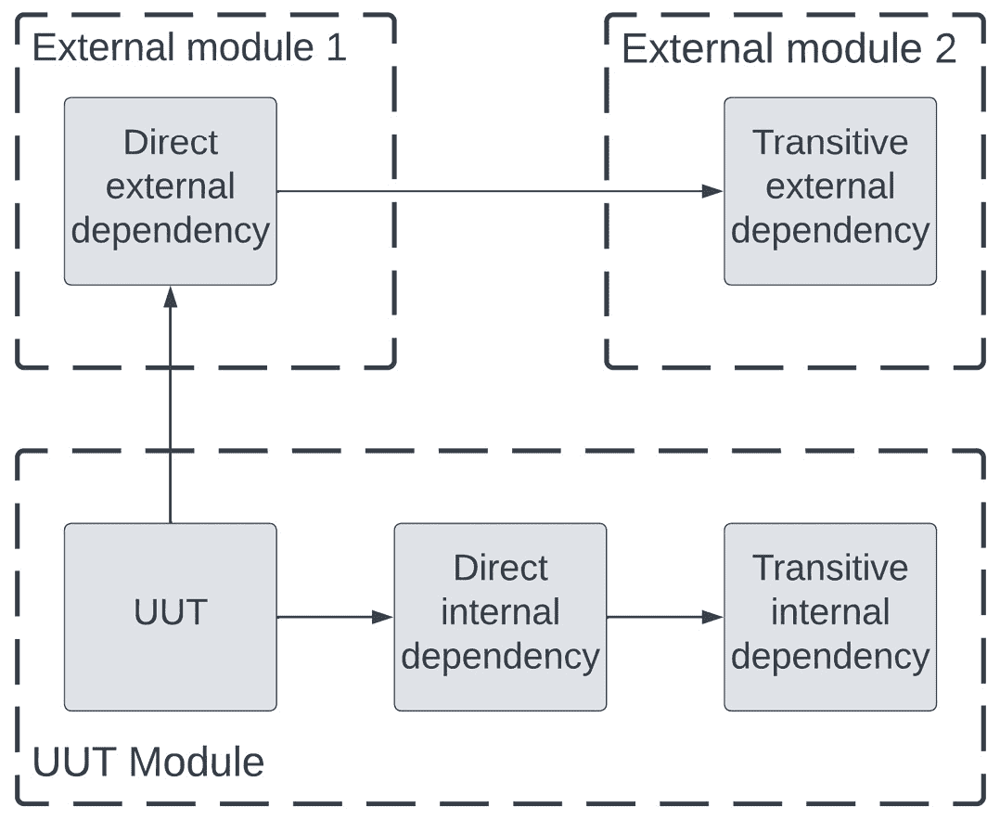
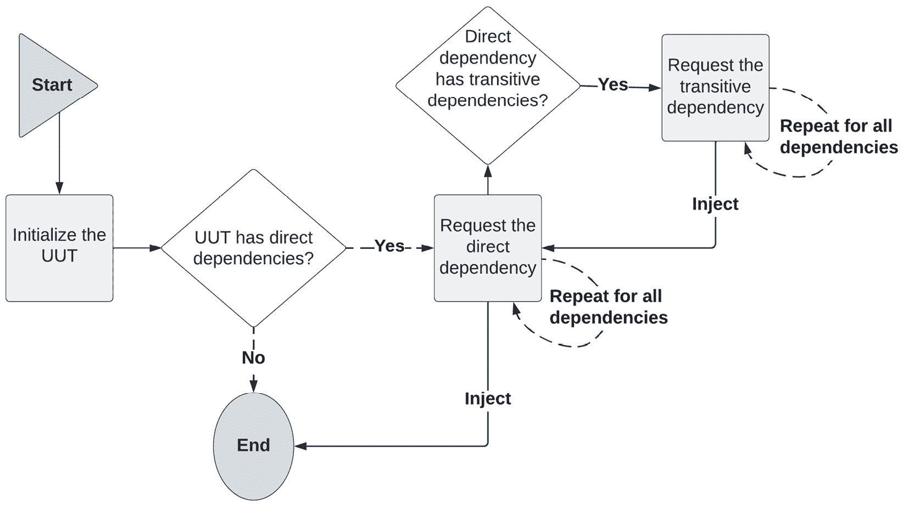
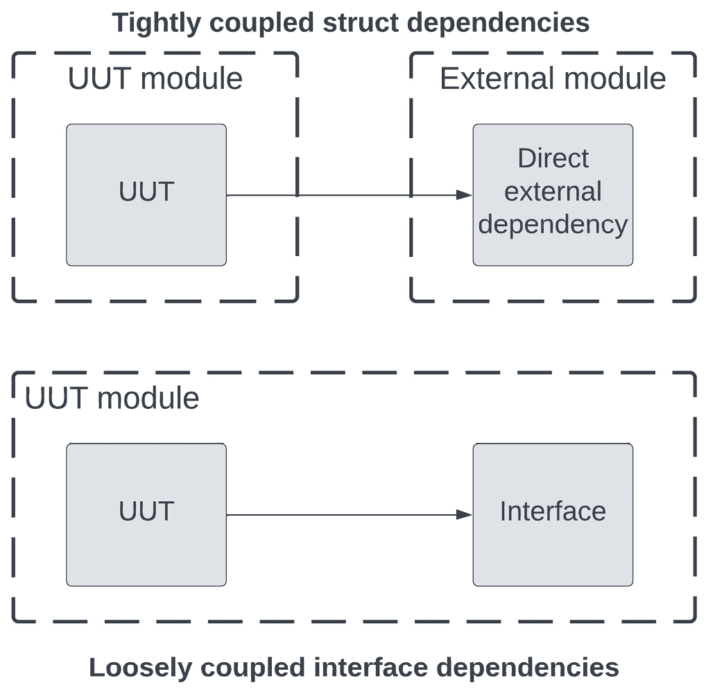
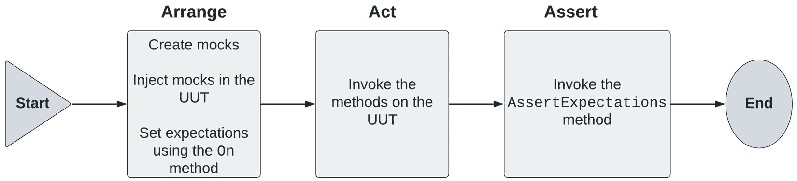
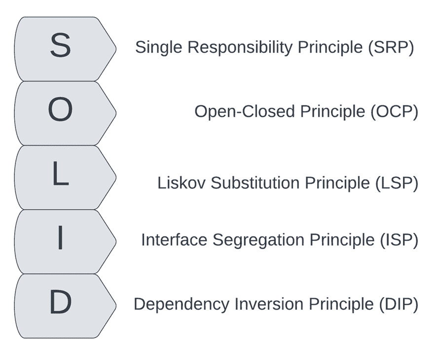

# 第三章：模拟和断言框架

在上一章中，我们探讨了在 Go 中编写测试的基础知识。我们探讨了包的重要性、测试文件与源代码的组织方式，以及如何使用 Go 的`testing`包编写测试和基准测试。

我们通过`计算器`用例的代码示例展示了编写 Go 测试的概念和基础知识。我们迄今为止看到的简单示例没有包含任何外部依赖项，这可能会使测试设置和验证变得更加复杂。

在本章中，我们将开始探讨如何将测试单元从其依赖项中隔离出来，使测试和断言尽可能简单和快速。在 Go 中实现这一点的最简单方法是通过利用接口的力量。

我们将通过向主组件引入依赖来扩展`计算器`示例。然后，我们将学习如何为这些**被测试单元**（**UUT**）的依赖项生成模拟，使我们能够控制它们的行为。

然后，我们将探索一些外部开源断言库，这些库通常被 Go 工程师使用。到目前为止，我们自己编写了一些简单的断言。这可能是重复的并且有限制的。`testify`和`ginkgo`断言库是两种流行的选择，可以用来补充 Go 的`testing`包。

最后，我们将从探索测试代码和机制转向查看编写可测试代码的设计技术，通过回顾面向对象设计的**SOLID**原则。我们将了解它们是什么以及如何在编写代码时应用它们。

在本章中，我们将涵盖以下主题：

+   使用接口封装依赖项

+   如何生成和使用模拟来隔离测试代码

+   流行断言框架的使用

+   **SOLID**设计原则是什么

+   编写可测试代码的最佳实践

# 技术要求

您需要安装**Go 版本 1.19**或更高版本才能运行本章中的代码示例。安装过程在官方 Go 文档[`go.dev/doc/install`](https://go.dev/doc/install)中描述。

本书包含的代码示例在[`github.com/PacktPublishing/Test-Driven-Development-in-Go/chapter03`](https://github.com/PacktPublishing/Test-Driven-Development-in-Go/chapter03)公开可用。

# 作为依赖项的接口

和往常一样，实施和探索单元测试技术从探索代码编写技术开始。这是我们将在整本书中经常看到的一个主题。我们不能孤立地研究测试。它需要了解代码设计和其预期目的的洞察。

在本节中，我们将探讨**软件依赖项**的概念以及如何管理它们。*图 3**.1*展示了三种主要的依赖类型：



图 3.1 – 从 UUT 的角度看依赖类型

从 UUT 的角度看，四种主要的依赖类型如下：

+   **直接内部依赖**：这些包含 UUT 导入的内部功能。这些依赖项可以定义在 UUT 相同的包或模块中，但需要提供其功能。

+   **传递内部依赖**：这些包含**直接内部依赖**部分的 UUT 导入的内部功能。这些依赖项也可以定义在相同的包或模块中。

+   **直接外部依赖**：这些包含 UUT 导入的第三方功能。这些可能是你可能会依赖的库或服务 API，但它们不包含在你的当前模块中。

+   **传递外部依赖**：这些包含你的**直接外部依赖**所依赖的外部功能，但位于单独的模块中。由于 Go 将源代码和所需库构建成可运行的可执行文件的方式，这些传递依赖也将与应用程序发布时的代码一起包含在内。

UUT 的依赖对于 UUT 能够正确提供其功能是必需的。因此，它们也是完全测试其功能所必需的。在本节和本章中，我们将探讨处理代码依赖的技术。

不要重新发明轮子

编写依赖于依赖的代码是软件设计中的正常且推荐的做法。它允许我们在多个地方重用行为和实现。结合 Go 强大的模块和包系统，这使得编写复杂代码变得既容易又快速。我们在*第二章* *单元测试基础*中探讨了 Go 的模块和包。

## 依赖注入

处理代码依赖的一种流行且常见的技术是**依赖注入**（**DI**）的概念。这是一个简单而有效的设计模式，用于创建松散耦合的代码，使我们能够实现代码，而不必担心其依赖。

DI 是一种编写代码的风格，其中 UUT 或函数在初始化期间接收它所依赖的其他类型或函数。从根本上讲，DI 不过是将正确的参数传递给一个函数，然后该函数使用这些参数来创建 UUT。

这种技术是 SOLID 设计原则之一，即字母*D*，代表**依赖反转**原则。我们将在本章的*编写可测试代码*部分探讨所有原则。

为什么叫注入？

术语*注入*仅仅表示依赖不是由需要它们的 UUT 创建的，而是从堆栈更高处传递给它的。它们可以通过构造函数/函数注入或使用框架来实现注入。

*图 3.2* 描述了依赖注入通常涉及的主要步骤：



图 3.2 – 依赖注入的主要步骤

我们可以看到以下调用序列：

1.  在开始时，我们首先尝试 `struct`。我们已经知道 Go 结构体不提供构造函数，因此初始化过程将涉及检查 UUT 所需的依赖项。我们将在下一节中看到如何使依赖项的需求显式化的技术。

1.  如果 UUT 有任何直接依赖项，那么我们将 `struct`，无论是来自同一模块还是另一个外部模块。

1.  当初始化直接依赖项时，我们可能会发现直接依赖项在初始化过程中需要的传递依赖项。然后我们将**请求****传递依赖项**。

1.  依赖项请求过程会重复对所有直接和传递依赖项进行。

1.  一旦每个依赖项都成功创建，它就会被注入到先前依赖项或 UUT 的创建中，如果它是直接依赖项。

依赖图

由于依赖项需要被创建，然后依次注入，这个过程被称为*构建依赖图*。这是一个有向无环图。这个图允许编译器从根开始，然后在构建主程序运行时所需的所有自定义类型时遍历它。

## 实现依赖注入

在介绍 DI 时，我们简要提到了结构体没有构造函数，因此这个过程可能需要调查 `struct` 的属性和字段。让我们看看我们如何在 Go 中实现 DI。

基本上，我们可以通过两种方式来处理依赖注入：

+   `struct`。这是一种构建实例的直观方式，但它确实要求在调用函数之前创建所有依赖项。

+   `struct` 然后根据需要设置依赖项的字段。这可以通过直接在 UUT 实例上设置字段或通过调用设置器方法来设置字段来实现。依赖项不是不可变的，因此它们不需要在设置时重新创建 UUT 实例。这种创建 UUT 及其依赖项的方式不需要在初始化和开始使用 UUT 之前创建所有依赖项，但它也不保证所有依赖项将在某个时间点设置，也不保证它们以后不会被更改。这可能会需要更多的应用程序代码来检查 `nil` 值，以及如果依赖项更改，可能会出现其他微妙的错误。

然后，每个方法都可以以两种方式使用：

+   **手动调用**：这意味着我们手动调用和创建 UUT 结构体及其依赖项。在这个过程中，你对依赖项的创建和调用有完全的控制权，但对于较大的代码库来说，它们可能难以管理。

+   **依赖注入框架**：这意味着你将另一个依赖项导入到你的项目中，可以使用反射或代码生成等高级技术来自动化此过程，然后利用依赖图以正确的顺序创建依赖项。这种方法对于大型代码库来说更加可持续。

当谈到依赖注入框架时，有两个流行的开源选择，你可以在代码中使用：

+   `dig`：这个工具使用反射来构建你的依赖图并成功构建你的实例。你可以在[`github.com/uber-go/dig`](https://github.com/uber-go/dig)上阅读有关如何使用它的信息。

+   `wire`：这个工具使用反射和代码生成来实现依赖注入。你可以在[`github.com/google/wire`](https://github.com/google/wire)上阅读有关如何使用它的信息。

降低复杂性

记住，Go 代码和软件设计的核心原则之一是简单性。你应该尽可能保持你的代码简单，避免在其他遗留语言中看到的冗长构造函数。

当谈到依赖项时，它们通常使用相应的接口类型来表示。这是 Go 特有的方法，无论你选择如何注入依赖项。让我们更仔细地看看它们在软件设计中的作用。

**接口**是零个或多个方法的命名集合。以下是它们行为的一些关键要点：

+   在 Go 中，我们实现多态的主要方式是使用接口。

+   编译器强制执行这些规则，并且隐式地将`struct`转换为相应的接口。

+   要实现一个接口，一个`struct`需要实现其定义的方法。

+   一个`struct`可以实现多个接口，只要它满足其方法签名。

+   拥有零个方法的接口是空接口，其类型是`interface` `{}`。这在某些情况下很有用，但你创建的接口将有一个或多个方法。

+   接口的零值是`nil`。在我们开始使用接口来包装依赖项时，我们需要在代码中处理这个问题。

接口定义的是方法，而不是函数

记住，接口定义的是方法，而不是函数。正如我们在`Engine`定义中看到的，与接口签名相对应的方法需要在我们要使用的`struct`上定义。

让我们看看一个依赖注入的例子；这个例子可以在`chapter03/di/manual/calculator.go`中找到。我们可以定义一个简单的`Adder`接口，如下所示：

```go
type Adder interface {
  Add(x, y float64) float64
}
```

`Adder`接口定义了`Add`方法。请注意，这个方法接受两个`float64`参数并返回一个`float64`返回值。在我们的例子中，`Engine`将满足这个接口，因为它实现了这个方法：

```go
func (e Engine) Add(x, y float64) float64 {
  return x + y
}
```

当我们初始化`Engine`时，我们可以返回`Engine`结构体：

```go
func NewEngine() *Engine {
  return &Engine{}
}
```

一个简单的`Calculator`随后使用这个`Engine`来实现其加法功能并打印出结果：

```go
type Calculator struct {
  Adder Adder
}
func NewCalculator(a Adder) *Calculator {
  return &Calculator{Adder: a}
}
func (c Calculator) PrintAdd(x, y float64) {
  fmt.Println("Result:", c.Adder.Add(x, y))
}
```

`Engine` 是 `Calculator` 的依赖，因此它是 `NewCalculator` 函数的参数。`Adder` 在 `PrintAdd` 方法中被调用，那里需要它的功能。因此，`Calculator` 的初始化过程需要一个 `Engine` 实例来编译：

```go
 func main() {
  engine := NewEngine()
  calc := NewCalculator(engine)
  calc.PrintAdd(2.5, 6.3)
}
```

本例使用 DI 的*手动调用*。随着依赖图的大小和复杂性的增长，这个初始化函数将变得越来越繁琐，并需要做出改变。这就是 DI 框架可以帮助简化我们的代码的地方。

使用之前引入的 `wire` 框架，我们可以在 `/chapter03/di/wire/wire.go` 文件中定义一个 `InitCalc` 函数，它将负责使用 `Engine` 初始化 `Calculator`：

```go
//go:build wireinject
package main
import "github.com/google/wire"
var Set = wire.NewSet(NewEngine, wire.Bind(new(Adder), new(*Engine)), NewCalculator)
func InitCalc() *Calculator {
  wire.Build(Set)
  return nil
}
```

此 `wire.Build` 函数接受一个 `Set`，将 `Adder` 接口与 `Engine` 结构体匹配。在文件顶部，我们使用构建标签排除此文件，并在运行我们的应用程序时使用生成的替换文件。

接下来，我们必须安装 wire 工具并在正确的目录下运行它：

```go
$ go install github.com/google/wire/cmd/wire@latest
$ cd chapter03/di/wire && wire
wire: github.com/PacktPublishing/Test-Driven-Development-in-Go/chapter03/di/wire: wrote /Users/adelinasimion/code/Test-Driven-Development-in-Go/chapter03/di/wire/wire_gen.go
```

此命令生成 `wire_gen.go` 文件，其中包含 `InitCalc` 函数的实现：

```go
func InitCalc() *Calculator {
  adder := NewEngine()
  calculator := NewCalculator(adder)
  return calculator
}
```

此函数包含我们之前手动编写的依赖创建代码。由于现在由 wire 维护和生成，因此不需要手动维护，主函数现在更简单：

```go
func main() {
  calc := InitCalc()
  calc.PrintAdd(2.5, 6.3)
}
```

最后，我们可以构建应用程序，生成初始化函数并将其绑定到 Go 可执行文件中。然后，我们可以像往常一样运行可执行文件：

```go
$ go build./chapter03/di/wire
$ ./wire
Result: 8.8
```

DI 框架简化了我们编写的代码和维护工作，但确实需要在构建过程中添加新步骤，以及在使用它们时增加额外的认知负担。在本节中，我们探讨了 `wire` DI 库的工作原理，但我们将继续使用手动注入，以便我们能够更好地控制代码并共同探索。

## 用例 - 计算器的继续实现

在本节中，我们将利用迄今为止所学的技术来扩展 *第二章* 中计算器实现的实现，*单元测试基础*。

除去 `input.Parser` 结构体的正确使用方法：

```go
type Parser struct {
engine    *calculator.Engine
  validator *Validator
}
// ProcessExpression parses an expression and sends it to
// the calculator
func (p *Parser) ProcessExpression(expr string) (*string, error) {
  operation, err := p.getOperation(expr)
  if err != nil {
    return nil, format.Error(expr, err)
  }
  return p.engine.ProcessOperation(*operation)
}
```

如我们从 *第二章* 中了解到的，*单元测试基础*，我们首先看到了这个例子，`Parser` 依赖于 `Validator` 和 `calculator.Engine`。这两个结构体是 `Parser` 的直接依赖。然后，这些依赖被用来实现 `ProcessExpression` 方法的功能。

无论我们使用第三方 DI 框架还是手动创建相应的结构体，为这个相对简单的代码片段编写测试都涉及：

+   初始化 `Parser` 结构体及其所有直接和间接依赖。这可能涉及一个漫长的设置过程，可能包含外部依赖，这可能会扩展测试的范围。

+   一旦创建了这些主要构建块，我们需要设置它们的先决状态。这可能涉及一个更复杂的设置，也可能会有意想不到的后果。

+   在验证方面，我们可能需要断言依赖项的内部状态以确保它们按预期行为。这种对依赖项内部状态的依赖会使测试更加脆弱，因为依赖项的变化会破坏测试。

现在我们已经了解了如何构建需要直接依赖项的代码，我们将开始探索可以帮助我们在测试中测试这些依赖项的机制。我们将利用 Go 开发工具使测试和断言更容易。

控制测试范围

当涉及到具有许多依赖项的类型时，测试设置和断言的范围可能会超出 UUT。我们需要一种机制，使我们能够在隔离的情况下测试 UUT，这也有利于保持测试范围小。

# 探索模拟

在本节中，我们将探讨一种允许我们测试依赖于依赖项的代码的机制。我们将了解如何使用和生成模拟，从而允许我们在隔离其依赖项的行为的情况下验证 UUT。

**模拟**有时也被称为**测试替身**，这是一个简单但强大的概念。它们满足接口，但却是真实实现的假版本。我们对这些假实现有完全的控制权，这给了我们控制它们行为的自由。然而，如果真实实现发生变化而我们的模拟没有变化，那么我们的测试将给我们带来错误的信心。

在 Go 中，我们有以下不同的模拟选项：

+   **函数替换**：这意味着向 UUT 发送替换的假函数。在 Go 中，这很容易做到，因为 Go 有对**高阶函数**的原生支持。我们可以覆盖函数变量和参数，替换 UUT 的行为。

+   **接口替换**：这意味着注入依赖于 UUT 的接口的假版本。这些是满足真实实现接口的假桩实现。然后，它们可以用来替换完整的实现，而 UUT 甚至不会意识到这一点。

高阶函数复习

高阶函数是一个函数，它要么接受另一个函数作为参数，要么返回一个函数。Go 函数就像任何其他类型一样。

函数替换的使用不如接口替换普遍，应该谨慎使用，因为它可以使代码的可读性降低。

现在，让我们改变我们的代码，以便能够利用**接口替换**。首先，我们将定义我们将要调用的两个接口：

```go
// OperationProcessor is the interface for processing
// mathematical expressions
type OperationProcessor interface {
  ProcessOperation(operation *calculator.Operation) (*string, error)
}
// ValidationHelper is the interface for input validation
type ValidationHelper interface {
  CheckInput(operator string, operands []float64) error
}
```

以下要点描述了前面的代码：

+   我们首先定义外部功能接口，我们希望在 UUT 中利用这些功能。在我们的情况下，UUT 是`input.Parser`，我们需要两个依赖项：

    +   `OperationProcessor`接口围绕`ProcessOperation`方法。此功能将由`calculator.Engine`实现，并计算解析运算符和操作数的数学结果。

    +   `ValidationHelper`接口围绕`CheckInput`方法。此功能将由`input.Validator`实现，并确保用户提供的输入可以被处理。

导出的依赖接口

注意，围绕依赖关系的接口已被导出，正如它们的首字母大写名称所示。将接口导出并将相应的结构体保留在包作用域内是一种常见的做法。这使我们能够对当前包之外暴露的功能进行精细控制。

然后，我们将`input.Parser`类型的依赖关系用新定义的接口包装起来：

```go
// Parser is responsible for converting input to
// mathematical operations
type Parser struct {
  engine    OperationProcessor
  validator ValidationHelper
}
```

如我们在上一节中讨论的，*作为依赖的接口*，Go 依赖通常表示为接口，而不是结构体类型。这允许我们注入任何满足给定接口的类型，而不仅仅是具体的`struct`。这是一个非常强大的机制。

使用接口表示依赖的另一个重大优势是，它们允许我们打破包之间的依赖关系，编写**松散耦合**的代码。

*图 3.3* 展示了我们可以如何打破硬依赖：



图 3.3 – 使用接口创建松散耦合的代码

如我们所见，通过使用内部定义的接口来表示依赖关系，我们可以打破模块之间的硬依赖。满足此接口的底层外部`struct`可以在包外部创建并注入到 UUT 中，而不会引入硬依赖。

此外，由于结构体可以满足多个接口，它们还为我们提供了灵活性，以减少我们希望在 UUT 内部访问的操作范围。这对于处理大型 SDK 或复杂的外部 API 尤其有用，我们可能不想定义或模拟所有函数。

## 模拟框架

现在我们已经重构了代码，利用接口的力量创建松散耦合的代码，让我们看看我们如何在测试期间利用它们的威力。

当涉及到创建模拟时，两个流行的模拟框架允许我们轻松生成和断言模拟：

+   `golang/mock` 是一个开源框架，它最初于 2011 年 3 月发布。您可以在[`github.com/golang/mock`](https://github.com/golang/mock)上了解所有相关信息。它由一个模拟包和一个代码生成工具`mockgen`组成。

+   `testify/mock`是一个开源框架，于 2012 年 10 月发布。您可以在[`github.com/stretchr/testify/#mock-package`](https://github.com/stretchr/testify/#mock-package)上阅读所有相关信息。就像`golang/mock`一样，它由一个模拟包和一个代码生成工具`mockery`组成。

这两个框架提供了很多类似的功能，因此选择其中一个可能看起来有点随意。在撰写本文时，`testify/mock`包已被超过 13,000 个包导入（见[`pkg.go.dev/github.com/stretchr/testify/mock?tab=importedby`](https://pkg.go.dev/github.com/stretchr/testify/mock?tab=importedby)），而`golang/mock`包已被超过 12,000 个包导入（见[`pkg.go.dev/github.com/golang/mock/gomock?tab=importedby`](https://pkg.go.dev/github.com/golang/mock/gomock?tab=importedby)）。这进一步强调了它们是 Go 开发者非常流行的两个框架。

如我们在下一节“与断言框架一起工作”中将要看到的，`testify`还提供了一个非常强大且流行的断言框架。因此，我们将使用`testify/mock`作为本书中的模拟解决方案。

要使用此框架，您需要通过运行以下命令安装其两个主要组件，这些命令在撰写本文时是正确的：

```go
$ go get github.com/stretchr/testify
$ go install github.com/vektra/mockery/v2@latest
```

这两个命令将为我们设置后续使用的框架。请确保运行这两个命令，以便能够跟随本书中提供的代码示例。虽然我们将使用此框架进行模拟，但讨论的概念也适用于`golang/mock`。

## 生成模拟

到目前为止，我们已经准备好了依赖项，选择了一个模拟框架，然后安装了它。现在，让我们学习如何使用它。我们之前提到`testify`提供了一个用于创建模拟的代码生成工具。这个工具使得生成样板模拟代码变得容易，这样我们就不需要手动创建和维护它。

在`testify`中进行模拟生成不需要任何特殊的注解。可以为接口和函数生成模拟，这使得它们既适用于**函数替换**也适用于**接口替换**。

`mockery`命令支持各种标志。以下是一些您可能会看到的常见标志：

+   `--dir string`标志指定了查找要模拟的接口的目录。

+   `--all`标志指定在所有子目录中搜索并生成模拟。

+   `--name string`标志指定在搜索要生成模拟的接口时匹配的名称或正则表达式。

+   `--output string`标志指定了放置生成的模拟的目录。默认情况下，这被配置为`/mocks`。

您可以通过使用`mockery –help`来查看此命令的所有其他选项。

我们现在可以使用以下命令为我们的接口生成模拟：

```go
$ mockery --dir "chapter03" --output "chapter03/mocks" --all
```

此命令在`chapter03`目录及其所有子目录中查找所有接口，并将生成的文件放置在`chapter03/mocks`目录中。此命令的输出应如下所示：

```go
11 Sep 22 17:38 BST INF Starting mockery dry-run=false version=v2.14.0
11 Sep 22 17:38 BST INF Walking dry-run=false version=v2.14.0
11 Sep 22 17:38 BST INF Generating mock dry-run=false interface=OperationProcessor qualified-name=github.com/PacktPublishing/Test-Driven-Development-in-Go/chapter03/input version=v2.14.0
11 Sep 22 17:38 BST INF Generating mock dry-run=false interface=ValidationHelper qualified-name=github.com/PacktPublishing/Test-Driven-Development-in-Go/chapter03/input version=v2.14.0
```

从输出中我们可以看到，我们的两个接口，`OperationProcessor` 和 `ValidationHelper`，已经被检测到，并且为它们生成了模拟。生成的文件将包含满足定义的接口的结构体：

```go
// OperationProcessor is an autogenerated mock type for the
// OperationProcessor type
  type OperationProcessor struct {
  mock.Mock
}
// ProcessOperation provides a mock function with given
// fields: operation
func (_m *OperationProcessor) ProcessOperation(operation calculator.Operation) (*string, error) {
  ret :=_m.Called(operation)
// implementation code
}
```

生成的结构体还包含一个嵌套的`mock.Mock`类型的结构体。这提供了对模拟活动进行断言的功能。当验证模拟时，这种功能很重要，我们将在下一部分探讨。

重新生成模拟

对于工程团队来说，将模拟生成添加到他们的 Docker 文件规范中是很常见的。这将允许模拟作为 CI/CD 管道的一部分生成，并在构建过程中使用。

## 验证模拟

我们现在可以开始编写针对`Parser`结构体的测试了，它使用了我们创建的生成的模拟。*图 3**.4*展示了我们编写测试时遵循的步骤：



图 3.4 – 使用模拟编写测试

使用生成的模拟，我们的测试将大致按照以下步骤进行：

1.  **创建模拟**：我们在测试的**安排**步骤中创建模拟结构体。模拟将与任何传递依赖项分离，因此将很容易初始化。在这个时候，我们应该有与 UUT 的直接依赖项一样多的模拟。

1.  **在 UUT 中注入模拟**：我们在测试的**安排**步骤中创建 UUT 时注入模拟。由于模拟满足真实依赖项的接口，UUT 不会意识到它是在接收真实依赖项还是模拟。

1.  在模拟上设置任何期望的模拟行为。我们还设置任何预期的参数调用和返回值。这完成了测试的**安排**步骤。

1.  **在 UUT 上调用方法**：我们像平常一样编写测试的**行动**部分。UUT 在操作过程中不会意识到它将使用模拟，因此任何方法调用都将按正常方式执行。

1.  在所有模拟上调用`AssertExpectations`方法以确保所有之前声明的期望都得到了验证。

模拟的使用非常简单，并且与`testing`库很好地集成。让我们看看对`Parser`类型的简单测试：

```go
func TestProcessExpression(t *testing.T) {
  t.Run("valid input", func(t *testing.T) {
    // Arrange
    expr := "2 + 3"
    operator := "+"
    operands := []float64{2.0, 3.0}
    expectedResult := "2 + 3 = 5.5"
    engine := mocks.NewOperationProcessor(t)
    validator := mocks.NewValidationHelper(t)
    parser := input.NewParser(engine, validator)
    validator.On("CheckInput", operator,
      operands).Return(nil).Once()
    engine.On("ProcessOperation", &calculator.Operation{
      Expression: expr,
      Operator: operator,
      Operands: operands,
}).Return(expectedResult).Once()
  // Act
  result,err := parser.ProcessExpression(expr)
  // Assert
  // other assertions
  validator.AssertExpectations(t)
  engine.AssertExpectations(t)
  })
}
```

简单的`TestProcessExpression`突出了在测试编写中模拟的使用。`On`方法的使用使我们能够轻松地为所有模拟的直接依赖项配置预期行为。

如演示所示，`On`方法可以用来指定详细的期望。以下是一些你经常会遇到的：

+   `On` 方法本身。`On` 方法的第一个参数是要模拟的函数的名称。

+   `On` 方法。参数可以是特定值，或者我们可以使用 `mock.AnythingOfType` 函数来断言它们的类型。如果我们不关心对给定参数进行任何验证，也可以使用 `mock.Anything`，但应该谨慎使用，因为测试背后的意图可能难以在以后理解。

+   `Return` 方法，在 `On` 方法之后调用。如果指定的方法使用配置的函数参数被调用，它允许你返回特定值。

+   `On` 方法。有 `Once` 和 `Twice` 的简写方法；否则，可以使用 `Times` 方法来指定自定义调用次数。`Unset` 方法可以用来指定模拟处理程序不应该被调用。

验证期望

如果你想断言你的模拟根据 `On` 方法中设定的期望被调用，请记得在每个模拟上调用 `AssertExpectations` 方法。这让你能够对 UUT 如何与其依赖项交互有细粒度的控制。

考虑你需要编写多少代码来设置符合预条件的自定义类型，然后根据期望验证依赖项是否已被调用。`testify/mock` 库使我们能够以统一的方式在我们的所有项目中利用模拟的强大功能。

# 与断言框架一起工作

虽然 `testify/mock` 功能对于创建模拟很有用，但 `testify` 最出名的是其断言框架。在本节中，我们将探讨一些常见的断言框架以及我们如何使用它们来进一步精简和扩展我们的测试。

到目前为止，我们一直在使用 `if` 语句编写我们的验证，并在 `testing.T` 参数上调用正确的失败方法：

```go
// Assert
if err != nil {
  t.Fatal(err)
}
```

这种方法很简单，但确实有以下缺点：

+   **重复**：一个长或复杂的测试最终会做出多个断言。然后我们不得不多次重复这个错误断言块，使得测试变得冗长。

+   **难以做出高级断言**：我们希望在测试的其余部分对我们在模拟上进行的验证拥有相同的细粒度控制。

+   `JUnit` 是一个例子。

虽然 Go 标准库没有提供断言功能，但两个流行的断言框架提供了这个功能：

+   `testify` 是一个开源断言框架，它提供了一个易于使用且功能强大的断言包。`assert` 包提供了这个功能。你可以在 [`github.com/stretchr/testify#assert-package`](https://github.com/stretchr/testify#assert-package) 上了解它。

+   `ginkgo` 是一个开源断言框架，它提供了行为驱动开发（**BDD**）风格的测试[编写和断言]。你可以在 [`github.com/onsi/ginkgo`](https://github.com/onsi/ginkgo) 上了解它。采用这种测试风格允许开发者编写读起来像自然语言的测试。

我们将在 *第五章*，*执行集成测试* 中讨论 BDD 风格的测试。因此，我们将把编写此类测试的讨论留到那时。我们将继续使用 `testify` 框架进行当前的探索。

## 使用 testify

`assert` 包提供了许多用于创建细粒度断言的有用函数。以下是一些你经常会遇到的：

+   `assert.Equal` 函数允许你检查两个对象是否相等。如果检查的类型是基于指针的，将对引用值进行值检查。其相反函数，`assert.NotEqual`，也存在：

    ```go
    assert.Equal(t, expected, actual)
    ```

    ```go
    assert.NotEqual(t, expected, actual)
    ```

+   `assert.Equal` 函数不应用于空值。相反，应该使用 `assert.Nil` 方法。其相反函数，`assert.NotNil`，也存在：

    ```go
    assert.Nil(t, actual)
    ```

    ```go
    assert.NotNil(t, actual)
    ```

+   `assert.Contains` 函数验证指定值是否包含在字符串、列表或映射中。其相反函数，`assert.NotContains`，也存在：

    ```go
    assert.Contains(t, collection, element)
    ```

    ```go
    assert.NotContains(t, collection, element)
    ```

+   `assert.Subset` 函数验证指定子集中的所有值是否包含在指定的列表中。其相反函数，`assert.NotSubset`，也存在：

    ```go
    assert.Subset(t, list, subset)
    ```

    ```go
    assert.NotSubset(t, list, subset)
    ```

`testify/require` 包也提供了相同的断言，但如果断言失败，将终止测试。在这种情况下，应使用此包。

例如，我们可以用以下单行代码替换我们之前的 `if` 语句，该语句调用 `t.Fatal`：

```go
require.Nil(t, err)
```

扩展测试包

你应该使用断言框架来补充 `testing` 包的简单性。当你开始编写更多的 Go 代码时，你应该熟悉断言框架的功能，并开始在测试中使用它们。

## 断言错误

讨论断言时需要覆盖的最后一个方面是如何验证错误。有时，我们不仅想验证错误发生，还想验证返回了正确的错误消息。你应该确保在适当的时候，你的测试验证此类错误消息。

`assert.EqualError` 函数验证返回的错误不是 `nil`，并且其消息与提供的字符串相等。这将使验证错误消息变得容易。与迄今为止我们看到的所有函数一样，`require` 包也提供了此功能。

让我们看看一个验证错误场景的例子：

```go
t.Run("invalid operation", func(t *testing.T) {
  // Arrange
  expr := "2 % 3"
  operator := "%"
  operands := []float64{2.0, 3.0}
  expectedErrMsg := "bad operator"
  engine := mocks.NewOperationProcessor(t)
  validator := mocks.NewValidationHelper(t)
  parser := input.NewParser(engine, validator)
validator.On("CheckInput", operator, operands).
    Return(fmt.Errorf(expectedErrMsg)).Once()
  // Act
  result, err := parser.ProcessExpression(expr)
  // Assert
  require.NotNil(t, err)
  require.Nil(t, result)
  assert.Contains(t, err.Error(), expr)
  assert.Contains(t, err.Error(), expectedErrMsg)
  validator.AssertExpectations(t)
  })
```

测试创建了一个名为 `expectedErrMsg` 的变量，它代表模拟将返回的错误消息。然后，将此消息传递给 `assert.Contains` 函数，该函数将对其进行验证，以与在 UUT 上调用的 `ProcessExpression` 方法返回的错误进行比较。

自定义错误类型

你也可以创建自己的自定义错误类型，而不是仅仅依赖于 Go 的内置 `error` 类型。这将为你提供错误检查的类型安全性，而不是依赖于可能会改变并使你的测试变得脆弱的错误消息。

模拟和断言框架是我们用来轻松编写测试的工具。然而，即使是最熟练的测试编写者也会发现测试设计糟糕的代码很困难。TDD 的迭代性质与良好的软件设计原则相结合，将导致可测试、可维护的代码。

# 编写可测试的代码

在本章中，我们将讨论的最后一个方面是如何使用 **SOLID** 软件设计原则来编写可测试的代码。正如我们已经多次看到的，设计良好的代码也是易于测试的代码。难以测试的应用程序代码通常是应用程序难以更改和维护的迹象。

这五个强大的原则是在 Robert C. Martin 2000 年发表的一篇论文中提出的，后来发表在他的书 *敏捷软件开发：原则、模式和实践* 中。这些原则帮助敏捷团队交付可维护、易于重构的代码。

*图 3*.5 总结了 SOLID 设计原则：



图 3.5 – SOLID 设计原则

让我们回顾一下 SOLID 原则及其对测试写作的意义：

1.  **单一职责原则**（**SRP**）：为此，实体应该只有一个职责和一个变更的理由。这个原则将使测试代码保持简单，因为类提供的功能范围较小。然后我们可以集中精力覆盖边缘情况，而不是覆盖大量方法。

1.  **开放封闭原则**（**OCP**）：为此，实体应该对扩展开放，但对修改封闭。这个原则意味着确保代码更改扩展但不破坏现有行为。设计上向后兼容的代码将不需要进行大量的测试更改。相反，新的/扩展的功能可以通过新的测试用例来覆盖，从而确保测试套件保持稳定。

1.  **里氏替换原则**（**LSP**）：为此，每个子类或派生类都应该满足其父类或基类的行为。由于 Go 没有继承，你可能会倾向于得出结论，它不适用。然而，我们使用接口来实现多态，因此我们可以用它们设置的合约来表述这个原则。维护可替换接口的代码将很容易测试，因为它将再次不需要对现有套件进行许多测试更改。

1.  **接口隔离原则**（**ISP**）：为此，客户端代码不应被迫实现它不使用的方法或接口。这个原则鼓励使用小型接口，这些接口只围绕单一职责进行包装。接口应该在客户端/调用代码的一侧定义，它应该只为它感兴趣使用的功能定义接口方法。小型接口导致小型模拟，进而导致简单的测试设置和断言。

1.  **依赖倒置原则**（**DIP**）：为此，实体应该依赖于抽象，而不是具体实现。这个原则鼓励使用接口来表示依赖。我们在本章的 *依赖注入* 部分讨论了这一原则。我们看到了使用这种技术与接口的力量相结合将产生松散耦合的代码，这使得测试更容易，因为需要设置的包外依赖更少。

正如我们所见，接口是实现 Go 中 SOLID 原则的关键。它们应该被用来编写易于维护和重构的代码。由于重构是 TDD 实践的核心部分，易于重构的代码也将是易于测试的代码。

SOLID 实体

记住，在 Go 中，实体应该是包，而不是结构体。包提供它们自己的 API，这些 API 建立了自己的契约和接口。在设计你的包 API 时，请牢记 SOLID 原则。

# 摘要

在本章中，我们通过学习如何处理代码依赖来扩展了单元测试的基础知识。我们首先介绍了依赖注入并探讨了在 Go 中如何实现的不同方法。你学习了如何使用模拟来对测试运行的前置条件进行精细控制，以及如何使用 `testify/mock` 框架生成它们。然后，我们探讨了不同的断言框架以及如何使用它们来简化我们的测试。最后，我们讨论了 SOLID 原则，这将帮助我们编写可测试的代码。

在 *第四章* *构建高效的测试套件* 中，我们将开始将我们的测试视为一个集合，确保它们相互补充并覆盖边缘情况。我们还将探索流行的 Go 技术 **表格驱动测试**。

# 问题

回答以下问题以测试你对本章知识点的掌握：

1.  通过实现和测试剩余的操作来继续现有的简单计算器的实现：

    +   减法

    +   乘法

    +   除法

1.  确保你使用我们迄今为止所使用过的所有技术来生成经过良好测试的代码。

# 进一步阅读

要了解更多关于本章所涉及主题的信息，请查看以下资源：

+   《*整洁架构：软件结构与设计的工匠指南*》，罗伯特·C·马丁，由 Addison-Wesley 出版

+   《*设计模式：可重用面向对象软件的元素*》，埃里希·伽玛等，由 Addison Wesley 出版

+   《*使用 Go Cloud 的 Wire 进行编译时依赖注入*》，*Go 博客*，可在 [`go.dev/blog/wire`](https://go.dev/blog/wire) 获取
